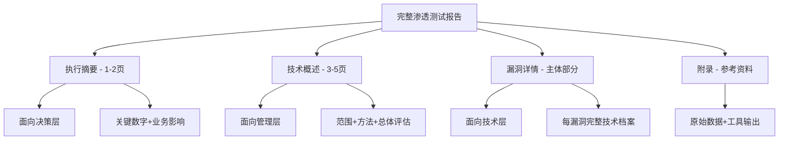
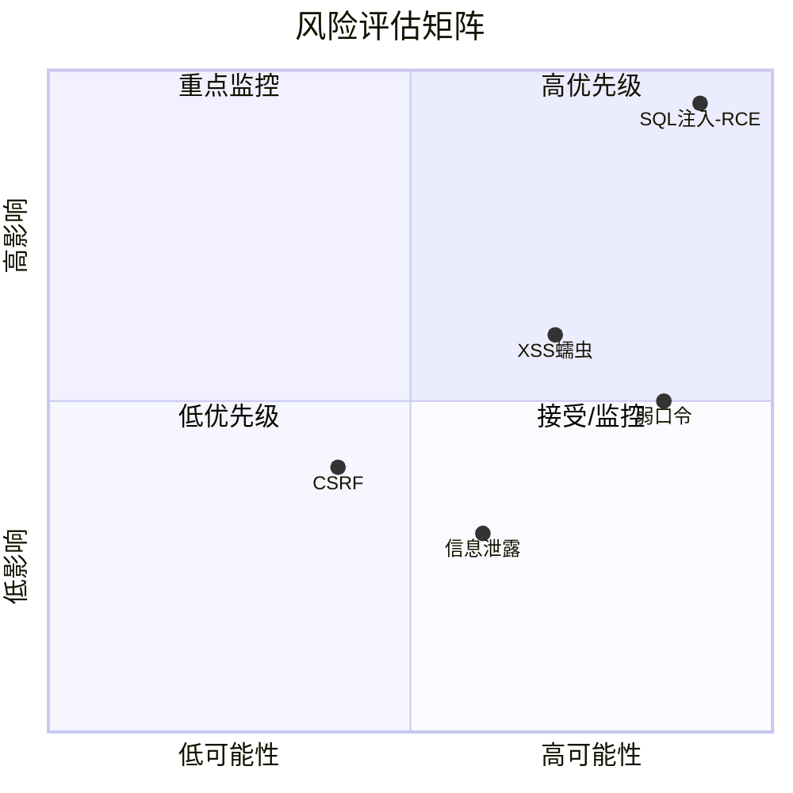
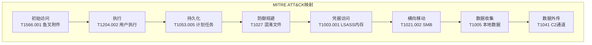

## 2.5 报告撰写

渗透测试的终极交付物不是一台被攻破的服务器，而是一份能让组织真正改善安全状况的报告。技术再强，如果无法清晰传达发现、量化风险、指导修复，整个测试的价值将大打折扣。一份优秀的渗透测试报告，是技术能力与沟通能力的交汇点，也是专业渗透测试人员与业余爱好者的分水岭。

### 2.5.1 报告的战略定位与受众分析

#### 为什么报告是渗透测试最重要的产出

渗透测试报告承载着三重使命：

1. **证据固化**：将动态的攻击过程转化为可审计、可复现的书面证据。口头汇报容易遗漏细节，截图容易丢失上下文，只有结构化的报告才能完整记录测试全过程。
2. **风险传达**：将技术层面的漏洞发现翻译为业务层面的风险语言。管理层不需要知道CVE编号的技术细节，但需要理解"这可能导致多少客户数据泄露"。
3. **修复驱动**：报告的最终目的是推动修复。如果报告不能给出可执行的修复方案和优先级排序，发现再多漏洞也无济于事。

#### 受众分层与内容适配

一份报告通常需要同时服务三类受众，因此必须采用分层结构：

| 受众层级 | 角色示例 | 关注点 | 内容策略 |
|---------|---------|--------|---------|
| **决策层** | CEO、CISO、董事会 | 业务影响、合规风险、投资回报 | 执行摘要，非技术语言，量化风险 |
| **管理层** | 安全经理、IT总监 | 修复优先级、资源分配、时间表 | 风险矩阵，按业务域分类的漏洞清单 |
| **技术层** | 开发工程师、运维团队 | 技术细节、复现步骤、修复方案 | 完整漏洞详情，PoC代码，配置建议 |

这三层之间的信息流是自上而下递进的：决策层看摘要做决策，管理层看概览做计划，技术层看细节做修复。报告的结构设计必须支撑这种阅读模式。



### 2.5.2 报告的完整结构框架

以下是经过行业验证的渗透测试报告标准结构，遵循 PTES（Penetration Testing Execution Standard）和 OWASP Testing Guide 的框架：

#### 一、封面与文档信息

封面不仅是形式要求，更是文档管控的起点：

```text
┌─────────────────────────────────────────┐
│         渗透测试评估报告                  │
│                                         │
│  项目名称：[客户名称] 安全评估           │
│  报告版本：v1.0                         │
│  测试日期：2026-06-01 至 2026-06-15     │
│  报告日期：2026-06-20                   │
│  密级：机密（CONFIDENTIAL）              │
│  测试团队：[公司名称]                    │
│  客户联系人：[姓名/职务]                 │
│  报告编制：[测试人员]                    │
│  报告审核：[项目负责人]                  │
└─────────────────────────────────────────┘
```

关键文档信息还应包括：
- **文档变更记录**：版本号、日期、修改人、修改内容
- **分发清单**：授权接收报告的人员名单及其副本编号
- **免责声明**：测试范围限制、不保证100%覆盖率、报告使用限制

#### 二、执行摘要（Executive Summary）

执行摘要通常只有1-2页，是决策层唯一会阅读的部分。它必须在最短篇幅内传达最关键的信息。

**核心要素：**

**项目背景**：用一两句话说明测试的目的。例如：

> 应[客户名称]委托，[测试公司]于2026年6月1日至6月15日对其面向互联网的Web应用系统进行渗透测试评估，以识别潜在的安全风险并验证现有安全防护措施的有效性。

**测试范围**：明确测试了什么，更关键的是——没有测试什么。

> 本次测试范围包括：
> - 目标Web应用：https://app.example.com（含子域名api.example.com）
> - 测试IP段：203.0.113.0/24
> - 测试账户：提供3个不同权限级别的测试账号
>
> 以下内容不在本次测试范围内：
> - 社会工程学攻击
> - 物理安全测试
> - 拒绝服务攻击（DoS/DDoS）
> - 生产数据库（仅测试环境）

**关键发现摘要**：用数据说话，通常配合风险统计表：

| 风险等级 | 数量 | 占比 |
|---------|------|------|
| 严重（Critical） | 2 | 8% |
| 高危（High） | 5 | 20% |
| 中危（Medium） | 10 | 40% |
| 低危（Low） | 6 | 24% |
| 信息（Informational） | 2 | 8% |
| **合计** | **25** | **100%** |

**总体风险评估**：用一句话给出整体评级，避免技术术语：

> 本次评估发现目标系统存在2个严重漏洞和5个高危漏洞，其中包括可导致大规模数据泄露的SQL注入漏洞和可获取服务器控制权的远程代码执行漏洞。总体安全风险评级为**高风险**，建议立即启动应急修复流程。

**关键业务影响**：将技术漏洞翻译为业务后果：

> 若上述严重漏洞被恶意利用，可能导致：
> - 超过50万用户的个人信息（姓名、手机号、邮箱）被泄露
> - 支付交易数据被窃取，违反PCI DSS合规要求
> - 服务器被完全控制，成为进一步内网攻击的跳板
> - 预估直接经济损失：人民币200-500万元（不含监管罚款和声誉损失）

#### 三、测试方法论

这部分向客户证明测试过程的专业性和系统性，同时也是测试可复现性的基础。

**测试阶段与流程：**

| 阶段 | 活动 | 产出物 |
|------|------|--------|
| 1. 前期交互 | 范围确认、授权获取、规则约定 | 授权书、测试规则 |
| 2. 信息收集 | 被动侦察、主动扫描、资产枚举 | 资产清单、技术栈画像 |
| 3. 威胁建模 | 攻击面分析、攻击路径规划 | 攻击树、优先目标列表 |
| 4. 漏洞分析 | 自动扫描+人工验证、逻辑测试 | 漏洞清单（待验证） |
| 5. 漏洞利用 | PoC开发、权限获取、影响验证 | 已验证漏洞+利用证据 |
| 6. 后渗透 | 横向移动、数据获取、持久化 | 攻击路径图、影响评估 |
| 7. 报告撰写 | 整理发现、编写报告、客户沟通 | 本报告 |

**使用的工具清单：**

```text
信息收集：    Nmap、Subfinder、Amass、Shodan、theHarvester
漏洞扫描：    Nessus、Burp Suite Pro、Nuclei、OWASP ZAP
漏洞利用：    Metasploit Framework、sqlmap、Cobalt Strike
密码攻击：    Hashcat、John the Ripper、Hydra
后渗透：      Impacket、CrackMapExec、BloodHound
网络分析：    Wireshark、tcpdump
自定义脚本：  Python、Bash（自编写验证脚本）
```

**测试限制与免责**：诚实说明测试的局限性，这不会削弱报告可信度，反而体现专业性：

- 本次测试基于特定时间点的安全状态，不代表系统在任何时间都是安全的
- 自动化工具可能存在误报或漏报，已通过人工验证最大程度降低误差
- 未对生产环境执行破坏性操作，某些攻击路径仅做理论评估
- 零日漏洞不在常规测试范围内，已知漏洞已尽可能覆盖

#### 四、漏洞详情（核心部分）

这是报告的技术主体，每个漏洞都需要一份完整的技术档案。以下是单个漏洞的标准模板：

**漏洞档案模板：**

```markdown
### VULN-001: SQL注入 — 用户登录接口

**风险等级：** 严重（Critical）
**CVSS 3.1评分：** 9.8 (AV:N/AC:L/PR:N/UI:N/S:U/C:H/I:H/A:H)
**CWE分类：** CWE-89（SQL注入）
**OWASP分类：** A03:2021 - 注入

**受影响组件：**
- 接口：POST /api/v1/auth/login
- 参数：username
- 服务器：app-prod-01 (203.0.113.10)

**漏洞描述：**
登录接口的username参数未对用户输入进行参数化处理，
直接拼接至SQL查询语句中。攻击者可通过构造恶意输入
绕过认证、读取任意数据库数据、甚至执行操作系统命令。

**复现步骤：**
1. 打开浏览器访问 https://app.example.com/login
2. 在用户名输入框中输入：admin' OR '1'='1' --
3. 在密码输入框中输入任意字符
4. 点击登录按钮
5. 观察：成功以管理员身份登录系统

**PoC请求（curl）：**
```bash
curl -X POST https://app.example.com/api/v1/auth/login \
  -H "Content-Type: application/json" \
  -d '{"username":"admin'\'' OR '\''1'\''='\''1'\'' --","password":"anything"}'
```text

**响应证据：**
```json
HTTP/1.1 200 OK
{
  "status": "success",
  "token": "eyJhbGciOiJIUzI1NiIs...",
  "user": {
    "id": 1,
    "username": "admin",
    "role": "administrator"
  }
}
```text

**利用深度验证：**
使用sqlmap进一步验证数据泄露风险：
```bash
sqlmap -u "https://app.example.com/api/v1/auth/login" \
  --data='{"username":"test","password":"test"}' \
  --headers="Content-Type: application/json" \
  --batch --dbs
```text
结果：成功获取数据库列表，包括 prod_user_db（含50万用户记录）。

**影响评估：**
- 机密性：攻击者可读取所有数据库内容，包括用户凭据、个人信息、支付记录
- 完整性：可修改或删除任意数据
- 可用性：可执行DROP DATABASE导致服务中断
- 业务影响：大规模数据泄露，违反《个人信息保护法》和GDPR

**修复建议：**
【立即修复】（P0 - 48小时内）
1. 使用参数化查询替代字符串拼接：
```python
# 修复前（危险）
cursor.execute(f"SELECT * FROM users WHERE username='{username}'")

# 修复后（安全）
cursor.execute("SELECT * FROM users WHERE username=%s", (username,))
```text
2. 部署WAF规则拦截SQL注入攻击模式
3. 对现有用户凭据进行强制重置

【短期修复】（P1 - 2周内）
1. 全面审计所有数据库查询接口，消除SQL拼接
2. 实施最小权限原则，应用数据库账号禁止DDL操作
3. 启用数据库审计日志

【长期加固】（P2 - 1个月内）
1. 引入ORM框架（如SQLAlchemy）减少手写SQL
2. 将SQL注入检测集成到CI/CD流水线（SAST/DAST）
3. 定期进行代码安全审计
```

**漏洞分类与严重程度判定标准：**

严重程度的判定应遵循 CVSS 3.1 评分体系，并结合业务上下文进行调整：

| 等级 | CVSS范围 | 判定标准 | 典型漏洞 | 修复时效 |
|------|---------|---------|---------|---------|
| 严重 | 9.0-10.0 | 无需认证即可远程利用，直接导致系统沦陷或大规模数据泄露 | 未认证RCE、SQL注入可获取全部数据 | 48小时内 |
| 高危 | 7.0-8.9 | 需要低权限或简单条件，可获取敏感数据或提升权限 | 认证绕过、存储型XSS、提权漏洞 | 1周内 |
| 中危 | 4.0-6.9 | 需要特定条件或用户交互，影响范围有限 | CSRF、信息泄露、弱加密算法 | 2周内 |
| 低危 | 0.1-3.9 | 利用难度高或影响极小，通常需配合其他漏洞 | 版本信息泄露、不安全的Cookie属性 | 下个迭代 |
| 信息 | 0.0 | 不构成直接安全风险，但反映安全实践不足 | 开启不必要的服务、缺少安全头 | 规划中 |

> **注意**：CVSS评分是起点而非终点。一个CVSS评分为6.5的漏洞，如果暴露了核心业务数据，其实际风险可能远高于评分所示。必须结合业务上下文（数据敏感度、系统重要性、可达性）进行调整。

#### 五、风险评估与趋势分析

**整体风险矩阵：**

将所有漏洞映射到"可能性 × 影响"矩阵中，帮助管理层直观理解风险分布：



**攻击路径分析：**

展示多个漏洞如何串联形成完整攻击链，这比单独列出漏洞更具说服力：


**与行业基准对比（如有历史数据）：**

| 指标 | 本次测试 | 上次测试（6个月前） | 行业平均 |
|------|---------|-------------------|---------|
| 严重漏洞数 | 2 | 3 | 1.2 |
| 高危漏洞数 | 5 | 8 | 3.5 |
| 平均修复周期 | — | 45天 | 30天 |
| 首次发现时间 | — | 发布后7天 | 发布后3天 |

#### 六、修复建议与路线图

修复建议不能只是"请修复此漏洞"，必须给出具体的、可执行的、有优先级的行动计划。

**修复优先级矩阵：**

```markdown
┌──────────────────┬────────────────────────────────────┐
│   紧急修复 (P0)   │ 48小时内完成                        │
│   48小时          │ - SQL注入-RCE (VULN-001)            │
│                   │ - 未认证的管理接口 (VULN-003)        │
├──────────────────┼────────────────────────────────────┤
│   高优先级 (P1)   │ 1周内完成                           │
│   1周             │ - 存储型XSS (VULN-002)              │
│                   │ - 弱口令策略 (VULN-005)             │
│                   │ - 敏感信息泄露 (VULN-007)           │
├──────────────────┼────────────────────────────────────┤
│   中优先级 (P2)   │ 2周内完成                           │
│   2周             │ - CSRF漏洞 (VULN-004)               │
│                   │ - 不安全的HTTP方法 (VULN-008)       │
├──────────────────┼────────────────────────────────────┤
│   低优先级 (P3)   │ 下个迭代周期                        │
│   下个迭代        │ - 版本信息泄露 (VULN-010)           │
│                   │ - 缺少安全响应头 (VULN-012)         │
└──────────────────┴────────────────────────────────────┘
```

**系统性安全加固建议：**

除了逐个修复漏洞，更重要的是从架构和流程层面提升整体安全水平：

1. **安全开发生命周期（SDL）集成**
   - 在需求阶段引入威胁建模（STRIDE/DREAD）
   - 在开发阶段实施安全编码规范和静态代码分析（SAST）
   - 在测试阶段纳入动态应用安全测试（DAST）
   - 在部署阶段执行配置基线检查

2. **安全监控与响应**
   - 部署WAF（Web应用防火墙）并配置针对已发现漏洞类型的规则
   - 建立安全日志集中收集和分析平台（SIEM）
   - 制定安全事件响应预案并定期演练

3. **安全意识培训**
   - 针对开发团队：安全编码培训（OWASP Top 10实战）
   - 针对运维团队：安全配置加固培训
   - 针对全体员工：社会工程学防范意识培训

#### 七、附录

附录是报告的技术后备箱，存放支撑正文发现的原始证据和参考材料：

**附录A：完整漏洞清单**

以表格形式列出所有发现的漏洞，便于快速检索：

| 编号 | 漏洞名称 | 等级 | CVSS | 状态 |
|------|---------|------|------|------|
| VULN-001 | SQL注入 - 登录接口 | 严重 | 9.8 | 待修复 |
| VULN-002 | 存储型XSS - 评论功能 | 高危 | 7.5 | 待修复 |
| VULN-003 | 未认证管理接口 | 严重 | 9.1 | 待修复 |
| ... | ... | ... | ... | ... |

**附录B：工具扫描原始输出**

包含Nmap扫描结果、Nessus报告导出、Burp Suite日志等。通常以压缩包形式附于报告之外，报告中注明文件清单和哈希值以确保完整性。

**附录C：测试授权书副本**

授权书是渗透测试的法律基础，必须作为附录留存。包含：授权范围、免责条款、双方签字。

**附录D：术语表与缩写对照**

| 术语/缩写 | 全称 | 含义 |
|-----------|------|------|
| CVSS | Common Vulnerability Scoring System | 通用漏洞评分系统 |
| CWE | Common Weakness Enumeration | 通用弱点枚举 |
| OWASP | Open Web Application Security Project | 开放Web应用安全项目 |
| RCE | Remote Code Execution | 远程代码执行 |
| PoC | Proof of Concept | 概念验证 |
| WAF | Web Application Firewall | Web应用防火墙 |
| SIEM | Security Information and Event Management | 安全信息与事件管理 |

### 2.5.3 报告撰写的方法论与最佳实践

#### 撰写流程

报告撰写不是测试结束后的"收尾工作"，而应贯穿整个测试过程：

**阶段一：测试过程中的实时记录**

在渗透测试执行过程中，维护一份工作日志（Testing Log），记录每一步操作、发现和思考过程。工具推荐：
- **Cherrytree**：层次化笔记管理，支持富文本和代码高亮
- **Dradis**：专门为渗透测试设计的协作式报告平台
- **Pwndoc**：开源的渗透测试报告生成工具，支持模板化
- **Obsidian**：本地Markdown知识库，适合个人使用

记录内容应包括：
```text
[2026-06-02 14:30] 目标: app.example.com
操作: 使用nuclei扫描模板检测SQL注入
结果: /api/v1/auth/login 接口 username参数疑似注入
下一步: 手工验证，构造PoC

[2026-06-02 15:15] 验证SQL注入
操作: 在username参数注入 admin' OR '1'='1' --
结果: 成功绕过认证，以admin身份登录
截图: /screenshots/vuln-001-login-bypass.png
影响: 可访问所有用户数据，需评估数据库权限
```

**阶段二：测试完成后的结构化整理**

将测试日志整理为报告结构，按以下顺序处理：
1. 漏洞去重与合并（同一根因的多个表现归为一个漏洞）
2. 严重程度评估与CVSS评分
3. 复现步骤精简与标准化
4. 修复建议的针对性编写
5. 执行摘要的提炼（最后写，因为需要全局视角）

**阶段三：内部质量审核**

报告发布前必须经过至少一轮同行评审：
- **技术审核**：另一位测试人员复现关键漏洞，确认报告准确性
- **语言审核**：检查措辞是否清晰、无歧义，非技术人员能否理解执行摘要
- **格式审核**：检查图表编号、页码、交叉引用的一致性
- **合规审核**：确认报告不包含超出授权范围的测试内容

#### 语言与表达规范

渗透测试报告的语言风格应做到"技术精准，表达克制"：

**DO（应该做的）：**
- 使用主动语态："我们发现登录接口存在SQL注入漏洞"
- 给出量化描述："数据库中包含约50万条用户记录"
- 引用标准和编号："CWE-89、CVSS 3.1评分9.8"
- 区分事实与推测："已验证可读取数据" vs "理论上可能影响其他模块"

**DON'T（不应该做的）：**
- 避免夸大其词："系统完全没有任何安全性可言"
- 避免模糊表述："可能存在一些安全问题"
- 避免责任归因："因为开发人员的安全意识太差"
- 避免使用"等"省略关键信息

**措辞对比示例：**

| 差的写法 | 好的写法 |
|---------|---------|
| 系统有很多漏洞 | 本次测试共发现25个安全漏洞，其中2个严重级别 |
| SQL注入很危险 | SQL注入可导致攻击者读取全部50万用户的个人信息，包括密码哈希和支付记录 |
| 建议尽快修复 | 建议在48小时内修复VULN-001和VULN-003，并在修复前部署WAF临时防护规则 |
| 密码策略太弱 | 系统允许使用"123456"等常见弱密码，且无账户锁定机制，攻击者可在约2小时内暴力破解80%的测试账户 |

### 2.5.4 自动化报告生成工具

在实际项目中，纯手工撰写报告效率低下。以下是业界常用的报告自动化工具和工作流：

#### Pwndoc

Pwndoc 是一款开源的渗透测试报告生成工具，支持自定义模板、团队协作和多格式导出：

```bash
# 安装（Docker方式）
git clone https://github.com/pwndoc/pwndoc.git
cd pwndoc
docker-compose up -d

# 访问Web界面
# http://localhost:8443
```

核心功能：
- 基于模板的报告生成（支持DOCX、HTML、PDF）
- 漏洞数据库管理（自定义漏洞分类和描述模板）
- 多语言支持（报告可切换中英文）
- 审计追踪（记录谁在何时修改了什么）

#### Dradis Framework

Dradis 是一款专业的渗透测试协作平台，特别适合团队项目：

```bash
# 安装
git clone https://github.com/dradis/dradis-ce.git
cd dradis-ce
bundle install
bundle exec rails server

# 导入Nessus扫描结果
# 通过Web界面上传 .nessus 文件
# 导入Nmap结果
# 通过Web界面上传 .xml 文件
```

优势：
- 支持导入多种工具的输出（Nessus、Nmap、Burp Suite、Qualys等）
- 自动生成漏洞编号和交叉引用
- 支持团队成员之间的任务分配和进度追踪
- 插件生态丰富，可扩展性强

#### Serpico

Serpico（Simple Engagement Report and Project Integration Collaboration tool）专注于报告生成流程：

- 支持自定义Word模板
- 漏洞库预置常见漏洞描述
- 支持从Metasploit、Nessus导入数据
- 生成的报告可直接用于合规审计

#### 自定义脚本化报告

对于有特定格式要求的项目，可以用Python脚本实现报告自动化：

```python
from docx import Document
from docx.shared import Inches, Pt
from docx.enum.text import WD_ALIGN_PARAGRAPH
import json

def generate_report(vulns_data, output_path):
    """从JSON漏洞数据生成Word报告"""
    doc = Document()
    
    # 封面
    title = doc.add_heading('渗透测试评估报告', 0)
    title.alignment = WD_ALIGN_PARAGRAPH.CENTER
    doc.add_paragraph(f'项目：{vulns_data["project_name"]}')
    doc.add_paragraph(f'日期：{vulns_data["test_date"]}')
    doc.add_paragraph(f'密级：机密')
    
    # 执行摘要
    doc.add_heading('执行摘要', level=1)
    stats = vulns_data['statistics']
    table = doc.add_table(rows=1, cols=3)
    table.style = 'Table Grid'
    hdr = table.rows[0].cells
    hdr[0].text = '风险等级'
    hdr[1].text = '数量'
    hdr[2].text = '占比'
    for level, count in stats.items():
        row = table.add_row().cells
        row[0].text = level
        row[1].text = str(count)
        row[2].text = f'{count/sum(stats.values())*100:.0f}%'
    
    # 漏洞详情
    doc.add_heading('漏洞详情', level=1)
    for vuln in vulns_data['vulnerabilities']:
        doc.add_heading(
            f'{vuln["id"]}: {vuln["title"]}', level=2
        )
        doc.add_paragraph(f'风险等级：{vuln["severity"]}')
        doc.add_paragraph(f'CVSS评分：{vuln["cvss"]}')
        doc.add_paragraph(vuln['description'])
        
        # 复现步骤
        doc.add_heading('复现步骤', level=3)
        for i, step in enumerate(vuln['reproduction_steps'], 1):
            doc.add_paragraph(f'{i}. {step}')
        
        # 修复建议
        doc.add_heading('修复建议', level=3)
        for rec in vuln['remediation']:
            doc.add_paragraph(rec, style='List Bullet')
    
    doc.save(output_path)
    print(f'报告已生成：{output_path}')

# 使用示例
vulns_data = {
    "project_name": "Example Corp Web App",
    "test_date": "2026-06-01 ~ 2026-06-15",
    "statistics": {"严重": 2, "高危": 5, "中危": 10, "低危": 6},
    "vulnerabilities": [
        {
            "id": "VULN-001",
            "title": "SQL注入 - 登录接口",
            "severity": "严重",
            "cvss": 9.8,
            "description": "登录接口username参数存在SQL注入...",
            "reproduction_steps": [
                "访问 https://app.example.com/login",
                "在username字段输入: admin' OR '1'='1' --",
                "点击登录，成功以admin身份进入"
            ],
            "remediation": [
                "使用参数化查询替代字符串拼接",
                "部署WAF规则拦截SQL注入模式",
                "对现有用户凭据进行强制重置"
            ]
        }
    ]
}

generate_report(vulns_data, 'pentest_report.docx')
```

### 2.5.5 合规映射与报告增强

在特定行业或法规背景下，报告需要额外映射合规要求：

#### 常见合规框架映射

| 漏洞类型 | CVSS | OWASP | PCI DSS | ISO 27001 | 等保2.0 |
|---------|------|-------|---------|-----------|--------|
| SQL注入 | 9.8 | A03 | 6.5.1 | A.14.2.5 | 8.1.4.1 |
| XSS | 7.5 | A03 | 6.5.7 | A.14.2.5 | 8.1.4.1 |
| 弱口令 | 5.3 | A07 | 8.2.1 | A.9.4.3 | 8.1.4.2 |
| 信息泄露 | 5.3 | A01 | 6.5.5 | A.14.2.5 | 8.1.4.7 |
| CSRF | 6.5 | A01 | 6.5.9 | A.14.2.5 | 8.1.4.1 |

将合规映射加入报告，能帮助客户直接对应到合规整改要求，大幅提升报告的实际价值。

#### 报告的交付与后续跟进

报告交付不是终点，而是修复过程的起点：

1. **报告发布会议**：面对面或视频会议讲解关键发现，回答客户疑问
2. **修复验证测试**：客户完成修复后，进行针对性的回归测试，确认漏洞已修复
3. **报告更新**：根据修复验证结果更新报告状态（已修复/部分修复/未修复）
4. **定期复测**：建议客户建立定期渗透测试机制（至少年度一次），持续改进

### 2.5.6 常见报告写作误区

| 误区 | 后果 | 正确做法 |
|------|------|---------|
| 执行摘要写成技术论文 | 管理层看不懂，无法推动决策 | 用业务语言，聚焦影响和成本 |
| 漏洞只列标题不给细节 | 开发人员无法复现和修复 | 每个漏洞必须有完整的技术档案 |
| 修复建议过于笼统 | "加强安全"这种建议没有执行价值 | 给出具体的代码修复、配置变更、架构调整 |
| 不区分漏洞严重程度 | 客户无法排优先级，可能先修低危漏洞 | 用CVSS评分+业务上下文综合判定 |
| 忽略误报管理 | 报告中混入误报会严重损害可信度 | 每个发现必须经过至少一次手工验证 |
| 测试范围不清晰 | 范围之外的系统出了事，责任不清 | 明确列出测试范围和不在范围内的系统 |
| 报告没有审核就发布 | 技术错误、笔误、遗漏降低专业度 | 必须经过技术审核和语言审核 |
| 遗漏测试限制声明 | 客户误以为"测试过了就绝对安全" | 明确声明测试的局限性和时效性 |

### 2.5.7 进阶：红队报告与APT风格报告

当渗透测试升级为红队演练或APT模拟时，报告的风格和侧重点有所不同：

#### 红队报告的特点

红队报告强调的是**攻击叙事**（Attack Narrative），即完整讲述一个攻击故事：

> **攻击时间线**
>
> | 时间 | 阶段 | 动作 |
> |------|------|------|
> | T+0h | 初始访问 | 通过钓鱼邮件投递恶意文档，目标点击后执行宏代码 |
> | T+2h | 执行与持久化 | 建立Cobalt Strike Beacon，注册计划任务实现持久化 |
> | T+6h | 信息收集 | 使用BloodHound枚举AD结构，发现域管理员组成员 |
> | T+12h | 横向移动 | 利用MS17-010漏洞横向移动至文件服务器 |
> | T+24h | 凭据获取 | 使用Mimikatz获取域管理员NTLM哈希 |
> | T+30h | 目标达成 | 成功访问域控制器，获取"皇冠 jewels"标志文件 |

红队报告还应包含**蓝队检测能力评估**：哪些攻击行为被检测到了，哪些没有，以及检测到后蓝队的响应速度和质量。

#### APT风格报告

如果模拟的是高级持续性威胁（APT），报告应参考真实的APT分析报告格式（如Mandiant、CrowdStrike发布的报告），包括：

- 攻击者画像（TTPs映射到MITRE ATT&CK框架）
- IoC（Indicators of Compromise）清单：IP、域名、文件哈希、注册表键值
- 攻击基础设施分析：C2服务器、域名注册信息、TLS证书特征
- 受影响系统清单与隔离建议
- 长期监控和防御建议



### 2.5.8 报告撰写的效率提升技巧

对于频繁执行渗透测试的团队，建立报告模板库和知识库是提升效率的关键：

1. **漏洞描述模板库**：将常见的漏洞类型（SQL注入、XSS、CSRF等）整理成标准化的描述模板，测试时只需填写具体参数即可。Pwndoc和Dradis都支持此功能。

2. **修复建议知识库**：按漏洞类型建立修复建议数据库，包含不同技术栈（Java/Python/Node.js/PHP）的修复代码示例。

3. **截图自动化**：使用工具（如Burp Suite的报告导出功能）自动截取关键请求和响应，减少手工截图工作量。

4. **报告检查清单**：

```text
□ 封面信息完整（项目名称、日期、版本、密级）
□ 文档变更记录已更新
□ 分发清单已确认
□ 执行摘要不超过2页
□ 测试范围清晰（包含什么+不包含什么）
□ 每个漏洞有完整档案（描述、复现、影响、修复）
□ CVSS评分已计算且合理
□ 修复建议按优先级排列
□ 附录包含原始证据
□ 经过至少一轮同行评审
□ 无客户授权范围之外的敏感信息
□ 报告格式一致（字体、编号、图表编号）
□ 拼写和语法检查完成
```

---

渗透测试报告是安全评估工作的最终产出，也是推动安全改进的核心驱动力。一份优秀的报告应当做到：让管理层看得懂风险，让技术团队做得到修复，让审计人员查得到证据。掌握报告撰写的能力，意味着你不仅能发现安全问题，更能推动安全问题被解决——这才是渗透测试的真正价值所在。
