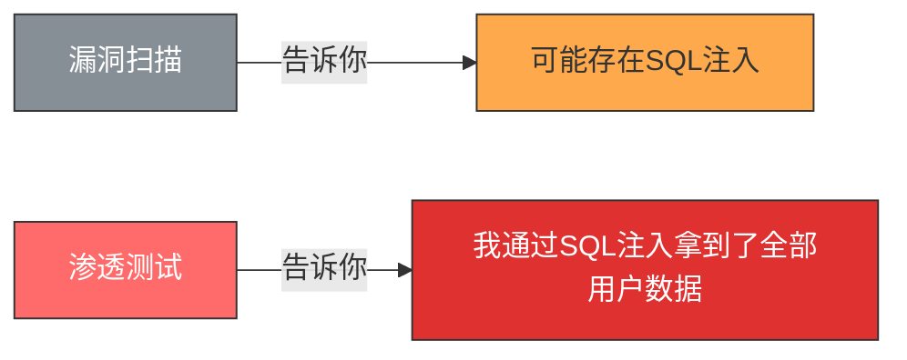
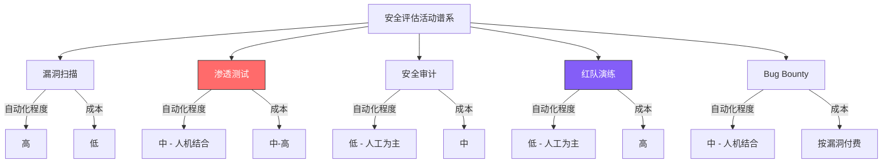

## 1.1 渗透测试的定义与本质

### 1.1.1 渗透测试的严格定义

渗透测试（Penetration Testing，简称PenTest）是一种**经过授权的、受控的安全评估活动**，测试人员通过模拟真实攻击者的思维方式、技术手段和攻击路径，对目标系统进行系统化的安全性验证。其核心特征不是"发现漏洞"，而是**"验证漏洞的可利用性并量化实际风险"**。

这个定义包含了四个不可或缺的要素：

| 要素 | 含义 | 缺失后果 |
|------|------|---------|
| **授权** | 必须获得系统所有者的明确书面许可 | 没有授权 = 非法入侵，触犯刑法 |
| **模拟** | 使用与真实攻击者相同的TTPs（战术、技术、流程） | 不模拟真实攻击 = 无法暴露真实风险 |
| **验证** | 不仅发现漏洞，更要证明漏洞可被实际利用 | 不验证 = 无法区分理论风险和实际威胁 |
| **受控** | 在约定范围、时间、手段内进行，有紧急停止机制 | 不受控 = 可能造成业务中断或数据损坏 |

与"漏洞扫描告诉你数据库可能有SQL注入"不同，渗透测试会告诉你："我通过SQL注入拿到了管理员密码哈希，用Hashcat在12分钟内破解了其中87%的密码，并以此登录了后台管理系统，导出了全部用户数据。"——这就是理论风险与实际威胁之间的鸿沟。

### 1.1.2 渗透测试的本质：受控的安全实验

从哲学层面看，渗透测试的本质是一种**"受控的安全实验"**。它遵循科学实验的基本范式：

1. **假设**：目标系统可能存在某些安全弱点
2. **实验**：在授权范围内尝试利用这些弱点
3. **观察**：记录攻击路径、成功条件、影响范围
4. **结论**：基于实验结果评估实际风险等级

这种实验方法论赋予了渗透测试两个核心特性：

**可复现性（Reproducibility）**。一次规范的渗透测试，其发现和结论应当是可复现的。测试报告中的每个漏洞都应附带复现步骤，使得开发团队能够验证漏洞确实存在，修复后也能确认漏洞已被消除。如果一个"漏洞"只有测试人员声称存在但无法复现，那它要么是误报，要么报告写得不够规范。

**可量化性（Quantifiability）**。渗透测试不是"我觉得这个系统很不安全"的主观判断，而是基于实际攻击结果的量化评估。通过CVSS评分、影响范围、利用难度等维度，将安全风险转化为可比较、可排序、可决策的数据。

### 1.1.3 渗透测试与相关概念的深度辨析

网络安全领域存在大量术语重叠，初学者极易混淆。以下从目标、方法、深度、产出、人员五个维度进行精确区分：

| 维度 | 漏洞扫描 | 渗透测试 | 安全审计 | 红队演练 | Bug Bounty |
|------|---------|---------|---------|---------|------------|
| **核心目标** | 发现已知漏洞 | 验证漏洞可利用性 | 检查合规性 | 模拟APT攻击 | 发现未知漏洞 |
| **主要方法** | 自动化工具 | 人工+自动化 | 文档+配置审查 | 全方位攻击模拟 | 众包式测试 |
| **测试深度** | 表面扫描 | 深入利用+横向移动 | 策略/流程层面 | 战略+战术层面 | 深入利用 |
| **典型时长** | 数小时 | 数天到数周 | 数周到数月 | 数周到数月 | 持续进行 |
| **核心产出** | 漏洞清单 | 漏洞+利用路径+修复建议 | 合规报告 | 攻击报告+改进建议 | 漏洞报告+PoC |
| **误报率** | 高（30-60%） | 低（人工验证） | 不适用 | 极低 | 低 |

**漏洞扫描 vs 渗透测试——最容易混淆的一对**。漏洞扫描是渗透测试的一个子步骤，但两者有本质区别。漏洞扫描器（如Nessus、OpenVAS）依赖签名数据库匹配已知漏洞，产生大量误报且无法验证利用性。渗透测试人员拿到扫描结果后，会逐一验证每个发现：这个CVE在目标版本上是否真的存在？是否有前置条件限制？利用后能获得什么权限？能否横向移动？一个典型的例子：Nessus报告目标服务器存在"Apache Struts2远程代码执行"漏洞（CVE-2017-5638），但渗透测试人员验证后发现该服务器虽然运行了Struts2，但WAF已经拦截了OGNL表达式注入，漏洞实际上不可利用。扫描报告说"有漏洞"，渗透测试结论是"不可利用"——这个区别对安全决策至关重要。

**安全审计 vs 渗透测试——互补而非替代**。安全审计关注"你的安全策略是否完善、是否被执行"，渗透测试关注"你的实际防御能否挡住真实攻击"。一个组织可能有完美的安全策略文档（审计满分），但实际部署中防火墙规则配置错误（渗透测试暴露问题）。反之，渗透测试可能发现不了制度层面的缺陷（如离职员工账号未及时注销），而这正是安全审计的重点。

**红队演练 vs 渗透测试——规模和目标的升级**。渗透测试通常有明确的技术范围（"测试这10个IP的Web应用"），红队演练则模拟真实APT组织的完整攻击链，可能包括钓鱼邮件、物理入侵、供应链攻击、长达数月的持续渗透。红队演练的目标不是"找到漏洞"，而是"测试组织的整体检测和响应能力"。渗透测试问"系统安全吗？"，红队演练问"我们能发现并阻止一次真实的高级攻击吗？"

### 1.1.4 渗透测试的攻击链思维

理解渗透测试的本质，必须理解**攻击链（Kill Chain）**的概念。渗透测试不是孤立地找漏洞，而是构建完整的攻击路径。洛克希德·马丁公司在2011年提出的网络杀伤链模型，将一次完整的网络攻击分为七个阶段：

渗透测试的价值恰恰在于它追踪的是完整的攻击链，而非单个环节。一个低危漏洞（如信息泄露）本身可能不值得修复，但如果它能被串联进攻击链（信息泄露→口令猜测→初始访问→权限提升→横向移动→数据窃取），那它的实际风险就被放大了数倍。这就是为什么渗透测试报告中的"攻击路径"部分往往比单个漏洞列表更有价值。

MITRE ATT&CK框架进一步细化了攻击者在每个阶段可能使用的技术。截至2024年，ATT&CK涵盖了14个战术类别、200+个技术、400+个子技术。渗透测试人员参考ATT&CK框架，能够系统化地覆盖攻击者可能使用的各种手段，避免遗漏。

| 攻击链阶段 | 典型技术（ATT&CK映射） | 渗透测试对应活动 |
|-----------|----------------------|----------------|
| 侦察 | T1595 主动扫描、T1592 收集受害者主机信息 | 信息收集：子域名枚举、端口扫描、技术栈识别 |
| 初始访问 | T1190 利用面向公众的应用、T1566 钓鱼 | 漏洞利用：Web漏洞利用、钓鱼邮件投递 |
| 执行 | T1059 命令行解释器、T1203 利用客户端漏洞 | 获得Shell：反弹Shell、WebShell执行 |
| 权限提升 | T1068 利用漏洞提权、T1548 滥用提权控制机制 | 本地提权：内核漏洞、SUID滥用、sudo配置错误 |
| 横向移动 | T1021 远程服务、T1550 利用替代认证材料 | 内网渗透：Pass-the-Hash、SMB Relay、RDP跳板 |
| 数据窃取 | T1041 通过C2通道渗出、T1567 通过Web服务渗出 | 目标达成：敏感数据定位、打包、传输 |

### 1.1.5 渗透测试的核心价值：为什么不能被替代

渗透测试对组织安全建设的价值远不止"找漏洞"。以下是渗透测试提供的五类不可替代的价值：

**第一，真实风险的量化评估。** 安全团队经常面临一个困境：扫描报告列出了500个漏洞，预算只够修复50个，该修哪些？渗透测试通过实际验证，告诉你哪些漏洞真正可以被利用、利用后影响有多大。一个CVSS评分9.8的远程代码执行漏洞，如果目标服务器在内网深处且需要多层跳板才能到达，其实际风险可能低于一个CVSS评分7.5但直接暴露在公网的信息泄露漏洞。渗透测试提供的是**基于攻击路径的风险排序**，而非基于漏洞评分的理论排序。

**第二，防御体系的实战检验。** 组织投入大量资金部署了防火墙、WAF、IDS/IPS、EDR、SIEM等安全设备，但这些设备是否真正有效？规则配置是否正确？告警是否被及时处理？渗透测试是对整个防御体系的一次"实战演习"。很多组织在渗透测试中发现：WAF规则半年没更新、IDS告警无人值守、EDR部署覆盖率只有60%、SIEM关联规则有大量误报被管理员关闭。这些问题在日常运维中很难暴露，只有在真实攻击模拟下才会显现。

**第三，攻击面的持续发现。** 随着业务发展，组织的攻击面在不断变化：新上线的微服务、临时开通的测试环境、第三方供应商的VPN接入、员工自建的Shadow IT。渗透测试能够帮助组织发现这些"未知的未知"——你不知道自己不知道的安全风险。一个经典案例：某企业在渗透测试中发现，三年前上线的一个营销活动页面仍然在运行，使用的是过时的WordPress版本和已知存在RCE漏洞的插件，且该服务器可以访问内网数据库。

**第四，合规性驱动的刚性需求。** 多个行业标准明确要求定期渗透测试：

| 合规标准 | 渗透测试要求 | 测试频率 |
|---------|------------|---------|
| PCI DSS v4.0 | 外部渗透测试 + 内部渗透测试 | 每年至少一次，重大变更后追加 |
| 等保2.0（三级及以上） | 定期安全检测和评估 | 每年至少一次 |
| SOC 2 Type II | 渗透测试作为安全控制证据 | 审计周期内至少一次 |
| HIPAA | 安全风险评估（渗透测试为核心组成） | 持续进行，至少每年评审 |
| ISO 27001 | A.12.6技术漏洞管理 | 风险评估驱动 |

**第五，安全文化的催化剂。** 渗透测试报告中"攻击路径"的叙事方式，比任何安全培训PPT都更有说服力。当管理层看到"攻击者通过一封钓鱼邮件，在4小时内获取了域管理员权限，可以访问公司全部核心数据"这样的报告时，安全投入的优先级会立即提升。渗透测试是安全团队争取预算和资源的最有力工具。

### 1.1.6 渗透测试的认知纠偏：常见误解

围绕渗透测试存在大量误解，这些误解可能导致错误的安全决策：

**误解一："渗透测试就是用工具扫一下。"**
真相：工具只是渗透测试的一小部分。自动化扫描只能发现已知漏洞的表面特征，无法发现逻辑漏洞（如业务流程绕过、竞态条件）、组合漏洞（单个低危漏洞串联成高危攻击链）、配置缺陷（如管理员使用弱密码、S3桶权限配置错误）。一个经验丰富的渗透测试人员，可能80%的时间在手动分析和验证，只有20%在使用自动化工具。

**误解二："渗透测试报告=漏洞清单。"**
真相：一份高质量的渗透测试报告应包含：执行摘要（面向管理层）、攻击路径叙事（面向技术负责人）、漏洞详情与复现步骤（面向开发团队）、修复建议与优先级排序（面向运维团队）、风险矩阵（面向决策层）。漏洞清单只是报告的一个组成部分。如果一份渗透测试报告只有漏洞列表而没有攻击路径和业务影响分析，那它本质上只是一份漏洞扫描报告。

**误解三："渗透测试通过=系统安全。"**
真相：渗透测试只能证明"在测试期间、使用测试范围内的方法、未能突破目标系统"，不能证明"系统绝对安全"。渗透测试受限于时间、范围、测试人员能力等因素，不可能覆盖所有攻击面。一个为期两周的渗透测试，可能只覆盖了目标系统30%的功能和攻击向量。未发现漏洞不等于没有漏洞。

**误解四："渗透测试会影响业务，能不做就不做。"**
真相：规范的渗透测试在受控环境下进行，对业务的影响可以忽略不计。测试前会制定详细的计划，明确允许和禁止的测试手段，设定紧急停止流程。真正影响业务的是"不做渗透测试导致的真实攻击"——2023年全球平均数据泄露成本为445万美元（IBM数据），而一次企业级渗透测试的成本通常在5-30万人民币之间。

**误解五："找最厉害的黑客就能做好渗透测试。"**
真相：渗透测试是一项工程化活动，需要方法论、流程管理和专业报告能力。一个技术很强但缺乏方法论的"黑客"，可能发现几个炫酷的漏洞，但会遗漏大量系统性的安全问题。专业的渗透测试人员不仅需要技术能力，还需要项目管理能力、沟通能力和报告撰写能力。

### 1.1.7 渗透测试的思维模式：攻击者视角

渗透测试区别于其他安全评估活动的根本特质在于**攻击者视角（Attacker's Mindset）**。防御者思考"我该怎么保护"，攻击者思考"我该怎么突破"。渗透测试人员必须训练自己像攻击者一样思考：

**突破思维 vs 防御思维。** 当面对一个目标系统时，防御者看到的是防火墙规则、访问控制列表、加密协议；攻击者看到的是规则之间的缝隙、控制列表的遗漏、协议实现的缺陷。渗透测试人员需要同时具备两种视角：用攻击者视角发现弱点，用防御者视角给出修复建议。

**链式思维 vs 孤立思维。** 单个"低危"漏洞可能毫无价值，但三个低危漏洞串联起来可能构成一条完整的攻击路径。渗透测试人员需要培养"漏洞串联"的能力：信息泄露暴露了内部IP → 弱口令获得了初始访问 → 本地提权获取了root权限。每个环节单独看都是"中低危"，串联起来就是"严重"。

**创造性思维 vs 规则化思维。** 自动化工具只能按照预设规则检查，渗透测试人员的价值在于创造性地组合技术、利用业务逻辑缺陷、发现工具无法覆盖的攻击面。例如：自动化工具不会发现"通过修改订单金额为负数实现退款套现"这种业务逻辑漏洞，但经验丰富的渗透测试人员会系统化地测试每个业务流程的边界条件。

### 1.1.8 渗透测试的演进历程

理解渗透测试的现在，需要了解它的过去。渗透测试的发展与网络安全威胁的演进紧密相关：

**1960s-1970s：起源——"老虎队"。** 渗透测试的概念最早可追溯到1960年代美国国防部的"老虎队（Tiger Team）"。这些团队被授权尝试突破军方计算机系统的安全防线，目的是发现和修复安全弱点。1971年，James Anderson发布了《计算机安全技术规划研究》，首次系统化地讨论了安全测试方法论。

**1990s：商业化起步。** 随着互联网的商业化，企业开始意识到网络安全的重要性。1995年，ISS（Internet Security Systems）推出了早期的自动化安全扫描工具。同期，Dan Farmer和Wietse Venema发布了SATAN（Security Administrator Tool for Analyzing Networks），这是最早的开源安全扫描工具之一，引发了关于"安全工具是否应该公开"的激烈辩论。

**2000s：方法论形成。** 2003年，OSSTMM（开源安全测试方法手册）发布，首次为安全测试提供了标准化的方法论。2007年，PTES（渗透测试执行标准）开始制定，成为业界最广泛认可的渗透测试框架。同期，OWASP项目快速发展，为Web应用安全测试提供了详细的指南和工具。

**2010s：专业化与工具化。** Kali Linux（2013年发布）成为渗透测试的标准平台。Burp Suite、Metasploit等工具日趋成熟。OSCP认证成为渗透测试人员的"黄金标准"。Bug Bounty平台（HackerOne、Bugcrowd）的兴起，使安全测试从专业团队扩展到了全球安全研究者社区。

**2020s：AI驱动与攻击面爆炸。** 云原生、微服务、IoT、AI系统的普及使攻击面急剧扩大。AI技术开始被用于渗透测试：自动化漏洞发现、智能攻击路径规划、基于LLM的社会工程攻击。与此同时，防御方也在使用AI进行威胁检测，形成了一场"AI攻防军备竞赛"。

### 1.1.9 渗透测试的局限性与边界

诚实地认识渗透测试的局限性，与认识其价值同样重要：

**时间约束。** 典型的企业级渗透测试持续1-4周，而真实攻击者可能花费数月甚至数年。这意味着渗透测试不可能覆盖所有攻击面，测试人员必须在有限时间内做出优先级判断。

**范围约束。** 渗透测试有明确的授权范围，超出范围的测试是违法的。但真实攻击者不受此限制——他们可能通过供应链攻击、社会工程学等"范围外"手段突破目标系统。

**技能依赖。** 渗透测试的质量高度依赖测试人员的技能和经验。两个不同的团队对同一目标进行测试，可能得出截然不同的结论。这就是为什么选择有资质、有经验的测试团队至关重要。

**时间快照。** 渗透测试反映的是测试时刻的安全状态。测试结束后，新漏洞可能随时出现（零日漏洞、新上线的服务、配置变更）。因此，渗透测试应该是持续性的安全实践，而非一次性的合规活动。

**人为因素盲区。** 虽然渗透测试可以包含社会工程学测试，但组织内部的政治博弈、管理缺陷、文化问题等"软因素"很难通过技术手段测试。

这些局限性不是渗透测试的"缺点"，而是其固有边界。理解这些边界，才能正确地定位渗透测试在整个安全体系中的角色——它是安全评估的重要组成部分，但不是唯一手段。

### 1.1.10 本节核心要点总结

| 维度 | 核心要点 |
|------|---------|
| **定义** | 授权的、受控的、模拟真实攻击的安全验证活动，核心是"验证可利用性" |
| **本质** | 受控的安全实验——假设、实验、观察、结论 |
| **区别** | 不同于漏洞扫描（自动化发现）、安全审计（合规检查）、红队演练（全面对抗） |
| **思维** | 攻击者视角 + 链式思维 + 创造性思维 |
| **价值** | 风险量化、防御验证、攻击面发现、合规满足、安全文化推动 |
| **局限** | 受时间、范围、技能约束，是时间快照而非持续监控 |
| **关键原则** | 无授权即违法；工具≠渗透测试；通过测试≠系统安全 |
