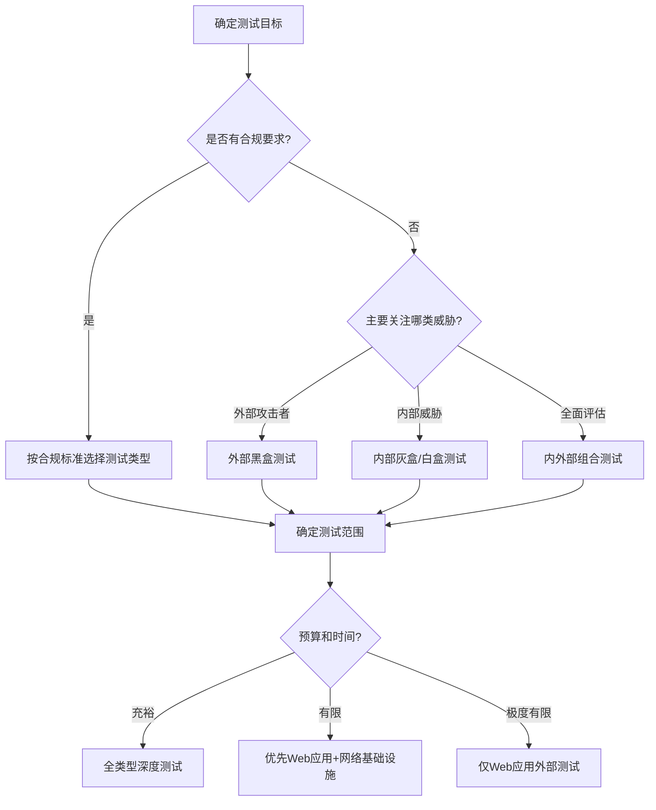

## 1.2 渗透测试的分类

渗透测试并非单一模式的安全评估活动，根据不同的维度——测试者掌握的信息量、攻击目标的类型、执行的时间与位置、组织的知情程度——可以划分出多种分类体系。理解这些分类不仅是理论知识的积累，更直接决定了实际项目中测试方案的设计、工具链的选择、报告撰写的侧重点以及最终交付成果的质量。

本节从五个核心维度展开，逐一剖析每种分类的定义、适用场景、优劣势对比、典型工作流程以及常见误区。

### 1.2.1 按知识背景分类（Information Knowledge Level）

这是渗透测试最经典、最广泛引用的分类方式，源自软件工程中的测试理论，核心变量是**测试人员在测试开始前对目标系统掌握的信息量**。

#### 黑盒测试（Black Box Testing）

**定义**：测试人员在测试开始前对目标系统的内部实现一无所知或知之甚少，仅掌握最基本的目标标识信息，如域名、IP地址范围或公司名称。测试者必须从零开始，通过信息收集、资产发现、服务枚举等步骤逐步构建对目标的认知。

**模拟的真实场景**：黑盒测试最接近外部匿名攻击者的视角——一个对目标组织没有任何内部关系的攻击者，只能通过公开渠道和主动探测获取信息。因此，黑盒测试的结果能够直接回答一个关键问题：**一个外部攻击者能在多长时间内、以多大代价突破我们的防线？**

**典型工作流程**：

1. **信息收集阶段**（占比约30-40%）：通过OSINT（开源情报）收集目标的域名、子域名、IP段、邮箱格式、技术栈线索、员工信息、历史泄露数据等
2. **资产发现与枚举**：子域名爆破、端口扫描、服务指纹识别、Web应用发现
3. **漏洞识别**：针对已发现的服务和应用进行自动化扫描与手动测试
4. **漏洞利用与渗透**：尝试利用发现的漏洞获取初始访问权限
5. **后渗透与横向移动**：在获得立足点后尝试扩大战果
6. **报告撰写**：整理完整攻击路径和发现

**优势**：
- 测试结果高度真实，直接反映外部威胁态势
- 无需目标方提供内部资料，启动成本低
- 能发现信息泄露、配置错误、暴露面过大等实际问题
- 对组织的应急响应能力也是有效的检验

**劣势**：
- 信息收集阶段耗时较长，通常占总工时的30-40%
- 可能遗漏需要内部视角才能发现的深层漏洞
- 测试覆盖度依赖于时间和技能，难以保证全面
- 容易被WAF/IDS等防御设备阻断，影响测试深度

**适用场景**：年度安全评估、监管合规要求的外部测试、并购前的安全尽职调查、面向客户的信任度证明。

#### 白盒测试（White Box Testing）

**定义**：测试人员获得目标系统的完整技术资料，包括但不限于：源代码、系统架构图、网络拓扑图、数据库结构文档、API文档、配置文件、部署流水线信息、内部使用的凭证或测试账号等。

**模拟的真实场景**：白盒测试模拟的是拥有内部权限的威胁者——可能是心怀不满的员工、已被渗透的内部账号持有者、或拥有完整代码访问权限的外包开发者。白盒测试回答的问题是：**在完全了解系统内部结构的前提下，能发现多少安全隐患？**

**典型工作流程**：

1. **资料审阅**：全面阅读源代码、架构文档、配置文件
2. **威胁建模**：基于架构理解识别关键攻击面和高风险组件
3. **代码审计**：逐模块进行静态代码分析，追踪数据流和控制流
4. **配置审查**：检查服务器配置、中间件设置、密钥管理等
5. **动态测试**：在理解内部逻辑的基础上进行针对性的运行时测试
6. **综合评估**：结合静态和动态分析结果，给出完整风险画像

**优势**：
- 测试覆盖度最高，能够发现隐藏在代码深处的逻辑漏洞
- 效率高——无需花时间做信息收集，可直奔高风险区域
- 能发现设计层面的安全缺陷（如架构性的信任边界错误）
- 可以精确定位漏洞的代码位置，降低修复成本
- 能识别硬编码密钥、调试代码残留、注释中的敏感信息等问题

**劣势**：
- 需要目标方提供大量内部资料，沟通协调成本高
- 测试结果可能低估外部攻击的实际难度
- 对测试人员的代码审计能力要求极高
- 存在信息泄露风险——测试人员接触了组织的核心资产

**适用场景**：重大版本上线前的安全审查、代码审计专项、PCI DSS等合规要求的代码级评估、内部安全团队自评。

#### 灰盒测试（Gray Box Testing）

**定义**：测试人员获得部分系统信息，介于黑盒和白盒之间。典型的信息配置包括：普通用户账号、应用的功能说明文档、部分架构信息（如使用的技术栈、大致的网络分区），但不包含源代码或完整的内部架构图。

**模拟的真实场景**：灰盒测试模拟的是具有一定内部知识的攻击者——可能是已获得普通员工凭证的攻击者、已通过社会工程学获取部分信息的外部人员、或拥有有限权限的合作伙伴。灰盒测试回答的问题是：**一个拥有普通用户权限的攻击者能造成多大危害？**

**优势**：
- 在效率和真实性之间取得最佳平衡
- 可跳过大量信息收集时间，专注于权限提升和业务逻辑漏洞
- 能验证权限隔离是否有效——普通用户能否越权访问敏感功能
- 是实际项目中最常用的测试模式

**劣势**：
- 信息量的把握需要经验——给多了变成白盒，给少了变成黑盒
- 不同项目间的信息配置差异较大，难以标准化

**适用场景**：常规安全评估（最常用）、上线前的功能安全测试、权限体系验证、第三方安全服务采购时的默认测试模式。

#### 三种模式对比

| 维度 | 黑盒测试 | 灰盒测试 | 白盒测试 |
|------|----------|----------|----------|
| 信息量 | 极少（域名/IP） | 部分（账号/架构概要） | 完整（源码/配置/架构图） |
| 模拟角色 | 外部匿名攻击者 | 拥有低权限的内部人员 | 高权限内部人员/代码审计员 |
| 测试周期 | 长（大量信息收集） | 中等 | 短（直奔主题） |
| 覆盖度 | 较低 | 中等 | 最高 |
| 真实性 | 最高 | 中等 | 较低 |
| 成本 | 中等 | 中等 | 高（需提供内部资料） |
| 代码级漏洞 | 难以发现 | 有限 | 可精确发现 |
| 业务逻辑漏洞 | 可发现 | 较容易发现 | 可全面发现 |
| 常用度 | 中 | 最高 | 中 |

#### 常见误区

- **误区一：黑盒测试一定比白盒测试更真实**。真相是，真实世界中的高级攻击者往往已经通过数据泄露、暗网购买、社工手段获取了大量内部信息，其攻击起点可能已经接近灰盒甚至白盒水平。纯粹的黑盒测试反而可能低估了真实威胁。
- **误区二：白盒测试可以替代黑盒测试**。两者回答的是不同的安全问题。白盒告诉你系统有多少漏洞，黑盒告诉你攻击者能利用多少漏洞。最理想的做法是结合使用。
- **误区三：灰盒测试的信息量不重要**。灰盒测试中给予测试人员的信息配置直接影响测试深度和结果。应根据具体的测试目标（如权限验证 vs 全面评估）来精确控制信息量。

### 1.2.2 按目标范围分类（Target Scope）

按测试的目标对象和技术领域划分，不同类型的渗透测试需要完全不同的技能栈、工具集和方法论。

#### 网络基础设施渗透测试

**测试对象**：路由器、交换机、防火墙、VPN网关、负载均衡器、无线控制器等网络设备，以及DNS、DHCP、NTP等基础网络服务。

**核心关注点**：
- 网络设备的默认凭证和弱口令
- 管理接口（SSH/Telnet/SNMP/HTTP管理页面）的安全配置
- 路由协议（BGP/OSPF/EIGRP）的认证和篡改风险
- VLAN跳跃和网络隔离的有效性
- 防火墙规则的逻辑缺陷（规则冲突、过于宽松的ANY规则）
- VPN配置的强度（加密算法、预共享密钥强度、分割隧道策略）
- IPv6安全——许多组织部署了IPv6但未配置相应安全策略

**典型工具**：Nmap、Masscan、Scapy、SNMPwalk、RouterSploit、Bloodhound（内网场景）。

**高风险发现举例**：某企业防火墙存在规则顺序错误，导致一条DENY规则被前面更宽泛的ALLOW规则覆盖，使得数据库服务器直接暴露在互联网上。

#### Web应用渗透测试

**测试对象**：基于浏览器的Web应用程序，包括前端页面、后端API、数据库交互层、身份认证系统、文件上传功能、支付接口等。

**核心关注点**：
- **注入类漏洞**：SQL注入、NoSQL注入、LDAP注入、OS命令注入、ORM注入
- **认证与会话管理**：弱密码策略、会话固定、JWT密钥泄露、OAuth配置错误
- **访问控制**：水平越权（访问其他用户数据）、垂直越权（普通用户执行管理员操作）、IDOR（不安全的直接对象引用）
- **XSS漏洞**：存储型、反射型、DOM型XSS及其变种
- **SSRF/CSRF/XXE**：服务端请求伪造、跨站请求伪造、XML外部实体注入
- **业务逻辑漏洞**：支付绕过、优惠券重复使用、竞态条件、价格篡改
- **API安全**：未授权访问、批量数据泄露、速率限制缺失、GraphQL过度查询
- **序列化漏洞**：Java反序列化、PHP对象注入、Python pickle滥用

**典型工具**：Burp Suite、OWASP ZAP、SQLMap、Nuclei、ffuf、Postman、Arjun。

**行业标准**：OWASP Top 10、OWASP Testing Guide、PTES（渗透测试执行标准）。

#### 移动应用渗透测试

**测试对象**：Android和iOS平台的原生应用、混合应用（Hybrid App）、以及基于React Native/Flutter等框架的跨平台应用。

**核心关注点**：
- **客户端安全**：代码混淆程度、反调试/反Root检测的绕过、本地数据存储（SQLite/SharedPreferences/Keychain）的加密情况
- **通信安全**：HTTPS证书固定（Certificate Pinning）的实现、中间人攻击的可能性、API密钥在客户端的硬编码
- **组件安全**：Android的Exported组件、Intent注入、Content Provider泄露；iOS的URL Scheme劫持、Keychain访问控制
- **逆向工程**：APK/IPA的反编译、动态分析（Frida/Xposed）、协议逆向
- **服务端接口**：移动应用通常复用Web API，但可能存在不同的认证流程或额外的接口

**典型工具**：Frida、Objection、MobSF、APKTool、jadx、Hopper、Charles Proxy、Postman。

**特殊要求**：需要搭建真机测试环境或高仿真模拟器，Android建议使用已Root设备，iOS建议使用已越狱设备。

#### 无线网络渗透测试

**测试对象**：企业/组织的WiFi基础设施，包括接入点（AP）、认证服务器（RADIUS）、无线控制器、以及连接的终端设备。

**核心关注点**：
- **加密协议分析**：WEP（已淘汰但仍存在遗留部署）、WPA/WPA2-PSK（预共享密钥强度）、WPA2-Enterprise（802.1X认证配置）、WPA3的安全改进及已知攻击向量
- **认证机制**：Evil Twin攻击（伪造热点）、Rogue AP检测、Captive Portal绕过
- **客户端攻击**：Karma攻击（利用客户端的自动连接行为）、WiFi Deauth攻击（强制断线重连以捕获握手包）
- **网络隔离**：访客网络与内部网络的隔离有效性、客户端隔离是否启用

**典型工具**：Aircrack-ng套件、Wifite2、Bettercap、hostapd-mana、hcxdumptool、hashcat。

**物理要求**：需要在测试现场进行，测试人员需在信号覆盖范围内，通常需要携带专用硬件（支持监听模式的无线网卡）。

#### 社会工程学测试

**测试对象**：组织中的人员（员工、管理层、前台、保安等），测试其安全意识水平和组织的人员安全管理措施。

**核心关注点**：
- **钓鱼攻击**：定制化钓鱼邮件（Spear Phishing）、鱼叉式钓鱼网站、水坑攻击（在目标常访问的网站植入恶意内容）
- **电话欺诈**：冒充IT支持、供应商、客户进行Vishing攻击
- **物理入侵**：尾随进入（Tailgating）、伪造工牌、利用社会信任进入受限区域
- **USB投放**：在目标场所放置预配置的USB设备，测试员工是否会插入未知设备
- **社交媒体情报**：通过LinkedIn、微博等社交平台收集组织结构、人员信息、技术栈线索

**典型工具**：GoPhish、SET（Social Engineering Toolkit）、King Phisher、Evilginx2。

**伦理红线**：社会工程学测试是所有渗透测试类型中伦理边界最敏感的一种。测试方案必须获得组织高层的书面授权，明确禁止对员工造成心理伤害，测试过程中不得获取或使用真实的个人敏感信息，测试结束后必须对参与员工进行安全意识培训而非惩罚。

#### 物理安全测试

**测试对象**：组织的物理安全措施，包括门禁系统、监控系统、机房安全、文件柜/保险柜、打印设备、废弃文件处理等。

**核心关注点**：
- **门禁系统**：RFID卡克隆（Proxmark3）、门锁技术性开启、紧急出口的单向通行是否可靠
- **监控系统**：摄像头覆盖盲区、DVR/NVR的默认凭证、视频流是否加密
- **机房安全**：物理访问控制层级、环境监控（温湿度/烟雾/漏水）、UPS和消防系统
- **信息泄露**：白板上的敏感信息、未粉碎的废弃文件、显示器上的便签纸

**典型工具**：Proxmark3、Lockpick套件、Rubber Ducky、WiFi Pineapple。

#### 云环境渗透测试

**测试对象**：AWS、Azure、GCP、阿里云等云平台上的资源和配置，包括IAM策略、存储桶、虚拟网络、Serverless函数、容器集群等。

**核心关注点**：
- **IAM配置**：过度宽松的权限策略、角色信任关系滥用、跨账户访问风险
- **存储安全**：S3/OSS桶的公开访问、预签名URL泄露、备份文件暴露
- **元数据服务**：SSRF通过云元数据服务（169.254.169.254）获取临时凭证
- **容器安全**：Kubernetes RBAC配置、容器逃逸、镜像漏洞、Secret管理
- **Serverless安全**：Lambda/函数计算的权限过大、环境变量中的密钥泄露
- **日志与监控**：CloudTrail/ActionTrail是否启用、告警规则是否完善

**典型工具**：Prowler、ScoutSuite、Pacu、CloudMapper、kube-hunter、Trivy。

**特殊要求**：必须严格遵守云厂商的渗透测试政策（如AWS需要提前报备某些测试类型），禁止进行可能影响其他租户的测试。

#### 各类型所需技能栈对比

| 测试类型 | 核心技能 | 工具熟练度要求 | 硬件需求 | 行业需求趋势 |
|----------|----------|---------------|----------|-------------|
| 网络基础设施 | 网络协议、路由交换、防火墙策略 | Nmap、Scapy | 无特殊需求 | 稳定 |
| Web应用 | HTTP协议、前后端技术、数据库 | Burp Suite、SQLMap | 无特殊需求 | 最高 |
| 移动应用 | Android/iOS开发、逆向工程 | Frida、MobSF | Root/越狱手机 | 增长中 |
| 无线网络 | 802.11协议、射频基础 | Aircrack-ng | 监听模式网卡 | 稳定 |
| 社会工程学 | 心理学、沟通技巧、OSINT | GoPhish、SET | 无特殊需求 | 增长中 |
| 物理安全 | 锁具知识、RFID技术 | Proxmark3 | 特殊硬件 | 小众 |
| 云环境 | 云平台架构、IAM、容器技术 | Prowler、Pacu | 云账号 | 快速增长 |

### 1.2.3 按执行方式与位置分类（Testing Approach）

#### 内部测试 vs 外部测试

**外部测试**：测试人员从组织的外部网络（互联网）发起攻击，模拟的是外部威胁者。测试范围包括所有面向互联网的服务、应用和基础设施。这是最常见的渗透测试形式，因为大多数攻击的初始入口来自外部。

**内部测试**：测试人员在组织的内部网络中进行测试，模拟的是两种场景：一是已突破边界防御的攻击者（如通过钓鱼邮件获取了内网访问权限的外部攻击者）；二是心怀不满或被收买的内部人员。内部测试通常会发现更多高危漏洞，因为内网中的安全防护往往弱于边界。

**选择建议**：不要二选一。成熟的安全评估方案应同时包含内部和外部测试。如果预算有限，优先进行外部测试（覆盖面更广），但至少每年进行一次内部测试。

#### 主动测试 vs 被动测试

**主动测试**：测试人员直接与目标系统进行交互——发送探测数据包、尝试登录、触发漏洞利用代码、上传测试文件等。主动测试能获得最直接和详细的漏洞信息，但存在以下风险：
- 可能触发目标系统的告警和阻断
- 极端情况下可能造成服务中断
- 测试行为会在日志中留下痕迹
- 需要更详细的授权和范围确认

**被动测试**：测试人员不与目标系统直接交互，而是通过公开信息收集、流量分析、配置审查等方式进行评估。被动测试的典型操作包括：
- OSINT信息收集（搜索引擎、Shodan、Censys、历史DNS记录）
- 证书透明度日志分析
- 开源代码仓库中的信息泄露检查
- 公开泄露数据库的凭证检查
- 网络流量的旁路监听（需要内部位置）

被动测试的优势在于完全不影响目标系统，适合作为安全评估的第一阶段或作为持续监控手段。

#### 远程测试 vs 现场测试

**远程测试**：测试人员通过互联网远程进行，是最常见的执行方式。优势是成本低、启动快，不受地理限制。

**现场测试**：测试人员在目标组织的物理场所进行测试。现场测试能覆盖远程测试无法触及的领域——物理安全、内部网络直连、无线网络、员工安全意识等。通常需要签署更严格的保密协议和行为准则。

### 1.2.4 按组织知情程度分类

这个维度描述的是组织内部有多少人知道测试正在进行，直接影响测试结果的真实性和对应急响应能力的检验效果。

#### 公开测试（Announced/Full-Knowledge）

组织的安全团队和IT运维团队都知道测试的时间、范围和测试人员身份。这种方式的优势在于：
- 测试可以更深入——安全团队不会误判为真实攻击而阻断测试
- 可以进行更激进的测试操作而不必担心被当作真实入侵处理
- 适合检验安全防护工具的检测能力（已知攻击是否被正确识别）

#### 隐蔽测试（Unannounced/Zero-Knowledge）

组织中仅有最高管理层和法务部门知道测试的存在，安全团队和运维团队完全不知情。这种方式的优势在于：
- 能够真实检验组织的检测和响应能力
- 测试结果反映的是组织在真实攻击场景下的表现
- 能发现应急响应流程中的实际缺陷

**风险与注意事项**：
- 如果测试触发了真实的安全事件响应流程，可能导致不必要的恐慌和资源浪费
- 测试人员可能被当作真实攻击者处理——账户被封禁、IP被永久拉黑
- 需要预先建立"安全词"机制——当测试人员面临法律风险或需要紧急停止时的联络通道
- 必须有高层签署的授权文件作为法律保护

#### 部分知情测试

只有特定层级或特定部门知道测试的存在。例如，安全团队知道但IT运维不知道，或者只有CISO和安全经理知道。这种方式在实践中最为常见，能够在测试深度和响应真实性之间取得平衡。

### 1.2.5 按测试深度与交互层级分类

#### 非侵入式测试（Non-Intrusive）

仅进行信息收集和漏洞识别，不尝试实际利用漏洞。典型操作包括：端口扫描、服务指纹识别、Web应用爬虫、已知漏洞匹配（CVE检查）。这种方式风险最低，适合初次合作的客户或风险厌恶型组织。

#### 侵入式测试（Intrusive）

在发现漏洞后尝试实际利用，包括：漏洞利用代码执行、SQL注入数据提取、文件上传WebShell、权限提升等。能提供最真实的漏洞影响评估，但需要更严格的范围控制和回滚预案。

#### 漏洞利用 vs 漏洞证明

成熟的渗透测试应区分两个层次：
- **漏洞证明（Proof of Concept）**：证明漏洞存在即可，如SQL注入通过时间盲注确认存在，但不提取实际数据
- **漏洞利用（Exploitation）**：实际利用漏洞获取访问权限、提取数据、控制系统

在涉及生产系统的测试中，通常采用漏洞证明为主、关键漏洞适度利用的策略。

### 1.2.6 行业特定渗透测试

不同行业因监管要求和业务特性，渗透测试有各自的侧重点：

#### 金融行业

- **PCI DSS合规测试**：处理支付卡数据的组织必须每年进行渗透测试，至少包含外部和内部测试
- **交易系统安全**：重点关注交易篡改、重放攻击、竞态条件
- **API安全**：开放银行API、第三方支付接口的安全评估
- **反欺诈系统测试**：验证风控规则的有效性

#### 医疗行业

- **HIPAA合规测试**：患者健康信息（PHI）的保护验证
- **医疗设备安全**：IoT医疗设备的通信安全、固件安全
- **DICOM/HL7协议安全**：医疗数据交换协议的安全评估

#### 工业控制系统（ICS/SCADA）

- **OT网络安全**：PLC、RTU、HMI等工业设备的安全评估
- **协议安全**：Modbus、DNP3、OPC UA等工业协议的漏洞分析
- **IT/OT边界安全**：生产网络与办公网络的隔离有效性
- **特殊约束**：不能在生产环境中进行侵入式测试，通常在仿真环境中进行

#### 政府与国防

- **等级保护测评**：中国网络安全等级保护制度要求的渗透测试
- **涉密系统安全**：物理隔离环境下的安全评估
- **供应链安全**：软硬件供应链的信任验证

### 1.2.7 渗透测试类型的选择策略

在实际项目中，选择合适的测试类型组合需要考虑以下因素：

**推荐的测试类型组合方案**：

| 评估等级 | 适用场景 | 测试组合 | 典型周期 |
|----------|----------|----------|----------|
| 基础级 | 小型组织、初次评估 | 外部Web应用黑盒测试 | 1-2周 |
| 标准级 | 中型企业、年度评估 | 外部黑盒 + 内部灰盒 + Web应用深度测试 | 2-4周 |
| 增强级 | 大型企业、金融/医疗行业 | 全范围灰盒 + 社会工程学 + 无线网络测试 | 4-8周 |
| 全面级 | 关键基础设施、政府机构 | 全类型组合 + 物理安全 + 红队演练 | 8-12周 |

### 1.2.8 本节小结

渗透测试的分类体系是理解和规划安全评估的基础框架。在实际项目中，单一分类维度远远不够——一个完整的渗透测试方案通常是多个维度的组合：例如"外部灰盒Web应用侵入式测试"或"内部白盒网络基础设施非侵入式测试"。

关键认知：
1. **没有最好的分类，只有最适合的分类**。选择取决于测试目标、合规要求、预算约束和风险偏好。
2. **不同分类维度可以自由组合**，形成丰富多样的测试方案。
3. **分类不是目的，而是手段**——通过分类来确保测试方案覆盖了所有关键的安全维度。
4. **趋势在演变**：随着云原生、DevSecOps和AI的普及，云环境测试、供应链安全测试和AI系统安全测试正在成为新的独立测试类型。
