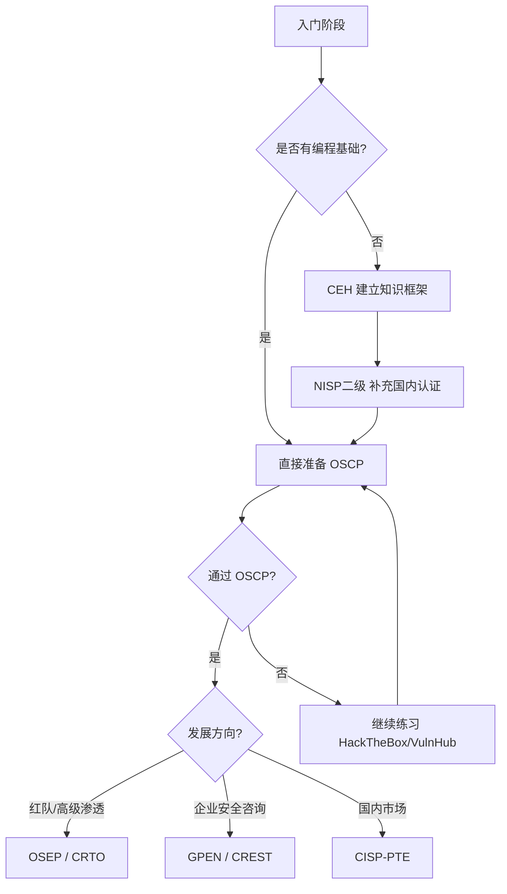

## 1.4 渗透测试的法律与伦理

渗透测试的本质是模拟攻击者的行为来评估目标系统的安全性。这种"以攻验防"的工作模式天然处于法律的灰色地带——同样的技术手段，授权使用是安全评估，未授权使用则构成犯罪。法律与伦理不是渗透测试的附加约束，而是这项工作的根基。没有法律意识的渗透测试人员，技术和破坏者之间只差一纸授权的距离。

本节从国内法律体系、国际法律框架、授权合同体系、伦理规范、职业认证五个维度，系统构建渗透测试从业者的法律与伦理知识体系。

---

### 1.4.1 中国法律框架

#### 核心法律体系

中国的网络安全法律体系以《网络安全法》为基石，辅以《刑法》《数据安全法》《个人信息保护法》以及配套的行政法规和部门规章，共同构成了渗透测试活动的法律边界。

**《中华人民共和国网络安全法》（2017年6月施行）**

这是中国网络安全领域的基础性法律，第二十七条明确规定：

> 任何个人和组织不得从事非法侵入他人网络、干扰他人网络正常功能、窃取网络数据等危害网络安全的活动；不得提供专门用于从事侵入网络、干扰网络正常功能及防护措施、窃取网络数据等危害网络安全活动的程序、工具。

对于渗透测试从业者而言，这条规定划出了最清晰的红线：未经授权 = 违法。即便是出于"善意"的漏洞发现行为，如果没有事先获得授权，同样构成违法。第六十三条进一步规定了违反第二十七条的处罚措施：没收违法所得，处五日以下拘留，可以并处五万元以上五十万元以下罚款；情节较重的，处五日以上十五日以下拘留，可以并处十万元以上一百万元以下罚款。

**《中华人民共和国刑法》相关条款**

| 条款 | 罪名 | 行为描述 | 刑罚 |
|------|------|----------|------|
| 第285条第1款 | 非法侵入计算机信息系统罪 | 侵入国家事务、国防建设、尖端科学技术领域的计算机信息系统 | 三年以下有期徒刑或拘役 |
| 第285条第2款 | 非法获取计算机信息系统数据罪 | 违反规定侵入其他计算机信息系统，获取数据且情节严重 | 三年以下有期徒刑或拘役，并处或单处罚金；情节特别严重的，三年以上七年以下 |
| 第286条 | 破坏计算机信息系统罪 | 对计算机信息系统功能进行删除、修改、增加、干扰，造成系统不能正常运行 | 后果严重的，五年以下；后果特别严重的，五年以上 |
| 第286条之一 | 拒不履行信息网络安全管理义务罪 | 网络服务提供者不履行安全管理义务，经监管部门责令采取改正措施而拒不改正 | 三年以下有期徒刑、拘役或管制 |
| 第287条之二 | 帮助信息网络犯罪活动罪 | 明知他人利用信息网络实施犯罪，为其提供技术支持 | 三年以下有期徒刑或拘役，并处或单处罚金 |

这些条款对渗透测试人员的直接约束是：即便在授权范围内测试，如果操作导致目标系统瘫痪或数据损坏，仍可能触发第286条的刑事责任。"在授权范围内"不等于"不承担任何后果"。

**《中华人民共和国数据安全法》（2021年9月施行）**

渗透测试过程中不可避免地会接触到目标系统的数据。该法规定了数据分级分类保护制度，测试人员在接触重要数据或核心数据时，必须遵守相应的安全保护义务。第三十二条明确规定：

> 任何组织、个人收集数据，应当采取合法、正当的方式，不得窃取或者以其他非法方式获取数据。

渗透测试中获取的数据必须严格限于测试目的使用，不得泄露、出售或非法提供给他人。

**《中华人民共和国个人信息保护法》（2021年11月施行）**

当渗透测试目标系统中存储有个人信息时，测试人员还需遵守个人信息保护的相关规定。即便在授权测试过程中，获取个人信息也需要满足合法性、正当性和必要性原则。测试报告中如果涉及个人信息，必须进行脱敏处理。

#### 等保制度与渗透测试

《信息安全等级保护管理办法》将信息系统分为五个安全等级，要求三级及以上系统每年至少进行一次安全评估，渗透测试是安全评估的核心手段之一。

| 等保级别 | 系统重要性 | 渗透测试要求 | 测评周期 |
|----------|-----------|-------------|----------|
| 第一级 | 用户自主保护 | 无强制要求 | 自定 |
| 第二级 | 国家指导保护 | 建议开展 | 自定 |
| 第三级 | 国家监督保护 | 必须每年渗透测试 | 每年一次 |
| 第四级 | 国家强制保护 | 必须每年渗透测试+专项测试 | 每年一次 |
| 第五级 | 专控保护 | 由国家指定机构测试 | 按需 |

等保2.0标准（GB/T 22239-2019）进一步明确了渗透测试在安全评估中的技术要求，包括测试方法、测试工具、报告格式等方面的规范。

#### 真实案例警示

**案例一：好意变违法。** 2019年，某安全研究人员在未获授权的情况下对某政务网站进行漏洞扫描，发现SQL注入漏洞后通过邮箱向该单位报告。该单位报警后，研究人员因"非法侵入计算机信息系统"被行政拘留五日。关键问题在于：虽然发现了真实漏洞且未造成损害，但未经授权的扫描行为本身已构成违法。

**案例二：越权测试入刑。** 某安全公司受委托对客户A的Web应用进行渗透测试。测试人员在获得A公司授权后，发现A公司的服务器与B公司存在网络连通，遂"顺便"对B公司的系统进行了横向渗透。最终测试人员因非法侵入B公司计算机信息系统被判处有期徒刑一年六个月。

这两个案例揭示了两个核心教训：第一，善意不构成免责理由；第二，授权范围是不可逾越的绝对边界。

---

### 1.4.2 国际法律框架

#### 美国：《计算机欺诈和滥用法案》（CFAA）

CFAA是美国联邦层面规制计算机犯罪的核心法律，也是全球最早针对计算机安全的立法之一。该法于1986年修订后基本定型，主要内容包括：

**核心条款分析：**

- **第1030(a)(2)条**：未经授权或超越授权访问计算机系统并获取信息。这是渗透测试领域最常被引用的条款。
- **第1030(a)(5)条**：故意传播程序、信息、代码或命令，导致计算机系统损坏。
- **第1030(a)(7)条**：以敲诈为目的威胁损害计算机系统。

**"超越授权"的争议：** CFAA中"exceeds authorized access"（超越授权）这一表述长期存在争议。2021年美国最高法院在Van Buren v. United States案中做出里程碑式裁决，将"超越授权"限缩解释为：已获得系统某部分访问权限的人，访问了该系统中其无权访问的特定区域。这意味着，如果测试人员获得了一般性系统访问授权，即便使用了非常规手段，也不一定构成CFAA违规。

**实际影响：** 尽管Van Buren案缩小了CFAA的适用范围，但未授权的渗透测试仍属于明确的违法行为。美国多个州还有自己的计算机犯罪法律，部分州的规定比CFAA更为严格。

#### 欧盟：《通用数据保护条例》（GDPR）

GDPR对渗透测试的影响主要体现在数据处理层面：

- **第5条数据处理原则**：渗透测试中获取的个人数据必须遵循合法性、目的限制、数据最小化等原则。
- **第32条安全处理义务**：测试报告和测试数据必须加密存储，访问受限。
- **第33条数据泄露通知**：如果渗透测试过程中意外导致数据泄露，测试方有义务在72小时内通知数据控制者。

GDPR的管辖范围具有域外效力——即使渗透测试在中国境内进行，只要目标系统处理了欧盟居民的个人数据，测试活动就受到GDPR约束。这一规定对跨国企业的安全评估影响深远。

#### 其他主要国家/地区法律概览

| 国家/地区 | 核心法律 | 关键要点 | 最高刑罚 |
|-----------|---------|---------|---------|
| 英国 | Computer Misuse Act 1990 | 未经授权访问即构成犯罪，不论是否造成损害 | 10年监禁 |
| 日本 | 不正アクセス行為の禁止等に関する法律 | 禁止未授权访问和帮助他人进行未授权访问 | 3年监禁或50万日元罚金 |
| 澳大利亚 | Criminal Code Act 1995 Part 10.7 | 涵盖未授权访问、修改数据和拒绝服务 | 10年监禁 |
| 德国 | StGB §202a-c | 非法获取数据和拦截数据 | 3年监禁 |
| 新加坡 | Computer Misuse Act | 2017年修订增加了对关键基础设施的保护 | 10年监禁或10万新元罚金 |

#### 跨境测试的法律复杂性

当渗透测试涉及跨境系统时，法律问题急剧复杂化。一个典型的场景是：客户总部在中国，其云服务器部署在新加坡，CDN节点分布在多个国家。此时一次渗透测试可能同时触碰三个以上国家的法律管辖。

应对原则：

1. **最严格原则**：当多个国家法律同时适用时，以最严格的规定为准。
2. **属地优先**：服务器所在地的法律通常具有优先管辖权。
3. **合同约定**：在测试合同中明确适用法律和争议解决方式。
4. **事先咨询**：涉及跨境测试时，务必提前咨询法律顾问。

---

### 1.4.3 授权与合同体系

#### 授权授权书（Authorization Letter）

授权书是渗透测试合法性的核心文件，缺少授权书的渗透测试在法律上等同于黑客攻击。一份完备的授权书应包含以下要素：

```text
授权授权书（模板框架）

致：[测试执行方名称]

授权方（甲方）：[客户全称]
授权方联系人：[姓名、职务、电话、邮箱]

一、授权范围
  1.1 测试目标系统：
      - IP地址范围：[具体IP段]
      - 域名：[具体域名列表]
      - 应用系统：[系统名称及URL]
      - 网络设备：[设备型号及管理地址]
  1.2 测试时间窗口：
      - 起止日期：YYYY-MM-DD HH:MM 至 YYYY-MM-DD HH:MM
      - 允许测试时段：[如 工作日 22:00-06:00]
  1.3 允许的测试手段：
      - 允许：[列举具体技术]
      - 禁止：[列举明确禁止的行为]

二、免责条款
  2.1 乙方在授权范围内进行测试活动，不对测试过程中
      造成的正常业务影响承担法律责任。
  2.2 以下情形不在免责范围内：
      - 超越授权范围的操作
      - 违反合同约定的测试手段
      - 测试数据的泄露或滥用

三、保密义务
  3.1 乙方对测试过程中接触的所有信息承担保密义务。
  3.2 保密期限：自合同终止之日起 [X] 年。

四、数据处理
  4.1 测试数据仅限用于编写测试报告。
  4.2 测试结束后 [X] 日内，乙方须销毁所有测试数据，
      并提供销毁证明。

五、紧急联系人
  甲方技术联系人：[姓名、电话]
  甲方管理层联系人：[姓名、电话]
  乙方项目经理：[姓名、电话]

授权方签章：____________  日期：____________
```

#### 工作说明书（SOW）

工作说明书定义了渗透测试项目的具体执行细节，是授权书的补充和细化：

| 章节 | 内容要点 |
|------|---------|
| 项目背景 | 客户业务描述、系统架构、面临的安全挑战 |
| 测试目标 | 明确的安全目标，如"验证Web应用是否可被未授权访问" |
| 测试范围 | 详细的资产清单、网络拓扑、应用清单 |
| 测试方法 | 采用的方法论（如OWASP、PTES、NIST） |
| 测试阶段 | 信息收集→漏洞发现→漏洞验证→报告输出 |
| 交付物 | 报告格式、报告内容、修复建议的详细程度 |
| 时间计划 | 各阶段时间节点、里程碑、报告提交时间 |
| 人员配置 | 测试团队组成、职责分工 |
| 费用与支付 | 测试费用、支付方式、发票信息 |

#### 测试规则（Rules of Engagement, ROE）

ROE是渗透测试执行层面的操作规范，规定了测试过程中"什么能做、什么不能做"：

```yaml
# 测试规则（ROE）示例

scope:
  in_scope:
    - "192.168.1.0/24"          # 内网测试网段
    - "www.example.com"         # 外网Web应用
    - "api.example.com"         # API接口
  out_of_scope:
    - "192.168.1.1"             # 网关设备（禁测）
    - "mail.example.com"        # 邮件系统（禁测）
    - "*.partner.example.com"   # 合作方子域名（禁测）

testing_windows:
  business_hours: "不允许执行可能影响业务的操作"
  off_hours: "22:00-06:00 可执行全量测试"
  weekend: "周六全天可执行全量测试"

allowed_techniques:
  - 端口扫描（限速：100 pps）
  - Web漏洞扫描（限速：10 req/s）
  - 手动渗透测试
  - 社会工程学（仅限邮件钓鱼，需提前通知HR）

prohibited_techniques:
  - 拒绝服务攻击（DoS/DDoS）
  - 物理入侵
  - 供应链攻击
  - 对第三方系统的任何测试
  - 使用真实恶意软件（仅限无害化payload）

data_handling:
  screenshot_allowed: true
  data_export_allowed: false
  credential_storage: "仅限加密存储，测试结束后7日内销毁"

escalation:
  critical_vulnerability_found: "立即电话通知甲方技术联系人"
  system_outage: "立即停止测试，通知甲方并协助恢复"
  data_breach_suspected: "立即停止测试，启动应急响应流程"
```

#### NDA（保密协议）

保密协议通常作为主合同的附件，核心条款包括：

- **保密信息定义**：明确哪些信息属于保密范围（测试发现、系统架构、业务数据等）
- **保密义务**：不得向第三方披露，不得用于合同以外的目的
- **保密期限**：通常为合同终止后2-5年
- **违约责任**：明确违反保密义务的赔偿标准
- **例外情形**：法律强制披露、信息已公开等

---

### 1.4.4 伦理规范体系

#### 渗透测试人员职业行为准则

**准则一：最小影响原则（Do No Harm）**

渗透测试的目标是发现安全问题，而非制造安全问题。在测试过程中，测试人员应当：

- 优先使用非破坏性测试方法，只在必要时使用侵入性手段
- 对可能导致服务中断的操作（如缓冲区溢出利用），提前评估风险并获得客户确认
- 在生产环境测试前，优先考虑在测试环境中验证漏洞
- 使用最小权限原则——获取的权限足以证明漏洞存在即可，不必追求最高权限
- 避免在业务高峰期执行可能影响性能的测试

实践中，最小影响原则需要在"测试深度"和"系统稳定性"之间寻找平衡。过于保守的测试可能遗漏关键漏洞，过于激进的测试可能造成生产事故。有经验的测试人员会在测试计划中明确标注每个测试项的风险等级，并根据客户的风险承受能力调整测试策略。

**准则二：数据保护原则（Protect Confidentiality）**

渗透测试过程中，测试人员可能接触到客户的敏感数据，包括但不限于：用户数据库、内部系统架构、商业机密、源代码、密钥和证书。对此，测试人员必须：

- 测试过程中发现的敏感数据仅限于记录漏洞必要信息，不主动浏览与测试无关的数据
- 测试工具和数据存储设备必须加密
- 测试结束后按合同约定销毁所有测试数据，包括扫描结果、漏洞截图、exploit代码
- 报告中涉及的敏感数据（如密码、密钥、个人信息）必须脱敏处理
- 不在公开场合讨论客户的测试细节，包括安全社区、社交媒体、技术论坛

**准则三：及时报告原则（Prompt Disclosure）**

发现严重漏洞后的报告时效性直接影响客户的风险暴露窗口：

| 漏洞等级 | 响应时效 | 报告方式 |
|---------|---------|---------|
| 严重（远程代码执行、SQL注入等） | 立即（发现后2小时内） | 电话+邮件 |
| 高危（XSS存储型、权限提升等） | 24小时内 | 邮件+报告初稿 |
| 中危（信息泄露、配置错误等） | 报告周期内 | 完整报告 |
| 低危（版本信息泄露、Banner信息等） | 报告周期内 | 完整报告 |

对于严重漏洞，测试人员应当立即通知客户的指定联系人，而非等到测试结束编写报告后再告知。延迟报告可能导致客户在不知情的情况下遭受真实攻击。

**准则四：合法边界原则（Stay Within Bounds）**

这是渗透测试伦理中最不可妥协的原则：

- 严格在授权范围内操作，绝不以"为了更好地测试"为由越界
- 发现测试范围外的系统存在漏洞时，记录并报告，但不进行任何验证操作
- 不保留测试过程中获取的客户凭证、后门或访问通道
- 测试结束后，移除所有测试过程中植入的代码、账户和配置变更
- 不利用测试过程中获取的信息进行任何后续活动（包括在其他测试项目中复用）

**准则五：持续学习原则（Continuous Growth）**

渗透测试是一个技术迭代极快的领域，测试人员有义务：

- 持续跟踪最新的漏洞披露和攻击技术发展
- 定期更新和验证测试工具的有效性
- 参与安全社区的知识分享和讨论
- 遵守行业认证的继续教育要求（CPE学分）
- 对新兴技术（如AI、区块链、IoT）的安全影响保持关注

#### 负责任披露 vs 完全公开

当测试人员在非授权场景下发现漏洞（如开源项目、公共设施），面临两种披露策略的选择：

| 维度 | 负责任披露（Responsible Disclosure） | 完全公开（Full Disclosure） |
|------|--------------------------------------|---------------------------|
| 定义 | 先私下通知厂商，给予修复时间后再公开 | 发现漏洞后立即公开全部细节 |
| 优势 | 给厂商修复窗口，减少被恶意利用的风险 | 倒逼厂商快速修复，用户可自行防护 |
| 劣势 | 厂商可能拖延修复甚至否认漏洞 | 恶意攻击者可能抢先利用 |
| 适用场景 | 大多数情况 | 厂商长期不响应时的最后手段 |
| 行业共识 | 主流推荐 | 争议较大 |

当前行业主流的做法是协调漏洞披露（Coordinated Vulnerability Disclosure, CVD）：测试人员向厂商报告漏洞，厂商在约定时间（通常90天）内修复，之后双方同时公开。Google Project Zero的90天披露期限已成为行业事实标准。

#### Bug Bounty的伦理边界

Bug Bounty（漏洞赏金）项目模糊了"授权测试"和"独立研究"的边界。参与Bug Bounty项目需要注意：

- 严格遵守项目的范围和规则，各平台（HackerOne、Bugcrowd、补天）的规定各不相同
- 发现的漏洞只能通过平台指定渠道提交，不得公开或出售给第三方
- 不利用漏洞进行超出PoC（概念验证）范围的操作
- 不使用自动化扫描器暴力测试，除非项目明确允许
- 不进行社会工程学攻击，除非项目明确将其纳入范围
- 不对其他用户的数据进行访问，即便漏洞允许这样做

---

### 1.4.5 职业认证体系

认证不仅是专业技能的证明，更是行业信任的基础。以下从认证定位、考试形式、适用人群三个维度进行对比分析：

#### 国际主流认证

**OSCP（Offensive Security Certified Professional）**

- **颁发机构**：Offensive Security（现更名为OffSec）
- **考试形式**：24小时实战攻防，独立渗透5台目标机器并提交报告，需获得至少70/100分
- **前置要求**：完成PEN-200课程（PWK）
- **难度**：★★★★★，公认最具含金量的渗透测试认证
- **适合人群**：有一定基础、追求实战能力的中高级从业者
- **续证要求**：无到期续证要求（终身有效）
- **市场价值**：全球安全岗位招聘中最常被提及的渗透测试认证

**CEH（Certified Ethical Hacker）**

- **颁发机构**：EC-Council
- **考试形式**：125道选择题，4小时
- **前置要求**：参加官方培训或具备2年以上相关工作经验
- **难度**：★★★☆☆，偏理论，覆盖面广但深度一般
- **适合人群**：入门级从业者、需要快速获得行业认证的人
- **续证要求**：每3年续证一次，需积累120个ECE学分
- **市场价值**：入门级安全岗位常见要求，部分政府/军事项目强制要求

**GPEN（GIAC Penetration Tester）**

- **颁发机构**：SANS Institute / GIAC
- **考试形式**：82道选择题，3小时（开卷）
- **前置要求**：无强制培训要求
- **难度**：★★★★☆，注重方法论和深度理解
- **适合人群**：有一定经验、追求方法论体系的从业者
- **续证要求**：每4年续证一次
- **市场价值**：企业级安全岗位认可度高

**OSEP（Offensive Security Experienced Penetration Tester）**

- **颁发机构**：OffSec
- **考试形式**：48小时实战，要求在高度防护的网络环境中渗透并横向移动
- **难度**：★★★★★，OSCP的进阶版，聚焦高级绕过技术
- **适合人群**：高级红队成员
- **市场价值**：高级渗透测试和红队岗位的加分项

#### 国内权威认证

**CISP-PTE（注册信息安全专业人员-渗透测试工程师）**

- **颁发机构**：中国信息安全测评中心
- **考试形式**：机考（选择题+实操题）
- **前置要求**：参加授权培训机构的课程
- **难度**：★★★★☆
- **市场价值**：国内等保测评、安全服务资质项目中的加分或必备条件

**NISP（国家信息安全水平考试）**

- **颁发机构**：中国信息安全测评中心
- **等级划分**：一级（基础）、二级（专业）、三级（高级）
- **适合人群**：在校学生和初入行者
- **市场价值**：国内入门级安全岗位参考

#### 认证选择路径建议



---

### 1.4.6 渗透测试职业保险与风险管理

#### 专业责任保险

随着渗透测试行业的成熟，越来越多的客户要求测试方购买专业责任保险（Professional Liability Insurance / Errors & Omissions Insurance）。这种保险覆盖的典型场景包括：

- **测试过失**：测试操作意外导致客户系统损坏或数据丢失
- **报告疏漏**：遗漏关键漏洞，客户因此遭受攻击
- **数据泄露**：测试过程中获取的数据被泄露
- **第三方索赔**：测试活动波及第三方系统引发的赔偿

在国内，网络安全保险市场尚处于发展初期，但已有保险公司推出针对安全服务的专项保险产品。对于承接大型项目的测试团队，购买专业责任保险是降低职业风险的重要手段。

#### 风险自检清单

在每个渗透测试项目启动前，建议使用以下清单进行法律和伦理风险自检：

- [ ] 是否获得目标系统所有者的书面授权？
- [ ] 授权范围是否明确涵盖本次测试的所有目标？
- [ ] 测试合同是否经过法律审核？
- [ ] 保密协议是否已签署？
- [ ] 测试时间窗口是否与客户确认？
- [ ] 紧急联系人和应急流程是否明确？
- [ ] 测试数据的存储和销毁方案是否确定？
- [ ] 是否涉及跨境系统，是否需要额外法律咨询？
- [ ] 是否涉及个人信息处理，是否符合个保法要求？
- [ ] 测试团队是否具备相应的专业资质？

---

### 1.4.7 常见误区与纠正

#### 误区一："发现漏洞就报告，不需要授权"

**纠正**：发现漏洞的正确做法取决于发现场景。如果是在授权测试范围内，按照测试流程报告即可。如果是在非授权场景下发现（如浏览网站时偶然发现），应当通过该组织的安全响应中心（SRC）或负责任披露渠道报告，而非直接进行任何技术验证操作。

#### 误区二："测试环境/内部系统不需要法律授权"

**纠正**：法律不区分"内部"和"外部"系统。即使是公司内部系统的渗透测试，也需要获得明确的书面授权，特别是当测试可能影响到其他部门的业务时。内部测试最常见的法律风险是"越权"——获得了A部门的授权，但测试影响了B部门的系统。

#### 误区三："客户默许就是授权"

**纠正**：口头同意或邮件中的模糊表态不构成有效授权。法律意义上的授权必须是明确的、书面的、可追溯的。"你可以测一下"和"我授权你在X时间对Y系统使用Z方法进行渗透测试"有本质区别。

#### 误区四："作为安全厂商，按合同测试就不会有问题"

**纠正**：合同只能约束合同双方之间的责任分配，不能免除对第三方的法律责任。如果测试过程中影响到了合同范围外的第三方系统，即使客户要求这样做，测试方仍需承担法律责任。

#### 误区五："免责条款可以完全规避风险"

**纠正**：免责条款的有效性受法律限制。如果测试方存在故意或重大过失，免责条款可能被法院认定为无效。此外，刑事责任不能通过合同约定免除。免责条款是风险分配的工具，而非免责声明。

#### 误区六："开源工具扫描不算侵入"

**纠正**：使用开源工具（如Nmap、Nikto）进行扫描仍然属于"侵入"行为的范畴。工具的性质（开源或商业）不影响行为的法律定性。决定行为是否合法的关键因素始终是"是否获得授权"，而非"使用了什么工具"。

---

### 1.4.8 伦理困境与职业决策

渗透测试从业者在职业生涯中可能面临的典型伦理困境：

**困境一：测试中发现客户涉嫌违法**

在渗透测试过程中，测试人员可能发现客户系统中存储有违法内容或证据。此时面临的选择是：遵守保密协议不予披露，还是依法向有关部门报告？

**建议**：大多数国家的法律要求公民在发现严重犯罪行为时进行报告。测试人员应当咨询法律顾问，在合法范围内做出决策。保密协议不能要求一方隐瞒犯罪行为。

**困境二：客户要求测试范围外的系统**

客户可能在测试进行中要求测试合同范围外的系统，口头承诺"不会追究"。

**建议**：坚守流程，要求补充书面授权后再进行测试。口头承诺不具备法律效力，且可能给双方都带来风险。

**困境三：测试中发现与当前客户相关的第三方漏洞**

测试过程中可能发现客户供应链中第三方系统的漏洞。

**建议**：记录发现，不进行任何验证操作，在报告中向客户说明风险。是否以及如何通知第三方，应由客户和法律顾问决定。

**困境四：同行在公开场合分享客户的漏洞细节**

安全社区中偶尔有人分享"有趣的漏洞发现"，但细节可能指向特定客户。

**建议**：私下提醒同行注意信息泄露风险。在自己的技术分享中，始终进行充分的匿名化和通用化处理。

---

### 1.4.9 本节总结

法律与伦理是渗透测试从业者的生存底线，而非可选的加分项。核心要点如下：

1. **授权是一切的前提**：没有书面授权的渗透测试等同于犯罪，善意和好技术不能替代法律授权。
2. **范围是不可逾越的边界**：严格在授权范围内操作，发现范围外的问题只记录不触碰。
3. **数据是最大的风险**：测试过程中接触到的数据是最大的法律隐患，严格遵循数据最小化和及时销毁原则。
4. **认证是职业信任的基石**：选择适合自身阶段的认证路径，持续提升专业资质。
5. **保险是风险管理的工具**：对承接大型项目的团队而言，专业责任保险是必要的风险管理手段。
6. **伦理是长期职业发展的保障**：技术能力决定了职业生涯的起点，而法律意识和伦理素养决定了职业生涯的长度。
