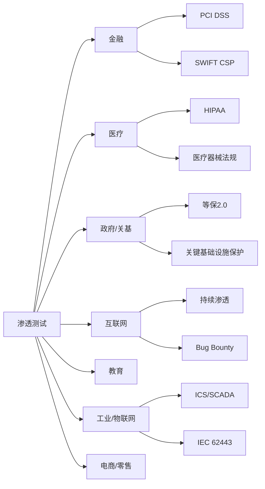

## 1.5 渗透测试的行业应用

渗透测试不是一项通用的"一刀切"服务——不同行业面临的威胁模型、合规要求、资产类型和技术架构差异巨大，直接决定了渗透测试的范围、方法和深度。本节逐行业拆解渗透测试的实际落地场景，帮助你理解"在哪测"和"测什么"。

### 1.5.1 行业差异总览

下表从六个维度横向对比主要行业的渗透测试特征：

| 维度 | 金融 | 医疗 | 政府/关基 | 互联网 | 教育 | 工业/物联网 | 电商/零售 |
|------|------|------|-----------|--------|------|-------------|-----------|
| **核心资产** | 交易数据、客户资金 | 患者病历(PHI)、医疗设备 | 政务数据、控制系统 | 用户数据、业务系统 | 学生信息、科研数据 | SCADA/PLC、产线数据 | 订单、支付、供应链 |
| **主要合规** | PCI DSS、SOX、等保 | HIPAA、等保、个保法 | 等保2.0、密评 | 个保法、GDPR | FERPA、等保 | IEC 62443、等保 | PCI DSS、个保法 |
| **测试频率** | 季度/半年 | 年度+变更测试 | 年度+专项 | 持续/月度 | 年度 | 年度+变更测试 | 季度/大促前 |
| **攻击面特征** | API密集、高价值目标 | 内网老旧系统多 | 边界清晰但内网薄弱 | 公网暴露面大 | 开放网络、BYOD | OT与IT融合、长生命周期 | 高并发、供应链复杂 |
| **渗透难度** | 高（风控严格） | 中（系统老旧但防护弱） | 高（流程审批长） | 中高（看企业成熟度） | 低中（防护普遍薄弱） | 高（专用协议、物理隔离） | 中（业务逻辑复杂） |
| **报告要求** | 极详细、含合规映射 | 含HIPAA条款映射 | 涉密报告、分级交付 | 快速交付、可复现 | 标准报告 | OT专项报告 | 含业务影响分析 |



### 1.5.2 金融行业

#### 行业背景与威胁态势

金融行业是渗透测试应用最广泛、要求最严格的领域。银行、证券、保险、支付机构面临的核心矛盾是：**业务必须高度数字化开放，同时安全底线是零容忍**。一次成功的攻击可能导致直接的巨额资金损失和系统性金融风险。

2023年全球金融行业数据泄露平均成本达到590万美元（IBM报告），远高于跨行业均值445万美元。攻击者对金融行业的投入也最高——APT组织如Lazarus Group、Carbanak/FIN7长期以金融机构为目标，单次攻击获利可达数亿美元。

#### 监管与合规要求

金融行业渗透测试的首要驱动力是合规：

- **PCI DSS**：处理信用卡的机构必须每年进行渗透测试（Requirement 11.3），内部和外部测试都需要覆盖，测试范围包括持卡人数据环境（CDE）及其连接系统
- **SOX法案**：上市公司需要对IT控制进行审计，渗透测试是验证控制有效性的手段之一
- **银保监会/金监局要求**：国内金融机构需要按照等保2.0三级以上标准进行安全评估，渗透测试是核心环节
- **SWIFT CSP**：使用SWIFT网络的银行需要遵守客户安全计划（CSP），包括渗透测试在内的安全评估
- **DORA（欧盟数字运营韧性法案）**：2025年起强制要求金融机构进行威胁导向渗透测试（TLPT）

#### 测试重点与攻击面

金融行业渗透测试的典型攻击面包括：

**外部测试（黑盒/灰盒）：**
- 网上银行/手机银行：认证绕过、会话管理缺陷、交易篡改
- 支付网关与API：参数篡改、金额修改、重放攻击、SSRF
- 第三方接入接口：合作伙伴API的安全边界
- 员工门户/OA系统：弱口令、已知漏洞

**内部测试（白盒/灰盒）：**
- 核心银行系统：数据库访问控制、存储过程注入
- SWIFT消息系统：消息篡改、未授权操作
- ATM系统：物理接口安全、网络分段有效性
- 开发测试环境：代码泄露、密钥硬编码

**业务逻辑测试（金融特有重点）：**
- 转账金额边界：整数溢出、负数转账、精度丢失
- 并发竞争条件：双花攻击、重复提交
- 业务流程绕过：跳过KYC、绕过风控规则
- 信贷审批逻辑：伪造收入证明、绕过反欺诈检测

#### 实操示例：支付API渗透测试清单

```text
支付API安全测试检查项：
├── 认证与授权
│   ├── Token是否可伪造/重放
│   ├── 越权访问其他商户订单
│   └── API Key是否在客户端硬编码
├── 交易完整性
│   ├── 金额参数篡改（修改为0.01元）
│   ├── 货币类型篡改（CNY→USD）
│   ├── 订单号可预测/可遍历
│   └── 签名验证是否可绕过
├── 业务逻辑
│   ├── 退款金额超过原订单
│   ├── 优惠券重复使用
│   ├── 积分兑换竞态条件
│   └── 分账逻辑绕过
└── 数据安全
    ├── 响应中是否泄露完整卡号
    ├── 日志中是否记录敏感信息
    └── 传输层是否强制TLS 1.2+
```

#### 典型案例

**Carbanak攻击（2013-2018）**：APT组织通过钓鱼邮件入侵银行内部网络，潜伏数月观察银行业务流程后，通过操控SWIFT转账系统和ATM吐钞机制，从全球100多家银行窃取超过10亿美元。如果这些银行在攻击前进行了充分的内网渗透测试和威胁模拟演练，核心系统的异常访问路径和SWIFT操作监控盲区本可以被发现。

### 1.5.3 医疗行业

#### 行业背景与威胁态势

医疗行业的数字化转型带来了新的攻击面，但安全投入长期滞后。医疗机构面临的核心挑战是：**系统老旧与互联互通需求的矛盾**。大量医院仍在使用Windows 7甚至XP运行的影像系统（PACS/RIS），这些系统无法打补丁但又需要连接院内网络。

2023年全球医疗行业数据泄露平均成本达到1093万美元，连续13年位居所有行业第一。勒索软件是医疗行业最大的威胁——攻击者知道医院不能承受系统停摆，因此医疗行业的勒索赎金支付率远高于其他行业。

#### 合规与法规

- **HIPAA（美国健康保险可携性和责任法案）**：要求对处理电子健康信息（ePHI）的系统进行安全风险评估，渗透测试是验证安全控制的关键手段
- **医疗器械法规（FDA/NMPA）**：联网医疗设备需要满足网络安全要求，FDA要求提交软件物料清单（SBOM）和安全测试报告
- **个人信息保护法（中国）**：医疗健康信息属于敏感个人信息，处理者需要采取严格的安全措施
- **等保2.0**：三级甲等医院通常要求等保三级，部分核心系统需要四级

#### 渗透测试的特殊考量

**患者隐私数据（PHI/ePHI）保护：**
- 测试中发现的PHI数据必须严格控制，不能被测试工具外传
- 需要与医院签署专门的数据保密协议
- 测试报告中不能包含真实的患者信息
- 测试环境最好使用脱敏数据或专用测试环境

**医疗设备安全：**
- 影像设备（CT、MRI、X光）通常运行定制化的Linux或旧版Windows，补丁更新周期长
- 监护设备（心电监护、输液泵）存在直接威胁患者生命安全的风险，测试必须极其谨慎
- 医疗物联网（IoMT）设备数量庞大、类型多样，资产管理本身就是挑战
- DICOM协议（医学影像传输标准）在传输过程中往往未加密

**医疗系统互联性：**
- HIS（医院信息系统）、LIS（检验系统）、PACS（影像系统）之间的数据流转
- 医院与医保系统的对接
- 远程医疗/互联网医院的公网暴露
- 医联体/区域卫生平台的跨机构数据共享

#### 典型测试场景

```text
医疗行业渗透测试范围示例：
1. 外部攻击面评估
   ├── 互联网医院平台（挂号、问诊、支付）
   ├── 医院官网及CMS
   ├── VPN/远程访问入口
   └── 邮件系统

2. 内网渗透测试
   ├── HIS系统（挂号、收费、药房、病历）
   ├── PACS影像系统（DICOM协议安全性）
   ├── LIS检验系统
   ├── 医保接口安全
   └── 办公终端安全（防横向移动）

3. 医疗设备安全评估
   ├── 联网影像设备（非侵入式网络层测试）
   ├── 医疗物联网设备固件分析
   └── 设备网络分段验证

4. 社会工程测试
   ├── 针对医护人员的钓鱼模拟
   └── 物理安全（门禁、USB投毒）
```

### 1.5.4 政府与关键基础设施

#### 行业背景与威胁态势

政府系统和关键基础设施（电力、交通、水利、通信、能源）是国家级APT攻击的重点目标。与商业渗透测试不同，这类系统的安全测试需要考虑**国家级攻击者的能力和意图**。

关键基础设施的安全事件后果不仅是数据泄露，更可能是物理世界的破坏——2015年和2016年乌克兰电网攻击导致大面积停电，2021年美国Colonial Pipeline勒索攻击导致东海岸燃油供应中断。

#### 合规与标准体系

- **等保2.0（网络安全等级保护）**：中国网络安全的基本制度，关键信息基础设施通常要求三级或四级
- **关键信息基础设施安全保护条例**：明确CII的认定规则和保护要求，要求运营者每年至少进行一次检测评估
- **密码法/密评**：对密码应用进行安全性评估，渗透测试需要验证密码机制的有效性
- **关基安全标准（GB/T 39204等）**：涵盖风险评估、安全防护、应急响应等全流程

#### 测试特殊性

**审批与流程：**
- 测试前需要经过严格的安全评估审批流程，通常需要上级主管部门批准
- 测试时间窗口通常有严格限制（如凌晨2-5点），避免影响业务运行
- 部分系统需要在隔离环境中测试，不能直接在生产环境操作
- 测试工具和方法需要提前报备，不能使用可能造成服务中断的攻击手段

**保密要求：**
- 测试人员通常需要通过政审或持有保密资质
- 测试结果按照涉密文件管理，分级交付
- 测试报告可能需要脱敏后才能传递给技术团队
- 发现的漏洞信息不能对外披露

**测试重点：**
- 边界安全：虽然边界防护通常较强，但需要验证策略的有效性和完整性
- 内网横向移动：内部网络分段是否到位，一旦边界被突破是否能控制整个网络
- 特权账户管理：管理员密码是否统一管理，特权操作是否有审计
- 供应链安全：第三方运维人员的接入控制，软件供应链风险
- 应急响应能力：故意触发告警，观察安全团队的检测和响应速度

#### OT/ICS系统渗透测试

关键基础设施中的工业控制系统（ICS/SCADA）渗透测试与传统IT渗透测试有本质区别：

| 特征 | IT渗透测试 | OT/ICS渗透测试 |
|------|-----------|---------------|
| 目标 | 数据机密性/完整性 | 系统可用性/物理安全 |
| 测试环境 | 可直接在生产环境 | 必须在仿真/隔离环境 |
| 影响范围 | 服务中断 | 物理破坏/人身安全 |
| 协议 | HTTP/TCP/UDP | Modbus/DNP3/OPC UA |
| 设备生命周期 | 3-5年 | 15-30年 |
| 扫描方式 | 可激进扫描 | 必须温和/被动扫描 |
| 专业要求 | 渗透测试技能 | 需额外OT/工控知识 |

**ICS渗透测试的关键警告**：绝对不能在生产环境中的PLC/RTU上执行主动扫描或攻击测试。错误的Modbus写入命令可能导致阀门异常开关、电机过速、温度失控等物理事故。所有主动测试必须在仿真环境中进行，生产环境只允许被动流量分析和网络架构审查。

### 1.5.5 互联网企业

#### 行业背景与特点

互联网企业是渗透测试服务最活跃的需求方。与传统行业相比，互联网企业的特点是：**攻击面大、变化快、对安全的容忍度相对灵活**。大型互联网公司通常建立自己的安全团队和漏洞赏金计划（Bug Bounty），而中小互联网公司则更多依赖外部渗透测试服务。

#### 测试模式演进

互联网行业的渗透测试模式经历了三个阶段：


- **阶段一（年度渗透测试）**：每年一到两次全面渗透测试，覆盖面广但时效性差
- **阶段二（持续渗透测试/PTaaS）**：订阅制服务，按月或按季度滚动测试不同模块，漏洞实时报告
- **阶段三（攻防一体化）**：内部红队+外部蓝军+Bug Bounty+SDL全流程集成

#### 测试覆盖范围

互联网企业的渗透测试通常覆盖以下层面：

**Web应用层：**
- 前后端应用（OWASP Top 10全覆盖）
- 单页应用（SPA）的安全问题：前端路由绕过、API未授权访问
- WebSocket安全：消息注入、跨站WebSocket劫持
- SSRF在云环境中的特殊危害：元数据服务（169.254.169.254）、内网扫描

**移动端：**
- Android：APK反编译、证书固定绕过、本地存储安全
- iOS：越狱检测绕过、Keychain提取、URL Scheme劫持
- 通用：API接口安全、敏感数据传输、身份认证机制

**API安全：**
- RESTful API：BOLA/BFLA（对象级/功能级授权缺陷）
- GraphQL：信息过度暴露、深度查询DoS、内省泄露
- gRPC：序列化安全、服务间认证

**云基础设施：**
- IAM策略审计：最小权限原则验证
- S3/OSS桶权限：公开访问、目录遍历
- 容器安全：镜像漏洞、逃逸风险
- Serverless：函数权限过大、环境变量泄露

**微服务与内部系统：**
- 服务间认证：mTLS配置有效性
- 内部API网关：未授权访问测试
- 开发工具链：Jenkins、GitLab、Jira的安全配置
- 内部知识库/Wiki：敏感信息泄露

#### Bug Bounty生态

大型互联网公司运营自己的漏洞赏金计划，这是一种持续性渗透测试的模式：

- **HackerOne**：全球最大平台，客户包括GitHub、Twitter、Shopify等
- **Bugcrowd**：另一大平台，客户包括Tesla、Atlassian等
- **国内平台**：补天（知道创宇）、漏洞盒子、各厂商SRC（安全应急响应中心）

Bug Bounty与传统渗透测试的区别：

| 维度 | 传统渗透测试 | Bug Bounty |
|------|------------|------------|
| 测试人员 | 固定团队 | 全球白帽子 |
| 测试时间 | 固定周期 | 持续进行 |
| 付费模式 | 固定费用 | 按漏洞付费 |
| 覆盖深度 | 更深（含逻辑测试） | 偏技术漏洞 |
| 报告质量 | 系统性报告 | 单个漏洞报告 |
| 适用场景 | 合规需求、深度评估 | 补充持续覆盖 |

### 1.5.6 教育行业

#### 行业背景

教育行业是网络安全投入最少但数据价值不低的行业之一。高校和中小学面临的安全挑战包括：网络高度开放（学术自由传统）、用户安全意识薄弱（师生规模大且流动性高）、IT预算有限、系统分散且老旧。

#### 渗透测试重点

**高校特有攻击面：**
- 教务系统：成绩篡改、选课系统逻辑漏洞
- 科研数据：论文、专利、实验数据的窃取风险
- 校园一卡通/支付系统：充值漏洞、余额篡改
- 学生信息管理系统：大规模个人信息泄露
- 实验室网络：科研设备的安全隔离
- 校园网基础设施：DNS劫持、ARP欺骗、WiFi安全

**常见发现：**
- 教务系统SQL注入（老旧PHP系统尤其常见）
- 统一身份认证绕过（CAS/OAuth配置错误）
- 弱口令泛滥（学号/工号即用户名，初始密码未改）
- 教师个人主页暴露敏感信息
- 实验室服务器对外暴露管理端口

### 1.5.7 工业与物联网（IoT）

#### 行业背景

工业4.0和物联网的快速发展使得OT（运营技术）与IT（信息技术）的边界日益模糊。传统的物理隔离网络逐渐与企业网和互联网连接，带来了全新的安全挑战。

#### IoT渗透测试维度

**设备层：**
- 固件提取与逆向：通过UART/JTAG/SPI接口提取固件，使用Binwalk分析
- 默认凭证：大量IoT设备使用出厂默认密码
- 硬件调试接口暴露：串口控制台未禁用

**通信层：**
- 协议安全：MQTT/CoAP/BLE/Zigbee协议的认证和加密是否到位
- 中间人攻击：设备与云端通信是否加密验证
- 重放攻击：设备控制命令是否可重放

**云端/应用层：**
- 设备管理平台安全：设备注册、OTA升级接口
- 移动控制APP：逆向分析API密钥和通信协议
- 云端API：设备绑定关系越权、数据访问控制

#### 车联网渗透测试（特例）

智能网联汽车是IoT渗透测试中技术含量最高、影响最大的领域之一：

```text
车联网攻击面：
├── 远程攻击（T-Box/OTA/APP）
│   ├── T-Box通信协议漏洞
│   ├── OTA升级包篡改
│   └── 手机APP API漏洞
├── 近场攻击（WiFi/BT/NFC）
│   ├── 蓦牙钥匙中继攻击
│   ├── WiFi AP仿冒
│   └── NFC钥匙克隆
├── 物理接口攻击（OBD/USB/CAN）
│   ├── OBD-II诊断接口注入
│   ├── USB多媒体漏洞
│   └── CAN总线消息注入
└── 车载系统攻击（IVI/ECU）
    ├── 信息娱乐系统（IVI）提权
    ├── ECU固件逆向
    └── 自动驾驶传感器欺骗
```

### 1.5.8 电商与零售

#### 行业背景

电商行业的渗透测试核心关注点是**业务逻辑安全**——技术漏洞之外，业务流程设计缺陷往往是更大的攻击面。

#### 典型业务逻辑测试场景

**价格与优惠：**
- 优惠券叠加利用：多个优惠券同时使用导致负价格
- 满减逻辑绕过：先凑单满减再部分退款
- 价格篡改：通过修改客户端请求或抓包修改商品价格
- 库存锁定攻击：大量下单锁定库存但不支付（拒绝竞争）

**账户与身份：**
- 账户接管：密码重置逻辑缺陷、短信验证码爆破
- 批量注册：利用自动化注册薅新用户优惠
- 分享裂变漏洞：邀请奖励逻辑被利用刷量

**支付与结算：**
- 退款金额篡改：退款金额超过实付金额
- 重复支付/重复退款：并发请求导致重复操作
- 积分/余额体系漏洞：积分兑换逻辑缺陷
- 跨店铺结算漏洞：平台佣金计算逻辑绕过

**供应链与物流：**
- 供应商后台越权：修改其他供应商的商品信息
- 物流信息泄露：订单号遍历获取收货地址
- 仓库管理系统：库存数据篡改

### 1.5.9 选择渗透测试服务商的行业化考量

不同行业选择渗透测试服务商时，除了技术能力外，还应关注行业适配性：

```text
选择清单：
├── 行业经验
│   ├── 是否有同行业服务案例
│   ├── 测试团队是否了解行业业务逻辑
│   └── 是否持有行业相关资质（如金融行业需要CISP等）
├── 合规能力
│   ├── 报告是否覆盖行业合规要求
│   ├── 是否支持等保测评联动
│   └── 是否能出具合规映射矩阵
├── 技术能力
│   ├── 是否支持OT/ICS测试（工业/能源行业）
│   ├── 是否有移动安全测试能力（互联网/金融）
│   ├── 是否支持云安全评估（互联网/SaaS）
│   └── 是否能进行社会工程测试
├── 流程规范
│   ├── 测试前风险评估和应急预案
│   ├── 测试过程中的沟通机制
│   ├── 漏洞发现后的即时通知
│   └── 测试后的复测验证
└── 报告质量
    ├── 漏洞描述是否包含复现步骤
    ├── 是否提供修复建议和优先级排序
    ├── 是否有管理层摘要
    └── 是否支持合规映射
```

### 1.5.10 行业趋势与展望

渗透测试的行业应用正在从合规驱动向风险驱动演进，呈现以下趋势：

1. **从点状测试到持续评估**：年度渗透测试向PTaaS（渗透测试即服务）模式转变，漏洞发现和修复周期从月级缩短到天级
2. **AI辅助渗透测试**：大语言模型辅助漏洞发现、报告生成和攻击路径规划，但核心判断仍依赖人类专家
3. **威胁导向渗透测试（TLPT）**：欧盟DORA法案推动的TLPT要求模拟真实威胁组织的TTPs，弥合了传统渗透测试与红队演练之间的鸿沟
4. **供应链渗透测试兴起**：SolarWinds事件后，软件供应链和第三方接入成为渗透测试的新关注点
5. **OT安全测试标准化**：IEC 62443和国内等保标准对OT安全测试的要求日趋明确，专用的ICS渗透测试工具和方法论逐渐成熟
6. **隐私计算与合规测试**：数据跨境流通、隐私计算技术（联邦学习、TEE等）引入新的测试维度

理解行业差异是做好渗透测试的前提。渗透测试人员不仅需要掌握通用的安全技术，还需要深入理解目标行业的业务逻辑、合规要求和风险特征，才能提供真正有价值的测试服务。
