# 第16章 二进制安全PWN — 章节概览

## 引言：为什么你需要学PWN

二进制安全（Binary Security），在安全圈中常被称为"PWN"（源自"own"的谐音，意为"攻破"），是网络安全攻防领域中最具技术深度的方向之一。它研究的是如何发现并利用二进制程序中的内存安全漏洞，从而实现任意代码执行、权限提升或信息泄露等攻击目标。

PWN不仅仅是CTF竞赛中的核心赛题方向——在现实世界中，它是高级持续性威胁（APT）攻击链条的关键一环。2021年Pwn2Own大赛上，安全研究员在不到两天时间内攻破了Windows、macOS、Microsoft Teams、Parallels等多款主流软件；2023年多个在野零日漏洞（如CVE-2023-21768 Windows内核提权、CVE-2023-28252 CLFS驱动提权）都是典型的二进制漏洞利用。可以说，PWN能力是衡量一个安全研究者技术水平的"硬通货"。

与Web安全等上层应用安全不同，二进制安全需要攻防人员直接与机器指令、内存布局和操作系统底层机制打交道。你需要理解CPU是如何执行指令的、栈和堆是如何管理内存的、操作系统是如何加载和保护程序的。这种"贴近硬件"的特性使得PWN成为安全领域中学习曲线最为陡峭、但同时也是最具成就感的方向——当你第一次成功Get Shell，那种从零和一中"读出"系统行为、从冰冷的内存数据中构建出完整攻击链的成就感，是其他安全方向难以比拟的。

## PWN知识全景图

在正式学习之前，先建立一个全局视野。PWN的知识体系可以用下面这张全景图来概括：

```mermaid
graph TD
    ROOT["二进制安全 PWN"] --> THEORY["理论基础"]
    ROOT --> TECHNIQUE["核心技巧"]
    ROOT --> PRACTICE["实战案例"]
    ROOT --> PITFALL["常见误区"]
    ROOT --> EXERCISE["练习方法"]

    THEORY --> T1["计算机体系结构"]
    THEORY --> T2["内存管理机制"]
    THEORY --> T3["内存安全漏洞类型"]
    THEORY --> T4["安全防护机制"]
    THEORY --> T5["ELF文件格式"]
    THEORY --> T6["堆管理器内部机制"]
    THEORY --> T7["格式化字符串漏洞"]
    THEORY --> T8["ARM/MIPS架构"]

    TECHNIQUE --> C1["栈溢出利用"]
    TECHNIQUE --> C2["ROP链构造"]
    TECHNIQUE --> C3["堆利用技术"]
    TECHNIQUE --> C4["栈迁移"]
    TECHNIQUE --> C5["工具使用"]
    TECHNIQUE --> C6["防护绕过策略"]

    C1 --> C1a["覆盖返回地址"]
    C1 --> C1b["Shellcode注入"]
    C1 --> C1c["ret2libc"]
    C1 --> C1d["ret2plt"]

    C2 --> C2a["基础ROP"]
    C2 --> C2b["ret2csu"]
    C2 --> C2c["ret2syscall"]
    C2 --> C2d["SROP"]

    C3 --> C3a["Fast Bin Attack"]
    C3 --> C3b["Unsorted Bin Attack"]
    C3 --> C3c["Tcache Poisoning"]
    C3 --> C3d["House系列"]

    PRACTICE --> P1["基础栈溢出"]
    PRACTICE --> P2["ret2libc绕过NX"]
    PRACTICE --> P3["泄露Canary+ret2libc"]
    PRACTICE --> P4["Tcache Poisoning"]
    PRACTICE --> P5["格式化字符串+栈溢出"]
    PRACTICE --> P6["ROP链+栈迁移"]
    PRACTICE --> P7["SROP"]
    PRACTICE --> P8["ORW绕过沙箱"]
```



这张图展示了本章完整的知识架构。你可以把它打印出来贴在墙上，在学习过程中随时标注进度。

## 本章内容详解

### 第一节：理论基础——打好地基

理论基础是整个PWN知识体系的地基。没有扎实的理论功底，后续的利用技巧只会停留在"背模板"的层面，一旦遇到变体就束手无策。

本节包含8个子章节，覆盖从硬件到操作系统的完整知识链：

**1.1 计算机体系结构基础**

这一章从最底层开始——CPU的寄存器和指令集。你将学习x86和x64架构的关键差异：32位下参数通过栈传递，64位下前6个参数通过寄存器传递（RDI/RSI/RDX/RCX/R8/R9）。这个差异直接影响你构造ROP链的方式。你还会学习三种主要调用约定（cdecl、System V AMD64 ABI、stdcall）以及系统调用机制（int 0x80和syscall），这些是理解shellcode编写和ret2syscall技术的前提。

**为什么重要：** 你无法利用一个你不理解其运行机制的程序。当你看到反汇编代码中的`mov rdi, rax`时，如果你不知道RDI是第一个函数参数，你就无法理解程序在做什么。

**1.2 内存管理机制**

这一章是PWN的"核心中的核心"。你将深入理解Linux进程的虚拟地址空间布局——从低地址到高地址依次是代码段(.text)、只读数据(.rodata)、已初始化数据(.data)、未初始化数据(.bss)、堆(向高地址增长)、mmap区、栈(向低地址增长)、内核空间。你将学习栈帧结构和函数调用的完整流程（参数压栈→CALL→保存EBP→分配局部变量→执行→恢复→ret），以及ptmalloc2堆管理器的内部机制——chunk结构、fast bin/small bin/unsorted bin/large bin四类空闲链表、malloc和free的完整流程。

**为什么重要：** 栈溢出的本质是覆盖返回地址，堆利用的本质是控制空闲链表的指针。如果你不理解栈帧结构和堆管理器的数据结构，你永远无法设计出有效的利用方案。

**1.3 常见内存安全漏洞类型**

系统梳理7类核心漏洞：栈缓冲区溢出、堆溢出、格式化字符串、整数溢出、Use-After-Free（UAF）、双重释放（Double Free）、类型混淆。每种漏洞都配有C语言示例代码，展示漏洞的触发条件和根本成因。

**为什么重要：** 漏洞识别是PWN的第一步。你需要能在反汇编代码中快速定位"这里可能有问题"，这要求你对每种漏洞的模式了然于胸。

**1.4 安全防护机制**

介绍6种主流防护机制的原理和绕过思路：栈金丝雀（Stack Canary）、地址空间布局随机化（ASLR）、数据执行保护（DEP/NX）、位置无关可执行文件（PIE）、控制流完整性（CFI）、RELRO。每种防护都详细解释了"它是怎么防的"以及"怎么绕过"。

**为什么重要：** 现代系统默认开启多种防护。一个简单的栈溢出在全防护下可能完全不可利用——除非你能绕过这些防护。防护和绕过是矛与盾的关系，你必须同时理解两者。

**1.5 ELF文件格式基础**

ELF（Executable and Linkable Format）是Linux可执行文件的标准格式。你将学习ELF Header、Program Header Table、Section Header Table等关键结构，以及延迟绑定（Lazy Binding）机制——PLT桩代码和GOT表的协作方式。这个机制直接催生了ret2plt和GOT覆写等利用技术。

**1.6 堆管理器内部机制**

深入ptmalloc2的实现细节——malloc_chunk结构体的每个字段、四个标志位（PREV_INUSE/IS_MMAPPED/NON_MAIN_ARENA）的含义、arena的管理方式、tcache的引入和安全检查。这是堆利用技术的理论基础。

**1.7 格式化字符串漏洞**

格式化字符串漏洞是一个独立的漏洞类别，拥有自己的利用体系。你将学习如何用`%x`/`%p`读取栈数据、用`%n`/`%hn`/`%hhn`实现任意地址写入、以及直接参数访问（`%n$x`）等高级技巧。

**1.8 ARM/MIPS架构下的PWN**

扩展到移动端和嵌入式设备的安全研究。ARM和MIPS有不同的寄存器约定和指令集，但利用原理相通。这是进阶方向，初学者可以先跳过。

### 第二节：核心技巧——武装你的武器库

如果说理论基础是"知道是什么"，核心技巧就是"知道怎么做"。本节将教你从最基础的栈溢出利用到最复杂的堆攻击技术。

**2.1 栈溢出利用技术**

从最简单的覆盖返回地址开始。你将学习如何使用pwntools的`cyclic()`函数精确确定偏移量，如何编写和注入shellcode，如何通过ret2libc复用libc中的system()函数，以及如何通过ret2plt在不泄露libc地址的情况下调用已链接的外部函数。

**2.2 ROP（Return-Oriented Programming）**

ROP是绕过NX保护的核心技术。你将学习如何在程序和libc中搜索gadget（如`pop rdi; ret`），如何构造完整的ROP链来控制任意寄存器和调用任意函数。特别重要的技术包括：ret2csu（利用__libc_csu_init中的通用gadget控制RDI/RSI/RDX）、ret2syscall（直接构造execve系统调用）、SROP（利用sigreturn机制一次性设置所有寄存器）。

**2.3 堆利用技术**

堆利用是PWN中技术含量最高的方向。你将学习Fast Bin Attack（LIFO特性利用）、Unsorted Bin Attack（在任意地址写入大值）、Tcache Poisoning（glibc 2.26+，修改单链表指针实现任意地址分配）、以及House系列技巧（House of Force/Spirit/Lore/Einherjar等）。每种技术都解释了"为什么有效"和"在什么条件下有效"。

**2.4 栈迁移（Stack Pivoting）**

当栈上空间不足以构造完整的ROP链时，栈迁移是你的救命稻草。你将学习如何使用`leave; ret` gadget将栈指针迁移到堆或BSS段等可控区域，在新位置布置更长的攻击链。

**2.5 工具使用**

介绍PWN必备工具链：pwntools（Python漏洞利用框架，数据打包、shellcode生成、远程交互）、ROPgadget/ropper（gadget搜索）、one_gadget（查找libc中直接获取shell的地址）、pwndbg（GDB增强插件，堆分析）、seccomp-tools（沙箱规则分析）。

**2.6 防护机制与绕过策略**

系统总结各种防护的绕过方法组合。当面对Canary+ASLR+NX+PIE的"满配防护"时，你需要按什么顺序泄露信息、每一步的目的是什么、如何将多个绕过技术串联成完整的利用链。

### 第三节：实战案例——从理论到落地

本章提供8个由浅入深的实战案例，每个案例都展示完整的漏洞分析→利用设计→EXP编写→调试验证的全流程。

| 案例 | 难度 | 技术点 | 防护配置 |
|------|------|--------|----------|
| 案例一：基础栈溢出 | ★☆☆☆☆ | 覆盖返回地址+shellcode注入 | 无防护 |
| 案例二：ret2libc | ★★☆☆☆ | PLT泄露libc+system("/bin/sh") | NX |
| 案例三：泄露Canary+ret2libc | ★★★☆☆ | Canary泄露+多阶段利用 | Canary+NX |
| 案例四：Tcache Poisoning | ★★★★☆ | 堆利用+__free_hook覆写 | ASLR+NX |
| 案例五：格式化字符串+栈溢出 | ★★★☆☆ | 格式化字符串读写+栈溢出组合 | Canary+NX |
| 案例六：ROP链+栈迁移 | ★★★★☆ | ret2csu+栈迁移 | Canary+NX+PIE |
| 案例七：SROP | ★★★☆☆ | sigreturn帧伪造 | NX |
| 案例八：ORW绕过沙箱 | ★★★★★ | open-read-write替代execve | 沙箱 |

建议按顺序学习。每个案例都在独立的文件中详细展开，包含源代码、编译命令、分析过程、完整EXP和调试步骤。

### 第四节：常见误区——少走弯路

学习PWN的过程中，存在大量认知陷阱和学习误区。本节总结了10个最常见的误区，包括：

- "PWN只需要会写EXP"——实际上写EXP只是最后一步，核心能力是漏洞分析和利用思路设计
- "只要溢出就能Get Shell"——现代系统的多层防护可能让简单溢出完全不可利用
- "堆利用一定比栈溢出难"——tcache引入后很多堆利用变得非常简单
- "盲目背诵利用模板"——理解"为什么有效"比记住步骤重要一百倍
- "不需要学操作系统底层知识"——没有OS知识你永远只能套模板
- "只在本地调试就够了"——本地和远程的libc版本、ASLR熵值可能不同

每个误区都配有"错误认知→正确理解"的对比分析，帮助你建立正确的学习心态。

### 第五节：练习方法——系统化成长路径

本节提供一套完整的6阶段学习路线图，从基础夯实到综合提升，每个阶段都配有具体的：
- 学习目标和时间规划（总计约15-20周）
- 推荐练习题目和平台（CTFHub、BUUCTF、攻防世界等）
- 环境搭建命令和工具配置
- 关键练习和调试技巧

### 第六节：本章小结

总结核心知识点、技术要点和学习建议，并为后续进阶方向（Kernel PWN、Browser PWN、VM PWN、漏洞挖掘）指明路径。

## 学习目标

通过本章的系统学习，你应能够：

1. **理解二进制程序的内存布局**——能画出Linux进程的虚拟地址空间图，解释每个区域的作用和增长方向
2. **识别常见的内存安全漏洞**——能在反汇编代码中定位栈溢出、堆溢出、UAF、格式化字符串等漏洞
3. **掌握基本漏洞利用技术**——能独立完成从栈溢出控制EIP/RIP到构造ROP链、从ret2libc到堆利用的完整利用流程
4. **绕过常见安全防护**——面对Canary、ASLR、NX、PIE等防护时，能设计出合理的绕过方案
5. **使用专业工具**——熟练使用pwntools编写自动化EXP，使用GDB+pwndbg调试堆漏洞，使用ROPgadget搜索gadget
6. **具备独立分析能力**——拿到一个未知的二进制程序，能完成从逆向分析到漏洞利用的全流程

## 前置知识

学习本章需要以下基础知识。如果你在某个方面有所欠缺，建议先补充相关知识再开始学习：

### 必备知识

| 知识领域 | 具体要求 | 补充建议 |
|----------|----------|----------|
| **C语言** | 指针操作、数组、结构体、动态内存管理（malloc/free）、位运算 | 如果不熟悉，建议先完成《C Primer Plus》前15章 |
| **Linux操作** | 命令行操作、文件权限、进程管理、编译工具链（gcc/gdb） | 建议在虚拟机中安装Ubuntu，日常使用Linux开发 |
| **计算机组成原理** | 二进制/十六进制表示、内存地址概念、CPU基本工作原理 | 不需要精通，但需要理解"地址"和"指针"的物理含义 |
| **汇编语言** | 能读懂x86汇编指令（mov/push/pop/call/ret/lea等） | 建议用`gcc -S`编译简单C程序，对照学习汇编输出 |

### 加分知识（非必须，但会大幅降低学习难度）

| 知识领域 | 价值 |
|----------|------|
| **Python编程** | pwntools是Python库，会Python能让你更快上手EXP编写 |
| **操作系统原理** | 理解虚拟内存、分页、信号机制等概念，有助于理解ASLR和SROP |
| **编译原理基础** | 理解链接过程有助于理解PLT/GOT机制 |
| **逆向工程基础** | IDA Pro/Ghidra的使用经验会让你在分析程序时更高效 |

### 前置知识自检清单

在开始学习前，尝试回答以下问题。如果大部分答不上来，建议先补充对应知识：

```text
□ C语言：以下代码输出什么？为什么？
  int a[3] = {1, 2, 3};
  int *p = a;
  printf("%d\n", *(p+1));

□ Linux：如何用gcc编译一个禁用所有防护的程序？
  提示：gcc -fno-stack-protector -z execstack -no-pie -o vuln vuln.c

□ 汇编：以下指令序列做了什么？
  push ebp
  mov ebp, esp
  sub esp, 0x40

□ 内存：什么是虚拟地址？它和物理地址有什么区别？

□ 指针：*(int*)((char*)ptr + 4) 这个表达式在做什么？
```

## 工具链速览

在正式开始学习之前，建议先准备好以下开发环境。本章所有案例均基于Linux环境：

```bash
# 1. 安装基础工具
sudo apt update
sudo apt install gcc gdb python3 python3-pip libc6-dev-i386

# 2. 安装pwntools（Python漏洞利用框架）
pip3 install pwntools

# 3. 安装pwndbg（GDB增强插件，提供堆分析等高级功能）
git clone https://github.com/pwndbg/pwndbg
cd pwndbg && ./setup.sh

# 4. 安装ROPgadget（搜索ROP gadget）
pip3 install ROPgadget

# 5. 安装one_gadget（查找libc中的one gadget）
sudo apt install ruby
sudo gem install one_gadget

# 6. 安装LibcSearcher（libc版本识别）
pip3 install LibcSearcher

# 7. 安装seccomp-tools（沙箱规则分析）
sudo gem install seccomp-tools

# 8. 验证安装
python3 -c "from pwn import *; print('pwntools OK')"
ROPgadget --help > /dev/null && echo "ROPgadget OK"
one_gadget --help > /dev/null && echo "one_gadget OK"
```

如果你使用的是Ubuntu 22.04或更高版本，以上所有工具都可以顺利安装。其他发行版可能需要额外配置。

## 学习建议

### 学习顺序

PWN的学习有严格的先后依赖关系，建议按以下顺序推进：


不要跳步。每一层都是下一层的基础——不理解栈帧结构就无法理解栈溢出，不理解ASLR就无法理解为什么需要信息泄露，不理解堆管理器就无法理解堆利用。

### 实践为王

PWN是一门极度依赖实践的技术。看懂文章和能写出EXP之间有巨大的鸿沟。建议：

1. **每学一个概念就动手验证**——用gcc编译带调试信息的程序，用GDB单步跟踪，亲眼看到内存中的数据变化
2. **每学一种利用技术就做3道以上练习题**——一道理解原理，一道巩固技巧，一道挑战变体
3. **坚持写解题报告**——把利用思路、关键步骤、踩过的坑都记录下来，这是你最宝贵的财富
4. **参加CTF比赛**——比赛是最好的学习环境，时间压力会逼你快速成长

### 时间规划参考

| 阶段 | 时长 | 目标 |
|------|------|------|
| 基础夯实 | 2-4周 | 栈溢出+ret2libc |
| ROP进阶 | 2-4周 | ROP链+ret2csu+SROP |
| Canary绕过 | 2-3周 | Canary泄露+格式化字符串 |
| 堆利用入门 | 3-4周 | Fast Bin+Unsorted Bin+Tcache |
| 高级堆利用 | 3-4周 | House系列+IO_FILE |
| 综合提升 | 持续 | 真实漏洞+Kernel PWN+比赛 |

总计约15-20周可以达到独立分析利用二进制漏洞的水平。当然，这个时间因人而异——如果你有扎实的C语言和汇编基础，可能会更快；如果你是从零开始，可能需要更长时间。

## 本章知识体系对照表

下表总结了本章每个子节的核心内容、关键概念和对应技能，方便你快速定位需要重点学习的内容：

| 子节 | 核心内容 | 关键概念 | 对应技能 |
|------|----------|----------|----------|
| 理论基础-体系结构 | x86/x64寄存器、调用约定、系统调用 | EIP/RIP、cdecl、System V ABI、syscall | 能读懂反汇编代码 |
| 理论基础-内存管理 | 程序内存布局、栈帧、堆管理器 | 虚拟地址空间、栈帧结构、ptmalloc2 | 能解释溢出的根本原因 |
| 理论基础-漏洞类型 | 7类内存安全漏洞 | 溢出、UAF、格式化字符串、整数溢出 | 能识别漏洞模式 |
| 理论基础-防护机制 | Canary/ASLR/NX/PIE/CFI/RELRO | 安全防护原理 | 能判断目标防护配置 |
| 理论基础-ELF格式 | ELF结构、PLT/GOT、延迟绑定 | .text/.data/.bss/.got/.plt | 能分析ELF文件结构 |
| 理论基础-堆管理器 | chunk结构、bin机制、tcache | malloc_chunk、fast/small/unsorted/large bin | 能解释堆操作流程 |
| 核心技巧-栈溢出 | 覆盖返回地址、shellcode、ret2libc | 偏移计算、ret2plt | 能编写基础EXP |
| 核心技巧-ROP | ROP链、ret2csu、ret2syscall、SROP | gadget、sigreturn | 能构造复杂ROP链 |
| 核心技巧-堆利用 | Fast/Unsorted/Tcache攻击、House系列 | fd指针覆写、chunk重叠 | 能完成堆漏洞利用 |
| 核心技巧-工具 | pwntools、ROPgadget、one_gadget | EXP编写、gadget搜索 | 能熟练使用工具链 |

## 安全警告与免责声明

> ⚠️ **安全警告与免责声明**
>
> 本章内容仅供**合法的安全测试与教育目的**使用。所有技术、工具和方法的讨论均旨在帮助安全从业者在**获得明确授权**的前提下进行防御性安全研究。
>
> - 🚫 **未经授权**对任何系统、网络或应用进行安全测试是**违法行为**
> - ✅ 所有实践活动应在**隔离的实验环境**中进行（如虚拟机、CTF平台）
> - ✅ 遵守所在国家和地区的**网络安全法律法规**（中国读者请特别注意《网络安全法》和《刑法》第285、286条）
> - ✅ 遵循**负责任的漏洞披露**原则
>
> 作者不对因滥用本章内容造成的任何后果承担责任。

准备好了吗？让我们从第一节"理论基础"开始，踏上PWN的学习之旅。
