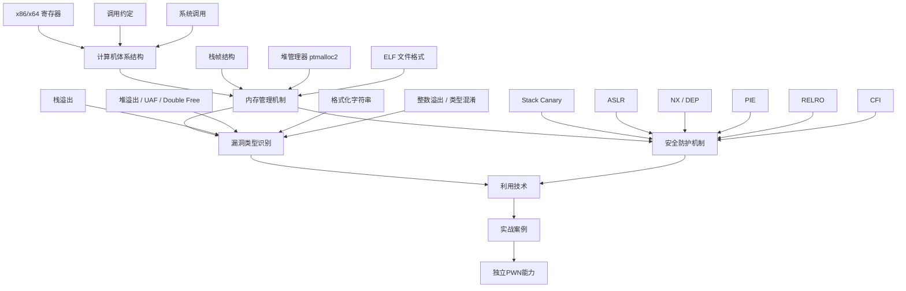
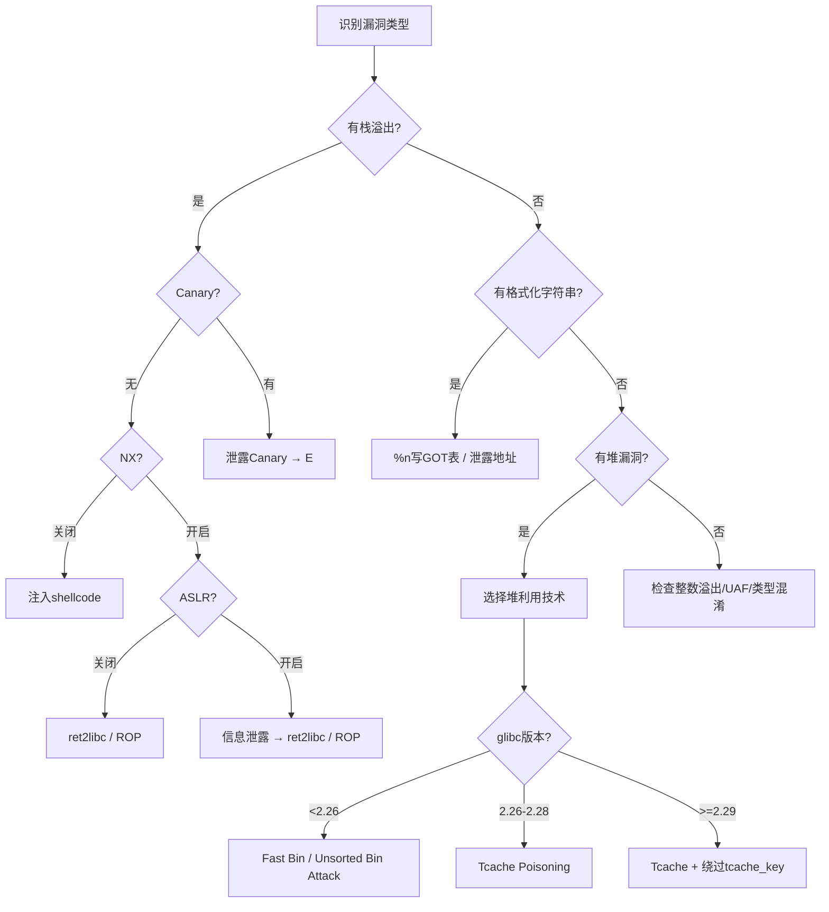

# 第16章 二进制安全PWN — 本章小结

## 知识体系全景图

本章围绕"内存安全漏洞的发现与利用"这一核心主题，从理论基础到实战案例构建了完整的PWN知识框架。下图展示了各知识模块之间的逻辑关系：

## 五大理论基石

### 1. 计算机体系结构

x86/x64架构是PWN的硬件基础。本章重点覆盖了三个核心知识点：

**寄存器体系**方面，x86的EIP（指令指针）和ESP/EBP（栈指针/栈帧基址）是栈溢出利用的直接攻击目标。x64扩展新增了R8-R15寄存器，且函数参数改为优先通过寄存器传递（RDI、RSI、RDX、RCX、R8、R9），这使得x64下的ROP链构造与x86存在本质区别——x86下参数全部在栈上，而x64下需要先用`pop rdi; ret`等gadget将值从栈加载到寄存器。

**调用约定**直接决定了利用难度。cdecl约定下参数在栈上、调用者清理栈，便于溢出后直接构造参数；而stdcall约定下被调用者清理栈，需要额外处理栈平衡。System V AMD64 ABI要求栈16字节对齐，否则`movaps`等指令会触发SIGSEGV——这是初学者编写x64 exploit时最常见的崩溃原因之一。

**系统调用机制**是shellcode和ret2syscall的基础。x86通过`int 0x80`触发，参数放在EBX-EBP中；x64通过`syscall`触发，参数放在RDI-R9中。构造`execve("/bin/sh", NULL, NULL)`需要精确设置这些寄存器：RAX=59、RDI指向"/bin/sh"字符串、RSI=0、RDX=0。

### 2. 内存管理机制

程序内存布局是理解漏洞利用的"地图"。栈向低地址增长、堆向高地址增长，两者相向而行——这个基本事实决定了栈溢出和堆溢出的覆盖方向。

**栈帧结构**是栈溢出利用的理论基础。函数调用时依次压入参数、返回地址、保存的EBP、局部变量。栈溢出的本质就是从局部变量区域向高地址写入，依次覆盖保存的EBP和返回地址。x64下由于参数通过寄存器传递，栈帧结构更简洁，但返回地址前的对齐填充（padding）可能因编译器优化而变化，不能想当然地计算偏移。

**堆管理器（ptmalloc2）**是堆利用的核心。其Bin机制将空闲chunk分为Fast Bin（单链表、LIFO、不合并）、Unsorted Bin（回收中转站）、Small Bin（双向链表、FIFO）和Large Bin（按大小排序的双向链表）四类。glibc 2.26引入的Tcache进一步简化了分配路径——每个线程缓存7个chunk（大小范围0x20-0x410），使用单链表管理，分配时优先于Fast Bin。Tcache的存在使得tcache poisoning成为当前最主流的堆利用技术，但也引入了`tcache_key`等安全检查。

**ELF文件格式**中的GOT/PLT机制是ret2plt攻击的理论基础。延迟绑定（Lazy Binding）使得GOT表在首次调用前存储的是PLT桩代码的地址而非真实函数地址，攻击者可以利用这个窗口期，或者在GOT表已解析后直接覆写其中的函数指针来劫持控制流。

### 3. 漏洞类型

本章系统介绍了七种内存安全漏洞，它们按利用难度和攻击面可以分为三个层次：

| 层次 | 漏洞类型 | 利用难度 | 典型成因 | 主要利用目标 |
|------|---------|---------|---------|-------------|
| 基础 | 栈缓冲区溢出 | ★☆☆ | gets()、strcpy()等无边界检查 | 覆盖返回地址 |
| 基础 | 格式化字符串 | ★★☆ | printf(user_input) | 任意读/写 |
| 中级 | 堆溢出 | ★★☆ | 写入超出堆块边界 | 覆盖chunk元数据 |
| 中级 | 整数溢出 | ★★☆ | 算术运算未检查边界 | 导致缓冲区分配不足 |
| 高级 | UAF | ★★★ | free后继续使用指针 | 劫持虚函数/回调 |
| 高级 | Double Free | ★★★ | 同一指针free两次 | 堆块重叠 |
| 高级 | 类型混淆 | ★★★ | 基类/派生类指针错误转换 | 调用错误的虚函数 |

栈溢出是最直观的漏洞——输入超出缓冲区大小，覆盖返回地址，程序跳转到攻击者指定的位置。格式化字符串则更为隐蔽，通过`%x`泄露栈数据、`%n`向任意地址写入，一个漏洞同时具备信息泄露和任意写入两种能力。堆漏洞的利用复杂度最高，但威力也最大——通过控制堆管理器的内部数据结构，可以实现任意地址分配（即"哪里写哪里"）。

### 4. 安全防护机制

现代系统部署了多层防护，每种防护针对特定的攻击手法：

| 防护机制 | 防御目标 | 开启方式 | 主要绕过方法 |
|---------|---------|---------|-------------|
| Stack Canary | 栈溢出覆盖返回地址 | `-fstack-protector-all` | 泄露Canary值、fork爆破、覆盖`__stack_chk_fail` |
| ASLR | 地址预测 | `/proc/sys/kernel/randomize_va_space=2` | 信息泄露、部分覆盖、ret2plt |
| NX/DEP | 栈/堆上执行shellcode | `-z noexecstack` | ret2libc、ROP、ret2syscall |
| PIE | 程序基地址预测 | `-fPIE -pie` | 信息泄露、部分覆盖 |
| Full RELRO | GOT表覆写 | `-z relro -z now` | 绕过GOT，改用其他间接跳转目标 |
| CFI | ROP/JOP控制流劫持 | `-fsanitize=cfi` | 利用CFI检查的粒度盲区 |

关键认知：这些防护机制并非互不相关，而是形成纵深防御。一道真实的PWN题或实际漏洞可能同时面对Canary+ASLR+NX+PIE+Full RELRO的组合，需要先泄露Canary和地址信息，再构造ROP链，整个利用过程是多种技术的串联。

### 5. 利用技术体系

本章介绍的利用技术按攻击目标可以归纳为三条主线：

**控制流劫持**是PWN的核心目标。基本路径是：栈溢出→覆盖返回地址→跳转到目标代码。当NX开启时，不能直接注入shellcode，需要通过ret2libc（复用system/execve等libc函数）、ret2plt（通过PLT调用已链接的外部函数）、ROP链（串联多个gadget构造任意操作）来实现代码复用。ret2csu利用`__libc_csu_init`中的通用gadget来控制寄存器，是x64下解决"找不到合适的pop rdi gadget"问题的经典方案。SROP（Sigreturn-Oriented Programming）则更进一步，通过伪造Signal Frame一次性设置所有寄存器，适用于gadget极度稀缺的场景。

**堆利用**是进阶方向。核心思路是控制空闲chunk的fd/bk指针，使malloc返回攻击者指定的地址。Fast Bin Attack通过伪造fd指针实现固定位置分配；Unsorted Bin Attack通过覆写bk指针在目标地址写入一个大数值；Tcache Poisoning直接覆写fd指针实现任意地址分配（glibc 2.26+）；House系列技巧则展示了各种创意性的堆利用手法——House of Force利用top chunk的size字段实现远距离分配，House of Spirit伪造空闲chunk实现栈上分配。

**辅助技术**贯穿所有利用场景。信息泄露是绕过ASLR的前提，通常通过puts/printf等函数泄露GOT表项或栈上的地址来计算基地址。栈迁移（Stack Pivoting）在栈空间不足时将栈指针迁移到堆或BSS段上，从而获得更大的ROP链布局空间。格式化字符串的`%n`写入可以在没有溢出漏洞的情况下实现任意地址写入，是修改GOT表、覆盖函数指针的有力工具。

## 核心技术要点速查

以下是贯穿全章的五个关键技术认知：

**第一，确定偏移是所有利用的起点。** pwntools的`cyclic()`生成的pattern中每个4字节（x86）或8字节（x64）子串都是唯一的，崩溃后根据EIP/RIP的值用`cyclic_find()`即可精确计算偏移。不要手动数A的个数——编译器的栈对齐、局部变量重排等优化会让你的计算出错。

**第二，信息泄露决定利用上限。** 在ASLR开启的环境中，不泄露任何地址信息几乎无法完成利用。最常见的泄露路径是：第一次溢出调用puts@plt打印GOT表中某函数的真实地址→计算libc基地址→第二次溢出构造ret2libc。这就是为什么大多数PWN题需要"两次利用"。

**第三，libc版本是利用方案的核心变量。** 同一个漏洞在不同libc版本下的利用方案可能完全不同——glibc 2.23没有Tcache检查，glibc 2.27的Tcache检查较弱，glibc 2.29+引入了`tcache_key`加密和更强的unlink检查，glibc 2.34移除了`__malloc_hook`/`__free_hook`。在编写exploit前务必确认目标libc版本。

**第四，堆利用的核心是控制fd/bk指针。** 无论使用哪种堆攻击技术，最终目的都是让malloc返回一个攻击者控制的地址。理解ptmalloc2在分配时如何遍历bin链表、如何使用fd/bk指针，是掌握所有堆利用技术的关键。

**第五，工具链决定实战效率。** pwntools提供exploit编写框架（进程/远程交互、shellcode生成、ROP链构造、ELF/libc解析）；GDB配合pwndbg/peda插件提供堆可视化和内存布局分析；ROPgadget/ropper从二进制文件中搜索gadget；one_gadget查找libc中可直接跳转获取shell的地址。熟练使用这些工具可以将exploit开发时间从数小时缩短到数十分钟。

## 防护绕过策略决策树

面对一道PWN题或一个真实漏洞，利用方案的制定遵循以下决策逻辑：

## 常见误区与纠正

在学习PWN的过程中，以下误区需要特别警惕：

**误区一：急于学习高级技术，忽视基础。** 很多初学者跳过栈溢出基础直接学习堆利用或SROP，结果在调试时连寄存器值的来源都搞不清楚。栈溢出看似简单，但它包含了偏移计算、地址泄露、ROP构造等所有PWN核心技能的雏形。建议至少完成20道基础栈溢出题再进入堆利用。

**误区二：只看WriteUp不动手调试。** 阅读他人的WriteUp能快速了解利用思路，但只有自己在GDB中单步跟踪malloc/free的执行流程、观察chunk的fd/bk指针如何变化，才能真正理解堆利用的原理。调试能力是区分"PWN入门者"和"PWN实战者"的分水岭。

**误区三：忽视编译器优化对利用的影响。** GCC的`-O2`优化会重排局部变量、内联函数、消除未使用的变量，这些都会改变栈帧布局，导致你在源码层面计算的偏移与实际运行时不一致。始终在目标二进制上用cyclic pattern实测偏移，不要依赖源码推算。

**误区四：认为工具能替代理解。** one_gadget不是总能找到可用的跳转地址，ROPgadget返回的gadget列表需要人工筛选和组合，pwntools的自动化脚本需要你手动填写偏移和地址。工具只是加速器，底层原理的理解才是核心竞争力。

**误区五：忽视安全性检查的版本差异。** 同一个利用技术在不同glibc版本下的表现可能天差地别。Tcache Poisoning在glibc 2.26下几乎不需要任何额外操作，但在glibc 2.29+下需要先泄露`tcache_key`才能绕过检查。编写exploit时必须针对目标环境的精确版本进行适配。

## 学习路径建议

PWN是一个需要大量实践的方向，理论知识只是地基，真正的提升来自于反复的"做题→卡住→调试→突破"循环。

**第一阶段：基础栈溢出（2-4周）。** 目标是掌握偏移计算、ret2text、shellcode注入。推荐从BUUCTF的"pwn1_sctf_2016"、"ciscn_2019_n_1"等入门题开始。每道题都要在GDB中单步跟踪，观察栈上返回地址被覆盖的全过程。

**第二阶段：绕过NX与ASLR（3-5周）。** 掌握ret2libc、ret2plt、信息泄露的两阶段利用。重点练习：puts@plt泄露GOT表项→计算libc基地址→第二次溢出获取shell的完整流程。使用LibcSearcher或libc-database确定目标libc版本。

**第三阶段：ROP深入（2-3周）。** 学习ROP链构造、ret2csu、ret2syscall、SROP。理解如何在gadget稀缺时利用通用gadgets控制寄存器。推荐练习"ret2csu"相关的CTF题目。

**第四阶段：堆利用入门（4-6周）。** 从glibc源码入手理解ptmalloc2的malloc/free流程，然后依次学习Fast Bin Attack、Unsorted Bin Attack、Tcache Poisoning。建议搭建glibc各版本的调试环境（推荐使用glibc-all-in-one），对比不同版本的安全检查差异。

**第五阶段：综合实战（持续）。** 参加CTF比赛（XCTF、CISCN、强网杯等）检验综合能力，尝试分析真实CVE漏洞的exploit（如CVE-2021-3156 sudo堆溢出、CVE-2023-4911 Looney Tunables），从实战中积累经验。

## 推荐工具链

| 工具 | 用途 | 安装方式 |
|------|------|---------|
| pwntools | exploit编写框架 | `pip install pwntools` |
| pwndbg | GDB增强插件（堆可视化） | `git clone && ./setup.sh` |
| ROPgadget | gadget搜索 | `pip install ROPgadget` |
| ropper | gadget搜索（支持更多格式） | `pip install ropper` |
| one_gadget | libc中一键getshell地址 | `gem install one_gadget` |
| LibcSearcher | 根据泄露地址确定libc版本 | `pip install LibcSearcher` |
| libc-database | libc版本离线查询 | `git clone` |
| checksec | 查看二进制安全防护状态 | pwntools内置 |
| gdb-multiarch | 多架构调试 | `apt install gdb-multiarch` |
| qemu-user | 跨架构用户态模拟 | `apt install qemu-user` |

## 进阶方向

掌握本章内容后，可以向以下方向深入发展，每个方向都代表了PWN技术在不同领域的延伸：

**Kernel PWN** 将攻击目标从用户态程序转移到Linux内核。内核态的漏洞利用需要理解内核的内存管理（SLAB/SLUB分配器）、权限模型（credentials结构体）、保护机制（SMEP/SMAP/KASLR/KPTI）。典型的利用目标是通过修改`commit_creds(prepare_kernel_cred(0))`获取root权限并返回用户态执行shell。Kernel PWN的调试难度远高于用户态，通常需要QEMU+GDB搭建内核调试环境。

**Browser PWN** 针对V8（Chrome）、SpiderMonkey（Firefox）等JavaScript引擎。攻击者通过精心构造的JavaScript代码触发JIT编译器或垃圾回收器中的内存安全漏洞，实现从浏览器渲染进程到系统级权限的提升。Browser PWN需要理解即时编译（JIT）、类型推断优化、垃圾回收机制等浏览器内部原理，学习门槛较高但实战价值巨大——浏览器漏洞是APT攻击中最常见的突破口之一。

**VM PWN** 研究虚拟机逃逸，即从虚拟机内部突破到宿主机。攻击面包括QEMU的设备模拟代码、VMware的RPC接口、VirtualBox的共享文件夹实现等。成功的VM逃逸意味着攻击者获得宿主机的完整控制权，这在云安全场景下尤其危险。

**ARM/MIPS PWN** 将PWN技术拓展到移动端和嵌入式设备。ARM架构使用不同的寄存器（R0-R3传递参数、LR保存返回地址）、不同的指令集（Thumb/ARM模式切换），MIPS则有延迟槽（Branch Delay Slot）等独特机制。移动设备和IoT设备的安全研究越来越重要，ARM PWN的市场需求持续增长。

**漏洞挖掘** 是从"利用已有漏洞"到"发现新漏洞"的质变。Fuzzing（模糊测试）通过向目标程序输入大量随机或半随机数据来触发崩溃，AFL++、LibFuzzer、Honggfuzz是主流的覆盖率引导Fuzzer。符号执行（Symbolic Execution）则使用形式化方法探索程序的所有路径，angr和KLEE是代表性工具。将PWN利用能力与漏洞挖掘能力结合，就具备了完整的漏洞研究能力。

---

> **本章小结：** PWN的本质是理解程序如何使用内存，然后找到并利用其中的错误。从栈溢出的"覆盖返回地址"到堆利用的"控制fd指针"，从ret2libc的"代码复用"到SROP的"一次性寄存器设置"，所有技术都围绕一个核心目标——劫持程序的控制流。理论是地基，调试是桥梁，实践是唯一的捷径。掌握了本章内容，你已经具备了独立分析和利用二进制内存安全漏洞的基础能力，接下来需要做的是大量练习，将知识转化为直觉。
