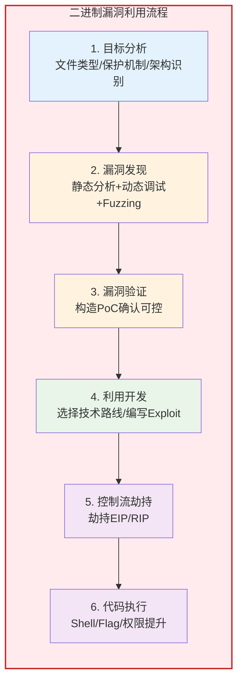
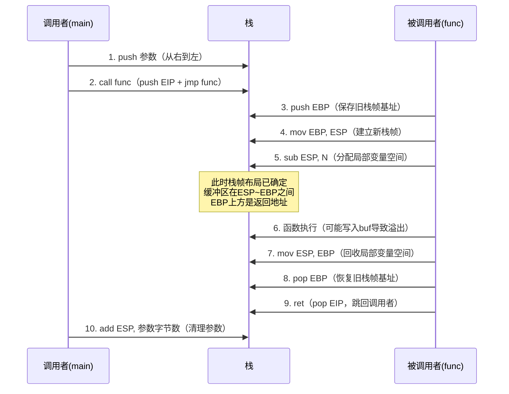

## 16.1 计算机体系结构基础

二进制安全PWN（攻防）的本质是在程序运行时操纵计算机的行为。要操纵它，必须先理解它。计算机体系结构是所有PWN技术的地基——你必须清楚CPU如何执行指令、寄存器如何分工、函数调用在机器层面如何实现、程序与操作系统内核如何通信。跳过这一节去学栈溢出，就像不会看乐谱就想演奏交响乐。

### 16.1.1 为什么体系结构是PWN的第一课

程序在CPU上运行时，漏洞利用的所有操作最终都会回归到机器层面：覆盖返回地址是修改栈上的一个指针，构造ROP链是在拼接机器指令片段，绕过ASLR是利用地址空间的布局规律。如果你不理解寄存器、栈帧、调用约定这些底层概念，后续的每一个利用技术都只能死记硬背，遇到变体就无法应对。

PWN攻防的完整流程可以概括为以下阶段：



本节建立的基础知识将贯穿以上每一个阶段。

### 16.1.2 x86/x64架构总览

x86是Intel在1978年推出的指令集架构（ISA），经过40多年的演进，从16位（8086）→32位（i386）→64位（AMD64/Intel 64），至今仍是桌面和服务器领域的主流架构。在CTF PWN中，绝大多数题目以x86-32和x86-64为目标架构，因此这是必须掌握的核心知识。

**架构演进与PWN的关系：**

| 特性 | x86（32位） | x64（64位） | 对PWN的影响 |
|------|------------|------------|------------|
| 地址宽度 | 4字节 | 8字节 | 覆盖返回地址所需payload长度不同 |
| 寄存器数量 | 8个通用 | 16个通用 | x64前6个参数用寄存器传，不全在栈上 |
| 默认调用约定 | cdecl（栈传参） | System V（寄存器传参） | ROP链构造方式完全不同 |
| 系统调用方式 | int 0x80 | syscall | syscall号和参数寄存器不同 |
| 地址空间大小 | 4GB | 128TB（理论48位） | ASLR熵值更大，爆破更难 |
| RIP相对寻址 | 不支持 | 支持 | PIE在x64下更高效，代码地址更随机 |
| 栈对齐要求 | 4字节 | 16字节 | x64有时需要额外ret对齐栈 |

理解这些差异不是学术问题——直接决定了你的exploit是成功还是崩溃。

### 16.1.3 CPU寄存器详解

寄存器是CPU内部的高速存储单元，访问速度比内存快100倍以上。程序的所有运算、控制流、函数调用都依赖寄存器。在PWN中，控制寄存器就是控制程序行为。

#### 通用寄存器

**x86（32位）通用寄存器：**

| 寄存器 | 名称 | 典型用途 | PWN中的角色 |
|--------|------|---------|------------|
| EAX | 累加器（Accumulator） | 函数返回值、系统调用号 | 控制EAX = 控制syscall功能 |
| EBX | 基址寄存器（Base） | 系统调用第1个参数、GOT基址 | ret2syscall时需设置 |
| ECX | 计数器（Counter） | 循环计数、字符串操作 | 部分利用中用于控制rep操作 |
| EDX | 数据寄存器（Data） | 系统调用第3个参数、乘法高位 | ret2syscall时需设置 |
| ESI | 源索引（Source Index） | 字符串/内存操作的源地址 | ROP中用于memcpy等gadget |
| EDI | 目标索引（Destination Index） | 字符串/内存操作的目标地址 | ROP中用于memcpy等gadget |
| EBP | 基址指针（Base Pointer） | 栈帧底部地址 | 覆盖EBP实现栈迁移 |
| ESP | 栈指针（Stack Pointer） | 栈顶地址 | 控制ESP = 控制栈布局 |
| EIP | 指令指针（Instruction Pointer） | 下一条指令地址 | **PWN的终极目标** |

**x64（64位）寄存器扩展：**

x64不仅将所有寄存器扩展到64位（RAX、RBX...），还新增了R8-R15共8个通用寄存器。每个64位寄存器可以按不同宽度访问：

```text
RAX（64位）
├── EAX（低32位）
│   ├── AX（低16位）
│   │   ├── AL（低8位）
│   │   └── AH（高8位）
│   └── （高16位无法独立访问）
└── （高32位：写EAX时自动清零）
```

**关键细节**：对EAX执行写操作时，RAX的高32位会被**自动清零**。这在构造ROP链时很重要——如果你的gadget是`mov eax, 1`，那么RAX的高32位会变成0，不会保留之前的值。

**x64新增寄存器的命名：**

| 寄存器 | 低32位 | 低16位 | 低8位 | 调用约定角色 |
|--------|--------|--------|-------|------------|
| R8 | R8D | R8W | R8B | syscall第5个参数 |
| R9 | R9D | R9W | R9B | syscall第6个参数 |
| R10 | R10D | R10W | R10B | syscall第4个参数（注意：不是RCX） |
| R11 | R11D | R11W | R11B | syscall会破坏 |
| R12-R15 | R12D-R15D | R12W-R15W | R12B-R15B | 被调用者保存 |

#### 特殊寄存器

**EIP/RIP（指令指针）**：这是PWN世界中最重要的寄存器。它指向CPU下一条要执行的指令地址。正常情况下EIP/RIP由CPU自动递增（顺序执行）或由跳转指令修改（分支/调用/返回）。漏洞利用的核心就是**劫持EIP/RIP的值**，让CPU跳转到攻击者指定的地址。

**EFLAGS/RFLAGS（标志寄存器）**：存储算术运算的结果状态，常用的标志位包括：

| 标志位 | 全称 | 含义 | PWN相关性 |
|--------|------|------|----------|
| ZF | Zero Flag | 运算结果为0时置1 | 条件跳转的判断依据 |
| CF | Carry Flag | 无符号溢出时置1 | 整数溢出漏洞的关键 |
| SF | Sign Flag | 运算结果为负时置1 | 条件跳转的判断依据 |
| OF | Overflow Flag | 有符号溢出时置1 | 整数溢出漏洞的关键 |
| DF | Direction Flag | 控制字符串操作方向 | rep指令的执行方向 |

**段寄存器（CS/DS/SS/ES/FS/GS）**：在现代Linux用户态PWN中，最值得关注的是**FS段寄存器**——在x86-64 Linux中，FS段被用于访问**线程本地存储（TLS）**，其中存放着**栈金丝雀（Stack Canary）**和线程信息。Canary的读取地址通常通过`fs:0x28`来获取。理解这一点对于后续绕过Canary保护至关重要。

### 16.1.4 内存字节序与数据表示

CPU在内存中存储多字节数据的方式有两种，称为字节序（Endianness）：

**大端序（Big-Endian）**：高位字节存放在低地址。网络协议（TCP/IP）使用大端序，因此大端序也叫"网络字节序"。

**小端序（Little-Endian）**：低位字节存放在低地址。x86/x64架构使用小端序。

示例：将整数`0x12345678`存放在地址`0x1000`处：

```text
地址：    0x1000  0x1001  0x1002  0x1003
大端序：   0x12    0x34    0x56    0x78    （人阅读顺序）
小端序：   0x78    0x56    0x34    0x12    （x86实际存储）
```

在PWN中，字节序直接影响你构造payload时的字节排列。当你用GDB看到栈上的值是`0x00007fff12345678`时，内存中的实际字节序列是`78 56 34 12 ff 7f 00 00`（小端序）。写exploit时如果字节序搞反，payload会完全失效且不会有任何报错——这是初学者最常犯的隐蔽错误之一。

**实践验证**——用GDB观察小端序：

```bash
# 编写一个简单程序
cat > /tmp/endian_demo.c << 'EOF'
#include <stdio.h>
int main() {
    unsigned int val = 0x12345678;
    unsigned char *p = (unsigned char*)&val;
    printf("Address: %p\n", p);
    printf("Byte 0: 0x%02x (lowest address)\n", p[0]);
    printf("Byte 1: 0x%02x\n", p[1]);
    printf("Byte 2: 0x%02x\n", p[2]);
    printf("Byte 3: 0x%02x (highest address)\n", p[3]);
    return 0;
}
EOF
gcc -o /tmp/endian_demo /tmp/endian_demo.c
/tmp/endian_demo
# 输出：
# Byte 0: 0x78 (lowest address)  ← 0x78是0x12345678的最低字节
# Byte 1: 0x56
# Byte 2: 0x34
# Byte 3: 0x12 (highest address) ← 0x12是最高字节
```

### 16.1.5 x86指令编码基础

你不需要成为汇编专家才能做PWN，但必须理解指令的基本结构，否则在GDB中看到的机器码就是天书。

x86指令的一般编码格式：

```text
┌──────────┬──────────┬──────────┬──────────┬──────────┬──────────┐
│  前缀     │ 操作码   │ ModR/M   │  SIB     │  偏移    │  立即数   │
│ (0-4B)   │ (1-3B)   │ (0-1B)   │ (0-1B)   │ (0/1/2/4B)│(0/1/2/4B)│
└──────────┴──────────┴──────────┴──────────┴──────────┴──────────┘
```

**各字段说明：**

- **前缀（Prefix）**：修改指令行为。例如`0x90`是NOP，`0xCC`是`int3`（调试断点），`REX`前缀是x64模式的标识
- **操作码（Opcode）**：决定指令做什么。例如`0xC3`是`ret`，`0xE8`是`call`，`0x50-0x57`是`push reg`
- **ModR/M**：编码操作数的寻址模式和寄存器
- **偏移（Displacement）**：地址偏移量
- **立即数（Immediate）**：硬编码的常量值

**PWN中最常遇到的机器码：**

| 机器码 | 汇编指令 | 含义 | PWN用途 |
|--------|---------|------|--------|
| `0xC3` | `ret` | 从栈弹出值到EIP/RIP | ROP链的连接器 |
| `0xE8 xx xx xx xx` | `call addr` | 调用函数 | 识别函数调用 |
| `0xCC` | `int3` | 断点中断 | GDB断点原理 |
| `0x90` | `nop` | 空操作 | NOP sled（滑板） |
| `0xCD 0x80` | `int 0x80` | x86系统调用 | ret2syscall |
| `0x0F 0x05` | `syscall` | x64系统调用 | ret2syscall |
| `0x5?-0x5?` | `push reg` | 压栈 | 识别栈操作 |
| `0x68 xx xx xx xx` | `push imm32` | 压入立即数 | 构造栈数据 |

在GDB/pwndbg中使用`x/10i $rip`查看反汇编时，左侧的十六进制列就是机器码。理解这些编码能帮助你在没有源码的二进制中快速定位关键指令。

**实践**——在GDB中观察机器码：

```bash
# 用pwndbg查看指令的机器码表示
gdb -q /tmp/endian_demo
(gdb) b main
(gdb) r
(gdb) x/5i $rip
# 输出类似：
# => 0x555555555149:  push   rbp        →  55
#    0x55555555514a:  mov    rbp,rsp    →  48 89 e5
#    0x55555555514d:  sub    rsp,0x10   →  48 83 ec 10
```

### 16.1.6 特权级与保护环

现代CPU实现了多级特权保护机制（Protection Rings），x86架构定义了Ring 0到Ring 3共4个特权级：

```text
┌─────────────────────────────────┐
│  Ring 0 — 内核态（Kernel）       │  ← 完全硬件访问权限
│  ┌─────────────────────────────┐│
│  │  Ring 1 — 设备驱动（少用）   ││
│  │  ┌─────────────────────────┐││
│  │  │  Ring 2 — 设备驱动（少用）│││
│  │  │  ┌─────────────────────┐│││
│  │  │  │  Ring 3 — 用户态     ││││  ← 普通程序运行在这里
│  │  │  │  (User Mode)        ││││
│  │  │  └─────────────────────┘│││
│  │  └─────────────────────────┘││
│  └─────────────────────────────┘│
└─────────────────────────────────┘
```

Linux只使用Ring 0（内核态）和Ring 3（用户态）。当用户程序需要访问硬件（如读写文件、分配内存、创建网络连接），必须通过**系统调用**（System Call）切换到Ring 0执行，完成后再返回Ring 3。

**PWN视角下的特权级**：
- 普通PWN：在Ring 3获取shell，拥有当前用户的权限
- 内核PWN：利用Linux内核漏洞，从Ring 3提升到Ring 0，获取root权限（这属于更高级的内核漏洞利用范畴）

### 16.1.7 调用约定详解

调用约定（Calling Convention）是函数调用时的"交通规则"——它规定了参数如何传递、返回值如何存放、谁负责清理栈。在PWN中，调用约定直接决定了你如何构造payload和ROP链。

#### x86 cdecl约定（Linux 32位标准）

```c
int add(int a, int b, int c);
// 调用: add(1, 2, 3);
```

调用时栈的状态：

```text
高地址
┌──────────────────┐
│     ...          │
├──────────────────┤
│  返回地址 (EIP)   │ ← call指令自动压入
├──────────────────┤
│  旧的EBP值        │ ← 函数序言(push ebp)压入
├──────────────────┤
│  局部变量         │ ← sub esp, N 分配
├──────────────────┤
│  参数 c = 3       │ ← 最先压栈（从右到左）
├──────────────────┤
│  参数 b = 2       │
├──────────────────┤
│  参数 a = 1       │ ← 最后压栈，紧邻返回地址之上
├──────────────────┤
│  ...             │
低地址
```

**cdecl的关键特性：**
- 参数**从右到左**压入栈中——这意味着第一个参数（a）离返回地址最近
- **调用者**负责清理栈（通过`add esp, N`或`pop`指令）
- 返回值存放在EAX中
- 如果返回64位值（如`long long`），高32位在EDX，低32位在EAX

**栈溢出利用中的影响**：攻击者写入的缓冲区溢出后，会依次覆盖EBP和返回地址。由于参数从右到左压栈，且调用者清理栈，攻击者可以通过覆盖返回地址来劫持控制流，而调用者会在返回后继续执行——只是执行的已经不是原来的代码了。

#### x64 System V AMD64 ABI（Linux 64位标准）

```c
long syscall(long nr, long a1, long a2, long a3, long a4, long a5, long a6);
```

**参数传递规则：**

| 参数顺序 | 整数/指针参数 | 浮点参数 |
|---------|-------------|---------|
| 第1个 | RDI | XMM0 |
| 第2个 | RSI | XMM1 |
| 第3个 | RDX | XMM2 |
| 第4个 | RCX | XMM3 |
| 第5个 | R8 | XMM4 |
| 第6个 | R9 | XMM5 |
| 第7个 | 栈上传递 | XMM6 |
| 第8个 | 栈上传递 | XMM7 |
| 第9+个 | 栈上传递 | 栈上传递 |

**其他关键规则：**
- 返回值：RAX（128位返回值使用RAX:RDX）
- 栈必须在call指令执行前保持**16字节对齐**
- RAX寄存器在调用前需设置为浮点参数的数量（用于variadic函数如printf）
- **被调用者保存寄存器**：RBX、RBP、R12-R15（callee-saved）
- **调用者保存寄存器**：RAX、RCX、RDX、RSI、RDI、R8-R11（caller-saved）

**PWN中的关键影响**：在x64下，前6个整数参数通过寄存器传递，不再像x86那样全部在栈上。这意味着：
1. 简单的栈溢出**不能直接控制函数参数**——需要额外的`pop rdi; ret`等gadget来设置寄存器
2. ROP链的构造比x86复杂得多——每个寄存器都需要对应的gadget
3. 一个典型的x64 ROP链调用`system("/bin/sh")`需要：
   - `pop rdi; ret`（将"/bin/sh"的地址弹入RDI）
   - `ret`（可能需要用于栈对齐）
   - `system`的PLT地址

#### stdcall约定（Windows API常用）

```c
// Windows API示例
int __stdcall MessageBoxA(HWND hWnd, LPCSTR lpText, LPCSTR lpCaption, UINT uType);
```

- 参数从右到左压栈（与cdecl相同）
- **被调用者**负责清理栈（通过`ret N`指令，N是参数总字节数）
- 这个差异在栈溢出利用中有重要影响：stdcall函数的`ret N`指令会同时弹出返回地址和N字节的参数，攻击者需要精确计算覆盖量

#### cdecl vs stdcall对比

| 特性 | cdecl | stdcall | System V (x64) |
|------|-------|---------|----------------|
| 参数传递 | 栈（右到左） | 栈（右到左） | 寄存器+栈 |
| 栈清理 | 调用者 | 被调用者 | 调用者 |
| 返回值 | EAX | EAX | RAX |
| 可变参数 | 支持 | 不支持 | 支持 |
| PWN复杂度 | 低 | 中 | 高 |

**实践验证**——观察cdecl调用的栈帧：

```bash
cat > /tmp/callconv_demo.c << 'EOF'
#include <stdio.h>

int vulnerable_function(int a, int b) {
    char buf[64];
    gets(buf);  // 故意的栈溢出
    return a + b;
}

int main() {
    vulnerable_function(0xdeadbeef, 0xcafebabe);
    return 0;
}
EOF
gcc -o /tmp/callconv_demo /tmp/callconv_demo.c -fno-stack-protector -no-pie -z execstack -m32 2>/dev/null || \
gcc -o /tmp/callconv_demo /tmp/callconv_demo.c -fno-stack-protector -no-pie -z execstack
# 用GDB观察栈帧布局
gdb -q /tmp/callconv_demo -ex 'b vulnerable_function' -ex 'r' -ex 'info frame' -ex 'x/20xw $esp' -ex 'quit'
```

### 16.1.8 系统调用机制

系统调用（System Call）是用户态程序请求内核服务的唯一合法途径。读文件、写文件、创建进程、分配内存——所有这些操作最终都要通过系统调用完成。在PWN中，当无法通过ret2libc获取shell时，直接构造系统调用是最后的兜底方案。

#### x86系统调用（int 0x80）

```text
触发方式：int 0x80（软中断，陷入内核）

参数寄存器：
┌──────────┬────────────────────┐
│ EAX      │ 系统调用号           │
│ EBX      │ 第1个参数            │
│ ECX      │ 第2个参数            │
│ EDX      │ 第3个参数            │
│ ESI      │ 第4个参数            │
│ EDI      │ 第5个参数            │
│ EBP      │ 第6个参数            │
└──────────┴────────────────────┘

返回值：EAX
```

#### x64系统调用（syscall）

```text
触发方式：syscall指令

参数寄存器：
┌──────────┬────────────────────┐
│ RAX      │ 系统调用号           │
│ RDI      │ 第1个参数            │
│ RSI      │ 第2个参数            │
│ RDX      │ 第3个参数            │
│ R10      │ 第4个参数（注意！不是RCX）│
│ R8       │ 第5个参数            │
│ R9       │ 第6个参数            │
└──────────┴────────────────────┘

返回值：RAX
注意：syscall会破坏RCX（保存返回地址）和R11（保存RFLAGS）
```

**重要差异**：x64的syscall使用R10作为第4个参数，而不是RCX。这是因为`syscall`指令会将RIP保存到RCX中（用于sysret返回），所以RCX被指令本身占用了。这是一个常见的坑——在x64构造syscall gadget时，第4个参数必须放到R10而不是RCX。

#### PWN常用系统调用

| 功能 | x86调用号（EAX） | x64调用号（RAX） | 参数 |
|------|----------------|----------------|------|
| read | 3 | 0 | fd, buf, count |
| write | 4 | 1 | fd, buf, count |
| open | 5 | 2 | filename, flags, mode |
| close | 6 | 3 | fd |
| execve | 11 | 59 | filename, argv, envp |
| mmap | 192 (90 on x64) | 9 | addr, len, prot, flags, fd, offset |
| rt_sigreturn | 119 | 15 | （SROP使用） |
| mprotect | 125 | 10 | addr, len, prot |

#### ret2syscall实战原理

当以下条件同时满足时，ret2syscall是可行的利用方案：
1. NX开启（不能在栈上执行shellcode）
2. 没有可用的system函数或"/bin/sh"字符串（无法ret2libc）
3. 二进制中存在足够的`pop reg; ret`gadget（可以用ROPgadget找到）

典型x64 ret2syscall调用`execve("/bin/sh", NULL, NULL)`的ROP链：

```text
┌────────────────────────────────────────────┐
│ pop rax; ret        │ gadget地址           │
├────────────────────────────────────────────┤
│ 59                  │ execve的调用号        │
├────────────────────────────────────────────┤
│ pop rdi; ret        │ gadget地址           │
├────────────────────────────────────────────┤
│ "/bin/sh"地址       │ 需要程序中存在该字符串  │
├────────────────────────────────────────────┤
│ pop rsi; ret        │ gadget地址           │
├────────────────────────────────────────────┤
│ 0                   │ argv = NULL          │
├────────────────────────────────────────────┤
│ pop rdx; ret        │ gadget地址           │
├────────────────────────────────────────────┤
│ 0                   │ envp = NULL          │
├────────────────────────────────────────────┤
│ syscall             │ 触发系统调用          │
└────────────────────────────────────────────┘
```

```bash
# 使用ROPgadget查找可用的gadget
ROPgadget --binary /tmp/callconv_demo --only "pop|ret" | head -20
ROPgadget --binary /tmp/callconv_demo --only "syscall"
```

### 16.1.9 栈的工作机制

栈是PWN中最核心的概念。绝大多数初级和中级漏洞利用都围绕栈展开。

#### 函数调用的完整栈操作

一个完整的函数调用在x86中包含以下步骤：



#### 栈帧结构图解

```text
高地址
┌────────────────────────────────┐
│  main的栈帧                     │
├────────────────────────────────┤
│  参数3                          │  ← 函数参数（x86栈传参）
├────────────────────────────────┤
│  参数2                          │
├────────────────────────────────┤
│  参数1                          │
├────────────────────────────────┤
│  返回地址 (EIP)                  │  ← call指令压入，ret指令弹出
├────────────────────────────────┤
│  保存的EBP                      │  ← func序言压入
├──── EBP指向这里 ────────────────┤
│  局部变量1                      │  ← 低地址，先分配
├────────────────────────────────┤
│  ...                           │
├────────────────────────────────┤
│  缓冲区buf[64]                  │  ← 栈溢出的起点
├────────────────────────────────┤
│  ...                           │
├──── ESP指向这里 ────────────────┤
│  (栈顶，向下增长)                │
低地址
```

**栈溢出的原理**：当`gets(buf)`或`strcpy(buf, input)`等函数不限制输入长度时，攻击者输入超过64字节的数据，会依次覆盖：局部变量 → 保存的EBP → 返回地址。通过精确控制覆盖返回地址的内容，攻击者可以让函数返回时跳转到任意地址。

**x64的差异**：
- 寄存器和返回地址都是8字节（不是4字节）
- 栈需要16字节对齐，有时会在栈帧中出现padding
- 前6个参数不在栈上（通过寄存器传递），但溢出仍然可以覆盖返回地址

### 16.1.10 指令执行流水线与分支预测

现代CPU采用流水线（Pipeline）技术来提高指令吞吐量。以经典的5级流水线为例：

```text
取指(IF) → 译码(ID) → 执行(EX) → 访存(MEM) → 写回(WB)
```

**PWN相关的影响**：

1. **分支预测**：CPU会预测条件跳转的方向并提前执行。当预测错误时，流水线被冲刷，产生性能损失。Spectre漏洞正是利用了分支预测的侧信道来泄露信息——虽然这属于高级攻击，但理解流水线有助于理解为什么缓存计时攻击是可行的。

2. **推测执行（Speculative Execution）**：CPU在分支预测的基础上，会推测性地执行后续指令。即使推测执行的结果最终被丢弃，其对缓存的影响可能被攻击者探测到。这就是Spectre/Meltdown漏洞族的核心原理。

3. **ROP与流水线**：ROP（Return-Oriented Programming）通过不断地`ret`来跳转到下一个gadget，每次`ret`都会导致流水线冲刷。这意味着ROP链的执行速度远低于正常程序，但对于漏洞利用来说这完全不是问题——我们只关心功能正确性，不关心性能。

### 16.1.11 常见误区与纠正

**误区1："x64就是x86的简单扩展，学会了x86就会x64"**

纠正：x64的调用约定（参数通过寄存器传递）使得ROP链的构造方式完全不同。x86的`system("/bin/sh")`只需要覆盖返回地址为system，再在栈上放好参数；x64则需要先找到`pop rdi; ret`gadget，将"/bin/sh"地址放入RDI，还需要处理栈对齐问题。两者的exploit代码差异很大，不能简单迁移。

**误区2："理解寄存器就够了，不需要了解机器码"**

纠正：当你在没有源码的二进制中做PWN时，IDA/Ghidra的反汇编结果就是你的全部信息。理解基本的机器码编码（特别是`ret`=0xC3、`call`=0xE8、`syscall`=0x0F05）能帮助你在二进制中快速搜索可用的gadget片段。ROPgadget工具也是基于机器码模式匹配来工作的。

**误区3："栈从高地址向低地址增长，所以溢出只能覆盖高地址的数据"**

纠正：栈的"增长方向"是指ESP/RSP移动的方向（减小），但**数据写入方向**是由字符串操作函数决定的——`strcpy`、`gets`等从低地址向高地址写入。正是因为写入方向与栈帧布局方向相反（栈帧从高到低排列，数据从低到高写入），溢出才能跨越缓冲区边界覆盖EBP和返回地址。

**误区4："int 0x80和syscall只是新旧版本的区别，可以互换"**

纠正：在x64程序中，`int 0x80`虽然仍然可以触发，但它使用的是**x86的系统调用号和参数寄存器**（EBX、ECX等），而不是x64的。如果你在x64程序中用`int 0x80`触发系统调用，RAX中应该放x86的调用号（execve=11），不是x64的（execve=59）。更重要的是，`int 0x80`在x64模式下访问的是低32位寄存器，可能产生地址截断问题——如果"/bin/sh"的地址高于4GB，RDI的低32位（EDI）可能指向错误的位置。

**误区5："函数参数越多，栈溢出越容易利用"**

纠正：在x64下恰恰相反。x64的前6个参数通过寄存器传递，不在栈上，所以你不能通过栈溢出来控制这些参数。你需要额外的gadget来设置寄存器。参数越多，需要的gadget链越长，利用难度越高。

### 16.1.12 工具速查

| 工具 | 用途 | 常用命令 |
|------|------|---------|
| GDB + pwndbg | 动态调试、栈查看 | `pwndbg> stack 20` |
| ROPgadget | 搜索ROP gadget | `ROPgadget --binary file` |
| ropper | 高级gadget搜索 | `ropper -f file --search "pop rdi"` |
| checksec | 查看保护机制 | `checksec --file=file` |
| readelf | 查看ELF头信息 | `readelf -h file` |
| objdump | 反汇编 | `objdump -d file` |
| pwntools | Python漏洞利用框架 | `from pwn import *` |
| one_gadget | 查找execve单gadget | `one_gadget libc.so.6` |

### 16.1.13 进阶：x86指令前缀与REX前缀

在x64模式下，REX前缀（0x40-0x4F）用于扩展寄存器寻址。理解REX前缀能帮助你手动解析GDB中看到的机器码。

REX前缀的4个位：
```text
0100 W R X B
     │ │ │ └─ B: 扩展ModR/M中的r/m字段或SIB中的base字段（访问R8-R15）
     │ │ └─── X: 扩展SIB中的index字段
     │ └───── R: 扩展ModR/M中的reg字段
     └─────── W: 操作数宽度（0=32位，1=64位）
```

示例：`48 89 e5`是`mov rbp, rsp`
- `48` = REX前缀（W=1，表示64位操作）
- `89` = MOV指令的操作码
- `e5` = ModR/M字节（源=RSP，目标=RBP）

没有REX前缀时，`89 e5`是`mov ebp, esp`（32位操作）。一个字节的差异决定了操作数是32位还是64位。

### 16.1.14 本节总结

本节建立了PWN所需的核心硬件基础：

1. **寄存器体系**：x86的8个通用寄存器 + x64的16个通用寄存器，其中EIP/RIP是PWN的终极目标
2. **调用约定**：cdecl（x86栈传参）vs System V（x64寄存器传参），直接决定ROP链构造方式
3. **系统调用**：int 0x80（x86）vs syscall（x64），ret2syscall的理论基础
4. **字节序**：x86/x64使用小端序，写payload时必须注意字节排列
5. **指令编码**：理解基本机器码格式，帮助在二进制中定位关键指令
6. **特权级**：Ring 0（内核）vs Ring 3（用户态），系统调用是跨越特权级的桥梁
7. **栈帧结构**：局部变量→保存的EBP→返回地址→参数，溢出覆盖的精确目标

掌握了这些基础，你就能理解后续章节中每一种利用技术的底层原理。记住：**PWN不是魔法，是精确的工程**——每一步操作都有明确的机器层面的含义。
