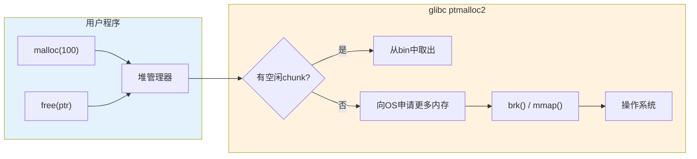
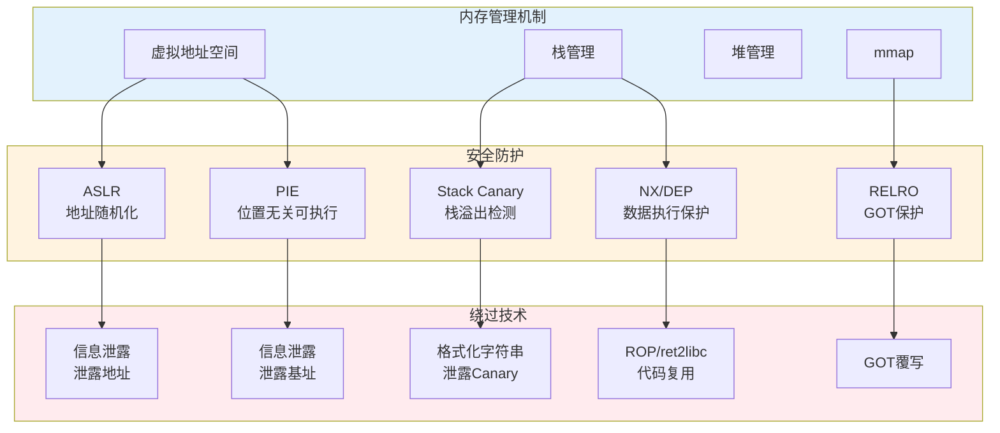

## 16.2 内存管理机制

内存管理是操作系统的核心功能之一，也是二进制安全（PWN）的理论根基。程序中的每一个变量、每一条指令、每一次函数调用，最终都落实到内存中的某个地址。攻击者对程序的控制流劫持、数据篡改、权限提升，本质上都是对内存管理机制的滥用。本节从操作系统层面的虚拟内存机制出发，逐层深入到程序内存布局、栈的工作原理、堆管理概述，以及mmap等辅助内存机制，构建完整的内存管理知识体系。

---

### 16.2.1 虚拟内存与分页机制

#### 为什么需要虚拟内存

早期的操作系统直接使用物理内存地址，程序必须知道自己将被加载到哪个物理地址才能正常运行。这带来三个致命问题：

1. **地址冲突**：两个程序无法同时使用相同的物理地址
2. **安全隔离**：任何程序都能读写其他程序的内存，缺乏保护
3. **内存碎片**：物理内存经过反复分配释放后产生大量不连续的空闲区域

虚拟内存（Virtual Memory）通过引入一层地址映射来解决这些问题。每个进程拥有独立的虚拟地址空间，程序使用虚拟地址编程，CPU中的内存管理单元（MMU，Memory Management Unit）负责将虚拟地址翻译为物理地址。这个翻译过程对程序完全透明。

#### 分页（Paging）

虚拟内存的地址翻译以"页"（Page）为单位进行。Linux在x64系统上使用4KB大小的页（也可以配置为2MB或1GB的大页，即Huge Page）。

**地址翻译的三级结构（简化模型）：**

虚拟地址被拆分为多个索引字段，逐级查找页表：

```text
x64 虚拟地址结构（4级页表，48位有效地址）：
┌────────┬────────┬────────┬────────┬──────────┐
│ PGD索引 │ PUD索引 │ PMD索引 │ PTE索引 │ 页内偏移  │
│ (9位)   │ (9位)   │ (9位)   │ (9位)   │ (12位)   │
└────────┴────────┴────────┴────────┴──────────┘

翻译过程：
  虚拟地址 → PGD → PUD → PMD → PTE → 物理页帧号 + 页内偏移 → 物理地址
```

每个页表条目（PTE，Page Table Entry）除了存储物理页帧号外，还包含一组权限标志位：

| 标志位 | 含义 | PWN中的意义 |
|--------|------|-------------|
| Present (P) | 页是否在物理内存中 | 访问不存在的页触发缺页异常 |
| Read/Write (R/W) | 读写权限 | 只读页写入触发保护异常（对应RELRO） |
| User/Supervisor (U/S) | 用户态/内核态权限 | 内核页用户态访问触发保护异常（对应SMEP/SMAP） |
| Execute Disable (XD) | 是否可执行 | 代码注入防御（对应NX/DEP） |
| Accessed (A) | 是否被访问过 | 用于页面置换算法 |
| Dirty (D) | 是否被写过 | 决定换出时是否需要写回磁盘 |

#### TLB（Translation Lookaside Buffer）

每次内存访问都走4级页表翻译开销巨大。TLB是MMU中的高速缓存，存储最近使用的虚拟地址到物理地址的映射。当ASLR改变地址映射时，TLB会被刷新，这也是ASLR有性能开销的原因之一。

#### Swap（交换空间）

当物理内存不足时，操作系统将不活跃的页面换出到磁盘上的交换空间（Swap分区或Swap文件）。对于PWN而言，Swap意味着某些"内存中的数据"可能实际存储在磁盘上，在内存取证（Memory Forensics）场景中需要同时分析物理内存和Swap空间。

#### demand paging（按需分页）

Linux不会在进程启动时就分配所有虚拟地址对应的物理页，而是在首次访问时才分配——这就是按需分页。访问一个从未使用过的虚拟地址会触发缺页异常（Page Fault），内核在异常处理中分配物理页并建立映射。这个机制对PWN的影响在于：`/proc/<pid>/maps`中显示的地址范围不一定都有对应的物理页。

---

### 16.2.2 进程内存布局

#### Linux进程虚拟地址空间全貌

Linux为每个进程提供独立的虚拟地址空间。x64系统理论上支持64位地址（16 EB），但实际上只有低48位有效（高16位是符号扩展），因此用户态可用地址空间为 `0x0000000000000000` ~ `0x00007FFFFFFFFFFF`（共128TB），内核空间占据 `0xFFFF800000000000` 以上的地址。

```text
x64 Linux 进程虚拟地址空间布局：

0x0000000000000000  ┌──────────────────────────┐
                    │       NULL区域            │  不可读写（捕获空指针解引用）
                    │    (0x0 ~ 0xFFFFF)        │
0x0000000000100000  ├──────────────────────────┤
                    │       .text 段            │  代码段：只读、可执行 (R-X)
                    │   (程序指令/机器码)        │
                    ├──────────────────────────┤
                    │       .rodata 段          │  只读数据段 (R--)
                    │  (字符串常量/跳转表等)     │
                    ├──────────────────────────┤
                    │       .data 段            │  已初始化全局/静态变量 (RW-)
                    ├──────────────────────────┤
                    │       .bss 段             │  未初始化全局/静态变量 (RW-)
                    │   (零初始化，不占文件空间)  │
                    ├──────────────────────────┤
                    │       堆 (Heap)           │  动态分配内存，向高地址增长 ↗
                    │    brk/sbrk 管理区域       │
                    ├──────────────────────────┤
                    │    ... (可能有空洞) ...    │
                    ├──────────────────────────┤
                    │     mmap 区域             │  共享库、mmap文件、匿名映射
                    │  (向低地址增长 ↙)          │
                    ├──────────────────────────┤
                    │    ... (可能有空洞) ...    │
                    ├──────────────────────────┤
                    │       栈 (Stack)          │  函数调用栈，向低地址增长 ↙
                    │   (默认上限约8MB)          │
                    ├──────────────────────────┤
                    │   内核空间                 │  用户态不可访问 (SMEP/SMAP)
0x00007FFFFFFFFFFF  └──────────────────────────┘

0xFFFF800000000000  ┌──────────────────────────┐
                    │       内核空间             │
0xFFFFFFFFFFFFFFFF  └──────────────────────────┘
```

#### ASLR（Address Space Layout Randomization）

ASLR是操作系统级别的安全机制，在进程每次启动时随机化以下区域的基址：

- **栈基址**：栈的起始地址每次不同
- **堆基址**：堆的起始地址每次不同
- **mmap基址**：共享库加载地址每次不同

ASLR通过`/proc/sys/kernel/randomize_va_space`控制，值为：
- 0：关闭ASLR
- 1：仅随机化栈和mmap区域
- 2（默认）：随机化栈、mmap和堆

```bash
# 查看ASLR设置
cat /proc/sys/kernel/randomize_va_space

# 临时关闭ASLR（调试用）
echo 0 | sudo tee /proc/sys/kernel/randomize_va_space

# 查看进程内存布局（观察ASLR效果）
cat /proc/<pid>/maps
```

PIE（Position Independent Executable）使主程序代码段也被ASLR随机化。没有PIE的程序，其`.text`段地址是固定的，攻击者可以直接使用程序中的gadget地址。启用PIE后，程序每次加载的基址都不同，攻击者需要先泄露基址才能构造ROP链。

#### 查看进程内存布局

`/proc/<pid>/maps`是分析进程内存布局的核心工具：

```bash
# 示例输出
$ cat /proc/$(pidof target)/maps
555555554000-555555555000 r--p 00000000 08:01 12345  /path/to/target
555555555000-555555556000 r-xp 00001000 08:01 12345  /path/to/target
555555556000-555555557000 r--p 00002000 08:01 12345  /path/to/target
555555557000-555555558000 r--p 00002000 08:01 12345  /path/to/target
555555558000-555555559000 rw-p 00003000 08:01 12345  /path/to/target
555555559000-55555557a000 rw-p 00000000 00:00 0      [heap]
7ffff7dc3000-7ffff7deb000 r--p 00000000 08:01 67890  /usr/lib/x86_64-linux-gnu/libc.so.6
7ffff7deb000-7ffff7f62000 r-xp 00028000 08:01 67890  /usr/lib/x86_64-linux-gnu/libc.so.6
7ffff7f62000-7ffff7fba000 r--p 0019f000 08:01 67890  /usr/lib/x86_64-linux-gnu/libc.so.6
7ffff7fba000-7ffff7fbe000 r--p 001f6000 08:01 67890  /usr/lib/x86_64-linux-gnu/libc.so.6
7ffff7fbe000-7ffff7fc0000 rw-p 001fa000 08:01 67890  /usr/lib/x86_64-linux-gnu/libc.so.6
7ffff7fc0000-7ffff7fc8000 rw-p 00000000 00:00 0
7ffff7fc8000-7ffff7fcc0000 r--p 00000000 00:00 0      [vvar]
7ffff7fcc0000-7ffff7fce0000 r-xp 00000000 00:00 0      [vdso]
7ffff7fce0000-7ffff7fd0000 r--p 00000000 08:01 54321  /usr/lib/x86_64-linux-gnu/ld-linux-x86-64.so.2
7ffff7fd0000-7ffff7ff3000 r-xp 00002000 08:01 54321  /usr/lib/x86_64-linux-gnu/ld-linux-x86-64.so.2
7ffffffde000-7ffffffff000 rw-p 00000000 00:00 0      [stack]
```

每行的格式为：`地址范围 权限 偏移 设备号 inode 文件路径`

关键字段解读：

| 字段 | 含义 | 安全意义 |
|------|------|----------|
| 权限`r-xp` | 可读、可执行、私有映射 | 代码段，可找ROP gadget |
| 权限`rw-p` | 可读、可写、私有映射 | 数据段，可读写但不可执行 |
| 权限`r--p` | 只读、私有映射 | 只读数据，不可写不可执行 |
| `[heap]` | 堆区域 | 动态分配的数据 |
| `[stack]` | 栈区域 | 局部变量、返回地址 |
| `[vdso]` | Virtual Dynamic Shared Object | 内核映射的代码，可用于ROP |
| `[vvar]` | Virtual Variables | 内核映射的只读数据 |

```bash
# GDB中查看内存映射
info proc mappings

# 使用pmap查看（格式更友好）
pmap -x <pid>
```

#### ELF段与内存区域的对应关系

ELF文件中的段（Segment）在加载时映射到虚拟内存的不同区域：

| ELF段 | 包含的Section | 内存权限 | PWN意义 |
|--------|--------------|----------|---------|
| LOAD (R-X) | .text, .plt, .init, .fini | 可读可执行 | ROP gadgets来源 |
| LOAD (R--) | .rodata, .eh_frame | 只读 | 常量字符串、异常处理表 |
| LOAD (RW-) | .data, .bss, .got, .got.plt | 可读写 | GOT覆写目标、BSS利用 |
| GNU_STACK | — | 由NX决定 | 无NX时栈可执行 |

---

### 16.2.3 栈内存管理

栈是PWN中最核心的攻击目标。绝大多数初级和中级漏洞利用技术（栈溢出、ROP、ret2libc）都围绕栈展开。本节深入讲解栈的内部工作原理，包括x86和x64两种架构的差异。

#### 栈的基本特性

栈是一块由操作系统自动管理的内存区域，具有以下特性：

- **自动管理**：函数调用时自动分配栈帧，返回时自动释放，程序员无需干预
- **LIFO结构**：后进先出，与函数调用的嵌套关系天然匹配
- **增长方向**：从高地址向低地址增长（与堆相反）
- **大小限制**：默认约8MB（可通过`ulimit -s`调整），超过触发段错误（Segmentation Fault）
- **线程私有**：每个线程有独立的栈，多线程程序的栈之间互不影响

#### x86（32位）栈帧结构

在x86架构下，栈帧由EBP（帧指针）和ESP（栈指针）共同管理：

```text
高地址
┌──────────────────────────┐
│    ... 更高层的栈帧 ...    │
├──────────────────────────┤
│    参数3                  │  [EBP + 16]
├──────────────────────────┤
│    参数2                  │  [EBP + 12]
├──────────────────────────┤
│    参数1                  │  [EBP + 8]
├──────────────────────────┤
│    返回地址 (RET)          │  [EBP + 4]  ← 栈溢出的核心覆盖目标
├──────────────────────────┤
│    保存的旧EBP             │  [EBP]     ← EBP指向此处
├──────────────────────────┤
│    局部变量1               │  [EBP - 4]
├──────────────────────────┤
│    局部变量2               │  [EBP - 8]
├──────────────────────────┤
│    局部变量3               │  [EBP - 12]
├──────────────────────────┤
│    (可能有编译器填充)       │  ESP指向栈顶
└──────────────────────────┘
低地址
```

**函数调用的完整流程（x86 cdecl）：**

```asm
; === 调用者(caller) ===
; 1. 参数从右到左压栈
push arg3
push arg2
push arg1

; 2. 执行CALL指令
call function      ; 自动完成两件事：
                   ;   a. 将返回地址(CALL下一条指令的地址)压栈
                   ;   b. 跳转到function的地址

; 6. CALL返回后，清理栈（cdecl约定：调用者清理）
add esp, 12        ; 弹出3个参数（3 × 4字节 = 12）

; === 被调用者(callee) function ===
; 3. 保存旧的帧指针
push ebp           ; 保存调用者的EBP

; 4. 建立新栈帧
mov ebp, esp       ; EBP指向当前栈帧底部

; 5. 分配局部变量空间
sub esp, 48        ; 分配48字节（12个int大小），可能更多用于对齐

; --- 函数体 ---
; ... 使用 [EBP+8] 访问arg1
; ... 使用 [EBP+12] 访问arg2
; ... 使用 [EBP-4] 访问局部变量

; 7. 恢复栈帧
mov esp, ebp       ; 释放局部变量空间
pop ebp            ; 恢复调用者的EBP

; 8. 返回
ret                ; 弹出返回地址并跳转到该地址
```

**编译器优化——省略帧指针（-fomit-frame-pointer）：**

现代编译器（GCC默认开启`-O1`及以上优化）会省略EBP的保存和恢复，将EBP释放为通用寄存器使用。此时栈帧中不再有"保存的EBP"，局部变量通过ESP直接寻址：

```text
优化后的栈帧（无EBP）：
高地址
┌──────────────────────────┐
│    参数1                  │  [ESP + N + 4]
├──────────────────────────┤
│    返回地址                │  [ESP + N]
├──────────────────────────┤
│    局部变量                │  [ESP + 4], [ESP] ...
└──────────────────────────┘
低地址
```

这种优化增加了逆向分析的难度，因为没有固定的帧指针参考点。但在PWN中，溢出覆盖返回地址的原理不变——只需计算缓冲区到返回地址的距离即可。

#### x64（64位）栈帧结构

x64架构下栈帧的基本结构与x86类似，但存在关键差异：

```text
高地址
┌──────────────────────────────┐
│    ... 更高层的栈帧 ...        │
├──────────────────────────────┤
│    参数7（第7个及以后的参数）   │  [RBP + 16]
├──────────────────────────────┤
│    返回地址 (8字节)            │  [RBP + 8]  ← 溢出覆盖目标
├──────────────────────────────┤
│    保存的旧RBP (8字节)         │  [RBP]     ← RBP指向此处
├──────────────────────────────┤
│    局部变量 / 保存的寄存器     │  [RBP - 8], [RBP - 16] ...
├──────────────────────────────┤
│    Red Zone (128字节)         │  [RBP - 8] ~ [RBP - 136]
│    (叶子函数可用，非叶子不可)   │  仅叶子函数可使用
└──────────────────────────────┘
低地址
```

**x64与x86栈帧的关键差异：**

| 方面 | x86 (32位) | x64 (64位) |
|------|-----------|-----------|
| 参数传递 | 全部通过栈传递 | 前6个整数/指针通过RDI/RSI/RDX/RCX/R8/R9，超出部分通过栈 |
| 返回地址大小 | 4字节 | 8字节 |
| 帧指针大小 | 4字节（EBP） | 8字节（RBP） |
| 栈对齐要求 | 4字节 | 16字节（函数入口时RSP mod 16 = 8） |
| Red Zone | 无 | 128字节（叶子函数专用缓冲区） |
| 调用约定 | cdecl (栈传参) | System V AMD64 ABI (寄存器传参) |
| 系统调用参数 | EBX,ECX,EDX,ESI,EDI,EBP | RDI,RSI,RDX,R10,R8,R9 |

**Red Zone的含义：**

System V AMD64 ABI规定RSP以下的128字节为"红区"（Red Zone），叶子函数（不调用其他函数的函数）可以在不调整RSP的情况下直接使用这块区域存放临时数据。这意味着对于叶子函数，缓冲区起始地址可能在RSP以下（而非以上），攻击者在计算偏移时需要注意。

非叶子函数不能使用Red Zone，因为它在调用子函数时会被子函数的栈帧覆盖。

**x64函数调用示例：**

```c
// C代码
long add(long a, long b, long c, long d, long e, long f, long g) {
    long local = a + b;  // 使用Red Zone或局部变量
    return local + c + d + e + f + g;
}
```

```asm
; x64 汇编（简化，带帧指针）
add:
    push rbp
    mov rbp, rsp
    sub rsp, 16             ; 分配局部变量空间

    ; 前6个参数在寄存器中：RDI=a, RSI=b, RDX=c, RCX=d, R8=e, R9=f
    ; 第7个参数g在栈上：[RBP + 16]

    mov rax, rdi            ; rax = a
    add rax, rsi            ; rax = a + b
    mov [rbp - 8], rax      ; local = a + b (保存到局部变量)

    add rax, rdx            ; + c
    add rax, rcx            ; + d
    add rax, r8             ; + e
    add rax, r9             ; + f
    add rax, [rbp + 16]     ; + g（第7个参数从栈上获取）

    leave                   ; 等价于 mov rsp, rbp; pop rbp
    ret
```

**x64下的栈溢出特点：**

x64下栈溢出利用比x86更困难，原因包括：
1. **返回地址为8字节**：地址包含大量`\x00`字节（高字节通常为零），`strcpy`等以null结尾的函数无法写入完整地址
2. **寄存器传参**：前6个参数不在栈上，简单的栈溢出无法控制这些参数，需要ROP链中的`pop rdi; ret`等gadget来设置
3. **PIE + ASLR**：地址随机化程度更高，需要泄露地址
4. **栈对齐要求**：调用某些函数（如`system()`）时RSP必须16字节对齐，否则可能触发SIGSEGV

#### 栈对齐问题

x64 ABI要求函数入口时RSP的值满足 `RSP mod 16 == 8`（即RSP不是16的倍数，但RSP-8是16的倍数）。这是因为CALL指令压入8字节返回地址后，RSP变为16的倍数，函数内部通过`sub rsp, N`分配空间时需要保证对齐。

在构造ROP链时，如果直接跳转到某个函数（如`system()`），而此时RSP不满足16字节对齐要求，函数内部的SSE指令（使用`movaps`等要求对齐的指令）会触发`SIGSEGV`。

**解决方案：** 在ROP链中插入一个额外的`ret` gadget来调整对齐：

```python
# ROP链示例（对齐修复）
payload = b'A' * offset
payload += p64(pop_rdi_ret)    # ret gadget用于对齐修复
payload += p64(pop_rdi_ret)    # 实际使用的gadget
payload += p64(bin_sh_addr)    # "/bin/sh"字符串地址
payload += p64(system_plt)     # 调用system()
```

#### 栈上的安全值

| 安全机制 | 存储位置 | 作用 |
|----------|---------|------|
| Canary（栈保护值） | EBP/RBP下方（高地址方向） | 检测栈溢出，函数返回前校验值是否被修改 |
| Shadow Stack（CET） | 独立的影子栈（硬件支持） | 硬件级别的返回地址保护 |
| Safe-Linking | tcache fd指针 | 通过XOR混淆指针（glibc 2.32+） |

---

### 16.2.4 堆内存管理概述

堆是PWN中除栈之外最重要的攻击面。与栈不同，堆内存由程序员通过`malloc()`/`free()`（或`new`/`delete`）显式管理，生命周期不受函数调用的限制。

#### 堆的基本特性

- **程序员控制**：分配和释放时机由程序员决定，容易出现内存泄漏、悬挂指针等问题
- **增长方向**：从低地址向高地址增长（与栈相反）
- **大小灵活**：不受函数栈帧大小限制，可以分配大块内存
- **多线程共享**：堆上的数据可以被多个线程访问，需要同步机制

#### 堆管理器的角色

程序调用`malloc(100)`请求100字节内存时，实际发生的过程远比想象复杂：

1. `malloc`不是系统调用，而是C库函数（glibc提供）
2. glibc中的堆管理器（默认ptmalloc2）维护一块从操作系统申请的大内存区域
3. 堆管理器在这块大区域中划分出合适大小的小块返回给程序
4. `free`时堆管理器不会立即归还内存给操作系统，而是缓存起来供后续`malloc`复用



#### 主流堆管理器对比

| 特性 | ptmalloc2 (glibc) | jemalloc | tcmalloc (Google) | mimalloc (Microsoft) |
|------|-------------------|----------|-------------------|---------------------|
| 使用场景 | Linux默认 | FreeBSD、Android、Firefox | Google内部项目 | .NET、Rust |
| 基本单位 | chunk | region/run | span/page | page/segment |
| 线程模型 | arena（多线程共享） | arena（每线程独立） | thread-local cache | thread-local page |
| 小对象管理 | fastbin + tcache | slab/region | free list | free list |
| 大对象管理 | large bin + mmap | chunk | large span | large page |
| 碎片控制 | 一般 | 较好 | 较好 | 优秀 |
| PWN难度 | 中等（资料最多） | 较高（结构复杂） | 较高 | 较高 |

本节重点介绍ptmalloc2的基本概念，详细的内部机制（chunk结构、bin系统、分配释放流程、常见漏洞类型和利用技术）请参阅第16.6节"堆管理器内部机制"。

#### ptmalloc2核心概念速览

**Arena（竞技场）：**

ptmalloc2使用arena来管理内存。主线程使用main arena，每个新线程创建自己的arena（默认最多`8 × CPU核数`个）。arena之间通过mutex互斥锁保护，同一时刻只有一个线程能访问某个arena。tcache的引入减少了arena锁竞争，因为tcache是线程本地的缓存，不需要加锁。

**Chunk（内存块）：**

堆管理器分配和释放的最小单位是chunk。每个chunk包含元数据（prev_size、size）和用户数据区域：

```text
分配状态的chunk：
┌───────────────────────┐
│    prev_size (8字节)    │  ← 前一个chunk空闲时存储其大小，否则可用于前一个chunk的数据区
├───────────────────────┤
│    size (8字节)         │  ← 当前chunk大小（低3位为标志位：P/M/A）
├───────────────────────┤
│    用户数据区           │  ← malloc返回的指针指向这里
│    ...                  │
└───────────────────────┘

空闲状态的chunk：
┌───────────────────────┐
│    prev_size (8字节)    │
├───────────────────────┤
│    size (8字节)         │
├───────────────────────┤
│    fd (8字节)           │  ← 前向指针，指向同一bin中的下一个空闲chunk
├───────────────────────┤
│    bk (8字节)           │  ← 后向指针，指向同一bin中的上一个空闲chunk
├───────────────────────┤
│    (大chunk额外有       │
│     fd_nextsize, bk_nextsize)
└───────────────────────┘
```

**空闲链表（Bins）：**

free后的chunk被放入不同的bin中管理：

| Bin类型 | 数量 | 大小范围 | 特点 | PWN意义 |
|---------|------|---------|------|---------|
| Tcache | 64个 | 0x20~0x410 | 线程本地，LIFO，无安全检查（早期版本） | 最常见的堆利用入口 |
| Fast Bin | 10个 | 0x20~0x80 | LIFO，不合并 | double free利用 |
| Unsorted Bin | 1个 | 任意 | 双向循环链表，中转站 | 泄露libc地址 |
| Small Bin | 62个 | 0x20~0x1F8 | FIFO，相同大小 | 稳定的分配行为 |
| Large Bin | 63个 | ≥0x200 | 按大小降序排列 | 复杂利用技术 |

#### 常见堆漏洞类型一览

| 漏洞类型 | 描述 | 利用难度 | 典型场景 |
|----------|------|---------|----------|
| 堆溢出 (Heap Overflow) | 写入超过chunk大小的数据 | 中 | `read(0, buf, oversized_len)` |
| Use-After-Free (UAF) | 释放后继续使用指针 | 中 | 释放对象后未置空指针 |
| Double Free | 对同一chunk调用free两次 | 低 | 状态管理不当导致重复释放 |
| Off-by-One | 写入比分配大小多1字节 | 高 | 循环边界条件错误 |
| Uninitialized Memory | 使用未初始化的堆内存 | 中 | `calloc` vs `malloc` |

详细的漏洞利用技术和Exploit构造方法将在第16.6节"堆管理器内部机制"和第16.3节"常见内存安全漏洞类型"中深入讲解。

---

### 16.2.5 mmap与共享内存机制

#### mmap系统调用

`mmap`（Memory Map）是Linux中将文件或设备映射到内存的系统调用，也可以用于创建匿名内存映射（不关联文件）。在PWN中，mmap的重要性体现在三个方面：

1. **共享库加载**：动态链接器通过mmap将`.so`文件映射到进程地址空间
2. **大块内存分配**：堆管理器对大块内存（默认>128KB）使用mmap而非brk
3. **可执行代码注入**：在某些场景下，可以通过mmap分配具有可执行权限的内存

```c
// mmap原型
void *mmap(void *addr, size_t length, int prot, int flags,
           int fd, off_t offset);
```

**关键参数：**

| 参数 | 说明 |
|------|------|
| `addr` | 期望的映射地址（通常为NULL，由内核选择） |
| `length` | 映射长度 |
| `prot` | 保护属性：`PROT_READ`、`PROT_WRITE`、`PROT_EXEC` |
| `flags` | `MAP_PRIVATE`(私有映射)、`MAP_SHARED`(共享映射)、`MAP_ANONYMOUS`(匿名映射) |
| `fd` | 文件描述符（匿名映射时为-1） |
| `offset` | 文件偏移 |

```c
// 在PWN中使用mmap分配可执行内存（绕过NX的一种思路）
void *shellcode_area = mmap(NULL, 4096,
                             PROT_READ | PROT_WRITE | PROT_EXEC,
                             MAP_PRIVATE | MAP_ANONYMOUS,
                             -1, 0);
// 将shellcode写入这块内存，然后跳转执行
```

**mmap与brk的分配策略：**

```text
程序调用 malloc(size)
    │
    ├─ size < DEFAULT_MMAP_THRESHOLD (128KB)
    │   └─ 使用 brk/sbrk 扩展堆
    │
    └─ size ≥ DEFAULT_MMAP_THRESHOLD
        └─ 使用 mmap 创建匿名映射
```

mmap分配的内存在free时会直接归还操作系统（`munmap`），而brk管理的内存在free后进入堆管理器的bin中缓存。这意味着：
- 通过mmap分配的大块内存不会进入bins系统，不受bin相关的利用技术影响
- 但mmap分配的内存有自己的元数据管理，存在独立的利用面

#### 共享库的加载机制

动态链接器（`ld-linux-x86-64.so.2`）在程序启动时将所需的共享库通过mmap映射到进程地址空间：

```text
共享库加载过程：
1. 读取ELF的PT_DYNAMIC段，获取依赖的共享库列表
2. 在mmap区域选择一个随机基址（ASLR）
3. 将共享库的各个LOAD段映射到连续的虚拟地址
4. 处理GOT/PLT中的符号重定位
5. 执行共享库的.init和.init_array
```

在PWN中，泄露共享库（尤其是libc）的加载地址是构造ret2libc攻击的前提。由于ASLR的存在，libc基址每次运行都不同，攻击者需要通过格式化字符串漏洞、信息泄露等手段获取libc地址。

---

### 16.2.6 特殊内存区域

#### VDSO（Virtual Dynamic Shared Object）

VDSO是内核映射到每个进程地址空间中的一小段可执行代码。它包含少量频繁使用的系统调用的用户态实现（如`gettimeofday`、`clock_gettime`），避免了每次调用都陷入内核的开销。

```bash
# 查看VDSO内容
$ objdump -d /proc/self/exe  # 不行，需要特殊方法
# 或通过GDB
(gdb) info files
# 找到 [vdso] 段地址
(gdb) x/20i 0x7ffff7fcxxxx  # 反汇编VDSO
```

**PWN中的意义：**

VDSO在地址空间中的位置是随机的（受ASLR影响），但其内部的代码片段可以作为ROP gadget使用。在某些场景下（如程序没有链接libc），VDSO中的gadget可能是唯一可用的代码片段。

#### vvar

vvar是与VDSO配合使用的只读数据区域，存储内核共享给用户态的时间信息等数据。VDSO中的`gettimeofday`等函数直接读取vvar中的数据，无需系统调用。vvar只读，不可写，可执行权限为空，在PWN中利用价值较低。

#### Stack Guard Page

Linux在用户栈的低地址方向放置一个不可访问的保护页（Guard Page）。当栈增长到触及保护页时，触发`SIGSEGV`，防止栈无限增长破坏其他内存区域。这个保护页在`/proc/<pid>/maps`中不可见，但可以通过栈空间的上限推断其位置。

---

### 16.2.7 内存管理机制的安全影响

内存管理机制与安全防护之间存在直接的因果关系：



| 内存机制 | 安全防护 | 防护原理 | 绕过思路 |
|----------|---------|----------|----------|
| 虚拟地址空间 | ASLR | 随机化基址 | 泄露地址（信息泄露漏洞） |
| 栈管理 | Stack Canary | 函数返回前校验栈上的保护值 | 泄露Canary值（逐字节爆破或格式化字符串） |
| 代码段可执行 | NX/DEP | 将数据页标记为不可执行 | ROP（复用已有代码） |
| ELF加载 | PIE | 使代码段基址也随机化 | 泄露代码地址 |
| GOT表 | Full RELRO | 启动时立即解析所有符号，GOT只读 | 改用其他攻击路径 |

详细的安全防护机制及其绕过方法请参阅第16.4节"安全防护机制"。

---

### 16.2.8 实践：调试与观察内存布局

#### 使用GDB观察栈帧

```bash
# 启动GDB（推荐使用pwndbg或GEF插件）
gdb ./target

# 设置断点
b main
run

# 查看当前栈帧
info frame
# 输出：栈帧地址、返回地址、保存的寄存器等

# 查看栈内容（从RSP开始向下查看32个字）
x/32gx $rsp
# gx = giant (8字节) hex

# 查看特定函数的栈帧
info args           # 查看函数参数
info locals         # 查看局部变量
info registers      # 查看所有寄存器

# 查看返回地址
x/gx $rbp+8

# 查看保存的EBP
x/gx $rbp
```

#### 使用GDB观察堆布局

```bash
# 使用pwndbg的堆命令
heap              # 显示堆的概览
bins              # 显示所有bins
fastbins          # 显示fastbin
tcachebins        # 显示tcache
arenas            # 显示所有arena

# 查看特定chunk
heap chunk <地址>

# 跟踪malloc/free
b malloc
b free
commands
  silent
  printf "malloc(%p) = ", $rdi
  continue
end
```

#### 使用/proc文件系统

```bash
# 查看进程内存映射
cat /proc/<pid>/maps

# 只查看栈区域
grep stack /proc/<pid>/maps

# 只查看堆区域
grep heap /proc/<pid>/maps

# 查看物理内存使用
cat /proc/<pid>/smaps | head -50

# 查看栈大小限制
ulimit -s
# 输出：8192（单位KB，即8MB）
```

#### 使用pwntools辅助分析

```python
from pwn import *

# 加载ELF文件获取符号地址
elf = ELF('./target')
print(f"main: {hex(elf.symbols['main'])}")
print(f"puts@plt: {hex(elf.plt['puts'])}")
print(f"puts@got: {hex(elf.got['puts'])}")

# 加载libc获取符号地址
libc = ELF('/lib/x86_64-linux-gnu/libc.so.6')
print(f"system: {hex(libc.symbols['system'])}")
print(f"/bin/sh: {hex(next(libc.search(b'/bin/sh')))}")

# 检查保护机制
checksec('./target')
# 输出示例：
#     Arch:     amd64-64-little
#     RELRO:    Full RELRO
#     Stack:    Canary found
#     NX:       NX enabled
#     PIE:      PIE enabled
```

---

### 16.2.9 常见误区与纠正

#### 误区一：malloc分配的内存大小等于请求的大小

**事实：** `malloc`返回的chunk大小包含元数据头（16字节）且需要对齐到16字节的倍数。例如`malloc(24)`实际分配的chunk大小为48字节（16字节头 + 24字节数据 = 40，向上对齐到48）。

```python
# 验证：在GDB中
# malloc(24) 后查看chunk
# size字段 = 0x31 (49 = 0x30大小 + PREV_INUSE位)
# 实际chunk大小 = 0x30 = 48字节
```

#### 误区二：free后的内存数据会被清零

**事实：** `free`只是将chunk标记为空闲并放入bin中，不会清除数据区的内容。这就是UAF漏洞能够工作的基础——释放后的指针仍然可以读取到旧数据（在被新的malloc覆盖之前）。

#### 误区三：ASLR让所有地址都随机化

**事实：** ASLR只随机化栈、堆和mmap区域的基址。没有PIE的可执行文件，其`.text`段地址是固定的。只有启用PIE后，代码段基址才会随机化。另外，同一运行周期内，地址之间相对偏移是固定的（同一模块内的偏移不变）。

#### 误区四：栈是从"低地址往高地址"增长的

**事实：** 在主流x86/x64架构下，栈从高地址向低地址增长（push使RSP减小）。这是一个极其常见的错误认知。堆才是从低地址向高地址增长（brk扩展时）。但需要注意：栈上变量的地址顺序受编译器实现影响，不一定按照变量声明的顺序排列。

#### 误区五：Red Zone是128字节的"安全区域"

**事实：** Red Zone是System V AMD64 ABI规定的优化机制，仅对叶子函数有效。非叶子函数在调用子函数时，子函数的栈帧会覆盖Red Zone。在PWN中，如果目标函数是叶子函数且使用了Red Zone，缓冲区的起始位置可能在RSP以下，这会影响溢出偏移的计算。

#### 误区六：多线程程序共享同一个堆

**事实：** 多线程程序的堆通过多个arena管理。每个新线程默认创建独立的arena（受`ARENA_MAX`限制），不同arena之间的chunk不共享。但由于`ARENA_MAX`是有限的（默认`8 × CPU核数`），当线程数超过限制时，多个线程会共享同一个arena，此时需要加锁。tcache的引入使每个线程有独立的缓存，减少了arena锁竞争。

---

### 16.2.10 进阶：内存取证与核心转储

#### Core Dump分析

Core dump是进程崩溃时操作系统自动生成的内存快照，包含进程完整的虚拟地址空间状态。在PWN中，core dump可以用于分析崩溃原因、验证溢出覆盖效果。

```bash
# 启用core dump
ulimit -c unlimited

# 运行目标程序触发崩溃
./target

# 加载core dump到GDB
gdb ./target core

# 在GDB中查看崩溃点
bt          # 堆栈回溯
info registers  # 寄存器状态
x/gx $rsp   # 栈内容
```

#### /proc/<pid>/mem的使用

`/proc/<pid>/mem`是进程内存的原始镜像，可以像读文件一样读取进程的全部内存：

```python
# 读取其他进程的内存（需要ptrace权限）
import struct

pid = 12345
with open(f'/proc/{pid}/mem', 'rb') as f:
    # 读取某个地址的内容
    addr = 0x7fffffff0000
    f.seek(addr)
    data = f.read(256)
    print(data.hex())
```

在PWN中，这可以用于在不中断进程的情况下检查其内存状态，特别是在调试多进程程序或服务端程序时。

---

### 16.2.11 本节小结

本节从操作系统层面的虚拟内存机制出发，系统性地讲解了PWN所需的内存管理知识：

1. **虚拟内存与分页**：理解地址翻译机制是理解ASLR、NX等安全防护的基础
2. **进程内存布局**：掌握程序各段在内存中的位置关系，能够通过`/proc/<pid>/maps`快速定位目标
3. **栈内存管理**：深入理解x86/x64栈帧结构、函数调用流程、栈对齐要求，这是栈溢出利用的理论基础
4. **堆内存管理概述**：了解ptmalloc2的核心概念（chunk、arena、bin），为第16.6节的深入学习建立框架
5. **mmap机制**：理解共享库加载和大块内存分配的工作原理
6. **特殊内存区域**：VDSO、vvar等区域在特定场景下可作为利用资源

掌握这些知识后，读者应能够：
- 通过`/proc/<pid>/maps`分析任意进程的内存布局
- 在GDB中准确找到栈帧中的返回地址、局部变量、函数参数
- 理解ASLR、NX、Canary等防护机制与内存管理的关系
- 为后续学习具体的漏洞利用技术（栈溢出、堆利用等）打下坚实的理论基础
