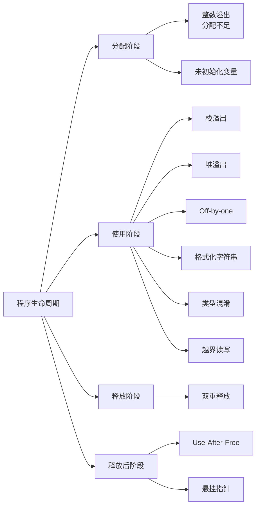
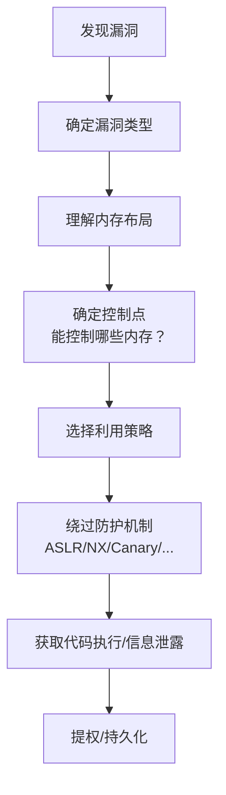

## 16.3 常见内存安全漏洞类型

内存安全漏洞是二进制安全中最核心的攻击面。几乎所有远程代码执行（RCE）漏洞的本质都是某种内存安全问题——程序对内存的读、写、分配、释放操作违反了预期的安全约束。本节系统梳理常见的内存安全漏洞类型，从底层机制、触发条件、利用方式到防御策略逐一展开，为后续章节的具体利用技术打好理论基础。

下图展示了各类内存安全漏洞在程序生命周期中的分布：



下面按漏洞类别的逻辑顺序逐一展开。

---

### 16.3.1 栈缓冲区溢出（Stack Buffer Overflow）

#### 16.3.1.1 基本原理

栈缓冲区溢出是最经典、最基础的内存安全漏洞，也是学习PWN的起点。当程序向栈上的局部变量（缓冲区）写入数据时，如果写入的字节数超过了该缓冲区的实际容量，多余的数据就会覆盖栈上相邻的内存区域。

栈的内存布局决定了溢出的方向和后果。在x86-64架构下，一个典型的函数栈帧从高地址到低地址依次排列：

```text
高地址
┌──────────────────────┐
│   调用者的栈帧        │
├──────────────────────┤
│   返回地址 (RIP)      │  ← 溢出首先覆盖这里
├──────────────────────┤
│   保存的RBP           │  ← 然后覆盖这里
├──────────────────────┤
│   局部变量 / buffer   │  ← 数据从这里写入
└──────────────────────┘
低地址  (栈向低地址增长)
```

当`buffer`中写入超过其大小的数据时，溢出的字节会依次覆盖保存的RBP和返回地址。控制了返回地址，就控制了程序的执行流。

#### 16.3.1.2 触发条件

典型的触发函数包括：

| 函数 | 危险原因 | 安全替代 |
|------|----------|----------|
| `gets(buf)` | 完全无长度限制，读到换行符为止 | `fgets(buf, size, stdin)` |
| `strcpy(dst, src)` | 不检查`src`长度，直到遇到`\0` | `strncpy(dst, src, n)`、`strlcpy()` |
| `strcat(dst, src)` | 追加时不检查目标缓冲区剩余空间 | `strncat(dst, src, n)` |
| `sprintf(buf, fmt, ...)` | 格式化输出不检查目标大小 | `snprintf(buf, size, fmt, ...)` |
| `scanf("%s", buf)` | 按空白符分隔读取，无长度限制 | `scanf("%63s", buf)` |
| `memcpy(dst, src, n)` | 如果`n`计算错误就会溢出 | 确保`n`正确且`dst`足够大 |

#### 16.3.1.3 漏洞示例

```c
#include <stdio.h>
#include <string.h>

// 漏洞函数：password缓冲区只有16字节
int check_password() {
    char password[16];
    int authenticated = 0;

    printf("Enter password: ");
    gets(password);  // 无长度限制！

    if (strcmp(password, "secret123") == 0) {
        authenticated = 1;
    }
    return authenticated;
}
```

在上述代码中，`password`只有16字节，但`gets()`允许写入任意长度的数据。输入超过16字节后，溢出会覆盖`authenticated`变量——即使不知道正确密码，只要覆盖到非零值就能绕过认证。更进一步，如果覆盖返回地址，就能劫持控制流到任意位置。

#### 16.3.1.4 真实案例

**Morris蠕虫（1988年）**：利用`fingerd`程序中的`gets()`栈溢出漏洞进行远程代码执行，这是互联网历史上第一个被广泛传播的蠕虫，感染了当时约10%的互联网计算机。这个事件直接催生了CERT（计算机应急响应组）的成立。

**心脏滴血（Heartbleed，CVE-2014-0160）**：虽然严格来说是越界读取而非栈溢出，但其本质是缺少对输入长度的校验——OpenSSL的心跳扩展没有验证请求中声称的负载长度与实际数据长度是否一致，导致可以读取服务器内存中最多64KB的数据，包括私钥、会话Cookie等敏感信息。

#### 16.3.1.5 防御与检测

- **编译器防护**：栈金丝雀（Stack Canary / `-fstack-protector`）在返回地址前放置随机值，溢出时会被覆盖从而触发检测
- **操作系统防护**：ASLR（地址空间随机化）使攻击者无法预测目标地址；NX/DEP使栈不可执行
- **代码审计**：搜索所有`gets`、`strcpy`、`strcat`、`sprintf`、`scanf("%s"`等不安全函数调用
- **静态分析工具**：Coverity、Clang Static Analyzer、Fortify等可以自动检测潜在溢出

---

### 16.3.2 堆溢出（Heap Overflow）

#### 16.3.2.1 基本原理

堆溢出发生在向堆上分配的缓冲区写入超过其大小的数据时。与栈溢出相比，堆溢出的利用通常更加复杂，但威力也往往更大——堆上存储着各种重要的数据结构、对象元数据、函数指针和虚表指针。

堆管理器（如glibc的ptmalloc2）在堆块（chunk）之间维护着管理元数据。堆溢出不仅会覆盖相邻堆块的数据，还可能破坏堆管理器的内部数据结构，产生多种可利用的状态。

#### 16.3.2.2 堆块结构（glibc ptmalloc2）

理解堆溢出的利用，首先需要理解堆块的内存布局：

```text
chunk的内存结构 (64位系统):
+-------------------+  ← chunk起始地址 (prev_size域对齐后)
|   prev_size       |  8字节：前一个chunk如果空闲，记录其大小
+-------------------+
|   size            |  8字节：当前chunk大小 + 标志位(A/M/P)
+-------------------+
|   fd              |  8字节：空闲时指向下一个空闲chunk
|   bk              |  8字节：空闲时指向上一个空闲chunk
+-------------------+
|   用户数据区      |  实际分配给用户的空间
|   ...             |
+-------------------+
```

当溢出覆盖了相邻chunk的`size`、`fd`、`bk`等字段时，堆管理器在后续的malloc/free操作中会使用这些被篡改的值，从而实现任意地址读写。

#### 16.3.2.3 漏洞示例

```c
#include <stdlib.h>
#include <string.h>

void heap_overflow() {
    // 分配两个相邻的堆块
    char *chunk_a = malloc(32);
    char *chunk_b = malloc(32);

    // 设置chunk_b的函数指针
    void (**func_ptr)(void) = (void (**)(void))chunk_b;
    *func_ptr = legitimate_function;

    // 用户输入超过chunk_a的大小，溢出到chunk_b
    // 此时攻击者可以控制chunk_b中的func_ptr
    read(0, chunk_a, 256);  // 溢出32字节chunk_a，覆盖chunk_b的头部和数据
}
```

#### 16.3.2.4 典型利用技术

堆溢出的利用技术经历了多个发展阶段：

| 技术 | 时代 | 核心思路 |
|------|------|----------|
| Frontlink unlink | 早期glibc | 覆盖fd/bk指针，利用`unlink`宏实现任意写 |
| House of Spirit | glibc 2.x | 伪造空闲chunk，让free将其放回fastbin |
| House of Force | glibc 2.x | 覆盖top chunk大小，操控下一次malloc的返回地址 |
| House of Lore | glibc 2.x | 伪造smallbin链表，控制malloc返回地址 |
| Unsorted bin attack | glibc <2.29 | 覆盖unsorted bin的bk指针实现任意写 |
| Tcache poisoning | glibc 2.26+ | 覆盖tcache的fd指针，轻松实现任意地址分配 |
| Tcache stashing | glibc 2.26+ | 利用tcache与smallbin的交互漏洞 |

以Tcache poisoning为例（现代glibc最常见的堆利用技术）：

```c
// 1. 分配两个相同大小的chunk
char *a = malloc(0x40);
char *b = malloc(0x40);

// 2. 释放它们，进入tcache (0x50大小的tcache bin: b -> a)
free(b);
free(a);

// 3. 堆溢出覆盖a的fd指针为目标地址
// 此时tcache链表变为: b -> a -> target_addr
*(size_t*)a = 0xdeadbeef;  // 溢出写入

// 4. 两次malloc拿回a和b
malloc(0x40);  // 返回a
malloc(0x40);  // 返回b

// 5. 第三次malloc返回target_addr（如果大小匹配）
char *target = malloc(0x40);  // 返回0xdeadbeef
// 现在可以向0xdeadbeef写入数据
```

#### 16.3.2.5 真实案例

**CVE-2015-0235（GHOST漏洞）**：glibc的`__nss_hostname_digits_dots`函数中的堆溢出，影响所有使用`gethostbyname()`的程序。该漏洞存在于glibc中超过十年之久才被发现。

**CVE-2019-14287（sudo堆溢出）**：sudo在处理特定用户ID时存在堆溢出，可以绕过安全策略以root权限执行命令。

---

### 16.3.3 格式化字符串漏洞（Format String Vulnerability）

#### 16.3.3.1 基本原理

当用户输入被直接用作`printf()`、`fprintf()`、`sprintf()`等格式化函数的格式化字符串时，攻击者可以通过插入格式化说明符来读取栈上数据或向任意地址写入数据。本节为概述，深入利用技术详见[16.7 格式化字符串漏洞](07-167格式化字符串漏洞.md)。

#### 16.3.3.2 核心机制

`printf`系列函数通过`va_arg`宏按顺序从栈上读取参数。如果格式化字符串中的说明符数量超过了实际传入的参数数量，`printf`不会报错，而是继续从栈上读取数据——这些"溢出"的数据就是攻击者可以泄露的信息。

#### 16.3.3.3 漏洞示例

```c
void vulnerable(char *input) {
    printf(input);  // 用户输入直接作为格式化字符串
    // 攻击者输入 "%x.%x.%x.%x" → 泄露栈上连续的4个值
    // 攻击者输入 "%08x.%08x.%08x" → 格式化读取更多栈数据
    // 攻击者输入 "%n" → 向当前printf内部指针指向的地址写入已输出字符数
}
```

#### 16.3.3.4 攻击能力总结

| 格式符 | 作用 | 安全影响 |
|--------|------|----------|
| `%x` / `%p` | 读取栈上的值 | 信息泄露：绕过ASLR、获取栈内容 |
| `%s` | 读取栈上值作为指针，打印其指向的字符串 | 泄露任意内存内容（如果栈上存在可控指针） |
| `%n` | 将已输出字符数写入指定地址 | 任意地址写入，可覆盖GOT表、函数指针等 |
| `%hn` | 写入2字节（短整型） | 精确控制写入值，减少所需输出字符数 |
| `%hhn` | 写入1字节 | 最精确的写入控制，每次只写一个字节 |
| `%${n}$n` | 直接引用第n个参数 | 绕过参数传递限制，直接定位栈上数据 |

#### 16.3.3.5 常见出现场景

- 日志函数中直接使用用户输入：`log(user_input)` 内部调用 `printf`
- 错误消息中拼接用户输入：`fprintf(stderr, user_buf)`
- Web应用中的调试输出
- 嵌入式设备的串口调试接口

---

### 16.3.4 整数溢出（Integer Overflow）

#### 16.3.4.1 基本原理

整数溢出发生在算术运算结果超出了目标整数类型所能表示的范围。C/C++标准对有符号整数溢出定义为"未定义行为"（Undefined Behavior），编译器可以自由处理；无符号整数溢出则会回绕（wrap around）。这两种情况都可能导致严重的安全漏洞。

常见的溢出场景：

```text
unsigned int:  0xFFFFFFFF + 1 = 0x00000000  (回绕到0)
signed int:    0x7FFFFFFF + 1 = 0x80000000  (变为负数，未定义行为)
unsigned char: 0xFF + 1 = 0x00              (回绕到0)
```

#### 16.3.4.2 漏洞分类

**1. 缓冲区大小计算溢出**

这是最常见的整数溢出利用场景。当程序基于用户输入计算缓冲区大小时，如果乘法或加法发生溢出，分配的缓冲区会远小于预期：

```c
void vulnerable(size_t count) {
    // count * sizeof(int) 可能溢出
    // 例如：count = 0x40000001 时，count * 4 = 0x00000004（溢出为4字节）
    int *buf = malloc(count * sizeof(int));
    if (!buf) return;

    // 实际写入count个int，远超4字节的缓冲区
    for (size_t i = 0; i < count; i++) {
        buf[i] = get_input();  // 巨量数据写入极小的缓冲区
    }
}
```

**2. 边界检查绕过**

```c
void vulnerable(int len) {
    // len + 8 可能溢出为负数或小正数，绕过检查
    if (len + 8 > MAX_SIZE) return;  // 攻击者设len = 0x7FFFFFFC → len+8 = 0x80000004（负数）

    char *buf = malloc(len + 8);     // 分配了不合理的大小
    read(0, buf, len);               // 写入大量数据
}
```

**3. 符号混淆**

将有符号数与无符号数混用是最隐蔽的整数问题之一：

```c
void vulnerable(int len) {
    // len是signed int，传入负数如-1
    // 当与size_t（unsigned）比较时，-1被解释为0xFFFFFFFF（极大正数）
    if (len > 1024) return;  // -1 > 1024？在unsigned比较中为true，但...

    // 如果len参与计算
    char *buf = malloc(100);
    memcpy(buf, input, len);  // len = -1 被解释为0xFFFFFFFF → 巨大拷贝
}
```

#### 16.3.4.3 常见易错模式

```c
// 模式1：乘法溢出
size_t total = n * element_size;  // 如果n和element_size都可控
void *p = malloc(total);

// 模式2：加法溢出
if (len + header_size < MAX_LEN) {  // len + header_size可能溢出
    // 错误的认为安全
}

// 模式3：减法下溢
size_t remaining = user_size - offset;  // 如果offset > user_size → 极大正数

// 模式4：左移溢出
size_t size = 1 << bits;  // 如果bits >= 32（64位系统）或 >= 31（32位系统）
```

#### 16.3.4.4 安全检查模式

```c
// 正确的乘法溢出检查
bool mul_overflow(size_t a, size_t b) {
    return (a != 0) && (b > SIZE_MAX / a);
}

// 正确的加法溢出检查
bool add_overflow(size_t a, size_t b) {
    return (a + b) < a;  // 无符号回绕后一定比原值小
}

// 使用编译器内置函数（GCC/Clang）
size_t result;
if (__builtin_mul_overflow(count, sizeof(int), &result)) {
    return -1;  // 溢出，拒绝操作
}
void *buf = malloc(result);

// C23标准新增 <stdckdint.h>
#include <stdckdint.h>
size_t result;
if (ckd_mul(&result, count, sizeof(int))) {
    return -1;  // 溢出
}
```

#### 16.3.4.5 真实案例

**CVE-2014-0160（Heartbleed）**：虽然核心问题是缺少长度校验，但整数相关的边界检查缺失是根本原因之一。

**CVE-2015-3864（Android Stagefright）**：媒体框架中的多个整数溢出漏洞，攻击者发送特制的MMS消息即可在无需用户交互的情况下实现远程代码执行，影响超过10亿台Android设备。

---

### 16.3.5 释放后重用（Use-After-Free，UAF）

#### 16.3.5.1 基本原理

UAF漏洞发生在程序释放了一块堆内存后，仍然通过旧的悬垂指针（dangling pointer）访问该内存。如果在释放和重新使用之间，该内存被分配给了其他对象（特别是包含函数指针或关键数据的对象），攻击者就能通过精心构造的数据控制程序行为。

UAF的核心危害在于：程序以为自己在访问原始对象，实际上访问的是攻击者控制的新数据。

#### 16.3.5.2 典型触发模式

```c
// 模式1：指针未置NULL
struct Object {
    void (*callback)(void);
    char data[32];
};

struct Object *obj = malloc(sizeof(struct Object));
obj->callback = legitimate_function;
free(obj);       // 释放对象
// obj指针没有置NULL！

// 在此期间分配了新对象，占据了同一块内存
struct Object *evil = malloc(sizeof(struct Object));
evil->callback = malicious_function;

obj->callback();  // UAF：实际调用了malicious_function
```

```c
// 模式2：多指针引用同一对象
struct Node *shared = malloc(sizeof(struct Node));
struct Node *ref1 = shared;
struct Node *ref2 = shared;

free(ref1);       // 通过ref1释放
// ref2仍然指向已释放的内存！
ref2->data = 42;  // UAF：写入已释放的内存
```

```c
// 模式3：对象池/缓存中的UAF
struct HttpRequest *req = get_from_pool();
process(req);
release_to_pool(req);

// ... pool中的内存被分配给了新的请求 ...
struct HttpRequest *new_req = get_from_pool();
// 如果原来的req指针还在别处被使用 → UAF
```

#### 16.3.5.3 UAF的利用价值

UAF漏洞的利用价值取决于被覆盖对象的结构。最有价值的目标包括：

| 对象类型 | 利用方式 |
|----------|----------|
| 包含函数指针的结构体 | 覆盖函数指针，劫持控制流 |
| C++对象（含虚表指针） | 覆盖虚表指针，控制虚函数调用 |
| 包含数据指针的结构体 | 覆盖数据指针，实现任意读写 |
| 文件描述符/套接字 | 劫持I/O操作 |
| 包含长度字段的对象 | 绕过边界检查 |

#### 16.3.5.4 真实案例

**CVE-2012-0056（Mempodipper）**：Linux内核的`/proc/pid/mem`文件接口存在UAF漏洞，允许本地用户提升到root权限。漏洞利用程序仅50行代码。

**CVE-2016-0165（Windows Win32k）**：Windows内核驱动中的UAF漏洞，被广泛用于浏览器沙箱逃逸。这是当时多个APT攻击链中的关键一环。

**CVE-2021-30554（Chrome V8）**：Chrome JavaScript引擎中的UAF漏洞，用户只需访问恶意网页就可能被远程代码执行。

#### 16.3.5.5 防御措施

```c
// 1. 释放后立即置NULL
free(obj);
obj = NULL;  // 后续访问会段错误（虽然仍然是bug，但不会被利用）

// 2. 使用智能指针（C++）
std::unique_ptr<Object> obj = std::make_unique<Object>();
// 作用域结束自动释放，无悬垂指针

// 3. 引用计数（C++ shared_ptr）
std::shared_ptr<Object> obj = std::make_shared<Object>();
// 引用计数归零时自动释放

// 4. 堆隔离分配器
// Chrome的MiraclePtr、Firefox的Scudo等在释放后对内存进行隔离
```

---

### 16.3.6 双重释放（Double Free）

#### 16.3.6.1 基本原理

对同一块内存执行两次`free()`操作会导致堆管理器的内部数据结构出现不一致。在glibc的ptmalloc2中，释放一个已经处于free状态的chunk时，堆管理器不会检查该chunk是否已经被释放（特别是在fastbin/tcache中），导致同一个chunk出现在同一个free链表中两次。

#### 16.3.6.2 漏洞示例

```c
void double_free() {
    char *a = malloc(64);
    char *b = malloc(64);
    char *c = malloc(64);

    free(a);  // a进入tcache/fastbin
    free(a);  // a再次进入同一个bin！链表变为 a -> a (循环)

    // 两次malloc拿回a
    char *d = malloc(64);  // 返回a
    char *e = malloc(64);  // 返回a（同一个地址！）

    // 现在d和e指向同一块内存
    // 修改d的数据就会影响e读到的内容
    // 可以用于伪造堆块元数据
}
```

#### 16.3.6.3 利用思路

Double Free的核心利用价值在于创建**同一地址的不同"视图"**——程序认为它拥有两块独立的内存，实际上它们指向同一物理位置。这使得攻击者可以：

1. 通过一个指针写入伪造的堆块头部（size字段），然后通过另一个指针分配到一个"跨越"原始边界的chunk
2. 实现chunk overlapping（堆块重叠），即新分配的chunk覆盖了其他有效chunk的数据区
3. 最终实现对任意堆上数据的读写

#### 16.3.6.4 glibc的防护与绕过

现代glibc对Double Free有多层防护：

```text
防护层次：
1. Tcache key检查 (glibc 2.29+)：每个tcache chunk头部有一个随机key
   → 绕过：通过堆溢出覆盖key字段

2. Fastbin double-free检查：检查free的chunk是否与链表头部相同
   → 绕过：释放a → 释放b → 释放a（"AB-A"模式）

3. Unsorted bin完整性检查 (glibc 2.32+)：检查fd/bk的完整性
   → 绕过：需要更复杂的堆布局技术
```

---

### 16.3.7 类型混淆（Type Confusion）

#### 16.3.7.1 基本原理

当程序将一个对象当作错误的类型来使用时，就发生了类型混淆。这在C++中尤其常见——虚函数表（vtable）机制依赖于对象内存布局中的虚表指针。如果编译器对对象类型做出错误假设，就可能以错误的方式解释内存中的数据。

#### 16.3.7.2 典型场景

```cpp
class Base {
public:
    virtual void action() { printf("Base action\n"); }
    int id;
};

class Derived : public Base {
public:
    void action() override { printf("Derived action\n"); }
    char secret[64];  // Derived比Base大
};

// 类型混淆：将Base*强制转换为Derived*
void type_confusion(Base *obj) {
    Derived *d = reinterpret_cast<Derived*>(obj);
    // d->secret现在指向的是Base对象id之后的内存
    // 可能是栈上的其他数据、甚至返回地址
    d->action();  // 调用obj的虚函数（可能正常，但类型已经错了）
    memcpy(d->secret, input, 64);  // 越界写入！
}
```

#### 16.3.7.3 浏览器引擎中的类型混淆

类型混淆在浏览器引擎（V8、SpiderMonkey、JavaScriptCore）中是最常见的漏洞类型。JavaScript是动态类型语言，JIT编译器需要在运行时推断变量类型并生成优化代码。当推断错误时：

```text
JavaScript层面：
  let arr = [1, 2, 3];         // 被推断为double数组
  // ... 某些操作改变了arr的类型 ...
  arr[0] = {};                  // 实际上是对象，但JIT仍当作double处理
  // 读取arr[0]会把对象指针当作double值 → 类型混淆
```

#### 16.3.7.4 真实案例

**CVE-2021-21224（Chrome V8）**：V8 TurboFan JIT编译器中的类型混淆漏洞，允许通过JavaScript实现远程代码执行。此漏洞被大规模用于实际攻击。

**CVE-2018-8174（Windows VBScript）**：VBScript引擎中的类型混淆漏洞，通过Office文档触发，被APT组织用于定向攻击。

---

### 16.3.8 Off-by-One

#### 16.3.8.1 基本原理

Off-by-one是最轻微的溢出——只多写或多读了1个字节。虽然看似危害有限，但在精心构造的利用场景中，1个字节足以改变一切。

最常见的off-by-one场景是循环计数错误：

```c
// 经典Off-by-one：循环多执行一次
void off_by_one() {
    char buffer[256];
    int i;
    // 应该是 i < 256，但写成了 i <= 256
    for (i = 0; i <= 256; i++) {
        buffer[i] = get_input();  // buffer[256]越界写入1字节
    }
}
```

#### 16.3.8.2 利用方式

在堆上，off-by-one（特别是`\x00` off-by-one，即null byte off-by-one）可以覆盖下一个chunk的`size`字段的最低字节，从而：

1. 修改size的P标志位（prev_inuse），让堆管理器误以为前一个chunk是空闲的
2. 修改size的大小部分，让堆管理器对chunk边界做出错误判断
3. 在后续的free/malloc操作中，堆管理器基于错误的size计算边界，导致chunk overlapping

这种技术被称为**Poison Null Byte**，在glibc < 2.29版本中非常有效。

#### 16.3.8.3 漏洞示例

```c
// Null byte off-by-one
void null_byte_oob() {
    char *a = malloc(0x108);  // 实际chunk大小0x110
    char *b = malloc(0x100);  // 紧跟在a后面

    // 读取输入，但在某个偏移处写入了\0
    read(0, a, 0x108);  // 如果恰好写满，最后的\0终止符覆盖b->size的低字节

    // b->size 从 0x111 变为 0x100（低字节的1标志位被清除）
    // 堆管理器现在认为b的前一个chunk（a）是空闲的
    // 当free b时，会尝试合并前向chunk → 可利用
}
```

---

### 16.3.9 竞态条件（Race Condition / TOCTOU）

#### 16.3.9.1 基本原理

TOCTOU（Time of Check to Time of Use，检查时间到使用时间）漏洞发生在程序先检查某个条件（如文件权限），再基于检查结果执行操作（如打开文件），而在这两步之间的时间窗口内，攻击者修改了被检查的对象（如替换了符号链接指向的文件）。

虽然TOCTOU更多属于逻辑漏洞，但它可以直接导致内存安全问题——例如通过竞态条件让程序以root权限打开一个本不应访问的文件，或在特权程序中执行任意代码。

#### 16.3.9.2 典型场景

```c
// 经典TOCTOU：文件访问竞态
void access_file(const char *filename) {
    // 检查阶段（TOC）
    if (access(filename, W_OK) == 0) {
        // ← 攻击者在此时将filename替换为指向/etc/passwd的符号链接
        // 使用阶段（TOU）
        FILE *f = fopen(filename, "w");  // 实际写入了/etc/passwd
        fprintf(f, "malicious content\n");
        fclose(f);
    }
}
```

```c
// 内存相关的竞态：多线程UAF
void *thread1(void *arg) {
    struct Data *data = (struct Data *)arg;
    // ... 使用data ...
    free(data);    // 释放data
    return NULL;
}

void *thread2(void *arg) {
    struct Data *data = (struct Data *)arg;
    // 不知道data已被thread1释放
    data->value = 42;  // UAF竞态
    return NULL;
}
```

#### 16.3.9.3 内核竞态利用

在Linux内核漏洞利用中，竞态条件是非常重要的攻击手段。内核对象的生命周期管理比用户态更加复杂，多个系统调用并发执行时容易产生竞态窗口：

```c
// 内核竞态利用的典型模式：
// 1. 线程A：触发漏洞路径（如释放对象）
// 2. 线程B：在竞态窗口中占位（如分配新对象占据同一内存）
// 3. 线程A：继续使用已释放的对象 → UAF
// 4. 利用对象重叠实现权限提升

// 常见目标：
// - 文件描述符操作（close vs dup竞态）
// - 套接字缓冲区管理
// - 内存映射（mmap vs munmap）
// - 定时器/信号处理
```

#### 16.3.9.4 防御策略

- **原子操作**：将检查和使用合并为不可分割的原子操作
- **文件描述符操作**：使用`openat()`而非先`stat()`再`open()`；使用`O_NOFOLLOW`防止符号链接攻击
- **锁机制**：对共享资源使用互斥锁或读写锁
- **内核防护**：SMEP/SMAP阻止内核执行/访问用户态内存；KASLR增加竞态窗口定位难度

---

### 16.3.10 未初始化变量（Uninitialized Variable）

#### 16.3.10.1 基本原理

当程序使用了未初始化的局部变量时，变量的值是栈上之前残留的数据（"垃圾值"）。如果这个残留数据被用作安全决策的依据（如认证标志、权限级别、指针地址），就可能产生严重的安全漏洞。

#### 16.3.10.2 漏洞示例

```c
int process_request(int type) {
    int result;  // 未初始化

    if (type == ADMIN_REQUEST) {
        result = handle_admin();
    }
    // 如果type不是ADMIN_REQUEST，result未被赋值
    // 但仍然是栈上的残留值

    // 如果栈上恰好残留了非零值（比如之前调用的返回值）
    return result;  // 返回了不确定的值
}
```

```c
// 更危险的场景：未初始化的缓冲区
void encrypt_secret(char *output) {
    char key[32];  // 未初始化
    // key的内容是栈上的残留数据
    // 如果调用者之前栈帧中有敏感数据（如密钥、密码）
    // 残留的key可能恰好是之前的敏感数据
    aes_encrypt(output, key, 32);
}
```

#### 16.3.10.3 内核中的未初始化变量

在Linux内核中，未初始化变量更加危险：

```c
// 内核栈上可能残留用户态数据或之前系统调用的数据
struct kernel_response resp;  // 未初始化
resp.status = get_status();
// 未填充resp.padding或其他字段
copy_to_user(user_buf, &resp, sizeof(resp));
// 用户态会读到内核栈上的残留数据 → 信息泄露
```

这是内核信息泄露（KASLR bypass）的常见来源之一。

---

### 16.3.11 越界读写（Out-of-Bounds Read/Write）

#### 16.3.11.1 基本原理

越界读写是一个比缓冲区溢出更广泛的概念——任何对数组或缓冲区边界之外的内存进行的读写操作都属于越界访问。它与缓冲区溢出的区别在于：缓冲区溢出特指"从缓冲区头部开始、向高地址方向溢出"，而越界读写可以从任意偏移位置开始，向任意方向访问。

#### 16.3.11.2 常见来源

```c
// 1. 数组索引未检查
void oob_array(int index, int *arr, int size) {
    arr[index] = 42;  // index可以是负数或>=size
}

// 2. 长度字段不一致
struct Packet {
    uint32_t length;   // 声明的长度
    char data[1];      // 柔性数组
};

void process(Packet *pkt) {
    // 如果length被篡改为大于实际分配的值
    for (int i = 0; i < pkt->length; i++) {
        printf("%c", pkt->data[i]);  // 越界读取
    }
}

// 3. 循环边界错误
int find_char(char *buf, int len, char c) {
    for (int i = 0; i <= len; i++) {  // Off-by-one → 越界读
        if (buf[i] == c) return i;
    }
    return -1;
}
```

#### 16.3.11.3 堆上的越界读写

堆上的越界读写（OOB）在浏览器漏洞利用中极为常见。以V8引擎为例：

```javascript
// 创建一个数组，其length字段被篡改
let arr = new Array(10);
// 通过类型混淆让length变为一个很大的值
// 现在arr[10], arr[11], ... 可以读写堆上的其他对象
// 这就是浏览器沙箱逃逸的典型起点
```

---

### 16.3.12 各类漏洞综合对比

| 漏洞类型 | 触发难度 | 利用难度 | 危害等级 | 典型防御 |
|----------|----------|----------|----------|----------|
| 栈溢出 | 低 | 低-中 | 高 | Canary + ASLR + NX |
| 堆溢出 | 低 | 中-高 | 高 | Safe unlinking + ASLR + tcache key |
| 格式化字符串 | 低 | 中 | 高 | 编码规范 + FORTIFY_SOURCE |
| 整数溢出 | 中 | 中 | 中-高 | 安全整数运算 + 编译器检查 |
| UAF | 中 | 中-高 | 高 | 智能指针 + MircePtr + 内存隔离 |
| 双重释放 | 中 | 中 | 高 | Tcache key + 完整性检查 |
| 类型混淆 | 高 | 高 | 高 | 类型安全语言 + JIT边界检查 |
| Off-by-one | 中 | 中-高 | 中-高 | 边界检查 + 堆加固 |
| 竞态条件 | 高 | 高 | 高 | 原子操作 + 锁 + capability模型 |
| 未初始化变量 | 低 | 中 | 中 | 编译器警告 + 初始化规范 |
| 越界读写 | 中 | 中 | 高 | 边界检查 + ASAN |

---

### 16.3.13 漏洞检测工具与方法

#### 16.3.13.1 动态分析工具

| 工具 | 检测范围 | 使用方式 |
|------|----------|----------|
| AddressSanitizer (ASAN) | 堆溢出、栈溢出、UAF、OOB | `gcc -fsanitize=address` 编译 |
| MemorySanitizer (MSAN) | 未初始化内存读取 | `gcc -fsanitize=memory` 编译 |
| ThreadSanitizer (TSAN) | 竞态条件 | `gcc -fsanitize=thread` 编译 |
| UndefinedBehaviorSanitizer (UBSAN) | 整数溢出、类型混淆、空指针 | `gcc -fsanitize=undefined` 编译 |
| Valgrind (Memcheck) | 内存泄漏、UAF、未初始化读取 | `valgrind ./program` |
| GWP-ASan | 生产环境采样检测UAF/OOB | 内置于glibc 2.31+ |

#### 16.3.13.2 静态分析工具

| 工具 | 语言支持 | 特点 |
|------|----------|------|
| Clang Static Analyzer | C/C++ | 免费，集成在LLVM工具链中 |
| Coverity | C/C++/Java/Python | 商业工具，误报率低 |
| Semgrep | 多语言 | 规则灵活，适合自定义检测 |
| CodeQL | 多语言 | GitHub出品，可编写复杂查询 |
| Ghidra | 二进制 | 逆向分析，可发现已编译程序中的漏洞 |

#### 16.3.13.3 模糊测试（Fuzzing）

模糊测试是发现内存安全漏洞最有效的方法之一：

```bash
# 使用AFL++进行模糊测试
# 1. 编译目标程序（插桩）
afl-clang-fast -o target target.c

# 2. 准备种子输入
mkdir input
echo "seed" > input/seed.txt

# 3. 启动fuzzer
afl-fuzz -i input -o output -- ./target @@

# 使用libFuzzer（覆盖引导的进程内fuzzer）
# 编写测试函数：
int LLVMFuzzerTestOneInput(const uint8_t *data, size_t size) {
    // 将fuzz数据传入目标函数
    target_function(data, size);
    return 0;
}
# 编译：clang -fsanitize=address,fuzzer -o fuzz_target fuzz_target.c
# 运行：./fuzz_target
```

现代fuzzer（如AFL++、libFuzzer、Honggfuzz）使用代码覆盖率引导变异策略，能高效探索程序的深层路径，发现人工审计难以找到的内存安全漏洞。

---

### 16.3.14 漏洞利用的通用原则

无论具体是哪种内存安全漏洞，成功的利用通常遵循以下通用流程：



**关键决策点**：

1. **信息泄露需求**：ASLR使所有地址随机化，大多数利用都需要先泄露一个已知地址才能计算出目标地址
2. **写入精度**：能写多少字节？写入位置是否可控？写入值是否完全可控？
3. **执行流劫持**：覆盖返回地址、GOT表、函数指针、虚表指针中的哪一个最方便？
4. **防护绕过**：哪些防护机制开启了？是否有绕过方案？

理解这些通用原则后，后续章节会逐一深入每种漏洞类型的具体利用技术。

---

### 16.3.15 常见误区与纠正

**误区1：只有栈溢出才是真正的安全漏洞**

纠正：堆溢出、UAF、类型混淆在现代漏洞利用中占比更高。Chrome浏览器的安全漏洞中，类型混淆和UAF占了绝大多数。

**误区2：整数溢出只是理论问题**

纠正：整数溢出在实际漏洞中非常常见，尤其是图像解析、网络协议处理等涉及大量长度计算的场景。Android Stagefright系列漏洞影响了超过10亿台设备。

**误区3：Off-by-one字节危害很小**

纠正：1字节足以改变堆管理器对chunk边界的判断，配合堆分配器的特殊行为可以实现完整的代码执行。

**误区4：编译器优化不会影响安全性**

纠正：有符号整数溢出是未定义行为，编译器可能"优化掉"包含溢出的安全检查。例如`if (len + 8 > MAX)`中的`len + 8`溢出时，编译器可能认为这个条件永远为真而直接删除检查代码。

**误区5：开了ASLR就安全了**

纠正：ASLR只是增加了利用难度。信息泄露漏洞可以绕过ASLR；信息泄露+内存写入的组合在现代漏洞利用中是标准模式。防护机制是"纵深防御"的一层，不是银弹。
