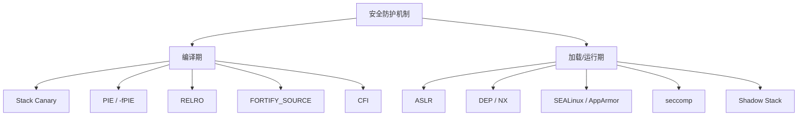
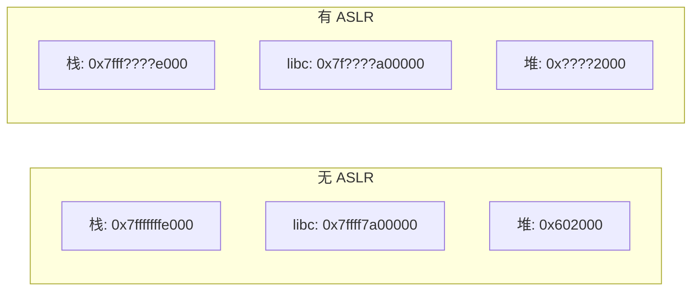
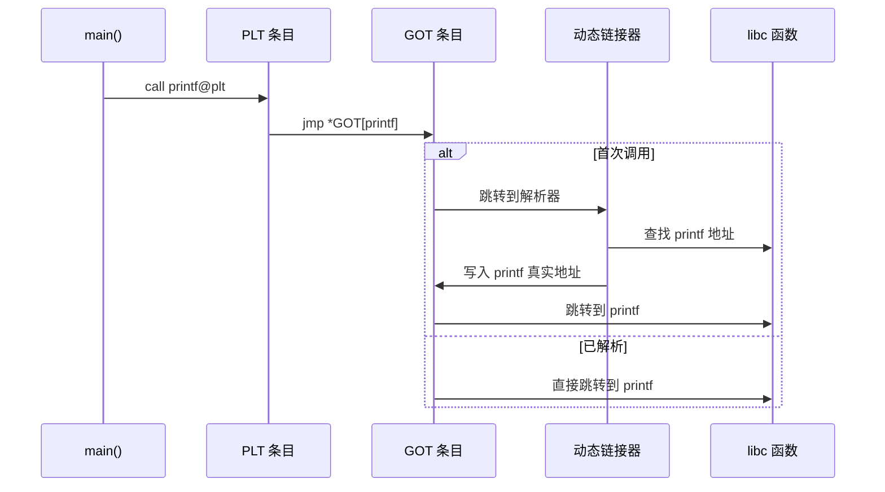
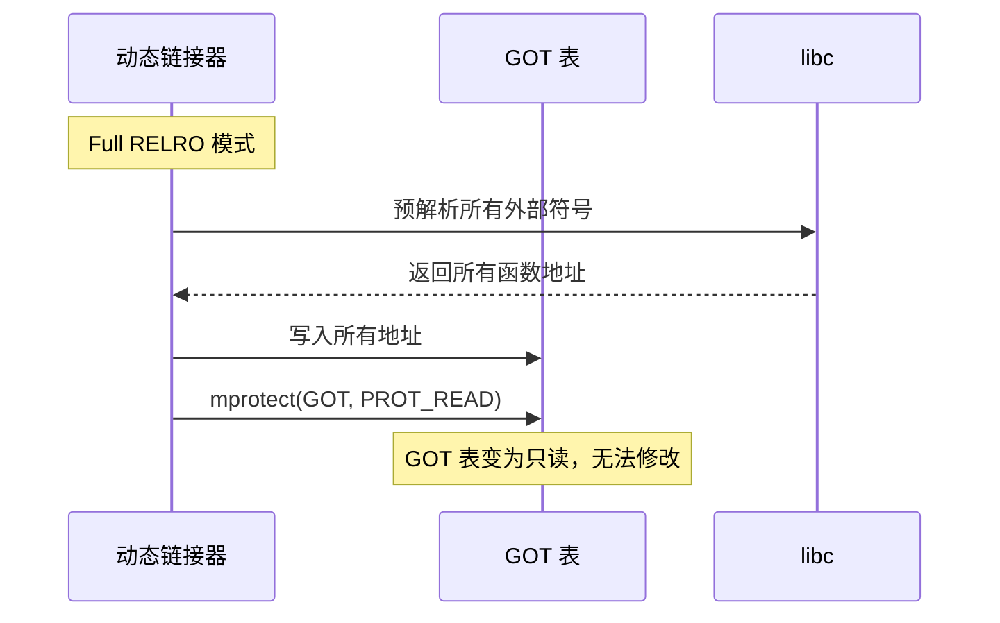
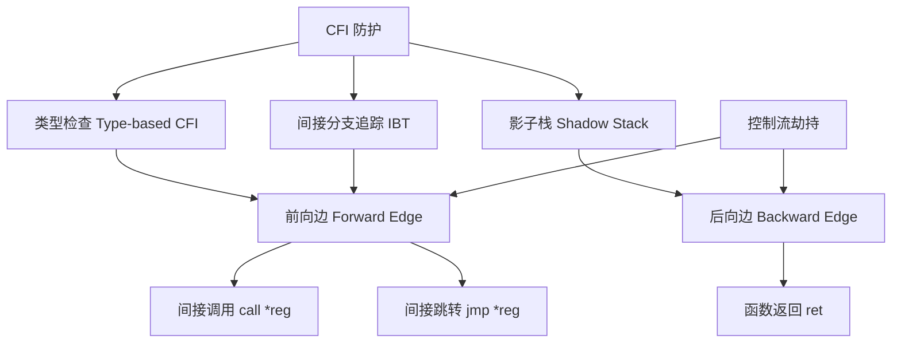
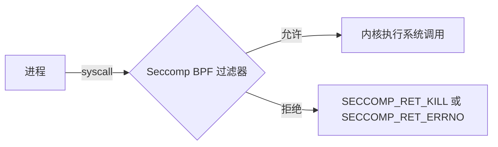
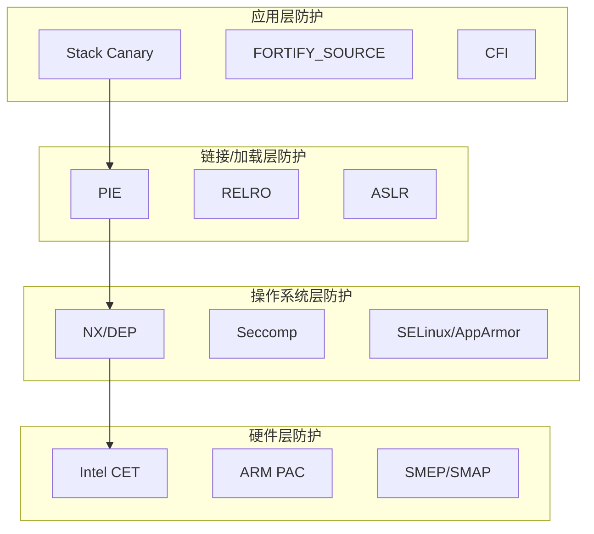

## 16.4 安全防护机制

操作系统和编译器在发展过程中不断引入安全防护机制，目的是增加漏洞利用的难度和成本。理解这些机制的工作原理是PWN的基础——只有知道防护如何生效，才能理解绕过为何可行。

本节从编译期、加载期、运行期三个维度系统讲解每一项主流防护机制的内部实现原理、启用方式、检测方法和已知局限性。绕过策略在16.6节详述，本节聚焦于"防护本身是如何工作的"。



### 16.4.1 栈金丝雀（Stack Canary）

#### 基本原理

栈金丝雀（Stack Canary，又称 Stack Protector）是编译器在函数序言（prologue）中插入的一道栈溢出检测机制。其核心思想是：在栈帧中局部变量和返回地址之间放置一个随机值（canary），函数返回前检查该值是否被篡改。

```text
┌─────────────────────────┐  高地址
│       返回地址            │
├─────────────────────────┤
│       旧 RBP             │
├─────────────────────────┤
│       Canary (8字节)      │  ← 溢出会覆盖此值
├─────────────────────────┤
│       局部变量 buffer[64] │  ← 溢出从此处开始
└─────────────────────────┘  低地址
```

#### GCC 实现细节

GCC 在每个有栈缓冲区的函数中注入以下逻辑：

```c
// 函数序言中（简化版）
unsigned long canary = __stack_chk_guard;  // 从 TLS 读取随机值
canary ^= 0;  // 某些实现会与 fs:0x28 异或

// 函数尾声中
if (canary != __stack_chk_guard) {
    __stack_chk_fail();  // 打印错误信息并 abort
}
```

在 x86-64 Linux 上，canary 值存储在 TLS（Thread Local Storage）的 `fs:0x28` 偏移处。每个线程有独立的 canary 值，canary 在进程启动时由 glibc 的 `__libc_setup_main` 通过 `__stack_chk_guard` 初始化，随机源来自内核提供的 `/dev/urandom`。

canary 值的低位字节始终为 `\x00`（null byte），这是刻意设计的——防止字符串操作函数（如 `strcpy`、`gets`）在溢出时越过 canary。

#### 编译器选项

| 选项 | 级别 | 保护范围 |
|------|------|----------|
| `-fstack-protector` | 基本 | 仅保护使用了 `alloca` 或长度 ≥ 8 字节的 char 数组的函数 |
| `-fstack-protector-strong` | 增强 | 保护所有有局部地址变量的函数（GCC 4.9+，现代发行版默认） |
| `-fstack-protector-all` | 全面 | 保护所有函数，包括无需保护的函数 |
| `-fno-stack-protector` | 禁用 | 关闭栈保护 |

`-fstack-protector-strong` 是当前主流发行版（Ubuntu 18.04+、Fedora、Debian 10+）的默认选项，在安全性和性能开销之间取得了平衡。`-fstack-protector-all` 会增加约 2-5% 的性能开销。

#### 运行时检测

```bash
# 检查二进制是否启用了 canary
checksec --file=./binary
# 或
readelf -s ./binary | grep __stack_chk

# 检查系统默认 canary 行为
gcc -Q --help=optimizers 2>&1 | grep stack-protector
```

#### 已知局限

- **fork 场景**：`fork()` 子进程继承父进程的 canary 值，因此如果目标程序对每个连接 fork 子进程处理（如典型 CTF 题目），攻击者可以逐字节爆破 canary（每个字节最多 256 次尝试，8 字节 canary 最多 2048 次）。
- **信息泄露**：如果存在格式化字符串漏洞或其他信息泄露通道，canary 值可以直接从栈上读取。
- **线程安全边界**：每个线程的 canary 独立，但同一进程内 fork 的子进程共享。
- **不保护堆溢出**：canary 仅保护栈帧，堆上的溢出不受影响。
- **不保护非栈数据**：全局变量、BSS 段的溢出不受保护。

### 16.4.2 地址空间布局随机化（ASLR）

#### 基本原理

ASLR（Address Space Layout Randomization）在每次进程启动时随机化以下内存区域的基地址：

| 区域 | 随机化对象 | Linux 64位熵 |
|------|-----------|-------------|
| 栈（stack） | 栈起始地址 | 28 位（约 2.6 亿种可能） |
| 堆（heap） | `brk` 起始地址 | 28 位 |
| mmap 区域 | 共享库、mmap 分配 | 28 位（旧内核 12 位） |
| VDSO | 内核动态共享对象 | 28 位 |
| PIE 可执行文件 | 代码段基地址 | 28 位（与 mmap 共享熵） |

32 位系统的 ASLR 熵显著更低：栈约 16 位（65536 种），mmap 约 8 位（256 种），这使得暴力破解在 32 位系统上成为可行的攻击手段。



#### Linux 内核配置

```bash
# 查看当前 ASLR 级别
cat /proc/sys/kernel/randomize_va_space
# 0 = 关闭
# 1 = 部分随机化（栈、mmap、VDSO）
# 2 = 完全随机化（+堆），默认值

# 临时关闭 ASLR（调试用）
echo 0 | sudo tee /proc/sys/kernel/randomize_va_space

# 恢复
echo 2 | sudo tee /proc/sys/kernel/randomize_va_space

# 单次关闭 ASLR 启动程序
setarch $(uname -m) -R ./binary
```

#### 随机化粒度

ASLR 以"页"为最小随机化单位（通常 4KB = 0x1000），因此地址的低 12 位（bit 0-11）是固定的。这意味着：

- 部分覆写（partial overwrite）只修改地址的低 12-16 位，可以在有限次数内命中正确地址
- 函数内部的偏移是固定的，只要知道函数入口地址就能计算函数内任意位置

#### 内存布局可视化

```bash
# 查看运行中进程的内存布局
cat /proc/<pid>/maps

# 示例输出（ASLR 开启）：
# 555555554000-555555556000 r-xp  /path/to/binary
# 7ffff7dc3000-7ffff7fa8000 r-xp  /lib/x86_64-linux-gnu/libc.so.6
# 7ffffffde000-7ffffffff000 rw-p  [stack]

# 多次运行同一程序，观察地址变化
for i in {1..5}; do
    cat /proc/$(pidof binary)/maps | head -1
done
```

#### 已知局限

- **信息泄露**：只要泄露一个已知库/程序中的地址，就能推算出基地址，完全绕过 ASLR。
- **32 位熵不足**：32 位系统的随机化空间有限，暴力破解成功率较高。
- **fork 不改变布局**：`fork()` 子进程继承父进程的完整内存布局，对多进程服务无效。
- **不影响地址低 12 位**：页面内偏移固定，部分覆写技术依赖此特性。

### 16.4.3 数据执行保护（DEP / NX）

#### 基本原理

DEP（Data Execution Prevention），在 Linux 中称为 NX（No-eXecute）位，通过 CPU 的页表项（PTE）中的 NX 位（x86-64）或 XN 位（ARM）标记内存页是否可执行。

```text
页表项（PTE）结构（x86-64）：
┌──────────────────────────────────────────────────┐
│ NX │ ... │ Global │ Dirty │ Accessed │ ... │ P │
│ bit63                                       bit0 │
└──────────────────────────────────────────────────┘
  ↑
  NX=1: 该页不可执行
  NX=0: 该页可执行
```

启用 DEP 后，典型的内存页权限如下：

| 内存区域 | 读 | 写 | 执行 |
|---------|----|----|------|
| 代码段 (.text) | ✅ | ❌ | ✅ |
| 数据段 (.data/.bss) | ✅ | ✅ | ❌ |
| 栈 (stack) | ✅ | ✅ | ❌ |
| 堆 (heap) | ✅ | ✅ | ❌ |

当 CPU 尝试执行标记为不可执行的内存页中的代码时，会触发页错误（page fault），内核向进程发送 `SIGSEGV` 信号，进程终止。

#### 启用方式

```bash
# 编译时：现代 GCC 默认启用 NX（-z execstack 用于关闭）
gcc -o binary source.c              # 默认 NX 启用
gcc -z noexecstack -o binary source.c  # 显式启用 NX
gcc -z execstack -o binary source.c    # 关闭 NX（不推荐）

# 检查二进制的 NX 状态
readelf -l ./binary | grep GNU_STACK
# RW 表示 NX 启用，RWE 表示 NX 关闭
```

#### 硬件支持

- **x86-64**：NX 位是 CPU 原生支持（AMD 称 EVP，Intel 称 XD），所有现代 64 位 CPU 均支持。
- **x86（32位）**：需要 PAE（Physical Address Extension）模式才能使用 NX 位。
- **ARM**：XN（eXecute Never）位，ARMv6+ 标准支持。
- **MIPS**：通过页表中的 RI（Read-Inhibit）和 XI（eXecute-Inhibit）位实现。

#### W^X 策略

DEP 的思想与 OpenBSD 推广的 **W^X**（Write XOR eXecute）策略一致：一个内存页不能同时可写和可执行。这个原则比单纯的 DEP 更严格——不仅防止栈/堆执行代码，还防止在运行时修改可执行页（如 JIT 编译场景需要特殊处理）。

#### 已知局限

- **不阻止控制流劫持**：DEP 防止执行注入的代码，但不阻止跳转到已有的合法代码（ROP、ret2libc 正是利用此特性）。
- **需要 CPU 支持**：旧硬件可能不支持 NX 位。
- **JIT 场景复杂**：JIT 编译器需要创建可写+可执行的内存页，这为 JIT Spraying 等攻击创造了条件。
- **mprotect 系统调用**：有 `CAP_SYS_RAWIO` 权限的进程可以修改页权限，但普通用户进程无法做到。

### 16.4.4 位置无关可执行文件（PIE）

#### 基本原理

PIE（Position-Independent Executable）使得可执行文件本身也能像共享库一样被加载到随机地址。没有 PIE 时，可执行文件始终加载到固定地址（x86-64 通常是 `0x400000`）。

```text
无 PIE 时的地址空间：
0x400000 ┌──────────────┐
         │  .text (代码)  │  ← 每次运行地址相同
         │  .rodata       │
         │  .data/.bss    │
         └──────────────┘

有 PIE 时的地址空间：
0x55?????000 ┌──────────────┐
             │  .text (代码)  │  ← 每次运行地址不同
             │  .rodata       │
             │  .data/.bss    │
             └──────────────┘
```

PIE 的实现依赖于位置无关代码（PIC, Position-Independent Code）。编译器将所有绝对地址引用改为基于 RIP（x86-64）或 PC（ARM）的相对寻址，使得代码无论加载到哪个基地址都能正确运行。

#### GOT 和 PLT 机制

PIE 程序通过 GOT（Global Offset Table）和 PLT（Procedure Linkage Table）实现动态链接：



#### 编译器选项

```bash
# 启用 PIE
gcc -pie -fPIE -o binary source.c

# 关闭 PIE
gcc -no-pie -fno-pie -o binary source.c

# 检查 PIE 状态
file ./binary
# PIE 启用: "ELF 64-bit LSB pie executable"
# PIE 关闭: "ELF 64-bit LSB executable"

# 或使用 readelf
readelf -h ./binary | grep Type
# PIE: "DYN (Shared object file)"
# 非PIE: "EXEC (Executable file)"
```

#### PIE 与 ASLR 的关系

PIE 是 ASLR 在可执行文件层面的补充：

| 场景 | 栈/堆随机化 | 库随机化 | 主程序随机化 |
|------|-----------|---------|------------|
| 无 ASLR + 无 PIE | ❌ | ❌ | ❌ |
| 有 ASLR + 无 PIE | ✅ | ✅ | ❌（主程序固定） |
| 有 ASLR + 有 PIE | ✅ | ✅ | ✅ |

当 PIE 关闭时，主程序的 `.text`、`.plt`、`.got.plt` 等地址是固定的，攻击者可以直接使用这些地址构造 ROP 链，无需泄露程序基地址。

#### 已知局限

- **信息泄露依赖**：泄露程序中任意一个地址，即可推算出基地址（基地址 = 已泄露地址 - 该符号在文件中的偏移）。
- **地址低 12 位固定**：PIE 与 ASLR 共享相同的随机化粒度（页对齐），低 12 位不变。
- **加载性能开销**：PIE 程序在加载时需要进行更多的重定位操作，启动时间略增。
- **GOT/PLT 仍然存在**：PIE 不保护 GOT 表内容，RELRO 才是 GOT 保护机制。

### 16.4.5 RELRO（重定位只读）

#### 基本原理

RELRO（RELocation Read-Only）保护 GOT 表不被攻击者覆写。GOT 表是动态链接的核心数据结构，存储着外部函数的实际地址。如果攻击者能修改 GOT 表条目，就能将函数调用劫持到任意地址。

#### 三种级别

| 级别 | 编译选项 | 行为 | 安全性 |
|------|---------|------|--------|
| No RELRO | （默认，旧系统） | GOT 表可读写 | 最低 |
| Partial RELRO | `-z relro` | `.got` 只读，`.got.plt` 可写 | 中等 |
| Full RELRO | `-z relro -z now` | 所有 GOT 条目在启动时解析完成，整个 GOT 只读 | 最高 |

```bash
# 检查 RELRO 级别
readelf -l ./binary | grep GNU_RELRO      # 有 RELRO 段
readelf -d ./binary | grep BIND_NOW       # Full RELRO 有 BIND_NOW 标志

# checksec 输出示例
# Partial RELRO: RELRO: Partial
# Full RELRO:    RELRO: Full
```

#### Partial RELRO 的工作流程

Partial RELRO 在程序加载时将 `.got` 段（存放数据引用）标记为只读，但 `.got.plt` 段（存放函数引用）仍然可写——因为延迟绑定（lazy binding）需要在首次调用时修改 `.got.plt`。

#### Full RELRO 的工作流程

Full RELRO 配合 `LD_BIND_NOW=1` 或 `-z now` 标志，强制程序在启动时就解析所有外部符号（而非延迟到首次调用），然后将整个 GOT 表映射为只读：



#### 已知局限

- **性能开销**：Full RELRO 在启动时解析所有符号，增加程序启动时间。对于链接了大量共享库的程序，影响可达数十毫秒。
- **不保护其他写入目标**：RELRO 只保护 GOT 表，堆、栈上的函数指针仍然可被覆写。
- **并非所有发行版默认 Full RELRO**：部分系统仍使用 Partial RELRO 或不启用 RELRO。

### 16.4.6 控制流完整性（CFI）

#### 基本原理

CFI（Control-Flow Integrity）是一类防护机制的统称，目标是确保程序的控制流（分支、跳转、调用、返回）只能转移到合法的目的地。

CFI 的防护范围：



#### Intel CET（Control-flow Enforcement Technology）

Intel CET 是硬件级别的 CFI 实现，包含两个组件：

**1. Shadow Stack（影子栈）**

专门用于存储返回地址的只读栈，程序每次 `call` 指令时自动将返回地址同时压入普通栈和影子栈，`ret` 指令时对比两个栈顶的返回地址。不匹配则触发 `#CP` 异常。

```text
普通栈 (RSP →)        影子栈 (SSP →)
┌──────────────┐      ┌──────────────┐
│  局部变量     │      │              │
│  被篡改的地址  │      │              │
├──────────────┤      ├──────────────┤
│  返回地址     │ ←对比→ │  返回地址(备份)│
└──────────────┘      └──────────────┘
     不匹配 → 触发 #CP 异常
```

**2. Indirect Branch Tracking（IBT）**

在所有合法的间接跳转/调用目标处插入 `ENDBR64` 指令（4字节 NOP），CPU 在执行间接分支时检查目标指令是否为 `ENDBR64`，如果不是则触发异常。

```asm
; 合法的函数入口
my_function:
    ENDBR64          ; 标记为合法的间接跳转目标
    push rbp
    mov rbp, rsp
    ...
```

#### LLVM CFI

LLVM 的 CFI 实现基于类型分析：

```bash
# 使用 Clang 启用 CFI
clang -fsanitize=cfi -fPIE -pie source.c

# 细粒度选项
clang -fsanitize=cfi-vcall      # 虚函数调用
clang -fsanitize=cfi-derived-cast  # 基类到派生类转换
clang -fsanitize=cfi-unrelated-cast  # 不相关类型转换
```

LLVM CFI 在编译时为每个间接调用目标计算合法的目标集合（基于类型签名），运行时在每次间接调用前验证目标是否在合法集合中。

#### GCC CFI

GCC 从版本 8 开始支持 `-fcf-protection`：

```bash
gcc -fcf-protection=full source.c  # 启用 IBT + Shadow Stack
gcc -fcf-protection=branch source.c  # 仅 IBT
gcc -fcf-protection=return source.c  # 仅 Shadow Stack
```

#### 局限性

- **硬件依赖**：Intel CET 需要 Tiger Lake（11代）及以后的 CPU，目前普及率有限。
- **粗粒度 CFI**：软件 CFI（如 LLVM）通常使用粗粒度策略，同类型的函数指针可以互相跳转，无法阻止同类型函数间的劫持。
- **性能开销**：细粒度 CFI 有 5-15% 的运行时开销，粗粒度约 1-3%。
- **不覆盖所有攻击面**：CFI 保护控制流，不保护数据流（data-oriented programming, DOP）。

### 16.4.7 FORTIFY_SOURCE

#### 基本原理

`FORTIFY_SOURCE` 是 glibc 提供的编译期 + 运行期安全增强。编译器在编译时检查缓冲区大小，并将不安全的函数调用替换为带长度检查的安全版本。

| 原始函数 | 安全替代 | 检查内容 |
|---------|---------|---------|
| `strcpy(dst, src)` | `__strcpy_chk(dst, src, dst_size)` | 源字符串长度不超过目标缓冲区 |
| `memcpy(dst, src, n)` | `__memcpy_chk(dst, src, n, dst_size)` | n 不超过目标缓冲区 |
| `sprintf(dst, fmt, ...)` | `__sprintf_chk(dst, ...)` | 格式化结果不超过目标缓冲区 |
| `gets(buf)` | 编译错误 | `gets` 无法做任何安全检查 |

```bash
# 启用级别
gcc -D_FORTIFY_SOURCE=1 -O1 source.c  # 仅编译时检查
gcc -D_FORTIFY_SOURCE=2 -O1 source.c  # 编译时 + 运行时检查

# 注意：需要至少 -O1 才能生效，-O0 下编译器无法推断缓冲区大小
```

#### 运行时行为

当 `_FORTIFY_SOURCE=2` 且检测到溢出时，glibc 会打印类似以下信息并调用 `abort()`：

```text
*** buffer overflow detected ***: ./binary terminated
```

#### 局限

- **仅覆盖 glibc 函数**：自定义的内存操作、C++ 标准库函数不受保护。
- **编译时无法检测动态大小**：只有编译器能在编译时确定缓冲区大小时才有效。
- **可被绕过**：通过不使用标准库函数进行写入，或利用编译器无法推断大小的情况。

### 16.4.8 Seccomp（安全计算模式）

#### 基本原理

Seccomp（Secure Computing Mode）是 Linux 内核提供的系统调用过滤机制。程序可以设置一个 BPF（Berkeley Packet Filter）规则，限制自身只能调用指定的系统调用。

Seccomp 的典型应用是沙箱——限制被攻击者控制的程序只能执行有限的系统调用（如只允许 `open`、`read`、`write`，不允许 `execve`）。



#### 使用方式

```c
#include <seccomp.h>  // libseccomp

// 创建过滤器
scmp_filter_ctx ctx = seccomp_init(SCMP_ACT_KILL);  // 默认拒绝所有

// 白名单允许的系统调用
seccomp_rule_add(ctx, SCMP_ACT_ALLOW, SCMP_SYS(read), 0);
seccomp_rule_add(ctx, SCMP_ACT_ALLOW, SCMP_SYS(write), 0);
seccomp_rule_add(ctx, SCMP_ACT_ALLOW, SCMP_SYS(open), 0);
seccomp_rule_add(ctx, SCMP_ACT_ALLOW, SCMP_SYS(exit), 0);

// 加载过滤器
seccomp_load(ctx);
seccomp_release(ctx);
```

```bash
# 查看进程的 seccomp 状态
grep Seccomp /proc/<pid>/status
# Seccomp:    2    (2 = 过滤模式, 1 = 严格模式, 0 = 关闭)
# Seccomp_filters: 1

# 使用 strace 观察 seccomp 杀掉的系统调用
strace -f ./sandboxed_binary 2>&1 | grep SECCOMP
```

#### 在 CTF 中的意义

CTF 中的 PWN 题目经常使用 seccomp 限制 `execve` 系统调用，迫使选手使用 ORW（open-read-write）技术手动读取 flag 文件，而非直接获取 shell：

```python
# 常见的 seccomp 规则（CTF 题目中常见）
# 禁止 execve，允许 open/read/write/exit
# 攻击者需要构造 ROP 链执行：
# fd = open("flag", 0)
# read(fd, buf, 0x100)
# write(1, buf, 0x100)
```

#### 已知局限

- **过滤精度有限**：BPF 规则基于系统调用号和参数寄存器值，难以做复杂的语义检查。
- **参数检查能力弱**：Seccomp 只能检查系统调用的直接参数（寄存器值），无法检查指针指向的内容。
- **seccomp 本身不可绕过**：如果内核正确实现了 seccomp，用户态无法绕过。绕过通常依赖内核漏洞或 seccomp 规则配置错误。

### 16.4.9 其他防护机制

#### FORTIFY 源码示例

在实践中，`_FORTIFY_SOURCE` 的检测效果取决于编译器能否在编译时确定缓冲区大小：

```c
// 编译器能检测到这个溢出
void safe() {
    char buf[16];
    strcpy(buf, "this string is way too long");  // 编译时警告或运行时终止
}

// 编译器无法检测动态分配的大小
void unsafe() {
    int n = rand() % 100 + 1;
    char *buf = malloc(n);
    strcpy(buf, "short");  // 编译器不知道 buf 的实际大小，无法保护
}
```

#### SafeSEH（Windows 特有）

SafeSEH（Safe Structured Exception Handling）是 Windows 的 SEH 保护机制。编译器生成一张安全的异常处理函数表，程序在分发异常时验证异常处理函数是否在合法表中。Linux 不使用 SEH 机制，但了解它有助于理解 Windows PWN 场景。

#### GS Cookie（Windows 版 Canary）

Windows 的 `/GS` 编译选项功能类似 GCC 的 `-fstack-protector`，在栈帧中插入安全 cookie 检测栈溢出。实现细节不同（cookie 值的生成和存储方式），但原理相同。

### 16.4.10 防护机制综合对比

| 机制 | 保护对象 | 防护目标 | 编译选项/配置 | 开销 | 可绕过 |
|------|---------|---------|-------------|------|--------|
| Stack Canary | 栈帧 | 栈溢出检测 | `-fstack-protector-strong` | <1% | 信息泄露、fork 爆破 |
| ASLR | 地址空间 | 地址预测 | `randomize_va_space=2` | 无 | 信息泄露、部分覆写 |
| NX/DEP | 内存页 | 代码注入 | `-z noexecstack`（默认） | 无 | ROP、ret2libc |
| PIE | 主程序 | 地址固定 | `-pie -fPIE` | <1% | 信息泄露 |
| RELRO | GOT 表 | GOT 覆写 | `-z relro -z now` | 启动时间增加 | 堆上函数指针 |
| CFI | 控制流 | ROP/JOP | `-fcf-protection` | 1-15% | 粗粒度下同类型跳转 |
| FORTIFY | 标准库调用 | 缓冲区溢出 | `-D_FORTIFY_SOURCE=2` | <1% | 不使用标准库函数 |
| Seccomp | 系统调用 | 沙箱逃逸 | `seccomp()` 系统调用 | <1% | 规则配置错误、内核漏洞 |

### 16.4.11 检查与验证工具

#### checksec（推荐）

```bash
# 安装
pip install checksec.py
# 或使用 pwntools 内置的 checksec
from pwn import *
elf = ELF('./binary')
print(elf.checksec())

# 命令行使用
checksec --file=./binary
```

典型输出：

```yaml
    Arch:     amd64-64-little
    RELRO:    Full RELRO
    Stack:    Canary found
    NX:       NX enabled
    PIE:      PIE enabled
    FORTIFY:  Enabled
```

#### readelf 手动检查

```bash
# 检查 NX
readelf -l binary | grep -A1 GNU_STACK
# NX 启用: Flags: R  (只读)
# NX 关闭: Flags: RWE (读写执行)

# 检查 PIE
readelf -h binary | grep Type
# PIE: DYN
# 非PIE: EXEC

# 检查 RELRO
readelf -l binary | grep GNU_RELRO    # 存在表示至少 Partial
readelf -d binary | grep BIND_NOW     # 存在表示 Full RELRO

# 检查符号
readelf -s binary | grep __stack_chk  # 有 canary
readelf -s binary | grep __memcpy_chk # 有 FORTIFY
```

#### GDB 检查运行时 ASLR

```bash
gdb ./binary
(gdb) set disable-randomization off   # 启用 ASLR（GDB 默认关闭）
(gdb) r
(gdb) info proc mappings              # 查看内存布局
(gdb) quit
(gdb) r                               # 再次运行，比较地址变化
(gdb) info proc mappings
```

### 16.4.12 现代防护体系的层次模型

现代操作系统的安全防护是多层次叠加的，任何单一机制都不能提供完整的保护。理解这个层次模型有助于制定攻击策略——通常需要逐层突破。



**典型攻击路径**：绕过 ASLR（泄露地址）→ 绕过 NX（ROP）→ 绕过 Canary（泄露或爆破）→ 绕过 PIE（利用泄露的基地址）→ 突破 Seccomp（ORW 技术）。每一层都需要特定的绕过技术，防护层数越多，攻击复杂度越高。

下一节 16.5 将讲解 ELF 文件格式——这是理解二进制程序内部结构和高级利用技术的基础。
