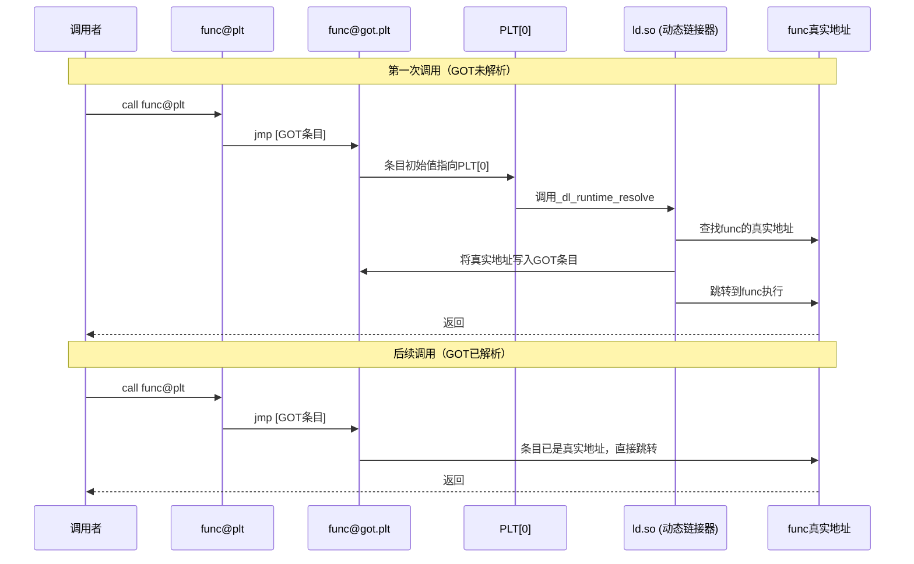
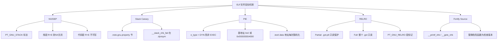

## 16.5 ELF文件格式基础

ELF（Executable and Linkable Format）是Linux系统下可执行文件、目标文件（`.o`）、共享库（`.so`）和核心转储（`core dump`）的标准二进制格式。它由UNIX系统实验室（USL）在1990年代初期定义，后被Tool Interface Standard（TIS）委员会标准化为ELF 1.2规范，如今是x86、ARM、MIPS、RISC-V等几乎所有类UNIX系统共同遵循的二进制格式标准。

对PWN而言，理解ELF格式是第一道门槛：你需要知道程序的机器码和数据在文件中如何布局、加载器如何将文件映射到内存、动态链接器如何解析外部符号、以及安全机制（RELRO、PIE、Canary）在ELF层面如何体现。本节将从文件结构、段与节的对应关系、动态链接机制、安全防护特性四个维度，系统性地拆解ELF格式中与PWN相关的全部知识点。

### 16.5.1 ELF文件总体布局

一个完整的ELF文件由四个主要部分组成，按文件偏移排列如下：

```text
┌──────────────────────┐  偏移 0x0
│     ELF Header       │  52/64 字节（32/64位）
├──────────────────────┤
│  Program Header Table │  描述"段"（Segment）
├──────────────────────┤
│       Sections       │  实际内容
│  .text .data .bss    │
│  .rodata .got .plt   │
│  .symtab .dynsym     │
│  .rel .rela .dynstr  │
│  ...                 │
├──────────────────────┤
│  Section Header Table │  描述"节"（Section）
└──────────────────────┘
```

两个核心视角需要区分：

- **链接视角（Section）**：编译器和链接器看到的是"节"（Section）。`.text`、`.data`、`.bss`、`.symtab`等都是节，用于静态链接和调试。
- **加载视角（Segment/Program Header）**：操作系统加载器看到的是"段"（Segment）。一个段可以包含多个节，描述的是运行时的内存映射方式。

这个区分非常重要：**PWN中我们同时需要两个视角**——分析漏洞时看节（找`.got`、`.plt`），理解内存布局时看段（找可执行段、可写段、READONLY段）。

### 16.5.2 ELF Header详解

ELF Header位于文件最开始的位置，固定大小：32位系统下52字节，64位系统下64字节。它包含了整个文件的元信息，加载器通过读取ELF Header来判断文件类型、目标架构和关键数据结构的位置。

ELF Header的C结构体定义（来自`/usr/include/elf.h`）：

```c
// 32位版本
typedef struct {
    unsigned char e_ident[16]; // 魔数和标识信息
    Elf32_Half    e_type;      // 文件类型
    Elf32_Half    e_machine;   // 目标架构
    Elf32_Word    e_version;   // ELF版本
    Elf32_Addr    e_entry;     // 程序入口地址
    Elf32_Off     e_phoff;     // Program Header Table偏移
    Elf32_Off     e_shoff;     // Section Header Table偏移
    Elf32_Word    e_flags;     // 处理器特定标志
    Elf32_Half    e_ehsize;    // ELF Header大小
    Elf32_Half    e_phentsize; // 每个Program Header条目大小
    Elf32_Half    e_phnum;     // Program Header条目数量
    Elf32_Half    e_shentsize; // 每个Section Header条目大小
    Elf32_Half    e_shnum;     // Section Header条目数量
    Elf32_Half    e_shstrndx;  // Section名称字符串表的索引
} Elf32_Ehdr;

// 64位版本：地址和偏移变为Elf64_Addr/Elf64_Off（8字节），总大小64字节
typedef struct {
    unsigned char e_ident[16];
    Elf64_Half    e_type;
    Elf64_Half    e_machine;
    Elf64_Word    e_version;
    Elf64_Addr    e_entry;
    Elf64_Off     e_phoff;
    Elf64_Off     e_shoff;
    Elf64_Word    e_flags;
    Elf64_Half    e_ehsize;
    Elf64_Half    e_phentsize;
    Elf64_Half    e_phnum;
    Elf64_Half    e_shentsize;
    Elf64_Half    e_shnum;
    Elf64_Half    e_shstrndx;
} Elf64_Ehdr;
```

`e_ident`字段的16个字节包含：

| 偏移 | 长度 | 含义 | 示例值 |
|------|------|------|--------|
| 0 | 4 | 魔数（Magic Number） | `7f 45 4c 46`（`.ELF`） |
| 4 | 1 | 位数（Class） | `01`=32位, `02`=64位 |
| 5 | 1 | 字节序（Data Encoding） | `01`=小端, `02`=大端 |
| 6 | 1 | ELF头版本 | `01`（当前） |
| 7 | 1 | OS/ABI标识 | `03`=Linux, `00`=UNIX System V |
| 8 | 8 | 填充（Reserved） | 全零 |

PWN中最常用的字段是`e_entry`（程序入口点，即`_start`的地址）和`e_phoff`/`e_shoff`（定位Program Header Table和Section Header Table的文件偏移）。

**实战工具：`readelf -h`**

```bash
$ readelf -h /bin/ls
ELF Header:
  Magic:   7f 45 4c 46 02 01 01 00 00 00 00 00 00 00 00 00
  Class:                             ELF64
  Data:                              2's complement, little endian
  Version:                           1 (current)
  OS/ABI:                            UNIX - System V
  ABI Version:                       0
  Type:                              DYN (Position-Independent Executable file)
  Machine:                           Advanced Micro Devices X86-64
  Version:                           0x1
  Entry point address:               0x5310
  Start of program headers:          64 (bytes into file)
  Start of section headers:          139776 (bytes into file)
  ...
```

注意`Type`字段为`DYN`——现代Linux发行版默认编译的可执行文件都是PIE（Position-Independent Executable），其类型标记为`DYN`而非传统的`EXEC`。这在PWN中有重要含义：PIE程序每次加载的基地址都不同，需要先泄露一个地址才能进行后续利用。

### 16.5.3 Program Header（段表）详解

Program Header Table描述的是程序运行时的内存映射方式。操作系统加载器（`execve`系统调用→内核`load_elf_binary`函数）根据Program Header将文件的各个部分映射到进程虚拟地址空间。

每个Program Header条目的结构体：

```c
typedef struct {
    Elf64_Word  p_type;    // 段类型
    Elf64_Word  p_flags;   // 段标志（权限）
    Elf64_Off   p_offset;  // 在文件中的偏移
    Elf64_Addr  p_vaddr;   // 在内存中的虚拟地址
    Elf64_Addr  p_paddr;   // 物理地址（通常等于p_vaddr）
    Elf64_Xword p_filesz;  // 在文件中的大小
    Elf64_Xword p_memsz;   // 在内存中的大小
    Elf64_Xword p_align;   // 对齐要求
} Elf64_Phdr;
```

关键段类型（`p_type`）：

| 类型 | 值 | 含义 | PWN相关性 |
|------|----|------|-----------|
| `PT_LOAD` | 1 | 可加载段 | 核心——代码和数据的载体 |
| `PT_DYNAMIC` | 2 | 动态链接信息 | GOT/PLT位置的关键线索 |
| `PT_INTERP` | 3 | 程序解释器路径 | 指定`ld-linux.so`的位置 |
| `PT_NOTE` | 4 | 注释信息 | 可用于信息泄露 |
| `PT_GNU_STACK` | 0x6474e551 | 栈属性 | 判断NX是否开启 |
| `PT_GNU_RELRO` | 0x6474e552 | RELRO保护区域 | 判断RELRO类型 |

**PWN中最关键的段分析：**

**1）`PT_LOAD`段——内存映射的核心**

一个典型的ELF至少有两个`PT_LOAD`段：

```text
LOAD  0x000000 0x0000000000400000 0x0000000000400000
      0x000704 0x000704  R E  0x200000  ← 代码段，可读可执行
LOAD  0x001000 0x0000000000601000 0x0000000000601000
      0x000130 0x000138  RW   0x200000  ← 数据段，可读可写
```

第一个`PT_LOAD`段包含`.text`节（可读可执行，不可写），第二个包含`.data`、`.bss`、`.got`等节（可读可写）。这个权限分离是NX保护的基础：代码段不可写防止shellcode注入，数据段不可执行防止数据被当作代码执行。

注意`p_memsz`可能大于`p_filesz`（如第二个段中`0x138 > 0x130`），多出来的部分对应`.bss`节——它在文件中不占空间，但在内存中需要零初始化。

**2）`PT_GNU_STACK`——判断NX（No-Execute）**

```bash
$ readelf -l /bin/ls | grep GNU_STACK
  GNU_STACK      0x000000 0x0000000000000000 0x0000000000000000
                 0x000000 0x0000000000000000  RW  0x10
```

`RW`表示栈可读写但不可执行（NX开启）。如果显示`RWE`，则栈可执行（NX关闭），可以直接注入shellcode。

**实战工具：`readelf -l`**

```bash
$ readelf -l ./vuln_program

Elf file type is DYN (Position-Independent Executable file)
Entry point 0x1060
There are 13 program headers, starting at offset 64

Program Headers:
  Type           Offset             VirtAddr           PhysAddr
                 FileSiz            MemSiz              Flags  Align
  PHDR           0x0000000000000040 0x0000000000000040 0x0000000000000040
                 0x00000000000002d8 0x00000000000002d8  R      0x8
  INTERP         0x0000000000000318 0x0000000000000318 0x0000000000000318
                 0x000000000000001c 0x000000000000001c  R      0x1
      [Requesting program interpreter: /lib64/ld-linux-x86-64.so.2]
  LOAD           0x0000000000000000 0x0000000000000000 0x0000000000000000
                 0x0000000000000660 0x0000000000000660  R      0x1000
  LOAD           0x0000000000001000 0x0000000000001000 0x0000000000001000
                 0x0000000000000135 0x0000000000000135  R E    0x1000
  LOAD           0x0000000000002000 0x0000000000002000 0x0000000000002000
                 0x00000000000000f4 0x00000000000000f4  R      0x1000
  LOAD           0x0000000000002db8 0x0000000000003db8 0x0000000000003db8
                 0x0000000000000260 0x0000000000000270  RW     0x1000
  DYNAMIC        0x0000000000002dc8 0x0000000000003dc8 0x0000000000003dc8
                 0x00000000000001f0 0x00000000000001f0  RW     0x8
  NOTE           ...
  GNU_EH_FRAME   ...
  GNU_STACK      0x0000000000000000 0x0000000000000000 0x0000000000000000
                 0x0000000000000000 0x0000000000000000  RW     0x10
  GNU_RELRO      0x0000000000002db8 0x0000000000003db8 0x0000000000003db8
                 0x0000000000000248 0x0000000000000248  R      0x1
```

从这个输出中可以立即获取PWN所需的关键信息：入口地址`0x1060`、代码段`R E`、数据段`RW`、栈权限`RW`（NX开启）、RELRO保护区域等。

### 16.5.4 Section（节）详解

Section Header Table描述了文件中每个逻辑节的属性和位置。以下是PWN中最需要关注的节：

#### .text——代码段

存放编译后的机器指令。属性为`AX`（可分配、可执行）。这个节在运行时通常映射为只读+可执行，任何写入尝试都会触发段错误。PWN中你不会直接修改`.text`，但你需要从中读取代码（`objdump -d`）来理解程序逻辑、寻找gadgets（ROP）。

#### .data——已初始化的全局变量

存放程序中显式初始化的全局变量和静态变量。属性为`WA`（可写、可分配）。例如`int global_var = 42;`对应的值就存在这里。由于`.data`可写，它是格式化字符串漏洞中任意写的目标之一。

#### .bss——未初始化的全局变量

存放未初始化或初始化为零的全局变量和静态变量。属性为`WA`。它在文件中不占空间（`p_filesz=0`），但在内存中由加载器分配并清零。`.bss`段的大小在`Program Header`中体现为`p_memsz - p_filesz`的差值。由于`.bss`可写且通常有较大空间，它也是PWN中shellcode存放和堆喷射的目标区域。

#### .rodata——只读数据

存放字符串常量、`const`修饰的全局变量等。属性为`A`（可分配，只读）。这个节映射到只读内存页，写入会触发段错误。PWN中`.rodata`中的字符串可以作为信息泄露的数据源。

#### .got（Global Offset Table）——全局偏移表

GOT是动态链接的核心数据结构之一。它位于数据段（可读写），存放的是全局变量和外部函数的实际运行时地址。

GOT被逻辑上分为三个部分：

- **`.got`**：存放全局变量的地址。链接器在加载时解析。
- **`.got.plt`**：存放外部函数的地址。通过PLT延迟绑定机制填充（见下文）。这是PWN攻击的核心目标。

`.got.plt`的初始状态（未解析时）很有特点：每个条目初始值指向PLT[0]中的解析代码（即`_dl_runtime_resolve`的调用入口），而不是0。这样保证了第一次调用某函数时能正确触发延迟绑定流程。

#### .plt（Procedure Linkage Table）——过程链接表

PLT是动态链接的另一个核心结构。每个外部函数对应一个PLT桩（stub），通常16字节，结构如下：

```asm
; PLT桩的一般结构（x86-64）
func@plt:
    jmp    QWORD PTR [rip+GOT_OFFSET]  ; 从GOT读取函数地址并跳转
    push   INDEX                         ; 压入该函数在重定位表中的索引
    jmp    PLT0                          ; 跳转到PLT[0]，触发动态链接器
```

PLT[0]是所有PLT桩共享的公共入口，负责调用动态链接器的`_dl_runtime_resolve`函数来解析符号。

**延迟绑定的完整流程：**



**为什么GOT覆盖是PWN的核心技术？**

GOT表中的条目可写（除非启用了Full RELRO），且存储的是函数指针。攻击者如果能通过漏洞（如栈溢出、格式化字符串）修改GOT中某个常用函数（如`printf`、`puts`、`free`）的条目，将地址改为`system`或`one_gadget`，那么程序下次调用该函数时就会跳转到攻击者指定的地址，实现控制流劫持。

#### .dynsym与.dynstr——动态符号表和动态字符串表

`.dynsym`存储动态链接所需的符号信息（函数名、变量名），`.dynstr`存储对应的字符串。每个符号条目包含：

```c
typedef struct {
    Elf64_Word    st_name;   // 符号名称在.dynstr中的偏移
    unsigned char st_info;   // 符号类型和绑定属性
    unsigned char st_other;  // 可见性
    Elf64_Half    st_shndx;  // 所在节的索引
    Elf64_Addr    st_value;  // 符号值（地址）
    Elf64_Xword   st_size;  // 符号大小
} Elf64_Sym;
```

PWN中分析`.dynsym`可以知道程序导入了哪些外部函数（如`system`、`execve`），以及这些函数在GOT/PLT中的位置。

#### .rela.plt与.rela.dyn——重定位表

重定位表记录了需要在运行时被修改（重定位）的位置。`.rela.plt`对应`.got.plt`中的函数地址重定位，`.rela.dyn`对应全局变量和`R_X86_64_RELATIVE`类型的重定位。

每个重定位条目：

```c
typedef struct {
    Elf64_Addr  r_offset; // 需要重定位的地址（GOT条目地址）
    Elf64_Xword r_info;   // 重定位类型和符号索引
    Elf64_Sxword r_addend; // 加数
} Elf64_Rela;
```

通过`readelf -r`可以查看所有重定位条目，从而精确定位每个外部函数在GOT中的地址：

```bash
$ readelf -r ./vuln_program | head -20
Relocation section '.rela.dyn' at offset 0x488 contains 10 entries:
  Offset          Info           Type           Sym. Value    Sym. Name + Addend
000000003db8  000000000008 R_X86_64_RELATIVE                    1120
000000003dc0  000000000008 R_X86_64_RELATIVE                    10e0
...

Relocation section '.rela.plt' at offset 0x560 contains 4 entries:
  Offset          Info           Type           Sym. Value    Sym. Name + Addend
000000003fd8  000100000007 R_X86_64_JUMP_SLO 0000000000000000 printf@GLIBC_2.2.5 + 0
000000003fe0  000200000007 R_X86_64_JUMP_SLO 0000000000000000 puts@GLIBC_2.2.5 + 0
000000003fe8  000300000007 R_X86_64_JUMP_SLO 0000000000000000 read@GLIBC_2.2.5 + 0
000000003ff0  000400000007 R_X86_64_JUMP_SLO 0000000000000000 __libc_start_main@GLIBC_2.2.5 + 0
```

从这里可以直接看到：`printf`的GOT条目在`0x3fd8`，`puts`在`0x3fe0`——这是GOT覆盖攻击的直接目标地址。

#### .init_array与.fini_array——初始化/终结函数数组

`.init_array`存储程序启动时需要执行的函数指针数组（在`main`之前调用），`.fini_array`存储程序退出时需要执行的函数指针数组。GCC的`__attribute__((constructor))`声明的函数会被放入`.init_array`。

PWN中如果能覆写`.init_array`中的函数指针，可以在程序启动阶段就劫持控制流。

### 16.5.5 ELF与安全机制的对应关系

理解ELF格式后，各种安全机制在文件中的位置和作用就变得清晰：



**RELRO（RELocation Read-Only）机制详解：**

RELRO是PWN中最需要理解的安全机制之一，它直接决定了GOT覆盖攻击是否可行。

| RELRO类型 | 编译选项 | 效果 | GOT覆盖可行性 |
|-----------|---------|------|--------------|
| No RELRO | （默认） | GOT完全可写 | 完全可行 |
| Partial RELRO | `-z,relro` | `.got`只读，`.got.plt`仍可写 | 可行（最常见） |
| Full RELRO | `-z,relro -z,now` | 整个GOT只读，所有符号在启动时预绑定 | 不可行 |

Full RELRO通过`-z,now`标志禁用延迟绑定，强制动态链接器在程序启动时解析所有外部符号。解析完成后，GOT区域被`mprotect`设为只读。代价是启动变慢（所有库函数地址一次性解析），但安全性显著提高。

检查ELF文件的RELRO状态：

```bash
# 方法一：readelf查看Program Header
$ readelf -l ./program | grep GNU_RELRO
  GNU_RELRO      0x002db8 0x0000000000003db8 0x0000000000003db8
                 0x000248 0x0000000000000248  R   0x1

# 方法二：readelf查看动态段（判断是否为Full RELRO）
$ readelf -d ./program | grep BIND_NOW
 0x0000000000000018 (BIND_NOW)    ← 存在则为Full RELRO

# 方法三：checksec脚本（最直观）
$ checksec --file=./program
    Arch:     amd64-64-little
    RELRO:    Full RELRO
    Stack:    Canary found
    NX:       NX enabled
    PIE:      PIE enabled
    RUNPATH:  './'
```

**PIE（Position-Independent Executable）与ASLR的关系：**

PIE是编译选项（`-fPIE -pie`），使可执行文件本身可以在任意基地址加载。ASLR是内核特性（`/proc/sys/kernel/randomize_va_space`），负责随机化进程的栈、堆、库和PIE可执行文件的基地址。

PIE程序的ELF特征：
- `e_type`为`ET_DYN`（而非`ET_EXEC`）
- 代码中的地址全部使用相对寻址（`RIP`相对偏移）
- 运行时基地址通常在`0x555555554000`附近随机化

在PWN中，PIE保护意味着你不能直接使用ELF文件中的硬编码地址（如`0x401234`）。你需要先通过漏洞泄露一个运行时地址（如某个函数的返回地址或GOT中的已解析地址），然后通过偏移计算出程序基地址，再推算其他所有地址。

### 16.5.6 ELF分析工具箱

PWN中分析ELF文件的常用工具及其典型用法：

**readelf——ELF结构分析的瑞士军刀**

```bash
# 查看ELF Header
readelf -h ./program

# 查看所有Section Headers
readelf -S ./program

# 查看所有Program Headers
readelf -l ./program

# 查看动态符号表（导入的外部函数）
readelf -s ./program | grep FUNC

# 查看重定位表（GOT条目地址）
readelf -r ./program

# 查看动态段（NEEDED库、BIND_NOW等）
readelf -d ./program
```

**objdump——反汇编和段信息**

```bash
# 反汇编.text段
objdump -d -M intel ./program

# 反汇编特定函数
objdump -d -M intel ./program | grep -A 30 '<main>:'

# 查看所有节的头部信息
objdump -h ./program

# 查看.rodata中的字符串
objdump -s -j .rodata ./program
```

**Ghidra/IDA Pro——交互式逆向分析**

对于复杂的二进制文件，静态分析工具能提供交叉引用、类型恢复、伪代码等高级功能。Ghidra（免费开源）和IDA Pro（商业软件）都能自动解析ELF结构并提供可视化的分析界面。

**pwntools——Python自动化分析**

```python
from pwn import *

elf = ELF('./vuln_program')

# 获取函数地址
print(hex(elf.symbols['main']))       # main函数地址
print(hex(elf.got['printf']))         # printf的GOT条目地址
print(hex(elf.plt['system']))         # system的PLT地址

# 获取节地址
print(hex(elf.bss()))                 # .bss起始地址
print(hex(elf.get_section_by_name('.got.plt').header.sh_addr))

# 判断安全机制
print(elf.relro)                      # RELRO类型
print(elf.pie)                        # 是否PIE
print(elf.nx)                         # 是否NX
```

### 16.5.7 ELF结构的内存布局全景

将ELF文件的各个部分映射到进程虚拟地址空间的典型布局：

```text
高地址 ┌───────────────────┐
       │     内核空间        │ 0x7fff_ffff_ffff (用户态不可见)
       ├───────────────────┤
       │       栈           │ ↘ 向低地址增长
       │  (局部变量/返回地址) │
       ├───────────────────┤
       │     共享库映射      │ libc.so / ld-linux.so
       │  .text  .data  .got │
       ├───────────────────┤
       │     堆             │ ↗ 向高地址增长
       │  (malloc分配的内存) │
       ├───────────────────┤
       │       .bss         │ 未初始化全局变量（零填充）
       ├───────────────────┤
       │      .data         │ 已初始化全局变量
       ├───────────────────┤
       │    .got / .plt     │ 动态链接表
       ├───────────────────┤
       │      .rodata       │ 只读数据（字符串常量）
       ├───────────────────┤
       │      .text         │ 机器指令（只读+可执行）
       ├───────────────────┤
       │    ELF Header      │ 程序入口 0x400000（非PIE）
低地址 └───────────────────┘
```

PIE程序的基地址会在每次运行时随机化（ASLR），而非PIE程序的`.text`段固定在`0x400000`（x86-64）。

### 16.5.8 常见误区与注意事项

**误区一：Section和Segment是同一回事**

Section是链接视角的概念（编译器/链接器用），Segment是加载视角的概念（内核用）。一个Segment可以包含多个Section。`readelf -S`显示Section，`readelf -l`显示Segment。在PWN中，你分析文件结构时用Section，分析内存布局时用Segment。

**误区二：`.got`和`.got.plt`是同一个东西**

严格来说，`.got`存放全局变量的地址（由`.rela.dyn`重定位），`.got.plt`存放外部函数的地址（由`.rela.plt`重定位）。两者在内存中通常是连续的，但保护机制可以分别对待——Partial RELRO只保护`.got`，`.got.plt`仍可写。

**误区三：`checksec`显示的安全机制是绝对的**

`checksec`检查的是ELF文件的编译选项，而不是运行时的实际保护状态。例如，如果内核没有启用ASLR（`/proc/sys/kernel/randomize_va_space=0`），即使PIE编译的程序每次也加载到相同地址。同理，`gdb`调试时默认会关闭ASLR。

**误区四：所有函数都通过PLT调用**

只有外部函数（来自共享库的函数）才通过PLT/GOT机制调用。程序内部的函数（如自己写的`helper()`函数）是直接调用的，地址在链接时就确定了。但如果程序使用`-fPIE`编译，内部函数的调用也是相对寻址的。

**误区五：32位和64位ELF只是地址宽度不同**

除了地址宽度，还有其他重要差异：
- 系统调用号不同（`execve`：32位=11，64位=59）
- 参数传递方式不同（32位用栈，64位用寄存器）
- ELF Header大小不同（52 vs 64字节）
- Program Header大小不同（32 vs 56字节）
- Section Header大小不同（40 vs 64字节）
- GOT/PLT的跳转指令形式不同

### 16.5.9 本节小结

ELF文件格式是PWN的基础知识框架。掌握ELF结构的核心价值在于：

1. **定位攻击目标**：通过ELF结构找到GOT表、PLT桩、`.bss`段等攻击目标的精确地址
2. **判断防御强度**：通过Program Header和动态段判断NX、PIE、RELRO等安全机制的状态
3. **理解动态链接**：延迟绑定机制是GOT覆盖攻击的理论基础
4. **指导利用方案**：根据ELF布局选择最优的攻击路径——GOT覆盖、ROP gadget搜索、shellcode存放位置等

建议读者在本地环境中使用`readelf`、`objdump`和`pwntools`反复练习分析各种编译选项（`-no-pie`、`-z norelro`、`-z execstack`等）下生成的ELF文件，建立直观的文件结构感知能力。
