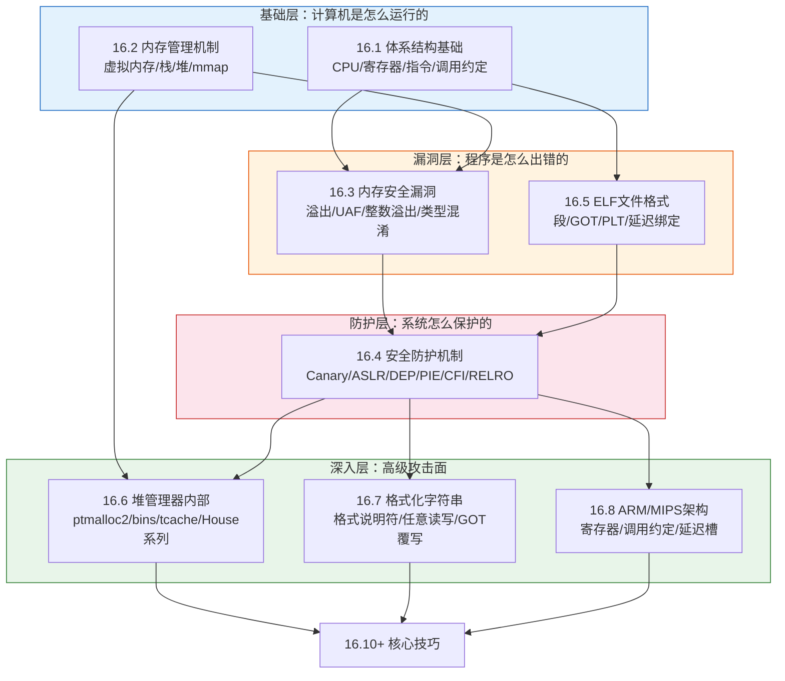
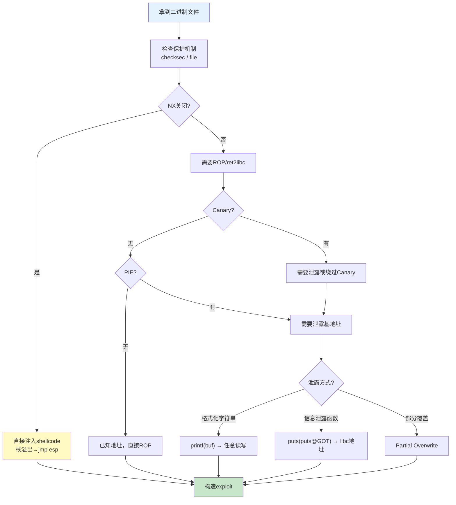

## 16.9 本节补充总结

理论基础是二进制安全PWN的地基。本节（16.1—16.8）系统覆盖了从计算机体系结构到多架构PWN的完整知识体系。本节总结不是简单复述，而是帮助你建立**知识网络**——把零散的概念串联成可操作的思维框架，同时查漏补缺，为后续的核心技巧和实战案例打下坚实基础。

### 16.9.1 知识体系全景图

本节的8个子章节构成了一个层层递进的知识体系，每一层都依赖前一层的理解：



**学习路径建议：** 基础层（16.1→16.2）→ 漏洞层（16.3→16.5）→ 防护层（16.4）→ 深入层（16.6→16.7→16.8）。这个顺序不是随意的——你必须先理解CPU如何执行指令（16.1），才能理解栈帧为什么能被溢出（16.3）；必须先理解虚拟内存布局（16.2），才能理解堆管理器为什么这样设计（16.6）；必须先理解防护机制（16.4），才能理解为什么需要ROP而不是直接注入shellcode。

### 16.9.2 各章核心要点回顾

#### 16.1 计算机体系结构基础 — "地基中的地基"

本章是整个PWN知识体系的起点，覆盖了以下关键主题：

**x86 vs x64 的核心差异（直接影响exploit编写）：**

| 维度 | x86（32位） | x64（64位） | 实战影响 |
|------|------------|------------|---------|
| 参数传递 | 全部压栈（cdecl） | 前6个用寄存器（RDI/RSI/RDX/RCX/R8/R9） | ROP链构造方式完全不同 |
| 返回地址 | 4字节，EIP | 8字节，RIP | payload长度翻倍，地址含`\x00` |
| 栈对齐 | 4字节 | 16字节要求 | x64常需额外`ret` gadget对齐 |
| 系统调用 | `int 0x80`（EAX=调用号） | `syscall`（RAX=调用号） | ret2syscall的寄存器设置不同 |
| ASLR熵 | 较低（可爆破） | 较高（28位栈，47位地址空间） | 64位几乎不能纯爆破 |

**寄存器在PWN中的角色：**
- **EIP/RIP**：PWN的终极目标——控制它就控制了程序执行流
- **ESP/RSP**：控制栈布局，栈迁移（stack pivoting）的关键
- **EBP/RBP**：栈帧锚点，覆盖它可以实现栈迁移
- **EAX/RAX**：系统调用号，ret2syscall时必须设置
- **FS段寄存器**：存放Canary（`fs:0x28`），理解它才能理解Canary的工作原理

**调用约定决定了你的ROP链怎么写：**
- x86 cdecl：参数全在栈上，ROP链是`[gadget_addr][arg1][arg2][arg3]...`
- x64 System V：参数在寄存器里，ROP链需要`pop rdi; ret`、`pop rsi; ret`等gadget先把值弹入寄存器

**关键公式——计算栈溢出偏移：**
```text
偏移 = 缓冲区大小 + 保存的EBP/RBP大小
x86: 偏移 = buffer_size + 4
x64: 偏移 = buffer_size + 8（注意栈对齐可能额外+8）
```

#### 16.2 内存管理机制 — "程序的内存地图"

**虚拟地址空间布局（必须牢记）：**
```text
低地址 → 高地址：
  .text（代码，只读可执行）
  .rodata（只读数据）
  .data（已初始化全局变量）
  .bss（未初始化全局变量，可写）
  ↑ 堆（向高地址增长，malloc/free管理）
  ↓ mmap区（共享库、大块分配）
  ↓ 栈（向低地址增长，函数调用管理）
  内核空间（用户态不可访问）
```

**栈的工作机制——函数调用的完整流程：**
1. 调用者将参数压栈（x86）或放入寄存器（x64）
2. `call`指令：将返回地址压栈，跳转到目标函数
3. 被调用者保存旧EBP（`push rbp`），建立新栈帧（`mov rbp, rsp`）
4. 分配局部变量空间（`sub rsp, N`）
5. 执行函数体
6. 恢复栈帧（`mov rsp, rbp`；`pop rbp`）
7. `ret`指令：弹出返回地址，跳转执行

栈溢出发生在第4步——当局部变量的写入超出分配的空间时，会覆盖保存的EBP和返回地址（第2步压入的），从而在第7步劫持控制流。

**堆管理器（ptmalloc2）的核心概念：**
- chunk是堆管理的最小单位，包含prev_size、size（含标志位）、fd/bk指针
- free后的chunk不会立即归还OS，而是放入bins链表复用
- 五种bins按优先级排列：tcache → fastbin → unsorted bin → small bin → large bin

#### 16.3 常见内存安全漏洞类型 — "程序是怎么被攻破的"

本章介绍了7种核心漏洞类型，每种都有不同的利用路径：

| 漏洞类型 | 危害等级 | 利用难度 | 典型利用方式 |
|---------|---------|---------|------------|
| 栈缓冲区溢出 | ★★★★★ | ★★☆ | 覆盖返回地址→控制EIP/RIP |
| 堆溢出 | ★★★★★ | ★★★★ | 覆盖chunk metadata→堆利用 |
| 格式化字符串 | ★★★★☆ | ★★★ | 任意读写→GOT覆写 |
| 整数溢出 | ★★★☆☆ | ★★★ | 缓冲区分配不足→二次溢出 |
| UAF | ★★★★★ | ★★★★ | 重用释放指针→控制对象内容 |
| Double Free | ★★★★☆ | ★★★★ | 空闲链表环→chunk重叠 |
| 类型混淆 | ★★★★☆ | ★★★★★ | 虚表劫持→代码执行 |

**栈溢出的本质：** 向栈上缓冲区写入超过其大小的数据，覆盖相邻的返回地址。最简单的例子是`gets()`——它不限制输入长度，溢出几乎是必然的。

**UAF的核心逻辑：** free之后指针没有置NULL → 重新分配的内存占据同一地址 → 通过旧指针操作新对象。这在C++中尤其危险，因为虚表指针可能被替换。

**Double Free的原理：** 同一chunk被free两次，空闲链表中出现环形结构（A→B→A→B...），导致两次malloc返回同一地址，实现任意地址写。

#### 16.4 安全防护机制 — "对手的防御体系"

理解防护机制不是为了绕过而绕过，而是为了**评估每个目标的攻击面**。以下是六大防护机制及其绕过思路的系统对比：

| 防护机制 | 保护对象 | 绕过思路 | 依赖条件 |
|---------|---------|---------|---------|
| Stack Canary | 栈帧返回地址 | 泄露Canary值/逐字节爆破/覆盖`__stack_chk_fail` | 需要信息泄露或fork |
| ASLR | 栈/堆/库基地址 | 信息泄露→推算地址/部分覆盖/爆破（32位） | 需要泄露或低熵 |
| DEP/NX | 数据区域不可执行 | ROP/ret2libc/ret2syscall | 需要gadget或libc地址 |
| PIE | 程序基地址 | 泄露程序地址/部分覆盖 | 需要信息泄露 |
| Full RELRO | GOT表不可写 | 不能用GOT覆写，需其他方法 | — |
| CFI | 间接控制流转移 | 需要绕过具体CFI实现 | 取决于实现质量 |

**绕过Canary的四种方法详解：**
1. **泄露Canary**：如果程序有格式化字符串漏洞或其他信息泄露，可以读取Canary值（注意：Canary最低字节固定为`\x00`）
2. **逐字节爆破**：fork子进程继承父进程Canary，逐字节猜（256次/字节，4字节=约1000次尝试）
3. **覆盖`__stack_chk_fail`的GOT表**：将失败处理函数改为无害函数（需要GOT可写且未开启PIE）
4. **不覆盖Canary**：如果漏洞点在Canary之前，可以只覆盖局部变量中的函数指针或数据

**绕过DEP的三种经典技术：**
1. **ret2libc**：直接跳转到libc中的`system("/bin/sh")`，不需要可执行的栈
2. **ROP（Return-Oriented Programming）**：拼接程序/libc中的`ret`结尾代码片段，构造任意操作序列
3. **ret2syscall**：将参数放入寄存器后执行`syscall`/`int 0x80`，直接调用内核

**安全机制组合的影响：**

单独一种防护机制通常可以被绕过，但多种机制组合会大幅提高利用难度：

```text
防护等级评估：
  无保护：        ★☆☆☆☆（直接栈溢出）
  +NX：           ★★☆☆☆（ret2libc/ROP）
  +NX+Canary：    ★★★☆☆（需泄露Canary或绕过）
  +NX+Canary+PIE：★★★★☆（需泄露两个地址）
  +Full RELRO：   ★★★★☆（GOT覆写失效）
  +全开：         ★★★★★（需要组合利用+多步泄露）
```

#### 16.5 ELF文件格式基础 — "程序的内部结构"

ELF文件是Linux下所有可执行文件、共享库、目标文件的标准格式。PWN中最关键的两个概念：

**GOT表（Global Offset Table）：** 存储全局变量和库函数的实际运行时地址。当程序调用外部函数时，通过GOT表间接跳转。如果GOT表可写（Partial RELRO），攻击者可以覆写其中的函数指针，劫持后续的函数调用。

**PLT表（Procedure Linkage Table）：** 实现延迟绑定的跳转桩。第一次调用外部函数时，PLT跳转到动态链接器解析真实地址并写入GOT表；之后直接通过GOT表跳转。

**延迟绑定的完整流程：**
```text
程序调用 puts@plt
    → puts@plt 第一条指令: jmp *GOT[puts]
        → 第一次: GOT[puts] = PLT[0]（未解析）
            → PLT[0] 调用 ld.so
                → ld.so 解析 puts 的真实地址
                → 写入 GOT[puts] = 0x7f...
        → 之后: GOT[puts] = 0x7f...（已解析）
            → 直接跳转到 puts
```

**PWN实战意义：** GOT表是信息泄露和控制流劫持的重要目标。通过格式化字符串或其他漏洞读取GOT表内容，可以泄露libc基地址（绕过ASLR）；覆写GOT表内容，可以劫持函数调用（绕过DEP）。

#### 16.6 堆管理器内部机制 — "堆利用的理论基础"

堆利用是PWN中技术含量最高的领域之一。本章深入介绍了ptmalloc2的内部实现：

**chunk结构的内存布局（64位）：**
```text
prev_size (8B) | size (8B) | fd (8B) | bk (8B) | user data...
                 ^^^^^^^^^^
                 低3位是标志位:
                   bit0: PREV_INUSE (前chunk是否在使用)
                   bit1: IS_MMAPPED (是否mmap分配)
                   bit2: NON_MAIN_ARENA (是否非主线程arena)
```

**五种Bins的特性和利用价值：**

| Bin类型 | 数据结构 | 分配策略 | 合并检查 | 利用价值 |
|---------|---------|---------|---------|---------|
| Fastbin | 单链表 | LIFO | 不合并 | Double Free→chunk重叠 |
| Tcache | 单链表 | LIFO | 不检查double free（旧版） | tcache poisoning |
| Unsorted Bin | 双向循环链表 | — | 合并 | Unsorted bin attack |
| Small Bin | 双向链表 | FIFO | 合并 | House of Lore |
| Large Bin | 双向链表+fd_nextsize | Best-fit | 合并 | House of Large |

**经典堆利用技术对比：**

| 技术 | 原理 | 前提条件 | glibc版本 |
|------|------|---------|----------|
| House of Force | 溢出修改top chunk size→分配到任意地址 | 能溢出top chunk | 所有版本 |
| House of Spirit | 栈上伪造chunk→free进fastbin→malloc返回栈地址 | 能控制栈上数据 | 所有版本 |
| House of Orange | 不free，溢出top chunk使其被放入unsorted bin | 堆溢出 | <2.26 |
| tcache poisoning | 修改tcache fd指针→malloc返回任意地址 | tcache未满+能修改fd | ≥2.26 |
| tcache stashing unlink | 利用tcache和small bin交互→任意地址写 | 能控制small bin | ≥2.26 |
| Unsorted bin attack | 覆盖bk指针→向任意地址写入large value | 能控制unsorted bin chunk | <2.29 |

**tcache的革命性影响（glibc 2.26+）：**
- 正面：大幅简化了堆利用，tcache poisoning比fastbin attack简单得多
- 负面：旧版tcache不检查double free，降低了利用门槛
- 新增防护（glibc 2.29+）：tcache key字段检测double free，safe-linking（2.32+）加密fd指针

#### 16.7 格式化字符串漏洞 — "读写任意地址的瑞士军刀"

格式化字符串漏洞虽然出现频率不如栈溢出，但其能力极其强大——它可以同时实现**任意地址读**和**任意地址写**。

**格式说明符的攻击能力：**

| 说明符 | 功能 | 攻击用途 |
|--------|------|---------|
| `%x` / `%p` | 读取栈上数据 | 信息泄露：Canary、libc地址、栈地址 |
| `%s` | 读取指针指向的字符串 | 读取任意内存内容 |
| `%n` | 写入已输出字符数 | 向指定地址写入数据 |
| `%hn` | 写入2字节 | 精确写入（常用） |
| `%hhn` | 写入1字节 | 最精确的写入控制 |
| `%N$` | 直接访问第N个参数 | 定位格式化字符串在栈上的偏移 |

**格式化字符串利用的完整流程：**
1. **定位偏移**：输入`AAAA%x.%x.%x...`，找到`41414141`出现的位置（如第6个参数）
2. **验证可控性**：输入`AAAA%6$x`，确认能直接读取自己的输入
3. **构造写入**：使用`%n`系列说明符向目标地址写入值
4. **拆分写入**：将大数值拆成多次1/2字节写入（`%hhn`写1字节，`%hn`写2字节）

**GOT覆写示例思路：**
```text
目标：将 printf@GOT 的值改为 system 的地址
步骤：
1. 泄露 libc 地址（通过 %x 读取栈上的 libc 地址）
2. 计算 system 的地址 = libc基址 + system偏移
3. 用 %hhn 逐字节覆盖 printf@GOT 的内容
4. 下次程序调用 printf(input) 时，实际执行 system(input)
```

#### 16.8 ARM/MIPS架构下的PWN — "超越x86的视野"

随着IoT设备的爆发，ARM和MIPS架构的PWN需求快速增长。核心差异集中在**寄存器和调用约定**上：

**三大架构的PWN关键差异：**

| 特性 | x86/x64 | ARM | MIPS |
|------|---------|-----|------|
| 返回地址位置 | 栈上 | LR寄存器（可存栈上） | $ra寄存器（prologue存栈上） |
| 参数传递 | 栈/寄存器（视版本） | R0-R3 | $a0-$a3 |
| 指令长度 | 可变（1-15字节） | 固定4字节（Thumb 2字节） | 固定4字节 |
| 特殊机制 | — | 条件执行（每条指令可条件执行） | 延迟槽（跳转后指令总执行） |
| ROP gadget | `pop reg; ret` | `pop {reg, pc}` | `lw $ra, 0xXX($sp); jr $ra` |
| 系统调用 | `int 0x80`/`syscall` | `svc 0` | `syscall` |

**ARM的Thumb模式：** ARM指令集有ARM（4字节）和Thumb（2字节）两种模式，通过`BX`指令的最低位切换。在PWN中，Thumb模式下的gadget更短小，有时更容易找到有用的片段。

**MIPS延迟槽（Delay Slot）：** 跳转/分支指令后的那条指令**总是被执行**，无论跳转是否成功。这是MIPS流水线架构的产物，在PWN中意味着：
```asm
jr   $ra        # 跳转到返回地址
nop              # 延迟槽：这条指令在跳转前执行！
# 如果这里放的是恶意指令，它会在跳转前执行
```
构造ROP链时必须考虑延迟槽中的指令，不能简单忽略。

### 16.9.3 核心公式与速查表

#### PWN决策树：根据目标条件选择技术路线



#### 常用工具速查

| 工具 | 用途 | 常用命令 |
|------|------|---------|
| `checksec` | 查看二进制保护机制 | `checksec ./vuln` |
| `file` | 识别文件类型和架构 | `file ./vuln` |
| `GDB + pwndbg` | 动态调试、查看内存 | `gdb ./vuln`，`b main`，`r`，`vmmap` |
| `objdump` | 反汇编、查看节信息 | `objdump -d ./vuln`，`objdump -R ./vuln` |
| `readelf` | 查看ELF头、段、节 | `readelf -h ./vuln`，`readelf -S ./vuln` |
| `ROPgadget` | 搜索ROP gadgets | `ROPgadget --binary ./vuln --only "pop|ret"` |
| `one_gadget` | 查找libc中的execve gadget | `one_gadget libc.so.6` |
| `pwntools` | Python exploit开发框架 | `from pwn import *` |
| `ropper` | 搜索ROP gadgets（更灵活） | `ropper -f ./vuln --search "pop rdi"` |
| `Ghidra/IDA` | 反编译、静态分析 | GUI操作，F5反编译 |

#### 栈溢出偏移计算方法

**方法一：pattern生成法（推荐）**
```python
from pwn import *
# 生成不重复的pattern
p = cyclic(200)
# 运行程序，输入pattern，观察崩溃时的EIP/RIP值
# 例如 EIP = 0x61616174 → 查找偏移
offset = cyclic_find(0x61616174)  # x86
offset = cyclic_find(0x6161616161616174)  # x64
```

**方法二：手动计算**
```text
偏移 = 局部变量总大小 + 对齐填充 + 保存的EBP/RBP
x86: +4字节（EBP）
x64: +8字节（RBP），可能+8字节（栈对齐）
```

**方法三：GDB确认**
```bash
gdb-pwndbg> disas vulnerable_function
# 查看 sub esp, 0xXX → 局部变量空间大小
# 在返回地址处下断点，查看与buffer的距离
```

### 16.9.4 常见误区与纠正

#### 误区一：跳过体系结构直接学利用技术

**错误表现：** 直接学ROP、堆利用，不理解寄存器、栈帧、调用约定。

**后果：** 看不懂GDB输出，不理解为什么payload要这样构造，遇到变体（x64 vs x86）就手足无措。

**纠正：** 体系结构是"操作系统手册"。花1-2天彻底理解16.1的内容，后续所有技术的学习效率会提升数倍。

#### 误区二：混淆"栈溢出"和"堆溢出"的利用方式

**错误表现：** 认为堆溢出也能像栈溢出一样直接覆盖返回地址。

**纠正：** 栈溢出覆盖的是返回地址（在栈帧中），堆溢出覆盖的是相邻chunk的metadata（在堆中）。堆利用需要理解bins、tcache等堆管理器机制，不能直接跳转。

#### 误区三：认为Canary是`\x00`就能绕过

**错误表现：** 以为只要覆盖Canary最低字节为`\x00`就能绕过。

**纠正：** Canary最低字节**本来就是**`\x00`（用来防止`strcpy`泄露Canary）。你需要的是泄露完整的Canary值，或者找到不覆盖Canary的方法。

#### 误区四：忽略大小端序对payload的影响

**错误表现：** 手动构造payload时字节序搞反，exploit莫名其妙失败。

**纠正：** x86/x64是小端序。地址`0x00007fff12345678`在内存中的字节是`78 56 34 12 ff 7f 00 00`。用pwntools的`p64()`/`p32()`函数自动处理字节序，避免手动错误。

#### 误区五：tcache不需要检查double free

**错误表现：** 在glibc 2.29+上仍然尝试tcache double free，因为"tcache不检查"。

**纠正：** glibc 2.29引入了tcache key字段检测double free。2.32+引入了safe-linking（fd指针与地址右移12位异或）。不同glibc版本的堆利用技术差异很大，**必须先确认目标glibc版本**。

#### 误区六：格式化字符串偏移靠猜

**错误表现：** 用`%x.%x.%x`一个一个数，数错了就崩溃。

**纠正：** 用`%N$x`直接验证。先用`%7$x`等测试，如果输出的值是你输入的（如`41414141`），说明偏移是7。二分法比顺序遍历快。

#### 误区七：ROPgadget找到的就是可用的

**错误表现：** 看到`pop rdi; ret`就直接用，不验证地址。

**纠正：** 需要确认：
1. gadget地址是否在可执行段（.text）
2. 是否受PIE影响（PIE开启时地址每次不同）
3. 是否有坏字符（如`\x00`会截断strcpy输入）
4. gadget是否在正确的偏移（特别是含前缀指令的gadget）

### 16.9.5 进阶：知识的深层联系

#### 堆利用与栈利用的哲学差异

栈利用是**直接劫持控制流**——覆盖返回地址，一步到位。堆利用是**间接操控数据**——通过修改堆管理器的内部数据结构，让malloc/free返回任意地址或写入任意数据，然后再配合其他技术实现代码执行。

栈利用像"撬锁"——找到一个缝隙直接破门。堆利用像"伪造钥匙"——理解锁的内部结构，制造一把能开任何门的钥匙。

#### 格式化字符串漏洞的特殊地位

格式化字符串漏洞是一种"万金油"漏洞——它同时提供任意读和任意写能力。在实际利用中，它常常作为**信息泄露手段**配合其他漏洞使用：
- 泄露Canary → 绕过栈保护
- 泄露libc地址 → 计算system地址 → ret2libc
- 泄露程序基地址 → 绕过PIE
- 覆写GOT表 → 劫持函数调用

#### 从x86到ARM/MIPS的知识迁移

掌握了x86 PWN后，迁移到ARM/MIPS的关键是**换一套寄存器和调用约定**。核心逻辑不变：找到漏洞→控制输入→劫持控制流→执行代码。变化的只是具体的寄存器名、指令格式和系统调用接口。

#### 安全防护的演进趋势

防护机制在不断升级，攻击技术也在不断演进：
```text
攻击技术演进：
  shellcode注入 → ret2libc → ROP → JOP → ...
  fastbin attack → unsorted bin attack → tcache poisoning → ...

防护机制演进：
  无保护 → NX → ASLR → Canary → PIE → Full RELRO → CFI → safe-linking → ...
```

每一代防护都迫使攻击者发展新的技术。理解这个演进过程，能帮助你预判未来的攻击方向。

### 16.9.6 本节自检清单

完成理论基础的学习后，用以下问题检验自己的掌握程度：

**体系结构（16.1）：**
- [ ] 能否画出x86和x64的栈帧结构？
- [ ] 能否说明cdecl和System V调用约定的参数传递差异？
- [ ] 能否解释`ret`指令的完整执行过程（弹栈+跳转）？
- [ ] 能否在GDB中识别函数的prologue和epilogue？

**内存管理（16.2）：**
- [ ] 能否画出Linux进程的虚拟地址空间布局？
- [ ] 能否说明malloc/free的基本流程？
- [ ] 能否解释堆和栈的增长方向？

**漏洞类型（16.3）：**
- [ ] 能否给出每种漏洞类型的最小PoC代码？
- [ ] 能否说明UAF和Double Free的区别？
- [ ] 能否解释整数溢出如何导致缓冲区溢出？

**防护机制（16.4）：**
- [ ] 能否运行checksec并解释每一列的含义？
- [ ] 能否说明每种防护机制的绕过思路？
- [ ] 能否评估"NX+Canary+PIE"组合的利用难度？

**ELF格式（16.5）：**
- [ ] 能否解释GOT和PLT的关系？
- [ ] 能否说明延迟绑定的完整流程？
- [ ] 能否用readelf/objdump查看GOT表内容？

**堆管理器（16.6）：**
- [ ] 能否画出chunk的内存结构（含标志位）？
- [ ] 能否说明五种bins的区别？
- [ ] 能否解释tcache poisoning的基本原理？

**格式化字符串（16.7）：**
- [ ] 能否手动构造一个`%n`写入的payload？
- [ ] 能否说明`%hn`和`%hhn`的区别和用途？
- [ ] 能否用pwntools的`fmtstr_payload`生成payload？

**ARM/MIPS（16.8）：**
- [ ] 能否说明ARM中LR寄存器的作用？
- [ ] 能否解释MIPS延迟槽的概念？
- [ ] 能否对比ARM和x86的ROP gadget差异？

### 16.9.7 向核心技巧过渡

理论基础为你建立了PWN的"世界观"——你知道了计算机是怎么运行的（16.1-16.2），程序是怎么出错的（16.3），系统是怎么保护的（16.4），以及堆和格式化字符串的深层机制（16.6-16.7）。

接下来的核心技巧章节将把这些知识转化为**可操作的攻击技术**：
- **栈溢出利用**：从最基础的ret2text到高级的stack pivoting
- **ROP链构造**：从手动gadget拼接到自动化工具
- **堆利用实战**：House系列、tcache attack的完整exploit
- **格式化字符串实战**：从信息泄露到GOT覆写
- **绕过防护**：Canary泄露、ASLR绕过、DEP绕过的具体手法

理论是地图，技巧是交通工具，实战是真正的旅程。确保你的地图足够清晰，再出发。
