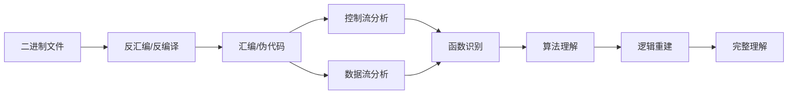
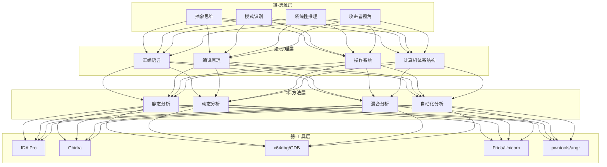

# 第17章 逆向工程 — 章节概览

## 为什么要学逆向工程

想象你面前有一个上锁的黑盒子。你能看到它接收什么输入、产生什么输出，但你看不到内部的齿轮和弹簧。逆向工程就是你打开这个黑盒子、拆解它、弄清楚每一个零件如何协同工作的能力。

在安全领域，这不仅仅是一项"有用"的技能——它是一切攻防分析的基石。恶意软件分析师需要逆向病毒来编写查杀规则；漏洞研究员需要逆向闭源程序来发现可利用的缺陷；CTF选手需要逆向加密算法来提取flag；安全审计师需要逆向固件来验证IoT设备的安全性。没有逆向能力，你在这些场景中就像盲人摸象，只能看到局部的表象。

但逆向工程的价值远不止于安全。软件开发者用它来理解遗留系统、调试第三方库的诡异行为；逆向合规工程师用它来验证软件是否遵守许可证协议；游戏 mod 社区用它来为老游戏添加新功能。甚至在AI时代，理解模型的底层结构（权重矩阵、激活函数的实现细节）也需要逆向思维。

### 逆向工程的核心心智模型

逆向工程的本质是一个**从低级表示重建高级理解**的过程。这个过程可以类比为考古学：你拿到的是一堆"碎片"（机器指令、内存数据、系统调用），你需要将它们拼接成有意义的"文物"（程序逻辑、算法、数据结构）。

这个过程不是线性的——你会在各个阶段之间反复跳转。看到一个可疑函数时，你会从控制流分析跳到数据流分析，确认参数来源后再回到控制流。这种"前向-后向"交替的分析策略，是每一个成熟的逆向工程师的日常。

### 逆向工程与其他安全技能的关系

逆向工程不是孤立存在的。它与安全领域的其他技能形成一个相互依赖的网络：

| 技能领域 | 与逆向工程的关系 | 典型场景 |
|---------|----------------|---------|
| **PWN（漏洞利用）** | 逆向是PWN的前提——你需要先理解漏洞才能利用它 | 逆向一个栈溢出漏洞的成因，编写exploit |
| **恶意软件分析** | 逆向是恶意软件分析的核心手段 | 分析勒索软件的加密算法，编写解密工具 |
| **Web安全** | 逆向帮助理解客户端保护机制 | 逆向JavaScript混淆、分析App的API加密逻辑 |
| **密码学** | 逆向帮助识别和攻击自定义加密 | 从二进制中提取密钥、识别加密算法实现缺陷 |
| **操作系统安全** | 逆向OS组件是内核安全研究的基础 | 逆向Windows驱动、分析Linux内核模块 |
| **固件安全** | 固件分析本质上就是嵌入式逆向 | 从IoT设备提取固件并逆向分析 |

### 逆向工程的法律与伦理边界

在深入技术之前，必须明确法律边界。逆向工程本身是合法的——很多国家的法律都承认合法的逆向场景。但关键在于**目的和授权**：

- **合法场景**：安全研究（有授权）、互操作性研究、学术研究、CTF竞赛、自己购买的软件分析
- **灰色地带**：DRM绕过（DMCA法案下可能违法）、竞品分析（取决于司法管辖区）
- **违法场景**：未经授权的系统入侵、商业软件破解与分发、绕过安全保护进行盗版

**原则很简单：永远在授权范围内操作，永远在隔离环境中练习，永远遵守负责任的披露流程。**

本章所有技术讨论均基于合法安全研究与教育目的。详细的安全警告见本文件末尾。

## 逆向工程知识体系全景

逆向工程的知识体系可以分为四个层次，从底层硬件理解到顶层攻防应用，层层递进：

**道（思维层）**：逆向工程最核心的能力不是会用某个工具，而是一种思维方式。你需要能够在看到几十行汇编代码时迅速抽象出"这是一个冒泡排序"的结论，需要能够在几百个函数中识别出"这个函数负责加密验证"的模式，需要能够从攻击者的视角思考"如果我要绕过这个检查，我会怎么做"。

**法（原理层）**：你需要理解程序是如何被编译成机器码的（编译原理），机器码是如何被CPU执行的（计算机体系结构），程序是如何与操作系统交互的（系统调用、内存管理），以及不同架构的指令集有什么区别（x86 vs ARM vs RISC-V）。

**术（方法层）**：静态分析是不运行程序直接分析代码，动态分析是运行程序并观察行为，混合分析是两者结合，自动化分析是用脚本和工具批量处理。每种方法都有适用场景和局限性。

**器（工具层）**：IDA Pro是商业逆向工具的标杆，Ghidra是NSA开源的免费替代品，x64dbg/GDB是调试器，Frida是动态插桩框架，angr是符号执行引擎。工欲善其事必先利其器，但工具只是手段，理解才是目的。

## 本章详细结构

### 01 理论基础：构建逆向工程的认知框架

本节为全章打地基。没有扎实的理论基础，后面的工具使用和实战分析都是空中楼阁。

**汇编语言基础（核心中的核心）**

汇编语言是逆向工程师的"母语"。你不需要能手写复杂汇编，但必须能做到"读懂"。本节覆盖：

- **x86/x64架构**：寄存器体系（通用寄存器EAX-ESP/RAX-RSP、段寄存器、标志寄存器EFLAGS/RFLAGS）、寻址模式（立即寻址、寄存器寻址、直接/间接寻址、基址+变址+偏移）、常用指令集（数据传送MOV/LEA、算术运算ADD/SUB/MUL/DIV、逻辑运算AND/OR/XOR/NOT、控制跳转JMP/JE/JNE/CALL/RET、字符串操作REP/MOVS/SCAS）
- **ARM架构**：ARM模式与Thumb模式的区别、R0-R15寄存器的特殊用途（SP=R13、LR=R14、PC=R15）、条件执行机制、ARM64（AArch64）的寄存器扩展（X0-X30/W0-W30）
- **RISC-V简介**：开源指令集架构的基本特征、寄存器约定、在IoT和嵌入式安全中的应用趋势
- **调用约定**：cdecl（C默认）、stdcall（Win32 API）、fastcall、thiscall（C++）、System V AMD64 ABI（Linux x64）、ARM AAPCS。理解调用约定才能正确识别函数参数和返回值
- **编译器行为模式**：GCC/Clang/MSVC的函数序言/尾声代码差异、栈帧布局差异、优化级别（-O0到-O3）对代码结构的影响、内联函数的识别方法

**可执行文件格式**

程序不只是"一堆代码"——它有精密的容器格式，理解这些格式是逆向分析的第一步：

- **ELF（Linux/Unix）**：ELF Header → Program Headers（段）→ Section Headers（节）→ 符号表 → 重定位表。重点讲解.text（代码段）、.data/.bss（数据段）、.rodata（只读数据）、.plt/.got（动态链接跳转表）的作用和逆向意义
- **PE（Windows）**：DOS Header → PE Header → Optional Header → Section Table → Import/Export Tables。重点讲解IMAGE_DIRECTORY_ENTRY_IMPORT（导入表）、IMAGE_DIRECTORY_ENTRY_EXPORT（导出表）、资源段、TLS回调函数
- **Mach-O（macOS/iOS）**：Header → Load Commands → Segments/Sections。重点讲解LC_SYMTAB（符号表）、LC_DYSYMTAB（动态符号表）、__TEXT/__DATA段
- **DEX（Android）**：Header → String IDs → Type IDs → Proto IDs → Field IDs → Method IDs → Class Defs。在Android逆向中的核心地位

**静态分析理论**

不运行程序，纯靠阅读代码来理解程序行为：

- **控制流分析**：控制流图（CFG）的构建、基本块（Basic Block）的识别、分支条件的推导、循环结构的识别
- **数据流分析**：定义-使用链（Def-Use Chain）、数据依赖图、污点分析（Taint Analysis）的原理
- **类型恢复**：从无类型的机器码中推导变量类型——通过操作大小（byte/word/dword/qword）、函数调用参数约定、结构体偏移模式来恢复高级类型信息
- **函数识别**：编译器生成的函数序言/尾声模式、调用目标推导、间接调用的处理

**动态分析理论**

运行程序，通过观察行为来理解程序：

- **调试原理**：断点的实现机制（INT3/硬件断点/单步执行）、调试器与被调试进程的关系（ptrace/Debug API）
- **Hook技术原理**：Inline Hook（修改函数开头指令）、IAT Hook（修改导入表）、SSDT Hook（修改系统服务表）、PLT/GOT Hook
- **内存取证**：进程内存布局、堆/栈的运行时结构、内存映射文件

### 02 核心技巧：工具精通与分析方法

理论有了，本节教你怎么"动手"。

**IDA Pro 深度使用**

IDA Pro是逆向工程的事实标准工具。本节不是简单介绍菜单，而是教你怎么用IDA完成真正的分析工作：

- **项目管理**：创建IDA数据库（.idb/.i64）、使用.idc/IDAPython脚本自动化重复操作、批量分析多个二进制
- **导航与标注**：重命名函数/变量、添加注释、定义数据类型、创建结构体/枚举、使用交叉引用（XREF）追踪数据和代码流
- **高级分析**：使用Flirt签名识别编译器库函数、利用类型信息库（.til）恢复标准库类型、使用IDAPython编写自定义分析脚本
- **插件生态**：KeyPatch（汇编补丁）、FindCrypt（加密常量搜索）、RetDec（反编译器）、Hex-Rays反编译器的使用技巧

**Ghidra 使用方法**

NSA开源的免费逆向工具，功能上与IDA Pro各有千秋：

- **项目管理与脚本**：Ghidra项目结构、Ghidra Script（Java/Python）开发、P-Code（Ghidra的中间表示）理解
- **反编译器优势**：Ghidra的反编译器在某些场景下比Hex-Rays更准确（特别是处理结构体和C++虚函数时）
- **协作分析**：Ghidra Server支持多人协作分析同一项目
- **自定义处理器模块**：使用SLEIGH语言定义新架构，适用于分析自定义虚拟机或FPGA

**动态分析工具链**

- **GDB + pwndbg/GEF**：Linux下最强调试组合。内存查看、寄存器操作、堆分析、ROP链搜索
- **x64dbg**：Windows下的开源调试器。插件系统、条件断点、追踪功能
- **Frida**：动态插桩的瑞士军刀。JavaScript脚本注入、Hook任意函数、内存读写、绕过反调试
- **Unicorn Engine**：CPU模拟器。在不运行目标程序的情况下执行特定代码片段，适用于解密算法提取
- **QEMU + GDB远程调试**：调试跨架构二进制（在x86主机上调试ARM程序）

**反混淆技术**

现代软件广泛使用代码混淆来抵抗逆向。本节覆盖主流混淆技术及其对抗方法：

- **控制流平坦化**：将正常的if-else/switch结构打散为一个大循环+分发器，通过分析分发器变量来恢复原始控制流
- **虚拟机保护（VM Protect）**：将x86指令翻译为自定义虚拟指令集，需要逆向VM的解释器才能理解原始逻辑
- **字符串加密**：运行时解密字符串。对抗方法：动态执行到解密点、或使用Unicorn模拟解密函数
- **代码变形/多态**：每次编译生成不同但等价的代码。通过语义分析识别等价模式
- **反调试与反虚拟机检测**：IsDebuggerPresent、NtQueryInformationProcess、CPUID指令检测、时间差检测。绕过方法包括Patch检测代码、使用隐蔽调试器

**自动化分析方法**

面对大量样本或超大二进制，手动分析不够用：

- **FLOSS**：FireEye的字符串提取工具，能识别混淆字符串
- **YARA规则**：编写模式匹配规则快速识别恶意行为特征
- **CAPA**：自动识别二进制文件中的恶意能力（capability-based分析）
- **angr符号执行**：自动探索程序路径、生成满足特定条件的输入、解决约束满足问题
- **BinDiff / Diaphora**：二进制差异比较——对比补丁前后的二进制，快速定位漏洞修复点

### 03 实战案例：从拿到文件到得出结论

理论和工具都学了，本节用真实案例串联所有知识。

**案例一：加密算法逆向**

拿到一个"加密工具"的二进制文件，目标是分析其加密算法并提取密钥。展示完整流程：字符串分析 → 定位加密函数 → 识别算法模式（AES/DES/RC4/自定义） → 提取密钥材料 → 验证解密。涵盖静态分析和动态分析两种思路的对比。

**案例二：私有协议逆向**

分析一个客户端程序，逆向其与服务器的通信协议。展示流程：抓包分析协议结构 → 定位网络通信函数 → 分析序列化/反序列化逻辑 → 识别加密/校验机制 → 重建协议文档。涵盖使用Frida Hook网络函数的技术。

**案例三：恶意软件样本分析**

分析一个真实的（脱敏的）恶意软件样本。展示流程：初步行为观察（沙箱分析） → 静态分析（入口点、导入表、字符串） → 动态调试（解密Shellcode、提取C2地址） → IoC提取 → 编写YARA检测规则。涵盖反调试对抗。

**案例四：CTF逆向题目破解**

完整解析2-3道不同难度的CTF逆向题目。展示从拿到题目到提取flag的全过程，包括遇到卡点时的思维突破方法。

**案例五：固件逆向入门**

从IoT设备提取固件、使用binwalk解包、识别文件系统、定位关键程序并进行逆向分析。展示嵌入式逆向与传统PC逆向的区别。

### 04 常见误区：避开学习中的陷阱

逆向工程的学习曲线陡峭，很多初学者会陷入以下误区。本节逐一分析错误认知的成因，给出纠正方法：

- **误区一**：逆向就是"看汇编"。纠正：逆向是理解程序行为，汇编只是入口。高手看到的不是指令，而是逻辑。
- **误区二**：必须记住所有指令。纠正：理解指令分类（数据操作、控制流、特殊指令）和操作数大小即可，具体语法查手册。
- **误区三**：动态分析比静态分析"准"。纠正：动态分析只能看到一条执行路径，静态分析能看到所有路径。两者互补。
- **误区四**：反编译结果可以直接信任。纠正：反编译器会犯错——特别是在类型恢复、优化代码、混淆代码场景下。永远用汇编验证关键逻辑。
- **误区五**：只会用IDA/Ghidra就够了。纠正：工具只是工具。没有理论基础，你连IDA显示的内容都理解不了。
- **误区六**：逆向大程序要从头到尾分析。纠正：99%的场景你只需要关注目标相关的部分。确定分析目标，用交叉引用定位关键代码。

### 05 练习方法：系统化的成长路径

逆向工程是"练"出来的，不是"看"出来的。本节提供分阶段的练习方案和推荐资源。

**第一阶段：汇编入门（2-4周）**

- 在Compiler Explorer上对比C代码和汇编输出，建立"源码→汇编"的直觉
- 完成ARM Assembly Basics教程（在线交互式）
- 使用简单的crackme练习程序，从最简单的"字符串比较"开始

**第二阶段：工具熟练（4-8周）**

- 完成IDA Pro/Ghidra的官方教程
- 在crackmes.one上从难度1开始刷题
- 学习用GDB/x64dbg调试程序，理解内存布局

**第三阶段：实战提升（持续）**

- 参加CTF比赛的Reverse方向题目（推荐平台：CTFTime、BUUCTF、攻防世界）
- 分析真实的开源软件编译产物（自己写的代码编译后逆向，有答案可以对照）
- 阅读恶意软件分析报告，尝试复现分析过程

**第四阶段：深入研究（长期）**

- 学习反混淆技术，挑战VM Protect/Themida保护的程序
- 学习固件逆向、内核驱动逆向
- 阅读逆向工程领域论文，跟踪最新研究

**推荐学习资源**

| 类型 | 资源 | 说明 |
|------|------|------|
| 书籍 | 《逆向工程核心原理》 | 韩国作者，从基础到高级，案例丰富 |
| 书籍 | 《IDA Pro权威指南》 | IDA Pro的圣经级参考书 |
| 书籍 | 《恶意代码分析实战》 | 恶意软件逆向的经典教材 |
| 书籍 | 《加密与解密》（看雪） | 中文逆向工程经典，侧重Windows |
| 书籍 | 《Practical Binary Analysis》 | 二进制分析的现代教材，含自动化工具 |
| 在线课程 | OpenSecurityTraining | 免费高质量安全培训，含逆向课程 |
| 在线课程 | pwn.college | ASU的系统化二进制安全课程 |
| 练习平台 | crackmes.one | 最大的crackme题库 |
| 练习平台 | MalwareBazaar | 恶意软件样本库（注意安全） |
| 练习平台 | VX-Underground | 恶意软件知识库和样本集 |
| 社区 | 看雪论坛 | 中文逆向工程社区，有大量实战分析 |
| 社区 | 0x00sec | 英文逆向/安全社区 |
| 博客 | Lenny Zeltser | 恶意软件分析实战博客 |

### 06 本章小结

本章从理论到实战，系统性地构建了逆向工程的完整知识体系。核心要点回顾：

1. **逆向工程的本质**是从低级表示重建高级理解的过程，需要"道法术器"四个层次的协同
2. **汇编语言**是逆向工程师的母语——不需要手写，但必须能读懂
3. **静态分析和动态分析**各有所长，成熟的工程师根据场景灵活选择或结合使用
4. **工具只是手段**，理解编译原理、操作系统、计算机体系结构才是根本
5. **反混淆能力**是进阶逆向工程师的分水岭
6. **持续练习**是唯一的学习路径——crackme、CTF、真实样本分析缺一不可

逆向工程的学习曲线确实陡峭，但每当你从一堆汇编指令中"看到"了程序的意图，那种豁然开朗的感觉会让你觉得一切努力都值得。

## 学习目标

通过本章的学习，读者应能够：

**基础能力（必须达成）**
1. 阅读和理解x86/x64汇编代码，能够将汇编片段还原为等价的C伪代码
2. 使用IDA Pro或Ghidra打开任意二进制文件，完成基本的函数识别、标注和分析
3. 使用GDB/x64dbg进行动态调试：设置断点、单步执行、查看内存和寄存器
4. 理解ELF/PE文件格式的基本结构，能够手动解析关键段和节
5. 完成crackmes.one上难度1-2的题目

**进阶能力（努力可达）**
6. 识别常见的代码混淆技术（控制流平坦化、字符串加密、简单虚拟机保护）并进行去混淆
7. 使用Frida进行动态插桩，Hook目标函数并修改行为
8. 使用angr进行符号执行，自动探索程序路径
9. 具备独立分析中等复杂度二进制程序的能力
10. 能够完成CTF Reverse方向的中等难度题目

**高阶能力（长期目标）**
11. 分析使用VM Protect/Themida等商业保护工具保护的程序
12. 完成固件提取、解包和逆向分析的全流程
13. 分析内核驱动和操作系统底层组件
14. 设计和实现自定义的自动化逆向分析工具

## 前置知识

在开始本章之前，请确认你具备以下基础知识。如果某些领域有所欠缺，建议先补充相关内容再继续：

**必备知识**

| 知识领域 | 具体要求 | 建议补充资源 |
|---------|---------|-------------|
| C/C++编程 | 理解指针、内存管理、函数调用、结构体 | 《C Primer Plus》前15章 |
| 计算机组成原理 | 二进制/十六进制表示、CPU基本工作原理、存储层次 | 《计算机组成与设计》前3章 |
| 操作系统基础 | 进程与线程、虚拟内存、系统调用 | 《操作系统导论》前5章 |
| 位运算 | AND/OR/XOR/NOT、移位、掩码操作 | 任意编程入门教材的位运算章节 |

**加分知识（非必须，但会让你学得更快）**

- **汇编语言基础**：任何架构的汇编经验都有帮助，哪怕是8051单片机
- **Linux命令行**：大部分逆向工具运行在Linux下，熟悉终端操作是基本功
- **Python编程**：IDA/Ghidra的脚本接口都支持Python，自动化分析离不开它
- **编译原理基础**：理解词法分析、语法分析、中间代码生成，能帮你理解反编译器的行为
- **网络协议基础**：协议逆向场景需要理解TCP/IP、HTTP等基础协议

**环境准备**

在正式开始之前，请准备好以下环境：

- **操作系统**：推荐Ubuntu 22.04 LTS（主力分析环境）+ Windows 10/11虚拟机（PE分析）
- **虚拟机软件**：VMware或VirtualBox，用于隔离分析环境
- **逆向工具**：IDA Free/Ghidra（静态分析）、GDB+pwndbg（Linux调试）、x64dbg（Windows调试）
- **编程环境**：GCC/Clang编译器、Python 3.10+、pip
- **练习材料**：crackmes.one账号、CTF平台账号

> 💡 **提示**：不要等到所有环境都"完美"才开始。先装好IDA Free和GDB，跟着本章内容边学边配，这比花一天配置环境但什么都不学要高效得多。

---

> ⚠️ **安全警告与免责声明**
>
> 本章内容仅供**合法的安全测试与教育目的**使用。所有技术、工具和方法的讨论均旨在帮助安全从业者在**获得明确授权**的前提下进行防御性安全研究。
>
> - 🚫 **未经授权**对任何系统、网络或应用进行安全测试是**违法行为**
> - ✅ 所有实践活动应在**隔离的实验环境**中进行（如虚拟机、CTF平台）
> - ✅ 遵守所在国家和地区的**网络安全法律法规**
> - ✅ 遵循**负责任的漏洞披露**原则
>
> 作者不对因滥用本章内容造成的任何后果承担责任。
