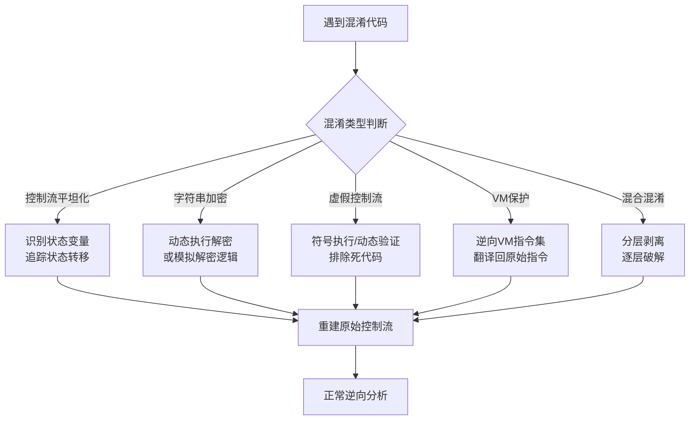
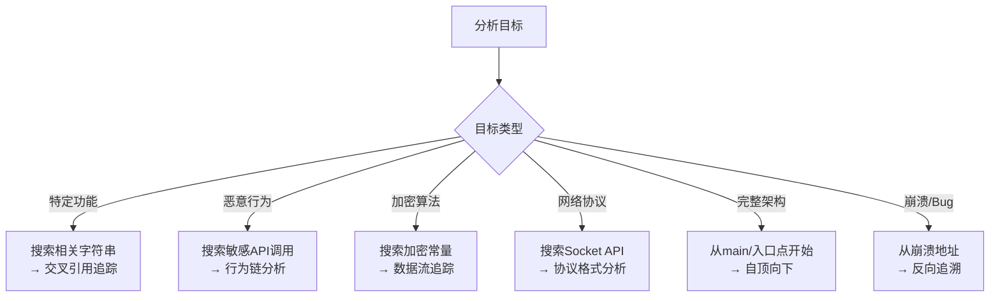
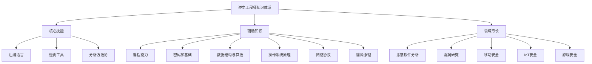
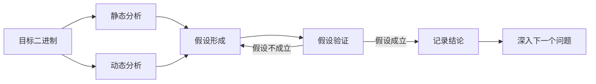

# 第17章 逆向工程 — 常见误区

逆向工程是一门实践性极强的技术，初学者甚至有一定经验的从业者都容易陷入某些认知陷阱。这些误区不仅会拖慢学习进度，还可能在实际分析中导致方向性错误。本章系统梳理逆向工程中最常见的十大误区，逐一拆解错误认知的根源，给出正确的理解方式和实践建议。

## 误区一：逆向工程就是反编译

### 错误认知

"逆向工程就是用IDA按F5看反编译结果，看不懂就换Ghidra再按一次。"

这是初学者最普遍的认知偏差。许多人把反编译器当作逆向工程的全部，认为只要能看到伪代码就等于完成了分析。

### 为什么这是错的

反编译器（Decompiler）的本质是从低级表示（汇编/机器码）重建高级语言伪代码的工具。这个过程必然存在信息损失——编译是不可逆的有损过程。具体来说，反编译结果存在以下固有缺陷：

**类型信息丢失。** 编译器在生成机器码时会丢弃大部分类型信息。反编译器只能根据指令的使用方式（如用哪个寄存器、调用哪个API）来猜测类型，但这种猜测经常出错。一个经典的例子：

```c
// 源代码
struct User {
    char name[32];
    int age;
    float score;
};
User* user = getUser(id);
printf("%s: %d", user->name, user->age);

// IDA反编译结果（典型）
int __fastcall sub_401000(int a1) {
    int v1; // eax
    v1 = sub_401200(a1);
    return printf("%s: %d", v1, *(int*)(v1 + 32));
}
```

反编译器不知道偏移32处是`age`字段，只看到一个整数指针偏移。

**变量合并与分裂。** 反编译器会将多个使用同一寄存器/栈位置的变量合并为一个变量，也可能将一个被多次赋值的变量分裂成多个。这导致数据流分析变得困难。

**控制流还原不完整。** 编译器的优化（如switch的跳转表、异常处理的展开表、尾调用优化）会破坏源代码的控制结构。反编译器无法完美还原：

```c
// 源代码
switch (type) {
    case 1: handle_login(); break;
    case 2: handle_logout(); break;
    case 3: handle_data(); break;
}

// 反编译可能变成
if (type <= 3) {
    ((void(*)())jump_table[type])();  // 跳转表，看不出每个case做什么
}
```

**混淆代码几乎不可读。** 面对OLLVM控制流平坦化、虚假控制流、指令替换等混淆手段，反编译结果会变成一团乱麻，完全无法直接阅读。

### 正确的做法

反编译只是逆向分析的**起点**，不是终点。完整的分析流程应该是：

```text
┌─────────────────────────────────────────────────────┐
│                   逆向分析完整流程                      │
├─────────────────────────────────────────────────────┤
│                                                     │
│  1. 静态概览                                         │
│     ├─ 文件格式分析（PE/ELF结构、节信息、导入表）        │
│     ├─ 字符串提取（寻找关键字符串、错误信息、URL）       │
│     └─ 函数识别（main、导出函数、回调函数）              │
│                                                     │
│  2. 反编译辅助                                        │
│     ├─ 用反编译器快速理解函数大致逻辑                    │
│     ├─ 用汇编代码验证反编译结果的准确性                  │
│     └─ 手动修正类型信息和函数签名                       │
│                                                     │
│  3. 动态验证                                         │
│     ├─ 在关键位置设置断点                              │
│     ├─ 观察运行时的变量值和内存状态                     │
│     └─ 验证静态分析的假设                              │
│                                                     │
│  4. 深入分析                                         │
│     ├─ 追踪数据流和控制流                              │
│     ├─ 识别算法和协议                                 │
│     └─ 编写分析报告或脚本                              │
│                                                     │
└─────────────────────────────────────────────────────┘
```

**实战建议：** 养成"反编译→汇编→反编译"的交叉验证习惯。先用反编译器快速理解函数的大致逻辑，然后切到汇编视图验证关键细节（类型转换、条件判断、函数调用约定），最后回到反编译视图修正类型和名称。

## 误区二：不需要理解编译器行为

### 错误认知

"我只需要认识汇编指令就行，编译器怎么工作的跟我没关系。"

### 为什么这是错的

逆向工程的本质是**逆编译器之向**——你要理解的不是机器码本身，而是机器码背后的高级语言逻辑。如果不了解编译器如何将高级语言翻译成机器码，你看到的每一行汇编都是孤立的指令，无法还原出完整的程序语义。

### 编译器知识在逆向中的具体价值

**识别控制结构。** 编译器对`if/else`、`for`、`while`、`switch`等控制结构有固定的翻译模式。掌握这些模式可以让你在汇编层面快速识别程序逻辑：

```asm
; GCC -O1 编译的 for 循环典型模式
    mov ecx, 0          ; i = 0
.loop:
    cmp ecx, 10         ; i < 10 ?
    jge .end            ; 如果 i >= 10 跳出
    ; ... 循环体 ...
    inc ecx             ; i++
    jmp .loop           ; 回到循环头
.end:
```

```asm
; MSVC 编译的 switch 跳转表
    cmp eax, 4          ; 检查范围
    ja .default         ; 超出范围走default
    jmp [table + eax*4] ; 跳转表
```

如果你不了解这些模式，就会把跳转表当作一堆毫无规律的地址。

**理解优化差异。** 不同的优化级别会显著改变生成的代码结构：

| 优化级别 | 特征 | 逆向影响 |
|---------|------|---------|
| -O0 (无优化) | 变量全部在栈上、函数调用完整保留 | 最接近源代码，容易分析 |
| -O1 (基本优化) | 死代码消除、常量折叠、基本内联 | 部分变量消失，需要追踪寄存器 |
| -O2 (标准优化) | 循环优化、指令调度、尾调用优化 | 控制结构可能被重写 |
| -O3 (激进优化) | 自动向量化、循环展开、函数克隆 | 代码膨胀，逻辑碎片化 |
| -Os (大小优化) | 共享代码、减少内联 | 代码紧凑但逻辑更密 |

**判断编译器和版本。** 不同编译器有不同的"指纹"。GCC倾向于使用`test eax, eax`来检查零值，MSVC更常用`or eax, eax`。了解这些差异可以帮助你：
- 判断二进制文件使用的编译器和版本
- 选择对应的调试符号和标准库
- 预测代码结构

**理解C++名称修饰。** C++编译器会对函数名进行mangling以支持函数重载和命名空间。了解mangling规则可以从符号名还原完整的函数签名：

```text
# GCC/Clang 的 Itanium ABI mangling
_ZN3Foo6methodEi  →  Foo::method(int)
_ZN3Foo6methodEid →  Foo::method(int, double)

# MSVC mangling
?method@Foo@@QEAAHH@Z  →  int Foo::method(int)
```

如果看到`_ZNSt6vectorIiSaIiEE9push_backEOi`，你能立刻认出这是`std::vector<int>::push_back(int&&)`吗？这就是编译器知识的价值。

### 实践建议

1. **亲手编译对比。** 写一段简单的C/C++代码，分别用GCC、Clang、MSVC在不同优化级别下编译，对比生成的汇编。这是最直观的学习方式。
2. **使用Compiler Explorer (godbolt.org)。** 这个在线工具可以实时查看不同编译器、不同选项生成的汇编代码，是学习编译器行为的利器。
3. **阅读编译器文档。** GCC的代码生成文档、MSVC的Calling Convention文档都值得通读。

## 误区三：只做静态分析就够了

### 错误认知

"有了IDA和Ghidra就够了，为什么要费劲搭环境去动态调试？静态分析又不需要运行程序。"

### 为什么这是错的

静态分析和动态分析是逆向工程的两条腿，缺一不可。单纯依赖静态分析会在以下场景中碰壁：

**自修改代码（SMC）。** 程序在运行时修改自身的指令，静态分析看到的是修改前的代码，完全无法反映真实行为。恶意软件大量使用这种技术来对抗静态分析：

```c
// 简化的SMC示例
void decrypt_code() {
    // 在静态分析中，0x401000处的代码是加密的垃圾数据
    for (int i = 0; i < 0x100; i++) {
        ((char*)0x401000)[i] ^= 0x42;  // 解密真实代码
    }
    ((void(*)())0x401000)();  // 执行解密后的代码
}
```

只有在动态执行到解密步骤之后，才能看到真正的指令。

**运行时生成的代码。** JIT编译器、虚拟机保护器等会在运行时生成代码，这些代码在二进制文件中根本不存在。

**条件分支的实际走向。** 程序中可能存在大量只有在特定条件下才会执行的代码路径。静态分析需要考虑所有可能的路径，而动态分析只关注实际执行的路径：

```c
// 静态分析：你需要分析所有3个分支
if (is_debugger_present()) {
    exit(1);  // 反调试路径
} else if (check_license(key)) {
    run_normal();  // 正常路径
} else {
    run_trial();   // 试用路径
}

// 动态分析：直接看实际走了哪条路，断点设在关键位置即可
```

**加密/编码的数据。** 运行时才解密的字符串、配置数据、查找表等，静态分析只能看到密文。

### 静态与动态分析对比

| 维度 | 静态分析 | 动态分析 |
|------|---------|---------|
| 可见范围 | 程序的全部代码（包括死代码） | 实际执行的代码路径 |
| 运行环境 | 不需要运行环境 | 需要目标运行环境（可能需要特定OS/架构） |
| 执行效率 | 可以反复查看，不受时间限制 | 需要触发特定条件，可能很耗时 |
| 混淆对抗 | 混淆代码严重干扰分析 | 可以在关键点观察真实值 |
| 数据可见性 | 只能看到静态数据 | 可以看到运行时的变量值、内存内容 |
| 可重复性 | 完全可重复 | 可能有随机性（ASLR、时间相关逻辑） |
| 适用场景 | 代码结构理解、算法识别、漏洞模式匹配 | 行为确认、数据提取、绕过混淆 |

### 动态分析的核心实践

**调试器断点策略。** 在逆向中，断点的设置是一门艺术：

```python
# GDB中的条件断点示例
(gdb) b *0x401234 if $rdi == 0x42
# 当执行到0x401234且RDI寄存器值为0x42时才中断

# 硬件断点（不修改代码，适合自修改代码）
(gdb) hbreak *0x401000

# 数据断点（监视内存变化）
(gdb) watch *0x601000
# 当地址0x601000处的值发生变化时中断

# API断点（Windows调试器中常用）
# 在WriteFile、VirtualAlloc、CreateProcess等API入口下断点
```

**内存转储与对比。** 在程序运行的不同阶段转储内存，对比变化，是提取运行时数据的有效方法：

```bash
# 使用GDB转储进程内存
(gdb) dump binary memory /tmp/mem_dump.bin 0x400000 0x500000

# 使用xxd查看转储内容
xxd /tmp/mem_dump.bin | head -50
```

### 实践建议

1. **建立"静态假设→动态验证"的工作流。** 静态分析提出假设（"这个函数应该在做AES加密"），动态分析验证假设（"在加密函数入口设断点，观察输入输出是否符合AES特征"）。
2. **善用trace工具。** Intel Pin、DynamoRIO、Frida等动态instrumentation框架可以在不修改二进制的情况下追踪程序执行，是动态分析的高级武器。
3. **记录分析笔记。** 静态分析和动态分析的结果需要交叉印证，保持良好的笔记习惯至关重要。

## 误区四：混淆代码无法分析

### 错误认知

"遇到OLLVM控制流平坦化就放弃，遇到虚拟机保护就投降。混淆=不可逆。"

### 为什么这是错的

混淆（Obfuscation）是一种增加逆向分析成本的技术，但**混淆不等于加密**。加密可以做到信息论意义上的安全（密钥不泄露就无法还原），而混淆必须保留程序的原始语义——因为程序还需要正确执行。只要语义被保留，就存在分析的可能。

混淆的本质是一场**成本博弈**：混淆增加分析者的成本，但也会增加程序的运行开销。混淆器不可能无限加码，否则程序会变得无法使用。

### 常见混淆技术及应对方法

**控制流平坦化（Control Flow Flattening）。** 这是OLLVM最常用的混淆手段，将原本清晰的控制流结构变成一个巨大的switch-case循环：

```c
// 原始代码
void process(int x) {
    int a = x * 2;
    if (a > 10) {
        a += 5;
    }
    printf("%d", a);
}

// 平坦化后（伪代码）
void process(int x) {
    int state = 1882457321;  // 初始状态
    while (1) {
        switch (state) {
            case 1882457321:
                a = x * 2;
                state = 3927165483;
                break;
            case 3927165483:
                if (a > 10) state = 2819346712;
                else state = 7743910526;
                break;
            case 2819346712:
                a += 5;
                state = 7743910526;
                break;
            case 7743910526:
                printf("%d", a);
                state = 0;  // 退出
                break;
        }
    }
}
```

**应对方法：** 识别状态变量（通常是switch的控制变量），追踪状态转移关系，重建原始控制流。可以使用符号执行框架（如Angr）或自定义脚本来自动化去平坦化。

**字符串加密。** 将程序中的字符串在编译时加密，运行时逐字符解密：

```c
// 编译时加密，运行时解密
char enc[] = {0x25, 0x1a, 0x3f, 0x08, 0x6d};  // 加密后的"hello"
for (int i = 0; i < 5; i++) enc[i] ^= 0x4a;     // 解密
```

**应对方法：** 动态执行到解密完成后dump内存，或编写脚本模拟解密逻辑。

**虚假控制流。** 插入永远不会执行但看起来合理的代码分支：

```c
// 原始
if (check(key)) { unlock(); }

// 混淆后
if (check(key)) {
    if (rand() == 0xDEADBEEF) {  // 永远为false的条件
        send_to_server(key);     // 看起来像后门，实际不会执行
    }
    unlock();
}
```

**应对方法：** 通过动态执行确认哪些分支是死代码，或通过符号执行证明某些条件不可满足。

**虚拟机保护（VM Protect）。** 将原始指令翻译成自定义的虚拟机指令集，用解释器执行。这是最强的混淆手段之一。

**应对方法：** 逆向VM的指令集架构（VM handler），理解每条虚拟指令的语义，然后将虚拟指令序列翻译回原始指令。这是一个高难度但完全可行的过程。

### 混淆对抗的核心思维



### 实践建议

1. **从简单混淆开始练习。** 先掌握简单的XOR加密、Base64编码识别，再挑战OLLVM，最后尝试VM保护。
2. **建立混淆模式库。** 收集常见的混淆模式及其特征，形成快速识别的能力。
3. **善用自动化工具。** 反混淆工具（如D-810、Hex-Rays反混淆插件）可以处理常见的混淆模式，节省大量时间。

## 误区五：逆向工程只能分析x86/x64

### 错误认知

"我只需要学x86汇编就够了，ARM那些是嵌入式工程师的事。"

### 为什么这是错的

现实世界中需要分析的程序运行在各种架构上，而x86/x64在某些领域甚至不是主流。不了解其他架构，等于主动放弃了大量分析场景。

### 各架构的应用场景与特点

| 架构 | 典型应用 | 寄存器特点 | 指令特点 | 逆向难度 |
|------|---------|-----------|---------|---------|
| x86/x64 | Windows/Linux桌面程序 | 寄存器少，频繁访存 | CISC，指令长度不固定 | 中等（生态最成熟） |
| ARM32 | 旧Android设备、嵌入式 | 16个通用寄存器（R0-R15） | 条件执行是基本特性 | 中等 |
| ARM64 (AArch64) | 现代Android/iOS、Apple Silicon | 31个通用寄存器（X0-X30） | 固定32位指令宽度 | 中等偏低 |
| MIPS | 路由器、IoT设备 | 32个通用寄存器 | 延迟槽（分支延迟） | 中等 |
| RISC-V | 新兴开源硬件 | 32个通用寄存器 | 模块化ISA | 低（设计简洁） |
| PowerPC | 游戏机（PS3/Xbox 360） | 32个通用寄存器 | 多寄存器加载/存储 | 中等偏高 |

### ARM64与x86-64的对比示例

同一个函数在两种架构下的汇编表示：

```asm
; x86-64 (GCC -O1)
; int add(int a, int b) { return a + b; }
add:
    lea eax, [rdi + rsi]    ; eax = rdi + rsi
    ret

; ARM64 (GCC -O1)
; int add(int a, int b) { return a + b; }
add:
    add w0, w0, w1          ; w0 = w0 + w1
    ret
```

ARM64的代码通常更规整：固定长度的指令、更丰富的寄存器、条件执行标志。x86-64则因为CISC特性，单条指令可以完成更多工作，但也更难阅读。

### MIPS的延迟槽

MIPS架构有一个独特的"延迟槽"概念——分支指令后的那条指令总是会被执行，无论分支是否跳转：

```asm
; MIPS
    beq  $t0, $t1, target   ; 如果 t0 == t1 则跳转
    add  $t2, $t3, $t4      ; 延迟槽：这条指令总是执行（不管是否跳转）
    nop                      ; 通常编译器会填充nop
target:
    ...
```

不了解延迟槽的人会误以为`add`指令是分支的一部分，导致分析错误。

### 实践建议

1. **先精通一个架构，再扩展。** 建议从x86-64开始，掌握逆向方法论后再学ARM64。
2. **使用支持多架构的工具。** Ghidra、IDA、Radare2都支持多种架构。Ghidra对ARM和MIPS的支持尤其出色。
3. **利用模拟器练习。** QEMU可以模拟各种架构，不需要真实硬件就能练习ARM/MIPS逆向。

## 误区六：逆向工程是灰色地带

### 错误认知

"逆向工程就是黑客技术，做了就违法。"

### 为什么这是错的

逆向工程本身是一种**中性的技术方法**，是否合法取决于目的和场景。在许多国家和地区的法律框架下，逆向工程在特定条件下是完全合法的。

### 合法的逆向工程场景

**安全研究与漏洞发现。** 各大厂商都有安全研究政策，鼓励研究人员发现并报告漏洞。Google Project Zero、Microsoft MSRC、Apple Security Research等项目都依赖逆向工程技术。负责任的漏洞披露（Responsible Disclosure）是被广泛接受的行业实践。

**恶意软件分析。** 安全公司和研究机构分析病毒、木马、勒索软件的行为以开发检测和防御方案。这不仅是合法的，而且对社会安全至关重要。

**互操作性研究。** 为了实现与闭源系统的兼容而进行的逆向工程，在许多法律体系中被视为合理使用。欧盟的软件指令明确允许为实现互操作性而进行逆向。Samba项目通过逆向Windows SMB协议实现了Linux与Windows的文件共享，这是合法互操作性的经典案例。

**学术研究。** 程序分析、编译器优化、软件安全等领域的学术研究广泛使用逆向工程技术。

**CTF竞赛与安全培训。** Capture The Flag竞赛中的逆向题目是合法的学习和竞技环境。

**数字遗产保护。** 对已停止支持的软件进行逆向以保存数字文化遗产。

### 需要注意的法律边界

| 场景 | 合法性 | 说明 |
|------|--------|------|
| 安全研究（有授权） | 合法 | 遵循厂商的安全研究政策 |
| 恶意软件分析 | 合法 | 用于防御目的 |
| CTF竞赛 | 合法 | 在竞赛规则范围内 |
| 互操作性研究 | 多数地区合法 | 需遵守当地法律 |
| 学术研究 | 合法 | 需遵循学术伦理 |
| 绕过DRM/版权保护 | 可能违法 | DMCA第1201条有严格限制 |
| 商业软件盗版 | 违法 | 明确的违法行为 |
| 未经授权的安全测试 | 可能违法 | 需要书面授权 |

### 实践建议

1. **了解当地法律。** 不同国家和地区的法律差异很大。美国有DMCA、欧盟有软件指令、中国有计算机软件保护条例。
2. **获取书面授权。** 进行安全测试前，确保有明确的书面授权（授权渗透测试协议）。
3. **遵循负责任披露。** 发现漏洞后，先通知厂商，给予合理的修复时间，再公开细节。
4. **记录分析过程。** 保持详细的分析日志，以备将来需要证明合法目的。

## 误区七：逆向分析必须从main函数开始

### 错误认知

"分析一个程序，一定要从main函数开始，然后按照程序的执行顺序一行一行地看。"

### 为什么这是错的

现代程序的规模可能达到数百万行代码，从main函数开始线性分析是极其低效的。逆向分析应该是**目标驱动**的，而不是顺序阅读。

### 目标驱动的分析策略

**分析特定功能：字符串/API交叉引用。** 当你想理解程序的某个功能（如登录验证、文件加密）时，最高效的方法是从相关的字符串或API调用出发，通过交叉引用（Xref）向上追溯：

```text
搜索字符串 "login failed"
  → 找到引用该字符串的函数 sub_401234
    → 查看 sub_401234 的调用者 sub_402000
      → 分析 sub_402000 的逻辑，理解登录流程
```

**分析恶意软件：行为驱动。** 从恶意软件的网络通信、文件操作、注册表修改等行为出发：

```text
搜索API调用：InternetOpenUrl、HttpSendRequest
  → 找到网络通信函数
    → 分析C2服务器地址和通信协议
    → 追踪数据回传逻辑
```

**分析加密算法：数据流追踪。** 从密钥处理、加密运算等函数出发，追踪密钥的生成、存储和使用路径。

**分析协议：Socket操作出发。** 从`send`/`recv`（Linux）或`WSASend`/`WSARecv`（Windows）等网络API出发，分析数据的收发格式和处理逻辑。

### 分析入口选择策略



### 实践建议

1. **先做概览分析。** 在深入之前，花10-15分钟做全局概览：查看导入表了解程序使用了哪些API，查看字符串了解程序的功能范围，查看函数列表了解程序的规模。
2. **建立分析地图。** 用IDA的函数调用图（Call Graph）或Ghidra的函数图来理解程序的整体结构，然后选择关键节点深入。
3. **善用书签和注释。** 在IDA/Ghidra中标记你已经分析过的函数和关键发现，避免重复工作。

## 误区八：符号执行可以解决一切

### 错误认知

"有了Angr，任何逆向题都能自动化求解。写个脚本，输入程序，输出flag。"

### 为什么这是错的

符号执行（Symbolic Execution）是一种强大的程序分析技术，但它有严重的理论和实践局限性。

### 符号执行的局限性

**路径爆炸问题。** 符号执行需要探索程序的所有可能执行路径。程序中的每个条件分支都会使路径数量翻倍。一个只有30个`if`语句的程序就有2³⁰ ≈ 10亿条路径。实际程序中的分支远不止30个，路径数量是天文数字。

```text
路径数 = 2^n（n为独立分支数）

10个分支  → 1,024 条路径
20个分支  → 1,048,576 条路径
30个分支  → 1,073,741,824 条路径
50个分支  → 1,125,899,906,842,624 条路径
```

虽然Angr等工具使用了各种启发式策略来剪枝，但面对真实程序仍然力不从心。

**环境建模困难。** 程序与外部环境的交互（系统调用、网络、文件系统、数据库）很难用符号来建模。Angr提供了SimProcedures来模拟常见库函数，但覆盖范围有限：

```python
# Angr可以处理的
strlen(s)     → 返回符号长度，OK
strcmp(s1, s2) → 生成约束，OK

# Angr难以处理的
recv(socket, buf, len, 0)   → 网络数据，无法符号化
fread(buf, size, count, fp) → 文件内容，需要具体文件
system("command")            → 系统命令执行，无法建模
```

**约束求解的复杂性。** 符号执行依赖SMT求解器（如Z3）来求解路径约束。某些运算会导致约束求解极其困难：

- **浮点运算：** IEEE 754浮点数的约束求解是NP-hard
- **哈希函数：** SHA256、MD5等密码学哈希的逆向求解在计算上不可行
- **非线性算术：** 涉及乘法、除法的约束求解复杂度高

**反符号执行检测。** 越来越多的程序包含检测符号执行环境的代码：

```c
// 简单的反符号执行检测
int x = 0;
for (int i = 0; i < 1000000; i++) {
    x += i;  // 符号执行会因为路径过多而超时
}
if (x != 499999500000) {
    exit(1);  // 如果执行不完整，退出
}
```

### 符号执行的适用场景

| 场景 | 适用性 | 说明 |
|------|--------|------|
| CTF逆向题（简单） | 高 | 约束简单，路径少 |
| CTF逆向题（复杂） | 中 | 需要配合angr的探索策略 |
| 密码验证绕过 | 高 | 经典用例，约束求解直接 |
| 漏洞路径发现 | 中 | 需要精心定义初始状态 |
| 大型程序分析 | 低 | 路径爆炸严重 |
| 含IO的程序 | 低 | 环境建模困难 |
| 混淆代码 | 低-中 | 可能增加路径数量 |

### 实践建议

1. **把符号执行当作工具之一，不是万能药。** 它最适合求解简单的约束条件，如CTF中的flag验证、简单的密码检查。
2. **缩小符号执行的范围。** 不要对整个程序做符号执行，而是精确定位到需要分析的函数，设置好初始状态和目标地址。
3. **结合具体值和符号值。** 对已知的部分使用具体值，只对未知部分使用符号值，可以大幅减少搜索空间。

```python
import angr

# 正确的用法：精确定位，缩小范围
proj = angr.Project('./challenge', auto_load_libs=False)
state = proj.factory.entry_state()

# 设置具体值（已知前缀）
state.memory.store(0x601000, b'flag{')  # 已知flag前缀

# 只对未知部分使用符号值
unknown = state.solver.BVS('unknown', 8 * 20)
state.memory.store(0x601005, unknown)

simgr = proj.factory.simgr(state)
simgr.explore(find=0x401234, avoid=0x401250)  # 精确指定目标

if simgr.found:
    found = simgr.found[0]
    print(found.solver.eval(unknown))
```

## 误区九：不需要了解操作系统

### 错误认知

"逆向工程就是看代码，操作系统的事跟逆向无关。"

### 为什么这是错的

程序运行在操作系统之上，程序的行为深度依赖操作系统的机制。不了解操作系统，你看到的代码只是孤立的指令流，无法理解程序与外界的交互。

### 操作系统知识在逆向中的关键作用

**系统调用与API。** 程序通过系统调用与内核交互，通过API与系统服务交互。理解这些调用是理解程序行为的关键：

```c
// Linux系统调用
read(fd, buf, count)     // 读取文件或设备
write(fd, buf, count)    // 写入文件或设备
mmap(addr, len, prot, flags, fd, offset)  // 内存映射
ioctl(fd, request, ...)  // 设备控制

// Windows API
CreateFile(lpFileName, dwDesiredAccess, ...)  // 打开/创建文件
VirtualAlloc(lpAddress, dwSize, ...)          // 分配虚拟内存
LoadLibrary(lpLibFileName)                    // 加载DLL
GetProcAddress(hModule, lpProcName)           // 获取函数地址
```

看到`VirtualAlloc` + `VirtualProtect` + `CreateThread`的调用序列，有经验的逆向工程师立刻会意识到这可能是shellcode注入行为。

**内存管理。** 理解虚拟内存布局对逆向至关重要：

```text
┌──────────────────────┐ 高地址 (0x7FFFFFFF on 64-bit)
│      栈 (Stack)       │ ← 向低地址增长
│          ↓            │
│         ...           │
│          ↑            │
│     堆 (Heap)         │ ← 向高地址增长
├──────────────────────┤
│    BSS段 (未初始化)    │
├──────────────────────┤
│    数据段 (已初始化)    │
├──────────────────────┤
│    代码段 (.text)      │
└──────────────────────┘ 低地址 (0x400000 typical)
```

理解栈帧布局、堆管理器的实现（glibc malloc、Windows LFH）可以帮助你识别栈溢出、堆溢出、UAF等漏洞。

**动态链接机制。** Linux的PLT/GOT、Windows的IAT是逆向分析的核心知识点：

```text
# Linux PLT/GOT 机制
# 调用外部函数时的流程：
# 1. call printf@plt       → 跳转到PLT条目
# 2. jmp *GOT[printf]      → 从GOT获取实际地址
# 3. (首次调用) → dl-resolve → 填充GOT → 执行printf

# 攻击者可以通过覆写GOT条目来劫持控制流
# 逆向时需要理解这个机制来分析PLT hook、GOT覆写等技术
```

**进程与线程。** 理解进程创建（fork/clone）、线程管理（pthread/Windows Thread）、信号处理（signal/SEH）等机制，对于分析多进程程序、恶意软件的进程注入行为至关重要。

### 实践建议

1. **阅读《操作系统概念》或《深入理解计算机系统》。** 这些经典教材提供了扎实的OS理论基础。
2. **动手分析系统调用。** 使用`strace`（Linux）或Process Monitor（Windows）观察程序的系统调用行为。
3. **学习调试器中的OS相关内容。** 在GDB中查看进程内存映射（`info proc mappings`）、线程信息（`info threads`）、信号处理（`info signals`）。

## 误区十：逆向工程是纯粹的技能

### 错误认知

"逆向工程就是学工具和汇编，不需要其他知识。工具用得熟就够了。"

### 为什么这是错的

逆向工程是一个高度综合的领域，工具只是手段，分析思维和广泛的知识储备才是核心竞争力。一个只会用IDA但不了解密码学的分析者，在面对加密算法时会完全迷失；一个不懂网络协议的分析者，在分析恶意软件的C2通信时会事倍功半。

### 逆向工程师需要的知识体系



**编程能力。** 能够编写脚本自动化分析流程是基本要求。Python是逆向工程中最常用的脚本语言，用于编写IDA/Ghidra插件、自动化解密脚本、数据提取工具等。此外，了解C/C++可以帮助你理解目标程序的结构，了解Rust/Go等新兴语言可以帮助你分析用这些语言编写的程序。

**密码学。** 程序中使用的加密算法（AES、RSA、ECC等）、哈希函数（SHA256、MD5等）、编码方式（Base64、Hex等）是逆向分析的常见对象。识别这些算法的特征（常量、运算模式、数据结构）可以大幅提高分析效率：

```c
// AES的S-Box常量（识别特征）
0x63, 0x7c, 0x77, 0x7b, 0xf2, 0x6b, 0x6f, 0xc5,
0x30, 0x01, 0x67, 0x2b, 0xfe, 0xd7, 0xab, 0x76,
// ...

// SHA-256的初始哈希值（识别特征）
0x6a09e667, 0xbb67ae85, 0x3c6ef372, 0xa54ff53a,
0x510e527f, 0x9b05688c, 0x1f83d9ab, 0x5be0cd19,
```

**数据结构。** 理解常见数据结构在内存中的表示，可以帮助你识别程序使用的数据组织方式：

| 数据结构 | 内存特征 | 识别方法 |
|---------|---------|---------|
| 数组 | 连续内存、固定大小元素 | 看到基址+偏移*大小的寻址模式 |
| 链表 | 节点包含next指针 | 看到指针追逐模式 |
| 树 | 节点包含left/right指针 | 看到递归遍历模式 |
| 哈希表 | 数组+链表/树的组合 | 看到哈希函数+冲突处理 |
| 虚函数表 | 函数指针数组 | 看到vtable间接调用 |

**软件工程。** 了解设计模式（工厂模式、观察者模式、单例模式等）和常见框架（MVC、微服务等）可以帮助你理解程序的整体架构，而不是迷失在细节中。

### 实践建议

1. **建立知识图谱。** 逆向工程涉及的知识面很广，建立一个知识图谱来追踪自己的学习进度。
2. **做CTF题目。** CTF的逆向题目涵盖了密码学、算法、数据结构等多个领域，是综合训练的最佳方式。
3. **分析真实软件。** 从简单的开源程序开始，逐步挑战更复杂的闭源程序。真实世界的分析经验是不可替代的。

## 误区总结与正确的心智模型

### 十大误区速查表

| 误区 | 错误认知 | 正确理解 |
|------|---------|---------|
| 1. 逆向=反编译 | F5万能 | 反编译是起点，需要交叉验证 |
| 2. 不需要编译器知识 | 会看汇编就行 | 编译器知识大幅提高效率 |
| 3. 只做静态分析 | IDA够了 | 静态+动态结合才完整 |
| 4. 混淆无法分析 | 遇到混淆就放弃 | 混淆增加成本但可破解 |
| 5. 只需x86/x64 | ARM是别人的事 | 现实需要多架构能力 |
| 6. 逆向是灰色地带 | 做了就违法 | 很多场景合法且必要 |
| 7. 必须从main开始 | 顺序阅读代码 | 目标驱动，从兴趣点出发 |
| 8. 符号执行万能 | Angr一键求解 | 有严重局限，只是工具之一 |
| 9. 不需要OS知识 | 只看代码就行 | 程序深度依赖OS机制 |
| 10. 逆向是纯粹技能 | 工具用熟就行 | 需要广泛的知识储备 |

### 逆向工程师的正确心智模型



逆向工程的本质是一个**假设-验证**的循环过程：通过静态分析形成假设，通过动态分析验证假设，验证通过后记录结论，然后深入下一个问题。工具只是这个过程的辅助手段，核心是分析思维和知识储备。

**最后的建议：** 逆向工程是一个需要持续学习和积累的领域。工具会更新，技术会演进，但底层的分析思维和对计算机系统的深入理解是永恒的。不要追求工具的数量，而要追求理解的深度。当你真正理解了程序是怎么运行的、编译器是怎么优化的、操作系统是怎么管理资源的，逆向分析就不再是猜谜游戏，而是有章可循的系统工程。
