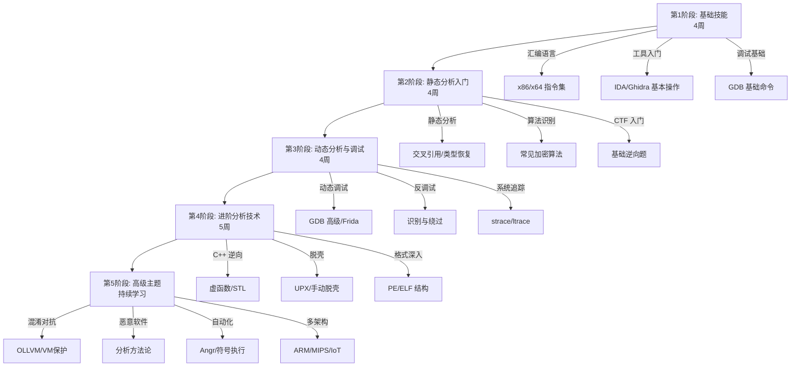

# 第17章 逆向工程 — 练习方法

逆向工程是一项"手到才能心到"的技能——看一百本书不如亲手分析一个二进制程序。但盲目的练习效率极低：你可能在同一个水平上重复做简单的题，也可能因为缺少系统规划而在某个阶段卡住数月。本章提供一条从零到实战的完整练习路径，包含每个阶段的具体目标、练习模板、自检标准和资源推荐，帮助你用最少的时间建立最扎实的逆向能力。

## 为什么练习方法比练习量更重要

逆向工程的学习曲线是阶梯形的，不是线性的。每到一个新阶段，你面对的不是"更多同类问题"，而是"完全不同类型的问题"。这意味着：

- **量变不能自动引发质变**：做了 100 道简单的字符串逆向题，并不会让你自然掌握 C++ 虚函数分析。
- **错误的练习顺序会浪费时间**：在不理解汇编基础的情况下直接学 Frida，你只会"会用工具"而"不理解原理"。
- **缺乏反馈的练习是无效的**：如果你分析完一个程序后不写报告、不对比参考解法，你很难发现自己的分析盲区。

下面的路线图将练习分为五个阶段，每个阶段都明确了"学什么、练什么、怎么练、怎么评估"。

## 系统化学习路线图

### 第一阶段：基础技能建设（第 1-4 周）

**核心目标：** 建立"代码↔汇编"的双向映射能力——看到简单汇编能还原 C 代码，看到 C 代码能预测编译结果。

**知识点清单：**

| 知识模块 | 具体内容 | 学习标准 |
|----------|---------|---------|
| x86/x64 指令集 | mov/add/sub/cmp/jmp/call/ret/push/pop 及常见变体 | 能手写 50 行以内的汇编函数 |
| 寻址方式 | 立即数/寄存器/直接/间接/基址+偏移/比例变址 | 看到 `[eax+ecx*4+8]` 能说出内存地址的计算过程 |
| 调用约定 | cdecl/stdcall/fastcall/x64 System V ABI | 能从汇编代码还原函数参数和返回值 |
| 栈帧结构 | 返回地址/保存的EBP/局部变量/参数传递 | 能画出任意函数的栈帧布局图 |
| C 语言编译过程 | 预处理→编译→汇编→链接 | 理解每个阶段对最终二进制的影响 |

**核心练习 1：源码-汇编对照训练**

这是第一阶段最重要的练习。方法是：编写一系列 C 程序，编译后用反汇编器对照分析。

```c
// exercise_01_basic.c — 基本控制流
#include <stdio.h>

int simple_if(int x) {
    if (x > 10) {
        return 1;
    }
    return 0;
}

int simple_loop(int n) {
    int sum = 0;
    for (int i = 0; i < n; i++) {
        sum += i;
    }
    return sum;
}

int simple_switch(int x) {
    switch (x) {
        case 0: return 100;
        case 1: return 200;
        case 2: return 300;
        default: return -1;
    }
}

int simple_array(int arr[], int n) {
    int max = arr[0];
    for (int i = 1; i < n; i++) {
        if (arr[i] > max) {
            max = arr[i];
        }
    }
    return max;
}

int main() {
    printf("simple_if(15) = %d\n", simple_if(15));
    printf("simple_loop(10) = %d\n", simple_loop(10));
    printf("simple_switch(1) = %d\n", simple_switch(1));
    int arr[] = {3, 1, 4, 1, 5, 9, 2, 6};
    printf("simple_array = %d\n", simple_array(arr, 8));
    return 0;
}
```

**编译与分析流程：**

```bash
# 1. 无优化编译，保留最接近源码的结构
gcc -O0 -no-pie -fno-stack-protector -o exercise01 exercise_01_basic.c

# 2. 生成汇编文件对照
gcc -O0 -S -masm=intel exercise_01_basic.c -o exercise01.s

# 3. 用 objdump 反汇编
objdump -d -M intel exercise01 | less

# 4. 不同优化级别对比
gcc -O0 -o exercise01_O0 exercise_01_basic.c
gcc -O1 -o exercise01_O1 exercise_01_basic.c
gcc -O2 -o exercise01_O2 exercise_01_basic.c
gcc -O3 -o exercise01_O3 exercise_01_basic.c

# 5. 对比差异
objdump -d -M intel exercise01_O0 | grep -A 30 "<simple_if>:"
objdump -d -M intel exercise01_O2 | grep -A 30 "<simple_if>:"
```

**分析清单（每个函数都要回答以下问题）：**

```text
函数名: _______________
1. 函数序言做了什么？保存了哪些寄存器？
2. 参数通过哪些寄存器/栈位置传递？
3. 局部变量分配了多少栈空间？每个变量的偏移是多少？
4. 条件跳转对应源码中的哪个条件？
5. 循环结构的判断条件在哪里？循环体的起止地址？
6. 函数的返回值在哪里设置？
7. 与 -O2 编译的结果相比，有哪些优化差异？
```

**核心练习 2：GDB 单步调试训练**

```bash
# 编译带调试信息的版本
gcc -O0 -g -o exercise01_dbg exercise_01_basic.c

# GDB 调试
gdb ./exercise01_dbg
```

```gdb
# GDB 调试练习脚本 — 逐条理解程序执行
# =============================================

# 在 main 函数设断点
b main
r

# 查看源码和汇编对照
layout src
layout asm
layout split

# 单步执行，每一步都观察寄存器变化
si                    # 单步执行一条指令
info registers        # 查看所有寄存器
info registers eax    # 查看特定寄存器

# 查看栈帧
info frame            # 当前栈帧信息
bt                    # 调用栈
info args             # 函数参数
info locals           # 局部变量

# 查看内存
x/10xw $esp           # 以十六进制查看栈顶10个word
x/10i $eip            # 查看当前执行位置的10条指令
x/s 0x401234          # 查看某个地址的字符串

# 观察内存变化
watch *(int*)($ebp-8) # 当某个局部变量变化时中断
```

**这个练习的目标是：** 当你单步执行 `simple_loop` 时，能清晰地看到循环计数器 `i` 在栈上是如何递增的、`cmp` 和 `jl` 指令如何控制循环、`sum` 变量如何累加。如果这些你能不看源码就说出程序在做什么，说明基础已经打牢。

**阶段自检标准：**

| 检查项 | 通过标准 |
|--------|---------|
| 指令识别 | 看到任意一条 x86 指令能说出操作数和功能 |
| 函数识别 | 在无符号的二进制中能识别出函数边界 |
| 栈帧理解 | 能画出包含 2 层嵌套调用的栈帧变化图 |
| 编译器模式 | 能区分 O0/O1/O2 编译出的常见控制结构 |
| 调用约定 | 能从汇编还原出 5 个以上参数的函数调用 |

---

### 第二阶段：静态分析入门（第 5-8 周）

**核心目标：** 能够使用 IDA Pro 或 Ghidra 独立分析一个 1000 行以内的 C 程序，还原其核心逻辑。

**知识点清单：**

| 知识模块 | 具体内容 | 学习标准 |
|----------|---------|---------|
| IDA Pro 基本操作 | 加载分析、函数识别、重命名、注释、类型设置 | 能在 30 分钟内完成一个简单程序的初步分析 |
| 交叉引用 | 代码交叉引用（xref to/from）、数据交叉引用 | 能通过字符串或 API 调用追溯到使用它的地方 |
| 结构体定义 | 在 IDA 中定义结构体并应用到变量上 | 能从访问模式推测出结构体布局 |
| IDAPython | 编写简单的 IDA 脚本自动化重复操作 | 能写脚本批量重命名函数和设置类型 |
| 编译器模式识别 | if/else/for/while/switch 的典型编译模式 | 能在反汇编中快速标注出每个控制结构 |

**核心练习 1：带字符串分析的 CrackMe**

这是最经典的入门练习类型。程序通常会用 `strcmp` 或自定义比较函数来检查输入。

```c
// crackme_simple.c — 可以自己编译练习
#include <stdio.h>
#include <string.h>

// 简单的异或解密
void decrypt(char *data, int len, char key) {
    for (int i = 0; i < len; i++) {
        data[i] ^= key;
    }
}

int check_password(const char *input) {
    // 正确密码经过异或加密存储
    char secret[] = {0x35, 0x2e, 0x2b, 0x23, 0x66, 0x24, 0x35, 0x2e};
    char key = 0x55;
    int len = 8;

    decrypt(secret, len, key);
    return strcmp(input, secret) == 0;
}

int main() {
    char input[64];
    printf("Enter password: ");
    fgets(input, sizeof(input), stdin);
    input[strcspn(input, "\n")] = 0;

    if (check_password(input)) {
        printf("Correct! Access granted.\n");
    } else {
        printf("Wrong password. Access denied.\n");
    }
    return 0;
}
```

**分析流程模板（IDA Pro）：**

```text
步骤 1：初始浏览
- 打开二进制文件，等待自动分析完成
- 查看 Strings 窗口 (Shift+F12)，找到关键字符串
  → "Enter password:", "Correct!", "Wrong password."
  → 以及那个可疑的字节数组（可能在 .data 或 .rodata 段）

步骤 2：定位关键函数
- 双击 "Enter password:" 字符串，跳转到引用位置
- 通过交叉引用 (X) 找到使用该字符串的函数
- 从 main 函数出发，追踪调用 check_password 的位置

步骤 3：分析加密逻辑
- 在 check_password 函数中，找到加密/解密函数的调用
- 分析循环中的异或操作 (XOR)
- 确定密钥值（从 mov 指令的立即数获取）
- 手动计算解密结果，或写 IDAPython 脚本解密

步骤 4：验证
- 编写 Python 脚本重现加密逻辑，确认分析正确
- 实际运行程序，用分析出的密码验证
```

**IDAPython 辅助脚本示例：**

```python
# 在 IDA 中按 Alt+F7 打开脚本执行窗口

# 脚本 1：提取指定地址的字节数组并异或解密
import idautils
import idc

def xor_decrypt(ea, length, key):
    """从指定地址读取字节并异或解密"""
    result = []
    for i in range(length):
        byte = idc.get_wide_byte(ea + i)
        decrypted = byte ^ key
        result.append(chr(decrypted))
    decrypted_str = ''.join(result)
    print(f"[+] Address: 0x{ea:X}")
    print(f"[+] Key: 0x{key:02X}")
    print(f"[+] Decrypted: {decrypted_str}")
    return decrypted_str

# 假设 secret 数组在 0x404020，密钥是 0x55
xor_decrypt(0x404020, 8, 0x55)

# 脚本 2：批量重命名交叉引用中的函数
# 基于调用的 API 函数名，自动重命名调用者
for xref in XrefsTo(here()):
    caller_func = get_func(xref.frm)
    if caller_func:
        name = get_func_name(caller_func.start_ea)
        if name.startswith("sub_"):
            # 根据调用了什么API来推测函数用途
            print(f"  0x{caller_func.start_ea:X}: {name} calls imported function")
```

**核心练习 2：优化级别的对比分析**

同一个源码，分别编译 `-O0` 和 `-O2`，用 IDA 打开两个版本进行对比：

```c
// optimization_test.c
int binary_search(int arr[], int n, int target) {
    int left = 0, right = n - 1;
    while (left <= right) {
        int mid = left + (right - left) / 2;
        if (arr[mid] == target) {
            return mid;
        } else if (arr[mid] < target) {
            left = mid + 1;
        } else {
            right = mid - 1;
        }
    }
    return -1;
}

int factorial(int n) {
    if (n <= 1) return 1;
    return n * factorial(n - 1);
}

int fibonacci(int n) {
    if (n <= 1) return n;
    return fibonacci(n - 1) + fibonacci(n - 2);
}
```

```bash
gcc -O0 -no-pie -o opt_O0 optimization_test.c
gcc -O2 -no-pie -o opt_O2 optimization_test.c

# 用 IDA 分别打开，记录以下差异：
# 1. binary_search: -O2 是否展开了循环？是否将除法替换为移位？
# 2. factorial: -O2 是否将递归转换为迭代？
# 3. fibonacci: -O2 是否内联了小规模递归？
```

**分析记录模板：**

```text
函数: binary_search
━━━━━━━━━━━━━━━━━━
-O0 特征:
  - 栈帧大小: ___ 字节
  - 保存的寄存器: ___
  - 变量布局: left 在 [ebp-0x8], right 在 [ebp-0xc], mid 在 [ebp-0x10]
  - 循环结构: 使用 cmp + jle 条件跳转

-O2 特征:
  - 栈帧大小: ___ 字节 (是否减少了？)
  - 保存的寄存器: ___
  - 除法优化: (right - left) / 2 是否变成了 shr?
  - 循环结构: 判断条件的位置是否改变？
  - 是否内联了其他函数？

关键差异分析:
  _______________________________________________
```

**CTF 练习平台入门题：**

| 平台 | 推荐题目 | 难度 | 考察重点 |
|------|---------|------|---------|
| BUUCTF | reverse01-reverse10 | ★☆☆ | 基本逆向、字符串分析 |
| CTFHub | Reverse 基础分类 | ★☆☆ | 异或、Base64、简单加密 |
| 攻防世界 | Reverse 新手区 | ★★☆ | ELF 逆向、简单算法 |
| picoCTF | Reverse Engineering | ★☆☆ | 字符串提取、gdb 调试 |
| Reversing.kr | Easy 系列 | ★★☆ | CrackMe、注册码分析 |

**阶段自检标准：**

| 检查项 | 通过标准 |
|--------|---------|
| IDA 操作 | 5 分钟内完成：加载→字符串→交叉引用→定位关键函数 |
| 反编译辅助 | 能识别伪代码中的常见错误（变量合并、类型丢失） |
| 算法识别 | 能识别 Base64、异或、简单替换加密、MD5/SHA 的二进制特征 |
| 分析报告 | 能写出结构完整的分析报告（见下文模板） |
| CTF 表现 | 能在 2 小时内完成 1 道 ★★ 难度的逆向题 |

---

### 第三阶段：动态分析与调试（第 9-12 周）

**核心目标：** 能够结合静态和动态分析，处理包含反调试、自修改代码或运行时加密的程序。

**知识点清单：**

| 知识模块 | 具体内容 | 学习标准 |
|----------|---------|---------|
| GDB 高级功能 | 条件断点、硬件断点、watchpoint、GDB Python 脚本 | 能用 GDB Python 自动化复杂的调试流程 |
| pwndbg/gef | 插件提供的增强命令、堆分析、内存搜索 | 能快速在堆中定位目标数据 |
| strace/ltrace | 系统调用跟踪、库函数跟踪、输出过滤 | 能从 strace 输出还原程序的文件/网络操作序列 |
| Frida 基础 | JavaScript API、Hook Java/Native、内存读写 | 能编写 Frida 脚本 Hook 目标函数并修改参数/返回值 |
| 反调试技术 | ptrace 检测、时间检测、/proc/self/status 检测 | 能识别 5 种以上反调试技术并绕过 |

**核心练习 1：反调试程序的识别与绕过**

编写一个包含多种反调试检测的程序，然后练习逐一识别和绕过：

```c
// anti_debug.c — 包含多种反调试检测
#include <stdio.h>
#include <stdlib.h>
#include <string.h>
#include <time.h>
#include <sys/ptrace.h>

// 反调试 1：ptrace 自检测
int check_ptrace() {
    if (ptrace(PTRACE_TRACEME, 0, 0, 0) == -1) {
        return 1;  // 被调试
    }
    return 0;
}

// 反调试 2：时间检测
int check_timing() {
    struct timespec start, end;
    clock_gettime(CLOCK_MONOTONIC, &start);

    // 一个简单的计算，正常情况微秒级完成
    volatile int sum = 0;
    for (int i = 0; i < 100000; i++) {
        sum += i;
    }

    clock_gettime(CLOCK_MONOTONIC, &end);
    long elapsed_ns = (end.tv_sec - start.tv_sec) * 1000000000L
                    + (end.tv_nsec - start.tv_nsec);

    // 如果耗时超过 100ms，可能在单步调试
    if (elapsed_ns > 100000000) {
        return 1;
    }
    return 0;
}

// 反调试 3：/proc/self/status 检测 TracerPid
int check_proc_status() {
    FILE *f = fopen("/proc/self/status", "r");
    if (!f) return 0;

    char line[256];
    while (fgets(line, sizeof(line), f)) {
        if (strncmp(line, "TracerPid:", 10) == 0) {
            int pid = atoi(line + 10);
            fclose(f);
            return pid != 0;
        }
    }
    fclose(f);
    return 0;
}

// 反调试 4：环境变量检测
int check_env() {
    return getenv("LD_PRELOAD") != NULL;
}

int main() {
    // 多重反调试检查
    if (check_ptrace()) {
        printf("Error: Debugger detected (ptrace)\n");
        return 1;
    }
    if (check_timing()) {
        printf("Error: Abnormal timing detected\n");
        return 1;
    }
    if (check_proc_status()) {
        printf("Error: Tracer detected\n");
        return 1;
    }
    if (check_env()) {
        printf("Error: LD_PRELOAD detected\n");
        return 1;
    }

    // 正常的密码检查逻辑
    char input[64];
    printf("Enter key: ");
    fgets(input, sizeof(input), stdin);
    input[strcspn(input, "\n")] = 0;

    // 简单的验证逻辑（需要在调试中理解）
    int valid = 1;
    if (strlen(input) != 8) valid = 0;
    if (input[0] + input[7] != 0drFc) valid = 0;  // 占位
    // ... 更多检查

    if (valid) {
        printf("Correct!\n");
    } else {
        printf("Wrong.\n");
    }
    return 0;
}
```

**绕过练习清单：**

```bash
# 编译
gcc -O0 -no-pie -o anti_debug anti_debug.c

# ============================================
# 练习 1：用 strace 观察程序行为
# ============================================
strace ./anti_debug 2>&1 | head -50
# 观察点：ptrace 调用、/proc/self/status 的 open/read、clock_gettime

# ============================================
# 练习 2：GDB 绕过 ptrace 检测
# ============================================
gdb ./anti_debug
# 方法 A：在 ptrace 调用处修改返回值
b ptrace
r
# 到达断点后
finish        # 执行完 ptrace
set $eax = 0  # 将返回值改为 0（不被调试）
continue

# 方法 B：直接 patch 二进制
# 在 IDA 中找到 ptrace 调用的位置
# 将 call ptrace 替换为 xor eax, eax; nop...
# 或使用 radare2:
# r2 -w ./anti_debug
# /x e8  # 搜索 call 指令
# wa xor eax,eax @ 地址

# ============================================
# 练习 3：绕过时间检测
# ============================================
# 在 check_timing 函数入口处下断点
# 直接修改返回值
b check_timing
r
finish
set $eax = 0
c

# ============================================
# 练习 4：绕过 /proc/self/status 检测
# ============================================
# 方法：用 LD_PRELOAD 注入
# 创建 fake_ptrace.c:
# long ptrace(int request, int pid, void *addr, void *data) {
#     return 0;
# }
# gcc -shared -o fake_ptrace.so fake_ptrace.c
# LD_PRELOAD=./fake_ptrace.so ./anti_debug
```

**核心练习 2：Frida Hook 实战**

```javascript
// frida_hook.js — 用 Frida 绕过反调试并 hook 关键函数

// Hook ptrace 函数，始终返回 0
Interceptor.attach(Module.findExportByName(null, "ptrace"), {
    onEnter: function(args) {
        console.log("[*] ptrace called with request=" + args[0].toInt32());
    },
    onLeave: function(retval) {
        console.log("[*] ptrace returned " + retval.toInt32() + ", patching to 0");
        retval.replace(0);
    }
});

// Hook strcmp，打印比较的两个字符串
Interceptor.attach(Module.findExportByName(null, "strcmp"), {
    onEnter: function(args) {
        this.s1 = args[0].readUtf8String();
        this.s2 = args[1].readUtf8String();
    },
    onLeave: function(retval) {
        console.log("[*] strcmp(\"" + this.s1 + "\", \"" + this.s2 + "\") = " + retval.toInt32());
    }
});

// Hook fopen，监控文件访问
Interceptor.attach(Module.findExportByName(null, "fopen"), {
    onEnter: function(args) {
        console.log("[*] fopen: " + args[0].readUtf8String());
    }
});
```

```bash
# 运行 Frida hook
frida -l frida_hook.js ./anti_debug

# 对于 Android 应用
frida -U -l frida_hook.js com.target.app
```

**核心练习 3：动态分析 CTF 题**

```bash
# 使用 ltrace 追踪库函数调用
ltrace ./challenge_binary 2>&1

# 典型输出示例：
# __libc_start_main(0x401234, 1, 0x7ffd...) = 0
# printf("Enter password: ")             = 16
# fgets(0x7ffd1234, 64, 0x7f5678...)     = 0x7ffd1234
# strlen("mypassword")                    = 10
# strcmp("mypassword", "s3cr3t_k3y")      = -1
# printf("Wrong password!\n")             = 17
#                                    ^^^^^^^^^^
# 看到这里，你直接就知道了正确的密码！

# 使用 strace 追踪系统调用
strace -f -e trace=file ./challenge_binary
# 观察：打开了哪些文件？读写了什么？

# 使用 strace 追踪网络行为
strace -e trace=network ./malware_sample
# 观察：连接了哪些 IP？发送了什么数据？
```

**阶段自检标准：**

| 检查项 | 通过标准 |
|--------|---------|
| 反调试识别 | 能识别并绕过 ptrace、时间检测、进程检测、环境检测 4 种反调试 |
| Frida 使用 | 能编写 Hook 脚本拦截任意 C 函数的参数和返回值 |
| 静动结合 | 能先用 IDA 静态分析框架，再用 GDB/Frida 动态填充关键数据 |
| 调试效率 | 从拿到二进制到找到 flag，中等难度题控制在 1 小时内 |
| ltrace/strace | 能从系统调用/库调用序列快速推断程序行为 |

---

### 第四阶段：进阶分析技术（第 13-17 周）

**核心目标：** 能够分析 C++ 程序、加壳程序、复杂加密算法和中等规模的恶意软件样本。

**知识点清单：**

| 知识模块 | 具体内容 | 学习标准 |
|----------|---------|---------|
| C++ 逆向 | 虚函数表、RTTI、类继承布局、STL 容器 | 能从虚表指针还原类继承关系 |
| PE 格式深入 | 导入表/导出表/资源/重定位/TLS 回调 | 能手动解析 PE 头并理解每个字段含义 |
| ELF 格式深入 | 动态链接过程、PLT/GOT、.init_array | 能解释 GOT 覆写攻击原理 |
| 脱壳技术 | UPX 自动脱壳、ESP 定律、单步跟踪法 | 能手动脱简单的压缩壳 |
| 加密算法识别 | AES/DES/RSA/RC4 的二进制特征 | 看到 S-Box 或轮函数能识别出具体算法 |
| Frida 进阶 | 内存扫描、主动调用、ObjC/Swift Hook | 能用 Frida 运行时调用目标函数 |

**核心练习 1：C++ 程序逆向**

```cpp
// cpp_reverse.cpp — C++ 程序逆向练习
#include <iostream>
#include <string>
#include <vector>

class Animal {
public:
    virtual std::string speak() = 0;
    virtual int legs() = 0;
    virtual ~Animal() {}
};

class Dog : public Animal {
    std::string name;
public:
    Dog(const std::string& n) : name(n) {}
    std::string speak() override { return name + ": Woof!"; }
    int legs() override { return 4; }
};

class Spider : public Animal {
public:
    std::string speak() override { return "Spider: ..."; }
    int legs() override { return 8; }
};

class Snake : public Animal {
public:
    std::string speak() override { return "Snake: Hisss!"; }
    int legs() override { return 0; }
};

int main() {
    std::vector<Animal*> zoo;
    zoo.push_back(new Dog("Buddy"));
    zoo.push_back(new Spider());
    zoo.push_back(new Snake());

    for (auto a : zoo) {
        std::cout << a->speak() << " ("
                  << a->legs() << " legs)" << std::endl;
    }

    // 清理
    for (auto a : zoo) delete a;
    return 0;
}
```

```bash
# 编译
g++ -O0 -no-pie -o cpp_reverse cpp_reverse.cpp

# 分析要点：
# 1. 用 IDA 打开，找到 vtable（搜索虚函数表指针）
# 2. 通过 vtable 还原类继承关系：Animal <- Dog/Spider/Snake
# 3. 识别 RTTI 信息（如果存在），获取类名
# 4. 识别 std::vector 的内存布局（begin/end/capacity 三个指针）
# 5. 识别 std::string 的内存布局（SSO 或堆分配）
# 6. 追踪虚函数调用：通过 vtable 指针偏移确定调用的是哪个函数
```

**C++ 逆向分析检查清单：**

```cpp
□ 识别虚表指针（vtable pointer）：通常在对象的前 8 字节（x64）
□ 定位虚函数表：vtable 指向的连续函数指针数组
□ 还原类层次：通过 vtable 布局推断继承关系
□ 识别构造函数：通常在 main 中 new 之后、虚表赋值之前
□ 识别析构函数：通常在虚表中第一个或最后一个位置
□ 识别 RTTI：IDA 中搜索 TypeDescriptor 和 ClassHierarchyDescriptor
□ 识别 STL 容器：
  - std::string: SSO（小字符串优化）时数据在栈上，否则堆上
  - std::vector: 3 个指针（_begin, _end, _end_of_storage）
  - std::map: 红黑树结构，节点有 left/right/parent/color
```

**核心练习 2：脱壳练习**

```bash
# 准备一个加壳的程序
sudo apt install upx-ucl
cp /usr/bin/ls ./ls_original
upx ./ls_original -o ls_packed

# 分析加壳程序
# 1. 用 Detect It Easy (DIE) 或 file 命令确认壳类型
file ls_packed
# 输出: ... UPX compressed ...

# 2. 自动脱壳（UPX 直接支持）
upx -d ls_packed -o ls_unpacked

# 3. 手动脱壳练习（使用 GDB）
gdb ./ls_packed
# 方法 A：单步跟踪法
# UPX 在解压完成后会跳转到 OEP (Original Entry Point)
# 单步跟踪直到看到一个大的 call/jmp 到解压后的代码段

# 方法 B：ESP 定律
# 设置硬件断点在 ESP 的值变化时
b *_start
r
# 查看 ESP 的值
# 设置硬件断点
awatch $esp
c
# 当 ESP 恢复到解压后的状态时，你就接近 OEP 了

# 4. 验证脱壳结果
# 对比 ls_original 和 ls_unpacked 的 .text 段
# 应该完全一致
diff <(objdump -d ls_original | grep -A5 '<_start>:') \
     <(objdump -d ls_unpacked | grep -A5 '<_start>:')
```

**核心练习 3：加密算法识别**

```python
# encrypt_algo_recognition.py — 常见加密算法的二进制特征

"""
在 IDA/Ghidra 中识别加密算法的关键特征：
"""

ALGO_SIGNATURES = {
    "AES": {
        "特征": [
            "S-Box: 0x63, 0x7c, 0x77, 0x7b, 0xf2, 0x6b, 0x6f, 0xc5 ...",
            "16字节固定块大小，密钥长度 128/192/256 位",
            "4x4 字节矩阵操作（State matrix）",
            "10/12/14 轮加密（取决于密钥长度）",
            "SubBytes → ShiftRows → MixColumns → AddRoundKey 循环",
        ],
        "搜索方法": "在数据段搜索 S-Box 的前几个字节 0x637c777b",
    },
    "DES": {
        "特征": [
            "IP 初始置换表（58, 50, 42, 34, 26, 18, 10, 2 ...）",
            "8 个 S-Box，每个 6入4出",
            "16 轮 Feistel 结构",
            "64 位块大小，56 位有效密钥",
        ],
        "搜索方法": "搜索 IP 置换表的起始值 58 (0x3A)",
    },
    "RC4": {
        "特征": [
            "256 字节的 S 数组初始化（0-255 顺序填充）",
            "KSA: Key Scheduling Algorithm（两个嵌套循环）",
            "PRGA: Pseudo-Random Generation Algorithm",
            "没有 S-Box（动态生成）",
            "流加密，逐字节异或",
        ],
        "搜索方法": "搜索 256 次循环和数组初始化代码",
    },
    "Base64": {
        "特征": [
            "字符表: 'A'-'Z', 'a'-'z', '0'-'9', '+', '/'",
            "每 3 字节编码为 4 字符",
            "末尾用 '=' 或 '==' 填充",
            "通常是查表实现（256 字节的解码表）",
        ],
        "搜索方法": "搜索字符串 'ABCDEFGHIJKLMNOPQRSTUVWXYZabcdefghijklmnopqrstuvwxyz0123456789+/'",
    },
    "MD5": {
        "特征": [
            "4 个 32 位初始值: 0x67452301, 0xefcdab89, 0x98badcfe, 0x10325476",
            "64 步操作，每步使用不同的 T 值",
            "每步操作: F/G/H/I 函数 + 循环左移 + 加法",
            "最终输出 128 位（16 字节）",
        ],
        "搜索方法": "搜索魔术常量 0x67452301",
    },
    "SHA256": {
        "特征": [
            "8 个 32 位初始哈希值 (h0-h7)",
            "64 个常量 K 值",
            "64 轮运算",
            "输出 256 位（32 字节）",
        ],
        "搜索方法": "搜索 0x6a09e667 (h0 的初始值)",
    },
}
```

**CTF 练习进阶题：**

| 平台 | 推荐题目 | 难度 | 考察重点 |
|------|---------|------|---------|
| BUUCTF | 中等难度 Reverse | ★★★ | C++ 逆向、加壳、加密算法 |
| 攻防世界 | 进阶区 Reverse | ★★★ | 多层加密、复杂算法 |
| CrackMes.one | Difficulty 2-4 | ★★☆-★★★ | 注册码分析、加壳 CrackMe |
| picoCTF | Advanced RE | ★★★ | 混淆代码、反调试 |
| root-me | ELF x86 系列 | ★★☆-★★★ | ELF 特定技术 |

---

### 第五阶段：高级主题与实战（第 18 周起，持续学习）

**核心目标：** 能够应对真实世界的逆向分析任务——恶意软件分析、固件逆向、协议逆向、自动化分析框架搭建。

**知识点清单：**

| 知识模块 | 具体内容 | 学习标准 |
|----------|---------|---------|
| 代码混淆与反混淆 | OLLVM 控制流平坦化、虚假控制流、指令替换 | 能使用符号执行或动态 trace 去混淆 |
| 虚拟机保护 | VM 指令集逆向、Dispatcher 分析、Handler 识别 | 能手动分析简单 VM 保护的 CrackMe |
| 恶意软件分析 | 行为分析、网络通信分析、持久化机制、C2 协议 | 能完成一份标准格式的恶意软件分析报告 |
| 符号执行 | Angr 基础用法、约束求解、路径探索 | 能用 Angr 自动求解简单 CTF 题 |
| 多架构逆向 | ARM/ARM64 指令集、ARM 与 x86 的对比 | 能分析 Android Native 程序 |
| 固件逆向 | 固件提取、文件系统挂载、Binwalk 使用 | 能从路由器固件中提取并分析关键组件 |

**核心练习 1：使用 Angr 求解 CTF 题**

```python
# angr_solve.py — 用符号执行自动求解 flag 验证程序

import angr
import claripy

# 加载二进制程序
proj = angr.Project('./flag_checker', auto_load_libs=False)

# 创建符号化的输入（假设 flag 长度为 32 字节）
flag_len = 32
flag = claripy.BVS('flag', flag_len * 8)

# 创建初始状态
state = proj.factory.entry_state(stdin=flag)

# 创建模拟管理器
simgr = proj.factory.simulation_manager(state)

# 探索路径：
#   find: 找到 "Correct" 分支（成功路径）
#   avoid: 跳过 "Wrong" 分支（失败路径）
# 首先需要找到 "Correct" 和 "Wrong" 字符串的地址
# 在 IDA 中查看：
#   .rodata:0x402000 "Correct! Flag is: %s"
#   .rodata:0x402020 "Wrong!"

simgr.explore(
    find=0x401500,    # printf("Correct") 的地址
    avoid=0x401520     # printf("Wrong") 的地址
)

if simgr.found:
    solution = simgr.found[0]
    flag_value = solution.solver.eval(flag, cast_to=bytes)
    print(f"[+] Flag: {flag_value.decode('ascii', errors='replace')}")
else:
    print("[-] No solution found. Try adjusting addresses or constraints.")
```

```bash
# 安装 Angr
pip install angr

# 运行求解器
python angr_solve.py

# 常见问题和解决方法：
# 1. 路径爆炸 → 减少符号化输入长度，或添加约束
# 2. 环境交互 → 使用 angr 的 SimProcedures 替换系统调用
# 3. 内存布局不匹配 → 检查 PIE、ASLR 设置
```

**核心练习 2：恶意软件基础分析**

```bash
# ============================================
# 安全环境准备（必须在隔离的虚拟机中操作！）
# ============================================
# 推荐：安装 FLARE-VM (Windows 分析环境)
# 或使用 REMnux (Linux 恶意软件分析发行版)

# ============================================
# 静态分析流程
# ============================================

# 1. 基本信息收集
file malware_sample
md5sum malware_sample
sha256sum malware_sample
strings malware_sample | head -100

# 2. 查壳
# Windows: 使用 Detect It Easy (DIE)
# Linux: 使用 upx -t malware_sample

# 3. 导入表分析
# 用 IDA 或 objdump 查看导入的 API 函数
objdump -T malware_sample 2>/dev/null || readelf -d malware_sample

# 关键 API 分类：
# 文件操作: CreateFile, ReadFile, WriteFile, DeleteFile
# 注册表: RegOpenKey, RegSetValue, RegCreateKey
# 网络: socket, connect, send, recv, InternetOpen, HttpSendRequest
# 进程: CreateProcess, VirtualAlloc, WriteProcessMemory, CreateRemoteThread
# 加密: CryptEncrypt, CryptDecrypt, CryptAcquireContext
# 持久化: RegSetValue (Run key), CreateService, CopyFile

# 4. 字符串分析
strings -n 8 malware_sample | grep -iE \
  'http|ftp|irc|cmd|powershell|reg|schtasks|startup|appdata|temp'

# ============================================
# 动态分析流程（在沙箱中执行）
# ============================================

# 1. 行为监控
strace -f -e trace=file,network -o strace.log ./malware_sample &
# 或在 Windows 上使用 Process Monitor (ProcMon)

# 2. 网络流量捕获
tcpdump -i any -w capture.pcap &
./malware_sample
# 用 Wireshark 分析 capture.pcap

# 3. 在线沙箱提交
# ANY.RUN: https://any.run/
# VirusTotal: https://www.virustotal.com/
# Hybrid Analysis: https://hybrid-analysis.com/
```

**恶意软件分析报告模板：**

```text
========================================
恶意软件分析报告
========================================

1. 基本信息
   - 文件名: _______________
   - MD5: _______________
   - SHA256: _______________
   - 文件类型: _______________
   - 文件大小: _______________
   - 编译时间: _______________
   - 是否加壳: _______________

2. 行为摘要
   - 一句话描述该恶意软件的功能: _______________
   - 威胁等级: 高/中/低
   - 恶意软件家族: _______________

3. 静态分析
   3.1 导入函数分析
       - 网络相关: _______________
       - 文件操作: _______________
       - 注册表操作: _______________
       - 进程注入: _______________
   3.2 字符串分析
       - C2 地址: _______________
       - 用户代理: _______________
       - 文件路径: _______________
       - 注册表键: _______________
   3.3 加密分析
       - 使用的加密算法: _______________
       - 加密的数据: _______________

4. 动态分析
   4.1 文件系统行为
       - 创建的文件: _______________
       - 修改的文件: _______________
       - 删除的文件: _______________
   4.2 注册表行为
       - 创建的键: _______________
       - 修改的键: _______________
   4.3 网络行为
       - 连接的 IP/域名: _______________
       - 使用的端口和协议: _______________
       - HTTP 请求格式: _______________
       - 数据外泄内容: _______________
   4.4 进程行为
       - 创建的子进程: _______________
       - 注入的目标进程: _______________

5. IOC (入侵指标)
   - 文件哈希: _______________
   - C2 域名/IP: _______________
   - 注册表键: _______________
   - 文件路径: _______________
   - YARA 规则: _______________

6. 防御建议
   - 防火墙规则: _______________
   - IDS 签名: _______________
   - 终端检测规则: _______________
========================================
```

**核心练习 3：固件逆向入门**

```bash
# ============================================
# 固件逆向基本流程
# ============================================

# 1. 获取固件
# 方式 A：从厂商网站下载
# 方式 B：从设备中提取（需要物理访问或 root 权限）
# 方式 C：从固件更新包中提取

# 2. 使用 Binwalk 分析固件
binwalk firmware.bin
# 输出示例：
# DECIMAL       HEXADECIMAL     DESCRIPTION
# 0             0x0             TRX firmware header
# 28            0x1C            LZMA compressed data
# 1048576       0x100000        Squashfs filesystem

# 3. 提取文件系统
binwalk -e firmware.bin
# 输出目录：_firmware.bin.extracted/

# 4. 分析文件系统
cd _firmware.bin.extracted/squashfs-root/
ls -la
# 查看关键文件：
# - /bin/ 或 /usr/bin/: 可执行文件
# - /etc/: 配置文件
# - /lib/: 共享库
# - /etc/init.d/: 启动脚本

# 5. 分析关键二进制
file bin/httpd
# 可能是 MIPS 或 ARM 架构
readelf -h bin/httpd  # 查看架构信息

# 6. 用 QEMU 模拟运行（可选）
# 安装 QEMU 用户态模拟
sudo apt install qemu-user-static
# 模拟 MIPS 程序
qemu-mips-static -L ./ ./bin/httpd
```

## 分析报告写作指南

逆向分析不是"做出来就行"，更重要的是能清楚地记录和表达你的分析过程。好的分析报告既能帮助团队协作，也是你积累经验的关键手段。

### 为什么必须写分析报告

- **强化记忆**：写报告迫使你整理思路，比单纯"做完"记得更牢
- **发现盲区**：写的过程中你会发现"这个我其实没完全搞明白"
- **团队协作**：同事可以通过你的报告快速了解程序的某个部分
- **面试材料**：好的逆向分析报告是能力的最好证明

### 分析报告模板

```markdown
# 逆向分析报告：[程序名称]

## 1. 基本信息
- 文件名: challenge_01
- MD5/SHA256: [哈希值]
- 文件类型: ELF 64-bit, x86-64, dynamically linked
- 编译器: GCC 9.3.0
- 是否加壳: 否
- 关键保护: 字符串异或加密、ptrace 反调试

## 2. 分析目标
- 确定程序的功能
- 找到正确的输入（flag 或密码）

## 3. 分析过程

### 3.1 初步探索
- 字符串分析发现 3 个关键字符串
- 导入函数中发现 ptrace 和 strcmp
- main 函数地址：0x401234

### 3.2 关键函数分析

#### check_input() @ 0x401100
- 参数: rdi = 输入字符串指针
- 功能: 对输入进行逐字节变换后与加密数据比较
- 变换逻辑: input[i] = (input[i] << 3) | (input[i] >> 5)
- 比较数据: [0x35, 0x2e, 0x2b, ...] (共 16 字节)

#### decrypt_data() @ 0x401080
- 解密存储在 .data 段的比较数据
- 解密方法: 逐字节 XOR 0x42

### 3.3 动态验证
- GDB 调试确认 check_input 的比较对象
- Frida Hook strcmp 打印实际比较值

## 4. 解题方法
```python
target = [0x35^0x42, 0x2e^0x42, 0x2b^0x42, 0x23^0x42, ...]
flag = ''
for b in target:
    # 逆变换: 右移 3 | 左移 5 (mod 256)
    c = ((b >> 3) | (b << 5)) & 0xFF
    flag += chr(c)
print(flag)
```text

## 5. 总结
- 学到了什么: 异或加密的识别方法、循环移位的逆变换
- 花费时间: 45 分钟
- 改进空间: 可以先用 strace 快速确认没有反调试，节省时间
```

## 学习效率提升技巧

### 建立个人分析模板库

每次分析完一个程序，把其中的通用部分提取为模板：

```python
# template_ida_script.py — IDA 分析脚本模板
import idc
import idautils
import idaapi

def find_strings_containing(keyword):
    """搜索包含关键字的字符串"""
    results = []
    for s in idautils.Strings():
        if keyword.lower() in str(s).lower():
            results.append((s.ea, str(s)))
            print(f"  0x{s.ea:X}: {s}")
    return results

def find_xrefs_to_string(ea):
    """查找引用某个字符串的所有位置"""
    for xref in XrefsTo(ea):
        func = get_func(xref.frm)
        func_name = get_func_name(func.start_ea) if func else "unknown"
        print(f"  0x{xref.frm:X} in {func_name}")

def list_import_functions():
    """列出所有导入函数"""
    nimps = get_import_module_qty()
    for i in range(nimps):
        name = get_import_module_name(i)
        print(f"\n--- Module: {name} ---")
        enum_import_names(i, lambda ea, name, ord: print(f"  {name}"))

# 快速分析入口
print("[*] Searching for interesting strings...")
for keyword in ["password", "flag", "key", "secret", "admin", "http"]:
    find_strings_containing(keyword)
```

### 效率对比：高手和新手做同一道题

| 阶段 | 新手（2-3 小时） | 高手（20-30 分钟） |
|------|----------------|------------------|
| 信息收集 | 直接打开 IDA 开始看 main | strings + file + checksec，30 秒了解全貌 |
| 入口定位 | 从 main 顺序分析 | 从关键字符串/API 交叉引用直接定位核心逻辑 |
| 静态分析 | 逐行看汇编 | 结合 F5 伪代码 + 关键位置的汇编确认 |
| 验证方式 | 纯静态推演 | 关键值用 GDB/Frida 动态获取 |
| 解题工具 | 手动计算 | Python 脚本自动化 |

### 训练"快速判断"能力

高手之所以快，是因为他们看到某些模式能立即识别。这种能力只能通过大量练习获得：

**模式 1：函数调用模式**
```text
看到 push rbp; mov rbp, rsp → 标准函数序言
看到 sub rsp, 0x30 → 分配 48 字节局部变量
看到 call qword ptr [rax+8] → 虚函数调用（通过 vtable）
```

**模式 2：加密算法特征**
```text
看到 256 字节连续数据，以 0x63 开头 → AES S-Box
看到 4 个魔术常量 0x67452301 → MD5
看到大量移位和异或操作 + 4 个 32 位状态变量 → SHA 系列
看到 3 字节到 4 字节的查表转换 → Base64
```

**模式 3：数据结构特征**
```cpp
看到 3 个指针连续存储 → std::vector (begin, end, capacity)
看到红黑树节点（left, right, parent, color）→ std::map/set
看到前 8 字节是指针 + 后面是数据 → 带虚函数的 C++ 对象
```

## 练习平台深度指南

### CTF 平台详解

| 平台 | 网址 | 特色 | 推荐阶段 | 注意事项 |
|------|------|------|---------|---------|
| BUUCTF | buuoj.cn | 题量最大，难度分级清晰 | 全阶段 | 部分题目需要复现环境 |
| 攻防世界 | adworld.xctf.org.cn | 官方题库，有 Writeup | 第二阶段起 | 难度标注参考性有限 |
| CTFHub | ctfhub.com | 入门友好，分模块教学 | 第一、二阶段 | 题量相对较少 |
| picoCTF | picoctf.org | 教学设计优秀，有提示 | 第一阶段 | 英文界面 |
| Reversing.kr | reversing.kr | 纯逆向，经典题目 | 第三阶段起 | 部分题较老 |
| root-me | root-me.org | 国际平台，难度跨度大 | 第三阶段起 | 英文/法文 |
| CTFTime | ctftime.org | 竞赛日历和排名 | 第三阶段起 | 参加比赛才是终极练习 |

### CrackMe 平台

| 平台 | 网址 | 说明 |
|------|------|------|
| CrackMes.one | crackmes.one | crackmes.de 的继承者，社区活跃 |
| tuts4you | tuts4you.com | 逆向教程和 CrackMe 集合 |

**CrackMe 练习策略：**
- 按难度递进：先做 Difficulty 1.0-2.0 的入门题
- 不要一上来就用工具暴力破解，先理解保护机制
- 每个 CrackMe 都应该分析其保护方案：密码验证/注册码/Keyfile/时间限制/联网验证
- 尝试写出 Keygen（注册机），而不是 patch 掉检查

### 恶意软件学习资源

| 资源 | 网址 | 用途 |
|------|------|------|
| MalwareBazaar | bazaar.abuse.ch | 真实恶意样本下载（有密码保护） |
| theZoo | github.com/ytisf/theZoo | 恶意软件样本集合 |
| ANY.RUN | any.run | 在线交互式沙箱分析 |
| VirusTotal | virustotal.com | 多引擎扫描 + 基本行为分析 |
| Hybrid Analysis | hybrid-analysis.com | 免费在线沙箱 |
| Malware Traffic Analysis | malware-traffic-analysis.net | 网络流量分析练习 |

**重要安全提醒：** 恶意软件分析必须在隔离环境中进行。推荐使用 VirtualBox/VMware 创建专用的分析虚拟机，配置：仅主机网络（Host-Only）、禁用共享文件夹、安装 FLARE-VM 或 REMnux。

## 学习资源推荐

### 书籍（按阶段排序）

| 阶段 | 书名 | 作者 | 说明 |
|------|------|------|------|
| 入门 | 《汇编语言》 | 王爽 | 国内最佳 x86 入门教材 |
| 入门 | 《程序员的自我修养》 | 俞甲子等 | 编译、链接、加载的完整知识 |
| 进阶 | 《加密与解密》 | 段钢 | 国内逆向经典，涵盖 PE/调试/脱壳 |
| 进阶 | 《逆向工程核心原理》 | 李承远 | 韩国作者，从 PE 格式到调试器实现 |
| 工具 | 《IDA Pro 权威指南》 | Chris Eagle | IDA Pro 的官方参考书 |
| 安全 | 《恶意代码分析实战》 | Michael Sikorski | 恶意软件分析的标准教材 |
| 移动 | 《Android 逆向技术实战》 | 丰生强 | Android 平台逆向入门 |

### 在线课程

| 课程 | 平台 | 说明 |
|------|------|------|
| Malware Analysis | OpenSecurityTraining | 免费，质量极高 |
| Reverse Engineering | OpenSecurityTraining | 免费，覆盖 x86/x64 |
| 看雪学院 | kanxue.com | 中文逆向课程 |
| Modern Binary Exploitation | RPISEC | 大学课程，含 lab |

### 社区和博客

| 资源 | 网址 | 特色 |
|------|------|------|
| 看雪论坛 | kanxue.com | 国内顶级逆向社区 |
| 吾爱破解 | 52pojie.cn | 逆向和破解交流，入门友好 |
| CTF Wiki | ctf-wiki.org | 系统的 CTF 知识库 |
| Hex-Rays Blog | hex-rays.com/blog | IDA Pro 官方博客 |
| SentinelOne Labs | sentinelone.com/labs | 恶意软件分析博客 |
| Mandiant Blog | mandiant.com/resources/blog | 高级威胁分析 |

## 常见练习陷阱与纠正

### 陷阱 1：只刷题不总结

**症状：** 做了 50 道 CTF 题，但遇到新题还是不知道从哪里开始。

**纠正：** 每做完一道题，花 15 分钟回答三个问题：
1. 这道题的核心难点是什么？我是怎么解决的？
2. 有没有更高效的分析路径？
3. 这个知识点可以应用到哪些类似场景？

### 陷阱 2：跳过基础直接学工具

**症状：** 会用 IDA 按 F5 看伪代码，但看不懂原始汇编。

**纠正：** 每周至少花 2 小时不借助反编译器，纯看汇编分析程序。IDA 中按空格切换到汇编视图。

### 陷阱 3：只做静态分析不动态调试

**症状：** 分析一个程序花了一整天，其实用 GDB 设个断点 5 分钟就能得到关键值。

**纠正：** 养成习惯：静态分析确定框架，动态调试获取关键数据。两者结合才是完整分析。

### 陷阱 4：遇到混淆就放弃

**症状：** 看到控制流平坦化或大量垃圾指令就直接跳过。

**纠正：** 先从简单的混淆开始：
1. 字符串加密 → 动态执行解密脚本
2. 花指令 → 识别并 patch 掉无用指令
3. 控制流平坦化 → 使用 Angr 或自定义去混淆脚本

### 陷阱 5：不看别人的 Writeup

**症状：** 自己死磕一道题 8 小时，不好意思看答案。

**纠正：** 先独立思考 1-2 小时，实在没有头绪再看 Writeup。但看 Writeup 时要重点学习分析思路，而不只是记住答案。

### 陷阱 6：只做 CTF 题不接触真实软件

**症状：** CTF 做得很好，但面对真实世界的程序无从下手。

**纠正：** 定期做以下练习：
- 分析一个开源软件的发布二进制（与源码对照学习）
- 在 VirusTotal 上分析一个真实样本（无害的 PUP 程序）
- 逆向分析一个自己常用的小工具

## 日常练习习惯

### 每日练习（30 分钟）

| 时间 | 内容 | 目的 |
|------|------|------|
| 10 分钟 | 读 5-10 条汇编指令，还原为 C 代码 | 保持汇编熟练度 |
| 10 分钟 | 浏览一篇逆向分析博客/Writeup | 学习新的分析技巧 |
| 10 分钟 | 练习 IDA/Ghidra 的一个功能 | 持续熟悉工具 |

### 每周练习（3-5 小时）

| 内容 | 时间 | 目的 |
|------|------|------|
| 完成 1-2 道 CTF 逆向题 | 2-3 小时 | 实战练习 |
| 写分析报告 | 30-60 分钟 | 总结和沉淀 |
| 阅读一篇技术论文或深度博客 | 30 分钟 | 拓展视野 |

### 每月练习

| 内容 | 目的 |
|------|------|
| 完成 1 个 CrackMe 全系列 | 综合能力提升 |
| 分析 1 个真实恶意样本 | 接触真实世界 |
| 学习 1 个新工具或新技术 | 技能栈扩展 |
| 回顾之前的分析报告 | 检验学习效果 |

## 工具速查表

| 工具 | 类型 | 平台 | 核心功能 | 学习优先级 |
|------|------|------|---------|-----------|
| IDA Pro | 静态分析 | 全平台 | 行业标准的交互式反汇编器 | ★★★ 最优先 |
| Ghidra | 静态分析 | 全平台 | NSA 开源，反编译质量优秀 | ★★★ 与 IDA 二选一深入 |
| Binary Ninja | 静态分析 | 全平台 | 现代化 UI，API 友好 | ★★☆ 作为补充 |
| GDB + pwndbg | 动态调试 | Linux | Linux 用户态调试标配 | ★★★ 最优先 |
| x64dbg | 动态调试 | Windows | Windows 调试器，开源 | ★★★ Windows 逆向必备 |
| Frida | 动态 Hook | 全平台 | 注入式 Hook，脚本化操作 | ★★★ 移动端/高级分析必备 |
| strace/ltrace | 系统追踪 | Linux | 系统调用/库调用跟踪 | ★★☆ 快速分析利器 |
| Angr | 符号执行 | 全平台 | 自动化路径探索和约束求解 | ★★☆ CTF 自动解题 |
| Unicorn Engine | 模拟执行 | 全平台 | CPU 模拟器，可执行任意代码片段 | ★★☆ 脱壳/解密辅助 |
| Detect It Easy | 查壳 | Windows | 识别编译器、壳、.NET 版本 | ★☆☆ 快速判断 |
| PE-bear | PE 分析 | Windows | PE 文件结构可视化分析 | ★★☆ PE 逆向必备 |
| Binwalk | 固件分析 | Linux | 固件提取、文件系统分析 | ★☆☆ IoT 逆向必备 |
| radare2 | 综合 | 全平台 | 命令行逆向框架，脚本化分析 | ★★☆ CLI 爱好者 |
| Cutter | GUI | 全平台 | radare2 的图形界面 | ★☆☆ radare2 入门 |

## 学习路线总览



逆向工程的学习是一场马拉松，不是百米冲刺。保持每天的练习习惯，坚持写分析报告，逐步扩展工具和知识的边界。从简单的 CrackMe 开始，到真实的恶意软件分析，每一步都在积累无法替代的经验。最重要的是：**不要只看不做，打开 IDA，开始分析第一个程序。**
