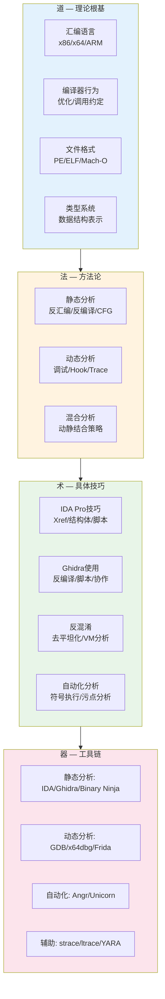
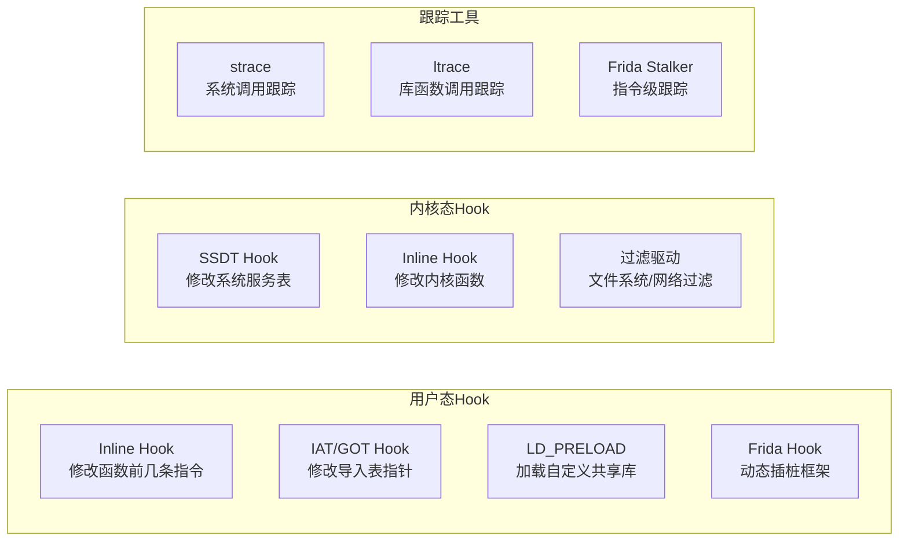

# 第17章 逆向工程 — 本章小结

本章从理论基础、核心技巧、实战案例三个维度系统讲解了逆向工程的完整知识体系。本小结将梳理全章脉络，帮助读者建立完整的知识框架，查漏补缺，并为后续深入学习提供方向指引。

## 一、知识体系总览

逆向工程的核心能力可以归纳为"道法术器"四个层次：

| 层次 | 内涵 | 本章对应内容 |
|------|------|-------------|
| **道** — 理论根基 | 理解计算机系统底层原理，知道程序"为什么长这样" | 汇编语言、编译器行为、可执行文件格式、类型系统 |
| **法** — 方法论 | 掌握逆向分析的系统方法，知道"从哪里入手" | 静态分析方法、动态分析方法、混合分析策略 |
| **术** — 具体技巧 | 熟练运用各种分析技术，知道"怎么操作" | IDA Pro/Ghidra使用、Hook技术、反混淆技术 |
| **器** — 工具链 | 高效使用专业工具，知道"用什么工具" | IDA Pro、Ghidra、GDB、Frida、Angr、Unicorn |



## 二、理论基础核心回顾

### 2.1 汇编语言基础

汇编语言是逆向工程的"母语"。本章讲解了x86/x64和ARM两种主流架构的汇编基础，核心要求是能够阅读汇编代码并快速理解其语义。

**x86/x64关键知识点：**

- **寄存器体系**：通用寄存器（EAX/RAX用于返回值和运算、EBX/RBX用于基址、ECX/RCX用于计数、EDX/RDX用于I/O和乘法高位）、指针寄存器（ESP/RSP栈指针、EBP/RBP帧指针、EIP/RIP指令指针）、标志寄存器（EFLAGS/RFLAGS存储比较和运算结果的状态标志）
- **常用指令类别**：数据传输（mov/lea/push/pop）、算术运算（add/sub/imul/idiv）、位运算（and/or/xor/shl/shr）、比较跳转（cmp/test/je/jne/jmp/call/ret）、字符串操作（rep movsb/repne scasb）
- **调用约定**：cdecl（C默认，调用者清栈）、stdcall（WinAPI，被调用者清栈）、fastcall（ECX/EDX传参）、System V ABI（Linux x64，RDI/RSI/RDX/RCX/R8/R9传参）
- **ARM/ARM64要点**：固定长度指令（ARM模式32位、Thumb模式16位）、加载/存储架构（只有LDR/STR访问内存）、丰富的条件执行、ARM64的X0-X30通用寄存器和PAC指针认证

**编译器生成的典型模式识别：**

理解编译器如何将高级语言转换为汇编是提高逆向效率的关键。以下模式必须能够快速识别：

```text
; if/else模式
    cmp eax, 0
    je  else_branch
    ; then block
    jmp end_if
else_branch:
    ; else block
end_if:

; for循环模式
    mov ecx, 0          ; 初始化计数器
loop_start:
    cmp ecx, 10         ; 边界检查
    jge loop_end
    ; loop body
    inc ecx
    jmp loop_start
loop_end:

; 函数序言/尾声
    push ebp            ; 函数序言
    mov ebp, esp
    sub esp, N          ; 分配局部变量空间
    ...
    mov esp, ebp        ; 函数尾声
    pop ebp
    ret
```

### 2.2 可执行文件格式

三种主要可执行文件格式的结构对比：

| 特征 | PE（Windows） | ELF（Linux） | Mach-O（macOS/iOS） |
|------|--------------|-------------|-------------------|
| 魔数 | MZ (4D 5A) | 7F 45 4C 46 | FE ED FA CE / FE ED FA CF |
| 代码段 | .text | .text | __TEXT.__text |
| 数据段 | .data / .rdata | .data / .rodata | __DATA.__data |
| 导入表 | Import Table (IAT) | .plt + .got | __DATA.__la_symbol_ptr |
| 入口点 | AddressOfEntryPoint | e_entry | LC_MAIN |
| 调试信息 | PDB / .debug | DWARF | DWARF / dSYM |
| 重定位 | .reloc | .rela.* | 内联重定位 |

理解文件格式的意义在于：能够手动解析二进制结构、识别加壳和篡改、定位关键数据和代码、理解动态链接机制（PLT/GOT延迟绑定）。

### 2.3 编译器行为与类型系统

编译器是连接源代码和二进制代码的桥梁。理解编译器行为对逆向效率的提升是决定性的：

- **优化级别影响**：-O0保留完整的函数调用和变量分配，最接近源代码结构；-O2/-O3会内联函数、展开循环、消除死代码、重排指令，使逆向难度显著增加
- **C++名称修饰（Name Mangling）**：通过`__cxa_demangle`或IDA的Demangle功能可以还原函数签名，进而恢复类名、命名空间、模板参数
- **虚函数表（vtable）**：C++多态在二进制中表现为函数指针数组，通过vtable可以还原类的继承关系
- **数据结构在内存中的表示**：结构体的字段排列遵循对齐规则，数组是连续的内存块，链表通过指针连接——识别这些模式是恢复高级数据结构的关键

## 三、核心技巧总结

### 3.1 静态分析技术

静态分析是逆向工程的"第一战场"，不运行程序即可获取全局视图。

**IDA Pro核心技能：**

| 技能 | 操作 | 用途 |
|------|------|------|
| 导航 | 双击地址/名称跳转、ESC返回 | 在函数和数据间快速切换 |
| 交叉引用 | 按X键查看引用 | 追踪函数调用链和数据访问 |
| 结构体定义 | Struct窗口创建结构体 | 恢复高级数据结构 |
| 类型设置 | Y键修改函数签名 | 提高反编译结果的可读性 |
| IDAPython | 脚本自动化批量操作 | 批量重命名、特征匹配、数据提取 |
| 反编译 | F5（Hex-Rays） | 生成类C伪代码辅助理解 |

**Ghidra核心技能：**

- 反编译器内置且免费，支持多架构（x86、ARM、MIPS、PowerPC等）
- 支持多人协作分析同一项目（Ghidra Server）
- 支持Python和Java脚本（Jython/Flat API）
- 版本迭代快，社区活跃

**关键认知：反编译是辅助工具，不是最终答案。** 反编译器生成的伪代码可能丢失类型信息、错误合并变量、无法还原复杂控制流。优秀的逆向工程师必须同时具备阅读汇编代码和反编译结果的能力，用两者相互印证。

### 3.2 动态分析技术

动态分析弥补了静态分析"看不到运行时状态"的短板。

**调试器使用要点：**

- **GDB + pwndbg/gef**：Linux平台首选，pwndbg提供了丰富的内存可视化和堆分析功能，适合安全研究
- **x64dbg**：Windows平台首选，界面直观，插件生态丰富
- **断点类型**：软件断点（int3）、硬件断点（DR0-DR7，最多4个）、内存断点（页保护属性变化）、条件断点（满足条件时中断）

**Hook技术体系：**



- **Frida**：跨平台动态插桩框架，支持JavaScript编写Hook脚本，可在运行时拦截和修改函数调用、读写内存、Hook Java/ObjC方法。是移动端逆向和动态分析的利器
- **strace/ltrace**：轻量级跟踪工具，strace跟踪系统调用（open/read/write/connect），ltrace跟踪库函数调用（printf/malloc/strcmp），快速了解程序的外部行为

### 3.3 反混淆技术

混淆是逆向工程的主要障碍，但每种混淆都有对应的破解方法。

**常见混淆技术与应对策略：**

| 混淆技术 | 原理 | 分析方法 | 工具 |
|---------|------|---------|------|
| 控制流平坦化 | 所有基本块放入switch，用状态变量控制跳转 | 识别状态变量和分发器，通过符号执行或污点分析恢复原始CFG | Angr、deflat脚本、LLVM优化 |
| 不透明谓词 | 插入恒真/恒假条件分支 | 约束求解或动态执行判断条件真伪 | Angr约束求解、动态验证 |
| 字符串加密 | 运行时解密字符串常量 | 设置断点在解密函数、或用Frida拦截解密后的返回值 | Frida、GDB断点、FLOSS |
| 指令替换 | 用等价但更复杂的指令序列替换 | 理解指令语义，手动或脚本化简 | IDAPython脚本 |
| 虚拟机保护 | 将代码转为自定义字节码+解释器执行 | 逆向VM解释器指令集、识别handler表、提取字节码 | GDB单步跟踪、Angr |
| 加壳 | 压缩/加密代码段，运行时解压 | 跟踪到OEP后dump内存、ESP定律、单步跟踪法 | x64dbg、Scylla、UPX |

**反混淆的核心思路：** 混淆必须保留程序的原始语义——只要有语义，就有分析的可能。从简单的部分入手（未混淆的函数、硬编码的常量、特征明显的API调用），逐步缩小需要深入分析的范围。

### 3.4 自动化分析

当手动分析效率不够时，自动化技术可以大幅加速：

- **符号执行（Angr）**：将程序变量表示为符号表达式，自动探索所有执行路径，求解满足特定条件的输入。适合CTF中的flag验证、简单的约束求解。局限：路径爆炸、环境交互建模困难、复杂运算导致求解器超时
- **污点分析**：标记敏感数据（如用户输入、密钥），追踪其在程序中的流动路径，最终到达敏感操作（如网络发送、文件写入）。适合分析数据泄露和注入漏洞
- **模拟执行（Unicorn Engine）**：基于QEMU的CPU模拟框架，可以在任意地址开始执行代码片段，无需完整运行程序。适合解密密文、执行混淆的代码片段、提取运行时数据

## 四、实战案例核心收获

本章通过五个实战案例展示了从拿到二进制文件到得出结论的完整分析流程。以下是每个案例的关键收获：

### 案例一：简单异或加密逆向

**核心收获：** 逆向分析最基本的能力是识别加密算法并提取密钥。异或加密是最常见的CTF逆向模式——识别出循环异或操作后，通过已知明文（如文件头"PK"或"MZ"）即可反推密钥。

**分析思路：**
1. 用IDA打开程序，搜索字符串（Shift+F12）找到密文和可能的提示信息
2. 通过交叉引用定位加密函数
3. 识别异或操作（xor指令在循环中出现）
4. 提取密钥，编写解密脚本

### 案例二：自定义编码算法逆向

**核心收获：** 面对非标准编码算法，需要耐心地逐步还原编码逻辑。关键是识别编码表（base64的字符映射表）、变换操作（移位、置换、查表）和逆变换的实现。

### 案例三：恶意软件分析（信息窃取木马）

**核心收获：** 恶意软件分析需要"行为驱动"的分析策略——从网络通信、文件操作、注册表修改等行为出发，逆向追溯实现逻辑。动态分析（strace监控系统调用、Wireshark抓取网络流量）在恶意软件分析中尤为重要，因为恶意代码通常会加壳、混淆、使用反调试技术来对抗静态分析。

**关键分析步骤：**
1. 在隔离虚拟机中运行样本，用Process Monitor监控文件/注册表操作
2. 用Wireshark捕获C2通信流量
3. 用x64dbg附加到恶意进程，设置API断点（CreateFile、RegSetValue、send/recv）
4. 从API调用参数中提取IoC（域名、IP、文件路径、注册表键值）

### 案例四：CTF逆向题（虚拟机保护）

**核心收获：** VM保护类题目的核心是逆向解释器——找到VM指令的handler表（通常是一个函数指针数组），逐个分析每个handler的操作语义，最终还原出自定义字节码的含义。

**分析策略：**
1. 定位VM解释器的主循环（通常是while(1) + switch/case结构）
2. 提取handler表地址，逐个分析每个handler
3. 构造简单的输入，用GDB观察VM执行流程
4. 根据handler语义编写自定义字节码的反汇编器

### 案例五：协议逆向（自定义网络协议）

**核心收获：** 协议逆向的关键是找到socket操作（connect/send/recv）并追踪数据的构造过程。通过静态分析确定协议字段的偏移和含义，通过动态抓包验证分析结果。

## 五、常见误区与纠正

本章专门用一节篇幅讲解了逆向工程中的十大常见误区，这里提炼其中最关键的纠正认知：

### 误区一：逆向 = 反编译（按F5）

**纠正：** 反编译只是起点。反编译器生成的伪代码丢失了类型信息、可能错误合并变量、无法还原复杂控制流（switch优化、异常处理）。必须同时具备阅读汇编代码的能力，用汇编和伪代码相互印证。

### 误区二：只做静态分析就够了

**纠正：** 静态分析和动态分析各有不可替代的优势。分析自修改代码（SMC）、高度混淆的代码、运行时才解密的数据，必须借助动态分析。最佳实践是"静态定方向，动态验假设"。

### 误区三：遇到混淆就放弃

**纠正：** 混淆增加难度但并非不可破解。控制流平坦化可以通过识别状态变量来去平坦化，字符串加密可以通过动态执行解密，虚拟机保护可以通过逆向VM指令集分析。关键是从简单的部分入手，逐步推进。

### 误区四：符号执行可以解决一切

**纠正：** 符号执行有严重的路径爆炸问题，涉及系统调用、网络、文件系统时难以建模，复杂运算（浮点、哈希）导致约束求解困难。适合求解简单的约束条件（如CTF中的flag验证），不适合分析复杂程序逻辑。

### 误区五：逆向分析必须从main函数开始

**纠正：** 逆向分析应该是目标驱动的。分析特定功能从字符串或API调用出发，分析恶意软件从网络通信出发，分析加密算法从密钥处理出发。从感兴趣的目标点出发，向上追溯调用链，效率远高于从头线性阅读。

### 误区六：逆向工程只需要看代码

**纠正：** 优秀的逆向工程师需要广泛的知识储备：操作系统（系统调用、进程管理、内存管理、动态链接）、密码学（识别加密算法）、数据结构（内存中的表示）、编程语言特性（C++虚函数、Rust所有权、Go goroutine）、领域知识（分析金融软件需要懂金融业务）。

## 六、工具速查表

| 类别 | 工具 | 核心用途 | 平台 | 费用 |
|------|------|---------|------|------|
| 静态分析 | IDA Pro | 反汇编、反编译、脚本自动化 | 全平台 | 商业（有免费版） |
| 静态分析 | Ghidra | 反汇编、反编译、协作分析 | 全平台 | 免费开源 |
| 静态分析 | Binary Ninja | 现代化反汇编平台、中间语言分析 | 全平台 | 商业 |
| 静态分析 | Radare2/Rizin | 命令行逆向框架 | 全平台 | 免费开源 |
| 动态分析 | GDB + pwndbg | Linux调试、堆分析 | Linux | 免费 |
| 动态分析 | x64dbg | Windows调试 | Windows | 免费 |
| 动态分析 | Frida | 动态插桩、Hook | 全平台 | 免费 |
| 跟踪 | strace/ltrace | 系统调用/库函数跟踪 | Linux | 免费 |
| 自动化 | Angr | 符号执行、约束求解 | 全平台 | 免费 |
| 自动化 | Unicorn Engine | CPU模拟执行 | 全平台 | 免费 |
| 文件分析 | Detect It Easy | 查壳、编译器识别 | Windows | 免费 |
| 文件分析 | PE-bear | PE文件可视化分析 | Windows | 免费 |
| 文件分析 | binwalk | 固件分析和提取 | 全平台 | 免费 |
| 恶意分析 | YARA | 恶意软件特征匹配 | 全平台 | 免费 |
| 恶意分析 | Volatility | 内存取证分析 | 全平台 | 免费 |

## 七、能力评估清单

完成本章学习后，可以用以下清单自评掌握程度：

**基础能力（必须达到）：**
- [ ] 能够阅读x86/x64汇编代码，理解mov/push/pop/call/ret/cmp/jmp等核心指令
- [ ] 能够识别函数序言/尾声、调用约定、栈帧结构
- [ ] 能够使用IDA Pro或Ghidra打开二进制文件，浏览反汇编和反编译结果
- [ ] 能够使用GDB设置断点、单步执行、查看寄存器和内存
- [ ] 能够使用交叉引用（Xref）追踪函数调用关系
- [ ] 能够识别简单的加密算法（异或、base64、移位）

**进阶能力（努力达成）：**
- [ ] 能够分析-O2优化后的代码，理解编译器优化的影响
- [ ] 能够使用IDAPython/Ghidra脚本自动化批量分析
- [ ] 能够使用Frida Hook运行中的函数，提取或修改参数和返回值
- [ ] 能够识别和应对常见的反调试技术
- [ ] 能够分析控制流平坦化等基本混淆
- [ ] 能够独立完成CTF Reverse方向的中等难度题目

**高级能力（持续提升）：**
- [ ] 能够逆向虚拟机保护，分析自定义字节码解释器
- [ ] 能够分析恶意软件样本，提取IoC（域名、IP、文件哈希）
- [ ] 能够使用Angr进行符号执行辅助分析
- [ ] 能够分析ARM架构的二进制程序
- [ ] 能够逆向私有网络协议
- [ ] 能够分析固件中的硬编码凭证和命令注入漏洞

## 八、学习路径建议

逆向工程是一个需要大量实践的技能领域。理论知识只是入口，真正的提升来自于持续的动手练习和模式积累。

### 短期目标（1-3个月）

1. 每天用Compiler Explorer（godbolt.org）对照C代码和汇编输出，培养汇编阅读直觉
2. 每周完成1-2道CTF逆向题，从BUUCTF的reverse01-reverse10起步
3. 每分析一个程序，写一份分析报告，记录关键函数、算法逻辑、分析思路
4. 熟练掌握一个静态分析工具（IDA或Ghidra）的核心操作

### 中期目标（3-6个月）

1. 学习Frida Hook技术，能够动态拦截和修改函数调用
2. 掌握基本的反混淆技术（控制流去平坦化、字符串解密）
3. 完成攻防世界进阶区的逆向题目
4. 分析2-3个真实的恶意软件样本（在隔离虚拟机中）

### 长期目标（6-12个月）

1. 学习ARM/ARM64汇编，扩展到移动端逆向（详见第18章）
2. 掌握符号执行（Angr）和模拟执行（Unicorn）的使用
3. 参加CTF竞赛的Reverse方向赛题，积累实战经验
4. 尝试分析VMProtect/Themida等商业保护方案

### 推荐练习平台

| 平台 | 特点 | 适合阶段 |
|------|------|---------|
| BUUCTF (buuoj.cn) | 题量大，难度分级清晰 | 入门→进阶 |
| 攻防世界 (adworld.xctf.org.cn) | 分新手区和进阶区 | 入门→进阶 |
| CTFHub (ctfhub.com) | 入门友好，有详细WriteUp | 入门 |
| CrackMes.one | 社区上传，各种难度 | 全阶段 |
| Reversing.kr | 专注逆向的练习站 | 进阶 |
| MalwareBazaar (bazaar.abuse.ch) | 真实恶意软件样本 | 高级 |

## 九、进阶方向指引

掌握本章内容后，可以根据兴趣和职业方向选择深入领域：

```mermaid
graph TB
    A["第17章 逆向工程基础"] --> B["恶意软件分析"]
    A --> C["漏洞挖掘"]
    A --> D["固件逆向"]
    A --> E["协议逆向"]
    A --> F["移动端逆向"]
    A --> G["浏览器安全"]

    B --> B1["威胁情报<br/>IoC提取与关联"]
    B --> B2["自动化分析<br/>YARA规则/沙箱"]
    B --> B3["高级对抗<br/>反沙箱/反调试绕过"]

    C --> C1["二进制Fuzzing<br/>AFL/libFuzzer"]
    C --> C2["补丁分析<br/>1-day漏洞利用"]
    C --> C3["代码审计<br/>静态+动态漏洞发现"]

    D --> D1["路由器固件<br/>MIPS/ARM"]
    D --> D2["IoT设备<br/>UART/JTAG/SPI"]
    D --> D3["汽车电子<br/>CAN总线/ECU"]

    E --> E1["私有协议分析<br/>抓包+逆向"]
    E --> E2["加密通信破解<br/>密钥提取"]
    E --> E3["蓝牙/WiFi协议<br/>无线安全"]

    F --> F1["Android逆向<br/>APK/JNI/Frida"]
    F --> F2["iOS逆向<br__/dyld/ObjC/Runtime"]
    F --> F3["Flutter/RN<br/>跨平台框架逆向"]

    G --> G1["JS引擎漏洞<br/>V8/SpiderMonkey"]
    G --> G2["浏览器沙箱逃逸"]
    G --> G3["WebAssembly逆向"]
```



**恶意软件分析方向：** 专注于分析病毒、木马、勒索软件的行为和传播机制，提取入侵指标（IoC），编写检测规则（YARA），构建自动化分析流水线（Cuckoo Sandbox）。需要深入理解操作系统内部机制、网络协议和加密技术。

**漏洞挖掘方向：** 在闭源软件中发现安全漏洞，结合Fuzzing（AFL/libFuzzer）和手动逆向分析。需要理解内存安全机制（栈保护、ASLR、DEP）和常见的漏洞模式（栈溢出、堆溢出、UAF、格式化字符串）。

**固件逆向方向：** 分析嵌入式设备和IoT设备的固件，提取文件系统，发现硬编码凭证和命令注入漏洞。需要掌握binwalk固件提取、QEMU模拟执行、SPI Flash读取等硬件级技术。

**移动端逆向方向：** 详见第18章。Android逆向涉及APK反编译（jadx）、JNI层分析、Frida Hook Java方法；iOS逆向涉及dyld加载机制、Objective-C Runtime、越狱环境下的动态分析。

## 十、全章核心公式

最后用一句话总结逆向工程的核心方法论：

> **目标驱动 + 动静结合 + 由浅入深 + 持续实践 = 逆向工程能力的持续提升**

- **目标驱动**：不要从头到尾线性阅读代码，而是从感兴趣的目标点出发（字符串、API调用、异常行为），向上追溯调用链
- **动静结合**：静态分析建立全局视图，动态分析验证假设和提取运行时数据，两者缺一不可
- **由浅入深**：从简单的程序和算法开始，逐步增加复杂度（加密→混淆→加壳→VM保护）
- **持续实践**：逆向工程是"手艺活"，只有通过大量练习才能建立模式识别的直觉。每天分析一小段汇编代码，每周完成1-2道逆向题，每月分析一个完整的项目

逆向工程师的成长曲线是指数型的——前期投入大量时间看不到明显进步，但当积累的模式和技巧达到临界点后，分析效率会突然跃升。坚持下去，量变终将引发质变。
