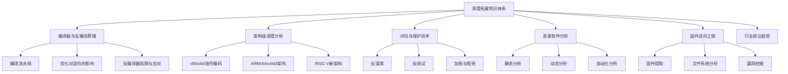
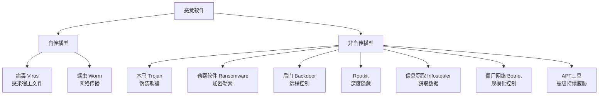
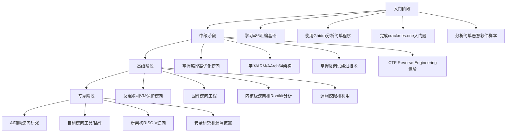

# 第17章 逆向工程 - 深度拓展

本章是逆向工程的进阶深化篇，面向已完成基础逆向学习、希望突破技术瓶颈的读者。我们将从编译器底层机制出发，贯穿架构级分析、对抗技术、恶意软件分析、固件逆向，直至行业前沿趋势，构建完整的高级逆向知识体系。



---

## 一、编译器与反编译原理

理解编译器是逆向工程的根基。逆向的本质是"反编译的逆过程"——只有深刻理解编译器如何将源代码变成机器码，才能在反向过程中做出正确判断。

### 1.1 编译流水线全解析

一个C/C++程序从源代码到可执行文件，经历四个阶段。每个阶段都会丢失信息，理解这些信息丢失是逆向工程的核心挑战。


**预处理阶段（Preprocessing）**：处理所有 `#` 开头的指令。宏展开、头文件包含、条件编译在此阶段完成。预处理后的代码不再包含任何宏定义，所有 `#include` 的内容已内联。逆向时看不到宏，只能看到展开后的代码。

**编译阶段（Compilation）**：将预处理后的C代码翻译为汇编代码。这是信息丢失最严重的阶段——变量名、类型信息、注释、代码结构全部消失。编译器在此阶段执行大量优化。

**汇编阶段（Assembly）**：将汇编代码转换为机器码（目标文件 `.o`/`.obj`）。汇编指令与机器码基本一一对应，但汇编阶段还会生成重定位信息和符号表。

**链接阶段（Linking）**：将多个目标文件合并为一个可执行文件。解析符号引用、合并相同名称的段、分配最终地址。静态库在此阶段被完全合并，动态库只保留引用信息。

#### 编译器优化等级对比

不同优化等级对逆向难度有巨大影响：

| 优化等级 | GCC/Clang标志 | 特点 | 逆向难度 |
|---------|--------------|------|---------|
| -O0 | 无优化 | 代码与源码最接近，保留所有变量 | ★☆☆☆☆ |
| -O1 | 基础优化 | 死代码消除、简单内联 | ★★☆☆☆ |
| -O2 | 标准优化 | 循环优化、指令调度、寄存器分配 | ★★★☆☆ |
| -O3 | 激进优化 | 向量化、循环展开、激进内联 | ★★★★☆ |
| -Os | 大小优化 | 侧重减小代码体积 | ★★★☆☆ |
| -Oz | 极限大小 | Clang特有，最大程度压缩 | ★★★☆☆ |
| -Ofast | 最快 | 允许不安全数学优化 | ★★★★★ |

实战中 `-O2` 是最常见的优化等级（发行版软件默认），也是逆向工程师必须精通的优化级别。

#### 编译器优化对逆向的具体影响

**内联函数（Inline）**：函数体直接嵌入调用处，消除函数调用开销。对逆向的影响是巨大的——原本清晰的函数边界消失，你无法通过 `call` 指令追踪函数调用关系。判断一段代码是独立函数还是内联代码，需要分析寄存器使用模式和上下文。

```c
// 源代码
inline int square(int x) { return x * x; }
int main() {
    int a = square(5);
    int b = square(10);
    return a + b;
}
```

```asm
; -O2 编译后的汇编（内联展开）
main:
    mov eax, 125      ; 5*5 + 10*10 = 125，常量折叠直接计算
    ret
```

**常量折叠（Constant Folding）**：编译时计算常量表达式。上面的例子中，`square(5) + square(10)` 被直接计算为 `125`。逆向时看到 `mov eax, 125`，很难还原出原始的 `square` 函数调用。

**循环优化**：包括循环展开（Loop Unrolling）、循环不变量外提（Loop-Invariant Code Motion）、循环合并（Loop Fusion）。一个简单的 `for` 循环展开后可能变成一长串重复指令，识别原始循环结构需要分析跳转模式。

**死代码消除（Dead Code Elimination）**：移除不可达代码和未使用变量。`if (false) { ... }` 中的代码完全不会出现在二进制中。逆向时你无法知道开发者曾经写过某段代码。

**尾调用优化（Tail Call Optimization）**：函数末尾的 `call + ret` 被优化为 `jmp`。这使得调用栈信息不完整，在动态分析时可能丢失关键的调用链。

**寄存器分配**：变量被分配到寄存器而不是栈上。一个寄存器可能在不同时间段代表不同的变量，增加了数据流追踪的复杂性。

### 1.2 反编译器的局限性与应对策略

反编译器（如Ghidra、IDA Hex-Rays、RetDec）尝试将机器码还原为伪C代码，但存在固有局限：

| 局限性 | 原因 | 应对策略 |
|-------|------|---------|
| 变量名丢失 | 编译器不保留源码变量名 | 根据用途手动重命名（IDA中按N键） |
| 类型信息不完整 | 结构体/类信息被展平为内存偏移 | 重建结构体（IDA中按Ctrl+S创建struct） |
| 优化代码难还原 | 内联、常量折叠等不可逆 | 结合动态分析观察实际行为 |
| 控制流被重构 | switch优化、循环变换 | 使用图形视图分析CFG |
| 浮点代码混乱 | x87 FPU栈式架构 | 识别浮点指令模式 |
| C++特性丢失 | 虚表、RTTI被编译为低级结构 | 重建虚表结构和类层次 |
| 异常处理复杂 | 展开为SEH或DWARF表 | 分析 `.eh_frame` 段 |

**实际案例：还原被优化的结构体访问**

```c
// 源代码
struct User {
    int id;
    char name[32];
    int age;
    float score;
};

void print_user(struct User *u) {
    printf("ID: %d, Name: %s, Age: %d, Score: %.1f\n",
           u->id, u->name, u->age, u->score);
}
```

```asm
; 反汇编后看到的是偏移量而非字段名
print_user:
    push rbp
    mov rbp, rsp
    mov esi, [rdi]          ; u->id (偏移0)
    lea rdx, [rdi+4]        ; u->name (偏移4)
    mov ecx, [rdi+36]       ; u->age (偏移36)
    movss xmm0, [rdi+40]    ; u->score (偏移40)
    ; ... 调用printf
```

逆向工程师需要根据偏移量和使用方式重建结构体：
- 偏移0处的4字节整数作为第一个参数打印 → `id` 字段
- 偏移4处的地址作为 `%s` 参数 → `name` 字符串
- 偏移36处的4字节整数 → `age` 字段
- 偏移40处的4字节浮点数 → `score` 字段
- 由此推断结构体布局：`int(4) + char[32] + int(4) + float(4) = 44字节`

### 1.3 主流反编译器深度对比

| 特性 | IDA Pro + Hex-Rays | Ghidra | Binary Ninja | RetDec |
|-----|-------------------|--------|-------------|--------|
| 价格 | $1000-$5000+ | 免费开源 | $300-$3000 | 免费开源 |
| 反编译质量 | ★★★★★ | ★★★★☆ | ★★★★☆ | ★★★☆☆ |
| 支持架构 | 50+ | 60+ | 40+ | 30+ |
| 插件生态 | 最丰富 | 增长中 | 良好 | 有限 |
| 脚本语言 | IDAPython | Java/Python | Python | Python |
| 协作支持 | IDA Teams | Ghidra Server | 无 | 无 |
| 调试器 | 本地+远程 | 本地+远程 | 本地 | 无 |
| 学习曲线 | 陡峭 | 中等 | 平缓 | 平缓 |

**选择建议**：
- 企业级逆向、漏洞研究：IDA Pro + Hex-Rays（行业标准，反编译质量最高）
- 个人学习、预算有限：Ghidra（功能全面，完全免费，NSA出品）
- 快速分析、脚本化工作流：Binary Ninja（API设计优秀，现代化UI）
- 批量分析、自动化流水线：RetDec（适合集成到CI/CD中）

---

## 二、x86/x64 架构深度分析

### 2.1 指令编码格式

x86指令采用变长编码，最短1字节，最长15字节。理解指令编码格式能帮助你手动解码反汇编器无法识别的混淆指令。

```text
┌──────────┬──────────┬──────────┬──────────┬──────────┬──────────┐
│ 前缀字节  │ 操作码    │ ModR/M   │ SIB      │ 位移      │ 立即数    │
│ 0-4字节   │ 1-3字节   │ 0-1字节   │ 0-1字节   │ 0-4字节   │ 0-4字节   │
└──────────┴──────────┴──────────┴──────────┴──────────┴──────────┘
```

**前缀字节（Prefix Bytes）**：
- `0x66`：操作数大小覆盖（在32位模式下切换为16位操作数）
- `0x67`：地址大小覆盖
- `0xF0`：LOCK前缀（原子操作）
- `0xF2`/`0xF3`：REP前缀或SSE指令前缀
- 段覆盖前缀：`0x26`(ES)、`0x2E`(CS)、`0x36`(SS)、`0x3E`(DS)、`0x64`(FS)、`0x65`(GS)

**ModR/M字节**：编码寻址模式和寄存器操作数。

```text
  7   6   5   4   3   2   1   0
┌───────┬───────────┬───────────┐
│  Mod  │  Reg/Op   │   R/M     │
│ 2 bit │  3 bit    │  3 bit    │
└───────┴───────────┴───────────┘
```

- Mod=00：间接寻址 `[reg]`（ModR/M=0x05时为 `[disp32]`）
- Mod=01：基址+8位偏移 `[reg+disp8]`
- Mod=10：基址+32位偏移 `[reg+disp32]`
- Mod=11：寄存器直接寻址

**SIB字节（Scale-Index-Base）**：当ModR/M的R/M=100时启用，支持复杂寻址。

```text
  7   6   5   4   3   2   1   0
┌───────┬───────────┬───────────┐
│ Scale │  Index    │   Base    │
│ 2 bit │  3 bit    │  3 bit    │
└───────┴───────────┴───────────┘
```

Scale：00=×1, 01=×2, 10=×4, 11=×8。寻址公式：`[base + index * scale + displacement]`

**实例解码**：`8B 44 8B 08`

```text
8B       → MOV（操作码，从内存到寄存器）
44       → ModR/M: Mod=01, Reg=000(EAX), R/M=100(SIB follows)
8B       → SIB: Scale=10(×4), Index=001(ECX), Base=011(EBX)
08       → 8位位移 = 0x08

解码结果：MOV EAX, [EBX + ECX*4 + 0x08]
```

### 2.2 寻址模式速查表

| 寻址模式 | 示例 | 有效地址计算 | 使用场景 |
|---------|------|------------|---------|
| 立即寻址 | `mov eax, 42` | 操作数在指令中 | 常量赋值 |
| 寄存器寻址 | `mov eax, ebx` | 操作数在寄存器 | 变量传递 |
| 直接寻址 | `mov eax, [0x401000]` | 地址在指令中 | 全局变量访问 |
| 寄存器间接 | `mov eax, [ebx]` | EA = EBX | 指针解引用 |
| 基址+偏移 | `mov eax, [ebx+8]` | EA = EBX + 8 | 结构体字段访问 |
| 比例索引 | `mov eax, [ebx+ecx*4]` | EA = EBX + ECX×4 | 数组访问 |
| RIP相对（x64） | `mov eax, [rip+0x2000]` | EA = RIP + 偏移 | PIC代码中的全局变量 |

### 2.3 调用约定深度对比

调用约定决定了函数参数如何传递、返回值如何获取、栈由谁清理。逆向时识别调用约定是还原函数签名的关键。

| 调用约定 | 参数传递 | 栈清理 | 返回值 | 使用场景 |
|---------|---------|-------|-------|---------|
| cdecl | 全部入栈（右→左） | 调用者 | EAX/RAX | Linux x86默认 |
| stdcall | 全部入栈（右→左） | 被调用者 | EAX/RAX | Windows API |
| fastcall | ECX/EDX + 入栈 | 被调用者 | EAX/RAX | 性能敏感代码 |
| thiscall | ECX=this + 入栈 | 被调用者 | EAX/RAX | MSVC C++成员函数 |
| vectorcall | XMM0-5 + 入栈 | 被调用者 | EAX/XMM0 | 数学密集型函数 |
| SysV AMD64 | RDI/RSI/RDX/RCX/R8/R9 + 栈 | 调用者 | RAX | Linux/macOS x64 |
| Win64 | RCX/RDX/R8/R9 + 栈 | 调用者 | RAX | Windows x64 |

**实战识别调用约定**：

```asm
; 函数调用：result = add(3, 5);
; cdecl方式
push 5              ; 第二个参数入栈
push 3              ; 第一个参数入栈
call add
add esp, 8          ; 调用者清理栈（cdecl特征）
mov [ebp-4], eax    ; 返回值在eax

; fastcall方式
mov edx, 5          ; 第二个参数 → edx
mov ecx, 3          ; 第一个参数 → ecx
call add
mov [ebp-4], eax    ; 返回值在eax（无需清理栈，被调用者清理）

; SysV AMD64方式
mov esi, 5          ; 第二个参数 → rsi
mov edi, 3          ; 第一个参数 → rdi
call add
mov [rbp-4], eax    ; 返回值在eax
```

### 2.4 控制流分析实战

#### 条件分支识别

编译器将高级语言的条件语句编译为比较指令 + 条件跳转：

```c
// 源代码
if (a > b) {
    result = a - b;
} else {
    result = b - a;
}
```

```asm
; 编译结果（-O0）
    mov eax, [rbp-4]    ; 加载 a
    cmp eax, [rbp-8]    ; 比较 a 和 b
    jle .L_else          ; 如果 a <= b，跳转到else分支
    ; if分支
    mov eax, [rbp-4]
    sub eax, [rbp-8]
    mov [rbp-12], eax
    jmp .L_end           ; 跳过else分支
.L_else:
    ; else分支
    mov eax, [rbp-8]
    sub eax, [rbp-4]
    mov [rbp-12], eax
.L_end:
```

注意编译器会反转条件：源代码是 `if (a > b)`，编译后是 `jle`（小于等于时跳过if分支）。这是逆向时最常见的"条件反转"陷阱。

#### 循环模式识别

三种基本循环在汇编层面有不同的结构模式：

```asm
; for循环模式（计数循环）
    mov ecx, 0          ; 初始化计数器
.loop_start:
    cmp ecx, 10         ; 比较计数器与上限
    jge .loop_end        ; 超出则退出
    ; ... 循环体 ...
    inc ecx             ; 递增计数器
    jmp .loop_start     ; 回到循环头
.loop_end:

; while循环模式（先判断后执行）
.loop_start:
    cmp eax, 0          ; 测试条件
    je .loop_end         ; 条件为假则退出
    ; ... 循环体 ...
    jmp .loop_start
.loop_end:

; do-while循环模式（先执行后判断）
.loop_start:
    ; ... 循环体 ...
    cmp eax, 0          ; 测试条件
    jne .loop_start      ; 条件为真则继续
```

#### 函数识别要点

在stripped二进制中识别函数边界需要综合多种信号：

1. **函数序言（Prologue）**：`push rbp; mov rbp, rsp` 或 `sub rsp, N`（叶函数可能无序言）
2. **函数尾声（Epilogue）**：`leave; ret` 或 `pop rbp; ret` 或 `add rsp, N; ret`
3. **栈帧大小**：`sub rsp, N` 中N的值指示局部变量空间
4. **对齐填充**：函数之间常有 `int3`（0xCC）或 `nop` 填充到16字节边界
5. **调用目标**：`call` 指令的目标一定是函数入口

---

## 三、ARM/AArch64 架构分析

### 3.1 ARM指令集特点

ARM采用RISC（精简指令集）设计，与x86的CISC（复杂指令集）有本质差异：

| 特性 | x86/x64 (CISC) | ARM (RISC) |
|-----|----------------|------------|
| 指令长度 | 变长（1-15字节） | 固定（ARM:32位, Thumb:16位） |
| 寄存器数量 | 16个通用（x64） | 16个通用（ARM32）, 31个（AArch64） |
| 内存访问 | 大多数指令可操作内存 | 只有LDR/STR访问内存 |
| 条件执行 | 仅跳转指令 | 几乎所有指令可条件执行（ARM32） |
| 指令密度 | 高（变长编码） | 中等（Thumb模式提高密度） |
| 功耗 | 较高 | 较低（移动设备首选） |

### 3.2 AArch64（ARM64）关键特性

AArch64是ARM的64位执行状态，广泛用于现代手机（Apple Silicon、骁龙8 Gen系列）、服务器（AWS Graviton、Ampere Altra）和嵌入式设备。

**寄存器架构**：

```text
通用寄存器（64位）：
  X0-X7    : 函数参数和返回值（类似x64的RDI/RSI等）
  X8       : 间接结果寄存器（大结构体返回地址）
  X9-X15   : 临时寄存器（caller-saved）
  X16-X17  : IP0/IP1，链接器/PLT暂用
  X18      : 平台保留（macOS用于TLS，Linux可自由使用）
  X19-X28  : 临时寄存器（callee-saved）
  X29      : FP（帧指针，类似x86的RBP）
  X30      : LR（链接寄存器，保存返回地址）
  SP       : 栈指针（不能用作通用寄存器）

特殊寄存器：
  PC       : 程序计数器（不能直接读写）
  NZCV     : 条件标志（Negative, Zero, Carry, Overflow）
  PSTATE   : 处理器状态
```

**AArch64调用约定**：X0-X7传递前8个参数，X0-X1返回值。这比x64的SysV（6个寄存器参数）更高效。

**AArch64指令格式**：

```asm
; 算术指令
ADD X0, X1, X2          ; X0 = X1 + X2
SUB X0, X1, #16         ; X0 = X1 - 16
MUL X0, X1, X2          ; X0 = X1 * X2

; 加载/存储指令
LDR X0, [X1]            ; X0 = *X1
LDR X0, [X1, #8]        ; X0 = *(X1 + 8)
LDR X0, [X1, X2]        ; X0 = *(X1 + X2)
LDR X0, [X1, X2, LSL #3] ; X0 = *(X1 + X2*8)
STR X0, [X1, #16]       ; *(X1 + 16) = X0

; 条件选择（替代部分分支）
CMP X1, X2
CSEL X0, X1, X2, GT     ; if (X1 > X2) X0=X1 else X0=X2

; 分支指令
B label                  ; 无条件跳转
BL label                 ; 带链接跳转（函数调用，LR=返回地址）
BR X0                    ; 寄存器跳转（间接跳转）
BLR X0                   ; 带链接的寄存器跳转（间接调用）
RET                      ; 返回（等价于 BR X30）
```

### 3.3 PAC（Pointer Authentication Code）

ARMv8.3引入的指针认证是现代ARM安全特性的核心。PAC在指针的高位嵌入加密签名，防止ROP/JOP攻击：

```text
64位指针布局（使用PAC时）：
┌──────────┬────────────────────────────────────────────┐
│ PAC位    │              实际地址                        │
│ 高位填充  │              低48位有效地址                    │
└──────────┴────────────────────────────────────────────┘

PAC计算：PAC = PACSign(指针, 上下文密钥, modifier)
验证：PACVerify(带PAC的指针, 上下文密钥, modifier)
```

对逆向的影响：PAC保护的代码中，函数指针和返回地址经过认证。攻击者无法简单覆盖返回地址来劫持控制流。逆向时需要理解PAC指令（`PACIA`、`AUTIA`、`PACIB`、`AUTIB`）来正确分析控制流。

### 3.4 ARM vs x86 逆向对比

| 逆向任务 | x86/x64 | ARM/AArch64 |
|---------|---------|-------------|
| 函数识别 | push rbp序言明显 | STP X29,X30序言 |
| 字符串定位 | `lea rdi, [rip+str]` | `ADRP+ADD` 两步加载 |
| 间接调用 | `call [rax]` | `BLR Xn` |
| 返回地址 | 在栈上（易被覆盖） | 在X30/LR（可被篡改但需显式操作） |
| 系统调用 | `syscall`/`int 0x80` | `SVC #0` |
| NOP指令 | `0x90`（1字节） | `0xD503201F`（4字节） |
| Shellcode约束 | 避免null字节 | 避免null + 4字节对齐 |

---

## 四、高级对抗技术

### 4.1 反混淆技术详解

代码混淆是软件保护的第一道防线。现代商业混淆器（如OLLVM、Tigress、Themida）可以将代码复杂度提升数个量级。

#### 4.1.1 控制流平坦化（Control Flow Flattening）

控制流平坦化是最常见的混淆技术之一，OLLVM是其实现代表。原始代码中的嵌套if-else和循环被转换为一个巨大的switch-case结构，通过状态变量控制执行顺序。

**原始代码**：

```c
int process(int x) {
    if (x > 0) {
        x = x * 2;
    } else {
        x = -x;
    }
    return x + 1;
}
```

**平坦化后**：

```c
int process(int x) {
    int state = INITIAL_STATE;
    while (1) {
        switch (state) {
            case STATE_1:
                if (x > 0) state = STATE_2;
                else state = STATE_3;
                break;
            case STATE_2:
                x = x * 2;
                state = STATE_4;
                break;
            case STATE_3:
                x = -x;
                state = STATE_4;
                break;
            case STATE_4:
                return x + 1;
        }
    }
}
```

**反平坦化方法**：

1. **符号执行**：使用 angr 框架自动探索所有路径

```python
import angr
import claripy

# 加载二进制
proj = angr.Project('./flattened_binary', auto_load_libs=False)

# 创建符号输入
sym_arg = claripy.BVS('arg', 32)
state = proj.factory.call_state(0x401000, sym_arg)  # 函数地址

# 创建模拟管理器
simgr = proj.factory.simulation_manager(state)

# 探索所有路径
simgr.explore(find=0x401200, avoid=0x401300)

# 分析找到的状态
if simgr.found:
    found = simgr.found[0]
    result = found.solver.eval(sym_arg)
    print(f"满足条件的输入: {result}")
```

2. **编译器优化反混淆**：将混淆后的代码重新编译，利用优化器消除冗余控制流

3. **模式识别**：识别平坦化的特征模式（switch变量、dispatch循环、case块）

4. **Miasm框架反编译**：

```python
from miasm.analysis.binary import Container
from miasm.core.locationdb import LocationDB

loc_db = LocationDB()
with open('./flattened_binary', 'rb') as f:
    cont = Container.from_stream(f, loc_db)

# 分析控制流
from miasm.analysis.machine import Machine
machine = Machine("x86_64")
dis_engine = machine.dis_engine(cont.bin_stream, loc_db=loc_db)
asm_cfg = dis_engine.dis_multiblock(0x401000)

# 输出控制流图
for block in asm_cfg.blocks:
    print(f"Block at {block.loc_key}:")
    for instr in block.lines:
        print(f"  {instr}")
```

#### 4.1.2 不透明谓词（Opaque Predicates）

不透明谓词是恒为真或恒为假的条件表达式，但经过数学变换后难以被静态分析器识别。

**常见不透明谓词模式**：

```text
恒真谓词：
  x*(x+1) % 2 == 0        （任何整数×其后继必为偶数）
  x^2 >= 0                 （任何整数的平方非负）
  (x | 1) != 0             （任何整数OR 1不为0）
  7*y^2 - 1 != x^2         （Pell方程无整数解）

恒假谓词：
  x^2 < 0                  （任何整数的平方不为负）
  x*(x+1) % 2 == 1         （不可能为奇数）
```

**检测方法**：

- **SMT求解器**：使用Z3验证谓词是否恒真/恒假

```python
from z3 import *

x = BitVec('x', 32)

# 检查 x*(x+1) % 2 == 0 是否恒真
s = Solver()
s.add(x * (x + 1) % 2 != 0)
result = s.check()
print(f"是否可能为假: {result}")  # unsat = 恒真

# 检查 x^2 < 0 是否可能为真
s2 = Solver()
s2.add(x * x < 0)
result2 = s2.check()
print(f"是否可能为真: {result2}")  # unsat = 恒假
```

#### 4.1.3 虚拟机保护（VM Protect）

虚拟机保护是最强的混淆技术之一。Themida、VMProtect、Code Virtualizer等工具将原始x86/ARM指令翻译为自定义字节码，由内嵌的解释器执行。

```text
VM保护的工作流程：

原始x86代码 → 自定义字节码编译器 → 加密字节码
                                         ↓
                              VM解释器（运行时解密+执行）
```

**逆向VM保护的策略**：

1. **识别VM入口/出口**：找到 `call vm_handler` 和 `vm_handler` 返回点
2. **提取字节码**：在VM入口处dump传入的字节码流
3. **分析解释器结构**：识别dispatch loop（分发循环）和handler table
4. **重建指令映射**：将自定义字节码映射回原始操作语义
5. **符号执行辅助**：使用Unicorn引擎模拟VM执行

```python
from unicorn import *
from unicorn.x86_const import *

# 模拟VM解释器的一个handler
mu = Uc(UC_ARCH_X86, UC_MODE_64)

# 映射内存
mu.mem_map(0x1000, 0x1000)  # 代码段
mu.mem_map(0x7000, 0x1000)  # 栈

# 写入handler代码
handler_code = b"\x48\x89\xf8\x48\x01\xd8\xc3"  ; mov rax, rdi; add rax, rsi; ret
mu.mem_write(0x1000, handler_code)

# 设置栈
mu.reg_write(UC_X86_REG_RSP, 0x7800)

# 执行并观察结果
mu.reg_write(UC_X86_REG_RDI, 10)
mu.reg_write(UC_X86_REG_RSI, 20)
mu.emu_start(0x1000, 0x1000 + len(handler_code))

result = mu.reg_read(UC_X86_REG_RAX)
print(f"VM handler执行结果: {result}")  # 30
```

### 4.2 反调试技术与绕过

反调试是软件保护的核心组件。理解每种检测技术的原理，才能有效绕过。

#### 4.2.1 Windows反调试技术全谱

**PEB检测**：

```c
// 技术1：IsDebuggerPresent
BOOL debugged = IsDebuggerPresent();  // 检查 PEB.BeingDebugged

// 技术2：NtQueryInformationProcess
DWORD debugPort = 0;
NtQueryInformationProcess(
    GetCurrentProcess(),
    ProcessDebugPort,   // 0x07
    &debugPort,
    sizeof(debugPort),
    NULL
);
// debugPort != 0 表示有调试器

// 技术3：NtQueryInformationProcess (DebugObjectHandle)
HANDLE debugObject = NULL;
NtQueryInformationProcess(
    GetCurrentProcess(),
    0x1E,  // ProcessDebugObjectHandle
    &debugObject,
    sizeof(debugObject),
    NULL
);
// 成功获取到handle表示有调试器

// 技术4：Heap Flags检测
// PEB->ProcessHeap->Flags 和 ForceFlags
// 调试模式下堆的标志位不同
PVOID pPeb = __readgsqword(0x60);  // PEB地址
PVOID heap = *(PVOID*)((BYTE*)pPeb + 0x30);  // ProcessHeap
DWORD flags = *(DWORD*)((BYTE*)heap + 0x70);  // Flags
DWORD forceFlags = *(DWORD*)((BYTE*)heap + 0x74);  // ForceFlags
// 正常: Flags=0x2, ForceFlags=0x0
// 调试: Flags=0x5x, ForceFlags=0x0 或非0
```

**时间检测**：

```c
// 技术5：RDTSC（时间戳计数器）
uint64_t t1 = __rdtsc();
// ... 一些操作 ...
uint64_t t2 = __rdtsc();
if (t2 - t1 > THRESHOLD) {
    // 单步执行导致时间差过大，检测到调试器
    exit(1);
}

// 技术6：GetTickCount差异检测
DWORD tick1 = GetTickCount();
Sleep(100);
DWORD tick2 = GetTickCount();
if (tick2 - tick1 > 200) {  // 正常应约100ms
    // 调试器可能暂停了执行
    exit(1);
}
```

**硬件断点检测**：

```c
// 技术7：检查调试寄存器DR0-DR7
CONTEXT ctx = {0};
ctx.ContextFlags = CONTEXT_DEBUG_REGISTERS;
GetThreadContext(GetCurrentThread(), &ctx);
if (ctx.Dr0 || ctx.Dr1 || ctx.Dr2 || ctx.Dr3) {
    // 检测到硬件断点
    exit(1);
}
```

**异常处理检测**：

```c
// 技术8：SEH链完整性
// 设置自定义SEH，触发异常，检查调试器是否拦截
__try {
    __asm { int 3 }  // 触发断点异常
}
__except (EXCEPTION_EXECUTE_HANDLER) {
    // 正常情况：异常被SEH处理
    // 如果调试器拦截了异常，这里不会执行
}

// 技术9：INT 2D检测
__try {
    __asm {
        int 0x2D   // 内核调试中断
        nop
    }
}
__except (EXCEPTION_EXECUTE_HANDLER) {
    // 检查nop是否被执行（调试器下会跳过nop）
}
```

#### 4.2.2 反调试绕过技术

**方法1：API Hook绕过**

```python
# 使用Frida hook IsDebuggerPresent
import frida

js_code = """
// Hook IsDebuggerPresent
var isDebuggerPresent = Module.findExportByName("kernel32.dll", "IsDebuggerPresent");
Interceptor.attach(isDebuggerPresent, {
    onLeave: function(retval) {
        retval.replace(0);  // 始终返回0（未调试）
        console.log("[*] IsDebuggerPresent bypassed");
    }
});

// Hook NtQueryInformationProcess
var ntQIP = Module.findExportByName("ntdll.dll", "NtQueryInformationProcess");
Interceptor.attach(ntQIP, {
    onEnter: function(args) {
        this.infoClass = args[1].toInt32();
        this.infoPtr = args[2];
    },
    onLeave: function(retval) {
        if (this.infoClass === 7 || this.infoClass === 0x1E) {
            // ProcessDebugPort 或 ProcessDebugObjectHandle
            if (this.infoPtr) {
                Memory.writeU32(this.infoPtr, 0);
            }
            retval.replace(0);
            console.log("[*] NtQueryInformationProcess(" + this.infoClass + ") bypassed");
        }
    }
});

// Hook GetTickCount
var getTickCount = Module.findExportByName("kernel32.dll", "GetTickCount");
var lastTick = 0;
Interceptor.attach(getTickCount, {
    onLeave: function(retval) {
        var current = retval.toInt32();
        if (lastTick === 0) {
            lastTick = current;
        } else {
            // 模拟正常时间流逝
            lastTick += 10;
            retval.replace(lastTick);
        }
    }
});
"""

device = frida.get_usb_device()
pid = device.spawn(["./protected_app"])
session = device.attach(pid)
script = session.create_script(js_code)
script.load()
device.resume(pid)
input("按Enter退出...")
```

**方法2：调试器插件绕过**

| 插件 | 调试器 | 功能 |
|-----|-------|------|
| ScyllaHide | x64dbg/IDA/OllyDbg | 隐藏调试器特征，绕过PEB/时间/API检测 |
| TitanHide | x64dbg | 内核驱动级别的调试器隐藏 |
| SharpOD | x64dbg | 针对.NET程序的反反调试 |
| HideDebugger | OllyDbg | 老牌反反调试插件 |

**方法3：内核调试绕过**

用户空间的反调试技术通常无法检测内核调试器。使用WinDbg的内核调试模式或虚拟机内核调试可以绕过大部分反调试保护。

**方法4：二进制补丁**

直接修改反调试检测代码，将检测逻辑NOP掉或修改跳转条件：

```python
# 使用capstone + keystone补丁
from capstone import *
from keystone import *

# 原始代码：test eax, eax; jne exit
# 补丁为：test eax, eax; nop; nop
patch = b"\x85\xc0\x90\x90"  # test eax,eax; nop; nop

# 写入二进制文件
with open("patched_binary", "rb") as f:
    data = bytearray(f.read())
data[0x1234:0x1234+4] = patch  # 偏移0x1234处的检测代码
with open("patched_binary", "wb") as f:
    f.write(data)
```

### 4.3 加壳与脱壳技术

#### 4.3.1 壳的分类与特征

| 壳类型 | 代表工具 | 保护强度 | 脱壳难度 | 工作原理 |
|-------|---------|---------|---------|---------|
| 压缩壳 | UPX, ASPack | ★☆☆☆☆ | ★☆☆☆☆ | 压缩代码段，运行时解压 |
| 保护壳 | Themida, ASProtect | ★★★★☆ | ★★★★☆ | 代码加密+反调试+反篡改 |
| VM壳 | VMProtect, Code Virtualizer | ★★★★★ | ★★★★★ | 指令虚拟化+自定义字节码 |
| .NET保护 | Dotfuscator, ConfuserEx | ★★★☆☆ | ★★☆☆☆ | IL混淆+字符串加密+控制流混淆 |

#### 4.3.2 脱壳技术详解

**ESP定律（ESP Law）**：利用壳解压完成后ESP值不变的原理。

原理：壳的解压代码最终会执行 `popad` + `jmp OEP`。在 `popad` 之前，ESP指向一个特殊值。在ESP处设置硬件访问断点，当解压完成后会触发断点，此时程序已到达OEP附近。

```text
ESP定律操作步骤（x64dbg）：
1. F8单步执行到壳代码的第一次ESP变化
2. 记录当前ESP值（如 0x0019FF70）
3. 在硬件访问断点中设置对ESP指向地址的访问监控
4. F9运行，断点触发时即在OEP附近
5. 识别OEP的函数序言（push ebp / sub rsp, N）
6. dump内存，使用Scylla修复导入表
```

**内存断点法**：壳需要写入代码段来解压代码。在代码段设置内存写入断点，当壳写入解压后的代码时触发断点。

```text
内存断点法步骤：
1. 识别代码段（.text段，通常权限为 RX）
2. 对代码段首地址设置内存写入断点
3. F9运行，断点触发说明壳正在写入解压后的代码
4. 继续F9直到写入完成
5. 到达OEP
```

**单步跟踪法**：适用于简单壳。通过F8单步跟踪，观察循环结构，找到跳转到OEP的 `jmp` 指令。

---

## 五、恶意软件分析

### 5.1 恶意软件分类体系



| 类型 | 传播方式 | 主要危害 | 代表案例 |
|-----|---------|---------|---------|
| 病毒 | 感染可执行文件、文档 | 破坏系统、数据 | CIH、Sasser |
| 蠕虫 | 网络自动传播 | 瘫痪网络、DDoS | WannaCry、Conficker |
| 木马 | 伪装合法软件 | 后门控制、窃密 | Emotet、TrickBot |
| 勒索软件 | 漏洞利用、钓鱼邮件 | 加密文件勒索 | LockBit、REvil |
| 后门 | 漏洞植入、供应链攻击 | 持久控制 | PlugX、Cobalt Strike |
| Rootkit | 内核/引导区感染 | 深度隐藏 | Necurs、ZeroAccess |
| 信息窃取器 | 捆绑软件、钓鱼 | 窃取凭证/加密货币 | RedLine、Raccoon |
| 僵尸网络 | 蠕虫传播、漏洞利用 | DDoS、挖矿、代理 | Mirai、Emotet |

### 5.2 静态分析完整流程

#### 第一步：文件信息收集

```bash
# 文件类型识别
file suspicious.exe
# 输出：PE32+ executable (GUI) x86-64, for MS Windows

# 计算哈希
md5sum suspicious.exe
sha256sum suspicious.exe
# 输出哈希值用于VirusTotal查询

# 字符串提取
strings -a suspicious.exe | head -100
strings -a -el suspicious.exe  # Unicode字符串

# FLOSS高级字符串提取（识别栈上构建的字符串）
floss suspicious.exe

# PE头分析
pefile suspicious.exe
# 或使用pe-bear、pestudio图形化分析
```

#### 第二步：导入表分析

导入表是静态分析的重要线索。恶意软件常用的可疑API：

| API类别 | 具体API | 恶意用途 |
|--------|--------|---------|
| 进程操作 | CreateRemoteThread, NtCreateThreadEx | 进程注入 |
| 内存操作 | VirtualAllocEx, WriteProcessMemory | 远程内存写入 |
| 网络通信 | InternetOpenUrl, HttpSendRequest, WSASocket | C2通信 |
| 注册表 | RegSetValueEx, RegCreateKeyEx | 持久化 |
| 文件操作 | CreateFile, WriteFile, DeleteFile | 文件操作 |
| 权限提升 | AdjustTokenPrivileges, OpenProcessToken | 提权 |
| 反调试 | IsDebuggerPresent, NtQueryInformationProcess | 反分析 |
| 加密 | CryptEncrypt, CryptGenKey | 文件加密（勒索软件） |
| 键盘记录 | SetWindowsHookEx, GetAsyncKeyState | 输入窃取 |
| 截屏 | BitBlt, GetDC | 屏幕捕获 |

#### 第三步：PE结构深度分析

```python
import pefile

pe = pefile.PE("suspicious.exe")

# 基本信息
print(f"入口点: 0x{pe.OPTIONAL_HEADER.AddressOfEntryPoint:08X}")
print(f"镜像基址: 0x{pe.OPTIONAL_HEADER.ImageBase:08X}")
print(f"子系统: {pe.OPTIONAL_HEADER.Subsystem}")

# 检查节区特征
for section in pe.sections:
    name = section.Name.decode().rstrip('\x00')
    entropy = section.get_entropy()
    print(f"{name}: VA=0x{section.VirtualAddress:08X}, "
          f"Size={section.SizeOfRawData}, Entropy={entropy:.2f}")
    # 高熵值(>7.0)通常表示加密或压缩的代码

# 检查时间戳
import datetime
timestamp = pe.FILE_HEADER.TimeDateStamp
compile_time = datetime.datetime.fromtimestamp(timestamp)
print(f"编译时间: {compile_time}")

# 检查可疑导入
suspicious_apis = [
    b'IsDebuggerPresent', b'NtQueryInformationProcess',
    b'CreateRemoteThread', b'WriteProcessMemory',
    b'VirtualAllocEx', b'GetProcAddress', b'LoadLibraryA'
]
for entry in pe.DIRECTORY_ENTRY_IMPORT:
    for imp in entry.imports:
        if imp.name and imp.name in suspicious_apis:
            print(f"[!] 可疑导入: {entry.dll.decode()} -> {imp.name.decode()}")
```

#### 第四步：YARA规则编写

YARA是恶意软件特征匹配的标准工具，用于检测和分类恶意样本：

```yara
rule Emotet_Packer {
    meta:
        description = "检测Emotet木马的加壳变种"
        author = "SecurityAnalyst"
        date = "2026-01"
        severity = "high"
        family = "Emotet"

    strings:
        // 特征字符串
        $mutex = "EmotetMutex" ascii wide
        $c2_pattern = /https?:\/\/[0-9]{1,3}\.[0-9]{1,3}\.[0-9]{1,3}\.[0-9]{1,3}:8080/

        // 代码特征
        $api_hash1 = { 8B 45 FC 33 D2 B9 0A 00 00 00 F7 F1 }
        $api_hash2 = { 68 ?? ?? ?? ?? FF 15 ?? ?? ?? ?? 85 C0 }

        // PE特征
        $pe_section = ".mimic" ascii
        $timestamp = { 00 60 98 54 }  // 特定时间戳

    condition:
        uint16(0) == 0x5A4D and  // PE文件
        filesize < 500KB and
        (
            ($mutex and $c2_pattern) or
            (2 of ($api_hash*)) or
            ($pe_section and $timestamp)
        )
}
```

```bash
# 使用YARA规则扫描
yara -r emotet_rules.yara /path/to/samples/

# 使用yarGen自动生成规则
python3 yarGen.py -m /path/to/malware_samples/ -o auto_rules.yara
```

### 5.3 动态分析完整流程

#### 沙箱分析环境搭建

```bash
# 使用Cuckoo Sandbox搭建自动化分析环境
# 1. 安装依赖
sudo apt install python3 python3-pip mongodb postgresql

# 2. 安装Cuckoo
pip3 install cuckoo

# 3. 创建虚拟机（VirtualBox）
VBoxManage createvm --name "Win10Analysis" --register
VBoxManage modifyvm "Win10Analysis" --memory 4096 --cpus 2

# 4. 配置Cuckoo
cuckoo community  # 下载签名
cuckoo -d  # 启动Cuckoo

# 5. 提交样本分析
cuckoo submit suspicious.exe
```

#### Frida动态Hook分析

```javascript
// 监控恶意软件的网络通信
var ws2 = Module.findExportByName("ws2_32.dll", "connect");
Interceptor.attach(ws2, {
    onEnter: function(args) {
        var sockaddr = args[1];
        var family = Memory.readU16(sockaddr);
        if (family === 2) {  // AF_INET
            var port = (Memory.readU8(sockaddr.add(2)) << 8) |
                        Memory.readU8(sockaddr.add(3));
            var ip = [
                Memory.readU8(sockaddr.add(4)),
                Memory.readU8(sockaddr.add(5)),
                Memory.readU8(sockaddr.add(6)),
                Memory.readU8(sockaddr.add(7))
            ].join(".");
            console.log("[NET] connect to " + ip + ":" + port);
        }
    }
});

// 监控文件操作
var createFile = Module.findExportByName("kernel32.dll", "CreateFileW");
Interceptor.attach(createFile, {
    onEnter: function(args) {
        var path = args[0].readUtf16String();
        console.log("[FILE] CreateFile: " + path);
    },
    onLeave: function(retval) {
        console.log("[FILE] Handle: " + retval);
    }
});

// 监控注册表操作
var regSetValue = Module.findExportByName("advapi32.dll", "RegSetValueExW");
Interceptor.attach(regSetValue, {
    onEnter: function(args) {
        var key = args[0];
        var valueName = args[1].readUtf16String();
        console.log("[REG] SetValue: " + valueName);
    }
});

// 监控进程创建
var createProcess = Module.findExportByName("kernel32.dll", "CreateProcessW");
Interceptor.attach(createProcess, {
    onEnter: function(args) {
        var app = args[0] ? args[0].readUtf16String() : "(null)";
        var cmd = args[1] ? args[1].readUtf16String() : "(null)";
        console.log("[PROC] CreateProcess: " + app + " | " + cmd);
    }
});
```

#### 网络流量分析

```bash
# 使用Wireshark/tshark捕获C2通信
tshark -i eth0 -f "tcp port 80 or tcp port 443" -w capture.pcap

# 分析HTTP流量
tshark -r capture.pcap -Y "http.request" -T fields \
  -e http.host -e http.request.uri -e http.user_agent

# 提取可疑域名
tshark -r capture.pcap -Y "dns" -T fields -e dns.qry.name | sort -u

# 使用NetworkMiner提取文件
# 图形化工具，可从PCAP中提取传输的文件、图片、证书
```

### 5.4 内存取证

使用Volatility框架进行内存取证分析：

```bash
# 识别操作系统
volatility -f memory.dmp imageinfo

# 列出进程
volatility -f memory.dmp --profile=Win10x64 pslist

# 检查进程树（识别父子关系异常）
volatility -f memory.dmp --profile=Win10x64 pstree

# 检查网络连接
volatility -f memory.dmp --profile=Win10x64 netscan

# 提取DLL列表（检测隐藏DLL）
volatility -f memory.dmp --profile=Win10x64 dlllist -p 1234

# 检测进程注入
volatility -f memory.dmp --profile=Win10x64 malfind

# 提取恶意进程的内存
volatility -f memory.dmp --profile=Win10x64 procdump -p 1234 -D output/

# 检查SSDT钩子（Rootkit检测）
volatility -f memory.dmp --profile=Win10x64 ssdt

# 提取注册表
volatility -f memory.dmp --profile=Win10x64 hivelist
volatility -f memory.dmp --profile=Win10x64 printkey -K "Software\Microsoft\Windows\CurrentVersion\Run"
```

---

## 六、固件逆向工程

### 6.1 固件提取方法

#### 物理提取

| 接口 | 工具 | 适用场景 | 难度 |
|-----|------|---------|-----|
| SPI Flash | CH341A编程器 + SOIC-8夹子 | 路由器、IoT设备 | ★★☆☆☆ |
| JTAG | OpenOCD + J-Link | 嵌入式开发板、汽车ECU | ★★★☆☆ |
| UART | USB-TTL转换器 | 获取shell访问 | ★★☆☆☆ |
| eMMC | eMMC读卡器 | 手机、平板 | ★★★★☆ |
| NAND Flash | NAND编程器 | 大容量存储设备 | ★★★☆☆ |

#### 软件提取

```bash
# 方法1：从厂商网站下载固件更新包
# 方法2：使用mitmproxy拦截OTA更新
mitmproxy --mode transparent

# 方法3：从设备备份中提取
adb backup -f backup.ab -apk com.vendor.app  # Android设备
```

### 6.2 固件分析完整流程

#### 第一步：使用binwalk分析固件结构

```bash
# 扫描固件中的文件系统和嵌入文件
binwalk firmware.bin

# 输出示例：
# DECIMAL       HEXADECIMAL     DESCRIPTION
# 0             0x0             uImage header
# 64            0x40            LZMA compressed data
# 1048576       0x100000        Squashfs filesystem, little endian

# 提取所有嵌入的文件系统
binwalk -e firmware.bin

# 递归提取（解压嵌套的文件系统）
binwalk -eM firmware.bin

# 签名扫描（识别文件类型）
binwalk -A firmware.bin

# 计算熵值（识别加密/压缩区域）
binwalk -E firmware.bin
```

#### 第二步：文件系统分析

```bash
# SquashFS提取
unsquashfs -d extracted_squashfs squashfs-root.squashfs

# JFFS2提取
jefferson -d extracted_jffs2 jffs2.img

# CramFS提取
cramfsck -x extracted_cramfs cramfs.img

# UBIFS提取
ubireader_extract_images ubifs.img
```

#### 第三步：固件安全分析

```bash
# 查找硬编码凭证
grep -rn "password" extracted/
grep -rn "admin" extracted/etc/
grep -rn "root:" extracted/etc/passwd  # 检查密码哈希
grep -rn "BEGIN RSA PRIVATE KEY" extracted/  # 私钥泄露

# 查找命令注入点
grep -rn "system(" extracted/usr/bin/
grep -rn "popen(" extracted/usr/bin/
grep -rn "exec(" extracted/usr/bin/

# 查找可疑的二进制文件
find extracted/ -type f -executable -exec file {} \; | grep "not stripped"

# 使用Firmwalker自动化分析
./firmwalker.sh extracted/
```

#### 第四步：固件模拟执行

```bash
# 安装QEMU
sudo apt install qemu-user-static qemu-system-arm

# 使用firmAE自动化模拟
# https://github.com/pr0v3rbs/FirmAE
sudo ./run.sh -r <brand> firmware.bin

# 手动模拟（以ARM为例）
# 1. 注册QEMU用户模式binfmt
sudo update-binfmts --enable qemu-arm

# 2. 拷贝QEMU二进制到文件系统
cp /usr/bin/qemu-arm extracted/usr/bin/

# 3. 使用chroot模拟
sudo chroot extracted /bin/sh

# 使用FAT（Firmware Analysis Toolkit）
python3 fat.py firmware.bin
```

### 6.3 固件漏洞挖掘模式

| 漏洞类型 | 查找方法 | 典型危害 |
|---------|---------|---------|
| 硬编码凭证 | grep搜索passwd/config文件 | 未授权访问 |
| 命令注入 | 搜索system/popen/exec调用 | RCE |
| 缓冲区溢出 | 搜索strcpy/strcat/sprintf/gets | RCE |
| 认证绕过 | 分析认证逻辑和配置文件 | 未授权访问 |
| 弱加密 | 搜索硬编码密钥/IV | 数据泄露 |
| 未授权接口 | 分析启动脚本和服务配置 | 未授权访问 |
| 后门账户 | 分析/etc/passwd和shadow | 持久控制 |

---

## 七、行业前沿趋势

### 7.1 AI在逆向工程中的应用

AI/ML正在深刻改变逆向工程的实践方式，从辅助工具逐步向自动化方向发展。

**函数边界识别**：传统工具（IDA的函数发现启发式）在stripped二进制上准确率约85-90%。基于深度学习的方法（如使用Transformer架构分析指令序列）可将准确率提升到95%+。代表项目：BinaryAI、NEURODECOMPILER。

**变量类型推断**：Ghidra的反编译器丢失了类型信息。TypeMiner、DIRTY等研究项目使用神经网络根据变量的使用模式（参与的运算、传递的API参数）推断原始类型，准确率约70-80%。

**反编译质量提升**：GPT-4、Claude等大语言模型可以直接分析反编译伪代码并生成更可读的版本。实际工作流：

```python
# 使用LLM辅助反编译的示例工作流
import openai

def improve_decompilation(decompiled_code, context=""):
    prompt = f"""你是一位资深逆向工程师。请分析以下反编译伪代码，
还原其原始逻辑，添加有意义的变量名和注释，并推测原始函数的功能。

反编译代码：
```
{decompiled_code}
```text

上下文信息：{context}

请提供：
1. 改进后的代码（使用有意义的变量名）
2. 函数功能描述
3. 关键数据结构推测
4. 可能的调用者和调用场景"""

    response = openai.chat.completions.create(
        model="gpt-4",
        messages=[{"role": "user", "content": prompt}]
    )
    return response.choices[0].message.content
```

**恶意软件分类**：基于机器学习的恶意软件检测已广泛部署。特征包括：API调用序列、PE头特征、控制流图特征、字节码n-gram。深度学习方法（CNN处理字节码图像、RNN处理API序列）在VirusTotal等平台上与传统签名检测互补。

**当前局限**：AI无法完全替代人类逆向工程师。AI擅长模式匹配和自动化重复任务，但在理解程序语义、推断攻击者意图、创造性绕过保护方面仍需人类专家。AI目前更适合作为"加速器"而非"替代者"。

### 7.2 RISC-V逆向工程

RISC-V作为开源指令集架构，在IoT、嵌入式和安全芯片领域快速增长。其逆向需求正在快速上升。

**RISC-V指令集特点**：
- 基础指令集（RV32I/RV64I）只有约50条指令，比ARM和x86简单得多
- 模块化扩展：M（乘除）、A（原子）、F/D（浮点）、C（压缩16位指令）、V（向量）
- 固定32位指令长度（C扩展为16位），比x86的变长编码更容易解析
- 寄存器：x0-x31（x0硬连线为0），ABI名称：zero, ra, sp, gp, tp, t0-t6, s0-s11, a0-a7

**逆向工具支持**：
- Ghidra：已原生支持RISC-V反汇编和反编译
- Binary Ninja：通过插件支持RISC-V
- radare2/rizin：原生支持RISC-V
- riscv-gnu-toolchain：提供objdump、gdb等标准工具链

**安全分析要点**：
- RISC-V安全扩展（如Keystone Enclave）的逆向
- 固件中RISC-V bootROM的安全分析
- RISC-V平台的安全启动链验证

### 7.3 云原生安全逆向

云环境中的逆向工程有独特的挑战和需求。

**容器镜像分析**：

```bash
# 使用dive分析镜像层
dive docker.io/library/nginx:latest

# 使用trivy扫描漏洞
trivy image nginx:latest

# 手动分析镜像层
docker save nginx:latest -o nginx.tar
tar xf nginx.tar
# 每个layer.tar对应一层文件系统变更
```

**Kubernetes配置审计**：

```bash
# 使用kubeaudit检查安全配置
kubeaudit all -f deployment.yaml

# 检查容器逃逸路径
# 1. 特权容器
# 2. hostPID/hostNetwork
# 3. 危险的capabilities
# 4. 可写的hostPath挂载
```

**无服务器函数分析**：AWS Lambda、Azure Functions等serverless函数的逆向需要处理函数打包格式（ZIP部署包）、运行时环境变量、IAM权限配置等云特有的组件。

### 7.4 移动安全逆向新挑战

**Flutter应用逆向**：Flutter使用Dart AOT编译，代码被编译为机器码而非Java/Smali，传统Android逆向方法不适用。

```bash
# 使用reFlutter提取Flutter库
reflutter app.apk

# 使用Doldrums还原Dart类名和方法
python3 doldrums.py libapp.so

# 使用IDA/Ghidra分析编译后的Dart代码
# 关注dart入口函数和对象模型
```

**React Native应用逆向**：JS Bundle包含应用逻辑，需要还原JavaScript代码。

```bash
# 提取JS Bundle
# APK中的assets/index.android.bundle

# 使用react-native-decompiler还原
npx react-native-decompiler -i index.android.bundle -o output/

# 使用JEB反编译
# JEB Decompiler的React Native插件可以直接分析JS Bundle
```

### 7.5 量子计算对密码学的影响

量子计算对逆向工程中的密码分析有长远影响：

**Shor算法威胁**：能在多项式时间内分解大整数和计算离散对数，直接威胁RSA和ECC。当前逆向分析中遇到的RSA密钥、ECC签名在量子计算成熟后将不再安全。

**后量子密码（PQC）**：NIST已标准化的PQC算法（CRYSTALS-Kyber、CRYSTALS-Dilithium、FALCON、SPHINCS+）将成为未来逆向分析的新对象。逆向工程师需要学习这些算法的结构和实现特征。

**对称密码影响有限**：Grover算法对AES等对称密码的威胁仅是将有效密钥长度减半（AES-128等效于AES-64）。增加密钥长度即可应对。

**当前实际影响**：短期内量子计算对逆向工程的实际影响很小。现有量子计算机还远未达到破解密码学的规模（需要数千个逻辑量子比特）。但PQC迁移已经开始，未来逆向分析的加密目标将发生变化。

---

## 八、学习资源推荐

### 8.1 书籍

| 书名 | 作者 | 适合阶段 | 核心内容 |
|------|------|---------|---------|
| 《Reverse Engineering for Beginners》 | Dennis Yurichev | 入门→中级 | 免费在线教材，覆盖多架构（beginners.re） |
| 《Practical Reverse Engineering》 | Bruce Dang等 | 中级 | x86/x64/ARM实战逆向 |
| 《IDA Pro权威指南》 | Chris Eagle | 中级→高级 | IDA Pro深度使用和脚本开发 |
| 《恶意代码分析实战》 | Sikorski & Honig | 中级 | 恶意软件分析系统方法论 |
| 《Reversing: Secrets of Reverse Engineering》 | Eldad Eilam | 中级→高级 | 逆向工程方法论和思维框架 |
| 《Practical Malware Analysis》 | Sikorski & Honig | 中级 | 静态/动态分析实战 |
| 《The Art of Memory Forensics》 | Ligh等 | 高级 | 内存取证深度技术 |
| 《Android逆向工程技术》 | 各作者 | 中级 | Android平台专项逆向 |
| 《漏洞战争》 | 王清 | 高级 | 漏洞分析与利用实战 |
| 《加密与解密》 | 段钢 | 中级→高级 | 软件保护与逆向（中文经典） |

### 8.2 在线学习平台

| 平台 | 网址 | 特点 | 费用 |
|-----|------|------|------|
| OpenSecurityTraining | opensecuritytraining.info | 体系化安全课程 | 免费 |
| Malware Unicorn | malwareunicorn.org | RE101/102入门课程 | 免费 |
| Zero2Automated | zero2automated.com | 恶意软件分析专项 | 付费 |
| crackmes.one | crackmes.one | CTF逆向题库 | 免费 |
| MalwareBazaar | bazaar.abuse.ch | 恶意软件样本库 | 免费 |
| VirusTotal | virustotal.com | 在线恶意软件分析 | 基础免费 |
| CyberDefenders | cyberdefenders.org | 蓝队取证练习 | 免费 |
| root-me.org | root-me.org | 综合安全挑战 | 免费 |

### 8.3 工具速查表

| 工具 | 用途 | 平台 | 开源 | 链接 |
|-----|------|------|------|------|
| IDA Pro | 反汇编/反编译 | 跨平台 | 否 | hex-rays.com/ida-pro |
| Ghidra | 反汇编/反编译 | 跨平台 | 是 | ghidra-sre.org |
| Binary Ninja | 反汇编/反编译 | 跨平台 | 否 | binary.ninja |
| Radare2/Rizin | 逆向框架 | 跨平台 | 是 | rizin.re |
| x64dbg | Windows调试器 | Windows | 是 | x64dbg.com |
| Frida | 动态插桩 | 跨平台 | 是 | frida.re |
| Cutter | Radare2 GUI | 跨平台 | 是 | cutter.re |
| binwalk | 固件分析 | Linux | 是 | github.com/ReFirmLabs/binwalk |
| YARA | 恶意软件特征匹配 | 跨平台 | 是 | virustotal.github.io/yara |
| Volatility | 内存取证 | 跨平台 | 是 | volatilityfoundation.org |
| Unicorn | CPU模拟引擎 | 跨平台 | 是 | unicorn-engine.org |
| Capstone | 反汇编引擎 | 跨平台 | 是 | capstone-engine.org |
| Keystone | 汇编引擎 | 跨平台 | 是 | keystone-engine.org |
| angr | 符号执行 | Linux | 是 | angr.io |
| Ghidra+GhidraBridge | 远程分析 | 跨平台 | 是 | github.com/justfoxing |

---

## 九、思考题与实战练习

### 9.1 概念理解题

1. **编译器优化的影响**：对比 `-O0` 和 `-O2` 编译同一个C程序，使用Ghidra反编译两者，记录差异。哪些原始结构在 `-O2` 下完全消失了？

2. **调用约定识别**：给你一段stripped x64二进制，如何判断它使用的是SysV AMD64还是Win64调用约定？列出至少3个判断依据。

3. **控制流平坦化**：在OLLVM混淆后的二进制中，为什么switch变量的值不连续？这对反平坦化有什么启示？

4. **反调试检测链**：一个软件同时使用了PEB检测、时间检测和硬件断点检测。为什么需要多种检测方式？单一检测方式的弱点是什么？

5. **VM保护原理**：VMProtect将x86指令翻译为自定义字节码。为什么这种保护比简单加密更强？逆向VM保护的主要挑战是什么？

### 9.2 实战练习

**练习1：手动指令解码**

解码以下x86-64字节序列为汇编指令：

```text
48 89 E5
48 83 EC 20
C7 45 FC 00 00 00 00
83 7D FC 0A
7D 0C
8B 45 FC
83 C0 01
89 45 FC
EB F0
C9
C3
```

提示：这是GCC `-O0` 编译一个简单for循环的结果。尝试还原原始C代码。

**练习2：YARA规则编写**

分析以下恶意软件行为特征，编写YARA规则：
- 连接到 `evil.example.com:443`
- 包含字符串 `MUTEX_GLOBAL_2026`
- PE节区名为 `.evil`
- 文件大小在100KB到1MB之间

**练习3：固件分析实战**

从 [firmware.re](https://firmware.re/) 下载一个路由器固件，完成以下分析：
1. 使用binwalk识别固件结构
2. 提取文件系统
3. 查找硬编码凭证
4. 发现一个命令注入漏洞
5. 编写概念验证（PoC）

**练习4：Frida动态Hook**

使用Frida hook一个Windows程序的 `CreateFileW` API，记录所有文件操作，过滤出对 `.txt` 文件的写入操作，并dump写入的内容。

### 9.3 进阶讨论

1. **AI替代论**：AI能否在未来10年内完全替代人类逆向工程师？分析AI的优势和劣势，给出你的判断。

2. **开源vs商业工具**：IDA Pro（$5000+）vs Ghidra（免费）。在什么场景下IDA Pro的额外功能值得付费？开源工具是否已经足够？

3. **软件保护的有效性**：VMProtect、Themida等商业保护方案声称"不可逆向"。从技术角度评估这种说法的可信度。什么因素决定了保护的有效性？

4. **逆向工程的伦理边界**：安全研究 vs 知识产权保护。逆向工程师在工作中如何平衡合法研究和法律风险？不同国家的法律差异如何影响逆向实践？

5. **后量子时代的逆向**：当主流软件迁移到PQC算法后，逆向工程中的密码分析会如何变化？需要哪些新的技能和工具？

---

## 十、实践路线图



**各阶段时间预期**：
- 入门阶段：1-3个月（掌握基础工具和汇编）
- 中级阶段：3-12个月（实战能力，可独立分析恶意软件）
- 高级阶段：1-3年（应对复杂保护，发现漏洞）
- 专家阶段：3年以上（工具开发，架构级分析，安全研究）

---

> **本章寄语**：逆向工程是理解软件内部工作原理的艺术和科学。它不仅是安全研究的基础技能，也是深入理解计算机系统本质的重要途径。真正的逆向工程师需要三种核心能力：**耐心**——面对大量混淆代码不放弃；**细致**——在字节级别追踪数据流和控制流；**创造性思维**——在没有源码的情况下重建程序逻辑。这门技艺没有捷径，只有在无数次实战分析中才能磨练出来。每一次成功的逆向分析，都是对计算机系统更深层次理解的积累。
