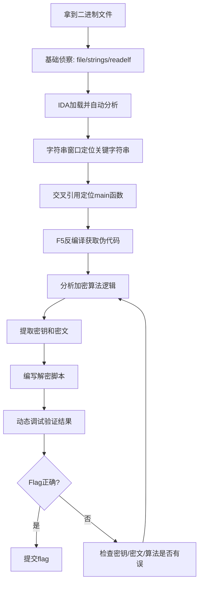

## 案例一：简单异或加密逆向

异或（XOR）加密是CTF逆向题中出现频率最高的加密算法之一，也是理解二进制逆向思维的最佳切入点。本案例将从零开始，完整走一遍"拿到二进制→静态分析→提取密文→编写解密脚本→动态验证"的标准逆向流程，让读者建立对逆向工程的完整认知框架。

### 异或加密的数学原理

异或运算（符号 `^` 或 ⊕）是计算机中最基础的位运算之一。它的定义极其简单：两个比特相同为0，不同为1。

| 输入A | 输入B | A ⊕ B |
|:-----:|:-----:|:-----:|
| 0 | 0 | 0 |
| 0 | 1 | 1 |
| 1 | 0 | 1 |
| 1 | 1 | 0 |

异或运算有三个关键性质，正是这三个性质使它成为加密的基础工具：

**性质一：自反性（对合性）**。对同一个值异或两次，结果还原为原始值：

```text
A ⊕ B ⊕ B = A
```

这意味着加密和解密使用完全相同的操作——如果 `encrypted = plain ⊕ key`，那么 `plain = encrypted ⊕ key`。这是对称加密的最简实现。

**性质二：与零的恒等**。任何值与0异或等于自身：`A ⊕ 0 = A`。这在实际逆向中常用于判断密钥位置——如果某段密文与明文相同，说明对应的密钥字节为0。

**性质三：交换律与结合律**。`A ⊕ B = B ⊕ A`，`(A ⊕ B) ⊕ C = A ⊕ (B ⊕ C)`。这意味着异或的顺序不影响结果，在分析时可以自由调整运算顺序。

这三条性质在数学上构成了一个阿贝尔群（Abelian Group），密钥空间为 {0, 1}^n。对于n比特的密钥，穷举空间为2^n，但实际中短密钥或有规律的密钥极易被攻破。

### 题目描述

程序读取用户输入，与一个固定的key进行XOR运算，然后与预设的密文比较。如果匹配则输出 `Correct!`，否则输出 `Wrong!`。

这是一个典型的CTF逆向入门题，考察的核心能力是：从二进制文件中提取加密算法和密钥，然后编写解密脚本还原flag。

从攻击者的视角看，这类程序的安全缺陷在于：密钥硬编码在二进制中，密文也静态存储在二进制中，整个"加密"过程对逆向者完全透明。

### 环境准备

在开始分析之前，需要准备以下工具环境：

| 工具 | 用途 | 获取方式 |
|:-----|:-----|:---------|
| IDA Pro 7.x+ | 静态反编译 | Hex-Rays 官网（有免费的 IDA Free） |
| Ghidra | 备选反编译器（免费开源） | ghidra-sre.org |
| GDB + pwndbg/GEF | 动态调试 | 包管理器安装 |
| Python 3.x | 编写解密脚本 | 系统自带 |
| file / strings / readelf | 基础二进制分析 | 系统自带 |

首先对目标文件做基础侦察：

```bash
# 确认文件类型
$ file ./target
./target: ELF 64-bit LSB executable, x86-64, version 1 (SYSV), dynamically linked, interpreter /lib64/ld-linux-x86-64.so.2, for GNU/Linux 3.2.0, not stripped

# 快速搜索可读字符串
$ strings ./target | grep -iE "flag|correct|wrong|enter|key|secret"
Enter flag:
Correct!
Wrong!
MySecretKey12345

# 查看段信息
$ readelf -S ./target | grep -E "\.text|\.data|\.rodata|\.bss"
```

`strings` 命令往往是逆向的第一步——很多入门级CTF题的密钥和提示字符串直接暴露在二进制中。注意这里已经能看到密钥字符串 `MySecretKey12345`，但实际做题时不要依赖 `strings` 的结果，因为出题者可能对密钥做了编码或存储在非标准位置。

### 静态分析

#### IDA Pro 反编译流程

用IDA Pro打开程序后，标准的分析流程如下：

**第一步：等待自动分析完成**。IDA加载文件后会自动进行初步分析，左下角状态栏显示 `AU: idle` 时表示分析完成。这个过程中IDA会识别函数边界、交叉引用、字符串引用等基本信息。

**第二步：定位关键字符串**。按 `Shift+F12` 打开Strings窗口，搜索 `Enter flag` 或 `Correct` 等特征字符串。双击字符串可以跳转到其在数据段中的位置，再按 `X` 键查看交叉引用（Cross-References），即可定位到使用该字符串的代码位置——通常就是main函数。

**第三步：反编译main函数**。在反汇编视图中按 `F5`（或右键选择 `Pseudocode`）调出Hex-Rays反编译器，将汇编代码转换为近似C的伪代码：

```c
int __cdecl main(int argc, const char **argv, const char **envp)
{
    char input[32];     // [rsp+10h] [rbp-30h] —— 用户输入缓冲区
    char encrypted[32]; // [rsp+30h] [rbp-10h] —— 加密结果缓冲区

    printf("Enter flag: ");
    scanf("%31s", input);        // 最多读31个字符，防止溢出

    encrypt(input, encrypted, 32);  // 对输入进行加密

    if (memcmp(encrypted, expected, 32) == 0) {  // 与预设密文比较
        puts("Correct!");
    } else {
        puts("Wrong!");
    }
    return 0;
}
```

**第四步：分析encrypt函数**。双击 `encrypt` 函数名跳转到其实现：

```c
void __fastcall encrypt(const char *input, char *output, int len)
{
    const char key[] = "MySecretKey12345";
    for (int i = 0; i < len; i++) {
        output[i] = input[i] ^ key[i % 16];  // 每个字节与密钥对应字节异或
    }
}
```

这里的加密逻辑一目了然：使用16字节的循环密钥 `"MySecretKey12345"` 对输入逐字节异或。密钥长度为16字节，通过 `i % 16` 实现循环使用。

#### 反编译结果的可靠性

需要注意，IDA的F5反编译并非100%准确。常见的陷阱包括：

- **变量类型误判**：IDA可能将 `char` 识别为 `int`，或将有符号数识别为无符号数。需要结合汇编指令（如 `movsx` vs `movzx`）验证。
- **调用约定错误**：`__cdecl`、`__fastcall`、`__stdcall` 的参数传递方式不同，如果IDA误判调用约定，参数顺序可能错乱。
- **栈变量布局偏差**：IDA显示的局部变量偏移 `[rbp-XXh]` 可能与实际栈布局不完全一致，尤其是在有栈对齐或编译器优化的情况下。

在本案例中，反编译结果是可信的，因为程序逻辑简单且未做任何混淆。但对于更复杂的程序，始终建议切换到汇编视图（按 `Tab` 键）进行交叉验证。

#### IDAPython 提取密文

反编译代码中的 `expected` 是一个符号引用，我们需要从二进制中提取它的实际内容。使用IDAPython是最便捷的方式：

```python
# IDAPython脚本：提取expected数组的32字节密文
# 在IDA中按 Alt+F9 打开脚本窗口执行

import idc

# 方法一：通过符号名定位（如果符号存在）
addr = idc.get_name_ea_simple("expected")
if addr != idc.BADADDR:
    print(f"expected @ 0x{addr:X}")
    data = bytes([idc.get_wide_byte(addr + i) for i in range(32)])
    print(f"密文(hex): {data.hex()}")
    print(f"密文(raw): {data}")

# 方法二：通过地址直接读取（如果已知地址，如 0x404020）
# 这种方式在stripped二进制或符号被strip时更常用
addr = 0x404020
data = bytes([idc.get_wide_byte(addr + i) for i in range(32)])
print(f"密文(hex): {data.hex()}")

# 方法三：从encrypt函数中追踪引用
# 1. 在反编译窗口中右键expected -> Jump to xref
# 2. 或使用以下脚本自动追踪
import idautils
for ref in idautils.XrefsTo(addr):
    print(f"引用自: 0x{ref.frm:X}, 类型: {ref.type}")
```

实际操作中，更常见的方法是：

1. 在IDA反编译窗口中双击 `expected`，跳转到其定义位置
2. 在数据视图中查看对应的十六进制字节
3. 右键选择 `Array` 可以将其显示为数组形式，方便复制

提取到的密文示例（假设值）：

```text
密文(hex): 0a1b2c3d4e5f60718293a4b5c6d7e8f9
```

#### 密钥分析

在本案例中密钥直接以明文形式出现在 `.rodata` 段中，但在实际的恶意软件或CTF题中，密钥的存储方式可能更加隐蔽：

- **散落在代码中**：密钥字节作为立即数出现在 `mov` 指令中，如 `mov byte ptr [rax], 0x4D`（'M'的ASCII码）
- **通过计算生成**：密钥由某个种子值经运算得到，如 `key[i] = (i * 37 + 13) & 0xFF`
- **存储在非标准段**：密钥可能放在 `.init_array`、TLS回调或其他不常见的段中
- **运行时解密**：密钥本身也是加密存储的，需要先解密密钥再解密数据

对于本案例这种简单情况，密钥长度（16字节）和内容都已知，可以直接进入解密阶段。

### 解密原理与脚本

#### 解密原理

由于XOR的自反性，解密操作与加密完全相同：

```text
明文[i] = 密文[i] ⊕ 密钥[i % 密钥长度]
```

用Python实现：

```python
#!/usr/bin/env python3
"""
XOR解密脚本 —— 案例一：简单异或加密逆向
用法: python3 xor_decrypt.py
"""

key = b"MySecretKey12345"
# 从IDA中提取的密文（替换为实际值）
encrypted = bytes.fromhex("0a1b2c3d4e5f60718293a4b5c6d7e8f9")

def xor_decrypt(data: bytes, key: bytes) -> bytes:
    """逐字节XOR解密"""
    return bytes([data[i] ^ key[i % len(key)] for i in range(len(data))])

flag = xor_decrypt(encrypted, key)
print(f"Flag: {flag.decode('ascii', errors='replace')}")

# 验证：加密flag应该得到原始密文
assert xor_decrypt(flag, key) == encrypted, "验证失败：解密结果不可逆"
print("验证通过：解密结果可正确还原为密文")
```

#### 处理密钥未知的情况

在CTF竞赛中，更常见的情况是密钥未知，但已知部分明文（known-plaintext attack）。如果知道flag的格式（如 `flag{...}`），可以用已知明文反推密钥：

```python
#!/usr/bin/env python3
"""
已知明文攻击：通过flag前缀反推密钥
CTF中flag通常以 flag{ 或 CTF{ 开头
"""

encrypted = bytes.fromhex("0a1b2c3d4e5f60718293a4b5c6d7e8f9")
known_prefix = b"flag{"  # 已知的明文前缀

# 反推密钥前5个字节
partial_key = bytes([encrypted[i] ^ known_prefix[i] for i in range(len(known_prefix))])
print(f"部分密钥(hex): {partial_key.hex()}")
print(f"部分密钥(ascii): {partial_key}")

# 如果密钥是可打印ASCII，且长度已知为16，可以尝试猜测剩余部分
# 如果密钥是循环使用的，partial_key的前缀也会循环
# 例如，如果密钥实际长度为5，则 partial_key 就是完整密钥
```

如果密钥长度未知，可以尝试多种可能的密钥长度，通过统计分析判断哪个长度最合理：

```python
#!/usr/bin/env python3
"""
密钥长度探测：基于重合指数（Index of Coincidence）
对于英文文本，IC值约为0.065；随机数据约为0.038
"""

from collections import Counter

def calc_ic(data: bytes) -> float:
    """计算重合指数"""
    n = len(data)
    if n <= 1:
        return 0.0
    freq = Counter(data)
    return sum(f * (f - 1) for f in freq.values()) / (n * (n - 1))

encrypted = bytes.fromhex("0a1b2c3d4e5f60718293a4b5c6d7e8f9")

print("密钥长度 | 重合指数 | 判断")
print("-" * 40)
for key_len in range(1, 21):
    # 按假设的密钥长度分组
    groups = [encrypted[i::key_len] for i in range(key_len)]
    avg_ic = sum(calc_ic(g) for g in groups) / key_len
    verdict = "★ 可能" if avg_ic > 0.05 else ""
    print(f"  {key_len:2d}     | {avg_ic:.4f}   | {verdict}")
```

IC值明显偏高的密钥长度最可能是正确长度。这个方法在密钥较长且密文量足够时特别有效。

### 动态调试验证

静态分析得到的结果需要通过动态调试来验证。使用GDB配合pwndbg/GEF插件，可以在运行时观察内存中的实际数据。

#### 基本调试流程

```bash
# 启动调试
$ gdb ./target
```

在GDB中设置断点并运行：

```text
# 在main函数入口设断点
(gdb) b main
(gdb) run

# 单步执行到encrypt调用之后
# 可以先用 disass main 查看汇编，找到encrypt调用后的地址
(gdb) disass main
# 假设encrypt调用返回在 main+120 处
(gdb) b *main+120
(gdb) continue

# 输入测试flag
# Enter flag: AAAABBBBCCCCDDDD

# 停在断点后，查看各内存区域
(gdb) x/s input          # 查看用户输入（如果符号存在）
(gdb) x/32bx &input      # 以十六进制查看input数组
(gdb) x/32bx &encrypted  # 查看加密结果
(gdb) x/32bx 0x404020    # 查看expected密文（地址从IDA获取）
```

#### 使用pwndbg增强调试

如果安装了pwndbg，调试体验会大幅提升：

```bash
# pwndbg提供了更友好的内存显示
pwndbg> telescope $rsp 32     # 查看栈上的局部变量
pwndbg> hexdump $rsp 0x40     # 十六进制转储栈内容
pwndbg> search -s "MySecret"  # 在内存中搜索密钥字符串
```

#### 自动化调试脚本

对于反复调试的场景，可以编写GDB脚本自动化流程：

```python
#!/usr/bin/env python3
"""
GDB Python脚本：自动化提取密文和验证解密
保存为 gdb_extract.py，用法: gdb -x gdb_extract.py ./target
"""

import gdb

class XORExtractor(gdb.Command):
    """自动提取XOR密文并解密"""

    def __init__(self):
        super().__init__("xor-extract", gdb.COMMAND_USER)

    def invoke(self, arg, from_tty):
        # 设置断点
        gdb.execute("b main")
        gdb.execute("run")

        # 运行到encrypt之后（需要根据实际偏移调整）
        # 先获取encrypt调用后的返回地址
        gdb.execute("b *main+120")  # 偏移需要根据实际二进制调整
        gdb.execute("continue")

        # 输入测试数据
        test_input = b"A" * 32
        gdb.execute(f"call (void)printf(\"\\n\")")  # 确保stdin就绪

        # 读取expected数组
        expected_addr = 0x404020  # 从IDA获取
        result = gdb.execute(f"x/32bx {expected_addr}", to_string=True)
        encrypted = self.parse_hex_output(result)

        # 读取密钥
        key = b"MySecretKey12345"

        # 解密
        flag = bytes([encrypted[i] ^ key[i % len(key)] for i in range(32)])
        print(f"\n[*] 密文: {encrypted.hex()}")
        print(f"[*] 密钥: {key.decode()}")
        print(f"[*] Flag: {flag.decode('ascii', errors='replace')}")

    def parse_hex_output(self, output):
        """解析GDB的x/Nbx输出"""
        hex_str = output.replace("\t", " ").replace("\n", " ")
        bytes_list = []
        for token in hex_str.split():
            if all(c in "0123456789abcdef" for c in token.lower()) and len(token) == 2:
                bytes_list.append(int(token, 16))
        return bytes(bytes_list)

XORExtractor()
```

#### 另一种思路：Hook memcmp

对于本案例这种"加密后与密文比较"的模式，有一个更巧妙的方法——直接Hook `memcmp` 函数，在比较时观察两个参数的值：

```bash
# 用ltrace跟踪库函数调用
$ ltrace ./target
Enter flag: testflag123
__libc_start_main(...)
printf("Enter flag: ")
scanf("%31s", "testflag123")
memcmp("encrypted_input...", "expected_ciphertext...", 32) = -1
puts("Wrong!")
+++ exited (status 0) +++
```

`ltrace` 会直接显示 `memcmp` 的两个参数——第一个是加密后的用户输入，第二个就是程序中存储的期望密文。这个方法在面对更复杂的加密逻辑时特别有用，因为不需要理解加密算法本身，只需在比较点截获数据即可。

### 逆向思维总结

通过这个简单案例，我们走完了一次完整的逆向分析流程：



这个流程不仅适用于XOR加密，对于任何CTF逆向题都是通用的分析框架。区别只在于步骤G（分析加密算法）的复杂程度不同。

### 常见变体与扩展

实际CTF中的XOR题目不会像本案例这样直白。以下是常见的变体形式，读者需要掌握识别和应对方法：

#### 变体一：多层XOR

加密过程执行多轮XOR，每轮使用不同的密钥：

```c
// 两层XOR加密
void encrypt(char *data, int len) {
    char key1[] = "FirstKey";
    char key2[] = "SecondKey";
    for (int i = 0; i < len; i++) {
        data[i] ^= key1[i % 8];
        data[i] ^= key2[i % 9];
    }
}
```

解密时需要按相反顺序（或正序，因为XOR满足交换律）依次用两个密钥解密。注意这里两个不同长度的密钥组合后等效密钥长度为 `lcm(8, 9) = 72`。

#### 变体二：滚动密钥（自生成密钥）

密钥在加密过程中动态变化，当前字节的密钥依赖于之前的结果：

```c
void encrypt(char *data, int len) {
    char prev = 0x5A;  // 初始种子
    for (int i = 0; i < len; i++) {
        data[i] ^= prev;
        prev = data[i];  // 用加密结果作为下一个密钥
    }
}
```

这种变体无法并行解密，必须从第一个字节开始顺序解密：

```python
def rolling_xor_decrypt(data, seed):
    result = []
    prev = seed
    for byte in data:
        result.append(byte ^ prev)
        prev = byte  # 密文的当前字节（即下一个密钥）
    return bytes(result)
```

#### 变体三：密钥经过变换

密钥不是直接使用，而是经过某种变换（如移位、置换、查表）后才参与XOR：

```c
void encrypt(char *data, int len) {
    char raw_key[] = "HiddenKey";
    char transformed[9];
    for (int i = 0; i < 9; i++) {
        transformed[i] = ((raw_key[i] << 3) | (raw_key[i] >> 5)) & 0xFF;  // 循环左移3位
    }
    for (int i = 0; i < len; i++) {
        data[i] ^= transformed[i % 9];
    }
}
```

逆向时需要正确识别变换逻辑，编写对应的逆变换脚本。

#### 变体四：XOR与其他操作混合

加密过程中XOR只是其中一步，还混合了加法、置换等操作：

```c
void encrypt(char *data, int len) {
    char key[] = "MixedKey";
    for (int i = 0; i < len; i++) {
        data[i] ^= key[i % 8];      // 步骤1: XOR
        data[i] = (data[i] + 7) & 0xFF;  // 步骤2: 加法mod 256
        data[i] ^= (i & 0xFF);      // 步骤3: 与索引XOR
    }
}
```

解密时需要反向执行每一步的逆操作（从后往前，加法的逆是减法，XOR的逆是XOR自身）：

```python
def mixed_decrypt(data, key):
    result = bytearray(data)
    for i in range(len(result)):
        # 逆步骤3
        result[i] ^= (i & 0xFF)
        # 逆步骤2
        result[i] = (result[i] - 7) & 0xFF
        # 逆步骤1
        result[i] ^= key[i % len(key)]
    return bytes(result)
```

### 实战技巧速查表

| 场景 | 方法 | 工具 |
|:-----|:-----|:-----|
| 快速确认是否存在XOR | 搜索 `XOR` / `^` 指令 | IDA: `Alt+B` 搜索 `31`（XOR机器码前缀） |
| 提取.data/.rodata中的密文 | IDAPython脚本读取字节 | `idc.get_wide_byte(addr)` |
| 密钥未知但知道flag格式 | 已知明文攻击 | `key[i] = enc[i] ^ known[i]` |
| 密钥长度未知 | 重合指数分析 | 按不同长度分组计算IC值 |
| 验证解密结果 | 动态调试 + ltrace | GDB/pwndbg + ltrace |
| 加密算法复杂看不懂 | 黑盒测试：Hook比较点 | ltrace / Frida |
| 程序有反调试 | 绕过ptrace检测 | patch掉ptrace调用 / LD_PRELOAD |
| 密文在运行时才解密 | 动态dump内存 | GDB `dump binary memory` |

### 从本案例到实际应用

XOR加密虽然在CTF中以教学形式出现，但它在真实世界中有广泛的应用：

**恶意软件中的XOR编码**。绝大多数恶意软件使用XOR来混淆字符串和通信数据，因为XOR运算速度极快、代码体积小、且在几乎所有CPU架构上都有原生支持。逆向工程师在分析恶意样本时，最常遇到的就是各种XOR编码——从简单的单字节XOR到复杂的多层XOR流密码。

**固件逆向中的XOR**。嵌入式设备的固件经常使用XOR来"加密"配置数据或保护启动加载程序。虽然这不是真正的安全加密，但足以阻止普通的固件提取工具直接读取明文数据。

**协议逆向中的XOR**。某些自定义网络协议使用XOR作为简单的混淆手段。Wireshark解码器插件中，XOR解码是最常见的自定义解码需求之一。

理解XOR加密的逆向方法，不仅是为了应对CTF题目，更是掌握二进制分析思维的基础。后续章节中更复杂的加密算法（AES、RSA等）的逆向分析，都建立在本案例所展示的"提取算法→提取参数→编写逆运算"这一核心方法论之上。

### 练习建议

1. **手动完成一次**：不要直接复制脚本，手动从IDA中提取密文并编写解密代码，理解每一步的含义
2. **尝试修改题目**：用C语言编写本案例的程序，编译后自己逆向自己，验证结果的正确性
3. **挑战变体**：搜索CTF平台上（如CTFHub、BUUCTF、攻防世界）的XOR逆向题，从简单到困难逐一挑战
4. **自动化工具**：尝试编写一个通用的XOR解密工具，输入密文和部分已知明文，自动输出可能的密钥和解密结果

```bash
# 推荐的练习平台
# - BUUCTF: buuoj.cn（中文，题目丰富）
# - CTFHub: ctfhub.com（中文，分类清晰）
# - reversing.kr: reversing.kr（英文，经典逆向题）
# - crackmes.one: crackmes.one（英文，真实软件逆向挑战）
```

***

> **下一节**：[案例二：自定义编码算法逆向](02-案例二自定义编码算法逆向.md) —— 当加密算法不是标准的XOR，而是出题者自行设计的编码方案时，如何分析和破解。
