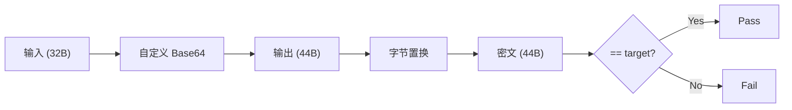

## 案例二：自定义编码算法逆向

在 CTF 逆向工程和实际软件分析中，自定义编码算法是最常见的保护手段之一。开发者通过修改标准编码（如 Base64、Base32）的字母表、增加额外变换层（置换、异或、移位）来隐藏明文。本案例完整演示一个"自定义 Base64 + 字节置换"双层编码的逆向过程，从反汇编识别到编写自动化解密脚本。

---

### 理论基础：编码与加密的本质区别

在逆向之前，必须厘清一个关键概念：**编码不是加密**。

| 维度 | 编码（Encoding） | 加密（Encryption） |
|------|-----------------|-------------------|
| 目的 | 格式转换，确保数据在特定介质中可传输 | 保护机密性，阻止未授权访问 |
| 密钥 | 无密钥（算法公开即可解码） | 必须有密钥 |
| 可逆性 | 无条件可逆（知道算法即可） | 不知道密钥理论上不可逆 |
| 典型算法 | Base64、URL Encoding、Hex | AES、RSA、ChaCha20 |
| 逆向难度 | 低-中（找到参数即可） | 高（需要密钥或密码分析） |

自定义编码算法的核心思路：**用编码的皮，做加密的事**。看起来像编码（无密钥、可逆），但通过引入"非标准参数"（自定义字母表、额外置换）来增加逆向成本。

理解这一点，逆向策略就很清晰：**提取所有非标准参数，然后用标准流程解码**。

---

### 题目描述

目标程序对用户输入执行以下流程：

1. 输入长度必须恰好为 32 字节
2. 使用自定义字母表进行 Base64 编码（输出 44 字节，含 padding）
3. 对编码结果的每个字节，通过一个 256 字节的置换表做映射
4. 最终结果与硬编码的目标值逐字节比较



---

### 反编译结果与逐行解析

使用 IDA Pro / Ghidra 反编译后，核心函数如下：

```c
int check_flag(const char *input)
{
    char encoded[64];
    char result[64];
    int len;
    
    len = strlen(input);
    if (len != 32) return 0;  // 长度校验：必须32字节
    
    // 第一步：自定义 Base64 编码
    custom_base64(input, len, encoded);
    
    // 第二步：字节置换
    for (int i = 0; i < 64; i++) {
        result[i] = permute_table[(unsigned char)encoded[i]];
    }
    
    // 第三步：与硬编码目标值比较
    return memcmp(result, target, 64) == 0;
}
```

#### 如何识别 Base64 编码

即使 `custom_base64` 函数被混淆，以下特征几乎不会改变：

1. **分组循环**：每 3 字节输入产生 4 字节输出，循环体中必然出现 `input[i]`、`input[i+1]`、`input[i+2]`
2. **位操作模式**：典型的 Base64 位操作包括：
   - 第一个输出字节：`(input[0] >> 2) & 0x3F`
   - 第二个输出字节：`((input[0] & 0x03) << 4) | (input[1] >> 4)`
   - 第三个输出字节：`((input[1] & 0x0F) << 2) | (input[2] >> 6)`
   - 第四个输出字节：`input[2] & 0x3F`
3. **字母表查找**：编码结果作为索引去一个字符串（字母表）中查字符
4. **Padding**：当输入长度不是 3 的倍数时，追加 `=` 字符

在 IDA 中搜索字符串，如果看到一个 64 字节的字符串以字母开头、以 `+/` 或 `-_` 结尾，基本可以确认是 Base64 字母表。

```c
// 自定义 Base64 字母表：与标准表对比可以看出是逆序字母
const char custom_alphabet[] = 
    "ZYXWVUTSRQPONMLKJIHGFEDCBA"   // A-Z 逆序
    "zyxwvutsrqponmlkjihgfedcba"   // a-z 逆序
    "9876543210"                     // 0-9 逆序
    "+/";                            // 标准尾部不变

// 标准 Base64 字母表（用于对比）
// "ABCDEFGHIJKLMNOPQRSTUVWXYZabcdefghijklmnopqrstuvwxyz0123456789+/"
```

#### 自定义 Base64 完整实现

题目中省略了 `custom_base64` 的实现，但既然字母表已知，其内部逻辑必然如下：

```c
void custom_base64(const char *input, int len, char *output)
{
    int i, j = 0;
    unsigned char a, b, c;
    
    for (i = 0; i < len; i += 3) {
        a = input[i];
        b = (i + 1 < len) ? input[i + 1] : 0;
        c = (i + 2 < len) ? input[i + 2] : 0;
        
        output[j++] = custom_alphabet[(a >> 2) & 0x3F];
        output[j++] = custom_alphabet[((a & 0x03) << 4) | ((b >> 4) & 0x0F)];
        
        if (i + 1 < len)
            output[j++] = custom_alphabet[((b & 0x0F) << 2) | ((c >> 6) & 0x03)];
        else
            output[j++] = '=';
            
        if (i + 2 < len)
            output[j++] = custom_alphabet[c & 0x3F];
        else
            output[j++] = '=';
    }
    output[j] = '\0';
}
```

> 关键点：除了字母表不同，其余逻辑与标准 Base64 完全一致。这意味着我们只需要做字母表替换，就能用标准 `base64` 库解码。

---

### 逆向分析步骤详解

#### 第一步：识别编码算法

在 IDA 中定位 `check_flag` 函数后，观察到以下模式：

```text
.text:00401234  shr al, 2          ; 右移2位 → Base64特征
.text:00401237  and eax, 3Fh       ; 取6位 → Base64特征
.text:0040123A  movzx eax, byte ptr [custom_alphabet + eax]  ; 字母表查表
```

连续出现的 `shr 2`、`and 3Fh`、`shl 4`、`shl 2` 操作是 Base64 编码的标志性位操作。结合后续的字母表查表操作，可以确定这是 Base64 的变种。

#### 第二步：提取自定义字母表

在 IDA 中按 `Shift+F12` 打开 Strings 窗口，搜索长度为 64 的字符串。找到 `custom_alphabet` 后，记录其完整内容。

也可以在 GDB 中动态提取：

```bash
# 假设 custom_alphabet 在地址 0x402000
gdb ./challenge -ex "x/s 0x402000" -ex "quit"
```

#### 第三步：分析置换表

`permute_table` 是一个 256 字节的数组，实现了一一映射（双射/置换）。每个输入字节值 0-255 对应一个唯一的输出值。

提取方法：

```bash
# 在 GDB 中导出 256 字节的置换表
gdb ./challenge \
  -ex "set pagination off" \
  -ex "dump binary memory permute.bin 0x402100 0x402200" \
  -ex "quit"

# 用 Python 读取
python3 -c "
data = open('permute.bin','rb').read()
print('permute_table =', list(data))
"
```

验证置换表是否为双射（每个值恰好出现一次）：

```python
table = [...]  # 提取的256字节
assert len(set(table)) == 256, "置换表不是双射，分析可能有误"
```

#### 第四步：提取目标值

```bash
# 假设 target 数组在地址 0x402200，长度64字节
gdb ./challenge \
  -ex "set pagination off" \
  -ex "dump binary memory target.bin 0x402200 0x402240" \
  -ex "quit"

python3 -c "
data = open('target.bin','rb').read()
print('target =', list(data))
"
```

---

### 完整解密脚本

以下是完整的、可直接运行的解密脚本，包含详细的注释和验证逻辑：

```python
#!/usr/bin/env python3
"""
自定义编码算法逆向解密脚本
功能：逆向 [自定义Base64 + 字节置换] 双层编码
"""

import base64
import sys

# ============================================================
# 第一部分：参数提取（从IDA/GDB中获取）
# ============================================================

# 自定义 Base64 字母表（从数据段提取）
# 注意：必须与二进制中的完全一致，包括大小写、数字顺序
CUSTOM_ALPHABET = (
    "ZYXWVUTSRQPONMLKJIHGFEDCBA"
    "zyxwvutsrqponmlkjihgfedcba"
    "9876543210"
    "+/"
)

# 标准 Base64 字母表
STD_ALPHABET = (
    "ABCDEFGHIJKLMNOPQRSTUVWXYZ"
    "abcdefghijklmnopqrstuvwxyz"
    "0123456789"
    "+/"
)

# 置换表：256字节，从二进制文件中提取
# 每个索引 i 处的值表示：输入字节 i 会被映射为 permute_table[i]
PERMUTE_TABLE = [
    0x52, 0x09, 0x6A, 0xD5, 0x30, 0x36, 0xA5, 0x38,
    0xBF, 0x40, 0xA3, 0x9E, 0x81, 0xF3, 0xD7, 0xFB,
    # ... 此处省略，实际使用时从二进制文件中提取完整256字节
    # 用 GDB 的 dump binary memory 命令提取后填入
]

# 目标密文：64字节，从数据段提取
TARGET = [
    0x35, 0x1A, 0x7B, 0x44, 0x2E, 0x61, 0x5F, 0x39,
    # ... 此处省略，实际使用时从二进制文件中提取完整64字节
]

# ============================================================
# 第二部分：验证参数正确性
# ============================================================

def validate_params():
    """验证提取的参数是否正确"""
    errors = []
    
    # 验证自定义字母表长度
    if len(CUSTOM_ALPHABET) != 64:
        errors.append(f"自定义字母表长度错误: {len(CUSTOM_ALPHABET)}, 期望 64")
    
    # 验证自定义字母表无重复字符
    if len(set(CUSTOM_ALPHABET)) != 64:
        duplicates = [c for c in CUSTOM_ALPHABET if CUSTOM_ALPHABET.count(c) > 1]
        errors.append(f"自定义字母表有重复字符: {set(duplicates)}")
    
    # 验证置换表是否为双射
    if len(PERMUTE_TABLE) != 256:
        errors.append(f"置换表长度错误: {len(PERMUTE_TABLE)}, 期望 256")
    elif len(set(PERMUTE_TABLE)) != 256:
        errors.append("置换表不是双射（存在重复值），提取可能有误")
    
    # 验证目标值长度
    if len(TARGET) != 64:
        errors.append(f"目标值长度错误: {len(TARGET)}, 期望 64")
    
    if errors:
        print("[!] 参数验证失败:")
        for e in errors:
            print(f"    - {e}")
        return False
    
    print("[+] 参数验证通过")
    return True


# ============================================================
# 第三部分：构建逆置换表
# ============================================================

def build_inverse_permute(table):
    """
    构建置换表的逆表。
    正向: result[i] = table[encoded[i]]
    逆向: encoded[i] = inverse_table[result[i]]
    
    即 inverse_table[v] = index of v in table
    """
    inverse = [0] * 256
    for i, v in enumerate(table):
        inverse[v] = i
    return inverse


# ============================================================
# 第四部分：解密流程
# ============================================================

def decrypt():
    """执行完整的解密流程"""
    
    print("[*] 开始解密...")
    print(f"[*] 目标密文长度: {len(TARGET)} 字节")
    
    # 步骤1：逆置换
    # 正向: result[i] = permute_table[encoded[i]]
    # 逆向: encoded[i] = inverse_permute[result[i]]
    print("[*] 步骤1: 逆置换...")
    inverse_permute = build_inverse_permute(PERMUTE_TABLE)
    
    encoded = []
    for i in range(64):
        encoded.append(inverse_permute[TARGET[i]])
    
    print(f"    逆置换结果 (hex): {''.join(f'{b:02x}' for b in encoded)}")
    
    # 步骤2：逆自定义 Base64
    # 思路：将自定义字母表映射到标准字母表，然后用标准 base64 解码
    print("[*] 步骤2: 逆自定义 Base64...")
    
    # 将字节值转换为字符
    encoded_chars = []
    for b in encoded:
        encoded_chars.append(chr(b))
    encoded_str = ''.join(encoded_chars)
    
    # 构建字符映射表：custom[i] -> std[i]
    # 这样 "Z" -> "A", "Y" -> "B", ... 等等
    trans_table = str.maketrans(CUSTOM_ALPHABET, STD_ALPHABET)
    standard_b64 = encoded_str.translate(trans_table)
    
    print(f"    自定义编码结果: {encoded_str}")
    print(f"    标准Base64结果: {standard_b64}")
    
    # 用标准 base64 解码
    try:
        flag = base64.b64decode(standard_b64)
    except Exception as e:
        print(f"[!] Base64 解码失败: {e}")
        print("[!] 请检查自定义字母表是否提取正确")
        return None
    
    # 步骤3：验证结果
    print("[*] 步骤3: 验证结果...")
    
    # 检查是否为可打印 ASCII
    try:
        flag_str = flag.decode('ascii')
        if all(32 <= ord(c) <= 126 for c in flag_str):
            print(f"[+] Flag 全部为可打印 ASCII 字符")
        else:
            print(f"[!] Flag 包含非 ASCII 可打印字符，可能有误")
    except UnicodeDecodeError:
        print(f"[!] Flag 包含非 ASCII 字节，可能有误")
    
    print(f"\n{'='*50}")
    print(f"[+] FLAG: {flag.decode('ascii', errors='replace')}")
    print(f"{'='*50}")
    
    return flag


# ============================================================
# 第五部分：正向验证（可选，用于确认解密结果正确）
# ============================================================

def verify(flag_bytes):
    """
    正向执行编码流程，验证结果是否与目标值一致。
    这相当于模拟程序的 check_flag 函数。
    """
    import struct
    
    flag_str = flag_bytes.decode('ascii') if isinstance(flag_bytes, bytes) else flag_bytes
    
    # 步骤A：自定义 Base64 编码
    # 先用标准 Base64 编码，再做字母表替换
    std_b64 = base64.b64encode(flag_str.encode('ascii')).decode('ascii')
    
    # 标准 -> 自定义 字母表替换
    trans_table = str.maketrans(STD_ALPHABET, CUSTOM_ALPHABET)
    custom_b64 = std_b64.translate(trans_table)
    
    # 步骤B：字节置换
    result = []
    for c in custom_b64:
        result.append(PERMUTE_TABLE[ord(c)])
    
    # 步骤C：与目标比较
    match = (result == TARGET)
    print(f"\n[*] 正向验证: {'通过 ✓' if match else '失败 ✗'}")
    return match


# ============================================================
# 主函数
# ============================================================

if __name__ == '__main__':
    if not validate_params():
        sys.exit(1)
    
    flag = decrypt()
    
    if flag:
        print("\n[*] 执行正向验证...")
        verify(flag)
```

---

### 逆向过程中的常见陷阱

#### 陷阱一：字母表提取不完整

很多初学者在 IDA 中看到字母表字符串时，只复制了可见字符，忽略了可能的尾部字符。特别是当字母表包含 `+` 和 `/` 时，IDA 的字符串显示可能会截断。

**正确做法**：用 Hex View 确认完整的 64 字节，不要依赖字符串显示。

```python
# 在 IDA Python 控制台中提取完整字母表
import ida_bytes
addr = idc.get_name_ea_simple("custom_alphabet")
alphabet = ida_bytes.get_strlit_contents(addr, 64, 0)
print(repr(alphabet))
```

#### 陷阱二：忽略 padding 字节

Base64 编码的输出长度是 4 的倍数。32 字节输入 → `ceil(32/3)*4 = 44` 字节。但程序中的 `encoded` 和 `target` 数组都声明为 64 字节，实际只用了 44 字节，剩余 20 字节可能是未初始化的栈数据。

**正确做法**：只比较前 44 字节，或者确认剩余字节是否也被置换表映射后参与比较。

#### 陷阱三：置换表的正向/逆向搞混

这是最常见的错误。程序中的置换是正向的：

```text
result[i] = permute_table[encoded[i]]  # 正向
```

解密时需要逆向：

```text
encoded[i] = inverse_permute[result[i]]  # 逆向
```

而不是 `encoded[i] = permute_table[result[i]]`。逆置换表的构建方式是：

```python
inverse = [0] * 256
for i, v in enumerate(permute_table):
    inverse[v] = i  # v 被映射到 i，所以逆映射中 v 的原像是 i
```

#### 陷阱四：字节序和符号问题

C 语言中 `char` 可能是有符号的（范围 -128 到 127），用作数组索引时需要强制转为 `unsigned char`：

```c
result[i] = permute_table[(unsigned char)encoded[i]];  // 正确
result[i] = permute_table[encoded[i]];                  // 可能越界！
```

在 Python 中不会有这个问题（字符用 `ord()` 转换后就是 0-255），但如果用 C/C++ 编写解密脚本，必须注意。

#### 陷阱五：自定义字母表只有部分修改

有些程序不只改字母表顺序，还可能：

- 将 `+/` 替换为 `-_`（URL-safe Base64 变体）
- 将 padding 字符 `=` 替换为其他字符
- 删除 padding（变长输出）

遇到这类情况，解密脚本也需要做对应调整：

```python
# URL-safe 变体
CUSTOM_ALPHABET = "ABCDEFGHIJKLMNOPQRSTUVWXYZabcdefghijklmnopqrstuvwxyz0123456789-_"

# 无 padding 变体
encoded_str = encoded_str.rstrip('=')  # 去掉padding再解码
# 需要手动补齐
padding_needed = (4 - len(encoded_str) % 4) % 4
encoded_str += '=' * padding_needed
```

---

### 扩展：变体编码算法的识别与逆向

实际逆向中遇到的编码算法远不止"改字母表"这么简单。以下是常见的变体及其识别特征：

#### 变体一：多轮编码

```text
输入 → Base64 → Base64 → Base64 → 输出
```

识别特征：`check_flag` 函数中多次调用编码函数，或者编码函数内部递归调用自身。

**逆向方法**：逐层解码，每层都用同样的逆向逻辑。

```python
# 三层 Base64 解码
result = target
for _ in range(3):
    result = base64.b64decode(result)
```

#### 变体二：混合编码

```text
输入 → Base64 → Hex 编码 → 自定义替换 → 输出
```

识别特征：编码函数中出现多种不同的位操作模式，或者查找多个不同的表。

**逆向方法**：识别每层编码类型，按逆序逐层解码。

#### 变体三：带密钥的编码（类 RC4）

```text
输入 → XOR with key → Base64 → 输出
```

识别特征：编码过程中出现与某个变量（密钥）的异或操作。

**逆向方法**：需要额外提取密钥，然后先 XOR 解密，再 Base64 解码。

#### 变体四：查表变换链

```text
输入 → S-Box1 → S-Box2 → S-Box3 → 输出
```

识别特征：多个 256 字节的查找表串联使用。常见于自定义的类 AES 或类 DES 结构。

**逆向方法**：对每个 S-Box 构建逆表，然后反向依次应用。

```python
def build_inverse_sbox(sbox):
    inverse = [0] * 256
    for i, v in enumerate(sbox):
        inverse[v] = i
    return inverse

# 逆向变换链：逆序 + 逆表
for sbox in reversed(sbox_list):
    inverse_sbox = build_inverse_sbox(sbox)
    data = [inverse_sbox[b] for b in data]
```

---

### 工具辅助：自动化提取参数

手动从二进制文件中提取参数容易出错。以下是几种自动化方法：

#### 方法一：GDB + Python 脚本

```python
#!/usr/bin/env python3
"""
GDB 自动化提取脚本
用法: gdb -x extract_params.py ./challenge
"""
import gdb

gdb.execute("set pagination off")
gdb.execute("break check_flag")
gdb.execute("run AAAA...A")  # 32个A作为输入

# 提取自定义字母表
alphabet = gdb.execute("x/s 0x402000", to_string=True)
print(f"ALPHABET: {alphabet}")

# 提取置换表（256字节）
gdb.execute("dump binary memory permute.bin 0x402100 0x402200")

# 提取目标值（64字节）
gdb.execute("dump binary memory target.bin 0x402200 0x402240")

print("参数已导出到 permute.bin 和 target.bin")
gdb.execute("quit")
```

#### 方法二：Lief 库解析二进制

```python
import lief

binary = lief.parse("./challenge")

# 在 .rodata 段中搜索可能的字母表（64字节的字符串）
for section in binary.sections:
    if section.name == ".rodata":
        data = bytes(section.content)
        # 搜索长度为64、内容为字母数字的子串
        for i in range(len(data) - 64):
            candidate = data[i:i+64]
            if all(32 <= b < 127 for b in candidate):
                print(f"候选字母表 @ offset 0x{i:x}: {candidate.decode('ascii')}")
```

#### 方法三：Frida 动态 Hook

```javascript
// frida -l hook_encode.js -f com.example.challenge
Interceptor.attach(Module.findExportByName(null, "check_flag"), {
    onEnter: function(args) {
        console.log("[*] check_flag called");
        console.log("[*] Input: " + Memory.readUtf8String(args[0], 32));
    },
    onLeave: function(retval) {
        console.log("[*] Result: " + retval);
    }
});

// Hook custom_base64 以捕获中间结果
Interceptor.attach(Module.findExportByName(null, "custom_base64"), {
    onEnter: function(args) {
        this.input = args[0];
        this.len = args[1].toInt32();
        this.output = args[2];
    },
    onLeave: function(retval) {
        console.log("[*] Base64 output: " + Memory.readUtf8String(this.output));
    }
});
```

---

### 总结：自定义编码算法逆向清单

面对一个未知的编码保护程序，按以下清单逐项检查：

| 步骤 | 操作 | 工具 | 输出 |
|------|------|------|------|
| 1 | 定位校验函数 | IDA/Ghidra 反编译 | check_flag 函数体 |
| 2 | 识别编码类型 | 观察位操作模式 | Base64/Base32/Hex/其他 |
| 3 | 提取字母表 | Strings 窗口 / GDB | 64字节字符串 |
| 4 | 提取置换表 | GDB dump / rodata 解析 | 256字节数组 |
| 5 | 提取目标值 | GDB dump / rodata 解析 | N 字节数组 |
| 6 | 验证参数正确性 | Python 脚本 | 双射检查、长度检查 |
| 7 | 构建逆表 | Python 脚本 | 逆置换表 |
| 8 | 编写解密脚本 | Python | Flag 明文 |
| 9 | 正向验证 | 模拟编码并比较 | 确认结果正确 |

掌握了这套方法论，绝大多数"自定义编码"类的逆向题目都可以在 30 分钟内完成。核心思想始终不变：**提取非标准参数 → 构建逆变换 → 逐层解码 → 正向验证**。
