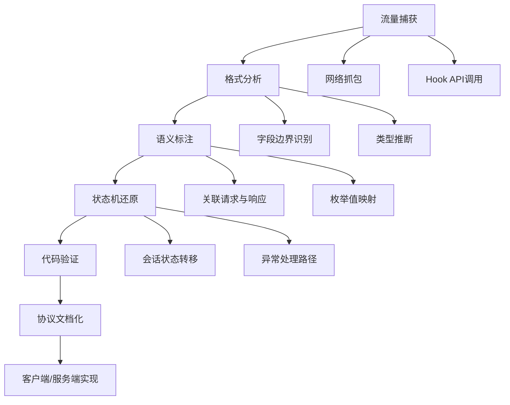
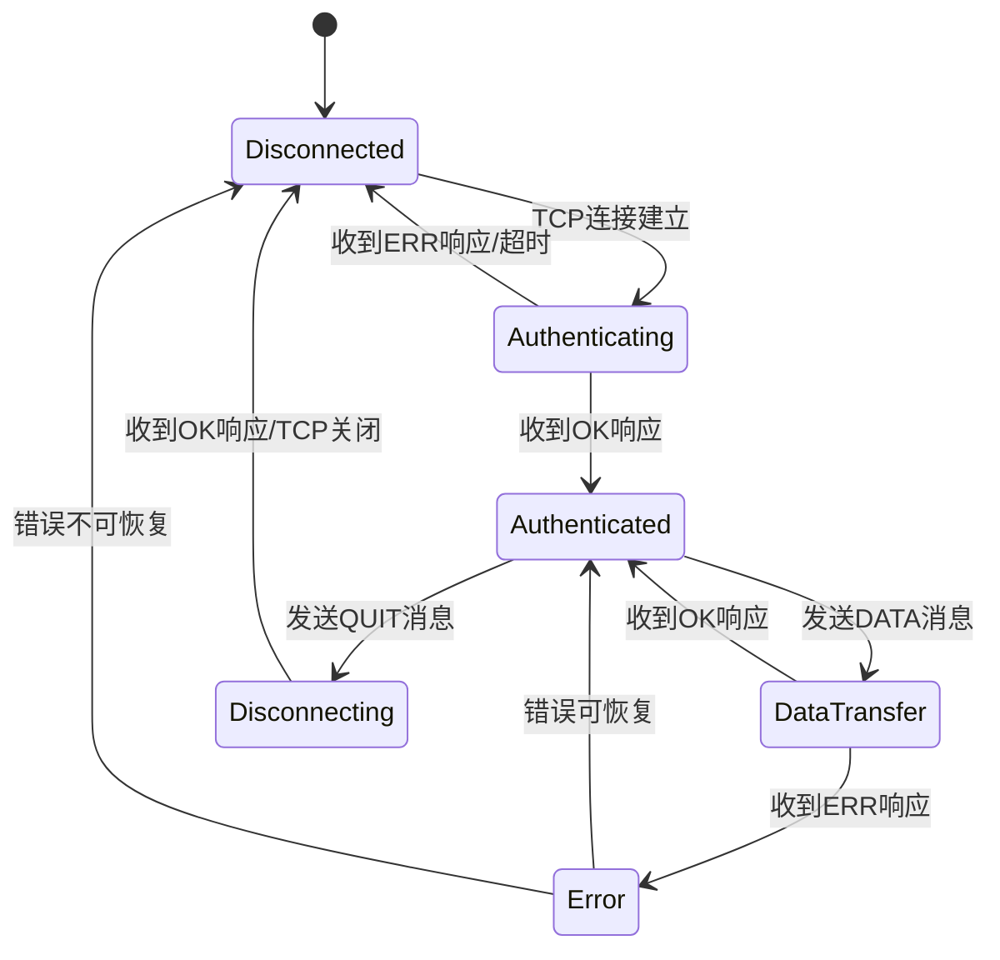

## 案例五：协议逆向 — 自定义网络协议

### 概述

协议逆向（Protocol Reverse Engineering）是指在没有协议规范文档的情况下，通过捕获网络流量、逆向分析通信双方的程序代码，还原出协议的完整格式、语义和状态机的过程。这是逆向工程中最具挑战性的方向之一，因为它同时要求分析者具备网络协议知识、二进制逆向能力和一定的密码学素养。

协议逆向的典型应用场景包括：

- **安全审计**：审查闭源客户端与服务器之间的通信是否存在明文传输敏感信息、认证绕过、重放攻击等漏洞
- **互操作性开发**：为闭源系统编写兼容的第三方客户端或服务端
- **恶意软件分析**：理解C2（Command & Control）通信协议，提取IoC指标
- **物联网安全**：分析智能设备的私有通信协议，评估安全性
- **游戏逆向**：理解游戏服务器通信逻辑，分析反作弊机制

本案例以一个自定义TCP协议为对象，完整展示从抓包到编写自定义客户端的全过程，并在此基础上扩展讨论加密协议、混淆协议等进阶场景。

### 协议逆向方法论

协议逆向不是盲目地看汇编代码，而是一个有章可循的系统化过程。业界普遍采用的方法论可分为以下阶段：



**第一阶段：流量捕获。** 获取尽可能多的通信样本。理想情况下应覆盖所有消息类型和状态转换路径。对于交互式协议，需要手动触发各种操作（登录、查询、修改、退出等）；对于自动化协议，需要长时间抓包以捕获周期性消息。

**第二阶段：格式分析。** 从原始字节流中识别字段边界——固定长度字段（如魔数、长度、类型码）通常最容易识别，变长字段需要通过长度字段或分隔符来确定边界。字节序（大端/小端）是必须首先确认的要素。

**第三阶段：语义标注。** 将每个字段与实际业务含义关联起来。例如，某个4字节字段在不同请求中取不同值，通过对比可以推断它是消息类型枚举。将请求与对应的响应关联，理解请求-响应的映射关系。

**第四阶段：状态机还原。** 协议通常不是简单的请求-响应对，而是具有状态的交互过程。例如，必须先认证才能发送业务请求，断线后需要重新握手。还原状态机需要分析多次完整会话的交互序列。

**第五阶段：代码验证。** 将流量分析的结论与二进制逆向的结果交叉验证。代码中的结构体定义、switch-case分支、字符串引用都能直接印证或修正流量分析的推断。

**第六阶段：协议文档化与实现。** 将所有发现整理为正式的协议规范文档，并据此编写兼容的客户端或服务端实现。

### 工具链全景

协议逆向需要多种工具配合使用。下表按用途分类列出核心工具：

| 用途 | 工具 | 说明 |
|------|------|------|
| 网络抓包 | Wireshark / tshark | 图形/命令行抓包，支持协议解析插件 |
| 网络抓包 | tcpdump | 轻量级命令行抓包 |
| 流量代理 | mitmproxy | HTTP/HTTPS中间人代理，支持脚本扩展 |
| 流量代理 | mitmrelay | TCP/UDP通用流量中继代理 |
| API Hook | Frida | 动态插桩，Hook send/recv/SSL_write等函数 |
| API Hook | x64dbg + ScyllaHide | Windows下调试+Hook |
| 二进制逆向 | IDA Pro / Ghidra | 静态反汇编与反编译 |
| 二进制逆向 | Binary Ninja | 现代反汇编平台，API友好 |
| 协议模糊测试 | Peach Fuzzer | 基于模型的协议模糊测试框架 |
| 协议模糊测试 | boofuzz | Python协议模糊测试库 |
| 协议建模 | ProtoSmith | 可视化协议建模工具 |
| 流量分析 | NetworkMiner | 自动提取文件、凭证等元数据 |

其中，**Frida** 在协议逆向中特别重要，因为它可以在不修改二进制文件的情况下，Hook目标程序的网络API调用（如 `send`、`recv`、`SSL_write`、`SSL_read`），在数据离开应用层但尚未加密的节点捕获明文数据。这对于分析使用TLS的应用尤为关键——Wireshark只能看到加密后的流量，而Frida可以在加密前截获数据。

Frida Hook示例（捕获send/recv调用）：

```javascript
// hook_send_recv.js - Frida脚本，捕获所有send/recv调用
Interceptor.attach(Module.findExportByName(null, 'send'), {
    onEnter: function(args) {
        this.fd = args[0].toInt32();
        this.buf = args[1];
        this.len = args[2].toInt32();
    },
    onLeave: function(retval) {
        var sent = retval.toInt32();
        if (sent > 0) {
            var data = Memory.readByteArray(this.buf, sent);
            console.log('[SEND] fd=' + this.fd + ' len=' + sent);
            console.log(hexdump(data, { offset: 0, length: sent, header: true, ansi: false }));
        }
    }
});

Interceptor.attach(Module.findExportByName(null, 'recv'), {
    onEnter: function(args) {
        this.fd = args[0].toInt32();
        this.buf = args[1];
        this.len = args[2].toInt32();
    },
    onLeave: function(retval) {
        var received = retval.toInt32();
        if (received > 0) {
            var data = Memory.readByteArray(this.buf, received);
            console.log('[RECV] fd=' + this.fd + ' len=' + received);
            console.log(hexdump(data, { offset: 0, length: received, header: true, ansi: false }));
        }
    }
});
```

使用方式：

```bash
# 附加到正在运行的进程
frida -p <PID> -l hook_send_recv.js

# 或者启动并附加
frida -f ./target_client -l hook_send_recv.js --no-pause
```

### 实战案例：完整协议逆向流程

#### 场景描述

某企业内部通信工具使用自定义TCP协议进行客户端与服务器之间的通信。我们需要分析该协议，理解其格式和交互逻辑，以便编写兼容的客户端。目标服务器监听在 `192.168.1.100:8080`。

#### 第一步：被动流量捕获

首先使用Wireshark捕获客户端正常操作产生的流量。操作过程中应覆盖所有关键动作：启动连接、登录、发送消息、接收消息、断开连接。

```bash
# 使用tcpdump捕获流量，保存为pcap文件
tcpdump -i eth0 host 192.168.1.100 and port 8080 -w protocol_capture.pcap -v

# 或使用tshark进行过滤捕获
tshark -i eth0 -f "host 192.168.1.100 and port 8080" -w protocol_capture.pcap
```

捕获到的初始握手流量如下（已转为十六进制视图）：

```text
客户端 → 服务器（连接建立后第一条消息）:
0000: 48 45 4c 4c 4f 00 00 00  0a 00 00 00 75 73 65 72  HELLO.......user
0010: 6e 61 6d 65 31                                   name1

服务器 → 客户端（握手响应）:
0000: 4f 4b 00 00 04 00 00 00  01 00 00 00              OK..........
```

从这组流量中可以做出初步推断：

- 前4字节 `48 45 4c 4c` 是ASCII字符串"HELL"，结合第5字节 `4f`（'O'），构成"HELLO"——这极有可能是一个消息类型标识（魔数），但只占4字节（`48 45 4c 4c`），第5字节 `4f` 可能属于下一个字段
- 等等，重新审视：如果魔数是4字节，那 `48 45 4c 4c` = "HELL"，后面 `4f 00 00 00` 是什么？如果是小端序的uint32，值为 `0x0000004f` = 79。这不太合理。
- 另一种解读：如果魔数就是前5字节"HELLO"，后面3字节 `00 00 00` 是填充，再后面 `0a 00 00 00` 是小端序的 `0x0000000a` = 10，恰好是 `username1`(5字节) + `\x00` 的长度……不对，`username1` 是9字节加上 `\x00` 是10字节。这里 `0a` = 10，与后续数据长度吻合。

仔细核对数据：
- `75 73 65 72 6e 61 6d 65 31` = "username1"（9字节）
- 数据总长从偏移8到末尾 = 10字节（包含末尾的 `\x00` 不可见字节……不对，hex dump只显示到0x14位置，共21字节）

重新精确计算：整个消息共21字节。前4字节是魔数 `48 45 4c 4c`（"HELL"），第4-7字节 `4f 00 00 00`——这实际上是5字节的"HELLO"加上3字节 `00 00 00`。但考虑到字节对齐，更合理的解读是：

- 偏移0-4：5字节魔数 "HELLO"
- 偏移5-7：3字节填充（对齐到8字节边界）
- 偏移8-11：4字节小端序数据长度 `0x0000000a` = 10
- 偏移12-20：9字节数据 "username1"（注意：长度字段值为10但实际可见字符只有9个，说明包含一个 `\x00` 终止符）

看响应消息进一步验证：
- `4f 4b 00 00`：2字节"OK" + 2字节填充
- `04 00 00 00`：小端序长度 = 4
- `01 00 00 00`：4字节数据

这种"魔数+填充+长度+数据"的格式与对齐到4字节边界的TLV（Type-Length-Value）模式吻合。

#### 第二步：动态Hook验证格式推断

为了验证流量分析的结论，使用Frida Hook目标客户端程序的 `send` 和 `recv` 函数，观察程序在发送/接收前组装的数据结构：

```bash
frida -f ./chat_client -l hook_send_recv.js --no-pause
```

Hook输出显示，程序使用了一个结构体来组装消息：

```text
[SEND] fd=3 len=8
       0  1  2  3  4  5  6  7  8  9  A  B  C  D  E  F
0000  48 45 4c 4c 4f 00 00 00                            HELLO...
[SEND] fd=3 len=10
       0  1  2  3  4  5  6  7  8  9
0000  75 73 65 72 6e 61 6d 65 31 00                      username1.
```

关键发现：程序分两次 `send` 调用发送一条消息——先发送8字节头部（魔数+填充），再发送数据部分。这说明协议头部是固定8字节，数据部分单独发送。`recv` 端需要先读8字节头部，解析出数据长度后，再读取对应长度的数据。

#### 第三步：静态逆向确认结构体定义

使用IDA Pro或Ghidra反编译客户端程序，定位到发送函数。通过交叉引用搜索"HELLO"字符串，可以快速定位到相关代码。

反编译后的C伪代码：

```c
// 协议消息头部结构（8字节，紧凑排列）
struct MsgHeader {
    char     magic[4];    // 4字节魔数标识
    uint8_t  padding[3];  // 3字节填充（保留，始终为0）
    uint8_t  flags;       // 1字节标志位（0x00=普通, 0x01=紧急, 0x02=加密）
};

// 注意：另一种解读是 magic 为5字节"HELLO"+3字节对齐
// 通过查看 DATA 消息的魔数 "DATA"(4字节) 确认 magic 确实是4字节

// 完整消息结构
struct Message {
    MsgHeader header;     // 8字节头部
    uint32_t  data_len;   // 4字节小端序数据长度
    uint8_t   data[];     // 变长数据（柔性数组）
};

// 消息发送函数
int protocol_send(SOCKET sock, uint32_t magic, const void *data, uint32_t len)
{
    char buf[4096];
    memset(buf, 0, sizeof(buf));
    
    // 组装头部
    memcpy(buf, &magic, 4);       // 魔数（4字节）
    // buf[4..6] 保持为0（填充）
    buf[7] = 0;                   // flags
    
    // 组装长度
    uint32_t net_len = len;       // 小端序，无需转换
    memcpy(buf + 8, &net_len, 4);
    
    // 组装数据
    if (data && len > 0) {
        memcpy(buf + 12, data, len);
    }
    
    // 发送完整消息（头部12字节 + 数据）
    return send(sock, buf, 12 + len, 0);
}

// 消息接收函数
int protocol_recv(SOCKET sock, Message *msg)
{
    // 先读12字节（头部+长度字段）
    char header[12];
    int n = recv_full(sock, header, 12);  // recv_full确保读满指定字节数
    if (n != 12) return -1;
    
    memcpy(msg->header.magic, header, 4);
    memcpy(&msg->header.padding, header + 4, 3);
    msg->header.flags = header[7];
    memcpy(&msg->data_len, header + 8, 4);
    
    // 再读数据部分
    if (msg->data_len > 0) {
        msg->data = malloc(msg->data_len);
        n = recv_full(sock, msg->data, msg->data_len);
        if (n != msg->data_len) {
            free(msg->data);
            return -1;
        }
    }
    return 0;
}
```

**关键发现**：协议头部实际是12字节（4字节魔数 + 3字节填充 + 1字节标志 + 4字节长度），而不是最初从流量中推断的8字节。这说明仅靠流量分析可能遗漏字段边界，必须与代码逆向交叉验证。

#### 第四步：消息类型枚举与状态机还原

通过大量流量样本和代码中的switch-case分析，还原出完整的消息类型表：

| 魔数 | ASCII | 方向 | 含义 | 数据格式 |
|------|-------|------|------|----------|
| 0x4c4c4548 | HELL | C→S | 登录请求 | null-terminated用户名 |
| 0x41544144 | DATA | C→S | 数据发送 | 4字节目标ID + 消息内容 |
| 0x54495551 | QUIT | C→S | 断开请求 | 无数据 |
| 0x00004b4f | OK\0\0 | S→C | 成功响应 | 4字节状态码（小端序） |
| 0x00525245 | ERR\0 | S→C | 错误响应 | 2字节错误码 + 错误描述 |
| 0x54534150 | PASS | S→C | 被动推送 | 4字节源ID + 消息内容 |

注意魔数的存储方式：在内存中以小端序存储时，`0x4c4c4548` 对应字节序列 `48 45 4c 4c`，即ASCII "HELL"。这与抓包看到的字节顺序一致。

状态机还原：



#### 第五步：编写自定义客户端

根据逆向结果，编写完整的Python客户端：

```python
import socket
import struct
import time

class ProtocolError(Exception):
    """协议错误异常"""
    def __init__(self, code, message):
        self.code = code
        self.message = message
        super().__init__(f"Error {code}: {message}")

class CustomClient:
    """自定义协议客户端"""
    
    # 消息魔数常量（4字节ASCII以小端序存储为uint32）
    MAGIC_HELLO = 0x4c4c4548  # "HELL" 小端序
    MAGIC_DATA  = 0x41544144  # "DATA" 小端序
    MAGIC_QUIT  = 0x54495551  # "QUIT" 小端序
    MAGIC_OK    = 0x00004b4f  # "OK\0\0" 小端序
    MAGIC_ERR   = 0x00525245  # "ERR\0" 小端序
    
    HEADER_SIZE = 12  # 4(magic) + 3(padding) + 1(flags) + 4(data_len)
    
    def __init__(self, host, port, timeout=10):
        self.host = host
        self.port = port
        self.timeout = timeout
        self.sock = None
        self.connected = False
    
    def connect(self):
        """建立TCP连接"""
        self.sock = socket.socket(socket.AF_INET, socket.SOCK_STREAM)
        self.sock.settimeout(self.timeout)
        self.sock.connect((self.host, self.port))
        self.connected = True
    
    def _send_msg(self, magic, data=b'', flags=0):
        """发送一条协议消息"""
        # 组装12字节头部
        header = struct.pack('<I', magic)   # 4字节魔数
        header += b'\x00' * 3               # 3字节填充
        header += struct.pack('B', flags)   # 1字节标志
        header += struct.pack('<I', len(data))  # 4字节数据长度
        
        self.sock.sendall(header + data)
    
    def _recv_msg(self):
        """接收一条协议消息，返回 (magic, flags, data)"""
        # 先读12字节头部
        header = self._recv_exact(self.HEADER_SIZE)
        magic = struct.unpack('<I', header[0:4])[0]
        flags = header[7]
        data_len = struct.unpack('<I', header[8:12])[0]
        
        # 再读数据部分
        data = b''
        if data_len > 0:
            data = self._recv_exact(data_len)
        
        return magic, flags, data
    
    def _recv_exact(self, n):
        """确保精确接收n字节"""
        buf = b''
        while len(buf) < n:
            chunk = self.sock.recv(n - len(buf))
            if not chunk:
                raise ConnectionError("连接已关闭")
            buf += chunk
        return buf
    
    def login(self, username):
        """发送登录请求"""
        self._send_msg(self.MAGIC_HELLO, username.encode('utf-8') + b'\x00')
        magic, flags, data = self._recv_msg()
        
        if magic == self.MAGIC_OK:
            status = struct.unpack('<I', data[:4])[0]
            if status == 1:
                return True
            raise ProtocolError(status, "登录被拒绝")
        elif magic == self.MAGIC_ERR:
            err_code = struct.unpack('<H', data[:2])[0]
            err_msg = data[2:].decode('utf-8', errors='replace')
            raise ProtocolError(err_code, err_msg)
        
        raise ProtocolError(-1, f" unexpected response magic: {magic:#x}")
    
    def send_data(self, target_id, message):
        """发送数据消息"""
        payload = struct.pack('<I', target_id) + message.encode('utf-8')
        self._send_msg(self.MAGIC_DATA, payload)
        magic, flags, data = self._recv_msg()
        
        if magic == self.MAGIC_OK:
            return struct.unpack('<I', data[:4])[0]
        elif magic == self.MAGIC_ERR:
            err_code = struct.unpack('<H', data[:2])[0]
            err_msg = data[2:].decode('utf-8', errors='replace')
            raise ProtocolError(err_code, err_msg)
        
        raise ProtocolError(-1, f"unexpected response magic: {magic:#x}")
    
    def close(self):
        """发送断开请求并关闭连接"""
        if self.connected:
            try:
                self._send_msg(self.MAGIC_QUIT)
                self._recv_msg()  # 等待OK响应
            except (ConnectionError, socket.timeout):
                pass
            finally:
                self.sock.close()
                self.connected = False
    
    def __enter__(self):
        self.connect()
        return self
    
    def __exit__(self, *args):
        self.close()


# 使用示例
if __name__ == '__main__':
    with CustomClient('192.168.1.100', 8080) as client:
        # 登录
        client.login('admin')
        print('[+] 登录成功')
        
        # 发送消息
        status = client.send_data(1001, 'Hello from custom client!')
        print(f'[+] 消息发送成功，状态码: {status}')
```

**使用注意事项**：

1. 上述客户端假设服务端对魔数使用小端序存储。如果服务端运行在大端序架构上（如某些嵌入式设备），需要调整 `struct.pack` 的字节序前缀
2. `recv_exact` 函数处理了TCP的流式特性——单次 `recv` 调用可能返回少于请求长度的数据，必须循环读取直到收满
3. 生产环境应添加重连机制、心跳保活、消息队列等健壮性措施

### 进阶场景：加密与混淆协议

实际环境中，多数协议不会以明文传输。以下是处理常见保护机制的方法。

#### 场景一：TLS/SSL加密协议

当目标程序使用标准TLS加密时，Wireshark无法直接查看明文内容。有以下几种绕过方式：

**方法1：获取RSA私钥。** 如果服务端使用RSA密钥交换（非前向保密），获取服务端私钥后可在Wireshark中解密流量（编辑 → 首选项 → Protocols → TLS → RSA keys list）。

**方法2：利用SSLKEYLOGFILE。** 如果可以控制客户端环境变量，设置 `SSLKEYLOGFILE` 环境变量指向一个文件，Firefox和Chrome等应用会将TLS会话密钥写入该文件，Wireshark可直接导入解密。

```bash
export SSLKEYLOGFILE=/tmp/sslkeys.log
./target_client
# 在Wireshark中: 编辑 → 首选项 → Protocols → TLS → (Pre)-Master-Secret log filename
```

**方法3：Frida Hook加解密函数。** 对于使用自定义TLS实现或OpenSSL/BoringSSL的应用，可以Hook `SSL_write` 和 `SSL_read` 函数，在加密前/解密后截获明文数据。这比Hook `send`/`recv` 更精准，因为后者只能看到密文。

#### 场景二：自定义加密

如果协议使用自定义加密（如简单的XOR、AES-CBC等），分析方法如下：

1. **识别加密边界**：通过Hook定位加密/解密函数的调用位置，确定哪些数据被加密、密钥如何传递
2. **识别加密算法**：观察加密函数的特征——S-Box结构（AES）、位运算模式（RC4）、分组大小（块加密通常16字节对齐）
3. **提取密钥**：在加密函数入口处Hook，直接读取密钥材料
4. **已知明文攻击**：如果能推测部分明文内容（如协议头部的魔数通常是固定的），可以从密文中恢复密钥流或缩小密钥搜索空间

```python
# 示例：识别简单的多字节XOR加密
def detect_xor_key(ciphertext, known_plaintext):
    """已知明文恢复XOR密钥"""
    key = bytes(c ^ p for c, p in zip(ciphertext, known_plaintext))
    return key

# 已知协议魔数 "HELL" 对应的密文
cipher_magic = b'\x2a\x27\x2e\x2e'  # 假设抓到的密文前4字节
known_magic  = b'HELL'
key = detect_xor_key(cipher_magic, known_magic)
print(f"XOR key: {key}")  # 可能是固定4字节循环密钥
```

#### 场景三：协议混淆

某些恶意软件或DRM系统会对协议进行混淆，常见手段包括：

- **随机填充**：在消息中插入随机长度的无用数据，干扰字段边界识别
- **字段重排**：同一类型的字段在不同消息中位置不同，通过某种算法确定排列顺序
- **编码变换**：使用Base64、自定义编码表或压缩算法（zlib/lz4）包装数据
- **分片与重组**：将一条逻辑消息拆分为多个TCP包，或在应用层自行分片

应对策略：

1. **大量样本对比**：同一类型的消息多次发送，通过差分分析识别哪些字节变化、哪些固定。固定字节通常是魔数或类型码，变化字节需要进一步分析变化规律
2. **长度分析**：多次发送相同内容的消息，对比长度是否一致。如果长度不一致，说明存在随机填充或压缩
3. **Hook压缩/编码函数**：在调用链中搜索 zlib、lz4、base64 等库函数的调用，定位数据变换的边界

### 协议文档化规范

完成逆向分析后，应当将结果整理为正式的协议文档。一份好的协议文档应包含以下部分：

```text
协议名称: ExampleProtocol v1.0
传输层: TCP
默认端口: 8080
字节序: Little-Endian
最大消息大小: 65535 bytes

消息格式:
  偏移  大小  类型      字段名     说明
  0     4     char[4]   magic      消息类型标识（ASCII，小端序存储）
  4     3     uint8[3]  padding    保留字段，填充为0
  7     1     uint8     flags      标志位: bit0=紧急, bit1=加密, bit2-7=保留
  8     4     uint32    data_len   数据部分长度（不含头部）
  12    N     uint8[]   data       变长数据，格式取决于消息类型

消息类型:
  HELL (0x4c4c4548) - 登录请求
    data: UTF-8编码的null-terminated用户名
  
  OK   (0x00004b4f) - 成功响应
    data: 4字节状态码 (1=成功, 0=失败)
  
  ERR  (0x00525245) - 错误响应
    data: 2字节错误码 + UTF-8错误描述

状态机:
  Disconnected → (TCP Connect) → Connected
  Connected → (Send HELL) → WaitingAuth
  WaitingAuth → (Recv OK) → Authenticated
  WaitingAuth → (Recv ERR) → Disconnected
  Authenticated → (Send QUIT) → Disconnected
```

### 协议模糊测试

逆向出协议格式后，下一步是进行安全测试。模糊测试（Fuzzing）是最有效的自动化漏洞发现手段之一。使用 Python 库 `boofuzz` 可以快速搭建协议模糊测试框架：

```python
from boofuzz import *

# 定义协议结构并进行模糊测试
session = Session(target=Target(connection=SocketConnection('192.168.1.100', 8080, proto='tcp')))

s_initialize("login_message")

# 魔数字段：测试边界值、超长输入、特殊字符
s_static(b'\x48\x45\x4c\x4c')  # "HELL"
s_static(b'\x00\x00\x00')       # padding
s_byte(0x00, name='flags')       # flags字段：fuzz各种标志位组合

# 长度字段：故意发送错误长度值
s_size("data_field", length=4, endian=BIG_ENDIAN, name='data_len', fuzzable=True)

# 数据字段：重点fuzz区域
s_string("admin", name='data_field', fuzzable=True)

session.connect(s_get("login_message"))
session.fuzz()
```

模糊测试重点关注以下方面：

- **长度字段篡改**：发送与实际数据长度不一致的 `data_len` 值，测试服务端是否存在缓冲区溢出
- **超大消息**：发送接近或超过 `MAX_MSG_SIZE` 的数据，测试内存分配和截断逻辑
- **畸形魔数**：发送无效的消息类型标识，测试默认分支的错误处理
- **标志位异常**：设置保留位为1，测试未定义行为
- **状态混乱**：在未认证状态下发送业务消息，测试状态机的健壮性

### 常见陷阱与调试技巧

**陷阱1：忽略TCP的流式特性。** TCP是字节流协议，没有消息边界。一次 `send` 的数据可能被分成多次 `recv` 收到，或者多次 `send` 的数据被合并成一次 `recv`。协议实现必须在应用层自行处理消息帧的分割。逆向时，如果在Wireshark中看到一条消息跨两个TCP包，不要误以为是两条独立消息。

**陷阱2：字节序判断错误。** 大端序和小端序的判断错误会导致所有多字节字段的解读全部错误。验证方法：查看长度字段——如果抓包中 `0a 00 00 00` 对应的ASCII数据恰好是10字节，则确认为小端序；如果 `00 00 00 0a` 则为大端序。另一个技巧：查看代码中是否使用了 `htonl`/`ntohl` 等字节序转换函数。

**陷阱3：忽略对齐和填充。** C编译器会在结构体成员之间插入填充字节以满足对齐要求。例如，一个包含 `char[5]` + `uint32_t` 的结构体，在32位系统上 `char[5]` 之后会有3字节填充。逆向时必须考虑这一点，否则字段偏移计算会全部错位。在IDA中，可以通过查看结构体大小与成员偏移的关系来确认是否存在填充。

**陷阱4：忽视TCP保活和心跳机制。** 许多协议包含心跳消息（定期发送的空消息或特殊类型消息），用于检测连接存活。逆向时如果忽略了心跳机制，编写的客户端可能因为长时间无数据交互而被服务端主动断开。

**陷阱5：混淆协议层与应用层。** 某些应用会在协议消息中嵌套其他协议（如在自定义协议中传输HTTP请求、在TCP协议中嵌套UDP数据包）。分析时需要正确识别协议层次，逐层剥离。

### 法律与伦理考量

协议逆向涉及复杂的法律问题，不同司法管辖区的规定差异较大：

- **美国DMCA**：《数字千年版权法》第1201条禁止规避技术保护措施，但存在若干豁免条款（安全研究、互操作性）
- **欧盟**：2001/29/EC指令允许为实现互操作性进行逆向工程
- **中国**：《计算机软件保护条例》第17条规定，为了学习和研究软件的设计思想和原理而进行反汇编或反编译，不构成侵权

**实践中的安全边界**：

1. 仅对自己拥有合法权限的系统进行逆向
2. 不要利用逆向结果进行未授权访问或数据窃取
3. 发现安全漏洞后应遵循负责任的披露流程
4. 保留完整的分析记录，证明研究目的是善意的安全评估
5. 在企业环境中，确保获得书面授权后再进行协议逆向

### 总结

协议逆向是一项综合性极强的技术工作，要求分析者同时掌握网络协议分析、二进制逆向工程和安全测试等多项技能。核心工作流程可以归纳为：

1. **抓包先行**：通过被动流量捕获建立对协议的初步认知
2. **Hook验证**：使用Frida等动态插桩工具在关键节点截获数据，验证流量分析的推断
3. **代码确认**：通过静态反编译找到结构体定义和消息处理逻辑，获得最精确的格式信息
4. **状态机建模**：将离散的消息交互还原为完整的协议状态机
5. **文档化**：将所有发现整理为规范的协议文档
6. **实现与测试**：编写兼容实现，并通过模糊测试验证安全性

掌握协议逆向能力，不仅能帮助你深入理解网络通信的本质，更能在安全研究、漏洞挖掘和互操作性开发等场景中发挥关键作用。持续练习、积累不同协议类型的分析经验，是提升这项技能的唯一途径。
