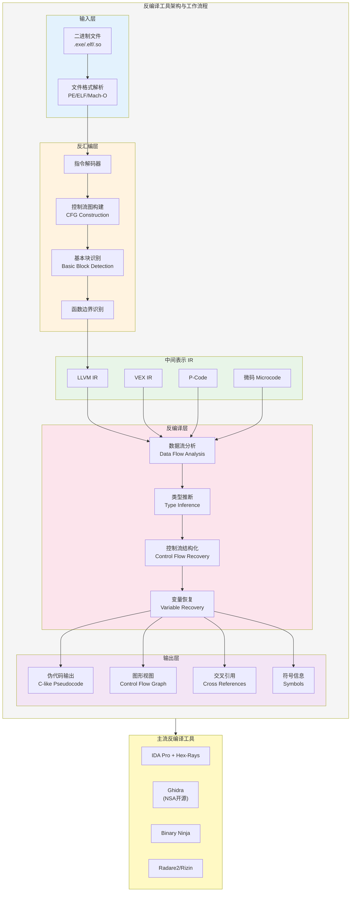
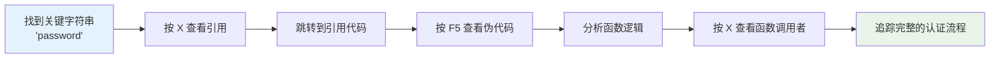
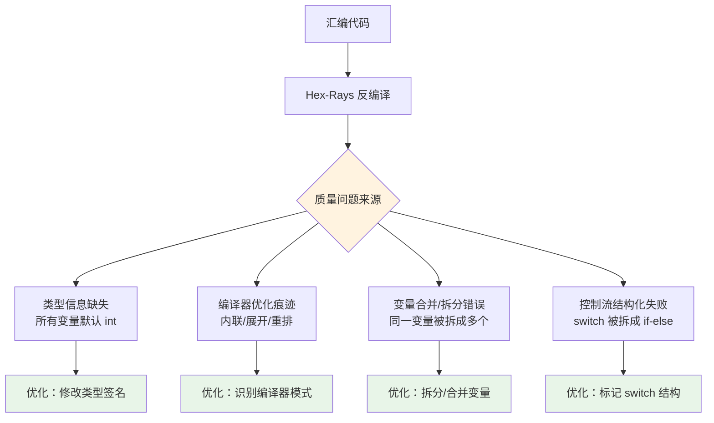

## 17.1 IDA Pro使用技巧

IDA Pro（Interactive DisAssembler Professional）是由比利时公司 Hex-Rays 开发的交互式反汇编工具，被公认为逆向工程领域的"行业标准"。从恶意软件分析到漏洞研究，从 CTF 竞赛到软件破解，IDA Pro 几乎出现在每一个逆向工程场景中。本节从工具基础到高阶脚本，系统讲解 IDA Pro 的核心使用技巧。

### 17.1.1 IDA Pro 概述与版本选择

IDA Pro 自 1990 年由 Ilfak Guilfanov 开发以来，已经迭代了 30 余年。理解它的架构和版本差异，是高效使用它的前提。

#### IDA Pro 的核心架构

IDA Pro 采用分层处理架构，将二进制文件的逆向过程拆解为多个阶段：



IDA Pro 的核心竞争力在于：

1. **交互式分析**：不像自动化工具那样一次性输出结果，IDA 允许分析师在分析过程中持续修正、注释、标注
2. **处理器模块（Processor Module）**：支持 50+ 种处理器架构，从常见的 x86/x64/ARM 到冷门的 PIC、AVR、MSP430
3. **加载器模块（Loader Module）**：支持 PE、ELF、Mach-O、DEX 等众多可执行格式
4. **插件生态**：庞大的社区插件库，覆盖自动化分析、协议解析、恶意软件检测等场景

#### 版本对比与选择

| 特性 | IDA Free | IDA Pro | IDA Pro + Hex-Rays |
|------|----------|---------|-------------------|
| 支持架构 | x86/x64/ARM/ARM64 | 50+ 架构 | 50+ 架构 |
| 反编译器 | 无 | 无 | Hex-Rays (C/C++) |
| IDAPython | 受限 | 完整 | 完整 |
| 调试器 | 本地 | 本地+远程 | 本地+远程 |
| 价格 | 免费 | ~$1,800/年 | ~$5,500/年 |
| 协作 | 不支持 | IDA Teams | IDA Teams |
| 适用场景 | 学习/简单分析 | 专业逆向 | 专业逆向+反编译 |

**选择建议**：

- **入门学习**：IDA Free 即可，支持主流架构，足够练习基础操作
- **CTF 竞赛**：IDA Pro + Hex-Rays，反编译功能在时间紧迫的比赛中价值极高
- **职业逆向**：IDA Pro + Hex-Rays 是标配，尤其是恶意软件分析和漏洞研究
- **预算有限**：Ghidra 是免费替代品，反编译质量接近 Hex-Rays

#### 安装与初始配置

IDA Pro 安装后，有几个关键配置需要调整：

```bash
# IDA 配置文件位置
# Windows: %APPDATA%\Hex-Rays\IDA Pro\idapython.cfg
# Linux: ~/.idapro/idapython.cfg
# macOS: ~/.idapro/idapython.cfg

# 确认 IDAPython 版本（IDA 7.4+ 使用 Python 3）
# 在 IDA 的 Output 窗口输入：
import sys; print(sys.version)

# 推荐安装的 Python 包（在 IDA 的 Python 环境中）
pip install capstone keystone-engine unicorn
```

**关键配置项**：

| 配置文件 | 作用 | 推荐修改 |
|---------|------|---------|
| `ida.cfg` | 全局设置 | 调整反汇编显示格式 |
| `idapython.cfg` | Python 路径 | 添加自定义脚本路径 |
| `idagui.cfg` | 界面设置 | 自定义快捷键 |

### 17.1.2 IDA 数据库与项目管理

每次用 IDA 打开一个二进制文件，IDA 会创建一个 `.idb`（IDA 7.0+ 为 `.i64`）数据库文件。理解数据库结构是高效工作的基础。

#### 数据库文件结构

```text
target.i64 (或 target.idb)
├── .id0   — 信息数据库（B-tree 格式，存储地址到名称的映射）
├── .id1   — 字节标记（存储每个地址的属性：代码/数据/已分析等）
├── .nam   — 名称表（存储用户定义和自动识别的名称）
├── .til   — 类型库（存储标准库的类型信息和用户自定义类型）
└── .id2   — 数据库索引（旧版 .idb 格式使用）
```

> **注意**：`.i64` 是 IDA 64-bit 数据库格式，支持分析 64 位程序和超大文件。`.idb` 是旧的 32-bit 格式。IDA 7.0+ 默认使用 `.i64`。

#### 数据库管理最佳实践

1. **定期保存**：IDA 的 Undo 功能有限（默认 16 步），养成 `Ctrl+S` 的习惯
2. **备份数据库**：在做重大分析决策前，复制一份 `.i64` 文件
3. **使用 IDA Pro Pack**：将数据库打包为 `.idb.zip`，方便团队共享
4. **增量分析**：先做自动分析，再手动标注，最后脚本优化

```python
# IDAPython: 导出分析结果为 JSON（便于团队协作）
import idautils
import idc
import json

def export_analysis():
    result = {}
    for func_ea in idautils.Functions():
        name = idc.get_func_name(func_ea)
        result[hex(func_ea)] = {
            "name": name,
            "size": idc.get_func_attr(func_ea, idc.FUNCATTR_FRSIZE),
            "bounds": f"{hex(func_ea)}-{hex(idc.get_func_attr(func_ea, idc.FUNCATTR_END))}"
        }
    
    with open("/tmp/ida_export.json", "w") as f:
        json.dump(result, f, indent=2)
    print(f"Exported {len(result)} functions")

export_analysis()
```

### 17.1.3 核心视图与快捷键

IDA 提供多种视图来观察二进制数据，每种视图适用于不同的分析场景。

#### 三大核心视图

| 视图 | 入口 | 特点 | 适用场景 |
|------|------|------|---------|
| 反汇编视图（IDA View） | 默认主窗口 | 汇编代码 + 图形/文本模式 | 指令级分析 |
| 伪代码视图（Pseudocode） | `F5`（需 Hex-Rays） | 类 C 伪代码 | 快速理解逻辑 |
| 十六进制视图（Hex View） | `View → Hex View` | 原始字节 | 数据段分析 |

#### 反汇编视图的两种模式

- **图形模式（Graph View）**：默认模式，以控制流图（CFG）形式展示函数。每个基本块是一个方框，箭头表示跳转方向。适合快速理解函数整体结构。
- **文本模式（Text View）**：按地址顺序展示线性反汇编。适合查看函数间连续的代码布局。

按 `空格键` 在两种模式之间切换。

#### 完整快捷键速查表

| 快捷键 | 功能 | 使用频率 | 详细说明 |
|--------|------|---------|---------|
| `空格` | 图形/文本切换 | ⭐⭐⭐⭐⭐ | 在 CFG 和线性视图间切换 |
| `F5` | 反编译 | ⭐⭐⭐⭐⭐ | 将当前函数反编译为伪代码（需 Hex-Rays） |
| `X` | 交叉引用 | ⭐⭐⭐⭐⭐ | 查看谁调用了当前符号/谁引用了当前数据 |
| `N` | 重命名 | ⭐⭐⭐⭐⭐ | 为地址、函数、变量赋予有意义的名称 |
| `Y` | 修改类型 | ⭐⭐⭐⭐ | 修改变量/函数的类型签名 |
| `D` | 切换数据显示 | ⭐⭐⭐⭐ | byte/word/dword/qword 循环切换 |
| `C` | 转换为代码 | ⭐⭐⭐⭐ | 将未识别的数据区域标记为代码 |
| `P` | 创建函数 | ⭐⭐⭐⭐ | 将选中的代码范围标记为函数 |
| `;` | 添加注释 | ⭐⭐⭐⭐ | 在当前位置添加可重复注释 |
| `:` | 添加可重复注释 | ⭐⭐⭐ | 该注释会在所有引用处显示 |
| `G` | 跳转到地址 | ⭐⭐⭐⭐ | 输入地址或符号名直接跳转 |
| `ESC` | 返回上一位置 | ⭐⭐⭐⭐⭐ | 类似浏览器的"后退"按钮 |
| `Ctrl+Enter` | 前进 | ⭐⭐⭐ | 类似浏览器的"前进"按钮 |
| `Ctrl+F` | 搜索 | ⭐⭐⭐ | 在当前视图中搜索文本 |
| `Alt+B` | 二进制搜索 | ⭐⭐⭐ | 搜索特定的字节序列 |
| `Shift+F12` | Strings 窗口 | ⭐⭐⭐⭐⭐ | 打开字符串列表，逆向分析的起点 |
| `Shift+F4` | Names 窗口 | ⭐⭐⭐ | 查看所有已命名的符号 |
| `Ctrl+P` | 函数列表 | ⭐⭐⭐⭐ | 快速搜索和跳转到函数 |
| `F12` | 函数流程图 | ⭐⭐⭐ | 以流程图形式展示当前函数 |
| `Tab` | 汇编/伪代码切换 | ⭐⭐⭐⭐ | 在反汇编和伪代码视图间快速切换 |

#### 导航技巧

逆向分析本质上是一个"跳转-分析-跳转"的过程。高效的导航能力直接决定分析效率。

```python
# IDAPython: 自定义导航热键
import ida_kernwin

# Ctrl+G: 跳转到函数入口
def jump_to_function():
    func_name = ida_kernwin.ask_str("", 0, "Enter function name:")
    if func_name:
        ea = idc.get_name_ea_simple(func_name)
        if ea != idc.BADADDR:
            idc.jumpto(ea)

# 注册快捷键
ida_kernwin.add_hotkey("Ctrl+G", jump_to_function)
```

**高效导航路径**：

1. **字符串驱动分析**：`Shift+F12` → 找到关键字符串 → `X` 查看引用 → 跳转到代码
2. **入口点分析**：`Ctrl+P` → 搜索 `main` / `WinMain` / `entry` → 分析程序逻辑
3. **导入函数追踪**：`View → Open subviews → Imports` → 找到目标 API → `X` 查看调用点
4. **调用链追踪**：在函数头部按 `X` → 跳转到调用者 → 重复直到找到根函数

### 17.1.4 交叉引用分析

交叉引用（Cross Reference，简称 Xref）是 IDA Pro 最强大的功能之一。它构建了程序中所有地址之间的引用关系图，是逆向分析的核心导航工具。

#### 交叉引用的类型

IDA 中的交叉引用分为两大类：

**代码交叉引用（Code Xref）**：

```text
; CODE XREF: sub_401000+15↑j    — 从 sub_401000+15 跳转到此处（j = jump）
; CODE XREF: sub_401000+2C↓p    — 此处调用了 sub_401000（p = call/procedure）
; CODE XREF: sub_401000:loc_401050↓j  — 条件跳转的另一个分支
```

**数据交叉引用（Data Xref）**：

```text
; DATA XREF: sub_401000:loc_401020↑r  — 在 sub_401000 中读取了此数据（r = read）
; DATA XREF: sub_401000+45↑w          — 在 sub_401000+45 处写入了此数据（w = write）
; DATA XREF: sub_401000+50↑o          — 此数据被用作偏移量（o = offset）
```

| 引用符号 | 含义 | 方向 |
|---------|------|------|
| `↑` | 引用来自上方 | 上行引用 |
| `↓` | 引用来自下方 | 下行引用 |
| `j` | 跳转（jump） | 代码引用 |
| `p` | 调用（procedure call） | 代码引用 |
| `r` | 读取（read） | 数据引用 |
| `w` | 写入（write） | 数据引用 |
| `o` | 偏移（offset） | 数据引用 |

#### 典型分析流程

交叉引用是连接"数据"和"代码"的桥梁。以下是一个完整的分析流程示例：



**实战步骤**：

1. 在 Strings 窗口（`Shift+F12`）找到关键字符串（如 `"password"`、`"flag"`、`"error: authentication failed"`）
2. 双击字符串跳转到数据段
3. 按 `X` 查看哪些代码引用了这个字符串
4. 选择一个引用，跳转到对应的函数
5. 按 `F5` 查看伪代码，分析字符串的使用方式
6. 在函数头部再次按 `X`，找到谁调用了这个函数
7. 重复追踪，直到理解完整的调用链

#### XrefsTo 与 XrefsFrom 的高级用法

```python
import idautils
import idc

# 追踪一个函数被谁调用（向上追踪）
def trace_callers(func_name):
    ea = idc.get_name_ea_simple(func_name)
    if ea == idc.BADADDR:
        print(f"Function {func_name} not found")
        return
    
    print(f"\n=== 调用 {func_name} 的位置 ===")
    for xref in idautils.XrefsTo(ea):
        caller_func = idc.get_func_name(xref.frm)
        print(f"  {hex(xref.frm)}: 在 {caller_func} 中调用")

# 追踪一个函数调用了谁（向下追踪）
def trace_callees(func_name):
    ea = idc.get_name_ea_simple(func_name)
    func = idaapi.get_func(ea)
    if not func:
        return
    
    print(f"\n=== {func_name} 调用的函数 ===")
    for head in idautils.Heads(func.start_ea, func.end_ea):
        for xref in idautils.XrefsFrom(head, idautils.CodeRef):
            callee = idc.get_func_name(xref.to)
            if callee and callee != func_name:
                print(f"  {hex(head)}: 调用 {callee}")

# 追踪全局变量的读写
def trace_global_var(var_name):
    ea = idc.get_name_ea_simple(var_name)
    print(f"\n=== {var_name} ({hex(ea)}) 的引用 ===")
    for xref in idautils.XrefsTo(ea):
        func = idc.get_func_name(xref.frm)
        ref_type = {1: "读取", 2: "写入", 3: "偏移"}.get(xref.type, "未知")
        print(f"  {hex(xref.frm)}: 在 {func} 中{ref_type}")
```

### 17.1.5 结构体与类型系统

在 IDA 中正确定义类型信息，是从"看不懂的偏移量"到"清晰的结构体字段"的关键一步。Hex-Rays 反编译器的质量高度依赖类型信息的准确性。

#### 结构体定义流程

1. 打开 Structures 窗口（`View → Open subviews → Structures`）
2. 按 `Insert` 创建新结构体
3. 添加成员并设置类型和大小
4. 在反编译代码中将变量类型设置为自定义结构体

**定义结构体前后的对比**：

```c
// 定义结构体前 —— 只看到偏移量
v1 = *(a1 + 8);
v2 = *(a1 + 16);
v3 = *(_DWORD *)(a1 + 24);
if ( *(_DWORD *)(a1 + 4) > 0 )
    sub_401234(a1 + 32);

// 定义结构体后 —— 语义清晰
v1 = obj->field_count;
v2 = obj->data_ptr;
v3 = obj->flags;
if ( obj->ref_count > 0 )
    process_buffer(&obj->buffer);
```

#### 从汇编推断结构体布局

当没有调试符号时，需要从代码推断结构体的布局。核心思路是观察同一基址的不同偏移访问：

```c
// 观察到的模式：
sub_401000:
    mov eax, [edi+0]      ; 第一个字段，4 字节
    mov ebx, [edi+4]      ; 第二个字段，4 字节
    mov cl, [edi+8]       ; 第三个字段，1 字节
    lea eax, [edi+12]     ; 第四个字段，地址/指针
    call sub_402000([edi+16]) ; 第五个字段，函数指针或参数

// 推断结构体：
struct UnknownObj {
    int     field_0;      // +0:  DWORD
    int     field_4;      // +4:  DWORD
    char    field_8;      // +8:  BYTE
    void*   field_C;      // +12: 指针
    int     field_10;     // +16: 调用参数
};
```

#### 导入标准类型库

IDA 内置了大量标准库的类型信息（TIL 文件），可以一键导入：

```text
View → Open subviews → Type Libraries → Ins → 选择对应的库

常用类型库：
- PC: win32 类型（Windows API 类型定义）
- GNU C++: GCC 标准库类型
- Borland: Delphi/Borland 类型
```

```python
# IDAPython: 批量应用类型信息
import idc
import ida_typeinf

# 加载类型库
til = ida_typeinf.get_idati()  # 获取当前 TIL

# 导入标准头文件的类型（类似 #include）
ida_typeinf.import_type(til, -1, "windows.h")
ida_typeinf.import_type(til, -1, "winsock2.h")
```

#### FLIRT 签名识别

FLIRT（Fast Library Identification and Recognition Technology）是 IDA 的核心技术之一，用于自动识别已知库函数。

**工作原理**：

1. IDA 对函数的字节模式生成签名（忽略地址和重定位差异）
2. 将签名与内置签名库匹配
3. 匹配成功后自动标记函数名和类型

**使用方法**：

```text
File → Load File → FLIRT Signature File → 选择合适的 .sig 文件
```

| 签名库 | 适用场景 |
|--------|---------|
| `vc32rt` / `vc64rt` | MSVC 运行时库 |
| `borland` | Borland/Delphi 编译的程序 |
| `mfc` | MFC 框架 |
| `openssl` | OpenSSL 加密库 |
| `zlib` | zlib 压缩库 |

```python
# IDAPython: 查看当前已应用的签名
import ida_funcs

for func_ea in idautils.Functions():
    func = ida_funcs.get_func(func_ea)
    if func and (func.flags & ida_funcs.FUNC_LIB):
        print(f"库函数: {idc.get_func_name(func_ea)} @ {hex(func_ea)}")
```

**自定义 FLIRT 签名**：当目标程序使用了已知的静态库（如 libcurl、OpenSSL），但 IDA 没有内置签名时，可以自己生成：

```bash
# 使用 IDA 的 sigmake 工具
# 1. 用 IDA 打开已知库的 .lib/.a 文件
# 2. File → Produce File → Create Signature File
# 3. 将生成的 .sig 文件复制到 IDA/sig 目录
```

### 17.1.6 Hex-Rays 反编译器优化技巧

Hex-Rays 是 IDA Pro 的反编译插件，将汇编代码转换为类 C 伪代码。它不是完美的——生成的代码经常存在类型错误、变量混淆、结构混乱等问题。掌握优化技巧是从"能看"到"好用"的关键。

#### 反编译质量问题的根源



#### 五种核心优化技巧

**技巧一：修改函数签名（最常用）**

```c
// 优化前 —— 参数类型全是 int
int __cdecl sub_401000(int a1, int a2, int a3) {
    *(_BYTE *)(a1 + 4) = *(_BYTE *)a2;
    return sub_402000(a1, a3);
}

// 在函数名上按 Y，修改签名：
int __cdecl process_request(HttpRequest *req, const char *body, int flags) {
    req->content_type = *body;
    return dispatch_handler(req, flags);
}
```

**技巧二：修改变量类型**

右键点击变量 → `Set type` → 输入正确的类型。常见场景：

- `int v1` → `char *v1`（字符串指针）
- `int v2` → `DWORD *v2`（DWORD 指针）
- `__int64 v3` → `size_t v3`（无符号大小）

**技巧三：拆分/合并变量**

Hex-Rays 有时会将两个不同的变量错误地合并为一个（如果它们恰好共用同一个寄存器），或者将一个变量错误地拆分为多个。

```c
// Hex-Rays 可能生成的错误合并：
int v1;  // 同时用于循环计数器和函数返回值

// 右键变量 → Split variable：
int v1;  // 循环计数器
int v1a; // 函数返回值
```

**技巧四：标记数组**

```c
// 优化前：
*(_DWORD *)(4 * i + a1) = 0;

// 优化后（按 Y 修改 a1 类型为 int *）：
a1[i] = 0;
```

**技巧五：强制 switch 识别**

当 Hex-Rays 无法识别 switch 语句，将其拆成多个 if-else 时：

1. 在反汇编视图中找到跳转表
2. 选中 `jmp ds:off_401234[eax*4]` 之类的指令
3. 按 `Tab` 切换到伪代码视图，观察是否变成了 switch

#### 常见编译器模式识别

识别编译器生成的特定模式，避免将编译器产物误认为程序员逻辑：

| 模式 | 表现 | 实际含义 |
|------|------|---------|
| `__security_cookie` | 函数头尾的 XOR 操作 | MSVC 栈保护（Stack Canary） |
| `__EH_prolog` | 异常处理序言 | SEH 注册 |
| `sub_401000(0, 0, 0, 0)` | 四个零参数 | `memset(0)` 或异常处理初始化 |
| `v1 = __ROL4__(v1, 7)` | 循环左移 | 编译器内联的位操作 |
| 连续的 `cmp + jnz` | 短路求值 | `&&` 或 `\|\|` 表达式 |

### 17.1.7 IDAPython 脚本编程

IDAPython 是 IDA 内置的 Python 脚本引擎，允许自动化几乎所有的 IDA 操作。在处理大型二进制文件或重复性分析任务时，脚本能力是效率倍增器。

#### IDAPython API 体系

IDA 的 Python API 分为三个核心模块：

| 模块 | 职责 | 常用函数 |
|------|------|---------|
| `idc` | 底层地址操作 | `here()`, `get_wide_byte()`, `set_name()`, `get_func_name()` |
| `idautils` | 高级遍历工具 | `Functions()`, `Heads()`, `XrefsTo()`, `XrefsFrom()`, `Strings()` |
| `idaapi` | 核心数据结构 | `get_func()`, `get_inf_structure()`, `get_bytes()` |

此外还有大量子模块：

```python
import ida_bytes      # 字节级数据操作
import ida_funcs      # 函数管理
import ida_name       # 命名管理
import ida_typeinf    # 类型信息
import ida_segment    # 段操作
import ida_ida        # IDA 核心接口
import ida_kernwin    # UI 交互
import ida_search     # 搜索功能
import ida_netnode    # 网络节点（数据库存储）
```

#### 实用脚本集合

**脚本一：批量重命名函数**

```python
import idautils
import idc
import ida_funcs

# 基于函数调用的目标地址批量重命名
rename_map = {
    0x401000: "init_crypto_engine",
    0x401200: "encrypt_payload",
    0x401400: "decrypt_flag",
    0x401600: "validate_license",
}

for addr, name in rename_map.items():
    result = idc.set_name(addr, name, idc.SN_CHECK)
    if result:
        print(f"[+] {hex(addr)} → {name}")
    else:
        print(f"[-] Failed to rename {hex(addr)}")

# 基于字符串引用自动重命名
def auto_rename_by_string(string_pattern, prefix=""):
    for s in idautils.Strings():
        if string_pattern in str(s):
            for xref in idautils.XrefsTo(s.ea):
                func_addr = idc.get_func_attr(xref.frm, idc.FUNCATTR_START)
                if func_addr != idc.BADADDR:
                    new_name = f"{prefix}_{string_pattern.replace(' ', '_')}"
                    idc.set_name(func_addr, new_name, idc.SN_CHECK)
                    print(f"  Renamed {hex(func_addr)} → {new_name}")

auto_rename_by_string("password", "check")
auto_rename_by_string("flag", "process")
```

**脚本二：函数调用图生成**

```python
import idautils
import idc
import json

def build_call_graph(root_func_name, max_depth=3):
    """构建函数调用图（BFS）"""
    root = idc.get_name_ea_simple(root_func_name)
    if root == idc.BADADDR:
        return {}
    
    graph = {}
    visited = set()
    queue = [(root, 0)]
    
    while queue:
        ea, depth = queue.pop(0)
        if ea in visited or depth > max_depth:
            continue
        visited.add(ea)
        
        func_name = idc.get_func_name(ea)
        callees = []
        
        func = idaapi.get_func(ea)
        if func:
            for head in idautils.Heads(func.start_ea, func.end_ea):
                for xref in idautils.XrefsFrom(head, idautils.CodeRef):
                    if xref.type in (idaapi.fl_CN, idaapi.fl_CF):  # Call near/far
                        callee_name = idc.get_func_name(xref.to)
                        if callee_name:
                            callees.append(callee_name)
                            queue.append((xref.to, depth + 1))
        
        graph[func_name] = callees
    
    return graph

# 使用
call_graph = build_call_graph("main", max_depth=4)
print(json.dumps(call_graph, indent=2))
```

**脚本三：查找未引用函数（Dead Code 检测）**

```python
import idautils
import idc

def find_unreferenced_functions():
    """查找没有被任何代码调用的函数"""
    unreferenced = []
    
    for func_ea in idautils.Functions():
        # 跳过库函数
        if idc.get_func_attr(func_ea, idc.FUNCATTR_FLAGS) & idaapi.FUNC_LIB:
            continue
        
        # 检查是否有代码引用
        refs = list(idautils.XrefsTo(func_ea))
        code_refs = [r for r in refs if r.type in (idaapi.fl_CN, idaapi.fl_CF)]
        
        if not code_refs:
            name = idc.get_func_name(func_ea)
            size = idc.get_func_attr(func_ea, idc.FUNCATTR_FRSIZE)
            unreferenced.append((func_ea, name, size))
            print(f"[!] Unreferenced: {name} @ {hex(func_ea)} ({size} bytes)")
    
    print(f"\nTotal unreferenced functions: {len(unreferenced)}")
    return unreferenced

find_unreferenced_functions()
```

**脚本四：自动化字符串解密**

```python
import idc
import idautils

def find_xor_decryption_loop():
    """查找可能的 XOR 解密循环"""
    patterns = []
    
    for func_ea in idautils.Functions():
        func = idaapi.get_func(func_ea)
        if not func:
            continue
        
        for head in idautils.Heads(func.start_ea, func.end_ea):
            disasm = idc.GetDisasm(head)
            # 查找 XOR 指令模式
            if "xor" in disasm.lower():
                # 检查是否在循环中（向上看是否有跳转回来）
                patterns.append((head, disasm))
    
    return patterns

# 查找后手动分析确认
results = find_xor_decryption_loop()
for addr, inst in results[:20]:
    print(f"  {hex(addr)}: {inst}")
```

**脚本五：Patch 管理与导出**

```python
import ida_bytes
import idc

def apply_patch(ea, patch_bytes):
    """在指定地址应用字节补丁"""
    for i, b in enumerate(patch_bytes):
        ida_bytes.patch_byte(ea + i, b)
    print(f"[*] Patched {len(patch_bytes)} bytes at {hex(ea)}")

def export_patches(filename="/tmp/ida_patches.txt"):
    """导出所有补丁"""
    patches = []
    ea = 0
    end = idc.get_inf_attr(idc.INF_MAX_EA)
    
    while ea < end:
        if ida_bytes.is_patched(ea):
            original = ida_bytes.get_original_byte(ea)
            patched = ida_bytes.get_wide_byte(ea)
            patches.append(f"0x{ea:X}: 0x{original:02X} -> 0x{patched:02X}")
        ea += 1
    
    with open(filename, "w") as f:
        f.write("\n".join(patches))
    print(f"[*] Exported {len(patches)} patches to {filename}")

# 示例：NOP 掉一个检查
# apply_patch(0x401234, [0x90, 0x90])  # NOP NOP
# export_patches()
```

### 17.1.8 调试功能

IDA Pro 不仅是静态分析工具，也是一个强大的调试器。在需要观察运行时行为时（如解密、反混淆、动态参数解析），调试功能不可或缺。

#### 调试器类型

| 调试器 | 平台 | 特点 |
|--------|------|------|
| Local Windows Debugger | Windows | 本地调试，最常用 |
| Remote Windows Debugger | Windows | 通过远程服务器调试 |
| Remote Linux Debugger | Linux | 调试 Linux 程序 |
| Remote GDB Debugger | 跨平台 | 通过 GDB 协议连接 |
| Remote iOS/Android | 移动端 | 调试移动应用 |
| Bochs Debugger | 模拟器 | 无需真实执行环境 |

#### 远程调试配置

当目标程序在 Linux 服务器或嵌入式设备上运行时，使用远程调试：

```bash
# 在目标机器上运行 IDA 的远程调试服务器
# Linux:
./linux_server64 -p 23946

# 在 IDA 中配置：
# Debugger → Select debugger → Remote Linux debugger
# Debugger → Process options → Host: 192.168.1.100, Port: 23946
```

#### 断点类型

| 断点类型 | 设置方法 | 适用场景 |
|---------|---------|---------|
| 软件断点 | `F2` | 普通代码断点（替换为 `INT3`） |
| 硬件断点 | `F2` × 2 | 不能修改代码时（ROM/只读段） |
| 条件断点 | 右键 → Breakpoint properties | 满足条件才中断 |
| 写入断点 | 右键数据 → Add watch | 监控内存写入 |
| 函数断点 | Names 窗口 → F2 | 在函数入口中断 |

```python
# IDAPython: 设置条件断点
import ida_dbg

def set_conditional_bp(ea, condition):
    """设置条件断点"""
    ida_dbg.add_bpt(ea)
    bpt = ida_dbg.bpt_t()
    ida_dbg.get_bpt(ea, bpt)
    bpt.condition = condition.encode()
    ida_dbg.update_bpt(bpt)
    print(f"[*] Conditional BP at {hex(ea)}: {condition}")

# 示例：当 EAX == 0x42 时中断
set_conditional_bp(0x401234, "EAX == 0x42")

# 设置日志断点（不中断，只记录）
def set_log_bp(ea, log_expr):
    ida_dbg.add_bpt(ea)
    bpt = ida_dbg.bpt_t()
    ida_dbg.get_bpt(ea, bpt)
    bpt.condition = bpt.BPTCK_ENABLED
    bpt.elang = "Python"
    bpt.eval_expr = log_expr.encode()
    ida_dbg.update_bpt(bpt)
```

### 17.1.9 常用插件与扩展

IDA Pro 的插件生态是其核心竞争力之一。以下是最常用的插件：

| 插件 | 功能 | 安装方式 |
|------|------|---------|
| **FindCrypt** | 识别加密常量（S-Box、IV 等） | IDA 自带或 GitHub |
| **HexRaysCodeXplorer** | 增强 Hex-Rays 反编译（结构体重建等） | GitHub |
| **RetDec** | 开源反编译器集成 | GitHub |
| **Labeless** | 调试时自动同步标签到 IDA | GitHub |
| **Diaphora** | 二进制差异分析（Bindiff 替代） | GitHub |
| **ReClass.NET** | 交互式结构体重建 | GitHub |
| **snowman** | 开源反编译器插件 | GitHub |
| **Keypatch** | 基于 Keystone 的汇编/补丁工具 | GitHub |

#### FindCrypt 实战

```python
# FindCrypt 自动检测加密常量
# 安装后运行：Plugins → FindCrypt
# 输出示例：
# [+] Found AES S-Box at 0x402000
# [+] Found RC4 S-Box initialization at 0x401500
# [+] Found MD5 constant 0xD76AA478 at 0x401800
# [+] Found SHA-256 constant 0x6A09E667 at 0x401850

# 手动检查常见加密常量
import idautils
import idc

crypto_constants = {
    0x67452301: "MD5 init A",
    0xEFCDAB89: "MD5 init B",
    0x98BADCFE: "MD5 init C",
    0x10325476: "MD5 init D",
    0x6A09E667: "SHA-256 h0",
    0xBB67AE85: "SHA-256 h1",
}

for ea in range(0, idc.get_inf_attr(idc.INF_MAX_EA)):
    val = idc.get_wide_dword(ea)
    if val in crypto_constants:
        print(f"[!] {crypto_constants[val]} found at {hex(ea)}")
```

#### Diaphora 二进制差异分析

Diaphora 是 Bindiff 的开源替代品，用于比较两个版本的二进制文件，快速定位补丁修改的函数：

```text
1. 用 IDA 打开旧版本，运行 Plugins → Diaphora → Export
2. 用 IDA 打开新版本，运行 Plugins → Diaphora → Diff
3. Diaphora 会自动匹配相似函数，并标记差异
```

### 17.1.10 大型项目的分析策略

面对大型二进制文件（如浏览器引擎、操作系统内核），盲目分析是低效的。需要有策略地缩小分析范围。

#### 策略一：入口点追踪法

```python
# 从 main 函数开始，递归展开调用树
# 只关注与目标相关的分支
def targeted_analysis(start_func, target_pattern):
    """从 start_func 开始，只追踪包含 target_pattern 的路径"""
    queue = [start_func]
    visited = set()
    relevant = []
    
    while queue:
        ea = queue.pop(0)
        if ea in visited:
            continue
        visited.add(ea)
        
        func_name = idc.get_func_name(ea)
        if target_pattern in func_name:
            relevant.append(func_name)
        
        func = idaapi.get_func(ea)
        if func:
            for head in idautils.Heads(func.start_ea, func.end_ea):
                for xref in idautils.XrefsFrom(head, idautils.CodeRef):
                    if xref.type in (idaapi.fl_CN, idaapi.fl_CF):
                        queue.append(xref.to)
    
    return relevant
```

#### 策略二：关键 API 拦截法

先确定目标程序使用的关键 Windows/Linux API，然后从这些 API 的调用点反向追踪。

#### 策略三：字符串情报法

从程序中的错误消息、日志格式、配置参数等字符串出发，定位关键功能的实现代码。

#### 策略四：符号信息利用

如果二进制文件包含调试信息（如 PDB 文件），应先加载符号：

```text
File → Load File → PDB File → 选择对应的 .pdb 文件
```

```python
# 检查是否已有符号信息
import idautils

named_count = 0
unnamed_count = 0

for func_ea in idautils.Functions():
    name = idc.get_func_name(func_ea)
    if name.startswith("sub_"):
        unnamed_count += 1
    else:
        named_count += 1

total = named_count + unnamed_count
print(f"已命名函数: {named_count}/{total} ({100*named_count//total}%)")
print(f"未命名函数: {unnamed_count}/{total}")
```

### 17.1.11 常见误区与避坑指南

#### 误区一：只看伪代码不看汇编

Hex-Rays 伪代码是"近似"而非"精确"的翻译。某些关键操作（如栈操作、内联汇编、编译器优化）在伪代码中可能被省略或错误表达。对于关键代码段，始终对照汇编检查。

#### 误区二：忽略编译器优化痕迹

-O2/-O3 编译的程序充满了循环展开、函数内联、尾调用优化等编译器产物。将这些误认为程序员逻辑会导致分析方向错误。

#### 误区三：不保存分析进度

IDA 的 Undo 栈有限。如果不保存就做大规模重命名或类型修改，一次误操作可能丢失大量分析成果。

#### 误区四：盲目信任 FLIRT 签名

FLIRT 签名匹配存在误报。某些自定义函数可能恰好匹配了已知库的签名前缀。对关键函数，应通过调用上下文验证匹配结果。

#### 误区五：忽略数据段的类型定义

很多初学者只关注代码段的反汇编，忽略了数据段中的全局变量、虚函数表（vtable）、异常处理表（EH Table）的类型定义。这些信息对理解程序架构至关重要。

#### 误区六：在同一个数据库中做所有事情

大型项目应该拆分为多个分析任务，每个任务使用独立的 IDA 数据库副本。这样可以避免不同分析方向的注释互相干扰。

### 17.1.12 IDA Pro 与竞品对比

| 特性 | IDA Pro + Hex-Rays | Ghidra | Binary Ninja | Radare2 |
|------|-------------------|--------|-------------|---------|
| 价格 | ~$5,500/年 | 免费 | ~$300 起 | 免费 |
| 反编译质量 | 优秀 | 良好 | 良好 | 基础 |
| 支持架构 | 50+ | 30+ | 50+ | 60+ |
| 脚本语言 | Python | Java/Python | Python | Python/Ruby |
| 调试器 | 内置强大 | 内置基础 | 无（需插件） | 内置 |
| 社区插件 | 最丰富 | 中等 | 少 | 中等 |
| 学习曲线 | 陡峭 | 中等 | 平缓 | 最陡峭 |
| 协作功能 | IDA Teams | Ghidra Server | 无 | 无 |
| 适用场景 | 专业逆向/CTF | 开源替代/团队 | 快速分析 | 轻量/脚本化 |

**选择建议**：

- **职业逆向工程师**：IDA Pro + Hex-Rays 是不二选择
- **预算有限的团队**：Ghidra 是最佳免费替代
- **快速原型分析**：Binary Ninja 的 API 设计更现代
- **自动化流水线**：Radare2 的命令行界面最适合脚本集成

### 17.1.13 进阶：自定义处理器模块与加载器

对于 IDA 不原生支持的架构或文件格式，可以开发自定义处理器模块（Processor Module）或加载器（Loader）。

#### 处理器模块结构

```python
# 简化的自定义处理器模块骨架
import ida_idp
import ida_bytes

class CustomProcessor(ida_idp.processor_t):
    # 处理器 ID（必须唯一）
    id = 0x8001
    
    # 处理器名称
    name = "CustomCPU"
    
    # 寄存器定义
    reg_names = ["R0", "R1", "R2", "R3", "SP", "LR", "PC", "FLAGS"]
    
    # 指令集定义
    instruc = [
        {"name": "NOP",  "feature": 0},
        {"name": "MOV",  "feature": ida_idp.CF_USE1 | ida_idp.CF_CHG2},
        {"name": "ADD",  "feature": ida_idp.CF_USE1 | ida_idp.CF_USE2 | ida_idp.CF_CHG3},
        {"name": "JMP",  "feature": ida_idp.CF_STOP},
        {"name": "CALL", "feature": ida_idp.CF_CALL},
        {"name": "RET",  "feature": ida_idp.CF_STOP},
    ]
    
    def ana(self):
        """解码一条指令"""
        # 读取操作码
        opcode = ida_bytes.get_wide_byte(self.cmd.ea)
        # 设置指令类型
        self.cmd.itype = opcode & 0x0F
        # 设置指令长度
        self.cmd.size = 2
        return self.cmd.size
    
    def emu(self):
        """模拟指令执行效果（标记交叉引用等）"""
        return 1
    
    def out(self):
        """输出反汇编文本"""
        # 简单输出指令名
        ida_bytes.out_mnem(self.cmd)
        return 1
```

#### 加载器结构

```python
# 简化的自定义加载器骨架
import ida_loader

class CustomLoader(ida_loader.loader_t):
    version = 1
    name = "CustomFormat"
    
    def accept_file(self, nef, filename):
        """检查文件是否是本加载器支持的格式"""
        # 读取魔数
        magic = nef.read(4)
        if magic == b"CUST":
            return "Custom Binary Format"
        return 0
    
    def load_file(self, nef, flags):
        """加载文件到 IDA 数据库"""
        # 创建代码段
        nef.file2base(0x1000, 0x00400000, 0x00400000 + 0x10000, True)
        ida_segment.add_segm(0, 0x00400000, 0x00410000, ".text", "CODE")
        
        # 创建数据段
        nef.file2base(0x11000, 0x00500000, 0x00500000 + 0x1000, True)
        ida_segment.add_segm(0, 0x00500000, 0x00501000, ".data", "DATA")
        
        # 设置入口点
        ida_ida.inf_set_start_ip(0x00400000)
        return 1
```

这些进阶内容通常只在处理自定义架构（嵌入式处理器、IoT 设备固件、游戏主机 ROM）时才需要。对于日常工作，掌握前面章节的内容已经足够应对绝大多数场景。

---

**总结**：IDA Pro 的学习曲线虽然陡峭，但投入的时间会在后续的每一次逆向分析中得到回报。核心建议是：先熟练掌握快捷键和交叉引用分析（这两项覆盖 80% 的日常操作），再逐步学习 IDAPython 脚本和类型系统优化，最后根据需要掌握调试和插件开发。
