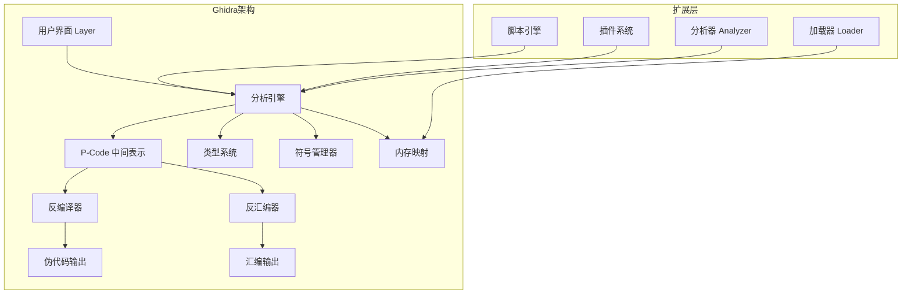
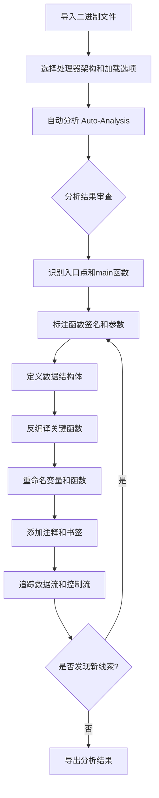

## 17.2 Ghidra使用技巧

Ghidra是由美国国家安全局（NSA）于2019年开源的逆向工程框架，基于Java开发，支持跨平台运行。它不仅是一个反汇编工具，更是一个完整的软件分析平台，涵盖反编译、脚本自动化、协作分析等能力。对于无法负担IDA Pro高昂授权费用的安全研究人员和开发者而言，Ghidra是目前最成熟、最强大的免费替代方案。

### 17.2.1 Ghidra的架构与设计哲学

#### 为什么选择Ghidra

Ghidra的核心竞争力不在于"免费"，而在于其架构设计带来的独特能力。理解这些能力，才能真正发挥它的威力。

**Ghidra与IDA Pro的深度对比：**

| 维度 | Ghidra | IDA Pro |
|------|--------|---------|
| 价格 | 免费开源 | 单用户授权 $1,975/年起 |
| 反编译器 | 内置免费 | Hex-Rays需额外购买（$2,500+） |
| 支持架构 | x86/x64、ARM、MIPS、PowerPC、RISC-V、SPARC、AVR等30+ | x86/x64、ARM、MIPS等50+ |
| 脚本语言 | Java、Python（Jython/Python 3） | Python、IDC |
| 协作分析 | 内置多人协作服务器 | 无原生支持（需第三方） |
| 插件生态 | Growing，但规模较小 | 30年积累，极其丰富 |
| 反编译质量 | 优秀，持续改进 | 业界标杆（Hex-Rays） |
| P-Code中间表示 | 完全暴露，可编程 | 不公开 |
| 版本管理 | 内置Undo/Redo + 版本快照 | 有限 |
| 学习曲线 | 中等 | 较陡 |

**Ghidra的内部架构：**



Ghidra的核心是**P-Code中间表示**——它将所有目标架构的指令统一转换为P-Code，再基于P-Code进行反编译。这意味着你在Ghidra中看到的反编译结果是经过多轮优化的中间代码，而非简单的模板匹配。这个设计也让Ghidra的脚本能力远超同类工具——你可以直接操作P-Code级别的程序语义。

#### P-Code：理解Ghidra的核心

P-Code是Ghidra的"秘密武器"。它是一种与硬件无关的寄存器传输语言（Register Transfer Language），将所有CPU指令翻译成统一的操作序列。

```text
; x86指令: add eax, ebx
; 对应的P-Code:
   REGISTER:4 = INT_ADD(REGISTER:4, REGISTER:4)  ; eax = eax + ebx
   COPY CarryFlag  ; 更新标志位
   COPY ZeroFlag
   COPY SignFlag
   COPY OverflowFlag
```

理解P-Code的意义：
- **跨架构分析**：同一段脚本可以分析ARM、MIPS、x86程序，因为底层都是P-Code
- **语义分析**：可以精确判断一条指令到底做了什么（数据流、控制流）
- **自定义反编译**：可以通过修改P-Code优化规则来改进反编译结果

### 17.2.2 安装与环境配置

#### 系统要求

Ghidra基于Java运行，对系统资源有一定要求：

- **Java版本**：Ghidra 11.x 需要JDK 17或更高版本（Ghidra 10.x需要JDK 17，更早版本需要JDK 11）
- **内存**：最低4GB RAM，推荐8GB+（分析大型二进制文件时建议16GB+）
- **磁盘**：安装需要2GB+，项目文件视分析对象大小而定
- **操作系统**：Windows 10+、Linux（含WSL）、macOS 10.15+

#### 安装步骤

```bash
# 1. 安装JDK（以Ubuntu/Debian为例）
sudo apt install openjdk-17-jdk

# 验证Java版本
java -version

# 2. 下载Ghidra
# 从 https://ghidra-sre.org/ 或 GitHub Releases 下载
wget https://github.com/NationalSecurityAgency/ghidra/releases/download/Ghidra_11.3_build/ghidra_11.3_PUBLIC_20250108.zip

# 3. 解压安装
unzip ghidra_11.3_PUBLIC_20250108.zip -d /opt/
# Ghidra解压即可用，无需安装

# 4. 启动Ghidra
/opt/ghidra_11.3_PUBLIC/ghidraRun
# Windows上运行 ghidraRun.bat

# 5.（可选）配置最大堆内存
# 编辑 support/launch.properties
# 修改 MAXMEM 参数，默认为1G，建议改为4G或更高
# VMARGS=-Xmx4G
```

#### 关键配置文件

| 文件路径 | 作用 |
|----------|------|
| `support/launch.properties` | JVM参数、最大堆内存 |
| `support/ghidra.properties` | Ghidra全局配置 |
| `Ghidra/Features/Base/lib/` | 内置模块JAR包 |
| `<user>/.ghidra/.ghidra_<version>/` | 用户配置目录（脚本、插件等） |

用户配置目录位于 `~/.ghidra/.ghidra_<version>/`，其中：
- `Extensions/` —— 自定义扩展和插件
- `ghidra_scrips/` —— 用户自定义脚本
- `tools/` —— 工具面板布局配置

### 17.2.3 核心界面与工作流

#### 界面布局详解

Ghidra的主界面由多个可停靠的窗口组成，每个窗口负责不同功能：

```text
┌─────────────────────────────────────────────────────┐
│ 菜单栏 + 工具栏                                       │
├──────────────┬──────────────────┬───────────────────┤
│              │                  │                   │
│  程序树       │  列表视图         │  反编译窗口        │
│  Program     │  Listing         │  Decompiler       │
│  Tree        │  (反汇编视图)      │                   │
│              │                  │                   │
├──────────────┼──────────────────┤                   │
│              │                  │                   │
│  符号树       │  字节查看器       │                   │
│  Symbol      │  Bytes View      │                   │
│  Tree        │                  │                   │
│              │                  │                   │
├──────────────┴──────────────────┴───────────────────┤
│ 数据类型管理器 | 脚本管理器 | 搜索结果                   │
└─────────────────────────────────────────────────────┘
```

**窗口功能说明：**

- **程序树（Program Tree）**：展示二进制文件的内存段（.text、.data、.bss等），可按段或函数组织视图
- **列表视图（Listing）**：核心窗口，显示反汇编代码、数据定义、注释、交叉引用。是使用最频繁的窗口
- **反编译窗口（Decompiler）**：将选中的汇编函数实时转换为C伪代码，支持类型传播和变量重命名
- **符号树（Symbol Tree）**：按类别组织所有符号（函数、标签、类、命名空间）
- **数据类型管理器（Data Type Manager）**：管理内置和自定义数据类型（结构体、枚举、typedef）
- **脚本管理器（Script Manager）**：管理和运行脚本，支持即时编写和执行

#### 典型分析工作流

一个完整的逆向分析流程如下：



### 17.2.4 导入与自动分析

#### 导入二进制文件

Ghidra支持多种文件格式的导入：

- **可执行文件**：ELF、PE、Mach-O、DEX/APK
- **固件镜像**：Raw binary、Intel HEX、Motorola S-Record
- **对象文件**：.o、.obj
- **库文件**：.a、.lib、.so、.dll
- **内存转储**：core dump、内存dump文件
- **容器格式**：ZIP、JAR（可递归分析内部文件）

导入时的关键选项：

1. **语言（Language）**：指定目标处理器架构。Ghidra会尝试自动检测，但手动指定更可靠。格式为 `<arch>:<variant>:<endian>:<compiler>`，例如 `x86:LE:64:default`
2. **基地址（Base Address）**：Raw binary需要手动指定加载地址，否则默认为0x0
3. **分析选项（Analysis Options）**：控制自动分析的行为和深度

#### 自动分析器详解

自动分析是Ghidra最强大的功能之一，它会在导入后自动识别程序结构。理解每个分析器的作用，有助于根据目标特性选择合适的分析策略。

| 分析器名称 | 功能 | 耗时 | 适用场景 |
|------------|------|------|----------|
| Aggressive Instruction Finder | 在未识别区域搜索指令 | 高 | 代码段标记不完整时 |
| ASCII Strings | 识别ASCII字符串 | 低 | 几乎所有场景 |
| Auto Create External Labels | 创建外部库标签 | 低 | 分析动态链接程序 |
| Apply Data Archives | 匹配已知数据结构 | 中 | 分析使用标准库的程序 |
| Call Convention ID | 识别调用约定 | 中 | 分析未知编译器输出 |
| Create Address Tables | 识别地址跳转表 | 低 | 分析switch-case语句 |
| Data Reference | 分析数据引用关系 | 中 | 几乎所有场景 |
| Decompiler Switch Analysis | 识别switch语句结构 | 中 | 分析含有switch的程序 |
| Demangler | 符号名解修饰 | 低 | C++程序 |
| Disassemble Entry Points | 入口点反汇编 | 低 | 所有场景 |
| ELF External Name Resolver | 解析ELF外部符号 | 低 | Linux ELF文件 |
| Function ID | 匹配已知函数签名 | 高 | 识别编译器生成的通用代码 |
| Function Start Search | 搜索函数起始点 | 中 | 代码标记不完整时 |
| P-Code Reference | 建立P-Code引用 | 中 | 脚本和高级分析需要 |
| Reference | 建立引用关系 | 中 | 几乎所有场景 |
| Stack | 栈帧分析 | 中 | 理解函数参数和局部变量 |
| Subroutine References | 子程序调用关系 | 中 | 几乎所有场景 |
| WindowsPE | PE格式特定分析 | 低 | Windows可执行文件 |

**分析策略建议：**

- **快速初步分析**：默认分析选项即可，适合快速查看程序结构
- **深度分析**：勾选 Aggressive Instruction Finder 和 Function ID，耗时更长但结果更完整
- **大型固件**：禁用耗时高的分析器，先手动定位关键代码区域再进行局部分析

### 17.2.5 核心操作深入

#### 函数操作

函数是逆向分析的基本单元，Ghidra提供了丰富的函数操作能力：

**创建与编辑函数：**

- **自动识别**：自动分析会识别大部分函数，但可能遗漏（尤其是手动汇编的代码或被混淆的代码）
- **手动创建**：选中疑似函数入口地址，按 `F` 创建函数。如果自动识别的函数边界有误，可以先删除再重新创建
- **函数签名编辑**：右键函数 → Edit Function Signature，可以修改返回类型、参数类型和调用约定
- **调用约定**：Ghidra支持多种调用约定（cdecl、stdcall、fastcall、thiscall、ARM AAPCS等），正确设置对反编译结果至关重要

**交叉引用（Cross-References）：**

交叉引用是逆向分析中最常用的功能之一，它告诉你某个地址在哪里被引用：

- **代码引用（Code References）**：`XREF FROM` 表示"谁调用了这个函数"，`XREF TO` 表示"这个函数调用了谁"
- **数据引用（Data References）**：某条指令引用了哪个数据地址
- **查看方式**：选中任何符号或地址，按 `Ctrl+Shift+F`（或查看底部引用面板），可以看到所有引用关系

```text
; 在列表视图底部，交叉引用通常显示为：
;   XREF:  entry:00401000(*)  entry:00401050(t)
; 符号含义：
;   (*) = 无条件跳转
;   (t) = 条件跳转  
;   (c) = 调用
;   (r) = 读引用
;   (w) = 写引用
```

#### 反编译器使用技巧

Ghidra的反编译器将汇编代码转换为等价的C伪代码，是逆向分析效率的关键。

**反编译窗口的常用操作：**

| 操作 | 快捷键/方式 | 效果 |
|------|------------|------|
| 重命名变量 | 双击变量名或选中后按 `L` | 同步更新所有引用 |
| 修改变量类型 | 右键 → Retype Variable | 改变反编译结果的数据类型 |
| 强制类型转换 | 在反编译窗口中修改类型签名 | 指导类型传播 |
| 编辑函数签名 | 右键函数名 → Edit Function Signature | 修改参数和返回类型 |
| 撤销反编译视图中的操作 | `Ctrl+Z` | 撤销变量重命名等 |
| 跳转到汇编 | 在反编译窗口选中代码，按 `Ctrl+Shift+E` | 在列表视图中高亮对应汇编 |

**提升反编译质量的技巧：**

1. **正确定义结构体**：如果函数参数是指向结构体的指针，在数据类型管理器中定义结构体，然后在反编译器中修改参数类型。反编译器会自动将偏移量替换为结构体字段名，大幅提高可读性。

2. **设置函数调用约定**：如果Ghidra识别的参数传递方式有误，手动修正函数签名的调用约定。这在分析非标准编译器输出或手写汇编时尤为重要。

3. **利用Ghidra的类型传播**：Ghidra的反编译器会自动从已知类型传播信息到未类型化的变量。正确设置一个函数的签名，可能让调用链上多个函数的反编译结果同时改善。

4. **识别编译器优化模式**：现代编译器（GCC、Clang、MSVC）会产生各种优化代码，例如循环展开、尾调用优化、常量折叠。反编译器可能无法完美还原这些优化后的代码，需要手动判断。

#### 标注与注释系统

Ghidra提供多种标注方式，帮助你在分析过程中积累理解：

- **前注释（Pre-Comment）**：在指令上方显示（`;` 快捷键）
- **行尾注释（EOL Comment）**：在指令行尾显示（`;` 快捷键）
- **可重复注释（Repeatable Comment）**：在所有引用该地址的位置都会显示
- **Plate注释**：在函数上方显示大段说明文字
- **书签（Bookmark）**：标记重要位置，方便跳转（`Ctrl+D`）

### 17.2.6 数据类型与结构体

#### 数据类型管理器

数据类型管理器是Ghidra中定义程序数据结构的核心工具。正确设置数据类型能让反编译结果质量提升数个量级。

**内置数据类型库：**

Ghidra内置了常用的标准库结构体定义，位于 `Builtins` 和各种数据类型归档文件中。在自动分析阶段，如果启用了 `Apply Data Archives` 分析器，Ghidra会自动匹配已知的数据类型。

**创建自定义结构体：**

```text
步骤：
1. 打开数据类型管理器（Window → Data Type Manager）
2. 右键 → New → Structure
3. 输入结构体名称
4. 在编辑器中添加字段，指定类型和偏移量
5. 或者使用 Parse C Header 功能批量导入定义

; 使用 Parse C Header 导入：
; 在数据类型管理器中选择一个归档文件
; 右键 → Parse C Source File...
; 输入C头文件路径或直接粘贴C结构体定义
```

**实际案例——解析ELF动态符号表结构：**

```c
// 在Ghidra中定义ELF32_Sym结构体
typedef struct {
    uint32_t st_name;    // 符号名在字符串表中的偏移
    uint32_t st_value;   // 符号的值（地址或常量）
    uint32_t st_size;    // 符号的大小
    uint8_t  st_info;    // 符号类型和绑定信息
    uint8_t  st_other;   // 符号可见性
    uint16_t st_shndx;   // 符号所在的段索引
} Elf32_Sym;

// 在Ghidra的数据类型管理器中：
// New → Structure → 依次添加字段
// 然后在列表视图中选中符号表起始地址
// 右键 → Data → Choose Data Type → Elf32_Sym
// 设置数组大小，即可将原始字节解析为可读的符号表
```

#### 枚举类型

枚举类型在分析协议解析代码时特别有用。例如定义网络协议类型：

```c
enum ProtocolType {
    TCP = 6,
    UDP = 17,
    ICMP = 1,
    IGMP = 2
};
```

在Ghidra中定义后，可以在反编译器中看到 `if (protocol == ProtocolType::TCP)` 而不是 `if (protocol == 6)`，极大提升可读性。

### 17.2.7 Ghidra脚本编程

Ghidra的脚本能力是其相对于其他逆向工具的最大优势之一。你可以用Java、Jython或Python 3编写脚本来自动化分析任务。

#### 脚本开发环境

Ghidra内置了脚本编辑器（Script Manager → 新建脚本），也支持外部IDE开发：

**使用Eclipse开发Ghidra脚本：**

Ghidra自带Eclipse集成支持。在 `Ghidra/Features/Base/` 目录下有 `GhidraDev` 插件，可以：
- 在Eclipse中直接运行和调试Ghidra脚本
- 自动配置classpath，提供完整的Ghidra API代码补全
- 支持断点调试，可以单步执行脚本并查看变量状态

**使用VS Code + Ghidra Bridge：**

社区提供了多种VS Code集成方案，支持在VS Code中编写和执行Ghidra脚本。

#### GhidraScript API核心类

理解Ghidra的API体系是编写高效脚本的基础。以下是核心类的层级关系：

```text
Program (当前程序)
├── Memory (内存管理)
│   ├── getBytes(addr, length)        // 读取字节
│   ├── getInt(addr)                  // 读取整数
│   └── findBytes(addr, pattern)      // 搜索字节模式
├── Listing (代码/数据列表)
│   ├── getDefinedData(True)          // 遍历所有数据定义
│   ├── getCodeUnits(addr, True)      // 遍历代码单元
│   └── getDataAt(addr)               // 获取指定地址的数据
├── FunctionManager (函数管理)
│   ├── getFunctions(True)            // 遍历所有函数
│   ├── getFunctionAt(addr)           // 获取指定地址的函数
│   └── getFunctionContaining(addr)   // 获取包含地址的函数
├── SymbolTable (符号表)
│   ├── getSymbols(name, namespace)   // 按名称查找符号
│   └── getSymbolAt(addr)             // 获取地址处的符号
├── DataTypeManager (数据类型管理)
│   ├── getAllDataTypes()              // 获取所有数据类型
│   └── resolve(typeName)             // 按名称解析类型
└── ReferenceManager (引用管理)
    ├── getReferencesTo(addr)         // 获取指向地址的引用
    └── getReferencesFrom(addr)       // 获取从地址发出的引用
```

#### 实战脚本示例

**示例1：批量提取所有字符串常量并按类别分类**

```python
# Ghidra Jython脚本：提取并分类所有字符串
# 用途：快速了解程序的功能模块

from ghidra.program.model.listing import CodeUnit
from ghidra.program.model.symbol import SymbolType
import re

results = {
    'urls': [],
    'file_paths': [],
    'error_msgs': [],
    'format_strings': [],
    'other': []
}

listing = currentProgram.getListing()

for data in listing.getDefinedData(True):
    if data.getDataType().getName() in ('string', 'unicode'):
        value = str(data.getValue()) if data.getValue() else ''
        addr = data.getAddress()
        
        # 分类
        if re.match(r'https?://', value):
            results['urls'].append((addr, value))
        elif re.match(r'[A-Za-z]:\\\\|/usr/|/etc/|/tmp/|/var/', value):
            results['file_paths'].append((addr, value))
        elif re.search(r'%[sdxfp]|{\\d+}', value):
            results['format_strings'].append((addr, value))
        elif re.search(r'error|fail|invalid|denied|abort', value, re.I):
            results['error_msgs'].append((addr, value))
        else:
            results['other'].append((addr, value))

# 输出结果
for category, items in results.items():
    print(f"\n=== {category.upper()} ({len(items)} items) ===")
    for addr, value in items[:20]:  # 每类最多显示20个
        print(f"  {addr}: {value[:100]}")
```

**示例2：识别危险函数调用**

```python
# Ghidra Jython脚本：查找所有危险函数调用
# 用途：快速识别潜在的安全漏洞

dangerous_funcs = {
    'strcpy': '缓冲区溢出风险，应使用strncpy或strlcpy',
    'strcat': '缓冲区溢出风险，应使用strncat或strlcat',
    'sprintf': '格式化字符串风险，应使用snprintf',
    'gets': '绝对危险，应使用fgets',
    'scanf': '缓冲区溢出风险，应限制输入长度',
    'system': '命令注入风险',
    'popen': '命令注入风险',
    'exec': '命令执行风险',
    'malloc': '检查返回值是否为NULL',
    'free': '检查是否为double-free',
}

func_manager = currentProgram.getFunctionManager()

for func in func_manager.getFunctions(True):
    func_name = func.getName()
    
    if func_name in dangerous_funcs:
        risk = dangerous_funcs[func_name]
        callers = []
        
        # 获取所有调用该函数的位置
        refs = getReferencesTo(func.getEntryPoint())
        for ref in refs:
            caller_addr = ref.getFromAddress()
            caller_func = getFunctionContaining(caller_addr)
            if caller_func:
                callers.append(f"  {caller_func.getName()} @ {caller_addr}")
        
        print(f"\n[!] {func_name}: {risk}")
        print(f"    被调用 {len(callers)} 次:")
        for caller in callers[:10]:
            print(f"    {caller}")
```

**示例3：自动化函数重命名**

```python
# Ghidra Jython脚本：基于字符串引用自动重命名函数
# 用途：根据函数中引用的字符串推断函数功能

func_manager = currentProgram.getFunctionManager()
rename_count = 0

for func in func_manager.getFunctions(True):
    # 跳过已经有有意义名字的函数
    name = func.getName()
    if not name.startswith('FUN_'):
        continue
    
    # 收集函数中引用的字符串
    refs = getReferencesTo(func.getEntryPoint())
    strings_found = []
    
    body = func.getBody()
    for addr in body.getAddresses(True):
        data = getDataAt(addr)
        if data and data.getDataType().getName() in ('string', 'unicode'):
            val = str(data.getValue()) if data.getValue() else ''
            if val and len(val) > 3:
                strings_found.append(val)
    
    if strings_found:
        # 用最有意义的字符串生成函数名
        best = max(strings_found, key=len)
        # 清理字符串，生成合法的函数名
        clean = ''.join(c if c.isalnum() else '_' for c in best[:30])
        clean = clean.strip('_').lower()
        
        if clean and clean != name:
            new_name = f"func_{clean}"
            func.setName(new_name, ghidra.program.model.symbol.SourceType.USER_DEFINED)
            rename_count += 1
            print(f"Renamed {name} -> {new_name} (based on: {best[:50]})")

print(f"\nTotal renamed: {rename_count}")
```

**示例4：Python 3脚本（Ghidra 11+支持）**

```python
# Ghidra Python 3脚本：导出函数调用图
# 使用Ghidra 11.x的Python 3支持

import json

call_graph = {}
func_mgr = currentProgram.getFunctionManager()

for func in func_mgr.getFunctions(True):
    func_name = func.getName()
    callees = []
    
    body = func.getBody()
    for addr in body.getAddresses(True):
        code_unit = listing.getCodeUnitAt(addr)
        if code_unit and code_unit.getMnemonicString() in ('CALL', 'BL', 'JAL', 'jal'):
            ref_type = code_unit.getReferenceType()
            refs = code_unit.getReferencesFrom()
            for ref in refs:
                target = ref.getToAddress()
                target_func = getFunctionAt(target)
                if target_func:
                    callees.append(target_func.getName())
    
    if callees:
        call_graph[func_name] = list(set(callees))

# 输出为JSON格式
output = json.dumps(call_graph, indent=2)
print(output)

# 也可以写入文件
# with open('/tmp/call_graph.json', 'w') as f:
#     f.write(output)
```

#### Ghidra Headless模式（无界面运行）

Ghidra支持在没有图形界面的服务器上运行，这对于批量分析和CI/CD集成非常重要：

```bash
# 无界面分析命令
# 位于 Ghidra/support/analyzeHeadless

/opt/ghidra/support/analyzeHeadless \
    /tmp/ghidra_projects \          # 项目目录
    MyProject \                      # 项目名称
    -import /path/to/binary \        # 导入文件
    -postScript analyze_script.py \  # 分析后执行的脚本
    -processor x86:LE:64:default \   # 指定处理器
    -max-cpu 8 \                     # 最大并行线程数
    -deleteProject \                 # 分析完后删除项目（清理用）

# 批量分析多个文件
for binary in /path/to/binaries/*; do
    /opt/ghidra/support/analyzeHeadless \
        /tmp/ghidra_projects \
        "analysis_$(basename $binary)" \
        -import "$binary" \
        -postScript extract_info.py \
        -scriptPath /path/to/scripts/
done
```

### 17.2.8 高级功能

#### 协作分析（Ghidra Server）

Ghidra内置了多人协作分析功能，允许多个分析师同时分析同一个二进制文件：

1. **启动Ghidra Server**：运行 `support/ghidraServer`，默认监听13100端口
2. **创建共享项目**：File → New Project → Shared Project，连接到服务器
3. **签入/签出**：类似于版本控制，分析师签出（Check Out）自己负责的函数区域进行分析，完成后签入（Check In）共享
4. **冲突解决**：当多人修改同一函数时，Ghidra提供合并工具

协作模式特别适合大型固件或复杂恶意软件的团队分析。

#### 版本跟踪（Version Tracking）

版本跟踪允许你比较同一个程序的不同版本，自动识别：
- 新增/删除的函数
- 函数签名变化
- 数据结构变化
- 匹配的函数在不同版本中的地址映射

这个功能在分析软件更新补丁、追踪恶意软件变种时非常有用。

#### 处理器模块开发

如果Ghidra不支持你的目标处理器架构，可以编写自定义处理器模块。Ghidra使用SLEIGH语言定义指令集语义：

```text
# SLEIGH定义示例（简化版ADD指令）
define token instr(32)
  opcode = (24,31)
  rd = (16,23)
  rs1 = (8,15)
  rs2 = (0,7)
;

:ADD rd, rs1, rs2 is opcode=0x01; rd; rs1; rs2 {
    rd = rs1 + rs2;
}
```

处理器模块开发是一个高级主题，但对于分析专有嵌入式芯片的固件至关重要。

#### 调试器集成

Ghidra 11.x 开始内置了调试器支持，可以：
- 本地调试（通过GDB/LLDB后端）
- 远程调试（通过GDB Remote Protocol）
- 附加到正在运行的进程
- 内存实时查看和修改

调试器与反汇编视图的联动让你可以在运行时验证静态分析的假设。

### 17.2.9 快捷键速查表

| 操作 | 快捷键 | 说明 |
|------|--------|------|
| 反汇编列表视图 | `L` | 重命名符号 |
| 创建函数 | `F` | 在选中地址创建函数 |
| 添加注释 | `;` | 添加行注释 |
| 交叉引用 | `Ctrl+Shift+F` | 查看所有交叉引用 |
| 搜索字符串 | `S` | 搜索字符串 |
| 搜索指令 | `S` (切换模式) | 搜索指令模式 |
| 搜索地址 | `G` | 跳转到指定地址 |
| 后退 | `[` | 返回上一个位置 |
| 前进 | `]` | 前进到下一个位置 |
| 标记书签 | `Ctrl+D` | 在当前位置添加书签 |
| 数据转换 | `D` | 切换数据类型（字节→word→dword） |
| 创建字符串 | 右键 → Data → String | 在当前位置定义字符串 |
| 反编译同步 | `Ctrl+Shift+E` | 在列表视图中高亮反编译选中的代码 |
| 显示定义 | `Ctrl+D` | 跳转到符号定义处 |
| 引用高亮 | 点击符号 | 自动高亮所有相同的符号 |
| 帮助 | `F1` | 查看完整快捷键列表 |

### 17.2.10 实战案例分析

#### 案例：分析一个Strip后的ELF二进制

当你遇到一个被strip（移除符号表）的Linux ELF程序时，分析步骤如下：

1. **导入文件**：Ghidra通常能自动识别ELF格式和x86-64架构
2. **等待自动分析完成**：注意观察Entry Point和_start函数
3. **定位main函数**：
   - `_start` → `__libc_start_main` 的第一个参数就是main函数地址
   - 在反编译器中查看 `_start`，第一个 `CALL` 指令的目标函数的第一个参数就是main
4. **识别库函数**：
   - 启用 Function ID 分析器，它能通过特征匹配识别标准库函数（如printf、malloc等）
   - 如果动态符号表还在（.dynsym段），可以手动查看导入函数
5. **从已知函数反推**：
   - 找到 `printf`、`puts` 等输出函数的调用点
   - 查看它们的参数（格式化字符串），推断程序逻辑
6. **定义数据结构**：
   - 根据函数参数的使用方式，推断并定义结构体
   - 例如如果一个参数在偏移+0处被当作整数使用，在偏移+8处被当作指针使用，就定义一个包含int和pointer字段的结构体

#### 案例：分析嵌入式ARM固件

分析一个无文件系统的裸机ARM固件：

1. **导入**：选择 Raw Binary → ARM:LE:32:v8T（或对应架构变体）
2. **设置基地址**：查看芯片手册确定Flash起始地址（通常是0x08000000 for STM32）
3. **定义内存映射**：Memory Map中添加RAM区域（如0x20000000）
4. **设置中断向量表**：定位向量表地址（通常在基地址处），定义数组类型
5. **从Reset Handler开始分析**：第一个中断向量指向的地址是程序入口
6. **识别外设寄存器**：
   - 定义GPIO、UART、SPI等外设寄存器结构体
   - 将已知地址（如GPIOA_BASE = 0x40020000）标记为对应结构体类型

### 17.2.11 常见问题与故障排除

#### 问题1：自动分析耗时过长

大型二进制文件（如Android系统库、游戏引擎）的自动分析可能耗时数十分钟甚至数小时。

**解决方案：**
- 禁用不需要的分析器（特别是 Aggressive Instruction Finder 和 Function ID）
- 增大JVM堆内存：编辑 `support/launch.properties`，修改 `MAXMEM=8G`
- 使用无界面模式（Headless）在服务器上运行分析
- 先进行局部分析：选中特定地址范围，只分析感兴趣的部分

#### 问题2：反编译结果有误

反编译器有时会输出不正确的伪代码，常见原因和解决方法：

- **调用约定错误**：手动修正函数签名的调用约定
- **类型信息缺失**：定义正确的数据类型和结构体
- **间接跳转未解析**：手动创建跳转目标的函数
- **内联函数**：识别为内联代码块而非独立函数
- **编译器特定优化**：某些优化（如尾调用合并）可能混淆反编译结果

#### 问题3：脚本执行报错

**常见错误及解决：**

```python
# 错误: NameError: name 'getReferencesTo' is not defined
# 原因：某些API在不同Ghidra版本中位置不同
# 解决：使用完整路径导入
from ghidra.program.util import DefinedDataIterator

# 错误: AttributeError: 'NoneType' object has no attribute 'getName'
# 原因：某个地址没有对应的函数/符号
# 解决：添加空值检查
func = getFunctionAt(addr)
if func is not None:
    print(func.getName())
```

#### 问题4：项目文件损坏

Ghidra的项目文件（.gpr + .rep目录）可能因异常关闭而损坏。

**预防措施：**
- 定期备份项目：File → Archive Current Project
- 使用版本控制：将项目导出为Ghidra Zip格式
- 避免在分析过程中强制终止Ghidra

### 17.2.12 性能优化与最佳实践

#### 分析流程优化

1. **先规划再分析**：导入文件前，先了解目标程序的功能、架构和编译环境，有针对性地选择分析选项
2. **善用书签和注释**：在分析过程中随手添加书签和注释，避免重复查找
3. **定义数据结构优先**：在深入分析函数之前，先把数据结构定义好，反编译结果会更清晰
4. **利用版本跟踪**：分析同一程序的不同版本时，使用Version Tracking功能自动映射已知部分

#### 内存管理

分析大型项目时，JVM内存管理很关键：

```properties
# support/launch.properties 推荐配置（16GB+ RAM的机器）
VMARGS=-Xmx8g -Xms4g -XX:+UseG1GC -XX:MaxGCPauseMillis=200
```

- `-Xmx8g`：最大堆内存8GB
- `-Xms4g`：初始堆内存4GB（减少动态扩展开销）
- `-XX:+UseG1GC`：使用G1垃圾收集器（适合大堆）
- `-XX:MaxGCPauseMillis=200`：最大GC暂停时间200ms

#### 脚本性能优化

```python
# 差：逐个字节读取
for addr in range(start, end):
    byte = getByte(addr)

# 好：批量读取
bytes = getBytes(start, end - start)

# 差：在循环中重复查询
for func in getFunctions(True):
    refs = getReferencesTo(func.getEntryPoint())  # 每次都查询

# 好：缓存结果
ref_cache = {}
for func in getFunctions(True):
    addr = func.getEntryPoint()
    if addr not in ref_cache:
        ref_cache[addr] = list(getReferencesTo(addr))
    refs = ref_cache[addr]
```

### 17.2.13 扩展与插件生态

#### 常用社区插件

| 插件名称 | 功能 | 安装方式 |
|----------|------|----------|
| GhidraEmu | CPU模拟器，支持单步执行 | GitHub下载放入Extensions目录 |
| RetSync | 与IDA/LLDB/WinDbg同步 | GitHub下载 |
| GhidraNes | NES ROM分析 | 内置或GitHub |
| LightGhidra | 暗色主题改进 | GitHub下载 |
| GhidraGo | Go语言二进制分析 | GitHub下载 |
| findcrypt | 识别加密常量 | GitHub下载（IDA同名工具的Ghidra移植版） |

#### 安装插件

```bash
# 方法1：通过Ghidra安装
# File → Install Extensions → 选择zip文件

# 方法2：手动安装
# 将插件jar文件复制到：
cp plugin.jar ~/.ghidra/.ghidra_<version>/Extensions/

# 方法3：通过Ghidra Extension Manager（11.x+）
# File → Extensions → 搜索并安装
```

#### 编写自定义插件

当脚本无法满足需求时，可以编写完整的Java插件。插件可以：
- 注册自定义菜单项和工具栏按钮
- 添加新的分析器（Analyzer）
- 创建自定义加载器（Loader）
- 扩展反编译器行为
- 添加新的数据类型提供者

插件开发需要Ghidra源码，使用Gradle构建系统。官方提供了详细的插件开发指南。

Ghidra是一个功能极其丰富的逆向工程平台，本节内容涵盖了从入门到进阶的核心知识点。实际使用中，建议从分析简单的CTF题目开始练习，逐步过渡到真实的恶意软件分析或固件逆向。随着对Ghidra API的熟悉，你可以编写高度定制化的分析脚本，大幅提升逆向工程效率。
