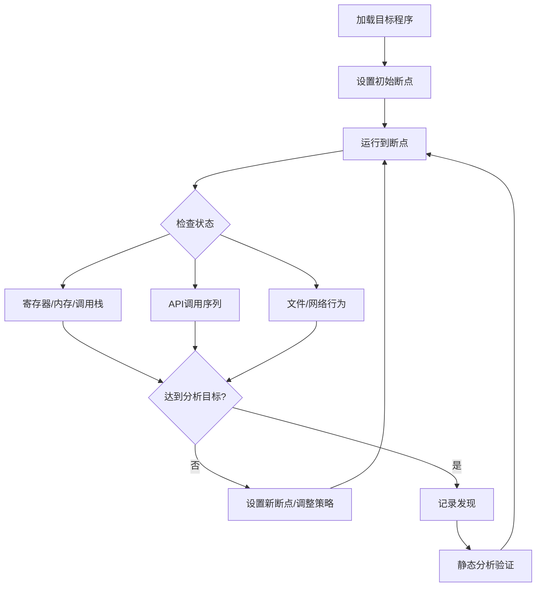
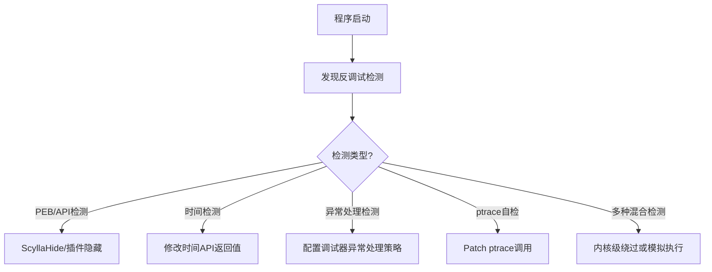
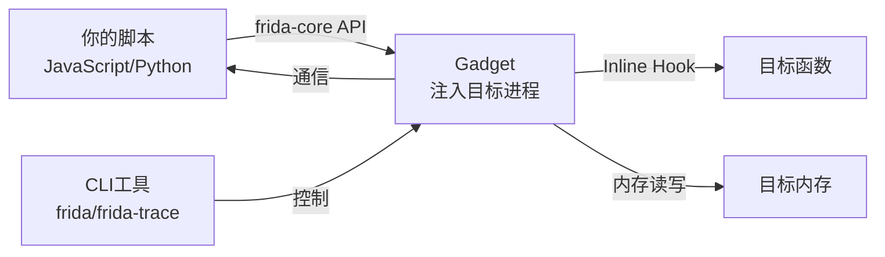
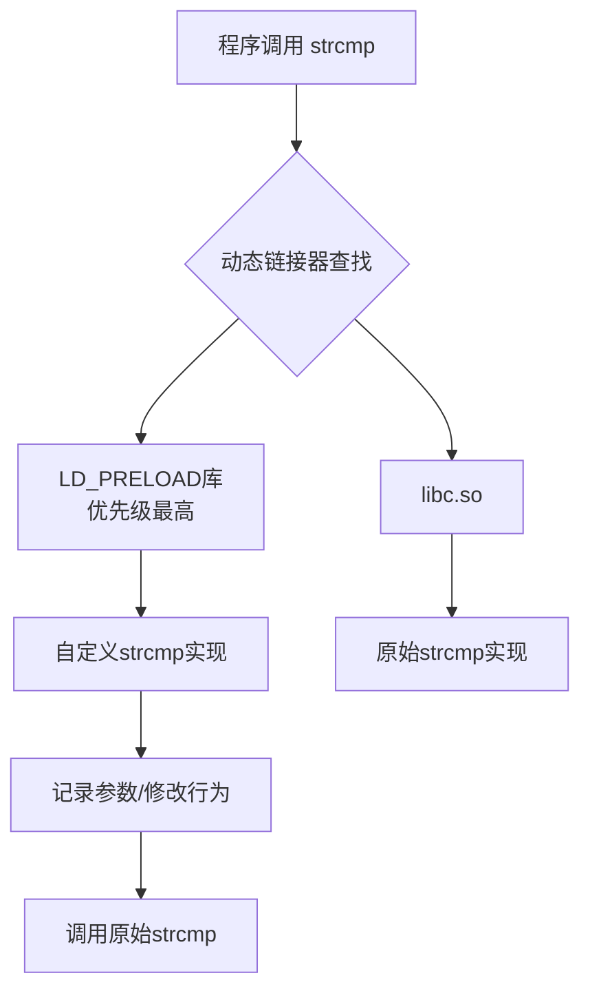

## 17.3 动态分析技术

动态分析（Dynamic Analysis）是在程序运行时观察其行为、追踪执行路径、检查内存状态的分析方法。与静态分析在不运行程序的情况下阅读代码不同，动态分析能让分析者看到程序在真实环境中的实际表现——包括运行时解密的字符串、动态生成的代码、网络通信内容、文件系统操作等静态分析无法触及的信息。

动态分析和静态分析是互补关系。静态分析提供全局视角，适合理解程序整体结构；动态分析提供具体视角，适合验证假设、追踪数据流、突破混淆。在实际逆向工程中，两者交替使用是最高效的工作方式。

### 17.3.1 动态分析的核心方法论

#### 为什么需要动态分析

程序在编译后丢失了大量源码级信息。经过混淆、加壳、虚拟机保护等技术处理后，静态分析的成本急剧上升。动态分析的价值在于：

1. **绕过混淆**：无论代码如何混淆，最终必须在CPU上执行明文指令。动态分析直接观察执行时的指令流，绕过了静态层面的所有混淆。
2. **获取运行时状态**：加密的字符串在运行时会被解密，动态生成的代码在运行时才会出现，这些信息只有动态分析才能获取。
3. **验证假设**：静态分析中对某个函数功能的推测，可以通过动态执行来验证。
4. **处理反编译失败**：当反编译器无法正确处理某段代码时，调试器中的逐指令执行是最可靠的后备方案。

#### 动态分析的工作流



一个典型的动态分析会话包含以下阶段：

| 阶段 | 目标 | 关键动作 |
|------|------|----------|
| 初始侦察 | 了解程序基本信息 | 运行程序观察行为，检查依赖库，查看命令行参数 |
| 入口定位 | 找到关键代码位置 | 在感兴趣的函数设置断点，搜索关键字符串 |
| 执行追踪 | 记录执行路径 | 单步执行、条件断点、trace日志 |
| 数据提取 | 获取运行时数据 | 检查内存、dump解密内容、记录API参数 |
| 行为观察 | 了解程序外部行为 | 监控文件操作、网络通信、注册表访问 |
| 假设验证 | 确认分析结论 | 修改内存/寄存器观察行为变化 |

### 17.3.2 调试器深度使用

调试器是动态分析的核心工具。不同平台有不同的调试器选择，每种调试器都有其独特的优势和使用场景。

#### Linux调试：GDB + 增强插件

原生GDB的界面对逆向工程不够友好，配合增强插件后能力大幅提升。主流的GDB增强框架有三个：pwndbg、GEF和PEDA。pwndbg是目前最活跃的项目，推荐优先使用。

**环境搭建：**

```bash
# 安装pwndbg（推荐）
git clone https://github.com/pwndbg/pwndbg
cd pwndbg
./setup.sh

# 或安装GEF
bash -c "$(curl -fsSL https://gef.blah.cat/sh)"

# 或安装PEDA（较老但稳定）
git clone https://github.com/longld/peda.git ~/peda
echo "source ~/peda/peda.py" >> ~/.gdbinit
```

**核心调试命令：**

```bash
# === 基本调试流程 ===
gdb ./target                          # 启动调试
gdb --args ./target arg1 arg2         # 带参数启动
gdb -p 1234                           # 附加到运行中的进程

# === 断点管理 ===
break main                            # 在函数入口设断点
break *0x401234                       # 在绝对地址设断点
break *0x401234 if $rdi == 0x42       # 条件断点：仅当RDI==0x42时触发
watch *0x601000                       # 硬件监视点：内存写入时触发
rwatch *0x601000                      # 硬件监视点：内存读取时触发
ignore 1 100                          # 忽略断点1的前100次触发

# === 执行控制 ===
run arg1 arg2                         # 运行程序
continue                              # 继续执行
ni                                    # 单步（不进入函数，汇编级别）
si                                    # 单步（进入函数）
nexti                                 # 同ni
stepi                                 # 同si
finish                                # 执行到当前函数返回
until *0x401234                       # 执行到指定地址

# === 内存与寄存器查看 ===
info registers                        # 查看所有通用寄存器
info registers rax rbx               # 查看指定寄存器
print/x $rax                          # 以十六进制打印寄存器
print (char*)$rdi                     # 将RDI作为字符串指针打印
x/20wx $rsp                           # 查看栈：20个word（32位），十六进制
x/10gx $rsp                           # 查看栈：10个gword（64位），十六进制
x/s 0x402000                          # 查看字符串
x/10i 0x401000                        # 查看10条指令
x/40xb $rsp                           # 查看原始字节

# === 反汇编 ===
disassemble main                      # 反汇编main函数
disassemble /m main                   # 反汇编并显示源码（如有）
set disassembly-flavor intel          # 切换为Intel语法
```

**pwndbg增强功能：**

```bash
# pwndbg在GDB启动后自动加载，提供以下增强命令
context                               # 显示上下文（寄存器+栈+代码），每次断点自动显示
vmmap                                 # 显示内存映射（类似/proc/pid/maps）
heap                                  # 显示堆信息
bins                                  # 显示堆的free bins（fastbin/tcache/unsorted等）
search -s "flag{" 0x400000 0x500000   # 在内存范围搜索字符串
telescope $rsp 20                     # 智能显示栈：自动解析指针链
cyclic 100                            # 生成De Bruijn序列（用于溢出偏移计算）
cyclic -l 0x61616167                  # 查找子串在序列中的偏移
```

**GDB脚本化——自动化重复任务：**

```python
# gdb_auto_trace.py - 自动追踪函数调用
import gdb

class FunctionTracer(gdb.Breakpoint):
    def __init__(self, func_name):
        super().__init__(func_name, internal=True)
        self.func_name = func_name
        self.call_count = 0

    def stop(self):
        self.call_count += 1
        frame = gdb.selected_frame()
        args = []
        # 尝试获取前3个参数（x86_64: rdi, rsi, rdx）
        try:
            for i, reg in enumerate(["$rdi", "$rsi", "$rdx"]):
                val = gdb.parse_and_eval(reg)
                args.append(f"arg{i}=0x{int(val):x}")
        except:
            pass
        print(f"[{self.call_count}] {self.func_name}({', '.join(args)})")
        return False  # 不停止执行

# 使用方式：在GDB中执行
# source gdb_auto_trace.py
# python FunctionTracer("strcmp")
# run
```

#### Windows调试：x64dbg

x64dbg是Windows平台最强大的用户态调试器，图形界面直观，插件生态丰富。

**核心操作流程：**

| 操作 | 快捷键 | 说明 |
|------|--------|------|
| 单步步入 | F7 | 执行一条指令，遇到call进入函数 |
| 单步步过 | F8 | 执行一条指令，遇到call不进入 |
| 运行到断点 | F9 | 继续执行到下一个断点 |
| 设置断点 | F2 | 在当前地址切换断点 |
| 反汇编窗口 | Ctrl+G | 跳转到指定地址 |
| 内存窗口 | Ctrl+M | 查看进程内存 |
| 跟踪到用户代码 | Ctrl+F9 | 执行到返回用户代码段 |
| 运行到选定位置 | F4 | 执行到当前光标处 |

**x64dbg必备插件：**

| 插件 | 功能 | 使用场景 |
|------|------|----------|
| ScyllaHide | 隐藏调试器特征 | 绕过反调试检测 |
| xAnalyzer | 自动分析API调用参数 | 快速理解API调用语义 |
| SharpOD | 反反调试插件 | 对抗NtQueryInformationProcess等检测 |
| TitanHide | 内核级反反调试 | 硬件断点隐藏、DR寄存器保护 |
| SwissArmyKnife | 代码补丁管理 | 批量管理代码修改 |

**x64dbg脚本化（内置脚本引擎）：**

```javascript
// x64dbg脚本：自动dump解密后的字符串
// 在解密函数返回处设置日志断点
var count
mov count, 0

// 设置日志断点在解密函数返回处
SetBreakpoint解密函数返回地址
SetLog解密函数返回地址, "Decrypted: {rax}"
SetLogCondition解密函数返回地址, "$rax != 0"

// 记录所有解密调用
Log "Starting decryption trace..."
```

#### 动态追踪：dtrace/SystemTap/eBPF

调试器适合交互式分析，但有时需要非侵入式地追踪大量系统调用或内核行为。动态追踪工具填补了这个需求。

**strace——系统调用追踪：**

```bash
# 追踪所有系统调用
strace ./target 2>&1 | tee strace_output.log

# 只追踪特定系统调用
strace -e trace=open,read,write ./target

# 追踪网络相关系统调用
strace -e trace=network ./target

# 附加到运行中的进程
strace -p 1234

# 追踪子进程
strace -f ./target

# 记录时间戳和每个调用的耗时
strace -T -t ./target

# 统计系统调用摘要
strace -c ./target

# 输出到文件（不影响终端）
strace -o trace.log ./target
```

**ltrace——库函数调用追踪：**

```bash
# 追踪动态库函数调用
ltrace ./target

# 追踪特定函数
ltrace -e strcmp+strcpy ./target

# 显示调用栈
ltrace -C ./target

# 带参数的完整追踪
ltrace -s 200 ./target  # 字符串截断长度设为200
```

**eBPF——高级动态追踪（Linux 4.x+）：**

```bash
# 使用bcc工具追踪文件打开
sudo opensnoop                    # 追踪所有open()调用
sudo execsnoop                    # 追踪所有execve()调用
sudo trace 'do_sys_open "%s", arg2'  # 追踪open的文件名参数

# 使用bpftrace编写自定义追踪
# trace_open.bt
tracepoint:syscalls:sys_enter_openat
{
    printf("%s pid=%d comm=%s file=%s\n",
           strftime("%H:%M:%S", nsec),
           pid, comm, str(args->filename));
}
```

### 17.3.3 反调试技术与绕过

反调试（Anti-Debugging）是程序用来检测自身是否正在被调试的技术。恶意软件、游戏反作弊系统、商业软件保护都广泛使用反调试技术。理解反调试原理是动态分析的必修课——你必须能识别并绕过这些检测，否则调试器中的程序行为会与正常运行时不同，导致分析结论错误。

#### Windows反调试技术

**1. PEB字段检测**

Windows进程的PEB（Process Environment Block）结构中有多个调试相关字段。程序可以直接读取这些字段来检测调试器。

```c
// 方法1：BeingDebugged标志
BOOL IsDebugged() {
    return NtCurrentTeb()->ProcessEnvironmentBlock->BeingDebugged;
}

// 方法2：NtGlobalFlag（进程被调试时会被设置额外标志）
BOOL CheckNtGlobalFlag() {
    PPEB ppeb = NtCurrentTeb()->ProcessEnvironmentBlock;
    // FLG_HEAP_ENABLE_TAIL_CHECK | FLG_HEAP_ENABLE_FREE_CHECK | FLG_HEAP_VALIDATE_PARAMETERS
    return (ppeb->NtGlobalFlag & 0x70) != 0;
}

// 方法3：Heap Flags（调试时堆标志不同）
BOOL CheckHeapFlags() {
    PVOID pHeap = NtCurrentTeb()->ProcessEnvironmentBlock->ProcessHeap;
    DWORD flags = *(PDWORD)((PBYTE)pHeap + 0x40);  // Flags偏移
    DWORD forceFlags = *(PDWORD)((PBYTE)pHeap + 0x44);  // ForceFlags偏移
    return (flags != 0x2 || forceFlags != 0);
}
```

**2. API级检测**

```c
// 方法4：IsDebuggerPresent（最基础的检测）
if (IsDebuggerPresent()) exit(1);

// 方法5：CheckRemoteDebuggerPresent
BOOL isRemote = FALSE;
CheckRemoteDebuggerPresent(GetCurrentProcess(), &isRemote);
if (isRemote) exit(1);

// 方法6：NtQueryInformationProcess
DWORD debugPort = 0;
NtQueryInformationProcess(
    GetCurrentProcess(),
    ProcessDebugPort,  // 0x7
    &debugPort,
    sizeof(debugPort),
    NULL
);
if (debugPort != 0) exit(1);

// 方法7：NtQueryInformationProcess查询DebugObjectHandle
HANDLE debugObject = NULL;
NTSTATUS status = NtQueryInformationProcess(
    GetCurrentProcess(),
    0x1E,  // ProcessDebugObjectHandle
    &debugObject,
    sizeof(debugObject),
    NULL
);
if (status == 0) exit(1);  // 成功获取到DebugObject = 正在被调试
```

**3. 时间检测**

调试器的单步执行和断点会导致程序执行时间异常。程序通过测量代码执行时间来检测调试器。

```c
// 方法8：rdtsc指令（CPU时间戳计数器）
BOOL CheckTiming() {
    unsigned long long start, end;
    start = __rdtsc();
    // 一些轻量级操作
    for (volatile int i = 0; i < 100; i++);
    end = __rdtsc();
    // 正常情况下差距应该很小，调试器单步会极大增加差距
    return (end - start) > 100000;
}

// 方法9：GetTickCount / QueryPerformanceCounter
DWORD t1 = GetTickCount();
// ... 关键代码 ...
DWORD t2 = GetTickCount();
if (t2 - t1 > 1000) exit(1);  // 超过1秒则认为被调试
```

**4. 异常处理检测**

```c
// 方法10：SEH（结构化异常处理）检测
// 在调试器下，某些异常不会传递给程序的SEH处理器
void AntiDebug_SEH() {
    __try {
        __asm {
            int 3  // 触发断点异常
        }
        // 如果执行到这里，说明在调试器下（调试器捕获了INT3异常）
        exit(1);
    }
    __except (EXCEPTION_EXECUTE_HANDLER) {
        // 正常情况下INT3会触发异常并走到这里
    }
}

// 方法11：INT 2D（Windows内核调试中断）
void AntiDebug_INT2D() {
    __try {
        __asm {
            int 0x2d  // 内核调试中断
            nop
        }
        // 在调试器下，INT 2D后的nop会被跳过
        // 如果执行到nop之后，说明没有调试器
    }
    __except (EXCEPTION_EXECUTE_HANDLER) {
        // 正常执行路径
    }
}
```

**5. 其他Windows反调试技术**

| 技术 | 原理 | 检测方式 |
|------|------|----------|
| 父进程检测 | 检查父进程是否为explorer.exe | Process Explorer查看进程树 |
| 窗口检测 | 枚举窗口查找调试器窗口名 | FindWindow查找OllyDbg/x64dbg等 |
| 模块检测 | 检查是否加载了调试器相关的DLL | 检查LoadLibrary返回值 |
| 注册表检测 | 检查调试器相关的注册表项 | 检查HKLM\SOFTWARE\Microsoft\Windows NT\CurrentVersion\AeDebug |
| 自调试 | 以调试器身份附加自身 | 创建子进程并附加调试 |
| TLS回调 | 在TLS回调函数中执行反调试 | 代码在main之前执行 |

#### Linux反调试技术

```c
// 方法1：ptrace自检
// 同一进程只能被一个调试器附加，先附加自己即可阻止其他调试器
int main() {
    if (ptrace(PTRACE_TRACEME, 0, NULL, NULL) == -1) {
        printf("Debugger detected!\n");
        exit(1);
    }
    // 正常代码...
}

// 方法2：检查 /proc/self/status
// TracerPid字段非0表示正在被调试
int check_tracer() {
    FILE *f = fopen("/proc/self/status", "r");
    char line[256];
    while (fgets(line, sizeof(line), f)) {
        if (strncmp(line, "TracerPid:", 10) == 0) {
            int pid = atoi(line + 10);
            if (pid != 0) return 1;  // 被调试
            break;
        }
    }
    fclose(f);
    return 0;
}

// 方法3：SIGTRAP信号处理
void sigtrap_handler(int sig) {
    // 正常执行路径（未被调试）
}
signal(SIGTRAP, sigtrap_handler);
raise(SIGTRAP);  // 在调试器下，SIGTRAP不会传递给信号处理器

// 方法4：时间检测（与Windows类似）
struct timespec ts1, ts2;
clock_gettime(CLOCK_MONOTONIC, &ts1);
// ... 关键代码 ...
clock_gettime(CLOCK_MONOTONIC, &ts2);
long diff_ns = (ts2.tv_sec - ts1.tv_sec) * 1000000000 + (ts2.tv_nsec - ts1.tv_nsec);
if (diff_ns > 100000000) exit(1);  // 超过100ms
```

#### 反调试绕过策略

绕过反调试不能简单地用一种方法应对所有情况，需要根据检测类型选择对应的绕过策略：



**具体绕过方法：**

**1. 调试器插件隐藏（Windows）**

ScyllaHide是目前最全面的反反调试插件。它通过Hook以下API来隐藏调试器特征：
- `IsDebuggerPresent` → 返回0
- `NtQueryInformationProcess` → 拦截DebugPort/DebugObjectHandle查询
- `NtQuerySystemInformation` → 隐藏调试器进程
- `NtSetInformationThread` → 阻止HideFromDebugger标志

安装后在x64dbg中通过Options→ScyllaHide进行配置。

**2. Patch反调试代码**

当程序使用的反调试技术已知时，直接Patch掉检测代码是最干净的方案：

```python
# IDAPython：Patch掉IsDebuggerPresent调用
import idc
import idautils

# 找到所有对IsDebuggerPresent的调用
for seg_ea in idautils.Segments():
    seg_name = idc.get_segm_name(seg_ea)
    for head in idautils.Heads(seg_ea, idc.get_segm_end(seg_ea)):
        if idc.print_insn_mnem(head) == "call":
            target = idc.get_operand_value(head, 0)
            if idc.get_name(target) == "IsDebuggerPresent":
                # Patch: mov eax, 0; nop
                idc.patch_byte(head, 0xB8)  # mov eax, imm32
                for i in range(1, 5):
                    idc.patch_byte(head + i, 0x00)
                # 将后续的test eax, eax / jnz 也patch掉
                next_head = idc.next_head(head)
                print(f"Patched IsDebuggerPresent at 0x{head:x}")
```

**3. 绕过时间检测**

```bash
# 方法A：使用Frida Hook时间函数
# 见下方Frida章节

# 方法B：在调试器中加速时间断点
# x64dbg: 不使用单步，改为在关键位置设置断点然后F9快速跳过

# 方法C：Patch掉rdtsc指令
# 将rdtsc替换为xor eax,eax（返回0）
```

**4. 异常处理策略配置（x64dbg）**

在x64dbg的选项中，配置异常处理策略：
- 选项→异常→添加异常范围：将`2D`（INT 2D）加入异常列表
- 选项→异常→忽略以下异常：添加`80000003`（INT3断点）
- 配置后调试器会将这些异常传递给程序的SEH处理器

### 17.3.4 Hook技术

Hook（钩子）是拦截和修改程序行为的核心技术。通过Hook，可以在不修改程序二进制文件的情况下，在函数调用前后插入自定义逻辑——记录参数、修改返回值、绕过检查、追踪数据流。Hook技术在逆向工程、安全研究、软件测试、性能分析中都有广泛应用。

#### Frida——动态二进制插桩框架

Frida是目前最强大的动态Hook框架，支持Windows、Linux、macOS、Android、iOS。它的核心优势是：无需修改目标程序、无需重新编译、注入后通过JavaScript脚本控制Hook行为。

**Frida架构：**



**Frida安装与基本使用：**

```bash
# 安装Frida
pip install frida-tools frida

# 验证安装
frida --version

# 基本附加到进程
frida -p <pid>                    # 附加到PID
frida -n <进程名>                  # 附加到进程名
frida ./target                    # 启动并附加
frida ./target arg1 arg2          # 带参数启动

# 加载脚本
frida -l hook_script.js ./target

# frida-trace：自动追踪函数调用
frida-trace -i "strcmp" ./target         # 追踪strcmp
frida-trace -i "recv*" ./target          # 追踪所有recv开头的函数
frida-trace -a "libc.so.6!strcmp" ./target  # 指定模块的函数
```

**Frida Hook脚本编写：**

```javascript
// hook_api.js - Hook常用API的完整示例

// === 1. Hook libc字符串比较函数 ===
Interceptor.attach(Module.findExportByName("libc.so.6", "strcmp"), {
    onEnter: function(args) {
        this.s1 = args[0];
        this.s2 = args[1];
    },
    onLeave: function(retval) {
        var str1 = this.s1.readUtf8String();
        var str2 = this.s2.readUtf8String();
        if (str1 && str2) {
            console.log(`[strcmp] "${str1}" vs "${str2}" => ${retval}`);
        }
    }
});

// === 2. Hook内存分配函数，监控堆使用 ===
Interceptor.attach(Module.findExportByName("libc.so.6", "malloc"), {
    onEnter: function(args) {
        this.size = args[0].toInt32();
    },
    onLeave: function(retval) {
        console.log(`[malloc] size=${this.size} => ${retval}`);
    }
});

// === 3. Hook特定地址的函数 ===
var targetFunc = ptr("0x401234");
Interceptor.attach(targetFunc, {
    onEnter: function(args) {
        // x86_64: RDI=args[0], RSI=args[1], RDX=args[2], RCX=args[3]
        console.log("[target] arg0=" + args[0]);
        console.log("[target] arg1=" + args[1]);
        console.log("[target] arg1_str=" + Memory.readUtf8String(args[1]));

        // 读取RAX寄存器
        console.log("RAX=" + this.context.rax);

        // 读取栈上的参数（第5个参数在x86_64上通过栈传递）
        console.log("arg5(stack)=" + Memory.readPointer(this.context.rsp.add(0x8)));
    },
    onLeave: function(retval) {
        console.log("[target] return=" + retval);
        // 修改返回值
        retval.replace(ptr(1));  // 强制返回1
    }
});

// === 4. Hook OpenSSL函数，拦截加密通信 ===
var SSL_write_addr = Module.findExportByName(null, "SSL_write");
if (SSL_write_addr) {
    Interceptor.attach(SSL_write_addr, {
        onEnter: function(args) {
            var ssl = args[0];
            var buf = args[1];
            var len = args[2].toInt32();
            console.log("[SSL_write] len=" + len);
            console.log(hexdump(buf, { length: Math.min(len, 256) }));
        }
    });
}

// === 5. 读取和修改内存 ===
// 读取内存
var baseAddr = Module.findBaseAddress("target_module");
console.log("Base address: " + baseAddr);
var buf = baseAddr.add(0x1234).readByteArray(16);
console.log(hexdump(buf));

// 修改内存（NOP掉一个函数调用）
Memory.protect(ptr("0x401000"), 0x10, 'rwx');
ptr("0x401000").writeByteArray([0x90, 0x90, 0x90, 0x90, 0x90]); // 5字节NOP
```

**Frida Python绑定（脚本化控制）：**

```python
# frida_control.py - 用Python控制Frida脚本
import frida
import sys

def on_message(message, data):
    if message['type'] == 'send':
        print(f"[*] {message['payload']}")
    elif message['type'] == 'error':
        print(f"[!] {message['stack']}")

# 附加到进程
session = frida.attach("target")

# 加载Hook脚本
script_code = """
Interceptor.attach(Module.findExportByName("libc.so.6", "read"), {
    onEnter: function(args) {
        this.fd = args[0].toInt32();
        this.buf = args[1];
        this.count = args[2].toInt32();
    },
    onLeave: function(retval) {
        var bytesRead = retval.toInt32();
        if (bytesRead > 0 && this.fd === 0) {  // stdin
            send("stdin: " + this.buf.readUtf8String(bytesRead));
        }
    }
});
"""

script = session.create_script(script_code)
script.on('message', on_message)
script.load()

# 保持运行
sys.stdin.read()
```

**frida-trace自动生成Hook模板：**

```bash
# frida-trace会自动为每个匹配的函数生成Handler模板
frida-trace -i "strcmp" -i "strlen" -i "strcpy" ./target

# 生成的Handler文件在__handlers__/目录下
# 可以编辑这些文件来自定义Hook行为
# 例如编辑__handlers__/libc.so.6/strcmp.js
```

#### LD_PRELOAD Hook（Linux用户态）

LD_PRELOAD是Linux动态链接器的一个环境变量，允许指定的共享库在所有其他库之前加载。如果预加载库中定义了与目标程序或其依赖库同名的函数，就会覆盖原始实现。

**工作原理：**



**完整示例：Hook strcmp和open**

```c
// hook_lib.c
#define _GNU_SOURCE
#include <dlfcn.h>
#include <string.h>
#include <stdio.h>
#include <fcntl.h>
#include <stdarg.h>

// 保存原始函数指针
static int (*real_strcmp)(const char*, const char*) = NULL;
static int (*real_open)(const char*, int, ...) = NULL;

// 初始化：dlsym获取原始函数地址
static void init_hooks() {
    if (!real_strcmp) {
        real_strcmp = dlsym(RTLD_NEXT, "strcmp");
    }
    if (!real_open) {
        real_open = dlsym(RTLD_NEXT, "open");
    }
}

// Hook strcmp
int strcmp(const char *s1, const char *s2) {
    init_hooks();
    int result = real_strcmp(s1, s2);
    fprintf(stderr, "[HOOK] strcmp(\"%s\", \"%s\") = %d\n", s1, s2, result);
    return result;
}

// Hook open（可变参数函数）
int open(const char *pathname, int flags, ...) {
    init_hooks();
    mode_t mode = 0;
    if (flags & O_CREAT) {
        va_list args;
        va_start(args, flags);
        mode = va_arg(args, mode_t);
        va_end(args);
    }
    int fd = real_open(pathname, flags, mode);
    fprintf(stderr, "[HOOK] open(\"%s\", 0x%x) = %d\n", pathname, flags, fd);
    return fd;
}

// __attribute__((constructor))确保在main之前执行
__attribute__((constructor))
static void setup() {
    init_hooks();
    fprintf(stderr, "[HOOK] Library loaded, hooks active\n");
}
```

```bash
# 编译为共享库
gcc -shared -fPIC -o hook_lib.so hook_lib.c -ldl

# 注入到目标程序
LD_PRELOAD=./hook_lib.so ./target 2>hook_log.txt

# 也可以附加到已运行的进程（需要GDB配合）
# 在GDB中: call (void*)dlopen("./hook_lib.so", 2)
```

**LD_PRELOAD的限制：**
- 只能Hook动态链接的函数，静态链接的函数无法Hook
- 目标程序如果使用了符号版本（symbol versioning），可能需要匹配版本
- 无法Hook内核系统调用
- setuid程序会忽略LD_PRELOAD（安全考虑）

#### Windows API Hook

Windows上有多种Hook机制，适用于不同场景：

**1. IAT Hook（Import Address Table Hook）**

修改导入地址表中的函数指针，使程序调用你的函数而非原始函数。

```c
// iat_hook.c - IAT Hook示例
#include <windows.h>

// 保存原始函数地址
typedef int (WINAPI *pMessageBoxA)(HWND, LPCSTR, LPCSTR, UINT);
pMessageBoxA OriginalMessageBoxA = NULL;

// Hook函数
int WINAPI HookedMessageBoxA(HWND hWnd, LPCSTR lpText, LPCSTR lpCaption, UINT uType) {
    printf("[HOOK] MessageBoxA: title=%s, text=%s\n", lpCaption, lpText);
    // 修改消息内容
    return OriginalMessageBoxA(hWnd, "已经被Hook了！", "Hooked", uType);
}

// 安装IAT Hook
BOOL InstallIATHook(HMODULE hModule, const char* dllName, const char* funcName, void* hookFunc) {
    // 1. 获取导入描述符
    PIMAGE_DOS_HEADER dosHeader = (PIMAGE_DOS_HEADER)hModule;
    PIMAGE_NT_HEADERS ntHeaders = (PIMAGE_NT_HEADERS)((BYTE*)hModule + dosHeader->e_lfanew);
    PIMAGE_IMPORT_DESCRIPTOR importDesc = (PIMAGE_IMPORT_DESCRIPTOR)(
        (BYTE*)hModule + ntHeaders->OptionalHeader.DataDirectory[IMAGE_DIRECTORY_ENTRY_IMPORT].VirtualAddress
    );

    // 2. 遍历导入表，查找目标函数
    while (importDesc->Name) {
        char* moduleName = (char*)((BYTE*)hModule + importDesc->Name);
        if (_stricmp(moduleName, dllName) == 0) {
            PIMAGE_THUNK_DATA origThunk = (PIMAGE_THUNK_DATA)((BYTE*)hModule + importDesc->OriginalFirstThunk);
            PIMAGE_THUNK_DATA firstThunk = (PIMAGE_THUNK_DATA)((BYTE*)hModule + importDesc->FirstThunk);
            while (origThunk->u1.AddressOfData) {
                PIMAGE_IMPORT_BY_NAME importByName = (PIMAGE_IMPORT_BY_NAME)((BYTE*)hModule + origThunk->u1.AddressOfData);
                if (strcmp(importByName->Name, funcName) == 0) {
                    // 3. 保存原始地址，替换为Hook函数
                    OriginalMessageBoxA = (pMessageBoxA)firstThunk->u1.Function;
                    DWORD oldProtect;
                    VirtualProtect(&firstThunk->u1.Function, sizeof(FARCALL), PAGE_READWRITE, &oldProtect);
                    firstThunk->u1.Function = (FARCALL)hookFunc;
                    VirtualProtect(&firstThunk->u1.Function, sizeof(FARCALL), oldProtect, &oldProtect);
                    return TRUE;
                }
                origThunk++;
                firstThunk++;
            }
        }
        importDesc++;
    }
    return FALSE;
}
```

**2. Inline Hook（内联Hook）**

直接修改函数开头的指令，跳转到Hook函数。比IAT Hook更通用，可以Hook任何函数（包括非导入函数）。

```c
// inline_hook.c - x64 Inline Hook
#include <windows.h>
#include <string.h>

typedef int (WINAPI *pMessageBoxA)(HWND, LPCSTR, LPCSTR, UINT);
pMessageBoxA OriginalFunc = NULL;
BYTE originalBytes[14];  // 保存原始指令

int WINAPI HookedFunc(HWND hWnd, LPCSTR lpText, LPCSTR lpCaption, UINT uType) {
    // 恢复原始指令
    DWORD oldProtect;
    VirtualProtect(OriginalFunc, 14, PAGE_EXECUTE_READWRITE, &oldProtect);
    memcpy(OriginalFunc, originalBytes, 14);
    VirtualProtect(OriginalFunc, 14, oldProtect, &oldProtect);

    // 调用原始函数
    int result = OriginalFunc(hWnd, lpText, lpCaption, uType);

    // 重新安装Hook
    InstallInlineHook(OriginalFunc, HookedFunc);

    return result;
}

void InstallInlineHook(void* target, void* hook) {
    DWORD oldProtect;
    VirtualProtect(target, 14, PAGE_EXECUTE_READWRITE, &oldProtect);

    // 保存原始字节
    memcpy(originalBytes, target, 14);

    // 构造跳转指令: mov rax, addr; jmp rax
    BYTE jmp[14];
    jmp[0] = 0x48;  // REX.W prefix
    jmp[1] = 0xB8;  // mov rax, imm64
    *(UINT64*)(jmp + 2) = (UINT64)hook;
    jmp[10] = 0xFF;  // jmp rax
    jmp[11] = 0xE0;

    memcpy(target, jmp, 12);
    VirtualProtect(target, 14, oldProtect, &oldProtect);
}
```

#### 各Hook技术对比

| 技术 | 平台 | 难度 | 隐蔽性 | 通用性 | 适用场景 |
|------|------|------|--------|--------|----------|
| Frida | 全平台 | 低 | 高 | 极高 | 快速原型、逆向分析 |
| LD_PRELOAD | Linux | 低 | 低 | 中 | Linux用户态函数Hook |
| IAT Hook | Windows | 中 | 中 | 中 | Hook导入函数 |
| Inline Hook | Windows/Linux | 高 | 高 | 极高 | Hook任意函数 |
| eBPF | Linux 4.x+ | 高 | 极高 | 高 | 内核级追踪 |
| ETW | Windows | 中 | 极高 | 中 | 内核事件监控 |
| DLL注入 | Windows | 中 | 低 | 高 | 完整功能注入 |

### 17.3.5 内存分析与数据提取

动态分析的重要目标之一是从进程内存中提取有用数据。程序在运行时，加密的字符串会被解密、压缩的数据会被展开、反序列化后的对象会驻留在堆上。

#### 内存搜索与提取

```bash
# GDB中搜索内存
(gdb) find /b 0x400000, 0x500000, "flag{"    # 在内存范围搜索字符串
(gdb) find /w 0x400000, 0x500000, 0xdeadbeef  # 搜索4字节值
(gdb) dump memory output.bin 0x400000 0x500000 # dump内存到文件
(gdb) restore input.bin binary 0x400000         # 从文件恢复内存

# pwndbg中搜索
pwndbg> search -s "flag{" 0x400000 0x500000    # 搜索字符串
pwndbg> search -x "41424344"                     # 搜索十六进制模式
pwndbg> telescope $rsp 30                        # 递归解析指针链
```

**Frida内存操作：**

```javascript
// frida_memory_dump.js - 内存搜索和提取

// 搜索内存中的字符串
var pattern = "666c61677b";  // "flag{" 的十六进制
var ranges = Process.enumerateRanges('r--');  // 所有可读内存区域
ranges.forEach(function(range) {
    Memory.scan(range.base, range.size, pattern, {
        onMatch: function(address, size) {
            console.log('[*] Found at: ' + address + ' => ' + address.readUtf8String(32));
        },
        onComplete: function() {}
    });
});

// dump整个模块的内存
var module = Process.findModuleByName("target");
var buf = module.base.readByteArray(module.size);
var file = new File("/tmp/module_dump.bin", "wb");
file.write(buf);
file.close();

// dump堆上的对象
var malloc_ranges = Process.enumerateRanges('rw-');
malloc_ranges.forEach(function(range) {
    if (range.size > 0x1000 && range.size < 0x1000000) {
        // dump中等大小的内存区域（可能是堆）
        var file = new File("/tmp/heap_" + range.base + ".bin", "wb");
        file.write(range.base.readByteArray(range.size));
        file.close();
    }
});
```

#### 结构化数据解析

从内存中dump出来的原始数据需要解析才能理解其含义。常见的结构化数据包括：

```python
# memory_struct_parser.py - 解析内存中的结构化数据
import struct
from collections import namedtuple

# 解析ELF文件头
def parse_elf_header(data):
    if data[:4] == b'\x7fELF':
        ei_class = data[4]  # 1=32bit, 2=64bit
        ei_data = data[5]   # 1=little-endian, 2=big-endian
        e_type = struct.unpack_from('<H' if ei_data == 1 else '>H', data, 16)[0]
        print(f"ELF {'64-bit' if ei_class == 2 else '32-bit'}, "
              f"{'LE' if ei_data == 1 else 'BE'}, "
              f"type={e_type}")

# 解析堆chunk结构（glibc malloc）
def parse_heap_chunk(data, addr):
    # glibc chunk: prev_size(8) | size(8) | data...
    prev_size = struct.unpack('<Q', data[:8])[0]
    size_flags = struct.unpack('<Q', data[8:16])[0]
    size = size_flags & ~0x7
    flags = {
        'PREV_INUSE': bool(size_flags & 1),
        'IS_MMAPPED': bool(size_flags & 2),
        'NON_MAIN_ARENA': bool(size_flags & 4),
    }
    print(f"Chunk @ 0x{addr:x}: size=0x{size:x}, flags={flags}")
    return size, flags

# 解析vtable指针（C++虚函数表）
def parse_vtable(data, addr):
    vtable_addr = struct.unpack('<Q', data[:8])[0]
    print(f"vtable @ 0x{vtable_addr:x}")
    # 逐个读取虚函数指针
    for i in range(16):
        func_ptr = struct.unpack_from('<Q', data, 8 * i)[0]
        if func_ptr == 0:
            break
        print(f"  [{i}] 0x{func_ptr:x}")
```

### 17.3.6 网络行为动态分析

程序的网络通信行为是动态分析的重要观察目标。许多恶意软件和受保护的程序通过网络进行C2通信、数据外传或在线验证。

#### 网络流量捕获

```bash
# tcpdump抓包
tcpdump -i eth0 -w capture.pcap host target_ip
tcpdump -i lo -w local.pcap port 8080  # 本地流量

# 使用Wireshark/tshark分析
tshark -r capture.pcap -Y "http.request" -T fields -e http.host -e http.request.uri
tshark -r capture.pcap -Y "tls.handshake" -T fields -e tls.handshake.extensions_server_name

# mitmproxy中间人代理（HTTP/HTTPS）
mitmproxy -p 8080
# 设置环境变量使程序通过代理
export http_proxy=http://127.0.0.1:8080
export https_proxy=http://127.0.0.1:8080
./target
```

**HTTPS流量解密：**

```bash
# 方法1：使用环境变量（针对使用OpenSSL的程序）
export SSLKEYLOGFILE=/tmp/sslkeys.log
./target
# 在Wireshark中加载密钥日志：Preferences→Protocols→TLS→(Pre)-Master-Secret log filename

# 方法2：Frida Hook SSL函数拦截明文
# frida_ssl_hook.js
Interceptor.attach(Module.findExportByName("libssl.so.3", "SSL_read"), {
    onEnter: function(args) {
        this.ssl = args[0];
        this.buf = args[1];
        this.num = args[2].toInt32();
    },
    onLeave: function(retval) {
        var bytes = retval.toInt32();
        if (bytes > 0) {
            console.log("[SSL_read] " + bytes + " bytes:");
            console.log(hexdump(this.buf, { length: bytes }));
        }
    }
});

Interceptor.attach(Module.findExportByName("libssl.so.3", "SSL_write"), {
    onEnter: function(args) {
        var buf = args[1];
        var num = args[2].toInt32();
        console.log("[SSL_write] " + num + " bytes:");
        console.log(hexdump(buf, { length: num }));
    }
});
```

### 17.3.7 动态污点分析与符号执行

#### 动态污点分析

动态污点分析（Dynamic Taint Analysis）追踪数据从输入源（source）到敏感操作（sink）的传播路径。例如追踪用户输入如何影响系统调用参数，或网络数据如何影响文件操作。

**工具选择：**

| 工具 | 平台 | 粒度 | 说明 |
|------|------|------|------|
| Triton | 跨平台 | 指令级 | 支持符号执行+污点分析的二进制分析框架 |
| libdft | Linux | 字节级 | 基于Pin的动态污点追踪 |
| Triton+x86 | x86/x64 | 字节级 | 开源，API友好 |

**Triton污点分析示例：**

```python
# triton_taint.py - 使用Triton追踪污点传播
from triton import TritonContext, ARCH, Instruction, MemoryAccess, CPUSIZE

ctx = TritonContext()
ctx.setArchitecture(ARCH.X86_64)

# 设置source：将stdin缓冲区标记为污点源
for i in range(64):
    ctx.taintMemory(MemoryAccess(0x7ff000000 + i, CPUSIZE.BYTE))

# 模拟执行并检查污点传播
def execute_instruction(addr, opcode):
    inst = Instruction(addr, opcode)
    ctx.processing(inst)

    # 检查每条指令的操作数是否被污染
    for op in inst.getOperands():
        if ctx.isTainted(op):
            print(f"[TAINTED] 0x{addr:x}: {inst.getDisassembly()} - {op}")
            break

# 在实际应用中，你需要从调试器获取指令流
# 这里展示的是Triton的API使用方式
```

#### 符号执行（动态应用）

符号执行使用符号值而非具体值来执行程序，在分支处探索两条路径。它能自动找到到达特定代码路径的输入。

```python
# angr_symbolic_execution.py - 使用angr进行符号执行
import angr
import claripy

# 加载目标程序
proj = angr.Project('./target', auto_load_libs=False)

# 创建符号化的输入
sym_arg = claripy.BVS('arg', 8 * 32)  # 32字节的符号输入

# 创建初始状态
state = proj.factory.entry_state(args=['./target', sym_arg])

# 创建模拟管理器
simgr = proj.factory.simulation_manager(state)

# 探索到目标地址（例如验证成功的路径）
simgr.explore(find=0x401500,   # 找到这个地址的状态
              avoid=0x401520)  # 避免这个地址（验证失败）

if simgr.found:
    found_state = simgr.found[0]
    # 求解使程序到达目标地址的具体输入
    solution = found_state.solver.eval(sym_arg, cast_to=bytes)
    print(f"[+] Found input: {solution}")
else:
    print("[-] No solution found")
```

### 17.3.8 沙箱与自动化分析

对于恶意软件分析或大规模样本分析，自动化沙箱是必要的。沙箱提供隔离的执行环境，自动收集行为报告。

#### 主流沙箱工具

| 工具 | 类型 | 特点 |
|------|------|------|
| Cuckoo Sandbox | 开源 | 最流行的开源沙箱，支持Windows/Linux/macOS/Android |
| CAPE Sandbox | 开源 | Cuckoo分支，增强了payload提取和配置解析 |
| ANY.RUN | 商业 | 交互式在线沙箱，可手动操作 |
| Joe Sandbox | 商业 | 深度行为分析，支持多种操作系统 |
| VirusTotal | 在线 | 多引擎扫描+行为分析 |

#### Cuckoo沙箱部署

```bash
# 安装Cuckoo（Ubuntu/Debian）
pip install cuckoo

# 初始化Cuckoo
cuckoo init

# 启动组件
cuckoo -d                    # 启动Cuckoo daemon
cuckoo web runserver         # 启动Web界面
cuckoo community             # 下载社区签名

# 提交样本分析
cuckoo submit --timeout 120 sample.exe

# 通过API提交
curl -F file=@sample.exe http://localhost:8090/tasks/create/file
```

#### 自定义行为监控脚本

```python
# auto_monitor.py - 自动化行为监控脚本
import subprocess
import json
import time
import os

class BehaviorMonitor:
    def __init__(self, target_path):
        self.target = target_path
        self.results = {
            'file_ops': [],
            'network_ops': [],
            'registry_ops': [],
            'process_ops': [],
            'api_calls': []
        }

    def run_with_strace(self, timeout=60):
        """使用strace捕获系统调用"""
        proc = subprocess.Popen(
            ['strace', '-f', '-e', 'trace=network,file,process',
             '-o', '/tmp/strace.log', self.target],
            stdout=subprocess.PIPE, stderr=subprocess.PIPE
        )
        try:
            proc.wait(timeout=timeout)
        except subprocess.TimeoutExpired:
            proc.kill()

        # 解析strace输出
        self._parse_strace('/tmp/strace.log')

    def run_with_frida(self, timeout=60):
        """使用Frida进行行为监控"""
        script = """
        var file_ops = [];
        var net_ops = [];

        // 监控文件操作
        Interceptor.attach(Module.findExportByName(null, 'open'), {
            onEnter: function(args) {
                file_ops.push({path: args[0].readUtf8String(), time: Date.now()});
            }
        });

        // 监控网络操作
        Interceptor.attach(Module.findExportByName(null, 'connect'), {
            onEnter: function(args) {
                var sockaddr = args[1];
                var port = (sockaddr.add(2).readU8() << 8) | sockaddr.add(3).readU8();
                var ip = sockaddr.add(4).readByteArray(4);
                net_ops.push({port: port, time: Date.now()});
            }
        });

        // 定期发送数据给Python控制端
        setInterval(function() {
            send({file_ops: file_ops, net_ops: net_ops});
            file_ops = [];
            net_ops = [];
        }, 5000);
        """
        # 这里展示的是集成Frida的架构
        # 实际使用需要frida.attach()和消息处理逻辑

    def generate_report(self):
        """生成行为分析报告"""
        report = f"""
行为分析报告
{'='*50}
目标程序: {self.target}
文件操作: {len(self.results['file_ops'])} 次
网络操作: {len(self.results['network_ops'])} 次
进程操作: {len(self.results['process_ops'])} 次
API调用: {len(self.results['api_calls'])} 次
{'='*50}
"""
        return report
```

### 17.3.9 高级调试技巧

#### 远程调试

```bash
# GDB远程调试（常用在嵌入式、Android、远程服务器）
# 目标机器：启动gdbserver
gdbserver :1234 ./target
# 或附加到进程
gdbserver --attach :1234 <pid>

# 分析机器：连接
gdb ./target_binary
(gdb) target remote 192.168.1.100:1234
(gdb) set sysroot /path/to/target/rootfs  # 设置远程文件系统
(gdb) break main
(gdb) continue
```

#### 条件断点与日志断点

```bash
# GDB条件断点
(gdb) break *0x401234 if $rdi == 0x42
(gdb) break *0x401234 if *(int*)($rsp+8) > 100

# GDB命令列表（断点触发时自动执行命令）
(gdb) break *0x401234
(gdb) commands
> silent
> printf "RDI=0x%lx, RSI=0x%lx\n", $rdi, $rsi
> x/s $rdi
> continue
> end

# x64dbg日志断点
# 右键→断点→日志断点
# 可以设置条件和日志格式，执行时不会暂停
```

#### 反调试下的动态分析技巧

```bash
# 1. 使用fork()绕过ptrace自检
# 在子进程中运行目标代码，父进程用/proc/pid/mem读取内存
./bypass_ptrace ./target

# 2. 使用LD_PRELOAD覆盖ptrace
# 创建一个总是返回成功的假ptrace
```

```c
// fake_ptrace.c
#include <sys/ptrace.h>
long ptrace(enum __ptrace_request request, ...) {
    return 0;  // 总是返回成功
}
```

```bash
gcc -shared -fPIC -o fake_ptrace.so fake_ptrace.c
LD_PRELOAD=./fake_ptrace.so gdb ./target
```

### 17.3.10 动态分析的常见误区

| 误区 | 正确做法 |
|------|----------|
| 只用调试器单步，不做静态分析 | 动态和静态交替使用，静态定位关键点，动态验证假设 |
| 忽略反调试检测 | 启动后先检查反调试，否则观察到的行为可能不真实 |
| 在非隔离环境分析恶意样本 | 使用虚拟机/容器/物理隔离环境 |
| 依赖单一工具 | 不同工具各有优势，组合使用效率最高 |
| 忽略子进程和线程 | 使用`strace -f`追踪子进程，调试器中关注多线程 |
| 只看API调用，不看数据 | 记录API参数和返回值的完整内容 |
| 不保存中间结果 | 断点命中时记录完整的寄存器/内存/调用栈快照 |
| 调试版本和发布版本行为不同 | 注意优化级别、调试符号、ASLR对分析的影响 |

### 17.3.11 实战案例：动态分析一个加壳程序

以下是一个完整的动态分析工作流示例，展示如何分析一个使用UPX加壳的ELF程序：

```bash
# 第1步：基本信息收集
file target_packed           # 确认文件类型和加壳特征
strings target_packed | head # 检查是否有可读字符串（加壳后通常很少）
checksec target_packed       # 检查安全特性（ASLR、NX、PIE等）

# 第2步：静态确认加壳
# 通过段名、入口点特征、字符串来判断壳的类型
readelf -S target_packed | grep -i upx  # UPX有明显的段名

# 第3步：尝试自动脱壳
upx -d target_packed -o target_unpacked  # UPX可以直接解压
# 如果UPX被修改导致解压失败，需要手动脱壳

# 第4步：手动脱壳（以UPX为例）
gdb ./target_packed
(gdb) set follow-fork-mode child    # 如果壳创建子进程
(gdb) break *0x<entry_point>        # 在入口点设断点
(gdb) run
# UPX的特征：解压循环后跳转到OEP（Original Entry Point）
# 追踪到跳转指令后，在OEP设断点
(gdb) break *0x<oep_address>
(gdb) continue
# 到达OEP后，dump进程内存
(gdb) dump memory unpacked.bin 0x<start> 0x<end>

# 或使用pwndbg的自动dump
pwndbg> procinfo          # 查看进程信息
pwndbg> vmmap             # 查看内存映射
pwndbg> dump mem unpacked.elf <start_addr> <end_addr>

# 第5步：验证脱壳结果
file unpacked.elf
strings unpacked.elf | head -20  # 应该能看到更多可读字符串
```

### 17.3.12 工具速查表

| 需求 | Linux工具 | Windows工具 | 跨平台工具 |
|------|-----------|-------------|------------|
| 交互式调试 | GDB + pwndbg | x64dbg, WinDbg | LLDB |
| 系统调用追踪 | strace, ltrace | API Monitor | - |
| 动态Hook | LD_PRELOAD, eBPF | IAT/Inline Hook | Frida |
| 网络抓包 | tcpdump, Wireshark | Wireshark, Fiddler | mitmproxy |
| 动态污点分析 | libdft, Triton | Triton | Triton, angr |
| 符号执行 | angr, Triton | angr | angr |
| 自动化沙箱 | Cuckoo | Cuckoo | CAPE |
| 动态追踪 | perf, eBPF, SystemTap | ETW, xperf | - |
| 进程监控 | /proc, strace | Process Monitor | - |

动态分析技术的精髓不在于工具本身，而在于分析者如何将工具组合成高效的工作流。熟练的逆向工程师会根据目标程序的特征（平台、保护方案、分析目标）选择最合适的工具组合，并在动态和静态分析之间灵活切换，以最小的时间成本获取最大的信息量。
