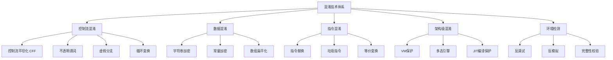
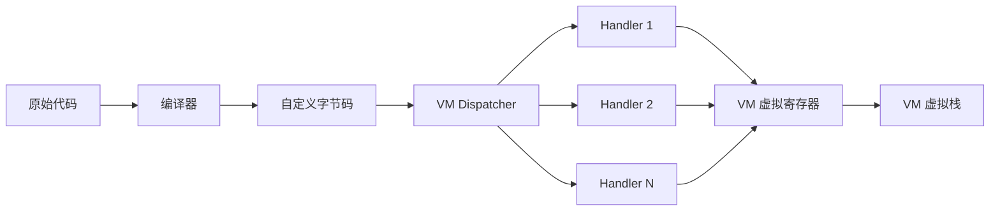
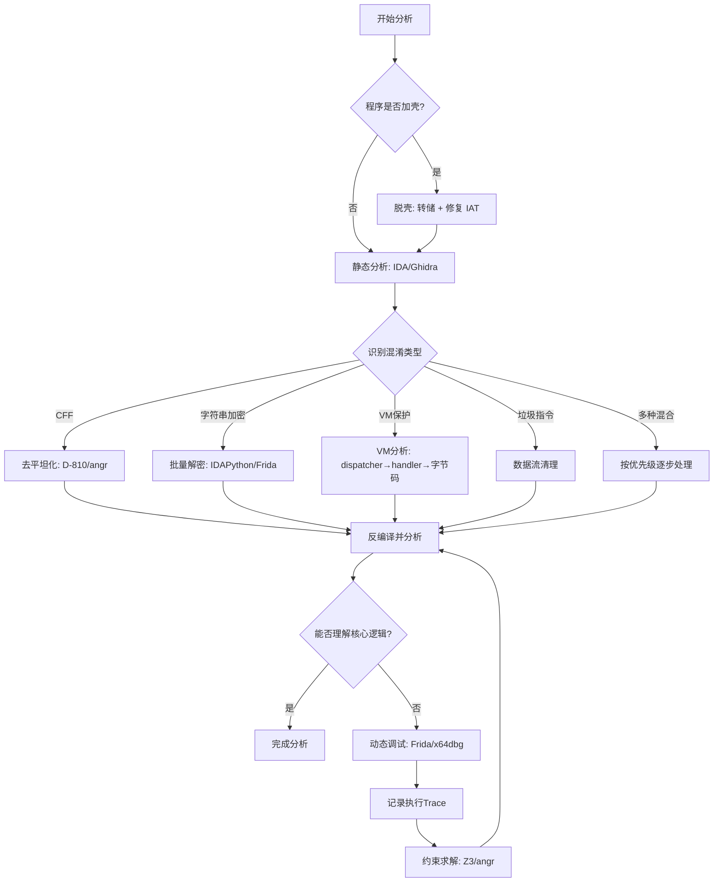

## 17.4 反混淆技术

混淆（Obfuscation）是软件保护的核心手段，通过变换代码结构、隐藏数据、引入虚假逻辑来增加逆向分析的难度。反混淆（Deobfuscation）则是逆向工程师必须掌握的对抗技能——理解混淆的本质，才能找到还原的路径。

本节从最基础的控制流平坦化出发，逐步深入字符串加密、虚拟机保护等高级混淆技术，覆盖识别方法、分析思路、自动化工具和实战案例。

### 17.4.1 混淆技术全景

在进入具体反混淆技术之前，先建立对混淆技术体系的整体认知。混淆技术按照作用层次可分为以下几类：

| 混淆层次 | 技术手段 | 目的 | 逆向难度 |
|---------|---------|------|---------|
| 控制流层 | 控制流平坦化、不透明谓词、虚假分支 | 破坏程序逻辑的可读性 | ★★★ |
| 数据层 | 字符串加密、常量折叠、数据编码 | 隐藏敏感数据和配置 | ★★ |
| 指令层 | 指令替换、垃圾指令插入、等价变换 | 干扰静态分析 | ★★ |
| 架构层 | 虚拟机保护、多态/变形代码 | 从根本上改变执行模型 | ★★★★★ |
| 环境层 | 反调试、反模拟、完整性校验 | 阻止动态分析 | ★★★ |

典型的商业保护方案往往同时使用多种技术。例如 VMProtect 同时包含控制流平坦化、虚拟机保护和反调试；Themida 则在此基础上增加了代码变形能力。



### 17.4.2 控制流平坦化（Control Flow Flattening）

控制流平坦化（Control Flow Flattening, CFF）是 OLLVM 项目引入的经典混淆技术，也是现代商业保护工具的标配功能。它通过将函数的原始控制流图"压平"为一个扁平的 switch-case 结构，使反汇编器和人工分析都难以还原程序逻辑。

#### CFF 的工作原理

原始的控制流图（CFG）中，函数的各个基本块之间存在跳转、分支、循环等关系。CFF 的变换过程如下：

1. **提取基本块**：将函数拆分为所有基本块（Basic Block）
2. **引入状态变量**：创建一个 dispatch 变量，每个基本块对应一个唯一的状态值
3. **构建 dispatcher**：创建一个 while(1) + switch(dispatch_var) 结构
4. **替换跳转**：将基本块之间的跳转替换为对 dispatch 变量的赋值
5. **打乱顺序**：随机打乱 case 的顺序，进一步混淆

变换前后的对比：

```text
// ===== 变换前 =====         // ===== 变换后 =====
int func(int x) {            int func(int x) {
  if (x > 0) {                 int state = 1;
    x = x * 2;                 while (1) {
    return x + 1;                switch (state) {
  } else {                         case 1:
    return 0;                        if (x > 0) state = 2;
  }                                  else state = 3;
}                                  break;
                                 case 2:
                                   x = x * 2;
                                   state = 4;
                                   break;
                                 case 3:
                                   return 0;
                                 case 4:
                                   return x + 1;
                               }
                             }
                           }
```

#### CFF 的识别特征

在 IDA Pro 或 Ghidra 中查看函数的 CFG 视图，CFF 混淆后的函数呈现以下特征：

- **蝶形结构**：CFG 图呈现蝴蝶或星形拓扑，中心节点是 dispatcher
- **大型循环**：函数内有一个 while(1) 循环
- **巨型 switch**：循环内包含一个 switch 语句，case 数量众多（通常 10~100+）
- **状态赋值**：每个 case 的末尾都会对状态变量赋新值
- **基本块碎片化**：原始逻辑被拆成大量小基本块
- **间接跳转减少**：case 之间的跳转全部通过状态变量实现

在 Hex-Rays 反编译器中，CFF 函数的伪代码通常包含一个 `while(1) { switch(v1) { ... } }` 结构，所有逻辑都嵌套在 switch 内部。

#### 去平坦化方法

去平坦化的核心思路是：识别状态变量，追踪状态转移关系，重建原始控制流。

**方法一：基于符号执行的自动化去平坦化**

这是最通用的方法，使用 angr 或 Miasm 等框架进行符号执行：

```python
import angr
import claripy

def deflatten_with_angr(binary_path, func_addr):
    """使用 angr 符号执行辅助去平坦化"""
    proj = angr.Project(binary_path, auto_load_libs=False)
    
    # 创建函数级 CFG
    cfg = proj.analyses.CFGFast(normalize=True)
    func = cfg.kb.functions[func_addr]
    
    # 识别 dispatcher 节点：被大量基本块引用的节点
    ref_counts = {}
    for block in func.blocks:
        for succ in block.successors():
            ref_counts[succ.addr] = ref_counts.get(succ.addr, 0) + 1
    
    # dispatcher 是被引用最多的块
    dispatcher_addr = max(ref_counts, key=ref_counts.get)
    print(f"[*] Dispatcher at: {hex(dispatcher_addr)}")
    
    # 对每个 case 块进行符号执行，确定状态转移
    state_transitions = {}
    for block in func.blocks:
        if block.addr == dispatcher_addr:
            continue
        # 模拟执行到块末尾，获取状态变量的赋值
        simgr = proj.factory.simgr(
            proj.factory.blank_state(addr=block.addr)
        )
        simgr.step()
        if simgr.active:
            for state in simgr.active:
                # 分析状态变量的新值
                pass
    
    return state_transitions
```

**方法二：基于 Hex-Rays Microcode 的去平坦化**

IDA Pro 的 Hex-Rays 反编译器在 microcode 层面提供了更强的分析能力。D-810 是一个基于 Hex-Rays microcode API 的去平坦化插件：

```python
# D-810 配置示例（用于 IDA Pro 7.5+）
# 定义 dispatcher 模式，让 D-810 自动识别并去平坦化

{
    "rules": [
        {
            "name": "ollvm_cff",
            "type": "pattern",
            "description": "OLLVM Control Flow Flattening",
            "pattern": {
                "dispatch_loop": "while(1) { switch(state) { ... } }",
                "state_var": "single_integer_variable",
                "case_blocks": "all_cases_assign_state"
            }
        }
    ]
}
```

D-810 的工作流程：先在 microcode 层面识别 dispatch 循环和状态变量，然后通过 microcode 优化 pass 将状态变量的赋值转换为直接跳转，最终重建原始的控制流图。

**方法三：基于动态执行 trace 的重建**

通过记录程序的实际执行路径，从 trace 中重建控制流：

```python
import frida
import json

def trace_execution_with_frida(target_process, func_addr):
    """使用 Frida 跟踪函数执行，记录状态转移"""
    session = frida.attach(target_process)
    
    script = session.create_script(f'''
    var funcAddr = ptr("{hex(func_addr)}");
    var stateHistory = [];
    
    Interceptor.attach(funcAddr, {{
        onEnter: function(args) {{
            this.states = [];
        }},
        onLeave: function(retval) {{
            send({{
                type: "trace",
                states: this.states
            }});
        }}
    }});
    
    // Hook dispatcher 的 switch 位置，记录每个状态值
    // 具体地址需要根据二进制分析确定
    ''')
    
    script.on('message', lambda msg, data: process_trace(msg))
    script.load()
```

**方法四：基于 LLVM pass 的预防性分析**

如果你有源码级别的理解需求，可以分析 LLVM 的 Obfuscation Pass：

```bash
# 查看 OLLVM 对 IR 的变换效果
clang -mllvm -fla -S -emit-llvm target.c -o flattened.ll

# 对比原始 IR 和混淆后的 IR
diff <(opt -S original.ll) <(opt -S flattened.ll)

# 使用自定义 LLVM pass 进行反混淆
# 需要识别 dispatch 变量并移除平坦化结构
```

#### 常用去平坦化工具

| 工具 | 平台 | 方法 | 适用场景 |
|------|------|------|---------|
| D-810 | IDA Pro 7.5+ | Microcode 优化 | OLLVM CFF、不透明谓词 |
| angr | 独立 | 符号执行 | 通用分析、自动化 |
| Miasm | 独立 | 中间表示分析 | 自定义分析流程 |
| Deflat | 独立 | 静态分析 + angr | OLLVM CFF 专用 |
| Ghidra P-Code | Ghidra | 中间表示优化 | 开源替代方案 |
| Hex-Rays Microcode | IDA Pro | 反编译器优化 | 复杂商业保护 |

#### 实战案例：去平坦化 OLLVM 混淆的 CrackMe

目标：一个使用 OLLVM `-fla` 选项编译的 CrackMe，验证函数包含 30 个 case 的 switch 结构。

步骤：

1. **识别函数边界**：在 IDA 中定位 `verify_key` 函数，观察到典型的蝶形 CFG
2. **确认状态变量**：switch 条件使用的 `v3` 变量就是状态变量
3. **收集状态转移**：遍历每个 case，记录 `v3` 的赋值目标
4. **重建 CFG**：根据状态转移关系绘制原始控制流
5. **提取逻辑**：还原后的函数是一个简单的线性校验流程

```text
// 去平坦化前（伪代码）
int verify_key(char *key) {
    int state = 0x12345;
    while (1) {
        switch (state) {
            case 0x12345: if (strlen(key)==16) state=0x23456; else state=0x99999; break;
            case 0x23456: v=key[0]^0x41; state=0x34567; break;
            case 0x34567: if (v==0x12) state=0x45678; else state=0x99999; break;
            // ... 28 more cases
            case 0x99999: return 0;
            case 0x88888: return 1;
        }
    }
}

// 去平坦化后（原始逻辑）
int verify_key(char *key) {
    if (strlen(key) != 16) return 0;
    if ((key[0] ^ 0x41) != 0x12) return 0;
    if ((key[1] ^ 0x42) != 0x34) return 0;
    // ... 线性校验链
    return 1;
}
```

### 17.4.3 字符串加密

字符串是程序分析的重要线索——函数名、错误信息、网络地址、配置参数都以字符串形式存在。保护工具通过加密这些字符串来切断分析者的信息来源。

#### 字符串加密的实现模式

**模式一：编译期 XOR 加密**

最简单的实现。编译时用固定密钥对字符串逐字节 XOR，运行时再 XOR 还原：

```c
// 编译期加密后的数据段
.data:00401000  db 72h, 14h, 55h, 3Ah, 00h  ; 加密后的 "Hello"

// 运行时解密函数
.text:00402000  decrypt:
.text:00402000      mov ecx, [esp+4]     ; 字符串地址
.text:00402004      mov al, [ecx]
.text:00402006      test al, al
.text:00402008      jz  done
.text:0040200A  loop:
.text:0040200A      xor al, 0x33         ; 固定密钥
.text:0040200C      mov [ecx], al
.text:0040200E      inc ecx
.text:0040200F      mov al, [ecx]
.text:00402011      test al, al
.text:00402013      jnz loop
.text:00402015  done:
.text:00402015      ret
```

**模式二：每字符串独立密钥**

每个字符串使用不同的密钥，密钥通常通过字符串的地址或索引计算得出：

```c
// 密钥 = 字符串地址的低字节
key = (uint8_t)(addr & 0xFF);
for (int i = 0; i < len; i++) {
    encrypted[i] = plaintext[i] ^ key ^ i;  // 密钥与位置异或
}
```

**模式三：AES/RC4 等强加密**

商业保护工具如 Themida、VMProtect 使用更强的加密算法。密钥通常分散在代码中或通过运行时计算得出。

**模式四：运行时动态生成**

字符串不是预先加密存储的，而是通过算术运算、查表等方式在运行时生成：

```c
// 字符串 "flag" 通过算术运算生成
char s[5];
s[0] = 102;        // 'f'
s[1] = 108;        // 'l'
s[2] = 97;         // 'a'
s[3] = 103;        // 'g'
s[4] = 0;
```

这种方式无法通过简单的密钥恢复，需要动态执行或模拟。

#### 静态解密方法

**方法一：IDAPython 批量解密脚本**

识别解密函数后，编写脚本遍历所有交叉引用并批量解密：

```python
import idaapi
import idc
import idautils
import struct

def find_decrypt_function():
    """识别解密函数：特征是包含 XOR 循环的基本块"""
    for func_ea in idautils.Functions():
        func_name = idc.get_func_name(func_ea)
        if func_name and 'decrypt' in func_name.lower():
            return func_ea
    
    # 如果没有明显的函数名，通过特征码搜索
    # 查找 xor + loop 模式
    for seg_ea in idautils.Segments():
        seg_end = idc.get_segm_end(seg_ea)
        ea = seg_ea
        while ea < seg_end:
            # 检查是否是 xor 指令在循环中
            mnem = idc.print_insn_mnem(ea)
            if mnem == "xor" and is_in_loop(ea):
                return idc.get_func_attr(ea, idc.FUNCATTR_START)
            ea = idc.next_head(ea)
    return None

def decrypt_xor_string(addr, length, key):
    """解密 XOR 加密的字符串"""
    result = bytearray()
    for i in range(length):
        encrypted_byte = idc.get_wide_byte(addr + i)
        decrypted_byte = encrypted_byte ^ (key & 0xFF)
        if decrypted_byte == 0:
            break
        result.append(decrypted_byte)
    return result.decode('ascii', errors='replace')

def batch_decrypt_strings(decrypt_func_addr):
    """批量解密所有通过解密函数处理的字符串"""
    decrypted_count = 0
    
    # 遍历解密函数的所有交叉引用
    for xref in idautils.CodeRefsTo(decrypt_func_addr, 0):
        # 向上回溯找到参数传递
        call_addr = xref
        str_addr = None
        str_len = None
        key = None
        
        # 分析调用前的指令，提取参数
        # x86: push 指令或寄存器传参
        # x64: rcx/rdx/r8/r9 或栈传参
        prev = idc.prev_head(call_addr)
        for _ in range(10):  # 最多回溯10条指令
            if prev == idc.BADADDR:
                break
            mnem = idc.print_insn_mnem(prev)
            if mnem == "push":
                operand = idc.get_operand_value(prev, 0)
                if str_addr is None:
                    str_addr = operand
                elif str_len is None:
                    str_len = operand
                elif key is None:
                    key = operand
            elif mnem in ("mov", "lea"):
                # 处理寄存器传参
                pass
            prev = idc.prev_head(prev)
        
        if str_addr and str_len and key:
            plaintext = decrypt_xor_string(str_addr, str_len, key)
            # 在 IDA 中添加注释
            idc.set_cmt(call_addr, f"Decrypted: {plaintext}", 0)
            # 将解密后的字符串写入数据段
            idc.create_strlit(str_addr, str_addr + len(plaintext) + 1)
            decrypted_count += 1
            print(f"[+] {hex(call_addr)}: {plaintext}")
    
    print(f"[*] Total decrypted: {decrypted_count}")

# 执行
decrypt_func = find_decrypt_function()
if decrypt_func:
    print(f"[*] Found decrypt function at {hex(decrypt_func)}")
    batch_decrypt_strings(decrypt_func)
```

**方法二：使用 IDAPython 的 Hex-Rays API 进行反编译级别解密**

```python
import ida_hexrays
import ida_funcs

def decrypt_via_decompiler(func_addr):
    """通过反编译器识别解密调用并自动解密"""
    cfunc = ida_hexrays.decompile(func_addr)
    if not cfunc:
        return
    
    class DecryptVisitor(ida_hexrays.ctree_parentee_t):
        def __init__(self):
            ida_hexrays.ctree_parentee_t.__init__(self)
            self.decrypt_calls = []
        
        def visit_insn(self, insn):
            if insn.op == ida_hexrays.cit_call:
                # 检查是否调用解密函数
                call_target = insn.cexpr.x.obj_ea
                if is_decrypt_function(call_target):
                    self.decrypt_calls.append(insn)
            return 0
    
    visitor = DecryptVisitor()
    visitor.apply_to(cfunc.body, None)
    print(f"Found {len(visitor.decrypt_calls)} decrypt calls")
```

#### 动态解密方法

**方法一：调试器脚本批量 dump**

在 x64dbg 或 GDB 中，让程序运行到解密完成后，直接读取内存中的明文字符串：

```python
# x64dbg Python 脚本
import x64dbg

def dump_decrypted_strings():
    """在解密函数返回后断点，dump 所有解密后的字符串"""
    # 设置解密函数的返回断点
    decrypt_addr = 0x401000
    x64dbg.BreakpointSet(decrypt_addr + 0x15, "dump_str_callback")
    
def dump_str_callback():
    """断点回调：读取解密后的字符串"""
    str_addr = x64dbg.GetReg("ecx")  # 假设字符串地址在 ecx 中
    plaintext = ""
    while True:
        ch = x64dbg.Read(str_addr, 1)
        if ch[0] == 0:
            break
        plaintext += chr(ch[0])
        str_addr += 1
    x64dbg.Log(f"Decrypted: {plaintext}")
```

**方法二：Frida Hook 解密函数**

```javascript
// frida -U -f com.target.app -l decrypt_hook.js
Java.perform(function() {
    // Native 函数 Hook
    var module = Module.findBaseAddress("libtarget.so");
    
    // 假设解密函数偏移已知
    var decrypt_func = module.add(0x1234);
    
    Interceptor.attach(decrypt_func, {
        onEnter: function(args) {
            this.addr = args[0];
            this.len = args[1].toInt32();
            console.log("[*] Decrypt called: addr=" + args[0] + " len=" + this.len);
        },
        onLeave: function(retval) {
            try {
                var plaintext = Memory.readUtf8String(retval, this.len);
                console.log("[+] Decrypted: " + plaintext);
            } catch(e) {
                console.log("[-] Failed to read decrypted string");
            }
        }
    });
});
```

**方法三：模拟执行解密**

使用 Unicorn Engine 模拟执行解密函数，不需要启动整个程序：

```python
from unicorn import *
from unicorn.x86_const import *
import struct

def emulate_decrypt(encrypted_data, key, decrypt_func_bytes):
    """使用 Unicorn 模拟执行解密函数"""
    mu = Uc(UC_ARCH_X86, UC_MODE_32)
    
    # 映射内存
    mu.mem_map(0x1000, 0x1000)  # 代码段
    mu.mem_map(0x2000, 0x1000)  # 数据段
    mu.mem_map(0x3000, 0x1000)  # 栈
    
    # 写入解密函数的机器码
    mu.mem_write(0x1000, decrypt_func_bytes)
    
    # 写入加密数据
    mu.mem_write(0x2000, encrypted_data)
    
    # 设置参数（stdcall: 栈传参）
    mu.reg_write(UC_X86_REG_ESP, 0x3800)
    mu.mem_write(0x3800 + 4, struct.pack("<I", 0x2000))   # 字符串地址
    mu.mem_write(0x3800 + 8, struct.pack("<I", len(encrypted_data)))  # 长度
    mu.mem_write(0x3800 + 12, struct.pack("<I", key))       # 密钥
    
    # 设置返回地址
    mu.mem_write(0x3800, struct.pack("<I", 0x9999))
    
    # 执行
    mu.emu_start(0x1000, 0x9999)
    
    # 读取解密后的数据
    decrypted = mu.mem_read(0x2000, len(encrypted_data))
    return bytes(decrypted).split(b'\x00')[0].decode('ascii')
```

### 17.4.4 虚拟机保护（VM Protection）

虚拟机保护是目前最高级的代码保护技术。它将原始的机器码编译为自定义的字节码（Bytecode），由内嵌的虚拟机解释执行。分析者面对的不再是 x86/ARM 指令，而是一个完全陌生的指令集——每个保护工具的 VM 都有自己的寄存器模型、栈结构和指令编码。

#### VM 保护的架构

一个典型的 VM 保护系统包含以下组件：



- **编译器（Compiler）**：将原始机器码转换为自定义字节码
- **字节码（Bytecode）**：加密或编码后的指令序列，存储在数据段
- **Dispatcher（指令分发器）**：VM 的核心循环，读取字节码并分发到对应的 handler
- **Handler（指令处理器）**：每个 handler 实现一个虚拟指令的功能
- **虚拟寄存器/栈**：VM 维护自己的寄存器文件和栈结构，独立于物理 CPU

#### 主流 VM 保护工具对比

| 工具 | 厂商 | 平台 | VM 复杂度 | 反分析难度 |
|------|------|------|----------|-----------|
| VMProtect | VMProtect Software | x86/x64/ARM | ★★★★ | 极高 |
| Themida | Oreans Technologies | x86/x64 | ★★★★ | 极高 |
| Code Virtualizer | Oreans Technologies | x86/x64 | ★★★ | 高 |
| Enigma Protector | Enigma | x86/x64 | ★★★ | 高 |
| DexGuard | Guardsquare | Android/Dalvik | ★★★ | 高 |
| iJVM | 自研 | iOS/ARM | ★★★★ | 极高 |

#### VM 分析方法论

**第一步：定位 VM 入口**

VM 入口是原始代码进入虚拟机保护区域的跳转点。识别方法：

```text
; VM 入口的典型模式
.text:00401000  push    ebp              ; 保存寄存器
.text:00401001  mov     ebp, esp
.text:00401003  pushad                   ; 保存所有寄存器
.text:00401004  push    offset bytecode  ; 推入字节码地址
.text:00401009  push    offset vm_regs   ; 推入虚拟寄存器结构
.text:0040100E  call    vm_dispatcher    ; 进入 VM
.text:00401013  popad                    ; 恢复寄存器
.text:00401014  pop     ebp
.text:00401015  ret
```

特征：`pushad`/`popad` 保护现场 + 加载字节码地址 + 调用 dispatcher。

**第二步：分析 Dispatcher**

Dispatcher 是 VM 的核心循环，通常是一个 switch-case 或跳转表：

```c
// 典型 dispatcher 伪代码
void vm_dispatch(uint8_t *bytecode, vm_regs_t *regs) {
    uint8_t opcode;
    while (1) {
        opcode = *bytecode++;  // 读取操作码
        
        // 操作码可能是加密的
        opcode = opcode ^ regs->key;
        // 或者通过查表解码
        opcode = decode_table[opcode];
        
        switch (opcode) {
            case 0x00: handler_mov_reg_imm(regs, &bytecode); break;
            case 0x01: handler_add_reg_reg(regs, &bytecode); break;
            case 0x02: handler_push_reg(regs, &bytecode); break;
            case 0x03: handler_pop_reg(regs, &bytecode); break;
            // ... 更多 handler
            case 0xFF: handler_halt(regs, &bytecode); return;
        }
    }
}
```

在 IDA 中分析 dispatcher 的关键步骤：

1. 定位 dispatch 循环：找到 `while(1)` 和 `switch` 结构
2. 识别 opcode 读取：通常是 `movzx eax, byte ptr [rdx]` 后跟 `inc rdx`
3. 找到跳转表：`jmp [rax*8 + table_base]` 或等价结构
4. 确认操作码是否有预处理（XOR、查表等）

**第三步：逆向 Handler**

每个 handler 实现一个虚拟指令。分析方法是逐个识别每个 handler 的功能：

```python
import idaapi
import idc
import idautils

def analyze_vm_handlers(dispatch_table_addr, num_handlers):
    """分析 VM 的所有 handler"""
    handlers = {}
    
    for i in range(num_handlers):
        handler_addr = idc.get_qword(dispatch_table_addr + i * 8)
        if handler_addr == 0:
            continue
        
        # 分析 handler 的行为
        handler_info = analyze_single_handler(handler_addr)
        handlers[i] = handler_info
        
        # 在 IDA 中添加注释
        idc.set_cmt(handler_addr, f"VM Handler 0x{i:02X}: {handler_info['desc']}", 0)
    
    return handlers

def analyze_single_handler(handler_addr):
    """分析单个 handler 的功能"""
    info = {'addr': handler_addr, 'desc': 'unknown', 'operands': []}
    
    # 跳过 handler 的前缀（读取操作数等）
    ea = handler_addr
    end = find_handler_end(handler_addr)
    
    # 分析 handler 的核心操作
    while ea < end:
        mnem = idc.print_insn_mnem(ea)
        
        if mnem == "add":
            info['desc'] = 'ADD operation'
        elif mnem == "sub":
            info['desc'] = 'SUB operation'
        elif mnem == "xor":
            info['desc'] = 'XOR operation'
        elif mnem == "mov":
            # 区分寄存器到寄存器、立即数到寄存器等
            pass
        
        ea = idc.next_head(ea)
    
    return info

def find_handler_end(handler_addr):
    """找到 handler 的结束地址（通常是 jmp 回 dispatcher 或 ret）"""
    ea = handler_addr
    while True:
        mnem = idc.print_insn_mnem(ea)
        # handler 通常以 jmp 回 dispatcher 或 ret 结束
        if mnem == "jmp" or mnem == "ret":
            return ea
        ea = idc.next_head(ea)
        if ea == idc.BADADDR:
            break
    return ea
```

**第四步：构建自定义反汇编器**

理解了所有 handler 后，就可以编写自定义的反汇编器，将字节码转换为可读的虚拟指令：

```python
class VMDisassembler:
    """自定义 VM 字节码反汇编器"""
    
    def __init__(self, handler_table, decode_key=None):
        self.handlers = handler_table  # {opcode: handler_info}
        self.decode_key = decode_key
    
    def decode_opcode(self, raw_opcode):
        """解码操作码（处理加密/编码）"""
        if self.decode_key:
            return raw_opcode ^ self.decode_key
        return raw_opcode
    
    def disassemble(self, bytecode_data, start_offset=0):
        """反汇编字节码"""
        instructions = []
        offset = start_offset
        
        while offset < len(bytecode_data):
            # 读取操作码
            raw_opcode = bytecode_data[offset]
            opcode = self.decode_opcode(raw_opcode)
            
            if opcode == 0xFF:  # HALT
                instructions.append((offset, "HALT"))
                break
            
            if opcode not in self.handlers:
                instructions.append((offset, f"DB 0x{raw_opcode:02X}  ; unknown"))
                offset += 1
                continue
            
            handler = self.handlers[opcode]
            inst_str = handler['mnemonic']
            operands = []
            offset += 1
            
            # 根据 handler 类型读取操作数
            for op_type in handler.get('operands', []):
                if op_type == 'reg':
                    reg_idx = bytecode_data[offset]
                    operands.append(f"R{reg_idx}")
                    offset += 1
                elif op_type == 'imm8':
                    imm = bytecode_data[offset]
                    operands.append(f"0x{imm:02X}")
                    offset += 1
                elif op_type == 'imm32':
                    imm = int.from_bytes(bytecode_data[offset:offset+4], 'little')
                    operands.append(f"0x{imm:08X}")
                    offset += 4
                elif op_type == 'addr':
                    addr = int.from_bytes(bytecode_data[offset:offset+4], 'little')
                    operands.append(f"0x{addr:08X}")
                    offset += 4
            
            instructions.append((offset, f"{inst_str} {', '.join(operands)}"))
        
        return instructions

# 使用示例
handlers = {
    0x00: {'mnemonic': 'MOV',  'operands': ['reg', 'imm32']},
    0x01: {'mnemonic': 'ADD',  'operands': ['reg', 'reg']},
    0x02: {'mnemonic': 'SUB',  'operands': ['reg', 'reg']},
    0x03: {'mnemonic': 'PUSH', 'operands': ['reg']},
    0x04: {'mnemonic': 'POP',  'operands': ['reg']},
    0x05: {'mnemonic': 'XOR',  'operands': ['reg', 'reg']},
    0x06: {'mnemonic': 'CMP',  'operands': ['reg', 'imm8']},
    0x07: {'mnemonic': 'JZ',   'operands': ['addr']},
    0x08: {'mnemonic': 'JMP',  'operands': ['addr']},
    0xFF: {'mnemonic': 'HALT', 'operands': []},
}

disasm = VMDisassembler(handlers, decode_key=0x37)
bytecode = bytes.fromhex("371804000000003719000137180000000037FF")
# 对每个字节 XOR 0x37 后解码
for offset, inst in disasm.disassemble(bytecode):
    print(f"  {offset:04X}: {inst}")
```

**第五步：基于执行 trace 的分析**

对于复杂的 VM，纯静态分析可能不够，需要结合动态执行 trace：

```python
import frida
import json

def trace_vm_execution(target_pid, dispatcher_addr):
    """跟踪 VM dispatcher 的每次分发，构建执行 trace"""
    
    session = frida.attach(target_pid)
    script = session.create_script(f'''
    var dispatcherAddr = ptr("{hex(dispatcher_addr)}");
    var trace = [];
    
    // 在 dispatcher 的 opcode 读取位置 hook
    Interceptor.attach(dispatcherAddr.add(0x10), {{
        onEnter: function(args) {{
            // 读取当前 opcode
            var opcode = this.context.rax & 0xFF;
            trace.push({{
                "opcode": opcode,
                "ip": this.context.rip.toString(),
                "sp": this.context.rsp.toString()
            }});
            
            if (trace.length % 100 == 0) {{
                send({{type: "progress", count: trace.length}});
            }}
        }}
    }});
    
    // 在 VM 退出时发送完整 trace
    rpc.exports.getTrace = function() {{
        return trace;
    }};
    ''')
    
    script.on('message', lambda msg, data: print(msg['payload']))
    script.load()
    
    return script
```

使用 trace 数据进行分析：

1. **构建 handler 序列**：从 trace 中提取 opcode 序列
2. **识别模式**：寻找重复的 opcode 模式，对应常见的代码结构
3. **约束求解**：将 trace 路径作为约束，使用 Z3 求解关键值
4. **等价性验证**：将 VM 执行结果与原始逻辑进行对比

#### 高级 VM 分析技术

**基于 LLVM 的 lifting**

将 VM 字节码提升到 LLVM IR，然后使用 LLVM 的优化 pass 简化：

```python
from llvmlite import ir, binding

def lift_vm_bytecode_to_llvm(bytecode_handlers):
    """将 VM 字节码提升为 LLVM IR"""
    module = ir.Module(name="vm_lifted")
    func_type = ir.FunctionType(ir.VoidType(), [])
    func = ir.Function(module, func_type, name="vm_exec")
    block = func.append_basic_block(name="entry")
    builder = ir.IRBuilder(block)
    
    # 创建虚拟寄存器
    regs = [builder.alloca(ir.IntType(64), name=f"r{i}") for i in range(16)]
    
    # 将每个 handler 翻译为 LLVM IR 指令
    for handler in bytecode_handlers:
        if handler['op'] == 'MOV':
            builder.store(
                ir.Constant(ir.IntType(64), handler['imm']),
                regs[handler['dst']]
            )
        elif handler['op'] == 'ADD':
            val1 = builder.load(regs[handler['src1']])
            val2 = builder.load(regs[handler['src2']])
            result = builder.add(val1, val2)
            builder.store(result, regs[handler['dst']])
    
    builder.ret_void()
    
    # 使用 LLVM 优化 pass 简化
    binding.initialize()
    binding.initialize_native_target()
    llvm_module = binding.parse_assembly(str(module))
    llvm_module.verify()
    
    return str(llvm_module)
```

**基于 Miasm 的自动化 VM 分析**

Miasm 是一个 Python 逆向工程框架，提供了中间表示（IR）和符号执行能力：

```python
from miasm.analysis.machine import Machine
from miasm.core.locationdb import LocationDB

def analyze_vm_with_miasm(binary_path):
    """使用 Miasm 分析 VM 结构"""
    loc_db = LocationDB()
    machine = Machine("x86_32")
    
    with open(binary_path, 'rb') as f:
        data = f.read()
    
    # 反汇编 dispatcher
    disasm_engine = machine.dis_engine(data, loc_db=loc_db)
    
    # 识别 dispatch 循环
    # Miasm 的 IR 可以帮助识别循环结构
    ircfg = machine.ira(loc_db)
    # ... 分析 IR 级别的控制流
```

### 17.4.5 不透明谓词（Opaque Predicates）

不透明谓词是表达式的值在运行前就能确定，但编译器/分析工具难以静态推断的条件。混淆工具用它们插入永远不会执行（或总是执行）的虚假分支。

#### 常见不透明谓词模式

```c
// 模式1：数学恒等式 —— 总是 true
if ((x * x + x) % 2 == 0)  { real_code(); }    // x*(x+1) 总是偶数

// 模式2：指针别名 —— 总是 true  
if (arr + 1 > arr) { real_code(); }  // 指针比较

// 模式3：虚假分支 —— 永远不会执行
if (rand() * 0 == 0) { dead_code(); }  // rand()*0 总是 0

// 模式4：基于不可达状态的判断
int x = 5;
// ... x never modified ...
if (x < 3) { junk_code(); }  // 永远 false
```

#### 识别和消除方法

1. **符号执行**：使用 angr/Z3 对条件进行求解，判断是否恒真/恒假
2. **数据流分析**：追踪变量的定义-使用链，识别不可变的条件
3. **模式匹配**：识别已知的不透明谓词模式（数学恒等式等）
4. **约束求解**：将路径约束交给 SMT 求解器，判断路径可行性

```python
import z3

def check_opaque_predicate(condition_expr, variable_ranges=None):
    """使用 Z3 检测不透明谓词"""
    solver = z3.Solver()
    
    # 检查是否恒真：尝试找到反例
    solver.add(z3.Not(condition_expr))
    result = solver.check()
    
    if result == z3.unsat:
        return "always_true"
    
    # 检查是否恒假：尝试找到满足条件的例子
    solver.reset()
    solver.add(condition_expr)
    result = solver.check()
    
    if result == z3.unsat:
        return "always_false"
    
    return "conditional"  # 非不透明谓词

# 示例：检测 (x * x + x) % 2 == 0 是否恒真
x = z3.BitVec('x', 32)
expr = (x * x + x) % 2 == 0
result = check_opaque_predicate(expr)
print(f"Predicate is: {result}")  # always_true
```

### 17.4.6 指令替换与垃圾指令

#### 指令替换

混淆工具将简单的指令替换为等价但复杂的指令序列：

| 原始指令 | 替换形式 | 说明 |
|---------|---------|------|
| `mov eax, 0` | `xor eax, eax` | 等价零赋值 |
| `add eax, 1` | `sub eax, -1` | 等价加法 |
| `test eax, eax` | `and eax, eax` | 等价零测试 |
| `jmp target` | `push target; ret` | 间接跳转 |
| `call func` | `push ret_addr; jmp func` | 间接调用 |
| `cmp eax, ebx` | `sub eax, ebx; ...` | 等价比较 |

更激进的替换可能引入大量算术等价变换：

```nasm
; 原始: x + y
; 替换为:
mov eax, x
mov ebx, y
mov ecx, eax
not ecx          ; ~x
not ebx          ; ~y
and ecx, ebx    ; ~x & ~y
not ecx          ; ~(~x & ~y) = x | y
and eax, ebx    ; ~x & y (不对，这只是举例)
; 最终通过复杂的位运算得到 x + y
```

#### 垃圾指令插入

在有效指令之间插入不影响程序逻辑的垃圾指令：

```nasm
; 原始代码
mov eax, [ebp+8]
add eax, 1
mov [ebp-4], eax

; 插入垃圾指令后
mov eax, [ebp+8]
push ecx               ; 垃圾
mov edx, 0xDEADBEEF   ; 垃圾
xor ecx, edx          ; 垃圾
pop ecx                ; 垃释
add eax, 1
pushfd                 ; 垃圾
cmp edx, ecx          ; 垃圾
popfd                  ; 垃圾
mov [ebp-4], eax
```

#### 反检测方法

1. **数据流分析**：追踪每个寄存器/内存位置的定义-使用链，识别无用指令
2. **副作用分析**：标记每条指令的副作用，移除无副作用且结果未被使用的指令
3. **控制流等价**：在 IR 层面进行规范化，消除等价变换的差异

### 17.4.7 反混淆工具链

完整的反混淆工作通常需要组合多个工具：

| 工具 | 用途 | 平台 |
|------|------|------|
| IDA Pro + D-810 | 去平坦化、不透明谓词消除 | Windows/Linux/macOS |
| Ghidra | 免费反编译器，支持脚本扩展 | 跨平台 |
| angr | 符号执行、程序分析 | Python |
| Miasm | 中间表示分析、符号执行 | Python |
| Unicorn Engine | 模拟执行 | 跨平台 |
| Z3 | SMT 约束求解 | 跨平台 |
| Frida | 动态插桩、运行时 Hook | 跨平台 |
| x64dbg | Windows 调试器 | Windows |
| Binary Ninja | 反汇编器，支持中间语言 | 跨平台 |
| Triton | 动态二进制分析框架 | 跨平台 |

### 17.4.8 反混淆实战工作流

面对一个被保护的程序，推荐的分析流程：



### 17.4.9 常见误区与注意事项

| 误区 | 正确做法 |
|------|---------|
| 直接在混淆后的伪代码上分析 | 先进行去混淆处理，再分析 |
| 只用静态分析或只用动态分析 | 静态+动态结合，互相补充 |
| 尝试一次去掉所有混淆 | 分层处理，每次去掉一种混淆 |
| 忽略环境检测（反调试等） | 先绕过环境检测，再进行分析 |
| 对 VM 保护直接放弃 | 从 dispatcher 入手，逐步逆向 |
| 相信反编译器输出的完美结果 | 反编译器在混淆代码上可能出错，需交叉验证 |
| 忽略操作码的编码/加密 | 确认是否有 XOR、查表等预处理 |

### 17.4.10 进阶：自定义反混淆框架

对于需要反复分析同类型混淆的场景，建议构建自己的反混淆框架：

```python
class DeobfuscationFramework:
    """可扩展的反混淆框架"""
    
    def __init__(self, binary_path):
        self.binary_path = binary_path
        self.passes = []
    
    def add_pass(self, pass_func, priority=0):
        """注册一个反混淆 pass"""
        self.passes.append((priority, pass_func))
        self.passes.sort(key=lambda x: x[0])
    
    def run(self):
        """按优先级执行所有 pass"""
        for priority, pass_func in self.passes:
            print(f"[*] Running pass: {pass_func.__name__} (priority={priority})")
            pass_func(self.binary_path)
            print(f"[+] Pass complete: {pass_func.__name__}")

# 注册标准 pass
fw = DeobfuscationFramework("target.exe")
fw.add_pass(remove_dead_code, priority=1)           # 先清理垃圾指令
fw.add_pass(resolve_opaque_predicates, priority=2)   # 再消除不透明谓词
fw.add_pass(deflatten_cff, priority=3)               # 然后去平坦化
fw.add_pass(decrypt_strings, priority=4)             # 最后解密字符串
fw.run()
```

反混淆是一场持久战。保护技术在不断演进，分析方法也需要持续更新。核心原则不变：理解混淆的原理，选择合适的工具，分层逐步还原。
