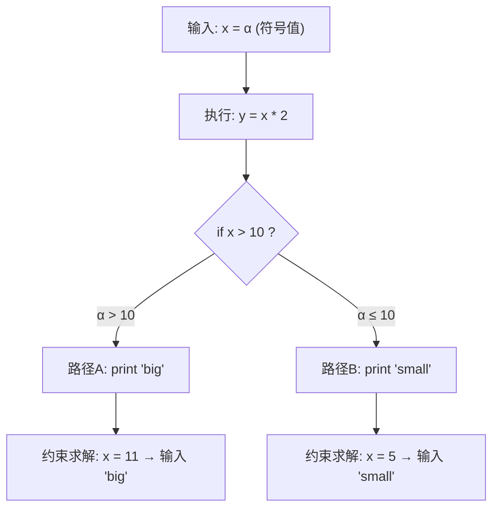
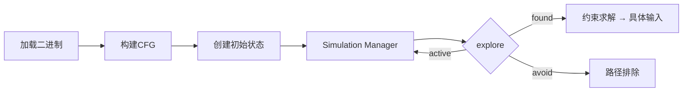
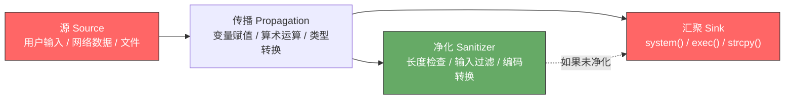
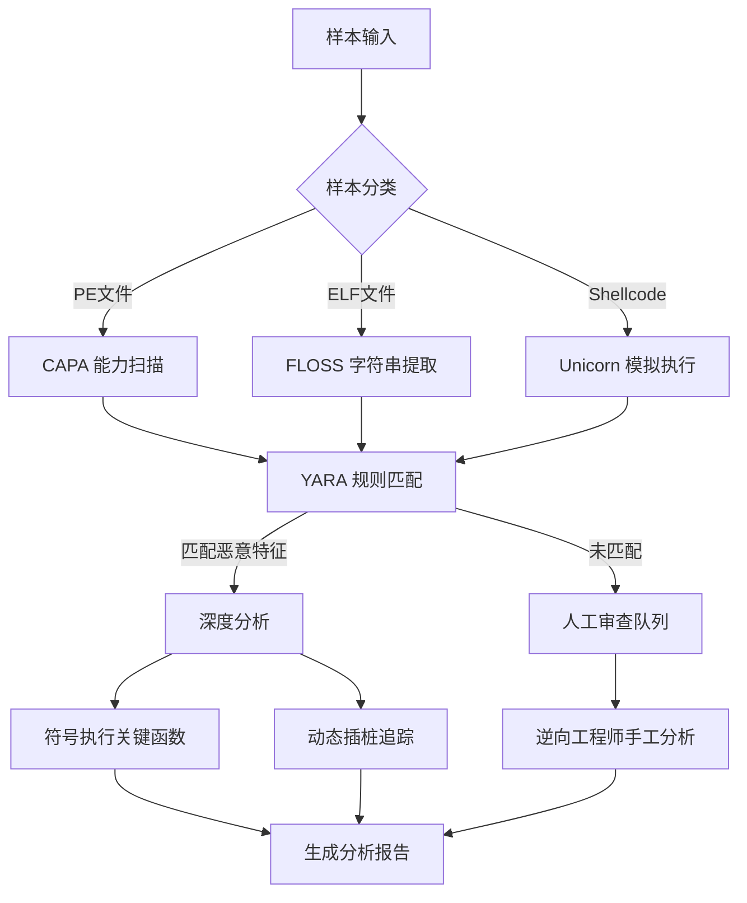
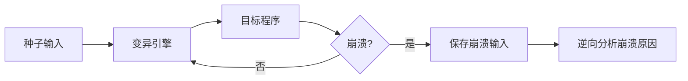

## 17.5 自动化分析

手工逆向是基本功，但面对一个拥有数万个函数的大型二进制、一批需要快速筛查的恶意样本、或者一个需要穷举所有执行路径才能找到漏洞的程序时，人力是瓶颈。自动化分析的核心思想是：**把人类的分析经验编码为可重复执行的程序，让机器承担重复性和穷举性的工作，人类专注于需要判断力的决策环节。**

自动化分析不是要取代逆向工程师，而是要增强他。一个熟练使用自动化工具的逆向工程师，效率可以比纯手工分析高出一个数量级。本节从四个维度展开：符号执行（路径探索自动化）、污点分析（数据流追踪自动化）、模拟执行（代码片段提取自动化）、以及实用工具链（模式匹配、能力识别、二进制差异比较自动化）。

### 17.5.1 符号执行：让机器帮你穷举路径

#### 道：符号执行的本质

普通程序执行使用**具体值**（比如 `x = 5`），符号执行使用**符号变量**（比如 `x = α`）。当程序遇到分支条件 `if (x > 10)` 时，普通执行只能走一条路；符号执行则同时走两条路，并在每条路径上记录约束条件：路径A的约束是 `α > 10`，路径B的约束是 `α ≤ 10`。



当你需要找到「让程序执行到某个特定地址」的输入时，符号执行可以从目标地址**反向求解**出满足所有路径约束的具体输入值。这在以下场景中价值巨大：

- **CTF逆向题**：已知flag检查函数的地址，自动求解正确输入
- **漏洞挖掘**：探索是否存在到达某个危险操作（如 `strcpy`）的路径
- **协议逆向**：找到触发特定服务端响应的客户端请求
- **补丁分析**：找出补丁前后行为分叉的输入

符号执行的数学基础是**约束满足问题（CSP）**。每条执行路径产生一组约束条件，SMT求解器（如Z3）负责判断这组约束是否有解，如果有解则返回一个具体的满足约束的值。

#### 法：路径爆炸与应对策略

符号执行面临的最大技术挑战是**路径爆炸（Path Explosion）**。一个含有 `n` 个独立 `if` 分支的程序理论上产生 `2^n` 条路径。循环和递归更严重——一个 `while` 循环可能产生无穷多条路径。

应对路径爆炸的核心策略：

| 策略 | 原理 | 适用场景 | 代价 |
|------|------|---------|------|
| **路径剪枝** | 利用约束不可满足性排除无效路径 | 有大量不可达分支的代码 | 需要SMT求解器参与 |
| **状态合并** | 在汇合点合并多条路径的状态 | 路径汇合频繁的结构化代码 | 可能丢失精度 |
| **启发式搜索** | 优先探索"更有价值"的路径 | 需要快速找到特定目标 | 可能遗漏目标路径 |
| **循环展开限制** | 限制循环的最大展开次数 | 含大量循环的代码 | 丢失深层迭代信息 |
| **懒初始化** | 延迟分配符号变量直到实际使用 | 含复杂数据结构的程序 | 增加求解复杂度 |
| **VEX IR** | 使用中间表示简化约束 | 跨架构分析 | IR转换开销 |

#### 术：Angr 符号执行框架深度使用

Angr 是目前最强大的二进制符号执行框架，支持x86、x64、ARM、MIPS等多种架构。它的工作流程如下：



**基础用法：自动求解输入**

```python
import angr
import claripy

# 加载二进制文件，auto_load_libs=False 避免加载动态库
# 如果程序依赖动态库的符号执行行为，需要设置为 True 或用 hooks 替代
p = angr.Project('./target', auto_load_libs=False)

# 创建初始状态：entry_state() 从程序入口开始
# 也可以用 call_state(addr) 从指定函数开始
state = p.factory.entry_state()

# 创建模拟管理器：管理所有活跃的执行状态
simgr = p.factory.simulation_manager(state)

# explore() 是最常用的探索方法
# find: 到达这些地址时认为找到了一个"成功"状态
# avoid: 到达这些地址时丢弃该状态（如错误处理、exit）
simgr.explore(find=0x401234, avoid=0x401250)

if simgr.found:
    found = simgr.found[0]
    # 获取满足路径约束的 stdin 输入
    stdin_data = found.posix.dumps(0)
    print(f"满足条件的输入: {stdin_data}")
    # 如果输入是字符串，直接解码
    try:
        print(f"输入解码: {stdin_data.decode('ascii')}")
    except UnicodeDecodeError:
        print(f"输入(hex): {stdin_data.hex()}")
else:
    print("未找到满足条件的路径")
    print(f"活跃状态数: {len(simgr.active)}")
    print(f"错误状态数: {len(simgr.errored)}")
```

**进阶用法：符号化特定变量**

大多数真实程序从文件或网络读取数据，而非直接从stdin。你可以将任意内存区域符号化：

```python
import angr
import claripy

p = angr.Project('./target', auto_load_libs=False)
state = p.factory.entry_state()

# 场景1：符号化一个缓冲区（假设程序从某地址读取32字节数据）
buf_addr = 0x601000  # .bss 段中的缓冲区地址
buf_size = 32
buf_symbolic = claripy.BVS('input_buf', buf_size * 8)  # BVS = BitVecSymbolic
state.memory.store(buf_addr, buf_symbolic)

# 场景2：符号化命令行参数
# argv[0] 是程序名，argv[1] 是我们关心的参数
arg1 = claripy.BVS('arg1', 8 * 16)  # 16字节的符号参数
state = p.factory.entry_state(args=['./target', arg1])

# 场景3：符号化环境变量
env_var = claripy.BVS('env_key', 8 * 32)
state = p.factory.entry_state(
    args=['./target'],
    add_options={angr.options.ZERO_FILL_UNCONSTRAINED_MEMORY}
)
```

**进阶用法：Hook 外部函数**

真实二进制往往调用大量库函数（`printf`、`malloc`、网络函数等），完整模拟这些函数既慢又容易出错。Hook 是将这些函数替换为简化的模拟实现：

```python
import angr
from angr.procedures import SIM_PROCEDURES

p = angr.Project('./target', auto_load_libs=False)

# 方法1：使用 angr 内置的 SimProcedures（覆盖 libc 函数）
p.hook_symbol('printf', angr.SIM_PROCEDURES['libc']['printf']())
p.hook_symbol('malloc', angr.SIM_PROCEDURES['libc']['malloc']())
p.hook_symbol('strlen', angr.SIM_PROCEDURES['libc']['strlen']())

# 方法2：自定义 Hook —— 替换复杂的业务函数
class MyCryptoHook(angr.SimProcedure):
    """假设目标程序调用了一个复杂的加密函数，
    我们用简化的模拟替代它以加速符号执行"""
    def run(self, buf_ptr, buf_len):
        # 读取参数（angr自动处理ABI调用约定）
        # 直接返回一个符号化的返回值，跳过实际加密逻辑
        return self.state.solver.BVS('crypto_result', 64)

p.hook_symbol('complex_encrypt', MyCryptoHook())

# 方法3：Hook 地址而非符号名（适用于无符号的二进制）
class InlineCheckHook(angr.SimProcedure):
    def run(self):
        # 假设 0x401500 处有一个复杂的反调试检查
        # 直接返回0表示"未检测到调试器"
        return 0

p.hook(0x401500, InlineCheckHook(), length=5)  # length = 被覆盖指令的长度
```

**进阶用法：路径探索策略控制**

```python
import angr

p = angr.Project('./target', auto_load_libs=False)
state = p.factory.entry_state()
simgr = p.factory.simulation_manager(state)

# 策略1：使用 Veritesting（自动合并相似路径，减少爆炸）
# angr 8+ 默认启用，如未启用可手动添加
simgr.use_technique(angr.exploration_techniques.Veritesting())

# 策略2：深度优先搜索（优先深入探索单条路径）
simgr.use_technique(angr.exploration_techniques.DFS())

# 策略3：循环限制（防止无限循环消耗资源）
simgr.use_technique(angr.exploration_techniques.LoopSeer(bound=50))

# 策略4：限流器（限制同时活跃的状态数）
simgr.use_technique(angr.exploration_techniques.Threads(thread_count=4))

# 手动控制探索过程（比 explore() 更精细）
for i in range(100):  # 最多探索100轮
    if not simgr.active:
        break
    simgr.step()
    
    # 每10轮打印状态摘要
    if i % 10 == 0:
        print(f"第{i}轮: active={len(simgr.active)}, "
              f"found={len(simgr.found)}, "
              f"avoided={len(simgr.avoided)}, "
              f"deadended={len(simgr.deadended)}")
    
    # 动态检查：如果某个活跃状态满足条件，手动移入found
    for active_state in simgr.active:
        if active_state.addr == 0x401234:
            simgr.move('active', 'found', filter_func=lambda s: s is active_state)
```

**实战案例：破解 CTF 逆向题的密码检查**

假设有一个二进制程序，读取用户输入后经过一系列变换，与硬编码的期望值比较：

```python
import angr
import claripy

p = angr.Project('./crackme', auto_load_libs=False)

# 从 main 函数开始，而非程序入口（跳过初始化代码）
# 需要先用反汇编器确定 main 的地址
main_addr = 0x401150
state = p.factory.call_state(main_addr)

# 为 stdin 创建 32 字节的符号输入
flag = claripy.BVS('flag', 8 * 32)
state.posix.files[0].read_pos = 0
state.posix.files[0].write_pos = 0
state.posix.store(0, flag)

# 添加约束：输入必须是可打印ASCII字符
for i in range(32):
    byte = flag.get_byte(i)
    state.solver.add(byte >= 0x20)  # 空格以上
    state.solver.add(byte <= 0x7e)  # '~'以下

simgr = p.factory.simulation_manager(state)

# 假设 0x401200 是输出 "Correct!" 的地址，0x401250 是输出 "Wrong!" 的地址
simgr.explore(find=0x401200, avoid=0x401250)

if simgr.found:
    found = simgr.found[0]
    solution = found.solver.eval(flag, cast_to=bytes)
    # 截取到第一个 \x00（C字符串结束符）
    null_idx = solution.index(b'\x00')
    print(f"Flag: {solution[:null_idx].decode('ascii')}")
```

#### 术：Z3 约束求解器

Angr 内部使用 Z3 作为约束求解器，但你也可以直接使用 Z3 来解决逆向中的约束问题，无需完整运行目标程序：

```python
from z3 import *

# 场景：逆向出一个验证算法，直接用 Z3 求解正确输入
# 假设逆向得到的验证逻辑是：
#   input[0] ^ input[3] == 0x1a
#   input[1] + input[2] == 0xb4
#   input[0] * input[1] == 0x1c8
#   input[2] ^ input[1] == 0x0e

solver = Solver()

# 声明4个字节变量
x = [BitVec(f'x{i}', 8) for i in range(4)]

# 添加约束
solver.add(x[0] ^ x[3] == 0x1a)
solver.add(x[1] + x[2] == 0xb4)
solver.add(x[0] * x[1] == 0x1c8)
solver.add(x[2] ^ x[1] == 0x0e)
# 可打印字符约束
for i in range(4):
    solver.add(x[i] >= 0x20, x[i] <= 0x7e)

if solver.check() == sat:
    model = solver.model()
    result = bytes([model[x[i]].as_long() for i in range(4)])
    print(f"解: {result}")
else:
    print("无解")
```

直接使用 Z3 的优势是速度——不需要模拟执行完整的程序路径，只需要处理验证函数的数学逻辑。在 CTF 竞赛中，Z3 经常被用来直接求解复杂的约束系统。

#### 局限性与注意事项

符号执行并非万能银弹。了解其局限性才能正确使用：

| 局限性 | 具体表现 | 缓解方案 |
|--------|---------|---------|
| **路径爆炸** | 分支多的程序状态数指数增长 | Veritesting、循环限制、聚焦关键路径 |
| **环境交互** | 文件I/O、网络、系统调用难以符号化 | SimProcedures Hook、具体值+符号值混合执行 |
| **浮点运算** | 浮点约束的求解开销极大 | 用整数近似或绕过浮点比较 |
| **密码学操作** | AES/SHA等哈希函数的约束几乎不可解 | Hook密码学函数，用具体值执行 |
| **反符号执行** | 程序刻意构造使符号执行低效的代码 | 混合执行、手动简化关键路径 |
| **多线程** | 线程交错产生组合爆炸 | 限制线程探索深度、使用DPOR算法 |

> **实战经验**：符号执行最适合的场景是「小而精」的分析——一个几百行的验证函数、一个CTF逆向题、一段关键的加解密算法。对于大型程序（上万行以上），应该先用静态分析缩小范围，再对关键函数使用符号执行。

### 17.5.2 污点分析：追踪数据的传播路径

#### 道：污点分析的本质

污点分析（Taint Analysis）的核心思想是给数据打标记，然后追踪这些标记在程序中的传播。被用户输入或外部数据源"污染"的变量如果影响到了敏感操作（如系统调用、内存写入、条件跳转），就可能指示一个安全问题。

这就像在河流上游倒入染料，然后在下游各个监测点检查是否有染料出现。上游是**源（Source）**，下游是**汇（Sink）**，染料在水中的扩散路径就是**污点传播路径**。



污点分析分两种精度级别：

- **静态污点分析**：不运行程序，通过分析代码推导数据流。覆盖面广但可能有误报（false positive）
- **动态污点分析**：运行程序并实时追踪标记的传播。精度高但只覆盖实际执行的路径（可能漏报）

#### 法：污点传播规则

污点分析的核心是定义数据如何"传播"——什么操作会让一个变量从干净变成被污染：

| 操作类型 | 传播规则 | 示例 |
|---------|---------|------|
| **直接赋值** | 源是污点 → 目标是污点 | `a = user_input` → `a` 被污染 |
| **算术运算** | 任一操作数是污点 → 结果是污点 | `a = tainted + 5` → `a` 被污染 |
| **逻辑运算** | 任一操作数是污点 → 结果是污点 | `a = tainted & 0xff` → `a` 被污染 |
| **数组索引** | 索引是污点 → 读取的值是污点（间接污点） | `buf[tainted]` → 读取值被污染 |
| **控制依赖** | 条件是污点 → 条件控制的赋值被污染 | `if (tainted) a = 1` → `a` 被污染 |
| **格式化字符串** | 格式串是污点 → 输出是污点 | `printf(tainted)` → 格式串攻击 |

#### 术：使用 Triton 进行动态污点分析

Triton 是一个二进制分析框架，同时支持符号执行和污点分析：

```python
import triton
import pintool  # 与 Pin DBI 框架集成

TritonCtx = triton.TritonContext()
TritonCtx.setArchitecture(triton.ARCH.X86_64)

# 定义源：从 stdin 读取的字节标记为污点
def taint_source(ctx, process):
    """模拟从 stdin 读取数据并标记为污点"""
    # 将 stdin 读取到的地址标记为污点源
    for addr in range(input_buffer_addr, input_buffer_addr + input_len):
        ctx.taintMemory(addr)

# 定义汇：检测污点是否到达危险函数
dangerous_calls = ['system', 'execve', 'strcpy', 'sprintf', 'gets']

def check_sink(ctx, process, func_name, func_addr):
    """检查调用危险函数时，参数是否被污染"""
    if func_name in dangerous_calls:
        # 获取函数第一个参数（x64 Linux: RDI）
        arg_reg = ctx.getRegister(triton.REG.X86_64.RDI)
        if ctx.isTainted(arg_reg):
            print(f"[!] 污点到达危险函数 {func_name} @ {hex(func_addr)}")
            print(f"    参数值: {hex(arg_reg.getConcreteValue())}")
            # 追踪污点来源
            dep_graph = ctx.getTaintEngine().getDependencies(arg_reg)
            for dep in dep_graph:
                print(f"    依赖: {dep}")
```

**使用 angr 进行静态污点分析**：

```python
import angr

p = angr.Project('./target', auto_load_libs=False)

# angr 的 CFG 中可以追踪数据依赖
cfg = p.analyses.CFGFast()

# 找到 source（如 recv() 调用）和 sink（如 system() 调用）
recv_calls = []
system_calls = []

for func in cfg.functions.values():
    for block in func.blocks:
        for insn in block.capstone.insns:
            # 检查是否调用了 recv 或 system
            if insn.mnemonic == 'call':
                # 追踪调用目标
                pass  # 需要更精细的实现

# 使用 angr 的 data flow analysis
# angr 的 ReachingDefinitions 分析可以追踪定义-使用链
rd = p.analyses.ReachingDefinitions(
    subject=cfg.functions['vulnerable_func'],
    func_graph=cfg.functions['vulnerable_func'].graph
)
```

#### 术：实际应用场景

**场景一：追踪用户输入到系统调用的传播**

```python
# 使用 Frida 实现轻量级动态污点追踪
import frida

js_code = """
// 污点追踪器
var taintMap = {};  // address -> taintInfo

// Hook recv() —— 污点源
Interceptor.attach(Module.findExportByName(null, 'recv'), {
    onLeave: function(retval) {
        var bufPtr = this.context.rsi;  // 第二个参数是buffer
        var len = retval.toInt32();
        for (var i = 0; i < len; i++) {
            var addr = bufPtr.add(i);
            taintMap[addr.toString()] = {
                source: 'recv',
                offset: i,
                time: Date.now()
            };
        }
        send({type: 'taint_source', addr: bufPtr.toString(), len: len});
    }
});

// Hook system() —— 污点汇
Interceptor.attach(Module.findExportByName(null, 'system'), {
    onEnter: function(args) {
        var cmdPtr = args[0];
        var cmd = cmdPtr.readUtf8String();
        // 检查命令字符串是否包含污点字节
        var tainted = false;
        for (var i = 0; i < cmd.length; i++) {
            var addr = cmdPtr.add(i);
            if (taintMap[addr.toString()]) {
                tainted = true;
                send({
                    type: 'taint_sink',
                    func: 'system',
                    command: cmd,
                    taintInfo: taintMap[addr.toString()]
                });
                break;
            }
        }
    }
});
"""

session = frida.attach("./target")
script = session.create_script(js_code)
script.on('message', lambda msg, data: print(f"[Taint] {msg}"))
script.load()
```

**场景二：辅助去混淆——追踪状态变量**

在控制流平坦化的混淆中，分发器变量（dispatcher variable）决定了执行路径。通过污点分析追踪这个变量的所有赋值和使用，可以自动化地重建原始控制流：

```python
import angr

p = angr.Project('./obfuscated', auto_load_libs=False)

# 步骤1：识别分发器变量（通常是 switch 的判断变量）
# 假设通过分析确定 dispatcher_var 在地址 0x401000 处的局部变量

# 步骤2：使用符号执行探索每个 case 的目标
state = p.factory.entry_state()
simgr = p.factory.simulation_manager(state)

# 步骤3：在每个基本块记录 dispatcher_var 的值
trace = []
def record_state(s):
    # 读取 dispatcher_var 的值
    dispatcher_val = s.memory.load(dispatcher_var_addr, 4)
    concrete = s.solver.eval(dispatcher_val)
    trace.append((s.addr, concrete))

simgr.explore(find=0x401234, step_func=record_state)

# 步骤4：从 trace 中重建控制流
for i in range(len(trace) - 1):
    print(f"状态 {trace[i][1]} @ {hex(trace[i][0])} → 状态 {trace[i+1][1]} @ {hex(trace[i+1][0])}")
```

### 17.5.3 模拟执行：精确控制代码片段的执行

#### 道：模拟执行的本质

模拟执行（Emulation）使用CPU模拟器在宿主环境中执行目标架构的机器码。与符号执行不同，模拟执行使用**具体值**，因此没有路径爆炸问题，执行速度接近原生，适合以下场景：

- **提取解密函数**：将加密程序中的解密代码片段"抠出来"单独执行
- **绕过反调试**：在模拟器中执行反调试检查代码，让检查结果"通过"
- **跨架构分析**：在 x86 机器上执行 ARM/MIPS 代码
- **Shellcode 分析**：单独执行从恶意文档中提取的shellcode
- **协议逆向**：模拟执行客户端的加解密/序列化逻辑

#### 术：Unicorn Engine 详解

Unicorn 是基于 QEMU 的轻量级CPU模拟器，支持 x86、x64、ARM、ARM64、MIPS、SPARC、RISC-V 等多种架构。核心API只有五个：`mem_map`、`mem_write`、`mem_read`、`reg_write`、`reg_read`，加上 `emu_start` 启动执行。

**基础用法：执行x64代码片段**

```python
from unicorn import *
from unicorn.x86_const import *

# 创建 x64 模拟器实例
mu = Uc(UC_ARCH_X86, UC_MODE_64)

# 映射内存：代码段 + 栈
# 地址必须页对齐（0x1000 = 4KB 为一个页）
CODE_BASE = 0x400000
STACK_BASE = 0x7ff00000
STACK_SIZE = 0x100000  # 1MB 栈空间

mu.mem_map(CODE_BASE, 0x1000)       # 代码段：4KB
mu.mem_map(STACK_BASE, STACK_SIZE)   # 栈空间

# 写入机器码：mov rax, rdi; ret
# 这个函数接收一个参数（RDI），原样返回（RAX）
code = b"\x48\x89\xf8\xc3"
mu.mem_write(CODE_BASE, code)

# 初始化寄存器
mu.reg_write(UC_X86_REG_RSP, STACK_BASE + STACK_SIZE // 2)  # RSP 指向栈中部
mu.reg_write(UC_X86_REG_RDI, 0xdeadbeef)  # 参数

# 执行：从 CODE_BASE 开始，到 CODE_BASE + len(code) 结束
mu.emu_start(CODE_BASE, CODE_BASE + len(code))

# 读取结果
result = mu.reg_read(UC_X86_REG_RAX)
print(f"输入: 0xdeadbeef → 输出: {hex(result)}")
assert result == 0xdeadbeef
```

**进阶用法：执行加密/解密函数**

实战中最常见的用法是将二进制中的加密函数"抠出来"用Unicorn执行：

```python
from unicorn import *
from unicorn.x86_const import *

def emulate_decrypt(ciphertext, key, decrypt_func_addr, data_addr):
    """模拟执行二进制中的解密函数"""
    mu = Uc(UC_ARCH_X86, UC_MODE_64)
    
    # 映射足够的内存空间
    mu.mem_map(0x400000, 0x10000)    # 代码段（包含解密函数）
    mu.mem_map(0x600000, 0x10000)    # 数据段（存放密文和密钥）
    mu.mem_map(0x7ff00000, 0x10000)  # 栈
    
    # 加载目标二进制的代码段（从IDA中提取）
    with open('./target.bin', 'rb') as f:
        code = f.read()
        mu.mem_write(0x400000, code)
    
    # 写入密文到数据段
    mu.mem_write(data_addr, ciphertext)
    
    # 写入密钥
    key_addr = data_addr + len(ciphertext)
    mu.mem_write(key_addr, key)
    
    # 设置栈
    mu.reg_write(UC_X86_REG_RSP, 0x7ff80000)
    
    # 根据解密函数的调用约定设置参数
    # 假设函数原型: void decrypt(char* data, int len, char* key)
    mu.reg_write(UC_X86_REG_RDI, data_addr)     # data 指针
    mu.reg_write(UC_X86_REG_RSI, len(ciphertext))  # data 长度
    mu.reg_write(UC_X86_REG_RDX, key_addr)       # key 指针
    
    # Hook malloc/free 避免实际内存分配
    def hook_malloc(mu, user_data):
        # 返回一个预分配的地址
        mu.reg_write(UC_X86_REG_RAX, 0x601000)
        # 跳过 call 指令（5字节）后面的代码
        mu.reg_write(UC_X86_REG_RIP, mu.reg_read(UC_X86_REG_RIP) + 5)
    
    def hook_free(mu, user_data):
        mu.reg_write(UC_X86_REG_RIP, mu.reg_read(UC_X86_REG_RIP) + 5)
    
    # 假设 malloc 在 0x4010a0，free 在 0x4010b0
    mu.hook_add(UC_HOOK_CODE, hook_malloc, begin=0x4010a0, end=0x4010a1)
    mu.hook_add(UC_HOOK_CODE, hook_free, begin=0x4010b0, end=0x4010b1)
    
    # 执行解密函数
    mu.emu_start(decrypt_func_addr, decrypt_func_addr + 0x200)
    
    # 读取解密后的结果
    plaintext = mu.mem_read(data_addr, len(ciphertext))
    return bytes(plaintext)

# 使用示例
ct = b'\x1a\x2b\x3c\x4d'  # 从二进制中提取的密文
key = b'\x42\x42\x42\x42'
plaintext = emulate_decrypt(ct, key, 0x401100, 0x600000)
print(f"解密结果: {plaintext}")
```

**进阶用法：Hook 与回调**

Unicorn 提供多种 Hook 类型，用于在模拟执行的关键点插入自定义逻辑：

```python
from unicorn import *
from unicorn.x86_const import *

mu = Uc(UC_ARCH_X86, UC_MODE_64)
mu.mem_map(0x400000, 0x10000)
mu.mem_map(0x7ff00000, 0x10000)

# Hook 类型1：UC_HOOK_CODE —— 每执行一条指令触发
def trace_instruction(mu, address, size, user_data):
    """打印每条执行的指令（类似 strace 的指令级别）"""
    opcode = mu.mem_read(address, size)
    print(f"  0x{address:x}: {' '.join(f'{b:02x}' for b in opcode)}")

mu.hook_add(UC_HOOK_CODE, trace_instruction)

# Hook 类型2：UC_HOOK_MEM_READ/WRITE —— 内存访问时触发
def trace_memory_read(mu, access, address, size, value, user_data):
    """监控内存读操作"""
    print(f"  [MEM READ] addr=0x{address:x} size={size}")

def trace_memory_write(mu, access, address, size, value, user_data):
    """监控内存写操作"""
    print(f"  [MEM WRITE] addr=0x{address:x} size={size} value=0x{value:x}")

mu.hook_add(UC_HOOK_MEM_READ, trace_memory_read)
mu.hook_add(UC_HOOK_MEM_WRITE, trace_memory_write)

# Hook 类型3：UC_HOOK_INSN —— 特定指令触发（如 SYSCALL）
def hook_syscall(mu, user_data):
    """拦截系统调用"""
    syscall_num = mu.reg_read(UC_X86_REG_RAX)
    print(f"  [SYSCALL] number={syscall_num}")

mu.hook_add(UC_HOOK_INSN, hook_syscall, 1, 0, UC_X86_INS_SYSCALL)

# Hook 类型4：UC_HOOK_MEM_UNMAPPED —— 访问未映射内存时触发
def hook_mem_unmapped(mu, access, address, size, value, user_data):
    """处理未映射内存访问：自动映射新页"""
    page = address & ~0xFFF  # 页对齐
    mu.mem_map(page, 0x1000)
    return True  # 返回True表示已处理，继续执行

mu.hook_add(UC_HOOK_MEM_UNMAPPED | UC_HOOK_MEM_READ_INVALID | UC_HOOK_MEM_WRITE_INVALID,
            hook_mem_unmapped)
```

**实战：Shellcode 分析器**

```python
from unicorn import *
from unicorn.x86_const import *
import sys

def analyze_shellcode(shellcode_bytes):
    """通用的Shellcode分析器：自动映射内存、执行并记录行为"""
    mu = Uc(UC_ARCH_X86, UC_MODE_32)  # 假设32位shellcode
    
    # 映射代码段和栈
    mu.mem_map(0x100000, 0x10000)
    mu.mem_map(0x7ff00000, 0x10000)
    mu.mem_write(0x100000, shellcode_bytes)
    mu.reg_write(UC_X86_REG_ESP, 0x7ff80000)
    
    # 记录所有内存写入
    memory_writes = []
    def on_mem_write(mu, access, address, size, value, user_data):
        data = value.to_bytes(size, 'little')
        memory_writes.append((address, size, data))
    
    mu.hook_add(UC_HOOK_MEM_WRITE, on_mem_write)
    
    # 记录系统调用
    syscalls = []
    def on_syscall(mu, user_data):
        eax = mu.reg_read(UC_X86_REG_EAX)
        ebx = mu.reg_read(UC_X86_REG_EBX)
        ecx = mu.reg_read(UC_X86_REG_ECX)
        edx = mu.reg_read(UC_X86_REG_EDX)
        syscalls.append({
            'num': eax,
            'arg1': ebx,
            'arg2': ecx,
            'arg3': edx
        })
    
    # 32位Linux使用 int 0x80
    mu.hook_add(UC_HOOK_INSN, on_syscall, 1, 0, UC_X86_INS_INT)
    
    # 处理未映射内存（shellcode经常动态分配）
    def on_unmapped(mu, access, address, size, value, user_data):
        page = address & ~0xFFF
        mu.mem_map(page, 0x1000)
        return True
    
    mu.hook_add(UC_HOOK_MEM_UNMAPPED, on_unmapped)
    
    # 执行
    try:
        mu.emu_start(0x100000, 0x100000 + len(shellcode_bytes), timeout=5*UC_SECOND_SCALE)
    except UcError as e:
        print(f"执行终止: {e}")
    
    # 输出分析结果
    print(f"=== Shellcode 行为分析 ===")
    print(f"大小: {len(shellcode_bytes)} 字节")
    print(f"内存写入: {len(memory_writes)} 次")
    for addr, size, data in memory_writes:
        print(f"  写入 0x{addr:x} ({size}字节): {data.hex()}")
    print(f"系统调用: {len(syscalls)} 次")
    for sc in syscalls:
        print(f"  syscall #{sc['num']}: arg1=0x{sc['arg1']:x} arg2=0x{sc['arg2']:x} arg3=0x{sc['arg3']:x}")

# 用法
shellcode = b"\x31\xc0\x50\x68\x2f\x2f\x73\x68\x68\x2f\x62\x69\x6e\x89\xe3\x50\x53\x89\xe1\xb0\x0b\xcd\x80"
analyze_shellcode(shellcode)
```

#### 术：QEMU 用户态模拟

当你需要执行整个二进制（而非代码片段）但又没有目标架构的硬件时，QEMU用户态模拟是最佳选择：

```bash
# 安装 QEMU 用户态模拟
sudo apt install qemu-user qemu-user-static

# 在 x86 主机上执行 ARM 二进制
qemu-arm ./arm_binary

# 带 GDB 远程调试（见17.5.4工具链部分）
qemu-arm -g 1234 ./arm_binary &
gdb-multiarch -ex "target remote :1234" -ex "set architecture arm"

# 执行 MIPS 二进制
qemu-mips ./mips_binary

# 使用 chroot 环境（需要完整的ARM rootfs）
sudo cp /usr/bin/qemu-arm-static /path/to/arm-rootfs/usr/bin/
sudo chroot /path/to/arm-rootfs /bin/bash
```

QEMU用户态模拟与Unicorn的区别：QEMU模拟完整的进程环境（包括系统调用、动态链接），适合执行完整程序；Unicorn只模拟CPU指令，适合执行代码片段。

### 17.5.4 实用自动化工具链

除了上面三大分析范式，还有一系列成熟的工具用于特定的自动化分析任务。

#### YARA：恶意模式匹配引擎

YARA 是恶意软件分析领域的"正则表达式"——你定义一组模式规则，它可以扫描大量二进制文件并识别匹配的样本。

```yara
rule Ransomware_Generic {
    meta:
        description = "检测通用勒索软件特征"
        author = "Security Team"
        severity = "HIGH"
    
    strings:
        // 加密相关的API调用
        $crypto1 = "CryptEncrypt" ascii
        $crypto2 = "CryptGenKey" ascii
        $crypto3 = "AES" ascii
        
        // 勒索信特征
        $ransom1 = "your files have been encrypted" ascii nocase
        $ransom2 = "bitcoin" ascii nocase
        $ransom3 = "decrypt" ascii nocase
        
        // 文件操作
        $file1 = "FindFirstFile" ascii
        $file2 = "DeleteShadowCopy" ascii
        
        // 加密常量（如AES的S-Box）
        $aes_sbox = { 63 7C 77 7B F2 6B 6F C5 30 01 67 2B FE D7 AB 76 }
    
    condition:
        // 必须是PE文件
        uint16(0) == 0x5A4D and
        // 至少匹配2个加密API + 1个勒索信特征 + 1个文件操作
        (2 of ($crypto*)) and
        (1 of ($ransom*)) and
        (1 of ($file*))
}
```

```bash
# 安装 YARA
sudo apt install yara

# 使用规则扫描目录
yara -r rules.yara /path/to/samples/

# 递归扫描并输出匹配的文件名
yara -r -f rules.yara /path/to/samples/

# 使用 Python API 批量扫描
python3 -c "
import yara
import os

rules = yara.compile(filepath='rules.yara')

for root, dirs, files in os.walk('/path/to/samples/'):
    for f in files:
        path = os.path.join(root, f)
        try:
            matches = rules.match(path)
            if matches:
                print(f'[!] {path}: {[m.rule for m in matches]}')
        except:
            pass
"
```

#### FLOSS：自动字符串提取

FLOSS（FireEye Labs Obfuscated String Solver）是 Mandiant 开发的字符串提取工具，能够识别常规 `strings` 命令无法提取的混淆字符串——包括栈上的字符串、通过简单算法计算的字符串、以及逐字节构造的字符串。

```bash
# 安装 FLOSS
pip install flare-floss

# 基本用法：提取所有类型的字符串
floss ./target_binary

# 只提取混淆字符串（跳过常规字符串）
floss --only obfuscated ./target_binary

# 指定最小字符串长度
floss -n 6 ./target_binary

# 输出JSON格式（便于程序处理）
floss -j ./target_binary > results.json

# 分析Shellcode
floss --shellcode32 ./shellcode.bin
floss --shellcode64 ./shellcode.bin
```

FLOSS 的工作原理分为三个阶段：
1. **静态提取**：用 vivisect（基于Python的二进制分析框架）加载二进制，构建控制流图
2. **解码函数识别**：通过启发式规则（函数参数包含字符串地址、函数被频繁交叉引用等）识别字符串解码函数
3. **模拟执行**：用 vivisect 的模拟器执行每个解码函数，提取解码后的字符串

#### CAPA：自动能力识别

CAPA 是 Mandiant 开发的恶意能力分析工具，它能自动识别二进制文件中实现的"能力"（capability），如"网络通信"、"文件加密"、"反调试"等。基于一组预定义的规则集，CAPA 会分析二进制并告诉你它"能做什么"。

```bash
# 安装 CAPA
pip install capa

# 基本扫描
capa ./malware_sample

# 详细输出（显示匹配的规则和证据）
capa -v ./malware_sample

# 只关注特定严重级别的能力
capa --only-namespace capa ./malware_sample

# 输出JSON
capa -j ./malware_sample > capabilities.json

# 指定规则集路径
capa -r /path/to/rules/ ./malware_sample
```

CAPA 的输出示例：

```text
+--------------------------+----------------------------------------------------+
| Capability               | Namespace                                          |
+==========================+====================================================+
| check for PEB             | anti-analysis/anti-debugging/debugger-detection    |
| encrypt data using AES    | data-manipulation/encryption/aes                   |
| enumerate processes       | host-interaction/process/list                      |
| resolve DNS               | communication/dns                                  |
| create process            | host-interaction/process/create                    |
| read file                 | host-interaction/file-system/read                  |
| write file                | host-interaction/file-system/write                 |
+--------------------------+----------------------------------------------------+
```

#### BinDiff / Diaphora：二进制差异比较

当你需要比较两个版本的二进制文件（如补丁前后的程序、不同编译版本），二进制差异比较工具可以自动识别修改、新增和删除的函数。

**Diaphora（IDA Pro 插件，免费开源）：**

```text
操作步骤：
1. 在 IDA 中打开旧版本二进制，运行 Diaphora → Export Diaphora Database
2. 在 IDA 中打开新版本二进制，运行 Diaphora → Diff Against Another Database
3. 选择旧版本的数据库文件
4. Diaphora 自动匹配函数并分类：
   - 完全匹配（100%相同）
   - 高相似度匹配（函数结构相似但有差异）
   - 部分匹配（可能有修改）
   - 未匹配（新增或删除的函数）
5. 双击差异函数，IDA 会并排显示两个版本的反汇编代码
```

**BinDiff（商业工具，IDA/Ghidra 插件）：**

```bash
# 命令行用法
bindiff --primary old.idb --secondary new.idb --output result.BinDiff

# 在 GUI 中查看差异
bindiff result.BinDiff
```

二进制差异比较在以下场景中极其重要：

- **补丁星期二**：微软每月发布安全补丁，通过比较补丁前后的DLL，可以快速定位被修复的漏洞
- **固件更新分析**：比较新旧固件版本，定位安全修复或新增功能
- **恶意软件变种分析**：比较同一恶意软件家族的不同样本，识别演化路径

### 17.5.5 工程化实践：构建自动化分析流水线

在真实的安全工作中，你很少只使用单个工具。以下是一个完整的自动化分析流水线设计：



**使用 Python 编排分析流水线：**

```python
import subprocess
import json
import os
from pathlib import Path

class BinaryAnalysisPipeline:
    """自动化二进制分析流水线"""
    
    def __init__(self, sample_path):
        self.sample = Path(sample_path)
        self.results = {}
    
    def identify_file_type(self):
        """识别文件类型"""
        result = subprocess.run(
            ['file', str(self.sample)],
            capture_output=True, text=True
        )
        self.results['file_type'] = result.stdout.strip()
        
        if 'ELF' in result.stdout:
            return 'elf'
        elif 'PE32' in result.stdout:
            return 'pe'
        elif 'shellcode' in result.stdout.lower():
            return 'shellcode'
        return 'unknown'
    
    def run_strings(self):
        """提取字符串"""
        result = subprocess.run(
            ['strings', '-n', '6', str(self.sample)],
            capture_output=True, text=True
        )
        self.results['strings'] = result.stdout.strip().split('\n')
        return self.results['strings']
    
    def run_floss(self):
        """FLOSS 混淆字符串提取"""
        result = subprocess.run(
            ['floss', '-j', str(self.sample)],
            capture_output=True, text=True
        )
        try:
            self.results['floss'] = json.loads(result.stdout)
        except json.JSONDecodeError:
            self.results['floss'] = result.stdout
        return self.results['floss']
    
    def run_capa(self):
        """CAPA 能力分析"""
        result = subprocess.run(
            ['capa', '-j', str(self.sample)],
            capture_output=True, text=True
        )
        try:
            self.results['capa'] = json.loads(result.stdout)
        except json.JSONDecodeError:
            self.results['capa'] = result.stdout
        return self.results['capa']
    
    def run_yara(self, rules_path):
        """YARA 规则扫描"""
        result = subprocess.run(
            ['yara', rules_path, str(self.sample)],
            capture_output=True, text=True
        )
        self.results['yara_matches'] = result.stdout.strip().split('\n')
        return self.results['yara_matches']
    
    def run_all(self, yara_rules='rules.yara'):
        """执行完整分析流水线"""
        print(f"[*] 分析样本: {self.sample}")
        
        ftype = self.identify_file_type()
        print(f"[+] 文件类型: {ftype}")
        
        self.run_strings()
        print(f"[+] 提取字符串: {len(self.results['strings'])} 个")
        
        if ftype == 'pe' or ftype == 'elf':
            self.run_capa()
            print(f"[+] CAPA 分析完成")
        
        if os.path.exists(yara_rules):
            self.run_yara(yara_rules)
            print(f"[+] YARA 匹配: {self.results['yara_matches']}")
        
        return self.results

# 批量分析
samples_dir = Path('/path/to/samples/')
for sample in samples_dir.glob('*'):
    if sample.is_file():
        pipeline = BinaryAnalysisPipeline(str(sample))
        results = pipeline.run_all()
        # 保存报告
        report_path = sample.with_suffix('.report.json')
        with open(report_path, 'w') as f:
            json.dump(results, f, indent=2, ensure_ascii=False)
```

### 17.5.6 常见误区

| 误区 | 问题 | 纠正 |
|------|------|------|
| **符号执行能解决一切** | 对大型程序直接跑 angr，几小时不出结果 | 先用静态分析缩小范围，只对关键函数使用符号执行 |
| **忽略环境模拟** | 符号执行遇到 `printf`/`malloc` 就卡死 | 用 SimProcedures Hook 所有不关心的外部函数 |
| **模拟执行结果直接信任** | Unicorn 执行结果可能因内存未初始化而产生垃圾值 | 验证关键内存区域的初始值，处理未映射内存访问 |
| **YARA 规则写得太宽泛** | 匹配太多正常文件，误报率爆表 | 组合多个条件，使用 PE header 结构条件收窄范围 |
| **CAPA 结果等同于恶意判定** | CAPA 只识别能力（capability），不判定意图 | 加密能力的程序不一定是勒索软件，需要结合上下文判断 |
| **不验证自动化结果** | 完全依赖工具输出，不做人工复核 | 自动化是"筛选"而非"判决"，关键结论必须人工验证 |
| **污点分析只关注 Source→Sink** | 忽略了数据净化（Sanitizer）的存在 | 如果 Source 和 Sink 之间有有效的净化函数，污点路径不是漏洞 |

### 17.5.7 进阶话题

#### 模糊测试（Fuzzing）—— 自动化漏洞发现

模糊测试不属于传统的逆向分析，但它是自动化安全研究中最高效的技术之一。核心思想是向程序提供大量随机或半随机的输入，监控是否触发异常（崩溃、内存错误），然后从触发崩溃的输入中逆向定位漏洞根因。



| Fuzzer | 类型 | 特点 | 适用场景 |
|--------|------|------|---------|
| **AFL/AFL++** | 覆盖率引导 | 编译时插桩，追踪代码覆盖率 | 命令行程序、文件解析器 |
| **libFuzzer** | 覆盖率引导 | LLVM内置，函数级别 | 库函数、解析器 |
| **Honggfuzz** | 覆盖率引导 | 支持硬件PT追踪 | 系统级程序 |
| **boofuzz** | 协议模糊 | 基于协议定义变异 | 网络协议 |
| **QSYM** | 混合式 | 符号执行辅助变异 | 复杂分支条件 |

```bash
# AFL++ 基本使用
# 1. 使用 afl-clang-fast 编译目标
CC=afl-clang-fast ./configure && make

# 2. 准备种子输入目录
mkdir input output
echo "test" > input/seed.txt

# 3. 启动模糊测试
afl-fuzz -i input -o output -- ./target @@

# 4. 分析崩溃
# output/crashes/ 目录下存放所有触发崩溃的输入
for crash in output/crashes/id*; do
    echo "=== 崩溃输入: $crash ==="
    xxd "$crash" | head -5
    # 用 GDB 分析崩溃原因
    gdb -batch -ex run -ex bt ./target < "$crash"
done
```

#### 基于机器学习的二进制分析

近年来，机器学习在二进制分析领域取得了一些进展：

- **函数识别与命名**：训练模型根据函数的CFG和数据流特征预测其功能名称（如 `AES_encrypt`、`md5_init`）
- **漏洞检测**：使用图神经网络（GNN）分析控制流图，识别可能包含漏洞的函数
- **恶意软件分类**：基于二进制的字节序列或API调用序列进行恶意/良性的分类
- **编译器识别**：根据代码风格推断二进制是用哪个编译器和优化级别编译的

这些技术目前还不成熟，但在处理超大规模样本分析（如应用商店扫描）时有独特价值。

#### 二进制符号执行 vs 源码符号执行

| 对比维度 | 二进制符号执行（如 angr） | 源码符号执行（如 KLEE） |
|---------|------------------------|----------------------|
| **输入** | 编译后的二进制 | 源代码（通常为LLVM IR） |
| **精度** | 较低（缺乏类型信息、优化后的代码难以分析） | 较高（保留完整的类型和语义信息） |
| **适用范围** | 闭源软件、固件、恶意软件 | 开源项目、自有代码 |
| **性能** | 较慢（需要反汇编、恢复IR） | 较快（直接在IR上操作） |
| **典型工具** | angr、BAP、Triton | KLEE、CBMC、CPAchecker |

在实际工作中，如果能获取源码，优先使用源码级分析；只能拿到二进制时，使用 angr 等工具。

---

自动化分析是逆向工程师的效率倍增器。它不是取代你的判断力，而是让你把时间花在最需要判断力的地方。掌握本节介绍的符号执行、污点分析、模拟执行和工具链，你将能够处理那些纯手工分析几乎不可能完成的任务——上百个样本的快速分类、复杂保护下的路径探索、以及跨架构的代码分析。
