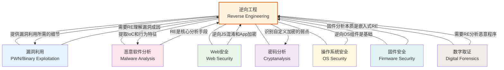
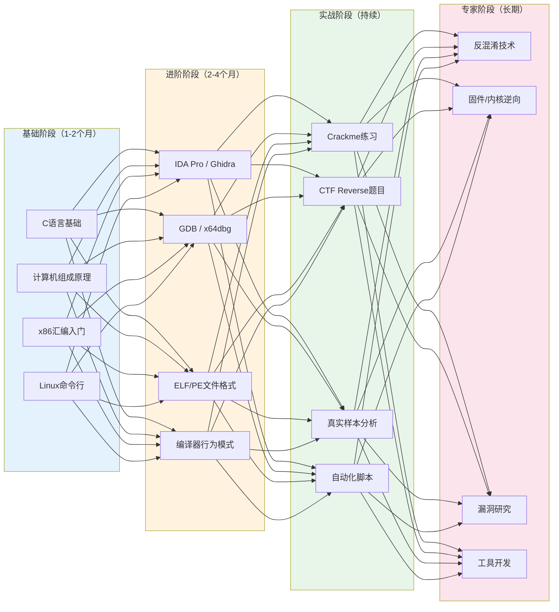

## 17.1 逆向工程概述

### 17.1.1 什么是逆向工程

逆向工程（Reverse Engineering，简称RE）是一种通过分析已有系统来理解其设计、架构和工作原理的技术过程。这个术语最早出现在硬件领域——工程师拆解竞争对手的芯片，通过显微镜逐层拍照来还原电路设计。而在信息安全领域，逆向工程特指对编译后的二进制程序进行分析，还原出程序的逻辑、算法和数据结构。

理解逆向工程的本质，需要先理解编译过程。当你写下 `int result = a + b;` 这行C代码时，编译器会执行以下转换：

```text
源代码层：    int result = a + b;
                  ↓ 编译（词法分析 → 语法分析 → 语义分析 → 中间代码 → 优化 → 目标代码）
汇编层：      mov eax, [rbp-0x4]
              add eax, [rbp-0x8]
              mov [rbp-0xc], eax
                  ↓ 汇编（一对一翻译）
机器码层：    8B 45 FC 03 45 F8 89 45 F4
```

在这个转换过程中，大量的信息被**不可逆地丢失**了：

| 丢失的信息 | 原因 | 对逆向的影响 |
|-----------|------|-------------|
| 变量名 | 编译器不需要语义名称 | 只能看到 `[rbp-0x4]` 这样的地址引用 |
| 注释 | 完全被丢弃 | 失去了程序员的设计意图说明 |
| 类型信息 | 被简化为操作大小 | `int`和`float`都是4字节，需要从上下文推断 |
| 代码结构 | 被展平为线性指令流 | `if-else`、`for`、`switch` 全部变成跳转指令 |
| 预处理宏 | 在编译前已展开 | 看到的是展开后的结果，原始宏定义已消失 |
| 高级抽象 | 类、模板、泛型被展开 | C++类变成结构体偏移+虚表调用 |

这就是为什么逆向工程被形象地称为**"有损压缩的逆过程"**——你拿到的是一个"压缩包"，但里面丢失的信息永远无法完美还原，你只能通过分析残留的线索来尽可能接近原始的设计意图。

这个过程类似于考古学：考古学家从残存的陶片、墙基和碳化谷物中推断出古代文明的生活方式。逆向工程师从机器指令、内存布局和系统调用中推断出软件的设计逻辑。两者都需要**模式识别能力**、**领域知识**和**合理的推测**。

#### 逆向工程的三个层次

逆向工程并不是一个非黑即白的行为，它的目标可以分三个层次：

**层次一：行为理解（Behavioral Understanding）**
目标是搞清楚"这个程序做了什么"。不关心内部实现细节，只关注输入输出行为。这是恶意软件分析中最常见的层次——你不需要理解勒索软件的每一个函数，只需要知道它加密了哪些文件、连接了哪些C2服务器。

**层次二：逻辑还原（Logic Reconstruction）**
目标是还原程序的核心算法和数据结构。需要深入到函数级别的分析，理解程序的控制流和数据流。这是漏洞研究和协议逆向的标准层次——你需要理解加密算法的具体实现才能找到弱点。

**层次三：完整重建（Full Reconstruction）**
目标是尽可能还原出等价的源代码。这是最高难度的层次，通常只在特殊场景下需要（如恢复丢失的源代码、互操作性研究）。现代反编译器（如Hex-Rays、Ghidra）能辅助完成大部分工作，但对于优化程度高或经过混淆的代码，仍需要大量人工修正。

### 17.1.2 逆向工程的历史与演进

理解逆向工程的历史，有助于理解今天的工具和方法论是如何形成的。

**硬件时代（1950s-1980s）**

逆向工程最早出现在硬件领域。冷战期间，苏联工程师系统性地拆解和复制美国的电子设备。最著名的案例是苏联对Intel 8080处理器的逆向——他们通过芯片的逐层拍照和分析，制造出了功能兼容的КР580ВМ80А处理器。这一时期奠定了逆向工程的基本方法论：拆解、观察、记录、重建。

**软件逆向的萌芽（1980s-1990s）**

随着个人电脑的普及，软件逆向开始兴起。这一时期的标志性工具是**DEBUG.COM**（DOS自带的调试器）和**SoftICE**（Windows下的内核级调试器）。软件破解者（Cracker）是最早的大规模逆向工程实践者群体——他们通过分析程序的序列号验证逻辑来绕过软件保护。看雪论坛（pediy.com）等中文逆向社区也在这一时期建立。

**工具革命（2000s）**

IDA Pro的出现彻底改变了逆向工程的效率。在此之前，逆向工程师主要依赖文本形式的反汇编输出，需要手动追踪跳转和调用关系。IDA Pro引入了**图形视图**（控制流图的可视化）、**交叉引用**（一键查看谁调用了当前函数）、**交互式标注**（重命名、注释、类型定义）等革命性功能，使得复杂程序的分析变得可行。

同一时期，OllyDbg成为Windows用户态调试的事实标准，GDB在Linux下持续进化，动态分析工具链逐渐成形。

**开源与民主化（2010s-至今）**

2019年，NSA将其内部使用的逆向工具**Ghidra**开源，这是逆向工程历史上的里程碑事件。在此之前，顶级逆向工具（IDA Pro + Hex-Rays反编译器）的许可证费用高达数千美元，将大量学习者挡在门外。Ghidra的出现使得"人人可用的专业级逆向工具"成为现实。

同时，**Frida**（动态插桩框架）、**angr**（符号执行引擎）、**Unicorn**（CPU模拟器）等新一代工具的出现，使得自动化分析、跨架构分析、动态Hook等高级技术变得触手可及。

### 17.1.3 为什么需要学习逆向工程

逆向工程的应用场景远比大多数人想象的要广泛。以下按领域详细展开：

#### 恶意软件分析

这是逆向工程最"经典"的应用场景。当一个新的恶意软件样本被发现时，安全分析师需要回答以下问题：

- 这个恶意软件做了什么？（行为分析）
- 它如何传播？（感染机制）
- 它加密/窃取了哪些数据？（影响评估）
- 它连接了哪些C2服务器？（IoC提取）
- 如何编写检测规则？（签名开发）

没有逆向能力，你只能依赖沙箱的自动化报告——而现代恶意软件普遍内置反沙箱检测，自动化分析经常失效。只有通过手动逆向，才能看到恶意软件的"真实面目"。

一个真实的案例：2017年的WannaCry勒索软件爆发后，安全研究员Marcus Hutchins通过逆向分析发现，恶意软件在加密前会尝试连接一个特定的未注册域名。他注册了这个域名，意外地触发了恶意软件的"自杀开关"（kill switch），阻止了蠕虫的进一步传播。这个发现完全依赖于对恶意软件二进制代码的逆向分析。

#### 漏洞研究与利用

闭源软件的安全审计完全依赖逆向工程。当你没有源代码时，你需要：

1. 通过逆向理解程序的输入处理逻辑
2. 识别潜在的内存安全问题（缓冲区溢出、格式化字符串、UAF等）
3. 构造触发漏洞的输入（PoC）
4. 评估漏洞的可利用性

微软每月发布的安全补丁（Patch Tuesday）也是逆向工程的重要应用场景——安全研究员通过对比补丁前后的二进制文件（Binary Diffing），可以快速定位被修复的漏洞，进而分析漏洞的成因和利用方式。这在漏洞被修复但补丁尚未全面部署的"窗口期"尤其有价值。

#### 协议逆向

很多应用使用私有通信协议，而协议文档通常不公开。通过逆向工程，你可以：

- 还原协议的消息格式（字段、长度、编码方式）
- 识别加密和认证机制
- 发现协议实现中的安全缺陷
- 开发兼容的客户端或监控工具

典型场景包括：逆向物联网设备的通信协议以评估安全性、分析恶意软件的C2协议以编写阻断规则、逆向游戏协议以检测外挂。

#### 软件互操作性

当你需要让自己的软件与一个闭源系统交互时，逆向工程往往是唯一的选择。欧盟的法律明确承认这种用途的合法性。历史上的经典案例包括：Samba项目通过逆向Windows的SMB协议实现了Linux与Windows的文件共享、Wine项目通过逆向Windows API在Linux上运行Windows程序。

#### 数字取证

在数字犯罪调查中，逆向工程帮助取证人员理解恶意程序的行为、恢复被加密的数据、提取被窃取的信息。执法机构的数字取证实验室普遍配备专业的逆向工程师。

#### CTF竞赛

CTF（Capture The Flag）竞赛中的Reverse方向题目是练习逆向技能的最佳途径。参赛者需要分析经过混淆或加密的二进制程序，提取隐藏的flag。这类题目的难度从"简单字符串比较"到"多层虚拟机保护"不等，覆盖了逆向工程的各个技术层次。

#### 游戏Mod与兼容性

游戏社区通过逆向工程为老游戏添加新功能、修复兼容性问题、开发Mod。Doom、Quake等经典游戏的源端口（Source Port）都是逆向工程的成果。

### 17.1.4 逆向工程的核心心智模型

逆向工程最核心的能力不是会用某个工具，而是一种特殊的思维方式。以下心智模型是每一个逆向工程师都需要内化的：

#### 模型一：从低级表示重建高级理解

你面对的永远是"降维"后的信息——源代码的N维语义空间被压缩到了机器指令的低维空间。你的工作就是从这些低维信息中推断出高维的设计意图。

这意味着你必须同时具备两种视角：
- **微观视角**：看懂每一条汇编指令在做什么（`add eax, ebx` → 两个寄存器相加）
- **宏观视角**：将大量微观操作组合成有意义的逻辑单元（"这个函数在计算CRC32校验和"）

初学者的典型困境是"只见树木不见森林"——他们能逐条翻译指令，但无法将20条指令组合成"这是一个字符串拷贝循环"的结论。突破这个瓶颈的关键是**大量练习**和**模式积累**。

#### 模型二：模式识别

逆向分析中，模式识别是最高频使用的能力。以下是一些你需要能够快速识别的模式：

**结构模式：**
- `cmp + jcc`（条件跳转）→ `if-else` 语句
- `cmp + ja + jmp [table + reg*4]` → `switch` 语句（跳转表）
- `push ebp / mov ebp, esp / sub esp, N` → 函数序言
- `xor reg, reg` → 将寄存器清零（等价于 `reg = 0`）
- `lea reg, [base + index*scale + disp]` → 数组访问或结构体字段访问
- `mov eax, [ecx] / call [eax+offset]` → C++虚函数调用

**算法模式：**
- 大量的 `xor`、`shl`、`shr`、`rol`、`ror` 操作 → 加密/哈希算法
- 嵌套循环 + 字节比较 → 字符串搜索算法
- 递归函数 + 结构体指针遍历 → 树/图遍历
- 固定的初始化常量（如 `0x67452301`）→ MD5/SHA等已知算法的特征值

**行为模式：**
- `socket` → `connect` → `send`/`recv` → 网络通信
- `CreateFile` → `ReadFile` → `WriteFile` → 文件操作
- `VirtualAlloc` + 往分配的内存写入字节 + `CreateThread` → Shellcode执行
- 大量的 `GetProcAddress` + `LoadLibrary` → API动态解析（常见于恶意软件的反静态分析技术）

#### 模型三：假设-验证循环

逆向分析不是线性的"从头读到尾"的过程，而是一个不断提出假设、验证或推翻假设的循环：

1. **观察**：看到某个函数被频繁调用，参数中包含一个固定地址
2. **假设**：这个固定地址可能是一个全局配置结构体
3. **验证**：跳转到该地址，查看数据内容和交叉引用
4. **修正**：发现这不是结构体，而是一个函数指针数组——这是一个虚表
5. **新假设**：当前类继承自某个基类
6. **继续验证**...

这个循环贯穿整个逆向过程。高效的逆向工程师能够快速提出高质量的假设（这依赖经验积累），并高效地验证假设（这依赖工具熟练度）。

#### 模型四：攻击者视角

逆向工程师需要能够切换到攻击者的视角思考问题。当你分析一个程序的安全机制时，不要问"这个检查是怎么工作的"，而要问"如果我要绕过这个检查，我会怎么做"。

这种思维方式的转换是逆向工程区别于普通程序理解的关键。普通程序员阅读代码是为了维护和修改，逆向工程师阅读代码是为了发现弱点和绕过限制。

### 17.1.5 逆向工程的分析方法论

逆向分析有多种方法论，实际工作中通常需要灵活组合使用。

#### 自顶向下（Top-Down）

从程序的入口点（`main`函数或WinMain）开始，沿着函数调用链逐层深入。

**适用场景：** 结构清晰的应用程序、需要理解整体业务逻辑的场景。

**分析步骤：**
1. 定位程序入口点（通过ELF Header的e_entry字段或PE Header的AddressOfEntryPoint）
2. 找到main函数（入口点通常会调用 `__libc_start_main` 并传入main的地址）
3. 分析main函数的高层逻辑
4. 对main调用的每个子函数递归分析

**优点：** 分析路径清晰，容易建立全局理解。
**缺点：** 对大型程序效率低，可能在不相关的函数上浪费大量时间。

#### 自底向上（Bottom-Up）

从关键的系统调用、库函数或感兴趣的数据操作开始，向上追溯调用链。

**适用场景：** 恶意软件分析、大型程序中的局部功能分析、已知目标的定位分析。

**分析步骤：**
1. 从Imports窗口或Strings窗口找到感兴趣的API/字符串
2. 查看哪些函数调用了这个API（交叉引用）
3. 分析调用者的上下文
4. 继续向上追溯，直到建立完整的调用链

**优点：** 直奔主题，效率高。适合"我知道我要找什么"的场景。
**缺点：** 可能错过全局上下文，容易"迷路"。

#### 数据流分析（Data Flow Analysis）

关注数据在程序中的流动路径——数据从哪里来、经过什么处理、到哪里去。

**适用场景：** 加密算法分析、协议逆向、污点分析（追踪用户输入是否能影响敏感操作）。

**核心概念：**
- **定义点（Definition）**：数据被写入的位置（如 `mov [rbp-0x4], eax`）
- **使用点（Use）**：数据被读取的位置（如 `mov ebx, [rbp-0x4]`）
- **定义-使用链（Def-Use Chain）**：从定义到使用的数据流路径

在实际分析中，数据流分析的典型问题是："这个函数的返回值最终被用到了哪里？" 或者 "用户输入的这个字符串经过了哪些处理？"

#### 控制流分析（Control Flow Analysis）

关注程序的执行路径——条件分支、循环、函数调用等。

**核心概念：**
- **基本块（Basic Block）**：一段没有分支的线性指令序列
- **控制流图（CFG）**：由基本块和跳转边组成的有向图
- **可达性分析**：从入口点出发，哪些代码是可达的

IDA Pro的图形视图本质上就是一个控制流图的可视化。学会"读图"是控制流分析的基本功——蓝色箭头是"跳转"（条件为真），红色箭头是"不跳转"（条件为假），绿色箭头是"无条件跳转"。

### 17.1.6 静态分析与动态分析的深度对比

静态分析和动态分析是逆向工程的两大支柱方法。理解它们的差异和互补关系，是制定分析策略的基础。

| 维度 | 静态分析 | 动态分析 |
|------|---------|---------|
| **定义** | 不运行程序，通过阅读代码理解行为 | 运行程序，通过观察实际行为理解功能 |
| **覆盖范围** | 可以看到所有可能的执行路径 | 只能看到一次运行的一条执行路径 |
| **速度** | 可以快速扫描大量代码 | 需要等待程序执行，速度受限 |
| **适用场景** | 初始侦察、模式匹配、大规模样本筛选 | 深入分析具体行为、绕过混淆、提取运行时数据 |
| **局限性** | 无法确定运行时的实际数据值 | 无法覆盖所有分支和异常路径 |
| **典型工具** | IDA Pro、Ghidra、Binary Ninja、Radare2 | GDB、x64dbg、Frida、Valgrind |
| **对抗手段** | 代码混淆、加壳、反编译器干扰 | 反调试检测、环境检测、时间检查 |

**关键认知：两者不是竞争关系，而是互补关系。**

一个成熟的逆向工程师的工作流程通常是：
1. **静态分析先行**：用IDA/Ghidra打开文件，快速了解程序结构、导入表、字符串、主要函数
2. **动态分析验证**：对静态分析中的假设进行运行时验证，获取实际的数据值
3. **静态分析深入**：根据动态分析的结果，回到静态分析中进一步细化理解
4. **循环迭代**：不断在两种方法之间切换，逐步逼近完整理解

举一个具体例子：假设你看到一个函数调用了大量位运算指令（静态分析发现），你怀疑这是一个加密函数。你可以：
- 静态分析：识别算法的结构（S-Box、轮数、密钥调度）
- 动态分析：在函数入口设置断点，dump出明文和密钥
- 综合：用提取的密钥和识别的算法编写解密工具

### 17.1.7 逆向工程的工具生态概览

逆向工程的工具生态可以按分析方式和用途进行分类。详细使用方法将在本章"核心技巧"部分展开，这里先建立全局认知。

#### 静态分析工具

| 工具 | 类型 | 优势 | 劣势 | 适用场景 |
|------|------|------|------|---------|
| **IDA Pro** | 商业（有免费版） | 业界标准、插件生态丰富、反编译质量高 | 价格昂贵（完整版数千美元） | 专业逆向分析、恶意软件分析 |
| **Ghidra** | 免费开源（NSA） | 免费、反编译器优秀、支持协作分析 | 界面不够流畅、脚本生态不如IDA | 学习入门、团队协作、预算有限 |
| **Binary Ninja** | 商业 | 现代UI、API设计优秀、中间表示层强大 | 社区较小、部分功能不如IDA成熟 | 自动化分析、脚本驱动的分析 |
| **Radare2** | 免费开源 | 极其轻量、命令行驱动、可脚本化 | 学习曲线陡峭、文档不完善 | 快速分析、嵌入式环境、自动化脚本 |
| **Hopper** | 商业（macOS） | macOS原生、反编译功能好 | 仅支持macOS/Linux | macOS/iOS逆向 |

#### 动态分析工具

| 工具 | 平台 | 核心能力 | 适用场景 |
|------|------|---------|---------|
| **GDB + pwndbg/GEF** | Linux | 调试、内存分析、堆分析、ROP搜索 | Linux二进制分析、PWN |
| **x64dbg** | Windows | 用户态调试、插件系统、追踪 | Windows程序分析 |
| **WinDbg** | Windows | 内核态调试、强大的扩展命令 | 驱动分析、内核调试 |
| **Frida** | 跨平台 | 动态插桩、JavaScript注入、Hook任意函数 | 运行时修改、绕过反调试、协议分析 |
| **Unicorn** | 跨平台 | CPU模拟、不依赖目标OS | Shellcode分析、解密算法提取 |
| **QEMU** | 跨平台 | 系统/用户态模拟、GDB远程调试 | 跨架构分析（x86上调试ARM） |

#### 自动化分析工具

| 工具 | 能力 | 适用场景 |
|------|------|---------|
| **angr** | 符号执行、路径探索、约束求解 | 自动生成触发特定路径的输入、漏洞验证 |
| **YARA** | 模式匹配规则引擎 | 恶意软件家族识别、批量样本分类 |
| **CAPA** | 自动识别二进制的能力 | 快速评估未知样本的功能（网络通信、文件加密、注册表操作等） |
| **BinDiff/Diaphora** | 二进制差异比较 | 补丁分析、漏洞定位 |
| **FLOSS** | 混淆字符串自动提取 | 恶意软件分析中的字符串恢复 |

### 17.1.8 逆向工程的典型工作流程

一个完整的逆向分析项目通常包含以下阶段。实际工作中，这些阶段不是严格线性的，经常需要在不同阶段之间来回跳转。

#### 阶段一：目标侦察（Reconnaissance）

在打开IDA之前，先用命令行工具快速了解目标的基本信息：

```bash
# 确定文件类型
file target_binary

# 查看ELF头信息（Linux）
readelf -h target_binary

# 查看导入的动态库和函数
readelf -d target_binary        # Linux
objdump -T target_binary        # Linux

# 查看字符串（快速了解程序功能）
strings target_binary | head -50

# 查看是否被加壳（检查节名称和大小）
checksec target_binary          # Linux（需要pwntools）
upx -t target_binary            # 检查是否是UPX壳

# 查看编译信息
readelf -p .comment target_binary   # 编译器版本
```

侦察阶段的目标是用最少的时间建立对目标的初步认知：这是什么架构的程序？用什么编译器编译的？是否加壳？导入了哪些库？有哪些明显的字符串？这些信息决定了后续分析的策略。

#### 阶段二：静态分析

用IDA Pro或Ghidra打开目标文件，进行系统性的代码分析：

1. **自动分析等待完成**：IDA的自动分析（Auto Analysis）会识别函数、交叉引用、数据类型
2. **浏览Strings窗口**：找到关键字符串，通过交叉引用定位到使用它们的代码
3. **浏览Imports窗口**：了解程序使用了哪些系统API，推断程序的功能类别
4. **定位关键函数**：根据分析目标，定位到相关的函数（如加密函数、网络通信函数、验证函数）
5. **分析函数逻辑**：阅读反编译输出，理解函数的输入、处理和输出
6. **标注和重命名**：将分析结果标注到IDA数据库中（函数名、变量名、注释、结构体定义）

#### 阶段三：动态分析

对静态分析中的假设进行运行时验证：

1. **设置调试环境**：在虚拟机或沙箱中运行目标
2. **设置断点**：在关键函数入口设置断点
3. **观察数据流**：查看函数参数的实际值、返回值、内存内容
4. **追踪执行路径**：单步执行或设置追踪（Trace），观察程序的实际控制流
5. **提取运行时数据**：dump加密密钥、解密后的字符串、网络通信数据

#### 阶段四：综合分析

将静态和动态分析的结果整合成完整的理解：

1. **验证假设**：确认或推翻之前的推测
2. **填补空白**：对于静态分析无法确定的部分（如动态解析的API、运行时生成的代码），用动态分析补充
3. **构建全局视图**：将各个函数的分析结果组合成程序的完整行为模型
4. **识别关键发现**：提取漏洞、恶意行为、加密算法、协议格式等关键信息

#### 阶段五：文档化

逆向分析的成果必须以结构化的方式记录下来：

- **函数标注**：每个分析过的函数都有清晰的名称、注释和类型定义
- **流程图**：程序的关键逻辑流程
- **数据结构定义**：识别出的结构体、类、枚举
- **关键发现**：漏洞、后门、加密密钥、C2地址等
- **分析报告**：面向非技术人员的摘要（如果需要对外发布）

### 17.1.9 逆向工程与其他安全技能的关系

逆向工程不是孤立存在的，它与安全领域的其他技能形成相互依赖的网络：



**与PWN的关系：** 漏洞利用（PWN）的核心前提是理解漏洞的成因和触发条件，而这完全依赖逆向工程。你需要通过逆向分析确定：溢出发生在哪个函数？偏移量是多少？有哪些保护机制（ASLR、NX、Stack Canary）需要绕过？没有逆向能力的PWN选手只能照搬公开的exploit模板，无法应对未知目标。

**与恶意软件分析的关系：** 恶意软件分析本质上就是逆向工程的一个子领域。分析师需要逆向恶意代码来理解其行为、提取IoC（入侵指标）、编写检测规则。高级恶意软件使用加壳、混淆、反调试等技术来对抗逆向，这使得恶意软件分析成为逆向工程中最具挑战性的方向之一。

**与Web安全的关系：** 现代Web安全越来越需要逆向能力。JavaScript混淆的还原、移动App的API加密逻辑分析、浏览器扩展的安全审计——这些都需要逆向技能。Burp Suite等Web安全工具只能看到HTTP层面的流量，要理解流量背后的加密和签名逻辑，必须逆向客户端代码。

### 17.1.10 逆向工程面临的挑战与局限性

逆向工程不是万能的。了解它的局限性，有助于在实际工作中制定合理的期望和策略。

#### 代码混淆与保护

现代软件保护技术极大增加了逆向的难度：

- **加壳（Packing）**：将原始代码压缩或加密，运行时才解压。需要先脱壳才能进行静态分析
- **控制流平坦化（Control Flow Flattening）**：将正常的分支结构打散为一个大循环+分发器，使反编译输出难以阅读
- **虚拟机保护（VM Protection）**：将x86指令翻译为自定义虚拟指令集，需要先逆向VM解释器
- **代码变形（Code Mutation）**：每次编译生成不同但等价的代码，阻止基于模式的自动化分析

这些保护技术使得逆向分析的时间成本成倍增加。一个经过VM Protect保护的程序，分析时间可能是未保护版本的10-100倍。

#### 反调试与环境检测

现代软件（尤其是恶意软件和游戏反作弊系统）普遍内置反调试和环境检测机制：

- `IsDebuggerPresent` / `NtQueryInformationProcess` 检测调试器
- `CPUID` 指令检测虚拟机
- 时间差检测（`rdtsc` / `GetTickCount`）检测单步执行
- 完整性检查（检测代码是否被Patch）

这些机制要求逆向工程师不仅要会分析程序逻辑，还要会绕过程序的"防御机制"。

#### 大型代码库

现代应用动辄数百万行代码，编译后的二进制文件可能有数十MB。逐函数分析在这种规模下完全不现实。逆向工程师必须学会**选择性分析**——明确分析目标，只关注与目标相关的代码路径，利用交叉引用和自动化工具缩小分析范围。

#### 信息丢失的不可逆性

如前所述，编译过程是"有损"的。某些信息（如原始变量名、注释、设计文档）在编译后永久丢失，任何工具和方法都无法完美还原。反编译器的输出是"最佳猜测"，不是"原始源代码"。

#### 法律与伦理约束

逆向工程的合法性因司法管辖区而异。在进行任何逆向分析之前，必须确认：
- 你拥有目标软件的合法使用权
- 分析目的符合当地法律的豁免条款（如安全研究、互操作性）
- 分析在隔离环境中进行，不会对他人系统造成影响
- 发现的漏洞通过负责任的披露流程报告

### 17.1.11 逆向工程的学习路线图

逆向工程的学习曲线陡峭，但可以被分解为可管理的阶段：



每个阶段的具体内容和练习方法将在本章"练习方法"部分详细展开。这里的关键信息是：**逆向工程是"练"出来的，不是"看"出来的。** 只看书不动手，你永远无法建立真正的逆向直觉。

### 17.1.12 本节小结

本节作为第17章的开篇，建立了逆向工程的全局认知框架：

1. **本质定义**：逆向工程是从低级表示（机器码）重建高级理解（程序逻辑）的过程，类似于"有损压缩的逆过程"
2. **应用价值**：覆盖恶意软件分析、漏洞研究、协议逆向、互操作性、数字取证、CTF竞赛等多个领域
3. **核心心智模型**：模式识别、假设-验证循环、攻击者视角、微观-宏观双视角切换
4. **方法论**：自顶向下、自底向上、数据流分析、控制流分析——根据场景灵活选择
5. **分析方法**：静态分析和动态分析互补，成熟工程师在两者之间灵活切换
6. **工具生态**：从IDA Pro/Ghidra到Frida/angr，覆盖静态、动态、自动化三个维度
7. **挑战与局限**：代码混淆、反调试、大型代码库、信息不可逆丢失

接下来的章节将从这里出发，逐步深入到具体的技术细节：先打牢汇编语言基础，再掌握可执行文件格式和编译器行为，最后通过工具使用和实战案例将理论转化为能力。
