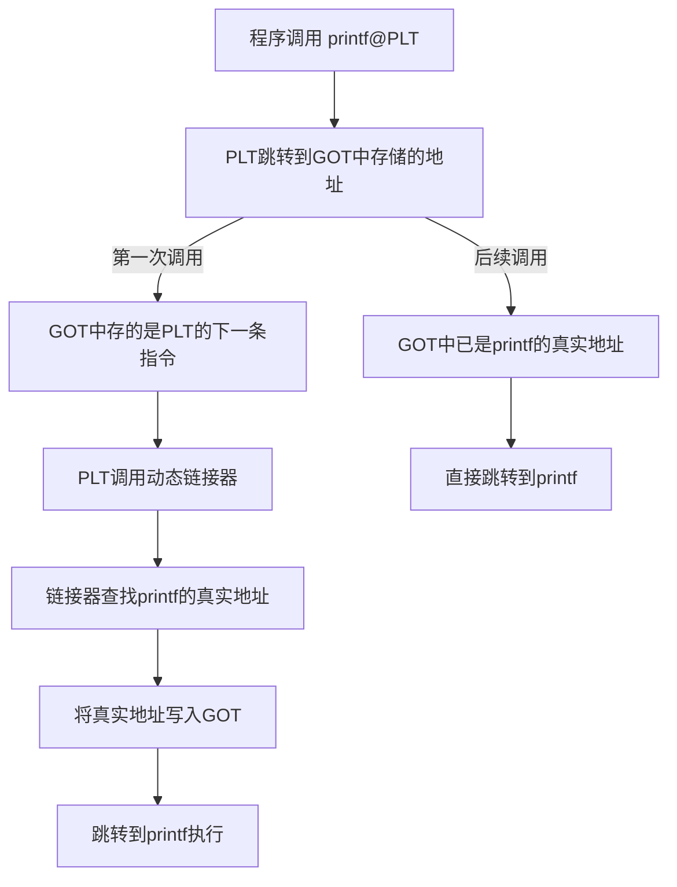
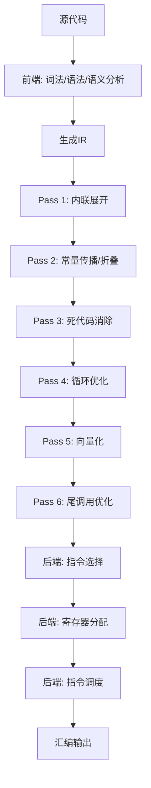

## 17.4 编译器与优化

逆向工程师看到的不是源代码，而是编译器"翻译"后的产物。如果把源代码比作中文原著，那么逆向工程师读的是一个没有署名的英文译本——翻译过程中信息会丢失、结构会改变、有些段落会被"译者"认为不重要而直接删除。理解编译器的行为模式，就是理解这个"译者"的翻译风格和习惯，它是逆向工程最核心的理论基础之一。

本节从编译器的内部架构讲起，逐层深入到优化技术、中间表示、调试信息，最终落脚到"逆向时如何识别和还原编译器的变换"。这不是编译原理课——我们不关心如何构建一个编译器，我们关心的是：**编译器对我的代码做了什么，以及这些变化如何影响逆向分析。**

### 17.4.1 编译过程全景

一个C/C++源文件从文本变成可执行程序，经历四个主要阶段。每个阶段都会改变代码的表示形式，每个阶段都会丢弃或变换信息。


#### 预处理（Preprocessing）

预处理器在编译之前处理所有以 `#` 开头的预处理指令。它是一个纯粹的文本替换工具，不理解C语言的语法。

```c
// 原始代码
#define MAX_SIZE 1024
#define SQUARE(x) ((x) * (x))

#include <stdio.h>

#ifdef DEBUG
    printf("x = %d\n", x);
#endif

int arr[MAX_SIZE];
int val = SQUARE(5);
```

预处理后的结果（可以用 `gcc -E` 查看）：

```c
// stdio.h 的全部内容被展开（通常数千行）
// ... (stdio.h 展开内容) ...

int arr[1024];
int val = ((5) * (5));
```

**对逆向的影响：** 宏定义在预处理阶段就被完全替换，不会出现在目标文件中。逆向时你无法直接知道原始代码用了什么宏名。但宏的"痕迹"会以常量值、代码模式的形式保留——看到 `1024` 这个数组大小时，你可以推断它可能来自一个宏定义。条件编译（`#ifdef`）决定了哪些代码被包含，逆向得到的二进制只包含被编译的分支，另一个分支完全不存在。

#### 编译（Compilation）

编译阶段是整个过程中最复杂的部分，它将预处理后的C代码转换为汇编代码。现代编译器（GCC、Clang、MSVC）的编译阶段内部分为三个子阶段：

**前端（Frontend）**：词法分析→语法分析→语义分析→生成中间表示（IR）


前端是语言相关的——GCC有C前端、C++前端、Fortran前端等，但它们都生成同一种中间表示（GIMPLE/RTL）。Clang的前端生成LLVM IR。这意味着：**不同语言编写的代码，经过前端后可能进入同一套优化流程。**

**中端（Middle-end）**：对中间表示进行与目标架构无关的优化。这是大多数编译器优化发生的地方。中端不关心目标是x86还是ARM，它只操作抽象的中间表示。

**后端（Backend）**：将优化后的中间表示转换为特定架构的汇编代码。后端负责指令选择（将IR操作映射为具体的机器指令）、寄存器分配（决定哪些值放在哪些寄存器中）、指令调度（重排指令顺序以利用CPU流水线）。

**对逆向的影响：** 编译器后端的决策直接决定了你在反汇编窗口中看到的内容。同一个高级语言构造（如 `switch` 语句），在不同优化级别、不同目标架构下，可能生成跳转表、二叉查找树、或一系列 `if-else` 分支。理解这一点，你才能在逆向时"透过汇编看本质"。

#### 汇编（Assembly）

汇编器将汇编代码转换为机器码，打包成目标文件（`.o` 或 `.obj`）。这个阶段相对简单——它主要做的是指令编码和符号解析的准备工作。

目标文件包含：
- **代码段**（`.text`）：机器指令的二进制编码
- **数据段**（`.data`/`.bss`）：全局和静态变量
- **符号表**：函数名和全局变量名及其地址（此时还未最终确定）
- **重定位表**：记录需要在链接阶段修正的地址引用
- **字符串表**：存储符号名称等字符串

```bash
# 查看目标文件的段信息
gcc -c main.c -o main.o
objdump -h main.o

# 查看符号表
nm main.o

# 查看重定位表
objdump -r main.o
```

**对逆向的影响：** 目标文件中的符号表是逆向分析的宝贵信息源。如果程序没有被 `strip`，你可以直接看到所有函数名和全局变量名。即使是已strip的二进制，重定位信息有时也会泄露函数边界等线索。

#### 链接（Linking）

链接器将多个目标文件和库文件组合成最终的可执行文件。链接分为两种：

**静态链接**：将库的代码直接复制到可执行文件中。优点是运行时不需要外部依赖，缺点是文件体积大。逆向时，静态链接的库函数和用户代码混在一起，需要借助签名匹配（如IDA的FLIRT签名）来区分。

**动态链接**：只在可执行文件中记录对共享库（`.so`/`.dll`）的引用，实际的库代码在运行时由动态链接器加载。逆向时，导入表（Import Table）直接告诉你程序使用了哪些外部函数，这是一个重要的分析入口。

```bash
# 查看可执行文件依赖的动态库
ldd ./program        # Linux
# 或
objdump -p program | grep NEEDED

# Windows下使用 Dependencies 工具或 dumpbin
dumpbin /dependents program.exe
```

**动态链接的运行时机制（PLT/GOT）：**

动态链接不是一次性完成的。程序第一次调用某个外部函数时，动态链接器需要查找该函数的真实地址。这个过程通过PLT（Procedure Linkage Table）和GOT（Global Offset Table）协作完成：



**对逆向的影响：** PLT/GOT是动态Hook技术的基础。通过修改GOT表项，可以将对某个库函数的调用重定向到自定义函数。这也是为什么逆向分析时需要关注 `.plt` 和 `.got` 段的内容——它们揭示了程序与外部世界的接口。

### 17.4.2 编译器内部架构与中间表示

要理解编译器优化对逆向的影响，你需要了解编译器"内部在想什么"。现代编译器不直接从源代码生成机器码——它们使用一种称为**中间表示（Intermediate Representation, IR）**的抽象形式作为核心数据结构。

#### 什么是中间表示

IR是介于源代码和机器码之间的抽象层。它保留了程序的完整语义（所有操作和数据流），但去除了源语言的语法细节（花括号、分号、变量名）和目标机器的硬件细节（具体寄存器、指令编码）。

```text
// C源代码
int foo(int a, int b) {
    int c = a + b;
    if (c > 100) {
        return c * 2;
    }
    return c;
}
```

对应的LLVM IR（简化版）：

```llvm
define i32 @foo(i32 %a, i32 %b) {
entry:
  %c = add i32 %a, %b
  %cmp = icmp sgt i32 %c, 100
  br i1 %cmp, label %if.then, label %if.end

if.then:
  %mul = mul i32 %c, 2
  ret i32 %mul

if.end:
  ret i32 %c
}
```

GCC使用GIMPLE和RTL作为中间表示。GIMPLE是一种高级IR，接近源代码语义；RTL（Register Transfer Language）是一种低级IR，接近机器指令。Clang/LLVM使用LLVM IR，统一的SSA（Static Single Assignment）形式。

#### SSA形式——理解优化的关键

SSA（静态单赋值）是现代编译器IR的核心特征。SSA要求：**每个变量只被赋值一次**。如果一个变量在源代码中被多次赋值，编译器会创建不同的"版本"。

```c
// C源代码
int x = 1;
x = x + 2;
x = x * 3;
```

SSA形式：

```text
x_1 = 1
x_2 = x_1 + 2
x_3 = x_2 * 3
```

当控制流汇合时（如 `if-else` 的两个分支都定义了同一个变量），SSA使用 `φ`（phi）函数来选择正确的版本：

```c
// C源代码
int x;
if (cond) {
    x = 1;
} else {
    x = 2;
}
use(x);
```

SSA形式：

```python
if (cond):
    x_1 = 1
else:
    x_2 = 2
x_3 = φ(x_1, x_2)   // 根据控制流选择x_1或x_2
use(x_3)
```

**对逆向的影响：** 理解SSA有助于理解为什么优化后的代码看起来"不按常理出牌"。编译器在SSA形式上执行的优化（如常量传播、死代码消除、值编号）可能完全重排变量的使用顺序，使得逆向时的"变量追踪"变得困难。反编译器需要从SSA形式"翻译"回带赋值的高级代码，这个翻译过程有时会出错——这就是为什么反编译结果不能完全信任。

#### 查看编译器中间表示

```bash
# 查看LLVM IR（Clang）
clang -O2 -S -emit-llvm foo.c -o foo.ll

# 查看GCC的GIMPLE（树形表示）
gcc -O2 -fdump-tree-all foo.c
# 生成 foo.c.004t.gimple 等文件

# 查看GCC的RTL
gcc -O2 -fdump-rtl-all foo.c
# 生成 foo.c.248r.expand 等文件

# 使用Compiler Explorer在线查看
# https://godbolt.org/ —— 支持多种编译器、优化级别、目标架构
```

Compiler Explorer（godbolt.org）是逆向工程师学习编译器行为的最佳工具。你可以实时修改源代码，看到不同编译器、不同优化级别生成的汇编输出，建立"高级代码↔汇编"的直觉映射。

### 17.4.3 优化级别详解

编译器通过 `-O` 标志控制优化级别。每个级别启用一组不同的优化Pass（变换步骤），对生成代码的形态有显著影响。

| 优化级别 | GCC/Clang标志 | MSVC标志 | 特点 | 对逆向的影响 |
|---------|--------------|---------|------|------------|
| **无优化** | `-O0` | `/Od` | 不做任何优化，忠实翻译源代码。每个语句对应独立的指令序列。变量存储在栈上。 | 最容易逆向，代码结构与源代码高度对应 |
| **基本优化** | `-O1` | `/O1` | 启用不显著增加代码体积的优化：常量折叠、死代码消除、简单的寄存器分配 | 开始出现代码重排，但整体结构可辨认 |
| **标准优化** | `-O2` | `/O2` | 启用大多数优化：循环优化、内联、指令调度。编译时间增加，但代码质量显著提升 | 大量内联使函数边界模糊，循环结构可能面目全非 |
| **激进优化** | `-O3` | `/O2 /Ob3` | 在O2基础上增加向量化、更激进的内联和循环变换 | 出现SIMD指令，函数被大量内联，逆向难度显著增加 |
| **体积优化** | `-Os` | `/O1 /Os` | 优化目标是减小代码体积而非提高速度 | 代码更紧凑，但可能使用更复杂的编码方式 |
| **极致体积** | `-Oz` | — | 进一步牺牲速度换取更小的体积 | Clang特有，可能用函数调用替代内联展开 |

#### 编译器优化的内部流水线

编译器的优化不是随意的——它按照严格的顺序执行一系列Pass，每个Pass对IR做特定的变换。以下是GCC和LLVM的典型优化流水线：



**重要：** 优化Pass之间有依赖关系。常量传播可能暴露新的死代码，死代码消除可能使循环简化，简化的循环可能更适合向量化。编译器通常会多遍扫描IR，直到没有新的优化机会为止。

### 17.4.4 核心优化技术深度解析

以下每种优化技术都从三个维度讲解：它是什么、编译器如何实现它、逆向时如何识别和还原它。

#### 内联展开（Inlining）

**原理：** 将被调用函数的代码直接插入到调用点，消除函数调用的开销（参数压栈、CALL/RET指令、栈帧创建销毁）。编译器根据启发式规则决定哪些函数值得内联——通常考虑函数体大小、调用频率、调用处的执行频率。

**原始代码：**

```c
static int square(int x) {
    return x * x;
}

int compute(int a, int b) {
    int s1 = square(a);
    int s2 = square(b);
    return s1 + s2;
}
```

**未优化（-O0）的汇编：**

```asm
square:
    push    rbp
    mov     rbp, rsp
    mov     DWORD PTR [rbp-4], edi
    mov     eax, DWORD PTR [rbp-4]
    imul    eax, eax
    pop     rbp
    ret

compute:
    push    rbp
    mov     rbp, rsp
    sub     rsp, 16
    mov     DWORD PTR [rbp-4], edi
    mov     DWORD PTR [rbp-8], esi
    mov     eax, DWORD PTR [rbp-4]
    mov     edi, eax
    call    square              ; 调用 square(a)
    mov     DWORD PTR [rbp-12], eax
    mov     eax, DWORD PTR [rbp-8]
    mov     edi, eax
    call    square              ; 调用 square(b)
    mov     DWORD PTR [rbp-16], eax
    mov     edx, DWORD PTR [rbp-12]
    mov     eax, DWORD PTR [rbp-16]
    add     eax, edx
    leave
    ret
```

**优化后（-O2）的汇编：**

```asm
compute:
    imul    edi, edi        ; a * a，内联自 square(a)
    imul    esi, esi        ; b * b，内联自 square(b)
    lea     eax, [rdi+rsi]  ; a*a + b*b
    ret
```

**逆向识别方法：**
- 函数体膨胀：如果一个函数的代码量远超预期，检查其中是否有重复的指令模式，这些可能是被内联的函数
- 缺少CALL指令：在O2以上优化中，小型函数可能完全消失，其代码被嵌入到调用者中
- 使用IDA的"Function Calls"窗口查看调用关系——O2下函数调用数量会显著减少
- 编译器有时会在内联后的代码前插入一个注释或元数据标记，提示内联的来源（特别是在带调试信息时）

#### 循环优化

编译器对循环有大量优化手段，这些优化使得逆向时识别循环结构变得困难。

**循环展开（Loop Unrolling）：** 减少循环控制开销，将循环体复制多份。

```c
// 原始代码
for (int i = 0; i < 4; i++) {
    arr[i] = arr[i] * 2;
}
```

```asm
; 展开后的汇编（-O2），循环体被复制4次
    mov     eax, DWORD PTR [rdi]
    add     eax, eax
    mov     DWORD PTR [rdi], eax
    mov     eax, DWORD PTR [rdi+4]
    add     eax, eax
    mov     DWORD PTR [rdi+4], eax
    mov     eax, DWORD PTR [rdi+8]
    add     eax, eax
    mov     DWORD PTR [rdi+8], eax
    mov     eax, DWORD PTR [rdi+12]
    add     eax, eax
    mov     DWORD PTR [rdi+12], eax
; 循环完全消失！
```

**循环向量化（Loop Vectorization）：** 使用SIMD指令同时处理多个数据元素。

```c
// 原始代码
for (int i = 0; i < n; i++) {
    c[i] = a[i] + b[i];
}
```

```asm
; SSE2向量化版本，每次处理4个int
.L3:
    movdqu  xmm0, XMMWORD PTR [rsi+rax]   ; 加载a[i..i+3]
    paddd   xmm0, XMMWORD PTR [rdx+rax]   ; 加上b[i..i+3]
    movdqu  XMMWORD PTR [rdi+rax], xmm0   ; 存储到c[i..i+3]
    add     rax, 16
    cmp     rax, rcx
    jb      .L3
```

```asm
; AVX2向量化版本，每次处理8个int
.L3:
    vmovdqu ymm0, YMMWORD PTR [rsi+rax]
    vpaddd  ymm0, ymm0, YMMWORD PTR [rdx+rax]
    vmovdqu YMMWORD PTR [rdi+rax], ymm0
    add     rax, 32
    cmp     rax, rcx
    jb      .L3
```

**循环强度削减（Strength Reduction）：** 将昂贵的操作替换为等价的便宜操作。典型场景是将循环中的乘法替换为递增的加法。

```c
// 原始代码
for (int i = 0; i < n; i++) {
    arr[i * 4] = 0;    // i*4 每次迭代都要乘法
}
```

```asm
; 强度削减后——用指针递增替代乘法
    xor     eax, eax
.L3:
    mov     DWORD PTR [rdi+rax], 0
    add     rax, 16         ; rax += 4*sizeof(int) = 16
    cmp     rax, rcx
    jb      .L3
```

**循环合并与分裂：** 编译器可能将多个相邻的循环合并为一个（减少循环开销），或将一个循环分裂为多个（提高缓存局部性或启用向量化）。

**逆向识别方法：**
- 寻找重复指令模式：如果看到一段代码中有非常相似的指令块重复出现，可能是循环展开的结果
- SIMD寄存器（XMM/YMM/ZMM）的出现几乎总是意味着向量化——原始代码中很可能有一个循环
- 指针递增模式（`add reg, constant`）加上条件跳转，通常是循环的骨架
- 运行时检查：在向量化代码的外层，通常有处理"余数"元素的标量循环——这是原始循环尾部迭代的处理

#### 死代码消除（Dead Code Elimination）

**原理：** 删除计算结果永远不会被使用的代码。编译器通过数据流分析（Def-Use Chain）判断哪些计算的"产出"有消费者，没有消费者的计算就是死代码。

```c
// 原始代码
int foo(int x) {
    int unused = x * 42;      // 结果从未使用
    int y = x + 1;
    if (y > 10) {
        return y;
    }
    return 0;
}
```

```asm
; -O2汇编：unused变量的计算完全消失
foo:
    lea     eax, [rdi+1]    ; y = x + 1
    cmp     eax, 10
    jle     .L2
    mov     eax, eax        ; return y
    ret
.L2:
    xor     eax, eax        ; return 0
    ret
; x * 42 的指令不见了
```

**逆向识别：** 死代码消除本身对逆向是"透明"的——你看不到被消除的代码，所以也就无从识别。但理解这个优化的存在很重要：如果你在反编译结果中发现某些源代码中的变量"消失"了，不要以为分析出了问题，那很可能是编译器认为它是死代码而将其删除了。

**注意：** `volatile` 变量和有副作用的表达式不会被消除。编译器知道对 `volatile` 变量的读写有外部可见效果，必须保留。

#### 常量折叠与常量传播

**常量折叠（Constant Folding）** 在编译期计算常量表达式的值。**常量传播（Constant Propagation）** 将已知常量值替换到后续使用处。

```c
// 原始代码
int foo() {
    int a = 10;
    int b = 20;
    int c = a + b;      // 30
    int d = c * 2;      // 60
    int e = d / 5;      // 12
    return e + 1;       // 13
}
```

```asm
; -O1及以上优化
foo:
    mov     eax, 13     ; 直接返回编译期计算的结果
    ret
```

编译器在编译期完成了所有计算，函数变成了一条 `return 13` 指令。

**跨函数的常量传播：** 编译器甚至可以跨函数边界进行常量传播（当函数体被内联后）：

```c
static int helper(int x) {
    return x * 2;
}

int bar() {
    return helper(5);  // 内联后，x=5是已知常量
}
// 编译后: mov eax, 10; ret
```

**对逆向的影响：** 源代码中的计算逻辑在二进制中可能完全不存在，只剩一个最终结果。逆向时如果你看到一个硬编码的神秘数值，它很可能是多步常量计算的结果。理解这一点有助于你判断哪些是"编译期计算的常量"，哪些是"运行时有意义的数据"。

#### 尾调用优化（Tail Call Optimization）

**原理：** 如果一个函数的最后一个操作是调用另一个函数（且不使用其返回值做进一步处理），编译器可以将CALL+RET替换为JMP，从而复用当前栈帧。

```c
// 原始代码
int tail_helper(int acc, int n) {
    if (n <= 0) return acc;
    return tail_helper(acc + n, n - 1);  // 尾调用
}

int sum(int n) {
    return tail_helper(0, n);
}
```

```asm
; 未优化：真正的递归调用，每层消耗栈空间
tail_helper:
    push    rbp
    mov     rbp, rsp
    ...
    call    tail_helper     ; 压栈调用
    ...
    pop     rbp
    ret

; -O2优化后：递归被转换为循环（尾调用优化的一种形式）
tail_helper:
    test    esi, esi
    jle     .L2
    xor     eax, eax
.L3:
    add     eax, esi
    dec     esi
    jne     .L3             ; JMP替代CALL，无栈增长
    ret
.L2:
    mov     eax, edi
    ret
```

**逆向识别：**
- 在优化后的代码中，递归函数可能完全看不出递归结构——它们变成了包含条件跳转的循环
- 如果你看到一个函数以 `jmp` 而非 `call` 结尾跳转到另一个函数，这是尾调用的标志
- 反编译器有时会错误地将尾调用优化后的代码识别为循环而非递归，需要手动修正

#### 帧指针省略（Frame Pointer Omission）

**原理：** 在标准的x86函数序言中，EBP/RBP被用作帧指针，指向当前栈帧的固定位置，方便通过固定偏移访问局部变量和参数。但RBP本身也可以作为通用寄存器使用。编译器在 `-O1` 及以上通常会省略帧指针（`-fomit-frame-pointer`），将RBP用于通用计算，通过RSP的动态偏移来访问栈上的数据。

```asm
; 有帧指针的函数（-O0）
push    rbp
mov     rbp, rsp
sub     rsp, 32
mov     DWORD PTR [rbp-4], edi    ; 通过RBP访问参数
mov     DWORD PTR [rbp-8], esi
...
leave                            ; mov rsp, rbp; pop rbp
ret

; 省略帧指针的函数（-O2）
sub     rsp, 24                   ; 直接调整RSP
mov     DWORD PTR [rsp+4], edi   ; 通过RSP偏移访问
mov     DWORD PTR [rsp+8], esi
...
add     rsp, 24
ret
```

**对逆向的影响：** 帧指针省略是初学者逆向时最大的困惑来源之一。没有固定的帧指针，IDA/Ghidra在分析栈帧时可能犯错——局部变量的大小、参数的数量都可能被误判。调试器的栈回溯（backtrace）也依赖帧指针链，省略后栈回溯可能不完整（需要使用 `.eh_frame` 段的信息来弥补）。

**恢复方法：** GCC提供了 `-fno-omit-frame-pointer` 选项强制保留帧指针。在调试构建中，这个选项是默认开启的。逆向strip后的二进制时，你需要习惯通过RSP偏移来追踪栈上的数据。

#### 寄存器分配

**原理：** CPU的通用寄存器数量有限（x86-64有16个通用寄存器），但程序中的变量可能有数百个。寄存器分配器决定哪些变量住在寄存器中、哪些溢出到栈上。这是一个NP完全问题，编译器使用图着色算法或线性扫描算法来求近似解。

```c
// 原始代码有5个活跃变量
int a, b, c, d, e;
a = input1();
b = input2();
c = a + b;
d = input3();
e = c * d;
return e;
```

```asm
; -O2：编译器用寄存器分配优化，变量在寄存器间流转
foo:
    push    rbx
    call    input1
    mov     ebx, eax        ; a → ebx
    call    input2
    add     ebx, eax        ; c = a + b (ebx = ebx + eax)
    call    input3
    imul    eax, ebx        ; e = c * d
    pop     rbx
    ret
; 源代码中的5个"变量"只用了3个寄存器
```

**对逆向的影响：** 寄存器分配使得"变量追踪"变得困难。源代码中的一个变量可能在二进制中分散在多个寄存器中（因为寄存器不够用，需要溢出到栈再恢复），也可能多个源代码变量共享同一个寄存器（因为它们的活跃区间不重叠）。反编译器会尽力恢复变量映射，但结果不总是完美的。

#### 指令调度（Instruction Scheduling）

**原理：** 现代CPU是超标量的——它们可以同时执行多条指令，前提是这些指令之间没有数据依赖。编译器的指令调度器会重排指令顺序，最大化指令级并行度（ILP）。

```asm
; 未调度的代码
mov     eax, [rdi]        ; load a
imul    eax, 3            ; a * 3（等待load完成）
mov     [rdi], eax        ; store a*3
mov     ebx, [rsi]        ; load b
add     ebx, 5            ; b + 5（等待load完成）
mov     [rsi], ebx        ; store b+5

; 调度后的代码（交错执行，隐藏延迟）
mov     eax, [rdi]        ; load a
mov     ebx, [rsi]        ; load b（与上一条无依赖，可并行）
imul    eax, 3            ; a * 3（load a已完成）
add     ebx, 5            ; b + 5（load b已完成）
mov     [rdi], eax        ; store a*3
mov     [rsi], ebx        ; store b+5
```

**对逆向的影响：** 指令调度打乱了代码的逻辑顺序。源代码中先做A再做B，但在汇编中B的某些步骤可能出现在A之前。这使得"按顺序读汇编→推断源代码逻辑"的方法在优化级别较高时不再可靠。你需要更依赖数据流分析（追踪值的定义和使用）而非控制流顺序来理解代码。

#### 链接时优化（Link-Time Optimization, LTO）

**原理：** 传统的优化只在单个编译单元（单个 `.c` 文件）内进行。LTO将优化推迟到链接阶段，此时所有编译单元的信息都可用，可以进行跨文件的内联、常量传播、死代码消除等。

```bash
# 使用LTO编译
gcc -O2 -flto -c foo.c bar.c
gcc -O2 -flto foo.o bar.o -o program

# Clang使用ThinLTO（更快的增量编译）
clang -O2 -flto=thin -c foo.c bar.c
clang -O2 -flto=thin foo.o bar.o -o program
```

**对逆向的影响：** LTO使得跨文件的函数内联成为可能。一个在 `util.c` 中定义的函数可能被内联到 `main.c` 的调用处，导致该函数在最终二进制中完全消失。LTO还会进行更激进的全局优化，使得最终代码与任何单个源文件的对应关系都变得更模糊。LTO编译的二进制中，函数的排列顺序也可能与源文件中的定义顺序不同。

#### Profile-Guided优化（PGO）

**原理：** PGO使用程序运行时的性能数据（Profile Data）来指导优化决策。典型流程：先用插桩版本编译→运行程序收集Profile→用Profile数据重新编译。

```bash
# 第一步：插桩编译
gcc -O2 -fprofile-generate -o program_instrumented program.c

# 第二步：运行收集Profile
./program_instrumented < typical_input.txt

# 第三步：使用Profile优化编译
gcc -O2 -fprofile-use -o program_optimized program.c
```

**对逆向的影响：** PGO优化的代码会将"热路径"（频繁执行的代码路径）放在连续的内存位置，将"冷路径"（很少执行的代码）移到单独的段或函数末尾。这意味着：在PGO优化的二进制中，一个函数的"正常"逻辑和异常处理逻辑可能在内存中是分离的。IDA的函数识别可能将它们视为不同的函数。

### 17.4.5 主流编译器差异

不同编译器有不同的"性格"——它们的优化策略、代码生成风格、ABI实现都有差异。识别目标二进制是由哪个编译器生成的，是逆向分析的第一步。

| 特征 | GCC | Clang/LLVM | MSVC |
|------|-----|-----------|------|
| **默认优化风格** | 积极内联，生成代码紧凑 | 注重编译速度，代码质量略逊GCC | 平衡编译速度和代码质量 |
| **栈保护** | `-fstack-protector` 插入canary | 类似GCC | `/GS` 插入Security Cookie |
| **函数序言** | `push rbp; mov rbp, rsp` | 类似GCC | `push rbp; mov rbp, rsp; sub rsp, N`（N通常16字节对齐） |
| **红区使用** | Linux下使用128字节红区 | 类似GCC | 不使用红区 |
| **字符串常量位置** | `.rodata` 段 | `.rodata.str1.1` 段（带对齐后缀） | `.rdata` 段 |
| **异常处理** | `.eh_frame` (DWARF) | `.eh_frame` (DWARF) | SEH (结构化异常处理) |
| **RTTI实现** | 基于 `type_info` 的虚表 | 类似GCC | 独立的RTTI结构 |
| **调试信息** | DWARF格式 | DWARF格式 | PDB格式 |
| **识别签名** | `.comment` 段含GCC版本 | `.comment` 段含Clang版本 | Rich Header、时间戳特征 |

**快速判断编译器类型的方法：**

```bash
# 查看.comment段（GCC/Clang标识）
readelf -p .comment program

# 查看是否使用SEH（MSVC特征）
objdump -h program | grep -i pdata

# 查看导入库特征
# MSVC编译的程序通常导入MSVCRT.dll或VCRUNTIME*.dll
# GCC/MinGW编译的程序通常导入libgcc_s*.dll
```

**GCC vs Clang的细微差异：** 两者都生成ELF格式、使用DWARF调试信息，但代码生成策略有细微差别。GCC更倾向于使用条件移动指令（CMOV）替代短分支，Clang更倾向于使用分支。GCC在循环优化上通常更激进，Clang在向量化上通常更智能。这些差异在逆向时可以作为辅助判断编译器类型的线索。

### 17.4.6 调试信息与符号

调试信息是编译器在二进制中嵌入的"元数据"，它建立了机器码与源代码之间的映射关系。对于逆向工程师来说，调试信息是最有价值的信息源——它直接告诉你函数名、变量名、类型信息、甚至源代码行号。

#### DWARF格式（Linux/macOS）

DWARF是Linux和macOS上标准的调试信息格式。它存储在可执行文件的特殊段中：

| 段名 | 内容 | 逆向价值 |
|------|------|---------|
| `.debug_info` | 类型信息、变量定义、函数定义 | ★★★★★ 最核心的调试信息 |
| `.debug_abbrev` | `.debug_info`的缩写表 | 辅助解析 |
| `.debug_line` | 机器码地址→源代码行号映射 | ★★★★ 精确定位代码来源 |
| `.debug_str` | 字符串常量池（变量名、类型名等） | ★★★★ 名称解析 |
| `.debug_ranges` | 地址范围表 | 辅助确定作用域 |
| `.debug_frame` | 栈帧信息（用于栈回溯） | ★★★ 帧指针省略时的关键补充 |
| `.debug_loc` | 变量位置信息（寄存器、栈偏移） | ★★★ 追踪变量在不同执行点的位置 |
| `.debug_aranges` | 快速地址查找表 | 加速地址→编译单元映射 |

```bash
# 使用readelf查看DWARF信息
readelf --debug-dump=info program     # 查看.debug_info
readelf --debug-dump=decodedline program  # 查看行号信息
readelf --debug-dump=loc program      # 查看变量位置

# 使用objdump
objdump --dwarf=info program

# 使用dwarfdump（更易读的输出）
dwarfdump program

# 使用addr2line将地址映射到源代码行
addr2line -e program 0x401234
# 输出: /path/to/source.c:42
```

**DWARF中的关键概念：**

- **编译单元（Compilation Unit）**：对应一个源文件。每个编译单元独立描述其包含的所有调试信息。
- **调试信息条目（DIE）**：DWARF信息的基本单元，用树形结构组织。每个DIE有一个Tag（如 `DW_TAG_subprogram` 表示函数，`DW_TAG_variable` 表示变量）和一组属性。
- **位置描述（Location Description）**：描述变量在某个执行点的位置。可以是寄存器、栈偏移、内存地址，甚至是一个表达式（如"RSP+8处的值指向的地址"）。

```bash
# 实际查看一个带调试信息的程序
gcc -g -O0 -o test test.c
readelf --debug-dump=info test | head -50
# 你会看到类似这样的结构：
# <1><29>: Abbrev Number: 2 (DW_TAG_subprogram)
#     <2a>   DW_AT_name        : main
#     <2e>   DW_AT_decl_file   : 1
#     <2f>   DW_AT_decl_line   : 5
#     <30>   DW_AT_prototyped  : 1
#     <31>   DW_AT_type        : <0x5c>
#     <35>   DW_AT_low_pc      : 0x401136
#     <3d>   DW_AT_high_pc     : 0x401155
#     <45>   DW_AT_frame_base  : 1 byte block: 56 (DW_OP_reg6 (rbp))
```

#### PDB格式（Windows）

PDB（Program Database）是Windows上的调试信息格式。与DWARF不同，PDB存储在单独的 `.pdb` 文件中，而不是嵌入到可执行文件中。

PDB包含的信息与DWARF类似：函数名、变量名、类型信息、行号映射。但PDB还有一些Windows特有的信息：结构化异常处理（SEH）信息、增量链接信息等。

```bash
# 使用cvdump查看PDB内容（微软调试工具）
cvdump program.pdb

# 使用IDA加载PDB
# File → Load File → PDB File

# 使用SymChk下载匹配的PDB
symchk /r program.exe /s SRV*C:\symbols*https://msdl.microsoft.com/download/symbols
```

**逆向Windows程序时获取PDB的途径：**
1. 程序目录下自带的 `.pdb` 文件
2. 微软符号服务器（适用于Windows系统DLL和Visual Studio运行时）
3. 编译时嵌入的PDB路径（`/PDBALTPATH` 链接器选项可能泄露路径信息）
4. 使用 `symchk` 或 `pdbfetch` 从符号服务器下载

#### 符号表

符号表是比DWARF/PDB更轻量的调试信息。它只包含名称→地址的映射，不包含类型信息或行号信息。

ELF文件有两种符号表：
- **`.symtab`**：完整的符号表，包含所有符号（包括局部符号）
- **`.dynsym`**：动态符号表，只包含动态链接需要的符号

```bash
# 查看符号表
nm program                # 默认显示.symtab
nm -D program             # 只显示动态符号（.dynsym）

# 符号类型说明
# T - 代码段（.text）中的符号（函数）
# D - 已初始化数据段（.data）中的符号
# B - 未初始化数据段（.bss）中的符号
# U - 未定义符号（外部依赖）
# W - 弱符号（可被覆盖）

# 查看符号的详细信息
readelf -s program        # 显示符号表
objdump -t program        # 显示符号表（不同格式）
```

#### strip命令与符号剥离

发布版本的程序通常会执行 `strip` 命令移除调试信息和符号表：

```bash
# strip的各个级别
strip program                    # 移除.symtab和调试段，保留.dynsym
strip --strip-all program        # 移除所有可移除的符号
strip --strip-debug program      # 只移除调试信息，保留符号表

# 查看strip前后的差异
gcc -g -o program program.c
size program                     # 记录大小
strip program
size program                     # 对比大小
```

**strip保留了什么：**

| 信息类型 | strip后是否保留 | 原因 |
|---------|---------------|------|
| `.dynsym`（动态符号表） | ✅ 保留 | 动态链接器运行时需要 |
| `.symtab`（完整符号表） | ❌ 移除 | 只用于调试和链接 |
| DWARF调试段 | ❌ 移除 | 只用于调试 |
| `.strtab`（符号名字符串表） | ❌ 移除 | 只与.symtab配套 |
| `.dynstr`（动态符号名字符串表） | ✅ 保留 | 与.dynsym配套 |
| `.comment`（编译器标识） | ⚠️ 通常保留 | 太小，strip通常不处理 |
| `.note`（ABI标识等） | ⚠️ 视情况 | 取决于strip选项 |

**逆向strip后二进制的策略：**
- 动态符号表（`.dynsym`）仍然泄露了大量函数名——特别是标准库函数和DLL导出函数
- 使用IDA的FLIRT签名可以识别标准库函数，恢复部分函数名
- 编译器生成的代码模式（函数序言、循环结构、switch实现）提供了结构性线索
- 字符串常量（通常不在strip范围内）是定位关键代码的重要锚点

### 17.4.7 实战：观察编译器行为

理解编译器优化最有效的方法是**亲手观察**。以下是一套系统化的实验方案。

#### 实验一：对比不同优化级别的输出

```c
// test.c
#include <stdio.h>

int factorial(int n) {
    if (n <= 1) return 1;
    return n * factorial(n - 1);
}

int main() {
    int result = factorial(5);
    printf("5! = %d\n", result);
    return 0;
}
```

```bash
# 分别用不同优化级别编译
gcc -O0 -S test.c -o test_O0.s
gcc -O1 -S test.c -o test_O1.s
gcc -O2 -S test.c -o test_O2.s
gcc -O3 -S test.c -o test_O3.s

# 对比差异
diff test_O0.s test_O1.s
diff test_O1.s test_O2.s
diff test_O2.s test_O3.s

# 使用objdump查看最终的机器码
gcc -O0 -o test_O0 test.c && objdump -d test_O0
gcc -O2 -o test_O2 test.c && objdump -d test_O2
```

在O0下你会看到完整的递归调用序列（`call factorial`），在O2下递归可能被优化为循环，甚至在O3下 `factorial(5)` 可能被完全计算为常量120。

#### 实验二：观察内联行为

```c
// inline_test.c
static int add(int a, int b) { return a + b; }
static int mul(int a, int b) { return a * b; }

int compute(int x) {
    int a = add(x, 1);
    int b = mul(a, 2);
    int c = add(b, 3);
    return c;
}
```

```bash
gcc -O2 -S inline_test.c -o inline_O2.s
# 观察：add和mul函数是否还有独立的定义？
# 大概率：两者都被内联，compute函数中只有lea/imul等指令
# 如果函数没有被标记为static（内部链接），编译器可能无法内联
```

#### 实验三：观察向量化

```c
// vectorize_test.c
void add_arrays(int *a, int *b, int *c, int n) {
    for (int i = 0; i < n; i++) {
        c[i] = a[i] + b[i];
    }
}
```

```bash
# 检查向量化报告
gcc -O2 -S -fopt-info-vec vectorize_test.c
# 输出会告诉你哪些循环被向量化了

# 对比SSE和AVX版本
gcc -O2 -msse4.2 -S vectorize_test.c -o vec_sse.s
gcc -O2 -mavx2 -S vectorize_test.c -o vec_avx.s

# 查看未向量化的版本
gcc -O2 -fno-tree-vectorize -S vectorize_test.c -o vec_none.s
```

#### 实验四：使用Compiler Explorer在线对比

访问 [godbolt.org](https://godbolt.org/)，这是逆向工程师学习编译器行为的瑞士军刀：

1. 左侧输入C/C++代码，右侧实时显示汇编输出
2. 可以同时打开多个编译器面板进行对比
3. 支持GCC、Clang、MSVC、ICC等主流编译器
4. 支持x86、ARM、RISC-V、MIPS等目标架构
5. 支持从 `-O0` 到 `-O3` 的所有优化级别
6. 鼠标悬停在汇编行上可以高亮对应的源代码行
7. 可以开启"编译器输出过滤"隐藏汇编器指令（如 `.cfi` 标记）

**建议的学习路径：** 在Compiler Explorer上依次尝试以下实验，建立直觉：
- 写一个简单的 `if-else`，观察不同优化级别下分支代码的排列
- 写一个 `for` 循环，观察 `-O2` 和 `-O3` 下的向量化差异
- 写一个递归函数，观察尾调用优化的触发条件
- 写一个包含多个小函数的程序，观察哪些被内联、哪些保留为独立函数
- 将编译器切换到ARM模式，对比ARM和x86的代码生成差异

### 17.4.8 编译器优化对逆向的实际影响——综合案例

让我们通过一个完整的案例来展示编译器优化如何改变逆向分析的体验。

```c
// secret.c —— 源代码（逆向分析师看不到）
#include <string.h>

static int check_char(char c, int key) {
    return ((c ^ key) + 1) & 0xFF;
}

static int verify(const char *input, int len, int key) {
    int sum = 0;
    for (int i = 0; i < len; i++) {
        sum += check_char(input[i], key);
    }
    return sum == 0;
}

int authenticate(const char *password) {
    int len = strlen(password);
    if (len != 16) return 0;
    return verify(password, 16, 0x42);
}
```

**-O0编译后逆向分析师看到的：** 三个独立的函数，`check_char` 和 `verify` 都清晰可辨。函数名被strip了，但通过分析调用关系和参数传递，可以轻松重建程序逻辑。循环结构、异或操作、累加逻辑一目了然。

**-O2编译后逆向分析师看到的：** 只剩一个 `authenticate` 函数。`check_char` 和 `verify` 都被内联了。循环被展开了，可能变成了16段重复的指令序列。`strlen` 可能被替换为内联的向量化字符串长度计算。整个函数的代码量可能反而比-O0版本小（因为消除了函数调用开销），但逻辑结构完全变了。

**-O3编译后逆向分析师看到的：** 进一步的循环向量化——XMM寄存器出现了，异或操作变成了SIMD指令。循环可能被完全展开为16段线性代码。反编译器可能将这段代码识别为一个大型函数体，而不是原来清晰的三层调用结构。

**逆向策略：** 面对-O2/O3优化的代码，不要试图一行一行地逆向。应该：
1. 从字符串"password"或类似的线索定位 `authenticate` 函数
2. 观察整体结构——函数输入（参数寄存器RDI）、输出（返回值EAX）
3. 寻找特征模式——XOR指令暗示加密，比较指令暗示校验
4. 使用动态调试在关键位置设断点，观察中间值
5. 不要被优化后的代码结构迷惑——关注数据流（什么值从哪来，到哪去），而非代码的物理排列顺序

### 17.4.9 常见误区

**误区一："反编译结果就是源代码"**

反编译器尽力从汇编重建高级代码，但优化后的信息损失是不可逆的。变量名是反编译器猜测的，类型信息可能不准确，控制流结构可能与原始代码不同。永远将反编译结果视为"参考"而非"真相"。

**误区二："所有代码都会被优化"**

`volatile` 变量、内联汇编（`asm`/`__asm__`）、带 `#pragma` 标记的代码段可以"逃脱"某些优化。编译器必须保证这些代码的语义不被改变。

**误区三："优化总是让代码更快"**

`-Os`（优化体积）可能比 `-O2` 更慢。循环展开会增加代码体积，可能降低指令缓存命中率。向量化在小数据集上可能因为对齐检查和余数处理反而更慢。编译器的优化决策基于启发式规则，不总是最优的。

**误区四："GCC和Clang生成的代码一样"**

虽然两者都遵循相同的ABI标准，但代码生成策略有显著差异。同一个源文件用GCC和Clang编译，生成的汇编可能完全不同。不要假设一个编译器的优化行为适用于另一个。

**误区五："strip后就没有有价值的信息了"**

即使完全strip，动态符号表（`.dynsym`）仍然存在，字符串常量不受影响，代码结构模式依然可以识别。更重要的是，很多"strip"操作并不彻底——运行 `strip` 不带选项只会移除 `.symtab`，DWARF段可能仍然存在（需要 `strip --strip-debug` 或 `strip -g`）。

**误区六："调试版本和发布版本只是优化级别的区别"**

除了优化级别，调试版本和发布版本还可能有不同的断言（`assert`）编译行为、不同的内存分配策略（调试版本可能使用更严格的内存检查器）、不同的条件编译宏（`_DEBUG` vs `NDEBUG`）。这些差异都影响逆向分析。

### 17.4.10 进阶：编译器优化的前沿

**机器学习指导的优化（MLGO）：** Google在LLVM中引入了机器学习模型来指导内联决策和寄存器分配决策。这些模型基于大量真实程序的性能数据训练，做出的决策比传统启发式规则更优。对逆向的影响：ML指导的优化可能产生"不符合直觉"的代码模式，传统基于规则的识别方法可能失效。

**投机性优化（Speculative Optimization）：** JIT编译器（如V8、HotSpot）可以根据运行时Profile进行投机性优化——假设某个分支总是被执行，然后在假设失败时进行去优化（Deoptimization）。逆向JIT编译的代码需要理解去优化路径。

**多版本代码生成（Function Multi-Versioning）：** 编译器可以为同一个函数生成多个版本（如一个AVX512版本、一个SSE4版本、一个通用版本），在运行时根据CPU能力选择最优版本。逆向时你会在二进制中看到同一逻辑的多个实现。

### 17.4.11 工具速查

| 工具 | 用途 | 命令示例 |
|------|------|---------|
| `gcc -S` | 生成汇编代码 | `gcc -O2 -S test.c` |
| `gcc -E` | 查看预处理输出 | `gcc -E test.c` |
| `objdump -d` | 反汇编可执行文件 | `objdump -d program` |
| `objdump -h` | 查看段/节信息 | `objdump -h program` |
| `readelf -s` | 查看符号表 | `readelf -s program` |
| `readelf --debug-dump` | 查看DWARF信息 | `readelf --debug-dump=info program` |
| `nm` | 列出符号 | `nm program` |
| `strip` | 剥离符号和调试信息 | `strip program` |
| `size` | 查看各段大小 | `size program` |
| `addr2line` | 地址→源码行号 | `addr2line -e program 0x401234` |
| `c++filt` | 还原C++修饰名 | `c++filt _Z3fooi` |
| Compiler Explorer | 在线汇编对比 | [godbolt.org](https://godbolt.org/) |
| `gcc -fdump-tree-all` | 查看GCC的GIMPLE IR | `gcc -O2 -fdump-tree-all test.c` |
| `clang -S -emit-llvm` | 查看LLVM IR | `clang -O2 -S -emit-llvm test.c` |
| `gcc -fopt-info` | 查看优化报告 | `gcc -O2 -fopt-info-vec-all test.c` |
