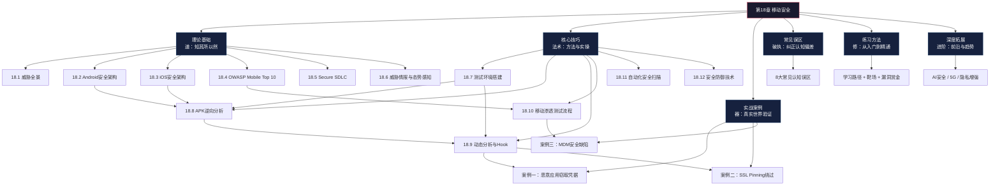
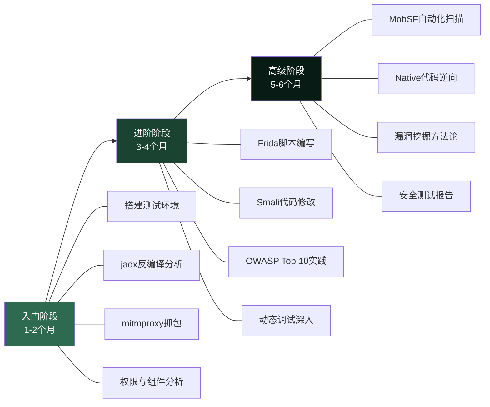

# 第18章 移动安全 — 章节概览

## 为什么移动安全至关重要

截至2025年，全球活跃智能手机用户已突破70亿，移动应用年下载量超过2550亿次。智能手机已不再仅仅是通信工具——它是银行终端、身份凭证、健康档案、企业办公入口，甚至是一把"数字钥匙"。当一台设备承载了如此多的信任价值，它自然成为攻击者的首要目标。

移动安全威胁正在以惊人的速度演变：

| 指标 | 数据 | 来源 |
|------|------|------|
| 全球移动恶意软件样本 | 每月新增超过330万个 | AV-TEST Institute, 2024 |
| 移动银行木马感染数 | Anatsa单次攻击感染100万+用户 | ThreatFabric, 2024 |
| 国家级移动监控能力 | Pegasus可零点击接管iPhone | 国际特赦组织调查报告 |
| 企业移动数据泄露占比 | 60%的企业数据泄露涉及移动设备 | Verizon DBIR, 2024 |
| 移动应用漏洞密度 | 平均每个应用存在6.2个安全问题 | Synopsys, 2024 |

这些数字揭示了一个现实：移动安全不是"锦上添花"的可选项，而是"生死攸关"的必修课。无论你是安全研究人员、应用开发者还是企业管理者，理解移动安全的核心原理和攻防技术都至关重要。

## 本章知识体系

本章按照"道法术器"的层次递进结构组织——从理论根基到方法论框架，从实操技术到工具链使用，构建完整的移动安全知识体系。以下是全章的知识脉络：

## 章节详细导航

### 第一节：理论基础（道）

> 理解"是什么"和"为什么"，建立移动安全的认知框架

本节是全章的根基。移动安全的核心挑战源于移动设备与传统PC在安全模型上的根本差异——设备便携性带来的物理攻击面、封闭应用生态带来的供应链风险、传感器数据暴露带来的隐私威胁、持续网络连接带来的通信劫持风险。不理解这些特殊性，后续的攻防技术就是无根之木。

**18.1 移动安全威胁全景** — 从宏观视角审视移动安全的威胁版图。介绍移动设备与PC安全模型的五大核心差异（便携性、应用生态、传感器、网络连接、用户行为），系统分类移动安全威胁（恶意应用、数据泄露、网络攻击、物理攻击、社会工程），并提供全球移动威胁态势的数据概览。这是理解后续所有内容的起点。

**18.2 Android安全架构** — 深入解剖Android的六层安全机制：
- **内核层**：Linux UID隔离、文件系统权限、SELinux强制访问控制
- **应用层**：APK签名机制（v1→v2→v3→v4演进）、运行时权限模型、应用沙箱
- **组件层**：四大组件（Activity/Service/BroadcastReceiver/ContentProvider）的安全属性与攻击面
- **存储层**：内部存储、外部存储、SharedPreferences、SQLite、Android Keystore的安全特性对比
- **网络层**：网络安全配置（Network Security Config）、证书固定（Certificate Pinning）
- **验证层**：Verified Boot启动链、dm-verity分区完整性验证

每个安全机制都配有实际的代码示例和ADB命令，让理论知识可以立即动手验证。

**18.3 iOS安全架构** — 解析Apple"硬件+软件"深度集成的安全哲学：
- **硬件安全基石**：Secure Enclave Processor（SEP）、UID Key、硬件加密引擎
- **数据保护体系**：四级数据保护（Complete Protection → No Protection）的工作原理
- **系统安全机制**：代码签名、ASLR、DEP、KTRR、沙箱隔离
- **Keychain安全**：访问控制属性、数据保护等级选择
- **应用分发安全**：App Store审核机制、TestFlight、企业证书分发的风险

理解Android和iOS安全架构的差异，是进行跨平台安全评估的前提。两者的设计哲学截然不同——Android偏向"开放+权限控制"，iOS偏向"封闭+硬件信任根"。

**18.4 OWASP Mobile Top 10** — 移动应用安全评估的"标尺"。逐项解读2024版的十大安全风险：

| 编号 | 风险名称 | 核心问题 | 典型场景 |
|------|---------|---------|---------|
| M1 | 不当的凭据使用 | 硬编码API密钥/密码 | 反编译后发现密钥 |
| M2 | 不当的供应链安全 | 第三方库/SDK漏洞 | 恶意SDK后门 |
| M3 | 不安全的认证/授权 | 仅客户端校验 | 绕过本地验证 |
| M4 | 不充分的输入/输出校验 | SQL注入、XSS | WebView注入 |
| M5 | 不安全的通信 | 未加密/弱加密 | SSL剥离攻击 |
| M6 | 不充分的隐私控制 | 过度数据收集 | 位置追踪滥用 |
| M7 | 不充分的二进制保护 | 无混淆/无反调试 | 逆向工程攻击 |
| M8 | 安全配置错误 | debuggable=true | 日志泄露 |
| M9 | 不安全的数据存储 | 明文存储敏感数据 | SharedPreferences泄露 |
| M10 | 不充分的密码学 | 弱算法/硬编码密钥 | ECB模式加密 |

每个风险都配有真实的漏洞案例和对应的防御代码。

**18.5 移动应用安全开发生命周期（Secure SDLC）** — 从"事后补救"转向"安全左移"。覆盖安全需求分析、安全设计原则（最小权限、纵深防御、默认安全）、安全编码规范、多维度安全测试（SAST/DAST/IAST/渗透测试）、发布后持续监控（RASP、漏洞赏金）五个阶段。这是安全从业者与开发团队协作的框架指南。

**18.6 移动威胁情报与态势感知** — 站在攻防对抗的最前沿。分析移动恶意软件的三大演进趋势（木马化应用增长、间谍软件商业化、5G/IoT融合风险），介绍企业移动安全管理体系（MDM→MAM→MIM→UEM的层次模型），以及如何建立组织级的移动威胁情报能力。

---

### 第二节：核心技巧（法·术）

> 掌握"怎么做"，将理论转化为可执行的测试能力

本节是全章的核心，聚焦移动安全测试的实际技能。从环境搭建到自动化扫描，形成完整的测试工具链。

**18.7 移动安全测试环境搭建** — 工欲善其事，必先利其器。详细介绍：
- **Android测试环境**：物理设备选择（Root/未Root各一台 + 模拟器）、ADB、apktool、jadx、Frida、Objection的安装配置
- **iOS测试环境**：越狱设备选择（A11及以前芯片推荐checkra1n）、class-dump、Cycript等工具
- **网络抓包环境**：mitmproxy的部署、CA证书安装、SSL Pinning绕过的前置准备
- 提供一键环境搭建脚本，降低入门门槛

**18.8 APK逆向分析技术** — 从"黑盒"到"白盒"的转变：
- **APK结构解析**：AndroidManifest.xml、classes.dex、resources.arsc的结构与作用
- **静态分析三剑客**：apktool反编译、jadx Java源码还原、dex2jar格式转换
- **Smali代码分析**：理解Smali语法、追踪关键函数调用链
- **代码混淆识别**：ProGuard/R8混淆特征、OLLVM混淆检测
- 通过实际APK的逆向分析演示完整的静态分析流程

**18.9 动态分析与Hook技术** — 运行时透视应用行为：
- **Frida深度使用**：Java层Hook、Native层Hook、内存读写、调用栈追踪
- **Objection快速探索**：绕过Root检测、绕过SSL Pinning、绕过越狱检测的一键操作
- **Xposed框架**：系统级Hook的原理与使用
- **Magisk模块**：Root隐藏、zygisk注入
- 提供10个常用Frida脚本模板，覆盖最常见的测试场景

**18.10 移动渗透测试流程** — 从散点式测试到系统化评估：
- **信息收集**：应用元数据提取、API端点枚举、第三方库识别
- **攻击面分析**：客户端攻击面（本地存储、日志、备份、组件导出）、网络攻击面（API、WebSocket、证书固定）、服务端攻击面（注入、越权、竞态）
- **漏洞验证**：从自动化扫描结果到手动确认的完整流程
- **报告撰写**：标准化的安全测试报告模板

**数据存储安全测试** — 移动端数据泄露的重灾区：
- SharedPreferences明文检测、SQLite数据库未加密识别
- 外部存储敏感文件搜索、剪贴板数据泄露
- Android Keystore / iOS Keychain的配置审计
- 日志信息泄露检测（logcat / NSLog）

**网络通信安全测试** — 移动应用的"生命线"：
- HTTP/HTTPS流量拦截与分析
- SSL/TLS配置审计（弱密码套件、降级攻击）
- 证书固定实现与绕过（OkHttp、TrustManager、网络安全配置）
- WebSocket安全测试、API认证机制分析

**身份认证安全测试** — 移动应用的"门禁系统"：
- 本地认证绕过、Token安全分析
- OAuth 2.0 / OIDC实现缺陷
- 生物识别安全（指纹/面部识别的旁路攻击）
- 会话管理安全（Token过期、刷新机制）

**代码质量测试** — 从代码层面发现安全隐患：
- 硬编码凭据检测、不安全的随机数生成
- 不安全的加密实现（ECB模式、硬编码IV）
- WebView安全配置审计
- 反调试保护强度评估

**18.11 自动化安全扫描** — 规模化的安全检测：
- **MobSF（Mobile Security Framework）**：一站式自动化扫描平台的部署与使用
- **Semgrep自定义规则**：编写针对特定漏洞模式的检测规则
- **QARK**：Android应用快速安全审计
- **CI/CD集成**：将安全扫描嵌入开发流水线

**18.12 移动安全防御技术** — 攻防一体的视角：
- 代码混淆（ProGuard/R8、OLLVM）
- 完整性校验（签名验证、防篡改）
- 运行时保护（反调试、Root/越狱检测、模拟器检测）
- 运行时应用自我保护（RASP）技术

---

### 第三节：实战案例（器）

> 在真实场景中验证技术，建立完整的攻击链思维

理论和技巧需要在真实场景中验证。本节通过三个精心设计的实战案例，展示移动安全攻击的完整过程——从初始信息获取到最终利用，每个案例都包含详细的攻击链分析、代码复现和防御建议。

**案例一：恶意应用窃取用户凭据** — 以一个伪装成系统工具的恶意应用为例，完整复现以下攻击链：恶意代码注入→权限提升→敏感数据窃取→C2通信建立→数据外传。通过此案例，读者将理解恶意应用的内部工作原理，以及如何从代码层面识别和防御此类攻击。

**案例二：移动银行应用SSL Pinning绕过** — 针对实施了证书固定的金融应用，演示多种SSL Pinning绕过技术：Frida动态绕过、自定义CA注入、TrustManager Hook。同时分析应用在绕过后的API通信，发现业务逻辑漏洞。此案例展示了"安全机制可以被绕过"这一核心理念。

**案例三：企业MDM方案安全缺陷利用** — 以一个真实的企业移动设备管理方案为对象，分析MDM协议通信、配置策略下发机制、设备注册流程中的安全缺陷。揭示"安全管理工具本身也可能成为攻击入口"这一容易被忽视的风险。

**综合防御策略** — 将三个案例中的攻击手法汇总，从开发者的视角给出系统性的防御方案：安全编码实践、多层防御架构、持续安全监控的完整闭环。

---

### 第四节：常见误区（破执）

> 纠正认知偏差，建立正确的安全观念

安全领域的误区比无知更危险——错误的安全认知会导致虚假的安全感。本节逐一拆解八个常见的移动安全误区：

| 误区 | 真相 | 关键论据 |
|------|------|---------|
| iOS不会被攻击 | iOS同样面临高级威胁 | Pegasus零点击漏洞、Operation Triangulation |
| 应用商店审核等于安全 | 审核存在固有盲区 | 时间差攻击、动态代码加载、混淆对抗 |
| Root/越狱检测等于安全 | 检测可被轻易绕过 | Frida Hook、Magisk Hide、Smali修改 |
| 本地加密就安全了 | 密钥管理才是关键 | 硬编码密钥、密钥派生不当 |
| 权限少的应用更安全 | 安全性不能仅看权限 | 恶意应用仅需INTERNET权限 |
| VPN保证网络安全 | VPN本身可能成为风险 | DNS泄露、日志记录、恶意VPN应用 |
| 开源一定更安全 | 开源不等于被审计 | event-stream供应链攻击事件 |
| 移动设备不需要杀毒 | 移动恶意软件持续增长 | 每月330万+新恶意样本 |

每个误区都配有"错误认知→事实真相→正确做法"的三段式分析，帮助读者建立纵深防御的安全思维。

---

### 第五节：练习方法（修）

> 从入门到精通的实战修炼之路

**三阶段学习路径**：

**推荐靶场与练习平台**：
- **DIVA**：Android安全入门靶场，覆盖13种常见漏洞类型
- **InsecureBankv2**：模拟银行应用，适合进阶练习
- **OWASP Uncrackable Apps**：三个难度级别的逆向挑战
- **HackTheBox / TryHackMe**：综合安全平台的移动端挑战
- **HackerOne / Bugcrowd**：真实漏洞赏金平台，从低危漏洞起步

**实验室搭建**：提供完整的一键搭建脚本和详细的手动配置指南，覆盖Android和iOS两个平台的测试环境。

---

### 第六节：本章小结与深度拓展

**本章小结**回顾全章核心要点，按"理论→技巧→案例→误区→练习"的脉络梳理知识体系，帮助读者巩固学习成果。

**深度拓展**面向希望深入研究的高级读者，覆盖：
- Android安全架构深度分析（Verified Boot、Binder IPC、签名方案演进）
- iOS安全架构深度分析（SEP工作原理、FairPlay DRM、KTRR机制）
- 移动恶意软件分析技术（银行木马、间谍软件、勒索软件、Rootkit）
- 前沿趋势：AI驱动安全、5G安全挑战、隐私增强技术、跨平台框架安全
- 完整的推荐学习资源：权威书籍、在线资源、安全会议、培训课程

## 学习目标

完成本章全部内容后，你应该能够：

1. **架构理解**：清晰对比Android和iOS安全架构的设计哲学与实现差异，解释每个安全机制的工作原理和局限性
2. **威胁识别**：运用OWASP Mobile Top 10框架，系统性地识别移动应用中的安全风险
3. **环境搭建**：独立搭建完整的Android/iOS移动安全测试环境（物理设备 + 模拟器 + 工具链 + 抓包环境）
4. **静态分析**：使用jadx、apktool等工具对APK进行反编译和代码审计，识别硬编码凭据、不安全配置等常见问题
5. **动态分析**：编写Frida脚本进行运行时Hook，绕过SSL Pinning、Root检测等安全机制，追踪应用的关键行为
6. **渗透测试**：按照系统化的流程（信息收集→攻击面分析→漏洞验证→报告撰写）完成移动应用安全评估
7. **防御设计**：从攻击者的视角出发，为移动应用设计多层防御方案，覆盖代码保护、通信安全、数据存储、运行时防护
8. **误区识别**：识别并纠正常见的移动安全认知偏差，建立纵深防御的安全思维

## 前置知识

学习本章前，建议具备以下基础知识：

| 知识领域 | 最低要求 | 建议水平 | 对应章节 |
|---------|---------|---------|---------|
| 网络安全基础 | TCP/IP、HTTP协议基本概念 | 能分析HTTP请求/响应 | 第1-5章 |
| Linux操作 | 基本命令行操作 | 熟练使用Shell、文件权限管理 | — |
| 编程能力 | 能阅读Java/Python代码 | 能编写简单的Frida脚本和Python自动化工具 | — |
| 加密基础 | 了解对称/非对称加密概念 | 理解TLS握手、证书链验证 | 第7章 |
| Web安全 | 了解OWASP Top 10 | 能识别常见的Web API漏洞 | 第9-11章 |

如果某些前置知识尚有欠缺，建议先回顾对应章节，或在学习过程中同步补充。本章会尽量自包含关键概念，但具备前置知识会让学习过程更加顺畅。

## 全章工具速查表

本章涉及的核心工具一览，方便学习和实践时快速查阅：

| 工具名称 | 用途 | 平台 | 安装方式 |
|---------|------|------|---------|
| Frida | 动态插桩框架 | Android/iOS | `pip install frida-tools` |
| Objection | Frida封装的运行时探索工具 | Android/iOS | `pip install objection` |
| jadx | APK反编译为Java源码 | 跨平台 | `apt install jadx` / GitHub Release |
| apktool | APK资源文件反编译 | 跨平台 | `apt install apktool` |
| mitmproxy | HTTPS中间人代理 | 跨平台 | `pip install mitmproxy` |
| MobSF | 自动化移动安全扫描 | 跨平台 | Docker / `pip install mobsf` |
| ADB | Android调试桥 | Android | `apt install adb` |
| class-dump | iOS类信息提取 | macOS | `brew install class-dump` |
| Semgrep | 静态代码分析 | 跨平台 | `pip install semgrep` |
| Cycript | iOS运行时操控 | iOS | Cydia源安装 |
| Magisk | Android Root管理 | Android | GitHub Release |
| Burp Suite | Web/API安全测试代理 | 跨平台 | 官网下载 |

---

> **安全警告与免责声明**
>
> 本章内容仅供**合法的安全测试与教育目的**使用。所有技术、工具和方法的讨论均旨在帮助安全从业者在**获得明确授权**的前提下进行防御性安全研究。
>
> - **未经授权**对任何系统、网络或应用进行安全测试是**违法行为**
> - 所有实践活动应在**隔离的实验环境**中进行（如虚拟机、CTF平台、专用靶场应用）
> - 遵守所在国家和地区的**网络安全法律法规**（中国《网络安全法》《数据安全法》《个人信息保护法》等）
> - 遵循**负责任的漏洞披露**原则（先报告厂商，给予修复窗口期后再公开）
>
> 作者不对因滥用本章内容造成的任何后果承担责任。
