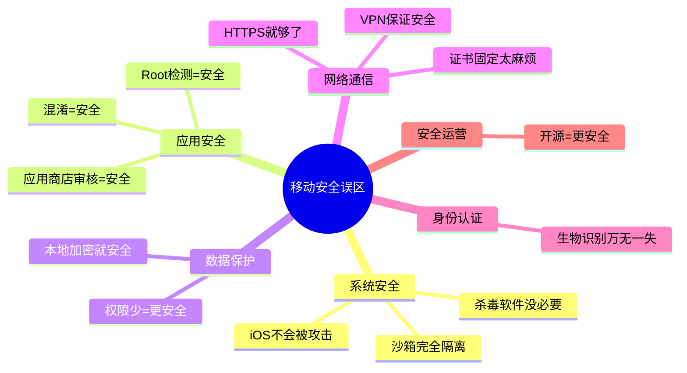
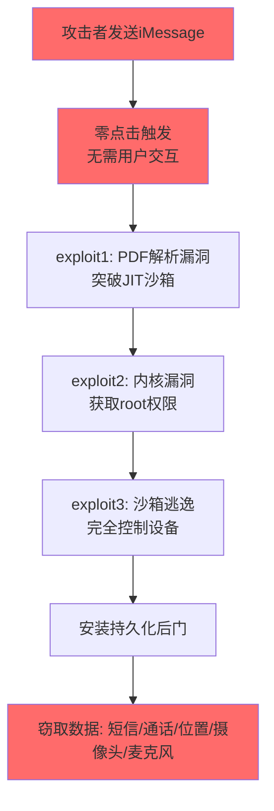
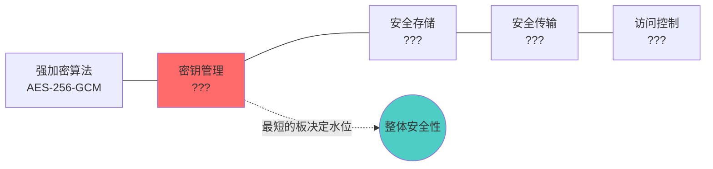
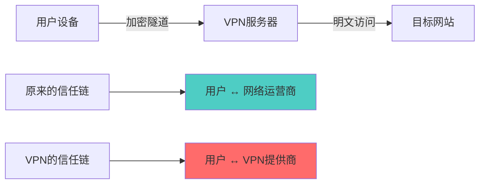
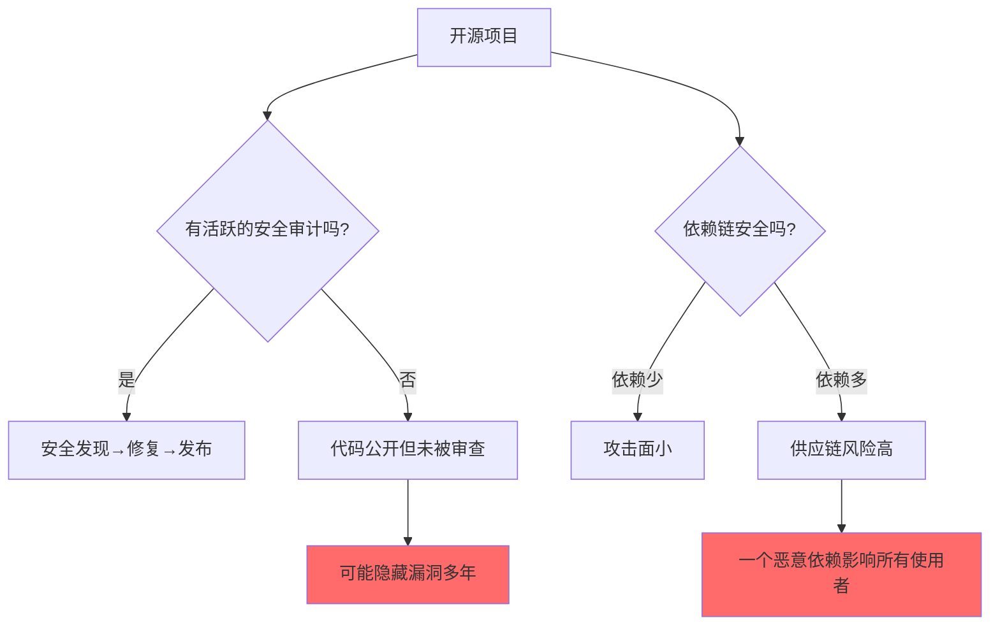
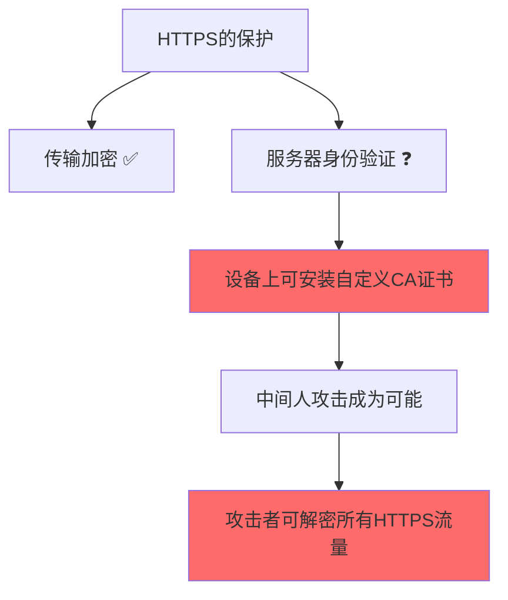
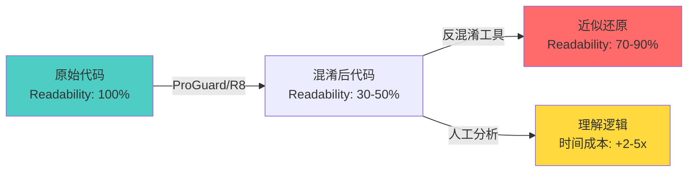
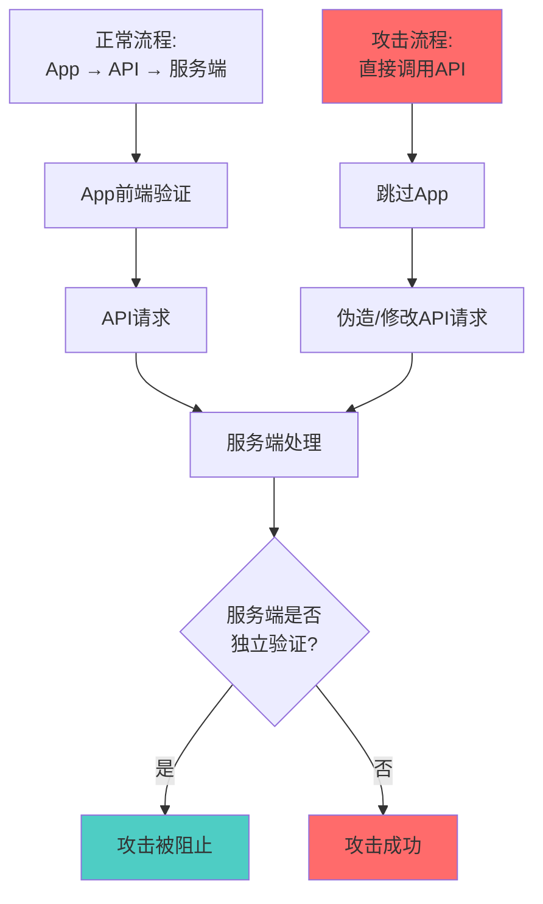
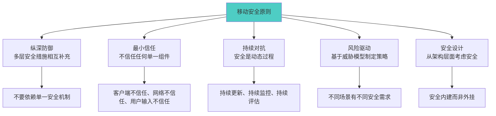

# 第18章 移动安全 — 常见误区

## 引言：为什么误区比无知更危险

移动安全领域的误区之所以危险，不仅因为它们是错误的，更因为它们给人一种虚假的安全感——让开发者、用户和企业管理者在面对真实威胁时毫无防备。一个持有"iOS不会被攻击"信念的用户，不会及时更新系统；一个认为"Root检测就够了"的开发者，不会投入资源做真正的数据保护。

本章梳理了移动安全领域最常见的12类误区，涵盖系统安全、应用安全、数据保护、网络通信、身份认证和安全运营六大维度。每个误区都从"错误认知 → 事实真相 → 攻击案例 → 正确做法"四个层面展开，帮助读者建立基于证据的安全思维，而非基于直觉的安全幻觉。



---

## 误区一："iOS系统不会被攻击"

### 错误认知

许多用户和开发者认为iOS系统由于封闭性和Apple的严格审核，不会受到恶意软件或安全攻击的影响。这种"安全神话"导致iOS用户和开发者放松警惕——不更新系统、随意点击链接、从不考虑设备可能已被入侵。

### 事实真相

iOS虽然具有强大的安全架构，但绝非不可攻破。封闭生态减少了一般攻击面，但也意味着一旦突破，影响范围更大——数亿台设备可能同时暴露在同一个漏洞之下。

**历史重大iOS安全事件**：

| 事件 | 时间 | 攻击方式 | 影响范围 | 关键教训 |
|------|------|----------|----------|----------|
| Pegasus间谍软件 | 2016至今 | iMessage零点击漏洞（FORCEDENTRY） | 记者、政治人物、人权活动家 | 零点击攻击无需用户任何交互 |
| XcodeGhost | 2015 | 篡改开发工具链 | 4000+应用（含微信、滴滴） | 供应链攻击可绕过所有审核 |
| WireLurker | 2014 | USB传播+企业证书 | 未越狱设备 | 封闭生态不能防御所有载体 |
| Operation Triangulation | 2023 | iMessage+未文档化硬件功能 | 卡巴斯基员工等 | 硬件层面的未知攻击面 |
| Trident漏洞链 | 2016 | 三个零日漏洞组合 | 越狱+完全控制 | 漏洞链可突破多层防御 |
| AdThief | 2014 | 越狱设备广告劫持 | 750万+越狱设备 | 越狱本身引入新的攻击面 |

**攻击链深度解析——以Pegasus为例**：



**越狱社区的贡献与启示**：

越狱研究者持续发现iOS安全漏洞。Unc0ver、checkra1n、Pangu等越狱工具利用的内核漏洞证明了iOS系统本身并非无懈可击。checkm8引导漏洞（BootROM级别）甚至影响了从iPhone 4S到iPhone X的所有设备，且无法通过软件更新修复。这说明：

- iOS的安全层次确实多（BootROM → iBoot → Kernel → Sandbox → Code Signing），但每层都可能有漏洞
- Apple的快速修补机制是优势，但从漏洞发现到修补的窗口期（通常数周到数月）足以被高级攻击者利用
- 封闭生态意味着漏洞情报不对称——Apple看不到的漏洞可能已被国家级攻击者使用多年

### 正确做法

- **系统更新**：iOS安全更新通常包含关键漏洞修补，应在发布后尽快安装。延迟更新意味着在已知漏洞窗口期内暴露
- **Lockdown Mode**：iOS 16+提供的极限安全模式，可大幅减少攻击面（禁用预览、限制JIT、过滤未知来电等），适用于高风险人群
- **最小化应用安装**：每增加一个应用就增加一个攻击向量。定期审查并删除不需要的应用
- **警惕社会工程**：零点击攻击虽然存在，但更多攻击仍依赖用户交互（点击链接、安装描述文件）。不要点击未知来源的链接
- **企业环境**：使用MDM监控设备状态，部署移动威胁防御（MTD）解决方案检测异常行为

---

## 误区二："应用商店审核等于应用安全"

### 错误认知

许多人认为通过Google Play或App Store审核的应用就是安全的，可以放心安装和使用。应用商店的审核被视为安全的终极保障。

### 事实真相

应用商店审核存在固有的局限性，它是一个"快照式"检查，而非持续性安全保障：

**审核机制的系统性盲区**：


1. **时间差攻击（Time-of-Check vs Time-of-Use）**：恶意应用先上架一个正常版本通过审核，之后通过动态代码加载（DCL）、远程配置下发或WebView加载激活恶意功能。Google Play和App Store的审核主要针对上架时的静态状态，运行时行为难以持续监控

2. **代码混淆对抗**：高级恶意代码使用多层混淆、加密和分段加载技术。Java/Kotlin代码可以被ProGuard/R8高度混淆，原生库（.so）可以使用OLLVM等工具进行控制流平坦化，静态分析引擎的检测率会显著下降

3. **审核资源有限**：Google Play每天有数千个应用提交审核，完全的人工审查不现实。2023年Google报告称其自动审核系统阻止了超过200万个违反政策的应用上架，但仍有大量恶意应用成功溜过。App Store的人工审核更严格，但审核员不可能深入审查每一行代码

4. **合法SDK中的隐藏风险**：许多应用集成的广告SDK、分析SDK、推送SDK可能包含数据收集行为。一个看似无害的手电筒应用，可能通过集成的广告SDK在后台收集设备信息、位置数据和应用列表。这些行为在应用审核时难以完全评估，因为SDK的代码不在应用源码中直接可见

**真实案例**：

- **Joker恶意软件家族**（2017至今）：Google Play上反复出现的订阅欺诈恶意软件，通过在代码中隐藏恶意payload、延迟激活等方式绕过审核。截至2024年，Joker变种已影响数百万用户
- **Anatsa银行木马**（2021至今）：通过伪装成PDF阅读器、二维码扫描器等工具类应用上架Google Play，下载量超过30万次后激活恶意功能，窃取数百家银行的登录凭据
- **Fleeceware应用**：利用试用期结束后自动高额收费的模式，虽不被归类为恶意软件，但对用户造成实际经济损失。Google Play和App Store上都曾大量存在此类应用

### 正确做法

- **审查权限请求**：安装前检查应用请求的权限是否与其功能匹配。一个计算器应用不应该请求通讯录和位置权限
- **检查开发者信息**：优先选择知名开发者或组织发布的应用。注意应用名称和图标的仿冒（如"WhatsApp Messenger" vs "WhatsApp Messengr"）
- **阅读评论时保持警惕**：五星好评可以批量刷，关注低分评论中提到的具体问题
- **使用应用安全扫描工具**：企业环境应使用移动应用安全测试（MAST）工具进行二次检测，如MobSF、NowSecure等
- **关注安全社区通报**：关注Google Play Protect的警告、安全厂商（如Lookout、Zimperium）的威胁报告
- **最小权限原则**：即使应用请求了某些权限，也可以在系统设置中选择性拒绝（Android运行时权限）

---

## 误区三："Root/越狱检测等于应用安全"

### 错误认知

很多开发者认为在应用中实施Root/越狱检测就能保证应用安全，认为检测到Root环境就拒绝运行即可高枕无忧。这是移动应用安全中最普遍也最危险的误区之一。

### 事实真相

Root/越狱检测是一种软性防护，在对抗有动机的攻击者时，它几乎没有实质性的安全价值：

**为什么Root检测注定失败**：

Root检测的本质是在被攻击者控制的环境中执行检测代码。攻击者拥有设备的root权限，可以在任意层面对检测逻辑进行拦截和修改。这就像让小偷自己检查门锁——他永远会告诉你"锁是好的"。

**主流绕过技术对比**：

| 绕过技术 | 原理 | 难度 | 对抗成本 |
|----------|------|------|----------|
| Frida Hook | 运行时修改函数返回值 | 低 | 几行JavaScript |
| Magisk/Zygisk | 内核级隐藏Root痕迹 | 中 | 配置一个模块 |
| Smali修改 | 反编译后修改检测逻辑 | 中 | 找到检测方法并修改 |
| LSPosed模块 | 框架级Hook，隐藏更彻底 | 低 | 安装一个模块 |
| 自定义ROM | 移除所有Root特征 | 高 | 一次性配置 |

**绕过代码示例**：

```javascript
// 使用Frida绕过Root检测 - 只需几行代码
Java.perform(function() {
    // 方式1: 直接修改检测函数返回值
    var RootDetector = Java.use('com.app.security.RootDetector');
    RootDetector.isRooted.implementation = function() {
        return false;
    };
    
    // 方式2: 绕过文件存在性检测
    var File = Java.use('java.io.File');
    File.exists.implementation = function() {
        var path = this.getAbsolutePath();
        if (path.contains('/su') || path.contains('magisk') || 
            path.contains('supersu') || path.contains('busybox')) {
            return false;  // 隐藏Root相关文件
        }
        return this.exists();
    };
    
    // 方式3: 绕过Runtime.exec检测
    var Runtime = Java.use('java.lang.Runtime');
    Runtime.exec.overload('java.lang.String').implementation = function(cmd) {
        if (cmd.contains('which') && cmd.contains('su')) {
            throw Java.use('java.io.IOException').$new('not found');
        }
        return this.exec(cmd);
    };
});
```

**过度依赖Root检测的代价**：

- **安全资源错配**：开发团队将大量时间投入到"如何检测Root"和"如何防止绕过"的军备竞赛中，而忽视了真正需要保护的敏感数据和业务逻辑
- **误判影响用户体验**：合法的Root用户（安全研究人员、开发者）和使用特定定制ROM的用户被错误拒绝，导致用户流失
- **虚假安全感**：检测通过后，开发者认为"设备是安全的"，从而降低了其他安全措施的优先级
- **对抗升级**：每次更新检测手段，绕过工具也会更新，形成永无止境的消耗战

### 正确做法

- **将Root检测视为纵深防御的一层，而非核心防线**：它的价值在于提高攻击门槛、收集威胁情报，而非阻止攻击
- **关键数据保护依赖服务端**：敏感数据的访问控制、交易验证、异常检测应在服务端完成，不依赖客户端的环境判断
- **分级响应策略**：检测到异常环境时，不要简单地拒绝运行，而是根据风险等级采取不同措施：
  - 低风险：记录日志，继续运行
  - 中风险：警告用户，限制部分敏感功能
  - 高风险：要求额外认证（如短信验证码），限制关键操作
- **保护检测代码本身**：使用代码混淆、完整性校验、反调试等手段增加绕过成本，但要认识到这只能增加成本，不能完全阻止
- **关注真正的安全目标**：问自己"Root检测保护的是什么？"，然后思考"有没有更可靠的保护那个东西的方式？"

---

## 误区四："本地数据加密就安全了"

### 错误认知

开发者在应用中使用AES等加密算法对数据进行加密后，认为数据已经安全，无需更多保护。"我们用了AES-256加密"成为很多安全评审中的万能回答。

### 事实真相

加密的安全性取决于密钥管理，而非算法本身。AES-256本身确实牢不可破，但如果密钥存储在紧挨着加密数据的地方，攻击者拿到密钥和拿到明文没有本质区别。

**加密系统的木桶原理**：



**常见的致命错误及其后果**：

**错误1：密钥硬编码**

```java
// 致命错误：密钥直接写在代码中
private static final String SECRET_KEY = "MySecretKey12345";
// 反编译APK后瞬间获取密钥，加密形同虚设
```

攻击者使用jadx反编译APK后，通过搜索"SECRET_KEY"、"AES"、"encrypt"等关键词，几秒内就能找到硬编码的密钥。自动化工具如APKLeaks可以在毫秒级完成这个扫描。

**错误2：密钥派生不当**

```java
// 致命错误：使用可预测的设备信息作为密钥
String key = Settings.Secure.getString(
    context.getContentResolver(), 
    Settings.Secure.ANDROID_ID  // 8位十六进制，熵极低
);
// ANDROID_ID在同一设备上是固定的，在root设备上可以随意修改
```

**错误3：使用ECB模式**

```java
// 致命错误：ECB模式不隐藏数据模式
Cipher cipher = Cipher.getInstance("AES/ECB/PKCS5Padding");
// 相同的明文块产生相同的密文块，攻击者可以通过模式分析推断内容
```

**错误4：密钥存储在可访问位置**

```java
// 致命错误：密钥存储在SharedPreferences
SharedPreferences prefs = context.getSharedPreferences("config", MODE_PRIVATE);
prefs.edit().putString("encryption_key", keyString).apply();
// root设备上，SharedPreferences是明文XML文件，可直接读取
```

### 正确做法

**Android平台——使用Android Keystore系统**：

```java
// 正确示例：使用Android Keystore管理密钥
// 密钥由硬件安全模块（HSM/TEE）保护，应用代码无法直接导出
KeyStore keyStore = KeyStore.getInstance("AndroidKeyStore");
keyStore.load(null);

KeyGenerator keyGenerator = KeyGenerator.getInstance(
    KeyProperties.KEY_ALGORITHM_AES, "AndroidKeyStore");

keyGenerator.init(new KeyGenParameterSpec.Builder("encryption_key",
    KeyProperties.PURPOSE_ENCRYPT | KeyProperties.PURPOSE_DECRYPT)
    .setBlockModes(KeyProperties.BLOCK_MODE_GCM)        // GCM模式：认证加密
    .setEncryptionPaddings(KeyProperties.ENCRYPTION_PADDING_NONE)
    .setKeySize(256)
    .setUserAuthenticationRequired(true)                 // 需要用户认证
    .setUserAuthenticationValidityDurationSeconds(300)   // 认证有效期5分钟
    .build());

SecretKey secretKey = keyGenerator.generateKey();

// 加密示例
Cipher cipher = Cipher.getInstance("AES/GCM/NoPadding");
cipher.init(Cipher.ENCRYPT_MODE, secretKey);
byte[] iv = cipher.getIV();              // GCM自动生成随机IV
byte[] encrypted = cipher.doFinal(data);
// IV需要和密文一起存储，但不需要保密
```

**iOS平台——使用Keychain和Data Protection**：

```swift
// 正确示例：使用Keychain存储敏感数据
let query: [String: Any] = [
    kSecClass as String: kSecClassGenericPassword,
    kSecAttrAccount as String: "userToken",
    kSecValueData as String: tokenData,
    kSecAttrAccessControl as String: 
        SecAccessControlCreateWithFlags(
            nil,
            kSecAttrAccessibleWhenUnlockedThisDeviceOnly,
            .biometryCurrentSet,  // 需要生物认证
            nil
        )!
]
SecItemAdd(query as CFDictionary, nil)

// 数据保护等级选择
// .complete: 设备锁定时数据不可访问（最高安全）
// .completeUnlessOpen: 锁定时不可访问，除非文件已打开
// .completeUntilFirstUnlock: 重启后首次解锁前不可访问
// .none: 无额外保护（不推荐用于敏感数据）
```

**密钥管理原则**：

| 原则 | 说明 | 平台实现 |
|------|------|----------|
| 密钥不出安全硬件 | 密钥在TEE/SE中生成和使用，应用代码无法导出 | Android Keystore / iOS Secure Enclave |
| 密钥绑定用户身份 | 解密需要用户认证（PIN/生物识别） | setUserAuthenticationRequired / Keychain ACL |
| 密钥绑定设备 | 密钥不可迁移到其他设备 | .thisDeviceOnly / attestation |
| 密钥轮换 | 定期更换密钥，限制单密钥使用时长 | KeyGenParameterSpec + 迁移逻辑 |
| 算法选择 | 使用AES-GCM（认证加密），避免ECB/CBC | Cipher.getInstance("AES/GCM/NoPadding") |

---

## 误区五："权限少的应用更安全"

### 错误认知

用户倾向于认为请求权限少的应用比请求权限多的应用更安全。应用商店评论中常见"这个应用请求太多权限了，不安全"的评价。

### 事实真相

应用的安全性不能通过权限数量来判断。权限数量反映的是功能需求，而非安全水平。一个请求大量权限但严格遵守安全实践的应用，可能比一个请求少量权限但滥用权限的应用安全得多。

**权限与安全的真实关系**：

| 场景 | 权限数量 | 安全性 | 说明 |
|------|----------|--------|------|
| 地图导航应用请求位置权限 | 多 | 合理 | 业务必需，权限与功能匹配 |
| 手电筒应用请求通讯录权限 | 中 | 可疑 | 权限与功能不匹配 |
| 计算器应用只请求网络权限 | 少 | 可疑 | 单一权限即可上传剪贴板数据 |
| 银行应用请求设备管理权限 | 多 | 合理 | 安全需求驱动的额外权限 |

**"少权限"恶意应用的攻击方式**：

1. **仅需INTERNET权限**：通过网络外传从剪贴板、输入法缓存或其他途径获取的数据。Android的INTERNET是普通权限，安装时自动授予，不显示给用户
2. **利用无障碍服务**：申请无障碍权限后可以读取屏幕上所有内容、模拟用户操作，这是一个"万能权限"
3. **利用设备管理器**：注册为设备管理器后获得锁定屏幕、擦除数据等能力，且普通用户难以卸载

**权限滥用的检测困难**：

权限被授予后，系统只在应用实际调用相关API时才进行权限检查，但无法判断调用的"意图"是否合理。一个拥有位置权限的外卖应用持续在后台获取位置——这可能是正常的订单追踪，也可能是用户监控。

### 正确做法

- **审查权限与功能的匹配度**：问自己"这个应用为什么需要这个权限？"。如果不理解原因，可以在安装前搜索开发者对权限的说明
- **关注权限的实际使用方式**：Android 12+的隐私信息中心可以查看应用在最近24小时内使用了哪些权限。iOS的隐私报告功能提供类似信息
- **使用权限管理工具**：Android的"权限管理器"和iOS的"隐私与安全"设置可以精细控制每个权限
- **企业环境使用MDM**：通过企业移动管理平台制定权限策略，禁止应用获取不必要的权限
- **关注行为而非声明**：安全软件和沙箱工具（如NetGuard、TrackerControl）可以监控应用的实际网络行为，比权限声明更能反映真实情况

---

## 误区六："VPN应用能保证网络安全"

### 错误认知

很多用户认为使用VPN应用后，网络通信就是安全的，可以放心连接任何公共Wi-Fi、访问任何网站。VPN被当作网络安全的"银弹"。

### 事实真相

VPN只解决了一个问题（网络传输加密），但它引入了新的信任问题和安全风险：

**VPN的安全模型**：



**VPN应用的系统性风险**：

1. **"无日志"承诺不可验证**：部分VPN应用声称"无日志"政策，但实际上记录并出售用户浏览数据。2017年的研究发现，Google Play上排名前150的免费VPN中，超过80%存在数据泄露风险
2. **DNS泄露**：VPN配置不当可能导致DNS请求绕过VPN隧道，即使HTTP流量被加密，ISP仍然可以看到用户访问的域名。这在Android上尤为常见
3. **IPv6泄露**：许多VPN只处理IPv4流量，如果设备启用了IPv6，部分流量可能绕过VPN隧道
4. **WebRTC泄露**：浏览器的WebRTC功能可能泄露真实IP地址，即使VPN隧道正常工作
5. **恶意VPN应用**：应用商店中存在大量免费VPN应用实际上是数据收集工具，或在用户设备上安装广告SDK
6. **信任转移**：使用VPN只是将信任从网络运营商转移到VPN提供商，如果VPN提供商不可信，情况可能更糟——因为它能同时看到你的身份和全部网络流量

**VPN协议安全对比**：

| 协议 | 安全性 | 速度 | 推荐度 | 说明 |
|------|--------|------|--------|------|
| WireGuard | 高 | 快 | ★★★★★ | 现代协议，代码量小（约4000行），攻击面小 |
| OpenVPN | 高 | 中 | ★★★★☆ | 成熟可靠，经过广泛审计 |
| IKEv2/IPSec | 高 | 快 | ★★★★☆ | 适合移动设备，支持快速切换网络 |
| L2TP/IPSec | 中 | 中 | ★★★☆☆ | 依赖预共享密钥，可能被暴力破解 |
| SSTP | 中 | 中 | ★★★☆☆ | 微软专有，依赖Windows实现 |
| PPTP | 低 | 快 | ★☆☆☆☆ | 已知严重漏洞，不应使用 |

### 正确做法

- **选择信誉良好的VPN提供商**：优先选择经过独立安全审计的VPN服务，查看第三方审计报告
- **验证VPN无泄露**：使用ipleak.net或dnsleaktest.com等工具检测DNS和IPv6泄露
- **使用现代协议**：优先选择WireGuard或OpenVPN，避免PPTP等过时协议
- **VPN不等于匿名**：VPN提供网络层加密，但应用层（如浏览器指纹、登录状态）仍然可能暴露身份
- **VPN不替代端到端加密**：VPN隧道只保护到VPN服务器的这段路程，从VPN服务器到目标网站的流量仍然需要HTTPS保护
- **企业环境使用企业级VPN**：与个人VPN不同，企业VPN（如Zscaler、Palo Alto GlobalProtect）提供流量审计、威胁检测和策略管理

---

## 误区七："开源应用比闭源应用更安全"

### 错误认知

有些人认为开源应用因为代码公开，所以比闭源应用更安全。"代码都在那里，任何人都可以审计"成为开源安全的口头禅。

### 事实真相

开源提供了安全审计的**可能性**，但不保证**实际被审计**。一个从未被任何人审计过的开源项目，在安全性上并不比闭源项目更有保障。

**开源安全的现实**：



**开源项目的安全困境**：

1. **"眼球效应"的局限**：Linus定律（"足够多的眼睛，所有bug都是浅显的"）假设有人在看，但大多数开源项目维护者只有1-3人，他们忙于功能开发，没有精力进行安全审计

2. **供应链攻击的真实案例**：
   - **event-stream（2018）**：流行npm包的维护者将控制权交给新贡献者，后者注入了窃取比特币钱包的恶意代码。该包每周下载量超过200万次
   - **ua-parser-js（2021）**：被劫持的npm包在数百万次下载中传播加密货币挖矿程序和密码窃取器
   - **xz-utils（2024）**：攻击者花数年时间成为维护者，最终在xz压缩库中植入后门，差点影响所有Linux发行版的SSH服务
   - **Log4Shell（2021）**：开源日志库Log4j的漏洞影响了全球数十亿设备

3. **编译版本与源码不一致**：即使源码安全，分发的二进制文件可能被篡改。2015年XcodeGhost事件就是供应链攻击的典型案例——开发者下载的Xcode本身被篡改

4. **开源≠可审计**：大型开源项目（如Android AOSP）有数百万行代码，没有任何个人或组织能完整审计。安全依赖于部分安全研究人员的随机关注

### 正确做法

- **评估项目的健康度**：查看项目的GitHub指标——最近提交时间、Issue响应速度、贡献者数量、Star/Fork比例、安全策略文件（SECURITY.md）
- **检查依赖链**：使用`npm audit`、`pip audit`、`cargo audit`等工具检查项目依赖中的已知漏洞。企业环境应使用SCA（Software Composition Analysis）工具
- **验证构建产物**：优先选择支持可重复构建（Reproducible Builds）的项目，验证下载的二进制文件是否与源码一致
- **锁定依赖版本**：使用lock文件（package-lock.json、Cargo.lock、go.sum）锁定依赖的精确版本和哈希值
- **评估安全响应历史**：查看项目过去对安全漏洞的响应速度和处理方式。一个安全报告发出后数月不回应的项目，即使代码安全也存在运营风险
- **开源和闭源都需要独立评估**：不要因为"开源"就降低安全评估标准，也不要因为"闭源"就否定其安全性

---

## 误区八："移动设备不需要安全防护软件"

### 错误认知

部分用户认为移动操作系统足够安全，不需要安装任何安全防护软件。"我的手机又不是Windows电脑，不会中毒"是常见论调。

### 事实真相

移动恶意软件的数量和复杂度都在快速增长，而操作系统内置的安全机制存在覆盖盲区：

**移动威胁态势（2024年数据）**：

- 全球每月发现超过300万个新的移动恶意软件样本
- 银行木马（如Anatsa、TeaBot、Vultur）通过应用商店和侧载传播，2024年影响超过数百万用户
- 间谍软件（如Pegasus、Predator）被用于国家级监控
- 移动广告欺诈每年造成数十亿美元损失
- 企业环境中，移动设备是最薄弱的安全环节

**操作系统内置防护的局限**：

| 防护机制 | Android | iOS | 局限性 |
|----------|---------|-----|--------|
| 应用扫描 | Google Play Protect | App Store审核 | 对新型恶意软件检测率有限 |
| 沙箱隔离 | 应用沙箱+SELinux | 应用沙箱 | 不能防御应用内的恶意行为 |
| 权限控制 | 运行时权限 | 权限提示 | 用户可能盲目授予所有权限 |
| 网络保护 | 无内置 | 无内置 | 不检测网络钓鱼、恶意Wi-Fi |
| 漏洞修补 | 依赖厂商/OEM | Apple统一推送 | Android碎片化导致修补延迟 |

**安全防护软件的额外价值**：

1. **恶意应用检测**：基于行为分析的检测可以发现应用商店审核遗漏的恶意应用
2. **网络钓鱼防护**：检测短信、邮件和网页中的钓鱼链接
3. **Wi-Fi安全检查**：检测中间人攻击、恶意热点
4. **隐私审计**：识别过度收集数据的应用
5. **远程擦除**：设备丢失后的数据保护

### 正确做法

- **评估风险等级**：个人用户与企业用户面临的风险不同。处理敏感数据（企业邮件、银行应用）的设备应有更强的防护
- **选择知名安全产品**：优先选择Lookout、Zimperium、Norton等知名厂商的安全产品，避免安装来源不明的"安全"应用
- **企业环境必须部署MTD**：移动威胁防御（Mobile Threat Defense）是企业安全体系的必要组成部分，与MDM/EMM集成使用
- **安全软件不能替代安全习惯**：及时更新系统、不侧载应用、不点击可疑链接、使用强密码和多因素认证，这些基本习惯比任何安全软件都重要
- **评估性能影响**：安全软件会消耗一定的系统资源，选择对性能影响较小的产品

---

## 误区九："HTTPS就够了，不需要其他通信安全措施"

### 错误认知

开发者认为只要应用使用了HTTPS，网络通信就是安全的，不需要额外的保护措施。"我们全站HTTPS"被当作通信安全的终点。

### 事实真相

HTTPS只解决了传输加密和服务器身份验证两个基本问题，但在移动端场景下，它远不足以保证通信安全：

**HTTPS在移动端的脆弱性**：



**移动端HTTPS的具体威胁**：

1. **自定义CA证书攻击**：Android允许用户安装自定义CA证书，攻击者可以诱导用户安装恶意CA证书后，对所有HTTPS流量进行中间人攻击。即使用户不主动安装，某些"安全软件"和企业监控工具也会安装自定义CA

2. **证书验证绕过**：许多应用在开发过程中禁用了证书验证（为了方便调试），这些代码可能残留在发布版本中

```java
// 致命错误：信任所有证书（常见于调试代码残留）
TrustManager[] trustAllCerts = new TrustManager[]{
    new X509TrustManager() {
        public X509Certificate[] getAcceptedIssuers() { return null; }
        public void checkClientTrusted(X509Certificate[] certs, String authType) {}
        public void checkServerTrusted(X509Certificate[] certs, String authType) {}
    }
};
SSLContext sc = SSLContext.getInstance("TLS");
sc.init(null, trustAllCerts, new SecureRandom());
// 所有HTTPS连接都不再验证服务器证书
```

3. **降级攻击**：如果应用允许HTTP到HTTPS的降级，攻击者可以通过中间人位置阻止HTTPS连接，迫使应用使用明文HTTP

4. **SSL Stripping**：即使服务器配置了HSTS，如果应用没有正确实现HSTS检查，攻击者仍然可以在首次连接时进行降级

**没有证书固定的HTTPS防护层次**：

| 威胁 | 纯HTTPS | HTTPS + 证书固定 |
|------|---------|------------------|
| 公共Wi-Fi窃听 | ✅ 防护 | ✅ 防护 |
| ISP流量分析 | ✅ 域名外隐藏 | ✅ 域名外隐藏 |
| 自定义CA中间人 | ❌ 可被绕过 | ✅ 防护 |
| 企业代理中间人 | ❌ 可被绕过 | ✅ 防护 |
| 根CA被入侵 | ❌ 可被绕过 | ✅ 防护 |

### 正确做法

- **实施证书固定（Certificate Pinning）**：将服务器证书或公钥硬编码在应用中，拒绝接受任何其他证书，即使它由受信任的CA签发
- **禁止明文通信**：使用Network Security Config（Android）或App Transport Security（iOS）强制所有连接使用HTTPS
- **使用网络安全配置**：

```xml
<!-- Android: res/xml/network_security_config.xml -->
<network-security-config>
    <!-- 禁止所有明文通信 -->
    <base-config cleartextTrafficPermitted="false">
        <trust-anchors>
            <certificates src="system" />
        </trust-anchors>
    </base-config>
    
    <!-- 为特定域名设置证书固定 -->
    <domain-config>
        <domain includeSubdomains="true">api.example.com</domain>
        <pin-set expiration="2025-01-01">
            <pin digest="SHA-256">base64_encoded_pin=</pin>
            <pin digest="SHA-256">backup_pin_value=</pin>
        </pin-set>
    </domain-config>
</network-security-config>
```

- **实施双向TLS（mTLS）**：在高安全场景下，要求客户端也提供证书进行身份验证
- **使用VPN或专用安全通道**：企业应用可以通过VPN或零信任网络架构（ZTNA）保护所有通信

---

## 误区十："证书固定（Certificate Pinning）太麻烦，不值得做"

### 错误认知

开发者认为证书固定增加了开发复杂度，证书更新时容易导致应用不可用，投入产出比不高。

### 事实真相

证书固定确实是移动应用通信安全中最重要的额外保护措施之一。不实施证书固定，意味着应用对任何由受信任CA签发的证书都无条件信任——这在移动端是一个严重的安全缺陷，因为设备可能安装了自定义CA证书。

**证书固定的价值**：

- **防止自定义CA中间人攻击**：攻击者（或监控软件）在设备上安装自定义CA证书后，可以解密所有未固定的HTTPS流量
- **防止CA被入侵**：如果某个CA被入侵并签发了伪造证书，未固定证书的应用将接受伪造证书
- **防止企业代理监控**：企业代理通过替换证书来解密HTTPS流量，证书固定可以检测到这种替换

**证书固定的实现方式对比**：

| 方式 | 实现难度 | 灵活性 | 推荐场景 |
|------|----------|--------|----------|
| 公钥固定（SPKI Pin） | 中 | 中 | 固定证书公钥，证书更换时公钥可能不变 |
| 证书固定（Certificate Pin） | 低 | 低 | 固定整个证书，证书过期必须更新应用 |
| 域名绑定+CA约束 | 中 | 高 | 使用CAA记录+应用层CA约束 |
| 动态证书固定 | 高 | 高 | 服务端动态下发pin值 |

**公钥固定的推荐实现**：

```kotlin
// Android: 使用OkHttp实现证书固定
val client = OkHttpClient.Builder()
    .certificatePinner(
        CertificatePinner.Builder()
            .add("api.example.com", 
                 "sha256/AAAAAAAAAAAAAAAAAAAAAAAAAAAAAAAAAAAAAAAAAAA=")  // 主证书公钥
            .add("api.example.com", 
                 "sha256/BBBBBBBBBBBBBBBBBBBBBBBBBBBBBBBBBBBBBBBBBBB=")  // 备份证书公钥
            .build()
    )
    .build()
```

```swift
// iOS: URLSession证书固定
func urlSession(_ session: URLSession, 
                didReceive challenge: URLAuthenticationChallenge,
                completionHandler: @escaping (URLSession.AuthChallengeDisposition, 
                                             URLCredential?) -> Void) {
    guard let serverTrust = challenge.protectionSpace.serverTrust,
          let certificate = SecTrustGetCertificateAtIndex(serverTrust, 0) else {
        completionHandler(.cancelAuthenticationChallenge, nil)
        return
    }
    
    // 获取服务器证书公钥
    let serverPublicKey = SecCertificateCopyKey(certificate)
    let serverPublicKeyData = SecKeyCopyExternalRepresentation(serverPublicKey!, nil)! as Data
    let serverPublicKeyHash = sha256(data: serverPublicKeyData)
    
    // 与预置的公钥哈希对比
    if serverPublicKeyHash == expectedPublicKeyHash {
        completionHandler(.useCredential, 
                         URLCredential(trust: serverTrust))
    } else {
        completionHandler(.cancelAuthenticationChallenge, nil)
    }
}
```

**证书固定的维护策略**：

- **固定公钥而非证书**：公钥在证书更新时可能不变（如果CSR使用同一密钥对），减少更新频率
- **预置备份pin**：始终预置至少一个备份公钥pin，在主证书无法使用时可以切换
- **设置合理的过期时间**：证书固定应有明确的过期时间，避免因证书更新导致应用不可用
- **使用动态pin更新**：服务端可以通过安全通道下发新的pin值，实现无需更新应用的pin轮换
- **监控固定失败率**：收集证书固定验证失败的日志，及时发现证书更换或中间人攻击

---

## 误区十一："生物识别认证是万无一失的"

### 错误认知

用户和开发者认为指纹识别、面部识别等生物识别技术比密码更安全，可以作为唯一或主要的身份认证手段。

### 事实真相

生物识别技术提供了便利性，但在安全性上存在独特的弱点：

**生物识别的安全特性**：

| 特性 | 密码 | 生物识别 | 分析 |
|------|------|----------|------|
| 可更换 | ✅ 可以随时更换 | ❌ 无法更换 | 生物特征泄露是永久性的 |
| 可共享 | ✅ 可以告诉别人 | ✅ 难以共享 | 生物识别在共享场景有优势 |
| 唯一性 | N/A | ⚠️ 非绝对唯一 | 同卵双胞胎可互相解锁 |
| 伪造难度 | N/A | ⚠️ 因技术而异 | 2D面部识别可被照片欺骗 |
| 存储安全 | 依赖实现 | 依赖实现 | 生物特征模板可能被窃取 |
| 环境依赖 | 无 | 有 | 手指湿/脏、戴口罩等影响识别 |

**生物识别的具体攻击方式**：

1. **指纹攻击**：2016年Chaos Communication Club演示了使用日常照片中的指纹制作假指纹解锁手机的方法。2023年研究人员展示了使用AI生成的指纹（MasterPrint）可以匹配大量注册指纹

2. **面部识别攻击**：
   - 2D面部识别（如早期Android Face Unlock）可以被照片或视频欺骗
   - 3D结构光（如Face ID）更安全，但在同卵双胞胎、相似面容亲属之间可能误识别
   - 面部识别在佩戴口罩时的识别率下降，部分系统在"识别失败N次后回退到密码"的逻辑中存在时序攻击风险

3. **生物特征数据泄露**：与密码不同，生物特征数据一旦泄露无法更换。2015年美国人事管理办公室（OPM）泄露了560万联邦雇员的指纹数据

4. **旁路攻击**：许多实现中，生物识别只是本地认证的替代品，认证结果以布尔值传递给服务端。攻击者可以Hook认证结果的返回值，绕过生物识别检查

**关键认知**：生物识别在现代操作系统中通常是密码的**便捷替代**，而非**安全升级**。在iOS上，Face ID/Touch ID解锁后获得的是设备密码的等价物，而非生物特征本身。这意味着生物识别的安全性最终取决于设备密码的强度。

### 正确做法

- **生物识别作为便捷层，不作为唯一防线**：关键操作（如支付、密码修改）应要求额外验证（如输入PIN或密码）
- **使用FIDO2/WebAuthn**：基于公钥密码学的认证协议，将生物识别与密码学密钥绑定，生物特征不离开设备
- **启用多因素认证**：生物识别（你知道什么/你是谁）+ 设备因素（你拥有什么）+ 位置因素（你在哪里）
- **设置合理的回退策略**：生物识别失败N次后要求密码认证，防止暴力尝试
- **关注设备安全等级**：Android的BiometricManager区分了STRONG（如指纹）和WEAK（如2D面部识别）生物识别，敏感操作应只接受STRONG级别

---

## 误区十二："代码混淆等同于应用安全"

### 错误认知

开发者认为使用ProGuard/R8进行代码混淆后，应用就是安全的，攻击者无法理解或修改应用逻辑。

### 事实真相

代码混淆是一种"延迟"措施，不是"阻止"措施。混淆增加的是逆向分析的时间成本，而非阻止逆向分析的可能性。

**混淆的实际效果**：



**混淆的局限性**：

1. **自动化反混淆工具成熟**：jadx、CFR、Procyon等反编译工具可以自动处理大部分混淆。重命名类名和方法名是混淆中最常见的操作，但不影响理解程序逻辑

2. **字符串加密可被绕过**：字符串加密混淆（如DexGuard的字符串加密）可以通过Hook解密函数来还原明文字符串

3. **Native代码不是银弹**：将关键逻辑移到.so文件（JNI/Native）可以增加逆向难度，但IDA Pro、Ghidra等工具可以分析原生代码。ollvm等混淆工具增加了复杂度，但不能阻止分析

4. **运行时暴露一切**：无论代码如何混淆，运行时的内存中必然包含明文的类名、方法名和数据。Frida等动态分析工具可以直接读取运行时状态

5. **资源文件不受影响**：混淆通常不处理资源文件（XML、assets），其中可能包含敏感配置信息

**混淆的正确价值定位**：

| 目标 | 混淆能实现吗 | 说明 |
|------|-------------|------|
| 阻止逆向分析 | ❌ | 只能增加时间成本 |
| 阻止自动化工具 | ❌ | 反混淆工具已经很成熟 |
| 保护硬编码密钥 | ❌ | 密钥最终必须在运行时可用 |
| 阻止脚本小子 | ✅ | 降低低级攻击者的攻击能力 |
| 增加攻击成本 | ✅ | 让攻击者花更多时间 |
| 保护商业逻辑 | ⚠️ | 有限保护，核心逻辑应服务端实现 |

### 正确做法

- **混淆是纵深防御的一层**：它提高了攻击门槛，但不能作为唯一的保护手段
- **关键逻辑放在服务端**：真正需要保护的业务逻辑和算法应该在服务端实现，客户端只做展示和交互
- **使用多层混淆**：结合名称混淆、控制流混淆、字符串加密、虚拟化保护（如梆梆安全、几维安全的虚拟机保护）增加逆向难度
- **完整性校验**：检测应用是否被反编译、修改后重新打包。检查签名、文件哈希、运行时完整性
- **反调试保护**：检测调试器附加、Frida注入等动态分析手段，增加动态分析的难度
- **安全的代码设计**：不依赖"代码不可被逆向"的假设来保障安全。假设攻击者可以看到所有客户端代码，设计时确保即使代码完全公开，敏感数据仍然安全

---

## 误区十三："移动端安全只是客户端的问题"

### 错误认知

移动安全团队只关注客户端——APK/IPA的安全、本地存储的安全、客户端代码的保护。服务端安全是另一个团队的事。

### 事实真相

移动应用是一个客户端-服务端系统，客户端安全和服务端安全不可分割。一个"完美加固"的客户端，如果服务端API缺乏防护，攻击者可以完全绕过客户端直接攻击服务端。

**客户端安全措施可被完全绕过**：



**常见的服务端验证缺失**：

1. **仅依赖客户端校验**：App前端检查用户权限后才显示功能按钮，但服务端API不验证调用者权限。攻击者直接调用API即可越权访问

2. **不验证请求签名**：App在请求中包含签名或token防止篡改，但服务端不验证签名的有效性。攻击者可以修改请求参数后直接提交

3. **不实施速率限制**：App前端限制了登录尝试次数，但服务端API没有对应的速率限制。攻击者可以编写脚本暴力破解

4. **不验证设备上下文**：App发送设备信息用于安全决策，但服务端不验证这些信息的真实性。攻击者可以伪造设备ID、地理位置等

### 正确做法

- **服务端独立验证所有安全决策**：权限检查、输入验证、业务逻辑校验必须在服务端完成，不信任客户端传来的任何数据
- **实施API安全网关**：统一管理API的认证、授权、速率限制和威胁检测
- **使用请求签名**：客户端对请求进行签名，服务端验证签名防止篡改。注意签名密钥不应硬编码在客户端
- **实施设备认证**：使用Android SafetyNet/Play Integrity API或iOS DeviceCheck/App Attest验证设备的真实性
- **移动端安全团队与服务端安全团队协同**：确保安全策略在客户端和服务端一致实施
- **进行完整的API安全测试**：不只测试通过App的攻击路径，还要测试直接调用API的攻击路径

---

## 总结：建立正确的移动安全思维

移动安全领域的误区往往源于以下思维模式：

| 思维陷阱 | 错误逻辑 | 正确逻辑 |
|----------|----------|----------|
| 绝对化思维 | "iOS不会被攻击" | "iOS更难被攻击，但并非不可能" |
| 单一防线依赖 | "Root检测就够了" | "纵深防御，没有单一银弹" |
| 静态安全观 | "审核通过=永远安全" | "安全是持续过程，审核只是快照" |
| 过度信任 | "VPN/HTTPS保证安全" | "它们解决特定问题，但引入新的信任需求" |
| 混淆可能性与保证 | "开源可以被审计" | "开源有被审计的可能，但不保证被审计" |

**移动安全的核心原则**：



1. **没有绝对安全的系统**：无论是iOS还是Android，无论是开源还是闭源，都有被攻破的可能。安全的目标是"提高攻击成本"，而非"消除攻击可能"

2. **纵深防御**：安全应该是多层次的，每一层都可以被绕过，但同时绕过所有层的成本是指数级增长的

3. **持续对抗**：安全是动态的过程，今天有效的措施明天可能被绕过。持续关注威胁情报、持续更新防御措施

4. **风险评估**：根据实际威胁模型制定安全策略。个人用户和企业用户、普通应用和金融应用面临的风险不同，安全投入应与风险等级匹配

5. **安全内建（Security by Design）**：安全应该在设计阶段就纳入考虑，而非开发完成后的"外挂"。从架构层面减少攻击面，比在代码层面修补漏洞更有效

6. **用户参与**：安全不仅是技术问题，用户的安全意识同样重要。最好的安全措施也会被用户的不安全行为绕过（如将密码写在便签上、在公共场合输入密码时不遮挡屏幕）

> **记住**：每一个误区的背后，都是一个被忽视的攻击面。识别误区的过程，就是发现潜在安全风险的过程。
